# 시작하기 {#getting-started}

Rust 프로젝트에 기여하는 데 관심을 가져주셔서 감사합니다!
Rust 프로젝트에 기여할 수 있는 방법은 다양하며, 여러분의 모든 참여를 진심으로 환영합니다.

처음 기여하시는 분이라면 [단계별 안내(walkthrough)] 장을 통해 일반적인 기여 과정이 어떻게 진행되는지 좋은 예시를 확인하실 수 있습니다.

본 문서는 모든 내용을 포괄하는 상세 명세서가 아니라, 가장 유용한 핵심 내용을 빠르게 파악할 수 있도록 작성된 요약 가이드입니다. 자세한 정보는 [컴파일러 빌드 및 실행 방법](#building-how-to-build-and-run)을 참고하시기 바랍니다.

[internals]: https://internals.rust-lang.org
[rust-zulip]: https://rust-lang.zulipchat.com
[coc]: https://www.rust-lang.org/policies/code-of-conduct
[walkthrough]: #walkthrough
[Getting Started]: #getting-started

## 질문하기

궁금한 점이 있다면 [Rust Zulip 서버][rust-zulip]나 [internals.rust-lang.org][internals]에 글을 남겨주세요. 더 다양한 정보를 얻으려면 공식 웹사이트의 [팀 및 작업 그룹 목록][governance]과 [커뮤니티 페이지][community]를 살펴보시기 바랍니다.

[governance]: https://www.rust-lang.org/governance
[community]: https://www.rust-lang.org/community

참고로 모든 기여자는 Rust의 [행동 강령(Code of Conduct)][coc]을 준수해야 합니다.

컴파일러 팀(`t-compiler`)은 주로 Zulip의 [#t-compiler 채널][z-t-compiler]에서 활동하며, 컴파일러 작동 방식에 관한 질문은 [#t-compiler/help][z-help] 채널을 이용하시면 됩니다.

[z-t-compiler]: https://rust-lang.zulipchat.com/#narrow/channel/131828-t-compiler
[z-help]: https://rust-lang.zulipchat.com/#narrow/channel/182449-t-compiler.2Fhelp

**부담 없이 언제든 질문해 주세요!** 많은 분들이 "전문가의 시간을 빼앗는 것은 아닐까" 걱정하시곤 하지만, `t-compiler` 팀원 중 어느 누구도 그렇게 생각하지 않습니다. 기여자 여러분의 참여는 저희에게 매우 소중합니다.

또한 괜찮으시다면 개인 메시지보다는 공개 채널(public topic)을 이용해 주시기를 권장합니다. 다른 기여자들도 질문과 답변을 함께 확인하여 학습할 수 있고, 나아가 그 내용이 이 가이드 문서에 다듬어져 반영될 수도 있기 때문입니다. :)

**팁**: 영어가 익숙하지 않으시더라도 번역 도구를 활용해 편하게 작성해 보세요. 다만 길고 복잡한 단어를 생성하는 LLM 도구는 가급적 피하는 것이 좋습니다. 일상적인 팀 협업에서는 **명확하고 쉬운 단어**를 사용하는 것이 의사소통에 가장 효과적입니다. 사소한 오타나 문법적 실수가 있더라도 오히려 친근한 인간적인 인상을 주며, 사람들은 사람 냄새 나는 커뮤니케이션에 훨씬 더 잘 공감합니다.

### 전문가 찾기

`rustc`는 규모가 매우 큰 프로젝트이므로 `t-compiler` 팀원이라고 해서 컴파일러의 모든 부분을 전부 잘 아는 것은 아닙니다. 컴파일러의 특정 부문에 대한 전문가를 찾고 싶다면 [`triagebot` 할당 그룹 목록][map]을 확인해 보세요. `triagebot.toml` 파일에서 `[assign*`으로 시작하는 섹션을 참고하시면 됩니다. 적절한 멘션을 찾기 어렵더라도 주저하지 말고 자유롭게 질문해 주시기 바랍니다.

특정 영역의 담당자를 찾는 또 다른 방법은 최근 해당 코드에 커밋을 남긴 기여자를 확인하는 것입니다. 예를 들어 1.68.2 버전 이후 이름 분석(name resolution) 파트를 다룬 기여자를 찾으려면 `git shortlog -n 1.68.2.. compiler/rustc_resolve/` 명령을 실행해 볼 수 있습니다. ("Rollup merge"로 시작하는 커밋이나 `@bors`가 남긴 커밋은 제외하세요.)

[map]: https://github.com/rust-lang/rust/blob/HEAD/triagebot.toml

### 에티켓

질문하실 때는 가능한 한 유용한 맥락 정보를 함께 포함해 주시기를 부탁드립니다. 다만 Rust 기여가 처음이신 분들에게는 어떤 정보를 포함해야 할지 판단하기 어려울 수 있음을 잘 알고 있습니다.

아무런 맥락 설명 없이 특정인을 태그(ping)하는 행동은 상대방에게 번거로움을 주고 피로도를 높일 수 있습니다. `t-compiler` 팀원들은 하루에도 수많은 알림을 받는다는 점을 고려하여 배려해 주시면 감사하겠습니다.

## 어떤 작업부터 시작해야 할까요?

Rust 프로젝트는 규모가 매우 커서 어느 부분에 손길이 필요한지, 초보자가 시작하기에 좋은 과제는 무엇인지 파악하기 어려울 수 있습니다. 아래에 추천하는 시작점들을 정리해 두었습니다.

### 쉬운 문제 및 멘토링 이슈

어디서부터 시작할지 고민된다면 [이슈 검색 목록][help-wanted-search]을 확인해 보세요. 라벨에 대한 자세한 설명은 [이슈 트리아지(Triage)] 섹션을 참고하시기 바랍니다. 관심 있는 영역으로 검색 조건을 필터링할 수도 있습니다.
예를 들면 다음과 같습니다.

- `repo:rust-lang/rust-clippy`: Clippy 관련 이슈만 표시
- `label:T-compiler`: 컴파일러 관련 이슈만 표시
- `label:A-diagnostics`: 진단(diagnostics) 관련 이슈만 표시

중요하거나 초보자에게 적합한 작업이라도 별도의 라벨이 붙어있지 않은 경우가 있습니다. 라벨이 없는 작업을 찾는 방법은 아래 항목을 참고해 주세요.

[help-wanted-search]: https://github.com/rust-lang/rust/issues?q=is%3Aopen%20is%3Aissue%20org%3Arust-lang%20no%3Aassignee%20label%3AE-easy%2CE-medium%2CE-help-wanted%2CE-mentor%20-label%3AS-blocked%20-linked%3Apr
[Triage]: #issue-triage

### 정기/연속 작업 (Recurring work)

혼자서 진행하기에는 규모가 너무 큰 작업도 있습니다. 이런 경우에는 기여자 간의 작업을 조율하기 위해 "추적 이슈(Tracking issue)"를 활용하는 것이 일반적입니다. 대대적인 시간 투입 없이도 비교적 쉽게 시작해 볼 수 있는 대표적인 연속 작업 예시는 다음과 같습니다.

- *여기에 정기 작업 항목을 추가해 주세요.*

새로운 정기 작업을 발견하시면 이곳에 자유롭게 추가해 주세요!

### Clippy 이슈

[Clippy] 프로젝트는 신규 기여자가 프로젝트에 쉽게 적응할 수 있도록 기여 프로세스를 매우 친절하게 다듬어 왔습니다. 프로세스 및 컴파일러 내부 구조에 익숙해지기 위한 첫 단계로 Clippy 작업을 먼저 경험해 보시는 것을 추천합니다.

시작하는 지침은 [Clippy 기여 가이드][clippy-contributing]를 참고하세요.

[Clippy]: https://doc.rust-lang.org/clippy/
[clippy-contributing]: https://github.com/rust-lang/rust-clippy/blob/master/CONTRIBUTING.md

### 진단(Diagnostic) 이슈

진단 메시지 개선 이슈는 대부분 독자적(self-contained)이며 컴파일러 내부에 대한 깊은 배경지식을 요구하지 않는 경우가 많습니다. 진단 관련 이슈 목록은 [여기][diagnostic-issues]에서 확인하실 수 있습니다.

[diagnostic-issues]: https://github.com/rust-lang/rust/issues?q=is%3Aissue+is%3Aopen+label%3AA-diagnostics+no%3Aassignee

### 중단된 Pull Request 이어받기

간혹 기여자가 PR을 제출한 후 시간이 부족해지거나 더 이상 흥미를 느끼지 못해 작업이 중단되는 경우가 있습니다. 이러한 PR은 보통 닫히면서 `S-inactive` 라벨이 부여됩니다. 이러한 PR들을 검토하여 작업을 이어받아 보실 수 있습니다. 중단된 PR 목록은 [여기][abandoned-prs]에서 확인할 수 있습니다.

그사이 해당 기능이 다른 방식으로 이미 구현되었다면 `S-inactive` 라벨을 제거해야 합니다. 아직 구현되지 않았고 해당 변경 사항이 여전히 유효하다면, 최신 `main` 브랜치 기반으로 rebase를 진행한 뒤 새 PR을 올려 개발을 이어가실 수 있습니다.

[abandoned-prs]: https://github.com/rust-lang/rust/pulls?q=is%3Apr+label%3AS-inactive+is%3Aclosed

### 테스트 작성하기

해결되었으나 회귀 테스트(regression test)가 누락된 이슈에는 `E-needs-test` 라벨이 붙습니다. 단위 테스트 작성은 위험도가 낮고 우선순위가 상대적으로 낮은 작업이지만, 신규 기여자가 테스트 인프라와 기여 워크플로를 자연스럽게 익힐 수 있는 훌륭한 기회가 됩니다. 테스트가 필요한 이슈 목록은 [여기][needs-test-issues]에서 확인하세요.

[needs-test-issues]: https://github.com/rust-lang/rust/issues?q=is%3Aissue%20is%3Aopen%20label%3AE-needs-test%20no%3Aassignee

### 표준 라이브러리(std) 기여하기

[std-dev-guide](https://std-dev-guide.rust-lang.org/)를 참고하세요.

### 기타 Rust 프로젝트 코드 기여

`rust-lang/rust` 저장소 외에도 `cargo`, `miri`, `rustup` 등 기여할 수 있는 수많은 주변 프로젝트가 존재합니다.

해당 저장소들은 자체적인 기여 가이드라인과 절차를 가지고 있을 수 있습니다. 많은 프로젝트가 전담 작업 그룹(working group)에 의해 관리됩니다. 자세한 정보는 각 저장소의 README 문서를 참고하시기 바랍니다.

### 기타 기여 방법

대규모 `rust-lang/rust` 코드베이스에 바로 뛰어드는 것이 부담스러우시다면, 다음과 같은 다양한 방법으로 프로젝트에 기여하실 수 있습니다.

깊은 배경지식 없이도 시작할 수 있지만 프로젝트에는 엄청난 도움이 되는 작업들입니다.

- [문서 작성][wd]: 코드의 일부를 읽고 이에 대한 문서 주석(doc comment)을 작성해 보세요. 컴파일러 구조를 학습하는 동시에 유용한 결과물을 남길 수 있습니다!
- [이슈 트리아지(Triage)][triage]: 이슈 분류, 재현, 최소화(minimization) 작업은 Rust 유지관리자들에게 큰 힘이 됩니다.
- [작업 영역(Working areas)][wa]: Rust와 관련된 다양한 주제의 작업 영역들이 존재합니다.
- [users.rust-lang.org][users] 또는 [Stack Overflow][so]에서 질문에 답변해 보세요.
- [RFC 절차](https://github.com/rust-lang/rfcs)에 참여해 보세요.
- [요청된 커뮤니티 라이브러리][community-library]를 찾아 직접 구현하고 [Crates.io](http://crates.io)에 배포해 보세요. 말처럼 쉽지는 않지만 대단히 가치 있는 기여입니다!

[users]: https://users.rust-lang.org/
[so]: http://stackoverflow.com/questions/tagged/rust
[community-library]: https://github.com/rust-lang/rfcs/labels/A-community-library
[wd]: #writing-documentation
[wa]: https://forge.rust-lang.org/compiler/working-areas.html
[triage]: #issue-triage

## 클론 및 빌드

[컴파일러 빌드 및 실행 방법](#building-how-to-build-and-run)을 참고하세요.

## 기여자 절차

이 섹션은 ["기여 절차"](#contributing) 장으로 이동되었습니다.

## 기타 리소스

이 섹션은 ["이 가이드에 대하여"][more-links] 장으로 이동되었습니다.

[more-links]: #other-places-to-find-information


# 이 가이드에 대하여 {#about-this-guide}

<!-- date-check: Jul 2026 -->

본 가이드는 Rust 컴파일러인 `rustc`가 어떻게 작동하는지 문서화하고, 신규 기여자가 `rustc` 개발에 원활히 참여할 수 있도록 돕기 위해 작성되었습니다.

이 가이드는 다음과 같은 파트로 구성되어 있습니다.

1. [`rustc` 빌드 및 디버깅][p1]:
   빌드, 디버깅, 프로파일링 등 기여 방식에 관계없이 유용한 기본 정보를 제공합니다.
1. [Rust 기여하기][p2]:
   기여 절차, Git 및 GitHub 활용법, 기능 안정화(stabilization) 절차 등 필수 가이드를 다룹니다.
1. [부트스트래핑(Bootstrapping)][p3]:
   이전 버전의 컴파일러를 사용해 Rust 컴파일러가 스스로를 빌드하는 과정과 부트스트랩 디버깅 방법을 설명합니다.
1. [고수준 컴파일러 아키텍처][p4]:
   컴파일러의 전반적인 구조와 컴파일 단계별 흐름을 논의합니다.
1. [소스 코드 표현 방식][p5]:
   소스 코드를 읽어 들여 컴파일러가 처리하기 용이한 다양한 형태(AST, HIR, MIR 등)로 변환하는 과정을 다룹니다.
1. [지원 인프라][p6]:
   명령줄 인자 규칙, `rustc_driver` 및 `rustc_interface`와 같은 진입점, 그리고 진단 오류 및 린트(lint)의 설계·구현을 다룹니다.
1. [분석(Analysis)][p7]:
   코드의 다양한 특성을 검증하고 후속 컴파일 단계를 준비하기 위한 분석 기법(예: 타입 검사)을 다룹니다.
1. [MIR에서 바이너리로][p8]: 링크된 실행 가능한 기계어 코드가 생성되는 과정을 설명합니다.
1. [부록][p9]: 용어집을 비롯해 유용한 참고 정보를 제공합니다.

[p1]: ./building/how-to-build-and-run.html
[p2]: #contributing
[p3]: #building-bootstrapping-intro
[p4]: #part-2-intro
[p5]: #part-3-intro
[p6]: #cli
[p7]: #part-4-intro
[p8]: #part-5-intro
[p9]: #appendix-background

### 지속적인 변화

`rustc`는 수많은 기여자들이 지속적으로 발전시켜 나가는 실무 프로덕션 수준의 프로젝트입니다.
따라서 코드베이스의 변경 속도가 빠르고 기술 부채도 일정 부분 존재합니다.
또한 본 가이드에서 다루는 구상 중 일부는 아직 완전히 구현되지 않은 이상적인 설계안일 수 있습니다.
이로 인해 가이드의 모든 내용을 항상 완벽하게 최신 상태로 유지하는 것은 현실적으로 큰 도전 과제입니다.

이 가이드 문서 역시 오픈 소스로 운영되며,
소스 코드는 [GitHub 저장소]에서 관리됩니다.
내용 중 오류를 발견하시면 이슈를 등록해 주세요.
직접 수정 PR을 올려주신다면 더욱 감사하겠습니다!

가이드 작성에 기여하고자 하신다면
[본 가이드의 문서 작성 관련 소섹션]을 참고해 주시기 바랍니다.

[본 가이드의 문서 작성 관련 소섹션]: #contributing-to-rustc-dev-guide

> "‘모든 형성된 것(諸行)은 무상하다’ —
> 지혜로 이를 통찰할 때 괴로움에서 벗어나게 되리라."
> _법구경(Dhammapada), 277구_

## 기타 유용한 자료 목록

현재 읽고 계신 이 가이드는
컴파일러의 작동 원리와 기여 방법에 대한 정보를 담고 있습니다.

추가로 다음 사이트들도 개발에 큰 도움이 됩니다.

- [rustc API 문서] -- 컴파일러, 내부 도구 및 툴링에 대한 rustdoc API 명세서
- [Forge] -- Rust 인프라, 팀 운영 절차 등에 대한 가이드
- [compiler-team] -- Rust 컴파일러 팀의 홈베이스 (팀 절차, 활성 작업 그룹 및 일정 안내)
- [std-dev-guide] -- 표준 라이브러리 개발을 위한 개발 가이드
- [rust-analyzer book] -- rust-analyzer 관련 문서
- [t-compiler Zulip 채널][z]
- [Rust Internals 포럼][rif]: Rust 내부 구조에 대해 질문하고 논의하는 커뮤니티 공간
- [Rust 레퍼런스][rr]: 컴파일러 내부를 다루지는 않지만 언어 명세를 파악하기 위한 훌륭한 참조 자료
- [Tom Lee의 블로그 아티클][tlgba]: 다소 이전 자료이지만 컴파일러 구조 이해에 매우 유용한 글
- [Rust 컴파일러 테스트 문서][rctd]
- [@bors 치트시트][cheatsheet]: 자동 통합 도구인 bors 사용을 위한 안내서
- 구글 검색: [모든 Rust 공식 문서 통합 검색][gsearchdocs] (표준 라이브러리, 컴파일러, 가이드북 등)
- Rustdoc 자체 검색: 타입 구조체나 함수 이름을 직접 검색할 수 있으며, 타입 시그니처 검색(예: `* -> vec`)도 지원합니다. (Rustdoc 페이지에서 `?`를 누르면 팁을 볼 수 있습니다!)


[rustc dev guide]: #about-this-guide
[gsearchdocs]: https://www.google.com/search?q=site:doc.rust-lang.org+your+query+here
[stddocs]: https://doc.rust-lang.org/std
[rif]: http://internals.rust-lang.org
[rr]: https://doc.rust-lang.org/reference/
[rustforge]: https://forge.rust-lang.org/
[tlgba]: https://tomlee.co/2014/04/a-more-detailed-tour-of-the-rust-compiler/
[ro]: https://www.rustaceans.org/
[rctd]: #tests-intro
[cheatsheet]: https://bors.rust-lang.org/help
[Miri]: https://github.com/rust-lang/miri
[@bors]: https://github.com/rust-lang/bors
[a GitHub repository]: https://github.com/rust-lang/rustc-dev-guide/
[rustc API 문서]: https://doc.rust-lang.org/nightly/nightly-rustc/rustc_middle
[Forge]: https://forge.rust-lang.org/
[compiler-team]: https://github.com/rust-lang/compiler-team/
[std-dev-guide]: https://std-dev-guide.rust-lang.org/
[rust-analyzer book]: https://rust-analyzer.github.io/book/
[z]: https://rust-lang.zulipchat.com/#narrow/stream/131828-t-compiler


# `rustc` 빌드 및 디버깅

## 컴파일러 빌드 및 실행 방법 {#building-how-to-build-and-run}

<div class="warning">

`profile = "library"`를 사용하거나 `download-rustc = true | "if-unchanged"` 설정을 사용하는 분들께 안내해 드립니다.
현재 `download-rustc`가 활성화된 상태(즉, 컴파일러 코드 변경 없음)에서 `./x test library/std` 흐름을 실행하면 오류가 발생하는 이슈가 있습니다.
이 현상은 <https://github.com/rust-lang/rust/issues/142505> 에서 추적 중입니다.
이 경우 `./x test` 흐름만 영향받으며, `./x {check,build} library/std` 명령어는 정상 작동합니다.

당분간 `./x test library/std` 실행 시 `download-rustc` 옵션을 비활성화해야 할 수 있습니다.
다음 두 가지 방법 중 하나로 설정해 주세요.

1. `./x test library/std --set rust.download-rustc=false`
2. 혹은 `bootstrap.toml` 파일에 `rust.download-rustc = false`로 지정

다만 이 옵션을 끌 경우 stage 1 컴파일러를 직접 빌드해야 합니다.
부트스트랩 팀이 지속 가능한 해결책을 모색하고 있습니다.

</div>


Rust 컴파일러는 `x.py`라는 자체 빌드 도구를 통해 빌드됩니다.
실행하려면 시스템에 파이썬(Python)이 설치되어 있어야 합니다.

### 빠른 시작 (Quick Start)

컴파일러 실행에 대한 간략한 개요는 [빠른 시작](#building-quickstart) 섹션을 참고하세요.


### 소스 코드 가져오기

메인 저장소는 [`rust-lang/rust`][repo]입니다.
이곳에는 컴파일러 본체,
표준 라이브러리(`core`, `alloc`, `test`, `proc_macro` 등),
그리고 각종 도구(`rustdoc`, 부트스트래핑 인프라 등)가 포함되어 있습니다.

[repo]: https://github.com/rust-lang/rust

`rustc` 개발의 첫 단계는 저장소를 클론(clone)하는 것입니다.

```bash
git clone https://github.com/rust-lang/rust.git
cd rust
```

> **참고**: 윈도우(Windows) 환경에서는 실시간 백신 스캔으로 인해 대용량 저장소의 Git 및 빌드 속도가 현저히 느려질 수 있습니다.
> 성능 저하가 심할 경우 Rust 저장소 디렉터리만을
> [Windows 보안 제외 목록][windows-security-exclusions]에 추가하는 것을 고려해 보세요.
> 필요 이상으로 넓은 범위에 제외 설정을 하지 않도록 주의해 주세요.

#### 부분이력 클론 (Partial Clone)

저장소 용량이 큼에 따라 인터넷 속도가 느린 환경에서는 전체 클론에 시간이 오래 걸리고 모든 파일의 전체 변경 이력을 저장할 디스크 공간이 필요합니다.
이에 대한 대안으로 Git의 _부분 클론(partial clone)_ 기능을 사용할 수 있습니다.
이 방식은 현재 상태의 파일 내용만 먼저 내려받고, 과거 이력을 탐색할 때 필요한 데이터를 자동으로 추가 수집합니다.
모든 Git 명령은 기존과 동일하게 작동하며, 아직 로드되지 않은 과거 지점에 접근할 때만 인터넷 연결이 필요합니다.

```bash
git clone --filter='blob:none' https://github.com/rust-lang/rust.git
cd rust
```

> **참고**: [이 링크](https://github.blog/open-source/git/get-up-to-speed-with-partial-clone-and-shallow-clone/)에서
> 이러한 클론 유형에 대해 더욱 자세히 설명하고 있습니다.

#### 얕은 클론 (Shallow Clone)

부분 클론 외의 또 다른 대안은 저장소를 얕게(shallow) 클론하는 것입니다.
`git clone` 실행 시 `--depth N` 옵션을 주어 최근 `N`개의 커밋 이력만 잘라내어 클론할 수 있습니다.

`--depth 1` 옵션을 주면 `main` 브랜치의 최신 커밋 하나만 가져오므로 소스 코드를 둘러보거나 컴파일러를 단순히 빌드해 볼 때 매우 유용합니다.

```bash
git clone --depth 1 https://github.com/rust-lang/rust.git
cd rust
```

> **참고**: 얕은 클론을 사용할 경우 일부 Git 명령어 사용이 제한됩니다.
> 따라서 컴파일러를 지속적으로 개발하고 기여하고자 하신다면 [전체 클론](#get-the-source-code) 또는 [부분 클론](#partial-clone-the-repository) 방식을 권장합니다.

### `x.py`란 무엇인가요?

`x.py`는 `rust` 저장소의 통합 빌드 도구입니다.
문서 생성, 테스트 실행, 컴파일러 및 표준 라이브러리 빌드 등 프로젝트 전반의 작업을 수행합니다.

이 장에서는 생산성을 높이기 위한 기본 내용에 집중합니다.
`x.py`에 대해 자세히 알아보려면 [부트스트랩 장][bootstrap]을 참고하세요.

[bootstrap]: #building-bootstrapping-intro
[windows-security-exclusions]: https://support.microsoft.com/windows/add-an-exclusion-to-windows-security-811816c0-4dfd-af4a-47e4-c301afe13b26

또한 `x.py`를 직접 호출하기보다는 `./x` 형태의 스크립트 실행을 권장합니다.

본 가이드 전반에서는 `x.py` 대신 `./x` 형태의 명령 표기를 사용합니다.

```bash
./x check
```

could be replaced by:

```bash
./x.py check
```

#### Running `x.py`

The `x.py` command can be run directly on most Unix systems in the following format:

```sh
./x <subcommand> [flags]
```

This is how the documentation and examples assume you are running `x.py`.
Some alternative ways are:

```sh
# On a Unix shell if you don't have the necessary `python3` command
./x <subcommand> [flags]

# In Windows Powershell (if powershell is configured to run scripts)
./x <subcommand> [flags]
./x.ps1 <subcommand> [flags]

# On the Windows Command Prompt (if .py files are configured to run Python)
x.py <subcommand> [flags]

# You can also run Python yourself, e.g.:
python x.py <subcommand> [flags]
```

On Windows, the Powershell commands may give you an error that looks like this:
```
PS C:\Users\vboxuser\rust> ./x
./x : File C:\Users\vboxuser\rust\x.ps1 cannot be loaded because running scripts is disabled on this system. For more
information, see about_Execution_Policies at https://go.microsoft.com/fwlink/?LinkID=135170.
At line:1 char:1
+ ./x
+ ~~~
    + CategoryInfo          : SecurityError: (:) [], PSSecurityException
    + FullyQualifiedErrorId : UnauthorizedAccess
```

You can avoid this error by allowing powershell to run local scripts:
```
Set-ExecutionPolicy -ExecutionPolicy RemoteSigned -Scope CurrentUser
```

##### Running `x.py` slightly more conveniently

There is a binary that wraps `x.py` called `x` in `src/tools/x`.
All it does is run `x.py`, but it can be installed system-wide and run from any subdirectory
of a checkout.
It also looks up the appropriate version of `python` to use.

You can install it with `cargo install --path src/tools/x`.

To clarify that this is another global installed binary util, which is
similar to the one declared in section [What is `x.py`](#what-is-xpy), but
it works as an independent process to execute the `x.py` rather than calling the
shell to run the platform related scripts.

### Create a `bootstrap.toml`

To start, run `./x setup` and select the `compiler` defaults.
This will do some initialization and create a `bootstrap.toml` for you with reasonable defaults.
If you use a different default (which
you'll likely want to do if you want to contribute to an area of rust other than the compiler, such
as rustdoc), make sure to read information about that default (located in `src/bootstrap/defaults`)
as the build process may be different for other defaults.

Alternatively, you can write `bootstrap.toml` by hand.
See `bootstrap.example.toml` for all the available settings and what they do.
See `src/bootstrap/defaults` for common settings to change.

If you have already built `rustc` and you change settings related to LLVM, then you may have to
execute `./x clean --all` for subsequent configuration changes to take effect.
Note that `./x clean` will not cause a rebuild of LLVM.

### Common `x` commands

Here are the basic invocations of the `x` commands most commonly used when
working on `rustc`, `std`, `rustdoc`, and other tools.

| Command     | When to use it                                                                                               |
| ----------- | ------------------------------------------------------------------------------------------------------------ |
| `./x check` | Quick check to see if most things compile; [rust-analyzer can run this automatically for you][rust-analyzer] |
| `./x build` | Builds `rustc`, `std`, and `rustdoc`                                                                         |
| `./x test`  | Runs all tests                                                                                               |
| `./x fmt`   | Formats all code                                                                                             |

언급된 기본 명령어들은 개발을 시작하기 위한 적절한 발판입니다.
하지만 실제 깊이 있는 개발 작업을 위해서는 각 명령어의 다양한 추가 옵션과 인자를 익히는 것이 큰 도움이 됩니다.
특히 `./x build`와 `./x test`는 코드의 일부만을 선택적으로 컴파일하거나 테스트하는 다양한 방식을 제공하여 개발 시간을 대폭 단축해 줍니다.

또한 `x` 도구는 `compiler`, `library`, `src/tools` 디렉터리에 대한 다양한 경로 접미사(suffix) 단축 입력을 지원합니다.
따라서 `x test src/tools/tidy` 대신 단순히 `x test tidy`로 실행할 수 있으며, `x build library/std` 대신 `x build std` 형태로 간결하게 실행할 수 있습니다.

[rust-analyzer]: suggested.html#configuring-rust-analyzer-for-rustc

자세한 내용은 [테스트 실행](#tests-running) 및 [rustdoc](#rustdoc) 장을 참고하세요.

#### 컴파일러 빌드하기

컴파일러 빌드에는 생각보다 큰 저장 공간이 필요합니다. 컴파일러를 안정적으로 빌드하려면 최소 10~15GB 이상의 여유 디스크 공간을 확보해 두는 것이 좋습니다.

`bootstrap.toml` 파일 생성을 마쳤다면 이제 `x`를 실행할 준비가 되었습니다. 수많은 옵션이 존재하지만, 로컬 컴파일러를 빌드할 때 가장 자주 쓰이는 핵심 기본 명령어로 시작해 보겠습니다.

```console
./x build library
```

이 명령어가 수행하는 내부 과정은 다음과 같습니다.
- stage0 컴파일러와 stage0 `std`를 사용하여 `rustc`를 빌드합니다.
- 방금 만들어진 stage1 컴파일러를 이용해 `library`(표준 라이브러리)를 빌드합니다.
- stage1 컴파일러와 stage1 표준 라이브러리를 하나로 묶어 실제 작동하는 stage1 sysroot 환경을 구성합니다.

이 최종 결과물(stage1 컴파일러 + 해당 컴파일러로 빌드된 라이브러리)이 다른 Rust 프로그램을 빌드할 때 쓰이는 실체입니다 (`#![no_std]`나 `#![no_core]`를 사용하는 특수 경우가 아니라면 필수적입니다).

처음에는 stage1 `std`를 빌드하는 과정이 개발 속도의 병목처럼 느껴질 수 있습니다. 하지만 걱정하지 마세요. 이를 우회할 수 있는 팁이 존재합니다. [std 재빌드를 피하는 방법][keep-stage] 섹션을 참고해 보세요.

[keep-stage]: #faster-rebuilds-with---keep-stage-std

항상 전체 빌드가 필요한 것은 아닙니다. 메서드 이름을 변경하거나 함수 시그니처를 수정하는 등의 "타입 기반 리팩터링"을 수행할 때는 `./x check`를 실행하여 훨씬 빠르게 컴파일 검증을 마칠 수 있습니다.

참고로 위의 `./x build library` 명령어는 전체 `rustc` 빌드 과정 중 일부 구역만을 수행하는 것입니다. 전체 **완전한** `rustc` 빌드(`./x build --stage 2 rustc` 실행 시)는 다음과 같은 추가 단계를 거칩니다.

- stage1 컴파일러를 사용해 `rustc`를 다시 빌드합니다.
  - 여기서 생성된 컴파일러를 "stage2" 컴파일러라고 부르며, 이전 단계의 stage1 std를 기반으로 동작합니다.
- stage2 컴파일러를 사용해 `librustdoc` 및 기타 관련 도구를 빌드합니다.

일반적인 기여 과정에서 stage2 전체 빌드가 필요한 경우는 매우 드뭅니다.

#### 특정 컴포넌트 빌드하기

표준 라이브러리를 다루는 중이라면 굳이 다른 기본 컴포넌트까지 전부 빌드할 필요는 없습니다. 대신 다음과 같이 원하는 특정 컴포넌트의 이름을 지정하여 빌드할 수 있습니다.

```bash
./x build --stage 1 library
```

`x setup` 실행 시 `library` 프로필을 선택했다면 `--stage 1` 옵션을 생략해도 됩니다 (기본값으로 적용됨).

특정 도구를 빌드하고 싶다면 다음과 같이 실행합니다.

```bash
./x build src/tools/cargo
```

자세한 사항은 [도구 테스트 섹션][tool-tests-link]도 함께 확인해 보세요.

[tool-tests-link]: #tool-tests

### rustup 툴체인 생성하기

`rustc` 빌드에 성공하고 나면 `build` 디렉터리 내에 수많은 빌드 결과 파일이 생성됩니다.
이렇게 생성된 `rustc`를 실제 개발 환경에서 손쉽게 호출해 사용하기 위해 `rustup` 툴체인으로 연결하는 것을 권장합니다.
아래 첫 번째 명령어는 위 단계에서 빌드된 stage1 툴체인을 `stage1`이라는 이름으로 연결합니다.
두 번째 명령어는 stage1 컴파일러를 바탕으로 만들어지는 stage2 툴체인을 연결합니다. (stage2는 추후 전체 테스트 스위트를 구동할 때 필요하며, 본 문서 단계에서는 아직 빌드되지 않습니다.)

```bash
rustup toolchain link stage1 build/host/stage1
rustup toolchain link stage2 build/host/stage2
```

이제 툴체인 이름을 지정하여 방금 빌드한 `rustc`를 직접 실행할 수 있습니다.
`-vV` 플래그를 붙여 실행했을 때 버전 끝에 `-dev`가 붙는다면 로컬 환경에서 빌드된 컴파일러가 성공적으로 인식된 것입니다.

```bash
$ rustc +stage1 -vV
rustc 1.48.0-dev
binary: rustc
commit-hash: unknown
commit-date: unknown
host: x86_64-unknown-linux-gnu
release: 1.48.0-dev
LLVM version: 11.0
```

연결된 rustup 툴체인은 `build` 디렉터리의 특정 빌드 경로를 그대로 가리키므로, 해당 툴체인/단계에 대해 `./x build`나 `./x test`를 실행할 때마다 툴체인도 자동으로 최신 상태로 업데이트됩니다.

**참고:** 우리가 방금 빌드한 툴체인에는 `cargo`가 포함되어 있지 않습니다. 이 경우 `rustup`은 시스템에 설치된 기존 툴체인(`nightly`, `beta`, `stable` 순)의 `cargo`를 자동으로 활용합니다. 언스타블(unstable) `cargo` 플래그를 사용해야 한다면 사전에 `rustup install nightly`를 실행해 두었는지 확인하세요. 자세한 내용은 [커스텀 툴체인 관련 rustup 문서](https://rust-lang.github.io/rustup/concepts/toolchains.html#custom-toolchains)를 참고하시기 바랍니다.

**참고:** rust-analyzer 및 IntelliJ Rust 플러그인은 procedural macro 처리를 위해 `rust-analyzer-proc-macro-srv`라는 컴포넌트를 사용합니다. 프로젝트에서 커스텀 툴체인을 적용할 계획이라면 (예: `rustup override set stage1`), 해당 컴포넌트도 함께 빌드해 두는 것이 좋습니다.

```bash
./x build proc-macro-srv-cli
```

### 크로스 컴파일 타겟 빌드하기

다른 타겟 플랫폼으로 크로스 컴파일할 수 있는 컴파일러를 만들려면 `x build` 실행 시 `--target` 플래그를 필요한 만큼 전달하면 됩니다.
예를 들어 호스트 플랫폼이 `x86_64-unknown-linux-gnu`이고 크로스 컴파일 타겟이 `wasm32-wasip1`인 경우 다음과 같이 빌드할 수 있습니다.

```bash
./x build --target x86_64-unknown-linux-gnu,wasm32-wasip1
```

크로스 컴파일러로 proc-macro나 빌드 스크립트(build.rs)를 포함하는 크레이트를 빌드하려면, 호스트 플랫폼(`x86_64-unknown-linux-gnu`)용 타겟 지원도 명시적으로 함께 빌드해야 함을 유의하세요.

매번 `x build`에 플래그를 전달하지 않고 항상 지정한 타겟을 함께 빌드하고 싶다면 `bootstrap.toml` 파일의 `[build]` 섹션에 아래와 같이 설정할 수 있습니다.

```toml
build.target = ["x86_64-unknown-linux-gnu", "wasm32-wasip1"]
```

일부 타겟 빌드에는 외부 의존성 패키지가 필요할 수 있습니다 (예: musl 타겟 빌드 시 로컬 musl 라이브러리 필요). 이러한 타겟별 전용 경로 설정은 `bootstrap.toml`에 기재해야 합니다. 타겟 설정 키에 관한 상세 내용은 `bootstrap.example.toml`을 참고하세요.

특정 타겟을 빌드하는 데 필요한 전체 설정 예시는 [rustc 교재](https://doc.rust-lang.org/rustc/platform-support.html)를 방문하여 왼쪽 "Platform Support" 메뉴에서 원하는 타겟을 선택한 뒤 관련 빌드 가이드를 참고하세요. 해당 문서 페이지가 없는 타겟의 경우, Rust 인프라 팀이 크로스 컴파일 환경을 구성할 때 사용하는 [Dockerfiles](#tests-docker)를 직접 살펴보는 것도 유용한 방법입니다.

앞서 소개한 rustup 툴체인 연결 과정을 마쳤다면, 빌드된 컴파일러를 이용해 다음과 같이 간편하게 크로스 컴파일을 수행할 수 있습니다.

```bash
cargo +stage1 build --target wasm32-wasip1
```

### 기타 유용한 `x` 명령어

실무에서 유용하게 쓰이는 몇 가지 추가 `x` 명령어입니다. 상세 내용은 관련 장에서 깊이 다룹니다.

- 빌드 관련:
  - `./x build` – 단순히 `std`까지만이 아니라 stage 1 컴파일러를 이용해 전체 구성 요소를 빌드합니다.
  - `./x build --stage 2` – `rustdoc`을 포함하여 stage 2 컴파일러 기반으로 모든 요소를 빌드합니다.
- 테스트 실행 관련 (자세한 내용은 [테스트 구동 가이드](../tests/running.html) 참고):
  - `./x test library/std` – `std`의 단위 테스트 및 통합 테스트를 실행합니다.
  - `./x test tests/ui` – 전체 `ui` 테스트 수트를 구동합니다.
  - `./x test tests/ui/const-generics` - `ui` 테스트 수트 중 `const-generics/` 하위 디렉터리의 테스트만 실행합니다.
  - `./x test tests/ui/const-generics/const-types.rs` - `ui` 테스트 수트 중 `const-types.rs` 단일 테스트 파일만 실행합니다.

#### 빌드 디렉터리 청소하기 (Clean)

간혹 빌드 상태를 완전 초기화해야 하는 상황이 발생할 수 있지만, 일반적인 경우에는 거의 필요하지 않습니다. 청소가 자주 필요하다면 부트스트랩 시스템에 문제가 있을 가능성이 높으므로 버그 리포트를 제출해 주시기 바랍니다. 모든 빌드 아티팩트를 초기화해야 할 때는 다음 단일 명령어로 충분합니다.

```bash
./x clean
```

`rm -rf build` 명령도 작동하지만, 이 경우 fast PC에서도 오랜 시간이 걸리는 LLVM 전체 재빌드가 다시 일어납니다.

### 디스크 공간 관련 참고 사항

컴파일러 빌드(특히 stage 1을 넘어가는 빌드)에는 상당한 양의 여유 디스크 공간(최대 100GB 가량)이 요구될 수 있습니다.
rust-analyzer 전용 별도 빌드 디렉터리(예: `build-rust-analyzer`)를 함께 운용할 경우 디스크 사용량은 더욱 늘어납니다. 디스크 할당 용량이 제한된 개발용 데스크톱 환경뿐만 아니라 로컬 개발 환경에서도 쉽게 직면할 수 있는 상황입니다. 디스크 공간이 부족해지면 다음 조치를 취해 보세요.

- `build/` 디렉터리 삭제
- `build-rust-analyzer/` 디렉터리 삭제 (별도 사용 중인 경우)
- `cargo-bisect-rustc` 사용 시 불필요한 오래된 툴체인 삭제 (`rustup toolchain list`로 확인 가능)

[^1]: issue[#1707](https://github.com/rust-lang/rustc-dev-guide/issues/1707)


### 빠른 시작 (Quickstart) {#building-quickstart}

컴파일러 구동을 빠르게 시작해 볼 수 있는 요약 가이드입니다. 각 단계별 상세 정보는 본 장의 다른 세부 페이지들을 참고하세요.

첫째, 저장소를 클론합니다.

```sh
git clone https://github.com/rust-lang/rust.git
cd rust
```

컴파일러를 빌드할 때 우리는 `cargo`를 직접 호출하지 않고 `./x`로 실행되는 "x" 래퍼 도구를 사용합니다.

프로젝트 빌드에 필요한 설정을 만듭니다. `./x setup`을 실행하여 권장 기본 설정을 적용하세요.

```sh
./x setup
```

이제 컴파일러를 빌드할 수 있습니다. `./x build`를 실행하면 컴파일러, 표준 라이브러리 및 주요 도구가 빌드됩니다. 빌드 없이 검증만 하려면 `./x check`를 사용하세요. 특정 컴포넌트 경로를 인자로 전달할 수도 있습니다 (예: `./x check compiler`).

```sh
./x build
```

> 컴파일러 코드를 수정하되 표준 라이브러리 컴파일 방식에 영향을 주지 않는 단순 수정(예: 에러 메시지 문구 변경 등) 시에는 `--keep-stage-std 1` 옵션을 붙여 std 재컴파일 시간을 절약할 수 있습니다.

컴파일러와 표준 라이브러리 빌드가 완료되면 사용할 수 있는 컴파일러 툴체인이 준비된 것입니다. `rustup`에 연결하여 사용해 보세요.

```sh
rustup toolchain link stage1 build/host/stage1
```

**참고**: `./x setup` 실행 시 `tools` 프로필을 선택했다면 기본 단계가 1이 아니라 2로 설정됩니다. 이에 맞추어 명령어를 조정하세요.
```sh
rustup toolchain link stage2 build/host/stage2
```

이제 `stage1`이라는 이름의 툴체인이 연결되었습니다. 이 툴체인으로 테스트 파일을 직접 컴파일해 볼 수 있습니다.

```sh
rustc +stage1 testfile.rs
```

코드 수정 후에는 `./x test` 명령으로 컴파일러 테스트 수트를 실행할 수 있습니다.

전체 `./x test`는 구동 시간이 매우 느리므로 보통 컴파일러 수정 직후에는 `./x test tests/ui`를 실행하여 특정 테스트 파일에 대한 컴파일 출력 결과를 검증하는 [UI 테스트](#tests-ui)를 수행하는 것이 일반적입니다.

```sh
./x test tests/ui
```

출력 결과 변경 사항을 기존 `.stderr` 파일에 자동 반영(업데이트)하고 싶다면 `--bless` 플래그를 추가하세요.

축하합니다! 이제 컴파일러를 직접 수정하고 검증할 준비가 되었습니다. 추가 질문이 있다면 [전체 가이드 장](#building-how-to-build-and-run)을 참고하시거나 [Zulip 채널](https://rust-lang.zulipchat.com/#narrow/stream/182449-t-compiler.2Fhelp)에 자유롭게 문의해 주세요.

VSCode, Vim, Emacs, Helix, Zed 에디터를 사용 중이라면 `./x setup` 실행 과정에서 에디터 자동 설정 여부를 묻는 안내가 나타납니다. 자세한 정보는 [권장 워크플로](#building-suggested)를 참고하세요.


### 사전 요구 사항 (Prerequisites) {#building-prerequisites}

#### 의존성 패키지

[rust-lang/rust INSTALL 가이드](https://github.com/rust-lang/rust/blob/HEAD/INSTALL.md#dependencies)를 참고하세요.

#### 하드웨어 요구 사양

빌드 과정을 수행하려면 인터넷 연결이 필요합니다. 부트스트랩 과정에서 Git 서브모듈 업데이트 및 베타 버전 컴파일러 다운로드가 진행되기 때문입니다.

엄격한 하드웨어 제한은 없지만 컴파일러 빌드는 컴퓨팅 자원 소비가 매우 큰 작업이므로 고성능 컴퓨터일수록 개발 속도가 훨씬 빨라집니다. 라즈베리 파이 같은 소형 기기에서의 빌드는 권장하지 않습니다. 권장 사양은 다음과 같습니다.
* 30GB 이상의 여유 디스크 공간 (공간이 부족하면 증분 캐시를 지속적으로 비워줘야 함)
* 8GB 이상의 RAM
* 2코어 이상의 CPU (코어 수가 많을수록 대폭 유리함)

사양이 다소 낮은 환경이라면 로컬 컴퓨터에서는 `./x check` 위주로 빠르게 검증하고, 실제 전체 빌드는 PR 제출 후 CI 환경에 맡기는 전략을 추천합니다.

중간 사양의 노트북에서도 전체 컴파일러 빌드에는 30분 이상 소요될 수 있습니다. 소스코드 직접 빌드 대신 CI에서 사전에 생성된 LLVM을 다운로드하여 사용하는 설정을 권장합니다 ([설정 안내 참고][config]).

`cargo`와 마찬가지로 빌드 시스템은 가능한 모든 CPU 코어를 활용합니다. 이로 인해 메모리가 부족해질 경우 `-j` 옵션으로 동시 작업 수(job)를 제한할 수 있습니다. (메모리 스왑 현상으로 빌드가 45분 이상 걸린다면 `-j1` 옵션을 시도해 보세요.)

디스크 공간이 부족하다면 증분 컴파일(incremental compilation) 옵션을 끄는 것이 좋습니다 ([설정 안내 참고][config]). 재빌드 시간은 다소 늘어나지만 대용량 증분 캐시 파일 생성을 방지할 수 있습니다.

[config]: #create-a-bootstraptoml


### 권장 워크플로 {#building-suggested}

전체 부트스트래핑 과정은 꽤 오랜 시간이 걸립니다. 개발 편의를 위한 유용한 팁을 소개합니다.

#### pre-push 훅(Git hook) 설치하기

코드 품질 검사 도구인 `tidy` 테스트를 통과하지 못하면 CI 빌드가 자동으로 실패합니다.
코드 푸시 전에 자동으로 `./x test tidy`를 구동하여 코드 품질을 사전 검증해 주는 [Git hook](https://git-scm.com/book/en/v2/Customizing-Git-Git-Hooks)을 설치해 사용하는 것을 권장합니다.
훅 검사에 실패하면 `./x test tidy --bless`를 실행하여 포맷 및 룰을 자동 교정한 뒤 커밋하세요.
추후 훅 기능을 끄고 싶다면 `.git/hooks/pre-push` 파일을 삭제하면 됩니다.

사전 구성된 Git 훅 파일은 [`src/etc/pre-push.sh`] 경로에 존재합니다. 이 파일을 `.git/hooks/pre-push` 경로로 복사하여 사용할 수 있습니다 (확장자 `.sh` 제외!).

`./x setup` 명령 실행 단계에서도 훅 설치 옵션을 선택할 수 있습니다.

#### 설정 확장 (Config extensions)

서로 다른 개발 작업을 진행하다 보면 여러 부트스트랩 설정 파일을 전환해야 할 때가 있습니다.
설정값들을 매번 복사해 붙여넣는 방식은 관리가 유해해지기 쉽습니다.

이를 간소화하기 위해 설정 확장(config extension) 기능을 활용할 수 있습니다.

예를 들어 `cross.toml`이라는 이름의 확장 설정 파일을 만듭니다.

```toml
[build]
build = "x86_64-unknown-linux-gnu"
host = ["i686-unknown-linux-gnu"]
target = ["i686-unknown-linux-gnu"]


[llvm]
download-ci-llvm = false

[target.x86_64-unknown-linux-gnu]
llvm-config = "/path/to/llvm-19/bin/llvm-config"
```

그리고 기본 `bootstrap.toml`에 이를 포함시킵니다.

```toml
include = ["cross.toml"]
```

확장 파일 내부에서 또 다른 확장을 재귀적으로 불러올 수도 있습니다.

**참고:** `include` 필드 내에서 오버라이딩 우선순위는 우측에서 좌측 순서로 적용됩니다. 예컨대 `include = ["a.toml", "b.toml"]` 설정 시 `b.toml`의 값이 `a.toml`을 덮어씁니다. 또한 상위 설정은 항상 내부 확장 설정보다 우선권을 갖습니다.

#### `rustc` 개발을 위한 `rust-analyzer` 설정

##### "library" 트리 검사 제어

"library" 트리를 검사하려면 stage1 컴파일러가 필요하므로 사양에 따라 다소 무거운 작업이 될 수 있습니다.
이 때문에 부트스트랩에는 `rust.download-rustc`를 사용할 수 없는 경우 "library" 트리 검사를 건너뛰는 `--skip-std-check-if-no-download-rustc` 플래그가 존재합니다.
`rust-analyzer`로 인한 시스템 과부하를 방지하고 싶다면 rust-analyzer 설정의 `./x check` 명령어에 `--skip-std-check-if-no-download-rustc` 플래그를 추가하세요.

##### 프로젝트 로컬 rust-analyzer 구성

`rust-analyzer`는 파일 저장 시 코드 검사 및 포맷팅을 자동으로 수행해 줍니다.
기본적으로 `rust-analyzer`는 `cargo check`와 `rustfmt`를 구동하지만, `rustc` 개발 시에는 이를 커스텀 `x` 명령어(예: `./x check`, stage 0 rustfmt)로 대체하여 커스텀 최적화할 수 있습니다.

기본 `rust-analyzer.check.overrideCommand` 설정은 저장소 내 모든 크레이트와 도구를 검사합니다. 특정 파트 작업 시 검사 시간을 단축하고 싶다면 명령어를 오버라이드할 수 있습니다. 예컨대 컴파일러 작업 중이라면 `x check compiler --json-output`으로 지정하여 컴파일러 부문만 빠르게 검사할 수 있습니다. 사용 가능한 파트 목록은 `x check --help --verbose`로 확인 가능합니다.

`./x setup editor`를 실행하면 사용 중인 에디터에 맞는 프로젝트 로컬 LSP 설정 파일 생성을 자동으로 안내해 줍니다.

##### rust-analyzer용 별도 빌드 디렉터리 활용

기본적으로 rust-analyzer가 검사/포맷 명령을 실행할 때 수동 커맨드라인 빌드와 동일한 빌드 디렉터리를 공유합니다. 이는 다음과 같은 문제를 야기할 수 있습니다.
- 빌드 프로세스 간 디렉터리 락(lock)이 발생해 한쪽 작업이 끝날 때까지 대기해야 함
- 빌드 플래그 차이로 인해 이전 빌드 결과물이 덮어씌워져 불필요한 재빌드가 빈번해짐

이러한 불편을 방지하려면:
- 에디터 rust-analyzer 설정의 모든 커스텀 `x` 명령어에 `--build-dir=build-rust-analyzer` 옵션을 추가합니다.
- `rust-analyzer.rustfmt.overrideCommand` 항목이 해당 전용 빌드 디렉터리 내의 `rustfmt`를 바라보도록 수정합니다.
- `rust-analyzer.procMacro.server` 항목이 해당 전용 빌드 디렉터리 내의 `rust-analyzer-proc-macro-srv`를 바라보도록 수정합니다.

별도 빌드 디렉터리 운용 시 추가 디스크 공간이 소요됩니다.

##### Visual Studio Code

`./x setup editor`에서 `vscode`를 선택하면 `.vscode/settings.json` 설정 파일 생성을 안내합니다. 권장 설정은 [`src/etc/rust_analyzer_settings.json`]에 위치해 있습니다.

저장 시마다 `./x check`가 구동되는 것이 다소 불편하다면 VS Code의 [Build Task] 기능을 대신 활용할 수도 있습니다.

```JSON
// .vscode/tasks.json
{
    "version": "2.0.0",
    "tasks": [
        {
            "label": "./x check",
            "command": "./x check",
            "type": "shell",
            "problemMatcher": "$rustc",
            "presentation": { "clear": true },
            "group": { "kind": "build", "isDefault": true }
        }
    ]
}
```

[Build Task]: https://code.visualstudio.com/docs/editor/tasks


##### Neovim

Neovim 사용자의 경우 다음 옵션들을 선택할 수 있습니다.

1. 가장 간편한 방식은 [neoconf.nvim][neoconf.nvim]을 이용하는 것이지만 neovim 0.11+ 버전에서는 경고가 출력될 수 있습니다.
2. `coc.nvim`을 활용하는 방법도 있으나 Node.js 설치가 필요합니다.
3. 커스텀 스크립트를 작성하여 rust-analyzer 설정을 로드하는 방식이 있습니다.

###### neoconf.nvim

[neoconf.nvim][neoconf.nvim]을 사용하면 네이티브 LSP 환경에서 프로젝트 로컬 설정 파일을 운용할 수 있습니다.
미리 Neovim에 rust-analyzer가 설정되어 있어야 합니다 ([안내 링크 참고][r-a nvim lsp]).

1. 플러그인을 설치합니다.
2. `./x setup editor`를 실행하고 `vscode`를 선택해 `.vscode/settings.json`을 생성합니다. `neoconf`가 이 설정 파일을 감지하여 프로젝트 오픈 시 rust-analyzer 설정을 자동 업데이트해 줍니다.

###### coc.nvim

`coc.nvim`을 사용하는 경우 `./x setup editor`에서 `vim`을 선택하여 `.vim/coc-settings.json`을 생성하세요. `:CocLocalConfig` 명령으로 편집할 수 있습니다.

###### 커스텀 LSP 설정

Neovim 0.11+ 이상 버전에서는 [nvim-lspconfig](https://github.com/neovim/nvim-lspconfig)와 간단한 커스텀 스크립트만으로 rust-analyzer를 손쉽게 구성할 수 있습니다.

1. [rust-analyzer LSP][r-a nvim lsp]가 설정되어 있는지 확인합니다.
2. `$HOME/.config/nvim/after/plugged/rust_analyzer.lua` 경로에 커스텀 Lua 스크립트를 작성하여 연동합니다.
    filetypes = { "rust" },
    -- To support rust-lang/rust, we need to detect when we're in the rust repo and use the git root
    -- instead of cargo project root.
    root_dir = function(bufnr, on_dir)
        local git_root = vim.fs.root(bufnr, { ".git" })
        if git_root then
            if vim.uv.fs_stat(vim.fs.joinpath(git_root, "src/etc/rust_analyzer_zed.json")) then
                on_dir(git_root)
                return
            end
        end
        -- For anything that doesn't match rust-lang/rust, fallback to default root_dir
        default_root_dir(bufnr, on_dir)
    end,
    before_init = function(init_params, config)
        -- When inside rust-lang/rust, we need to use the special rust-analyzer settings.
        local settings = vim.fs.joinpath(config.root_dir, "src/etc/rust_analyzer_zed.json")
        if vim.uv.fs_stat(settings) then
            local file = io.open(settings)
            -- nvim 0.12+ supports comments otherwise you'll need content:gsub("//[^\n]*", "").
            local json = vim.json.decode(file:read("*a"), { skip_comments = true })
            file:close()
            config.settings["rust-analyzer"] = vim.tbl_deep_extend(
                "force", -- Overwrite with the special settings when there is a conflict.
                config.settings["rust-analyzer"] or {},
                json.lsp["rust-analyzer"].initialization_options
            )
        end
        default_before_init(init_params, config)
    end,
})

vim.lsp.enable("rust_analyzer")
```

If you would like to use the build task that is described above, you may either
make your own command in your config, or you can install a plugin such as
[overseer.nvim](https://github.com/stevearc/overseer.nvim) that can [read VSCode's `task.json`
files](https://github.com/stevearc/overseer.nvim/blob/master/doc/guides.md#vs-code-tasks),
and follow the same instructions as above.

[neoconf.nvim]: https://github.com/folke/neoconf.nvim/
[r-a nvim lsp]: https://rust-analyzer.github.io/book/other_editors.html#nvim-lsp

##### Emacs

Emacs provides support for rust-analyzer with project-local configuration
through [Eglot](https://www.gnu.org/software/emacs/manual/html_node/eglot/).
Steps for setting up Eglot with rust-analyzer can be [found
here](https://rust-analyzer.github.io/manual.html#eglot).
Having set up Emacs & Eglot for Rust development in general, you can run
`./x setup editor` and select `emacs`, which will prompt you to create
`.dir-locals.el` with the recommended configuration for Eglot.
The recommended settings live at [`src/etc/rust_analyzer_eglot.el`].
For more information on project-specific Eglot configuration, consult [the
manual](https://www.gnu.org/software/emacs/manual/html_node/eglot/Project_002dspecific-configuration.html).

##### Helix

Helix comes with built-in LSP and rust-analyzer support.
It can be configured through `languages.toml`, as described
[here](https://docs.helix-editor.com/languages.html).
You can run `./x setup editor` and select `helix`, which will prompt you to
create `languages.toml` with the recommended configuration for Helix.
The recommended settings live at [`src/etc/rust_analyzer_helix.toml`].

##### Zed

Zed comes with built-in LSP and rust-analyzer support.
It can be configured through `.zed/settings.json`, as described
[here](https://zed.dev/docs/configuring-languages).
Selecting `zed` in `./x setup editor` will prompt you to create a `.zed/settings.json`
file which will configure Zed with the recommended configuration.
The recommended `rust-analyzer` settings live at [`src/etc/rust_analyzer_zed.json`].

#### Check, check, and check again

When doing simple refactoring, it can be useful to run `./x check` continuously.
If you set up `rust-analyzer` as described above, this will be
done for you every time you save a file.
Here you are just checking that the
compiler can **build**, but often that is all you need (e.g., when renaming a
method).
You can then run `./x build` when you actually need to run tests.

In fact, it is sometimes useful to put off tests even when you are not 100% sure the code will work.
You can then keep building up refactoring commits and only run the tests at some later time.
You can then use `git bisect` to track down **precisely** which commit caused the problem.
A nice side-effect of this style
is that you are left with a fairly fine-grained set of commits at the end, all
of which build and pass tests.
This often helps reviewing.

#### Configuring `rustup` to use nightly

Some parts of the bootstrap process uses pinned, nightly versions of tools like rustfmt.
To make things like `cargo fmt` work correctly in your repo,
[install a nightly toolchain] with rustup, then run this command:

```console
cd <path to rustc repo>
rustup override set nightly
```

Don't forget to do this for all directories you have [setup a worktree for].
You may need to use the
pinned nightly version from `src/stage0`, but often the normal `nightly` channel will work.

**Note** see [the section on vscode] for how to configure it with this real
rustfmt `x` uses, and [the section on rustup] for how to setup `rustup`
toolchain for your bootstrapped compiler

**Note** This does _not_ allow you to build `rustc` with cargo directly.
You still have to use `x` to work on the compiler or standard library, this just
lets you use `cargo fmt`.

[install a nightly toolchain]: https://rust-lang.github.io/rustup/concepts/channels.html?highlight=nightl#working-with-nightly-rust
[setup a worktree for]: #working-on-multiple-branches-at-the-same-time
[the section on vscode]: #configuring-rust-analyzer-for-rustc
[the section on rustup]: how-to-build-and-run.md?highlight=rustup#creating-a-rustup-toolchain

#### Faster Builds with CI-rustc

If you are not working on the compiler, you often don't need to build the compiler tree.
For example, you can skip building the compiler and only build the `library` tree or the
tools under `src/tools`.
To achieve that, you have to enable this by setting the `download-rustc`
option in your configuration.
This tells bootstrap to use the latest nightly compiler for `stage > 0`
steps, meaning it will have two precompiled compilers: stage0 compiler and `download-rustc` compiler
for `stage > 0` steps.
This way, it will never need to build the in-tree compiler.
As a result, your build time will be significantly reduced by not building the in-tree compiler.

#### Faster rebuilds with `--keep-stage-std`

Sometimes just checking whether the compiler builds is not enough.
A common example is that you need to add a `debug!` statement to inspect the value of
some state or better understand the problem.
In that case, you don't really need a full build.
By bypassing bootstrap's cache invalidation, you can often get these builds to complete faster.
The only catch is this requires a bit of fudging and may produce compilers that don't work (but
that is easily detected and fixed).

The sequence of commands you want is as follows:

- Initial build: `./x build library`
- Subsequent builds: `./x build library --keep-stage-std=1`

As mentioned, the effect of `--keep-stage-std=1` is that we just _assume_ that the
old standard library can be re-used.
If you are editing the compiler, this is
often true: you haven't changed the standard library, after all.
But sometimes, it's not true: for example, if you are editing the "metadata" part of
the compiler, which controls how the compiler encodes types and other states
into the `rlib` files, or if you are editing things that wind up in the metadata
(such as the definition of the MIR).

That is, you might get weird behavior from a compile when using
`--keep-stage-std=1`, for example, strange [ICEs](../appendix/glossary.html#ice) or other panics.
In that case, you should simply remove the `--keep-stage-std=1` from the command and rebuild.

You can also use `--keep-stage-std=1` when running tests.
Something like this:

- Initial test run: `./x test tests/ui`
- Subsequent test run: `./x test tests/ui --keep-stage-std=1`

#### Using incremental compilation

You can further enable the `--incremental` flag to save additional time in subsequent rebuilds:

```bash
```bash
./x test tests/ui --incremental --test-args issue-1234
```

매번 플래그를 붙이지 않고 기본 적용하고 싶다면 `bootstrap.toml` 파일에 다음과 같이 설정할 수 있습니다.

```toml
[rust]
incremental = true
```

증분 컴파일은 평소보다 많은 디스크 공간을 사용합니다. 디스크 여유 공간이 중요하다면 주기적으로 `build` 디렉터리의 용량을 점검해 보세요.

#### 최적화 세부 조정 (Fine-tuning optimizations)

`optimize = false`로 설정하면 컴파일러 속도가 너무 느려져 테스트 진행이 불가능에 가까워집니다. 하지만 재빌드가 필요한 특정 크레이트에 대해서만 선택적으로 최적화를 끄면 테스트 주기를 단축할 수 있습니다. 예를 들어 `rustc_mir_build` 관련 작업을 할 때, 증분 재빌드 시 `rustc_mir_build`와 `rustc_driver` 크레이트가 가장 많은 시간을 차지합니다. 이 경우 루트 `Cargo.toml` 파일에 다음과 같이 지정할 수 있습니다.

```toml
[profile.release.package.rustc_mir_build]
opt-level = 0
[profile.release.package.rustc_driver]
opt-level = 0
```

#### 여러 브랜치에서 동시에 작업하기

여러 브랜치에서 동시에 작업을 진행할 때, 한 브랜치에서 컴파일러를 빌드하면 이전 빌드 아티팩트와 증분 캐시가 덮어씌워져 유쾌하지 않을 수 있습니다. 한 가지 해결책은 저장소를 여러 개 클론하는 것이지만, 이는 Git 메타데이터를 불필요하게 중복 저장하고 각 클론을 개별 업데이트해야 하는 번거로움이 있습니다.

다행히 Git에는 [worktree]라는 훨씬 뛰어난 기능이 존재합니다. 하나의 Git 데이터베이스를 공유하면서 여러 개의 "작업 트리(working tree)"를 생성할 수 있게 해 줍니다. 또한 모든 worktree가 동일한 객체 데이터베이스를 공유하므로, 특정 브랜치(예: `main`)를 업데이트하면 다른 모든 worktree에서도 새 커밋을 즉시 활용할 수 있습니다. 단, 서브모듈은 공유되지 않고 개별 클론된다는 점에 유의하세요.

[worktrees]: https://git-scm.com/docs/git-worktree

Rust 저장소 루트 디렉터리에서 다음 명령을 실행하면 `rust2`라는 새 디렉터리에 "연결된 작업 트리"를 생성할 수 있습니다.

```bash
git worktree add ../rust2
```

`main` 브랜치 기반의 새 브랜치용 worktree를 만드려면 다음과 같이 실행합니다.

```bash
git worktree add -b my-feature ../rust2 main
```

이제 생성된 `rust2` 폴더를 `rustc` 수정 및 빌드를 위한 별도 독립 작업 공간으로 자유롭게 활용할 수 있습니다!

#### Nix 개발 환경 활용하기

`src/tools/nix-dev-shell`에 여러 Nix 환경 설정이 구현되어 있습니다.

direnv를 사용하는 경우 `src/tools/nix-dev-shell/envrc-flake` 또는 `src/tools/nix-dev-shell/envrc-shell` 파일로 심볼릭 링크를 생성해 사용할 수 있습니다.

```bash
ln -s ./src/tools/nix-dev-shell/envrc-flake ./.envrc # flake 사용 시
```
또는
```bash
ln -s ./src/tools/nix-dev-shell/envrc-shell ./.envrc # nix-shell 사용 시
```

flake 사용 시 아래 명령으로 환경을 최신 상태로 업데이트하세요.

```bash
nix flake update --flake ./src/tools/nix-dev-shell
```

해당 셸은 의존성
```console
./x test distcheck
```

#### 도구 테스트 (Tool tests)

Rust에 기본 포함된 패키지들의 테스트도 함께 실행됩니다 (Cargo, Clippy, Rustfmt, Miri, 부트스트랩 테스트 등).

대부분의 도구는 [`src/tools`] 디렉터리에 있습니다. 특정 도구의 테스트를 구동하려면 `./x test`에 해당 경로를 넘겨주면 됩니다.

> 예시: `./x test src/tools/cargo`

일반적으로 이들 도구의 테스트는 도구 디렉터리 내부에서 `cargo test`를 실행하는 방식으로 작동합니다.

특정 테스트 세트만 골라 실행하고 싶다면 명령어 뒤에 `--test-args FILTER_NAME`을 추가합니다.

> 예시: `./x test src/tools/miri --test-args padding`

CI 환경에서 일부 도구의 테스트 실패는 허용되도록 설정되어 있습니다. 실패 발생 시 관련 팀으로 알림이 전송되며 [toolstate 웹사이트]에서 추적됩니다. 상세 정보는 [toolstate 문서]를 참고하세요.

[`src/tools`]: https://github.com/rust-lang/rust/tree/HEAD/src/tools/
[toolstate 문서]: https://forge.rust-lang.org/infra/toolstate.html
[toolstate 웹사이트]: https://rust-lang-nursery.github.io/rust-toolstate/

#### 생태계 테스트 (Ecosystem testing)

Rust는 회귀(regression) 버그를 방지하고 언어 발전에 대한 합리적 의사결정을 내리기 위해 실제 현업 코드베이스와의 통합 테스트를 수행합니다. Crater를 비롯한 다양한 생태계 테스트가 포함되며, 상세한 정보는 [생태계 테스트 장](#tests-ecosystem)을 참조하세요.

#### 성능 테스트 (Performance testing)

컴파일러의 성능 측정 및 추적을 위한 전용 인프라가 별도로 운영됩니다. 자세한 정보는 [성능 테스트 장](#tests-perf)을 참고하세요.

#### 코드 생성 백엔드 테스트 (Codegen backend testing)

[코드 생성 백엔드 테스트 소개](#tests-codegen-backend-tests-intro) 장을 참고하세요.

### 기타 정보

테스트 관련 유용한 기타 정보는 [기타 정보 장](#tests-misc)에서 확인할 수 있습니다.

### 더 읽어보기

다음 블로그 글도 함께 살펴보시면 도움이 됩니다.

- brson의 명작 포스팅: ["How Rust is tested"][howtest]

[howtest]: https://brson.github.io/2017/07/10/how-rust-is-tested


### 테스트 실행하기 (Running tests) {#tests-running}

`x`를 통해 전체 테스트 수트를 구동할 수 있습니다.
그러나 *전체* 테스트 수트를 실행하는 것은 엄청나게 많은 시간이 소요되므로 로컬 개발 과정에서는 거의 권장되지 않습니다.
선택적으로 일부 테스트만 실행하는 방법은 아래 하위 섹션을 참고하세요.

<div class="warning">

순수 `./x test` 명령을 구동하면 stage 1 컴파일러를 빌드한 뒤 전체 테스트 수트를 실행합니다.
여기에는 `tests/`뿐만 아니라 `library/`, `compiler/`, `src/tools/` 패키지 테스트 등이 모두 포함됩니다.

보통은 수정 사항을 검증할 수 있는 일부 테스트 수트(또는 더 좁은 범위의 파일)만 구동하게 됩니다.
PR CI는 선택적 테스트 세트를 구동하고, 병합 큐(Merge queue) CI에서 전체 테스트 세트를 검증합니다.

</div>

```text
./x test
```

테스트 결과는 캐시되므로 이전에 성공한 테스트는 재실행 시 `ignored`로 건너뜁니다.
각 테스트의 stdout/stderr 출력 내용과 타임스탬프 파일은 `build/<target-tuple>/test/` 경로에서 확인할 수 있습니다. 테스트를 강제로 재실행해야 할 경우(예: 러너가 변경 사항을 감지하지 못할 때) `--force-rerun` CLI 옵션을 붙여 실행하세요.

> **외부 의존 패키지 요구 사항 참고**
>
> 일부 테스트 수트는 외부 의존성 패키지를 필요로 합니다. 특히 디버그 정보(debuginfo) 테스트가 대표적입니다. 특정 debuginfo 테스트는 Python 기능이 활성화된 GDB를 요구합니다. 사용 중인 GDB의 Python 지원 여부는 GDB 내부에서 `python` 명령어를 입력해 확인할 수 있습니다. 명령 구동 후 Python 코드(예: `print("hi")`)를 입력하고 엔터를 누른 뒤 `CTRL+D`로 실행해 보세요. 소스코드에서 GDB를 직접 빌드하는 경우 `--with-python=<python-binary-path>` 옵션으로 설정해야 합니다.

#### 일부 테스트 수트만 선택하여 구동하기

특정 PR 작업을 진행할 때는 보통 범위가 적은 테스트 세트를 구동하게 됩니다.
예를 들어 컴파일러 수정 후 전반적인 동작을 확인하기 위한 좋은 "스모크 테스트"는 `ui` 테스트 수트([`tests/ui`])를 구동하는 것입니다.

```text
./x test tests/ui
```

물론 작업 성격에 맞게 적절한 수트를 선택하는 것이 좋습니다. 예컨대 debuginfo 관련 작업 중이라면 debuginfo 테스트 수트를 구동하는 것이 훨씬 유리합니다.

```text
./x test tests/debuginfo
```

특정 테스트 수트 내의 특정 하위 디렉터리만 구동하고 싶다면 `./x test`에 디렉터리 필터 경로를 전달합니다.

```text
./x test tests/ui/const-generics
```

> **MSYS2 환경 참고**
>
> MSYS2 환경에서는 경로 인식이 정상적으로 되지 않아 `./x test`가 `tests/ui/const-generics` 경로를 감지하지 못할 수 있습니다. 이 경우 `./x test ui --test-args="tests/ui/const-generics"` 형태로 우회하여 실행할 수 있습니다.

마찬가지로 단일 파일의 경로를 전달하여 해당 파일만 테스트할 수 있습니다.

```text
./x test tests/ui/const-generics/const-test.rs
```

도구(tool) 테스트의 경우 아직 `x`에서 직접 경로를 넘겨 단일 구동하는 방식을 지원하지 않습니다. [아래 서술된 방식](#running-an-individual-test)처럼 `--test-args` 인자를 조합해야 합니다.

```text
./x test src/tools/miri --test-args tests/fail/uninit/padding-enum.rs
```

##### tidy 스크립트만 구동하기

```text
./x test tidy
```

##### 표준 라이브러리 테스트만 구동하기

```text
./x test --stage 0 library/std
```

참고: 위 명령은 `std` 테스트만 구동합니다. `core`나 기타 크레이트를 테스트하려면 인자에 명시적으로 추가해야 합니다.

##### tidy 스크립트 및 표준 라이브러리 테스트 구동

```text
./x test --stage 0 tidy library/std
```

##### stage 1 컴파일러 기반으로 표준 라이브러리 테스트 구동

```text
./x test --stage 1 library/std
```

구동할 테스트 수트를 명시함으로써 변경하지 않은 컴포넌트까지 불필요하게 테스트 구동되는 시간을 대폭 줄일 수 있습니다.

<div class="warning">

Bors 메인 테스트는 stage 2 전체 빌드를 기반으로 수행되므로 stage 1 기반 테스트가 **대부분** 잘 작동하더라도 약간의 차이가 존재할 수 있음에 유의하세요.

</div>

##### stage 2 컴파일러 기반으로 전체 테스트 구동

```text
./x test --stage 2
```

<div class="warning">
이 명령을 직접 실행해야 하는 경우는 매우 드뭅니다. CI에서 알아서 이 과정을 검증해 줍니다.
</div>

#### 컴파일러/라이브러리 단위 테스트 구동하기

특정 파일에 대해 단위 테스트를 구동할 때 아래처럼 실행하고 싶겠지만,

```text
./x test compiler/rustc_data_structures/src/thin_vec/tests.rs
```

안타깝게도 해당 방식은 지원되지 않습니다. 대신 다음과 같이 구동해야 합니다.

```text
./x test compiler/rustc_data_structures/ --test-args thin_vec
```

#### 개별 테스트 단독 구동하기 (Running an individual test)

수정 중인 **특정 테스트 하나**를 빠르게 구동해야 할 때가 많습니다. 앞서 언급한 대로 파일 전체 경로를 넘겨주거나 다음과 같이 `--test-args` 옵션을 활용할 수 있습니다.

```text
./x test tests/ui --test-args issue-1234
```

내부적으로 테스트 러너는 Rust 표준 테스트 러너(`#[test]` 기본 러너)를 구동하므로, 이름에 "issue-1234"가 포함된 테스트들만 필터링하여 실행하게 됩니다. 따라서 `--test-args`는 관련된 테스트 묶음을 선택 구동할 때 매우 유용합니다.

#### 테스트 구동 시 `rustc`에 인자 전달하기

언스타블 기능 개발 시 `-Z` 플래그 등 specific한 컴파일러 인자를 테스트 구동 과정에 넘겨야 할 때가 있습니다 (`RUSTFLAGS` 환경 변수를 건드리지 않고).

이는 `./x test` 명령의 `--compiletest-rustc-args` 옵션을 통해 구현 가능합니다.

#### 참조 파일(stderr/stdout) 편집 및 업데이트

컴파일러 출력을 의도적으로 변경했거나 새로운 테스트를 만드는 경우 테스트 서브명령에 `--bless` 옵션을 넘겨줄 수 있습니다.

예를 들어 `tests/ui` 하위의 일부 테스트가 실패하고 있다면 다음 명령을 구동합니다.

```text
./x test tests/ui --bless
```

이 옵션은 실패한 모든 `tests/ui` 테스트의 `.stderr`, `.stdout`, `.fixed` 참조 출력 파일들을 최신 결과물로 자동 갱신해 줍니다. 물론 특정 테스트 이름만 지정하여 `--test-args your_test_name`과 함께 사용할 수도 있습니다.

#### 테스트 구동 설정 옵션

테스트 구동을 제어하는 몇 가지 옵션입니다.

* `bootstrap.toml` 파일의 `rust.verbose-tests` 옵션:
  `false`로 설정하면 개별 테스트마다 점(`.`) 하나만 출력됩니다 (기본값).
  `true`로 설정하면 모든 테스트의 이름이 출력됩니다. 이는 [Rust test harness](https://doc.rust-lang.org/rustc/tests/)의 `--quiet` 옵션과 대조됩니다.
* `RUST_TEST_THREADS` 환경 변수를 지정하여 동시 테스트 실행 스레드 수를 제어할 수 있습니다.

#### `--pass $mode` 전달하기

Pass UI 테스트는 `check-pass`, `build-pass`, `run-pass` 3가지 모드를 지원합니다.
`--pass $mode` 플래그를 전달하면 파일 내에 `//@ no-pass-override` 지시어가 없는 한 지정한 `$mode`로 강제 실행됩니다.
예를 들어 `tests/ui` 내의 모든 테스트를 `check-pass` 모드로 구동할 수 있습니다.

```text
./x test tests/ui --pass check
```

`--pass $mode`를 활용하면 전체 테스트 구동 시간을 대폭 단축할 수 있습니다. 각 모드에 관한 상세 내용은 [합격/불합격 기댓값 제어](#controlling-passfail-expectations) 섹션을 참조하세요.

#### 비교 모드(compare modes)를 지정하여 테스트 구동하기

UI 테스트는 컴파일러가 어떤 "모드"에 있는지에 따라 출력이 달라질 수 있습니다. 예컨대 Polonius 모드 사용 시 `foo.rs` 테스트는 일차적으로 `foo.polonius.stderr` 참조 파일에서 기댓값을 찾고, 없으면 기존 `foo.stderr`로 폴백합니다.
Polonius 모드로 UI 테스트 수트를 구동하려면 다음과 같이 실행합니다.

```text
./x test tests/ui --compare-mode=polonius
```

자세한 사항은 [비교 모드](#compare-modes) 섹션을 참조하세요.

#### 테스트 수동 직접 구동하기

때로는 테스트 파일을 직접 핸들링하여 수동 구동하는 것이 훨씬 간편하고 빠릅니다. अधिकांश의 테스트는 단순한 `.rs` 파일이므로, [rustup 툴체인 연결](#creating-a-rustup-toolchain) 후 다음과 같이 커맨드라인에서 직접 구동해 볼 수 있습니다.

```text
rustc +stage1 tests/ui/issue-1234.rs
```

이 방식은 수치상 가장 빠르지만 항상 성공하는 것은 아닙니다. 일부 테스트는 특정 컴파일러 플래그 지시어를 포함하거나 다른 외부 크레이트에 의존하므로 플래그 없이 단순 구동할 경우 다르게 동작할 수 있습니다.

#### 원격 기기(Remote Machine)에서 테스트 구동하기

다른 아키텍처용 빌드를 검증하기 위해 원격 기기 상에서 테스트를 구동할 수 있습니다.
빌드 머신에서 `remote-test-client`를 실행해 원격 머신에서 구동 중인 `remote-test-server`로 테스트 프로그램을 전송하는 방식으로 수행됩니다.
`remote-test-server`는 테스트를 수행한 뒤 그 결과를 빌드 머신으로 되돌려 보냅니다.
`remote-test-server`는 **인증되지 않은 원격 코드 실행(unauthenticated remote code execution)**을 허용하므로 보안에 각별히 유의해야 합니다.

이를 실행하려면 원격 머신용 `remote-test-server`를 먼저 빌드합니다 (RISC-V 예시):

```text
./x build src/tools/remote-test-server --target riscv64gc-unknown-linux-gnu
```

생성된 바이너리는 `./build/host/stage2-tools/$TARGET_ARCH/release/remote-test-server`에 위치합니다. 이를 원격 머신으로 복사합니다.

원격 머신에서 `--bind 0.0.0.0:12345` 플래그를 붙여 `remote-test-server`를 실행합니다 (필요 시 `--verbose` 추가).
출력 형태는 다음과 같습니다.

```console
$ ./remote-test-server --verbose --bind 0.0.0.0:12345
starting test server
listening on 0.0.0.0:12345!
```

`0.0.0.0` 바인딩 시 네트워크 접속이 가능한 모든 호스트가 해당 기기에서 임의의 코드를 실행할 수 있게 되므로, 방화벽 설정으로 12345 포트를 차단하거나 특정 IP 주소로만 바인딩하는 것을 강력히 권장합니다.

서버 접속 후 `ping\n`을 전송해 정상 동작 여부를 테스트할 수 있습니다 (`pong` 응답 확인).

```console
$ nc $REMOTE_IP 12345
ping
pong
```

원격 러너로 테스트를 수행하려면 `TEST_DEVICE_ADDR` 환경 변수를 설정하고 평소처럼 `x`를 실행합니다. 예컨대 IP가 `1.2.3.4`인 RISC-V 머신에 대해 `ui` 테스트를 구동하려면 다음과 같이 실행합니다.

```text
export TEST_DEVICE_ADDR="1.2.3.4:12345"
./x test tests/ui --target riscv64gc-unknown-linux-gnu
```

테스트 빌드는 원격 머신이 아닌 `x`를 실행 중인 로컬 머신에서 일어납니다. 컴파일에 실패하는 테스트는 원격 머신으로 전송되지 않고 로컬에서 즉시 실패 처리됩니다.

원격 접속 불가 시 30초 기본 타임아웃이 적용되며 `TEST_DEVICE_CONNECT_TIMEOUT_SECONDS` 환경 변수로 타임아웃을 변경할 수 있습니다.

#### 에뮬레이터 환경에서 테스트하기

직접적인 하드웨어 조달이 어려운 아키텍처의 경우 에뮬레이터를 이용해 테스트합니다. 표준 라이브러리 지원이 안정적이고 TCP/IP 네트워크를 지원하는 OS 기반 아키텍처라면 위의 원격 기기 테스트 절차(에뮬레이트된 원격 기기)를 동일하게 적용할 수 있습니다.

또한 에뮬레이터 내 테스트 구동을 자동 조율하는 전용 도구 세트도 제공됩니다. `arm-android`, `arm-unknown-linux-gnueabihf` 등의 타겟은 GitHub Actions 상에서 에뮬레이션 방식으로 자동 테스트 구동되도록 설정되어 있습니다.

[armhf-gnu]의 Docker 이미지에는 ARM CPU 아키텍처를 에뮬레이트하기 위한 [QEMU]가 기본 탑재되어 있습니다. Rust 소스 트리 내에는 테스트 프로그램과 라이브러리를 에뮬레이터로 전송하고 실행 및 결과를 수신하는 [remote-test-client] 및 [remote-test-server] 도구가 들어있습니다.

iOS/tvOS/watchOS/visionOS 시뮬레이터 구동 시에도 동일하게 "원격" 기기로 간주해 처리할 수 있습니다. 이 경우 시뮬레이터와 호스트 macOS 간 네트워크가 공유되므로 루프백 주소(`127.0.0.1`)를 바로 활용할 수 있습니다.

```sh
# iOS 시뮬레이터용 테스트 서버 빌드:
./x build src/tools/remote-test-server --target aarch64-apple-ios-sim

# 실행 중인 시뮬레이터 UUID 확인:
xcrun simctl list devices booted
UDID=01234567-89AB-CDEF-0123-456789ABCDEF

# 시뮬레이터 12345 포트로 서버 러너 실행:
xcrun simctl spawn $UDID ./build/host/stage2-tools/aarch64-apple-ios-sim/release/remote-test-server -v --bind 127.0.0.1:12345

# 별도 터미널에서 러너를 지정하여 테스트 구동:
export TEST_DEVICE_ADDR="127.0.0.1:12345"
./x test --host='' --target aarch64-apple-ios-sim --skip tests/debuginfo
```

[armhf-gnu]: https://github.com/rust-lang/rust/tree/HEAD/src/ci/docker/host-x86_64/armhf-gnu/Dockerfile
[QEMU]: https://www.qemu.org/
[remote-test-client]: https://github.com/rust-lang/rust/tree/HEAD/src/tools/remote-test-client
[remote-test-server]: https://github.com/rust-lang/rust/tree/HEAD/src/tools/remote-test-server
[src/bootstrap/src/core/build_steps/test.rs]: https://github.com/rust-lang/rust/blob/HEAD/src/bootstrap/src/core/build_steps/test.rs

#### WASI (wasm32-wasip1) 타겟 테스트 구동하기

WASM 타겟 전용 테스트의 경우 `x test` 구동 시 `--target wasm32-wasip1` 옵션을 전달해야 합니다. 또한 WASI SDK가 필요합니다. [wasi sdk repository] 안내에 따라 개발 PC에 sysroot를 설치합니다.

설치 후 `bootstrap.toml`에 sysroot 경로를 지정해 줍니다.

```toml
[target.wasm32-wasip1]
wasi-root = "<wasi-sdk 위치>/build/sysroot/install/share/wasi-sysroot"
```

이제 추가 설정 없이 WASM 타겟 테스트 구동이 가능합니다.

[wasi sdk repository]: https://github.com/WebAssembly/wasi-sdk
[wasm32-wasip1 target support page]: https://github.com/rust-lang/rust/blob/HEAD/src/doc/rustc/src/platform-support/wasm32-wasip1.md#building-the-target.
[`tests/ui`]: https://github.com/rust-lang/rust/tree/HEAD/tests/ui


#### Docker를 이용한 테스트 환경 {#tests-docker}

[`src/ci/docker`] 디렉터리에는 GitHub Actions에서 구동되는 Linux 기반 도커 이미지 정의가 들어있습니다. 로컬 개발 머신에서 이를 직접 실행해 보면 다양한 OS/환경에서의 컴파일 동작을 미리 검증할 수 있습니다.

CI 작업을 로컬에서 가장 간편하게 재현하려면 보조 도구인 `citool`을 사용할 수 있습니다.

```bash
cargo run --manifest-path src/ci/citool/Cargo.toml run-local <job-name>
# 예시:
cargo run --manifest-path src/ci/citool/Cargo.toml run-local dist-x86_64-linux-alt
```

##### `run.sh` 스크립트 활용

[`src/ci/docker/run.sh`] 스크립트는 특정 Docker 이미지를 빌드하고 가동하여 내부에서 Rust를 빌드 및 테스트하는 도구입니다.

`src/ci/docker/run.sh <image-name>` 명령을 직접 실행할 수 있습니다.

###### 대화형(Interactive) 모드

도커 이미지 내부에서 커스텀 명령을 자유롭게 실행해 보고 싶다면 `--dev` 옵션을 활용합니다.

```bash
src/ci/docker/run.sh --dev <image-name>
```

컨테이너 내부에 들어가면 `../x test tests/ui`와 같은 개별 테스트 명령을 원하는 대로 자유롭게 실행해 볼 수 있습니다.

#### CI 기반 테스트 검증 {#tests-ci}

우리 CI 시스템의 최우선 목표는 `rust-lang/rust` 저장소의 `main` 브랜치가 항상 모든 테스트를 통과하는 안정적인 상태를 유지하도록 관리하는 것입니다.

PR 제출 시 일어나는 과정:
- PR 커밋 푸시마다 빠른 [일부 테스트 세트](#pull-request-builds)가 구동되어 기본적인 오류를 걸러냅니다.
- PR 승인 시 [bors] 봇이 PR을 [병합 큐(merge queue)]에 등록합니다.
- 순번이 되면 bors가 머지 커밋을 생성하고 [전체 테스트 수트](#auto-builds)를 구동합니다.
- 전체 테스트 통과 시 비로소 `main` 브랜치로 실제 푸시(병합)됩니다.

##### CI 워크플로 구조

CI는 기본적으로 [GitHub Actions] 기반으로 실행되며 [`.github/workflows/ci.yml`] 파일 하나로 통합 정의되어 있습니다.
커밋 푸시 시 [`src/ci/citool`] 크레이트가 실행되어 [`jobs.yml`] 선언형 설정을 기반으로 동적 CI 작업을 생성해 실행합니다.

CI 작업은 크게 `dist` 작업과 non-`dist` 작업으로 구분됩니다.
- **Dist 작업**: 특정 플랫폼을 위한 컴파일러 및 rustup 제공 도구 전체 바이너리 릴리즈를 빌드합니다.
- **Non-dist 작업**: 해당 플랫폼 상에서 전체 테스트 수트 및 도구 테스트를 구동해 검증합니다.
` — 단위 및 통합 테스트만 구동합니다.

[tidy-unit-tests]: https://github.com/rust-lang/rust/blob/HEAD/src/tools/tidy/src/unit_tests.rs

#### Tidy 코드 스타일 검사

Tidy는 소스코드 스타일, 긴 라인 제한 등 코드 작성 규칙을 검증하기 위한 커스텀 도구입니다. 상세 정보는 [코딩 스타일 가이드](#formatting) 또는 [Tidy 문서]를 참조하세요.

> 예시: `./x test tidy`

[Tidy 문서]: https://github.com/rust-lang/rust/blob/HEAD/src/tools/tidy/Readme.md


#### 포맷팅 (Formatting)

컴파일러 전반에 일관된 코드 스타일을 유지하기 위해 Rustfmt가 빌드 시스템에 통합되어 있습니다. 포맷팅 검사는 위에서 언급한 Tidy 도구에 의해 자동 구동됩니다.

주요 명령어:

| 명령어                  | 설명                                                               |
|-------------------------|--------------------------------------------------------------------|
| `./x fmt --check`       | 코드 포맷 상태를 검사하며 수정이 필요한 경우 오류를 발생시키고 종료합니다. |
| `./x fmt`               | 코드베이스 전체에 대해 rustfmt를 구동하여 자동 포맷팅을 수행합니다. |
| `./x test tidy --bless` | 먼저 rustfmt로 포맷팅을 정돈한 후 Tidy 검사를 순차 구동합니다.     |

#### 서적(Book) 문서 테스트

게시되는 모든 서적 문서들은 작성된 예제 코드들의 동작 여부를 검증하기 위한 전용 테스트를 포함합니다. 내부적으로 마크다운 파일 상에서 `rustdoc --test`를 구동하는 방식입니다. 서적 디렉터리 경로를 넘겨 구동할 수 있습니다.

> 예시: `./x test src/doc/book`

#### 문서 링크 검사기 (Documentation link checker)

전체 문서 구조에 포함된 링크 유효성을 검사 도구(linkchecker)로 검증할 수 있습니다.

```console
./x test linkchecker
```

이 과정은 모든 문서를 먼저 빌드해야 하므로 구동에 다소 시간이 걸릴 수 있습니다.

#### `distcheck` 검사

`distcheck` verifies that the source distribution tarball created by the build
system will unpack, build, and run all tests.

```console
./x test distcheck
```

#### Testing with CI {#tests-ci}

The primary goal of our CI system is to ensure that the `main` branch of
`rust-lang/rust` is always in a valid state by passing our test suite.

From a high-level point of view, when you open a pull request at
`rust-lang/rust`, the following will happen:

- A small [subset](#pull-request-builds) of tests and checks are run after each push to the PR.
  This should help catch common errors.
- When the PR is approved, the [bors] bot enqueues the PR into a [merge queue].
- Once the PR gets to the front of the queue, bors will create a merge commit
  and run the [full test suite](#auto-builds) on it.
  The merge commit either contains only one specific PR or it can be a ["rollup"](#rollups) which
  combines multiple PRs together, to reduce CI costs and merge delays.
- Once the whole test suite finishes, two things can happen.
  Either CI fails with an error that needs to be addressed by the developer, or CI succeeds and
  the merge commit is then pushed to the `main` branch.

If you want to modify what gets executed on CI, see [Modifying CI jobs](#modifying-ci-jobs).

##### CI workflow

<!-- date-check: Oct 2024 -->

Our CI is primarily executed on [GitHub Actions], with a single workflow defined
in [`.github/workflows/ci.yml`], which contains a bunch of steps that are
unified for all CI jobs that we execute.
When a commit is pushed to a corresponding branch or a PR, the workflow executes the
[`src/ci/citool`] crate, which dynamically generates the specific CI jobs that should be executed.
This script uses the [`jobs.yml`] file as an
input, which contains a declarative configuration of all our CI jobs.

> Almost all build steps shell out to separate scripts. This keeps the CI fairly
> platform independent (i.e., we are not overly reliant on GitHub Actions).
> GitHub Actions is only relied on for bootstrapping the CI process and for
> orchestrating the scripts that drive the process.

In essence, all CI jobs run `./x test`, `./x dist` or some other command with
different configurations, across various operating systems, targets, and platforms.
There are two broad categories of jobs that are executed, `dist` and non-`dist` jobs.

- Dist jobs build a full release of the compiler for a specific platform,
  including all the tools we ship through rustup.
  Those builds are then uploaded
  to the `rust-lang-ci2` S3 bucket and are available to be locally installed
  with the [rustup-toolchain-install-master] tool.
  The same builds are also used
  for actual releases: our release process basically consists of copying those
  artifacts from `rust-lang-ci2` to the production endpoint and signing them.
- Non-dist jobs run our full test suite on the platform, and the test suite of
  all the tools we ship through rustup;
  The amount of stuff we test depends on
  the platform (for example some tests are run only on Tier 1 platforms), and
  some quicker platforms are grouped together on the same builder to avoid wasting CI resources.

Based on an input event (usually a push to a branch), we execute one of three
kinds of builds (sets of jobs).

1. PR builds
2. Auto builds
3. Try builds

[rustup-toolchain-install-master]: https://github.com/kennytm/rustup-toolchain-install-master

###### Pull Request builds

After each push to a pull request, a set of `pr` jobs are executed.
Currently, these execute the `x86_64-gnu-llvm-X`, `x86_64-gnu-tools`, `pr-check-1`, `pr-check-2`
and `tidy` jobs, all running on Linux.
These execute a relatively short
(~40 minutes) and lightweight test suite that should catch common issues.
More specifically, they run a set of lints, they try to perform a cross-compile check
build to Windows mingw (without producing any artifacts), and they test the
compiler using a *system* version of LLVM.
Unfortunately, it would take too many
resources to run the full test suite for each commit on every PR.

> **Note on doc comments**
>
> Note that PR CI as of Oct 2024 <!-- datecheck --> by default does not try to
> run `./x doc xxx`. This means that if you have any broken intradoc links that
> would lead to `./x doc xxx` failing, it will happen very late into the full
> merge queue CI pipeline.
>
> Thus, it is a good idea to run `./x doc xxx` locally for any doc comment
> changes to help catch these early.

PR jobs are defined in the `pr` section of [`jobs.yml`].
Their results can be observed
directly on the PR, in the "CI checks" section at the bottom of the PR page.

###### Auto builds

Before a commit can be merged into the `main` branch, it needs to pass our complete test suite.
We call this an `auto` build.
This build runs tens of CI jobs that exercise various tests across operating systems and targets.
The full test suite is quite slow;
it can take several hours until all the `auto` CI jobs finish.

Most platforms only run the build steps, some run a restricted set of tests;
only a subset run the full suite of tests (see Rust's [platform tiers]).

Auto jobs are defined in the `auto` section of [`jobs.yml`].
They are executed on the [`automation/bors/auto`][auto] branch under the `rust-lang/rust` repository,
and the final result will be reported via a comment made by bors on the corresponding PR.
The live results can be seen on [the GitHub Actions workflows page].

At any given time, at most a single `auto` build is being executed.
Find out more in [Merging PRs serially with bors](#merging-prs-serially-with-bors).

Normally, when an auto job fails, the whole CI workflow immediately ends.
However, it can be useful to
create auto jobs that are "non-blocking", or optional, to test them on CI for some time before blocking
merges on them.
This can be useful if those jobs can be flaky.

To do that, prefix such a job with `optional-`, and set `continue_on_error: true` for it in [`jobs.yml`].

[platform tiers]: https://forge.rust-lang.org/release/platform-support.html#rust-platform-support
[auto]: https://github.com/rust-lang/rust/tree/automation/bors/auto

###### Try builds

Sometimes we want to run a subset of the test suite on CI for a given PR, or
build a set of compiler artifacts from that PR, without attempting to merge it.
We call this a "try build".
A try build is started after a user with the proper
permissions posts a PR comment with the `@bors try` command.

There are several use-cases for try builds:

- Run a set of performance benchmarks using our [rustc-perf] benchmark suite.
  For this, a working compiler build is needed, which can be generated with a
  try build that runs the [dist-x86_64-linux] CI job, which builds an optimized
  version of the compiler on Linux (this job is currently executed by default
  when you start a try build).
  To create a try build and schedule it for a
  performance benchmark, you can use the `@bors try @rust-timer queue` command combination.
- Check the impact of the PR across the Rust ecosystem, using a [Crater](#tests-crater) run.
  Again, a working compiler build is needed for this, which can be produced by
  the [dist-x86_64-linux] CI job.
- Run a specific CI job (e.g. Windows tests) on a PR, to quickly test if it
  passes the test suite executed by that job.

By default, if you send a comment with `@bors try`, the jobs defined in the `try` section of
[`jobs.yml`] will be executed.
We call this mode a "fast try build".
Such a try build will not execute any tests, and it will allow compilation warnings.
It is useful when you want to
get an optimized toolchain as fast as possible, for a Crater run or performance benchmarks,
even if it might not be working fully correctly.

The CI job executed in fast try builds has a special suffix (`-quick`),
to distinguish it from a full build of the default try job.
If you want to do the full build instead,
specify its job name in a job pattern (explained below).

If you want to run custom CI jobs in a try build and make sure that they pass all tests and do
not produce any compilation warnings, you can select CI jobs to be executed by specifying a *job pattern*,
which can be used in one of two ways:
- You can add a set of `try-job: <job pattern>` directives to the PR description (described below) and then
  simply run `@bors try`.
  CI will read these directives and run the jobs that you have specified.
  This is
  useful if you want to rerun the same set of try jobs multiple times, after incrementally modifying a PR.
- You can specify the job pattern using the `jobs` parameter of the try command: `@bors try jobs=<job pattern>`.
  This is useful for one-off try builds with specific jobs.
  Note that the `jobs` parameter has a higher priority than the PR description directives.
  - There can also be multiple patterns specified, e.g. `@bors try jobs=job1,job2,job3`.

Each job pattern can either be an exact name of a job or a glob pattern that matches multiple jobs,
for example `*msvc*` or `*-alt`.
You can start at most 20 jobs in a single try build.
When using
glob patterns in the PR description, you can optionally wrap them in backticks (`` ` ``) to avoid GitHub rendering
the pattern as Markdown if it contains e.g. an asterisk. Note that this escaping will not work when using
the `@bors jobs=` parameter.

The job pattern needs to match one or more jobs defined in the `auto` or `optional` sections
of [`jobs.yml`]:

- `auto` jobs are executed before a commit is merged into the `main` branch.
- `optional` jobs are executed only when explicitly requested via a try build.
  They are typically used for tier 2 and tier 3 targets.

One reason to do a try build is to do a perf run, as described above, with `@rust-timer queue`.
This perf build then compares against some commit on main.
With `@bors try parent=<sha>` you can base your try build and subsequent perf run on a specific commit on `main`,
to help make the perf comparison as fair as possible.

> **Using `try-job` PR description directives**
>
> 1. Identify which set of try-jobs you would like to exercise. You can
>    find the name of the CI jobs in [`jobs.yml`].
>
> 2. Amend PR description to include a set of patterns (usually at the end
>    of the PR description), for example:
>
>    ```text
>    This PR fixes #123456.
>
>    try-job: x86_64-msvc
>    try-job: test-various
>    try-job: `*-alt`
>    ```
>
>    Each `try-job` pattern must be on its own line.
>
> 3. Run the prescribed try jobs with `@bors try`. As aforementioned, this
>    requires the user to either (1) have `try` permissions or (2) be delegated
>    with `try` permissions by `@bors delegate try` by someone who has `try`
>    permissions.
>
> Note that this is usually easier to do than manually edit [`jobs.yml`].
> However, it can be less flexible because you cannot adjust the set of tests
> that are exercised this way.

Try builds are executed on the [`automation/bors/try`][try] branch under the `rust-lang/rust` repository and
their results can be seen on [the GitHub Actions workflows page],
although usually you will be notified of the result by a comment made by bors on
the corresponding PR.

Multiple try builds can execute concurrently across different PRs, but there can be at most
a single try build running on a single PR at any given time.

[rustc-perf]: https://github.com/rust-lang/rustc-perf
[try]: https://github.com/rust-lang/rust/tree/automation/bors/try

###### Modifying CI jobs

If you want to modify what gets executed on our CI, you can simply modify the
`pr`, `auto` or `try` sections of the [`jobs.yml`] file.

You can also modify what gets executed temporarily, for example to test a
particular platform or configuration that is challenging to test locally (for
example, if a Windows build fails, but you don't have access to a Windows machine).
Don't hesitate to use CI resources in such situations.

You can perform an arbitrary CI job in two ways:
- Use the [try build](#try-builds) functionality, and specify the CI jobs that
  you want to be executed in try builds in your PR description.
- Modify the [`pr`](#pull-request-builds) section of `jobs.yml` to specify which
  CI jobs should be executed after each push to your PR.
  This might be faster than repeatedly starting try builds.

To modify the jobs executed after each push to a PR, you can simply copy one of
the job definitions from the `auto` section to the `pr` section.
For example, the `x86_64-msvc` job is responsible for running the 64-bit MSVC tests.
You can copy it to the `pr` section to cause it to be executed after a commit is pushed
to your PR, like this:

```yaml
pr:
  ...
  - image: x86_64-gnu-tools
    <<: *job-linux-16c
  # this item was copied from the `auto` section
  # vvvvvvvvvvvvvvvvvv
  - image: x86_64-msvc
    env:
      RUST_CONFIGURE_ARGS: --build=x86_64-pc-windows-msvc --enable-profiler
      SCRIPT: make ci-msvc
    <<: *job-windows-8c
```

Then you can commit the file and push it to your PR branch on GitHub.
GitHub Actions should then execute this CI job after each push to your PR.

<div class="warning">

**After you have finished your experiments, don't forget to remove any changes
you have made to `jobs.yml`, if they were supposed to be temporary!**

A good practice is to prefix `[WIP]` in PR title while still running try jobs
and `[DO NOT MERGE]` in the commit that modifies the CI jobs for testing purposes.
</div>

Although you are welcome to use CI, just be conscious that this is a shared
resource with limited concurrency.
Try not to enable too many jobs at once;
one or two should be sufficient in most cases.

##### Merging PRs serially with bors

CI services usually test the last commit of a branch merged with the last commit
in `main`, and while that’s great to check if the feature works in isolation,
it doesn’t provide any guarantee the code is going to work once it’s merged.
Breakages like these usually happen when another, incompatible PR is merged
after the build happened.

To ensure a `main` branch that works all the time, we forbid manual merges.
Instead, all PRs have to be approved through our bot, [bors].
All the approved PRs are put in a [merge queue]
(sorted by priority and creation date) and are automatically tested one at the time.
If all the builders are green, the PR is merged, otherwise the failure is
recorded and the PR will have to be re-approved again.

Bors doesn’t interact with CI services directly, but it works by pushing the
merge commit it wants to test to specific branches (like `automation/bors/auto` or `automation/bors/try`),
which are configured to execute CI checks.
Bors then detects the outcome of the build by listening for either Commit Statuses or Check Runs.
Since the merge commit is
based on the latest `main` and only one can be tested at the same time, when
the results are green, `main` is fast-forwarded to that merge commit.

Unfortunately, testing a single PR at a time, combined with our long CI (~2
hours for a full run), means we can’t merge a lot of PRs in a single day, and a
single failure greatly impacts our throughput.
The maximum number of PRs we can merge in a day is around ~10.

The long CI run times, and requirement for a large builder pool, is largely due
to the fact that full release artifacts are built in the `dist-` builders.
This is worth it because these release artifacts:

- Allow perf testing even at a later date.
- Allow bisection when bugs are discovered later.
- Ensure release quality since if we're always releasing, we can catch problems early.

###### Rollups

Some PRs don’t need the full test suite to be executed: trivial changes like
typo fixes or README improvements *shouldn’t* break the build, and testing every
single one of them for 2+ hours would be wasteful.
To solve this, we regularly create a "rollup", a PR where we merge several pending trivial PRs so
they can be tested together.
Rollups are created manually by a team member using
the "create a rollup" button on the [merge queue].
The team member uses their judgment to decide if a PR is risky or not.

##### Docker

All CI jobs, except those on macOS and Windows, are executed inside that
platform’s custom [Docker container].
This has a lot of advantages for us:

- The build environment is consistent regardless of the changes of the
  underlying image (switching from the trusty image to xenial was painless for us).
- We can use ancient build environments to ensure maximum binary compatibility,
  for example [using older CentOS releases][dist-x86_64-linux] on our Linux builders.
- We can avoid reinstalling tools (like QEMU or the Android emulator) every time,
  thanks to Docker image caching.
- Users can run the same tests in the same environment locally by just running this command:

      cargo run --manifest-path src/ci/citool/Cargo.toml run-local <job-name>

  This is helpful for debugging failures.
  Note that there are only Linux Docker images available locally due to licensing and
  other restrictions.

The Docker images prefixed with `dist-` are used for building artifacts while
those without that prefix run tests and checks.

We also run tests for less common architectures (mainly Tier 2 and Tier 3 platforms) in CI.
Since those platforms are not x86, we either run everything
inside QEMU, or we just cross-compile if we don’t want to run the tests for that platform.

These builders are running on a special pool of builders set up and maintained for us by GitHub.

[Docker container]: https://github.com/rust-lang/rust/tree/HEAD/src/ci/docker

##### Caching

Our CI workflow uses various caching mechanisms, mainly for two things:

###### Docker images caching

The Docker images we use to run most of the Linux-based builders take a *long* time to fully build.
To speed up the build, we cache them using [Docker registry
caching], with the intermediate artifacts being stored on [ghcr.io].
We also push the built Docker images to ghcr, so that they can be reused by other tools
(rustup) or by developers running the Docker build locally (to speed up their build).

Since we test multiple, diverged branches (`main`, `beta` and `stable`), we
can’t rely on a single cache for the images, otherwise builds on a branch would
override the cache for the others.
Instead, we store the images under different
tags, identifying them with a custom hash made from the contents of all the
Dockerfiles and related scripts.

The CI calculates a hash key, so that the cache of a Docker image is
invalidated if one of the following changes:

- Dockerfile
- Files copied into the Docker image in the Dockerfile
- The architecture of the GitHub runner (x86 or ARM)

[ghcr.io]: https://github.com/rust-lang/rust/pkgs/container/rust-ci
[Docker registry caching]: https://docs.docker.com/build/cache/backends/registry/

###### LLVM caching with Sccache

We build some C/C++ stuff in various CI jobs, and we rely on [Sccache] to cache
the intermediate LLVM artifacts.
Sccache is a distributed ccache developed by
Mozilla, which can use an object storage bucket as the storage backend.

With Sccache there's no need to calculate the hash key ourselves.
Sccache invalidates the cache automatically when it detects changes to relevant inputs,
such as the source code, the version of the compiler, and important environment variables.
So we just pass the Sccache wrapper on top of Cargo and Sccache does the rest.

We store the persistent artifacts on the S3 bucket, `rust-lang-ci-sccache2`.
So when the CI runs, if Sccache sees that LLVM is being compiled with the same C/C++
compiler and the LLVM source code is the same, Sccache retrieves the individual
compiled translation units from S3.

[sccache]: https://github.com/mozilla/sccache

##### Custom tooling around CI

During the years, we developed some custom tooling to improve our CI experience.

###### Rust Log Analyzer to show the error message in PRs

The build logs for `rust-lang/rust` are huge, and it’s not practical to find
what caused the build to fail by looking at the logs.
We therefore developed a bot called [Rust Log Analyzer][rla] (RLA) that
receives the build logs on failure, and extracts the error message automatically,
posting it on the PR thread.

The bot is not hardcoded to look for error strings, but was trained with a bunch
of build failures to recognize which lines are common between builds and which are not.
While the generated snippets can be weird sometimes, the bot is pretty
good at identifying the relevant lines, even if it’s an error we've never seen before.

[rla]: https://github.com/rust-lang/rust-log-analyzer

###### Toolstate to support allowed failures

The `rust-lang/rust` repo doesn’t only test the compiler on its CI, but also a
variety of tools and documentation.
Some documentation is pulled in via git submodules.
If we blocked merging rustc PRs on the documentation being fixed, we
would be stuck in a chicken-and-egg problem, because the documentation's CI
would not pass since updating it would need the not-yet-merged version of rustc
to test against (and we usually require CI to be passing).

To avoid the problem, submodules are allowed to fail, and their status is
recorded in [rust-toolstate].
When a submodule breaks, a bot automatically pings
the maintainers so they know about the breakage, and it records the failure on
the toolstate repository.
The release process will then ignore broken tools on
nightly, removing them from the shipped nightlies.

While tool failures are allowed most of the time, they’re automatically
forbidden a week before a release: we don’t care if tools are broken on nightly
but they must work on beta and stable, so they also need to work on nightly a
few days before we promote nightly to beta.

More information is available in the [toolstate documentation].

[rust-toolstate]: https://rust-lang-nursery.github.io/rust-toolstate
[toolstate documentation]: https://forge.rust-lang.org/infra/toolstate.html

##### Public CI dashboard

To monitor the Rust CI, you can have a look at the [public dashboard] maintained by the infra team.

These are some useful panels from the dashboard:

- Pipeline duration: check how long the auto builds take to run.
- Top slowest jobs: check which jobs are taking the longest to run.
- Change in median job duration: check what jobs are slowest than before.
  This is useful for detecting regressions.
- Top failed jobs: check which jobs are failing the most.

To learn more about the dashboard, see the [Datadog CI docs].

[Datadog CI docs]: https://docs.datadoghq.com/continuous_integration/
[public dashboard]: https://p.datadoghq.com/sb/3a172e20-e9e1-11ed-80e3-da7ad0900002-b5f7bb7e08b664a06b08527da85f7e30

##### Determining the CI configuration

If you want to determine which `bootstrap.toml` settings are used in CI for a
particular job, it is probably easiest to just look at the build log.
To do this:

1. Go to [the Rust CI successful workflow runs page][workflow runs]
   and click on the most recent one.
2. Choose the job you are interested in on the left-hand side.
3. Click on the gear icon and choose "View raw logs"
4. Search for the string "Configure the build"
5. All of the build settings are listed on the line with the text, `build.configure-args`

[GitHub Actions]: https://github.com/rust-lang/rust/actions
[`jobs.yml`]: https://github.com/rust-lang/rust/blob/HEAD/src/ci/github-actions/jobs.yml
[`.github/workflows/ci.yml`]: https://github.com/rust-lang/rust/blob/HEAD/.github/workflows/ci.yml
[`src/ci/citool`]: https://github.com/rust-lang/rust/blob/HEAD/src/ci/citool
[bors]: https://github.com/rust-lang/bors
[merge queue]: https://bors.rust-lang.org/queue/rust
[dist-x86_64-linux]: https://github.com/rust-lang/rust/blob/HEAD/src/ci/docker/host-x86_64/dist-x86_64-linux/Dockerfile
[the GitHub Actions workflows page]: https://github.com/rust-lang/rust/actions
[workflow runs]: https://github.com/rust-lang/rust/actions?query=branch%3Aautomation%2Fbors%2Fauto+is%3Asuccess


### 신규 테스트 추가하기 (Adding new tests) {#tests-adding}

**원칙적으로 rustc의 버그를 수정하는 모든 PR에는 버그 회귀를 방지하기 위한 테스트 코드가 함께 첨부되어야 합니다.** 이 테스트는 `main` 브랜치에서는 실패하지만 PR 수정 사항 적용 후에는 성공해야 합니다. 과거의 실수를 되풀이하지 않도록 방지하는 데 매우 유용합니다.

어떤 종류의 테스트를 추가할지 결정하는 가이드라인:

- 컴파일러 기능 테스트의 대다수는 [compiletest]로 수행됩니다.
  - compiletest의 대부분은 [`tests/ui`] 디렉터리에 위치한 [UI 테스트](#tests-ui)입니다.
- 표준 라이브러리 변경 사항은 표준 라이브러리 내부 테스트로 작성됩니다.
  - 대다수의 라이브러리 테스트는 API 사용법을 보여주는 독테스트(doctest) 형태입니다.
  - 추가적인 [단위 테스트](#package-tests)는 `library/${crate}/tests`에 작성합니다 (보통 `${crate}`는 `std`).
  - `alloc` 또는 `core` 크레이트용 테스트는 별도의 `alloctests`, `coretests` 크레이트에 작성해야 합니다.
    - 참고: 언스타블 기능용 단위 테스트 추가 시 `#![feature(...)]` 선언은 `library/${crate}tests/tests/lib.rs`에 추가해야 합니다.
- 독립된 모듈의 로직만을 검증할 때(컴파일러 출력이 아닌 경우)는 [단단위/통합 테스트](#package-tests)를 고려합니다.
- rustdoc 검증이 필요하다면 `rustdoc` 또는 `rustdoc-ui` 테스트를 활용합니다.
- 그 외 특수 목적 테스트 수트:
  - GDB/LLDB 검증 시: `debuginfo`
  - LLVM IR 또는 MIR IR 검증 시: `codegen` 또는 `mir-opt`
  - 최종 바이너리 형태를 세밀히 디버깅할 때: `run-make` (Cargo 연동 필요 시 `run-make-cargo`)

[compiletest]: #tests-compiletest
[`tests/ui`]: https://github.com/rust-lang/rust/tree/HEAD/tests/ui/

#### UI 테스트 튜토리얼 (UI test walkthrough)

가장 보편적인 [UI 테스트](#tests-ui) 작성 절차를 단계별로 설명합니다. 본 튜토리얼에서는 `async` 에러 메시지에 대한 테스트를 추가해 보겠습니다.

##### 1단계: 테스트 파일 추가

[`tests/ui`] 하위의 적절한 위치에 새 Rust 소스 파일을 작성합니다.

`tests/ui/async-await/await-without-async.rs` 경로에 파일을 작성해 봅니다.

```rust,ignore
// 비-`async` 함수 내에서 `await`를 사용했을 때 적절한 진단 에러 메시지를 제공하는지 검증합니다.
//@ edition:2018

async fn foo() {}

fn bar() {
    foo().await
}

fn main() {}
```

파일 작성 시 주의할 점:
- 파일 최상단에는 [테스트 목적을 설명하는 주석](#explanatory_comment)을 추가합니다.
- `//@ edition:2018` 구문은 compiletest에 빌드 지시를 내리는 [지시어(directive)](#tests-directives)입니다. `async` 구동을 위해 2018 에디션 설정이 필요합니다.
- 테스트 코드는 핵심에 맞게 간결히 유지합니다.
- UI 테스트의 기본 크레이트 타입은 바이너리(`bin`)이므로 "main 함수 없음" 에러를 방지하기 위해 빈 `fn main`을 추가해 두거나 `#![crate_type="lib"]`를 선언합니다.

##### 2단계: 기댓값 참조 파일(stderr) 자동 생성

다음으로 컴파일러의 기댓값 스냅샷을 생성합니다. `--bless` 옵션을 붙여 실행하면 됩니다.

```sh
./x test tests/ui/async-await/await-without-async.rs --bless
```

이 명령어는 테스트를 컴파일한 뒤 컴파일러 출력 결과를 `tests/ui/async-await/await-without-async.stderr` 파일로 자동 생성해 줍니다.

단, 소스 파일 내에 주석으로 에러 위치를 표기해 두지 않았다면 불합격 에러가 발생합니다!

##### 3단계: 에러 주석 표기 (Error annotations)

컴파일 과정에서 발생하는 에러 위치에는 주석으로 에러 텍스트를 명시해 주어야 합니다. 소스 파일의 해당 라인에 아래 주석을 추가합니다.

```rust,ignore
fn bar() {
    foo().await
    //~^ ERROR `await` is only allowed inside `async` functions and blocks
}
```

`//~^` 구문은 compiletest에 바로 *이전* 라인에서 에러가 발생해야 함을 알리는 지시어입니다.

저장 후 다시 테스트를 구동합니다.

```sh
./x test tests/ui/async-await/await-without-async.rs
```

이제 테스트가 합격하는 것을 확인할 수 있습니다!

##### 4단계: 생성된 출력 내용 검토

생성된 `.stderr` 파일을 열어 에러 메시지가 가독성 높고 의도한 대로 출력되었는지 최종 확인합니다.

예시로 사용된 `tests/ui/async-await/await-without-async.stderr` 파일의 형태:

```text
error[E0728]: `await` is only allowed inside `async` functions and blocks
  --> $DIR/await-without-async.rs:7:10
   |
LL | fn bar() {
   |    --- this is not `async`
LL |     foo().await
   |          ^^^^^^ only allowed inside `async` functions and blocks

error: aborting due to previous error

For more information about this error, try `rustc --explain E0728`.
```

일반 컴파일러 출력과 약간 다른 점을 발견할 수 있습니다.

- `$DIR`: 시스템 환경마다 달라지는 파일 경로 정보를 정규화하여 제거합니다.
- `LL`: 실제 라인 번호를 `LL` 표기로 대체하여 소스 코드의 미세한 라인 수 변경으로 인해 대규모 diff가 발생하는 것을 방지합니다 ([정규화(Normalization)](#normalization) 섹션 참조).

이 단계에서 테스트 코드를 수정하거나, `--bless`로 참조 출력을 재갱신하며 결과를 지속 점검합니다.

##### 5단계: 다른 테스트 수트 영합 검토

진단 메시지를 신규 추가하거나 수정할 경우 기존의 다른 테스트들에 영향을 줄 수 있습니다. PR을 생성하기 전 마지막 단계는 의도치 않은 영향이 없는지 검증하는 것입니다. 일반적으로 UI 테스트 수트 구동으로 검증을 시작합니다.

```sh
./x test tests/ui
```

다른 테스트들이 실패하기 시작하면 원인을 파악하고 변경된 출력이 타당한지 검토한 후, 필요한 경우 `--bless` 플래그로 참조 출력을 갱신합니다.

<a id="explanatory_comment"></a>

#### 테스트 목적을 설명하는 주석 (Explanatory Comment)

테스트 파일의 첫 주석은 **해당 테스트의 핵심 목적을 요약**하고 중요 포인트를 명시해야 합니다. 이슈 번호가 존재하는 경우 주석에 이슈 번호를 포함합니다.

거창할 필요는 없으며 다음 예시 정도로 충분합니다.
"Regression test for #18060: match arms were matching in the wrong order"

이러한 설명 주석은 추후 테스트가 실패하거나 리팩터링이 필요할 때 작성자의 최초 의도를 정확히 파악할 수 있게 돕는 매우 유용한 자산이 됩니다.


### 테스트 작성 모범 사례 {#tests-best-practices}

본 장에서는 테스트 작성 및 수정에 관한 모범 사례(Best practices)를 설명합니다. 수년이 지난 후 원작자나 Git 이력을 복잡하게 찾아보지 않고도 누구나 쉽게 이해하고 수정할 수 있는 테스트를 작성하는 것을 목표로 합니다.

내가 아닌 다른 기여자가 수년 후 아무런 사전 맥락 없이 이 테스트를 보았을 때 어떻게 느껴질지 상상하며 코드를 검토해 보세요 (몇 일, 몇 달 후의 나 자신에게도 큰 도움이 됩니다!).

역발상으로 "다른 기여자의 개발 삶을 가장 힘들게 만드는 테스트 작성법"을 통해 유용한 교훈을 얻을 수 있습니다.

> **참고: 단순 테스트 방해 지침 (Test Sabotage Field Manual)**
>
> 동료 기여자를 괴롭히는 테스트 작성의 나쁜 예시:
>
> - 아무런 맥락 없이 이슈 번호만으로 파일 이름을 지음 (`issue-123456.rs`).
> - 테스트가 무엇을 검증하는지에 대한 주석이나 관련 링크가 전혀 없음.
> - 최소화되지 않은 대규모 코드를 그대로 넣어 핵심 테스트 검증 포인트를 가림.
> - 핵심 검증 항목과 무관한 다른 구문 에러나 무관한 코드 잔재들을 방치함.
> - 코드 포맷팅을 엉망으로 작성함.
> - 테스트 목적과 무관한 불필요한 기능(feature)들을 잔뜩 포함함.
> - `ignore-windows` 지시어를 사용하면서 *왜* 제외해야 하는지 이유를 설명하지 않음.

#### 테스트 이름 지정 (Test naming)

독자가 이슈 번호를 일일이 GitHub에서 검색하지 않고도 테스트 이름을 보는 즉시 무엇을 검증하는지 파악할 수 있도록 작성하세요. 또한 `--test-args`로 관련 테스트 묶음을 쉽게 필터링할 수 있는 이점도 있습니다.

- 검증하려는 기능이나 방지하려는 회귀 버그의 명칭으로 이름을 지으세요.
- 명확하고 간결하게 작성하세요.
- 단순 이슈 번호만으로 이름을 짓는 것은 피하세요.
- 탭 자동완성을 방해하는 `issue-xxxxx` 접두사로 시작하는 이름을 지양하세요.

> **테스트 이름에 이슈 번호만 단독으로 사용하는 것을 피하세요**
>
> 이슈 번호는 테스트 주석 내의 링크나 `#123456` 형태로 표기하는 것을 권장합니다. 이슈 번호를 파일명에 포함해야 하는 경우 `macro-external-span-ice-123956.rs`와 같이 핵심 키워드를 앞에 배치하세요.
>
> ```text
> tests/ui/typeck/issue-123456.rs                              // 나쁜 예시
> tests/ui/typeck/issue-123456-asm-macro-external-span-ice.rs  // 나쁜 예시 (탭 자동완성 불리)
> tests/ui/typeck/asm-macro-external-span-ice-123456.rs        // 좋은 예시
> tests/ui/typeck/asm-macro-external-span-ice.rs               // 좋은 예시
> ```
>
> `issue-123456.rs`라는 이름은 무엇을 테스트하는지 직관적인 정보를 전혀 주지 못합니다. 또한 `issue-`로 시작하는 파일이 디렉터리에 많아지면 탭 자동완성 기능의 유용성이 크게 떨어집니다. 이슈 정보는 주석에 명시해 주세요.
>
> ```rs
> //! 외부 크레이트에서 발생한 중첩 매크로를 포함하는 `asm!` 매크로 구동 시 
> //! 코드포인트 경계 어설션 ICE가 발생하지 않는지 검증합니다.
> //!
> //! 회귀 테스트 이슈: <https://github.com/rust-lang/rust/issues/123456>.
> ```
>
> 단, [크래시 테스트(crash tests)] 수트는 예외입니다. 해당 수트는 이슈 기반 ICE/크래시 스니펫 추적이 전용 목적이므로 이슈 번호 단독 명명이 표준 관례입니다.

#### 테스트 구조화 및 디렉터리 배치 (Test organization)

- 대부분의 테스트 수트에서는 의미 있는 하위 디렉터리를 찾아 테스트를 배치하세요.
    - 예: RFC 2093 전용 구현 테스트 모음은 `tests/ui/rfc-2093-infer-outlives/` 하위에 그룹화합니다. 디렉터리 이름에 RFC의 핵심 주제를 포함하세요.
- [`run-make`]/`run-make-support` 테스트 수트의 경우 각 `rmake.rs` 파일은 `tests/run-make/` 또는 `tests/run-make-cargo/` 직속 하위 디렉터리 내에 위치해야 합니다 (더 깊은 중첩 구조는 현재 미지원).

#### 테스트 설명 주석 작성 (Test descriptions)

다른 기여자가 수정을 진행할 때 테스트가 실패하더라도 왜 실패했는지 쉽게 파악할 수 있도록, 테스트의 의도/목적, 관련 링크(이슈 번호, Zulip 논의 링크) 및 관련 참조 자료(예: Win32 API 링크 등)를 충분히 기술해 주는 것이 좋습니다.

**좋은 주석을 포함한 테스트 예시**

```rust,ignore
//! 테스트가 검증하려는 내용에 대한 간략한 요약.
//! 예시: 이슈 #123456에 대한 회귀 테스트: coverage 속성을 아이템이 아닌 곳에 
//!     적용했을 때 ICE가 발생하지 않는지 검증합니다.
//!
//! 선택 사항: 관련 테스트/이슈, 외부 API/도구, 크래시 발생 메커니즘, 
//!     수정 방식, FIXME, 제약 사항 등에 대한 보충 설명.
//! 예시: 이 테스트는 `tests/attrs/linkage.rs`와 유사하지만 `#[coverage]`를 
//!     특정 검증하여 다른 코드 경로를 수행합니다. 
//!
//! 관련 이슈 및 논의 링크 예시:
//! 회귀 테스트 이슈: <https://github.com/rust-lang/rust/issues/123456>.
//! 참고 이슈: <https://github.com/rust-lang/rust/issues/101345>.
//! Zulip 토론: <https://rust-lang.zulipchat.com/#narrow/stream/131828-t-compiler/topic/123456-example-topic>.
//! 참고 API: [`clone(2)`].
//!
//! [`clone(2)`]: https://man7.org/linux/man-pages/man2/clone.2.html

//@ ignore-windows
// 이유: (왜 이 테스트가 Windows 환경에서 제외되었는가? windows-gnu나 windows-msvc 중 특정 환경에 해당하는가?)

// 선택 사항: 테스트 케이스 요약 (어떤 긍정적/부정적 케이스를 검증하는가?)

fn main() {
    #[coverage]
    //~^ ERROR coverage attribute can only be applied to function items.
    let _ = {
        // 독자의 주의가 필요한 핵심 포인트에 대한 주석
        fn foo() {}
    };
}
```

설명의 상세 정도는 작성자와 리뷰어의 판단에 따릅니다. 다만 직관적이지 않은 테스트 내용이나 특이사항은 추후 다른 기여자의 이해를 돕기 위해 설명을 덧붙이는 것이 바람직합니다.

- ICE 발생 조건 및 메커니즘 설명
- 연관 이슈 및 유사 테스트와의 차이점
- 특정 플랫폼 전용 동작 특성
- 외부 의존성/시스템 콜/링커/도구 동작 방식

#### 테스트 본문 작성 (Test content)

- 테스트 소스 코드는 가능한 한 최대로 **최소화(Minimize)**하세요.
- 비핵심 코드를 최소화하고, 특히 stderr 스냅샷을 더럽히는 불필요한 구문 에러나 타입 에러를 제거하세요.
- 본문과 무관한 경고(warning)를 억제하기 위해 `#![allow(...)]` 또는 `#![expect(...)]`를 활용하세요.
- 단순 `foo`, `bar` 대신 의미가 담긴 명칭(예: `fn bare_coverage_attributes() {}`)을 사용하세요.

#### 불안정한 테스트 방지 (Flaky tests)

모든 테스트는 재현 가능하고 신뢰할 수 있어야 합니다.
결과가 들쑥날쑥한 불안정한 테스트(Flaky test)는 테스트가 아예 없는 것보다 해로울 수 있습니다.
place.

- 불안정한 테스트는 PR 수정과 전혀 무관하게 실패하여 개발자의 혼란을 일으키고 시간을 낭비시킵니다.
- 테스트 결과에 대한 신뢰성을 크게 떨어뜨립니다 (합격해도 운이 좋아서 통과한 것인지 불안감을 줌).
- 전체 테스트 수트에 대한 신뢰도를 낮추며 메인 CI 자원을 낭비시킵니다.

#### Compiletest 지시어 작성 규칙 (Compiletest directives)

지시어 전체 목록은 [compiletest directives]를 참고하세요.

- `ignore-*`/`needs-*`/`only-*` 지시어 사용 시, 사유가 매우 명확한 경우를 제외하고 지시어를 선언하는 이유를 주석으로 명시하세요 (예: `//@ ignore-wasi (wasi codegens the main symbol differently)`).
- `//@ ignore-auxiliary` 사용 시 어떤 주요 테스트 파일에서 사용되는지 명시하세요 (예: `//@ ignore-auxiliary (used by ./foo.rs)`).

#### FileCheck 사용 모범 사례 (FileCheck best practices)

상세 내용은 [LLVM FileCheck 가이드][FileCheck]를 참고하세요.

- 테스트의 핵심이 아닌 이상 특정 레지스터 번호나 기본 블록(basic block) 번호에 대한 엄격한 매칭을 피하세요. 대신 패턴(pattern) 매칭을 활용하는 것을 권장합니다.

[compiletest]: #tests-compiletest
[compiletest directives]: #tests-directives
[`run-make`]: #run-make-tests
[FileCheck]: https://llvm.org/docs/CommandGuide/FileCheck.html
[crash tests]: #crash-tests


### Compiletest 프레임워크 {#tests-compiletest}

#### 소개 (Introduction)

`compiletest`는 Rust 테스트 수트를 구동하는 핵심 테스트 하네스(harness)입니다.
수만 개에 달하는 컴파일러 테스트들을 체계적으로 구조화하고, 병렬 실행을 통해 효율적으로 구동하며, 개별/집단 테스트의 구동 조건 및 기댓값을 유연하게 설정할 수 있도록 돕습니다.

> **macOS 사용자 참고 사항**
>
> macOS에서는 `SIP` (System Integrity Protection)로 인해 생성된 바이너리를 매번 검증하며 Apple 서버와 통신하면서 테스트 속도가 현저히 느려지는 현상이 일어날 수 있습니다.
>
> 이를 해결하려면 다음 설정 경로로 이동하여 사용 중인 에디터나 터미널을 등록하세요: `개인정보 보호 및 보안 -> 개발자 도구 -> Terminal (또는 VSCode 등) 추가`.

[zulip]: https://rust-lang.zulipchat.com/#narrow/stream/182449-t-compiler.2Fhelp/topic/.E2.9C.94.20Is.20there.20any.20performance.20issue.20for.20MacOS.3F

`compiletest`는 코드의 컴파일 시점 및 런타임 시점의 성공/실패 여부를 검증합니다.

테스트 코드는 주로 소스코드 상단이나 코드 내부의 주석 지시어(annotation) 형태로 작성됩니다. 지시어는 `compiletest`에 테스트 구동 방식과 기대 동작을 지시하는 역할을 합니다. 상세 지시어 내용은 아래의 [지시어 섹션](#tests-directives) 및 수트 문서를 참고하세요.

신규 테스트 작성법은 [신규 테스트 추가](#tests-adding) 및 [테스트 모범 사례](#tests-best-practices) 장을, 테스트 실행법은 [테스트 실행하기](#tests-running) 장을 참고하세요.

`compiletest`에 직접 인자를 전달하려면 `--test-args` 또는 `--` 구문을 사용합니다.
- `x test --test-args --force-rerun`
- `x test -- --force-rerun`

또한 부트스트랩은 `x test --no-capture --force-rerun --run --pass`와 같이 자주 쓰이는 CLI 플래그들을 직접 지원합니다.

`compiletest`는 관련 아티팩트(주로 컴파일러)에 변경이 없을 때 불필요한 테스트 재실행을 자동으로 방지합니다.
You can use `x test --test-args
--force-rerun` to rerun a test even when none of the inputs have changed.

#### Test suites

All of the tests are in the [`tests`] directory.
The tests are organized into "suites", with each suite in a separate subdirectory.
Each test suite behaves a
little differently, with different compiler behavior and different checks for correctness.
For example, the [`tests/incremental`] directory contains tests for incremental compilation.
The various suites are defined in
[`src/tools/compiletest/src/common.rs`] in the `pub enum Mode` declaration.

제공되는 테스트 수트 목록과 관련 상세 링크는 다음과 같습니다:

[`tests`]: https://github.com/rust-lang/rust/blob/HEAD/tests
[`src/tools/compiletest/src/common.rs`]: https://github.com/rust-lang/rust/tree/HEAD/src/tools/compiletest/src/common.rs

##### 컴파일러 전용 테스트 수트 (Compiler-specific test suites)

| 테스트 수트                               | 목적                                                                                                                 |
|-------------------------------------------|---------------------------------------------------------------------------------------------------------------------|
| [`ui`](#tests-ui)                         | 컴파일 및/또는 결과 실행 파일의 stdout/stderr 스냅샷 출력 검증                                                      |
| `ui-fulldeps`                             | `rustc` 연결(link)이 필요한 UI 테스트 (`extern crate rustc_span;` 사용 또는 플러그인 구동)                        |
| [`pretty`](#pretty-printer-tests)         | 프리티 프린팅(Pretty printing) 출력 검증                                                                             |
| [`incremental`](#incremental-tests)       | 증분 컴파일(Incremental compilation) 동작 검증                                                                      |
| [`debuginfo`](#debuginfo-tests)           | 디버거를 통한 디버그 정보(debuginfo) 생성 검증                                                                      |
| [`codegen-*`](#codegen-tests)             | 코드 생성(Code generation) 결과 검증                                                                                 |
| [`codegen-units`](#codegen-units-tests)   | 코드 생성 단위(Codegen unit) 분할 검증                                                                               |
| [`assembly`](#assembly-tests)             | 어셈블리 출력 코드 검증                                                                                             |
| [`mir-opt`](#mir-opt-tests)               | MIR 생성 및 최적화 검증                                                                                             |
| [`coverage`](#coverage-tests)             | 커버리지 계측 코드 검증                                                                                             |
| [`coverage-run-rustdoc`](#coverage-tests) | 계측된 독테스트(doctest)를 포함 구동하는 `coverage` 테스트                                                          |
| [`crashes`](#crash-tests)                 | 컴파일러가 특정 입력에서 ICE/패닉/크래시를 유발하는지 추적하여 의도치 않은 임의 수정 방지                            |

##### 범용 테스트 수트 (General purpose test suite)

[`run-make`](#run-make-tests)는 Rust 프로그램을 활용하는 범용 테스트 수트입니다.

##### build-std 테스트 수트

[`build-std`](#build-std-tests)는 `-Zbuild-std` 옵션의 작동 여부를 검증합니다.

##### Rustdoc 테스트 수트

| 테스트 수트                          | 목적                                                                     |
|--------------------------------------|--------------------------------------------------------------------------|
| [`rustdoc-html`][rustdoc-html-tests] | `rustdoc`의 HTML 출력검증                                                |
| [`rustdoc-gui`][rustdoc-gui-tests]   | 웹 브라우저 기반 `rustdoc` GUI 동작 검증                                  |
| [`rustdoc-js`][rustdoc-js-tests]     | `rustdoc` 검색 엔진 및 색인 검증                                         |
| [`rustdoc-js-std`][rustdoc-js-tests] | 표준 라이브러리 문서 대상 `rustdoc` 검색 엔진 및 색인 검증               |
| [`rustdoc-json`][rustdoc-json-tests] | `rustdoc`의 JSON 출력 검증                                               |
| `rustdoc-ui`                         | `rustdoc`의 터미널 출력 검증 ([UI 테스트 참고](#tests-ui))               |

`ui/rustdoc/` 디렉터리에도 rustdoc 전용 테스트가 포함됩니다. 이 테스트들은 rustdoc 실행 시 발행되는 특정 린트들이 rustc 구동 시에도 정상 동작하는지 보장합니다.

`run-make/rustdoc/` 경로에는 rustdoc 관련 run-make 테스트가 들어있습니다.

[rustdoc-html-tests]: #rustdoc-internals-rustdoc-html-test-suite
[rustdoc-gui-tests]: #rustdoc-internals-rustdoc-gui-test-suite
[rustdoc-js-tests]: #testing-the-search-engine
[rustdoc-json-tests]: #rustdoc-internals-rustdoc-json-test-suite

##### 프리티 프린터 테스트 (Pretty-printer tests)

[`tests/pretty`]에 위치한 테스트들은 `rustc`의 "프리티 프린팅(pretty-printing)" 기능을 검증합니다.
`rustc`의 `-Z unpretty` CLI 옵션은 입력 소스코드를 매크로 확장 후 Rust 소스코드 등 다양한 포맷 형태로 변환해 줍니다.

프리티 프린터 테스트는 별도 지시어가 없는 한 기본적으로 다음 순서로 검증을 진행합니다:

1. 소스 파일에 대해 `rustc -Zunpretty=normal` 구동.
2. 1단계의 출력 결과물에 대해 다시 `rustc -Zunpretty=normal` 구동.
3. 두 단계의 프리티 프린팅 출력 결과가 완벽히 동일한지 비교 (안정성 검증).
4. 결과물에 대해 `rustc -Zno-codegen`을 실행해 타입 검사(Type check)가 정상 통과하는지 검증 (`cargo check`와 유사).

위 단계 중 하나라도 실패하면 해당 테스트는 실패 처리됩니다.

프리티 프린팅 전용 주요 지시어:

- `pretty-mode`: 프리티 프린트 구동 모드를 지정합니다 (`-Zunpretty` 인자값). 기본값은 `normal`입니다.
- `pretty-compare-only`: 프리티 프린팅 출력 결과 비교(위 3단계)까지만 수행하고 컴파일 및 타입 검사(4단계)는 건너뜁니다. 유효한 Rust 코드로 확장되지 않는 모드 등에 사용됩니다.
- `pp-exact`: 프리티 프린팅 결과가 특정 파일 내용과 정확히 일치해야 함을 지정합니다. 값이 없으면 원본 소스코드와 일치해야 하며, `//@ pp-exact:foo.pp`와 같이 값을 주면 지정한 파일 내용과 일치하는지 비교합니다. 지정하지 않은 경우 2회차 프린팅을 추가 수행하여 안정적인 형태(steady state)로 수렴하는지 검증합니다.

[`tests/pretty`]: https://github.com/rust-lang/rust/tree/HEAD/tests/pretty

##### 증분 컴파일 테스트 (Incremental tests)

[`tests/incremental`] 디렉터리의 테스트들은 증분 컴파일 동작을 검증합니다. [`revisions` 지시어](#revisions)를 사용해 compiletest가 여러 일련의 단계로 컴파일러를 구동하도록 설정합니다.

Compiletest는 `-C incremental` 플래그가 지정된 빈 디렉터리에서 시작하여, 이전 단계들의 증분 컴파일 결과물들을 재가공하면서 각 리비전(revision)별로 컴파일러를 순차 실행합니다.

각 리비전 이름은 다음 중 하나로 시작해야 합니다:

* `cpass` - 컴파일 통과 필수 (체크 빌드, 코드 생성 없음)
* `bfail` — 컴파일 실패 필수 (전체 빌드, 코드 생성 포함)
* `bpass` — 컴파일 통과 필수 (전체 빌드, 코드 생성 포함)
* `rpass` — 컴파일 및 실행 성공 필수

리비전 구분을 위해 `rpass1`, `rpass2`와 같이 접미사를 붙여 고유하게 명명합니다.

소스 코드의 변경 상황을 시뮬레이트하기 위해 compiletest는 현재 리비전 이름을 `--cfg` 플래그로 전달합니다.

함수 변경을 시뮬레이트하는 예시:

```rust,ignore
//@ revisions: rpass1 rpass2

#[cfg(rpass1)]
fn foo() {
    println!("one");
}

#[cfg(rpass2)]
fn foo() {
    println!("two");
}

fn main() { foo(); }
```

증분 테스트는 컴파일러 출력에 특정 문자열이 포함되어서는 안 됨을 지정하는 `forbid-output` 지시어를 지원합니다.

또한 증분 테스트는 `#[rustc_clean(...)]` 속성을 사용할 수 있습니다. 이 속성은 현재 컴파일 세션의 핑거프린트(fingerprint)를 이전 세션과 비교합니다. (첫 번째 리비전은 항상 dirty 상태이므로 `rustc_clean` 속성을 활성화하지 않아야 합니다.)

속성이 받는 인자 목록:

* `cfg="<cond>"` — `<cond>` 조건식을 체크하여 참일 때만 `rustc_clean` 검사를 구동합니다.
* `except="<query1>,<query2>,..."` — 지정한 쿼리 결과들이 이전과 동일하지 않고 **달라져야 함**을 검증합니다.
* `loaded_from_disk="<query1>,<query2>,..."` — 지정한 쿼리 결과들이 디스크로부터 실제로 로드되었음을 검증합니다. 쿼리 결과의 역직렬화(deserialization) 로직을 검증할 때 유용합니다. `except`와 조합 가능합니다.

단순 사용 예시는 [hello_world 테스트]에서 확인할 수 있습니다.

[`tests/incremental`]: https://github.com/rust-lang/rust/tree/7b42543/tests/incremental
[hello_world 테스트]: https://github.com/rust-lang/rust/blob/646a3f8c15baefb98dc6e0c1c1ba3356db702d2a/tests/incremental/hello_world.rs

##### 디버그 정보 테스트 (Debuginfo tests)

[`tests/debuginfo`] 테스트는 디버그 정보(debuginfo) 생성을 검증합니다. 프로그램을 빌드하고 디버거를 가동한 후 디버거 명령을 실행하는 방식으로 수행됩니다. 단일 테스트로 CDB, GDB, LLDB를 모두 지원할 수 있습니다.

대부분의 테스트는 적절한 디버그 정보 생성을 위해 `//@ compile-flags: -g` 지시어 등을 포함합니다.

특정 라인에 브레이크포인트(breakpoint)를 설정하려면 해당 라인에 `// #break` 주석을 추가합니다.

디버그 정보 테스트는 일련의 디버거 명령어와 기댓값을 지정하는 "check" 라인으로 구성됩니다.

명령어는 `// $DEBUGGER-command:$COMMAND` 형식의 주석으로 작성하며, `$DEBUGGER`는 대상 디버거를, `$COMMAND`는 실행할 디버거 커맨드를 의미합니다.

대상 디버거 구분값:

- `cdb`
- `gdb`
- `gdbg` — Rust 미지원 구버전 GDB (7.11 미만)
- `gdbr` — Rust 지원 GDB
- `lldb`
- `lldbg` — Rust 미지원 LLDB

출력 검증 명령어는 `// $DEBUGGER-check:$OUTPUT` 형태입니다.

예시: 디버거 실행, 브레이크포인트 설정, 변수 출력 및 검증

```rust,ignore
//@ compile-flags: -g

//@ lldb-command: run
//@ lldb-command: print foo
//@ lldb-check: $0 = 123

fn main() {
    let foo = 123;
    b(); // #break
}

fn b() {}
```

디버거 버전에 따라 테스트 구동을 제어하는 [지시어(directives)](#tests-directives):

- `min-cdb-version: 10.0.18317.1001` — CDB 버전이 지정 버전 미만일 경우 테스트 제외
- `min-gdb-version: 8.2` — GDB 버전이 지정 버전 미만일 경우 테스트 제외
- `ignore-gdb-version: 9.2` — GDB 버전이 지정 버전과 일치할 경우 제외
- `ignore-gdb-version: 7.11.90 - 8.0.9` — 지정 범위 내 GDB 버전일 경우 제외 (범위 포함)
- `min-lldb-version: 310` — LLDB 버전이 지정 버전 미만일 경우 제외

Compiletest에 `--debugger` 옵션을 전달하여 특정 디버거에 대해서만 테스트를 구동할 수도 있습니다 (예: `./x test tests/debuginfo -- --debugger gdb`).

> **Windows 상에서 사전 빌드된 LLDB로 디버그 정보 테스트 구동 시 참고**
>
> Windows 환경에서 로컬 LLDB 디버그 정보 테스트 구동 시 다음 파이썬 조건이 필요합니다:
>
> - **LLDB 21**: Python 3.10 설치 및 `python310.dll` 파일이 `PATH` 환경 변수에 등록되어 있어야 합니다.
> - **LLDB 22**: Python 3.11 설치 및 `python311.dll` 파일이 `PATH` 환경 변수에 포함되어야 합니다.
>
> 미설정 시 LLDB 원인 불명의 크래시가 일어날 수 있습니다.

[`tests/debuginfo`]: https://github.com/rust-lang/rust/tree/HEAD/tests/debuginfo

> **Windows 11 환경에서 `cdb.exe` 구득 안내**
>
> `cdb.exe`는 Visual Studio 설치 관리자에서 "C++를 사용한 데스크톱 개발" 구성 요소의 "Windows 11 SDK" 항목과 함께 설치됩니다.
>
> 단, 기본 설치만으로는 부족할 수 있으므로 '설치된 앱' 항목에서 최신 "Windows Software Development Kit" 선택 후 [수정] -> [Change]를 클릭하여 추가 구성 요소를 확인해야 합니다.
> selected "Debugging Tools for Windows" in order to acquire `cdb.exe`.

##### 코드 생성 테스트 (Codegen tests)

[`tests/codegen-llvm`] 디렉터리의 테스트는 LLVM 코드 생성을 검증합니다. `--emit=llvm-ir` 플래그로 LLVM IR을 추출한 후 LLVM [FileCheck] 도구를 실행하여 `// CHECK` 주석과 대조 검증합니다.

유사 수트로 [어셈블리 테스트](#assembly-tests)가 있습니다.

기본적으로 코드 생성 테스트는 소스 파일에 `#![no_std]`/`#![no_core]` 속성이 없는 한 `//@ needs-target-std` 지시어가 암묵적으로 적용됩니다 (타겟의 std 지원 필요).

`#![no_std]` 크로스 컴파일 테스트가 필요한 경우 [`minicore` 테스트 보조 도구](#tests-minicore) 장을 참고하세요.

[`tests/codegen-llvm`]: https://github.com/rust-lang/rust/tree/HEAD/tests/codegen-llvm
[FileCheck]: https://llvm.org/docs/CommandGuide/FileCheck.html

##### 어셈블리 테스트 (Assembly tests)

[`tests/assembly-llvm`] 테스트는 LLVM 어셈블리 출력을 검증합니다. `--emit=asm` 플래그로 어셈블리 파일(`.s`)을 생성한 후 [FileCheck] 도구로 검증을 구동합니다.

각 테스트는 `emit-asm` 또는 `ptx-linker`를 명시하는 `//@ assembly-output:` 지시어를 지녀야 하며, `// CHECK` 주석을 통해 결과를 검증합니다.

[`tests/assembly-llvm`]: https://github.com/rust-lang/rust/tree/HEAD/tests/assembly-llvm

##### 코드 생성 단위 테스트 (Codegen-units tests)

[`tests/codegen-units`] 테스트는 [단형화(monomorphization)](#backend-monomorph) 수집기 및 CGU(Codegen Unit) 분할을 검증합니다.

단형화 수집 패스 결과를 출력하는 `-Zprint-mono-items` 플래그를 구동하여 파일 내 특수 주석과 대조합니다.

`//~ MONO_ITEM name` 주석 형식으로 검증하며, `name`에는 `fn <u32 as Trait>::foo`와 같이 rustc가 출력한 단형화 문자열을 명시합니다.

CGU 분할 검증 시에는 `//~ MONO_ITEM name @@ cgu` 공백 구분 리스트 주석을 사용합니다 (예: `//~ MONO_ITEM static function::FOO @@ statics[Internal]`).

[`tests/codegen-units`]: https://github.com/rust-lang/rust/tree/HEAD/tests/codegen-units

##### Mir-opt 테스트 (Mir-opt tests)

[`tests/mir-opt`] 테스트는 생성된 MIR의 정확성과 최적화 동작을 검증합니다. 상세 내용은 [MIR 최적화](#mir-optimizations) 장을 참고하세요.

Compiletest는 MIR 덤프 출력 및 최적화 기준을 위해 아래 플래그들로 테스트를 빌드합니다:

* `-Copt-level=1`
* `-Zdump-mir=all`
* `-Zmir-opt-level=4`
* `-Zvalidate-mir`
* `-Zdump-mir-exclude-pass-number`

테스트 파일에는 덤프 파일과 대조할 `// EMIT_MIR` 주석을 추가합니다.
will contain the expected MIR output.
You can use `x test --bless` to create the initial expected files.

There are several forms the `EMIT_MIR` comment can take:

- `// EMIT_MIR $MIR_PATH.mir` — This will check that the given filename matches
  the exact output from the MIR dump.
  For example,
  `my_test.main.SimplifyCfg-elaborate-drops.after.mir` will load that file from
  the test directory, and compare it against the dump from rustc.

  Checking the "after" file (which is after optimization) is useful if you are
  interested in the final state after an optimization.
  Some rare cases may want to use the "before" file for completeness.

- `// EMIT_MIR $MIR_PATH.diff` — `$MIR_PATH`는 `my_test_name.my_function.EarlyOtherwiseBranch`와 같은 MIR 덤프 파일명입니다. Compiletest는 `.before.mir`와 `.after.mir`의 diff를 생성해 기댓값 `.diff` 파일과 비교합니다. 최적화 전후의 변화를 확인할 때 유용합니다.
- `// EMIT_MIR $MIR_PATH.dot` — `-Z dump-mir-graphviz` 플래그 등으로 생성된 `.dot` 그래프 파일 출력을 검증합니다.

기본적으로 32비트와 64비트 타겟은 동일한 덤프 파일을 공유하나, 포인터 크기나 비트 폭에 의존적인 경우 `// EMIT_MIR_FOR_EACH_BIT_WIDTH` 주석을 추가해 32비트/64비트 시스템용 파일이 별도 생성되도록 할 수 있습니다.

[`tests/mir-opt`]: https://github.com/rust-lang/rust/tree/HEAD/tests/mir-opt


##### `run-make` 테스트 (`run-make` tests)

[`tests/run-make`] 및 [`tests/run-make-cargo`] 디렉터리의 테스트들은 Rust *레시피(recipe)*(`rmake.rs`)를 기반으로 구동되는 범용 테스트 수트입니다. 임의의 Rust 코드를 실행할 수 있으며, [`run_make_support`] 라이브러리의 조력을 받습니다. 최상의 유연성을 제공합니다.

다른 테스트 수트로 표현하기 어려운 복잡한 조건의 테스트 시 `run-make`를 활용합니다.

`run-make-cargo` 수트는 트리카르고(in-tree `cargo`)와 트리카음 컴파일러(`rustc`)의 조합 검증이 필요할 때 사용됩니다. 일반 `run-make` 수트는 트리카르고에 접근하지 않고 빠르게 반복 구동할 수 있습니다.

##### `build-std` 테스트 (`build-std` tests)

[`tests/build-std`] 테스트는 `-Zbuild-std` 기능의 동작을 검증합니다. 단일 레시피로 구성된 run-make 형태 수트이며 병렬로 검증을 실행합니다.

[`tests/build-std`]: https://github.com/rust-lang/rust/tree/HEAD/tests/build-std

###### Rust 레시피 사용법 (Using Rust recipes)

각 테스트는 `rmake.rs` 파일(레시피)이 담긴 전용 디렉터리를 가집니다. 레시피는 compiletest에 의해 `run_make_support` 라이브러리와 링크되어 컴파일 및 실행됩니다.

새로운 헬퍼 기능이 필요한 경우 [`run_make_support`] 라이브러리를 확장하는 것을 권장합니다.

`rmake.rs`에서도 UI 테스트처럼 `//@ only-<target>` 또는 `//@ ignore-<target>` 같은 지시어가 지원됩니다. (단, 리비전이나 보조 빌드 지시어는 미지원).

`rmake.rs` 및 `run-make-support`는 stage 0 룰(베타 또는 스테이블 컴파일러)로 컴파일되어야 하므로 나이틀리/언스테이블(unstable) 기능을 사용할 수 없습니다.

기본적으로 run-make 테스트는 각 서브프로세스 명령과 stdout/stderr를 출력합니다. 통과한 테스트의 출력을 억제하려면 `--verbose-run-make-subprocess-output=false` 옵션을 전달하세요:

```bash
./x test tests/run-make --no-capture --verbose-run-make-subprocess-output=false
```

###### `rmake.rs` 빠른 컴파일 검증 방법

stage1 rustc 전체를 빌드하지 않고 stage0 컴파일러를 강제 활용하여 `rmake.rs` 파일의 컴파일 성공 여부만 빠르게 점검할 수 있습니다:

```bash
$ COMPILETEST_FORCE_STAGE0=1 x test --stage 0 tests/run-make/<test-name>
```

(단, 일부 테스트의 경우 런타임 실행은 실패할 수 있습니다.)

###### `rmake.rs` 작성 시 rust-analyzer 연동하기

기본적으로 `rmake.rs` 스크립트에는 rust-analyzer 연동이 제공되지 않습니다.

특정 테스트 작성 시 rust-analyzer 지원을 받으려면 해당 테스트 디렉터리(예: `tests/run-make/sysroot-crates-are-unstable/Cargo.toml`)에 임시로 `Cargo.toml` 파일의 내용을 다음과 같이 생성합니다:

<div class="warning">

Be careful not to add this `Cargo.toml` or its `Cargo.lock` to your actual PR!

</div>

```toml
# Convince cargo that this isn't part of an enclosing workspace.
[workspace]

[package]
name = "rmake"
version = "0.1.0"
edition = "2021"

[dependencies]
run_make_support = { path = "../../../src/tools/run-make-support" }

[[bin]]
name = "rmake"
path = "rmake.rs"
```

Then add a corresponding entry to `"rust-analyzer.linkedProjects"`
(e.g. in `.vscode/settings.json`):

```json
"rust-analyzer.linkedProjects": [
  "tests/run-make/sysroot-crates-are-unstable/Cargo.toml"
],
```

[`tests/run-make`]: https://github.com/rust-lang/rust/tree/HEAD/tests/run-make
[`tests/run-make-cargo`]: https://github.com/rust-lang/rust/tree/HEAD/tests/run-make-cargo
[`run_make_support`]: https://github.com/rust-lang/rust/tree/HEAD/src/tools/run-make-support

##### 커버리지 테스트 (Coverage tests)

[`tests/coverage`] 디렉터리의 테스트들은 다양한 방식으로 코드 커버리지 계측을 검증하는 여러 테스트 모드에 의해 공유됩니다.
`coverage` 테스트 수트를 실행하면 각 테스트가 서로 다른 모든 커버리지 모드에서 자동으로 실행됩니다.

단일 모드 전용 별칭(alias)으로도 커버리지 테스트를 구동할 수 있습니다:

```bash
./x test coverage # 모든 커버리지 모드로 tests/coverage 전체 구동
./x test tests/coverage # 위와 동일

./x test tests/coverage/if.rs # 지정한 테스트를 모든 커버리지 모드로 구동

./x test coverage-map # "coverage-map" 모드로만 tests/coverage 전체 구동
./x test coverage-run # "coverage-run" 모드로만 tests/coverage 전체 구동

./x test coverage-map -- tests/coverage/if.rs # 지정한 테스트를 "coverage-map" 모드로만 구동
```

특정 커버리지 테스트 모드에서 테스트 구동을 제외해야 하는 경우 `//@ ignore-coverage-map` 또는 `//@ ignore-coverage-run` 지시어를 사용하세요.

###### `coverage-map` 수트

`coverage-map` 모드에서는 LLVM에 의해 생성된 소스코드 영역과 커버리지 카운터 간의 매핑을 검증합니다.
`--emit=llvm-ir`로 테스트를 컴파일한 뒤 전용 도구([`src/tools/coverage-dump`])를 이용해 IR에 내장된 커버리지 매핑을 추출하여 프리티 프린팅합니다.
프로파일러 런타임이 필요하지 않으므로 PR CI 작업에서 빠르게 가동되며 로컬에서도 실행/갱신(`--bless`)하기 쉽습니다.

이 테스트는 MIR 로어링이나 최적화 변경 시 출력이 달라질 수 있습니다.

커버리지 전용 코드를 직접 수정하지 않는 일반 PR이라면, `coverage-run` 테스트가 통과하는 한 `coverage-map` 테스트를 안심하고 **재갱신(`--bless`)**해도 무방합니다.

###### `coverage-run` 수트

`coverage-run` 모드에서는 커버리지 리포팅 동작을 엔드투엔드(E2E)로 검증합니다.
커버리지 계측이 포함된 테스트 프로그램을 컴파일한 후 이를 실행해 원시 커버리지 데이터를 생성하고, LLVM 도구를 활용해 사람이 읽을 수 있는 코드 커버리지 보고서로 가공합니다.

계측된 바이너리는 LLVM 프로파일러 런타임과 링크되어야 하므로, `bootstrap.toml` 파일에 프로파일러 설정이 활성화되어 있지 않으면 `coverage-run` 테스트는 **자동으로 건너뜁니다**:

```toml
build.profiler = true
```

이로 인해 PR CI에서는 구동되지 않는 경우가 많지만, PR 병합 시 가동되는 전체 CI 작업 수트에는 포함되어 구동됩니다.

###### `coverage-run-rustdoc` 수트

[`tests/coverage-run-rustdoc`] 수트는 계측된 독테스트(doctest)까지 구동하여 커버리지 보고서에 반영합니다.
기본 `coverage` 수트만 실행할 때 rustdoc까지 빌드해야 하는 부담을 줄이기 위해 분리되어 있습니다.

[`tests/coverage`]: https://github.com/rust-lang/rust/tree/HEAD/tests/coverage
[`src/tools/coverage-dump`]: https://github.com/rust-lang/rust/tree/HEAD/src/tools/coverage-dump
[`tests/coverage-run-rustdoc`]: https://github.com/rust-lang/rust/tree/HEAD/tests/coverage-run-rustdoc

##### 크래시 테스트 (Crash tests)

[`tests/crashes`] 수트는 컴파일러의 ICE, 패닉 또는 크래시를 유발하는 케이스들을 모아두어 의도치 않게 버그가 묻히거나 임의 해결되는 것을 추적합니다. (과거 <https://github.com/rust-lang/glacier> 프로젝트에서 관리되던 것을 내부에 통합했습니다.)

이 수트의 테스트는 rustc 구동 시 반드시 ICE, 패닉 또는 크래시를 일으켜야 합니다. rustc가 종료 코드 0 또는 1이 아닌 다른 실패 코드로 종료될 때 테스트가 "통과(pass)" 처리됩니다.

자세한 stdout/stderr 출력을 확인하려면 `COMPILETEST_VERBOSE_CRASHES=1` 환경 변수를 설정해야 합니다:

```bash
$ COMPILETEST_VERBOSE_CRASHES=1 ./x test tests/crashes/999999.rs --stage 1
```

누구나 이슈 트래커에서 [추적되지 않은 크래시 케이스들]["untracked" crashes]을 추가할 수 있습니다. 단일 PR에 여러 이슈의 테스트 케이스를 묶어 제출하는 것을 적극 권장합니다. 파일명에는 이슈 번호(예: `12345.rs`)를 명시하고, 파일 내부에는 `//@ known-bug: #12345` 지시어를 추가하세요. PR이 병합되면 관련 이슈에 `S-bug-has-test` [라벨][labeling]을 부여해 주세요.

크래시 이슈를 해결한 경우, 해당 테스트 파일을 `tests/ui` 하위의 적절한 디렉터리로 이동하고 의미 있는 파일명으로 변경하세요. 파일 상단에 이 테스트가 왜 존재하는지, 이전에 컴파일러가 어떻게 크래시되었고 이를 어떻게 해결했는지 주석으로 기재해 주는 것이 바람직합니다.

PR 설명란에 `Fixes #NNNNN` 구문을 적어두면 PR 병합 시 관련 이슈가 자동으로 닫힙니다.

[`tests/crashes`]: https://github.com/rust-lang/rust/tree/HEAD/tests/crashes
["untracked" crashes]: https://github.com/rust-lang/rust/issues?q=is%3Aissue+state%3Aopen+label%3AI-ICE%2CI-crash+label%3AT-compiler+label%3AS-has-mcve+-label%3AS-bug-has-test
[labeling]: https://forge.rust-lang.org/release/issue-triaging.html#applying-and-removing-labels

#### 보조 크레이트 빌드 (Building auxiliary crates)

테스트 실행 시 별도의 보조(auxiliary) 크레이트 빌드가 필요한 경우가 많습니다. 이를 지원하는 주요 [지시어(directives)](#tests-directives):

- `aux-build`
- `aux-crate`
- `aux-bin`
- `aux-codegen-backend`
- `proc-macro`

`aux-build`는 지정한 소스 파일로부터 별도의 크레이트를 빌드합니다. 해당 소스 파일은 메인 테스트 파일 옆의 `auxiliary` 디렉터리에 위치해야 합니다.

```rust,ignore
//@ aux-build: my-helper.rs

extern crate my_helper;
// ... my_helper 크레이트를 사용 가능.
```

보조 크레이트는 가능한 경우 dylib 동적 라이브러리로 빌드됩니다 (미지원 플랫폼이나 `no-prefer-dynamic` 헤더 지정 시 제외). 외부 크레이트 탐색을 위해 `-L` 플래그가 자동 지정됩니다.

`aux-crate`는 `aux-build`와 매우 유사하지만, `--extern` 플래그를 이용해 크레이트를 외부 프렐류드(extern prelude)로 만듭니다. 이를 통해 의존성 이름 변경 등 `--extern` 플래그의 추가 구문을 지정할 수 있습니다 (예: `//@ aux-crate:foo=bar.rs`는 `auxiliary/bar.rs`를 컴파일하여 테스트 내에서 `foo` 이름으로 사용 가능). 또한 [`--extern` 수식어](https://github.com/rust-lang/rust/issues/98405)도 지정 가능합니다 (예: `//@ aux-crate:noprelude:foo=bar.rs`).

`aux-bin`은 바이너리(executable) 형태로 보조 아티팩트를 빌드합니다. 결과물은 테스트 작업 디렉터리 기준 `auxiliary/bin` 경로에 생성됩니다.

`aux-codegen-backend`는 빌드된 dylib을 메인 파일 컴파일 시 `-Zcodegen-backend` 플래그로 전달합니다. 컴파일러 크레이트 사용이 필요한 `tests/ui-fulldeps` 테스트 수트에서 작동합니다.

##### 보조 절차적 매크로 (Auxiliary proc-macro)

절차적 매크로(proc-macro) 의존성이 필요한 경우 `proc-macro` 지시어를 사용합니다. `aux-build`와 마찬가지로 메인 테스트 파일 부모 폴더 내 `auxiliary` 디렉터리에 소스를 둡니다. 단, 절차적 매크로 전용으로 4가지 사전 설정 동작이 추가 적용됩니다:

1. The aux test file is built with `--crate-type=proc-macro`.
2. The aux test file is built without `-C prefer-dynamic`, i.e. it will not try
   to produce a dylib for the aux crate.
3. The aux crate is made available to the test file via extern prelude with
   `--extern <aux_crate_name>`.
   Note that since UI tests default to edition
   2015, you still need to specify `extern <aux_crate_name>` unless the main
   test file is using an edition that is 2018 or newer if you want to use the
   aux crate name in a `use` import.
4. The `proc_macro` crate is made available as an extern prelude module.
   The same edition 2015 vs newer edition distinction for `extern proc_macro;` applies.

예를 들어 메인 테스트 `tests/ui/cat/meow.rs`와 보조 절차적 매크로 `tests/ui/cat/auxiliary/whiskers.rs`가 다음과 같이 구성됩니다:

```text
tests/ui/cat/
    meow.rs                 # 메인 테스트 파일
    auxiliary/whiskers.rs   # 보조 파일
```

```rs
// tests/ui/cat/meow.rs

//@ proc-macro: whiskers.rs

extern crate whiskers; // UI 테스트는 2015 에디션이 기본이므로 필요합니다

fn main() {
  whiskers::identity!();
}
```

```rs
// tests/ui/cat/auxiliary/whiskers.rs

extern crate proc_macro;
use proc_macro::*;

#[proc_macro]
pub fn identity(ts: TokenStream) -> TokenStream {
    ts
}
```

> **참고**: `proc-macro` 헤더는 현재 rustdoc 테스트의 `build-aux-doc` 헤더와 함께 사용할 수 없습니다. 이 경우 `aux-build` 헤더를 사용하고 proc-macro 파일 내부에 `#![crate_type="proc_macro"]`, `//@ force-host`, `//@ no-prefer-dynamic` 헤더를 명시해야 합니다.

#### 리비전 (Revisions)

리비전(revisions)을 사용하면 단일 테스트 파일 하나로 여러 조건의 테스트를 수행할 수 있습니다.
파일 상단에 특수 지시어를 추가하여 설정합니다:

```rust,ignore
//@ revisions: foo bar baz
```

이 지시어는 테스트를 각각 `--cfg foo`, `--cfg bar`, `--cfg baz` 옵션과 함께 총 3번 컴파일 및 실행합니다. 따라서 테스트 코드 내부에서 `#[cfg(foo)]` 등을 활용해 리비전별 동작을 제어할 수 있습니다.

또한 지시어와 예상 에러 메시지(expected error messages)를 특정 리비전에만 한정 지정할 수도 있습니다. 지시어의 `//@` 뒤나 UI 에러 주석의 `//` 뒤에 `[revision-name]`을 덧붙입니다:

```rust,ignore
// cfg `foo` 리비전에만 전달할 플래그:
//@[foo]compile-flags: -Z verbose-internals

#[cfg(foo)]
fn test_foo() {
    let x: usize = 32_u32; //[foo]~ ERROR mismatched types
}
```

쉼표로 구분하여 여러 리비전을 동시에 지정할 수도 있습니다 (예: `//[foo,bar,baz]~^`).

LLVM [FileCheck] 도구를 사용하는 테스트 수트의 경우, 현재 리비전 이름이 FileCheck 지시어의 추가 접두사(prefix)로 자동 등록됩니다:

```rust,ignore
//@ revisions: NORMAL COVERAGE
//@[COVERAGE] compile-flags: -Cinstrument-coverage
//@[COVERAGE] needs-profiler-runtime

// COVERAGE:   @__llvm_coverage_mapping
// NORMAL-NOT: @__llvm_coverage_mapping

// CHECK: main
fn main() {}
```

모든 지시어가 리비전별 개별 적용을 지원하지는 않는다는 점에 유의하세요. 예를 들어 `ignore-test` 지시어(및 모든 ignore 계열)는 리비전별이 아닌 테스트 전체에 적용됩니다. 리비전별 지정이 지원되는 핵심 항목은 에러 패턴과 컴파일러 플래그입니다.

<!-- date-check Feb 2026 -->
> 아래 테스트 수트들은 리비전을 지원하지 않습니다:
> - `codegen-units`
> - `run-make`
> - `rustdoc-html`
> - `rustdoc-json`

##### 사용하지 않는 리비전 이름 무시하기 (Ignoring unused revision names)

일반적으로 지시어나 에러 주석에 언급된 리비전 이름은 `revisions` 지시어에 선언된 실제 리비전과 일치해야 하며, 이는 `./x test tidy` 검사에 의해 강제됩니다.

어떠한 이유로 리비전 이름을 리비전 목록에서 임시 제외해야 하는 경우, 파일 상단에 `//@ unused-revision-names:` 헤더를 추가하여 tidy 검사를 우회할 수 있습니다.

와일드카드 `*`를 지정하면(`//@ unused-revision-names: *`) 임의의 사용되지 않는 리비전 이름이 명시되는 것을 모두 허용합니다.

#### 비교 모드 (Compare modes)

Compiletest는 다양한 컴파일러 플래그가 활성화된 상태에서 모든 테스트의 동작을 비교하는 _비교 모드(compare modes)_ 기능을 제공합니다. 특정 플래그 설정 시 발생하는 동작 차이나 문제점을 탐지하는 데 도움을 줍니다.

비교 모드로 테스트를 실행하려면 CLI에 `--compare-mode` 플래그를 전달합니다:

```bash
./x test tests/ui --compare-mode=next-solver
```

사용 가능한 주요 비교 모드:

- `polonius` — `-Zpolonius=next` 플래그로 Polonius 검수기 구동.
- `next-solver` — `-Znext-solver` 플래그로 차세대 트레이트 솔버 구동.
- `next-solver-coherence` — `-Znext-solver=coherence` 플래그로 차세대 트레이트 솔버 기반 일단성(coherence) 검사 구동.
- `split-dwarf` — `-Csplit-debuginfo=unpacked` 플래그로 비압축 split-DWARF 구동.
- `split-dwarf-single` — `-Csplit-debuginfo=packed` 플래그로 압축 split-DWARF 구동.

UI 테스트의 모드별 출력 처리 방식에 관한 자세한 내용은 [UI 비교 모드](#compare-modes) 항목을 참조하세요.

CI 환경에서는 Linux 빌더 중 하나에서 다음 설정으로만 비교 모드가 구동됩니다:

- `tests/debuginfo`: `split-dwarf` 모드 사용. split-DWARF 활성화 시 디버그 정보 테스트 영향 여부를 확인합니다.

비교 모드는 [리비전(revisions)](#revisions)과 별개의 기능입니다. `./x test tests/ui` 실행 시 모든 리비전이 구동되는 반면, 비교 모드는 `--compare-mode` 플래그를 통해 개별적으로 명시 구동해야 합니다.

#### 병렬 프론트엔드 (Parallel frontend)

Compiletest는 컴파일러를 병렬 모드로 실행하기 위한 `--parallel-frontend-threads` 플래그를 지원합니다. 병렬 모드에서도 직렬 모드와 동일한 출력이 생성되는지 검증하고 비결정성(non-determinism) 이슈를 포착할 수 있습니다.

병렬 모드로 테스트를 구동하려면 아래 CLI 플래그를 지정합니다:

```bash
./x test tests/ui -- --parallel-frontend-threads=N --iteration-count=M
```

여기서 `N`은 병렬 프론트엔드 스레드 수이고, `M`은 각 테스트의 병렬 반복 실행 횟수입니다 (비결정적 버그 포착 확률 증가).

또한 `--parallel-frontend-threads` 지정 시, 병렬 프론트엔드 출력의 라인 순서가 미세하게 달라질 수 있으므로 모든 테스트에 `compare-output-by-lines` 지시어가 암묵적으로 적용됩니다.

현재 병렬 프론트엔드 모드는 UI 테스트에서만 지원되며 다른 테스트 수트에서는 사용할 수 없습니다.


#### UI 테스트 {#tests-ui}

UI 테스트는 compiletest의 대표적인 [테스트 수트](#test-suites)입니다.

##### 개요 (Introduction)

[`tests/ui`] 디렉터리의 테스트들은 주로 컴파일러의 콘솔 출력(stdout/stderr)을 검증하는 데 주력하는 범용 테스트 모음입니다.
예를 들어 [결과 프로그램 실행 제어](#controlling-passfail-expectations) 설정을 통해 생성된 런타임 프로그램의 실행 동작까지 검증할 수 있습니다.

`tests/ui` 하위 각 디렉터리의 목적에 관한 개요는 [README.md](https://github.com/rust-lang/rust/tree/HEAD/tests/ui/README.md) 파일을 참조하세요.
새로운 테스트를 작성할 때 어떤 카테고리에 배치할지 결정하는 데 유용합니다.

`#![no_std]` 크로스 컴파일 테스트 작업이 필요한 경우 [`minicore` 테스트 보조 도구](#tests-minicore) 장을 참조하세요.

[`tests/ui`]: https://github.com/rust-lang/rust/blob/HEAD/tests/ui

##### 테스트의 기본 구조 (General structure of a test)

테스트는 `tests/ui` 디렉터리에 위치한 Rust 소스 파일로 구성됩니다. **테스트는 목적과 카테고리에 맞는 적절한 하위 디렉터리에 배치해야 하며**, `tests/ui` 루트 디렉터리에 직접 배치하는 것은 허용되지 않습니다.

Compiletest는 `rustc`를 사용해 테스트를 컴파일하고, 결과를 소스 옆에 저장된 `.stdout` 또는 `.stderr` 파일의 기댓값과 비교합니다. 자세한 내용은 [출력 비교](#output-comparison)를 참조하세요.

또한 컴파일 에러 및 경고는 소스 파일 내 주석으로 주석 처리(annotate)해야 합니다. 자세한 내용은 [에러 주석](#error-annotations)을 참조하세요.

`//@` 접두사가 붙은 특수 주석 형태의 compiletest [지시어(directives)](#tests-directives)는 테스트 컴파일 방식과 기댓값을 제어합니다.

대부분의 테스트는 컴파일러 에러 발생을 검증하기 때문에 기본적으로 컴파일 실패를 기대합니다. 이 동작은 지시어를 통해 변경할 수 있습니다 ([기대 패스/실패 제어](#controlling-passfail-expectations) 참조).

기본적으로 테스트는 실행 가능한 바이너리(executable binary)로 빌드됩니다. 다른 크레이트 타입이 필요한 경우 `#![crate_type]` 속성을 설정하세요.

##### 출력 비교 (Output comparison)

UI 테스트는 컴파일러 기댓값을 테스트 소스 파일 옆에 `.stderr` 및 `.stdout` 스냅샷 파일 형태로 저장합니다.
일반적으로 CLI 옵션 `--bless`를 사용해 이러한 파일들을 자동으로 생성/갱신한 뒤 내용이 적절한지 직접 검토합니다.

출력 내용은 불필요한 차이점을 무시하도록 정규화(normalize) 처리됩니다 ([정규화](#normalization) 섹션 참조). 스냅샷 파일이 없는 경우 compiletest는 해당 출력이 빈 값(empty)일 것으로 기대합니다.

정규화, 리비전, 기타 도구들을 사용하는 일반적인 이유 중 하나는 플랫폼별 출력 차이를 수용하기 위함입니다. 다만 크로스 컴파일이나 플랫폼별 제약 해결 시 전역적으로 부적절한 ABI(`extern "rust-invalid"` 등)를 활용하는 대안도 고려해 볼 수 있습니다.

출력 스냅샷 파일은 여러 개 존재할 수 있으며, 일반적인 파일명 포맷은 다음과 같습니다:

```text
*test-name*`.`*revision*`.`*compare_mode*`.`*extension*
```

- *test-name*: 마침표(`.`)를 포함할 수 없습니다. 이는 남아있는 불필요한 출력 파일을 추적하고 패턴 매칭할 수 있도록 파일명 형태를 예측 가능하게 유지하기 위함입니다.
- *revision*: [리비전](#cfg-revisions) 이름입니다. 리비전을 사용하지 않는 테스트에서는 생략됩니다.
- *compare_mode*: [비교 모드](#compare-modes) 이름입니다. 해당 비교 모드가 활성화되었을 때만 검사하며, 해당 모드 파일이 없으면 비교 모드 없는 기본 파일로 검사합니다.
- *extension*: 검사 대상 출력 종류:
  - `stderr` — 컴파일러 stderr
  - `stdout` — 컴파일러 stdout
  - `run.stderr` — 테스트 바이너리 실행 시 stderr
  - `run.stdout` — 테스트 바이너리 실행 시 stdout
  - `64bit.stderr` — 64비트 타겟에서 `stderr-per-bitwidth` 지시어 적용 시 컴파일러 stderr
  - `32bit.stderr` — 32비트 타겟에서 `stderr-per-bitwidth` 지시어 적용 시 컴파일러 stderr

단순 예시: `foo.rs` 옆의 `foo.stderr`.
복합 예시: `foo.my-revision.polonius.stderr`.

Compiletest 출력 검사 방식을 변경하는 몇 가지 [지시어(directives)](#tests-directives):

- `stderr-per-bitwidth` — 타겟 포인터 크기(32비트/64비트)에 따라 별도 출력 파일을 검사합니다. 대신 `normalize-stderr` 지시어 활용을 우선 고려하세요 ([정규화](#normalization) 참조).
- `dont-check-compiler-stderr` — 컴파일러 stderr 검사를 무시합니다.
- `dont-check-compiler-stdout` — 컴파일러 stdout 검사를 무시합니다.
- `compare-output-by-lines` — 출력이 비결정적인 경우 라인 단위로 순서 없이 비교합니다.

UI 테스트는 rustc의 진단 중복 제거 메커니즘을 끄는 `-Zdeduplicate-diagnostics=no` 플래그가 지정되어 구동되므로 출력 시 동일 메시지가 중복되어 나타날 수 있습니다.
This helps illuminate situations where duplicate diagnostics are being generated.

###### Normalization

The compiler output is normalized to eliminate output difference between
platforms, mainly about filenames.

Compiletest makes the following replacements on the compiler output:

- The directory where the test is defined is replaced with `$DIR`.
  예: `/path/to/rust/tests/ui/error-codes`
- 표준 라이브러리 소스 디렉터리 경로는 `$SRC_DIR`로 대체됩니다.
  예: `/path/to/rust/library`
- `$SRC_DIR` 내부 파일 경로의 라인 및 컬럼 번호는 `LL:COL`로 대체됩니다. 이는 표준 라이브러리 코드 레이아웃 수정이 개별 `.stderr` 파일에 광범위한 변경을 일으키는 것을 방지합니다.
  예: `$SRC_DIR/alloc/src/sync.rs:53:46`
- 테스트 출력 대상 기본 빌드 디렉터리는 `$TEST_BUILD_DIR`로 대체됩니다.
  예: `/path/to/rust/build/x86_64-unknown-linux-gnu/test/ui`
- 실측 표준 라이브러리 경로는 `$SRC_DIR_REAL`, 컴파일러 소스 경로는 `$COMPILER_DIR_REAL`로 대체됩니다.
- 탭 문자는 `\t`로 대체됩니다.
- 경로 내부의 백슬래시(`\`)는 휴리스틱에 의해 슬래시(`/`)로 변환되어 Windows 경로 스타일과의 차이를 통일합니다.
- CRLF 개행은 LF 개행으로 변환됩니다.
- `//~ ERROR some message` 형태의 에러 라인 주석은 제거됩니다.
- 다양한 v0 및 레거시 심볼 해시는 `[HASH]` 또는 `<SYMBOL_HASH>` 형태의 자리표시자로 대체됩니다.

또한 컴파일러는 `-Z ui-testing` 플래그로 구동되어 진단 출력이 UI 테스트에 적합하도록 컴파일러 자체적으로 일부 출력을 변경합니다.

예를 들어 소스 코드 라인 번호 접두사를 `LL`로 익명화(anonymize)합니다. 극히 드문 환경에서는 `//@ compile-flags: -Z ui-testing=no` 지시어로 이를 비활성화할 수 있습니다.

`-Z ui-testing=no` 사용 시에는 UI 테스트를 구동하는 터미널 폭에 따라 테스트 패스 여부가 달라지는 것을 막기 위해 `--diagnostic-width` 인자를 함께 지정해야 합니다.

참고: 테스트 소스를 가리키는 `-->` 라인의 라인 및 컬럼 번호는 정규화되지 않고 *그대로 유지*됩니다. 이는 컴파일러가 소스 코드의 올바른 위치를 가리키는지 확인하고 stderr 파일의 가독성을 보장합니다.

자체 정규화 규칙만으로 부족한 경우 `normalize-*` 지시어를 사용해 커스텀 정규화 규칙을 지정할 수 있습니다:

```rust,ignore
//@ normalize-stdout: "foo" -> "bar"
//@ normalize-stderr: "foo" -> "bar"
//@ normalize-stderr-32bit: "fn\(\) \(32 bits\)" -> "fn\(\) \($$PTR bits\)"
//@ normalize-stderr-64bit: "fn\(\) \(64 bits\)" -> "fn\(\) \($$PTR bits\)"
```

이는 32비트 타겟에서 컴파일러가 stderr에 `fn() (32 bits)`를 출력하면 이를 `fn() ($PTR bits)`로 정규화하라는 의미입니다 (64비트도 동일). 치환은 `regex` 크레이트의 정규표현식 엔진에 의해 수행됩니다.

이에 대응하는 스냅샷 참조 파일은 정규화된 출력을 사용하여 32비트와 64비트 타겟을 동시에 검증합니다:

```text
...
   |
   = note: source type: fn() ($PTR bits)
   = note: target type: u16 (16 bits)
...
```

구체적인 사용 예시는 [`ui/transmute/main.rs`][mrs] 및 [`main.stderr`] 파일에서 확인하세요.

[mrs]: https://github.com/rust-lang/rust/blob/HEAD/tests/ui/transmute/main.rs
[`main.stderr`]: https://github.com/rust-lang/rust/blob/HEAD/tests/ui/transmute/main.stderr

##### 에러 주석 (Error annotations)

에러 주석은 컴파일러가 발생시킬 것으로 예상되는 에러 메시지를 지정하며, 에러가 발생하는 소스 코드 라인에 직접 결합됩니다.

```rust,ignore
fn main() {
    boom  //~ ERROR cannot find value `boom` in this scope [E0425]
}
```

UI 테스트에는 전체 컴파일러 출력을 담은 `.stderr` 파일이 별도 존재하지만, 소스 코드 내부에도 에러 주석을 기재해야 합니다. `.stderr` 파일이 주로 자동 생성(`--bless`)되기 때문에 이중 검증을 통해 실수를 방지하기 위함입니다.
또한 `.stderr` 파일과 소스를 비교할 필요 없이 소스 코드 한 곳만으로 에러 영역의 포인팅 위치를 직접 확인할 수 있고, 예상치 못한 추가 에러 발생을 확실히 감지할 수 있습니다.

에러 주석은 여러 형태가 존재하지만, 기본적으로 진단 등급(예: `ERROR`)과 예상 에러 메시지의 부분 문자열로 구성됩니다. 메시지 전체를 적을 필요는 없지만 가독성과 문서화 효과를 고려해 주요 핵심 구문은 포함시키는 것이 좋습니다.

대부분의 에러 주석은 진단이 생성된 라인과 일치해야 합니다. 라인 결합 방식은 다음과 같습니다:

* `~`: 진단 등급 및 메시지를 *현재* 라인과 결합합니다.
* `~^`: 진단 등급 및 메시지를 주석 위치 기준 *윗 라인*과 결합합니다. 꺾쇠(`^`) 개수만큼 위로 이동하므로 `~^^^`는 3줄 위 라인을 가리킵니다.
* `~|`: *이전 주석*과 *동일한* 라인에 진단을 결합합니다. 동일 라인에 여러 에러 메시지가 발생할 때 꺾쇠를 여러 개 적는 대신 사용하면 유용합니다.
* `~v`: 진단 등급 및 메시지를 주석 위치 기준 *아래 라인*과 결합합니다. `v` 개수만큼 아래로 이동하므로 `~vvv`는 3줄 아래 라인을 가리킵니다.

예시:

```rust,ignore
let _ = same_line; //~ ERROR undeclared variable
fn meow(_: [u8]) {}
//~^ ERROR unsized
//~| ERROR anonymous parameters
```

`//~` (또는 기타 변형) 뒤의 공백은 무시됩니다 (즉, `//~ ERROR`와 `//~ERROR`는 기능적으로 동일하지만 코드베이스 전반에서 전자가 더 자주 사용됩니다).

`~? <diagnostic kind>` (예: `~? ERROR`) 형태는 라인 정보가 완전히 없는 진단이나 라인 정보가 메인 테스트 파일 외부[^main test file]인 경우를 매칭하는 데 사용됩니다. 이 주석은 테스트 파일의 임의의 위치에 배치할 수 있습니다.

[^main test file]: aux 보조 파일이나 외부 제어 불가능 소스와 구분되는 `~?` 주석이 작성된 메인 테스트 파일.

###### 에러 주석 작성 예시

UI 테스트 소스 코드의 다양한 에러 주석 위치 작성 예시입니다.

###### 에러 라인과 동일 위치에 작성

`//~ ERROR` 구문을 사용합니다:

```rust,ignore
fn main() {
    let x = (1, 2, 3);
    match x {
        (_a, _x @ ..) => {} //~ ERROR `_x @` is not allowed in a tuple
        _ => {}
    }
}
```

###### 에러 라인 아래에 작성

에러 라인과의 거리(줄 수)만큼 꺾쇠(`^`)를 붙인 `//~^` 구문을 사용합니다. 아래 예시에서 에러 라인은 주석 위치 기준 4줄 위에 있으므로 4개의 꺾쇠를 표시했습니다.

```rust,ignore
fn main() {
    let x = (1, 2, 3);
    match x {
        (_a, _x @ ..) => {}  // <- 에러 발생 라인
        _ => {}
    }
}
//~^^^^ ERROR `_x @` is not allowed in a tuple
```

###### 바로 위 에러 주석과 동일한 에러 라인 지칭

`//~|` 구문을 사용하여 바로 위 에러 주석이 가리키는 라인과 동일한 위치의 에러를 검증합니다:

```rust,ignore
struct Binder(i32, i32, i32);

fn main() {
    let x = Binder(1, 2, 3);
    match x {
        Binder(_a, _x @ ..) => {}  // <- 에러 발생 라인
        _ => {}
    }
```
}
//~^^^^ ERROR `_x @` is not allowed in a tuple struct
//~| ERROR this pattern has 1 field, but the corresponding tuple struct has 3 fields [E0023]
```

###### 에러 라인 위에 작성

`v` 개수만큼 아래 라인을 가리키는 `//~v` 구문을 사용합니다. 주로 파일 끝(EOF)에서 닫히지 않은 구분자/리터럴 에러가 발생하는 렉서(lexer)나 파서(parser) 테스트에서 활용됩니다.

```rust,ignore
// ignore-tidy-trailing-newlines
//~v ERROR this file contains an unclosed delimiter
fn main((ؼ
```

###### 라인 정보가 없는 에러

라인 정보가 포함되지 않은 에러를 매칭할 때 `//~?` 구문을 사용합니다.
`//~?`는 엄격하게 라인 정보가 없는 에러만을 대조하므로, 라인 정보가 있는 에러에는 매칭되지 않습니다. `//@ error-pattern`은 모호하고 비완전한 검사를 수행하므로, 컴파일러 진단 메시지를 정확히 검증하려는 경우 `//~?` 지시어를 사용하는 것이 좋습니다.

```rust,ignore
//@ compile-flags: --print yyyy

//~? ERROR unknown print request: `yyyy`
```

###### `error-pattern`

`error-pattern` [지시어](#tests-directives)는 특정 스팬(span) 위치가 없는 런타임 메시지나, 예외적인 상황의 컴파일 타임 메시지를 검증할 때 사용됩니다.

다음 테스트를 예로 들어봅시다:

```rust,ignore
fn main() {
    let a: *const [_] = &[1, 2, 3];
    unsafe {
        let _b = (*a)[3];
    }
}
```

이 코드가 "index out of bounds" 메시지를 출력하는지 확인하고 싶지만, 런타임 에러에는 소스 코드 스팬 위치가 존재하지 않으므로 `ERROR` 주석을 사용할 수 없습니다. 이 때 `error-pattern` 지시어를 활용합니다:

```rust,ignore
//@ error-pattern: index out of bounds
fn main() {
    let a: *const [_] = &[1, 2, 3];
    unsafe {
        let _b = (*a)[3];
    }
}
```

컴파일 타임 출력을 엄격히 검증할 때는 라인 정보가 없는 진단의 경우 `//~?`를 포함해 라인 주석 `//~`을 최우선으로 사용하세요.

컴파일 타임 출력이 타겟 플랫폼에 의존적이거나 너무 장황한 경우, `//@ dont-require-annotations: <diagnostic-kind>` 지시어를 통해 라인 주석 검사의 완전성 요구를 완화할 수 있습니다.

런타임 출력을 검증할 때는 `//@ check-run-results` 지시어를 사용하는 것이 더 권장됩니다.

런타임 패닉 출력에서 특정 문자열 패턴을 찾는 경우처럼 다른 방식이 불가능할 때만 `error-pattern`을 사용하세요.

라인 주석 `//~`과 `error-pattern`은 서로 호환되므로 한 테스트 내에서 함께 사용할 수 있습니다.

###### 진단 종류 (Diagnostic kinds / error levels)

지정 가능한 진단 종류는 다음과 같습니다:

- `ERROR`
- `WARN` (또는 `WARNING`)
- `NOTE`
- `HELP`
- `SUGGESTION`
- `RAW`

`SUGGESTION` 종류는 컴파일러가 제시하는 제안 대체 텍스트(replacement text)의 기댓값을 지정하는 데 사용됩니다.
should be for a diagnostic suggestion.
The `RAW` kind can be used for matching on lines from non-structured output sometimes emitted
by the compiler instead of or in addition to structured json.

`ERROR` 및 `WARN` 등급은 기본적으로 라인 주석 `//~`을 이용해 전수 검증(exhaustive coverage)을 수행해야 합니다.

다른 종류의 진단은 테스트 파일 내에 동일 종류의 주석이 1개라도 존재하는 경우에만 전수 검증 대상이 됩니다. 예를 들어 `//~ NOTE`를 1개 기재하면 해당 파일 내의 모든 `//~ NOTE` 진단을 명시적으로 작성해야 합니다.

전수 검증 요구를 해제하려면 `//@ dont-require-annotations` 지시어를 사용하세요 (예: Selective annotate를 위해 `//@ dont-require-annotations: NOTE` 적용). 타겟 플랫폼별 출력이 달라지는 등의 특수한 상황이 아니라면 `ERROR`나 `WARN`에 대해서는 이 지시어 사용을 삼가세요.

진단 종류나 지시어와 무관하게 라인 주석 기재가 요구되지 않는 진단들도 있습니다. 다중 라인 진단의 부속 라인이나 `aborting due to N previous errors` 같은 범용 진단이 이에 해당합니다.

UI 테스트는 미사용 경고에 집중하지 않도록 기본적으로 `-A unused` 플래그를 사용하여 경고를 무시합니다. 테스트 대상 자체가 미사용 경고인 경우 필요한 위치에 `#![warn(unused)]` 속성을 명시하면 됩니다.

###### `cfg` 리비전

[리비전](#revisions) 사용 시 현재 리비전에 따라 서로 다른 에러 메시지를 조건부로 검증할 수 있습니다. 대괄호 안에 리비전 cfg 이름을 명시하는 방식을 사용합니다:

```rust,ignore
//@ edition:2018
//@ revisions: mir thir
://@[thir] compile-flags: -Z thir-unsafeck

async unsafe fn f() {}

async fn g() {
    f(); //~ ERROR call to unsafe function is unsafe
}

fn main() {
    f(); //[mir]~ ERROR call to unsafe function is unsafe
}
```

위 예시에서 두 번째 에러 메시지는 `mir` 리비전에서만 발생하며, `thir` 리비전은 첫 번째 에러 메시지만 발생시킵니다.

`cfg` 설정에 따라 컴파일러 출력이 달라질 때, 테스트 파일은 리비전별로 여러 개의 `.stderr` 파일(`.mir.stderr`, `.thir.stderr`)을 가질 수 있습니다.

> 참고: cfg 리비전은 소스 코드 내에서 `#[cfg]` 속성 형태로도 동일하게 동작합니다.
>
> 관례상 항상 거짓인 구성을 의미할 때는 `FALSE` cfg가 주로 사용됩니다.

##### 패스/실패 기댓값 제어 (Controlling pass/fail expectations)

대부분의 UI 테스트는 부적절한 입력과 에러 진단을 검증하므로 기본적으로 **컴파일 에러가 발생하는 것**을 기대합니다.
하지만 컴파일 성공을 검증하거나 생성된 바이너리를 직접 구동하는 UI 테스트도 작성할 수 있습니다. 다음 [지시어(directives)](#tests-directives) 중 하나를 추가하기만 하면 됩니다:

- 성공(Pass) 지시어:
  - `//@ check-pass` — 컴파일 성공을 기대하며, 코드 생성(codegen) 단계를 건너뜀 (codegen 비용 절감).
  - `//@ build-pass` — 컴파일 및 링크 성공을 기대하되, 바이너리를 실행하지는 않음.
  - `//@ run-pass` — 컴파일 성공과 함께 바이너리가 실행되어 종료 코드 0으로 성공 종료됨을 기대함.
- 실패(Fail) 지시어:
  - `//@ check-fail` — 컴파일 실패를 기대함 (codegen 단계를 건너뜀). UI 테스트의 기본 동작입니다.
  - `//@ build-fail` — codegen 단계에서 컴파일이 실패함을 기대함. rustc를 2회 구동합니다:
    - 1차: codegen 단계 없이 컴파일 자체는 성공하는지 검증
    - 2차: 전체 빌드 시 실패하는지 검증
  - `//@ run-fail` — 컴파일 성공 후 바이너리 실행 시 일반 실패 범위인 `1..=127` 사이의 종료 코드로 종료됨을 기대함. 스택 언와인딩을 지원하지 않는 타겟에서는 크래시도 허용됩니다.
  - `//@ run-crash` — 컴파일 성공 후 바이너리 실행 시 크래시(Crash)로 실패함을 기대함. 크래시는 "`0..=127` 범위 외 종료 코드"로 정의됩니다 (예: Linux의 `SIGABRT`/`SIGSEGV`, Windows의 `STATUS_ILLEGAL_INSTRUCTION` (`0xC000001D`)).
  - `//@ run-fail-or-crash` — 컴파일은 성공하지만 실행 시 `run-fail` 또는 `run-crash`로 종료됨을 기대함. 타겟별로 크래시 여부가 다를 때 유용합니다.

`run-pass`, `run-fail`, `run-crash`, `run-fail-or-crash` 테스트의 경우 프로그램 자체의 콘솔 출력은 기본적으로 검사하지 않습니다.

프로그램의 실행 출력을 검증하고 싶다면 `check-run-results` 지시어를 추가하세요. 결과물과 비교할 `.run.stderr` 및 `.run.stdout` 스냅샷 파일의 존재 여부를 검사하게 됩니다.

`*-pass` 지시어가 설정된 테스트는 CLI의 `--pass` 커맨드라인 옵션으로 동작을 오버라이드할 수 있습니다:

```sh
./x test tests/ui --pass check
```

`--pass` 옵션은 UI 테스트 수트에만 영향을 줍니다. `--pass check`를 사용하면 (테스트 커버리지는 줄어들지만) UI 테스트 수트를 훨씬 빠르게 구동할 수 있습니다.

오버라이드 적용 시 테스트가 제대로 작동하지 않는 경우 `no-pass-override` 지시어를 사용해 CLI `--pass` 플래그를 무시하도록 설정할 수 있습니다.


##### 알려진 버그 (Known bugs)

`known-bug` 지시어는 아직 수정되지 않은 알려진 버그(known bug)를 재현하는 테스트에 사용됩니다.
알려진 버그 테스트를 미리 추가해 두면 다음과 같은 장점이 있습니다:

1. 버그가 수정되었을 때 즉시 재활용 가능한 기능적 테스트를 미리 유지 관리할 수 있습니다.
2. 부수 효과로 버그가 우연히 해결되는 경우 이를 감지하는 파수꾼 역할을 하여 개발자에게 관련 이슈 닫기 가능성을 알려줍니다.

이 지시어는 쉼표로 구분된 이슈 번호나 `"unknown"`을 인자로 받습니다:

- `//@ known-bug: #123, #456` (rust-lang/rust 리포지토리의 이슈인 경우)
- `//@ known-bug: rust-lang/chalk#123456` (`#` 앞에 타 리포지토리 명시 가능)
- `//@ known-bug: unknown` (등록된 이슈가 없는 경우. 가급적 새 이슈를 먼저 생성하는 것을 권장)

`known-bug`가 설정된 테스트에는 [에러 주석](#error-annotations)을 포함하지 마세요. 다만 다른 일반 지시어나 stdout/stderr 스냅샷 파일은 포함해야 합니다.


##### 테스트 구성 (Test organization)

테스트 파일을 배치할 때는 검증하고자 하는 컴파일러 영역과 가장 잘 들어맞는 하위 디렉터리를 탐색해 배치하세요.
구조화된 정리를 유지하는 것이 좋습니다. 일부 테스트는 여러 카테고리에 걸쳐 있을 수 있어 최적의 디렉터리를 정하기 어려울 수도 있습니다.

테스트 파일명은 검증 내용을 간결히 요약한 설명으로 명명하세요. 파일명에 이슈 번호를 직접 포함시키는 것은 피하세요. 자세한 내용은 [모범 사례](#tests-best-practices) 섹션을 참조하세요.

가급적 테스트 대상 코드 영역을 직관적으로 식별할 수 있는 디렉터리에 추가하는 것이 바람직합니다 (예: `tests/ui/borrowck/reject-move-out-of-borrow-via-pat.rs`).

새로운 기능을 구현할 때는 **테스트 전용 하위 디렉터리를 새로 생성**하는 것이 좋습니다. 예를 들어 RFC 1234 ("Widgets") 기능을 구현하는 경우 `tests/ui/rfc1234-widgets/` 디렉터리에 테스트를 모아두는 것이 자연스럽습니다.

기타 일반적인 기능의 경우 이미 적절하게 구성된 디렉터리가 마련되어 있을 수 있습니다.

시간이 지나면서 [`tests/ui`] 디렉터리는 매우 빠르게 증가했습니다. [tidy](#tidy) 도구에는 단일 하위 디렉터리의 항목 수가 1000개를 초과하지 않도록 검사하는 로직이 포함되어 있습니다. 단일 디렉터리에 파일이 너무 많으면 에디터/IDE 성능이 저하되고 GitHub UI에서 1000개 이상의 항목을 표시하지 못하는 문제가 발생합니다. 다만 `tests/ui` (UI 테스트 루트) 및 `tests/ui/issues` 디렉터리는 기존 항목 수가 많아 별도의 한도 제한이 설정되어 있습니다. 따라서 해당 루트 디렉터리에 직접 새 테스트 파일을 추가하는 것은 삼가고, 보다 관련된 하위 디렉터리를 탐색하세요.

예를 들어 클로저 관련 테스트라면 `tests/ui/closures`에 배치해야 합니다. 한도 조정이 필요한 경우 [ui test tidy] 코드를 수정하여 증가시킬 수 있습니다.

[ui test tidy]: https://github.com/rust-lang/rust/blob/HEAD/src/tools/tidy/src/ui_tests.rs


##### Rustfix 테스트

UI 테스트는 컴파일러 진단 제안(diagnostic suggestions)이 코드에 올바르게 적용되고 수정된 결과물이 정상적으로 컴파일되는지 검증할 수 있습니다. `run-rustfix` 지시어를 사용해 이를 구동합니다:

```rust,ignore
//@ run-rustfix
//@ check-pass
#![crate_type = "lib"]

pub struct not_camel_case {}
//~^ WARN `not_camel_case` should have an upper camel case name
//~| HELP convert the identifier to upper camel case
//~| SUGGESTION NotCamelCase
```

Rustfix 테스트에는 제안사항 적용 후의 소스 코드를 담은 `.fixed` 확장자 스냅샷 파일이 포함되어야 합니다.

- 테스트 실행 시 compiletest는 먼저 올바른 린트/경고 메시지가 생성되는지 검사합니다.
- 다음으로 제안사항을 적용한 결과가 `.fixed` 스냅샷 파일과 일치하는지 대조합니다.
- 마지막으로 수정된 소스 코드를 컴파일하여 컴파일이 성공적으로 수행되는지 검증합니다.

Rustfix 테스트를 작성할 때는 보통 `x test --bless` 옵션을 사용해 `.fixed` 스냅샷 파일을 자동으로 생성합니다.

`run-rustfix` 지시어는 [`MachineApplicable`](#suggestions) 등급이 아닌 제안까지 포함하여 *모든* 제안사항을 강제로 적용합니다. 이것이 문제가 된다면 `run-rustfix`와 함께 `rustfix-only-machine-applicable` 지시어를 추가하세요. 다양한 등급의 제안이 섞여 있고 기계적 적용 불가능한 제안이 깔끔하게 적용되지 않을 때 유용합니다.


##### 비교 모드 (Compare modes)

[비교 모드](#compare-modes)를 사용하면 기본 설정과 다른 컴파일러 플래그를 적용하여 모든 테스트를 구동할 수 있습니다. 특정 플래그 조합에 따라 컴파일러 출력이 달라질 수 있으므로, 비교 모드 전용 출력 스냅샷 파일을 별도로 저장할 수 있습니다.

예를 들어 Polonius 모드로 구동할 때 `foo.rs` 테스트는 먼저 `foo.polonius.stderr` 스냅샷 파일의 기댓값을 탐색하고, 파일이 없을 경우 기본 `foo.stderr` 파일로 대체(fallback) 대조합니다. 모드 간 진단 메시지와 동작 차이를 추적하고 시각적으로 검증하는 데 도움을 줍니다.

비교 모드에서 동작 차이가 발생하는 특수한 경우, 다음과 같이 명령어를 구동하여 대체 stderr 파일을 새로 생성할 수 있습니다:

```sh
./x test tests/ui --compare-mode=polonius --bless
```

현재 CI 환경의 UI 테스트에서는 어떤 비교 모드도 자동 검사되지 않습니다.


##### `rustc_*` 테스트 속성 (rustc_* TEST attributes)

컴파일러는 내부 기능 플래그 `rustc_attrs` 뒤에 숨겨진 여러 영구 미확정(perma-unstable) `#[rustc_*]` 속성들을 제공하여 컴파일러 내부 진단 정보를 덤프할 수 있게 합니다.
See the corresponding subsection in [compiler debugging] for more details.

They can be used in tests to more precisely, legibly, and easily test internal
compiler state in cases where it would otherwise be very hard to do the same
with "user-facing" Rust alone.
Indeed, one could say that this slightly abuses
the term "UI" (*user* interface) and turns such UI tests from black-box tests into white-box ones.
Use them carefully and sparingly.

[compiler debugging]: #rustc_-test-attributes

##### UI 테스트 모드 기본 린트 수치 프리셋

기본적으로 UI 테스트 모드 하위 수트들(`tests/ui`, `tests/ui-fulldeps`이며 `tests/rustdoc-ui`는 제외)은 다음 옵션들을 지정합니다:

- `-A unused`
- `-W unused_attributes` (UI 테스트에서 유의미한 경우가 많음)
- `-A internal_features`
- `-A incomplete_features`
- `-A unused_parens`
- `-A unused_braces`

자세한 내용은 [runtest] 코드를 참조하세요.

[runtest]: https://github.com/rust-lang/rust/blob/HEAD/src/tools/compiletest/src/runtest.rs

다음 조건에 해당하는 경우 린트 경고가 너무 장황해지는 것을 막기 위해 위 프리셋이 적용됩니다:

- UI 테스트의 패스 모드가 `run` 미만인 경우 (즉 `check` 또는 `build`).
- 비교 모드가 지정되지 않은 경우.

필요 시 `compile-flags` 린트 수준 플래그나 소스 내 린트 속성을 통해 이 설정을 오버라이드할 수 있습니다.

참고로 `rustfix` 구동 시에는 `-A unused` 플래그가 전달되지 않으므로, rustfix 적용 대상 파일에서 `unused` 린트를 억제하기 위해 `#[allow(unused)]`를 직접 추가해야 할 수 있습니다 (rustfix 자체를 `unused` 린트에 대해 테스트하는 경우 때문).


#### Compiletest 지시어 {#tests-directives}

<!--
FIXME(jieyouxu) completely revise this chapter.
-->

지시어(Directive)는 compiletest가 테스트를 빌드하고 해석하는 방식을 지정하는 특수 주석입니다. [run-make 테스트](#run-make-tests)의 `rmake.rs` 파일 내부에도 나타날 수 있습니다.

보통 테스트 목적을 설명하는 짧은 주석 바로 뒤에 위치시킵니다. Compiletest 테스트 수트는 `//@` 접두사를 사용하여 주석이 지시어임을 나타냅니다. 예를 들어 아래 테스트는 `//@ compile-flags` 명령을 사용해 컴파일 시 rustc에 전달할 커스텀 플래그를 지정합니다:

```rust,ignore
// 오버플로 검사가 비활성화되었을 때 `0 - 1` 연산 동작 테스트.

//@ compile-flags: -C overflow-checks=off

fn main() {
    let x = 0 - 1;
    ...
}
```

지시어는 단독 형태(`//@ run-pass`)이거나 값과 함께 기재되는 형태(`//@ compile-flags: -C overflow-checks=off`)일 수 있습니다.

지시어는 한 줄에 하나씩 작성해야 하며, 한 줄에 여러 지시어를 함께 적을 수 없습니다. 예를 들어 `//@ only-x86 only-windows`라고 기재하면 `only-windows`는 별도 지시어가 아닌 주석으로 처리됩니다.

##### Compiletest 지시어 목록

compiletest 지시어 목록입니다. 가능한 경우 지시어가 자세히 설명된 섹션으로 링크 연결됩니다.
목록이 완전하지 않을 수 있으며, compiletest 소스 코드의 [`directives.rs`] 파일에 정의된 `TestProps` 구조체를 탐색하면 전체 지시어를 확인할 수 있습니다.

[`directives.rs`]: https://github.com/rust-lang/rust/tree/HEAD/src/tools/compiletest/src/directives.rs

###### 어셈블리 (Assembly)

<!-- date-check: Oct 2024 -->

| 지시어 | 설명 | 지원 테스트 수트 | 가능한 값 |
|---|---|---|---|
| `assembly-output` | 검사할 어셈블리 출력 종류 | `assembly` | `emit-asm`, `bpf-linker`, `ptx-linker` |

###### 보조 빌드 (Auxiliary builds)

[보조 크레이트 빌드하기](compiletest.html#building-auxiliary-crates) 항목을 참조하세요.

| Directive             | Explanation                                                                                           | Supported test suites                  | Possible values                                                    |
|-----------------------|-------------------------------------------------------------------------------------------------------|----------------------------------------|--------------------------------------------------------------------|
| `aux-bin`             | Build a aux binary, made available in `auxiliary/bin` relative to test directory                      | All except `run-make`/`run-make-cargo` | Path to auxiliary `.rs` file                                       |
| `aux-build`           | Build a separate crate from the named source file                                                     | All except `run-make`/`run-make-cargo` | Path to auxiliary `.rs` file                                       |
| `aux-crate`           | Like `aux-build` but makes available as extern prelude                                                | All except `run-make`/`run-make-cargo` | `[<extern_modifiers>:]<extern_prelude_name>=<path/to/aux/file.rs>` |
| `aux-codegen-backend` | Similar to `aux-build` but pass the compiled dylib to `-Zcodegen-backend` when building the main file | `ui-fulldeps`                          | Path to codegen backend file                                       |
| `proc-macro`          | Similar to `aux-build`, but for aux forces host and don't use `-Cprefer-dynamic`[^pm].                | All except `run-make`/`run-make-cargo` | Path to auxiliary proc-macro `.rs` file                            |
| `build-aux-docs`      | Build docs for auxiliaries as well.  Note that this only works with `aux-build`, not `aux-crate`.     | All except `run-make`/`run-make-cargo` | N/A                                                                |

[^pm]: please see the [Auxiliary proc-macro section](compiletest.html#auxiliary-proc-macro) in the compiletest chapter for specifics.

###### 결과 기댓값 제어

[패스/실패 기댓값 제어](#controlling-passfail-expectations) 섹션을 참조하세요.

| 지시어 | 설명 | 지원 테스트 수트 | 가능한 값 |
|---|---|---|---|
| `check-pass` | 컴파일 (codegen 제외) 성공을 기대함 | `ui` | N/A |
| `check-fail` | 컴파일 (codegen 제외) 실패를 기대함 | `ui` | N/A |
| `build-pass` | 빌드 성공을 기대함 | `ui` | N/A |
| `build-fail` | 빌드 실패를 기대함 | `ui` | N/A |
| `run-pass` | 프로그램이 종료 코드 `0`으로 종료되어야 함 | `ui` | N/A |
| `run-fail` | 프로그램이 종료 코드 `1..=127`로 종료되어야 함 | `ui` | N/A |
| `run-crash` | 프로그램이 크래시로 종료되어야 함 | `ui` | N/A |
| `run-fail-or-crash` | 프로그램이 `run-fail` 또는 `run-crash`로 종료되어야 함 | `ui` | N/A |
| `no-pass-override` | `--pass` 플래그를 무시함 | `ui` | N/A |
| `dont-check-failure-status` | 정확한 실패 상태 코드(예: `1`)를 검사하지 않음 | `ui`, `incremental` | N/A |
| `failure-status` | 실패 시 컴파일러가 해당 상태 코드로 종료되어야 함 (ICE 예외 시 `//@ failure-status: 101`) | `ui`, `incremental` | 임의의 `u16` 값 |
| `should-fail` | Compiletest 자체 검증용 | 전체 수트 | N/A |

###### 출력 스냅샷 및 정규화 제어

자세한 내용은 [정규화](#normalization), [출력 비교](#output-comparison) 및 [Rustfix 테스트](#rustfix-tests) 섹션을 참조하세요.

| 지시어 | 설명 | 지원 테스트 수트 | 가능한 값 |
|---|---|---|---|
| `check-run-results` | 실행 테스트 바이너리의 `run-{pass,fail}` 출력 스냅샷 검사 | `ui`, `crashes`, `incremental` | N/A |
| `error-pattern` | 출력 내 특정 문자열 포함 여부 검사 | `ui`, `crashes`, `incremental` | 문자열 |
| `regex-error-pattern` | 출력 내 정규표현식 패턴 포함 여부 검사 | `ui`, `crashes`, `incremental` | Regex |
| `check-stdout` | 테스트 바이너리 실행 stdout을 `error-pattern`과 대조 검사[^check_stdout] | `ui`, `crashes`, `incremental` | N/A |
| `normalize-stderr-32bit` | 32비트 플랫폼용 실제 stderr 정규화 규칙 적용 (`"<raw>" -> "<normalized>"`) | `ui`, `incremental` | `"<RAW>" -> "<NORMALIZED>"` (정규표현식 캡처/치환) |
| `normalize-stderr-64bit` | 64비트 플랫폼용 실제 stderr 정규화 규칙 적용 (`"<raw>" -> "<normalized>"`) | `ui`, `incremental` | `"<RAW>" -> "<NORMALIZED>"` (정규표현식 캡처/치환) |
| `normalize-stderr` | 실제 stderr 정규화 규칙 적용 (`"<raw>" -> "<normalized>"`) | `ui`, `incremental` | `"<RAW>" -> "<NORMALIZED>"` (정규표현식 캡처/치환) |
| `normalize-stdout` | 실제 stdout 정규화 규칙 적용 (`"<raw>" -> "<normalized>"`) | `ui`, `incremental` | `"<RAW>" -> "<NORMALIZED>"` (정규표현식 캡처/치환) |
| `dont-check-compiler-stderr` | 실제 컴파일러 stderr와 스냅샷 대조 무시 | `ui` | N/A |
| `dont-check-compiler-stdout` | 실제 컴파일러 stdout와 스냅샷 대조 무시 | `ui` | N/A |
| `dont-require-annotations` | 지정한 진단 종류(`//~ KIND`)의 전수 주석 미요구 | `ui`, `incremental` | `ERROR`, `WARN`, `NOTE`, `HELP`, `SUGGESTION` |
| `run-rustfix` | `rustfix`로 모든 제안을 적용하고, 스냅샷 대조 및 수정 코드 빌드 검증 | `ui` | N/A |
| `rustfix-only-machine-applicable` | `run-rustfix` 적용 시 `MachineApplicable` 제안만 선택 적용 | `ui` | N/A |
| `exec-env` | 테스트 실행 시 지정할 환경 변수 설정 | `ui`, `crashes` | `<KEY>=<VALUE>` |
| `unset-exec-env` | 테스트 실행 시 제거할 환경 변수 설정 | `ui`, `crashes` | 환경 변수 이름 |
| `stderr-per-bitwidth` | 비트 폭별로 별도 stderr 스냅샷 생성 | `ui` | N/A |
| `forbid-output` | 컴파일/실행 출력에 특정 문자열이 포함되지 않음을 검증 | `ui`, `incremental` | 문자열 |
| `run-flags` | 테스트 실행 파일에 전달할 인자 플래그 | `ui` | 임의 플래그 문자열 |
| `known-bug` | 알려진 버그로 인해 에러 주석 검사를 건너뜀 | `ui`, `crashes`, `incremental` | 이슈 번호 `#123456` 또는 `unknown` |
| `compare-output-by-lines` | 단일 문자열 대신 라인 단위로 순서 상관없이 출력 비교 | 전체 수트 | N/A |

[^check_stdout]: 현재 테스트 바이너리의 stdout과 stderr가 하나로 합쳐진 뒤 `error-pattern`이 매칭되는 다소 특이한 동작을 가지고 있습니다.

###### 테스트 구동 시점 제어

테스트를 특정 상황에서 무시(ignore)하여 컴파일이나 실행이 이루어지지 않도록 제어하는 지시어들입니다.

* `ignore-X`: 특정 타겟 세부 정보나 조건을 지정해 해당 환경에서 테스트를 무시합니다 (`X` 항목 참조).
* `only-X`: `ignore-X`와 반대로, 지정된 타겟/스테이지에서만 테스트를 *구동*합니다.
* `ignore-auxiliary`: 하나 이상의 다른 메인 테스트 파일에서 보조 파일로 *참여*하지만 compiletest가 해당 파일 자체를 독자 빌드하지 않아야 할 때 사용합니다. 주석에 해당 보조 파일을 사용하는 메인 테스트 경로를 역링크로 표기해야 합니다.
* `ignore-test`: 항상 테스트를 무시합니다. 현재 작동하지 않지만 추후 재활성화하기 위해 소스 트리에 유지할 때 일시 비활성화 용도로 사용합니다.

`ignore-X` 또는 `only-X`에 지정 가능한 `X` 키워드 예시:

- 전체 타겟 트리플: `aarch64-apple-ios`
- 아키텍처: `aarch64`, `arm`, `csky`, `mips`, `mips64`, `wasm32`, `x86_64`, `x86`, ...
- OS: `android`, `emscripten`, `freebsd`, `ios`, `linux`, `macos`, `windows`, ...
- 환경 (타겟 트리플의 4번째 요소): `gnu`, `msvc`, `musl`
- 포인터 크기: `32bit`, `64bit`
- 엔디언: `endian-big`
- 스테이지: `stage1`, `stage2`
- 바이너리 포맷: `elf`
- 채널: `stable`, `beta`
- 크로스 컴파일 시: `cross-compile`
- [원격 테스트] 활용 시: `remote`
- 특정 디버거 검증 시: `cdb`, `gdb`, `lldb`
- 특정 디버거 버전 매칭 시: `ignore-gdb-version`
- [병렬 프론트엔드] 활성화 시: `ignore-parallel-frontend`
- 특정 [비교 모드]: `compare-mode-polonius`, `compare-mode-next-solver`, `compare-mode-next-solver-coherence`, `compare-mode-split-dwarf`, `compare-mode-split-dwarf-single`
- 커버리지 테스트에서 사용하는 2가지 모드: `ignore-coverage-map`, `ignore-coverage-run`
- 배포(dist) 툴체인 테스트 시: `dist`
  - `COMPILETEST_ENABLE_DIST_TESTS=1` 설정이 필요합니다.
- 타겟의 `rustc_abi`: 예: `rustc_abi-x86_64-sse2`

다음 지시어들은 rustc 빌드 설정 및 타겟 설정을 검사합니다:

- `needs-asm-support` — **호스트** 아키텍처가 `asm!`을 안정적으로 지원하지 않는 경우 테스트를 무시합니다. `--target`으로 명시적인 타겟에 크로스 컴파일하는 테스트는 `needs-llvm-components`를 사용하여 적절한 백엔드가 존재하는지 검증해야 합니다.
- `needs-asm-ret` — 타겟 어셈블리 구문에 `ret` 명령어가 포함되지 않는 경우 무시합니다. 대부분의 아키텍처에는 존재하므로 이식 가능한 인라인 어셈블리 테스트에 유용하지만 일부 아키텍처(예: 32비트 ARM)에는 존재하지 않습니다.
- `needs-profiler-runtime` — 타겟에 대해 프로파일러 런타임이 활성화되지 않은 경우 무시합니다 (`bootstrap.toml`에서 `build.profiler = true`).
- `needs-sanitizer-support` — 타겟에 대해 새니타이저 지원이 활성화되지 않은 경우 무시합니다 (`bootstrap.toml`에서 `build.sanitizers = true`).
- `needs-sanitizer-{address,hwaddress,leak,memory,thread}` — 타겟에 대해 해당 새니타이저(AddressSanitizer, HWAddressSanitizer, LeakSanitizer, MemorySanitizer, ThreadSanitizer)가 활성화되지 않은 경우 무시합니다.
- `needs-run-enabled` — 실행 테스트인데 실행 동작 자체가 비활성화된 경우 무시합니다. `x test --run=never` 플래그를 설정하거나 Fuchsia 타겟 구동 시 비활성화될 수 있습니다.
- `needs-unwind` — 타겟이 스택 언와인딩(unwinding)을 지원하지 않는 경우 무시합니다.
- `needs-rust-lld` — rust lld 지원이 활성화되지 않은 경우 무시합니다 (`bootstrap.toml`에서 `rust.lld = true`).
- `needs-threads` — 타겟이 스레딩을 지원하지 않는 경우 무시합니다.
- `needs-subprocess` — 타겟이 서브프로세스 생성을 지원하지 않는 경우 무시합니다.
- `needs-symlink` — 타겟이 심볼릭 링크를 지원하지 않는 경우 무시합니다. Windows에서 특권 심볼릭 링크 권한을 비활성화한 경우 이에 해당할 수 있습니다.
- `ignore-std-debug-assertions` — std가 디버그 어서션(debug assertions)이 켜진 상태로 빌드된 경우 무시합니다.
- `needs-std-debug-assertions` — std가 디버그 어서션 없이 빌드된 경우 무시합니다.
- `ignore-std-remap-debuginfo` — std가 소스 경로 재매핑(remap-debuginfo)을 켠 채 빌드된 경우 무시합니다.
- `needs-std-remap-debugino` — std가 소스 경로 재매핑 없이 빌드된 경우 무시합니다.
- `ignore-rustc-debug-assertions` — rustc가 디버그 어서션이 켜진 상태로 빌드된 경우 무시합니다.
- `needs-rustc-debug-assertions` — rustc가 디버그 어서션 없이 빌드된 경우 무시합니다.
- `needs-target-has-atomic` — 타겟이 요구되는 아토믹 연산을 지원하지 않는 경우 무시합니다.
  specified atomic widths, e.g. the test with `//@ needs-target-has-atomic: 8,
  16, ptr` will only run if it supports the comma-separated list of atomic widths.
- `needs-dynamic-linking` — 타겟이 동적 링크를 지원하지 않는 경우 무시합니다 (`dylib` 및 `cdylib` 크레이트 타입 생성 불가 여부와는 별개).
- `needs-crate-type` — 쉼표로 구분된 지정 크레이트 타입 중 하나 이상을 타겟 플랫폼이 지원하지 않는 경우 무시합니다 (예: `//@ needs-crate-type: cdylib, proc-macro` 설정 시 `proc-macro`를 지원하지 않는 `wasm32-unknown-unknown` 타겟에서 무시됨).
- `needs-target-std` — 타겟 플랫폼에 std 지원이 없는 경우 무시합니다.
  - [codegen 테스트에서의 `#![no_std]`/`#![no_core]` 및 암묵적 `needs-target-std`](./compiletest.md#codegen-tests) 항목도 함께 참조하세요.
- `ignore-backends` — 공백으로 구분하여 명시된 codegen 백엔드들을 무시합니다. 커맨드라인 플래그 `--bypass-ignore-backends=[BACKEND]`로 오버라이드할 수 있습니다.
- `needs-backends` — 현재 codegen 백엔드가 목록에 지정되어 있는 경우에만 테스트를 구동합니다.
- `needs-offload` — LLVM 백엔드가 offload 지원을 켠 상태로 빌드되지 않은 경우 무시합니다.
- `needs-enzyme` — Enzyme 서브모듈이 빌드되지 않은 경우 무시합니다.

다음 지시어들은 LLVM 지원 여부를 검사합니다:

- `exact-llvm-major-version: 19` — LLVM 주 버전에 일치하지 않는 경우 무시합니다.
- `min-llvm-version: 13.0` — LLVM 버전이 지정한 값 미만인 경우 무시합니다.
- `min-system-llvm-version: 12.0` — 시스템 LLVM을 사용 중이고 그 버전이 지정한 값 미만인 경우 무시합니다.
- `max-llvm-major-version: 19` — LLVM 주 버전이 지정한 값보다 높은 경우 무시합니다.
- `ignore-llvm-version: 9.0` — 특정 LLVM 버전을 무시합니다.
- `ignore-llvm-version: 7.0 - 9.9.9` — 범위 내(포함) LLVM 버전을 무시합니다.
- `needs-llvm-components: powerpc` — 특정 LLVM 컴포넌트가 빌드되지 않은 경우 무시합니다. (참고: CI에서 `COMPILETEST_REQUIRE_ALL_LLVM_COMPONENTS`가 설정된 경우 컴포넌트가 없으면 테스트 실패가 발생함).
- `needs-forced-clang-based-tests` — LLVM과 함께 clang을 함께 빌드하도록 설정하는 환경 변수 `RUSTBUILD_FORCE_CLANG_BASED_TESTS`가 지정되지 않은 경우 무시합니다.
  - 2개의 CI 작업([`x86_64-gnu-debug`] 및 [`aarch64-gnu-debug`])에서만 설정되며 `run-make` 테스트의 일부만 구동합니다. 일반적인 테스트에는 이 지시어를 사용하지 않는 것이 좋습니다.

디버거 무시 지시어는 [디버그정보 테스트](#debuginfo-tests) 섹션을 참조하세요.

[원격 테스트]: #running-tests-on-a-remote-machine
[병렬 프론트엔드]: #parallel-frontend
[비교 모드]: #compare-modes
[`x86_64-gnu-debug`]: https://github.com/rust-lang/rust/blob/ab3dba92db355b8d97db915a2dca161a117e959c/src/ci/docker/host-x86_64/x86_64-gnu-debug/Dockerfile#L32
[`aarch64-gnu-debug`]: https://github.com/rust-lang/rust/blob/20c909ff9cdd88d33768a4ddb8952927a675b0ad/src/ci/docker/host-aarch64/aarch64-gnu-debug/Dockerfile#L32

###### 테스트 빌드 방식에 영향을 주는 지시어

| 지시어 | 설명 | 지원 테스트 수트 | 가능한 값 |
|---|---|---|---|
| `compile-flags` | 테스트 또는 보조 파일 빌드 시 `rustc`에 전달할 플래그 | `run-make`/`run-make-cargo` 제외 전체 | 유효한 `rustc` 플래그 (예: `-Awarnings -Dfoo`). `-Cincremental` 및 `--edition`은 지정할 수 없음 |
| `edition` | 테스트 빌드 시 사용할 Rust 에디션 | `run-make`/`run-make-cargo` 제외 전체 | 유효한 `--edition` 값 |
| `rustc-env` | `rustc` 실행 시 설정할 환경 변수 | `run-make`/`run-make-cargo` 제외 전체 | `<KEY>=<VALUE>` |
| `unset-rustc-env` | `rustc` 실행 시 제거할 환경 변수 | `run-make`/`run-make-cargo` 제외 전체 | 환경 변수 이름 |
| `incremental` | 증분 테스트 수트 외부 테스트에서의 증분 빌드 지원 | `ui`, `crashes` | N/A |
| `no-prefer-dynamic` | `-C prefer-dynamic` 미사용 및 `--crate-type=dylib` 프리셋 플래그를 통한 dylib 빌드 억제 | `ui`, `crashes` | N/A |

<div class="warning">

증분 테스트 수트(`incremental` test-suite) 외부의 테스트에서 증분(incremental) 기능을 검증하려면 `compile-flags`에 `-C incremental`을 직접 전달해서는 안 되며, 대신 `//@ incremental` 지시어를 사용해야 합니다.

가급적 적절한 incremental 테스트 수트 아래에 테스트를 작성하는 것을 고려하세요.

</div>

###### edition 지시어 가이드

`//@ edition` 지시어는 정확한 단일 에디션, 상한이 열린 범위, 또는 하한만 지정된 반열린 범위를 인자로 받을 수 있습니다. 이는 `./x test` 구동 시 어떤 에디션으로 테스트가 실행될지 결정합니다.

예시:

- `//@ edition: 2018` 지시어: 2018 에디션에서만 구동됩니다.
- `//@ edition: 2015..2021` 지시어: 2015 및 2018 에디션에서 실행 가능하므로 상한값은 Rust 범위 표현식처럼 제외(exclusive)됩니다 (Rust의 `..=`과 같은 상한 포함 표기법은 지원되지 않음). 단, CI에서는 범위 내 가장 낮은 에디션(이 예시에서는 2015)으로만 테스트를 구동합니다.
- `//@ edition: 2018..` 지시어: 2018 이상 에디션에서 실행됩니다. 단, CI에서는 최저 에디션인 2018로만 구동합니다.

`./x test -- --edition=` 인자를 전달하여 특정 에디션 구동을 강제할 수도 있습니다. 하지만 `//@ edition` 지시어가 설정된 테스트는 이 전달 인자 값을 허용 범위 내로 클램핑(clamp)합니다.
예를 들어 `./x test -- --edition=2015` 구동 시:

- `//@ edition: 2018` 테스트는 2018 에디션으로 실행됩니다.
- `//@ edition: 2015..2021` 테스트는 2015 에디션으로 실행됩니다.
- `//@ edition: 2018..` 테스트는 2018 에디션으로 실행됩니다.

###### Rustdoc

| 지시어 | 설명 | 지원 테스트 수트 | 가능한 값 |
|---|---|---|---|
| `doc-flags` | 테스트 또는 보조 파일 빌드 시 `rustdoc`에 전달할 플래그 | `rustdoc`, `rustdoc-js`, `rustdoc-json` | 유효한 `rustdoc` 플래그 |

<!--
**FIXME(rustdoc)**: what does `check-test-line-numbers-match` do?
Asked in
<https://rust-lang.zulipchat.com/#narrow/stream/266220-t-rustdoc/topic/What.20is.20the.20.60check-test-line-numbers-match.60.20directive.3F>.
-->

###### 테스트 수트 전용 지시어

[`rustdoc-html`][rustdoc-html-tests], [`rustdoc-js`/`rustdoc-js-std`][rustdoc-js-tests], [`rustdoc-json`][rustdoc-json-tests] 테스트 수트는 compiletest 지시어 구문과 유사하지만 독립적인 외부 도구를 통해 해석 및 검증되는 추가 지시어 세트를 제공합니다. 자세한 내용은 위 링크의 해당 챕터를 참조하세요.

[rustdoc-html-tests]: #rustdoc-internals-rustdoc-html-test-suite
[rustdoc-js-tests]: ../rustdoc-internals/search.html#testing-the-search-engine
[rustdoc-json-tests]: #rustdoc-internals-rustdoc-json-test-suite

###### 프리티 프린팅 (Pretty printing)

[프리티 프린터](#pretty-printer-tests) 섹션을 참조하세요.

###### 기타 지시어

- `no-auto-check-cfg` — 자동 check-cfg 비활성화 (`--check-cfg` 테스트 전용)
- [`revisions`](#revisions) — 동일 파일을 다양한 리비전 구성으로 다중 컴파일
- [`forbid-output`](#incremental-tests) — 출력 내 특정 문자열 미포함 검증
- [`reference`] — Rust 레퍼런스 규칙 링크 주석
- `disable-gdb-pretty-printers` — 디버그정보 테스트에서 gdb 프리티 프린터 비활성화

[`reference`]: https://github.com/rust-lang/reference/blob/master/docs/authoring.md#test-rule-annotations

###### 도구 전용 지시어 (Tool-specific directives)

다음 지시어들은 전용 외부 커맨드라인 도구를 사용하는 테스트 수트에서 도구 호출 방식을 제어합니다:

- `skip-filecheck` — 기본적으로 LLVM `FileCheck` 도구를 구동하여 출력을 검사하는 테스트에서 `FileCheck` 구동을 건너뜀.
  - codegen 테스트, assembly 테스트, mir-opt 테스트에서 사용됨.
- `filecheck-flags` — LLVM `FileCheck` 도구 구동 시 추가 플래그 전달.
  - [codegen 테스트](#codegen-tests), [assembly 테스트](#assembly-tests), [MIR-opt 테스트](#mir-opt-tests)에서 사용됨.
- `llvm-cov-flags` — LLVM `llvm-cov` 도구 구동 시 추가 플래그 전달.
  - `coverage-run` 모드의 [coverage 테스트](#coverage-tests)에서 사용됨.

###### Tidy 전용 지시어

다음 지시어들은 [tidy 스크립트](#formatting)가 테스트 검증 시 검사하는 항목을 제어합니다.

- `ignore-tidy-target-specific-tests` — 테스트가 특정 타겟으로 컴파일될 때(`compile-flags` 지시어의 `--target` 플래그 사용 시) 적절한 LLVM 컴포넌트 요구사항(`needs-llvm-components` 지시어 사용 여부) 검사를 비활성화함.
- [`unused-revision-names`](#ignoring-unused-revision-names) — 미사용 리비전 이름 표기 시 tidy 검사 경고 억제.

##### 치환 변수 (Substitutions)

지시어 설정값에는 해당하는 동적 경로/문자열 값으로 치환되는 변수(sentinel)를 사용할 수 있습니다. 예를 들어 특정 파일 경로를 컴파일러 플래그로 전달해야 하는 경우 다음과 같이 지정할 수 있습니다:

```rust,ignore
//@ compile-flags: --remap-path-prefix={{src-base}}=/the/src
```

`{{src-base}}` 변수는 아래 설명된 적절한 실제 경로로 치환됩니다:

- `{{cwd}}`: compiletest가 실행된 현재 작업 디렉터리.
  체크아웃 루트 디렉터리가 아닐 수 있으므로 가급적 사용을 자제하세요.
  - 예시: `/path/to/rust`, `/path/to/build/root`
- `{{src-base}}`: 테스트 소스 파일이 정의된 디렉터리.
  [출력 정규화] 시의 `$DIR`과 동일합니다.
  - 예시: `/path/to/rust/tests/ui/error-codes`
- `{{build-base}}`: 테스트 결과물이 생성되는 베이스 출력 디렉터리.
  [출력 정규화] 시의 `$TEST_BUILD_DIR`과 동일합니다.
  - 예시: `/path/to/rust/build/x86_64-unknown-linux-gnu/test/ui`
- `{{rust-src-base}}`: libstd/libcore/... 등이 위치하는 sysroot 소스 디렉터리
- `{{sysroot-base}}`: 테스트 빌드에 사용된 sysroot 디렉터리 경로.
  - 주로 API를 통해 컴파일러를 실행하는 `ui-fulldeps` 테스트용입니다.
- `{{target-linker}}`: 이 테스트의 `-Clinker`에 전달되는 링커 경로 (링커 오버라이드가 없는 경우 빈 문자열).
  - 주로 API를 통해 컴파일러를 실행하는 `ui-fulldeps` 테스트용입니다.
- `{{target}}`: 테스트 컴파일 대상 타겟 트리플.
  - 예시: `x86_64-unknown-linux-gnu`

이러한 치환 변수를 사용하는 테스트의 예는 [`tests/ui/argfile/commandline-argfile.rs`](https://github.com/rust-lang/rust/blob/HEAD/tests/ui/argfile/commandline-argfile.rs)에서 확인할 수 있습니다.

[출력 정규화]: #normalization


##### Adding a directive

개별 테스트 단위로 특정 테스트 속성이나 동작을 정의해야 할 경우 새 지시어를 추가합니다.
지시어 속성은 런타임에 지시어의 현재 설정값을 저장하는 용도로 구동됩니다.

새로운 지시어 속성을 추가하는 단계는 다음과 같습니다:

1. [`src/tools/compiletest/src/directives.rs`] 파일에서 `pub struct TestProps` 구조체 선언을 찾아 마지막 부분에 새로운 pub 필드를 추가합니다.
2. 구조체 선언 바로 뒤에 나오는 `impl TestProps` 구현 블록을 찾아 새 속성을 기본값(default)으로 초기화합니다.

###### Adding a new directive parser

`compiletest`가 테스트 파일을 스캔할 때, [`src/tools/compiletest/src/directives.rs`]의 `Config` 구조체 구현 블록에 정의된 모든 파서를 호출하여 한 줄씩 파일 내용을 파싱합니다 (`Config` 구조체 선언 자체는 [`src/tools/compiletest/src/common.rs`]에 위치합니다).
`TestProps`의 `load_from()` 메서드는 텍스트의 현재 라인을 각 파서로 전달하며, 각 파서는 라인이 `//@ must-compile-successfully` 또는 `//@ failure-status`와 같은 주석 지시어(`//@`)로 시작하는지 검사합니다. 주석 마커 뒤의 공백은 선택사항입니다.

파서는 테스트 파일에 지시어가 기재되거나 해당 인자값이 지정되어 있는 경우 `TestProps` 속성의 기본값을 지시어 전달값으로 오버라이드합니다.

`impl Config`에 정의되는 파서의 이름은 보통 `parse_<directive-name>` 형식으로 명명됩니다 (케밥 케이스 `<directive-command>`가 스네이크 케이스 `<directive_command>`로 변환됨).
또한 `impl Config`에는 단순 존재 여부 검사(`parse_name_directive()`), `지시어:파라미터` 형식 파싱(`parse_name_value_directive()`), 특정 `cfg` 속성이 설정된 경우에만 선택 파싱(`has_cfg_prefix()`) 등 공통 패턴을 쉽게 처리할 수 있는 저수준(low-level) 파서도 다양하게 마련되어 있습니다. 저수준 파서들은 `impl Config` 블록 하단부에 위치하므로, 불필요하게 파싱 코드를 중복 작성하지 않도록 기존 파서들을 미리 확인해 보세요.

As a concrete example, here is the implementation for the
`parse_failure_status()` parser, in [`src/tools/compiletest/src/directives.rs`]:

```diff
@@ -232,6 +232,7 @@ pub struct TestProps {
     // customized normalization rules
     pub normalize_stdout: Vec<(String, String)>,
     pub normalize_stderr: Vec<(String, String)>,
+    pub failure_status: i32,
 }

 impl TestProps {
@@ -260,6 +261,7 @@ impl TestProps {
             run_pass: false,
             normalize_stdout: vec![],
             normalize_stderr: vec![],
+            failure_status: 101,
         }
     }

@@ -383,6 +385,10 @@ impl TestProps {
             if let Some(rule) = config.parse_custom_normalization(ln, "normalize-stderr") {
                 self.normalize_stderr.push(rule);
             }
+
+            if let Some(code) = config.parse_failure_status(ln) {
+                self.failure_status = code;
+            }
         });

         for key in &["RUST_TEST_NOCAPTURE", "RUST_TEST_THREADS"] {
@@ -488,6 +494,13 @@ impl Config {
         self.parse_name_directive(line, "pretty-compare-only")
     }

+    fn parse_failure_status(&self, line: &str) -> Option<i32> {
+        match self.parse_name_value_directive(line, "failure-status") {
+            Some(code) => code.trim().parse::<i32>().ok(),
+            _ => None,
+        }
+    }
```

###### Implementing the behavior change

테스트에서 특정 지시어를 지정하면 그에 맞춘 검증 동작 변경이 유도됩니다. 구체적인 동작은 당연히 지시어의 목적에 따라 달라집니다. `failure-status`의 경우, `compiletest`가 기본 실패 코드 대신 지시어로 지정된 실패 상태 코드를 기댓값으로 검사하도록 변경됩니다.

각 지시어마다 동작 구현 방식이 다르지만, 참고용 예시로서 `failure-status` 지시어를 추가할 때 [`src/tools/compiletest/src/runtest.rs`] 파일의 `TestCx` 구현 블록 내 `check_correct_failure_status()` 함수가 수정된 내역은 다음과 같습니다:

```diff
@@ -295,11 +295,14 @@ impl<'test> TestCx<'test> {
     }

     fn check_correct_failure_status(&self, proc_res: &ProcRes) {
-        // The value the Rust runtime returns on failure
-        const RUST_ERR: i32 = 101;
-        if proc_res.status.code() != Some(RUST_ERR) {
+        let expected_status = Some(self.props.failure_status);
+        let received_status = proc_res.status.code();
+
+        if expected_status != received_status {
             self.fatal_proc_rec(
-                &format!("failure produced the wrong error: {}", proc_res.status),
+                &format!("Error: expected failure status ({:?}) but received status {:?}.",
+                         expected_status,
+                         received_status),
                 proc_res,
             );
         }
@@ -320,7 +323,6 @@ impl<'test> TestCx<'test> {
         );

         let proc_res = self.exec_compiled_test();
-
         if !proc_res.status.success() {
             self.fatal_proc_rec("test run failed!", &proc_res);
         }
@@ -499,7 +501,6 @@ impl<'test> TestCx<'test> {
                 expected,
                 actual
             );
-            panic!();
         }
     }
```

`self.props.failure_status`를 사용해 지시어 속성에 접근하는 것을 확인해 보세요.
지시어를 별도로 명시하지 않은 테스트에서 `self.props.failure_status`는 기본값인 101로 평가됩니다.
하지만 `//@ failure-status: 1` 지시어가 지정된 테스트의 경우, `parse_failure_status()`가 해당 테스트 전용으로 `TestProps` 기본값을 오버라이드하므로 `self.props.failure_status`는 1로 평가됩니다.

[`src/tools/compiletest/src/directives.rs`]: https://github.com/rust-lang/rust/tree/HEAD/src/tools/compiletest/src/directives.rs
[`src/tools/compiletest/src/common.rs`]: https://github.com/rust-lang/rust/tree/HEAD/src/tools/compiletest/src/common.rs
[`src/tools/compiletest/src/runtest.rs`]: https://github.com/rust-lang/rust/tree/HEAD/src/tools/compiletest/src/runtest.rs


#### `minicore` 테스트 보조: `core` 스텁 활용하기 {#tests-minicore}

[`tests/auxiliary/minicore.rs`][`minicore`]는 ui/codegen/assembly/mir-opt 테스트 수트용 보조 파일입니다.
크로스 컴파일 타겟으로 빌드해야 하지만 직접 구동될 필요는 없는 테스트를 위해 `core` 항목들의 최소 스텁을 제공합니다.

<div class="warning">

[`minicore`]는 더 넓은 범위의 테스트에 적용 가능한 `core` 항목만을 대상으로 하며, `std`나 `alloc` 항목은 **포함하지 않습니다**.

</div>

테스트에서 `//@ add-minicore` 지시어를 지정하면 [`minicore`]를 사용할 수 있습니다. 해당 테스트에는 `#![feature(no_core)]` + `#![no_std]` + `#![no_core]` 속성을 지정하고, 2015 에디션은 `extern crate minicore;`, 2018+ 에디션은 `use minicore::*;`를 작성하여 크레이트를 불러옵니다.

##### 암묵적으로 설정되는 컴파일러 플래그

이러한 테스트는 `no_std` + `no_core` 성격을 띠기 때문에 `//@ add-minicore` 지정 시 테스트가 `-C panic=abort` 플래그로 빌드될 것을 요구합니다.
**스택 언와인딩(unwinding) 패닉은 지원되지 않습니다.**

또한 어셈블리 테스트에서 CFI 지시어를 유지하기 위해 `-C force-unwind-tables=yes` 플래그도 함께 적용되어 빌드됩니다.

요약하자면 `//@ add-minicore` 지시어는 다음 2가지 컴파일러 플래그를 암묵적으로 포함합니다:

1. `-C panic=abort`
2. `-C force-unwind-tables=yes`

##### `core` 스텁 추가하기

[`minicore`] 스텁에 필요한 `core` 항목이 누락된 경우, 둘 이상의 테스트에서 사용될 가능성이 높거나 당장 필요하다면 보조 파일에 새 스텁을 추가하는 것이 좋습니다.

##### `core`와의 동기화 유지

`minicore` 항목은 항상 실제 `core`와 동기화 상태를 유지해야 합니다. `core`와 `minicore` 사용 시 진단 출력을 동일하게 유지하기 위해 `diagnostic` 속성(예: `on_unimplemented`)을 `minicore`에도 동일하게 복제해야 합니다.

##### `minicore`를 활용한 codegen 테스트 예시

```rust,no_run
//@ add-minicore
//@ revisions: meow bark
//@[meow] compile-flags: --target=x86_64-unknown-linux-gnu
//@[meow] needs-llvm-components: x86
//@[bark] compile-flags: --target=wasm32-unknown-unknown
//@[bark] needs-llvm-components: webassembly

#![crate_type = "lib"]
#![feature(no_core)]
#![no_std]
#![no_core]

extern crate minicore;
use minicore::*;

struct Meow;
impl Copy for Meow {} // 여기서 `Copy` 트레이트는 `minicore`가 제공함

// CHECK-LABEL: meow
#[unsafe(no_mangle)]
fn meow() {}
```

[`minicore`]: https://github.com/rust-lang/rust/tree/HEAD/tests/auxiliary/minicore.rs


### 생태계 테스트 {#tests-ecosystem}

Rust는 언어의 발전 방향에 대해 정보에 입각한 의사 결정을 내리고 회귀(regression) 버그를 조기에 포착하기 위해 생태계의 실제 오픈소스 코드와의 연동 테스트를 수행합니다.

#### 테스트 방법

##### Crater

Crater는 수천 개 이상의 공개 프로젝트를 대상으로 테스트를 수행하는 도구입니다. 실행을 위한 전용 인프라를 별도로 운영하며, CI 빌드의 일환으로 자동 구동되지는 않습니다. 자세한 내용은 [Crater 챕터](#tests-crater)를 참조하세요.

##### `cargotest`

`cargotest`는 몇몇 대표적인 샘플 프로젝트(`servo`, `ripgrep`, `tokei` 등)에서 `cargo test`를 실행하는 소형 도구입니다. CI의 일환으로 자동 구동되어 심각한 성능/기능 회귀가 발생하지 않는지 검증합니다:

```console
./x test src/tools/cargotest
```

##### Large OSS Project builders

We have CI jobs that build large open-source Rust projects that are used as
regression tests in CI. Our integration jobs build the following projects:

- [Fuchsia](#tests-ecosystem-test-jobs-fuchsia)
- [Rust for Linux](#tests-ecosystem-test-jobs-rust-for-linux)


#### Crater {#tests-crater}

[Crater](https://github.com/rust-lang/crater) is a tool for compiling and
running tests for _every_ crate on [crates.io](https://crates.io) (and a few on GitHub).
It is mainly used for checking the extent of breakage when implementing
potentially breaking changes and ensuring lack of breakage by running beta vs
stable compiler versions.

##### When to run Crater

You should request a Crater run if your PR makes large changes to the compiler
or could cause breakage.
If you are unsure, feel free to ask your PR's reviewer.

##### Crater 구동 요청하기

Rust 팀은 PR에 의해 도입된 변경사항을 대상으로 Crater 테스트를 실행할 수 있는 전용 서버들을 운영하고 있습니다.
PR에 Crater 구동이 필요한 경우 PR 스레드에 트라이아지(triage) 팀을 태그하여 댓글을 남기세요.
이때 "check-only" (체크 전용), "build only" (빌드 전용), "build-and-test" (빌드 및 테스트) 중 어떤 Crater 구동이 필요한지 명시해 주세요.
차이는 주로 실행 소요 시간에 있으며, 불확실한 경우 build-and-test 구동을 선택하면 됩니다. 컴파일 시점에만 영향을 주는 변경(예: 새 트레이트 구현 등)이라면 check 구동만으로 충분합니다.

트라이아지 팀이 PR을 대기열에 등록하며 준비되면 결과가 댓글로 게재됩니다. Check 구동은 약 3~4일, 나머지 2개 구동은 평균 5~6일 정도 소요됩니다.

Crater는 매우 유용하지만 다음 몇 가지 유의사항을 인지해야 합니다:

- 모든 코드가 crates.io에 존재하는 것은 아닙니다!
  GitHub이나 기타 저장소에 존재하는 수많은 코드가 있으며, 기업 내부 코드는 공개되지 않을 수 있습니다. 따라서 Crater 테스트 통과가 다른 곳에서의 절대적인 비파괴를 보장하지는 않으므로 주의가 필요합니다.

- Crater는 x86_64 Linux 환경에서만 실행됩니다. 따라서 다른 아키텍처나 플랫폼(특히 Windows)은 검증되지 않습니다.

- 구동 대상에서 제외되는 크레이트가 많습니다.
  더 이상 컴파일되지 않거나(예: 구형 나이틀리 기능 사용), 테스트가 불안정하거나, 네트워크 접근을 요구하는 등 다양한 원인이 있습니다.

- Crater를 구동하려면 미리 `@bors try` 빌드 아티팩트 생성이 성공해야 합니다.
  즉, 소스 코드가 컴파일되지 않는 상태라면 Crater를 구동할 수 없습니다.


#### Fuchsia 통합 테스트 {#tests-ecosystem-test-jobs-fuchsia}

[Fuchsia](https://fuchsia.dev)는 약 200만 줄 이상의 Rust 코드로 이루어진 오픈소스 운영체제입니다.[^loc] 과거 다수의 [회귀 버그]를 발견했으며 이후 CI 검사 항목에 공식 포함되었습니다.

##### Fuchsia CI 작업이 실패한 경우 대처법

[fuchsia][fuchsia-ping] 핑 그룹에 연락하여 도움을 요청하세요.

```text
@rustbot ping fuchsia
```

##### CI에서 Fuchsia 빌드하기

Fuchsia 빌드는 PR이 머지되기 전에 실행되는 bors 테스트 수트의 일부로 포함되어 구동됩니다.

PR을 제출하기 전에 Fuchsia 빌드 파이프라인 통과 여부를 미리 테스트하고 싶다면 bors에 try 작업을 요청하면 됩니다: `@bors try jobs=x86_64-fuchsia`.

##### 로컬에서 Fuchsia 빌드하기

Fuchsia는 Rust 이외의 언어도 함께 사용하기 때문에 Cargo를 메인 빌드 시스템으로 사용하지 않습니다. 또한 툴체인 빌드가 [특정 방식][build-toolchain]으로 구성되어야 합니다.

Fuchsia를 빌드하는 권장 방법은 Fuchsia 체크아웃 및 빌드를 자동 처리해주는 Docker 스크립트를 사용하는 것입니다. 기존에 Docker 테스트를 실행해 본 적이 있다면 Rust 체크아웃 루트에서 다음 명령어를 실행하여 로컬 Rust 툴체인으로 Fuchsia를 다운로드하고 빌드할 수 있습니다:

```
src/ci/docker/run.sh x86_64-fuchsia
```

Docker를 이용한 작업 구동 및 디버깅에 대한 자세한 내용은 [Docker로 테스트하기](#tests-docker) 챕터를 참조하세요.

참고로 Fuchsia 체크아웃 용량은 *매우 큽니다* (체크아웃 및 빌드 시 약 46GB 공간 필요). 완성까지 시간이 다소 소요됩니다.

###### Fuchsia 체크아웃 수정하기

로컬에서 Fuchsia를 빌드하는 주요 목적은 회귀 버그를 조사하기 위함입니다. Docker 빌드를 실행하고 나면 Rust 체크아웃 내 `obj/fuchsia` 디렉터리에 Fuchsia 소스 코드가 생성됩니다. [build-fuchsia.sh] 스크립트 내 `KEEP_CHECKOUT` 설정을 `KEEP_CHECKOUT=1`로 변경하면 필요에 따라 체크아웃 소스를 직접 수정하고 위 빌드 명령을 재실행할 수 있습니다. 기존 빌드 결과가 재사용됩니다.

Fuchsia 체크아웃 커스터마이징 옵션은 [build-fuchsia.sh] 스크립트에서 추가로 확인할 수 있습니다.

###### Fuchsia 빌드 커스터마이징

Rust CI에서 Fuchsia 빌드 시 사용되는 상세 옵션은 [build-fuchsia.sh]가 호출하는 [build_fuchsia_from_rust_ci.sh] 스크립트에서 확인할 수 있습니다.

Fuchsia 빌드 시스템은 [Ninja] 파일을 생성하고 Ninja에 빌드 실행을 위임하는 메타 빌드 시스템 [GN]을 사용합니다.

Fuchsia 개발자들은 빌드 구동 및 개발 작업을 위해 `fx` 도구를 사용합니다. 이 도구는 Fuchsia 체크아웃의 `.jiri_root/bin` 경로에 위치하며 일부 워크플로를 위해 `$PATH`에 추가해야 할 수 있습니다.

주요 `fx` 하위 명령어 예시:

- `fx set`: 빌드 인자를 전달받아 `out/default/args.gn`에 저장하고 GN을 실행합니다.
- `fx build` builds the Fuchsia project using Ninja. It will automatically pick
  up changes to build arguments and rerun GN. By default it builds everything,
  but it also accepts target paths to build specific targets (see below).
- `fx clippy` runs Clippy on specific Rust targets (or all of them). We use this
  in the Rust CI build to avoid running codegen on most Rust targets. Underneath
  it invokes Ninja, just like `fx build`. The clippy results are saved in json
  files inside the build output directory before being printed.

###### Target paths

GN uses paths like the following to identify build targets:

```
//src/starnix/kernel:starnix_core
```

The initial `//` means the root of the checkout, and the remaining slashes are
directory names. The string after `:` is the _target name_ of a target defined
in the `BUILD.gn` file of that directory.

The target name can be omitted if it is the same as the directory name. In other
words, `//src/starnix/kernel` is the same as `//src/starnix/kernel:kernel`.

These target paths are used inside `BUILD.gn` files to reference dependencies,
and can also be used in `fx build`.

###### 컴파일러 플래그 수정하기

타겟에 추가되는 GN `config` 블록 내부에 커스텀 컴파일러 플래그를 배치할 수 있습니다. 간단한 예시:

```
config("everybody_loops") {
    rustflags = [ "-Zeverybody-loops" ]
}

rustc_binary("example") {
    crate_root = "src/bin.rs"
    # ...기존 키 목록...
    configs += [ ":everybody_loops" ]
}
```

이 구성은 `example` 타겟을 빌드할 때 rustc에 `-Zeverybody-loops` 플래그를 전달합니다. 특정 타겟을 의존하는 모든 타겟으로 플래그를 전파시키려면 [`public_configs`]를 사용할 수도 있습니다.

빌드 내 모든 Rust 타겟에 플래그를 추가하려는 경우 [`//build/config:compiler`] 설정이나 해당 파일에서 참조하는 OS 전용 설정 파일에 rustflags를 추가할 수 있습니다. Rust 타겟에서는 `cflags` 및 `ldflags` 설정이 무시됩니다.

###### Ninja 및 rustc 명령 직접 실행하기

한 단계 더 내려가면 `fx build`는 `ninja`를 호출하고, ninja는 최종적으로 `rustc`를 구동합니다. 모든 빌드 작업은 Fuchsia 체크아웃 내 `out/default`와 같은 베이스 출력 디렉터리 안에서 구동됩니다.

ninja가 호출하는 실제 명령어 문을 확인하려면 타겟 소스 파일 중 하나에 구문 에러를 의도적으로 추가하여 해당 명령어가 실패하도록 유도할 수 있습니다. 구문 문맥을 얻고 나면 출력 디렉터리 내부에서 해당 명령을 직접 실행할 수 있습니다.

툴체인을 다르게 수정한 후에는 `fx build`나 `ninja`가 모든 Rust 타겟을 다시 빌드하도록 `out/default/args.gn` 파일 내의 `rustc_version_string` 빌드 설정을 변경해야 합니다. 텍스트 에디터로 수정할 수 있으며 문자열의 내용은 다음 빌드 시 변경되기만 하면 무엇이든 상관없습니다. [build_fuchsia_from_rust_ci.sh] 스크립트는 툴체인 디렉터리를 해시하여 이 과정을 자동 처리합니다.

Fuchsia 웹사이트에서 [빌드 시스템]에 대한 자세한 문서를 확인할 수 있습니다.

###### 기타 팁 및 요령

`build_fuchsia_from_rust_ci.sh`를 사용할 때 초기 1회 실행 후 `fx set` 명령어를 주석 처리해두면 빌드할 때마다 GN이 재실행되는 것을 방지할 수 있습니다. 또한 `version_string` 라인을 주석 처리하여 몇 초를 단축할 수도 있습니다.

`export NINJA_PERSISTENT_MODE=1`을 설정하면 첫 빌드 이후 ninja 시작 속도를 향상시킬 수 있습니다.

##### Fuchsia 타겟 지원

Fuchsia 타겟 지원에 대한 자세한 내용은 [rustc 북의 Fuchsia 챕터][platform-support]를 참조하세요.

[회귀 버그]: https://gist.github.com/tmandry/7103eba4bd6a6fb0c439b5a90ae355fa
[build-toolchain]: https://fuchsia.dev/fuchsia-src/development/build/rust_toolchain
[build-fuchsia.sh]: https://github.com/rust-lang/rust/blob/221e2741c39515a5de6da42d8c76ee1e132c2c74/src/ci/docker/host-x86_64/x86_64-fuchsia/build-fuchsia.sh
[build_fuchsia_from_rust_ci.sh]: https://cs.opensource.google/fuchsia/fuchsia/+/main:scripts/rust/build_fuchsia_from_rust_ci.sh?q=build_fuchsia_from_rust_ci&ss=fuchsia
[platform-support]: https://doc.rust-lang.org/nightly/rustc/platform-support/fuchsia.html
[GN]: https://gn.googlesource.com/gn/+/main#gn
[Ninja]: https://ninja-build.org/
[`public_configs`]: https://gn.googlesource.com/gn/+/main/docs/reference.md#var_public_configs
[`//build/config:compiler`]: https://cs.opensource.google/fuchsia/fuchsia/+/main:build/config/BUILD.gn;l=121;drc=c26c473bef93b33117ae417893118907a026fec7
[빌드 시스템]: https://fuchsia.dev/fuchsia-src/development/build/build_system
[fuchsia-ping]: #notification-groups-fuchsia

[^loc]: 2024년 6월 기준, tokei 측정 결과 Fuchsia는 주석과 공백을 제외하고 약 200만 줄의 서드파티 및 퍼스트파티 Rust 코드를 포함하고 있습니다.


#### Rust for Linux 통합 테스트 {#tests-ecosystem-test-jobs-rust-for-linux}

[Rust for Linux](https://rust-for-linux.com/) (RfL)는 Linux 커널에 Rust 프로그래밍 언어 지원을 추가하는 프로젝트입니다.

##### Rust for Linux CI 작업 실패 시 대처법

PR로 인해 Rust for Linux CI 작업이 실패하는 경우 대처 방법:

- 파괴적인 원인이 의도치 않았고 일시적인 오류로 의심되는 경우, [RfL][rfl-ping]에 알리고 재시도합니다.
    - PR이 시급하고 재시도해도 해결되지 않는 경우 CI 작업을 일시 비활성화합니다 (`src/ci/github-actions/jobs.yml`에서 `image: x86_64-rust-for-linux` 작업 주석 처리).
- 의도하지 않은 실패라면 PR을 수정하여 문제를 해결합니다.
- 의도된 변경(breaking change)이라면 [RfL][rfl-ping]에 알리고 커널 측에서 변경해야 할 사항을 논의합니다.
    - PR이 시급한 경우 CI 작업을 일시 비활성화합니다 (`src/ci/github-actions/jobs.yml`에서 `image: x86_64-rust-for-linux` 주석 처리).
    - PR이며 며칠 대기할 수 있다면, RfL 메인테이너들이 필요한 변경을 마친 신규 Linux 커널 커밋 해시를 제공할 때까지 기다렸다가 PR에 적용해 변경 동작을 확인합니다 (`src/ci/docker/scripts/rfl-build.sh` 내 `LINUX_VERSION` 환경 변수 갱신).

RfL 개발자에게 연락이 필요한 경우 [Rust for Linux][rfl-ping] 핑 그룹을 태그하여 도움을 요청할 수 있습니다:

```text
@rustbot ping rfl
```

##### CI에서 Rust for Linux 빌드하기

Rust for Linux 빌드는 PR 머지 전 실행되는 bors 테스트 파이프라인의 일부로 구동됩니다.
request is merged.

The workflow builds a stage1 sysroot of the Rust compiler, downloads the Linux
kernel, and tries to compile several Rust for Linux drivers and examples using
this sysroot. RfL uses several unstable compiler/language features, therefore
this workflow notifies us if a given compiler change would break it.

If you are worried that a pull request might break the Rust for Linux builder
and want to test it out before submitting it to the bors queue, simply ask
bors to run the try job that builds the Rust for Linux integration:
`@bors try jobs=x86_64-rust-for-linux`.

[rfl-ping]: #notification-groups-rust-for-linux


### Codegen backend testing {#tests-codegen-backend-tests-intro}

See also the [Code generation](#backend-codegen) chapter.

In addition to the primary LLVM codegen backend, the rust-lang/rust CI also runs tests of the [cranelift][cg_clif] and [GCC][cg_gcc] codegen backends in certain test jobs.

For more details on the tests involved, see:

- [Cranelift codegen backend tests](#tests-codegen-backend-tests-cg_clif)
- [GCC codegen backend tests](#tests-codegen-backend-tests-cg_gcc)

[cg_clif]: https://github.com/rust-lang/rustc_codegen_cranelift
[cg_gcc]: https://github.com/rust-lang/rustc_codegen_gcc


#### Cranelift codegen 백엔드 테스트 {#tests-codegen-backend-tests-cg_clif}

TODO: 이 페이지에 더 많은 정보를 추가해 주세요.


#### GCC codegen 백엔드 {#tests-codegen-backend-tests-cg_gcc}

CI 파이프라인에서는 컴파일러와 GCC 백엔드 연동을 파괴할 수 있는 변경사항을 찾아내기 위해 컴파일러 테스트 수트의 일부를 GCC codegen 백엔드로 구동합니다.

GCC codegen 백엔드와 관련하여 버그나 문제가 발생하는 경우 언제든지 [`rustc_codegen_gcc` 저장소](https://github.com/rust-lang/rustc_codegen_gcc)에 이슈를 등록해 주세요.

참고로 현재 백엔드는 `x86_64-unknown-linux-gnu` 타겟만 지원합니다.

##### GCC 백엔드 CI 오류 해결하기

CI의 `x86_64-gnu-gcc` 작업에서 GCC codegen 백엔드로 구동되는 테스트 관련 오류가 발생한 경우, CI 환경을 재현하기 위해 로컬에서 GCC 백엔드로 UI 테스트를 구동하는 아래 명령을 실행할 수 있습니다:

```bash
./x test tests/ui \
  --set 'rust.codegen-backends = ["llvm", "gcc"]' \
  --set 'rust.debug-assertions = false' \
  --test-codegen-backend gcc
```

다른 테스트 수트가 실패한 경우 명령어의 `tests/ui` 경로 부분을 해당하는 수트로 변경하세요.

CI 작업 전체를 로컬에서 재현하려면 `cargo run --manifest-path src/ci/citool/Cargo.toml run-local x86_64-gnu-gcc` 명령을 실행할 수 있습니다. 자세한 내용은 [Docker로 테스트하기](#tests-docker) 섹션을 참조하세요.

###### GCC 작업 실패 시 대처법

GCC 작업 테스트가 실패하고 이것이 GCC 백엔드로 인한 오류로 의심되면 `@rust-lang/wg-gcc-backend` 태그를 사용해 [cg-gcc 워킹 그룹](https://github.com/orgs/rust-lang/teams/wg-gcc-backend)에 도움을 요청하세요.

GCC 백엔드 실패 원인을 컴파일러 테스트 수준에서 즉각 수정하기 어렵다면, [compiletest 지시어](#tests-directives)의 `//@ ignore-backends: gcc` 옵션을 추가하여 `cg_gcc` 구동 시 해당 테스트를 무시하도록 처리할 수 있습니다.

##### 빌드 대상 codegen 백엔드 선택하기

부트스트랩의 `rust.codegen-backends = [...]` 옵션은 생성되는 `rustc` sysroot에 포함되어 빌드될 codegen 백엔드 종류를 결정합니다. GCC codegen 백엔드를 사용하려면 `bootstrap.toml` 배열에 `"gcc"`를 포함시켜야 합니다:

```toml
rust.codegen-backends = ["llvm", "gcc"]
```

`bootstrap.toml` 파일의 직접 수정을 원치 않는 경우 `x` 명령 실행 시 `--set 'rust.codegen-backends=["llvm", "gcc"]'` 인자를 함께 전달할 수 있습니다.
예시:

```bash
./x build --set 'rust.codegen-backends=["llvm", "gcc"]'
```

`codegen-backends` 배열의 첫 번째 요소가 빌드된 `rustc`의 *기본 백엔드*로 사용됩니다. 이는 스테이지 1 표준 라이브러리(및 스테이지 2 이상에서 빌드되는 항목)를 컴파일할 백엔드 종류도 결정합니다. 기본적으로 GCC 백엔드를 사용하는 `rustc`를 빌드하려면 배열의 첫 번째 요소로 `"gcc"`를 지정합니다:

```bash
./x build --set 'rust.codegen-backends=["gcc"]' library
```

##### 테스트 구동에 사용할 codegen 백엔드 선택하기

테스트 대상 Rust 프로그램을 빌드할 때 GCC codegen 백엔드를 지정하려면 `--test-codegen-backend` 플래그를 구동합니다:

```bash
./x test tests/ui --test-codegen-backend gcc
```

이 명령이 올바르게 구동되려면 테스트 대상 컴파일러 sysroot 디렉터리에 GCC codegen 백엔드가 [존재](#choosing-which-codegen-backends-are-built)해야 합니다.

##### CI에서 GCC 다운로드하기

`gcc.download-ci-gcc` 부트스트랩 옵션은 GCC 백엔드의 의존성인 GCC를 CI에서 다운로드할지 로컬에서 직접 빌드할지 제어합니다. 기본값은 `true`로, 로컬 GCC 소스에 변경이 없고 호스트 타겟이 CI에서 제공되는 경우 CI에서 다운로드합니다.

##### 직접 준비한 커스텀 GCC 사용하기

`libgccjit.so` 파일을 직접 준비해야 하는 상황이 존재합니다. GCC는 단일 타겟 전용 컴파일러이므로 `rustc`를 다른 타겟으로 크로스 컴파일하려는 경우가 이에 해당합니다. 이 사용 케이스를 지원하기 위해 `gcc.libgccjit-libs-dir` 부트스트랩 옵션이 제공됩니다. 이 옵션은 `gcc.download-ci-gcc`를 오버라이드하므로 부트스트랩이 `libgccjit.so`를 다운로드하거나 로컬 빌드하지 않습니다. 디렉터리 구조는 `<host>/<target>/libgccjit.so` 형태입니다:

```
.
├── m68k-unknown-linux-gnu
│   └── m68k-unknown-linux-gnu
│       └── libgccjit.so
└── x86_64-unknown-linux-gnu
    ├── m68k-unknown-linux-gnu
    │   └── libgccjit.so
    └── x86_64-unknown-linux-gnu
        └── libgccjit.so
```

##### Running tests of the backend itself

In addition to running the compiler's test suites using the GCC codegen backend, you can also run the test suite of the backend itself.

Now you do that using the following command:

```text
./x test rustc_codegen_gcc
```

The backend needs to be [enabled](#choosing-which-codegen-backends-are-built) for this to work.


### Performance testing {#tests-perf}

#### rustc-perf

컴파일러의 성능을 개선하고 성능 저하(regression)를 방지하기 위해 많은 노력이 투자됩니다.

[rustc-perf](https://github.com/rust-lang/rustc-perf) 프로젝트는 성능 측정 및 추적을 위한 다양한 서비스를 제공합니다. 서비스 형태로 벤치마크를 구동하는 호스팅 인프라를 운영하고 있습니다. 현재는 `x86_64-unknown-linux-gnu` 빌드만 추적 대상으로 관리됩니다.

"perf run"은 다양하고 대중적인 인기 크레이트 묶음을 대상으로 다양한 컴파일러 구성 하에서 빌드 성능을 비교 측정합니다. 구성 차이에는 "신규 빌드(fresh build)", 증분 컴파일(incremental compilation) 적용 빌드 등이 포함됩니다.

perf run의 최종 결과는 두 가지 컴파일러 버전(커밋 해시 기준) 사이의 성능 대조 리포트로 제공됩니다.

또한 `rustc-perf`를 사용하여 [로컬 환경](#profiling-with-rustc-perf)에서 컴파일러를 직접 벤치마크하고 프로파일링할 수 있습니다.

##### 자동 perf run

모든 PR이 머지될 때마다 컴파일러를 대상으로 일련의 벤치마크가 자동 구동됩니다. 결과는 <https://perf.rust-lang.org/> 웹사이트에서 시계열로 추적되며, 유의미한 변동사항은 해당 PR의 댓글로 게재됩니다.

##### 수동 perf run

필요에 따라 PR이 머지되기 전에 성능 테스트를 수동으로 구동할 수도 있습니다. 작성한 PR이 컴파일러 성능에 영향을 미치거나 특히 부정적인 성능 저하를 야기할 가능성이 있는 경우 perf run을 요청해야 합니다.

PR의 성능 영향을 평가하려면 PR에 다음 댓글을 남기세요:

`@bors try @rust-timer queue`

> **참고**: perf run 권한을 보유한 사용자만 이 댓글을 게시할 수 있습니다. 사용 가능한 팀 목록은 [Teams 저장소](https://github.com/rust-lang/team)의 `[permissions]` 섹션 내 `perf = true` 항목으로 관리됩니다 (bors 사용 권한도 필수 요구됨). 권한 보유 팀에 속해 있지 않은 경우 [Zulip][perf run] 채널이나 담당 리뷰어에게 구동 요청 댓글 게재를 부탁하세요.

[perf run]: https://rust-lang.zulipchat.com/#narrow/channel/182449-t-compiler.2Fhelp/topic/perf.20run

이 명령은 먼저 bors에게 `x86_64-unknown-linux-gnu` 타겟용 풀 릴리스 빌드를 수행하는 "try" 빌드를 지시합니다. 빌드가 끝나면 벤치마크 봇 큐에 등록되어 성능 테스트 수트가 구동되며, 구동 완료 시 요약 보고서와 전체 리포트 링크가 담긴 댓글이 PR에 게시됩니다.

이미 빌드된 아티팩트(예: 기존에 구동했지만 벤치마크되지 않은 try 빌드)에 대해 perf run을 실행하려는 경우 대신 다음 명령을 게재하세요:

`@rust-timer build <commit-sha>`

동일한 아티팩트에 대해 perf run을 두 번 중복 실행할 수는 없습니다.

사용 가능한 perf 봇 명령어에 대한 자세한 내용은 [여기](https://perf.rust-lang.org/help.html)에서 확인할 수 있습니다.

벤치마크 프로세스 자체에 대한 상세한 내용은 [perf collector 문서](https://github.com/rust-lang/rustc-perf/blob/master/collector/README.md)를 참조하세요.


### Autodiff CI 작업 {#tests-autodiff-ci-job}

[`optional-x86_64-gnu-autodiff`] 작업은 실험적인 `autodiff` 기능 및 LLVM Enzyme 연동에 대해 지속적인 테스트 커버리지를 제공합니다. 이 작업은 선택적 [auto 작업](#auto-builds)에 해당하므로 실패하더라도 PR 머지가 차단되지는 않습니다.

기능 배경 정보는 [autodiff 트래킹 이슈] 및 [autodiff 내부 구조](#autodiff-internals) 챕터를 참조하세요.

#### 검증 범위

이 작업은 다음 항목을 검사합니다:

- 순방향 및 역방향 모드 매크로 확장 및 진단 메시지 검증
- autodiff용 LLVM IR 생성 검증
- `autodiff` 기능 게이트(feature gate) 강제 적용 검증

#### 작업 실행 방법

try 빌드에서 작업을 실행하려면 PR에 다음 댓글을 남기세요:

```text
@bors try jobs=optional-x86_64-gnu-autodiff
```

로컬 환경에서 실행하려면 Rust 체크아웃 루트에서 다음 명령어를 실행합니다:

```console
$ cargo run --manifest-path src/ci/citool/Cargo.toml run-local optional-x86_64-gnu-autodiff
```

CI 작업을 로컬에서 실행하는 법은 [Docker로 테스트하기](#tests-docker) 섹션을 참조하세요.

#### 담당 팀 문의

질문이 있거나 이 작업에서 실패가 발생하여 도움이 필요한 경우 [autodiff Zulip 채널]에 새 토픽을 개설하세요. Enzyme 백엔드로 인한 실패로 의심되는 경우 [autodiff 디버깅 가이드]를 참조하세요.

[autodiff Zulip 채널]: https://rust-lang.zulipchat.com/#narrow/channel/390790-wg-autodiff
[autodiff 디버깅 가이드]: #autodiff-debugging
[autodiff 트래킹 이슈]: https://github.com/rust-lang/rust/issues/124509
[`optional-x86_64-gnu-autodiff`]: https://github.com/rust-lang/rust/blob/HEAD/src/ci/github-actions/jobs.yml


### Pre-stabilization testing of the next solver and polonius alpha on CI {#tests-x86_64-gnu-next-trait-solver-polonius-ci-job}

We want to improve the continuous test coverage of next solver and polonius
alpha with a goal to stabilize them in 2026. To achieve this, we need to ensure
these unstable features are well tested and continuously well tested so they do
not regress.

This calls for a dedicated CI job [`x86_64-gnu-next-trait-solver-polonius`] which is
blocking in PR CI and thus also Merge CI to catch regressions.

For more context, see:

* [MCP 996: Test new solver and polonius alpha on CI](https://github.com/rust-lang/compiler-team/issues/996)
* Tracking issue: <https://github.com/rust-lang/rust/issues/157780>

#### What is tested

* For the next solver:
    * We want to ensure we can build the standard library with the next solver.
    * We want to ensure we can bootstrap a full toolchain with the next solver.
    * We do both by building the stage 2 library with the next solver enabled at
      stage 1.
* For the polonius alpha:
    * We run the UI test suite under the polonius [compare
      mode](#compare-modes), against the stage 1 compiler/std
      built with the next solver enabled.

> **Note**
>
> To reproduce failures locally:
>
> ```console
> $ RUSTFLAGS_NOT_BOOTSTRAP="-Znext-solver=globally" ./x build library --stage 2
> ```
>
> ```console
> $ RUSTFLAGS_NOT_BOOTSTRAP="-Znext-solver=globally" ./x test tests/ui --compare-mode polonius --stage 1
> ```

#### 이 조합의 특수한 실패 유형 및 해결책

* 표준 라이브러리 또는 컴파일러 내부에서 미확정(unstable) 기능을 사용할 때 새로운 오류가 발생할 수 있습니다.
* 경우에 따라 신규 테스트 스냅샷을 갱신(bless)하거나, 드물게 테스트 주석이나 리비전을 새로 추가해야 할 수 있습니다.

#### 담당 팀 문의

이 작업 실패와 관련하여 질문이나 조언이 필요한 경우 [t-compiler Zulip 채널](https://rust-lang.zulipchat.com/#narrow/channel/131828-t-compiler)에 새 토픽을 개설해 주세요.


[`x86_64-gnu-next-trait-solver-polonius`]: https://github.com/rust-lang/rust/pull/157322


### 기타 테스트 관련 정보 {#tests-misc}

#### `RUSTC_BOOTSTRAP` 및 안정성 검사

부트스트랩/컴파일러 구현 세부사항이지만 테스트에도 매우 유용하게 활용할 수 있습니다:

- `RUSTC_BOOTSTRAP=1`: 표준 안정성 검사를 우회하여 안정판(stable) `rustc`에서도 미확정(unstable) 기능 및 커맨드라인 플래그를 편법으로 사용할 수 있게 합니다.
- `RUSTC_BOOTSTRAP=-1`: 나이틀리(nightly) `rustc`라 할지라도 강제로 안정판 컴파일러처럼 동작하도록 위장시킵니다. 나이틀리 여부에 따라 컴파일러 진단 메시지 등의 동작이 달라지므로 이를 동일하게 맞출 때 유용합니다.

`ui` 테스트 및 `//@ rustc-env`를 지원하는 기타 수트에서는 다음과 같이 지정할 수 있습니다:

```rust,ignore
// 안정판 rustc에서 미확정 기능을 사용하도록 강제
//@ rustc-env:RUSTC_BOOTSTRAP=1

// 또는 나이틀리 rustc가 안정판 rustc처럼 동작하도록 강제
//@ rustc-env:RUSTC_BOOTSTRAP=-1
```

`run-make`/`run-make-cargo` 테스트의 경우 `//@ rustc-env`가 지원되지 않습니다. 개별 `rustc` 호출 시 다음과 같이 코드를 작성하여 적용합니다:

```rust,ignore
use run_make_support::rustc;

fn main() {
    rustc()
        // 안정판으로 동작하도록 설정
        .env("RUSTC_BOOTSTRAP", "-1")
        //...
        .run();
}
```


## 컴파일러 디버깅하기 {#compiler-debugging}

이 챕터에는 컴파일러를 디버깅하기 위한 핵심 팁이 포함되어 있습니다. 어떤 컴파일러 영역을 작업하든 유용하게 활용할 수 있습니다. 특정 컴파일러 영역에 대한 세부 가이드는 [쿼리 디버깅 및 테스트 챕터](./incrcomp-debugging.html)나 [LLVM 디버깅 챕터](#backend-debugging)를 참조하세요.

### 컴파일러 디버그 설정하기

기본적으로 rustc는 디버그 정보 없이 빌드됩니다. 디버그 정보를 활성화하려면 `bootstrap.toml` 파일에 `rust.debug = true`를 설정하세요.

`rust.debug = true`를 설정하면 여러 디버그 옵션(`debug-assertions`, `debug-logging` 등)이 동시에 활성화됩니다. 각 옵션을 개별적으로 조정할 수도 있지만 보통 `rust.debug = true`로 일괄 활성화하여 사용합니다.

GDB를 사용해 rustc를 디버깅하려는 경우 `bootstrap.toml`에 다음 옵션을 설정하세요:

```toml
rust.debug = true
rust.debuginfo-level = 2
```

> **참고**:
> 이 설정은 매우 큰 디스크 공간(약 35GB 이상)을 소요하며 컴파일 시간도 대폭 증가합니다. `debuginfo-level = 1`(`debug = true` 시의 기본값)을 지정하면 실행 경로는 추적할 수 있지만 상세 디버깅용 심볼 정보는 제외됩니다.

기본 설정은 `symbol-mangling-version` v0를 사용합니다. 이 기능을 위해 최소 GDB v10.2 이상 버전이 필요하며, 구버전 GDB를 사용하는 경우 `bootstrap.toml`에서 새 심볼 맹글링을 비활성화해야 합니다:

```toml
rust.new-symbol-mangling = false
```

> 자세한 정보는 `bootstrap.example.toml` 주석을 참조하세요.

You will need to rebuild the compiler after changing any configuration option.

### Suppressing the ICE file

By default, if rustc encounters an Internal Compiler Error (ICE) it will dump the ICE contents to an
ICE file within the current working directory named `rustc-ice-<timestamp>-<pid>.txt`.
If this is not desirable, you can prevent the ICE file from being created with `RUSTC_ICE=0`.

### Getting a backtrace
[getting-a-backtrace]: #getting-a-backtrace

When you have an ICE (panic in the compiler), you can set
`RUST_BACKTRACE=1` to get the stack trace of the `panic!` like in normal Rust programs.
IIRC backtraces **don't work** on MinGW, sorry.
If you have trouble or the backtraces are full of `unknown`,
you might want to find some way to use Linux, Mac, or MSVC on Windows.

In the default configuration (without `debug` set to `true`), you don't have line numbers
enabled, so the backtrace looks like this:

```text
stack backtrace:
   0: std::sys::imp::backtrace::tracing::imp::unwind_backtrace
   1: std::sys_common::backtrace::_print
   2: std::panicking::default_hook::{{closure}}
   3: std::panicking::default_hook
   4: std::panicking::rust_panic_with_hook
   5: std::panicking::begin_panic
   (~~~~ LINES REMOVED BY ME FOR BREVITY ~~~~)
  32: rustc_typeck::check_crate
  33: <std::thread::local::LocalKey<T>>::with
  34: <std::thread::local::LocalKey<T>>::with
  35: rustc::ty::context::TyCtxt::create_and_enter
  36: rustc_driver::driver::compile_input
  37: rustc_driver::run_compiler
```

`debug = true`를 설정하면 스택 백트레이스에 소스 라인 번호가 표시됩니다.
출력되는 백트레이스 형태는 다음과 같습니다:

```text
stack backtrace:
   (~~~~ 간결한 구성을 위해 라인 일부 생략 ~~~~)
             at /home/user/rust/compiler/rustc_typeck/src/check/cast.rs:110
   7: rustc_typeck::check::cast::CastCheck::check
             at /home/user/rust/compiler/rustc_typeck/src/check/cast.rs:572
             at /home/user/rust/compiler/rustc_typeck/src/check/cast.rs:460
             at /home/user/rust/compiler/rustc_typeck/src/check/cast.rs:370
   (~~~~ 간결한 구성을 위해 라인 일부 생략 ~~~~)
  33: rustc_driver::driver::compile_input
             at /home/user/rust/compiler/rustc_driver/src/driver.rs:1010
             at /home/user/rust/compiler/rustc_driver/src/driver.rs:212
  34: rustc_driver::run_compiler
             at /home/user/rust/compiler/rustc_driver/src/lib.rs:253
```

### `-Z` 플래그

컴파일러는 다수의 `-Z *` 플래그를 지원합니다.
나이틀리 채널에서만 활성화되는 미확정(unstable) 플래그들이며, 다수가 디버깅 시 유용하게 사용됩니다. 전체 `-Z` 플래그 목록을 확인하려면 `-Z help`를 사용하세요.

유용한 플래그 중 하나인 `-Z verbose-internals`는 디버깅에 유용한 내부 정보를 추가로 상세 출력합니다.

아래에서 대표적인 플래그들에 대한 세부 설명을 확인할 수 있습니다.

#### 에러 발생 지점의 백트레이스 얻기
[getting-a-backtrace-for-errors]: #getting-a-backtrace-for-errors

컴파일러가 오류 메시지를 출력하는 정확한 지점의 스택 백트레이스를 확인하려면 `-Z treat-err-as-bug=n` 플래그를 전달하세요. 컴파일러가 `n`번째 에러 발생 시 패닉(panic)을 유발합니다. `=n`을 생략하면 기본값 1이 적용되어 첫 번째 에러 발견 시 패닉이 발생합니다.

예시:

```bash
$ cat error.rs
```

```rust
fn main() {
    1 + ();
}
```

```
$ rustc +stage1 error.rs
error[E0277]: cannot add `()` to `{integer}`
 --> error.rs:2:7
  |
2 |       1 + ();
  |         ^ no implementation for `{integer} + ()`
  |
  = help: the trait `Add<()>` is not implemented for `{integer}`

error: aborting due to previous error
```

위 오류가 발상한 소스 코드 위치를 확인하려면 아래와 같이 실행합니다:

```
$ RUST_BACKTRACE=1 rustc +stage1 error.rs -Z treat-err-as-bug
error[E0277]: the trait bound `{integer}: std::ops::Add<()>` is not satisfied
 --> error.rs:2:7
  |
2 |     1 + ();
  |       ^ no implementation for `{integer} + ()`
  |
  = help: the trait `std::ops::Add<()>` is not implemented for `{integer}`

error: internal compiler error: unexpected panic

note: the compiler unexpectedly panicked. this is a bug.

note: we would appreciate a bug report: https://github.com/rust-lang/rust/blob/HEAD/CONTRIBUTING.md#bug-reports

note: rustc 1.24.0-dev running on x86_64-unknown-linux-gnu

note: run with `RUST_BACKTRACE=1` for a backtrace

thread 'rustc' panicked at 'encountered error with `-Z treat_err_as_bug',
/home/user/rust/compiler/rustc_errors/src/lib.rs:411:12
note: Some details are omitted, run with `RUST_BACKTRACE=full` for a verbose
backtrace.
stack backtrace:
  (~~~ 무관한 백트레이스 항목 생략 ~~~)
   7: rustc::traits::error_reporting::<impl rustc::infer::InferCtxt<'a, 'tcx>>
             ::report_selection_error
             at /home/user/rust/compiler/rustc_middle/src/traits/error_reporting.rs:823
   8: rustc::traits::error_reporting::<impl rustc::infer::InferCtxt<'a, 'tcx>>
             ::report_fulfillment_errors
             at /home/user/rust/compiler/rustc_middle/src/traits/error_reporting.rs:160
             at /home/user/rust/compiler/rustc_middle/src/traits/error_reporting.rs:112
   9: rustc_typeck::check::FnCtxt::select_obligations_where_possible
             at /home/user/rust/compiler/rustc_typeck/src/check/mod.rs:2192
  (~~~ IRRELEVANT PART OF BACKTRACE REMOVED BY ME ~~~)
  36: rustc_driver::run_compiler
             at /home/user/rust/compiler/rustc_driver/src/lib.rs:253
```

Cool, now I have a backtrace for the error!

#### 지연된 버그 디버깅하기

`-Z eagerly-emit-delayed-bugs` 옵션을 사용하면 지연된 버그(delayed bugs)를 편하게 디버깅할 수 있습니다. 지연된 버그를 일반 에러로 변환하여 화면에 즉시 노출시켜 줍니다. 이 옵션을 `-Z treat-err-as-bug`와 조합하면 특정 지연된 버그에서 컴파일을 멈추고 백트레이스를 추출할 수 있습니다.

#### 에러 생성 소스 위치 얻기

`-Z track-diagnostics` 옵션을 사용하면 오류 메시지가 발출(emit)된 소스 코드의 위치를 명확히 파악할 수 있습니다. `#[track_caller]` 속성을 활용하여 오류 메시지와 함께 생성 위치를 함께 출력합니다:

```
$ RUST_BACKTRACE=1 rustc +stage1 error.rs -Z track-diagnostics
error[E0277]: cannot add `()` to `{integer}`
 --> src\error.rs:2:7
  |
2 |     1 + ();
  |       ^ no implementation for `{integer} + ()`
-Ztrack-diagnostics: created at compiler/rustc_trait_selection/src/traits/error_reporting/mod.rs:638:39
  |
  = help: the trait `Add<()>` is not implemented for `{integer}`
  = help: the following other types implement trait `Add<Rhs>`:
            <&'a f32 as Add<f32>>
            <&'a f64 as Add<f64>>
            <&'a i128 as Add<i128>>
            <&'a i16 as Add<i16>>
            <&'a i32 as Add<i32>>
            <&'a i64 as Add<i64>>
            <&'a i8 as Add<i8>>
            <&'a isize as Add<isize>>
          and 48 others

For more information about this error, try `rustc --explain E0277`.
```

이 옵션은 `-Z treat-err-as-bug`와 유사하지만 다음과 같은 차이점이 있습니다:
- 출력되는 모든 에러의 발출 소스 위치를 명시합니다.
- 디버그 심볼로 빌드된 컴파일러가 아니어도 구동 가능합니다.
- 장대한 스택 백트레이스를 일일이 분석할 필요가 없습니다.

### 로깅 출력 얻기

컴파일러는 로깅을 위해 [`tracing`] 크레이트를 사용합니다.

[`tracing`]: https://docs.rs/tracing

자세한 내용은 [tracing 관련 챕터](#tracing)를 참조하세요.

### 회귀 버그 이분 탐색하기 (Bisecting)

[cargo-bisect-rustc][bisect] 도구를 사용하면 `rustc` 동작 변화를 일으킨 정확한 PR 커밋을 신속하고 손쉽게 찾아낼 수 있습니다.
제공된 대상 프로젝트를 바탕으로 `rustc` PR 아티팩트를 자동으로 다운로드하고 테스트하여 회귀 원인이 되는 지점을 탐색합니다.
탐색 완료 후 해당 PR을 살펴봄으로써 변경 *이유*에 대한 맥락을 파악할 수 있습니다. 도구 사용법은 [이 튜토리얼][bisect-tutorial]을 참조하세요.

[bisect]: https://github.com/rust-lang/cargo-bisect-rustc
[bisect-tutorial]: https://rust-lang.github.io/cargo-bisect-rustc/tutorial.html

### Rust CI에서 아티팩트 다운로드하기

kennytm의 [rustup-toolchain-install-master][rtim] 도구를 사용하면 특정 커밋 SHA1(PR이 최종 머지된 지점)에 대해 Rust CI가 생성한 아티팩트를 다운로드하여 로컬 툴체인 환경으로 설정할 수 있습니다.
`@bors try`로 생성된 아티팩트에서도 동일하게 구동됩니다. 직접 빌드하지 않고도 PR의 최종 빌드 아티팩트를 검증할 때 매우 유용합니다.

[rtim]: https://github.com/kennytm/rustup-toolchain-install-master

### `#[rustc_*]` TEST 속성

컴파일러는 내부 정보를 덤프하여 디버깅을 돕는 다수의 내부(영구 비확정) 속성들을 정의합니다. 이 속성들은 `rustc_` 접두사를 가지며 내부 기능 게이트 `rustc_attrs`(예: `#![feature(rustc_attrs)]`로 활성화)로 제어됩니다.

전체 최신 목록은 [`builtin_attrs`] 파일에서 `TEST`로 마킹된 항목들을 확인하세요. 주요 속성 예시:

| 속성 | 설명 |
|---|---|
| `rustc_dump_def_parents` | 특정 정의의 `DefId` 부모 체인을 덤프합니다. |
| `rustc_dump_def_path` | 아이템의 [`def_path_str`]을 덤프합니다. |
| `rustc_dump_generics` | 아이템의 제네릭 정보를 덤프합니다. |
| `rustc_dump_hidden_type_of_opaques` | 크레이트 내 각 오파크 타입의 [숨겨진 타입(hidden type)][opaq]을 덤프합니다. |
| `rustc_dump_inferred_outlives` | 아이템의 암묵적 바운드(더 정확히는 [`inferred_outlives_of`])를 덤프합니다. |
| `rustc_dump_item_bounds` | 아이템의 [`item_bounds`]를 덤프합니다. |
| `rustc_dump_layout` | [해당 섹션](#debugging-type-layouts)을 참조하세요. |
| `rustc_dump_object_lifetime_defaults` | 아이템의 [객체 수명 기본값(object lifetime defaults)]을 덤프합니다. |
| `rustc_dump_predicates` | 아이템의 [`predicates_of`]를 덤프합니다. |
| `rustc_dump_symbol_name` | 아이템의 맹글링 및 데맹글링된 [`symbol_name`]을 덤프합니다. |
| `rustc_dump_variances` | 아이템의 [변성(variances)]을 덤프합니다. |
| `rustc_dump_vtable` | impl 또는 dyn 타입 별칭의 vtable 레이아웃을 덤프합니다. |
| `rustc_regions` | NLL 클로저 리전 요구사항을 덤프합니다. |

아래에서 대표적인 속성에 대한 상세 설명을 볼 수 있습니다.

[`builtin_attrs`]: https://github.com/rust-lang/rust/blob/HEAD/compiler/rustc_feature/src/builtin_attrs.rs
[`def_path_str`]: https://doc.rust-lang.org/nightly/nightly-rustc/rustc_middle/ty/context/struct.TyCtxt.html#method.def_path_str
[`inferred_outlives_of`]: https://doc.rust-lang.org/nightly/nightly-rustc/rustc_middle/ty/context/struct.TyCtxt.html#method.inferred_outlives_of
[`item_bounds`]: https://doc.rust-lang.org/nightly/nightly-rustc/rustc_middle/ty/context/struct.TyCtxt.html#method.item_bounds
[`predicates_of`]: https://doc.rust-lang.org/nightly/nightly-rustc/rustc_middle/ty/context/struct.TyCtxt.html#method.predicates_of
[`symbol_name`]: https://doc.rust-lang.org/nightly/nightly-rustc/rustc_middle/ty/context/struct.TyCtxt.html#method.symbol_name
[object lifetime defaults]: https://doc.rust-lang.org/reference/lifetime-elision.html#default-trait-object-lifetimes
[opaq]: #opaque-types-impl-trait-inference
[variances]: #variance

#### Formatting Graphviz output (.dot files)
[formatting-graphviz-output]: #formatting-graphviz-output

Some compiler options for debugging specific features yield graphviz graphs -
e.g. the `#[rustc_mir(borrowck_graphviz_postflow="suffix.dot")]` attribute
on a function dumps various borrow-checker dataflow graphs in conjunction with
`-Zdump-mir-dataflow`.

These all produce `.dot` files. To view these files, install graphviz (e.g.
`apt-get install graphviz`) and then run the following commands:

```bash
$ dot -T pdf maybe_init_suffix.dot > maybe_init_suffix.pdf
$ firefox maybe_init_suffix.pdf # Or your favorite pdf viewer
```

#### 타입 레이아웃 디버깅하기

내부 속성 `#[rustc_dump_layout(...)]`를 지정하면 대상 타입의 [`Layout`] 정보를 덤프할 수 있습니다.
예시:

```rust
#![feature(rustc_attrs)]

#[rustc_dump_layout(debug)]
type T<'a> = &'a u32;
```

위 코드는 다음과 같은 출력을 내보냅니다:

```text
error: layout_of(&u32) = Layout {
           size: Size(8 bytes),
           align: AbiAlign {
               abi: Align(8 bytes),
           },
           backend_repr: Scalar(
               Initialized {
                   value: Pointer(
                       AddressSpace(
                           0,
                       ),
                   ),
                   valid_range: 1..=18446744073709551615,
               },
           ),
           fields: Primitive,
           largest_niche: Some(
               Niche {
                   offset: Size(0 bytes),
                   value: Pointer(
                       AddressSpace(
                           0,
                       ),
                   ),
                   valid_range: 1..=18446744073709551615,
               },
           ),
           uninhabited: false,
           variants: Single {
               index: 0,
           },
           max_repr_align: None,
           unadjusted_abi_align: Align(8 bytes),
           randomization_seed: 281492156579847,
       }
 --> src/lib.rs:4:1
  |
4 | type T<'a> = &'a u32;
  | ^^^^^^^^^^^^^^^^^^^^^

error: aborting due to previous error
```

[`Layout`]: https://doc.rust-lang.org/nightly/nightly-rustc/rustc_public/abi/struct.Layout.html


### `rustc` 디버깅을 위한 CodeLLDB 설정하기

VSCode를 사용 중이고 관심 대상 코드 영역을 위해 `bootstrap.toml`에서 디버깅 레벨 1 또는 2를 지정했다면 VSCode의 [CodeLLDB] 확장 프로그램을 활용해 디버깅할 수 있습니다.

다음은 설치 과정 없이 빌드된 디렉터리에서 스테이지 1 컴파일러를 직접 실행하는 sample `launch.json` 구성 파일예시입니다:

```javascript
// .vscode/launch.json
{
    "version": "0.2.0",
    "configurations": [
      {
        "type": "lldb",
        "request": "launch",
        "name": "Launch",
        "args": [],  // 컴파일러에 전달할 커맨드라인 인자 문자열 배열
        "program": "${workspaceFolder}/build/host/stage1/bin/rustc",
        "windows": {  // Windows 사용 시 적용
            "program": "${workspaceFolder}/build/host/stage1/bin/rustc.exe"
        },
        "cwd": "${workspaceFolder}",  // 프로그램 시작 시 작업 디렉터리
        "stopOnEntry": false,
        "sourceLanguages": ["rust"]
      }
    ]
  }
```

[CodeLLDB]: https://marketplace.visualstudio.com/items?itemName=vadimcn.vscode-lldb


### 컴파일러 디버깅에 tracing 활용하기 {#tracing}

컴파일러 코드 곳곳에는 로깅 정보를 출력하는 다수의 [`debug!`](또는 `trace!`) 매크로 호출이 작성되어 있습니다.
이 매크로들은 버그 원인을 완전히 파악하지 못하더라도 최소한 버그가 발생하는 위치를 좁히거나, 컴파일러가 특정 작업을 수행하는 이유를 파악하는 데 매우 유용합니다.

[`debug!`]: https://docs.rs/tracing/0.1/tracing/macro.debug.html

To see the logs, you need to set the `RUSTC_LOG` environment variable to your log filter.
The full syntax of the log filters can be found in the [rustdoc
of `tracing-subscriber`](https://docs.rs/tracing-subscriber/0.2.24/tracing_subscriber/filter/struct.EnvFilter.html#directives).

#### Environment variables

This is an overview of the environment variables rustc accepts to customize its tracing output.
로깅 환경 변수 정의는 대부분 `compiler/rustc_log/src/lib.rs` 파일에서 확인할 수 있습니다.

| 이름 | 용도 |
|---|---|
| `RUSTC_LOG` | Tracing 필터 표현식 (이 페이지 아래 항목들 참조) |
| `RUSTC_LOG_COLOR` | `always`, `never`, `auto` 중 선택 |
| `RUSTC_LOG_ENTRY_EXIT` | '0'이 아닌 값으로 설정 시 스판(span) 진입/진출 로깅 |
| `RUSTC_LOG_THREAD_IDS` | '1'로 설정 시 스레드 ID도 함께 로깅 |
| `RUSTC_LOG_BACKTRACE` | 전달된 문자열 값과 일치하는 타겟 trace가 발출될 때 스택 백트레이스를 캡처하고 출력 |
| `RUSTC_LOG_LINES` | `1` 설정 시 깊이(depth)에 따라 로그 라인을 들여쓰기 처리 |
| `RUSTC_LOG_FORMAT_JSON` | `1` 설정 시 로그를 JSON 형식으로 출력. 상세 파라미터는 `rustc_log/src/lib.rs`에 있으나 형식은 *미확정(UNSTABLE)* 상태 |
| `RUSTC_LOG_OUTPUT_TARGET` | 지정 시 stderr 대신 지정한 파일 이름으로 로그 기록 |


#### 함수 레벨 필터

rustc의 많은 함수들에는 다음과 같은 속성이 지정되어 있습니다:

```
#[instrument(level = "debug", skip(self))]
fn foo(&self, bar: Type) {}
```

이를 통해 다음과 같이 `RUSTC_LOG`를 설정하여

```
RUSTC_LOG=[foo]
```

다음 작업들을 한 번에 실행할 수 있습니다:

* `foo` 함수에 대한 모든 호출을 로깅
* 인자 목록을 로깅 (`skip` 목록에 지정된 항목 제외)
* 해당 함수가 리턴될 때까지 (컴파일러의 다른 모든 영역에서 출력되는) 모든 로깅 기록

##### 전수 출력을 원치 않는 경우

함수의 스코프 크기에 따라 함수 본문 내부 전체를 로깅하는 것이 원치 않을 수 있습니다. 예컨대 `do_mir_borrowck` 함수는 간단한 코드를 대여 검사할 때조차 수백 줄의 로그를 덤프합니다.

필터를 서로 조합할 수 있으므로 다음과 같이 크레이트/모듈 경로를 추가할 수 있습니다:

```
RUSTC_LOG=rustc_borrowck[do_mir_borrowck]
```

##### 모든 호출 출력을 원치 않는 경우

libcore를 컴파일하는 중이라면 *모든* borrowck 덤프가 아닌 특정 함수에 대한 덤프만 확인하고 싶을 것입니다.
정규표현식을 사용해 인자 전달값을 조건으로 함수 호출을 필터링할 수 있습니다:

```
RUSTC_LOG=[do_mir_borrowck{id=\.\*from_utf8_unchecked\.\*}]
```

위 설정은 `from_utf8_unchecked` 함수를 대여 검사하는 경우의 로그만 선택 출력합니다. 무시된 `do_mir_borrowck` 호출에 대해서도 간략한 1줄 메시지는 출력되지만 해당 호출 내부 상세 내역은 덤프되지 않습니다. 이는 현재 발생하는 호출들을 둘러보고 정규식 오탈자를 수정하는 데 유용합니다.

#### 쿼리 레벨 필터

모든 [쿼리](#query)에는 로깅 스판이 자동으로 태깅되어 있어 쿼리 실행 과정 중의 모든 로그 메시지를 표시할 수 있습니다. 예를 들어 타입 검사 과정 전체를 로깅하려는 경우:

```
RUSTC_LOG=[typeck]
```

쿼리 인자는 tracing 필드로 포함되므로 인자의 디버그 표현식을 대상으로 필터링을 적용할 수 있습니다.
예를 들어 `typeck` 쿼리는 검사 대상 항목의 `key: LocalDefId` 인자를 포함합니다. 특정 함수에 대한 타입 검사를 로깅하기 위해 `LocalDefId`에 정규식을 매칭시킬 수 있습니다:

```
RUSTC_LOG=[typeck{key=.*name_of_item.*}]
```

쿼리마다 인자 구성이 다릅니다. 쿼리 및 인자 목록은 [`rustc_middle/src/queries.rs`](https://github.com/rust-lang/rust/blob/HEAD/compiler/rustc_middle/src/queries.rs)에서 확인할 수 있습니다.

#### 광범위 모듈 레벨 필터

standard `log` 크레이트와 유사한 필터를 사용하여 특정 모듈 내부의 전체 로그를 활성화할 수도 있습니다.
이 방식은 종종 너무 장황하고 비구조화되므로 가급적 함수 레벨 필터 사용을 권장합니다.

로그 필터로 `debug`만 지정하여 `debug!` 이상 단계(예: `info!` 포함)를 모두 출력하거나, `path::to::module`로 특정 모듈의 *모든* 출력(`trace!` 포함)을 보거나, `path::to::module=debug`로 특정 모듈의 `debug!` 이상 로그를 표시할 수 있습니다.

예를 들어 특정 모듈의 `debug!` 이상 출력을 얻으려면 `RUSTC_LOG=path::to::module=debug rustc my-file.rs` 명령으로 컴파일러를 구동합니다. 모든 `debug!` 로그가 표준 에러로 출력됩니다.

경로의 일부만 지정하더라도 필터가 정상 동작합니다. 예를 들어 `rustdoc::passes::collect_intra_doc_links`의 `info!` 로그만 확인하려는 경우 `RUSTDOC_LOG=rustdoc::passes::collect_intra_doc_links=info`뿐만 아니라 `RUSTDOC_LOG=rustdoc::passes::collect_intra=info`로도 지정 가능합니다.

If you are developing rustdoc, use `RUSTDOC_LOG` instead.
If you are developing Miri, use `MIRI_LOG` instead.
You get the idea :)

See the [`tracing`] crate's docs, and specifically the docs for [`debug!`] to
see the full syntax you can use.
(Note: unlike the compiler, the [`tracing`]
crate and its examples use the `RUSTC_LOG` environment variable.
rustc, rustdoc,
and other tools set custom environment variables.)

**Note that unless you use a very strict filter, the logger will emit a lot of
output, so use the most specific module(s) you can (comma-separated if
multiple)**. It's typically a good idea to pipe standard error to a file and
look at the log output with a text editor.

So, to put it together:

```bash
# This puts the output of all debug calls in `rustc_middle/src/traits` into
# standard error, which might fill your console backscroll.
$ RUSTC_LOG=rustc_middle::traits=debug rustc +stage1 my-file.rs

# This puts the output of all debug calls in `rustc_middle/src/traits` in
# `traits-log` 파일로 저장하여 텍스트 에디터로 확인하는 예시.
$ RUSTC_LOG=rustc_middle::traits=debug rustc +stage1 my-file.rs 2>traits-log

# 비권장! Rust 컴파일러의 모든 `debug!` 출력을 표시하므로
# 양이 엄청나게 많아 원하는 내용을 찾기 매우 어렵습니다.
$ RUSTC_LOG=debug rustc +stage1 my-file.rs 2>all-log

# `rustc_codegen_ssa` 모듈의 모든 `info!` 호출 출력.
#
# `codegen_instance` 함수 내부에는 codegen 대상이 되는 모든 함수를
# 출력하는 `info!` 구문이 있습니다. 어떤 함수가 LLVM 어서션을 발생시키는지
# 파악할 때 유용하며, `debug!`가 아닌 `info!` 로그이므로 공식 배포판
# 컴파일러에서도 정상 작동합니다.
$ RUSTC_LOG=rustc_codegen_ssa=info rustc +stage1 my-file.rs

# `rustc_codegen_ssa` 및 `rustc_resolve` 내의 모든 로그 출력.
$ RUSTC_LOG=rustc_codegen_ssa,rustc_resolve rustc +stage1 my-file.rs

# rustdoc 및 rustdoc이 호출하는 모든 rustc 라이브러리의 `info!` 로그 출력.
$ RUSTDOC_LOG=info rustdoc +stage1 my-file.rs

# `rustc*` 크레이트를 제외하고 rustdoc이 직접 발출하는 `debug!` 로그만 출력.
$ RUSTDOC_LOG=rustdoc=debug rustdoc +stage1 my-file.rs
```

#### 로그 색상 설정

기본적으로 rustc(및 rustdoc, Miri 등의 다른 도구)는 로그 출력 시 ANSI 색상 적용 여부를 지능적으로 판단합니다.
터미널로 직접 출력할 때는 색상을 적용하고, 파일로 출력하거나 다른 곳으로 파이프(pipe) 연결할 때는 색상을 비활성화합니다.
하지만 필터링을 매우 타이트하게 설정하지 않는 이상 터미널에서 로그를 바로 읽는 것은 쉽지 않으므로 `less`와 같은 페이저 도구로 출력을 넘겨보는 경우가 많습니다.
이 경우 색상이 사라져 원하는 정보를 식별하기 어려워질 수 있습니다!

`RUSTC_LOG_COLOR` 환경 변수(rustdoc은 `RUSTDOC_LOG_COLOR`, Miri는 `MIRI_LOG_COLOR` 등)를 사용해 로그의 색상 적용 여부를 오버라이드할 수 있습니다. 설정값에는 `auto`(기본값), `always`, `never` 3가지가 있습니다.
따라서 `less`로 파이프 연결할 때 색상을 켠 채로 보려면 다음과 같은 명령어를 실행하세요:

```bash
# `-R` 옵션은 less가 ANSI 색상 코드를 이스케이프하지 않고 색상 그대로 렌더링하게 합니다.
$ RUSTC_LOG=debug RUSTC_LOG_COLOR=always rustc +stage1 ... | less -R
```

참고로 `MIRI_LOG_COLOR`는 Miri 자체가 발출한 로그만 색상을 칠하며 Miri가 호출하는 rustc 함수의 로그는 색상을 칠하지 않습니다. rustc 로그의 색상 설정을 위해서는 `RUSTC_LOG_COLOR`를 사용하세요.

#### 결과 바이너리에 `debug!` 및 `trace!` 호출을 유지하거나 제거하는 방법

`error!`, `warn!`, `info!` 호출은 컴파일러의 모든 빌드에 항상 포함되지만, `debug!` 및 `trace!` 호출은 `bootstrap.toml` 파일에 `rust.debug-logging=true` 옵션이 설정되어 있는 경우에만 프로그램에 포함됩니다 (기본값은 비활성화).
따라서 컴파일러를 `RUSTC_LOG=rustc rustc some.rs`로 구동했음에도 `INFO` 로그만 보이고 `DEBUG` 로그가 보이지 않는다면 `bootstrap.toml`에 `rust.debug-logging=true`가 켜져 있는지 확인해 보세요.

#### 로깅 예절 및 규칙

`debug!` 호출은 기본 빌드에서 자동으로 제거되므로, 필요에 따라 "불필요한" `debug!` 호출을 추가하고 커밋 코드에 남겨두더라도 배포 바이너리의 성능이 저하되지 않습니다.

다만 근처의 다른 로그 호출이나 내부 호출 함수와 내용이 중복되는 과도한 tracing 호출은 피하는 것이 좋습니다. 명확한 정답 기준은 없으므로 커밋 전 `debug!` 구문을 유지할지 제거할지는 리뷰어의 재량 판단에 맡겨집니다.

출력 양이 매우 많은 복잡한 로그의 경우 `debug!`보다 `trace!`를 사용하는 것이 권장됩니다.

일반적인 관례에 따라 함수 `foo`의 시작 지점에서 `debug!("foo(...)")` 대신 `#[instrument(level = "debug")]` 속성([속성 문서 참조](https://docs.rs/tracing-attributes/0.1.17/tracing_attributes/attr.instrument.html))을 사용하는 것이 선호됩니다.
함수 내부에서는 `debug!("xyz = {:?}", variable.field)` 대신 `debug!(?variable.field)` 표기법을, `debug!("bar = {:?}", var.method(arg))` 대신 `debug!(bar = ?var.method(arg))` 표기법을 사용하는 것이 좋습니다. 이 구문에 대한 상세 문서는 [여기](https://docs.rs/tracing/0.1.28/tracing/#recording-fields)에서 확인할 수 있습니다.

로그 내부에서 **연산 비용이 큰(expensive)** 작업을 수행하는 것에 **주의**해야 합니다.

예를 들어 모듈 `rustc::foo` 내부에 다음과 같은 구문이 있다면

```Rust
debug!(x = ?random_operation(tcx));
```

디버그 버전 `rustc`를 `RUSTC_LOG=rustc::foo` 환경 변수와 함께 구동할 때 `random_operation()` 함수가 매번 실행됩니다. 이 debug 구문을 활성화하지 않는 `RUSTC_LOG` 필터에서는 `random_operation`이 실행되지 않습니다.

따라서 로그 내부 표기 구문에 무겁거나 크래시를 야기할 수 있는 작업을 포함시키지 않아야 합니다. 이 규칙을 어기면 해당 모듈 로깅을 이용하려는 다른 동료에게 방해가 될 수 있습니다.

[`tracing`]: https://docs.rs/tracing


## 컴파일러 프로파일링하기 {#profiling}

이 섹션에서는 컴파일러를 프로파일링하고 컴파일러가 대부분의 실행 시간을 소비하는 위치를 탐색하는 방법을 다룹니다.

측정하려는 목적에 따라 몇 가지 서로 다른 접근 방식이 존재합니다:

- If you want to see if a PR improves or regresses compiler performance,
  see the [rustc-perf chapter](#tests-perf) for requesting a benchmarking run.

- If you want a medium-to-high level overview of where `rustc` is spending its time:
  - The `-Z self-profile` flag and [measureme](https://github.com/rust-lang/measureme) tools offer a query-based approach to profiling.
    See [their docs](https://github.com/rust-lang/measureme/blob/master/summarize/README.md) for more information.

- If you want function level performance data or even just more details than the above approaches:
  - Consider using a native code profiler such as [perf](#profiling-with-perf)
  - or [tracy](https://github.com/nagisa/rust_tracy_client) for a nanosecond-precision,
    full-featured graphical interface.

- If you want a nice visual representation of the compile times of your crate graph,
  you can use [cargo's `--timings` flag](https://doc.rust-lang.org/nightly/cargo/reference/timings.html),
  e.g. `cargo build --timings`.
  You can use this flag on the compiler itself with `./x build compiler --timings`

- If you want to profile memory usage, you can use various tools depending on what operating system
  you are using.
  - For Windows, read our [WPA guide](#profiling-wpa-profiling).

### Optimizing rustc's bootstrap times with `cargo-llvm-lines`

Using [cargo-llvm-lines](https://github.com/dtolnay/cargo-llvm-lines) you can count the
number of lines of LLVM IR across all instantiations of a generic function.
Since most of the time compiling rustc is spent in LLVM, the idea is that by
reducing the amount of code passed to LLVM, compiling rustc gets faster.

To use `cargo-llvm-lines` together with somewhat custom rustc build process, you can use
`-C save-temps` to obtain required LLVM IR.
The option preserves temporary work products created during compilation.
그중 최적화 파이프라인의 입력이 되는 LLVM IR이 가장 적합합니다. LLVM 비트코드 포맷의 `*.no-opt.bc` 확장자 파일로 저장됩니다.

사용 예시:
```
cargo install cargo-llvm-lines
# 일반 크레이트에서는 `cargo llvm-lines`를 구동하지만 `x` 도구는 특별한 방식으로 구동합니다.

# 이전 빌드 결과와 섞이지 않도록 구동 전 clean을 수행합니다.
./x clean
env RUSTFLAGS=-Csave-temps ./x build --stage 0 compiler/rustc

# 단일 크레이트(예: rustc_middle) 분석 (쉘의 글로브 지원 기능 활용)
# 미최적화 LLVM 비트코드를 cargo-llvm-lines가 수용할 수 있는 사람이 읽기 쉬운 LLVM 어셈블리로 변환합니다.
for f in build/x86_64-unknown-linux-gnu/stage0-rustc/x86_64-unknown-linux-gnu/release/deps/rustc_middle-*.no-opt.bc; do
  ./build/x86_64-unknown-linux-gnu/llvm/bin/llvm-dis "$f"
done
cargo llvm-lines --files ./build/x86_64-unknown-linux-gnu/stage0-rustc/x86_64-unknown-linux-gnu/release/deps/rustc_middle-*.ll > llvm-lines-middle.txt

# 컴파일러의 모든 크레이트 지정 분석.
for f in build/x86_64-unknown-linux-gnu/stage0-rustc/x86_64-unknown-linux-gnu/release/deps/*.no-opt.bc; do
  ./build/x86_64-unknown-linux-gnu/llvm/bin/llvm-dis "$f"
done
cargo llvm-lines --files ./build/x86_64-unknown-linux-gnu/stage0-rustc/x86_64-unknown-linux-gnu/release/deps/*.ll > llvm-lines.txt
```

컴파일러 출력 결과 예시:
```
  Lines            Copies          Function name
  -----            ------          -------------
  45207720 (100%)  1583774 (100%)  (TOTAL)
   2102350 (4.7%)   146650 (9.3%)  core::ptr::drop_in_place
    615080 (1.4%)     8392 (0.5%)  std::thread::local::LocalKey<T>::try_with
    594296 (1.3%)     1780 (0.1%)  hashbrown::raw::RawTable<T>::rehash_in_place
    592071 (1.3%)     9691 (0.6%)  core::option::Option<T>::map
    528172 (1.2%)     5741 (0.4%)  core::alloc::layout::Layout::array
    466854 (1.0%)     8863 (0.6%)  core::ptr::swap_nonoverlapping_one
    412736 (0.9%)     1780 (0.1%)  hashbrown::raw::RawTable<T>::resize
    367776 (0.8%)     2554 (0.2%)  alloc::raw_vec::RawVec<T,A>::grow_amortized
    367507 (0.8%)      643 (0.0%)  rustc_query_system::dep_graph::graph::DepGraph<K>::with_task_impl
    355882 (0.8%)     6332 (0.4%)  alloc::alloc::box_free
    354556 (0.8%)    14213 (0.9%)  core::ptr::write
    354361 (0.8%)     3590 (0.2%)  core::iter::traits::iterator::Iterator::fold
    347761 (0.8%)     3873 (0.2%)  rustc_middle::ty::context::tls::set_tlv
    337534 (0.7%)     2377 (0.2%)  alloc::raw_vec::RawVec<T,A>::allocate_in
    331690 (0.7%)     3192 (0.2%)  hashbrown::raw::RawTable<T>::find
    328756 (0.7%)     3978 (0.3%)  rustc_middle::ty::context::tls::with_context_opt
    326903 (0.7%)      642 (0.0%)  rustc_query_system::query::plumbing::try_execute_query
```

이 작업은 증분 컴파일이나 `./x check`와 함께 작동하지 않으므로 rustc를 _자주_ 재컴파일하게 됩니다.
작업 시간을 단축하기 위해 `bootstrap.toml`의 몇 가지 설정을 변경하는 것을 권장합니다:
```
# 디버그 빌드는 컴파일 시간을 1/3로 줄여주지만,
# stage0 rustc 이상을 컴파일할 때는 지나치게 느려질 수 있습니다.
rust.optimize = false

# 어차피 증분 빌드를 사용할 수 없으므로 속도 향상을 위해 비활성화합니다.
rust.incremental = false
# 직접 실행하지 않을 것이므로 디버그 검사를 컴파일할 이유가 없습니다.
rust.debug = false

# 단일 codegen 단위를 사용하면 출력이 적어지지만 컴파일이 더 느려집니다.
rust.codegen-units = 0  # num_cpus
```

llvm-lines의 출력 용량은 여러 옵션에 영향을 받습니다. `rust.optimize = false` 설정 시 2.1GB에서 3.5GB로, `codegen-units = 0` 설정 시 4.1GB로 증가합니다.

MIR 최적화의 영향은 미비합니다. 기본값 `RUSTFLAGS="-Z mir-opt-level=1"` 대비 레벨 0은 0.3GB를 추가하고 레벨 2는 0.2GB를 줄여줍니다. 2022년 7월 기준 인라이닝은 LLVM 및 GCC codegen 백엔드에서 수행되며 Cranelift 백엔드에서만 아직 지원되지 않습니다.


### perf를 이용한 프로파일링 {#profiling-with-perf}

[perf](https://perf.wiki.kernel.org/index.php/Main_Page)를 사용해 rustc를 프로파일링하는 가이드입니다.

#### 초기 단계

- rust-lang/rust clean 체크아웃 받기
- `bootstrap.toml`에 다음 설정 지정:
  - `rust.debuginfo-level = 1` - 소스 라인 debuginfo 활성화
  - `rust.override-allocator` 미설정 상태 유지 - valgrind로 메모리 사용 프로파일링 가능
  - 나머지 설정은 기본값 유지
- `./x build`를 실행하여 풀 빌드 생성
- 해당 결과를 가리키는 rustup 툴체인 연결
  - 상세 방법은 ["빌드 및 구동" 섹션][b-a-r] 참조

[b-a-r]: ../building/how-to-build-and-run.html#toolchain

#### perf 프로파일 수집하기

perf는 모든 종류의 정보를 수집하고 분석할 수 있는 Linux의 훌륭한 도구입니다. 주로 프로그램이 구동되는 시간 소비 위치를 찾는 데 사용되지만 캐시 미스 등의 다른 이벤트 측정에도 유용합니다.

##### 기본 사용법

기본 `perf` 명령어는 다음과 같습니다:

```bash
perf record -F99 --call-graph dwarf XXX
```

The `-F99` tells perf to sample at 99 Hz, which avoids generating too much data for longer runs.

> 99 Hz is often chosen because it is unlikely to be in lockstep with other periodic activity.

The `--call-graph dwarf` tells perf to get call-graph information from debuginfo, which is accurate.
The `XXX` is the command you want to profile.
So, for example, you might do:

```bash
perf record -F99 --call-graph dwarf cargo +<toolchain> rustc
```

`cargo`를 구동하기 위한 명령어입니다 (여기서 `<toolchain>`은 초기에 생성한 툴체인 이름으로 교체해야 합니다).
하지만 몇 가지 유의사항이 있습니다:

- 의존성 크레이트를 빌드하는 시간을 프로파일링에 포함시키지 않는 것이 좋습니다.
  따라서 `cargo build; cargo clean --package $crate`와 같은 과정이 유용할 수 있습니다.
  - 보통은 간단히 `touch src/lib.rs`로 재빌드를 유도하곤 합니다.
- 프로파일 결과에 증분 빌드가 섞이는 것을 방지하기 위해 `CARGO_INCREMENTAL=0` 환경 변수를 지정하는 것이 좋습니다.

`cargo`에서 수집된 데이터를 읽을 때 `addr2line xxx/elf: could not read first record` 오류를 방지하기 위해 최신 버전의 `addr2line`을 설치해야 할 수 있습니다:

```bash
cargo install addr2line --features="bin"
```

##### `perf.rust-lang.org` 테스트에서 perf 프로파일 수집하기

종종 `perf.rust-lang.org`에 게재된 특정 벤치마크 테스트를 디버깅하고 분석하려는 경우가 있습니다.
가장 쉬운 방법은 [rustc-perf] 벤치마크 수트를 사용하는 것으로, [여기](#profiling-with-rustc-perf)에서 설명되어 있습니다.

벤치마크 수트 CLI를 사용하는 대신 수동으로 프로파일링할 수도 있습니다.
먼저 [rustc-perf] 저장소를 클론하세요:

```bash
$ git clone https://github.com/rust-lang/rustc-perf
```

그런 다음 프로파일링하려는 테스트 소스 코드를 찾습니다.
테스트 소스는 [`collector/compile-benchmarks` 디렉터리][compile-time dir] 및 [`collector/runtime-benchmarks` 디렉터리][runtime dir]에 있습니다.
`clap-rs`를 예시로 특정 테스트 디렉터리로 이동해 보겠습니다:

[rustc-perf]: https://github.com/rust-lang/rustc-perf
[compile-time dir]: https://github.com/rust-lang/rustc-perf/tree/master/collector/compile-benchmarks
[runtime dir]: https://github.com/rust-lang/rustc-perf/tree/master/collector/runtime-benchmarks

```bash
cd collector/compile-benchmarks/clap-3.1.6
```

여기서는 `cargo check` 실행 성능을 프로파일링한다고 가정해 봅시다.
의존성 빌드를 위해 기초 구동 명령을 먼저 실행합니다:

```bash
# 준비: 기존 결과를 깨끗이 지우고 의존성을 미리 빌드합니다:
cargo +<toolchain> clean
CARGO_INCREMENTAL=0 cargo +<toolchain> check
```

(마찬가지로 `<toolchain>`은 1단계에서 생성한 툴체인 이름으로 교체합니다.)

다음으로, `cargo check`를 구동할 때 *clap-rs 크레이트 전용* 실행 시간만을 기록하려 합니다.
추가 컴파일러 플래그 지정이 용이한 `cargo rustc` 명령을 활용하는 것을 권장합니다.

```bash
touch src/lib.rs
CARGO_INCREMENTAL=0 perf record -F99 --call-graph dwarf cargo rustc --profile check --lib
```

마지막 명령어를 유의하세요.
`cargo rustc` 커맨드를 사용해 커스텀 옵션으로 rustc를 구동하며, `--profile check`와 `--lib` 옵션은 바이너리가 아닌 라이브러리 항목에 대해 `cargo check`를 수행함을 지정합니다.

이 지점에서 `perf` 도구를 활용해 결과를 분석할 수 있습니다:

```bash
perf report
```

이 명령은 대화형 TUI 프로그램을 실행합니다.
간단한 케이스 분석에 유용하며, 더욱 상세한 분석을 위해 아래 설명하는 [`perf-focus` 도구][pf]를 활용할 수 있습니다.

**주의사항**: 각 rustc-perf 테스트는 고유한 구성을 가집니다. 특히 라이브러리가 아닌 테스트의 경우 `touch src/main.rs`를 실행하고 `--lib` 플래그를 생략해야 할 수 있습니다.

##### NLL 데이터 수집하기

NLL 구동을 프로파일링하려는 경우 `cargo rustc` 명령에 다음과 같이 추가 옵션을 전달할 수 있습니다:

```bash
touch src/lib.rs
CARGO_INCREMENTAL=0 perf record -F99 --call-graph dwarf cargo rustc --profile check --lib -- -Z borrowck=mir
```

[pf]: https://github.com/nikomatsakis/perf-focus

#### `perf focus`를 이용해 perf 프로파일 분석하기

perf 프로파일을 수집한 후 그 내부 정보를 상세 분석해야 합니다.
이를 위해 개인적으로 [perf focus][pf] 도구를 주로 사용합니다. 이 도구는 다음과 같은 질문에 답을 주는 매우 유용한 도구입니다:

- "함수 F에서 소요된 시간은 얼마인가" (어디서 호출되었든 상관없이)
- "함수 G에서 호출되었을 때 함수 F에서 소요된 시간은 얼마인가"
- "G에서 소요된 시간을 *제외*하고 함수 F에서 소요된 시간은 얼마인가"
- "F가 호출하는 함수는 무엇이며 각 함수에서 얼마의 시간을 소요하는가"

작동 방식을 이해하려면 perf에 대한 간단한 기본 지식이 필요합니다. 기본적으로 perf는 일정 주기마다(또는 특정 이벤트 발생 시) 프로세스를 *샘플링*하는 방식으로 동작합니다.
For each sample, perf gathers a backtrace.
`perf focus` lets you write a regular expression that tests
which functions appear in that backtrace, and then tells you which
percentage of samples had a backtrace that met the regular expression.
It's probably easiest to explain by walking through how I would analyze NLL performance.

##### Installing `perf-focus`

You can install perf-focus using `cargo install`:

```bash
cargo install perf-focus
```

##### Example: How much time is spent in MIR borrowck?

테스트에 대해 NLL 데이터를 수집했다고 가정해 봅시다.
MIR 대여 검사기(borrow-checker)에서 시간을 얼마나 소요하는지 확인하려 합니다.
MIR borrowck의 "메인" 함수 이름은 `do_mir_borrowck`이므로 다음 명령어를 실행할 수 있습니다:

```bash
$ perf focus '{do_mir_borrowck}'
Matcher    : {do_mir_borrowck}
Matches    : 228
Not Matches: 542
Percentage : 29%
```

`'{do_mir_borrowck}'` 인자는 **매처(matcher)**라고 부릅니다. 백트레이스에 적용할 조건 매칭 규칙을 지정합니다.
이 경우 `{X}` 표기는 정규표현식 `X`에 부합하는 함수가 백트레이스 상에 *존재*해야 함을 나타냅니다.
여기서 정규식은 탐색하려는 함수의 이름입니다 (실제로는 모듈 경로 등이 포함된 전체 함수의 일부 이름).
이 모드에서 perf-focus는 `do_mir_borrowck`가 스택에 존재하는 샘플의 비율(이 예시의 경우 29%)을 출력합니다.

**c++filt 사용 유의사항**: `perf`로부터 데이터를 추출하기 위해 `perf focus`는 내부적으로 `perf script`를 실행합니다.
  간혹 `perf script`가 C++ 맹글링된 이름을 출력하는 경우가 있습니다. `perf script | head`를 직접 구동했을 때 `rustc::middle` 대신 `5rustc6middle` 형태의 이름이 보인다면 이 증상에 해당합니다.
  다음과 같이 파이프 명령을 사용해 해결할 수 있습니다:

```bash
perf script | c++filt | perf focus --from-stdin ...
```

이 명령은 `perf script` 출력을 `c++filt`로 전달해 읽기 쉬운 표준 이름 형식으로 변환합니다.
`perf focus`의 `--from-stdin` 플래그는 직접 `perf script`를 실행하지 않고 표준 입력(stdin)으로부터 데이터를 받아 처리하게 합니다.

##### 예시: MIR borrowck가 트레이트 해결에 소요하는 시간은 얼마나 되는가?

MIR borrowck가 트레이트 검사기 내부에서 얼마나 많은 시간을 소요하는지 조사해 볼 수 있습니다. 다음과 같이 복합 정규표현식을 지정해 확인할 수 있습니다:

```bash
$ perf focus '{do_mir_borrowck}..{^rustc::traits}'
Matcher    : {do_mir_borrowck},..{^rustc::traits}
Matches    : 12
Not Matches: 1311
Percentage : 0%
```

여기서 사용된 `..` 연산자는 "`do_mir_borrowck`가 스택에 올라온 후 그 하위 호출로 `rustc::traits`로 시작하는 함수(해당 모듈 내 코드)가 호출되는 빈도가 얼마나 되는가?"를 검사합니다.
실행 결과는 "거의 없음"(전체 중 단 12개 샘플만 해당)으로 나타납니다 (샘플이 *0개*로 나타난다면 쿼리 표현식이 잘못되었음을 의미할 수 있습니다).

궁금하다면 `--print-match` 옵션을 사용하여 해당 샘플의 실제 백트레이스를 확인할 수 있습니다.
라인 앞의 `|` 표시는 정규표현식에 매칭된 구간을 나타냅니다.

##### 예시: MIR borrowck는 시간을 어디에 소비하는가?

종종 더욱 "탐색적인" 쿼리를 수행하고자 할 때가 있습니다.
예를 들어 MIR borrowck가 전체의 29%를 차지함을 확인한 후, 그 시간들이 어디에 구체적으로 분배되는지 파악할 때입니다.
이 목적에는 `--tree-callees` 옵션이 가장 적합합니다. 보통 `--tree-min-percent` 또는 `--tree-max-depth` 옵션과 함께 사용합니다.
결과는 다음과 같이 표시됩니다:

```bash
$ perf focus '{do_mir_borrowck}' --tree-callees --tree-min-percent 3
Matcher    : {do_mir_borrowck}
Matches    : 577
Not Matches: 746
Percentage : 43%

Tree
| matched `{do_mir_borrowck}` (43% total, 0% self)
: | rustc_borrowck::nll::compute_regions (20% total, 0% self)
: : | rustc_borrowck::nll::type_check::type_check_internal (13% total, 0% self)
: : : | core::ops::function::FnOnce::call_once (5% total, 0% self)
: : : : | rustc_borrowck::nll::type_check::liveness::generate (5% total, 3% self)
: : : | <rustc_borrowck::nll::type_check::TypeVerifier<'a, 'b, 'tcx> as rustc::mir::visit::Visitor<'tcx>>::visit_mir (3% total, 0% self)
: | rustc::mir::visit::Visitor::visit_mir (8% total, 6% self)
: | <rustc_borrowck::MirBorrowckCtxt<'cx, 'tcx> as rustc_mir_dataflow::DataflowResultsConsumer<'cx, 'tcx>>::visit_statement_entry (5% total, 0% self)
: | rustc_mir_dataflow::do_dataflow (3% total, 0% self)
```

`--tree-callees` 옵션의 작동 원리:

- 정규표현식에 일치하는 각 샘플을 탐색합니다.
- 정규식 매칭 *이후*에 호출되는 하위 코드를 추적하여 호출 트리(call tree)를 구성합니다.

`--tree-min-percent 3` 옵션은 "실행 시간의 3% 이상을 차지하는 항목만 표시"하도록 지시합니다. 이 옵션이 없으면 무작위 malloc 내부 로직 등 노이즈가 과도하게 포함될 수 있습니다. 트리 레벨 깊이를 제한하는 `--tree-max-depth` 옵션도 유용합니다.

각 라인별로 해당 함수 전체에서의 소비 시간 비율("total")과 **하위 피호출 함수(callee) 소비 시간을 제외한 해당 함수 자체의** 소비 시간 비율("self")이 함께 출력됩니다. 보통 "total" 비율이 더욱 의미 있는 수치입니다.

##### 상대적 비율 (Relative percentages)

기본적으로 perf-focus의 모든 수치는 **전체 프로그램 실행 시간**에 대한 상대 비율입니다. 이는 전체적인 시각을 유지하는 데 도움을 줍니다 — 핫스팟에 수치적으로 깊이 몰입하다 보면 실제 프로그램 전체 실행 측면에서는 영향도가 작은 항목에 집중하는 오류를 방지할 수 있습니다. 또한 서로 다른 쿼리 간의 수치를 정량 비교할 수 있습니다.

하지만 때로는 특정 호출 영역 내에서의 상대 비율을 확인하는 것이 더 유용할 수 있으므로 `perf focus`는 `--relative` 옵션을 제공합니다.
이 옵션을 지정하면 전체 샘플 대비가 아닌 매칭된 샘플 집합 내부에서의 비율로 표시됩니다.
예를 들어 borrowck 자체 실행 시간에 대한 상대적 비율을 다음과 같이 추출할 수 있습니다:

```bash
$ perf focus '{do_mir_borrowck}' --tree-callees --relative --tree-max-depth 1 --tree-min-percent 5
Matcher    : {do_mir_borrowck}
Matches    : 577
Not Matches: 746
Percentage : 100%

Tree
| matched `{do_mir_borrowck}` (100% total, 0% self)
: | rustc_borrowck::nll::compute_regions (47% total, 0% self) [...]
: | rustc::mir::visit::Visitor::visit_mir (19% total, 15% self) [...]
: | <rustc_borrowck::MirBorrowckCtxt<'cx, 'tcx> as rustc_mir_dataflow::DataflowResultsConsumer<'cx, 'tcx>>::visit_statement_entry (13% total, 0% self) [...]
: | rustc_mir_dataflow::do_dataflow (8% total, 1% self) [...]
```

Here you see that `compute_regions` came up as "47% total" — that
means that 47% of `do_mir_borrowck` is spent in that function.
Before,
we saw 20% — that's because `do_mir_borrowck` itself is only 43% of
the total time (and `.47 * .43 = .20`).


### Profiling on Windows {#profiling-wpa-profiling}

#### Introducing WPR and WPA

High-level performance analysis (including memory usage) can be performed with the Windows
Performance Recorder (WPR) and Windows Performance Analyzer (WPA).
As the names suggest, WPR is for recording system statistics (in the form of event trace log a.k.a.
ETL files), while WPA is for analyzing these ETL files.

WPR은 시스템 전역 통계를 수집하므로 rustc 관련 데이터뿐만 아니라 머신에서 실행 중인 모든 프로세스를 기록합니다.
분석 단계에서 관심 있는 대상 프로세스만 필터링하여 확인할 수 있습니다.

이 도구들은 매우 강력하지만 Rust 컴파일러를 성공적으로 프로파일링하기까지 어느 정도의 익숙해짐이 필요합니다.

여기서는 WPR 및 WPA를 사용해 Rust 컴파일러를 분석하는 방법과 함께 rustc 분석을 훨씬 용이하게 해주는 유용한 "프로파일 설정 파일"(WPR/WPA의 기본값을 조정하는 설정 파일)을 함께 소개합니다.

##### WPR 및 WPA 설치하기

WPR과 WPA는 Windows Assessment and Deployment Kit (ADK) 설치 옵션으로 포함된 Windows Performance Toolkit의 일부로 설치할 수 있습니다.
ADK 인스톨러는 [여기](https://learn.microsoft.com/en-us/windows-hardware/get-started/adk-install)에서 다운로드할 수 있습니다.
설치 항목 중 Windows Performance Toolkit을 반드시 선택해야 합니다 (다른 옵션은 선택할 필요 없음).

#### 프로파일 기록하기 (Recording)

시스템 분석을 수행하려면 먼저 WPR을 사용해 시스템을 녹화해야 합니다.
WPR을 실행하고 창 하단에서 기록하려는 항목의 "프로파일(profiles)"을 선택하세요.
rustc 부트스트랩 프로세스의 메모리 사용량을 조사하려면 다음 항목들을 선택하는 것이 좋습니다:

* CPU usage (CPU 사용량)
* VirtualAlloc usage (가상 메모리 할당 사용량)

"Heap usage(힙 사용량)" 항목도 선택하고 싶겠지만, 이 옵션은 모든 단일 힙 할당을 세밀히 기록하므로 부하가 매우 커질 수 있습니다.
고수준 분석 단계에서는 이 항목을 비활성화해 두는 것이 권장됩니다.

이제 기록할 환경을 준비해야 합니다.
메모리 사용량 분석을 위해 디버그 심볼이 포함된 스테이지 1 컴파일러 빌드로 스테이지 2 컴파일러 빌드를 수행하며 기록하는 것이 가장 좋습니다.
rustc 빌드에 사용되는 컴파일러에 심볼이 존재하면 WPA가 Rust 스택 트레이스를 올바르게 해석(demangle)할 수 있어 분석 정확도가 향상됩니다.
안타깝게도 스테이지 0 컴파일러는 심볼이 켜져 있지 않으므로, 먼저 스테이지 1 컴파일러를 직접 빌드한 다음 스테이지 2 컴파일러 빌드를 수행하여 기록해야 합니다.

이를 위해 `bootstrap.toml` 파일에 `rust.debuginfo-level = 1`이 설정되어 있는지 확인하세요.
이 설정은 부트스트랩 시 스택 프레임을 포함한 디버그 정보를 생성하도록 rustc에 지시합니다.

이제 스테이지 1 컴파일러를 빌드합니다: `x build --stage 1 -i library` 또는 선호하는 스테이지 1 빌드 명령을 구동하세요.

스테이지 1 컴파일러 빌드가 완료되었으면 스테이지 2 빌드를 기록할 수 있습니다.
WPR로 돌아가 "start" 버튼을 누른 다음 스테이지 2 컴파일러를 빌드하세요 (예: `x build --stage=2 -i library`).
빌드가 끝나면 기록을 중지합니다.

Save 버튼을 누르고 완결되면 화면에 나타나는 "Open in WPA" 버튼을 클릭합니다.

> 참고: 트레이스 파일 용량이 꽤 크기 때문에 WPA가 파일 열기를 완료하는 데 시간이 다소 소요될 수 있습니다.

#### 결과 분석하기 (Analysis)

ETL 파일이 WPA에 열리면 결과를 분석할 수 있습니다.
먼저 WPA를 rustc 부트스트랩 분석에 최적화된 상태로 만들어 주는 사전 작성된 "프로파일"을 적용해야 합니다.
해당 프로파일을 [여기](https://github.com/wesleywiser/rustc-bootstrap-wpa-analysis/releases/download/1/rustc.generic.wpaProfile)에서 다운로드하세요.
상단의 "Profiles" 메뉴를 선택하고 "apply"를 누른 다음 다운로드한 프로파일을 선택합니다.

다음과 유사한 화면이 나타납니다:

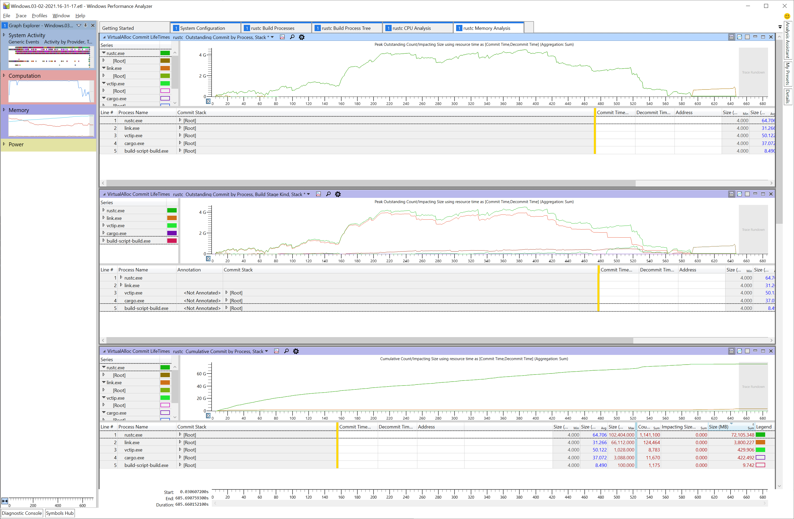

다음으로 WPA가 Rust 스택 트레이스를 정확히 데맹글링할 수 있도록 디버그 심볼을 로드하고 처리하도록 지시해야 합니다.
상단 메뉴에서 "Trace"를 클릭한 다음 "Load Symbols"를 선택하세요.
이 단계는 시간이 다소 걸릴 수 있습니다.

WPA가 rustc 심볼 로딩을 완료하면 rustc.exe 노드를 확장하고 가장 큰 메모리가 할당된 스택 영역을 추적할 수 있습니다.

이를 위해 "Commit Stack" 컬럼의 `[Root]` 노드를 확장하고 유의미한 스택 프레임을 찾을 때까지 하위 항목을 계속 확장하세요.

> 팁: 확장할 노드를 선택한 상태에서 오른쪽 화살표 키를 누르면 해당 노드가 펼쳐지면서 펼쳐진 집합 중 그 다음으로 큰 노드로 선택이 자동 이동합니다. 원하는 스택 프레임에 도달할 때까지 오른쪽 화살표 키를 연속해서 누르면 됩니다.

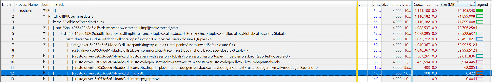

이 샘플에서는 프로파일 전반에 걸쳐 codegen을 통한 호출이 총 약 30GB의 메모리를 할당하고 있음을 확인할 수 있습니다.

#### 기타 분석 탭

프로파일에는 유용하게 활용할 수 있는 몇 가지 다른 탭도 포함되어 있습니다:

- System Configuration
    - 캡처가 기록된 시스템 환경의 일반 정보.
- rustc Build Processes
    - rustc.exe, cargo.exe, link.exe 등 관련 프로세스의 단순 목록.
    - 각 프로세스별 커맨드라인 인자 출력.
    - 특정 rustc 프로세스가 구체적으로 어떤 작업을 수행하고 있었는지 파악할 때 유용함.
- rustc Build Process Tree
    - 프로세스의 시작 및 종료 시점을 보여주는 타임라인 트리를 제공.
- rustc CPU Analysis
    - rustc 내부의 핫스팟을 보여주도록 사전 구성된 차트 포함.
    - rustc가 주로 실행 시간을 소비하는 위치 분석을 지원함.
- rustc Memory Analysis
    - rustc가 메모리를 할당하는 지점을 보여주도록 사전 구성된 차트 포함.


### Profiling with rustc-perf {#profiling-with-rustc-perf}

The [Rust benchmark suite][rustc-perf] provides a comprehensive way of profiling and benchmarking
the Rust compiler.
You can find instructions on how to use the suite in its [manual][rustc-perf-readme].

However, using the suite manually can be a bit cumbersome.
To make this easier for `rustc` contributors,
the compiler build system (`bootstrap`) also provides built-in integration with the benchmarking suite,
which will download and build the suite for you, build a local compiler toolchain and let you profile it using a simplified command-line interface.

You can use the `./x perf <command> [options]` command to use this integration.

You can use normal bootstrap flags for this command, such as `--stage 1` or `--stage 2`, for example to modify the stage of the created sysroot. It might also be useful to configure `bootstrap.toml` to better support profiling, e.g. set `rust.debuginfo-level = 1` to add source line information to the built compiler.

`x perf` currently supports the following commands:
- `benchmark <id>`: Benchmark the compiler and store the results under the passed `id`.
- `compare <baseline> <modified>`: Compare the benchmark results of two compilers with the two passed `id`s.
- `eprintln`: Just run the compiler and capture its `stderr` output.
  Note that the compiler normally does not print
  anything to `stderr`, so you might want to add some `eprintln!` calls to get any output.
- `samply`: Profile the compiler using the [samply][samply] sampling profiler.
- `cachegrind`: Use [Cachegrind][cachegrind] to generate a detailed simulated trace of the compiler's execution.

> 프로파일러에 관한 자세한 설명은 [`rustc-perf` 매뉴얼][rustc-perf-readme-profilers]을 참조하세요.

`x perf` 명령에 수트에서 제공하는 `profile_local` 및 `bench_local` 옵션에 반응하는 다음 옵션들을 사용할 수 있습니다:

- `--include`: 프로파일링/벤치마킹할 대상 벤치마크 선택.
- `--profiles`: 프로파일링/벤치마킹할 대상 프로파일(`Check`, `Debug`, `Opt`, `Doc`) 선택.
- `--scenarios`: 프로파일링/벤치마킹할 대상 시나리오(`Full`, `IncrFull`, `IncrPatched`, `IncrUnchanged`) 선택.

#### 외부 크레이트 프로파일링 diff 예시
외부 크레이트에 대해 컴파일러 두 커밋 간의 로컬 프로파일링 diff를 생성하는 것은 유용한 작업입니다.
시작하려면 `rustc-perf` 저장소에서 벤치마크를 구동하는 collector를 빌드합니다:
```
cargo build --release -p collector
```
빌드된 collector 바이너리를 cargo를 사용해 실행합니다.
이 도구는 다음 인자들을 요구합니다:
- `<PROFILE>`: 성능 측정 방식에 대한 프로파일러 선택 (이 예시에서는 Cachegrind 사용).
- `<RUSTC>`: 벤치마킹할 Rust 컴파일러 리비전 (`rust-lang/rust` 커밋 SHA).
선택 인자를 사용하여 앞서 언급된 프로파일 및 시나리오를 지정할 수 있습니다.
필수 및 선택 인자에 대한 자세한 내용은 [rustc-perf-readme-profilers]에서 확인할 수 있습니다.

`rust-lang/rust` 저장소의 두 커밋 `<SHA1>`과 `<SHA2>`에 대해 `serde_derive-1.0.136` 크레이트의 프로파일 diff를 생성하는 명령어는 다음과 같습니다:
```
cargo run --release --bin collector profile_local cachegrind +<SHA1> --rustc2 +<SHA2> --exact-match serde_derive-1.0.136 --profiles Check --scenarios IncrUnchanged
```


[samply]: https://github.com/mstange/samply
[cachegrind]: https://www.cs.cmu.edu/afs/cs.cmu.edu/project/cmt-40/Nice/RuleRefinement/bin/valgrind-3.2.0/docs/html/cg-manual.html
[rustc-perf]: https://github.com/rust-lang/rustc-perf
[rustc-perf-readme]: https://github.com/rust-lang/rustc-perf/blob/master/collector/README.md
[rustc-perf-readme-profilers]: https://github.com/rust-lang/rustc-perf/blob/master/collector/README.md#profiling-local-builds


## crates.io 의존성 {#crates-io}

Rust 컴파일러는 `crates.io`의 일부 외부 의존성을 포함하여 빌드하는 것을 지원합니다.

Rust Forge에는 [새로운 의존성을 검증하기 위한 공식 정책]이 마련되어 있습니다.

### 허용된 의존성

`tidy` 도구는 [허용된 크레이트 목록]을 보유하고 있습니다.
컴파일러에 아직 포함되지 않은 신규 의존성을 추가하려는 경우 이 목록에 해당 크레이트를 추가해야 합니다.

[허용된 크레이트 목록]: https://github.com/rust-lang/rust/blob/9d1b2106e23b1abd32fce1f17267604a5102f57a/src/tools/tidy/src/deps.rs#L73
[새로운 의존성을 검증하기 위한 공식 정책]: https://forge.rust-lang.org/compiler/third-party-out-of-tree#third-party-crates


# Rust 프로젝트에 기여하기

## 기여 절차 {#contributing}

### 버그 리포트 작성

버그는 아쉽지만 소프트웨어 개발에서 피할 수 없는 현실입니다.
제보되지 않은 오류는 수정할 수 없으므로 문제 발견 시 아낌없이 리포트를 작성해 주세요. 버그인지 확실하지 않은 경우라도 부담 없이 이슈를 생성하셔도 됩니다.

**발견한 버그가 Rust 사용자에게 보안 위험을 야기할 수 있다고 판단되는 경우, [보안 취약점 제보 지침][vuln]을 따라 제출해 주세요.**

[vuln]: https://www.rust-lang.org/policies/security

나이틀리 채널을 사용 중이라면 버그 리포트를 작성하기 전에 최신 툴체인 버전에서도 해당 버그가 재현되는지 먼저 확인해 보세요. 이미 해결된 이슈일 수 있습니다.

버그를 제보하기 전 여건이 된다면 [기존 이슈들을 탐색]해 보세요. 이미 다른 사용자가 동일한 오류를 보고했을 가능성이 있습니다.
검색 키워드를 잡기 어려울 수 있으므로 필수는 아닌 추가 권장사항입니다. 실수로 중복 이슈를 작성하시더라도 괜찮습니다.

마찬가지로 동일한 버그를 겪은 다른 사용자가 작성한 이슈를 쉽게 찾을 수 있도록 고유한 정보를 담은 명확한 제목으로 작성해 주세요. 제목에는 사용된 언어/컴파일러 기능, 버그 발생 조건, 오류 메시지 일부 등이 포함될 수 있습니다.
예시: **"impossible case reached" on lifetime inference for impl Trait in return position**.

[이슈 생성 링크][create an issue]를 클릭하고 구비된 템플릿 항목을 작성하면 쉽게 이슈를 등록할 수 있습니다.

### 버그 수정 또는 일반적인 코드 변경

대부분의 PR에는 특별한 절차가 요구되지 않습니다.
[PR을 작성]하면 리뷰, 승인 및 머지 프로세스가 바로 진행됩니다. 이 절차에는 대다수의 버그 수정, 리팩터링 및 사용자에게 노출되지 않는 변경사항이 포함됩니다.
이후 섹션에서는 이 규칙의 예외 사항을 설명합니다.

또한 진행 중인 WIP PR이나 GitHub [Draft PR]을 작성하는 것도 완전히 허용됩니다.
개발 과정에서 조기에 피드백을 얻거나 협력자와 코드를 공유하기 위해 이를 선호하는 기여자들이 있습니다.
(느린 개발 머신 환경 등에서) CI를 이용해 PR을 빌드하고 테스트하기 위해 Draft PR을 활용하는 경우도 있습니다.

[PR을 작성]: #pull-requests
[Draft PR]: https://github.blog/2019-02-14-introducing-draft-pull-requests/

### 신규 기능 추가

Rust는 강력한 하위 호환성을 보증합니다.
따라서 신규 기능이 곧바로 안정판(stable) Rust에 구현될 수 없으며 stable, beta, nightly 3가지 릴리스 채널을 거치게 됩니다.
See [The Rust Book] for more details on Rust’s train release model.

- **Stable**: this is the latest stable release for general usage.
- **Beta**: this is the next release (will be stable within 6 weeks).
- **Nightly**: follows the `main` branch of the repo.
  This is the only channel where unstable features are intended to be used,
  which happens via opt-in feature gates.

See [this chapter on implementing new features](#implementing-new-features) for more
information.

[The Rust Book]: https://doc.rust-lang.org/book/appendix-07-nightly-rust.html

#### Breaking changes

Breaking changes have a [dedicated section][Breaking Changes] in the dev-guide.

#### Major changes

The compiler team has a special process for large changes, whether or not they cause breakage.
이 절차를 Major Change Proposal (MCP)이라 부릅니다.
MCP는 컴파일러에 대한 대규모 변경사항에 대해 (완전한 RFC나 팀 디자인 미팅에 비해) 유연하게 피드백을 수집할 수 있는 경량화된 메커니즘입니다.

MCP 제출이 요구될 수 있는 변경 예시에는 대규모 리팩터링, 핵심 타입 구조 변경, 컴파일러 내부 구동 방식의 주요 변경, 또는 소규모 사용자 노출 변경사항이 포함됩니다.

**확신이 서지 않는 경우 [Zulip에서 문의]하세요.
많은 노력을 기울인 PR이 머지되지 못하는 안타까운 상황을 방지할 수 있습니다!** MCP에 대한 자세한 정보는 [이 문서][mcpinfo]를 참조하세요.

[mcpinfo]: https://forge.rust-lang.org/compiler/proposals-and-stabilization.html#how-do-i-submit-an-mcp
[Zulip에서 문의]: https://rust-lang.zulipchat.com/#narrow/stream/131828-t-compiler

#### 컴파일러 성능

컴파일러 성능은 매우 중요합니다.
지난 몇 년간 컴파일러 성능을 [지속적으로 개선][perfdash]하기 위해 많은 노력이 투자되었습니다.

[perfdash]: https://perf.rust-lang.org/dashboard.html

작성한 변경사항이 성능 저하(또는 향상)를 야기할 것으로 의심되는 경우 "perf run"을 요청할 수 있으며 (리뷰어가 승인 전 요청할 수도 있음), 벤치마크 봇이 해당 변경이 적용된 컴파일러로 벤치마크를 수행합니다.
수치 결과는 [여기][perf]에 보고되어 최신 `main` 커밋 대비 변경 수치를 대조할 수 있습니다.

> rustc 개발 시에도 유용한 Rust 코드 성능에 관한 일반 가이드는 [Rust Performance Book]을 참조하세요.

[perf]: https://perf.rust-lang.org
[Rust Performance Book]: https://nnethercote.github.io/perf-book/

### 풀 리퀘스트 (Pull Requests)

풀 리퀘스트(PR)는 Rust 코드를 변경하는 핵심 메커니즘입니다.
GitHub 자체에 풀 리퀘스트 기능에 대한 [훌륭한 문서][about-pull-requests]가 구비되어 있습니다.
우리는 기여자가 개인 포크(fork)에 변경사항을 푸시하고 소스 저장소로 제출하는 ["포크 앤 풀(fork and pull)" 모델][development-models]을 사용합니다.
Rust 기여 시 Git 활용법은 [해당 챕터](#git)를 참조하세요.

> **대규모, 복잡, 전역적, 또는 전문 분야에 특화된 변경을 작성할 때의 조언**
>
> 로테이션 담당 컴파일러 리뷰어들은 각자 잘 아는 영역과 다소 생소한 영역이 존재합니다. PR이 대규모이거나, 복잡하거나, 여러 영역에 걸쳐 있거나, 고도의 전역 영역에 특화된 변경을 포함한다면 해당 PR 전체를 검토하기에 적합한 리뷰어를 지정하기가 매우 어려워집니다. 이는 표준 라이브러리 팀과 같이 다른 팀 리뷰어의 권한 영역이 함께 포함된 경우에도 동일하게 적용됩니다. [트라이아지 봇][triagebot]이 수정된 파일 경로를 바탕으로 관련 팀에 알림을 보내고 사전 알림을 설정한 담당자들을 핑합니다.
>
> 이러한 대형 변경 작업을 시작하기 전 **컴파일러 팀(및 관련 승인 팀)과 미리 변경안을 충분히 논의**하고, **검토하기 어려운 거대한 PR을 개별 검토 가능한 소규모 PR 시리즈로 나눌 수 있는지** 협력받는 것을 강력히 권장합니다.
>
> [Zulip의 #t-compiler 스레드][t-compiler]를 생성하여 컴파일러 팀과 사전에 소통할 수 있습니다.
>
> 컴파일러 팀과 사전에 소통하면 다음과 같은 장점이 있습니다:
>
> 1. PR이 적시에 검토될 가능성이 크게 높아집니다.
>     - 실제 PR을 열기 *전에* 적절한 리뷰어를 지정받거나, 절차 안내 및 try 작업/perf run/crater run 구동을 지원할 담당 조율자를 찾을 수 있습니다.
> 2. 컴파일러 팀이 변경사항을 추적하는 데 도움이 됩니다.
> 3. 변경 방향이 컴파일러 팀의 지향점과 일치하는지 조기에 지속적으로 검증받을 수 있습니다.
> 4. 컴파일러 팀이 수용하기 어려운 거대 변경에 엄청난 시간과 노력을 헛되이 투자하거나, 뒤늦게 수용 불가능한 방향임을 알게 되는 안타까운 상황을 방지할 수 있습니다.

[about-pull-requests]: https://docs.github.com/en/pull-requests/collaborating-with-pull-requests/proposing-changes-to-your-work-with-pull-requests/about-pull-requests
[development-models]: https://docs.github.com/en/pull-requests/collaborating-with-pull-requests/getting-started/about-collaborative-development-models#fork-and-pull-model
[t-compiler]: https://rust-lang.zulipchat.com/#narrow/stream/131828-t-compiler
[triagebot]: https://github.com/rust-lang/rust/blob/HEAD/triagebot.toml

#### 브랜치 최신 상태 유지하기

rust-lang/rust의 CI 파이프라인은 기여자의 브랜치가 기반한 커밋이 아닌 최신 `main` 커밋에 기여자의 패치를 직접 적용하여 빌드합니다.
따라서 명시적인 머지 충돌이 없더라도 브랜치가 구형 상태라면 예기치 않은 CI 실패가 발생할 수 있습니다.

충돌이 발생하거나, 상류 CI가 깨져 그린 PR이 차단되거나, 메인테이너의 요청이 있는 등 꼭 필요한 경우에만 브랜치를 갱신하세요.
이미 통과(green)된 PR에 대해 리뷰 도중 불필요한 브랜치 갱신을 자제해 주세요.
리뷰 진행 중에는 피드백 반영을 위해 단편적인 증분 커밋을 추가하고, 최종 승인 시점이나 리뷰어 요청 시에만 스쿼시/리베이스를 수행하는 것이 좋습니다.

브랜치를 갱신할 때는 `git push --force-with-lease` 명령을 사용하고 변경 내용을 간략한 댓글로 남기세요. 저장소 규칙에 따라 리베이스 대신 `upstream/main` 머지를 선호할 수 있으므로 프로젝트 관례를 따르세요. 상세 안내는 [최신 상태 유지하기](#keeping-things-up-to-date)를 참조하세요.

리베이스를 마친 뒤 CI가 구동되기 전 [관련 테스트를 로컬에서 구동](#tests-intro)하여 문제를 조기 포착하는 것이 좋습니다.

#### r? (리뷰어 지정)

모든 풀 리퀘스트는 다른 담당자의 검토를 거칩니다.
자동 봇인 [@rustbot]이 수정된 파일 경로에 기초하여 무작위로 리뷰 담당자를 지정해 줍니다.

특정인에게 리뷰를 직접 요청하려는 경우 PR 설명란이나 댓글에 `r?`을 추가할 수 있습니다.
예를 들어 @awesome-reviewer에게 리뷰를 요청하려면 다음과 같이 기재합니다:
add the following to the end of the pull request description:

    r? @awesome-reviewer

[@rustbot] will then assign the PR to that reviewer instead of a random person.
This is entirely optional.

You can also assign a random reviewer from a specific team by writing `r? rust-lang/groupname`.
As an example, if you were making a diagnostics change,
you could get a reviewer from the diagnostics team by adding:

    r? rust-lang/diagnostics

For a full list of possible `groupname`s,
check the `adhoc_groups` section at the [triagebot.toml config file],
or the list of teams in the [rust-lang teams database].

#### Waiting for reviews

> NOTE
>
> Pull request reviewers are often working at capacity,
> and many of them are contributing on a volunteer basis.
> In order to minimize review delays,
> pull request authors and assigned reviewers should ensure that the review label
> (`S-waiting-on-review` and `S-waiting-on-author`) stays updated,
> invoking these commands when appropriate:
>
> - `@rustbot author`:
>   the review is finished,
>   and PR author should check the comments and take action accordingly.
>
> - `@rustbot review`:
>   the author is ready for a review,
>   and this PR will be queued again in the reviewer's queue.

리뷰어 역시 개인 여유 시간을 쪼개어 `rustc` 개발을 돕는 봉사자라는 점을 유념해 주세요.
따라서 PR 응답과 리뷰까지 어느 정도의 시간이 소요될 수 있습니다.
또한 누락에 의해 할당된 PR의 검토가 지연될 수 있습니다.

PR이 원활히 진행되도록 하기 위해 트라이아지 작업 그룹(Triage WG)은 2주 이상 논의가 진행되지 않은 리뷰 대기 PR을 정기적으로 점검합니다.
2주 이내에 리뷰가 이루어지지 않으면 Zulip의 트라이아지 WG([#t-release/triage]) 채널에 편하게 안내를 요청해 보세요.
담당자 핑 시점이나 휴가 상태 등을 파악하고 조치해 줄 것입니다.

리뷰어는 GitHub 코드 리뷰 인터페이스를 통해 변경을 요청할 수 있습니다.
또한 일부 PR에 대해 특수 검증 절차를 요구할 수도 있습니다.
이러한 절차의 예시는 [Crater] 및 [Breaking Changes] 챕터를 참조하세요.

[r?]: https://github.com/rust-lang/rust/pull/78133#issuecomment-712692371
[#t-release/triage]: https://rust-lang.zulipchat.com/#narrow/stream/242269-t-release.2Ftriage
[Crater]: #tests-crater

#### 지속적 통합 (CI)

사람에 의한 코드 리뷰 외에도 풀 리퀘스트는 지속적 통합(CI) 시스템에 의해 자동 테스트됩니다.
PR을 개설하거나 갱신할 때마다 CI가 컴파일러를 빌드하고 [컴파일러 테스트 수트]에 맞춰 테스트하며 Rust 코드 스타일 지침 준수 여부 등을 검증합니다.

지속적 통합 테스트를 구동함으로써 PR 작성자는 1차 리뷰 과정을 거치기 전에 오류를 조기 포착할 수 있고, 리뷰어 역시 해당 PR의 상태를 손쉽게 확인할 수 있습니다.

Rust는 충분한 CI 컴퓨팅 자원을 갖추고 있으므로 푸시할 때마다 자원이 낭비될까 걱정하실 필요가 전혀 없습니다.
생산성을 높이기 위해 변경사항 테스트에 CI를 적극적으로 활용하시는 것을 권장합니다.
특히 전체 `./x test` 수트를 로컬에서 무작정 실행하면 엄청난 시간이 소요되므로 비권장합니다.
CI를 활용한 테스트 방법은 [CI로 테스트하기] 챕터를 참조하세요.

[CI로 테스트하기]: #testing-with-ci

#### r+ (승인 및 머지)

리뷰어가 풀 리퀘스트 검토를 완료하면 PR에 `r+` 주석을 추가합니다.
형태는 다음과 같습니다:

    @bors r+

이 주석은 통합 봇인 [@bors]에게 해당 PR이 최종 승인되었음을 알립니다.
이후 PR은 머지 대기열([merge queue])에 진입하며 [@bors]가 지원하는 모든 플랫폼에서 *전체* 테스트 수트를 실행합니다.
모든 플랫폼 테스트를 통과하면 [@bors]가 코드를 `main` 브랜치로 자동 머지하고 PR을 닫습니다.

변경 규모에 따라 다음과 같이 약간 다른 형식의 `r+`가 사용될 수 있습니다:

    @bors r+ rollup

`rollup` 접미사는 [@bors]에게 이 변경을 항상 다른 PR들과 "묶어서(rolled up)" 통합하도록 지시합니다.
롤업된 변경사항은 프로세스 속도를 높이기 위해 다른 PR들과 함께 번들로 테스트 및 머지됩니다.
보통 서로 충돌을 일으키지 않는 소규모 변경에 한해 "always roll up" 설정이 적용됩니다.

머지 대기열이 길어지면 처리에 시간이 소요될 수 있으므로 여유 있게 기다려 주세요.
참고로 PR 코드는 절대로 사람이 직접 수동 머지하지 않습니다.

[@rustbot]: https://github.com/rustbot
[@bors]: https://github.com/rust-lang/bors

#### PR 제출하기

이제 풀 리퀘스트(PR)를 제출할 준비가 되었나요?
좋습니다! 제출 전 확인해야 할 몇 가지 사항입니다.

다른 브랜치를 지정해야 할 명확한 사유가 없는 한 모든 PR은 `main` 브랜치를 대상으로 제출해야 합니다.

PR을 제출하기 전 스타일 검사를 구동하세요:

    ./x test tidy --bless

매 PR 제출 전(및 PR 내의 매 신규 커밋 전)에 이 검사를 실행하는 것을 권장합니다. git 커밋 전 자동 실행되도록 [git hooks]를 설정할 수도 있습니다. CI에서도 tidy를 실행하며 통과하지 못하면 빌드가 실패합니다.

Rust는 _병합 커밋 미사용 정책(no merge-commit policy)_을 따릅니다.
즉 머지 충돌이 발생할 경우 merge 커밋을 생성하지 말고 항상 리베이스(rebase)를 수행해야 합니다.
예를 들어 `main` 브랜치의 최신 변경사항을 기능 브랜치로 가져올 때 항상 rebase를 사용하세요.
PR에 병합 커밋이 포함되어 있으면 `has-merge-commits` 라벨이 지정됩니다.
인터랙티브 리베이스 등을 통해 병합 커밋을 제거한 후에는 라벨을 다시 제거해야 합니다:

    @rustbot label -has-merge-commits

상세한 내용은 [해당 챕터][labeling]를 참조하세요.

머지 충돌이 발생하거나 리뷰어가 수정을 요청하면 PR 상태가 `S-waiting-on-author`로 변경됩니다.
수정을 완료한 후에는 `@rustbot`을 사용하여 리뷰 대기 상태(`S-waiting-on-review`)로 다시 전환해야 합니다:

    @rustbot ready

GitHub은 [키워드를 통한 이슈 자동 닫기][closing-keywords] 기능을 제공합니다.
이 기능은 이슈 트래커를 깔끔하게 관리하는 데 유용하지만, "closes #123" 텍스트는 커밋 메시지보다는 PR 설명란에 적는 것이 일반적으로 선호됩니다.
particularly during rebasing, citing the issue number in the commit can "spam"
the issue in question.

However, if your PR fixes a stable-to-beta or stable-to-stable regression and has
been accepted for a beta and/or stable backport (i.e., it is marked `beta-accepted`
and/or `stable-accepted`), please do *not* use any such keywords since we don't
want the corresponding issue to get auto-closed once the fix lands on `main`.
Please update the PR description while still mentioning the issue somewhere.
For example, you could write `Fixes (after beta backport) #NNN.`.

As for further actions, please keep a sharp look-out for a PR whose title begins with
`[beta]` or `[stable]` and which backports the PR in question.
When that one gets merged, the relevant issue can be closed.
The closing comment should mention all PRs that were involved.
If you don't have the permissions to close the issue, please
leave a comment on the original PR asking the reviewer to close it for you.

[labeling]: #issue-relabeling
[closing-keywords]: https://docs.github.com/en/issues/tracking-your-work-with-issues/linking-a-pull-request-to-an-issue

#### Reverting a PR

When a PR leads to miscompile, significant performance regressions, or other critical issues, we may
want to revert that PR with a regression test case.
You can also check out the [revert policy] on
Forge 문서([리버트 정책])를 참조할 수 있습니다 (주로 리뷰어용이지만 PR 작성자에게도 유용한 정보를 포함함).

PR에 포함된 변경이 너무 광범위한 경우 되돌리기(revert)가 어려워져 후속 패치 리뷰가 까다로워질 수 있습니다.
또한 해당 PR의 코드를 후속 PR들이 강력히 의존하는 경우 되돌리기가 거의 불가능해집니다.

이러한 케이스의 경우 [#128271][#128271] 예시처럼 문제가 되는 코드만 식별하여 특정 입력 조건에서 비활성화시키는 방식을 선택할 수 있습니다.

MIR 최적화의 경우 [#132356][#132356] 예시처럼 `-Zunsound-mir-opt` 옵션을 사용해 mir-opt를 게이팅(gating)할 수도 있습니다.

[리버트 정책]: https://forge.rust-lang.org/compiler/reviews.html?highlight=revert#reverts
[#128271]: https://github.com/rust-lang/rust/pull/128271
[#132356]: https://github.com/rust-lang/rust/pull/132356

### 외부 의존성

이 섹션은 ["외부 저장소 활용하기"](#external-repos)로 이동되었습니다.

### 문서 작성하기

문서 개선 기여는 언제나 환영합니다.
`doc.rust-lang.org` 사이트 소스는 소스 트리 내 [`src/doc`] 경로에 위치하며, 표준 API 문서는 소스 코드 자체([`library/std/src/lib.rs`][std-root] 등)에서 자동 생성됩니다. 문서 관련 풀 리퀘스트도 다른 일반 PR과 동일한 방식으로 처리됩니다.

[`src/doc`]: https://github.com/rust-lang/rust/tree/HEAD/src/doc
[std-root]: https://github.com/rust-lang/rust/blob/HEAD/library/std/src/lib.rs#L1

문서 관련 이슈를 탐색하려면 [A-docs 라벨]을 확인하세요.

문서 작성 스타일 지침은 [RFC 1574]에서 확인할 수 있습니다.

표준 라이브러리 문서를 빌드하려면 `x doc --stage 1 library --open` 명령을 실행하세요.
특정 북 문서(예: unstable book)를 빌드하려면 `x doc src/doc/unstable-book` 명령을 구동합니다.
결과물은 `build/host/doc`에 생성되며 기본 브라우저로 자동 열립니다. 자세한 정보는 [문서 빌드하기](#building-documentation) 섹션을 참조하세요.

작은 수정사항을 검증할 때는 `rustdoc`을 직접 사용할 수도 있습니다.
예를 들어 `rustdoc src/doc/reference.md`는 레퍼런스 문서를 `doc/reference.html` 파일로 렌더링합니다. CSS 스타일이 누락되어 보일 수 있지만 HTML 구조 정합성은 확인할 수 있습니다.

참고로 **내부 문서(internal documentation)**에 대한 단순 오탈자/맞춤법 수정 단독 PR은 검토 시간 대비 이점이 낮아 수용되지 않습니다.
내부 문서 예시에는 코드 주석 및 rustc 내부 API 문서 등이 포함됩니다. 단, 동일 PR에 다른 유의미한 코드 개선이 함께 포함되어 있다면 오탈자 수정도 환영받습니다.

#### rustc-dev-guide에 기여하기

[rustc-dev-guide]에 대한 기여는 언제나 환영하며 [rust-lang/rustc-dev-guide 저장소][rdgrepo]에서 직접 진행할 수 있습니다.
해당 저장소의 이슈 트래커는 개선 작업 대상을 탐색하는 훌륭한 길잡이입니다. 초보자와 숙련자 컴파일러 개발자 모두를 위한 이슈가 두루 준비되어 있습니다!

작성 시 유의해야 할 몇 가지 지침:

- 과도하게 긴 라인을 피하고 의미 단위 줄바꿈(문장이 끝나는 시점마다 라인을 구분하는 방식)을 사용하는 것을 권장합니다. 라인 길이에 대한 엄격한 글자 수 제한은 없으며, 개별 문장이나 의미 단락이 동일 라인에서 자연스럽게 종결되도록 유도합니다.

  `ci/sembr` 디렉터리의 도구를 사용해 이를 지원받을 수 있습니다. 도움말 출력 명령어:

  ```console
  cargo run --manifest-path ci/sembr/Cargo.toml -- --help
  ```

- 가이드 문서에 텍스트를 기여할 때는 독자가 정보의 신뢰 기간을 파악할 수 있도록 특정 시점/사유 맥락을 함께 작성해 주세요. 적절한 맥락 정보를 제공하기 위해 다음 항목을 고려하세요:

  - 지속적인 프로젝트 변화 외에 해당 텍스트가 오래되어 변경될 수 있는 구체적 사유.

  - 주석 작성 날짜 표기. 예를 들어 _"현재는..."_ 또는 _"지금 기준으로는..."_과 같은 추상적 표현 대신 다음 포맷으로 구체적인 날짜를 포함하세요:
    - Jan 2021
    - January 2021
    - jan 2021
    - january 2021

    CI 액션(`.github/workflows/date-check.yml`)이 6개월 이상 지난 날짜 항목을 감지하여 월간 리포트를 작성합니다 ([예시 리포트](https://github.com/rust-lang/rustc-dev-guide/issues/2052)).

    CI가 날짜를 인식할 수 있도록 날짜 지정 전 특수 주석 주석을 명시하세요:

    ```md
    <!-- date-check --> Jul 2026
    ```

    예시:

    ```md
    As of <!-- date-check --> Jul 2026, the foo did the bar.
    ```

    렌더링된 문서에 날짜가 노출되지 않기를 바라는 경우 다음 주석 형태를 사용하세요:

    ```md
    <!-- date-check: Jul 2026 -->
    ```

  - 관련 WG, 트래킹 이슈, `rustc` rustdoc 페이지 등의 링크를 첨부하여 변경 프로세스에 대한 세부 설명과 정보 만료 여부를 검증할 수 있는 수단을 제공하세요.

- Use sentence case for chapter and sections titles.

- Use dashes (`-`) to separate words file names.

##### ⚠️ Note: Where to contribute `rustc-dev-guide` changes

For detailed information about where to contribute rustc-dev-guide changes and the benefits of doing so,
see [the rustc-dev-guide team documentation].

### Issue triage

Please see <https://forge.rust-lang.org/release/issue-triaging.html>.

[stable-]: https://github.com/rust-lang/rust/labels?q=stable
[beta-]: https://github.com/rust-lang/rust/labels?q=beta
[I-\*-nominated]: https://github.com/rust-lang/rust/labels?q=nominated
[I-prioritize]: https://github.com/rust-lang/rust/labels/I-prioritize
[tracking issues]: https://github.com/rust-lang/rust/labels/C-tracking-issue
[beta-backport]: https://forge.rust-lang.org/release/backporting.html#beta-backporting-in-rust-langrust
[stable-backport]: https://forge.rust-lang.org/release/backporting.html#stable-backporting-in-rust-langrust
[metabug]: https://github.com/rust-lang/rust/labels/metabug
[regression-]: https://github.com/rust-lang/rust/labels?q=regression
[relnotes]: https://github.com/rust-lang/rust/labels/relnotes
[S-tracking-]: https://github.com/rust-lang/rust/labels?q=s-tracking
[the rustc-dev-guide team documentation]: https://forge.rust-lang.org/rustc-dev-guide/index.html#where-to-contribute-rustc-dev-guide-changes

#### rfcbot 라벨

[rfcbot]은 변경 승인 또는 거부와 같은 비동기적 의사 결정 프로세스를 추적하기 위해 전용 라벨을 사용합니다.
이 기능은 [RFC], 이슈 및 풀 리퀘스트 전반에 사용됩니다.

| 라벨 | 색상 | 설명 |
|---|---|---|
| [proposed-final-comment-period] | <span class="label-color" style="background-color:#ededed;">&#x2003;</span>&nbsp; 회색 | 최종 의견 수렴 기간(FCP)에 진입하기 위해 모든 팀원의 승인을 대기 중인 상태. |
| [disposition-merge] | <span class="label-color" style="background-color:#008800;">&#x2003;</span>&nbsp; 초록색 | 변경사항을 병합(merge)하겠다는 의사를 표시함. |
| [disposition-close] | <span class="label-color" style="background-color:#dd0000;">&#x2003;</span>&nbsp; 빨간색 | 변경사항을 수용하지 않고 이슈/PR을 닫겠다는 의사를 표시함. |
| [disposition-postpone] | <span class="label-color" style="background-color:#ededed;">&#x2003;</span>&nbsp; 회색 | 당장 변경을 수용하지 않고 추후로 연기하겠다는 의사를 표시함. |
| [final-comment-period] | <span class="label-color" style="background-color:#1e76d9;">&#x2003;</span>&nbsp; 파란색 | 병합 또는 종결 전 최종 의견을 수렴 중인 상태. |
| [finished-final-comment-period] | <span class="label-color" style="background-color:#f9e189;">&#x2003;</span>&nbsp; 연노랑색 | 최종 의견 수렴 기간이 종료되어 이슈가 병합 또는 종결될 상태. |
| [postponed] | <span class="label-color" style="background-color:#fbca04;">&#x2003;</span>&nbsp; 노란색 | 이슈 처리가 연기되었음을 나타냄. |
| [closed] | <span class="label-color" style="background-color:#dd0000;">&#x2003;</span>&nbsp; 빨간색 | 이슈 제안이 거부되었음을 나타냄. |
| [to-announce] | <span class="label-color" style="background-color:#ededed;">&#x2003;</span>&nbsp; 회색 | FCP가 완료되어 대외적으로 공지되어야 할 이슈. (참고: rust-lang/rust 저장소에서는 트라이아지 미팅 시 발표할 이슈 라벨로 이 항목을 다르게 활용함). |

[disposition-merge]: https://github.com/rust-lang/rust/labels/disposition-merge
[disposition-close]: https://github.com/rust-lang/rust/labels/disposition-close
[disposition-postpone]: https://github.com/rust-lang/rust/labels/disposition-postpone
[proposed-final-comment-period]: https://github.com/rust-lang/rust/labels/proposed-final-comment-period
[final-comment-period]: https://github.com/rust-lang/rust/labels/final-comment-period
[finished-final-comment-period]: https://github.com/rust-lang/rust/labels/finished-final-comment-period
[postponed]: https://github.com/rust-lang/rfcs/labels/postponed
[closed]: https://github.com/rust-lang/rfcs/labels/closed
[to-announce]: https://github.com/rust-lang/rfcs/labels/to-announce
[rfcbot]: https://github.com/anp/rfcbot-rs/
[RFC]: https://github.com/rust-lang/rfcs

### 유용한 링크 및 정보

이 섹션은 ["가이드 소개"] 챕터로 이동되었습니다.

["가이드 소개"]: #other-places-to-find-information
[기존 이슈들을 탐색]: https://github.com/rust-lang/rust/issues?q=is%3Aissue
[Breaking Changes]: #bug-fix-procedure
[triagebot.toml config file]: https://github.com/rust-lang/rust/blob/HEAD/triagebot.toml
[rust-lang teams database]: https://github.com/rust-lang/team/tree/HEAD/teams
[컴파일러 테스트 수트]: #tests-intro
[merge queue]: https://bors.rust-lang.org/queue/rust
[git hooks]: https://git-scm.com/book/en/v2/Customizing-Git-Git-Hooks
[A-docs 라벨]: https://github.com/rust-lang/rust/issues?q=is%3Aopen%20is%3Aissue%20label%3AA-docs
[RFC 1574]: https://github.com/rust-lang/rfcs/blob/master/text/1574-more-api-documentation-conventions.md#appendix-a-full-conventions-text
[rustc-dev-guide]: https://rustc-dev-guide.rust-lang.org/
[rdgrepo]: https://github.com/rust-lang/rustc-dev-guide
[이슈 생성 링크]: https://github.com/rust-lang/rust/issues/new/choose


## 컴파일러 팀 소개 {#compiler-team}

> **참고**:
> 팀에 대한 상세 정보는 [Forge 페이지]에 정리되어 있으며 아래 설명의 대부분은 구형 정보입니다.

rustc는 [Rust 컴파일러 팀][team]에 의해 유지 관리됩니다.
팀에 속한 멤버들은 다함께 회귀 버그를 추적하고 신규 기능을 구현합니다.
Rust 컴파일러 팀 멤버는 rustc 발전 및 설계에 실질적이고 유의미한 기여를 한 분들로 구성됩니다.

[Forge 페이지]: https://forge.rust-lang.org/compiler
[team]: https://www.rust-lang.org/governance/teams/compiler

### 토론 채널

현재 컴파일러 팀은 Zulip에서 대화를 나눕니다:

- 팀 대화는 Zulip 인스턴스의 [`t-compiler`][zulip-t-compiler] 스트림에서 진행됩니다.
- rustc 개발 관련 질문과 도움을 요청할 수 있는 [`t-compiler/help`][zulip-help], 주간 트라이아지 및 스티어링 미팅이 열리는 [`t-compiler/meetings`][zulip-meetings] 등 관련 Zulip 채널들이 다양하게 운영됩니다.

### 리뷰어 지도

컴파일러의 특정 영역에 대해 질문에 답해줄 수 있는 담당자를 찾거나 누가 어떤 영역을 다루는지 확인하고 싶다면 [triagebot.toml의 assign 섹션][map]을 확인하세요.
컴파일러의 구성 요소별 리뷰어 담당자 목록이 자세히 정리되어 있습니다.

[map]: https://github.com/rust-lang/rust/blob/HEAD/triagebot.toml

### Rust 컴파일러 미팅

컴파일러 팀은 신규 버그 및 회귀 현상을 조기에 파악하고 주요 사안을 논의하기 위해 주간 미팅을 갖습니다.
미팅은 [Zulip][zulip-meetings] 채널에서 진행됩니다.
주요 진행 순서:

- **공지사항, MCP/FCP 및 WG 체크인:** 팀 구성원들이 인지해야 할 주요 공유사항을 전달합니다. 또한 MCP 및 FCP의 현황을 공유하고 일부 워킹 그룹(WG)의 작업 경과 업데이트를 청취합니다.
- **beta 및 stable 백포트 노미네이션 검토:** beta 및 stable 채널로 각각 백포트(backport)할 후보 목록을 검토합니다. 기존에 정상 구동되던 코드가 컴파일러 업데이트 후 동작하지 않게 된 신규 회귀 케이스를 탐색합니다. 회귀 버그는 중요한 수정을 요하므로 P-critical 또는 P-high로 태깅될 가능성이 높습니다 (단 단순 버그 수정은 예외이며, 이 경우에도 [경고부터 부여하는 절차][procedure]를 고려함).
- **P-critical 및 P-high 버그 검토:** P-critical 및 P-high 버그는 적극적인 진행 추적이 필요한 중요한 사안입니다. 이 문제들은 담당자가 지정되어 있어야 합니다.
- **`S-waiting-on-t-compiler` 및 `I-compiler-nominated` 이슈 점검:** 팀 차원의 의견 피드백이 요구되는 이슈들입니다.
- **성능 트라이아지 리포트 검토:** 성능 저하를 야기한 PR들을 점검하고 해당 성능 저하를 리버트할지
    the regression can be addressed in a future PR.

The meeting currently takes place on Thursdays at 10am Boston time
(UTC-4 typically, but daylight savings time sometimes makes things complicated).

[procedure]: #bug-fix-procedure
[zulip-t-compiler]: https://rust-lang.zulipchat.com/#narrow/stream/131828-t-compiler
[zulip-help]: https://rust-lang.zulipchat.com/#narrow/stream/182449-t-compiler.2Fhelp
[zulip-meetings]: https://rust-lang.zulipchat.com/#narrow/stream/238009-t-compiler.2Fmeetings

### Team membership

Membership in the Rust team is typically offered when someone has been
making significant contributions to the compiler for some time.
Membership is both a recognition but also an obligation:
compiler team members are generally expected to help with upkeep as
well as doing reviews and other work.

If you are interested in becoming a compiler team member, the first
thing to do is to start fixing some bugs, or get involved in a working group.
One good way to find bugs is to look for
[open issues tagged with E-easy](https://github.com/rust-lang/rust/issues?q=is%3Aopen+is%3Aissue+label%3AE-easy)
or [E-mentor](https://github.com/rust-lang/rust/issues?q=is%3Aopen+is%3Aissue+label%3AE-mentor).

또한 [비활동 사유로 닫힌 PR 목록](https://github.com/rust-lang/rust/pulls?q=is%3Apr+label%3AS-inactive)을 탐색해 볼 수 있습니다.
연관 이슈를 참조하면 이들 중 다수는 유용한 기여 작업을 포함하고 있으며 기존 작성자의 시간 부족으로 마무리 마무리 작업만 남겨둔 상태인 경우가 많습니다.

#### r+ 권한 (승인 권한)

rustc에 다수의 개인 PR 기여를 완료하면 r+ 승인 권한이 부여되는 경우가 많습니다.
이는 "bors"(PR을 rustc 소스로 머지 관리하는 자동화 봇)에게 PR 머지를 지시할 수 있는 권한을 보유하게 됨을 의미합니다 ([bors 명령어 사용 가이드][bors-guide] 참조).

[bors-guide]: https://bors.rust-lang.org/

리뷰어를 위한 준수 지침:

- 할당 여부와 관계없이 어떤 PR이든 자유롭게 코드 리뷰에 참여할 수 있습니다.
  다만 다음 조건에 부합하지 않는 한 r+ 명령어를 함부로 남기지 마세요:
  - 해당 코드 영역에 대해 충분한 확신이 있는 경우.
  - 다른 사람이 먼저 검토하기를 원치 않음을 확신하는 경우.
    - 예컨대 민감한 코드를 수정하는 PR의 경우 머지 전 직접 검토하겠다는 의사를 표명한 멤버가 있을 수 있습니다.
- 리뷰 시 항상 예의 바른 언행을 유지하세요. 기여자는 Rust 프로젝트를 대표하는 인물이므로 [행동 강령(Code of Conduct)] 지침을 충실히 모범적으로 준수해야 합니다.

[행동 강령(Code of Conduct)]: https://www.rust-lang.org/policies/code-of-conduct

#### 리뷰어 로테이션 (Reviewer rotation)

r+ 권한을 획득하면 [리뷰어 로테이션]에 추가될 수 있습니다.
[triagebot]은 새로 제출되는 PR을 리뷰어들에게 [자동 할당]해주는 봇입니다.
로테이션에 추가되면 무작위로 PR 리뷰어로 지정됩니다.
직접 검토하기 부담스러운 영역의 PR이 할당된 경우 `r? @so-and-so`와 같이 댓글을 남겨 다른 사람에게 재할당할 수 있습니다. 누구에게 요청해야 할지 모를 경우 `r? @nikomatsakis for reassignment`를 기재하면 @nikomatsakis가 적절한 리뷰어를 찾아 지정해 드립니다.

[리뷰어 로테이션]: https://github.com/rust-lang/rust/blob/36285c5de8915ecc00d91ae0baa79a87ed5858d5/triagebot.toml#L528-L577
[triagebot]: https://github.com/rust-lang/triagebot/
[자동 할당]: https://forge.rust-lang.org/triagebot/pr-assignment.html

리뷰어 로테이션 참가는 전체 멤버의 리뷰 부담을 낮춰주므로 크게 환영받습니다!
다만 타인의 PR에 대해 적시에 피드백을 제공할 시간적 여유가 부족하다면 명단 등록을 유예하는 것이 좋습니다.


## Git 활용하기 {#git}

Rust 프로젝트는 소스 코드 관리를 위해 [Git]을 사용합니다.
기여를 진행하려면 작성한 변경사항을 컴파일러 소스에 올바르게 합칠 수 있도록 Git 기능에 대한 기본적인 익숙함이 필요합니다.

[Git]: https://git-scm.com

이 페이지의 목적은 신규 기여자가 자주 마주치는 공통 질문과 문제들을 다루는 것입니다.
기초적인 Git 개념이 포함되어 있지만, 설명이 다소 빠르게 느껴진다면 [Atlassian Git 튜토리얼][atlassian-git]의 초급/시작하기 섹션을 먼저 읽어보시는 것을 권장합니다.
GitHub에서도 초보자를 위한 [기본 문서][documentation] 및 [가이드][guides]를 제공하고 있으며, 더 자세한 내용은 [Git 공식 서적][book from Git]을 참조하세요.

이 가이드는 지속 개선 중입니다.
이 페이지에서 다루지 않는 Git 관련 문제가 발생하는 경우 문서를 보완할 수 있도록 [이슈를 등록][open an issue]해 주세요.

[open an issue]: https://github.com/rust-lang/rustc-dev-guide/issues/new
[book from Git]: https://git-scm.com/book/en/v2/
[atlassian-git]: https://www.atlassian.com/git/tutorials/what-is-version-control
[기본 문서]: https://docs.github.com/en/get-started/quickstart/set-up-git
[가이드]: https://guides.github.com/introduction/git-handbook/

### 사전 준비사항

Git이 설치되어 있고 [rust-lang/rust] 저장소를 포크(fork)한 뒤 포크된 저장소를 로컬 PC로 클론(clone)했다고 가정합니다.
Git 조작에는 커맨드라인 인터페이스를 기준으로 설명하며, 동일 기능을 수행하는 다양한 GUI 및 IDE 연동 도구를 활용하셔도 무방합니다.

[rust-lang/rust]: https://github.com/rust-lang/rust

포크된 저장소를 클론했다면 로컬 저장소에서 `origin`이라는 이름으로 해당 포크를 참조할 수 있습니다.
다음 명령을 통해 공식 rust-lang/rust 원격 저장소를 `upstream`으로 등록해두면 편리합니다:

```console
git remote add upstream https://github.com/rust-lang/rust.git
```

(HTTPS 사용 시) 또는

```console
git remote add upstream git@github.com:rust-lang/rust.git
```

(SSH 사용 시).

**참고:** 이 페이지는 `rust-lang/rust` 워크플로에 맞춰져 있으나 Rust 프로젝트의 다른 저장소에 기여할 때도 동일하게 유용합니다.


### 표준 기여 절차

소규모 코드 변경 및 일반 PR 제출 시 구동하게 되는 표준 워크플로입니다:

 1. Ensure that you're making your changes on top of `main`: `git checkout main`.
 2. Get the latest changes from the Rust repo: `git pull upstream main --ff-only`.
 (see [No-Merge Policy][no-merge-policy] for more info about this).
 3. Make a new branch for your change: `git checkout -b issue-12345-fix`.
 4. Make some changes to the repo and test them.
 5. Stage your changes via `git add src/changed/file.rs src/another/change.rs`
 and then commit them with `git commit`.
 Of course, making intermediate commits may be a good idea as well.
 Avoid `git add .`, as it makes it too easy to
 unintentionally commit changes that should not be committed, such as submodule updates.
 You can use `git status` to check if there are any files you forgot to stage.
 6. Push your changes to your fork: `git push --set-upstream origin issue-12345-fix`
 (After adding commits, you can use `git push` and after rebasing or
pulling-and-rebasing, you can use `git push --force-with-lease`).
 7. [Open a PR][ghpullrequest] from your fork to `rust-lang/rust`'s `main` branch.

[ghpullrequest]: https://guides.github.com/activities/forking/#making-a-pull-request

If you end up needing to rebase and are hitting conflicts, see [Rebasing](#rebasing).
If you want to track upstream while working on long-running feature/issue, see
[Keeping things up to date][no-merge-policy].

If your reviewer requests changes, the procedure for those changes looks much
the same, with some steps skipped:

 1. 소스 코드가 가장 최신 버전인지 확인합니다: `git checkout issue-12345-fix`.
 2. 이전과 동일하게 추가 소스 수정, 스테이징, 커밋을 진행합니다.
 3. 변경사항을 포크 저장소로 푸시합니다: `git push`.

 [no-merge-policy]: #keeping-things-up-to-date

### Git 관련 문제 해결하기

저장소가 구형 상태가 되었다고 해서 `rust-lang/rust`를 처음부터 다시 클론할 필요는 없습니다!
복구 불가능할 정도로 꼬였다고 생각될 때조차 전체 저장소를 새로 다운로드하지 않고 Git 상태를 손쉽게 복원할 수 있는 지혜로운 방법들이 마련되어 있습니다. 자주 발생하는 주요 이슈 상황입니다:

#### 실수로 병합 커밋(merge commit)을 만든 경우

Git에서 최신 변경사항으로 브랜치를 갱신하는 2가지 방법에는 merging과 rebasing이 있습니다.
Rust는 [리베이스 방식][no-merge-policy]을 채택하고 있습니다.
실수로 병합 커밋을 만든 경우에도 `git rebase -i upstream/main` 명령을 통해 쉽게 복구할 수 있습니다.

리베이스에 대한 상세 가이드는 [리베이스하기](#rebasing) 섹션을 참조하세요.

#### GitHub 포크 저장소를 지운 경우

Git 관점에서는 이것이 전혀 문제가 되지 않습니다.
`git remote -v` 명령을 구동하면 다음과 같이 표시됩니다:

```console
$ git remote -v
origin  git@github.com:jyn514/rust.git (fetch)
origin  git@github.com:jyn514/rust.git (push)
upstream        https://github.com/rust-lang/rust (fetch)
upstream        https://github.com/rust-lang/rust (fetch)
```

포크 저장소 이름을 변경한 경우 다음과 같이 URL을 갱신하면 됩니다:

```console
git remote set-url origin <URL>
```

여기서 `<URL>`은 새로 설정된 포크 주소입니다.

#### 실수로 서브모듈을 수정한 경우

보통 rustbot이 GitHub 이슈 스레드에 `cargo` 서브모듈이 수정되었다는 알림 댓글을 남길 때 이를 인지하곤 합니다:

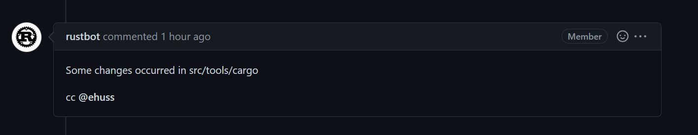

웹 UI 충돌 표시로 확인할 수도 있습니다:

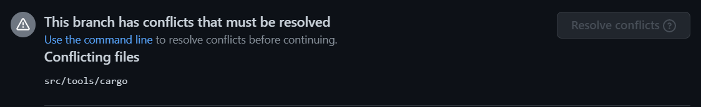

가장 흔한 원인은 리베이스 후 서브모듈을 갱신하는 `x` 명령을 실행하지 않고 `git add .`를 수행한 경우입니다.
또는 `x fmt` 대신 `cargo fmt`를 실행해 서브모듈 내 파일이 자동 수정된 뒤 해당 커밋이 합쳐진 경우입니다.

이를 복구하려면 다음 과정을 진행하세요 (`cargo` 이외의 다른 서브모듈인 경우 `src/tools/cargo` 경로를 해당 서브모듈 경로로 교체):

1. 실수로 변경이 포함된 커밋을 확인합니다: `git log --stat -n1 src/tools/cargo`
2. 해당 커밋의 서브모듈 변경을 되돌립니다: `git checkout <my-commit>~ src/tools/cargo`.
   `~` 문자는 그대로 입력하고 `<my-commit>`은 1단계에서 확인한 커밋 해시로 대체합니다.
3. 변경사항을 자식 커밋으로 등록합니다: `git commit --fixup <my-commit>`
4. 수정된 모든 서브모듈에 대해 1~3단계를 반복합니다.
    - 서브모듈을 여러 커밋에 걸쳐 수정한 경우 수정된 각 커밋마다 1~3 단계를 반복 적용해야 합니다.
    `git log` 명령어에 본인이 작성하지 않은 타인의 커밋이 나타날 때 반복을 중단합니다.
5. 기존 커밋에 스쿼시 처리합니다: `git rebase --autosquash -i upstream/main`
6. [변경사항을 푸시합니다](#standard-process).

#### 리베이스 시 "error: cannot rebase" 오류가 발생하는 경우

리베이스 진행 시 흔히 발생하는 2가지 오류 메시지입니다:
```console
error: cannot rebase: Your index contains uncommitted changes.
error: Please commit or stash them.
```
```console
error: cannot rebase: You have unstaged changes.
error: Please commit or stash them.
```

(두 오류의 차이점은 <https://git-scm.com/book/en/v2/Getting-Started-What-is-Git%3F#_the_three_states> 참조).

이 오류는 마지막 커밋 이후 로컬에 커밋되지 않은 수정사항이 남아있음을 의미합니다.
리베이스를 진행하려면 커밋을 완료하거나, 리베이스 완료 시점까지 작업을 임시 보관하는 "stash" 커밋을 생성해야 합니다.
리베이스 시 자동으로 "stash"를 적용하도록 Git을 설정해두면 이 오류를 거의 완벽히 예방할 수 있습니다:

```console
git config --global rebase.autostash true
```

Stash에 대한 상세 내용은 <https://git-scm.com/book/en/v2/Git-Tools-Stashing-and-Cleaning>을 참조하세요.

#### 'Untracked Files: src/stdarch' 항목이 노출되는 경우

이 항목은 과거 `library/` 디렉터리로 구조 개편이 이뤄진 유산입니다.
안타깝게도 `git rebase`는 서브모듈의 이름 변경을 자동으로 추적하지 못하므로 디렉터리를 수동 삭제해야 합니다:

```console
rm -r src/stdarch
```

#### I see `<<< HEAD`?

You were probably in the middle of a rebase or merge conflict.
See [Conflicts](#rebasing-and-conflicts) for how to fix the conflict.
If you don't care about the changes
and just want to get a clean copy of the repository back, you can use `git reset`:

```console
# WARNING: this throws out any local changes you've made! Consider resolving the conflicts instead.
git reset --hard main
```

#### failed to push some refs 오류가 표시되는 경우

`git push` 구동이 거절되면서 다음과 같은 안내 메시지가 표시될 수 있습니다:

```console
 ! [rejected]        issue-xxxxx -> issue-xxxxx (non-fast-forward)
error: failed to push some refs to 'https://github.com/username/rust.git'
hint: Updates were rejected because the tip of your current branch is behind
hint: its remote counterpart. Integrate the remote changes (e.g.
hint: 'git pull ...') before pushing again.
hint: See the 'Note about fast-forwards' in 'git push --help' for details.
```

이 안내문이 권장하는 해결책은 잘못된 방법입니다!
Rust의 ["no-merge" 정책](#no-merge-policy)에 따라 `git pull`이 생성하는 병합 커밋은 최종 PR에서 수용되지 않으며 리베이스의 취지에도 어긋납니다.
대신 `git push --force-with-lease` 명령을 사용하세요.

#### 직접 작성하지 않은 타인의 커밋들이 리베이스 목록에 나타나는 경우

리베이스 목록에 수많은 커밋이나 병합 커밋, 타인이 작성한 커밋이 노출되는 경우 잘못된 대상 브랜치 위로 리베이스를 시도하고 있을 가능성이 높습니다.
예를 들어 `rust-lang/rust` 원격 저장소가 `upstream`으로 지정되어 있음에도 `git rebase upstream/main` 대신 `git rebase origin/main`을 실행했을 때 발생합니다.
해결책은 리베이스를 중단하고 올바른 브랜치를 지정하는 것입니다:

```console
git rebase --abort
git rebase --interactive upstream/main
```

<details><summary>잘못된 브랜치 위로 리베이스가 구동된 예시 화면 보기</summary>

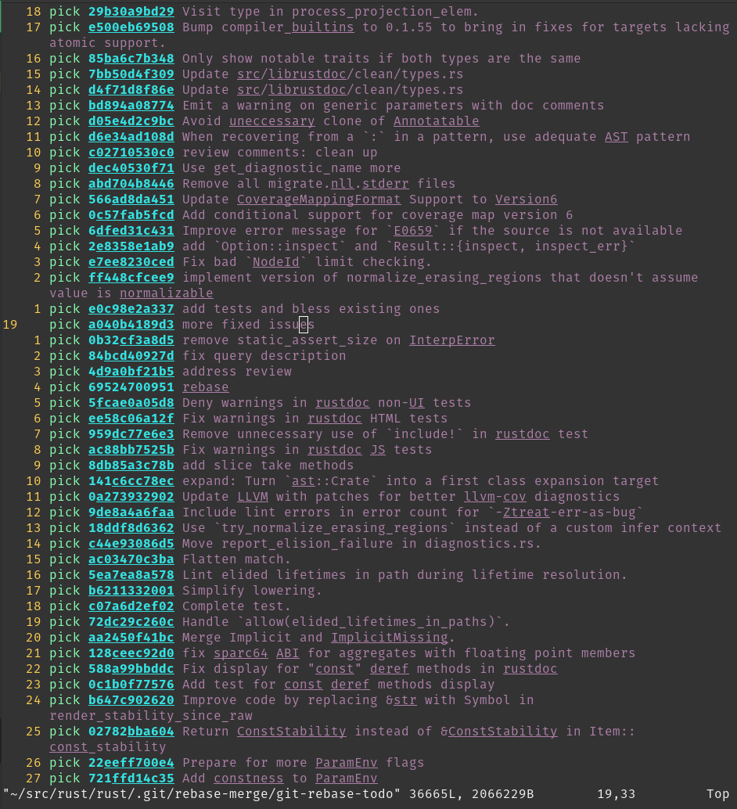

</details>

#### 서브모듈에 대한 간략한 설명

`git pull`로 로컬 저장소를 갱신할 때 본인이 전혀 편집하지 않은 파일들이 수정됨 항목으로 표시되는 것을 볼 수 있습니다.
예를 들어 `git status` 구동 시 다음과 같은 내용이 표시될 수 있습니다 (언급된 `new commits` 참조):

```console
On branch main
Your branch is up to date with 'origin/main'.

Changes not staged for commit:
  (use "git add <file>..." to update what will be committed)
  (use "git restore <file>..." to discard changes in working directory)
	modified:   src/llvm-project (new commits)
	modified:   src/tools/cargo (new commits)

no changes added to commit (use "git add" and/or "git commit -a")
```

이 커밋들은 일반 소스 파일 변경이 아닌 서브모듈 커밋 포인터 변경에 해당합니다 ([후속 섹션](#git-submodules) 참조).
이 항목들을 정리하려면 다음 명령을 구동하세요:

```console
git submodule update
```

일부 서브모듈은 실제 빌드에 요구되지 않습니다. 예컨대 `download-ci-llvm`을 사용하는 경우 `src/llvm-project`를 체크아웃할 필요가 없습니다.
서브모듈 커밋 이력을 매번 패치받지 않으려면 `git submodule deinit -f src/llvm-project`를 실행하여 커밋 포인터 변경 표시를 비활성화할 수 있습니다.

### 리베이스 및 충돌 해결하기 (Rebasing and Conflicts)

로컬에서 코드를 수정할 때는 기능 브랜치를 생성하던 시점의 `rust-lang/rust` 버전을 기반으로 작업하게 됩니다.
따라서 PR을 제출할 때 그 사이 `rust-lang/rust` 상류 소스에 반영된 최신 변경사항이 기여자의 코드 변경과 충돌을 야기할 수 있습니다.
이러한 상황이 발생하면 변경사항이 머지되기 전에 충돌을 해결해야 합니다.
충돌을 해결하려면 작성한 기여 작업을 `rust-lang/rust` 최신 커밋 상단으로 리베이스해야 합니다.

#### 리베이스 (Rebasing)

기능 브랜치를 `rust-lang/rust`의 `main` 브랜치 최신 커밋 상단으로 리베이스하려면 기여자의 브랜치를 체크아웃한 뒤 다음 명령을 구동하세요:

```console
git pull --rebase https://github.com/rust-lang/rust.git main
```

> 다음과 같은 오류를 만난 경우:
> ```console
> error: cannot pull with rebase: Your index contains uncommitted changes.
> error: please commit or stash them.
> ```
> 로컬 작업 트리에 아직 커밋되지 않은 수정 코드가 존재함을 의미합니다. 이 경우 리베이스 실행 전 `git stash`를 수행하고, 리베이스 및 충돌 해결 완료 후 `git stash pop`을 실행하여 임시 보관 코드를 다시 적용하세요.

브랜치를 main 위로 리베이스할 때 브랜치의 모든 변경 내역이 최신 `main` 커밋 상단에 차례로 재적용됩니다.
즉 Git은 구버전 `main`에서 수행했던 변경 작업을 최신 `main` 버전 위에서 실행한 것처럼 재생성하는 연산을 시도합니다.
이 과정에서 하나 이상의 "리베이스 충돌(rebase conflict)"이 발생할 수 있습니다.
기여자의 변경 작업이 그 사이 상류에서 일어난 다른 변경사항과 동일 소스 구간에서 상충될 때 일어납니다.
충돌이 발생하면 터미널 출력에 다음과 유사한 형태의 안내 라인이 표시됩니다:

```console
CONFLICT (content): Merge conflict in file.rs
```

When you open these files, you'll see sections of the form

```console
<<<<<<< HEAD
Original code
=======
Your code
>>>>>>> 8fbf656... Commit fixes 12345
```

This represents the lines in the file that Git could not figure out how to rebase.
The section between `<<<<<<< HEAD` and `=======` has the code from
`main`, while the other side has your version of the code.
You'll need to decide how to deal with the conflict.
You may want to keep your changes,
`main`의 변경사항을 유지하거나 두 변경을 적절히 결합합니다.

일반적으로 충돌 해결은 2단계 과정으로 이루어집니다: 첫째, 개별 충돌 코드를 수정합니다.
원하는 소스 형태로 파일을 수정하고 그 과정에서 나타난 `<<<<<<<`, `=======`, `>>>>>>>` 충돌 마커 표시 라인들을 깨끗이 삭제합니다.
둘째, 주변 코드를 종합 검토합니다.
코드 충돌이 발생한 지점 주변에는 논리적 에러가 상존할 가능성이 높습니다!
눈에 띄는 명백한 컴파일 에러가 없는지 `x check` 명령을 실행해 확인하는 것이 좋습니다.

충돌 수정 작업이 완료되면 `git add` 명령을 통해 해당 충돌 파일들을 스테이징 영역에 올려줍니다.
이후 `git rebase --continue` 명령을 실행하여 충돌 해결이 완료되었음을 Git에게 알리고 리베이스를 마무리시킵니다.

리베이스가 성공하면 `git push --force-with-lease` 명령을 사용해 포크 저장소의 대상 브랜치 코드를 갱신하세요.

#### 최신 상태 유지하기

[위 섹션](#rebasing)은 리베이스 작업 및 병합 충돌 해결에 관한 세부 가이드였습니다.
다음은 로컬 저장소를 상류(upstream) 변경사항에 맞춰 최신 상태로 유지하기 위한 일반 조언입니다:

로컬 `main` 브랜치에서 `git pull upstream main`을 정기적으로 구동하여 최신 상태로 유지하세요.
또한 기여 중인 기능 브랜치들도 최신 상태로 유지하는 것이 좋습니다. 상류 코드를 pull한 후 기능 브랜치를 체크아웃하여 리베이스를 수행하세요:

```console
git checkout main
git pull upstream main --ff-only # 병합 커밋이 생성되지 않도록 보장
git rebase main feature_branch
git push --force-with-lease # (로컬 상태와 원격 origin을 동기화)
```

[No-Merge 정책](#no-merge-policy)에 따라 병합 커밋 생성을 방지하려면 매번 `--ff-only`나 `--rebase` 플래그를 전달할 필요 없이 `git pull` 구동 시 머지 커밋 작성을 차단하는 `git config pull.ff only` 설정(로컬 저장소 전용 적용)을 권장합니다.

또한 `main` 브랜치에서 `git push --force-with-lease`를 구동하여 기능 브랜치가 GitHub 상의 상태와 올바르게 동기화되어 있는지 이중 확인해 보세요.

### 고급 리베이스 (Advanced Rebasing)

#### 커밋 스쿼시하기 (Squash)

커밋을 "스쿼시(squash)"한다는 것은 여러 커밋 내역을 단일 커밋으로 하나로 합침을 의미합니다.
장점이자 단점은 이력이 단순화된다는 점입니다.
단점으로는 변경이 일어난 세부 단계별 추적이 어려워지지만, 전체 커밋 이력을 한눈에 파악하고 다루기는 쉬워집니다.

`rust-lang/rust` 저장소 PR에서 커밋을 스쿼시하는 가장 쉬운 방법은 PR 댓글에 `@bors squash` 명령을 사용하는 것입니다.
기본적으로 [bors]는 PR의 모든 커밋 메시지를 하나로 결합하여 스쿼시 커밋 메시지를 생성합니다.
커밋 메시지를 직접 지정하려면 `@bors squash msg="<commit message>"` 포맷을 사용하세요.
예시: `@bors squash msg="Improve diagnostics for missing lifetime parameter"`.

로컬 Git 명령을 통해 커밋을 직접 스쿼시하려는 경우 아래 가이드를 참조하세요.

충돌이 없고 단순히 이력을 정돈하기 위해 스쿼시하는 경우 `git rebase --interactive --keep-base main` 명령을 사용하세요.
이 명령은 PR의 포크 기준점(fork point)을 그대로 유지해주므로 리베이스 전후의 diff 변동 내역을 리뷰하기 용이해집니다.

스쿼시는 충돌 해결의 일환으로도 매우 유용합니다.
브랜치에 동일 코드에 대한 연속적인 수정 작업이 포함되어 있거나 리베이스 충돌이 심각하게 일어나는 경우, `git rebase --interactive main`을 사용하여 리베이스 프로세스를 세밀히 제어할 수 있습니다.
특정 커밋을 건너뛰거나, 건너뛰지 않은 커밋의 내용을 수정하거나, 적용 순서를 변경하거나, 커밋을 하나로 "스쿼시"할 수 있습니다.

또는 다음과 같이 커밋 이력을 정돈하는 방식을 취할 수도 있습니다:

```console
# 모든 변경을 단일 커밋으로 스쿼시하여 충돌을 한 번만 처리함
git rebase --interactive --keep-base main  # 과정 중 모든 변경사항을 스쿼시
git rebase main
# 모든 머지 충돌을 해결
git rebase --continue
```

실제 기능 변경이 아닌 단순 "수정본(fixup)"에 불과한 직전 몇 개의 커밋만 하나로 스쿼시하려는 경우도 있습니다.
예를 들어 `git rebase --interactive HEAD~2`는 직전 2개의 커밋에 대해서만 인터랙티브 스쿼시 수정을 진행합니다.

[bors]: https://github.com/rust-lang/bors

#### `git range-diff` 활용법

리베이스를 마치고 갱신 코드를 푸시하기 직전에 구버전 브랜치와 신규 브랜치 사이의 롤백/차이점을 리뷰하는 것이 좋습니다.
`git range-diff main @{upstream} HEAD` 명령으로 이를 수행할 수 있습니다.

`range-diff`의 첫 번째 인자(`main`)는 구버전과 신규 브랜치를 대조 비교할 베이스 리비전입니다.
두 번째 인자는 구버전 브랜치 리비전으로, 이 경우 `@upstream`은 GitHub에 푸시된 기존 버전(풀 리퀘스트에서 타인이 보고 있는 버전)을 나타냅니다.
마지막 세 번째 인자는 신규 리비전 브랜치로, `HEAD`는 현재 로컬 저장소에 체크아웃된 최신 커밋을 의미합니다.

축약형 표기인 `git range-diff main @{u} HEAD` 명령도 동일하게 구동됩니다.

일반 Git diff와 달리 range-diff 출력에는 `-` 또는 `+` 기호 옆에 또 다른 `-` 또는 `+` 기호가 함께 노출됩니다.
좌측 기호는 구버전 브랜치와 신규 브랜치 사이의 변경을 나타내고, 우측 기호는 기여자가 새로 커밋한 변경을 나타냅니다.
따라서 range-diff는 구버전 diff와 신규 diff 간의 차이점을 직관적으로 보여주는 "diff의 diff" 역할을 수행합니다.

Here's an example of `git range-diff` output (taken from [Git's docs][range-diff-example-docs]):

```console
-:  ------- > 1:  0ddba11 Prepare for the inevitable!
1:  c0debee = 2:  cab005e Add a helpful message at the start
2:  f00dbal ! 3:  decafe1 Describe a bug
    @@ -1,3 +1,3 @@
     Author: A U Thor <author@example.com>

    -TODO: Describe a bug
    +Describe a bug
    @@ -324,5 +324,6
      This is expected.

    -+What is unexpected is that it will also crash.
    ++Unexpectedly, it also crashes. This is a bug, and the jury is
    ++still out there how to fix it best. See ticket #314 for details.

      Contact
3:  bedead < -:  ------- TO-UNDO
```

(Note that `git range-diff` output in your terminal will probably be easier to
read than in this example because it will have colors.)

Another feature of `git range-diff` is that, unlike `git diff`, it will also diff commit messages.
이 기능은 여러 커밋 메시지를 수정할 때 원하는 부분이 올바르게 수정되었는지 검증하는 데 매우 유용합니다.

`git range-diff`는 매우 유용한 명령어이지만 출력 포맷에 익숙해지기까지 시간이 다소 걸릴 수 있습니다.
명령어에 대한 Git 공식 문서, 특히 [예시 섹션][range-diff-example-docs] 항목을 참조하세요.

[range-diff-example-docs]: https://git-scm.com/docs/git-range-diff#_examples

### 병합 커밋 미사용 정책 (No-Merge Policy)

rust-lang/rust 저장소는 이른바 "리베이스 워크플로(rebase workflow)"를 채택하고 있습니다.
이는 PR 내의 병합 커밋(merge commit)을 절대 허용하지 않음을 의미합니다.
따라서 로컬에서 `git merge`를 구동하고 있다면 대신 리베이스를 수행해야 할 가능성이 높습니다.
물론 단순 패스트포워드(fast-forward) 방식의 머지(`git pull`이 수행하는 일반 머지)라면 머지 커밋이 생성되지 않으므로 걱정하실 필요가 없습니다.
`git config merge.ff only` 설정(로컬 저장소 전용 적용)을 한 번 등록해두면 모든 머지가 패스트포워드 타입으로만 구동되어 실수를 미리 방지할 수 있습니다.

이러한 정책 결정에는 몇 가지 이유가 있으며 트레이드오프가 존재합니다.
가장 큰 장점은 전반적으로 깨끗한 선형(linear) 커밋 이력을 유지할 수 있다는 점입니다.
선형 이력은 이분 탐색(bisecting)을 대폭 단순화해주며 커밋 이력 및 로그를 추적하고 이해하기 훨씬 쉽게 만들어 줍니다.

### 코드 리뷰 팁

**참고**: 이 섹션은 PR을 *작성*하는 입장이 아닌 *리뷰*하는 입장을 위한 팁입니다.

#### 공백 변경 숨기기

GitHub에는 리뷰 시 유용한 공백 변경 렌더링 무시 버튼이 존재합니다.
로컬 환경에서 변경을 검토할 때 `git diff -w origin/main` 명령을 사용할 수도 있습니다.

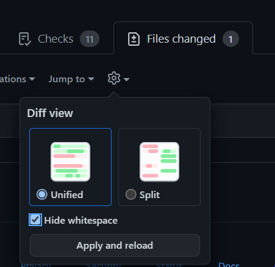

#### PR 로컬로 가져오기

PR 코드를 로컬 브랜치로 가져와 체크아웃하려면 `git fetch upstream pull/NNNNN/head && git checkout FETCH_HEAD` 명령을 구동하세요.

GitHub CLI 도구를 사용할 수도 있습니다.
GitHub PR 페이지에는 로컬 체크아웃 명령을 복사-붙여넣기할 수 있는 버튼이 구비되어 있습니다. 상세 정보는 <https://cli.github.com/>을 참조하세요.


#### GitHub Dev 활용하기

GitHub 웹 UI의 대안으로 GitHub Dev는 저장소 및 PR을 브라우징할 수 있는 웹 기반 에디터를 제공합니다.
URL에서 `github.com`을 `github.dev`로 변경하거나 GitHub 페이지에서 `.` 키를 누르면 바로 실행할 수 있습니다.
자세한 내용은 [github.dev 에디터 문서](https://docs.github.com/en/codespaces/the-githubdev-web-based-editor)를 참조하세요.

#### 대규모 코드 이동 검토하기

단일 파일 *내에서* 이뤄진 대규모 코드 위치 이동에 대해 Git 및 GitHub의 기본 diff 뷰는 시각화가 다소 미흡합니다. 각 라인을 삭제 및 추가 라인으로 각각 표기하므로 각 라인을 수동 대조해야 합니다.
Git에는 이동된 라인을 다른 색상으로 강조 출력하는 옵션이 존재합니다:

```console
git log -p --color-moved=dimmed-zebra --color-moved-ws=allow-indentation-change
```

상세 옵션은 [`--color-moved` 문서](https://git-scm.com/docs/git-diff#Documentation/git-diff.txt---color-movedltmodegt)를 참조하세요.

#### range-diff 활용

[PR 작성자용 관련 섹션](#git-range-diff)을 참조하세요.
포스 푸시(force-push)된 PR 코드에 예기치 않은 추가 변경이 섞이지 않았는지 대조할 때 매우 유용합니다.

#### 특정 파일 변경 무시하기

저장소 내 다수의 대형 파일들은 자동 생성된 결과물입니다.
해당 파일들(예: Cargo.lock)의 변동 내역을 제외하고 diff를 조회하려면 다음 구문을 사용할 수 있습니다:

```console
git log -p ':!Cargo.lock'
```

임의의 와일드카드 패턴도 지원됩니다 (예: `:!compiler/*`). 패턴 구문은 `.gitignore`와 동일하며 앞에 `:`을 부가하여 패턴임을 지정합니다.

### Git 서브모듈 (Git Submodules)

**참고**: 서브모듈 지식은 알아두면 유용하지만 `rustc` 기여의 필수 전제 조건은 *아닙니다*.
Git을 처음 접하시는 경우 이 섹션을 읽기 전에 Git의 기본 핵심 개념들을 먼저 숙지하시는 것을 권장합니다.

`rust-lang/rust` 저장소는 `rust` 저장소 내부에서 다른 외부 Rust 프로젝트를 함께 활용하는 방법으로 [Git 서브모듈]을 채택하고 있습니다.
대표적인 예시로 `llvm-project` 포크, `cargo`, 그리고 `stdarch`, `backtrace`와 같은 외부 라이브러리들이 있습니다.

이들 프로젝트는 독립적인 별개의 Git(및 GitHub) 저장소에서 개발 및 관리되며 자체적인 Git 커밋 이력, 이슈 트래커, PR을 유지합니다.
서브모듈을 활용하면 `rust` 저장소 내부에 중첩된 하위 저장소를 배치하고 마치 `rust` 저장소의 디렉터리인 것처럼 투명하게 다룰 수 있습니다.

`llvm-project`를 예로 들어보겠습니다.
`llvm-project` 소스는 [`rust-lang/llvm-project`] 저장소에서 관리되지만, `rust-lang/rust` 저장소 내부에서 코드 생성 및 최적화를 위한 컴파일러 내부 모듈로 연동되어 활용됩니다.
We bring it in `rust` as a submodule, in the `src/llvm-project` folder.

The contents of submodules are ignored by Git: submodules are in some sense isolated
from the rest of the repository.
However, if you try to `cd src/llvm-project` and then run `git status`:

```console
HEAD detached at 9567f08afc943
nothing to commit, working tree clean
```

As far as git is concerned, you are no longer in the `rust` repo, but in the `llvm-project` repo.
You will notice that we are in "detached HEAD" state, i.e. not on a branch but on a
particular commit.

This is because, like any dependency, we want to be able to control which version to use.
Submodules allow us to do just that: every submodule is "pinned" to a certain
commit, which doesn't change unless modified manually.
If you use `git checkout <commit>`
in the `llvm-project` directory and go back to the `rust` directory, you can stage this
change like any other, e.g. by running `git add src/llvm-project`. (Note that if
you *don't* stage the change to commit, then you run the risk that running
`x` will just undo your change by switching back to the previous commit when
it automatically "updates" the submodules.)

서브모듈의 버전 지정은 보통 프로젝트 메인테이너들에 의해 이뤄지며 [이 예시][llvm-update] 형태를 가집니다.

Git 서브모듈 개념에 적응하기까지 약간의 시간이 소요될 수 있으므로 아직 명확히 이해되지 않더라도 걱정하지 마세요. 서브모듈을 직접 다루어야 하는 경우는 흔치 않으며, 거듭 강조하지만 서브모듈의 모든 세부 구조를 파악하지 않아도 Rust 개발 기여에 아무런 지장이 없습니다.
다만 서브모듈이 존재하고 있으며, Git이 편리하게 관리해 주는 일종의 중첩 하위 저장소 의존성임을 인지해 두시면 충분합니다.

#### 서브모듈 하드 리셋하기 (Hard-resetting)

간혹 `git status` 구동 시 다음과 같은 항목이 나타나고

```console
Changes not staged for commit:
  (use "git add <file>..." to update what will be committed)
  (use "git restore <file>..." to discard changes in working directory)
  (commit or discard the untracked or modified content in submodules)
        modified:   src/llvm-project (new commits, modified content)
```

`git submodule update` 명령을 실행할 때 아래와 같은 오류 메시지가 심각하게 발생할 수 있습니다:

```console
error: RPC failed; curl 92 HTTP/2 stream 7 was not closed cleanly: CANCEL (err 8)
error: 2782 bytes of body are still expected
fetch-pack: unexpected disconnect while reading sideband packet
fatal: early EOF
fatal: fetch-pack: invalid index-pack output
fatal: Fetched in submodule path 'src/llvm-project', but it did not contain 5a5152f653959d14d68613a3a8a033fb65eec021. Direct fetching of that commit failed.
```

`(new commits, modified content)` 메시지가 보이는 경우 다음 명령을 구동하세요:

```console
git submodule foreach git reset --hard
```

이후 `git submodule update`를 다시 실행해 보세요.

#### Git 서브모듈 등록 해제하기 (Deinit)

위 방법으로도 해결되지 않는 경우 모든 서브모듈의 등록을 일시 해제할 수 있습니다:

```console
git submodule deinit -f --all
```

안타깝게도 로컬 Git 서브모듈 설정이 어떤 사유로 완전히 꼬여버리는 상황이 간혹 일어날 수 있습니다.

#### `fatal: not a git repository: <submodule>/../../.git/modules/<submodule>` 오류 해결

간혹 원인을 알 수 없는 이유로 다음과 같은 오류가 발생할 수 있습니다:

```console
fatal: not a git repository: src/gcc/../../.git/modules/src/gcc
```

이 경우 해당 서브모듈 경로(예시의 경우 `<submodule_path> = src/gcc`)에 대해 다음 단계를 실행하세요:

1. `rm -rf <submodule_path>/.git`
2. `rm -rf .git/modules/<submodule_path>/config`
3. `.gitconfig` 락 파일이 고립된 경우 `rm -rf .gitconfig.lock` 실행.

이후 `./x fmt`와 같은 명령을 구동하면 부트스트랩이 서브모듈 체크아웃을 자동으로 재정리해 줍니다.

### `git blame` 시 특정 커밋 무시하기

일부 커밋은 실제 기능 변경 없이 코드 전체의 대규모 포맷팅만 수정한 내역을 가집니다.
[`.git-blame-ignore-revs`](https://github.com/rust-lang/rust/blob/HEAD/.git-blame-ignore-revs) 파일을 통해 `git blame` 구동 시 해당 커밋들을 무시하도록 설정할 수 있습니다:

1. `git blame` 구동 시 무시할 커밋 목록으로 `.git-blame-ignore-revs`를 사용하도록 Git을 설정합니다: `git config blame.ignorerevsfile .git-blame-ignore-revs`
2. `git blame`에서 제외하려는 커밋 해시를 해당 파일에 추가합니다.

`.git-blame-ignore-revs` 파일에 커밋을 추가할 때 다른 사람들이 커밋을 제외하는 *이유*를 쉽게 이해할 수 있도록 주석 설명을 반드시 첨부해 주세요.

[Git 서브모듈]: https://git-scm.com/book/en/v2/Git-Tools-Submodules
[`rust-lang/llvm-project`]: https://github.com/rust-lang/llvm-project
[llvm-update]: https://github.com/rust-lang/rust/pull/99464/files


## @rustbot 정복하기 {#rustbot}

`@rustbot`(`triagebot`으로도 불림)은 본래 `rust-lang` GitHub 조직 멤버십 권한이 요구되는 여러 작업들을 일반 기여자들이 직접 수행할 수 있도록 돕는 도우미 로봇입니다.
`rustc` 기여자들에게 가장 유용한 기능은 이슈 담당자 지정(claiming)과 라벨 관리(relabeling)입니다.

### 이슈 담당자 지정 (Issue claiming)

`@rustbot`은 누구든 이슈 담당자로 본인을 지정할 수 있는 명령어를 제공합니다.
작업하고 싶은 이슈를 찾았다면 해당 이슈 스레드에 다음 주석을 댓글로 게시하세요:

    @rustbot claim

아직 담당자가 지정되지 않은 이슈인 경우 `@rustbot`이 이슈 담당자로 사용자를 등록해 줍니다.
GitHub 시스템 제약으로 인해 `@rustbot`이 일시적으로 보조 플레이스홀더 담당자로 등록된 뒤 상단 본문 주석을 수정하여 해당 이슈가 사용자에게 할당되었음을 표시하는 간접적인 방식으로 할당될 수 있습니다.

이슈 담당 지정을 해제하려는 경우 `@rustbot`의 해제 명령을 사용할 수 있습니다:

    @rustbot release-assignment

### Issue relabeling

Changing labels for an issue or PR is also normally reserved for members of the organization.
However, `@rustbot` allows you to relabel an issue yourself, only with a few restrictions.
This is mostly useful in two cases:

**Helping with issue triage**: Rust's issue tracker has more than 5,000 open
issues at the time of this writing, so labels are the most powerful tool that we
have to keep it as tidy as possible.
You don't need to spend hours in the issue tracker
to triage issues, but if you open an issue, you should feel free to label it if
you are comfortable with doing it yourself.

**Updating the status of a PR**: We use "status labels" to reflect the status of PRs.
예를 들어 제출한 PR에 병합 충돌이 있는 경우 자동으로 `S-waiting-on-author` 라벨이 부여되며, PR을 리베이스하기 전까지 리뷰어가 검토하지 않을 수 있습니다.
브랜치를 리베이스한 후 기여자가 라벨을 수정하여 `S-waiting-on-author`를 제거하고 `S-waiting-on-review`를 다시 추가해야 합니다.
이 경우 `@rustbot` 명령어 구문은 다음과 같습니다:

    @rustbot label -S-waiting-on-author +S-waiting-on-review

이 명령어 구문 규칙은 꽤 유연하여 동일한 동작을 수행하는 여러 변형이 존재합니다.
라벨을 갱신하는 숏컷 명령어도 마련되어 있으며, 예컨대 `@rustbot ready`는 위 명령어와 완전히 동일하게 작동합니다.
상세한 정보는 [라벨 관련 문서][labeling] 및 [단축키 문서][shortcuts]를 참조하세요.

[labeling]: https://forge.rust-lang.org/triagebot/labeling.html
[shortcuts]: https://forge.rust-lang.org/triagebot/shortcuts.html

### 기타 봇 명령어

`@rustbot`이 제공하는 전체 기능에 관심이 있다면 [공식 문서]를 참조하세요. 봇 기능이 업데이트될 때마다 지속 관리되는 기술 레퍼런스 문서입니다.

`@rustbot`은 릴리스(Release) 팀에 의해 관리됩니다.
기존 명령어에 대한 피드백이나 신규 기능 제안이 있는 경우 [Zulip에서 문의]하시거나 [triagebot 저장소]에 이슈를 올려 주세요.

[공식 문서]: https://forge.rust-lang.org/triagebot/index.html
[Zulip에서 문의]: https://rust-lang.zulipchat.com/#narrow/stream/224082-t-release.2Ftriagebot
[triagebot 저장소]: https://github.com/rust-lang/triagebot/


## 워크스루: 대표적인 기여 과정 따라보기 {#walkthrough}

버그 수정, 성능 개선, 기능 설계 지원, 기존 기능 피드백 제공 등 Rust 컴파일러에 기여할 수 있는 방법은 *매우 다양합니다*.
이 챕터는 컴파일러 기여의 전체를 아우르기보다는 신규 기능의 설계부터 구현까지의 전 과정을 구체적 워크스루 형태로 설명합니다.
여기서 설명하는 모든 단계와 절차가 매 기여마다 꼭 요구되는 것은 아니며, 상황에 맞춰 필요한 부분을 짚어드리겠습니다.

일반적으로 기여에 관심은 있지만 어디서부터 시작해야 할지 확신이 서지 않는다면 언제든지 편하게 질문해 주세요!

### 개요

이 챕터에서 다룰 예시 기능은 매크로의 클리니(Kleene) `?` 반복 연산자입니다.
기본적으로 다음과 같은 코드를 작성할 수 있는 기능을 의미합니다:

```rust,ignore
macro_rules! foo {
    ($arg:ident $(, $optional_arg:ident)?) => {
        println!("{}", $arg);

        $(
            println!("{}", $optional_arg);
        )?
    }
}

fn main() {
    let x = 0;
    foo!(x); // 정상! "0" 출력
    foo!(x, x); // 정상! "0 0" 출력
}
```

즉 매크로 내부의 `$(pat)?` 매처는 정규식 표기법과 유사하게 "해당 패턴이 0회 또는 1회 등장할 수 있음"을 의미합니다.

하나의 아이디어가 안정판(stable) Rust 기능으로 완성되기까지는 여러 단계가 존재합니다.
아래에 요약 목록을 정리했습니다. 각 단계를 차례대로 살펴보겠습니다.
앞서 언급했듯이 모든 기여에 이 전체 과정이 요구되는 것은 아닙니다.

- **아이디어 논의 및 Pre-RFC** Pre-RFC는 신규 기능에 대한 초기 초안 또는 설계 논의입니다.
  이 단계의 목적은 설계 공간을 다듬고 아이디어의 다양한 장단점 및 난관을 파악하는 데 있습니다.
  광범위한 커뮤니티에 공개하기 전 아이디어에 대한 초기 피드백을 수집하는 훌륭한 방법입니다.
  원래 진행된 초기 논의는 [여기][prerfc]에서 확인할 수 있습니다.
- **RFC** 아이디어를 정식으로 커뮤니티에 제출하여 검토받는 단계입니다.
  해당 RFC 문서는 [여기][rfc]에서 볼 수 있습니다.
- **구현 (Implementation)** 아이디어를 컴파일러 내에 미확정(unstable) 상태로 구현합니다.
  최초 구현 PR은 [여기][impl1]에서 확인할 수 있습니다.
- **반복 검증 및 정제 (Iterate/Refine)** 커뮤니티가 나이틀리 컴파일러 및 `std`에서 해당 기능을 사용해 보면서 설계 선택에 대한 추가 피드백이 수집되고 정제 작업이 일어납니다.
  이 특정 기능은 [여러 번][impl2]의 [추가][impl3] [반복 수정][impl4]을 거쳤습니다.
- **안정화 (Stabilization)** 기능이 충분히 성숙하고 검증되면 Rust 팀 멤버가 [안정화를 제안][merge]할 수 있습니다.
  팀 합의가 이뤄지면 안정판으로 최종 전환됩니다.
- **휴식 (Relax)** 작성한 기능이 이제 정식 안정판 Rust 기능이 되었습니다!

[prerfc]: https://internals.rust-lang.org/t/pre-rfc-at-most-one-repetition-macro-patterns/6557
[rfc]: https://github.com/rust-lang/rfcs/pull/2298
[impl1]: https://github.com/rust-lang/rust/pull/47752
[impl2]: https://github.com/rust-lang/rust/pull/49719
[impl3]: https://github.com/rust-lang/rust/pull/51336
[impl4]: https://github.com/rust-lang/rust/pull/51587
[merge]: https://github.com/rust-lang/rust/issues/48075#issuecomment-433177613

### Pre-RFC 및 RFC

> **참고**: 일반적으로 _새로운_ 기능이나 Rust 생태계의 중대한 변경을 제안하는 것이 아니라면 RFC 절차를 거칠 필요가 없습니다.
> 대신 바로 [구현 단계](#impl)로 이동하시면 됩니다.
>
> RFC 작성이 요구되는 기준에 대한 공식 가이드는 [여기][rfcwhen]에서 확인할 수 있습니다.

[rfcwhen]: https://github.com/rust-lang/rfcs#when-you-need-to-follow-this-process

An RFC is a document that describes the feature or change you are proposing in detail.
Anyone can write an RFC;
the process is the same for everyone, including Rust team members.

To open an RFC, open a PR on the [rust-lang/rfcs](https://github.com/rust-lang/rfcs) repo on GitHub.
You can find detailed instructions in the
[README](https://github.com/rust-lang/rfcs#what-the-process-is).

Before opening an RFC, you should do the research to "flesh out" your idea.
Hastily-proposed RFCs tend not to be accepted.
You should generally have a good description of the motivation, impact, disadvantages, and potential
interactions with other features.

If that sounds like a lot of work, it's because it is.
But no fear!
Even if you're not a compiler hacker, you can get great feedback by doing a _pre-RFC_.
This is an _informal_ discussion of the idea.
Pre-RFC를 논의하기에 가장 좋은 공간은 [internals.rust-lang.org](https://internals.rust-lang.org) 포럼입니다.
작성글이 특정 포맷을 반드시 따를 필요는 없습니다.
완벽히 연결된 완성형 구조가 아니어도 괜찮습니다.
일반적으로 유용한 RFC로 완성시키는 데 필요한 엄청난 양의 피드백을 수집할 수 있습니다.

(추가 팁: RFC 저장소 및 internals 포럼에서 이전에 논의되었던 관련 제안들을 미리 탐색해 보세요.
생각한 아이디어가 이전에 검토되었다가 거절되었거나 나중으로 연기된 케이스를 종종 만날 수 있습니다.
미리 검색해 보는 것으로 기여자와 커뮤니티 모두의 시간을 아낄 수 있습니다.)

우리의 예시 케이스에서도 Pre-RFC 스레드의 한 참여자가 문법적 모호성과 그 해결 방안을 짚어주었습니다.
또한 전반적인 커뮤니티 피드백도 매우 긍정적이었습니다.
이 예시의 경우 논의가 꽤 신속히 수렴되었지만, 일부 아이디어는 훨씬 더 많은 논의 과정을 거치기도 합니다 (예: 684개의 엄청난 댓글이 달린 [해당 RFC][nonascii] 참조!).
논의가 길어지더라도 좌절하지 마세요. 이는 커뮤니티가 해당 제안에 큰 관심을 가지고 있음을 의미하며 단지 약간의 정제가 필요함을 나타낼 뿐입니다.

[nonascii]: https://github.com/rust-lang/rfcs/pull/2457

`?` 매크로 기능 RFC 역시 스레드에서 몇 가지 논의가 진행되었습니다.
대다수 RFC와 마찬가지로 스레드 논의만으로는 결론을 내리기 어려운 질문들이 존재했으며, 기능을 실제 사용해 보고 경험을 쌓는 판단 과정이 필요했습니다.
이러한 문제들은 RFC의 "미해결 질문(Unresolved Questions)" 섹션에 정리됩니다.
또한 RFC 논의가 진행되는 동안 새 대안이나 선행 작업이 추가되거나 제안 자체의 일부가 수정되는 등 논의 경과를 반영하여 RFC 문서 자체를 지속적으로 업데이트해야 합니다.

결국 논의가 합의점에 도달하고 다소 진정되면, Rust 팀 멤버가 3가지 의사결정 수순(disposition) 중 하나를 정해 "최종 의견 수렴 기간(FCP)"으로의 전환을 제안할 수 있습니다.
이는 관련 팀의 다른 멤버들에게 해당 RFC에 대한 최종 검토 및 의견 표명을 요청함을 의미합니다.
추가 논의가 이어져 추가 수정이나 미해결 질문이 보완될 수 있습니다.
모두가 만족하는 시점이 되면 RFC는 FCP에 진입하며, 이 기간은 이의를 제기할 수 있는 마지막 기회가 됩니다.
FCP가 종료되면 해당 결정 수순이 정식 수용됩니다. 3가지 최종 결정 수순입니다:

- _병합 (Merge)_: 해당 기능을 수용함.
  [`?` 매크로 기능 병합 제안][rfcmerge]을 확인해 보세요.
- _종결 (Close)_: 현재 형태의 이 기능은 Rust 프로젝트 지향점에 부합하지 않음.
  제안된 RFC가 종결 처리되더라도 개인적인 낙담으로 받아들이지 마세요.
  이는 기여자에 대한 평가가 아닌 Rust가 다른 방향성을 택하겠다는 커뮤니티 차원의 결정일 뿐입니다.
- _연기 (Postpone)_: 제시된 방향에 동의하지만 당장은 진행하지 않음.
  대개 담당 Rust 팀이 해당 기능을 안정화까지 이끌 여력이 부족할 때 발생합니다.
  팀의 로드맵 방향과 일치하지 않는 경우에도 자주 일어납니다. 연기된 아이디어는 추후 다시 논의될 수 있습니다.

[rfcmerge]: https://github.com/rust-lang/rfcs/pull/2298#issuecomment-360582667

RFC가 머지되면 해당 PR이 RFCs 저장소로 통합됩니다.
그리고 해당 기능의 진행 상황을 추적하고 미해결 질문, 구현 경과 및 차단 요소(blocker) 등을 논의하기 위해 [rust-lang/rust] 저장소에 신규 _트래킹 이슈(tracking issue)_가 생성됩니다.
[`?` 매크로 기능 트래킹 이슈][tracking]를 확인해 보세요.

[tracking]: https://github.com/rust-lang/rust/issues/48075

### 실험적 RFC (eRFC)

eRFC는 고수준의 필요성은 명확하지만 사전에 세부 명세를 확정하기에는 설계 공간이 너무 넓은 복잡한 기능에 적용되는 RFC 변형 절차입니다.
완성된 최종 설계를 제시하는 대신 eRFC는 활발한 실험적 기간을 승인하기 위한 고수준 전략을 설명합니다.
이를 통해 팀은 기능 게이트 뒤에서 해당 기능을 구현하고 실전 데이터를 수집한 후 안정화를 위한 정식 RFC 논의에 활용합니다.
이 절차는 코루틴([RFC 2033][rfc2033] 참조)과 같은 주요 기능에 사용되었으나, 오늘날에는 명시적인 "eRFC" 라벨이 거의 쓰이지 않습니다.
현재 프로젝트는 초기 버전에 대해 표준 RFC를 승인한 뒤 최종 안정화 전 나이틀리 채널을 통해 지속 정제하는 방식을 일반적으로 선호합니다.

[rfc2033]: https://github.com/rust-lang/rfcs/pull/2033#issuecomment-309057591

<a id="impl"></a>

### 구현 (Implementation)

컴파일러 변경 작업을 진행하려면 [rust-lang/rust] 저장소를 대상으로 PR을 작성하세요.

[rust-lang/rust]: https://github.com/rust-lang/rust

기능/변경/버그 수정/개선 작업의 특성에 따라 구현은 상대적으로 직관적일 수도 있고 대규모 작업이 될 수도 있습니다.
숙련된 컴파일러 개발자에게 언제든지 도움이나 멘토링을 요청할 수 있습니다.
또한 직접 기능을 구현해야 할 의무는 없으나, 본인이 직접 하지 않는다면 다른 사람이 작업을 시작하기까지 상당한 시간이 소요될 수 있음을 염두에 두어야 합니다.

`?` 매크로 기능의 경우 컴파일러 내 매크로 확장 관련 소스를 파악해야 했습니다.
개인적으로는 코드 내 [주석을 보완하는 작업][comments]이 소스 이해도를 점검하는 매우 유용한 방법이었으나 꼭 이렇게 하실 필요는 없습니다.

[comments]: https://github.com/rust-lang/rust/pull/47732

이후 RFC 문서에 설명된 대로 최초 기능을 [구현][impl1]했습니다.
신규 기능이 구현될 때 해당 기능은 _기능 게이트(feature gate)_ 뒤에 배치되며, 이에 따라 해당 기능을 사용하려면 `#![feature(my_feature_name)]`을 명시해야 합니다.
기능 게이트는 해당 기능이 안정화(stabilized)되는 시점에 제거됩니다.

**대다수 버그 수정 및 일반 개선사항**은 기능 게이트를 요구하지 않습니다.
자유롭게 코드 변경/개선 작업을 진행하시면 됩니다.

[rust-lang/rust] 저장소에 PR을 생성하면 봇이 PR 리뷰어를 자동 지정해 줍니다.
함께 협력 중인 특정 Rust 팀 멤버가 있다면 스레드 댓글에 `r? @reviewer-github-id` (예: `r? @eddyb`)를 기재하여 해당 리뷰어를 직접 요청할 수 있습니다. 누구를 지정해야 할지 모른다면
don't request anyone;
the bot will assign someone automatically based on which files you changed.

The reviewer may request changes before they approve your PR, they may mark the PR with label 
"S-waiting-on-author" after leaving comments, this means that the PR is blocked on you to make 
some requested changes.
When you finished iterating on the changes, you can mark the PR as
`S-waiting-on-review` again by leaving a comment with `@rustbot ready`, this will remove the 
`S-waiting-on-author` label and add the `S-waiting-on-review` label.

Feel free to ask questions or discuss things you don't understand or disagree with.
However, recognize that the PR won't be merged unless someone on the Rust team approves it.
If a reviewer leave a comment like `r=me after fixing ...`, that means they approve the PR and
you can merge it with comment with `@bors r=reviewer-github-id`(e.g. `@bors r=eddyb`) to merge it 
after fixing trivial issues.
Note that `r=someone` requires permission and bors could say
something like "🔑 Insufficient privileges..." when commenting `r=someone`.
In that case, you have to ask the reviewer to revisit your PR.

When your reviewer approves the PR, it will go into a queue for yet another bot called `@bors`.
`@bors` manages the CI build/merge queue.
When your PR reaches the head of the `@bors` queue, `@bors` will test out the merge by running all
tests against your PR on GitHub Actions.
This takes a lot of time to finish.
If all tests pass, the PR is merged and becomes part of the next nightly compiler!

There are a couple of things that may happen for some PRs during the review process

- If the change is substantial enough, the reviewer may request an FCP on the PR.
  This gives all members of the appropriate team a chance to review the changes.
- 작성한 변경이 생태계 코드 하위 호환성을 파괴할 가능성이 있는 경우 리뷰어가 [crater] 테스트를 요구할 수 있습니다.
  이는 변경사항이 반영된 컴파일러를 빌드한 뒤 crates.io의 전체 크레이트를 컴파일하여 검증을 시도하는 스모크 테스트입니다.
  컴파일러 동작 변경이 생태계의 상당 부분에 미치는 영향을 조기 파악하는 데 적합합니다.
- PR diff 용량이 크거나 리뷰어가 바쁜 경우, 먼저 머지된 다른 PR들로 인해 머지 충돌이 발생할 수 있습니다.
  표준 Git 절차에 따라 이 머지 충돌들을 해결해야 합니다.

[crater]: ./tests/crater.html

신규 기능이 아닌 단순 버그 수정과 같은 작업이라면 이것으로 절차가 완료됩니다!
기여에 감사드립니다 :)

### 구현 정제하기 (Refining your implementation)

나이틀리 채널에서 사용자들이 신규 기능을 경험함에 따라 약간의 변경이 제안되고 미해결 질문들이 해결될 수 있습니다.
개선/변경 작업은 앞서 설명한 일반 PR 제출 절차(PR 작성, 리뷰 진행, `@bors` 대기 등)와 동일하게 구동됩니다.

일부 대형 변경사항의 경우 FCP 진행 및 Rust 팀 멤버들의 추가 검토를 요구할 수 있습니다.

`?` 매크로 기능의 경우 최초 구현 이후 몇 번의 반복 정제 과정([1][impl2], [2][impl3], [3][impl4])을 거쳤습니다.

이 과정에서 RFC에 미해결 질문으로 기재되어 있던 `?`에 구분자를 사용하지 않기로 최종 결정했습니다.
또한 모호성 해소 전략도 수정되었습니다: 다른 반복 연산자(`+` 또는 `*`)에 대한 구분자 토큰으로 `?`를 사용하는 기능을 제거하기로 결정했습니다. 다만 이는 이전 코드와의 하위 호환성을 파괴하는 변경(breaking change)에 해당하므로 에디션 경계(edition boundary)를 가로질러 적용하기로 결정했습니다.
이에 따라 신규 기능은 2018 에디션 환경에서만 활성화됩니다. 원래 RFC 명세로부터의 이러한 이탈 과정은 [추가 FCP](https://github.com/rust-lang/rust/issues/51934) 진행을 필요로 했습니다.

### 안정화 (Stabilization)

마침내 해당 기능이 나이틀리 채널에서 충분히 익혀지고 검증되었을 때, 언어 팀 멤버가 [안정화를 발의][stabilizefcp]했습니다.

[stabilizefcp]: https://github.com/rust-lang/rust/issues/48075#issuecomment-433177613

다음 내용을 포함하는 _안정화 리포트(stabilization report)_ 작성이 요구됩니다:

- 동작 특성 및 RFC 대비 변경점 간략 설명
- 영항을 받는 에디션 및 영향 범위
- 주요 동작 양상을 보여주는 검증 테스트 링크

이 예시 기능의 안정화 리포트는 [여기][stabrep]에서 확인할 수 있습니다.

[stabrep]: https://github.com/rust-lang/rust/issues/48075#issuecomment-433243048

이후 기능 게이트를 제거하여 해당 기능을 기본적으로 활성화(2018 에디션 기준)하는 [PR이 생성][stab]되었습니다.
그리고 [릴리스 노트][relnotes]에 해당 기능 명세가 기재됩니다.

[stab]: https://github.com/rust-lang/rust/pull/56245

기능 안정화를 위한 세부 단계는 [기능 안정화하기](#stabilization-guide) 섹션을 참조하세요.

[relnotes]: https://github.com/rust-lang/rust/blob/HEAD/RELEASES.md


## 신규 언어 기능 구현하기 {#implementing-new-features}

컴파일러 내부에서 유의미한 신규 기능을 구현하려는 경우, 모든 과정이 원활히 구동되도록 정해진 프로세스를 준수해야 합니다.

**참고: 이 섹션은 라이브러리 기능이 아닌 *언어(language)* 기능 구현을 대상으로 합니다 (라이브러리는 [별도 절차]를 따름).**

언어 변경 제안을 위한 [Rust 언어 디자인 팀 지침][lang-propose]도 함께 참조하세요.

[별도 절차]: #stability
[lang-propose]: https://lang-team.rust-lang.org/how_to/propose.html

### @rfcbot FCP 절차

변경사항이 소규모이고, 논란의 여지가 없으며, 하위 호환성을 파괴하지 않고, 사용자 노출 언어 명세에 영향을 주지 않으며 신규 미확정 기능을 부가하지 않는 경우 해당 코드 영역 담당자로부터 r+를 받는 일반 PR 제출만으로 구현이 진행됩니다.
하지만 그렇지 않은 경우 더 많은 절차가 수반됩니다.
컴파일러 내부 개선 작업이라 할지라도 팀원 간 합의 없이 논란의 여지가 있는 변경을 구동하는 것은 비권장됩니다 (인지하지 못한 하위 손상을 방지하는 시스템적 관점 및 커뮤니티적 관점 모두 해당).

팀 단위의 합의가 필요한 변경 작업에는 최종 의견 수렴 기간(FCP) 제안 절차가 사용됩니다.
관련 팀에 속해 있지 않아 `@rfcbot` 사용 권한이 없는 경우 해당 권한을 가진 팀원에게 FCP 발의를 요청하세요. 별도 우려사항이 없다면 이청을 수용해 줄 것입니다.

FCP 절차는 팀 합의가 필수적인 경우에만 요구됩니다.
합의가 필요한 프로세스가 아니고 이의를 제기할 사람이 없다고 판단되는 케이스라면 r+ 승인에 의존하셔도 무방합니다.
예를 들어 컴파일러 내부 예약 네임스페이스인 `rustc_` 내부의 미확정 커맨드라인 플래그나 속성을 추가/수정하는 작업은, 나이틀리 생태계 전반에서 폭넓게 사용될 것으로 예상되지 않는 한 FCP 없이 구동해도 괜찮습니다.
일부 팀은 이러한 상황에서 사용할 수 있는 더욱 경량화된 절차를 제공합니다. 예를 들어 컴파일러 팀은 전체 합의 없이 의견 및 지원을 수집할 수 있는 경량화된 수단으로 Major Change Proposal([MCP]) 제안을 권장합니다.

[MCP]: https://forge.rust-lang.org/compiler/proposals-and-stabilization.html#how-do-i-submit-an-mcp

[MCP]: https://forge.rust-lang.org/compiler/proposals-and-stabilization.html#how-do-i-submit-an-mcp

You don't need to have the implementation fully ready for r+ to propose an FCP,
but it is generally a good idea to have at least a proof of concept
so that people can see what you are talking about.

When an FCP is proposed, it requires all members of the team to sign off on the FCP.
After they all do so,
there's a 10-day-long "final comment period" (hence the name) where everybody can comment,
and if no concerns are raised, the PR/issue gets FCP approval.

### The logistics of writing features

There are a few "logistical" hoops you might need to go through
in order to implement a feature in a working way.

#### Warning Cycles

In some cases, a feature or bugfix might break some existing programs in some edge cases.
In that case,
you'll want to do a crater run to assess the impact and possibly add a future-compatibility lint,
similar to those used for [edition-gated lints](#edition-gated-lints).

#### Stability

We [value the stability of Rust].
Code that works and runs on stable should (mostly) not break.
Because of that,
we don't want to release a feature to the world with only team consensus and code review -
we want to gain real-world experience on using that feature on nightly,
and we might want to change the feature based on that experience.

이를 보장하기 위해 사용자가 예기치 않게 신규 미확정 기능에 의존하는 코드를 작성하는 것을 방지해야 합니다.
그렇지 않고 실험에 장시간이 소요되거나 안정판 열차에 탑승해 버릴 경우, 해당 기능이 사실상(de facto) 안정화된 상태가 되어 향후 사용자의 코드를 깨뜨리지 않고서는 해당 명세를 수정할 수 없게 됩니다.

이를 방지하기 위해 모든 신규 기능은 기능 게이트(feature gate) 뒤에 배치됩니다 - 기능 게이트(`#[feature(foo)]`)를 명시적으로 선언하지 않는 한 해당 기능을 사용할 수 없으며, 안정판(stable)/베타(beta) 컴파일러에서는 기능 게이트 선언이 차단됩니다.
기술적 세부사항은 [코드에서의 안정성] 섹션을 참조하세요.

실증 경험을 충분히 축적하고 필요한 수정을 거쳐 만족스러운 단계가 되면, [여기]에 설명된 안정화 프로세스를 통해 해당 기능을 대외에 공식 개방합니다.
그전까지 기능 명세는 절대 확정된 것이 아닙니다: 모든 요소가 수정될 수 있고 전체 코드가 재작성되거나 삭제될 수 있습니다.
미확정 상태로 오랜 기간 방치되었다고 해서 해당 기능이 종신 권리를 얻는 것은 아닙니다.

#### 트래킹 이슈 (Tracking Issues)

미확정 기능의 현황, 나이틀리 채널에서의 사용 경험, 그리고 안정화를 차단하는 우려사항들을 지속적으로 추적하기 위해 모든 기능 게이트에는 트래킹 이슈가 필요합니다.
해당 기능과 연관된 이슈 및 PR을 개설할 때 이 트래킹 이슈를 참조하고, 기능 진행 상황이 업데이트될 때 트래킹 이슈에 내용을 게시해야 합니다.

승인된 RFC나 승인된 언어 실험에 속하는 기능의 경우 기존의 해당 트래킹 이슈를 활용합니다.

기타 일반 기능의 경우 해당 전용 트래킹 이슈를 새로 생성하세요.
이슈 제목은 "Tracking issue for YOUR FEATURE" 형식으로 설정합니다.
["Tracking Issue" 이슈 템플릿][template]을 사용하세요.

[template]: https://github.com/rust-lang/rust/issues/new?template=tracking_issue.md

#### 언어 실험 (Lang experiments)

컴파일러 소스에 반영하기 위해 사용자에게 직접 노출되는 영향을 주는 언어 기능(미확정 기능 포함)은 승인된 RFC나 승인된 [언어 실험] 절차를 반드시 거쳐야 합니다.

신규 언어 실험을 제안하려면 동기와 의도한 해결책을 기재하여 `rust-lang/rust`에 이슈를 개설하세요.
제안이 수용되면 이 이슈가 해당 실험의 트래킹 이슈가 되므로 트래킹 이슈 [template] 양식을 기본으로 사용하면서 필요한 세부사항을 보완해 작성합니다.
해당 이슈에 언어 팀 노미네이트 라벨을 부가하고 `@rust-lang/lang` 및 `@rust-lang/lang-advisors`를 CC 처리하세요.
실험이 승인되면 트래킹 이슈에 `B-experimental` 라벨이 부여됩니다.

언어 실험과 관련된 기능 플래그는 정식 RFC가 승인되기 전까지 `incomplete` 상태로 지정되어야 합니다.

[언어 실험]: https://lang-team.rust-lang.org/how_to/experiment.html

### 코드에서의 안정성 (Stability in code)

신규 미확정 기능을 구현할 때 다음 순서대로 단계를 진행해야 합니다:

1. [트래킹 이슈]를 생성하거나 해당 이슈를 식별합니다.
   승인된 RFC나 승인된 언어 실험에 속한 기능인 경우 해당 트래킹 이슈를 지정합니다.

   트래킹 이슈에 `C-tracking-issue` 라벨과 연관된 `F-feature_name` 라벨을 추가합니다 (필요한 경우 새 라벨 추가).

1. 기능 게이트 이름을 결정합니다 (RFC의 경우 RFC에 정의된 이름 사용).

1. `rustc_span/src/symbol.rs` 파일의 `Symbols {...}` 블록에 기능 이름을 추가합니다.

   해당 블록은 알파벳순으로 정렬되어 있어야 합니다.

1. `rustc_feature/src/unstable.rs` 파일의 unstable `declare_features` 블록에 기능 게이트 선언을 추가합니다.

   ```rust ignore
   /// 기능에 대한 설명
   (unstable, $feature_name, "CURRENT_RUSTC_VERSION", Some($tracking_issue_number))
   ```

   아직 트래킹 이슈를 개설하지 않은 상태라면(예: 수용 가능 여부에 대한 초기 피드백 수집 목적), 임시로 `None`을 사용할 수 있으나 PR이 머지되기 전에 트래킹 이슈 번호로 반드시 수정해야 합니다!

   예시:

   ```rust ignore
   /// ASCII 범위를 넘어서는 식별자 정의를 허용함.
   (unstable, non_ascii_idents, "CURRENT_RUSTC_VERSION", Some(55467)),
   ```

   기능의 타입을 `incomplete`로 설정하여 미완성 상태로 지정할 수 있으며, 이 경우 기본 경고 플래그인 [`incomplete_features` 린트]가 트리거됩니다:

   [`incomplete_features` 린트]: https://doc.rust-lang.org/rustc/lints/listing/warn-by-default.html#incomplete-features

   ```rust ignore
   /// deref 패턴을 허용함.
   (incomplete, deref_patterns, "CURRENT_RUSTC_VERSION", Some(87121)),
   ```

   언어 실험 관련 기능 플래그는 해당 기능의 RFC가 수용될 때까지 `incomplete`로 지정되어야 합니다.

   [의미적 병합 충돌(semantic merge conflicts)]을 방지하기 위해 `1.70` 등의 명시적 버전 숫자 대신 `CURRENT_RUSTC_VERSION`을 사용하세요.

   [의미적 병합 충돌]: https://bors.tech/essay/2017/02/02/pitch/

1. 기능 게이트가 명시적으로 설정되지 않은 한 신규 기능의 사용을 차단하도록 제어 로직을 작성합니다.
   You can check it in most places in the compiler
   using the expression `tcx.features().$feature_name()`.

    If the feature gate is not set,
    you should either maintain the pre-feature behavior or raise an error,
    depending on what makes sense.
    Errors should generally use [`rustc_session::errors::feature_err`].
    For an example of adding an error, see [#81015].

   For features introducing new syntax, pre-expansion gating should be used instead.
   During parsing, when the new syntax is parsed,
   the symbol must be inserted to the current crate's [`GatedSpans`]
   via `self.psess.gated_spans.gate(sym::my_feature, span)`.

   After being inserted to the gated spans,
   the span must be checked in the [`rustc_ast_passes::feature_gate::check_crate`] function,
   which actually denies features.
   Exactly how it is gated depends on the exact type of feature,
   but most likely will use the `gate_all!()` macro.

1. Add a test to ensure the feature cannot be used without a feature gate,
   by creating `tests/ui/feature-gates/feature-gate-$feature_name.rs`.
   You can generate the corresponding `.stderr` file
   by running `./x test tests/ui/feature-gates/ --bless`.

1. Add a section to the unstable book,
   in `src/doc/unstable-book/src/language-features/$feature_name.md`.

1. 신규 기능에 대한 충분한 검증 테스트를 작성하세요 (가급적 `tests/ui/$feature_name/` 경로에 추가).
   테스트가 포함되지 않은 PR은 승인되지 않습니다!

1. PR 검토를 받아 머지를 진행하세요.
   축하합니다! 성공적으로 Rust 컴파일러에 신규 기능을 구현하셨습니다!

[`GatedSpans`]: https://doc.rust-lang.org/nightly/nightly-rustc/rustc_session/parse/struct.GatedSpans.html
[#81015]: https://github.com/rust-lang/rust/pull/81015
[`rustc_session::errors::feature_err`]: https://doc.rust-lang.org/nightly/nightly-rustc/rustc_session/errors/fn.feature_err.html
[`rustc_ast_passes::feature_gate::check_crate`]: https://doc.rust-lang.org/nightly/nightly-rustc/rustc_ast_passes/feature_gate/fn.check_crate.html
[value the stability of Rust]: https://github.com/rust-lang/rfcs/blob/master/text/1122-language-semver.md
[코드에서의 안정성]: #stability-in-code
[여기]: #stabilization-guide
[트래킹 이슈]: #tracking-issues
[add-feature-gate]: #adding-a-feature-gate
[컴파일러 플래그 지침]: https://forge.rust-lang.org/compiler/proposals-and-stabilization.html?highlight=unstable%20flag#compiler-flags
[`UnstableOptions`]: https://doc.rust-lang.org/nightly/nightly-rustc/rustc_session/options/struct.UnstableOptions.html

### 미확정 컴파일러 플래그 부가하기

컴파일러 내부 실험, 진단 출력, 디버깅 보조 기능 및 임시 구현 제어를 위해 언어 기능 게이트보다 `-Z` 플래그를 부가하는 것이 더 적절할 수 있습니다.
사용자에게 노출되는 언어 명세(특히 소스 코드에서 해당 옵션을 선택해야 하는 케이스)의 경우에는 기능 게이트를 지속 채택해야 합니다.

신규 플래그를 부가하기 전 컴파일러 팀의 [컴파일러 플래그 지침]을 확인하세요.
일부 플래그(특히 나이틀리 사용자 워크플로에 직접 영향을 주거나 폭넓은 생태계에서 활용되는 플래그)는 구현 PR의 r+ 승인 외에 추가적인 팀 승인을 요할 수 있습니다.

신규 `-Z` 플래그 추가 절차:

1. `compiler/rustc_session/src/options.rs` 파일의 [`UnstableOptions`] 구체 구조체에 옵션을 추가합니다.
   옵션 필드 이름은 구조체 내에서 snake_case로 작성되고 커맨드라인에는 kebab-case로 노출됩니다.
   파서, 기본값, 그리고 의존성 추적 마커를 신중히 선택하세요.
   진단 또는 디버깅 출력에만 영향을 주는 플래그에는 `[UNTRACKED]`를 사용하고, 플래그 변경이 컴파일 결과물을 변동시킬 수 있는 경우 `[TRACKED]`를 지정하세요.

1. `compiler/rustc_interface/src/tests.rs` 파일의 옵션 테스트를 갱신합니다.
   `options.rs` 파일 내 `UnstableOptions` 근처에도 동기화를 유지해야 하는 파일들에 대한 간략 체크리스트가 마련되어 있습니다.

1. 컴파일러 내부에서 `sess.opts.unstable_opts.$flag_name` 또는 `tcx.sess.opts.unstable_opts.$flag_name` 구문을 통해 옵션을 사용합니다.
   부트스트랩이나 rustdoc 내부에서 플래그를 전달해야 하는 경우 동일 커밋 내에서 연관 명령어 생성 코드에 해당 플래그를 인자로 함께 전달하세요.

1. 플래그 동작을 검증하는 전용 테스트를 추가하세요.
   예를 들어 UI 테스트에서는 `//@ compile-flags: -Zyour-flag` 구문을 지정할 수 있으며, rustdoc 관련 테스트는 `tests/rustdoc` 경로에 추가합니다.

1. 해당 플래그가 나이틀리 rustc 또는 rustdoc 사용자를 위한 항목인 경우 `src/doc/unstable-book/src/compiler-flags` 하위의 unstable book에 관련 내용을 문서화하세요.

PR을 개설하기 전 `./x test tidy` 명령 및 신규 플래그를 실행하는 관련 테스트 수트를 구동하세요.

### 테스트 참가 요청 (Call for testing)

구현이 완성되면 해당 기능이 나이틀리 채널 사용자에게 공개되지만 아직 안정판 Rust의 일부는 아닙니다.
이 시점은 [메인 Rust 블로그][rust-blog]에 아티클을 게시하여 커뮤니티에 "테스트 참가 요청(Call for testing)"을 발표하기 좋은 기회입니다.

대표적인 이전 블로그 포스팅 예시:

1. [GATs 안정화 추진 가이드](https://blog.rust-lang.org/2021/08/03/GATs-stabilization-push/)
2. [Rust 2024의 `impl Trait` 변경점](https://blog.rust-lang.org/2024/09/05/impl-trait-capture-rules.html)
3. [Async Closures MVP: 테스트 참여 요청!](https://blog.rust-lang.org/inside-rust/2024/08/09/async-closures-call-for-testing/)

또는 [*This Week in Rust*][twir] 소식지의 [전용 코너][twir-cft]를 활용할 수도 있습니다.
활용 예시:

- [cfg 조건식 내 불리언 리터럴 테스트 참여 요청](https://github.com/rust-lang/rust/issues/131204#issuecomment-2569314526)

언어 변경의 유의미성 규모에 따라 적절한 홍보 채널을 선택할 수 있으나, [*This Week in Rust*][twir] 소식지 코너는 메인 Rust 공식 블로그의 독립 포스팅보다는 노출도가 낮을 수 있습니다.

### 완성도 다듬기 (Polishing)

사용자에게 정제된 경험을 제공한다는 것은 단순히 rustc 내부에 기능을 구현하는 것 이상을 의미합니다.
우리가 함께 제공하는 모든 도구 체인과 생태계 자원을 종합적으로 고려해야 합니다.
이 작업에는 다음 항목들이 포함됩니다:

- [Rust Reference][reference]에 해당 언어 기능을 상세히 문서화.
- 신규 문법이 포함된 경우 [`rustfmt`]를 확장하여 포맷팅 지원.
- 연관된 경우 [`rust-analyzer`] 지원 확장.
  이 작업의 범위는 언어 기능의 특성에 따라 달라지며, 일부 기능은 *완전한* 지원이 이뤄질 때까지 차단될 필요는 없습니다.
   - [`rust-analyzer`] 지원이 이뤄지기 전에 단순 기능 존재만으로 사용자 경험이 저해되는 경우 언어 팀이 차단 이슈를 제기할 수 있습니다.
   - [`rust-analyzer`]가 파싱하지 못하는 신규 문법이나 타입 추론 변경으로 인한 잘못된 진단 출력이 발생하는 케이스가 이에 해당합니다.

### 안정화 (Stabilization)

기능 라이프사이클의 최종 단계는 모든 Rust 사용자에게 해당 기능이 공식 개방되는 [안정화(stabilization)][stab] 단계입니다.
이 시점부터는 하위 호환성을 파괴하는 비호환 변경이 원칙적으로 허용되지 않습니다 (상세 내용은 언어 팀의 [semver 정책 정의](https://rust-lang.github.io/rfcs/1122-language-semver.html) 참조).
안정화에 대한 세부 가이드는 [안정화 가이드][stab]를 참조하세요.


[stab]: #stabilization-guide
[rust-blog]: https://github.com/rust-lang/blog.rust-lang.org/
[twir]: https://github.com/rust-lang/this-week-in-rust
[twir-cft]: https://this-week-in-rust.org/blog/2025/01/22/this-week-in-rust-583/#calls-for-testing
[`rustfmt`]: https://github.com/rust-lang/rustfmt
[`rust-analyzer`]: https://github.com/rust-lang/rust-analyzer
[reference]: https://github.com/rust-lang/reference


## Stability guarantees {#stability-guarantees}

This page gives an overview of our stability guarantees.

### RFCs

* [RFC 1105 api evolution](https://github.com/rust-lang/rfcs/blob/master/text/1105-api-evolution.md)
* [RFC 1122 language semver](https://github.com/rust-lang/rfcs/blob/master/text/1122-language-semver.md)

### Blog posts

* [Stability as a Deliverable](https://blog.rust-lang.org/2014/10/30/Stability/)

### rustc-dev-guide links

* [Stabilizing library features](#stability)
* [언어 기능 안정화하기](#stabilization-guide)
* [버그 수정의 요건은 무엇인가?](#what-qualifies-as-a-bug-fix)

### 예외 항목 (Exemptions)

자체 인프라의 일부가 타인에 의해 사용될 수 있더라도 이는 여전히 내부 전용으로 간주되며 안정성 보증이 제공되지 않습니다. 다음은 안정성이 보장되지 않는 컴포넌트의 비완전 목록입니다:

* `remote-test-client` / `remote-test-server`에서 사용하는 CLI 및 환경 변수


## 안정성 속성 (Stability attributes) {#stability}

이 섹션은 rustc 표준 라이브러리 내부에서 안정판 API가 미확정(unstable) API를 사용할 수 있도록 허용하는 안정성 속성 및 스키마를 다룹니다.

**참고**: 이 섹션은 언어 기능이 아닌 *라이브러리(library)* 기능을 대상으로 합니다.
언어 기능 안정화 지침은 [기능 안정화하기](#stabilization-guide)를 참조하세요.

### unstable

`#[unstable(feature = "foo", issue = "1234", reason = "lorem ipsum")]` 속성은 해당 아이템을 미확정(unstable)으로 명시적으로 지정합니다.
"unstable"로 표시된 아이템은 나이틀리 컴파일러 환경이라 할지라도 크레이트에 대응하는 `#![feature]` 속성이 선언되지 않으면 사용할 수 없습니다.
이 제약은 크레이트 경계를 넘어서는 경우에만 적용되며, unstable 아이템은 그것을 정의한 크레이트 내부에서는 자유롭게 사용할 수 있습니다.

`issue` 필드는 연관된 GitHub [이슈 번호]를 지정합니다.
이 필드는 필수 항목이며, 모든 unstable 기능에는 대응하는 트래킹 이슈가 존재해야 합니다.
적절한 이슈 번호가 존재하지 않는 드문 케이스의 경우 `issue = "none"`을 지정합니다.

`unstable` 속성은 모든 하위 아이템에 자동 전파되므로 하위 아이템에 속성을 재선언할 필요가 없습니다.
따라서 모듈에 이 속성을 부여하면 해당 모듈 내의 모든 아이템이 unstable 상태가 됩니다.

기능 이름을 변경하는 경우 유용한 에러 메시지를 출력하기 위해 `old_name = "old_name"` 항목을 추가할 수 있습니다.

하위 아이템에 `#[stable]` 속성을 별도 부여하여 해당 특정 아이템만 stable 상태로 지정할 수 있습니다.
안정성 스키마는 `pub` 가시성 작동 방식과 유사하게 구동됩니다.
비공개 모듈 내에 공개 함수를 둘 수 있듯이, unstable 모듈 내에 stable 함수를 배치하거나 그 반대로 구성할 수 있습니다.

과거에는 [rustc 버그]로 인해 unstable 모듈 내부의 stable 아이템이 외부 stable 코드에서 접근 가능했습니다.
<!-- date-check --> 2024년 9월 기준으로, [실수로 안정화된 경로]를 가진 아이템에는 해당 경로를 사용하는 기존 코드의 파괴를 방지하기 위해 `#[rustc_allowed_through_unstable_modules]` 속성이 지정되었습니다.
하위 호환성 파괴 방지 목적이 아니라면 이 속성을 신규 아이템에 절대 부가하지 마세요.

`unstable` 속성에 `soft` 값을 부여할 수 있으며, 이 경우 하드 에러 대신 미래 비호환 경고(deny-by-default lint)로 전환됩니다.
과거 실수로 수용되었던 `bench` 속성에 이 방식이 적용되었습니다.
이는 Cargo의 린트 캡핑을 활용하여 의존성 파괴를 방지합니다.

[이슈 번호]: https://github.com/rust-lang/rust/issues
[rustc 버그]: https://github.com/rust-lang/rust/issues/15702
[실수로 안정화된 경로]: https://github.com/rust-lang/rust/issues/113387

### stable
`#[stable(feature = "foo", since = "1.420.69")]` 속성은 해당 아이템이 정식 안정화(stabilized)되었음을 명시적으로 표시합니다.
stable 함수 내부 본문에서 unstable 항목들을 사용할 수 있습니다.

### rustc_const_unstable

`#[rustc_const_unstable(feature = "foo", issue = "1234", reason = "lorem ipsum")]` 속성은 `unstable` 속성과 동일한 인터페이스를 가집니다.
`const fn` 함수의 상수성(constness)이 미확정 상태임을 표시하는 데 사용됩니다.
이 속성은 다음 드문 상황에서만 필요합니다:
- `const fn`이 unstable 언어 기능이나 인트린직(intrinsic)을 사용하는 경우 (이 상황 발생 시 컴파일러가 속성 부가를 안내함).
- `const fn`이 `#[stable]`이지만 아직 const-stable로 노출할 의도가 없는 경우.
- const-unstable 인트린직 호출에 요구되는 기능 게이트를 변경하려는 경우.

const-안정성은 일반 안정성과 달리 *재귀적(recursive)* 특성을 갖습니다: `#[rustc_const_unstable(...)]` 함수는 stable 코드에서 간접적으로조차 호출될 수 없습니다.
이는 unstable 컴파일러 구현 내용이 stable 코드로 예기치 않게 노출되거나 미완성 구현의 예기치 못한 동작에 묶이는 것을 방지하기 위함입니다.
이 검사를 미세 조율하는 방법은 아래의 rustc_const_stable_indirect 및 rustc_allow_const_fn_unstable 속성을 참조하세요.

### rustc_const_stable

`#[rustc_const_stable(feature = "foo", since = "1.420.69")]` 속성은 `const fn`의 constness가 정식 `stable` 상태임을 명시적으로 표시합니다.

### rustc_const_stable_indirect

`#[rustc_const_stable_indirect]` 속성을 `#[rustc_const_unstable(...)]` 함수에 부가하여 `#[rustc_const_stable(...)]` 함수에서 해당 함수를 호출할 수 있도록 허용합니다.
이는 구현 측면에서 해당 함수가 stable 상태가 되었음을 의미하며(즉 unstable 컴파일러 기능을 사용하지 않음), 아직 const-stable이 아닌 유일한 사유가 API 검토 관련 사안임을 나타냅니다.

또한 컴파일러 내부에서 const 호출이 합성되어 일어나는 랑 아이템(lang item)에도 이 속성을 추가하여 해당 호출이 재귀적 const 안정성 규칙을 우회하지 못하도록 보장해야 합니다.

### rustc_intrinsic_const_stable_indirect

인트린직 함수에서 이 속성은 해당 인트린직이 "공개 stable 함수에서 사용될 준비가 되었음"을 표시합니다.
If the intrinsic has a `rustc_const_unstable` attribute, it should be removed.
**Adding this attribute to an intrinsic requires t-lang and wg-const-eval approval!**

### rustc_default_body_unstable

The `#[rustc_default_body_unstable(feature = "foo", issue = "1234", reason =
"lorem ipsum")]` attribute has the same interface as the `unstable` attribute.
It is used to mark the default implementation for an item within a trait as
unstable.
A trait with a default-body-unstable item can be implemented stably by providing
an explicit body for any such item, or the default body can be used by enabling
its corresponding `#![feature]`.

### Stabilizing a library feature

To stabilize a feature, follow these steps:

1. Ask a **@T-libs-api** member to start an FCP on the tracking issue and wait for
   the FCP to complete (with `disposition-merge`).
2. Change `#[unstable(...)]` to `#[stable(since = "CURRENT_RUSTC_VERSION")]`.
3. Remove `#![feature(...)]` from any test or doc-test for this API.
   If the feature is used in the
   compiler or tools, remove it from there as well.
4. If this is a `const fn`, add `#[rustc_const_stable(since = "CURRENT_RUSTC_VERSION")]`.
   Alternatively, if this is not supposed to be const-stabilized yet,
   add `#[rustc_const_unstable(...)]` for some new feature gate (with a new tracking issue).
5. Open a PR against `rust-lang/rust`.
   - Add the appropriate labels: `@rustbot modify labels: +T-libs-api`.
   - Link to the tracking issue and say "Closes #XXXXX".

You can see an example of stabilizing a feature with
[FCP가 진행된 트래킹 이슈 #81656](https://github.com/rust-lang/rust/issues/81656) 및 관련 [구현 PR #84642](https://github.com/rust-lang/rust/pull/84642)를 참조하세요.

### allow_internal_unstable

매크로 및 컴파일러 디슈거링(desugaring)은 소스 본문을 호출 지점에 노출시킵니다.
표준 라이브러리 매크로 내부에서 unstable 기능을 사용하지 못하는 제약을 해결하기 위해 지정된 기능을 stable 매크로 내부에서 사용할 수 있도록 허용하는 `#[allow_internal_unstable(feature1, feature2)]` 속성이 마련되어 있습니다.

참고로 매크로가 const 문맥에서 사용되고 `#[rustc_const_unstable(...)]` 함수 호출을 생성하는 경우, `allow_internal_unstable`이 적용되어 있더라도 *여전히 거부*됩니다.
해당 매크로가 재귀적 const 안정성 검사를 예기치 않게 우회하지 못하도록 함수에 `#[rustc_const_stable_indirect]` 속성을 부가하세요.

### rustc_allow_const_fn_unstable

앞서 설명한 바와 같이 stable `const fn` 내부에서는 간접적인 경우라도 unstable const 기능을 사용할 수 없습니다.

그러나 특정 기능이 확정 안정화될 것임이 명확하거나 stable 우회책이 존재하는 케이스가 있을 수 있습니다.
이 경우 `[rustc_allow_const_fn_unstable(feature1, feature2)]` 속성을 사용하여 stable (또는 간접 stable) `const fn` 함수 본문 내부에서 일부 unstable 기능 사용을 예외 허용할 수 있습니다.

또한 런타임 호출과 컴파일 타임 호출 결과가 동일하게 동작해야 한다는 `const fn` 불변성 지침을 철저히 준수해야 합니다 ([블로그 포스팅 참조][blog]).
예를 들어 메모리 주소는 비결정적이며 컴파일 시점에 파악할 수 없으므로 메모리 주소를 정수로 캐스팅(transmute)하는 `const fn`을 작성해서는 안 됩니다.

**`const fn`에 `rustc_allow_const_fn_unstable` 속성을 새로 부가할 때 항상 @rust-lang/wg-const-eval 팀을 핑하세요.**

### staged_api

`stable` 또는 `unstable` 속성을 사용하는 모든 크레이트는 크레이트 루트에 `#![feature(staged_api)]` 속성을 반드시 선언해야 합니다.

### deprecated

표준 라이브러리의 기능 사용 중단(Deprecation) 선언은 일반 사용자 코드의 deprecation 처리 방식과 거의 동일합니다.
아이템에 `#[deprecated]` 속성이 사용되는 경우 해당 아이템은 `stable` 또는 `unstable` 속성도 함께 가져야 합니다.

`deprecated` 구문 형태:

```rust,ignore
#[deprecated(
    since = "1.38.0",
    note = "deprecation 사유 설명",
    suggestion = "other_function"
)]
```

`suggestion` 필드는 선택 항목입니다.
지정할 경우 경고 메시지를 자동 수정할 수 있는 기계 적용 가능(machine-applicable) 제안 문자열이어야 합니다.
보통 식별자 이름이 변경되었으나 다른 중대한 코드 변경이 요구되지 않는 경우에 사용됩니다.
`suggestion` 필드가 사용될 때 크레이트 루트에 `#![feature(deprecated_suggestion)]` 선언이 요구됩니다.

사용자 코드와의 또 다른 차이점은 `since` 필드가 실제 `rustc` 버전을 대상으로 검증된다는 점입니다.
`since` 버전이 미래 버전인 경우 기본 `allow` 상태인 `deprecated_in_future` 린트가 트리거되며, 표준 라이브러리의 대부분은 `#![warn(deprecated_in_future)]` 선언으로 이를 경고 수준으로 상향합니다.

### unstable_feature_bound
`#[unstable_feature_bound(foo)]` 속성은 `#[unstable]` 속성과 함께 사용되어 stable 타입과 stable 트레이트의 `impl` 구현을 unstable 상태로 지정하는 데 사용됩니다.
std/core 내부에서 `#[unstable_feature_bound(foo)]`로 마킹된 아이템은 동일하게 `#[unstable_feature_bound(foo)]`로 마킹된 다른 아이템에 의해서만 사용될 수 있습니다.
std/core 외부에서 `#[unstable_feature_bound(foo)]` 속성이 지정된 아이템을 사용하려면 크레이트 루트에 `#![feature(foo)]` 속성이 부가되어 있어야 합니다.

현재 `#[unstable_feature_bound]` 속성을 부가할 수 있는 항목:
- `impl`
- 자유 함수 (free function)
- 트레이트 (trait)

### 이름 변경 및 제거된 기능 (renamed and removed features)
unstable 기능은 이름이 변경되거나 제거될 수 있습니다.
기능 이름을 변경하는 경우 `#[unstable]` 속성에 `old_name = "old_name"` 항목을 추가할 수 있습니다.
기능을 제거하는 경우 `#!unstable_removed(feature = "foo", reason = "간단 설명", link = "링크", since = "1.90.0")` 속성을 사용하여 제거된 기능을 사용하는 사용자에게 명확한 에러 메시지를 제공해야 합니다.

`link` 필드는 GitHub 이슈, 댓글, PR 등 기능 제거에 관한 가장 유의미한 정보 링크로 연결하는 데 사용됩니다.

[blog]: https://www.ralfj.de/blog/2018/07/19/const.html


## 기능 안정화 요청 (Request for stabilization) {#stabilization-guide}

**참고**: 이 페이지는 *언어* 기능의 안정화에 관한 가이드입니다.
*라이브러리* 기능 안정화는 [라이브러리 기능 안정화하기] 섹션을 참조하세요.

[라이브러리 기능 안정화하기]: #stabilizing-a-library-feature

미확정 기능이 우려사항 없이 충분히 검증되었다면 누구나 안정화를 추진할 수 있으나, 해당 기능을 개발한 멤버들과 함께 협력하는 것이 바람직합니다.
다음 단계를 이행하세요:

### 필요 시 RFC 작성하기

If the feature was part of a [lang experiment], the lang team generally will want to first accept an RFC before stabilization.

[lang experiment]: https://lang-team.rust-lang.org/how_to/experiment.html

### Documentation PRs

<a id="updating-documentation"></a>

The feature might be documented in the [`Unstable Book`], located at [`src/doc/unstable-book`].
Remove the page for the feature gate if it exists.
Integrate any useful parts of that documentation in other places.

Places that may need updated documentation include:

- [The Reference]: This must be updated, in full detail, and a member of the lang-docs team must review and approve the PR before the stabilization can be merged.
- [The Book]: This is updated as needed.
  If you're not sure, please open an issue on this repository and it can be discussed.
- Standard library documentation: This is updated as needed.
  Language features often don't need this, but if it's a feature that changes how idiomatic examples are written, such as when `?` was added to the language, updating these in the library documentation is important.
  Review also the keyword documentation and ABI documentation in the standard library, as these sometimes need updates for language changes.
- [Rust by Example]: This is updated as needed.

Prepare PRs to update documentation involving this new feature for the repositories mentioned above.
Maintainers of these repositories will keep these PRs open until the whole stabilization process has completed.
Meanwhile, we can proceed to the next step.

### Write a stabilization report

Author a stabilization report using the [template found in this repository][srt].

안정화 리포트가 요약 정리하는 항목:

- RFC 승인 이후 발생한 주요 설계 결정 및 변경사항 (FCP 진행 항목, 언어 팀이 수용한 변경, 그리고 언어 팀에 최초 선보이는 변경 모두 포함).
    - 최종 안정화된 언어 기능은 최초 RFC 명세로부터 유의미한 설계 변경을 포함하는 경우가 많습니다. 이는 완전히 지극히 정상적인 과정이며, 단지 변동 내역을 명확히 강조하고 친절하게 설명해야 합니다.
- RFC 승인 후 이뤄진 개발 작업 내역 및 해당 언어 기능 발전을 이끌어 준 주요 기여자들에 대한 감사.

[*안정화 템플릿*][srt]은 해당 기능과 lang 팀의 다양한 하위 팀들(types, opsem, lang-docs 등) 간의 연결성을 도출하고 흔히 간과되는 질문 항목을 점검하기 위한 포괄적인 질문 리스트를 구비하고 있습니다.

[srt]: #stabilization-report-template

안정화 리포트는 일반적으로 안정화 PR의 메인 주석 댓글로 게시됩니다 (다음 섹션 참조).

### 안정화 PR (Stabilization PR)

모든 기능은 고유한 구성을 가지므로 일부 기능은 이 가이드에서 논의하는 항목 이상의 단계를 요구할 수 있습니다.

언어 팀이 안정화를 검토하기 전, 해당 기능을 설명하는 완성된 Reference(레퍼런스) PR 제출이 필수적이며, 안정화 PR이 머지되기 전 해당 Reference PR이 lang-docs 팀의 검토 및 승인을 완료해야 합니다.

#### 기능 게이트 목록 갱신

[`compiler/rustc_feature/src/unstable.rs`] 경로에 unstable 기능 게이트들의 중앙 목록이 구비되어 있습니다.
`declare_features!` 매크로를 검색하세요.
안정화하려는 대상 기능 항목이 다음과 유사한 형태로 포함되어 있을 것입니다 ([rust-lang/rust#32409] 예시):

```rust,ignore
// pub(restricted) 가시성 선언 (RFC 1422)
(unstable, pub_restricted, "CURRENT_RUSTC_VERSION", Some(32409)),
```

위 항목 라인을 [`compiler/rustc_feature/src/accepted.rs`] 파일로 이동해야 합니다.
`declare_features!` 호출 내부 항목들은 알파벳순 정렬되어 있으므로 적절한 위치를 탐색하세요.
이동이 완료되면 다음과 같은 형태가 됩니다:

```rust,ignore
// pub(restricted) 가시성 선언 (RFC 1422)
(accepted, pub_restricted, "CURRENT_RUSTC_VERSION", Some(32409)),
// 속성 키워드가 accepted로 변경됨에 유의
```

(기존 파일 내 과거 변경 항목에 구체적인 버전 숫자가 적혀 있더라도, 해당 안정화가 이뤄질 것으로 예상하는 rustc 버전 번호 대신 `CURRENT_RUSTC_VERSION`을 사용해야 합니다.)

#### 기존 사용 코드에서 기능 게이트 선언 제거

다음으로 코드베이스 전체에서 해당 기능 문자열(이 예시의 경우 `pub_restricted`)을 검색하여 등장하는 지점들을 탐색합니다.
`std` 및 rustc 제반 크레이트(`library/` 및 `compiler/` 하위 테스트 폴더 포함, 최상위 `tests/` 폴더 제외)의 `#![feature(XXX)]` 선언을 `#![cfg_attr(bootstrap, feature(XXX))]` 형태로 변경합니다.
이는 현재 베타 컴파일러를 사용해 빌드되는 스테이지 1 단계에만 해당 기능 게이트를 포함시킵니다 (현재 베타 환경에서는 해당 기능이 여전히 unstable 상태이므로 필수적임).

또한 테스트 소스(`tests/` 하위)의 해당 선언 문자열들을 삭제하세요. 기능 게이트 존재 자체만을 전용 검증하는 테스트(기능 사용 시 기능 게이트가 요구됨을 확인하는 목적 외에 다른 내용이 없는 테스트)인 경우 해당 테스트 파일을 단순히 삭제합니다.

#### 기능 사용 시 기능 게이트 요구사항 제거

가장 중요한 작업으로, 기능 게이트가 부재할 때 에러를 트리거하는 컴파일러 검사 로직을 제거합니다 (해당 기능이 이제 stable로 간주되므로).
해당 기능이 신규 문법을 채택하여 감지되는 방식이라면, 관련 검사 로직은 보통 `compiler/rustc_ast_passes/src/feature_gate.rs`에 위치합니다.
예를 들어 다음과 같은 코드를 볼 수 있습니다:

```rust,ignore
gate_all!(pub_restricted, "`pub(restricted)` syntax is experimental");
```

`gate_all!` 매크로는 `pub_restricted` 기능이 활성화되지 않은 경우 에러를 보고합니다.
`pub(restricted)`가 stable 상태가 되었으므로 이 매크로 호출은 더 이상 필요하지 않습니다.

더 세밀한 기능 제어 로직의 경우 다음과 같은 코드를 볼 수 있습니다:

```rust,ignore
if self.tcx.features().async_fn_in_dyn_trait() { /* XXX */ }
```

이 `pub_restricted` 필드(기능명을 따서 명명됨)는 기능 플래그가 없으면 false, 포함되어 있으면 true를 가집니다.
따라서 해당 필드가 무조건 true임을 전제로 코드를 변형합니다.
이 경우 `if` 문을 제거하고 내부 `/* XXX */` 로직만 남겨둡니다.

```rust,ignore
if self.tcx.sess.features.borrow().pub_restricted { /* XXX */ }
변환 후:
/* XXX */

if self.tcx.sess.features.borrow().pub_restricted && something { /* XXX */ }
 변환 후:
if something { /* XXX */ }
```

[rust-lang/rust#32409]: https://github.com/rust-lang/rust/issues/32409
[std-guide-stabilization]: https://std-dev-guide.rust-lang.org/feature-lifecycle/stabilization.html
[src-version]: https://github.com/rust-lang/rust/blob/HEAD/src/version
[forge-versions]: https://forge.rust-lang.org/#current-release-versions
[forge-release-process]: https://forge.rust-lang.org/release/process.html
[`compiler/rustc_feature`]: https://doc.rust-lang.org/nightly/nightly-rustc/rustc_feature/index.html
[`compiler/rustc_feature/src/accepted.rs`]: https://github.com/rust-lang/rust/tree/HEAD/compiler/rustc_feature/src/accepted.rs
[`compiler/rustc_feature/src/unstable.rs`]: https://github.com/rust-lang/rust/tree/HEAD/compiler/rustc_feature/src/unstable.rs
[The Reference]: https://github.com/rust-lang/reference
[The Book]: https://github.com/rust-lang/book
[Rust by Example]: https://github.com/rust-lang/rust-by-example
[`Unstable Book`]: https://doc.rust-lang.org/unstable-book/index.html
[`src/doc/unstable-book`]: https://github.com/rust-lang/rust/tree/HEAD/src/doc/unstable-book

### 팀 노미네이션 (Team nominations)

안정화 PR을 개설할 때 lang 팀 및 조율자 그룹(`@rust-lang/lang @rust-lang/lang-advisors`)과 함께 연관성이 있는 다른 담당 팀들을 CC로 지정하세요:

- `@rust-lang/types`: 타입 시스템 상호작용 관련.
- `@rust-lang/opsem`: unsafe 코드 상호작용 관련.
- `@rust-lang/compiler`: 구현 견고성 관련.
- `@rust-lang/libs-api`: 표준 라이브러리 API 변경 및 보증 항목 관련.
- `@rust-lang/lang-docs`: Reference 문서화 지침 관련.

After the stabilization PR is opened with the stabilization report, wait a bit for any immediate comments.
When such comments "simmer down" and you feel the PR is ready for consideration by the lang team, [nominate the PR](https://lang-team.rust-lang.org/how_to/nominate.html) to get it on the agenda for consideration in an upcoming lang meeting.

`rust-lang` 조직 멤버가 아닌 경우 지정된 담당 리뷰어에게 본인을 대신해 관련 팀들을 CC 처리해 줄 것을 요청할 수 있습니다.

### PR 상에 FCP 제안하기

lang 팀 및 기타 관련 팀들이 안정화 안건을 검토하고 제기된 질문에 대한 답변이 모두 완료된 후, 팀 멤버 중 한 명이 다음 댓글을 남겨 안정화 수용 FCP를 제안할 수 있습니다:

```text
@rfcbot fcp merge
```

충분한 수의 팀 멤버가 검토를 완료하면 PR은 "최종 의견 수렴 기간(FCP)"으로 이동합니다.
새로운 우려사항이 제기되지 않으면 이 기간이 종료되고 일반적인 구현 검토 과정을 거쳐 PR이 머지될 수 있습니다.

### 안정화 PR 검토 및 머지 지침

안정화 PR에 `r+`를 부여하기 전, 다음 항목들을 반드시 확인해야 합니다:

- 팀이 안정화로 제안한 내용 및 Reference PR에 문서화된 명세와 일치하는지 확인.
- 우려사항 해소 또는 방지를 위해 커뮤니티 논의 과정 중 요청된 변경사항이 모두 반영되었는지 확인.
- 안정화 리포트 및 연관 RFC, 이전 lang FCP 결정사항에 설명된 내용과 정확히 일치하는지 확인.
- 지정된 명세 및 레퍼런스에 포함된 동작 외에 불필요한 비공식 동작이 stable 환경으로 노출되지 않는지 확인.
- 상기 항목들을 확실히 보여주는 충분한 테스트 수트가 구비되어 있는지 확인.
- lang-docs 팀원에 의해 검토 및 승인된 Reference PR이 수반되어 있는지 확인.

특히 PR을 검토할 때 lang 팀이 고려하고 명시하지 못한 사용자 노출 세부사항이 없는지 유심히 점검하세요.
발견할 경우 관련 내용을 서술하고 해당 PR을 lang 팀 노미네이트 처리하세요.


### 안정화 리포트 템플릿 {#stabilization-report-template}

#### 이 템플릿은 무엇인가요?

이 템플릿은 **언어 기능**의 [안정화 리포트](#stabilization-guide)를 위한 표준 템플릿입니다. 질문 항목들은 주로 요구되는 세부 정보를 이끌어내는 데 중점을 둡니다. 이 정보는 리뷰어가 잠재적 문제를 조기 포착하는 데 도움이 됩니다. 템플릿의 모든 부분이 매 안정화마다 적용되는 것은 아닙니다. 특정 질문이 적용되지 않는 경우 간단한 사유를 설명하세요.

구분선 이하의 모든 내용을 복사하여 마크다운으로 편집해 사용하세요. 각 *TODO* 항목을 답변 내용으로 교체합니다.

---

### 안정화 리포트 (Stabilization report)

#### 요약 (Summary)

> 이 기능이 무엇이며 어떤 가치를 제공하는지 상기시켜 주세요. 이 안정화에 도달하기까지의 경과를 설명하세요.
>
> 참고 예시:
>
> - [AFIT/RPITIT 안정화](https://web.archive.org/web/20250329190642/https://github.com/rust-lang/rust/pull/115822)
> - [RTN 안정화](https://web.archive.org/web/20250321214601/https://github.com/rust-lang/rust/pull/138424)
> - [ATPIT 안정화](https://web.archive.org/web/20250124214256/https://github.com/rust-lang/rust/pull/120700)
> - [투명 타입 정밀 캡처링 안정화](https://web.archive.org/web/20250312173538/https://github.com/rust-lang/rust/pull/127672)

*TODO*

트래킹 이슈:

- *TODO* (트래킹 이슈 링크 첨부)

Reference PR:

- *TODO* (Reference PR 링크 첨부)

cc @rust-lang/lang @rust-lang/lang-advisors

##### 안정화되는 항목 (What is stabilized)

> 안정화되는 각 동작을 서술하고 새로 수용될 허용 코드 예시를 간략히 제시하세요.

```rust
todo!()
```

##### 안정화되지 않는 항목 (What isn't stabilized)

> 안정화 대상에서 제외되는 기능 요소를 서술하세요. 추후 진행할 여지와 이를 위해 열어두는 지향점에 대해 설명하세요. 안정화 제외 항목이 사용자에게 혼란을 줄 가능성이 있다면 이에 대해 특히 상세히 기술하세요.

#### 설계 (Design)

##### 레퍼런스 (Reference)

> Reference 문서에 어떤 업데이트가 필요한가요? 각 PR 링크를 첨부하세요. 이 기능을 설명하는 데 필요한 내용이 Reference 문서에서 누락되어 있다면 이에 대해 논의하세요.

- *TODO*

##### RFC 이력 (RFC history)

> 이 기능을 위해 어떤 RFC들이 승인되었나요?

- *TODO*

##### 미해결 질문에 대한 답변 (Answers to unresolved questions)

> RFC에서 미해결 상태로 남겨진 질문은 무엇이었나요? 어떻게 해결되었나요? 연관된 lang 팀 결정 링크를 첨부하세요.

*TODO*

##### RFC 이후 변경점 (Post-RFC changes)

> RFC 승인 이후 다른 어떤 사용자 노출 변경사항이 일어났나요? lang 팀이 수용한 변경(결정 링크 첨부) 및 이 안정화 리포트에서 팀에 최초 선보이는 변경을 모두 서술하세요.

*TODO*

##### 핵심 포인트 (Key points)

> 가장 결정하기 어려웠던 부분과 안정화 대상 동작 중 가장 논란이 되었던 부분은 무엇인가요? 각 진영의 주요 논거를 요약하고 이전 문서 및 논의 링크를 첨부하세요.

*TODO*

##### 나이틀리 확장 항목 (Nightly extensions)

> 이 기능에 대해 여전히 unstable 상태로 남아있는 확장 기능이 존재하나요? 해당 항목들에 예기치 않게 커밋되지 않음을 어떻게 검증하나요?

*TODO*

##### 차단되는 가능성 (Doors closed)

> 이 안정화가 향후 언어 변경 가능성에 대해 어떤 문을 닫아버리나요? 예컨대 이 안정화로 인해 다른 RFC, 언어 실험 또는 진행 중인 제안이 향후 구동되기 어렵거나 불가능해지나요?

#### 피드백 (Feedback)

##### 테스트 참여 요청 (Call for testing)

> "테스트 참여 요청"이 수행되었나요? 수행되었다면 어떤 피드백이 수집되었나요?

*TODO*

##### 나이틀리 사용 현황 (Nightly use)

> 알려진 나이틀리 사용자가 이 기능을 사용 중인가요? GitHub에서 grep으로 `#![feature(FEATURE_NAME)]` 선언 빈도를 측정하면 도움이 될 수 있습니다.

*TODO*

#### 구현 (Implementation)

##### 주요 부분 (Major parts)

> 구현의 주요 핵심 파트를 요약하고 연관 소스 코드 및 관련 PR 링크를 제시하세요.
>
> 예: 비동기 클로저(async closures)의 주요 파트 분류 참조:
>
> - <https://rustc-dev-guide.rust-lang.org/coroutine-closures.html>

*TODO*

##### 테스트 커버리지 (Coverage)

> 이 기능의 테스트 커버리지를 요약 설명하세요.
>
> 이 기능의 "경계(edge)" 조건이 무엇인지 고려하세요. 안정화 대상에서 제외된 경계 영역 동작들을 명확히 검증하는 테스트가 구비되어 있는지 확인하는 데 관심이 높습니다. 테스트는 당연히 기능이 정상 작동함을 전반적으로 입증해야 합니다. 또한 흔한 실수가 일어났거나 기능을 잘못 사용했을 때 출력되는 진단 메시지 검증에 대해서도 고려하세요.
>
> 각 테스트 파일 최상단에 테스트의 목적과 입증하려는 불변성(invariants) 집합을 서술하는 주석을 포함시키세요. 리뷰에 큰 도움이 됩니다.
>
> 알려져 있거나 의도된 테스트 커버리지 누락 항목이 있다면 서술하세요.
>
> 관련 테스트 폴더 및 개별 테스트 파일 링크와 맥락을 제공하세요.

*TODO*

##### 미해결 버그 (Outstanding bugs)

> 이 기능과 관련된 미해결 버그가 존재하나요? 목록을 작성하세요. 그중 안정화를 차단해야 하는 항목이 있나요? 사유를 논의하세요.

*TODO*

- *TODO*
- *TODO*
- *TODO*

##### 미해결 FIXME 주석 (Outstanding FIXMEs)

> 해당 기능 소스 내에 어떤 FIXME 주석이 남아있으며 그대로 남겨두어도 괜찮은 사유는 무엇인가요?

*TODO*

##### 도구 변경사항 (Tool changes)

> 이 기능을 지원하기 위해 다른 도구들에 어떤 변경이 반영되어야 하나요? 작업이 완결되었나요? 관련 PR 및 이슈 링크를 첨부하세요.

- [ ] rustfmt
  - *TODO*
- [ ] rust-analyzer
  - *TODO*
- [ ] rustdoc (JSON 및 HTML 모두)
  - *TODO*
- [ ] cargo
  - *TODO*
- [ ] clippy
  - *TODO*
- [ ] rustup
  - *TODO*
- [ ] docs.rs
  - *TODO*

*TODO*

##### 파괴적 변경 (Breaking changes)

> 이 안정화가 알려진 파괴적 변경을 수반하는 경우 Crater 리포트, Crater 리포트 분석, 그리고 이 파괴적 변경의 영향을 받는 생태계 프로젝트에 제출한 모든 PR 링크를 첨부하세요. 파악하거나 수정할 수 있는 범위의 한계에 대해 논의하세요.

*TODO*

Crater 리포트:

- *TODO*

Crater 리포트 분석:

- *TODO*

영향받는 크레이트에 대한 PR:

- *TODO*
- *TODO*
- *TODO*

#### 타입 시스템 및 오퍼레이셔널 세맨틱 (Type system, opsem)

##### 컴파일 타임 검사 (Compile-time checks)

> 정의되지 않은 동작(Undefined Behavior)을 방지하기 위해 수행되는 컴파일 타임 검사는 무엇인가요?
>
> 이 검사들이 구동됨을 입증하는 테스트 링크를 첨부하세요.

*TODO*

- *TODO*
- *TODO*
- *TODO*

##### 타입 시스템 규칙 (Type system rules)

> 이 기능을 위해 어떤 타입 시스템 규칙이 강제되며 각 규칙의 목적은 무엇인가요?

*TODO*

##### 기본 상태에서의 사운드성 (Sound by default?)

> 해당 기능 구현이 UB(Undefined Behavior)를 방지하기 위해 특정 검사를 요구하나요, 아니면 기본 상태에서 사운드(sound)하여 위험한/unsafe 작업을 수행할 때만 명시적 선택을 요구하나요? 기본 상태에서 사운드하지 않다면 그 근거는 무엇인가요?

*TODO*

##### 추상화 모델 손상 여부 (Breaks the AM?)

> 사용자가 이 기능을 사용해 정의되지 않은 동작을 유발하거나 Rust의 추상화를 깨뜨리고 하위 어셈블리 수준 구현을 노출할 수 있나요? 그렇다면 이를 설명하세요.

*TODO*

#### 공통 상호작용 (Common interactions)

##### 임시 값 (Temporaries)

> 이 기능이 임시 값을 생성할 수 있는 신규 표현식을 도입하나요? 그 임시 값들의 스코프는 어떻게 되나요?

*TODO*

##### 드롭 순서 (Drop order)

> 이 기능이 값들을 드롭(drop)해야 하는 순서에 대한 질문을 제기하나요? 결정된 사항과 기존 결정사항과의 일관성에 대해 설명하세요.

*TODO*

##### 매크로 확장 전/후 (Pre-expansion / post-expansion)

> 이 기능이 매크로 확장 전 수용될 수 있는 코드(`#[cfg(false)]` 조건에 커버되는 코드 등)와 매크로 확장 후 수용될 수 있는 코드 구분에 대한 질문을 제기하나요? 이에 대해 어떤 결정이 내려졌나요?

*TODO*

##### 에디션 하이진 (Edition hygiene)

> 이 기능이 에디션에 게이팅된 경우, 토큰의 에디션 위생(hygiene) 문맥에서 코드 수용/거부 여부를 어떻게 결정하나요? 예: 판단을 위해 어떤 토큰을 사용하나요?

*TODO*

##### SemVer 파급 효과 (SemVer implications)

> 이 기능이 라이브러리 작성자가 마이너 버전 릴리스 시 하위 프로젝트 파괴를 방지하기 위해 유의해야 할 신규 케이스를 유발하나요? 이를 기술하세요. 이들이 [RFC 1105](https://rust-lang.github.io/rfcs/1105-api-evolution.html) 기준 "주요(major)" 위험인가요, 아니면 "미미한(minor)" 위험인가요?

*TODO*

##### 타 기능 노출 여부 (Exposing other features)

> 이 기능에 의해 어떠한 방식으로든 동작이 노출될 수 있는 다른 unstable 기능이 존재하나요? 어떤 기능이 가장 높은 위험을 보여주나요?

*TODO*

#### 개발 이력 (History)

> 현 단계에 도달하기까지 중요한 이슈 및 PR 목록을 작성하세요.

- *TODO*
- *TODO*
- *TODO*

#### 감사 (Acknowledgments)

> 기여에 대한 명예 표창 및 안정화 알림을 위해 기능 기여자들의 이름을 명시하세요. 이 작업을 수행한 기여자 중 현재 시점에 안정화되어서는 안 된다고 생각하는 분이 계신가요? 계시다면 이에 대해 경청하고자 합니다.

*TODO*

#### 미완료 항목 (Open items)

> 안정화가 이뤄지기 전 완결되어야 할 아직 완료되지 않은 알려진 항목 목록을 작성하세요.

- [ ] *TODO*
- [ ] *TODO*
- [ ] *TODO*


## 기능 게이트 (Feature gates) {#feature-gates}

이 챕터는 기능 게이트의 추가, 제거, 및 수정 작업을 위한 기초 안내를 제공합니다.

컴파일러 파이프라인 내부에서 rustc가 기능 게이트를 강제하고 검사하는 방식에 대해서는 [기능 게이트 검사][feature-gate-check]를 참조하세요.

참고로 이 가이드는 *언어* 기능 게이트에 국한되며, *라이브러리* 기능 게이트는 [별도 메커니즘][libs-gate]을 사용합니다.

[feature-gate-check]: #feature-gate-check
[libs-gate]: #stability

### 기능 게이트 추가하기

"신규 기능 구현하기" 섹션의 ["코드에서의 안정성"][adding] 단원의 지침을 참조하세요.

[adding]: #stability-in-code

### 기능 게이트 제거하기

[removing]: #removing-a-feature-gate

기능 게이트를 제거하려면 다음 단계를 수행하세요:

1. `rustc_feature/src/unstable.rs` 파일의 기능 게이트 선언을 제거합니다.
   다음과 같은 형태입니다:

   ```rust,ignore
   /// 기능 설명
   (unstable, $feature_name, "$version", Some($tracking_issue_number))
   ```

2. Add a modified version of the feature gate declaration that you just
   removed to `rustc_feature/src/removed.rs`:

   ```rust,ignore
   /// 기능 설명
   (removed, $old_feature_name, "$version", Some($tracking_issue_number),
    Some("$why_it_was_removed"))
   ```


### 기능 게이트 이름 변경하기

[renaming]: #renaming-a-feature-gate

기능 게이트 이름을 변경하려면 다음 단계를 수행하세요 (최초 2단계는 [기능 게이트 제거][removing] 단계와 동일함):

1. `rustc_feature/src/unstable.rs` 파일의 구형 기능 게이트 선언을 제거합니다.
   다음과 같은 형태입니다:

   ```rust,ignore
   /// 기능 설명
   (unstable, $old_feature_name, "$version", Some($tracking_issue_number))
   ```

2. 방금 제거한 구형 기능 게이트 선언의 변형본을 `rustc_feature/src/removed.rs` 파일에 추가합니다:

   ```rust,ignore
   /// 기능 설명
   /// `$new_feature_name`으로 이름 변경됨
   (removed, $old_feature_name, "$version", Some($tracking_issue_number),
    Some("renamed to `$new_feature_name`"))
   ```

3. `rustc_feature/src/unstable.rs` 파일에 신규 이름의 기능 게이트 선언을 추가합니다.
   구형 선언과 매우 유사한 형태여야 합니다:

   ```rust,ignore
   /// 기능 설명
   (unstable, $new_feature_name, "$version", Some($tracking_issue_number))
   ```


### 기능 안정화하기

안내 지침은 "기능 안정화하기" 챕터의 ["기능 게이트 목록 갱신"] 단원을 참조하세요.
단순 선언 갱신 외에 수행해야 할 추가 단계들이 존재합니다!


["코드에서의 안정성"]: #stability-in-code
["기능 게이트 목록 갱신"]: #updating-the-feature-gate-listing


## 코딩 컨벤션 (Coding conventions) {#conventions}

이 챕터는 [포맷팅](#formatting), [정합성을 위한 코딩](#cc), [crates.io 크레이트 활용](#cio), 그리고 [쉬운 검토를 위한 PR 구조화 팁](#er)을 다룹니다.

<a id="formatting"></a>

### 포맷팅 및 tidy 스크립트

rustc는 [Rust 표준 코딩 스타일][fmt]을 지향하고 있습니다.

하지만 현재는 안정판 `rustfmt` 대신 특수 설정이 적용된 고정(pinned) 버전을 사용하므로 일반적인 [`rustfmt`]와 다른 스타일 결과가 생성될 수 있습니다.
따라서 `cargo fmt`를 사용해 이 저장소를 포맷팅하는 것은 권장되지 않습니다.

대신 포맷팅은 `./x fmt` 명령을 통해 구동해야 합니다.
매 커밋 전 `./x fmt`를 실행하는 습관을 들이는 것이 좋으며, 이를 통해 향후 스타일 충돌을 줄일 수 있습니다.

포맷팅 검사는 `tidy` 스크립트에 의해 수행됩니다.
`./x test` 실행 시 자동 구동되며 `./x fmt --check` 명령으로 단독 실행할 수 있습니다.

> **참고: 포맷팅 및 테스트 수트**
>
> `tests/` 디렉터리 하위의 대부분의 Rust 소스 파일들은 공백 감수성, 스냅샷 테스트 특성, 위치 감수성 주석 등의 사유로 포맷팅되지 않습니다.
>
> 포맷팅 대상에서 제외된 테스트 파일 목록은 <https://github.com/rust-lang/rust/blob/main/rustfmt.toml> 파일의 `ignore` 항목을 참조하세요.

에디터에서 format-on-save 기능을 사용하려는 경우, 고정 버전의 `rustfmt`는 `build/<target>/stage0/bin/rustfmt` 경로에 빌드되어 있습니다.

[fmt]: https://github.com/rust-dev-tools/fmt-rfcs
[`rustfmt`]:https://github.com/rust-lang/rustfmt

#### C++ 코드 포맷팅

컴파일러에는 안정적인 C API를 갖추지 않은 LLVM 항목들과 연동하기 위한 약간의 C++ 코드가 포함되어 있습니다.
해당 코드를 수정할 때 다음 명령을 사용해 포맷팅하세요:

```console
./x test tidy --extra-checks cpp:fmt --bless
```

이 명령은 로컬 환경에 의존하지 않도록 고정 버전의 `clang-format`을 사용합니다.

#### Python 코드 포맷팅 및 린트

Rust 저장소에는 꽤 많은 양의 Python 코드가 포함되어 있습니다.
우리는 [ruff] 도구를 사용해 Python 코드를 린트하고 포맷팅 상태로 유지합니다.

Python 코드를 수정할 때 다음 명령을 사용해 포맷팅하세요:

```console
./x test tidy --extra-checks py:fmt --bless
```

And, the following command to run lints:

```console
./x test tidy --extra-checks py:lint
```

These use a pinned version of `ruff`, to avoid relying on the local environment.

[ruff]: https://github.com/astral-sh/ruff

<a id="copyright"></a>

<!-- REUSE-IgnoreStart -->
<!-- Prevent REUSE from interpreting the heading as a copyright notice -->
#### 저작권 주석 (Copyright notice)
<!-- REUSE-IgnoreEnd -->

과거에는 파일 시작 지점에 저작권 및 라이선스 안내문이 부가되었습니다.
표준 라이선스 조건(MIT 또는 Apache-2.0)을 따르는 신규 파일의 경우 이 주석 생략을 **권장**합니다.

현재 거의 모든 저작권 주석이 정리된 상태이나, rust-lang/rust 저장소 내에서 주석을 발견할 경우 이를 삭제하는 PR을 자유롭게 작성하셔도 됩니다.

#### 라인 글자 수 (Line length)

라인 길이는 최대 100자 이하를 준수해야 합니다.
80자 이내로 유지하는 것은 더욱 좋습니다.

간혹 테스트 코드 등에서 이 글자 수 제한을 제외해야 할 상황이 발생할 수 있습니다.
이 경우 파일 상단에 다음과 같은 주석을 부가할 수 있습니다:

```rust
// ignore-tidy-linelength
```

#### 탭 vs 공백 (Tabs vs spaces)

4칸 공백 들여쓰기를 선호합니다.

<a id="cc"></a>

### 정합성을 위한 코딩 (Coding for correctness)

포맷팅 외에도 준수할 가치가 있는 몇 가지 팁입니다.

#### 명시적 match 패턴 선호

match 문에서 `_` 와일드카드를 사용하는 것은 편리하지만, enum에 신규 배리언트(variant)가 추가될 때 해당 배리언트가 올바르게 처리되지 않는 문제가 발생할 수 있습니다.
스스로에게 물어보세요: 이 enum에 신규 배리언트가 추가되었을 때 해당 배리언트가 별도 처리 대신 `_` 와일드카드 로직을 그대로 따를 가능성이 높은가?
답이 "낮음"이 아니라면 명시적(exhaustive) match 패턴 작성을 선호하세요.

동일한 조언이 단일 배리언트를 검사하는 `if let` 및 `while let` 구문에도 적용됩니다.

#### 잊지 않아야 할 항목에 "TODO" 주석 활용

PR을 머지하기 전 다시 돌아와 수정을 보완해야 하는 지점에 `// TODO` 주석을 활용할 수 있습니다:

```rust,ignore
fn do_something() {
    if something_else {
        unimplemented!(); // TODO 이 위치 구현 작성
    }
}
```

tidy 스크립트는 `// TODO` 주석에 대해 에러를 보고하므로 해당 TODO가 해결(또는 삭제)되기 전까지 코드 머지가 차단됩니다.

이 방식은 이전 커밋에서 버그를 남겨두고 후속 커밋에서 수정할 예정임을 표시하는 신호로 PR 내에서 유용하게 사용될 수도 있습니다:

```rust,ignore
if foo {
    return true; // TODO 잘못되었으나 후속 커밋에서 수정될 예정
}
```

코드베이스에 지속 노출되는 일반 메모를 남기고 싶다면 `// FIXME` 주석을 사용하세요.

<a id="cio"></a>

### crates.io 크레이트 활용

[crates.io 의존성][crates] 섹션을 참조하세요.

<a id="er"></a>

### PR 구조화 지침

PR의 커밋 내역을 구성하는 방식은 리뷰어의 검토 작업에 큰 차이를 가져옵니다. 몇 가지 유용한 팁입니다.

**"순수 리팩터링" 작업은 별도 커밋으로 분리하세요.** 예를 들어 메서드 이름을 변경하는 경우 호출 지점 수정 내역과 함께 해당 이름 변경 작업만 단독 커밋으로 작성하세요.

**커밋을 세분화할수록 일반적으로 좋습니다.** 대규모 작업을 진행할 때 독립적으로 이해 가능한 소규모 단위 커밋들로 분할하는 것이 거의 항상 우수합니다.
단 한 가지 유의할 점은 첫 커밋에서 특정 전략으로 코드를 도입한 뒤 후속 커밋에서 완전히 엎어버리는(기존 코드 보완이 아닌) 식의 커밋 구성은 리뷰어에게 혼란을 줄 수 있다는 점입니다.

**포맷팅을 정기적으로 적용하세요.** 최종 PR 커밋만 올바르게 포맷팅되어 있으면 되지만, `./x fmt` 명령을 구동해 개별 커밋마다 포맷팅을 미리 진행해 주는 것이 리뷰하기 훨씬 쉽고 노이즈를 줄여줍니다.

**병합 커밋 금지.** bors에 의한 머지를 제외하고 이력 내에 병합 커밋(merge commit) 작성을 불허합니다.
머지 충돌이 발생하는 경우 원격 저장소 이름이 `rust-lang`이라고 가정할 때 `git rebase --interactive rust-lang/main`과 같은 명령을 통한 리베이스를 구동하세요.

**개별 커밋이 반드시 빌드될 필요는 없음 (단, 빌드되면 좋습니다).** 중간 커밋들이 전부 성공적으로 빌드되어야 한다는 엄격한 요구조건은 없습니다 - PR 단위에서의 이분 탐색(bisect)이 가능한 수준이면 충분합니다.
However, if you *can* make individual commits build, that is always helpful.

### Naming conventions

Apart from normal Rust style/naming conventions, there are also some specific to the compiler.

- `cx` tends to be short for "context" and is often used as a suffix.
  For example, `tcx` is a common name for the [Typing Context][tcx].

- [`'tcx`][tcx] is used as the lifetime name for the Typing Context.

- Because `crate` is a keyword, if you need a variable to represent something
  crate-related, often the spelling is changed to `krate`.

[tcx]: #ty

[crates]: #crates-io


## 파괴적 변경에 대한 절차 {#bug-fix-procedure}

이 페이지는 기존 코드의 컴파일을 중단시킬 수 있는 버그 수정이나 컴파일러의 사운드성(soundness) 교정을 다루는 권장 모범 사례 절차를 정의합니다. 이 내용은 [RFC 1589](https://github.com/rust-lang/rfcs/blob/master/text/1589-rustc-bug-fix-procedure.md)에 기초합니다.

## 동기

[motivation]: #motivation

수시로 컴파일러에서 버그 수정, 사운드성 보완 또는 기존 코드의 컴파일을 중단시키는 기타 변경을 적용해야 하는 상황에 직면합니다. 이러한 케이스가 발생했을 때 Rust 사용자들에게 매끄러운 전이 과정을 제공하는 방식으로 변경을 처리하는 것이 매우 중요합니다. 기존 프로그램이 불명확한 에러 메시지와 함께 갑자기 컴파일에 실패하는 불상사를 방지해야 하며, 문제의 원인과 수정 방법, 그리고 변경 사유에 대한 명확한 지침을 담은 단계적 경고 기간을 거치는 것이 바람직합니다. 이 RFC는 이러한 부드러운 전이를 달성하기 위해 발전시켜 온 파괴적 변경 처리 절차를 설명합니다.

이 정책의 핵심 포인트는 (a) 가능한 한 즉각적인 하드 에러 대신 초기에는 경고(warning)를 발생시키고, (b) 기존 코드 컴파일을 차단하는 모든 변경에 대해 대응하는 전용 트래킹 이슈를 동반한다는 점입니다.
이 트래킹 이슈는 해당 변경의 파급 결과에 대한 피드백을 수집하는 공간 역할을 수행합니다.
간혹 변경이 예기치 않게 커다란 파급을 가져오거나 고려되지 않았던 다른 회피 방안이 발견될 수 있습니다. 이 경우 방향을 수정하여 변경을 되돌리거나 다른 대안을 모색할 수 있습니다 (경고 방식을 적용 중이었다면 전환 작업이 특히 쉽습니다).

#### 버그 수정의 요건은 무엇인가?

이 RFC는 파괴적 변경이 허용되는 조건 자체를 정의하려 하지 않습니다.
해당 기준은 이미 [RFC 1122][]에서 정의하고 있습니다. 이 문서는 진행되는 변경이 해당 정책들을 준수하고 있음을 전제합니다. RFC 1122에서 제시된 조건들의 요약입니다:

- **사운드성 변경 (Soundness changes):** 타입 시스템에서 발견된 허점이나 결함에 대한 수정.
- **컴파일러 버그 (Compiler bugs):** RFC나 언어 팀 결정에 정의된 지정 세맨틱을 컴파일러가 제대로 구현하지 못하고 있던 항목 수정.
- **불명확했던 언어 세맨틱 (Underspecified language semantics):** 컴파일러 동작이 일관되지 못하고 이전에 공식 동작이 결정되지 않았던 애매한 회색 영역에 대한 명확화.

전체 세부 기준은 [RFC 1122 문맥][rfc 1122]을 참조하세요!

## 상세 설계

[design]: #detailed-design

파괴적 변경을 적용하는 표준 절차는 다음과 같습니다 (각 단계의 세부사항은 아래에서 설명함):

1. 변경 파급력을 평가하기 위해 **crater run**을 구동합니다.
2. 해당 변경만을 전용으로 추적하는 **특수 트래킹 이슈**를 생성합니다.
3. 곧바로 하드 에러를 보고하지 마세요. 대신 **미래 호환성 린트 경고(forwards-compatibility lint warnings)**를 발급합니다.
   - 직관적으로 경고로 전환하기 어려운 경우가 있습니다. 과거 적용했던 다양한 기법들에 대한 조언은 아래 텍스트를 참조하세요.
   - 경고 방식 적용이 불가능한 케이스의 경우:
     - 에러를 보고하되, 사용자를 트래킹 이슈로 안내하는 명확한 맞춤형 에러 메시지를 제공하기 위해 최선을 다합니다.
     - 영향을 받는 것으로 알려진 모든 크레이트에 문제를 수정하는 PR을 직접 제출하거나,
       - 최소한 해당 크레이트 소유자에게 문제를 알리고 트래킹 이슈로 안내합니다.
4. 해당 변경이 최소 1 릴리스 주기 이상 대외에 노출된 후, 경고를 에러로 전환하여 **변경을 정식 안정화**할 수 있습니다.

마지막으로 플러그인에 영향을 주는 `rustc_ast` 변경의 경우 이러한 변경들을 하나로 묶어 처리(batching)하는 것이 일반적 정책입니다. 이에 대해서는 아래에서 자세히 다룹니다.

#### 트래킹 이슈 (Tracking issue)

모든 파괴적 변경에는 해당 변경을 다루는 **전용 트래킹 이슈**가 부가되어야 합니다. 이 이슈의 메인 설명문에는 사용자가 코드를 수정하기 위해 이행해야 할 조치 사항에 초점을 맞춰 진행 중인 변경을 설명해야 합니다. 이슈 본문은 친절하고 실용적이어야 하며 세부사항 확인을 위해 RFC나 관련 이슈 링크로 사용자를 안내하는 것이 좋습니다. 또한 이 이슈는 사용자들이 질문이나 우려사항을 댓글로 게시하는 소통 공간 역할을 수행합니다.

이러한 파괴적 변경 트래킹 이슈를 위한 표준 템플릿은 [여기][template]에서 확인할 수 있습니다. 이슈의 구성 예시는 [여기][breaking-change-issue]를 참조하세요.

[template]: https://github.com/rust-lang/rust/issues/new?template=tracking_issue_future.md

#### 미래 호환성 경고 발급하기

파괴적 변경을 다루는 가장 훌륭한 방법은 미래 호환성 경고(future-compatibility warnings)를 발급하며 시작하는 것입니다. 이는 린트 경고의 특수 카테고리에 속합니다.
신규 미래 호환性 경고는 다음과 같이 추가할 수 있습니다:

```rust
// 1. `compiler/rustc_lint/src/builtin.rs` 파일에 린트를 정의하고 
//    미래 비호환성에 대한 메타데이터를 추가합니다:
declare_lint! {
    pub YOUR_LINT_HERE,
    Warn,
    "illegal use of foo bar baz"
    @future_incompatible = FutureIncompatibleInfo {
        reason: fcw!(FutureReleaseError #1234) // 해당 트래킹 이슈 번호 지정!
    },
}

// 2. 해당 린트를 위한 전용 린트 패스(lint pass)를 추가합니다.
//    기존 패스의 일부로 린트를 출력하는 경우 이 단계는 생략 가능합니다.

#[derive(Default)]
pub struct MyLintPass {
    ...
}

impl {Early,Late}LintPass for MyLintPass { 
    ...
}

impl_lint_pass!(MyLintPass => [YOUR_LINT_HERE]);

// 3. emit the lint somewhere in your lint pass:
cx.emit_span_lint(
    YOUR_LINT_HERE,
    pat.span,
    // some diagnostic struct
    MyDiagnostic {
        ...
    },
);

```

Finally, register the lint in `compiler/rustc_lint/src/lib.rs`. 
There are many examples in that file that already show how to do so.

##### Helpful techniques

It can often be challenging to filter out new warnings from older, pre-existing
errors. One technique that has been used in the past is to run the older code
unchanged and collect the errors it would have reported. You can then issue
warnings for any errors you would give which do not appear in that original set.
Another option is to abort compilation after the original code completes if
errors are reported: then you know that your new code will only execute when
there were no errors before.

##### Crater and crates.io

[Crater] is a bot that will compile all crates.io crates and many
변경된 내용이 반영된 컴파일러로 GitHub의 공개 저장소들을 테스트합니다. 이후 기여자의 변경사항으로 인해 컴파일이 실패하거나 반대로 성공하게 된 크레이트 목록 리포트가 리포팅됩니다. Crater 테스트 실행에는 며칠 정도의 시간이 소요될 수 있습니다.

[Crater]: #tests-crater

파급력을 정확히 평가하기 위해 항상 crater run을 수행해야 합니다. 파괴적 변경에 영향을 받는 크레이트 작성자에게 문제를 미리 통지해 주는 것이 상호 예의이자 배려입니다. 문제를 해결하는 PR까지 직접 작성해 제출할 수 있다면 더욱 좋습니다.

##### 하드 에러 보고로 직행하는 것이 허용되는 경우가 있나요?

영향도가 미미한 것으로 판단되는 변경은 린트 경고 단계를 건너뛰고 곧바로 하드 에러 발급으로 직행할 수 있습니다. 한 가지 판단 기준은 `crates.io` 생태계 대조입니다: 영향받는 전체 프로젝트가 **총 10개** 미만인 경우(하위 의존성 에러 제외), 경고 없이 곧바로 하드 에러 단계로 진행할 수 있습니다. 이 경우에도 이전과 동일하게 파괴적 변경 안내 페이지를 개설하고, 컴파일러 에러 메시지가 사용자를 이 페이지로 명확히 안내하도록 설정해야 합니다. 즉 사용자가 경고 대신 에러를 받게 된다는 점을 제외하고 모든 절차가 동일합니다. 아울러 영향을 받는 프로젝트에 PR을 직접 제출해야 합니다 (이상적으로는 해당 변경 PR이 rustc에 머지되기 전).

영향도가 미미하지 않은 것으로 판단되는 경우(예: 10개 이상의 크레이트 영향), 린트 경고 발급이 필수적입니다 (컴파일러 팀이 예외적인 특수 사유를 승인하지 않는 한). 린트 경고 구현이 기술적으로 불가능한 경우, 변경이 반영되기 전 영향을 받는 크레이트들을 사전에 수동 마이그레이션하여 영향도를 최소화하는 적극적 전략을 펼쳐야 합니다. 이 시나리오에 접근하는 기법들입니다:

1. 문제의 하위 영역별로 경고를 나누어 발급하고, 최신 에러 적용 범위를 가장 최소한의 케이스로 제한합니다.
2. 문제 해결 방안을 명시하고 사용자를 트래킹 이슈로 안내하는 매우 정밀한 에러 메시지를 제공합니다.
3. 단계별 수정을 계층화(layer)합니다:
   - 먼저 가능한 부분에 경고를 추가하고 머지시킨 후 에러 발급 단계를 구동합니다.
   - 영향받는 크레이트 작성자들과 협력하여 수정된 크레이트 버전이 상류 fix 머지 *전에* 등록될 수 있도록 유도해 하위 사용자들이 즉시 이용할 수 있게 조치합니다.

#### 안정화 (Stabilization)

변경이 이뤄진 후, 미확정 기능에 적용했던 것과 동일한 절차를 통해 해당 변경을 **안정화**합니다:

- 신규 릴리스가 이뤄진 후, 파괴적 변경에 해당하는 트래킹 이슈들을 점검하고 그중 일부를 **최종 의견 수렴 기간**(FCP) 안건으로 지정합니다.
- 이러한 이슈들의 FCP 기간은 1 릴리스 주기 동안 지속됩니다. 해당 주기의 마지막 1~2주 동안 사용자 댓글을 종합 검토하여 최종 결정을 내립니다:

  - 에러로 전환 (Convert to error): 해당 경고를 하드 에러로 상향 전환합니다.
  - 리버트 (Revert): 경고를 삭제하고 구형 코드가 계속 컴파일되도록 허용 상태를 유지합니다.
  - 유예 (Defer): 당장 결정하기 어려운 경우 대기 시간을 연장하거나 다른 방안을 탐색합니다.

이상적으로 파괴적 변경사항은 최종 확정되기 전 컴파일러의 **stable 브랜치**에 이미 착륙해 있어야 합니다.

<a id="guide"></a>

#### 린트 제거하기 (Removing a lint)

"미래 경고"를 하드 에러로 전환하기로 최종 결정되면 해당 커스텀 린트를 코드에서 삭제하는 PR이 필요합니다. 예시로 `overlapping_inherent_impls` 호환성 린트를 제거하는 데 필요한 단계입니다. 먼저 린트 이름을 대문자(`OVERLAPPING_INHERENT_IMPLS`)로 변환한 후 소스 전체에서 ripgrep 검색을 수행합니다. 이 린트 이름이 언급된 모든 지점을 제거/수정합니다 (컴파일러 내부에서는 대문자 이름을 사용하며 매크로가 소문자 문자열을 자동 생성하므로, 소문자 `overlapping_inherent_impls`로 검색하면 원하는 지점을 찾기 어렵습니다).

> 참고: 이 예시의 파일 경로가 현재 구조로 개편되었으나 절차 자체는 동일합니다.

##### 린트 정의 삭제

가장 먼저 발견하게 되는 참조는 [`rustc_session/src/lint/builtin.rs` 파일의 린트 정의][defsource]입니다:

[defsource]: https://github.com/rust-lang/rust/blob/085d71c3efe453863739c1fb68fd9bd1beff214f/src/librustc/lint/builtin.rs#L171-L175

```rust
declare_lint! {
    pub OVERLAPPING_INHERENT_IMPLS,
    Deny, // Warning으로 표기되어 있을 수도 있음
    "two overlapping inherent impls define an item with the same name were erroneously allowed",
    @future_incompatible = FutureIncompatibleInfo {
        reason: fcw!(FutureReleaseError #1234), // 트래킹 이슈 번호 지정!
    },
}
```

이 `declare_lint!` 매크로는 관련 데이터 구조를 생성합니다. 해당 정의를 제거하세요. 또한 동일 파일 하단의 [`lint_array!` 매크로 항목][lintarraysource]에서도 `OVERLAPPING_INHERENT_IMPLS` 언급을 제거해야 합니다.

[lintarraysource]: https://github.com/rust-lang/rust/blob/085d71c3efe453863739c1fb68fd9bd1beff214f/src/librustc/lint/builtin.rs#L252-L290

##### 제거된 린트 목록에 등록

`compiler/rustc_lint/src/lib.rs` 파일에는 "이름 변경 및 제거된 린트 목록"이 존재합니다.
해당 목록에 이 린트를 추가하세요:

```rust
store.register_removed("overlapping_inherent_impls", "converted into hard error, see #36889");
```

여기서 `#36889`는 해당 린트의 트래킹 이슈 번호입니다.

##### 린트를 발급하던 소스 위치 갱신

마지막으로 린트를 실제로 발급하던 소스 코드 위치들을 수정합니다.
**trigger** the lint itself (i.e., what causes the warnings to appear). These
you do not want to delete. Instead, you want to convert them into errors. In
this case, the [`add_lint` call][addlintsource] looks like this:

```rust
self.tcx.sess.add_lint(lint::builtin::OVERLAPPING_INHERENT_IMPLS,
                       node_id,
                       self.tcx.span_of_impl(item1).unwrap(),
                       msg);
```

You'll also often find `node_span_lint` used for this.

We want to convert this into an error. In some cases, there may be an
existing error for this scenario. In others, we will need to allocate a
fresh diagnostic code.  [Instructions for allocating a fresh diagnostic
code can be found here.](#diagnostics-error-codes) You may want
to mention in the extended description that the compiler behavior
changed on this point, and include a reference to the tracking issue for
the change.

Let's say that we've adopted `E0592` as our code. Then we can change the
`add_lint()` call above to something like:

```rust
struct_span_code_err!(self.dcx(), self.tcx.span_of_impl(item1).unwrap(), E0592, msg)
    .emit();
```

Or better: a structured diagnostic like this:

```rust
#[derive(Diagnostic)]
struct MyDiagnostic {
    #[label]
    span: Span,
    ...
}
```

##### 테스트 코드 갱신

마지막으로 테스트 수트를 구동하세요. 이전 `overlapping_inherent_impls` 린트를 참조하던 기존 테스트들이 존재하며 이들 테스트를 갱신해야 합니다. 일반적으로 테스트에 `#[deny(overlapping_inherent_impls)]` 선언이 포함되어 있었다면 해당 속성을 삭제해 주시면 됩니다.

```
./x test
```

##### 모든 작업 완료!

PR을 작성해 제출합니다. =)

[addlintsource]: https://github.com/rust-lang/rust/blob/085d71c3efe453863739c1fb68fd9bd1beff214f/src/librustc_typeck/coherence/inherent.rs#L300-L303
[futuresource]: https://github.com/rust-lang/rust/blob/085d71c3efe453863739c1fb68fd9bd1beff214f/src/librustc_lint/lib.rs#L202-L205

<!-- -Links--------------------------------------------------------------------- -->

[rfc 1122]: https://github.com/rust-lang/rfcs/blob/master/text/1122-language-semver.md
[breaking-change-issue]: https://gist.github.com/nikomatsakis/631ec8b4af9a18b5d062d9d9b7d3d967


## 외부 저장소 활용하기 {#external-repos}

`rust-lang/rust` Git 저장소는 `rust-lang` 조직에 속한 몇몇 다른 저장소들에 의존합니다.
의존성을 활용하는 주요 3가지 방식입니다:
1. crates.io를 통한 Cargo 의존성 (예: `rustc-rayon`)
2. Git (예: `clippy`) 또는 [josh] (예: `miri`) 서브트리 (subtree)
3. Git 서브모듈 (예: `cargo`)

일반적인 채택 기준 지침:
- 생태계의 다른 사용자들에게도 유용한 일반 라이브러리에는 crates.io를 채택
- 컴파일러 내부에 직접 의존하며 파괴적 변경 시 동시 갱신이 필요한 도구에는 서브트리(subtree)를 채택
- 컴파일러와 독립적으로 작동하는 도구에는 서브모듈(submodule)을 채택

### 외부 의존성 (서브트리 / subtrees)

다음 외부 프로젝트들은 일종의 `subtree` 방식으로 관리됩니다:

* [clippy](https://github.com/rust-lang/rust-clippy)
* [miri](https://github.com/rust-lang/miri)
* [portable-simd](https://github.com/rust-lang/portable-simd)
* [rustfmt](https://github.com/rust-lang/rustfmt)
* [rust-analyzer](https://github.com/rust-lang/rust-analyzer)
* [rustc_codegen_cranelift](https://github.com/rust-lang/rustc_codegen_cranelift)
* [rustc_codegen_gcc](https://github.com/rust-lang/rustc_codegen_gcc)
* [rustc-dev-guide](https://github.com/rust-lang/rustc-dev-guide)
* [compiler-builtins](https://github.com/rust-lang/compiler-builtins)
* [stdarch](https://github.com/rust-lang/stdarch)

`submodule` 의존성(아래 참조)과 달리, `subtree` 의존성은 소스 트리 내부에서 직접 수정 및 갱신이 가능한 일반 파일 및 디렉터리로 존재합니다. 단 여건이 된다면 기능 개선, 버그 수정 등 각 도구에 국한된 항목은 해당 도구의 상류(upstream) 저장소에 직접 이슈/PR을 제출하는 것이 원칙입니다.
단 예외적으로 신규 도구 기능이나 테스트 구현을 위해 rustc 내부 변경이 수반되는 경우, 단일 집합 rustc PR 내에서 함께 다루어져야 합니다.

마찬가지로 작성한 rustc 변경이 일부 서브트리 의존성의 빌드를 깨뜨리는 경우, 해당 서브트리의 수정 코드도 rustc PR에 함께 포함시켜야 합니다.

`subtree` 의존성은 현재 두 가지 고유한 방식으로 관리됩니다:

* `git subtree` 사용 방식
    * `clippy` ([동기화 가이드](https://doc.rust-lang.org/nightly/clippy/development/infrastructure/sync.html#performing-the-sync-from-rust-langrust-to-clippy))
    * `portable-simd` ([동기화 스크립트](https://github.com/rust-lang/portable-simd/blob/master/subtree-sync.sh))
    * `rustfmt`
    * `rustc_codegen_cranelift` ([동기화 스크립트](https://github.com/rust-lang/rustc_codegen_cranelift/blob/113af154d459e41b3dc2c5d7d878e3d3a8f33c69/scripts/rustup.sh#L7))
    * `rustc_codegen_gcc` ([동기화 가이드](https://github.com/rust-lang/rustc_codegen_gcc/blob/master/doc/subtree.md))
* [josh](#synchronizing-a-josh-subtree) 도구 사용 방식
    * `miri`
    * `rust-analyzer`
    * `rustc-dev-guide`
    * `compiler-builtins`
    * `stdarch`

#### Josh 서브트리

[josh] 도구는 Git 이력을 다른 방식으로 다루며 대형 저장소에 대한 확장이 용이한 git subtree의 우수한 대안입니다.
Josh를 다루려면 전용 툴링이 요구됩니다.
[아래](#synchronizing-a-josh-subtree)에 설명된 동기화 보조 도구인 [`rustc-josh-sync`][josh-sync]를 함께 제공합니다.

#### Josh 서브트리 동기화하기

Josh 서브트리 갱신을 수행하기 위해 [`rustc-josh-sync`][josh-sync]라는 전용 도구를 사용합니다.
아래 명령어들은 모든 Josh 서브트리에 적용 가능하나, `miri`의 경우 pull 시 [추가 단계](https://github.com/rust-lang/miri/blob/master/CONTRIBUTING.md#advanced-topic-syncing-with-the-rustc-repo)가 필요함을 유념하세요.

다음 명령을 사용하여 해당 도구를 설치할 수 있습니다:
```
cargo install --locked --git https://github.com/rust-lang/josh-sync
```

Pull 작업(rust-lang/rust의 변경사항을 서브트리로 동기화)과 Push 작업(서브트리의 변경사항을 rust-lang/rust로 동기화) 모두 서브트리 저장소 경로에서 구동되므로 터미널에서 서브트리 체크아웃 디렉터리로 먼저 이동하세요.

##### Pull 작업 수행 단계
1. 서브트리 저장소로 PR을 생성할 때 사용할 신규 브랜치를 체크아웃합니다.
2. pull 명령을 실행합니다:
    ```
    rustc-josh-sync pull
    ```
3. 해당 브랜치를 포크 저장소로 푸시하고 서브트리 저장소를 대상으로 PR을 작성합니다.
    - If you have `gh` CLI installed, `rustc-josh-sync` can create the PR for you.

##### Performing push

> NOTE:
> Before you proceed, look at some guidance related to Git [on josh-sync README].

1. Run the push command to create a branch named `<branch-name>` in a `rustc` fork under the `<gh-username>` account
    ```
    rustc-josh-sync push <branch-name> <gh-username>
    ```
2. Create a PR from `<branch-name>` into `rust-lang/rust`

#### 신규 Josh 서브트리 의존성 생성하기

의존성 저장소를 `git subtree` 또는 `git submodule`에서 josh로 마이그레이션하려는 경우 [이 가이드](https://hackmd.io/7pOuxnkdQDaL1Y1FQr65xg)를 참조하세요.

#### git subtree 동기화하기

주기적으로 서브트리 기반 의존성들에 반영된 변경사항을 이 저장소와 상류 도구 저장소 간에 동기화해야 합니다.

서브트리 동기화는 보통 각 도구 메인테이너들에 의해 다루어집니다.
일반 사용자들도 동기화 PR을 제출하는 것을 환영하지만, 이를 이행하려면 로컬 git 환경을 수정하고 정밀한 안내 단계를 준수해야 합니다.
이 가이드 지침은 유용한 팁 및 트릭과 함께 Clippy 기여 가이드의 [서브트리 변경 동기화하기][clippy-sync-docs] 섹션에 문서화되어 있습니다.
이 지침은 모든 서브트리 기반 도구에 적용 가능하며, 대상 서브트리 디렉터리 경로와 원격 저장소를 올바르게 지정하시면 됩니다.

동기화 프로세스는 두 가지 방향으로 진행됩니다: `subtree push` 및 `subtree pull`.

`subtree push`는 이 저장소의 서브트리 복사본에 반영된 모든 변경사항을 추출하여 원격 저장소에 로컬 변경에 대응하는 커밋을 생성합니다.
서브트리를 수정한 모든 로컬 커밋은 원격 저장소에 커밋을 생성하지만, 지정된 디렉터리의 파일들을 도구 저장소 루트 경로로 이동시키도록 변형됩니다.

`subtree pull`은 지난 `subtree pull` 이후 도구 저장소에 새로 반영된 모든 변경사항을 가져와서 해당 도구 변경을 Rust 저장소의 지정 디렉터리로 이동시키는 병합 커밋과 함께 rustc 저장소로 커밋들을 추가합니다.

항상 push를 먼저 수행하여 도구의 기본 브랜치로 병합되도록 조치하는 것을 권장합니다.
이후 pull을 구동하면 병합이 충돌 없이 진행됩니다.
pull 구동 중 충돌 해결이 물론 가능하긴 하지만, 작성한 PR이 빠르게 머지되지 못해 신규 충돌이 중첩될 경우 충돌 해결 작업을 재수행해야 할 수 있습니다.
`git subtree pull` 결과물을 함부로 리베이스(rebase)하지 마세요. 병합 커밋에 대한 리베이스는 일반적으로 매우 나쁜 선택입니다.

항상 서브트리 디렉터리 경로와 대응 원격 저장소를 `-P` 프레픽스로 명시해야 합니다.
디렉터리나 저장소 경로를 잘못 지정하면 잘못된 디렉터리를 엉뚱한 원격 저장소로 푸시하려는 비정상 머지가 발생합니다.
다행히 rustc에서 pull된 커밋이나 원격에 push된 브랜치를 버리고 작업을 중단한 후 다시 시도하면 되므로 아무런 피해 없이 복구할 수 있습니다.
수천 개의 무작위 커밋이 예기치 않게 동기화 대상에 포함되므로 이 상황이 일어났음을 직관적으로 쉽게 알 수 있습니다.

[clippy-sync-docs]: https://doc.rust-lang.org/nightly/clippy/development/infrastructure/sync.html

#### 신규 서브트리 의존성 생성하기

기존 저장소로부터 신규 서브트리 의존성을 구성하려면 저장소 루트 디렉터리 위치에서 다음 명령을 구동하세요:

```
git subtree add -P src/tools/clippy https://github.com/rust-lang/rust-clippy.git master
```

이 명령은 신규 커밋을 생성하며, 이 커밋은 어떠한 경우에도 리베이스해서는 안 됩니다!
리베이스가 필요한 경우 해당 커밋을 삭제하고 작업을 처음부터 다시 구동하세요.

작업이 완료되면 `src/tools/clippy` 디렉터리는 마치 Clippy가 rustc 모노레포의 일부인 것처럼 투명하게 동작하므로, 동기화를 전담하는 담당자를 제외한 일반 개발자는 `git subtree` 명령을 신경 쓸 필요가 없습니다.

### 외부 의존성 (서브모듈 / submodules)

Rust 빌드 과정에서는 [git 서브모듈] 형태로 추적되는 외부 git 저장소들도 함께 활용됩니다.
전체 목록은 [`.gitmodules`] 파일에서 확인할 수 있습니다.
이들 중 일부 프로젝트는 필수 항목이며(표준 라이브러리를 위한 `stdarch` 등), 일부는 선택 항목입니다(`src/doc/book` 등).

서브모듈 활용법에 대해서는 [Git 활용하기 챕터](#git-submodules)에서 자세히 설명합니다.

일부 서브모듈(예: [Rust Reference] 등 문서 북 프로젝트)은 빌드가 깨지거나 테스트가 실패하는 "broken" 상태가 일시 허용됩니다.
해당 프로젝트 메인테이너들은 프로젝트가 broken 상태에 진입할 때 알림을 받게 되며 가능한 조속히 이를 수정해야 합니다.
현재 현황은 [toolstate 웹사이트]에서 추적됩니다. 세부 정보는 Forge의 [Toolstate 챕터]를 참조하세요.
실제 운용 환경에서 문서 서브모듈의 toolstate가 깨지는 경우는 극히 드뭅니다.

베타(beta) 및 안정판(stable) 채널에서는 이러한 모듈 파손이 절대 허용되지 않으며 PR 머지 전 반드시 해결되어야 합니다.
또한 베타 분기 직전 1주일 동안은 `main` 브랜치에서도 모듈 파손이 금지됩니다.

[git 서브모듈]: https://git-scm.com/book/en/v2/Git-Tools-Submodules
[`.gitmodules`]: https://github.com/rust-lang/rust/blob/HEAD/.gitmodules
[Rust Reference]: https://github.com/rust-lang/reference/
[toolstate 웹사이트]: https://rust-lang-nursery.github.io/rust-toolstate/
[Toolstate 챕터]: https://forge.rust-lang.org/infra/toolstate.html
[josh]: https://josh-project.github.io/josh/intro.html
[josh-sync]: https://github.com/rust-lang/josh-sync
[on josh-sync README]: https://github.com/rust-lang/josh-sync#git-peculiarities


## 퍼징 (Fuzzing) {#fuzzing}

<!-- date-check: Mar 2023 -->

이 가이드의 목적상 *퍼징(fuzzing)*은 rustc 컴파일러 내부의 버그를 발굴하기 위해 매우 다양한 형태의 프로그램 코드를 무작위 생성하여 컴파일해 보는 모든 테스트 방법론을 의미합니다.
퍼징은 컴파일러 내부 에러(ICE, Internal Compiler Error)를 탐지하는 데 주로 활용됩니다.
사용자가 실제 개발 중 버그에 직면하기 전에 미리 버그를 포착할 수 있다는 점에서 퍼징은 매우 유용합니다.
또한 버그 추적을 용이하게 해주는 작고 자폐적인 자립형 프로그램 코드를 제공합니다.
그러나 흔히 저지르는 몇 가지 실수로 인해 퍼징의 유용성이 저하되고 기여자의 부담을 가중시킬 수 있습니다.
Rust 프로젝트에 기여하는 시너지 효과를 극대화하기 위해 퍼저(fuzzer)가 생성한 버그를 리포트하기 전 이 가이드를 반드시 읽어보시기 바랍니다!

### Guidelines

#### In a nutshell

*Please do:*

- Ensure the bug is still present on the latest nightly rustc
- Include a reasonably minimal, standalone example along with any bug report
- Include all of the information requested in the bug report template
- Search for existing reports with the same message and query stack
- Format the test case with `rustfmt`
- Indicate that the bug was found by fuzzing

*Please don't:*

- Don't report lots of bugs that use internal features, including but not
  limited to `custom_mir`, `lang_items`, `no_core`, and `rustc_attrs`.
- Don't seed your fuzzer with inputs that are known to crash rustc (details below).

#### Discussion

If you're not sure whether or not an ICE is a duplicate of one that's already
been reported, please go ahead and report it and link to issues you think might be related.
In general, ICEs on the same line but with different *query stacks* are usually distinct bugs.
For example, [#109020] and [#109129] had similar error messages:

```
error: internal compiler error: compiler/rustc_middle/src/ty/normalize_erasing_regions.rs:195:90: Failed to normalize <[closure@src/main.rs:36:25: 36:28] as std::ops::FnOnce<(Emplacable<()>,)>>::Output, maybe try to call `try_normalize_erasing_regions` instead
```

```
error: internal compiler error: compiler/rustc_middle/src/ty/normalize_erasing_regions.rs:195:90: Failed to normalize <() as Project>::Assoc, maybe try to call `try_normalize_erasing_regions` instead
```

하지만 두 에러의 패닉 쿼리 스택(query stack)이 서로 다릅니다:
```
query stack during panic:
#0 [fn_abi_of_instance] computing call ABI of `<[closure@src/main.rs:36:25: 36:28] as core::ops::function::FnOnce<(Emplacable<()>,)>>::call_once - shim(vtable)`
end of query stack
```
```
query stack during panic:
#0 [check_mod_attrs] checking attributes in top-level module
#1 [analysis] running analysis passes on this crate
end of query stack
```

[#109020]: https://github.com/rust-lang/rust/issues/109020
[#109129]: https://github.com/rust-lang/rust/issues/109129

### 코퍼스(Corpus) 구축하기

퍼징 코퍼스를 구축할 때 이미 rustc를 충돌시키는 것으로 알려진 테스트 파일들을 수집에 포함시키지 않도록 주의해야 합니다.
그러한 크래시 테스트 파일들이 시드로 들어간 퍼저는 동일 근본 원인을 가진 중복 버그만 계속 생성할 확률이 높습니다.
이를 피하는 가장 간단한 방법은 코퍼스 내 모든 파일을 루프 구동하여 ICE를 유발하는지 검사하고 충돌을 일으키는 파일을 미리 삭제 제거하는 것입니다.

코퍼스를 구축하기 위해 다음 소스를 활용할 수 있습니다:

- rustc/rust-analyzer/clippy 테스트 수트 (또는 일반 소스 코드) --- 단 `//@ failure-status: 101` 또는 `//@ known-bug: #NNN` 주석으로 시작하여 이미 실패를 일으키는 것으로 알려진 테스트들은 제외하세요.
- 아카이브된 [Glacier] 저장소 내 이미 수정 완료된 ICE들 --- 단 `ices/` 하위의 미수정 파일들은 제외하세요!

[glacier]: https://github.com/rust-lang/glacier

### 추가 가산점 기여 (Extra credit)

ICE 이슈를 등록한 후 Rust 프로젝트에 기여할 수 있는 몇 가지 좋은 행동입니다:

- 버그가 도입된 시점을 파악하기 위해 [이분 탐색(bisect)][bisect]을 수행하세요.
  회귀를 유발한 PR / 커밋을 찾아내면 해당 이슈에 `S-has-bisection` 라벨을 부가할 수 있습니다.
  찾지 못한 경우 `E-needs-bisection` 라벨 적용을 고려하세요.
- ICE 발생과 무관한 테스트 케이스 내의 "노이즈 요인"(문법 에러, 대여 검사 에러 등)을 깨끗이 정리하세요.
- 테스트 케이스를 최적으로 축소(Minimize)하세요 (아래 참조).
  성공 시 해당 이슈에 `S-has-mcve` 라벨을 지정할 수 있습니다.
  그렇지 않은 경우 `E-needs-mcve` 라벨을 부가하세요.
- 축소된 최소 테스트 케이스를 [크래시 테스트(crash test)]의 일환으로 rust-lang/rust 저장소에 추가하세요.
  진행 시 PR에 다른 "추적되지 않은" 크래시 케이스들을 함께 포함시키는 것도 고려해보세요.
  PR이 머지되면 관련 모든 이슈들에 `S-bug-has-test` 라벨을 잊지 말고 부여해 주세요.

[라벨 부가 및 제거 방법][labeling]을 함께 참조하세요.

[bisect]: https://rust-lang.github.io/cargo-bisect-rustc/
[크래시 테스트]: tests/compiletest.html#crash-tests
[labeling]: https://forge.rust-lang.org/release/issue-triaging.html#applying-and-removing-labels

### 최소화 (Minimization)

퍼저가 생성한 입력 코드를 신중히 *최소화(minimize)*하는 것은 개발자들에게 큰 도움이 됩니다.
최소화를 진행할 때 원래의 에러 양상을 그대로 유지해야 하며, 문법/타입 검사/대여 검사 에러 등 노이즈 문제를 유발하지 않도록 주의하세요.

최소화를 지원하는 다양한 도구들이 마련되어 있습니다.
이러한 도구를 사용하는 동안 문법/타입/대여 검사 에러 발생을 막는 방법을 잘 모르겠다면 원본 전체 테스트와 최소화된 테스트 케이스를 모두 함께 게시하세요.
일반적으로 *문법 인지형(syntax-aware)* 도구가 가장 짧은 시간 내에 우수한 결과를 보여줍니다.
[`treereduce-rust`][treereduce]와 [picireny][picireny]가 문법 인지형 도구입니다.
[`halfempty`][halfempty]는 비인지형 도구이지만 전반적으로 매우 우수한 품질을 보여주는 도구입니다.

[halfempty]: https://github.com/googleprojectzero/halfempty
[picireny]: https://github.com/renatahodovan/picireny
[treereduce]: https://github.com/langston-barrett/treereduce

### 효과적인 퍼징 기법

rustc를 퍼징할 때 기계어 코드 생성은 주로 LLVM이 담당하므로 머신 코드 생성을 건너뛰는 것이 좋을 수 있습니다.
대신 `--emit=mir` 옵션을 시도해 보세요.

다양한 컴파일러 플래그 조합이 숨겨진 문제를 도출할 수 있습니다.
`-Zmir-opt-level=4` 옵션은 기본 구동되지 않는 MIR 최적화 패스들을 활성화하여 유의미한 버그를 찾아냅니다.
`-Zvalidate-mir` 옵션도 이러한 버그 발견에 유용합니다.

직접 빌드한 컴파일러로 퍼징을 진행하는 경우 초당 실행 횟수를 극대화하기 위해 `-C target-cpu=native` 플래그나 PGO/BOLT 최적화를 적용해 빌드하는 것이 좋습니다.
물론 여러 빌드 구성을 시도해 보며 어떤 구성이 우수한 처리량을 보이는지 대조 검증하는 것이 가장 좋습니다.

추가적인 버그를 탐지하기 위해 디버그 어설션(debug assertions)을 켜고 rustc를 소스 빌드할 수 있으나, 매 실행마다 검사 부하가 증가하여 퍼징 속도가 다소 느려질 수 있습니다.
디버그 어설션을 활성화하려면 rustc 컴파일 시 `bootstrap.toml` 파일에 다음 항목을 추가하세요:

```toml
rust.debug-assertions = true
```

재현에 디버그 어설션이 요구되는 ICE 이슈에는 [`requires-debug-assertions`] 라벨을 부여해야 합니다.

[`requires-debug-assertions`]: https://github.com/rust-lang/rust/labels/requires-debug-assertions

### Existing projects

- [fuzz-rustc][fuzz-rustc] demonstrates how to fuzz rustc with libfuzzer
- [icemaker][icemaker] runs rustc and other tools on a large number of source
  files with a variety of flags to catch ICEs
- [tree-splicer][tree-splicer] generates new source files by combining existing
  ones while maintaining correct syntax

[fuzz-rustc]: https://github.com/dwrensha/fuzz-rustc
[icemaker]: https://github.com/matthiaskrgr/icemaker/
[tree-splicer]: https://github.com/langston-barrett/tree-splicer/


## Notification groups {#notification-groups-about}

**알림 그룹(notification groups)**은 대규모 프로젝트 참여 부담 없이 단편적인 자율 참여로 rustc 개발을 도울 수 있는 손쉬운 방법입니다.
알림 그룹은 **[가입이 매우 쉬우며](#join)** (단순히 PR 제출!), 가입 시 특정 의무가 부여되지 않습니다.

[알림 그룹에 가입](#join)하면 해당 알림 그룹 조건에 부합하는 신규 이슈가 파악될 때마다 GitHub 핑을 수신받는 목록에 등록됩니다.
관심이 있는 이슈인 경우 [이슈 담당을 신청][claim the issue]하여 바로 개발을 시작할 수 있습니다.

물론 신규 이슈가 태깅되기까지 기다리실 필요도 없습니다!
원하는 경우 알림 그룹의 GitHub 라벨을 사용해 아직 담당자가 없는 기존 이슈들을 직접 검색할 수 있습니다.

[이슈 담당을 신청]: https://forge.rust-lang.org/triagebot/issue-assignment.html

### 알림 그룹 목록

알림 그룹 목록입니다:
- [Apple](#notification-groups-apple)
- [ARM](#notification-groups-arm)
- [Emscripten](#notification-groups-emscripten)
- [Fuchsia](#notification-groups-fuchsia)
- [LoongArch](#notification-groups-loongarch)
- [RISC-V](#notification-groups-risc-v)
- [WASI](#notification-groups-wasi)
- [WebAssembly](#notification-groups-wasm)
- [Windows](#notification-groups-windows)
- [Rust for Linux](#notification-groups-rust-for-linux)
- [GPU target](#notification-groups-gpu-target)

### 어떤 이슈가 알림 그룹에 적합한가요?

알림 그룹은 주로 **독립적이며(isolated)** **중간 정도의 우선순위(middle priority)**를 가진 버그들에 대해 핑을 받습니다:

- **독립적(isolated)**이라는 것은 버그를 수정하기 위해 대규모 리팩터링이 요구되지 않을 것으로 예상됨을 의미합니다.
- **중간 우선순위(middle priority)**는 해결을 바라지만 다른 중요한 작업들을 중단하고 달려들어야 할 정도의 시급한 사안은 아님을 의미합니다.
  물론 이러한 버그들의 위험성은 시간이 흐르면서 누적될 수 있다는 점이며, 알림 그룹의 역할은 이러한 누적 현상을 막는 데 있습니다!

<a id="join"></a>

### 알림 그룹 가입하기

알림 그룹에 가입하려면 Rust 팀 저장소의 적절한 파일에 본인의 GitHub 사용자 이름을 추가하는 PR을 제출하기만 하면 됩니다.
수정할 파일 위치와 감을 잡기 위해 아래 "PR 예시"를 참조하세요.

또한 아직 Rust 팀 멤버가 아닌 경우 파일에 이름을 추가하는 것 외에, 해당 저장소를 체크아웃하고 다음 명령을 구동해야 합니다:

```bash
cargo run add-person $your_user_name
```

PR 예시:

* [Apple 그룹에 자신을 추가하는 예시 PR](https://github.com/rust-lang/team/pull/1434)
* [ARM 그룹에 자신을 추가하는 예시 PR](https://github.com/rust-lang/team/pull/358)
* [Emscripten 그룹에 자신을 추가하는 예시 PR](https://github.com/rust-lang/team/pull/1579)
* [LoongArch 그룹에 자신을 추가하는 예시 PR](https://github.com/rust-lang/team/pull/2176)
* [RISC-V 그룹에 자신을 추가하는 예시 PR](https://github.com/rust-lang/team/pull/394)
* [WASI 그룹에 자신을 추가하는 예시 PR](https://github.com/rust-lang/team/pull/1580)
* [WebAssembly 그룹에 자신을 추가하는 예시 PR](https://github.com/rust-lang/team/pull/1581)
* [Windows 그룹에 자신을 추가하는 예시 PR](https://github.com/rust-lang/team/pull/348)

### 알림 그룹 이슈 태깅하기

이슈가 알림 그룹에 적합함을 표시하려면 [rustbot]에게 알림 그룹 이름을 인자로 하는 [`ping`] 명령을 전달합니다.
예시:

```text
@rustbot ping apple
@rustbot ping arm
@rustbot ping emscripten
@rustbot ping risc-v
@rustbot ping wasi
@rustbot ping wasm
@rustbot ping windows
```

명령어를 축약하고 기억하기 쉽게 만들어 주는 별칭(aliases)이 [`triagebot.toml`] 파일에 정의되어 있습니다.
예를 들어 아래 명령어들은 모두 동일하게 Apple 그룹에 핑을 전송합니다:

```text
@rustbot ping apple
@rustbot ping macos
@rustbot ping ios
```

이러한 별칭들은 기여자의 사용 편의를 위한 장치임을 유념해 주세요. 추후 변경될 수도 있습니다.
명령어의 항구적인 동작을 보장해야 하는 경우 별칭 대신 원형 명령을 사용하세요.

**참고: 핑 태깅은 컴파일러 팀 멤버나 기존 기여자에 의해 수행되어야 하며 보통 컴파일러 팀 트라이아지 과정의 일부로 구동됩니다.**

[rustbot]: https://github.com/rust-lang/triagebot/
[`ping`]: https://forge.rust-lang.org/triagebot/pinging.html
[`triagebot.toml`]: https://github.com/rust-lang/rust/blob/HEAD/triagebot.toml


### Apple 알림 그룹 {#notification-groups-apple}

**GitHub 라벨:** [O-macos], [O-ios], [O-tvos], [O-watchos] 및 [O-visionos] <br>
**핑 명령어:** `@rustbot ping apple`

이 명단은 Apple 연관 이슈를 진단 및 테스트하는 것을 돕고, macOS/iOS/tvOS/watchOS/visionOS 지원에 관한 흥미로운 질문들의 해결책 조언을 수집하는 데 활용됩니다.

To get a better idea for what the group will do, here are some examples of the
kinds of questions where we would have reached out to the group for advice in
determining the best course of action:

* Raising the minimum supported versions (e.g. [#104385])
* Additional Apple targets (e.g. [#121419])
* Obscure Xcode linker details (e.g. [#121430])

[O-macos]: https://github.com/rust-lang/rust/labels/O-macos
[O-ios]: https://github.com/rust-lang/rust/labels/O-ios
[O-tvos]: https://github.com/rust-lang/rust/labels/O-tvos
[O-watchos]: https://github.com/rust-lang/rust/labels/O-watchos
[O-visionos]: https://github.com/rust-lang/rust/labels/O-visionos
[#104385]: https://github.com/rust-lang/rust/pull/104385
[#121419]: https://github.com/rust-lang/rust/pull/121419
[#121430]: https://github.com/rust-lang/rust/pull/121430

#### Deployment targets

Apple platforms have a concept of "deployment target", controlled with the
`*_DEPLOYMENT_TARGET` environment variables, and specifies the minimum OS
바이너리가 구동되는 타겟 OS 버전.

`rustc`의 기본 지정 버전보다 높은 최신 OS 버전의 API를 표준 라이브러리에서 사용하게 되면 정적 또는 동적 링커 에러가 발생합니다.
이러한 사유로 `extern "C"` API를 작성할 때 해당 API가 처음 도입된 OS 버전을 주석으로 문서화하도록 안내하고, 해당 버전이 `rustc` 기본 버전보다 높다면 약한 링킹(weak linking) 방식을 채택하도록 권장하세요.

#### App Store와 비공개(Private) API

Apple은 비공개(미문서화) API 사용을 매우 엄격하게 금지하므로, 소스 변경 시 새로 도입하는 함수가 실제 공개(public) API인지 확실히 검증하는 것이 매우 중요합니다. 바이너리 내에 비공개 API 이름을 단순 표기(직접 호출하지 않더라도)하는 것만으로도 App Store 심사 거절 사유가 될 수 있습니다.

예를 들어 Darwin / XNU 커널에는 실제 futex 시스템 콜이 존재하지만, 공개 API가 아니기 때문에 `std` 내부에서 이를 사용할 수 없습니다.

Apple에 의해 API가 공개 항목으로 간주되기 위한 일반 조건:
- 공개 헤더 파일에 등장해야 함 (즉 Xcode와 함께 배포되고 `xcrun --show-sdk-path --sdk $SDK` 경로 아래의 특정 플랫폼 헤더에서 파악 가능한 항목).
- 해당 헤더 항목에 가용성 속성(`__API_AVAILABLE`, `API_AVAILABLE` 등)이 명시되어 있어야 함.


### ARM 알림 그룹 {#notification-groups-arm}

**GitHub 라벨:** [O-ARM] <br>
**핑 명령어:** `@rustbot ping arm`

[O-ARM]: https://github.com/rust-lang/rust/labels/O-ARM

이 명단은 ARM 관련 이슈 진단 및 테스트를 돕고 ARM 지원에 관한 흥미로운 질문들의 해결책 조언을 수집하는 데 활용됩니다.

또한 질문을 게시하고 ARM 전용 주제를 논의할 수 있는 전용 Zulip 채널([`#t-compiler/arm`])이 운영됩니다.

참여에 관심이 있으시다면 ARM 그룹에 가입해 보세요!
[rust-lang/team] 저장소를 대상으로 PR을 작성하면 됩니다.
[이 예시 PR][eg]을 참고하되 사용자 이름을 본인 것으로 변경하시면 됩니다!

[`#t-compiler/arm`]: https://rust-lang.zulipchat.com/#narrow/stream/242906-t-compiler.2Farm
[rust-lang/team]: https://github.com/rust-lang/team
[eg]: https://github.com/rust-lang/team/pull/358


### Emscripten 알림 그룹 {#notification-groups-emscripten}

**GitHub 라벨:** [O-emscripten] <br>
**핑 명령어:** `@rustbot ping emscripten`

[O-emscripten]: https://github.com/rust-lang/rust/labels/O-emscripten

이 명단은 Emscripten 관련 이슈 진단 및 테스트를 돕고 Emscripten 지원에 관한 흥미로운 질문들의 해결책 조언을 수집하는 데 활용됩니다.

또한 질문을 게시하고 Emscripten 전용 주제를 논의할 수 있는 전용 Zulip 채널([`#t-compiler/wasm`])이 운영됩니다.

참여에 관심이 있으시다면 Emscripten 그룹에 가입해 보세요!
[rust-lang/team] 저장소를 대상으로 PR을 작성하면 됩니다.
[이 예시 PR][eg]을 참고하되 사용자 이름을 본인 것으로 변경하시면 됩니다!

[`#t-compiler/wasm`]: https://rust-lang.zulipchat.com/#narrow/stream/463513-t-compiler.2Fwasm
[rust-lang/team]: https://github.com/rust-lang/team
[eg]: https://github.com/rust-lang/team/pull/1579


### Fuchsia 알림 그룹 {#notification-groups-fuchsia}

**GitHub 라벨:** [O-fuchsia] <br>
**핑 명령어:** `@rustbot ping fuchsia`

[O-fuchsia]: https://github.com/rust-lang/rust/labels/O-fuchsia

이 명단은 컴파일러나 표준 라이브러리 변경이 [Fuchsia][fuchsia] 연동을 깨뜨릴 수 있는 양상으로 일어날 때 Fuchsia 메인테이너들에게 알림을 전송하는 데 사용됩니다.

[fuchsia]: #tests-ecosystem-test-jobs-fuchsia


### LoongArch 알림 그룹 {#notification-groups-loongarch}

**GitHub 라벨:** [O-loongarch] <br>
**핑 명령어:** `@rustbot ping loongarch`

[O-loongarch]: https://github.com/rust-lang/rust/labels/O-loongarch

이 명단은 LoongArch 관련 이슈 진단 및 테스트를 돕고 LoongArch 지원에 관한 흥미로운 질문들의 해결책 조언을 수집하는 데 활용됩니다.

또한 질문을 게시하고 LoongArch 전용 주제를 논의할 수 있는 전용 Zulip 채널([`#t-compiler/loong-arch`])이 운영됩니다.

참여에 관심이 있으시다면 LoongArch 그룹에 가입해 보세요!
[rust-lang/team] 저장소를 대상으로 PR을 작성하면 됩니다.
[이 예시 PR][eg]을 참고하되 사용자 이름을 본인 것으로 변경하시면 됩니다!

[`#t-compiler/loong-arch`]: https://rust-lang.zulipchat.com/#narrow/channel/551512-t-compiler.2Floong-arch
[rust-lang/team]: https://github.com/rust-lang/team
[eg]: https://github.com/rust-lang/team/pull/2176


### RISC-V 알림 그룹 {#notification-groups-risc-v}

**GitHub 라벨:** [O-riscv] <br>
**핑 명령어:** `@rustbot ping risc-v`

[O-riscv]: https://github.com/rust-lang/rust/labels/O-riscv

이 명단은 RISC-V 관련 이슈 진단 및 테스트를 돕고 RISC-V 지원에 관한 흥미로운 질문들의 해결책 조언을 수집하는 데 활용됩니다.

또한 질문을 게시하고 RISC-V 전용 주제를 논의할 수 있는 전용 Zulip 채널([`#t-compiler/risc-v`])이 운영됩니다.

So, if you are interested in participating, please sign up for the RISC-V group!
To do so, open a PR against the [rust-lang/team] repository.
Just [follow this example][eg], but change the username to your own!

[`#t-compiler/risc-v`]: https://rust-lang.zulipchat.com/#narrow/stream/250483-t-compiler.2Frisc-v
[rust-lang/team]: https://github.com/rust-lang/team
[eg]: https://github.com/rust-lang/team/pull/394


### Rust for Linux notification group {#notification-groups-rust-for-linux}

**GitHub Label:** [A-rust-for-linux] <br>
**Ping command:** `@rustbot ping rfl`

[A-rust-for-linux]: https://github.com/rust-lang/rust/labels/A-rust-for-linux

This list will be used to notify [Rust for Linux (RfL)][rfl] maintainers
when the compiler or the standard library changes in a way that would
break Rust for Linux, since it depends on several unstable flags and features.
The RfL maintainers should then ideally provide support
for resolving the breakage or decide to temporarily accept the breakage
또한 RfL CI 작업들을 일시 제거하여 CI 차단을 해제하는 역할을 지원합니다.

또한 질문을 게시하고 Rust for Linux 관련 주제를 논의할 수 있는 전용 Zulip 채널([`#rust-for-linux`])이 운영됩니다.

참여에 관심이 있으시다면 [Zulip의 `#rust-for-linux` 채널][`#rust-for-linux`]을 통해 Rust for Linux 그룹에 등록해 보세요!

[rfl]: https://rust-for-linux.com/
[`#rust-for-linux`]: https://rust-lang.zulipchat.com/#narrow/stream/425075-rust-for-linux


### WASI 알림 그룹 {#notification-groups-wasi}

**GitHub 라벨:** [O-wasi] <br>
**핑 명령어:** `@rustbot ping wasi`

[O-wasi]: https://github.com/rust-lang/rust/labels/O-wasi

이 명단은 WASI 관련 이슈 진단 및 테스트를 돕고 WASI 지원에 관한 흥미로운 질문들의 해결책 조언을 수집하는 데 활용됩니다.

또한 질문을 게시하고 WASI 전용 주제를 논의할 수 있는 전용 Zulip 채널([`#t-compiler/wasm`])이 운영됩니다.

참여에 관심이 있으시다면 WASI 그룹에 가입해 보세요!
[rust-lang/team] 저장소를 대상으로 PR을 작성하면 됩니다.
[이 예시 PR][this example]을 참고하되 사용자 이름을 본인 것으로 변경하시면 됩니다!

[`#t-compiler/wasm`]: https://rust-lang.zulipchat.com/#narrow/stream/463513-t-compiler.2Fwasm
[rust-lang/team]: https://github.com/rust-lang/team
[this example]: https://github.com/rust-lang/team/pull/1580


### WebAssembly (WASM) 알림 그룹 {#notification-groups-wasm}

**GitHub 라벨:** [O-wasm] <br>
**핑 명령어:** `@rustbot ping wasm`

[O-wasm]: https://github.com/rust-lang/rust/labels/O-wasm

이 명단은 WebAssembly 관련 이슈 진단 및 테스트를 돕고 WASM 지원에 관한 흥미로운 질문들의 해결책 조언을 수집하는 데 활용됩니다.

또한 질문을 게시하고 WASM 전용 주제를 논의할 수 있는 전용 Zulip 채널([`#t-compiler/wasm`])이 운영됩니다.

참여에 관심이 있으시다면 WASM 그룹에 가입해 보세요!
[rust-lang/team] 저장소를 대상으로 PR을 작성하면 됩니다.
[이 예시 PR][this example]을 참고하되 사용자 이름을 본인 것으로 변경하시면 됩니다!

[`#t-compiler/wasm`]: https://rust-lang.zulipchat.com/#narrow/stream/463513-t-compiler.2Fwasm
[rust-lang/team]: https://github.com/rust-lang/team
[this example]: https://github.com/rust-lang/team/pull/1581


### Windows 알림 그룹 {#notification-groups-windows}

**GitHub 라벨:** [O-Windows] <br>
**핑 명령어:** `@rustbot ping windows`

[O-Windows]: https://github.com/rust-lang/rust/labels/O-Windows

이 명단은 Windows 관련 이슈 진단 및 테스트를 돕고 Windows 지원에 관한 흥미로운 질문들의 해결책 조언을 수집하는 데 활용됩니다.

또한 질문을 게시하고 Windows 전용 주제를 논의할 수 있는 전용 Zulip 채널([`#t-compiler/windows`])이 운영됩니다.

알림 그룹이 수행하는 역할을 직관적으로 이해할 수 있도록 최고의 대응 방향을 결정하는 과정에서 그룹의 조언을 구했던 대표적인 질문 사례입니다:

* 어떠한 버전의 MinGW를 지원해야 하는가?
* 구형 InnoSetup GUI 인스톨러를 제거해야 하는가? [#72569]
* Windows 환경의 정적 라이브러리에 어떤 이름을 사용해야 하는가? [#29520]

참여에 관심이 있으시다면 Windows 그룹에 가입해 보세요!
[rust-lang/team] 저장소를 대상으로 PR을 작성하면 됩니다.
[이 예시 PR][eg]을 참고하되 사용자 이름을 본인 것으로 변경하시면 됩니다!

[`#t-compiler/windows`]: https://rust-lang.zulipchat.com/#streams/242869/t-compiler.2Fwindows
[rust-lang/team]: https://github.com/rust-lang/team
[eg]: https://github.com/rust-lang/team/pull/348/
[#72569]: https://github.com/rust-lang/rust/pull/72569
[#29520]: https://github.com/rust-lang/rust/pull/29520


### GPU 타겟 알림 그룹 {#notification-groups-gpu-target}

**Github 라벨:** 없음 <br>
**핑 명령어:** `@rustbot ping gpu-target`

이 알림 그룹은 링커 관련 이슈 및 컴파일러 내부 연동 사안을 담당합니다.

또한 질문을 게시하고 GPU 관련 주제 및 이슈를 논의할 수 있는 전용 Zulip 스트림([`#t-compiler/gpgpu-backend`])이 운영됩니다.

참여에 관심이 있으시다면 편하게 이 그룹에 가입하세요!
[rust-lang/team] 저장소를 대상으로 PR을 작성하고 [이 파일][gpu-target-team]에 본인의 GitHub 사용자 이름을 추가하시면 됩니다.

[`#t-compiler/gpgpu-backend`]: https://rust-lang.zulipchat.com/#narrow/channel/422870-t-compiler.2Fgpgpu-backend
[rust-lang/team]: https://github.com/rust-lang/team
[gpu-target-team]: https://github.com/rust-lang/team/blob/main/teams/gpu-target.toml


## `rust-lang/rust` Licenses {#licenses}

The `rustc` compiler source and standard library are dual licensed under the [Apache License v2.0](https://github.com/rust-lang/rust/blob/HEAD/LICENSE-APACHE) and the [MIT License](https://github.com/rust-lang/rust/blob/HEAD/LICENSE-MIT) unless otherwise specified.

Detailed licensing information is available in the [COPYRIGHT document](https://github.com/rust-lang/rust/blob/HEAD/COPYRIGHT) of the `rust-lang/rust` repository.

### Guidelines for reviewers

In general, reviewers need to be looking not only for the code quality of contributions but also
that they are properly licensed.
We have some tips below for things to look out for when reviewing, but if you ever feel uncertain
as to whether some code might be properly licensed, err on the safe side — reach out to the Council
or Compiler Team Leads for feedback!

Things to watch out for:

- PR 작성자가 코드 일부를 다른 출처에서 복사, 포팅 또는 응용했다고 언급함.
- 소스 코드 주석에 웹페이지 링크가 걸려 있거나 알고리즘 출처가 서술되어 있음.
- 알고리즘이나 코드 패턴이 외부 소스에서 복사되었을 가능성이 높아 보임.
- 신규 의존성을 추가할 때 해당 의존성의 라이선스를 재차 이중 점검함.

이 모든 케이스에서 해당 소스 라이선스가 Rust 프로젝트 라이선스와 상호 호환되는지 확인해야 합니다.

대표 사례:

- GNU binutils와 같은 GPL 프로젝트의 C 코드를 포팅하는 것은 불허됩니다. 이는 Rust 자체를 GPL 라이선스로 전환시켜야 함을 요구하게 됩니다.
- 알고리즘 교재의 코드를 복사하는 것은 허용될 수 있으나 일부 알고리즘은 특허로 보호될 수 있습니다.

### 포팅 (Porting)

rustc에 대한 기여(특히 플랫폼 및 컴파일러 인트린직 연관)는 타 프로젝트(주로 LLVM 및 GCC)의 작업을 포팅하는 과정을 자주 포함합니다.

몇 가지 일반 원칙이 적용됩니다:

- 외부 작업을 복사할 때 원본 라이선스를 따라야 함
    - 이는 직접적인 복사 & 붙여넣기에 적용됨
    - 이는 참조하여 포팅한 소스 코드에도 그대로 적용됨

일반적으로 다른 코드베이스에서 영감을 얻는 것은 괜찮으나 코드를 포팅할 때는 주의를 기울여 주세요.

전체 라이브러리의 포팅(LLVM과 함께 배포되는 C 라이브러리 등)은 원본 라이브러리의 라이선스를 유지해야 합니다.


## 에디션 (Editions) {#guides-editions}

이 챕터는 rustc에서 에디션(Edition) 지원이 작동하는 방식의 개요를 제공합니다.
독자가 에디션의 개념을 이미 숙지하고 있음을 전제로 합니다 ([에디션 가이드] 참조).

[에디션 가이드]: https://doc.rust-lang.org/edition-guide/

### 에디션 정의

`--edition` CLI 플래그는 크레이트에 적용할 에디션을 지정합니다.
이 정보는 [`Session::edition`]을 통해 접근할 수 있습니다.
크레이트의 에디션을 검사하기 위해 [`Session::at_least_rust_2021`]과 같은 편의 함수들이 구비되어 있으나, 전역 session을 검사하는지 아니면 특정 span을 검사하는지 신중히 유의해야 합니다 ([에디션 하이진] 참조).

`at_least_rust_20xx` 편의 메서드의 대안으로 [`Edition`] 타입도 `span.edition() >= Edition::Edition2021`과 같이 범위 검사를 위한 비교 연산을 지원합니다.

[`Session::edition`]: https://doc.rust-lang.org/nightly/nightly-rustc/rustc_session/struct.Session.html#method.edition
[`Session::at_least_rust_2021`]: https://doc.rust-lang.org/nightly/nightly-rustc/rustc_session/struct.Session.html#method.at_least_rust_2021
[`Edition`]: https://doc.rust-lang.org/nightly/nightly-rustc/rustc_span/edition/enum.Edition.html

#### 신규 에디션 추가하기

신규 에디션을 추가하는 작업은 주로 [`Edition`] enum에 신규 배리언트를 추가하고 그로 인해 발생하는 코드 수정점들을 해결하는 과정으로 이뤄집니다. 예시로 [#94461](https://github.com/rust-lang/rust/pull/94461)을 참조하세요.

#### 기능 및 에디션 안정성

[`Edition`] enum은 특정 에디션의 stable 여부를 정의합니다.
에디션이 stable 상태가 아닌 경우 이를 활성화하기 위해 `-Zunstable-options` CLI 옵션을 명시해야 합니다.

신규 기능을 추가할 때 미래 에디션과의 안정성을 처리하는 2가지 옵션을 선택할 수 있습니다:

- `span.at_least_rust_20xx()` ([에디션 하이진] 참조) 또는 [`Session::edition`]을 사용해 span의 에디션을 직접 검사합니다. 이는 해당 기능의 사용 가능 여부를 표기하기 위해 에디션 자체의 안정성에 암묵적으로 의존합니다.
- 작성한 신규 동작을 [기능 게이트] 뒤에 배치합니다.

상대적으로 단순한 변경의 경우 현재 에디션만 검사하는 것으로 충분할 수 있습니다.
하지만 더 대규모 언어 변경의 경우 기능 게이트 작성을 고려해야 합니다. 기능 게이트 채택의 주요 장점입니다:

- 기능 게이트를 활용하면 신규 기능을 작업하고 실험하기가 훨씬 쉬워집니다.
- `#![feature(…)]` 속성이 사용될 때 신규 기능이 활성화되고 있음을 명확히 표시해 줍니다.
- 에디션 테스트가 용이해져 아직 미완성된 기능이 정식으로 준비 완료된 에디션 전용 기능 테스트를 방해하지 않습니다.
- 기능을 에디션과 분리(decouple)해 주어, 기능이 완수되었을 때 다음 에디션에 해당 기능을 포함시킬지 여부를 팀이 신중히 결정할 수 있게 해줍니다.

기능이 완수되고 준비가 끝나면 기능 게이트를 제거할 수 있습니다 (이후 코드에서는 span 또는 `Session` 에디션만 검사하여 활성화 여부를 판단).

기능 검사를 진행하는 몇 가지 옵션입니다:

- 에디션 포함 여부가 확정되지 않은 고도의 실험적 기능의 경우, 에디션을 일단 무시하고 `tcx.features().my_feature`와 같이 일반 기능 게이트를 구현할 수 있습니다.

- 에디션에 포함될 *수도 있는* 실험적 기능의 경우, `tcx.features().my_feature && span.at_least_rust_20xx()` 형태의 게이트를 구현해야 합니다.
  이는 준비가 완료되고 에디션에 수용된 다른 에디션 기능들의 검증을 방해하지 않기 위해 사용자가 `#![feature(my_feature)]`를 여전히 명시하도록 요구합니다.

- 에디션의 일원으로 포함되기로 최종 졸업한 실험적 기능의 경우, `tcx.features().my_feature || span.at_least_rust_20xx()` 형태의 게이트를 구현하거나, 기능 검사를 완전히 제거하고 `span.at_least_rust_20xx()` 조건만 검사합니다.

여러 위치에서 기능 게이트 검사가 필요한 경우 갱신 지점을 하나로 단순화하기 위해 단일 함수 내부로 검사를 캡슐화하는 것을 고려하세요. 예시:

```rust,ignore
// 에디션 2021 분리 클로저 캡처의 예시.

fn enable_precise_capture(tcx: TyCtxt<'_>, span: Span) -> bool {
    tcx.features().capture_disjoint_fields || span.rust_2021()
}
```

린트가 안정성을 처리하는 방식에 대한 세부사항은 아래 [린트 및 안정성](#lints-and-stability) 섹션을 참조하세요.

[feature gate]: #feature-gates

### Edition parsing

For the most part, the lexer is edition-agnostic.
Within [`Lexer`], tokens can be modified based on edition-specific behavior.
For example, C-String literals like `c"foo"` are split into multiple tokens in editions before 2021.
This is also where things like reserved prefixes are handled for the 2021 edition.

Edition-specific parsing is relatively rare. One example is `async fn` which checks the span of the
token to determine if it is the 2015 edition, and emits an error in that case.
This can only be done if the syntax was already invalid.

If you need to do edition checking in the parser, you will normally want to look at the edition of
the token, see [Edition hygiene].
In some rare cases you may instead need to check the global edition from [`ParseSess::edition`].

Most edition-specific parsing behavior is handled with [migration lints] instead of in the parser.
This is appropriate when there is a *change* in syntax (as opposed to new syntax).
This allows the old syntax to continue to work on previous editions.
The lint then checks for the change in behavior.
On older editions, the lint pass should emit the migration lint to help with migrating to new
editions.
On newer editions, your code should emit a hard error with `emit_err` instead.
For example, the deprecated `start...end` pattern syntax emits the
[`ellipsis_inclusive_range_patterns`] lint on editions before 2021, and in 2021 is an hard error via
the `emit_err` method.

[`Lexer`]: https://doc.rust-lang.org/nightly/nightly-rustc/rustc_parse/lexer/struct.Lexer.html
[`ParseSess::edition`]: https://doc.rust-lang.org/nightly/nightly-rustc/rustc_session/parse/struct.ParseSess.html#structfield.edition
[`ellipsis_inclusive_range_patterns`]: https://doc.rust-lang.org/nightly/rustc/lints/listing/warn-by-default.html#ellipsis-inclusive-range-patterns

#### 키워드 (Keywords)

신규 키워드는 에디션 경계를 통해 도입될 수 있습니다.
이는 키워드가 정의된 순서에 의존하는 [`Symbol::is_used_keyword_conditional`]과 같은 함수들에 의해 구현됩니다.

신규 키워드가 도입될 때, 해당 키워드를 일반 식별자로 사용하고 있었을 코드가 자동 마이그레이션될 수 있도록 [`keyword_idents`] 린트를 갱신해야 합니다 ([`KeywordIdents`] 참조).
고려해 볼 수 있는 대안으로, 해당 키워드가 사용되는 구문 위치만으로도 구분이 충분한 경우 약한 키워드(weak keyword)로 구현하는 방안이 있습니다.

추가로 고려할 수 있는 옵션은 [RFC 3101]에서 도입된 `k#` 프레픽스입니다.
이는 키워드가 정식 도입되는 에디션 *이전* 에디션에서 해당 키워드를 사용할 수 있도록 해줍니다. 이 기능은 현재 미구현 상태입니다.

[`Symbol::is_used_keyword_conditional`]: https://doc.rust-lang.org/nightly/nightly-rustc/rustc_span/symbol/struct.Symbol.html#method.is_used_keyword_conditional
[`keyword_idents`]: https://doc.rust-lang.org/nightly/rustc/lints/listing/allowed-by-default.html#keyword-idents
[`KeywordIdents`]: https://doc.rust-lang.org/nightly/nightly-rustc/rustc_lint/builtin/struct.KeywordIdents.html
[RFC 3101]: https://rust-lang.github.io/rfcs/3101-reserved_prefixes.html

#### 에디션 하이진 (Edition hygiene)
[edition hygiene]: #edition-hygiene

Span에는 해당 Span이 유래한 크레이트의 에디션 정보가 마킹됩니다.
사용자 관점에서의 상세 의미 설명은 에디션 가이드의 [매크로 하이진(Macro hygiene)]을 참조하세요.

전역 `Session` 에디션을 참조하는 대신 토큰 Span의 에디션을 사용하는 것이 일반적 규칙입니다.
예를 들어 `sess.at_least_rust_2021()` 대신 `span.edition().at_least_rust_2021()`을 사용하세요.
이는 크레이트 경계를 넘어 매크로가 사용될 때 올바르게 동작하도록 보장해 줍니다.

[매크로 하이진(Macro hygiene)]: https://doc.rust-lang.org/nightly/edition-guide/editions/advanced-migrations.html#macro-hygiene

### 린트 (Lints)

린트는 에디션과 상호작용하는 몇 가지 옵션을 지원합니다.
린트는 새로운 에디션으로의 [마이그레이션][migration lints]을 지원하는 *미래 비호환 에디션 마이그레이션 린트*가 될 수 있습니다.
또는 특정 에디션부터 기본 경고 수준이 변경되는 [에디션 전용 린트](#edition-specific-lints)가 될 수 있습니다.

#### 마이그레이션 린트 (Migration lints)
[migration lints]: #migration-lints
[migration lint]: #migration-lints

*마이그레이션 린트*는 프로젝트를 다음 에디션으로 마이그레이션하는 데 사용됩니다.
이 린트들은 **이전 에디션과 다음 에디션 모두에서 성공적으로 컴파일되는 소스로 코드를 재작성**하는 기계 적용 가능(`MachineApplicable`) [제안(suggestion)](#suggestions)과 함께 구현됩니다.
예를 들어 [`keyword_idents`] 린트는 신규 키워드와 충돌하는 식별자를 날(raw) 식별자 구문으로 전환(예: `async`를 `r#async`로 변경)하여 충돌을 회피합니다.

마이그레이션 린트는 린트 선언부의 [미래 비호환 옵션](#future-incompatible-lints)에 [`FutureIncompatibilityReason::EditionError`] 또는 [`FutureIncompatibilityReason::EditionSemanticsChange`]를 지정하여 선언되어야 합니다:

```rust,ignore
declare_lint! {
    pub KEYWORD_IDENTS,
    Allow,
    "detects edition keywords being used as an identifier",
    @future_incompatible = FutureIncompatibleInfo {
        reason: fcw!(EditionError 2018 "slug-of-edition-guide-page")
    };
}
```

이렇게 선언되면 해당 린트는 적절한 `rust-20xx-compatibility` 린트 그룹에 자동 포함됩니다.
사용자가 `cargo fix --edition`을 구동하면 Cargo가 `--force-warn rust-20xx-compatibility` 플래그를 전달하여 에디션 마이그레이션 동안 이 린트들이 모두 노출되도록 강제합니다.
또한 Cargo는 다른 린트가 마이그레이션을 방해하지 않도록 `--cap-lints=allow` 옵션도 전달합니다.

예시 코드 스니펫에 올바른 에디션 설정이 포함되었는지 확인하세요. 예시는 이전 에디션을 렌더링하고 마이그레이션 경고가 어떻게 표시될지 보여주어야 합니다. 예를 들어 2024 마이그레이션용 이 린트는 2021 에디션 예시를 제시합니다:

```rust,ignore
declare_lint! {
    /// `keyword_idents_2024` 린트는 ... 감지합니다.
    ///
    /// ### 예시
    ///
    /// ```rust,edition2021
    /// #![warn(keyword_idents_2024)]
    /// fn gen() {}
    /// ```
    ///
    /// {{produces}}
}
```

마이그레이션 린트는 기본적으로 `Allow` 또는 `Warn` 수준으로 설정될 수 있습니다.
`Allow`인 경우 사용자가 수동 마이그레이션을 구동하거나 과정에 문제가 발생하지 않는 한 보통 이 경고가 노출되지 않습니다.
대부분의 마이그레이션 린트는 `Allow`로 설정됩니다.

기본값이 `Warn`인 경우 모든 에디션의 사용자에게 이 경고가 노출됩니다.
모든 사람이 변경사항을 인지하는 것이 매우 중요하며 모든 에디션에서 코드를 미리 수정하도록 독려하고 싶은 경우에만 `Warn`을 사용하세요.
수많은 프로젝트에 노출되는 신규 warn-by-default 린트는 사용자에게 큰 혼란을 줄 수 있음에 유의하세요.
에디션이 정식 안정화되고 수년이 지난 후 `Allow`를 `Warn`으로 전환하는 방안을 고려할 수 있습니다. 이렇게 하면 신규 에디션으로 아직 갱신하지 않은 상대적으로 적은 잔여 프로젝트들에 한해 경고가 노출됩니다.

[`keyword_idents`]: https://doc.rust-lang.org/nightly/rustc/lints/listing/allowed-by-default.html#keyword-idents
[`FutureIncompatibilityReason::EditionError`]: https://doc.rust-lang.org/nightly/nightly-rustc/rustc_lint_defs/enum.FutureIncompatibilityReason.html#variant.EditionError
[`FutureIncompatibilityReason::EditionSemanticsChange`]: https://doc.rust-lang.org/nightly/nightly-rustc/rustc_lint_defs/enum.FutureIncompatibilityReason.html#variant.EditionSemanticsChange

#### Edition-specific lints

Lints can be marked so that they have a different level starting in a specific edition.
In the lint declaration, use the `@edition` marker:

```rust,ignore
declare_lint! {
    pub SOME_LINT_NAME,
    Allow,
    "my lint description",
    @edition Edition2024 => Warn;
}
```

Here, `SOME_LINT_NAME` defaults to `Allow` on all editions before 2024, and then becomes `Warn`
afterwards.

다른 대안 옵션들이 존재하므로 이러한 직접 경고 방식은 보통 절제해서 사용해야 합니다:

- 에디션과 무관한 영향이 미미한 코딩 스타일 변경은 모든 에디션에서 린트를 `Warn`으로 설정하면 됩니다. 사용자가 다른 코딩 방식을 채택하기를 강력히 바란다면 모든 프로젝트에 이 경고가 노출되도록 반영하세요.

  단 신규 warn-by-default 린트가 다수 프로젝트에 노출되면 사용자에게 큰 좌절감을 줄 수 있음을 유의하세요.

- 신규 에디션에서 새로운 스타일을 하드 에러(hard error)로 만들고, [마이그레이션 린트]를 사용해 기존 프로젝트들을 새로운 스타일로 자동 전환하세요. 예를 들어 [`ellipsis_inclusive_range_patterns`]는 2021 에디션에서 하드 에러이며, 이전 모든 에디션에서는 경고를 발생시킵니다.

  단 이러한 설정은 에디션이 정식 안정화된 후에는 추가될 수 없음을 유념하세요.

- 마이그레이션 린트는 시간이 지나면서 동작을 변경할 수도 있습니다.
  예를 들어 마이그레이션 린트의 기본값을 `Allow`로 시작할 수 있습니다.
  에디션 마이그레이션을 수행하는 사람들에게는 신규 코드로 자동 갱신됩니다.
  이후 몇 년이 지난 시점에 이전 에디션들에서 해당 린트 수준을 `Warn`으로 상향할 수 있습니다.

  예를 들어 [`anonymous_parameters`]는 2018 에디션 마이그레이션 린트(2018 에디션에서는 하드 에러)로 이전 에디션에서는 기본값이 `Allow`였습니다.
  그 후 3년이 지나 이전 모든 에디션에서 `Warn`으로 변경되어 이 구문 스타일이 단계적 폐기(phase out)되는 과정을 알리는 경고를 모든 사용자가 수신하게 되었습니다.
  만약 처음부터 `Warn` 경고였다면 수많은 프로젝트에 파급되어 큰 불편을 주었을 것입니다.
  이를 에디션의 일환으로 다룸으로써 대부분의 사용자는 결국 신규 에디션으로 전환하여 마이그레이션에 의해 자동 처리되었습니다.
  `Warn`으로 상향 변경된 순간 영향받은 프로젝트는 에디션 갱신을 진행하지 않은 극소수의 잔여 프로젝트에 불과했습니다.

[`ellipsis_inclusive_range_patterns`]: https://doc.rust-lang.org/nightly/rustc/lints/listing/warn-by-default.html#ellipsis-inclusive-range-patterns
[`anonymous_parameters`]: https://doc.rust-lang.org/nightly/rustc/lints/listing/warn-by-default.html#anonymous-parameters

#### 린트 및 안정성 (Lints and stability)

린트는 unstable 상태로 마킹할 수 있으며, 이는 신규 에디션 기능을 개발할 때 마이그레이션 린트를 테스트해 보는 데 유용할 수 있습니다.
기능 게이트는 다음과 같이 린트 선언부에 지정할 수 있습니다:

```rust,ignore
declare_lint! {
    pub SOME_LINT_NAME,
    Allow,
    "my cool lint",
    @feature_gate = sym::my_feature_name;
}
```

이렇게 하면 사용자가 적절한 `#![feature(my_feature_name)]` 속성을 명시했을 때만 해당 린트가 작동합니다.
단 마이그레이션을 검증하기 위한 crater run 테스트 시점이 오면 해당 기능 게이트가 제거되어야 함을 유념하세요.

또 다른 대안으로 기능 게이트 없이 다가오는 unstable 에디션에 대한 기본 allow(`Allow`) [마이그레이션 린트]를 구현할 수도 있습니다.
에디션이 정식 안정화되기 전 사용자가 기술적으로 린트를 직접 활성화할 수는 있지만 대다수 사용자는 신규 린트의 존재를 인지하지 못하므로 파손이나 혼란을 일으키지 않습니다.

#### 관용구 린트 (Idiom lints)

2018 에디션에는 `rust-2018-idioms` 린트 그룹이라는 "관용구 린트(idiom lints)" 개념이 존재했습니다.
이 개념은 `rust-2018-compatibility` 그룹의 강제 마이그레이션과 분리된 별도의 린트 그룹 아래 신규 이디엄 스타일을 도입하여, 사용자가 특정 에디션 변경을선택 수용(opt-in)할 수 있는 유연성을 제공하기 위함이었습니다.

전반적으로 이 방식은 기대만큼 효과를 내지 못한 것으로 평가되며, 향후 이디엄 그룹을 다시 채택할 가능성은 희박합니다.

### 표준 라이브러리 변경사항

#### 프렐류드 (Preludes)

각 에디션은 표준 라이브러리의 전용 프렐류드(prelude)를 동반합니다.
이들은 [`core::prelude`] 및 [`std::prelude`] 내부의 일반 모듈 형태로 구현됩니다.
프렐류드에 신규 항목을 추가할 수 있으나, 기존 사용자 코드와 명칭 충돌을 일으킬 수 있음에 주의해야 합니다.
일반적으로 충돌 회피를 위해 기존 코드를 마이그레이션하는 [마이그레이션 린트]를 함께 채택해야 합니다.
예를 들어 [`rust_2021_prelude_collisions`] 린트는 2021 에디션의 신규 트레이트와의 충돌을 처리하는 데 활용되었습니다.

[`core::prelude`]: https://doc.rust-lang.org/core/prelude/index.html
[`std::prelude`]: https://doc.rust-lang.org/std/prelude/index.html
[`rust_2021_prelude_collisions`]: https://doc.rust-lang.org/nightly/rustc/lints/listing/allowed-by-default.html#rust-2021-prelude-collisions

#### 커스터마이징된 언어 동작 (Customized language behavior)

일반적으로 표준 라이브러리에 대해 파괴적 변경을 가하는 것은 불가능합니다.
매우 희귀한 경우 언어 팀이 동작 변경의 가치가 이 규칙을 깰 만큼 충분히 중요하다고 결정할 수 있습니다.
단점은 컴파일러가 구형 및 신규 시그니처나 동작을 구별하여 채택할 수 있도록 특수 처리를 구현해야 한다는 점입니다.

한 가지 예시는 [배열의 `into_iter()`][into-iter] 메서드 디스패치 해소 변경입니다.
이는 `IntoIterator` 트레이트 위에 `#[rustc_skip_array_during_method_dispatch]` 속성을 부여하여 컴파일러가 에디션에 기초해 대체 트레이트 해소 선택 항목을 고려하도록 지시하는 방식으로 구현되었습니다.

또 다른 예시는 [`panic!` 매크로 변경사항][panic-macro]입니다.
이는 복수의 패닉 매크로들을 정의하고 내장 패닉 매크로 구현이 에디션에 적절한 매크로 확장 방식을 결정하도록 요구했습니다.
이 과정에는 구형 코드를 신규 형태로 조정하기 위해 패닉 매크로 사용 지점을 탐지하는 `rustc_diagnostic_item` 속성을 필요로 했던 [`non_fmt_panics`] [마이그레이션 린트]가 포함되었습니다.

일반적으로 매우 가치가 높은 특수한 시나리오를 제외하고 이러한 예외적 처리를 피하는 것이 권장됩니다.

[into-iter]: https://doc.rust-lang.org/nightly/edition-guide/rust-2021/IntoIterator-for-arrays.html
[panic-macro]: https://doc.rust-lang.org/nightly/edition-guide/rust-2021/panic-macro-consistency.html
[`non_fmt_panics`]: https://doc.rust-lang.org/nightly/rustc/lints/listing/warn-by-default.html#non-fmt-panics

#### 표준 라이브러리 에디션 마이그레이션

표준 라이브러리 자체의 에디션을 갱신하는 절차는 대략 다음 단계를 거칩니다:

- Wait until the newly stabilized edition has reached beta and the bootstrap compiler has been updated.
- Apply migration lints. This can be an involved process since some code is in external submodules[^std-submodules], and the standard library makes heavy use of conditional compilation. Also, running `cargo fix --edition` can be impractical on the standard library itself. One approach is to individually add `#![warn(...)]` at the top of each crate for each lint, run `./x check library`, apply the migrations, remove the `#![warn(...)]` and commit each migration separately. You'll likely need to run `./x check` with `--target` for many different targets to get full coverage (otherwise you'll likely spend days or weeks getting CI to pass)[^ed-docker]. See also the [advanced migration guide] for more tips.
    - Apply migrations to [`backtrace-rs`]. [Example for 2024](https://github.com/rust-lang/backtrace-rs/pull/700). Note that this doesn't update the edition of the crate itself because that is published independently on crates.io, and that would otherwise restrict the minimum Rust version. Consider adding some `#![deny()]` attributes to avoid regressions until its edition gets updated.
    - Apply migrations to [`stdarch`], and update its edition, and formatting. [Example for 2024](https://github.com/rust-lang/stdarch/pull/1710).
    - Post PRs to update the backtrace and stdarch submodules, and wait for those to land.
    - Apply migration lints to the standard library crates, and update their edition. I recommend working one crate at a time starting with `core`. [Example for 2024](https://github.com/rust-lang/rust/pull/138162).

[^std-submodules]: This will hopefully change in the future to pull these submodules into `rust-lang/rust`.
[^ed-docker]: You'll also likely need to do a lot of testing for different targets, and this is where [docker testing](#tests-docker) comes in handy.

[advanced migration guide]: https://doc.rust-lang.org/nightly/edition-guide/editions/advanced-migrations.html
[`backtrace-rs`]: https://github.com/rust-lang/backtrace-rs/
[`stdarch`]: https://github.com/rust-lang/stdarch/

### Stabilizing an edition

After the edition team has given the go-ahead, the process for stabilizing an edition is roughly:

- Update [`LATEST_STABLE_EDITION`].
- Update [`Edition::is_stable`].
- Hunt and find any document that refers to edition by number, and update it:
    - [`--edition` flag](https://github.com/rust-lang/rust/blob/HEAD/src/doc/rustc/src/command-line-arguments.md#--edition-specify-the-edition-to-use)
    - [Rustdoc 속성](https://github.com/rust-lang/rust/blob/HEAD/src/doc/rustdoc/src/write-documentation/documentation-tests.md#attributes)
- `//@ edition` 헤더를 사용하는 테스트들을 정리하여 `-Zunstable-options` 플래그를 제거함으로써 해당 기능이 실제 stable 상태인지 확인합니다. 참고: 이상적으로는 이 작업이 자동화되어야 함 ([#133582] 참조).
- 변경된 테스트의 스냅샷을 축복(bless)합니다.
- `lint-docs`가 기본적으로 신규 에디션을 지향하도록 갱신합니다.

[2024 에디션 적용 예시](https://github.com/rust-lang/rust/pull/133349)를 참조하세요.

[`LATEST_STABLE_EDITION`]: https://doc.rust-lang.org/nightly/nightly-rustc/rustc_span/edition/constant.LATEST_STABLE_EDITION.html
[`Edition::is_stable`]: https://doc.rust-lang.org/nightly/nightly-rustc/rustc_span/edition/enum.Edition.html#method.is_stable
[#133582]: https://github.com/rust-lang/rust/issues/133582


# 부트스트래핑 (Bootstrapping)

## 컴파일러 부트스트래핑하기 {#building-bootstrapping-intro}

[*부트스트래핑(Bootstrapping)*]은 컴파일러가 자기 자신을 컴파일하기 위해 자기 자신의 이전 버전을 사용하는 과정입니다.
더 정확히 말하면, 특정 컴파일러의 더 최신 버전을 컴파일하기 위해 이전 버전의 동일 컴파일러를 활용하는 것을 의미합니다.

이는 닭이 먼저냐 계란이 먼저냐는 패러독스를 유발합니다: 최초의 컴파일러는 어디서 만들어졌을까?
당연히 다른 프로그래밍 언어로 작성되었을 것입니다.
Rust의 경우 초기 컴파일러는 [OCaml로 작성]되었습니다.
그러나 이 OCaml 컴파일러는 이미 아주 오래전에 폐기되었으며, 현대 버전의 rustc를 빌드하는 유일한 방법은 약간 이전 버전의 rustc를 사용하는 것뿐입니다.

이것이 정확히 `x.py`가 작동하는 방식입니다: `x.py`는 현재 베타(beta) 릴리스 버전의 rustc를 다운로드한 후, 이를 사용해 신규 컴파일러를 컴파일합니다.

이 섹션에서는 [부트스트랩이 수행하는 일](#building-bootstrapping-what-bootstrapping-does)에 대한 고수준 개요를 다루고, 이어 [부트스트랩의 작동 구조](#building-bootstrapping-how-bootstrap-does-it)에 대한 고수준 소개를 진행합니다.

추가로 디버깅 기법을 알아보려면 [부트스트랩 디버깅하기](#building-bootstrapping-debugging-bootstrap) 단원을 참조하세요.

[*부트스트래핑(Bootstrapping)*]: https://en.wikipedia.org/wiki/Bootstrapping_(compilers)
[OCaml로 작성]: https://github.com/rust-lang/rust/tree/ef75860a0a72f79f97216f8aaa5b388d98da6480/src/boot


## 부트스트랩이 수행하는 일 {#building-bootstrapping-what-bootstrapping-does}

[*부트스트래핑(Bootstrapping)*][boot]은 컴파일러가 자기 자신을 컴파일하기 위해 자기 자신의 이전 버전을 사용하는 과정입니다.
더 정확히 말하면, 특정 컴파일러의 더 최신 버전을 컴파일하기 위해 이전 버전의 동일 컴파일러를 활용하는 것을 의미합니다.

이는 닭이 먼저냐 계란이 먼저냐는 패러독스를 유발합니다: 최초의 컴파일러는 어디서 만들어졌을까?
당연히 다른 프로그래밍 언어로 작성되었을 것입니다.
Rust의 경우 초기 컴파일러는 [OCaml로 작성][ocaml-compiler]되었습니다.
그러나 이 OCaml 컴파일러는 이미 아주 오래전에 폐기되었으며, 현대 버전의 `rustc`를 빌드하는 유일한 방법은 약간 이전 버전의 `rustc`를 사용하는 것뿐입니다.

이것이 정확히 [`./x.py`]가 작동하는 방식입니다: [`./x.py`]는 현재 베타(beta) 릴리스 버전의 `rustc`를 다운로드한 후, 이를 사용해 신규 컴파일러를 컴파일합니다.

[`./x.py`]: https://github.com/rust-lang/rust/blob/HEAD/x.py

이 문서 항목은 주로 사용자 관점 정보를 다룹니다.
부트스트랩 내부 구현에 대해서는 [bootstrap/README.md][bootstrap-internals]를 참조하세요.

[bootstrap-internals]: https://github.com/rust-lang/rust/blob/HEAD/src/bootstrap/README.md

### 부트스트래핑의 단계들 (Stages)

#### 개요

- Stage 0: 사전 컴파일된 컴파일러 및 표준 라이브러리 (사전 다운로드)
- Stage 1: 이전 컴파일러에 의해 현 소스 코드로부터 빌드된 컴파일러
- Stage 2: 진정한 의미의 최신 컴파일러
- Stage 3: 결과 동일성 검증 테스트

`rustc`를 컴파일하는 과정은 여러 단계(stage)를 거쳐 진행됩니다.
아래 다이어그램은 RustConf 2022에서 발표된 Jynn Nelson의 [부트스트래핑 강연][rustconf22-talk]에서 발췌한 것으로 상세 설명이 이어집니다.

`A`, `B`, `C`, `D`는 부트스트래핑 단계의 순서를 표시합니다.
<span style="background-color: lightblue; color: black">파란색</span> 노드는 사전 다운로드된 항목이고, <span style="background-color: yellow; color: black">노란색</span> 노드는 `stage0` 컴파일러로 빌드된 항목이며, <span style="background-color: lightgreen; color: black">초록색</span> 노드는 `stage1` 컴파일러로 빌드된 항목입니다.

[rustconf22-talk]: https://www.youtube.com/watch?v=oUIjG-y4zaA

```mermaid
graph TD
    s0c["stage0 컴파일러 (1.86.0-beta.1)"]:::downloaded -->|A| s0l("stage0 std (1.86.0-beta.1)"):::downloaded;
    s0c & s0l --- stepb[ ]:::empty;
    stepb -->|B| s0ca["stage0 컴파일러 아티팩트 (1.87.0-dev)"]:::with-s0c;
    s0ca -->|복사| s1c["stage1 컴파일러 (1.87.0-dev)"]:::with-s0c;
    s1c -->|C| s1l("stage1 std (1.87.0-dev)"):::with-s1c;
    s1c & s1l --- stepd[ ]:::empty;
    stepd -->|D| s1ca["stage1 컴파일러 아티팩트 (1.87.0-dev)"]:::with-s1c;
    s1ca -->|복사| s2c["stage2 컴파일러"]:::with-s1c;

    classDef empty width:0px,height:0px;
    classDef downloaded fill: lightblue;
    classDef with-s0c fill: yellow;
    classDef with-s1c fill: lightgreen;
```

#### Stage 0: 사전 컴파일된 컴파일러

stage0 컴파일러는 기본적으로 매우 최근의 _베타(beta)_ `rustc` 컴파일러 및 동적 라이브러리로 `./x.py`가 이를 자동으로 다운로드합니다.
(물론 `./x.py` 설정을 변경하여 stage0의 대상을 다른 버전으로 바꿀 수도 있습니다.)

사전 컴파일된 stage0 컴파일러는 사전 컴파일된 stage0 std와 조합되어 오직 [`src/bootstrap`]과 [`compiler/rustc`]를 컴파일하는 용도로만 사용됩니다.

stage1 컴파일러를 빌드할 때 사전 컴파일된 stage0 컴파일러와 std를 사용한다는 점에 유의하세요.
따라서 소스 트리로부터 갓 빌드된 최신 std를 적용한 컴파일러를 이용하려면 stage2 컴파일러를 빌드해야 합니다.

There are two concepts at play here: a compiler (with its set of dependencies) and its
'target' or 'object' libraries (`std` and `rustc`).
Both are staged, but in a staggered manner.

[`compiler/rustc`]: https://github.com/rust-lang/rust/tree/HEAD/compiler/rustc
[`src/bootstrap`]: https://github.com/rust-lang/rust/tree/HEAD/src/bootstrap

#### Stage 1: from current code, by an earlier compiler

The rustc source code is then compiled with the `stage0` compiler to produce the `stage1` compiler.

#### Stage 2: the truly current compiler

그런 다음 소스 트리 내부의 std와 함께 `stage1` 컴파일러를 사용해 컴파일러를 재빌드함으로써 `stage2` 컴파일러를 생성합니다.

`stage1` 컴파일러 자체는 사전 컴파일된 `stage0` 컴파일러 및 std에 의해 빌드된 것이며, 작업 디렉터리의 최신 소스 트리에 의해 빌드된 것이 아닙니다.
이는 `stage0` 컴파일러가 생성한 ABI가 `stage1` 컴파일러에 의해 생성될 ABI와 일치하지 않을 수 있음을 의미하며, 이로 인해 동적 라이브러리, 테스트 및 `rustc_private`을 사용하는 도구들에서 문제가 발생할 수 있습니다.

참고로 `proc_macro` 크레이트는 `proc_macro::bridge`라는 `C` FFI 레이어를 통해 이 문제를 회피하므로 `stage1` 단계에서도 정상 사용이 가능합니다.

`stage2` 컴파일러는 `rustup` 및 기타 모든 설치 방식으로 배포되는 컴파일러입니다.
하지만 구형 컴파일러로 신규 컴파일러를 먼저 빌드한 후 해당 컴파일러를 사용해 자기 자신을 다시 빌드해야 하므로 빌드에 매우 오랜 시간이 소요됩니다.

일반적인 개발 과정에서는 보통 `--stage 1` 플래그만 지정하여 빌드를 수행합니다.
[컴파일러 빌드하기](../how-to-build-and-run.html#building-the-compiler) 단원을 참조하세요.

#### Stage 3: 동일 결과 검증 테스트

Stage 3 단계는 선택 사항입니다.
신규 컴파일러의 정합성을 검증하기 위해 `stage2` 컴파일러로 라이브러리들을 빌드할 수 있습니다.
무언가 파손되지 않은 한 그 결과물은 이전 단계와 완전히 동일해야 합니다.

#### 각 단계별 빌드

[`./x`] 스크립트는 개발 편의를 위해 각 하위 명령마다 개발자가 가장 의도했을 법한 스테이지를 자동으로 선택해 줍니다.
다음은 주요 `x` 명령어들과 해당 기본 스테이지 목록입니다:

- `check`: `--stage 1`
- `clippy`: `--stage 1`
- `doc`: `--stage 1`
- `build`: `--stage 1`
- `test`: `--stage 1`
- `dist`: `--stage 2`
- `install`: `--stage 2`
- `bench`: `--stage 2`

`--stage N` 옵션을 명시적으로 전달하여 언제든 이 기본 스테이지 설정을 덮어쓸 수 있습니다.

스테이지 단계에 대한 세부사항은 [아래 설명](#understanding-stages-of-bootstrap)을 참조하세요.

[`./x`]: https://github.com/rust-lang/rust/blob/HEAD/x

### 부트스트래핑의 복잡성

빌드 시스템이 `stage1` 부트스트래핑 컴파일러를 빌드할 때 현재 베타 컴파일러를 사용하기 때문에, 해당 신규 기능이 베타 채널에 도달하기 전까지 컴파일러 소스 코드 내부에서 일부 신규 언어 기능을 사용할 수 없습니다 (그렇지 않으면 베타 컴파일러가 해당 구문을 해소하지 못하기 때문).
반면 [컴파일러 인트린직][intrinsics]이나 내부 기능들의 경우 컴파일러 소스에서 해당 기능을 *반드시* 사용해야만 하는 상황이 발생합니다.
또한 컴파일러는 나이틀리 전용 기능(`#![feature(...)]`)을 적극적으로 활용합니다.
이 문제를 어떻게 해결할 수 있을까요?

두 가지 해결 기법이 활용됩니다:

1. 빌드 시스템이 `stage0`으로 빌드할 때 `--cfg bootstrap`을 부여하므로, `cfg(not(bootstrap))` 조건을 통해 `stage1`으로 빌드될 때만 특정 기능을 사용하도록 분기할 수 있습니다.
   이 방식으로 `--cfg bootstrap`을 설정하는 것은 막 안정화된 기능에 대해 `stage0`으로 빌드할 때는 `#![feature(...)]`를 사용하고 `stage1` 빌드 시에는 요구하지 않도록 처리하는 데 활용됩니다.
2. 빌드 시스템이 `RUSTC_BOOTSTRAP=1` 환경변수를 설정합니다.
   이 특수 변수는 Rust의 *안정성 보장 체계를 파괴*하는 역할을 수행하여: `nightly` 컴파일러가 아닌 일반 컴파일러에서도 `#![feature(...)]`를 사용할 수 있게 해줍니다.
   _`RUSTC_BOOTSTRAP=1` 설정은 컴파일러를 부트스트래핑할 때를 제외하고 절대로 사용해서는 안 됩니다._

[boot]: https://en.wikipedia.org/wiki/Bootstrapping_(compilers)
[intrinsics]: #intrinsic
[ocaml-compiler]: https://github.com/rust-lang/rust/tree/ef75860a0a72f79f97216f8aaa5b388d98da6480/src/boot

### 부트스트랩 단계들의 이해

#### 개요

분리된 부트스트랩 스테이지들에 대한 상세 내용입니다.

`./x`가 사용하는 명명 규칙 지침:

- `--stage N` 플래그는 stage N 컴파일러(`stageN/rustc`)를 구동함을 의미합니다.
- "stage N 아티팩트"는 stage N 컴파일러에 의해 *생성된* 빌드 아티팩트를 의미합니다.
- stage N+1 컴파일러는 stage N *아티팩트*들을 조합하여 조립됩니다. 이 조립 프로세스를 *업리프팅(uplifting)*이라 부릅니다.

##### 빌드 아티팩트

`./x`로 빌드할 수 있는 모든 것은 *빌드 아티팩트(build artifact)*에 해당합니다.
빌드 아티팩트에는 다음 항목들이 포함됩니다 (단 이에 국한되지 않음):

- 바이너리 파일 (`stage0-rustc/rustc-main` 등)
- 동적 라이브러리/공유 객체 (`stage0-sysroot/rustlib/libstd-6fae108520cf72fe.so` 등)
- [rlib] 파일 (`stage0-sysroot/rustlib/libstd-6fae108520cf72fe.rlib` 등)
- rustdoc으로 생성된 HTML 파일 (`doc/std` 등)

[rlib]: #serialization

##### 예시

- `./x test tests/ui` 명령은 `stage1` 컴파일러를 빌드하고 그 위에서 `compiletest`를 실행함을 의미합니다.
  컴파일러를 개발 중이라면 일반적으로 이 테스트 명령을 원하실 것입니다.
- `./x test --stage 0 library/std` 명령은 소스로부터 `rustc`를 빌드하지 않고 표준 라이브러리에 대한 테스트를 구동함을 의미합니다 ('`stage0`으로 빌드 후 아티팩트 검증').
  표준 라이브러리를 개발 중이라면 일반적으로 이 테스트 명령을 원하실 것입니다.
- `./x build --stage 0` 명령은 stage0 `rustc`를 사용해 빌드함을 의미합니다.
- `./x doc --stage 1` 명령은 stage0 `rustdoc`을 사용해 문서를 렌더링함을 의미합니다.

##### 해서는 안 되는 잘못된 권장 예시

- `./x test --stage 0 tests/ui` is not useful: it runs tests on the _beta_
  compiler and doesn't build `rustc` from source.
  Use `test tests/ui` instead,
  which builds `stage1` from source.
- `./x test --stage 0 compiler/rustc` builds the compiler but runs no tests:
  it's running `cargo test -p rustc`, but `cargo` doesn't understand Rust's tests.
  You shouldn't need to use this; use `test` instead (without arguments).
- `./x build --stage 0 compiler/rustc` builds the compiler, but does not build
  `libstd` or even `libcore`.
  Most of the time, you'll want `./x build library`
  instead, which allows compiling programs without needing to define lang items.

#### Building vs. running

In short, _stage 0 uses the `stage0` compiler to create `stage0` artifacts which
will later be uplifted to be the stage1 compiler_.

Stage 0을 제외한 각 스테이지에서는 두 가지 주요 단계가 수행됩니다:

1. stage N 컴파일러를 통해 `std`가 컴파일됩니다.
2. 해당 `std`는 stage N+1 컴파일러(stage N 컴파일러 아티팩트)를 포함하여 stage N 컴파일러로 빌드되는 프로그램들에 링킹됩니다.

stage N 아티팩트를 stage N 컴파일러로 빌드하는 "일반" 프로그램의 하나로 생각한다면 직관적입니다: `build --stage N compiler/rustc` 명령은 stage N 컴파일러로 빌드된 `std`를 stage N 아티팩트에 링킹합니다.

#### 스테이지 및 `std`

이 과정에서 2가지 서로 다른 `std` 라이브러리가 관여한다는 점에 유의하세요:

1. `stageN/rustc` 자체에 _링킹된_ 라이브러리 (stage N-1 컴파일러로 빌드됨 = stage N-1 `std`)
2. `stageN/rustc`를 사용해 다른 프로그램들을 _컴파일할 때 쓰이는_ 라이브러리 (stage N 컴파일러로 빌드됨 = stage N `std`).

stage N `std`는 stage N 컴파일러를 다루는 모든 유의미한 작업에 필수 불가결합니다.
stage N `std`가 없다면 `#![no_core]`가 선언된 프로그램만 컴파일할 수 있습니다 --- 실용성이 거의 없습니다!

이 2가지 `std`가 달라야 하는 이유는 서로 ABI 호환성을 항상 보장하지는 않기 때문입니다: `nightly` 컴파일러에는 베타 컴파일러에 존재하지 않는 신규 메모리 레이아웃 최적화, `MIR` 변경사항, 또는 기타 Rust 메타데이터 변경이 포함될 수 있습니다.

이 지점에서 `--keep-stage 1 library/std` 플래그의 유용성이 빛을 발합니다.
컴파일러 소스의 대부분의 변경사항이 실제 ABI까지 변화시키지는 않으므로, `stage1` 단계에서 `std`가 일단 한번 생성되었다면 컴파일러가 달라지더라도 해당 `std`를 그대로 재사용하는 것이 가능합니다.
ABI가 변하지 않았다면 문제없이 구동되며 `std`를 재컴파일하느라 시간에너지를 낭비할 필요가 없습니다.
`--keep-stage` 플래그는 이전 컴파일 결과물이 유효하다고 가정한 채 `cargo` 호출을 스킵하고 해당 아티팩트들을 적절한 경로로 복사하도록 빌드 스크립트에 지시합니다.

#### rustc 교차 컴파일

*교차 컴파일(Cross-compiling)*은 타겟 아키텍처에서 구동될 코드를 다른 아키텍처 환경에서 컴파일하는 과정입니다.
예를 들어 x86 머신 환경에서 ARM 버전의 rustc를 빌드하려는 상황을 들 수 있습니다.
교차 컴파일 환경에서는 `stage2` `std` 빌드 과정이 다르게 구동됩니다.

이는 `./x` 스크립트가 다음 로직을 적용하기 때문입니다: `HOST`와 `TARGET` 환경이 동일한 경우, `stage2`를 위해 `stage1` `std`를 재사용합니다!
`stage1` `std`는 현재 체크아웃한 소스 코드를 사용하는 `stage1` 컴파일러로 컴파일된 결과물이므로 이는 정합성이 보장됩니다.
따라서 `stage2/rustc`가 새로 컴파일할 `std`와 동일(즉 ABI 호환 가능)해야 합니다.

하지만 교차 컴파일 환경에서는 `stage1` `std`가 호스트 머신에서만 실행될 수 있습니다.
따라서 `stage2` 컴파일러는 타겟 아키텍처를 위한 `std`를 새로 재컴파일해야만 합니다.

(테이블에서 `stage2`가 비호스트 타겟에 대해 `std`를 새로 빌드하는 방식을 참조하세요).

#### sysroot란 무엇인가요?

`cargo`를 사용해 프로젝트를 빌드할 때 의존성의 빌드 아티팩트들은 보통 `target/debug/deps` 경로에 저장됩니다.
이곳에는 `cargo`가 인지하고 있는 의존성들만 저장되며, 특히 표준 라이브러리는 포함되지 않습니다.
그렇다면 `std`나 `proc_macro`는 어디서 공급되는 것일까요?
이들은 컴파일러가 런타임에 빌드 아티팩트들을 로드하는 최상위 디렉터리들인 **sysroot**로부터 도급됩니다.
단 `sysroot`에 표준 라이브러리만 저장되는 것은 아닙니다 - 런타임 시점에 로드되어야 할 모든 항목들이 포함됩니다.
포함 항목 예시 (단 이에 국한되지 않음):

- 라이브러리 파일 (`libstd`/`libtest`/`libproc_macro`).
- `rustc_private`을 사용할 때 컴파일러 자신의 크레이트들.
  저장소 소스 트리 내부에서는 항상 존재하며, 외부 환경에서는 `rustup`으로 `rustc-dev` 컴포넌트를 설치해야 합니다.
- LLVM 프로젝트를 위한 공유 객체 파일 `libLLVM.so`.
  저장소 내부에서는 소스로 빌드되거나 CI에서 다운로드되며, 외부 환경에서는 `rustup`으로 `llvm-tools-preview` 컴포넌트를 설치해야 합니다.

지금까지 기술된 모든 아티팩트들은 *컴파일러* 런타임 의존성에 해당합니다.
`rustc --print sysroot` 명령을 구동하여 이를 조망할 수 있습니다:

```
$ ls $(rustc --print sysroot)/lib
libchalk_derive-0685d79833dc9b2b.so  libstd-25c6acf8063a3802.so
libLLVM-11-rust-1.50.0-nightly.so    libtest-57470d2aa8f7aa83.so
librustc_driver-4f0cc9f50e53f0ba.so  libtracing_attributes-e4be92c35ab2a33b.so
librustc_macros-5f0ec4a119c6ac86.so  rustlib
```

또한 표준 라이브러리를 위한 런타임 의존성들도 존재합니다!
이들은 `lib/` 직접 하위가 아닌 `lib/rustlib/` 디렉터리에 위치합니다.

```
$ ls $(rustc --print sysroot)/lib/rustlib/x86_64-unknown-linux-gnu/lib | head -n 5
libaddr2line-6c8e02b8fedc1e5f.rlib
libadler-9ef2480568df55af.rlib
liballoc-9c4002b5f79ba0e1.rlib
libcfg_if-512eb53291f6de7e.rlib
libcompiler_builtins-ef2408da76957905.rlib
```

`lib/rustlib/` 디렉터리에는 표준 라이브러리의 공개 API 일부는 아니지만 내부 구현을 위해 활용되는 `hashbrown` 및 `cfg_if`와 같은 라이브러리들이 포함됩니다.
또한 `lib/rustlib/`은 링커의 검색 경로(search path)에 포함되는 반면, `lib` 디렉터리는 링커의 검색 경로에 포함되지 않습니다.

##### `-Z force-unstable-if-unmarked`

`lib/rustlib/` 경로가 링커의 검색 경로에 포함되기 때문에 어떤 크레이트들이 그곳에 포함될지 신중히 관리해야 합니다.
특히 표준 라이브러리를 제외한 모든 크레이트들은 `-Z force-unstable-if-unmarked` 플래그로 빌드되는데, 이는 항상 이용 가능한 표준 라이브러리와 달리 해당 크레이트들을 로드하려면 `#![feature(rustc_private)]`를 선언해야 함을 의미합니다.

`-Z force-unstable-if-unmarked` 플래그는 도움을 주기 위한 다양한 목적을 가집니다
enforce that the correct crates are marked as `unstable`.
It was introduced primarily to allow rustc and the standard library to link to arbitrary crates on
crates.io which do not themselves use `staged_api`.
`rustc` also relies on this
flag to mark all of its crates as `unstable` with the `rustc_private` feature so
that each crate does not need to be carefully marked with `unstable`.

This flag is automatically applied to all of `rustc` and the standard library by
the bootstrap scripts.
This is needed because the compiler and all of its
dependencies are shipped in `sysroot` to all users.

This flag has the following effects:

- Marks the crate as "`unstable`" with the `rustc_private` feature if it is not
  itself marked as `stable` or `unstable`.
- Allows these crates to access other forced-unstable crates without any need for attributes.
  Normally, a crate would need a `#![feature(rustc_private)]`
  attribute to use other `unstable` crates.
  However, that would make it
  impossible for a crate from crates.io to access its own dependencies since
  that crate won't have a `feature(rustc_private)` attribute, but *everything*
  is compiled with `-Z force-unstable-if-unmarked`.

`-Z force-unstable-if-unmarked`를 사용하지 않는 코드는 이러한 강제 unstable 크레이트에 접근하기 위해 `#![feature(rustc_private)]` 크레이트 속성을 명시해야 합니다.
이는 `Miri`나 `clippy`와 같이 `rustc` 자체에 링킹되는 도구들에 필수적입니다.

sysroot에 관한 추가 정보는 다음 링크들을 참조하세요:
- `sysroot`에서 로드되는 의존성에 대해 `extern crate`를 사용하는 이유를 설명한 [rustdoc PR]
- [Zulip에서의 sysroot 관련 논의](https://rust-lang.zulipchat.com/#narrow/stream/182449-t-compiler.2Fhelp/topic/deps.20in.20sysroot/)
- [트리 외부에서 rustdoc을 빌드하는 작업 논의](https://rust-lang.zulipchat.com/#narrow/stream/182449-t-compiler.2Fhelp/topic/How.20to.20create.20an.20executable.20accessing.20.60rustc_private.60.3F)

[rustdoc PR]: https://github.com/rust-lang/rust/pull/76728

### `bootstrap`이 구동하는 명령어에 플래그 전달하기

유용하게도 `./x` 스크립트는 부트스트래핑 진행 중 `rustc` 및 `cargo`로 전달할 스테이지 전용 플래그를 지정할 수 있게 해줍니다.
`RUSTFLAGS_BOOTSTRAP` 환경 변수는 부트스트랩 단계(`stage0`)에 `RUSTFLAGS`로 전달되며, `RUSTFLAGS_NOT_BOOTSTRAP` 환경 변수는 후속 스테이지용 아티팩트를 빌드할 때 전달됩니다.
`RUSTFLAGS` 환경 변수를 직접 사용하는 것도 동작하지만, 이는 `bootstrap` 자체의 빌드에도 파급을 미치므로 직접 쓸 일은 드뭅니다.
마지막으로 `MAGIC_EXTRA_RUSTFLAGS` 변수는 모든 의존성을 재컴파일하지 않고 rustc로 플래그를 바로 전달하기 위해 `cargo` 캐시를 우회합니다.

- `RUSTDOCFLAGS`, `RUSTDOCFLAGS_BOOTSTRAP`, `RUSTDOCFLAGS_NOT_BOOTSTRAP` 변수는 `RUSTFLAGS`와 유사하게 `rustdoc`을 위해 동작합니다.
- `CARGOFLAGS` 변수는 cargo 자체에 인자를 전달합니다.
  `CARGOFLAGS_BOOTSTRAP` 및 `CARGOFLAGS_NOT_BOOTSTRAP` 변수도 `RUSTFLAGS_BOOTSTRAP`과 유사하게 작동합니다.
- `--test-args` 옵션은 테스트 러너(test runner)로 인자를 그대로 전달합니다.
  `tests/ui` 테스트의 경우 대상은 `compiletest`입니다.
  단위 테스트 및 doc 테스트의 경우 대상은 `libtest` 러너입니다.

대부분의 테스트 러너들은 `--help` 옵션을 수용하므로, 해당 옵션으로 러너가 지원하는 상세 플래그 목록을 조회할 수 있습니다.

### 환경 변수 (Environment Variables)

부트스트래핑 진행 동안 일련의 컴파일러 내부 환경 변수들이 사용됩니다.
만약 중간 버전의 `rustc`를 수동 구동하려는 경우 이러한 환경 변수들 중 일부를 직접 설정해야 할 수 있습니다.
그렇지 않으면 다음과 같은 패닉 에러가 발생합니다:

```text
thread 'main' panicked at 'RUSTC_STAGE was not set: NotPresent', library/core/src/result.rs:1165:5
```

`./stageN/bin/rustc`가 환경 변수 관련 에러를 출력한다면 이는 환경 변수에 의존하는 `rustc`나 `std`를 수동 컴파일하려 하는 등 뭔가 크게 잘못되었음을 의미합니다.
이러한 상황에서 실제로 `rustc`를 직접 호출해야 하는 매우 드문 케이스가 발생한다면, `x` 명령에 `-vvv` 옵션을 추가하여 부트스트랩 림(shim)이 모든 `env` 변수를 출력하도록 지시할 수 있습니다.

마지막으로 부트스트랩은 환경 변수로 `C` 컴파일러 및 `C` 플래그를 설정하는 [자체 방법][env-vars]을 갖춘 [cc-rs 크레이트]를 내부 활용합니다.

[cc-rs 크레이트]: https://github.com/rust-lang/cc-rs
[env-vars]: https://docs.rs/cc/latest/cc/#external-configuration-via-environment-variables

### 빌드 명령 `stdout` 출력에 대한 명확한 해설

이 파트에서는 실제 동작 중 나타나는 빌드 명령의 `stdout` 출력 내용을 탐구해 보겠습니다.
`x build --dry-run` 명령을 실행할 때 출력 메시지는 다음과 같은 양상을 보입니다:

```text
Building stage0 library artifacts (x86_64-unknown-linux-gnu -> x86_64-unknown-linux-gnu)
Copying stage0 library from stage0 (x86_64-unknown-linux-gnu -> x86_64-unknown-linux-gnu / x86_64-unknown-linux-gnu)
Building stage0 compiler artifacts (x86_64-unknown-linux-gnu -> x86_64-unknown-linux-gnu)
Copying stage0 rustc from stage0 (x86_64-unknown-linux-gnu -> x86_64-unknown-linux-gnu / x86_64-unknown-linux-gnu)
Assembling stage1 compiler (x86_64-unknown-linux-gnu)
Building stage1 library artifacts (x86_64-unknown-linux-gnu -> x86_64-unknown-linux-gnu)
Copying stage1 library from stage1 (x86_64-unknown-linux-gnu -> x86_64-unknown-linux-gnu / x86_64-unknown-linux-gnu)
Building stage1 tool rust-analyzer-proc-macro-srv (x86_64-unknown-linux-gnu)
Building rustdoc for stage1 (x86_64-unknown-linux-gnu)
```

#### stage0 {std, compiler} 아티팩트 빌드

이 단계들은 제공된 (보통 사전 다운로드된) 컴파일러를 사용해 로컬 Rust 소스를 활용 가능한 라이브러리들로 컴파일합니다.

#### stage0 \{std, rustc\} 복사

이는 `cargo`로부터 생성된 라이브러리 및 컴파일러 아티팩트들을 `stage0-sysroot/lib/rustlib/{target-triple}/lib` 디렉터리로 복사합니다.

#### stage1 컴파일러 조립 (Assembling stage1 compiler)

이는 "stage0 ... 아티팩트 빌드" 단계에서 생성된 라이브러리들을 `stage1` 컴파일러의 `lib/` 디렉터리로 복사합니다.
이들은 컴파일러 자체가 구동되기 위해 사용하는 호스트 라이브러리들입니다.
신규 컴파일러가 생성해 내는 아티팩트들에는 실제 사용되지 않는 라이브러리들입니다.
이 단계에서는 생성된 `rustc` 및 `rustdoc` 바이너리들을 `build/$HOST/stage/bin` 경로로 복사하는 작업도 함께 이뤄집니다.

`stage1/bin/rustc`는 stage0 (사전 컴파일된) 컴파일러 및 std로 빌드된 완전한 기능을 갖춘 컴파일러입니다.
소스 트리 내부의 컴파일러와 std만으로 완전히 빌드된 컴파일러를 사용하려면, stage1 (소스 트리 내) 컴파일러와 std를 사용해 컴파일되는 stage2 컴파일러를 빌드해야 합니다.


## 부트스트랩의 작동 구조 {#building-bootstrapping-how-bootstrap-does-it}

부트스트랩의 핵심 개념은 빌드 [`Step`]이며, 이들은 [`Builder::ensure`]에 의해 사슬처럼 체이닝 연결됩니다.
[`Builder::ensure`]는 [`Step`]을 입력으로 받아서, 해당 [`Step`]이 아직 구동되지 않은 경우에만 실행합니다.
[`Step`]의 구조를 더 자세히 살펴보겠습니다.

### [`Step`]에 대한 대강의 개요

A [`Step`] represents a granular collection of actions involved in the process
of producing some artifact.
It can be thought of like a rule in Makefiles.
The [`Step`] trait is defined as:

```rs,no_run
pub trait Step: 'static + Clone + Debug + PartialEq + Eq + Hash {
    type Output: Clone;

    const DEFAULT: bool = false;
    const ONLY_HOSTS: bool = false;

    // Required methods
    fn run(self, builder: &Builder<'_>) -> Self::Output;
    fn should_run(run: ShouldRun<'_>) -> ShouldRun<'_>;

    // Provided method
    fn make_run(_run: RunConfig<'_>) { ... }
}
```

- `run` is the function that is responsible for doing the work.
  [`Builder::ensure`]가 내부 `run`을 호출합니다.
- `should_run`은 커맨드 라인 인터페이스 역할로 `x build foo`와 같은 실행 요청이 지정된 [`Step`]을 실행해야 하는지 판단합니다.
  경로가 지정되지 않은 "기본" 컨텍스트의 경우 `make_run`이 직접 호출됩니다.
- `make_run`은 CLI를 통해 직접 요청된 항목들에 대해서만 호출되며 타 스텝의 의존성인 스텝에 대해서는 호출되지 않습니다.

### 진입점 (The entry points)

핵심 부트스트랩 코드에 도달하기 전 몇 가지 사전 예비 단계가 진행됩니다:

1. 쉘 스크립트 또는 `make`: [`./x`](https://github.com/rust-lang/rust/blob/HEAD/x) 또는 [`./x.ps1`](https://github.com/rust-lang/rust/blob/HEAD/x.ps1) 또는 `make`
2. 편의 래퍼 스크립트: [`x.py`](https://github.com/rust-lang/rust/blob/HEAD/x.py)
3. [`src/bootstrap/bootstrap.py`](https://github.com/rust-lang/rust/blob/HEAD/src/bootstrap/bootstrap.py)
4. [`src/bootstrap/src/bin/main.rs`](https://github.com/rust-lang/rust/blob/HEAD/src/bootstrap/src/bin/main.rs)

구현 세부사항에 대한 더 정밀한 설명은 [src/bootstrap/README.md](https://github.com/rust-lang/rust/blob/HEAD/src/bootstrap/README.md)를 참조하세요.

[`Step`]: https://doc.rust-lang.org/nightly/nightly-rustc/bootstrap/core/builder/trait.Step.html
[`Builder::ensure`]: https://doc.rust-lang.org/nightly/nightly-rustc/bootstrap/core/builder/struct.Builder.html#method.ensure


## 부트스트랩 내부 도구 작성하기 {#building-bootstrapping-writing-tools-in-bootstrap}

부트스트랩 내부에서 작성 가능한 도구 유형은 3가지가 있습니다:

- **`Mode::ToolBootstrap`**

  소스 트리 내부의 컴파일러 기능이 전혀 필요 없고 stage0 `rustc`만으로 구동 가능한 도구들에 채택합니다.
  출력 파일은 "bootstrap-tools" 디렉터리에 위치합니다.
  이 모드는 타겟 라이브러리들을 포함하여 stage0 컴파일러만으로 전적으로 빌드되는 일반 도구를 위한 것이며 오직 stage 0 단계에만 유효합니다.

- **`Mode::ToolStd`**

  로컬에서 빌드된 std에 의존하는 도구들에 채택합니다.
  출력 파일은 "stageN-tools" 디렉터리로 저장됩니다.
  이 모드는 거의 쓰이지 않으며, 주로 `libtest`를 필요로 하는 `compiletest` 도구를 위해 활용됩니다.

- **`Mode::ToolRustcPrivate`**

  `rustc_private` 메커니즘을 사용함으로써 로컬 빌드된 `rustc` 및 rlib 아티팩트들에 의존하는 도구들에 채택합니다.
  도구가 `rustc`에 쓰인 동일 컴파일러로 빌드되어 "stageN-tools" 디렉터리에 배치되어야 하므로 다른 모드들보다 복잡합니다.
  `Mode::ToolRustcPrivate` 모드를 고르면 `ToolBuild` 구현체가 이 작업을 자동으로 처리해 줍니다.
  특정 목적을 위해 빌더의 컴파일러를 다뤄야 하는 경우 도구의 [`Step`]이 반환하는 `ToolBuildResult`로부터 추출할 수 있습니다.

도구의 유형과 무관하게,
도구의 [`Step`] 구현체로부터 `ToolBuildResult`를 반환해야 하며 내부에서 `ToolBuild`를 채택해야 합니다.

[`Step`]: https://doc.rust-lang.org/nightly/nightly-rustc/bootstrap/core/builder/trait.Step.html


## 부트스트랩 디버깅하기 {#building-bootstrapping-debugging-bootstrap}

부트스트랩을 디버깅(및 프로파일링)하는 주요 방법은 2가지입니다.
첫 번째는 println 로깅이고, 두 번째는 `tracing` 기능입니다.

### `println` 로깅

부트스트랩에는 광범위한 비구조화(unstructured) 로깅이 구비되어 있습니다.
대부분 `--verbose` 플래그 뒤에 가려져 있습니다 (더 상세한 로그는 `-vv` 전달).

실행되는 Cargo 명령어 및 기타 상세 로그들을 관찰하고 싶다면 부트스트랩 구동 시 `-v` 또는 `-vv` 플래그를 전달하세요.
단 로그가 비구조화되어 있어 양이 압도적일 수 있습니다.

```
$ ./x dist rustc --dry-run -vv
learning about cargo
running: RUSTC_BOOTSTRAP="1" "/home/jyn/src/rust2/build/x86_64-unknown-linux-gnu/stage0/bin/cargo" "metadata" "--format-version" "1" "--no-deps" "--manifest-path" "/home/jyn/src/rust2/Cargo.toml" (failure_mode=Exit) (created at src/bootstrap/src/core/metadata.rs:81:25, executed at src/bootstrap/src/core/metadata.rs:92:50)
running: RUSTC_BOOTSTRAP="1" "/home/jyn/src/rust2/build/x86_64-unknown-linux-gnu/stage0/bin/cargo" "metadata" "--format-version" "1" "--no-deps" "--manifest-path" "/home/jyn/src/rust2/library/Cargo.toml" (failure_mode=Exit) (created at src/bootstrap/src/core/metadata.rs:81:25, executed at src/bootstrap/src/core/metadata.rs:92:50)
...
```

### 부트스트랩의 `tracing`

부트스트랩은 다음 기능들을 제공하는 조건부 `tracing` 기능을 갖추고 있습니다:
- [`tracing`][tracing] 이벤트 및 스판(span)을 통한 구조화된 로깅 활성화.
- 실행된 스텝들과 명령어들의 계층 구조 및 소요 시간을 시각화할 수 있는 [Chrome trace 파일] 생성.
  - 생성된 `chrome-trace.json` 파일은 Chrome 브라우저의 `chrome://tracing` 탭이나 [Perfetto] 도구 등을 이용해 열 수 있습니다.
- 실행된 스텝들 간의 의존관계를 시각화하는 [GraphViz] 그래프 생성.
  - 생성된 `step-graph-*.dot` 파일을 [xdot] 등을 사용해 열거나 `dot -Tsvg` 명령을 구동해 SVG 파일로 전환할 수 있습니다.
- 어떤 명령어가 실행되었는지, 몇 개의 실행 결과가 캐시되었는지, 실행 속도가 가장 느렸던 명령어가 무엇인지 보여주는 명령어 실행 요약 리포트 생성.
  - 생성된 `command-stats.txt` 파일은 가독성이 뛰어난 텍스트 형태입니다.

구조화된 로그는 표준 에러 출력(`stderr`)으로 전송되는 반면, 나머지 출력 결과물들은 `<build-dir>/bootstrap-trace/<pid>` 디렉터리의 파일들로 저장됩니다.
개발 편의를 위해 부트스트랩은 최신 생성된 트레이스 출력 디렉터리를 가리키는 심볼릭 링크를 `<build-dir>/bootstrap-trace/latest` 경로에 자동 생성합니다.

> 참고: 부트스트랩을 `--dry-run` 옵션으로 실행하면 트레이스 출력 디렉터리가 변경될 수 있습니다. 부트스트랩은 실행 종료 시 트레이스 결과 파일들이 저장된 경로를 항상 출력해 줍니다.

[tracing]: https://docs.rs/tracing/0.1.41/tracing/index.html
[Chrome trace 파일]: https://www.chromium.org/developers/how-tos/trace-event-profiling-tool/
[Perfetto]: https://ui.perfetto.dev/
[GraphViz]: https://graphviz.org/doc/info/lang.html
[xdot]: https://github.com/jrfonseca/xdot.py

#### `tracing` 출력 활성화하기

조건부 `tracing` 기능을 활성화하려면 `BOOTSTRAP_TRACING` 환경 변수를 부여하여 부트스트랩을 구동하세요.

[tracing_subscriber filter]: https://docs.rs/tracing-subscriber/latest/tracing_subscriber/filter/struct.EnvFilter.html

```bash
$ BOOTSTRAP_TRACING=trace ./x build library --stage 1
```

Example output[^unstable]:

```
$ BOOTSTRAP_TRACING=trace ./x build library --stage 1 --dry-run
Building bootstrap
    Finished `dev` profile [unoptimized] target(s) in 0.05s
15:56:52.477  INFO > tool::LibcxxVersionTool {target: x86_64-unknown-linux-gnu} (builder/mod.rs:1715)
15:56:52.575  INFO > compile::Assemble {target_compiler: Compiler { stage: 0, host: x86_64-unknown-linux-gnu, forced_compiler: false }} (builder/mod.rs:1715)
15:56:52.575  INFO > tool::Compiletest {compiler: Compiler { stage: 0, host: x86_64-unknown-linux-gnu, forced_compiler: false }, target: x86_64-unknown-linux-gnu} (builder/mod.rs:1715)
15:56:52.576  INFO  > tool::ToolBuild {build_compiler: Compiler { stage: 0, host: x86_64-unknown-linux-gnu, forced_compiler: false }, target: x86_64-unknown-linux-gnu, tool: "compiletest", path: "src/tools/compiletest", mode: ToolBootstrap, source_type: InTree, extra_features: [], allow_features: "internal_output_capture", cargo_args: [], artifact_kind: Binary} (builder/mod.rs:1715)
15:56:52.576  INFO   > builder::Libdir {compiler: Compiler { stage: 0, host: x86_64-unknown-linux-gnu, forced_compiler: false }, target: x86_64-unknown-linux-gnu} (builder/mod.rs:1715)
15:56:52.576  INFO    > compile::Sysroot {compiler: Compiler { stage: 0, host: x86_64-unknown-linux-gnu, forced_compiler: false }, force_recompile: false} (builder/mod.rs:1715)
15:56:52.578  INFO > compile::Assemble {target_compiler: Compiler { stage: 0, host: x86_64-unknown-linux-gnu, forced_compiler: false }} (builder/mod.rs:1715)
15:56:52.578  INFO > tool::Compiletest {compiler: Compiler { stage: 0, host: x86_64-unknown-linux-gnu, forced_compiler: false }, target: x86_64-unknown-linux-gnu} (builder/mod.rs:1715)
15:56:52.578  INFO  > tool::ToolBuild {build_compiler: Compiler { stage: 0, host: x86_64-unknown-linux-gnu, forced_compiler: false }, target: x86_64-unknown-linux-gnu, tool: "compiletest", path: "src/tools/compiletest", mode: ToolBootstrap, source_type: InTree, extra_features: [], allow_features: "internal_output_capture", cargo_args: [], artifact_kind: Binary} (builder/mod.rs:1715)
15:56:52.578  INFO   > builder::Libdir {compiler: Compiler { stage: 0, host: x86_64-unknown-linux-gnu, forced_compiler: false }, target: x86_64-unknown-linux-gnu} (builder/mod.rs:1715)
15:56:52.578  INFO    > compile::Sysroot {compiler: Compiler { stage: 0, host: x86_64-unknown-linux-gnu, forced_compiler: false }, force_recompile: false} (builder/mod.rs:1715)
    Finished `release` profile [optimized] target(s) in 0.11s
Tracing/profiling output has been written to <src-root>/build/bootstrap-trace/latest
Build completed successfully in 0:00:00
```

[^unstable]: This output is always subject to further changes.

##### 트레이싱 출력 제어하기

`BOOTSTRAP_TRACING` 환경 변수는 [`tracing_subscriber` 필터][tracing-env-filter] 표현식을 수용합니다.
`BOOTSTRAP_TRACING=trace`로 설정하면 모든 로그가 활성화되지만 양이 너무 많아 부담스러울 수 있습니다.
따라서 필터를 사용해 로깅되는 데이터 양을 적절히 줄일 수 있습니다.

원하는 종류의 트레이싱 로그를 제어하는 직교하는 2가지 방법이 있습니다:

1. 로그 **수준(level)**을 지정할 수 있습니다 (예: `debug` 또는 `trace`).
   - 수준을 지정하면 지정된 수준과 같거나 더 높은 우선순위 수준의 모든 이벤트/스판이 표시됩니다.
2. 로그 **대상(target)**을 제어할 수 있습니다 (예: `bootstrap`, `bootstrap::core::config`, 또는 `CONFIG_HANDLING`, `STEP`과 같은 커스텀 대상).
    - 커스텀 대상은 `BOOTSTRAP_TRACING=trace` 출력이 매우 장황하기 때문에 관심 있는 스판 유형만 제한하기 위해 사용됩니다.
      현재 다음 커스텀 대상들을 이용할 수 있습니다:
        - `CONFIG_HANDLING`: 설정 처리와 연관된 스판 표출.
        - `STEP`: 실행된 모든 스텝(step) 표출.
          실행된 명령어들은 `info` 이벤트 수준을 가집니다.
        - `COMMAND`: 실행된 모든 명령어 표출.
          실행된 명령어들은 `trace` 이벤트 수준을 가집니다.
        - `IO`: 수행된 입출력(I/O) 작업 표출.
          실행된 명령어들은 `trace` 이벤트 수준을 가집니다.
            - 참고: 현재 상당수의 I/O 작업은 트레이싱 대상에 포함되어 있지 않습니다.

당연히 두 방식을 조합하여 전달할 수 있습니다 (커스텀 대상 로그들은 보통 `TRACE` 로그 수준 뒤에 추가로 가려짐):

```bash
$ BOOTSTRAP_TRACING=CONFIG_HANDLING=trace,STEP=info,COMMAND=trace ./x build library --stage 1
```

[tracing-env-filter]: https://docs.rs/tracing-subscriber/0.3.19/tracing_subscriber/filter/struct.EnvFilter.html

`BOOTSTRAP_TRACING`을 사용해 지정하는 수준이 Chrome trace 파일에 기록되는 스판들에도 파급을 미친다는 점에 유의하세요.

###### FIXME(#96176): `compiler()` vs `compiler_for()` 전용 특수 트레이싱

`COMPILER` 및 `COMPILER_FOR` 추가 대상들은 `builder.compiler()` 및 `builder.compiler_for()`의 동작을 트레이스하는 데 활용됩니다.
이 항목들은 [#96176][cleanup-compiler-for] 이슈가 해결되면 제거되어야 합니다.

[cleanup-compiler-for]: https://github.com/rust-lang/rust/issues/96176

#### 부트스트랩 내부에서 `tracing` 활용하기

`tracing::*` 매크로들과 `tracing::instrument` 속성 매크로 모두 `tracing` 기능 게이트 뒤에 배치되어야 합니다.
예시:

```rs
#[cfg(feature = "tracing")]
use tracing::instrument;

struct Foo;

impl Step for Foo {
    type Output = ();

    #[cfg_attr(feature = "tracing", instrument(level = "trace", name = "Foo::should_run", skip_all))]
    fn should_run(run: ShouldRun<'_>) -> ShouldRun<'_> {
        trace!(?run, "entered Foo::should_run");

        todo!()
    }

    fn run(self, builder: &Builder<'_>) -> Self::Output {
        trace!(?run, "entered Foo::run");

        todo!()
    }
}
```

`#[instrument]` 사용 시 다음 사항들을 권장합니다:

- 미세 세분성을 위해 `trace` 수준 뒤에 가려두고, 핵심 함수의 경우 `debug` 수준 고려.
- 서로 다른 스텝들의 `run` 동작을 구별할 수 있도록 `name = ".."`을 통해 인스트루멘테이션 이름을 명시적으로 지정.
- 트레이싱 인프라가 켜졌을 때만 추가 항목이 빌드되는 등 트레이싱으로 인해 동작이 달라지는 분기 현상이 발생하지 않도록 주의.

#### rust-analyzer 연동 문제

아쉽게도 부트스트랩이 `rust-analyzer.linkedProjects` 구조를 띠고 있어, <https://github.com/rust-lang/rust-analyzer/issues/8521> 이슈에서 서술된 기능 미지원 사유로 인해 관련 자동완성을 획득하기 위해 `tracing` 기능을 활성화하여 부트스트랩 자체를 검사/빌드하도록 r-a에 요청할 수 없습니다.


## 컴파일러 의존성 내부의 `cfg(bootstrap)` {#building-bootstrapping-bootstrap-in-dependencies}

Rust 컴파일러는 컴파일러 자신과 순환 의존성에 빠질 수 있는 일부 외부 크레이트들을 사용합니다:
컴파일러는 빌드를 위해 갱신된 크레이트를 요구하지만, 해당 크레이트는 빌드를 위해 갱신된 컴파일러를 필요로 하는 상황입니다.
이 페이지는 이 순환 고리를 끊기 위해 `#[cfg(bootstrap)]`을 활용하는 방식을 설명합니다.

### `#[cfg(bootstrap)]` 활성화하기

보통 외부 크레이트 내부에서 `#[cfg(bootstrap)]`을 사용하면 다음과 같은 경고 메시지가 발생합니다:

```
warning: unexpected `cfg` condition name: `bootstrap`
 --> src/main.rs:1:7
  |
1 | #[cfg(bootstrap)]
  |       ^^^^^^^^^
  |
  = help: expected names are: `docsrs`, `feature`, and `test` and 31 more
  = help: consider using a Cargo feature instead
  = help: or consider adding in `Cargo.toml` the `check-cfg` lint config for the lint:
           [lints.rust]
           unexpected_cfgs = { level = "warn", check-cfg = ['cfg(bootstrap)'] }
  = help: or consider adding `println!("cargo::rustc-check-cfg=cfg(bootstrap)");` to the top of the `build.rs`
  = note: see <https://doc.rust-lang.org/nightly/rustc/check-cfg/cargo-specifics.html> for more information about checking conditional configuration
  = note: `#[warn(unexpected_cfgs)]` on by default
```

이 경고는 프로젝트의 `Cargo.toml` 파일에 다음 라인들을 추가하여 억제할 수 있습니다:

```toml
[lints.rust]
unexpected_cfgs = { level = "warn", check-cfg = ['cfg(bootstrap)'] }
```

이제 컴파일러 내부에서 사용하는 것과 마찬가지로 크레이트 내에서 `#[cfg(bootstrap)]`을 채택할 수 있습니다: 부트스트랩 컴파일러가 구동될 때 `#[cfg(bootstrap)]`으로 주석이 달린 코드가 컴파일되며, 그렇지 않은 경우 `#[cfg(not(bootstrap))]`으로 주석이 달린 코드가 컴파일됩니다.

### 갱신 프로세스 단계 (The update dance)

구체적인 예시로 `#[naked]` 속성이 unsafe 속성으로 변경되면서 `compiler-builtins` 크레이트와 순환 의존성을 유발했던 케이스를 살펴보겠습니다.

#### 1단계: 컴파일러 내부에서 신규 동작 수용 ([#139797](https://github.com/rust-lang/rust/pull/139797))

이 예시에서는 에러를 비활성화하여 구형 동작과 신규 동작을 동시에 수용하는 것이 가능합니다.

#### 2단계: 크레이트 갱신 ([#821](https://github.com/rust-lang/compiler-builtins/pull/821))

이제 해당 크레이트 내부에서 `#[cfg(bootstrap)]`을 사용해 구형 동작을 지정하거나, `#[cfg(not(bootstrap))]`을 사용해 신규 동작을 지정합니다.

#### 3단계: 컴파일러가 사용하는 크레이트 버전 갱신 ([#139934](https://github.com/rust-lang/rust/pull/139934))

`compiler-builtins` 크레이트의 경우 이는 버전 범프(bump)를 의미하며, 다른 케이스의 경우 Git 서브모듈 갱신을 의미할 수 있습니다.

#### 4단계: 컴파일러 내부에서 구형 동작 삭제 ([#139753](https://github.com/rust-lang/rust/pull/139753))

이제 갱신된 크레이트를 바로 사용할 수 있게 됩니다.
이 예시의 경우 컴파일러 내부에서 구형 동작을 완전히 제거했음을 의미합니다.


# 고수준 컴파일러 아키텍처 (High-level compiler architecture)

## 고수준 컴파일러 아키텍처 {#part-2-intro}

이 가이드의 나머지 파트들에서는 컴파일러가 작동하는 방식을 다룹니다.
컴파일러의 고수준 구조부터 각 컴파일 단계의 구동 방식까지 전반을 차근차근 점검합니다.
컴파일의 엔드투엔드 전체 프로세스에 관심이 있는 독자들과, 본인이 기여하고자 하는 특정 시스템에 대해 학습하길 원하는 독자들 모두에게 친절하게 작성되었습니다.
모호한 내용이 있다면 [rustc-dev-guide 저장소](https://github.com/rust-lang/rustc-dev-guide/issues)에 이슈를 개설하거나, [Part 1의 컴파일러 팀 챕터](#compiler-team)에 서술된 대로 컴파일러 팀에 편하게 연락을 취하세요.

이 파트에서는 컴파일러의 고수준 아키텍처를 조망합니다.
특히 전체 컴파일러에 영향을 주는 3가지 포괄적 설계 선택 항목인 쿼리 시스템(query system), 증분 컴파일(incremental compilation), 그리고 인터닝(interning)을 다룹니다.


## 컴파일러 개요 {#overview}

이 챕터는 프로그램을 컴파일하는 전체 프로세스 -- 모든 요소들이 서로 조화를 이루는 방식에 대한 내용을 다룹니다.

Rust 컴파일러는 2가지 측면에서 특별합니다: 다른 컴파일러들이 수행하지 않는 작업(예: 대여 검사 / borrow-checking)을 소스 코드에 가한다는 점과 독창적인 선택의 구현 방식(예: 쿼리)을 다수 갖추고 있다는 점입니다.
이 챕터에서 이 내용들을 차례로 설명할 것이며, 가이드의 나머지 파트들에서 개별 구성요소들을 더 자세히 탐구하게 됩니다.

### 컴파일러가 소스 코드에 가하는 작업

먼저 컴파일러가 작성된 소스 코드에 어떤 작업을 구동하는지 알아보겠습니다.
지금 단계에서는 필요가 발생하지 않는 한 컴파일러가 각 단계를 어떻게 구현하는지 세부내용을 설명하는 것은 피하겠습니다.

#### 호출 (Invocation)

컴파일은 사용자가 텍스트 형태로 Rust 소스 프로그램을 작성하고 이에 대해 `rustc` 컴파일러를 호출(invoke)하면서 시작됩니다.
컴파일러가 수행해야 할 작업은 커맨드 라인 옵션에 의해 정의됩니다.
예를 들어 나이틀리 전용 기능(`-Z` 플래그)을 활성화하거나, `check` 단독 빌드를 수행하거나, 실행 가능한 기계어 코드 대신 LLVM 중간 표현(`LLVM-IR`)을 출력하는 것이 가능합니다.
`rustc` 실행 파일 호출은 `cargo`를 통해 간접적으로 유발될 수 있습니다.

커맨드 라인 인자 파싱은 [`rustc_driver`] 내부에서 일어납니다.
이 크레이트는 사용자가 요청한 컴파일 구성을 정의하고 이를 [`rustc_interface::Config`] 형태로 컴파일의 남은 프로세스에 전달합니다.

#### 어휘 분석 및 파싱 (Lexing and parsing)

날(raw) Rust 소스 텍스트는 [`rustc_lexer`]에 위치한 저수준 *어휘 분석기(lexer)*에 의해 분석됩니다.
이 단계에서 소스 텍스트는 *토큰(tokens)*으로 알려진 원자 단위의 소스 코드 스트림으로 전환됩니다.
`lexer`는 유니코드(Unicode) 문자 인코딩을 지원합니다.

토큰 스트림은 컴파일 프로세스의 다음 단계를 준비하기 위해 [`rustc_parse`]에 위치한 고수준 lexer를 통과합니다.
이 단계에서 [`Lexer`] `struct`가 사용되어 일련의 검증 작업을 수행하고 문자열을 인터닝된 심볼(interned symbol)로 전환합니다 (*인터닝*에 대해서는 나중에 설명함).
[문자열 인터닝(String interning)]은 고유한 각 문자열 값의 불변 복사본을 단 하나만 저장하는 방식입니다.

lexer는 작은 인터페이스를 가지며 `rustc` 내부의 진단 인프라에 직접 의존하지 않습니다.
대신 진단 메시지를 평문 데이터 형태로 제공하여 [`rustc_parse::lexer`]에서 실제 진단 메시지로 출력하도록 해줍니다.
`lexer`는 IDE 및 절차적 매크로(procedural macros, "proc-macros"로 칭하기도 함) 모두를 위해 완전한 충실도(full fidelity) 정보를 보존합니다.

The *parser* [translates the token stream from the `lexer` into an Abstract Syntax
Tree (AST)][parser].
It uses a recursive descent (top-down) approach to syntax analysis.
The crate entry points for the `parser` are the
[`Parser::parse_crate_mod`][parse_crate_mod] and [`Parser::parse_mod`][parse_mod]
methods found in [`rustc_parse::parser::Parser`].
The external module parsing
entry point is [`rustc_expand::module::parse_external_mod`][parse_external_mod].
And the macro-`parser` entry point is [`Parser::parse_nonterminal`][parse_nonterminal].

Parsing is performed with a set of [`parser`] utility methods including [`bump`],
[`check`], [`eat`], [`expect`], [`look_ahead`].

Parsing is organized by semantic construct.
Separate `parse_*` methods can be found in the [`rustc_parse`][rustc_parse_parser_dir] directory.
The source file name follows the construct name.
For example, the following files are found in the `parser`:

- [`expr.rs`](https://github.com/rust-lang/rust/blob/HEAD/compiler/rustc_parse/src/parser/expr.rs)
- [`pat.rs`](https://github.com/rust-lang/rust/blob/HEAD/compiler/rustc_parse/src/parser/pat.rs)
- [`ty.rs`](https://github.com/rust-lang/rust/blob/HEAD/compiler/rustc_parse/src/parser/ty.rs)
- [`stmt.rs`](https://github.com/rust-lang/rust/blob/HEAD/compiler/rustc_parse/src/parser/stmt.rs)

이러한 파일 명명 체계는 컴파일러의 여러 단계 전반에 걸쳐 유기적으로 채택되어 사용됩니다.
파싱, 로어링, 타입 검사, [타입화된 고수준 중간 표현(`THIR`)][thir] 로어링, 그리고 [중수준 중간 표현(`MIR`)][mir] 빌드 소스 전반에서 동일한 이름의 파일이나 디렉터리를 찾아볼 수 있습니다.

매크로 확장, `AST` 검증, 이름 해소, 그리고 조기 린트 작업도 어휘 분석 및 파싱 단계 동안에 일어납니다.

파서로부터 [`rustc_ast::ast`]::{[`Crate`], [`Expr`], [`Pat`], ...} `AST` 노드들이 반환되는 반면, 에러 처리를 위해 표준 [`Diag`] API가 활용됩니다.
일반적으로 Rust 컴파일러는 Rust 문법의 슈퍼셋(superset)을 파싱하는 동시에 에러 타입을 출력함으로써 문법 에러로부터 최대한 복구(recover)를 시도합니다.

#### `AST` 로어링 (AST lowering)

다음으로 `AST`는 `AST`보다 컴파일러 친화적인 표현 방식인 [고수준 중간 표현(`HIR`)][hir]으로 전환됩니다.
이 프로세스는 "로어링(lowering)"이라 불리며 루프(loop)나 `async fn`과 같은 구문들에 대한 수많은 디슈가링(desugaring, 축약되거나 압축된 구문 구조를 원래 표준 구문으로 확장 정식화하는 과정)을 포함합니다.

이후 `HIR`을 활용해 [*타입 추론(type inference)*](표현식의 타입을 자동 포착하는 과정), [*트레이트 해소(trait solving)*](각 `trait` 참조와 실제 impl을 짝짓는 과정), 그리고 [*타입 검사(type checking)*]를 수행합니다.
타입 검사는 사용자가 서술한 소스 표현 방식을 나타내는 `HIR` 내부 타입([`hir::Ty`])을 컴파일러가 사용하는 내부 표현 방식([`Ty<'tcx>`])으로 전환하는 작업입니다.
프로그램 내에 사용된 타입들의 타입 안전성, 정합성 및 코히런스를 검증하는 데 관련 정보가 활용되므로 타입 검사라 부릅니다.

#### `MIR` 로어링 (MIR lowering)

`HIR`은 패턴 및 완결성 검사를 위해 더한층 디슈가링된 `HIR`인 `THIR`을 거쳐, [대여 검사(borrow checking)]에 활용되는 `MIR`로 추가 로어링됩니다.

`MIR`은 제네릭(generic)한 형태를 유지하므로, 후속 코드 생성 및 컴파일 속도를 향상시키기 위해 [MIR 레벨에서 다양한 최적화][mir-opt]를 구동합니다.
`LLVM-IR` 레벨보다 `MIR` 레벨에서 일부 최적화를 구동하는 것이 훨씬 수월합니다.
예를 들어 LLVM은 [`simplify_try`] `MIR` 최적화 패스가 감지해내는 패턴을 제대로 최적화하지 못하는 것으로 알려져 있습니다.

또한 Rust 코드는 코드 생성 과정 동안 [_모노모피제이션(monomorphized)_] 과정을 거치게 되며, 이는 제네릭 타입 파라미터를 구체적(concrete) 타입으로 대체하여 제네릭 코드의 개별 복사본들을 생성해 내는 것을 의미합니다.
이를 이행하기 위해 코드를 생성할 구체적 타입 목록을 수집해야 합니다.
이를 _모노모피제이션 수집(monomorphization collection)_이라 부르며 `MIR` 레벨에서 일어납니다.

[_모노모피제이션(monomorphized)_]: https://en.wikipedia.org/wiki/Monomorphization

#### 코드 생성 (Code generation / Codegen)

다음으로 단순히 _코드 생성(code generation)_ 또는 _codegen_이라 불리는 단계를 구동합니다.
[코드 생성 단계][codegen]는 소스의 고수준 표현식들이 실행 가능한 바이너리로 전환되는 순간입니다.
`rustc`는 코드 생성을 위해 LLVM을 내부 활용하므로, 첫 번째 단계는 `MIR`을 `LLVM-IR`로 전환하는 것입니다.
이 지점에서 `MIR`이 실제 모노모피제이션(단일형화)됩니다.
`LLVM-IR`이 LLVM으로 전달되면 LLVM은 그 위에서 더 많은 최적화를 수행하여, 추가적인 저수준 타입 및 어노테이션이 부여된 어셈블리 코드 형태의 기계어 코드(ELF 객체 또는 `WASM` 등)를 생성해 냅니다.
이후 개별 라이브러리/바이너리들이 한데 링킹되어 최종 바이너리를 생성합니다.

[*트레이트 해소*]: #traits-resolution
[*타입 검사*]: #hir-typeck-summary
[*타입 추론*]: #type-inference
[`bump`]: https://doc.rust-lang.org/nightly/nightly-rustc/rustc_parse/parser/struct.Parser.html#method.bump
[`check`]: https://doc.rust-lang.org/nightly/nightly-rustc/rustc_parse/parser/struct.Parser.html#method.check
[`Crate`]: https://doc.rust-lang.org/beta/nightly-rustc/rustc_ast/ast/struct.Crate.html
[`diag`]: https://doc.rust-lang.org/nightly/nightly-rustc/rustc_errors/struct.Diag.html
[`eat`]: https://doc.rust-lang.org/nightly/nightly-rustc/rustc_parse/parser/struct.Parser.html#method.eat
[`expect`]: https://doc.rust-lang.org/nightly/nightly-rustc/rustc_parse/parser/struct.Parser.html#method.expect
[`Expr`]: https://doc.rust-lang.org/beta/nightly-rustc/rustc_ast/ast/struct.Expr.html
[`hir::Ty`]: https://doc.rust-lang.org/nightly/nightly-rustc/rustc_hir/hir/struct.Ty.html
[`look_ahead`]: https://doc.rust-lang.org/nightly/nightly-rustc/rustc_parse/parser/struct.Parser.html#method.look_ahead
[`Parser`]: https://doc.rust-lang.org/nightly/nightly-rustc/rustc_parse/parser/struct.Parser.html
[`Pat`]: https://doc.rust-lang.org/beta/nightly-rustc/rustc_ast/ast/struct.Pat.html
[`rustc_ast::ast`]: https://doc.rust-lang.org/beta/nightly-rustc/rustc_ast/index.html
[`rustc_driver`]: #rustc-driver-intro
[`rustc_interface::Config`]: https://doc.rust-lang.org/nightly/nightly-rustc/rustc_interface/interface/struct.Config.html
[`rustc_lexer`]: https://doc.rust-lang.org/nightly/nightly-rustc/rustc_lexer/index.html
[`rustc_parse::lexer`]: https://doc.rust-lang.org/nightly/nightly-rustc/rustc_parse/lexer/index.html
[`rustc_parse::parser::Parser`]: https://doc.rust-lang.org/nightly/nightly-rustc/rustc_parse/parser/struct.Parser.html
[`rustc_parse`]: https://doc.rust-lang.org/nightly/nightly-rustc/rustc_parse/index.html
[`simplify_try`]: https://github.com/rust-lang/rust/pull/66282
[`Lexer`]: https://doc.rust-lang.org/nightly/nightly-rustc/rustc_parse/lexer/struct.Lexer.html
[`Ty<'tcx>`]: https://doc.rust-lang.org/nightly/nightly-rustc/rustc_middle/ty/struct.Ty.html
[대여 검사]: #borrow-check
[codegen]: #backend-codegen
[hir]: https://doc.rust-lang.org/nightly/nightly-rustc/rustc_hir/index.html
[lex]: #the-parser
[mir-opt]: #mir-optimizations
[mir]: #mir-index
[parse_crate_mod]: https://doc.rust-lang.org/nightly/nightly-rustc/rustc_parse/parser/struct.Parser.html#method.parse_crate_mod
[parse_external_mod]: https://doc.rust-lang.org/nightly/nightly-rustc/rustc_expand/module/fn.parse_external_mod.html
[parse_mod]: https://doc.rust-lang.org/nightly/nightly-rustc/rustc_parse/parser/struct.Parser.html#method.parse_mod
[parse_nonterminal]: https://doc.rust-lang.org/nightly/nightly-rustc/rustc_parse/parser/struct.Parser.html#method.parse_nonterminal
[parser]: https://doc.rust-lang.org/nightly/nightly-rustc/rustc_parse/index.html
[rustc_parse_parser_dir]: https://github.com/rust-lang/rust/tree/HEAD/compiler/rustc_parse/src/parser
[문자열 인터닝]: https://en.wikipedia.org/wiki/String_interning
[thir]: #thir

### 작동 방식 개요

컴파일러가 소스 코드에 가하는 작업들을 고수준에서 조망했으므로, 이제 이러한 작업들을 컴파일러가 *어떻게* 구동하는지에 대한 내부 작동 방식을 고수준에서 조망해 보겠습니다.
There are a lot of constraints and conflicting goals that the compiler needs to
satisfy/optimize for.
For example,

- Compilation speed: how fast is it to compile a program?
  More/better compile-time analyses often means compilation is slower.
  - Also, we want to support incremental compilation, so we need to take that into account.
    How can we keep track of what work needs to be redone and
    what can be reused if the user modifies their program?
    - Also we can't store too much stuff in the incremental cache because
      it would take a long time to load from disk and it could take a lot
      of space on the user's system...
- Compiler memory usage: while compiling a program, we don't want to use more memory than we need.
- Program speed: how fast is your compiled program?
  More/better compile-time analyses often means the compiler can do better optimizations.
- Program size: how large is the compiled binary?
  Similar to the previous point.
- Compiler compilation speed: how long does it take to compile the compiler?
  This impacts contributors and compiler maintenance.
- Implementation complexity: building a compiler is one of the hardest
  things a person/group can do, and Rust is not a very simple language, so how
  do we make the compiler's code base manageable?
- Compiler correctness: the binaries produced by the compiler should do what
  the input programs says they do, and should continue to do so despite the
  tremendous amount of change constantly going on.
- 연동성: 타 도구들(예: `cargo`, `clippy`, `Miri`)이 다양한 방식으로 컴파일러를 활용해야 하며 이를 지속 지원해야 함.
- 컴파일러 안정성: 컴파일러가 stable 채널에서 비정상 종료되거나 패닉하지 않아야 함.
- Rust 언어 안정성: 컴파일러 내부 구현에 대한 수많은 변경에도 불구하고 기존에 컴파일되던 프로그램이 파손되지 않도록 Rust의 안정성 보장 기준을 준수해야 함.
- 타 도구들의 한계: `rustc`는 백엔드로 LLVM을 채택하며, LLVM이 가진 강점을 활용하는 동시에 우회(workaround)해야 할 일부 특성들도 존재함.

가이드의 나머지 단원을 읽어 나갈 때 이러한 목표와 제약 사항들을 항상 염두에 두세요. 이들이 우리의 설계 및 구현 결정에 중요한 영향을 미칩니다.

#### 중간 표현 (Intermediate representations)

대다수의 컴파일러와 마찬가지로 `rustc`도 연산을 용이하게 처리하기 위해 몇 가지 중간 표현(IR)을 채택합니다.
일반적으로 소스 코드 텍스트를 직접 다루는 것은 매우 비효율적이며 에러를 유발하기 쉽습니다.
소스 코드는 사람 친화적이면서 명확하게 전달되도록 설계되었으나, 타입 검사와 같은 구체적인 작업을 구동하기에는 부적합합니다.

따라서 `rustc`를 포함한 대부분의 컴파일러는 소스 코드로부터 분석하기 용이한 형태의 IR을 구성합니다.
`rustc`는 각기 다른 목적에 맞게 최적화된 몇 가지 IR들을 구비하고 있습니다:

- 토큰 스트림 (Token stream): 어휘 분석기(lexer)가 소스 코드 텍스트로부터 직접 생성해 내는 토큰들의 스트림입니다. 이 토큰 스트림은 파서가 날 텍스트보다 다루기 훨씬 수월합니다.
- 추상 구문 트리 (`AST`): 어휘 분석기가 출력한 토큰 스트림으로부터 구축되는 추상 구문 트리입니다. 사용자가 서술한 내용 그대로를 거의 정직하게 표현합니다. 구문론적 정합성 검사(예: 사용자가 구문을 서술한 위치에 타입이 위치하는지 확인)를 돕습니다.
- 고수준 IR (HIR): 일종의 디슈가링된 `AST`입니다. 구문적으로 여전히 사용자가 서술한 소스에 가깝지만 생략된 수명(elided lifetimes) 등 일부 암묵적 요소들이 구체화됩니다. 이 IR은 타입 검사를 구동하기에 적합합니다.
- 타입화된 `HIR` (THIR, _구 HAIR_): `HIR`과 `MIR` 사이에 위치하는 중간 표현입니다. `HIR`과 유사하지만 완전히 타입 정보가 부여되어 있으며 조금 더 디슈가링되어 있습니다 (메서드 호출 및 암묵적 역참조 등이 명시화됨). 결과적으로 HIR보다 `THIR`에서 `MIR`로 로어링하는 편이 훨씬 쉽습니다.
- 중수준 IR (`MIR`): 이 IR은 기본적으로 제어 흐름 그래프(CFG, Control-Flow Graph) 구조를 띱니다. CFG는 프로그램의 기본 블록(basic blocks)들과 블록 간에 제어 흐름이 순환 이동하는 양상을 보여주는 일종의 다이어그램입니다. 이와 유사하게 `MIR`도 내부에 단순 타입화된 문장들(대입, 단순 연산 등)을 포함하는 기본 블록들과 타 기본 블록으로 이동하는 제어 흐름 엣지(호출, 값 드롭 등)들을 갖춥니다. `MIR`은 대여 검사 및 미초기화 값 검사와 같이 데이터 흐름에 기초한 중요한 검사들에 채택됩니다. 또한 일련의 최적화 패스 및 상수 평가(`Miri`를 통한)에도 채택됩니다. `MIR`이 여전히 제네릭 상태를 유지하므로 모노모피제이션 이후보다 이곳에서 수많은 분석을 훨씬 효율적으로 수행할 수 있습니다.
- `LLVM-IR`: LLVM 컴파일러로 전달되는 모든 입력의 표준 형태입니다. `LLVM-IR`은 다양한 어노테이션이 부가된 일종의 타입화된 어셈블리 언어 형태입니다. LLVM을 채택하는 모든 컴파일러(clang C 컴파일러 등)에서 공통으로 사용되는 표준 포맷입니다. `LLVM-IR`은 다른 컴파일러들이 생성해 내기 쉽도록 설계되었으며, LLVM이 그 위에서 수많은 최적화를 수행할 수 있을 만큼 풍부한 구조를 선사합니다.

한 가지 추가로 유념할 점은 컴파일러 내부의 수많은 값들이 _인터닝(interned)_된다는 사실입니다.
이는 _[아레나(arena)]_라 불리는 특수 할당기 내부 메모리에 값들을 할당하는 성능 및 메모리 최적화 기법입니다.
이후 아레나에 할당된 값들에 대한 참조(pointer)만을 주고받으며 연산합니다.
이를 통해 동일한 값들(예: 프로그램 내부의 타입 정의들)이 단 한번만 메모리에 할당되도록 보장하고 포인터 비교를 통해 매우 빠르게 비교 연산을 수행할 수 있습니다. 수많은 중간 표현 값들이 인터닝 처리됩니다.

[아레나]: https://en.wikipedia.org/wiki/Region-based_memory_management

#### 쿼리 (Queries)

첫 번째 커다란 구현 선택은 컴파일러 내부에 _쿼리(query)_ 시스템을 채택했다는 점입니다.
Rust 컴파일러는 소스 코드 위에서 순차적으로 실행되는 일련의 패스(pass) 구조로 조직되어 있지 *않습니다*.
Rust 컴파일러가 쿼리 방식을 취하는 이유는 증분 컴파일(incremental compilation)을 가능하게 만들기 위함입니다 --- 즉 사용자가 소스 코드를 수정하고 재컴파일할 때 신규 바이너리를 출력하기 위한 중복 작업을 최소화하려는 목적입니다.

`rustc` 내부의 주요 단계들은 서로를 호출하는 수많은 쿼리 집합으로 조직됩니다.
예를 들어 특정 항목의 타입을 조회하는 쿼리와 함수의 최적화된 `MIR`을 조회하는 쿼리가 각각 존재합니다.
이들 쿼리는 서로를 호출할 수 있으며 쿼리 시스템에 의해 추적 관리됩니다.
쿼리의 결과는 디스크에 캐싱되므로 컴파일러는 지난 컴파일 대비 어떤 쿼리의 결과가 변경되었는지 판별하여 변동된 쿼리만 재구동합니다. 이것이 증분 컴파일이 구동되는 비밀입니다.

원칙적으로 쿼리화된 단계들에서는 개별 아이템 항목마다 상기 단계들을 각각 개별적으로 구동합니다.
예를 들어 특정 함수의 `HIR`을 가져와 쿼리를 사용해 해당 HIR의 `LLVM-IR`을 조회합니다.
이 요청이 최적화된 `MIR` 생성을 유발하고, 이것이 대여 검사기를 구동시키며, 이것이 `MIR` 생성을 구동시키는 식입니다.

... 단 이는 내용을 이해하기 쉽게 대폭 단순화한 설명입니다.
실제로 일부 쿼리는 디스크에 캐싱되지 않으며, 컴파일러의 일부 구성요소들은 미사용 코드(dead code)라 할지라도 정합성을 위해 전체 코드에 대해 무조건 실행되어야 합니다 (대여 검사기 등). 예를 들어 [현재 `mir_borrowck` 쿼리는 크레이트의 모든 함수에 대해 먼저 구동됩니다][passes]. 이후 codegen 백엔드가 `collect_and_partition_mono_items` 쿼리를 호출하고, 이 쿼리가 도달 가능한 모든 함수에 대해 `optimized_mir`을 재귀 요청하며, 이 과정에서 해당 함수에 대한 `mir_borrowck`을 구동한 후 codegen unit을 생성합니다. 도달 불가능한 함수라 하더라도 내부 에러가 정상 출력되도록 보장하기 위해 이러한 분리 구조가 유지되어야 합니다.

[passes]: https://github.com/rust-lang/rust/blob/e69c7306e2be08939d95f14229e3f96566fb206c/compiler/rustc_interface/src/passes.rs#L791

Moreover, the compiler wasn't originally built to use a query system; the query
system has been retrofitted into the compiler, so parts of it are not query-fied yet.
Also, LLVM isn't our code, so that isn't querified either.
The plan is to eventually query-fy all of the steps listed in the previous section,
but as of <!-- date-check --> November 2022, only the steps between `HIR` and
`LLVM-IR` are query-fied.
That is, lexing, parsing, name resolution, and macro
expansion are done all at once for the whole program.

One other thing to mention here is the all-important "typing context",
[`TyCtxt`], which is a giant struct that is at the center of all things.
(Note that the name is mostly historic.
This is _not_ a "typing context" in the sense of `Γ` or `Δ` from type theory.
The name is retained because that's what the name of the struct is in the source code.) All
queries are defined as methods on the [`TyCtxt`] type, and the in-memory query
cache is stored there too.
In the code, there is usually a variable called `tcx` which is a handle on the typing context.
You will also see lifetimes with
the name `'tcx`, which means that something is tied to the lifetime of the
[`TyCtxt`] (usually it is stored or interned there).

[`TyCtxt`]: https://doc.rust-lang.org/nightly/nightly-rustc/rustc_middle/ty/struct.TyCtxt.html

For more information about queries in the compiler, see [the queries chapter][queries].

[queries]: #query

#### `ty::Ty`

Types are really important in Rust, and they form the core of a lot of compiler analyses.
The main type (in the compiler) that represents types (in the user's
program) is [`rustc_middle::ty::Ty`][ty].
This is so important that we have a whole chapter
on [`ty::Ty`][ty], but for now, we just want to mention that it exists and is the way
`rustc` represents types!

Also note that the [`rustc_middle::ty`] module defines the [`TyCtxt`] struct we mentioned before.

[ty]: https://doc.rust-lang.org/nightly/nightly-rustc/rustc_middle/ty/struct.Ty.html
[`rustc_middle::ty`]: https://doc.rust-lang.org/beta/nightly-rustc/rustc_middle/ty/index.html

#### Parallelism

Compiler performance is a problem that we would like to improve on (and are always working on).
One aspect of that is parallelizing `rustc` itself.

Currently, there is only one part of rustc that is parallel by default:
[code generation](#Codegen).

However, the rest of the compiler is still not yet parallel.
There have been lots of efforts spent on this, but it is generally a hard problem.
The current approach is to turn [`RefCell`]s into [`Mutex`]s -- that is, we
switch to thread-safe internal mutability.
However, there are ongoing
challenges with lock contention, maintaining query-system invariants under
concurrency, and the complexity of the code base.
One can try out the current work by enabling parallel compilation in `bootstrap.toml`.
It's still early days,
but there are already some promising performance improvements.

[`RefCell`]: https://doc.rust-lang.org/std/cell/struct.RefCell.html
[`Mutex`]: https://doc.rust-lang.org/std/sync/struct.Mutex.html

#### 부트스트래핑 (Bootstrapping)

`rustc` 자체는 Rust 언어로 작성되어 있습니다.
그렇다면 컴파일러를 어떻게 컴파일할까요? 더 이전 버전의 컴파일러를 사용해 신규 컴파일러를 컴파일합니다.
이 과정을 [_부트스트래핑_]이라 부릅니다.

부트스트래핑은 수많은 유의미한 시사점을 가져옵니다.
예를 들어 Rust의 가장 주요한 사용자 중 하나가 바로 Rust 컴파일러 자신임을 의미하므로, 우리는 자신이 만든 소프트웨어를 끊임없이 실전 테스트("자신의 개사료 먹기 / eating our own dogfood")하고 있는 셈입니다.

부트스트래핑에 대한 세부사항은 [가이드의 부트스트래핑 섹션][rustc-bootstrap]을 참조하세요.

[_부트스트래핑_]: https://en.wikipedia.org/wiki/Bootstrapping_(compilers)
[rustc-bootstrap]: #building-bootstrapping-intro

<!--
## 미해결 질문들

- LLVM이 디버그 빌드에서도 최적화를 수행하는가?
- 본인 소스 코드에서 컴파일 프로세스 단계들(lexer, parser, HIR 등)을 탐색하는 방법은? - 예: `cargo rustc -- -Z unpretty=hir-tree`를 구동해 `HIR` 표현식 조회 가능
- `X` 기능의 주요 소스 진입점은 어디인가?
- 서로 다른 플랫폼 간 기계어 코드 교차 컴파일 시 컴파일 단계가 달라지는 지점은 어디인가?
-->

## 참고자료 목록 (References)

- 커맨드 라인 파싱
  - 가이드: [Rustc 드라이버 및 인터페이스](#rustc-driver-intro)
  - 드라이버 정의: [`rustc_driver`](https://doc.rust-lang.org/nightly/nightly-rustc/rustc_driver/)
  - 메인 진입점: [`rustc_session::config::build_session_options`](https://doc.rust-lang.org/nightly/nightly-rustc/rustc_session/config/fn.build_session_options.html)
- 어휘 분석(Lexical Analysis): 사용자 프로그램을 토큰 스트림으로 Lexing
  - 가이드: [어휘 분석 및 파싱](#the-parser)
  - Lexer 정의: [`rustc_lexer`](https://doc.rust-lang.org/nightly/nightly-rustc/rustc_lexer/index.html)
  - 메인 진입점: [`rustc_lexer::Cursor::advance_token`](https://doc.rust-lang.org/nightly/nightly-rustc/rustc_lexer/struct.Cursor.html#method.advance_token)
- 파싱(Parsing): 토큰 스트림을 추상 구문 트리(AST)로 파싱
  - 가이드: [어휘 분석 및 파싱](#the-parser)
  - 가이드: [매크로 확장](#macro-expansion)
  - 가이드: [이름 해소](#name-resolution)
  - Parser 정의: [`rustc_parse`](https://doc.rust-lang.org/nightly/nightly-rustc/rustc_parse/index.html)
  - 메인 진입점:
    - [크레이트 최초 파일 진입점](https://doc.rust-lang.org/nightly/nightly-rustc/rustc_interface/passes/fn.parse.html)
    - [외부 모듈 파싱 진입점](https://doc.rust-lang.org/nightly/nightly-rustc/rustc_expand/module/fn.parse_external_mod.html)
    - [매크로 조각 진입점][parse_nonterminal]
  - `AST` 정의: [`rustc_ast`](https://doc.rust-lang.org/nightly/nightly-rustc/rustc_ast/ast/index.html)
  - 기능 게이트: [기능 게이트 검사](#feature-gate-check)
  - 조기 린트: **TODO**
- 고수준 중간 표현 (HIR)
  - 가이드: [HIR](#hir)
  - 가이드: [HIR 내부 식별자](#identifiers-in-the-hir)
  - 가이드: [`HIR` 맵](#the-hir-map)
  - 가이드: [`AST`에서 `HIR`로의 로어링](#hir-lowering)
  - 코드의 `HIR` 표현식 조회 명령: `cargo rustc -- -Z unpretty=hir-tree`
  - Rustc `HIR` 정의: [`rustc_hir`](https://doc.rust-lang.org/nightly/nightly-rustc/rustc_hir/index.html)
  - 메인 진입점: **TODO**
  - 후기 린트: **TODO**
- 타입 추론 (Type Inference)
  - 가이드: [타입 추론](#type-inference)
  - 가이드: [ty 모듈: 타입의 표현 방식](#ty) (세맨틱)
  - 메인 진입점 (타입 추론): [`InferCtxtBuilder::enter`](https://doc.rust-lang.org/nightly/nightly-rustc/rustc_infer/infer/struct.InferCtxtBuilder.html#method.enter)
  - 메인 진입점 (본문 타입 검사): [the `typeck` query](https://doc.rust-lang.org/nightly/nightly-rustc/rustc_middle/ty/struct.TyCtxt.html#method.typeck)
    - 이 2개 함수는 서로 분리될 수 없습니다.
- 중수준 중간 표현 (MIR)
  - 가이드: [`MIR` (중수준 IR)](#mir-index)
  - 정의: [`rustc_middle/src/mir`](https://doc.rust-lang.org/nightly/nightly-rustc/rustc_middle/mir/index.html)
  - MIR 조작 소스 정의: [`rustc_mir_build`](https://doc.rust-lang.org/nightly/nightly-rustc/rustc_mir_build/index.html), [`rustc_mir_dataflow`](https://doc.rust-lang.org/nightly/nightly-rustc/rustc_mir_dataflow/index.html), [`rustc_mir_transform`](https://doc.rust-lang.org/nightly/nightly-rustc/rustc_mir_transform/index.html)
- 대여 검사기 (The Borrow Checker)
  - 가이드: [MIR 대여 검사](#borrow-check)
  - 정의: [`rustc_borrowck`](https://doc.rust-lang.org/nightly/nightly-rustc/rustc_borrowck/index.html)
  - 메인 진입점: [`mir_borrowck` 쿼리](https://doc.rust-lang.org/nightly/nightly-rustc/rustc_borrowck/fn.mir_borrowck.html)
- `MIR` 최적화
  - 가이드: [MIR 최적화](#mir-optimizations)
  - 정의: [`rustc_mir_transform`](https://doc.rust-lang.org/nightly/nightly-rustc/rustc_mir_transform/index.html)
  - 메인 진입점: [`optimized_mir` 쿼리](https://doc.rust-lang.org/nightly/nightly-rustc/rustc_mir_transform/fn.optimized_mir.html)
- 코드 생성 (Code Generation)
  - 가이드: [코드 생성](#backend-codegen)
  - LLVM을 활용해 `LLVM-IR`로부터 기계어 코드 생성 - **TODO: reference?**
  - 메인 진입점: [`rustc_codegen_ssa::base::codegen_crate`](https://doc.rust-lang.org/nightly/nightly-rustc/rustc_codegen_ssa/base/fn.codegen_crate.html)
    - 이 단계를 통해 모노모피제이션이 일어나며 1개 codegen unit을 위한 `LLVM-IR`을 생성합니다. 이후 백그라운드 스레드를 구동해 LLVM을 실행하며 추후 조인되어야 합니다.
    - 모노모피제이션은 [`FunctionCx::monomorphize`](https://doc.rust-lang.org/nightly/nightly-rustc/rustc_codegen_ssa/mir/struct.FunctionCx.html#method.monomorphize) 및 [`rustc_codegen_ssa::base::codegen_instance `](https://doc.rust-lang.org/nightly/nightly-rustc/rustc_codegen_ssa/base/fn.codegen_instance.html)를 통해 지연(lazy) 구동됩니다.


## 컴파일러 소스의 고수준 개요 {#compiler-src}

컴파일러가 [어떤 작업을 수행하는지 확인][orgch]했으므로, rustc 소스 코드가 거주하는 [`rust-lang/rust`] 저장소의 구조를 살펴보겠습니다.

[`rust-lang/rust`]: https://github.com/rust-lang/rust

> 본 장을 시작하기 전, 컴파일러 구동 원리를 설명한 ["컴파일러 개요"][orgch] 챕터를 미리 일독하시면 큰 도움이 될 것입니다.

[orgch]: #overview

### 워크스페이스 구조

[`rust-lang/rust`] 저장소는 컴파일러, 표준 라이브러리들([`core`], [`alloc`], [`std`], [`proc_macro`] 등), 그리고 [`rustdoc`]을 비롯해 정식 Rust 배포판을 빌드하기 위한 빌드 시스템 및 일군의 도구/서브모듈들을 포함하는 단일 대형 cargo 워크스페이스로 구성됩니다.

저장소는 3가지 주요 디렉터리로 구성됩니다:

- [`compiler/`] 디렉터리는 `rustc` 소스 코드를 포함합니다. 컴파일러를 이루는 수많은 크레이트들로 구성됩니다.
  
- [`library/`] 디렉터리는 표준 라이브러리들([`core`], [`alloc`], [`std`], [`proc_macro`], [`test`])과 Rust 런타임([`backtrace`], [`rtstartup`], [`lang_start`])을 포함합니다.
  
- [`tests/`] 디렉터리는 컴파일러 테스트들을 포함합니다.
  
- [`src/`] 디렉터리는 [`rustdoc`], [`clippy`], [`cargo`], 빌드 시스템, 언어 문서 등의 소스 코드를 포함합니다.

[`alloc`]: https://github.com/rust-lang/rust/tree/HEAD/library/alloc
[`backtrace`]: https://github.com/rust-lang/backtrace-rs/
[`cargo`]: https://github.com/rust-lang/cargo
[`clippy`]: https://github.com/rust-lang/rust/tree/HEAD/src/tools/clippy
[`compiler/`]: https://github.com/rust-lang/rust/tree/HEAD/compiler
[`core`]: https://github.com/rust-lang/rust/tree/HEAD/library/core
[`etc`]: https://github.com/rust-lang/rust/tree/HEAD/src/etc
[`lang_start`]: https://github.com/rust-lang/rust/blob/HEAD/library/std/src/rt.rs
[`library/`]: https://github.com/rust-lang/rust/tree/HEAD/library
[`proc_macro`]: https://github.com/rust-lang/rust/tree/HEAD/library/proc_macro
[`rtstartup`]: https://github.com/rust-lang/rust/tree/HEAD/library/rtstartup
[`rust-lang/rust`]: https://github.com/rust-lang/rust
[`rustdoc`]: https://github.com/rust-lang/rust/tree/HEAD/src/tools/rustdoc
[`src/`]: https://github.com/rust-lang/rust/tree/HEAD/src
[`std`]: https://github.com/rust-lang/rust/tree/HEAD/library/std
[`test`]: https://github.com/rust-lang/rust/tree/HEAD/library/test
[`tests/`]: https://github.com/rust-lang/rust/tree/HEAD/tests

### 컴파일러 (Compiler)

컴파일러는 여러 [`compiler/`] 디렉터리 내의 크레이트들로 구현됩니다.
[`compiler/`] 하위 크레이트들은 모두 `rustc_*`로 시작하는 명칭을 가집니다. 이들은 소규모부터 대규모 크레이트까지 약 50여 개의 상호 의존적 크레이트들로 이루어진 집합체입니다. 또한 실제 실행 바이너리(`main` 함수)에 해당하는 `rustc` 크레이트가 존재합니다; 이 크레이트는 다른 크레이트들 내부의 여러 컴파일 단계들을 주도하는 [`rustc_driver`] 크레이트를 호출하는 것 외에 특별한 구동을 직접 수행하지는 않습니다.

이 크레이트들의 의존성 순서는 매우 복잡하지만 대략 다음과 같은 구도를 형성합니다:

1. `rustc` (바이너리)가 [`rustc_driver::main`][main]을 호출합니다.
1. [`rustc_driver`]는 수많은 타 크레이트들에 의존하지만 핵심 대상은 [`rustc_interface`]입니다.
1. [`rustc_interface`]는 대부분의 타 컴파일러 크레이트들에 의존합니다. 전체 컴파일을 주도하는 상당히 일반적인(generic) 인터페이스를 선사합니다.
1. 대부분의 다른 `rustc_*` 크레이트들은 컴파일러 내부의 핵심 중앙 데이터 구조들을 다수 정의하는 [`rustc_middle`]에 의존합니다.
1. [`rustc_middle`] 및 대부분의 타 크레이트들은 컴파일러의 초반 단계(예: 파서), 근본 데이터 구조(예: [`Span`]), 또는 에러 리포팅을 담당하는 소수의 크레이트들([`rustc_data_structures`], [`rustc_span`], [`rustc_errors`] 등)에 의존합니다.

[`rustc_data_structures`]: https://doc.rust-lang.org/nightly/nightly-rustc/rustc_data_structures/index.html
[`rustc_driver`]: https://doc.rust-lang.org/nightly/nightly-rustc/rustc_driver/index.html
[`rustc_errors`]: https://doc.rust-lang.org/nightly/nightly-rustc/rustc_errors/index.html
[`rustc_interface`]: https://doc.rust-lang.org/nightly/nightly-rustc/rustc_interface/index.html
[`rustc_middle`]: https://doc.rust-lang.org/nightly/nightly-rustc/rustc_middle/index.html
[`rustc_span`]: https://doc.rust-lang.org/nightly/nightly-rustc/rustc_span/index.html
[`Span`]: https://doc.rust-lang.org/nightly/nightly-rustc/rustc_span/struct.Span.html
[main]: https://doc.rust-lang.org/nightly/nightly-rustc/rustc_driver/fn.main.html

일반적인 Rust 패키지와 마찬가지로 `cargo tree` 명령을 실행하여 정확한 의존성 구조를 조회할 수 있습니다:

```console
cargo tree --package rustc_driver
```

마지막 사항: [`src/llvm-project`]는 우리가 포크한 LLVM 프로젝트의 서브모듈입니다.
부트스트래핑 과정 동안 LLVM이 빌드되며, [`compiler/rustc_llvm`] 크레이트가 LLVM(C++로 작성됨)을 둘러싼 Rust 래퍼들을 포함하고 있어 컴파일러가 LLVM과 연동될 수 있도록 지원합니다.

이 책의 대부분은 컴파일러를 다루므로 여기서는 이 크레이트들에 대한 추가적인 세부 설명은 다루지 않겠습니다.

[`compiler/rustc_llvm`]: https://github.com/rust-lang/rust/tree/HEAD/compiler/rustc_llvm
[`src/llvm-project`]: https://github.com/rust-lang/rust/tree/HEAD/src/
[`Cargo.toml`]: https://github.com/rust-lang/rust/blob/HEAD/Cargo.toml

#### 전체적 구도 (Big picture)

컴파일러의 의존성 구조는 2가지 주요 요인의 영향을 받습니다:

1. 조직화 (Organization). 컴파일러는 *거대한* 코드베이스입니다; 단일 크레이트로 구성하는 것은 불가능에 가깝습니다. 부분적으로 의존성 구조는 컴파일러의 소스 코드 구조를 반영합니다.
2. 컴파일 타임 (Compile-time). 컴파일러를 여러 크레이트로 분할함으로써 Cargo를 통한 증분/병렬 컴파일의 이점을 더 크게 취할 수 있습니다. 특히 한 크레이트를 수정했을 때 재빌드해야 하는 크레이트 수를 줄이기 위해 크레이트 간 의존성을 가능한 한 최소화하려고 노력합니다.

의존성 트리의 최하단에는 전체 컴파일러에 의해 널리 사용되는 소수의 크레이트들(예: [`rustc_span`])이 거주합니다. 컴파일 프로세스의 매우 초기 단계들(예: [파싱 및 추상 구문 트리(`AST`)][parser])은 이러한 최하단 크레이트들에만 의존합니다.

[`AST`][parser]가 구축되고 여타 조기 분석이 완수된 후, 컴파일러의 [쿼리 시스템][query]이 초기화 배치됩니다. 쿼리 시스템은 함수 포인터를 활용하는 영리한 방식으로 구현되어 있습니다. 이를 통해 크레이트 간의 강한 의존성을 차단하여 더 많은 병렬 컴파일을 가능하게 만들어 줍니다. 쿼리 시스템은 [`rustc_middle`] 내에 정의되어 있으므로, 컴파일러의 거의 모든 후속 구성요소들이 이 크레이트에 의존합니다. 이 크레이트는 실제로 매우 거대하여 긴 컴파일 타임을 유발합니다. 이를 일부 분리해 내기 위한 시도들이 지속되어 왔습니다. 또 다른 부작용으로 연관 기능들이 서로 다른 크레이트들에 산재되는 현상이 발생하기도 합니다. 예를 들어 린팅(linting) 기능은 크레이트 초반 파트들, [`rustc_lint`], [`rustc_middle`] 및 기타 장소들 전반에 걸쳐 분산되어 존재합니다.

이상적으로는 소수의 결합도가 높은 크레이트 구조로 정리하고, 증분 및 병렬 컴파일을 통해 컴파일 타임을 적정 수준으로 유지하는 것이 바람직합니다. 그러나 아직 증분 및 병렬 컴파일이 그 수준에 도달하지 못했기 때문에 크레이트를 개별 분할하는 방식이 지금까지의 해결책으로 기능해 왔습니다.

다양한 방식으로 이 인터페이스를 활용할 수 있습니다 (예: [`rustdoc`] 또는 궁극적으로 `rust-analyzer`). [`rustc_driver`] 크레이트는 먼저 커맨드 라인 인자들을 파싱한 후 [`rustc_interface`]를 사용해 컴파일이 완료될 때까지 프로세스를 구동합니다.

[parser]: https://doc.rust-lang.org/nightly/nightly-rustc/rustc_parse/index.html
[`rustc_lint`]: https://doc.rust-lang.org/nightly/nightly-rustc/rustc_lint/index.html
[query]: #query

### rustdoc

[`rustdoc`]의 핵심 로직 대부분은 [`librustdoc`]에 위치합니다. 그러나 [`rustdoc`] 바이너리 자체는 [`src/tools/rustdoc`] 경로에 거주하며 [`rustdoc::main`]을 호출하는 것 외에 별도 작업을 직접 수행하지는 않습니다.

또한 문서 생성을 위한 `JavaScript` 및 `CSS` 파일들이 [`src/tools/rustdoc-js`] 및 [`src/tools/rustdoc-themes`]에 들어 있습니다. `--output-format=json` 옵션을 위한 타입 정의는 [`src/rustdoc-json-types`] 경로의 별도 크레이트에 들어 있습니다.

[`rustdoc`]에 대해 더 자세한 내용은 [이 챕터][rustdoc-chapter]를 참조하세요.

[`librustdoc`]: https://doc.rust-lang.org/nightly/nightly-rustc/rustdoc/index.html
[`rustdoc::main`]: https://doc.rust-lang.org/nightly/nightly-rustc/rustdoc/fn.main.html
[`src/tools/rustdoc-js`]: https://github.com/rust-lang/rust/tree/HEAD/src/tools/rustdoc-js
[`src/tools/rustdoc-themes`]: https://github.com/rust-lang/rust/tree/HEAD/src/tools/rustdoc-themes
[`src/tools/rustdoc`]:  https://github.com/rust-lang/rust/tree/HEAD/src/tools/rustdoc
[`src/rustdoc-json-types`]: https://github.com/rust-lang/rust/tree/HEAD/src/rustdoc-json-types
[rustdoc-chapter]: #rustdoc

### 테스트 (Tests)

상기 언급된 모든 요소들에 대한 테스트 수트는 [`tests/`] 디렉터리에 위치합니다. 테스트 수트에 대한 세부사항은 [이 챕터][testsch]를 참조하세요.

테스트 하네스(harness)는 [`src/tools/compiletest/`][`compiletest/`] 디렉터리에 위치합니다.

[`tests/`]: https://github.com/rust-lang/rust/tree/HEAD/tests
[testsch]: #tests-intro

### 빌드 시스템 (Build System)

저장소 내에는 전체 Rust 배포판을 빌드하고 테스트하는 작업과 더불어 컴파일러, 표준 라이브러리, [`rustdoc`] 등을 빌드하기 위한 수많은 도구들이 포함되어 있습니다.

가장 주된 핵심 도구 중 하나는 [`src/bootstrap/`]입니다. 부트스트래핑에 대한 세부사항은 [이 챕터][bootstch]를 참조하세요. 빌드 과정에서 [`src/tools/`] 하위의 [`tidy/`] 또는 [`compiletest/`]와 같은 다른 도구들도 함께 활용될 수 있습니다.

[`compiletest/`]: https://github.com/rust-lang/rust/tree/HEAD/src/tools/compiletest
[`src/bootstrap/`]: https://github.com/rust-lang/rust/tree/HEAD/src/bootstrap
[`src/tools/`]: https://github.com/rust-lang/rust/tree/HEAD/src/tools
[`tidy/`]: https://github.com/rust-lang/rust/tree/HEAD/src/tools/tidy
[bootstch]: #building-bootstrapping-intro

### 표준 라이브러리 (Standard library)

이 코드는 불안정([`nightly`]) 언어 기능을 사용할 수 있도록 특수한 방식으로 빌드되어야 한다는 점을 제외하고는 일반적인 Rust 크레이트들과 매우 유사합니다. 표준 라이브러리는 간혹 [`libstd 또는 "표준 파사드(standard facade)"`]로 칭해집니다.

[`libstd 또는 "표준 파사드(standard facade)"`]: https://rust-lang.github.io/rfcs/0040-libstd-facade.html
[`nightly`]: https://doc.rust-lang.org/nightly/nightly-rustc/

### 기타 (Other)

`rust-lang/rust` 저장소에는 정식 Rust 배포판을 빌드하는 것과 관련된 기타 수많은 요소들이 포함되어 있습니다. 보통 개발 과정에서 이들에 대해 걱정하실 필요는 없습니다.

포함 항목:
- [`src/ci`]: CI 구성 정보. 수많은 플랫폼 상에서 수많은 테스트를 구동하므로 그 규모가 매우 큽니다.
- [`src/doc`]: 몇몇 서브모듈 북을 포함하여 다양한 문서들.
- [`src/etc`]: 기타 유틸리티 스크립트들.

[`src/ci`]: https://github.com/rust-lang/rust/tree/HEAD/src/ci
[`src/doc`]: https://github.com/rust-lang/rust/tree/HEAD/src/doc
[`src/etc`]: https://github.com/rust-lang/rust/tree/HEAD/src/etc


## 쿼리: 수요 기반 컴파일 (Queries: demand-driven compilation) {#query}

[컴파일러 개요] 단원에서 서술된 바와 같이, Rust 컴파일러는 전통적인 "패스 기반(pass-based)" 구조에서 "수요 기반(demand-driven)" 시스템으로 계속해서 전환을 이행해 오고 있습니다.
컴파일러 쿼리 시스템은 rustc의 수요 기반 구조를 가능케 하는 핵심적 기틀입니다.
개념은 매우 직관적입니다.
독립된 패스들(파싱, 타입 검사 등)을 완전히 순차 구동하는 대신, 일군의 함수형 *쿼리(queries)*들이 입력 소스에 대한 정보를 필요에 따라 계산합니다.
예를 들어 특정 항목의 [`DefId`]가 주어질 때 해당 항목의 타입을 계산하여 반환해 주는 `type_of`라는 쿼리가 존재합니다.

[`DefId`]: https://doc.rust-lang.org/nightly/nightly-rustc/rustc_span/def_id/struct.DefId.html
[컴파일러 개요]: #queries

쿼리 실행은 *메모이제이션(memoized)*됩니다. 쿼리를 최초 호출할 때 실제 연산을 구동하지만, 그 다음 호출 시에는 해시테이블 캐시로부터 즉각 결과를 반환합니다.
나아가 쿼리 실행은 *증분 연산(incremental computation)*과 완벽하게 부합합니다; 직관적인 메커니즘은 쿼리를 호출할 때 디스크에 저장된 데이터를 로드함으로써 결과를 *반환*받을 수 있다는 점입니다.[^incr-comp-detail]

궁극적으로 컴파일러의 전체 제어 흐름이 쿼리에 의해 완전히 주도되기를 지향합니다.
크레이트에 대한 컴파일을 구동하는 최고위 최상단 쿼리(`compile`)가 존재하고, 이 쿼리가 *마지막 단계*부터 시작하여 해당 크레이트에 대한 정보들을 연쇄적으로 요구하는 양상입니다.

예를 들어:

- `compile` 쿼리는 codegen-unit 목록(즉 LLVM에 의해 컴파일되어야 할 모듈들)을 요구할 수 있습니다.
- 그러나 codegen-unit 목록을 계산하는 작업은 Rust 소스에 정의된 모든 모듈 목록을 반환하는 하위 쿼리를 호출합니다.
- 그 쿼리는 다시 HIR을 요구하는 하위 쿼리를 호출합니다.
- 이러한 요구 연쇄가 점점 더 거슬러 올라가 마침내 실제 파싱을 수행하는 단계에 다다릅니다.

이 비전이 아직 100% 완전 완결된 것은 아니지만, 컴파일러의 거대한 영역들(예: [MIR] 생성)은 현재 정확히 이와 같은 방식으로 작동합니다.

[^incr-comp-detail]: [증분 컴파일 세부사항] 챕터는 쿼리가 무엇이며 어떻게 동작하는지 더 상세한 설명을 제공합니다. 본인의 커스텀 쿼리를 직접 작성하려 한다면 일독을 권장합니다.

[증분 컴파일 세부사항]: #queries-incremental-compilation-in-detail
[MIR]: #mir-index

### 쿼리 호출하기

쿼리를 호출하는 방법은 매우 간단합니다.
[`TyCtxt`]("타입 컨텍스트") 구조체는 정의된 각 쿼리에 대한 전용 메서드를 구비하고 있습니다.
예를 들어 `type_of` 쿼리를 호출하려면 다음과 같이 서술합니다:

```rust,ignore
let ty = tcx.type_of(some_def_id);
```

[`TyCtxt`]: https://doc.rust-lang.org/nightly/nightly-rustc/rustc_middle/ty/struct.TyCtxt.html

### 컴파일러의 쿼리 실행 방식

그렇다면 쿼리 메서드를 호출할 때 컴파일러 내부에서 무슨 일이 벌어지는지 궁금하실 것입니다.
해답은 각 쿼리마다 컴파일러가 캐시(cache)를 유지한다는 점입니다 -- 쿼리가 이미 실행된 적이 있다면 해답은 명확합니다: 캐시로부터 반환 값을 클론(clone)하여 곧바로 반환합니다 (따라서 쿼리의 반환 타입들이 저렴하게 클론 가능한지 항상 확인해야 하며, 필요한 경우 `Rc`로 감쌉니다).

#### 프로바이더 (Providers)

그러나 쿼리가 캐시에 *존재하지 않는* 경우, 컴파일러는 대응하는 **프로바이더(provider)** 함수를 호출합니다.
프로바이더는 특정 모듈 내부에서 구현되며 컴파일러 초기화 동안 [`Providers`][providers_struct] 구조체(로컬 크레이트 쿼리용) 또는 [`ExternProviders`][extern_providers_struct] 구조체(외부 크레이트 쿼리용) 내부로 **수동 등록**되는 함수입니다.
매크로 시스템이 두 구조체를 모두 자동 생성하며, 이들은 각 필드가 실제 프로바이더 함수 포인터를 가리키는 모든 쿼리 구현체들의 함수 테이블 역할을 수행합니다.
**Note:** Both the `Providers` and `ExternProviders` structs are generated by macros and act as function tables for all query implementations.
They are **not** Rust traits, but plain structs with function pointer fields.

**Providers are defined per-crate.** The compiler maintains,
internally, a table of providers for every crate, at least conceptually.
There are two sets of providers:
- The `Providers` struct for queries about the **local crate** (that is, the one being compiled)
- The `ExternProviders` struct for queries about **external crates** (that is,
dependencies of the local crate)

Note that what determines the crate that a query is targeting is not the *kind* of query, but the *key*.
For example, when you invoke `tcx.type_of(def_id)`, that could be a
local query or an external query, depending on what crate the `def_id`
is referring to (see the [`self::keys::QueryKey`][QueryKey] trait for more information on how that works).

Providers always have the same signature:

```rust,ignore
fn provider<'tcx>(
    tcx: TyCtxt<'tcx>,
    key: QUERY_KEY,
) -> QUERY_RESULT {
    ...
}
```

프로바이더는 `tcx`와 쿼리 키(key), 2개의 인자를 전달받습니다.
이들은 쿼리의 연산 결과를 반환합니다.

참고: 대부분의 `rustc_*` 크레이트들은 오직 **로컬 프로바이더(local providers)**만을 제공합니다. 거의 모든 **외부 프로바이더(extern providers)**는 크레이트 메타데이터로부터 정보를 로드하는 [`rustc_metadata` 크레이트][rustc_metadata]를 거쳐 처리됩니다.
그러나 일부 크레이트의 경우 로컬과 외부 크레이트 *모두*를 위한 쿼리 프로바이더를 구비하여, [`wasm_import_module_map`][wasm_import_module_map]을 거쳐 `rustc_driver`가 호출할 수 있는 `provide` 및 `provide_extern` 함수를 함께 정의하기도 합니다.

[rustc_metadata]: https://doc.rust-lang.org/nightly/nightly-rustc/rustc_metadata/index.html
[wasm_import_module_map]: https://doc.rust-lang.org/nightly/nightly-rustc/rustc_codegen_ssa/back/symbol_export/fn.wasm_import_module_map.html

#### 프로바이더 설정 구조

tcx가 생성될 때 tcx 생성을 담당한 주체가 `rustc_middle::util` 모듈의 `Providers` 구조체를 활용해 로컬 및 외부 프로바이더를 모두 전달합니다.
이 구조체는 로컬 및 외부 프로바이더를 함께 보관합니다:

```rust,ignore
pub struct Providers {
    pub queries: crate::query::Providers,        // 로컬 크레이트 프로바이더
    pub extern_queries: crate::query::ExternProviders,  // 외부 크레이트 프로바이더
    pub hooks: crate::hooks::Providers,
}
```

이들 각각의 프로바이더 구조체는 매크로에 의해 자동 생성되며 각 쿼리에 대응하는 함수 포인터를 가집니다.

##### 프로바이더는 어떻게 등록되나요?

`util::Providers` 구조체는 컴파일러 초기화 동안 `DEFAULT_QUERY_PROVIDERS` 스태틱으로부터 `rustc_interface` 크레이트에 의해 채워집니다.
실제 프로바이더 함수들은 다양한 `rustc_*` 크레이트들(`rustc_middle`, `rustc_hir_analysis` 등) 전반에 정의됩니다.

프로바이더를 등록하기 위해 각 크레이트는 다음과 같은 형태의 [`provide`][provide_fn] 함수를 대외에 노출시킵니다:

[provide_fn]: https://doc.rust-lang.org/nightly/nightly-rustc/rustc_middle/hir/fn.provide.html

```rust,ignore
pub fn provide(providers: &mut query::Providers) {
    *providers = query::Providers {
        type_of,
        // ... 이곳에 프로바이더 추가
        ..*providers
    };
}
```

이 함수가 `util::Providers`가 아닌 `query::Providers`를 인자로 받는다는 점에 유의하세요.
`query::Providers`를 전달받지 않는 `provide` 함수가 필요한 경우는 지극히 드뭅니다.
`util::Providers` 구조체의 `queries` 필드 외에 추가 항목을 갱신해야 하는 특수한 경우 `util::Providers`를 대신 받아 처리할 수 있습니다:

```rust,ignore
pub fn provide(providers: &mut rustc_middle::util::Providers) {
    providers.queries.type_of = type_of;
    // ... 이곳에 로컬 프로바이더 추가

    providers.extern_queries.type_of = extern_type_of;
    // ... 이곳에 외부 프로바이더 추가

    providers.hooks.some_hook = some_hook;
    // ... 이곳에 후크(hook) 추가
}
```

##### 신규 프로바이더 추가하기

`fubar`라는 신규 쿼리를 추가하고자 한다고 가정해 봅시다.
이 섹션은 프로바이더를 연결하는 작업에 초점을 맞추며; 대형 `rustc_queries!` 매크로 내에 쿼리 자체를 선언하는 방법은 아래 [신규 쿼리 추가하기](#adding-a-new-query)를 참조하세요.

실제 개발 시 작업 순서:

1. 쿼리를 소유할 적절한 크레이트를 결정합니다 (예: `rustc_hir_analysis`, `rustc_mir_build`, 또는 다른 `rustc_*` 크레이트).
2. 해당 크레이트 내부에서 기존 `provide` 함수를 검색합니다:
    ```rust,ignore
    pub fn provide(providers: &mut query::Providers) {
        // 기존 프로바이더 할당 구문들
    }
    ```
   존재하는 경우 신규 쿼리의 필드를 설정하도록 함수를 확장합니다.
   크레이트에 아직 `provide` 함수가 존재하지 않는다면 신규 함수를 추가하고, 초기화 시 실제로 구동되도록 `rustc_interface` 크레이트의 `DEFAULT_QUERY_PROVIDERS` 항목에 포함시켜야 합니다 (상기 논의 참조).
3. 프로바이더 함수 자체를 구현합니다:
    ```rust,ignore
    fn fubar<'tcx>(tcx: TyCtxt<'tcx>, key: LocalDefId) -> Fubar<'tcx> { ... }
    ```
4. 크레이트의 `provide` 함수 내에 등록합니다:
    ```rust,ignore
    pub fn provide(providers: &mut query::Providers) {
        *providers = query::Providers {
            fubar,
            ..*providers
        };
    }
    ```

#### 쿼리와 외부 크레이트 메타데이터 간 상호작용

외부 크레이트(즉 의존성 크레이트)를 대상으로 쿼리가 구동될 때 쿼리 시스템은 해당 크레이트의 메타데이터로부터 정보를 로드해야 합니다.
이는 `.rmeta` 파일 내에 저장된 정보를 디코딩하고 제공하는 책임을 지닌 [`rustc_metadata` 크레이트][rustc_metadata]에 의해 다루어집니다.
The process works like this:

1. When a query is made, the query system first checks if the `DefId` refers to a local or external crate by checking if `def_id.krate == LOCAL_CRATE`.
   This determines whether to use the local provider from [`Providers`][providers_struct] or the external provider from [`ExternProviders`][extern_providers_struct].

2. For external crates, the query system will look for a provider in the [`ExternProviders`][extern_providers_struct] struct.
    `rustc_metadata` 크레이트는 `rustc_metadata/src/rmeta/decoder/cstore_impl.rs` 파일의 `provide_extern` 함수를 통해 이러한 외부 프로바이더들을 등록합니다.
    다음과 같은 형태입니다:
     ```rust
     pub fn provide_extern(providers: &mut ExternProviders) {
         providers.foo = |tcx, def_id| {
             // 외부 크레이트에 대한 메타데이터를 로드하고 디코딩함
             let cdata = CStore::from_tcx(tcx).get_crate_data(def_id.krate);
             cdata.foo(def_id.index)
         };
         // 기타 외부 프로바이더 등록...
     }
     ```

3. 메타데이터는 외부 크레이트에 대한 사전 연산 정보(타입, 함수 시그니처, 트레이트 구현체 및 컴파일러에 요구되는 기타 정보)를 담은 바이너리 형태 포맷으로 `.rmeta` 파일 내에 저장됩니다.
   외부 쿼리가 구동될 때 `rustc_metadata` 크레이트는:
   - 외부 크레이트의 `.rmeta` 파일을 로드함
   - `Decodable` 트레이트를 사용해 메타데이터를 디코딩함
   - 디코딩된 정보를 쿼리 시스템으로 반환함

이 방식은 외부 크레이트를 재컴파일하는 낭비를 방지하고, 의존성 크레이트들의 빠른 컴파일을 가능하게 하며, 크레이트 경계를 넘어 증분 컴파일이 작동하도록 이끌어 줍니다.
외부 크레이트에 정의된 타입을 대상으로 `tcx.type_of(def_id)`를 호출할 때 쿼리 시스템이 구동되는 간략한 과정 예시입니다:
1. `def_id.krate != LOCAL_CRATE` 조건을 검사하여 `def_id`가 외부 크레이트를 가리키고 있음을 포착함
2. `rustc_metadata`에 의해 등록된 `ExternProviders`로부터 적절한 프로바이더를 호출함
3. 프로바이더가 외부 크레이트의 메타데이터로부터 타입 정보를 로드하고 디코딩함
4. 디코딩된 타입을 호출자에게 반환함

이것이 대부분의 `rustc_*` 크레이트들이 로컬 프로바이더만 제공하면 되는 이유입니다 - 외부 프로바이더는 메타데이터 시스템이 전담 처리합니다.
단 하나의 예외는 크레이트가 외부 쿼리에 대해 특수 처리를 제공해야 하는 경우이며, 이 경우 로컬 및 외부 프로바이더를 모두 구현합니다.

크레이트 경계를 넘어 구동되어야 하는 신규 쿼리를 정의할 때, `rustc_queries!`에 등록되었다고 해서 자동으로 크로스 크레이트 쿼리가 되는 것은 아닙니다.
일반적으로 다음 단계들을 이행해야 합니다:

- 적절한 수식자(modifier, 예: 디스크 캐싱 여부)와 함께 `rustc_queries!`에 쿼리를 추가합니다.
- 소유권을 가진 크레이트 내에 로컬 프로바이더를 구현하고 해당 크레이트의 `provide` 함수를 통해 등록합니다.
- `provide_extern`을 통해 `rustc_metadata` 내에 외부 프로바이더를 추가하고, 쿼리 결과가 크레이트 메타데이터에서 인코딩/디코딩되도록 구성합니다.

이러한 크로스 크레이트 쿼리를 도입하는 대표적 예시는 `rust-lang/rust` 저장소의 커밋 [`996a185`](https://github.com/rust-lang/rust/commit/996a185)에서 확인할 수 있습니다.

[rustc_metadata]: https://doc.rust-lang.org/nightly/nightly-rustc/rustc_metadata/index.html
[providers_struct]: https://doc.rust-lang.org/nightly/nightly-rustc/rustc_middle/queries/struct.Providers.html
[extern_providers_struct]: https://doc.rust-lang.org/nightly/nightly-rustc/rustc_middle/queries/struct.ExternProviders.html

---

### 신규 쿼리 추가하기 (Adding a new query)

신규 쿼리는 어떻게 추가하나요?
쿼리를 정의하는 작업은 2단계로 일어납니다:

1. 쿼리 이름, 인자 및 설명을 선언합니다.
2. 필요한 곳에 쿼리 프로바이더를 공급합니다.

쿼리 이름과 인자를 선언하려면 [`compiler/rustc_middle/src/query/mod.rs`][query-mod] 파일의 대형 매크로 호출 구문에 항목을 추가하면 됩니다.
그런 다음 해당 항목 위에 *내부 개발용* 설명을 담은 문서 주석을 부여해야 합니다.
그 후 *사용자 관점*의 쿼리 설명을 포함하는 `desc` 속성을 지정합니다.
`desc` 속성은 쿼리 순환 사이클이 일어났을 때 사용자에게 표시되는 문구입니다.

다음과 같은 형태입니다:

[query-mod]: https://doc.rust-lang.org/nightly/nightly-rustc/rustc_middle/query/index.html

```rust,ignore
rustc_queries! {
    /// 모든 아이템의 타입을 기록합니다.
    query type_of(key: DefId) -> Ty<'tcx> {
        desc { |tcx| "computing the type of `{}`", tcx.def_path_str(key) }
        cache_on_disk
        separate_provide_extern
    }
    ...
}
```

쿼리 정의는 다음과 같은 구조 형식을 띱니다:

```rust,ignore
query type_of(key: DefId) -> Ty<'tcx> { ... }
^^^^^ ^^^^^^^      ^^^^^     ^^^^^^^^   ^^^
|     |            |         |          |
|     |            |         |          쿼리 수식자 (query modifiers)
|     |            |         결과 타입 (result type)
|     |            쿼리 키 타입 (query key type)
|     쿼리 이름 (name of query)
쿼리 키워드
```

이 구성 요소들을 하나씩 살펴보겠습니다:

- **쿼리 키워드 (Query keyword):** 쿼리 정의의 시작을 나타냅니다.
- **쿼리 이름 (Name of query):** 쿼리 메서드의 명칭입니다 (`tcx.type_of(..)`). 또한 이 쿼리를 표현하기 위해 자동 생성될 구조체의 이름으로도 사용됩니다 (`ty::queries::type_of`).
- **쿼리 키 타입 (Query key type):** 이 쿼리에 전달되는 인자의 타입입니다. 이 타입은 해당 키를 특정 크레이트로 매핑하는 방식 등을 정의하는 [`ty::query::keys::QueryKey`][QueryKey] 트레이트를 구현해야 합니다.
- **쿼리 결과 타입 (Result type of query):** 이 쿼리가 출력해 내는 결과의 타입입니다. 이 타입은 (a) `RefCell`이나 다른 내부 가변성(interior mutability) 구조를 사용하지 않아야 하며 (b) 저렴하게 클론 가능한 타입이어야 합니다. 복잡한 데이터 타입의 경우 인터닝 처리하거나 `Rc` 또는 `Arc`를 사용하는 것이 권장됩니다.[^steal]
- **쿼리 수식자 (Query modifiers):** 쿼리가 처리되는 방식을 커스터마이징하는 다양한 플래그 및 옵션들입니다 (주로 [증분 컴파일][incrcomp] 항목과 연관됨).

[QueryKey]: https://doc.rust-lang.org/nightly/nightly-rustc/rustc_middle/query/keys/trait.QueryKey.html
[incrcomp]: queries/incremental-compilation-in-detail.html#query-modifiers

요약하자면, 신규 쿼리를 추가하는 절차:

- 상기 포맷을 채택하여 `rustc_queries!` 매크로 내에 항목을 추가합니다.
- 적절한 `provide` 메서드를 수정하여 프로바이더를 연결합니다;
  or add a new one if needed and ensure that `rustc_driver` is invoking it.

[^steal]: The one exception to those rules is the `ty::steal::Steal` type,
which is used to cheaply modify MIR in place.
See the definition of `Steal` for more details.
New uses of `Steal` should **not** be added without alerting `@rust-lang/compiler`.

### External links

연관 설계 아이디어 및 트래킹 이슈:

- 설계 문서: [On-demand Rustc incremental design doc]
- 트래킹 이슈: ["Red/Green" dependency tracking in compiler]

추가 논의 및 이슈:

- [GitHub issue #42633]
- [Incremental Compilation Beta]
- [Incremental Compilation Announcement]

[On-demand Rustc incremental design doc]: https://github.com/nikomatsakis/rustc-on-demand-incremental-design-doc/blob/master/0000-rustc-on-demand-and-incremental.md
["Red/Green" dependency tracking in compiler]: https://github.com/rust-lang/rust/issues/42293
[GitHub issue #42633]: https://github.com/rust-lang/rust/issues/42633
[Incremental Compilation Beta]: https://internals.rust-lang.org/t/incremental-compilation-beta/4721
[Incremental Compilation Announcement]: https://blog.rust-lang.org/2016/09/08/incremental.html


### 쿼리 평가 모델 상세 {#queries-query-evaluation-model-in-detail}

이 챕터는 쿼리가 기반을 두고 있는 추상 모델에 대해 심층적으로 다룹니다.
구현 세부사항으로 깊이 진입하기보다는 근본적인 추상 로직을 설명하는 데 초점을 맞춥니다. 따라서 여기에 등장하는 예시들은 이해를 돕기 위해 축약/단순화되었으며 컴파일러 내부 API를 직접 대변하지는 않습니다.

#### 쿼리란 무엇인가요?

추상적으로 컴파일러가 특정 크레이트에 대해 갖는 지식을 일종의 "데이터베이스"로 간주하며, 쿼리는 데이터베이스에게 팩트(fact)를 묻는 방식입니다. 즉 컴파일러 데이터베이스에게 팩트를 "질의(query)"합니다.

그러나 이 컴파일러 데이터베이스에는 한 가지 특별한 점이 있습니다: 데이터베이스는 비어있는 상태로 시작하며 쿼리가 구동될 때 필요에 따라(on-demand) 채워집니다. 따라서 데이터베이스가 결과를 아직 포함하지 않은 경우 쿼리는 본인의 결과를 어떻게 직접 연산해 낼지 방법을 알고 있어야 합니다. 이를 위해 데이터베이스 생성 시 사전에 미리 채워진 특정 입력 값들과 타 쿼리들에 접근할 수 있습니다.

따라서 쿼리는 다음 요소들로 구성됩니다:

 - 쿼리를 식별하는 이름 (Name)
 - 조회하려는 대상을 지정하는 "키 (Key)"
 - 쿼리가 생성할 결과의 종류를 지정하는 결과 타입 (Result type)
 - 연산 결과가 데이터베이스 캐시에 아직 존재하지 않을 때 결과를 어떻게 계산할지 명시하는 함수인 "프로바이더 (Provider)"

예를 들어 `type_of` 쿼리의 이름은 `type_of`이고, 쿼리 키는 타입을 알고 싶어 하는 아이템을 식별하는 `DefId`이며, 결과 타입은 `Ty<'tcx>`이고, 프로바이더는 쿼리 키와 데이터베이스의 나머지 항목에 대한 접근권이 부여될 때 키가 식별하는 아이템의 타입을 연산할 수 있는 함수입니다.

따라서 어떤 의미에서 쿼리는 쿼리 키를 대응하는 결과로 매핑하는 함수에 지나지 않습니다. 단 사운드성(soundness)을 담보하기 위해 몇 가지 제한 조건이 적용되어야 합니다:

 - 키와 결과는 불변(immutable) 값이어야 합니다.
 - 프로바이더 함수는 동일 키에 대해 항상 동일한 결과를 연산해 내야 한다는 의미에서 순수 함수(pure function)여야 합니다.
 - 프로바이더 함수가 받아들이는 유일한 파라미터는 키와 "쿼리 컨텍스트"(데이터베이스의 나머지 파트에 대한 접근권을 제공함)에 대한 참조뿐입니다.

데이터베이스는 쿼리를 호출함으로써 느긋하게(lazily) 구축됩니다. 쿼리 프로바이더들은 다른 쿼리들을 호출할 것이며, 그 쿼리들의 결과는 이미 캐싱되어 있거나 다른 쿼리 프로바이더를 호출함으로써 연산될 것입니다. 이러한 쿼리 프로바이더 호출들은 개념적으로 방향성 비순환 그래프(DAG, directed acyclic graph)를 형성하며 그 리프(leaf) 노드들에는 쿼리 컨텍스트가 생성될 때 이미 알려진 입력 값들이 위치합니다.


#### 캐싱/메모이제이션 (Caching/Memoization)

쿼리 호출의 결과는 "메모이제이션(memoized)"되며, 이는 쿼리 컨텍스트가 내부 테이블에 결과를 캐싱해 두고 동일한 쿼리 키로 쿼리가 재호출될 때 프로바이더를 재구동하는 대신 캐시로부터 결과를 즉각 반환함을 의미합니다.

이 이러한 캐싱은 쿼리 엔진의 효율성을 보장하기 위한 핵심 요소입니다. 메모이제이션이 없더라도 시스템의 사운드성(즉 동일 결과 출력)은 유지되겠지만 동일한 연산이 거듭 반복 구동되어 심각한 성능 저하가 발생할 것입니다.

메모이제이션은 쿼리 프로바이더가 순수 함수여야 하는 가장 주된 사유입니다. 프로바이더 함수 호출이 각 호출마다 다른 결과들을 낼 수 있다면(전역 가변 상태 등에 접근하여), 해당 결과를 메모이제이션 캐싱하는 것이 불가능해지기 때문입니다.


#### 입력 데이터 (Input data)

쿼리 컨텍스트가 생성되는 순간에는 여전히 비어있습니다: 어떠한 쿼리도 구동되지 않았으며 결과도 캐싱되어 있지 않습니다. 그러나 컨텍스트는 이미 "입력" 데이터 -- 컨텍스트가 생성되기 전 계산되어 쿼리들이 연산을 위해 접근할 수 있는 불변 데이터 조각들에 대한 접근권을 제공합니다.

이 입력 데이터는 주로 HIR 맵, 업스트림 크레이트 메타데이터, 그리고 컴파일러 호출 시 부여된 커맨드 라인 옵션들로 구성됩니다; 향후 입력 항목은 커맨드 라인 옵션과 소스 파일 목록만으로 단순화될 예정이며 -- HIR 맵 자체도 소스 파일들을 처리하는 쿼리에 의해 도급될 것입니다.

입력 데이터가 없다면 쿼리들은 연산의 기점이 되는 대상을 상실하게 됩니다 (쿼리 프로바이더는 오직 타 쿼리들과 컨텍스트에만 접근할 수 있을 뿐 외부 상태나 정보에는 접근할 수 없음을 유념하세요).

쿼리 프로바이더 관점에서 입력 데이터와 타 쿼리의 연산 결과는 완전히 동일하게 보입니다: 단지 컨텍스트에게 "X의 값을 나에게 다오"라고 요청할 뿐입니다. 입력 데이터가 불변 상태이므로 프로바이더는 쿼리 결과와 마찬가지로 다른 쿼리 호출 동안에 동일한 상태가 유지됨에 의존할 수 있습니다.


#### An example execution trace of some queries

How does this DAG of query invocations come into existence? At some point
the compiler driver will create the, as yet empty, query context. It will then,
from outside of the query system, invoke the queries it needs to perform its
task. This looks something like the following:

```rust,ignore
fn compile_crate() {
    let cli_options = ...;
    let hir_map = ...;

    // Create the query context `tcx`
    let tcx = TyCtxt::new(cli_options, hir_map);

    // Do type checking by invoking the type check query
    tcx.type_check_crate();
}
```

The `type_check_crate` query provider would look something like the following:

```rust,ignore
fn type_check_crate_provider(tcx, _key: ()) {
    let list_of_hir_items = tcx.hir_map.list_of_items();

    for item_def_id in list_of_hir_items {
        tcx.type_check_item(item_def_id);
    }
}
```

`type_check_crate` 쿼리가 입력 데이터(`tcx.hir_map.list_of_items()`)에 접근하고 타 쿼리(`type_check_item`)를 호출하는 양상을 확인해 봅시다. `type_check_item` 호출들 자체도 입력 데이터에 접근하거나 타 쿼리를 호출할 것이며, 따라서 결과적으로 쿼리 호출들의 DAG는 최초 실행된 노드로부터 역방향으로 구축됩니다:

```ignore
         (2)                                                 (1)
  list_of_all_hir_items <----------------------------- type_check_crate()
                                                               |
    (5)             (4)                  (3)                   |
  Hir(foo) <--- type_of(foo) <--- type_check_item(foo) <-------+
                                      |                        |
                    +-----------------+                        |
                    |                                          |
    (7)             v  (6)                  (8)                |
  Hir(bar) <--- type_of(bar) <--- type_check_item(bar) <-------+

// (x) 표기는 호출 실행 순서를 의미함
```

또한 쿼리 결과가 캐시로부터 자주 읽힐 수 있음을 확인할 수 있습니다:
`type_of(bar)`는 `type_check_item(foo)`에 의해 연산되었으므로 `type_check_item(bar)`가 해당 결과를 필요로 할 때 이미 캐시 내에 존재하게 됩니다.

쿼리 결과들은 쿼리 컨텍스트가 살아있는 동안 계속 캐싱되어 유지됩니다.
따라서 컴파일러 드라이버가 나중에 또 다른 쿼리를 호출하더라도 상기 그래프는 그대로 유지되어 이미 구동된 쿼리들이 재구동되지 않습니다.


#### 순환 사이클 (Cycles)

앞서 쿼리 호출들이 DAG를 형성한다고 서술했습니다. 그러나 예를 들어 다음과 같은 쿼리 프로바이더를 작성하면 순환 그래프를 형성하기가 매우 쉽습니다:

```rust,ignore
fn cyclic_query_provider(tcx, key) -> u32 {
  // 동일한 키로 동일한 쿼리를 다시 재호출함
  tcx.cyclic_query(key)
}
```

쿼리 프로바이더가 일반 함수에 지나지 않으므로 이 코드는 예상대로 동작할 것입니다: 연산 평가가 무한 재귀에 빠지게 됩니다. 당연히 이와 같은 쿼리는 유용하지 않을 것입니다. 그러나 때때로 사용자의 잘못된 소스 코드가 입력될 경우 쿼리들이 순환 형태로 호출되는 결과가 빚어질 수 있습니다. 쿼리 엔진은 동일한 입력 인자를 갖는 쿼리의 순환 호출을 감지하는 검사 기능을 포함합니다.
그리고 순환은 복구 불가능한 에러이므로 사용자가 읽기 편한 "순환 에러 (cycle error)" 메시지와 함께 실행을 즉각 중단합니다.

한때 컴파일러는 "순환 복구(cycle recovery)" 개념을 보유하여, 쿼리 구동을 "시도"하고 순환이 유발되면 다른 방식으로 우회 이행하도록 시도했습니다. 그러나 이것의 이론적 영향(특히 증분 컴파일과 연관하여)이 모호하다는 이유로 나중에 삭제되었습니다.


#### "훔치기" 쿼리 ("Steal" Queries)

일부 쿼리들은 그 결과가 `Steal<T>` 구조체로 감싸져 있습니다. 이들 쿼리는 한 가지 예외를 제외하고 일반 쿼리와 정확히 동일하게 동작합니다: 이들의 결과는 어느 시점에 캐시로부터 "훔쳐지는(stolen)" 것으로 간주되어, 프로그램의 다른 영역이 그 소유권을 완전히 이전받아 캐시를 통한 결과 접근이 더 이상 불가능해짐을 의미합니다.

이 훔치기 메커니즘은 순전히 성능 최적화 목적으로 존재하는데, 일부 결과 값들(예: 함수의 MIR)을 클론하는 비용이 너무 막대하기 때문입니다. 결과 훔치기가 쿼리 결과는 불변이어야 한다는 조건을 위반하는 것처럼 보이지만(어쨌든 캐시로부터 결과 값을 밖으로 빼내는 셈이므로), 이 가변 상태 변경을 사용자가 관찰할 수 없는 한 사운드성에는 문제가 없습니다. 이는 다음 2가지 조치로 달성됩니다:

- 결과가 훔쳐지기 전에 해당 결과를 읽어야 할 가능성이 있는 모든 쿼리들을 사전에 수동으로 미리 실행시켜 둡니다. 이 쿼리들을 직접 호출해 주는 방식으로 이행됩니다.
- 이미 훔쳐진 결과에 쿼리가 접근하려 시도할 때마다 ICE(Internal Compiler Error)를 발생시켜 실수가 묵인되지 않도록 처리합니다.

이는 수동 개입이 요구되므로 이상적인 구성 방식은 아니며, 특정 결과를 접근할 쿼리들이 명확히 알려져 있는 경우에만 매우 절제하여 제한적으로 채택되어야 합니다. 그러나 실제 운용상 훔치기 메커니즘이 큰 유지보수 부담을 초래하지는 않는 것으로 확인되었습니다.

요약: "Steal 쿼리"는 통제된 방식으로 일부 규칙을 우회합니다. 묵인되는 실수가 발생하지 않도록 촘촘한 감시 장치가 마련되어 있습니다.


### 증분 컴파일 (Incremental compilation) {#queries-incremental-compilation}

증분 컴파일 체계는 본질적으로 전체 쿼리 시스템 위에 얹어진 놀라울 정도로 직관적인 확장 기능입니다. 실제 체계의 약간 단순화된 변형인 -- "기본 알고리즘" -- 을 먼저 설명한 후, 몇 가지 개선 사항들을 다루겠습니다.

#### 기본 알고리즘 (The basic algorithm)

기본 알고리즘은 **적-녹(red-green)** 알고리즘이라 불립니다[^salsa]. 고수준 개념은 컴파일러가 매 구동된 후 구동된 모든 쿼리의 결과와 함께 **쿼리 DAG (query DAG)**를 보관 저장하는 것입니다.
**쿼리 DAG**는 어떤 쿼리가 또 다른 어떤 쿼리를 구동시켰는지 인덱싱하는 [DAG]입니다. 따라서 예를 들어 Q1을 계산하는 데 Q2 계산이 요구되었다면 쿼리 Q1에서 타 쿼리 Q2로 향하는 [엣지(edge)]가 형성됩니다 (쿼리는 자기 자신에게 의존할 수 없으므로 일반 그래프가 아닌 DAG가 형성됨을 유념하세요).

[DAG]: https://en.wikipedia.org/wiki/Directed_acyclic_graph
> **NOTE**: You might think of a query as simply the definition of a query.
> A thing that you can invoke, a bit like a function, 
> and which either returns a cached result or actually executes the code.
> 
> If that's the way you think about queries,
> it's good to know that in the following text, queries will be said to have colours. 
> Keep in mind though, that here the word query also refers to a certain invocation of 
> the query for a certain input. As you will read later, queries are fingerprinted based 
> on their arguments. The result of a query might change when we give it one argument 
> and be coloured red, while it stays the same for another argument and is thus green.
> 
> In short, the word query is here not just used to mean the definition of a query, 
> but also for a specific instance of that query with given arguments.

On the next run of the compiler, then, we can sometimes reuse these
query results to avoid re-executing a query. We do this by assigning
every query a **color**:

- If a query is colored **red**, that means that its result during
  this compilation has **changed** from the previous compilation.
- If a query is colored **green**, that means that its result is
  the **same** as the previous compilation.

There are two key insights here:

- First, if all the inputs to query Q are colored green, then the
  query Q **must** result in the same value as last time and hence
  need not be re-executed (or else the compiler is not deterministic).
- Second, even if some inputs to a query changes, it may be that it
  **still** produces the same result as the previous compilation. In
  particular, the query may only use part of its input.
  - 따라서 쿼리를 실행한 후에는 이전과 동일한 결과를 생성했는지 항상 확인합니다. **동일한 결과를 생성했다면** 해당 쿼리를 녹색으로 표시할 수 있으며, 이에 따라 이 쿼리에 의존하는 하위 쿼리들의 재실행을 회피할 수 있습니다.

##### try-mark-green 알고리즘

증분 컴파일의 핵심에는 "try-mark-green"이라 불리는 알고리즘이 존재합니다. 이 알고리즘은 주어진 쿼리 Q(아직 재실행되지 않은 상태여야 함)의 색상을 판별하는 역할을 수행합니다. Q의 입력들 중 빨간색(red) 항목이 존재하는 경우 Q의 색상을 판별하기 위해 Q를 직접 재실행하여 출력을 비교해야 할 수 있지만, Q의 모든 입력이 녹색(green)인 경우 Q를 재실행하거나 값을 검사할 필요 없이 Q가 무조건 녹색이어야 한다고 판별할 수 있습니다. 컴파일러 내부에서 이 메커니즘을 통해 필요하지 않은 결과를 디스크로부터 역직렬화하는 비용을 회피할 수 있으며, 나아가 결과의 *직렬화* 자체를 생략할 수 있게 해줍니다 (아래 개선 사항 섹션 참조).

Try-mark-green 구동 방식:

- 먼저 쿼리 Q가 이전 컴파일 구동 동안 실행되었었는지 확인합니다.
  - 구동된 적이 없다면 쿼리를 평소대로 정상 재실행하고 빨간색(red)으로 색상을 할당합니다.
- 이전 컴파일에서 구동된 적이 있다면 Q의 '의존 쿼리들'을 로드합니다.
- 저장된 결과가 존재하는 경우 쿼리 DAG로부터 `reads(Q)` 벡터를 로드합니다. "reads"는 Q가 실행되는 동안 호출했던 쿼리들의 집합입니다.
  - `reads(Q)` 내의 각 쿼리 R에 대해 try-mark-green을 사용해 R의 색상을 재귀적으로 요구합니다.
    - 참고: `reads(Q)` 내부의 각 노드들을 이전 최초 컴파일 시 발생했던 동일한 순서대로 방문하는 것이 매우 중요합니다. 아래 [쿼리 DAG 섹션](#dag)을 참조하세요.
    - `reads(Q)` 내부의 노드들 중 **단 하나라도** **빨간색(red)**으로 판단되면 Q는 오염된(dirty) 상태입니다.
      - Q를 재실행하고 연산 결과의 해시를 이전 컴파일 결과의 해시와 비교합니다.
      - 해시가 변경되지 않았다면 Q를 **녹색(green)**으로 표식하고 반환할 수 있습니다.
    - 그렇지 않고 `reads(Q)` 내부의 **모든** 노드들이 **녹색(green)**이라면, Q를 **녹색(green)**으로 결정하여 반환할 수 있습니다.

<a id="dag"></a>

##### 쿼리 DAG (The query DAG)

쿼리 DAG 코드는 [`compiler/rustc_middle/src/dep_graph`][dep_graph]에 저장되어 있습니다. DAG의 구축은 쿼리 실행 과정에 트레이싱 인스트루멘테이션을 부여함으로써 이행됩니다.

한 가지 핵심은 쿼리 DAG가 순서(ordering) 또한 추적한다는 점입니다; 즉 각 쿼리 Q에 대해 Q가 읽어들인 쿼리 목록뿐만 아니라 그들이 읽혀진 **순서**까지 함께 추적합니다. 이를 통해 try-mark-green이 동일한 순서로 해당 쿼리들을 거슬러 올라갈 수 있게 됩니다. 이는 일단 하위 쿼리가 빨간색으로 반환되고 나면 Q가 이전과 동일한 실행 경로를 밟을 것인지 더 이상 확신할 수 없기 때문에 매우 중요합니다. 예를 들어 다음과 같은 쿼리를 상상해 보세요:

```rust,ignore
fn main_query(tcx) {
    if tcx.subquery1() {
        tcx.subquery2()
    } else {
        tcx.subquery3()
    }
}
```

최초 컴파일 시 `main_query`가 `subquery1`을 실행하면서 구동을 시작하고, 이것이 true를 반환했다고 가정해 봅시다. 이 경우 `main_query`가 실행할 다음 쿼리는 `subquery2`가 될 것이며 `subquery3`은 전혀 실행되지 않습니다.

그러나 **다음** 컴파일 시 입력이 변경되어 `subquery1`이 **false**를 반환한다고 상상해 보세요. 이 경우 `subquery2`는 절대 실행되지 않아야 합니다. 만약 try-mark-green이 `reads(main_query)`를 순서를 무시하고 방문한다면 `subquery1`보다 앞서 `subquery2`를 방문하여 구동시켜 버릴 수 있습니다.
이는 컴파일러 내부에서 ICE 및 다양한 심각한 오류를 유발할 수 있습니다.

[dep_graph]: https://doc.rust-lang.org/nightly/nightly-rustc/rustc_middle/dep_graph/index.html

#### 기본 알고리즘 개선 사항 (Improvements to the basic algorithm)

기본 알고리즘 설명에서 컴파일이 완료될 때 구동된 모든 쿼리의 결과를 저장한다고 서술했습니다. 그러나 실제 운용상 이는 막대한 낭비가 될 수 있습니다 -- 수많은 결과들은 재연산하는 비용이 매우 저렴하며, 그 결과들을 직렬화하고 역직렬화하는 것이 특별한 이점을 주지 못하기 때문입니다. 실제 개발 시 이행하는 방식은 구동했던 모든 하위 쿼리들의 **해시(hashes)**를 저장하는 것입니다. 그리고 엄선된 특정 케이스들에 대해서만 결과 값을 **함께** 저장합니다.

이것이 증분 알고리즘이 노드의 **결과** 연산과 (결과 값이 없어도 자주 판단 가능한) 노드의 **색상** 연산을 명확히 분리하는 사유입니다. 노드의 결과 연산은 다음과 같은 단순 알고리즘으로 이행됩니다:

- Q에 대해 저장된 결과가 존재하는지 확인합니다. 존재한다면 Q의 색상을 연산합니다. Q가 녹색이면 저장된 결과를 역직렬화하여 반환합니다.
- 그렇지 않다면 Q를 실행합니다.
  - 실행 후 결과의 해시를 비교하여 변동이 없다면 Q를 녹색으로 표식합니다.

#### 참고자료 (Resources)
최초 설계 문서는 [이곳][initial-design]에서 확인할 수 있으며, 메모이제이션 세부사항과 고수준 개요 및 도입 동기들을 더한층 확장하여 설명하고 있습니다.

### 각주 (Footnotes)

[^salsa]: 저는 오랫동안 이 알고리즘을 Salsa 알고리즘이라 개명하고 싶었으나 널리 퍼지지 못했습니다. -@nikomatsakis

[edge]: https://en.wikipedia.org/wiki/Glossary_of_graph_theory_terms#edge
[initial-design]: https://github.com/nikomatsakis/rustc-on-demand-incremental-design-doc/blob/master/0000-rustc-on-demand-and-incremental.md


### Incremental compilation in detail {#queries-incremental-compilation-in-detail}

The incremental compilation scheme is, in essence, a surprisingly
simple extension to the overall query system.
It relies on the fact that:

  1. queries are pure functions -- given the same inputs, a query will always
     yield the same result, and
  2. the query model structures compilation in an acyclic graph that makes
     dependencies between individual computations explicit.

This chapter will explain how we can use these properties for making things
incremental and then goes on to discuss version implementation issues.

#### A Basic Algorithm For Incremental Query Evaluation

As explained in the [query evaluation model primer][query-model], query
invocations form a directed-acyclic graph.
Here's the example from the previous chapter again:

```ignore
  list_of_all_hir_items <----------------------------- type_check_crate()
                                                               |
                                                               |
  Hir(foo) <--- type_of(foo) <--- type_check_item(foo) <-------+
                                      |                        |
                    +-----------------+                        |
                    |                                          |
                    v                                          |
  Hir(bar) <--- type_of(bar) <--- type_check_item(bar) <-------+
```

Since every access from one query to another has to go through the query
context, we can record these accesses and thus actually build this dependency graph in memory.
With dependency tracking enabled, when compilation is done,
we know which queries were invoked (the nodes of the graph) and for each
invocation, which other queries or input has gone into computing the query's
result (the edges of the graph).

Now suppose we change the source code of our program so that
HIR of `bar` looks different than before.
Our goal is to only recompute those queries that are actually affected by the change while re-using
the cached results of all the other queries.
Given the dependency graph we can do exactly that.
For a given query invocation, the graph tells us exactly
연산 결과를 가져오기 위해 어떤 데이터가 입력되었는지 확인하려면 변경된 대상을 만날 때까지 엣지를 따라가기만 하면 됩니다.
변경 대상을 만나지 못했다면 해당 쿼리는 캐시 내에 이미 보관된 결과와 완전히 동일하게 평가될 것임을 확실히 알 수 있습니다.

앞서 서술했던 `type_of(foo)` 호출을 예로 들어보면, 입력 항목으로 통하는 엣지를 거슬러 올라감으로써 캐싱된 결과가 여전히 유효한지 검사할 수 있습니다.
유일한 엣지는 이번 변경에 아무런 영향을 받지 않은 입력 항목인 `Hir(foo)`로 이어집니다.
따라서 `type_of(foo)`의 캐싱 결과가 여전히 유효하다는 사실을 판별할 수 있습니다.

`type_check_item(foo)`의 경우는 양상이 약간 다릅니다: 엣지를 다시 거슬러 올라가면서 `type_of(foo)`가 유효함을 먼저 확인합니다.
그 다음 아직 검사하지 않은 `type_of(bar)`를 만나게 되고, `type_of(bar)`의 엣지를 따라 올라가 *실제로 변경된* `Hir(bar)`를 포착합니다.
결과적으로 `type_of(bar)`의 연산 결과는 캐시에 보관된 내용과 달라졌을 *가능성*이 있으며, 이어서 파급적으로 `type_check_item(foo)`의 결과 또한 변경되었을 *가능성*이 존재하게 됩니다.
따라서 `type_check_item(foo)`를 재실행하게 되고, 이는 다시 최신의 `Hir(bar)` 버전을 읽어들임으로써 최신 결과를 출력할 `type_of(bar)`의 재실행을 유발합니다.
마찬가지로 `type_of(bar)`의 결과가 달라졌을 수 있으므로 `type_check_item(bar)` 또한 재실행합니다.


#### 기본 알고리즘의 문제점: 위양성 (False positives)

이전 단락의 내용을 주의 깊게 읽어보셨다면 입력 항목 중 하나가 변경되었기 때문에 `type_of(bar)`의 결과가 변경되었을 *가능성이 존재함*을 언급했음을 포착하셨을 것입니다.
입력 항목이 변경되었음에도 *불구하고* 여전히 정확히 동일한 결과를 출력할 가능성 또한 공존합니다.
정수의 부호를 계산하는 직관적인 단순 쿼리 예시를 고려해 봅시다:

```ignore
  IntValue(x) <---- sign_of(x) <--- some_other_query(x)
```

`IntValue(x)`가 처음에는 `1000`이었다가 나중에 `2000`으로 변경되었다고 가정해 봅시다.
두 경우 모두에서 `IntValue(x)` 값 자체는 다르지만 `sign_of(x)` 쿼리는 두 경우 모두 `+`라는 동일한 결과를 반환합니다.

그러나 기본 알고리즘을 그대로 이행하면 `some_other_query(x)`는 변경된 입력 항목에 불변 의존하므로 (불필요하게) 재평가되어야만 합니다.
이 경우 변경 감지 시스템이 변경된 입력에 의해 `some_other_query(x)`가 영향을 받을 수 있다고 보수적으로 가정해야 하기 때문에 "위양성(false positive)"을 빚어내게 됩니다.

아쉽게도 컴파일러 내부의 실제 쿼리들 전반에는 이와 같은 케이스들이 다수 상재해 있어, 입력에 가해진 아주 작은 변경이 잠재적으로 출력 바이너리의 거대한 파트에 영향을 주게 됩니다.
결과적으로 변경 감지 시스템을 훨씬 더 똑똑하고 정확하게 개선해야만 했습니다.


#### 정확도 향상: 적-녹 알고리즘 (The red-green algorithm)

"위양성" 문제점은 변경 감지 작업과 쿼리 재평가 구동을 인터리빙(interleaving, 상호 배치)함으로써 해결할 수 있습니다.
캐싱된 결과의 유효성을 판별할 때 입력 단까지 그래프 전체를 매번 거슬러 올라가는 대신, 어쩔 수 없이 쿼리를 재평가하도록 강제된 직후 실제 결과가 *참으로* 변경되었는지를 확인하는 방식입니다.

우리는 이 알고리즘을 적-녹(red-green) 알고리즘이라 부르는데, 의존성 그래프 상의 노드에 대해 캐싱된 결과가 유효함을 증명한 경우 녹색(green)을 할당하고, 재평가 구동 후 실제 결과가 달라진 것으로 확인된 경우 빨간색(red)을 할당하기 때문입니다.

적-녹 변경 추적의 핵심은 try-mark-green 알고리즘으로 구현되어 있으며, 짐작하셨듯이 주어진 노드를 녹색으로 표식하기 위해 시도합니다:

```rust,ignore
fn try_mark_green(tcx, current_node) -> bool {

    // `current_node`의 입력 항목들을 가져옵니다. 즉 `node`에서 직접 이어지는
    // 엣지들이 가리키는 노드들을 획득합니다.
    let dependencies = tcx.dep_graph.get_dependencies_of(current_node);

    // 이제 모든 입력 항목들의 변경 여부를 확인합니다
    for dependency in dependencies {

        match tcx.dep_graph.get_node_color(dependency) {
            Green => {
                // 이 입력 항목은 이전에 이미 검사되었으며 변경되지 않았습니다;
                // 따라서 다음 입력 항목 검사로 진행할 수 있습니다
            }
            Red => {
                // 변경된 입력 항목을 포착했습니다. 대응하는 쿼리를
                // 재구동하지 않고는 `current_node`를 녹색으로 표식할 수 없습니다.
                return false
            }
            Unknown => {
                // 이 노드를 최초 검사하는 순간입니다. try_mark_green()을 재귀
                // 호출하여 녹색으로 표식하도록 시도해 봅시다.
                if try_mark_green(tcx, dependency) {
                    // 입력 항목을 녹색으로 성공적으로 표식했으므로 다음 항목으로 진행합니다.
                } else {
                    // 입력 항목을 녹색으로 표식할 수 *없었습니다*. 이는 값이 변경되었는지
                    // 여부를 알 수 없음을 의미합니다. 이를 판별하기 위해 대응하는
                    // 쿼리를 지금 재구동합니다!
                    tcx.run_query_for(dependency);

                    // 노드 색상을 다시 가져와 검사합니다. 쿼리 실행으로 인해
                    // 빨간색(캐시와 다른 결과를 낸 경우) 또는 녹색(동일 결과를 낸 경우)으로
                    // 강제 결정되었을 것입니다.
                    match tcx.dep_graph.get_node_color(dependency) {
                        Red => {
                            // 입력 항목이 빨간색으로 확인되었으므로 `current_node`를
                            // 녹색으로 표식할 수 없습니다.
                            return false
                        }
                        Green => {
                            // 쿼리를 재구동한 보람이 있었습니다! 연산 결과가 이전과 동일하므로
                            // 이 특정 입력 항목은
                            // not invalidate `current_node`.
                        }
                        Unknown => {
                            // There is no way a node has no color after
                            // re-running the query.
                            panic!("unreachable")
                        }
                    }
                }
            }
        }
    }
    // 전체 루프를 차질 없이 통과했다면 모든 입력 항목이 녹색으로 판단되었음을 의미합니다.
    // 모든 입력이 변경되지 않았다면 `current_node`에 대응하는 쿼리 결과 또한 변경되었을 리 없습니다.
    tcx.dep_graph.mark_green(current_node);

    true
}
```

> 참고:
> 실제 구현은 [`compiler/rustc_middle/src/dep_graph/graph.rs`][try_mark_green]에서 확인할 수 있습니다.

적-녹 표식 기법을 채택함으로써 변경 감지 시 발생하는 파멸적인 위양성 누적 효과를 완벽히 차단할 수 있습니다.
증분 모드로 쿼리가 구동될 때마다 이미 녹색 상태인지 먼저 점검합니다.
녹색이 아니라면 `try_mark_green()`을 구동합니다.
구동 후에도 여전히 녹색이 아니라면 비로소 쿼리 프로바이더를 구동하여 결과를 재연산합니다.
쿼리를 재연산하는 과정에서 다시 타 쿼리들이 재귀 호출될 수 있으며, 이는 의존 항목들을 대상으로 `try_mark_green()` 알고리즘이 재귀적으로 구동됨을 의미합니다.


#### 실세계의 문제: 영속성이 초래하는 제반 복잡성

상기 섹션들은 증분 컴파일을 이행하기 위한 근본 알고리즘을 설명했습니다. 그러나 컴파일러 프로세스는 구동이 완수된 후 종료되면서 쿼리 컨텍스트와 결과 캐시를 메모리 상에서 소멸시키기 때문에, 다음 컴파일 세션이 이를 활용할 수 있도록 디스크에 데이터를 영속(persist) 저장해야만 합니다.
이로 인해 일군의 새로운 구현 과제들이 수반됩니다:

- 쿼리 결과 캐시가 디스크에 저장되므로 변경 내역을 즉각 비교하는 데 곧바로 사용될 수 없습니다.
- 후속 컴파일 세션은 임의의 소스 변경이 적용된 완전히 새로운 코드로 구동을 시작합니다.
  전역 순차 카운터로부터 생성되는 모든종류의 ID와 인덱스들(`NodeId`, `DefId` 등)이 위치 이동(shift)을 겪었을 수 있으며, 디스크에 영속 보관된 결과 내의 숫자 ID/인덱스가 신규 컴파일 세션에서 완전히 다른 대상을 가리킬 수 있어 즉각 재사용이 불가능해집니다.
- 디스크에 데이터를 영속 저장하는 작업 자체에 막대한 비용이 수반되므로, 미세한 정보 조각들 하나하나까지 전부 컴파일 세션 사이에 캐싱하는 것은 불가능합니다.
  비싼 (역)직렬화 과정을 통과해야 하는 복잡한 구조체보다 고정 크기의 단순 데이터(plain-old-data)를 보관하는 것이 선호됩니다.

이어지는 섹션들은 컴파일러가 이러한 이슈들을 어떻게 해결하는지 설명합니다.

##### 안정성의 문제: 컴파일 세션 간 격차 메우기

앞서 언급했듯이 다양한 ID들(`DefId` 등)은 컴파일되는 소스 코드 내용에 의존하는 방식으로 컴파일러에 의해 생성됩니다.
ID 할당은 보통 결정론적(deterministic)입니다.
즉 완전히 동일한 코드를 두 번 컴파일하면 동일한 항목들에 동일한 ID가 부여됩니다.
그러나 예컨대 파일 중간에 함수가 하나 추가되는 등 무언가 변경되면, 이전과 동일한 ID가 계속 유지되리라는 보장이 상실됩니다.

결과적으로 memory 상의 데이터 표현 방식 그대로 디스크 캐시에 데이터를 보관하는 것이 불가능합니다.
예를 들어 메모리에서처럼 `TyKind::FnDef(DefId, GenericArgsRef<'tcx>)`라는 타입 정보 조각을 그대로 저장했다가 신규 컴파일 세션에서 내부 `DefId`가 완전히 다른 함수를 가리키게 된다면 대혼란이 유발될 것입니다.

이 문제의 해결책은 컴파일 세션 간에 안정적으로 유효성이 보존되는 ID 형태("stable" forms)를 채택하는 것입니다.
가장 중요한 케이스인 `DefId`의 경우 이른바 `DefPath`라 불리는 대체 형태를 활용합니다.
각 `DefId`는 대응하는 `DefPath`를 보유하며, 숫자 ID 대신 식별 대상 아이템의 경로(예: `std::collections::HashMap`)를 기반으로 구성됩니다.
이러한 ID의 장점은 연관 없는 코드 변경에 영향을 받지 않는다는 점입니다.
예를 들어 `std::collections`에 신규 함수를 추가하더라도 `std::collections::HashMap`은 여전히 `std::collections::HashMap`으로 고정 보존됩니다.
`DefPath`는 소스 코드 변경에 대해 "안정(stable)"적인 반면 `DefId`는 그렇지 않습니다.

또한 `DefPath`에 대해 128비트 해시 값을 취한 `DefPathHash`가 존재합니다.
두 항목은 동일한 정보를 담고 있으며, `Copy`를 지원하고 독립적이어서 다루기 수월한 `DefPathHash`를 컴파일러 내부에서 주로 사용합니다.

이 식별자 안정성 원칙은 디스크 캐시 데이터를 소스 코드 변경에 강건하게 만드는 데 채택됩니다.
`DefId`를 직접 저장하는 대신 `DefPathHash`를 저장하고, 캐시로부터 역직렬화할 때 `DefPathHash`를 *현재* 컴파일 세션의 대응하는 `DefId`로 매핑합니다 (단순 해시테이블 조회 방식).

자체 `DefId`를 가지지 않는 HIR 구성요소들을 식별하는 데 사용되는 `HirId` 또한 이러한 안정적인 ID 중 하나입니다.
이는 (개념적으로) `DefPath`와 `LocalId`의 쌍으로 구성되며, `LocalId`는 소유자(`hir::Item` 등) 내부에서 지역적으로 대상(`hir::Expr` 등)을 식별합니다. 소유자가 다른 위치로 이동하더라도 내부 `LocalId`들은 변함없이 유지됩니다.


##### 쿼리 결과 변경 검사: `StableHash`와 `Fingerprint`

적-녹 표식을 이행하기 위해 지난 컴파일 세션 동안 가졌던 결과와 비교하여 쿼리 결과가 변경되었는지 확인해야 합니다.
그러나 여기에는 2가지 성능상의 걸림돌이 존재합니다:

- 단지 비교 작업을 이행할 목적으로 이전 결과를 디스크로부터 불러오는 비용을 회피하고자 합니다.
  이미 신규 결과를 계산했으므로 그것을 사용할 것입니다.
  또한 디스크에서 결과를 불러오면 거의 재사용되지 않을 데이터로 인터너(interner) 메모리가 오염(pollute)됩니다.
- 모든 결과를 전부 디스크 캐시에 보관 저장하고 싶지는 않습니다.
  For example, it would be wasted effort to persist things to disk that are
  already available in upstream crates.

The compiler avoids these problems by using so-called `Fingerprint`s.
Each time a new query result is computed, the query engine will compute a 128 bit hash
value of the result.
We call this hash value "the `Fingerprint` of the query result".
The hashing is (and has to be) done "in a stable way".
This means that whenever something is hashed that might change in between compilation
sessions (e.g. a `DefId`), we instead hash its stable equivalent
(e.g. the corresponding `DefPath`). That's what the whole `StableHash`
infrastructure is for.
This way `Fingerprint`s computed in two different compilation sessions are still comparable.

The next step is to store these fingerprints along with the dependency graph.
This is cheap since fingerprints are just bytes to be copied.
It's also cheap to load the entire set of fingerprints together with the dependency graph.

Now, when red-green-marking reaches the point where it needs to check if a
result has changed, it can just compare the (already loaded) previous
fingerprint to the fingerprint of the new result.

This approach works rather well but it's not without flaws:

- There is a small possibility of hash collisions.
  That is, two different results could have the same fingerprint and the system would erroneously
  assume that the result hasn't changed, leading to a missed update.

  We mitigate this risk by using a high-quality hash function and a 128 bit wide hash value.
  Due to these measures the practical risk of a hash collision is negligible.

- Computing fingerprints is quite costly.
  It is the main reason why incremental
  compilation can be slower than non-incremental compilation.
  We are forced to use a good and thus expensive hash function, and we have to map things to
  their stable equivalents while doing the hashing.


##### A tale of two `DepGraph`s: the old and the new

The initial description of dependency tracking glosses over a few details
실제 구현을 이행할 때 머리를 아프게 만드는 현상이 수반됩니다.
특히 우리가 실제로는 *두 개의* 의존성 그래프를 다루고 있다는 사실을 간과하기 쉽습니다: 이전 컴파일 세션 동안 구축했던 그래프와 현재 컴파일 세션을 위해 새로 구축 중인 그래프가 바로 그것입니다.

컴파일 세션이 시작될 때 컴파일러는 이전 의존성 그래프를 메모리 상에 불변 데이터 조각 형태로 로드합니다.
이후 쿼리가 호출될 때 먼저 이전 그래프 상의 대응 노드를 녹색으로 표식하려고 시도합니다.
이는 *현재* 세션의 쿼리 키에 대응하는 *이전* dep-graph 상의 노드를 녹색으로 표식하고자 시도하고 있음을 의미합니다.
그렇다면 현재의 쿼리 키와 이전 `DepNode` 간의 이 매핑은 어떻게 수행할까요?
해답은 다시 `Fingerprint`에 있습니다: 의존성 그래프 상의 노드들은 쿼리 키의 핑거프린트에 의해 식별됩니다.
핑거프린트가 컴파일 세션 간에 안정적으로 유지되므로, 현재 세션에서 핑거프린트를 연산함으로써 이전 세션의 의존성 그래프 내에서 대응 노드를 찾아낼 수 있습니다.
주어진 핑거프린트를 갖는 노드를 찾지 못했다면 해당 쿼리 키가 이전 세션에는 존재하지 않았던 신규 항목을 가리키고 있음을 의미합니다.

따라서 이전 의존성 그래프에서 dep-node를 찾아냈다면 해당 의존성 항목들(마찬가지로 이전 그래프 상의 dep-node들)을 조회하고 try-mark-green 알고리즘의 남은 단계를 이어나갈 수 있습니다.
다음으로 유의할 순간은 노드를 녹색으로 성공적으로 표식했을 때 일어납니다.
그 시점에 이전 그래프로부터 해당 노드와 의존성 엣지들을 신규 그래프 복사본으로 복제합니다.
신규 dep-graph는 일반적인 의존성 추적 메커니즘을 통해서는 노드와 엣지를 획득할 수 없기 때문에 수동 복제를 수행해야만 합니다.
추적 시스템은 실제로 쿼리를 구동하는 동안에만 엣지들을 기록할 수 있는데 -- 이미 캐싱된 결과가 존재함에도 불구하고 쿼리를 구동하는 것 자체가 우리가 회피하고자 하는 바이기 때문입니다.

컴파일 세션이 완료되면 변경되지 않은 모든 파트들이 구형 그래프로부터 신규 의존성 그래프로 복사되어 넘어오고, 변경된 파트들은 추적 시스템에 의해 신규 그래프에 추가 배치됩니다.
이 시점에 신규 그래프는 쿼리 결과 캐시와 함께 디스크로 직렬화되어 출력되며, 다음 후속 컴파일 세션에서 이전 dep-graph 역할을 이행하게 됩니다.


##### 깜빡 잊은 것은 없나요?: 캐시 프로모션 (cache promotion)

지금까지 서술된 시스템에는 다소 미묘한 특성이 존재합니다: dep-node의 모든 입력이 녹색이라면 대응하는 쿼리 결과를 계산하거나 로드할 필요 없이 dep-node 자체를 녹색으로 표식할 수 있다는 점입니다.
이 특성을 재귀적으로 적용하면 다음과 같은 예시에서처럼 일부 중간 결과들이 실제로 디스크에서 절대 로드되지 않는 상황이 자주 발생하게 됩니다:

```ignore
   input(A) <-- intermediate_query(B) <-- leaf_query(C)
```

컴파일러는 특정 출력 아티팩트를 생성하기 위해 `leaf_query(C)` 값을 필요로 할 수 있습니다.
`leaf_query(C)`를 녹색으로 표식할 수 있다면 디스크 캐시로부터 그 결과를 로드할 것입니다.
그러나 `intermediate_query(B)` 결과는 로드되지 않습니다.
결과적으로 컴파일러가 메모리 상의 모든 쿼리 결과를 디스크에 기록하여 *신규* 결과 캐시를 영속 보존할 때, `intermediate_query(B)`는 메모리에 존재하지 않으므로 신규 결과 캐시에서 누락되어 버립니다.

이후 `intermediate_query(B)` 결과를 실제로 요구하는 또 다른 컴파일 세션이 구동되면, 방금 전까지만 해도 캐시 내에 완전히 유효한 결과가 존재했음에도 불구하고 이를 불필요하게 재연산해야만 합니다.

이러한 현상을 방지하기 위해 컴파일러는 "캐시 프로모션(cache promotion)"이라 불리는 작업을 이행합니다: 신규 결과 캐시를 출력하기 전에 모든 녹색 dep-node들을 순회하며 해당 쿼리 결과가 메모리에 로드되어 있는지 확인하고 강제 로드시킵니다.
이 방식을 통해 결과 캐시가 불필요하게 다시 축소되는 낭비를 차단합니다.


### 증분 컴파일과 컴파일러 백엔드 {#queries-incremental-compilation-and-the-compiler-backend}

LLVM과 연관된 컴파일러 백엔드 파트는 쿼리 시스템을 활용하지만 쿼리 자체로 구현되어 있지는 않습니다.
결과적으로 의존성 추적 작업에 자동으로 참여하지 않습니다.
그러나 추적 시스템과의 수동 연동은 상당히 직관적입니다.
컴파일러는 각 codegen unit (CGU)의 최초 LLVM 버전을 생성할 때 어떤 쿼리들이 호출되는지 추적하며, 이는 각 CGU에 대응하는 dep-node 형성으로 이어집니다.
후속 컴파일 세션에서 컴파일러는 CGU에 대한 dep-node를 녹색으로 표식하려고 시도합니다.
성공하면 디스크 상의 대응하는 객체(object) 및 비트코드(bitcode) 파일들이 여전히 유효함을 파악합니다.
실패하면 CGU 전체를 재컴파일해야 합니다.

이는 일반 쿼리에 적용되는 방식과 동일합니다.
주요 차이점은:

 - (C++ 객체인 불투명 특성으로 인해) LLVM 모듈에 대한 핑거프린트를 손쉽게 연산할 수 없다는 점,

 - 공통 결과 캐시 파일 내에 직렬화된 Rust 값들 대신 디스크 상의 비트코드 및 객체 파일들을 보관하므로, 캐싱된 값을 다루는 로직이 일반 쿼리와 상당히 다르다는 점,

 - LLVM 연동 작업은 연산 시간 및 메모리 소비 측면에서 비용이 매우 막대하므로 어떤 작업이 언제 구동되고 메모리에 얼마 동안 유지될지 엄격히 통제해야 한다는 점입니다.

쿼리 시스템을 확장하여 상기 상황들을 처리하는 범용 메커니즘을 갖추는 것도 가능하겠지만, 지금까지는 그렇게 이행하는 이점보다 공수가 더 컸던 것으로 평가되었습니다.


#### 쿼리 수식자 (Query modifiers)

> FIXME: [`rustc_middle::query::modifiers`]를 쿼리 수식자 문서의 기본 거주지로 삼고, 정보의 정합성을 검증한 후 유용한 타 수식자 문서들을 그곳으로 이관하세요.

[`rustc_middle::query::modifiers`]:
    https://doc.rust-lang.org/nightly/nightly-rustc/rustc_middle/query/modifiers/index.html

쿼리 시스템은 쿼리에 [수식자(modifiers)][mod]를 적용하는 것을 허용합니다.
These modifiers affect certain aspects of how the system treats the query with
respect to incremental compilation:

 - `eval_always` - A query with the `eval_always` attribute is re-executed
   unconditionally during incremental compilation.
   I.e.
   the system will not even try to mark the query's dep-node as green.
   This attribute has two use cases:

    - `eval_always` queries can read inputs (from files, global state, etc).
      They can also produce side effects like writing to files and changing global state.

    - Some queries are very likely to be re-evaluated because their result
      depends on the entire source code.
      In this case `eval_always` can be used
      as an optimization because the system can skip recording dependencies in
      the first place.

 - `no_force` - Never "force" the dep nodes for this query, even if the query's
   key type is recoverable.

 - `no_hash` - Applying `no_hash` to a query tells the system to not compute
   the fingerprint of the query's result.
   This has two consequences:

    - Not computing the fingerprint can save quite a bit of time because
      fingerprinting is expensive, especially for large, complex values.

    - Without the fingerprint, the system has to unconditionally assume that
      the result of the query has changed.
      As a consequence, anything depending on a `no_hash` query will always be re-executed.

   Using `no_hash` for a query can make sense in two circumstances:

    - If the result of the query is very likely to change whenever one of its
      inputs changes, e.g. a function like `|a, b, c| -> (a * b * c)`. In such
      이와 같은 케이스는 입력 중 하나가 빨간색일 때 쿼리를 재연산하더라도 무조건 빨간색 노드를 출력하므로 수고를 덜고 즉시 빨간색으로 기본 지정할 수 있습니다.
      반대 예시는 `a`의 대부분의 변경에 대해 연산 결과가 바뀌지 않는 `|a| -> (a == 42)`와 같은 함수입니다.

    - 쿼리 연산 결과가 거대하고 단일체 형태인 컬렉션(예: `index_hir`)이고 해당 컬렉션으로부터 투사(project)하여 값을 읽는 "투사 쿼리(projection queries)"(예: `hir_owner`)들이 존재하는 경우입니다. 이러한 케이스에서 거대 컬렉션은 상기 조건(변경된 입력은 전체 컬렉션의 재연산을 의미함)을 충족할 가능성이 크며 투사 쿼리들의 결과는 어차피 해시 처리됩니다.
      컬렉션 쿼리까지 해시 처리한다면 실질적으로 동일한 데이터를 두 번 해시하는 셈이 됩니다: 컬렉션 해시 시 한 번, 모든 투사 쿼리 결과 해시 시 또 한 번.
      `no_hash`를 사용해 이 이중 낭비를 회피할 수 있으며, 투사 쿼리들은 무조건적인 빨간색 `no_hash` 노드로부터 하위 의존 항목들을 보호하는 "방화벽" 역할을 이행합니다.

 - `cache_on_disk` - 쿼리의 반환 값들을 디스크에 캐싱하여 대응 dep-node가 녹색일 때 후속 세션에서 로드할 수 있도록 합니다.
   `separate_provide_extern` 수식자가 함께 부여된 경우 외부 크레이트 값들은 크레이트 메타데이터로부터 로드되어야 하므로 오직 "로컬" 키들에 대해서만 디스크에 캐싱됩니다.

[mod]: ../query.html#adding-a-new-kind-of-query


#### 투사 쿼리 패턴 (The projection query pattern)

이른바 "투사 쿼리(projection query)" 패턴에서 `eval_always`와 `no_hash`가 함께 결합되어 활용되는 사례를 관찰하는 것은 매우 흥미롭습니다.
컴파일러의 입력 전체에 의존하는 단일 쿼리(예: 인덱싱된 HIR)가 존재하고 이 단일체(monolithic) 값으로부터 개별 값들을 투사(project)해 내는 또 다른 쿼리(예: 특정 `DefId`를 갖는 HIR 아이템)가 존재하는 상황이 자주 유발됩니다. 이러한 투사 쿼리들은 변경 파급을 차단하는 "방화벽(firewalls)"을 구축할 수 있도록 지원해주는데, 단일체 쿼리의 결과가 변경되더라도(매우 빈번히 일어남) 소규모 투사 항목들은 대부분 녹색으로 표식될 수 있기 때문입니다.


```ignore
  +------------+
  |            |           +---------------+           +--------+
  |            | <---------| projection(x) | <---------| foo(a) |
  |            |           +---------------+           +--------+
  |            |
  | 단일체     |           +---------------+           +--------+
  | (monolithic)| <---------| projection(y) | <---------| bar(b) |
  | 쿼리       |           +---------------+           +--------+
  |            |
  |            |           +---------------+           +--------+
  |            | <---------| projection(z) | <---------| baz(c) |
  |            |           +---------------+           +--------+
  +------------+
```

`monolithic_query`의 결과가 변경되어 `projection(x)`의 결과까지 변경되었다고 가상해 봅시다. 즉 두 항목의 dep-node가 모두 빨간색으로 표식됩니다.
그 결과 `foo(a)`는 재실행되어야 하지만; `bar(b)`와 `baz(c)`는 녹색으로 표식될 수 있습니다.
그러나 만약 `foo`, `bar`, `baz`가 `monolithic_query`에 직접 의존했다면 3개 모두 불필요하게 재평가되어야만 했을 것입니다.

이 패턴은 `eval_always`와 `no_hash` 없이도 구동되지만, 두 수식자를 활용해 불필요한 오버헤드를 완벽히 회피할 수 있습니다.
단일체 쿼리가 컴파일러 입력의 사소한 변경에도 무조건적으로 달라지는 특성을 띤다면 `eval_always`로 표식하여 의존성 추적 비용을 즉각 차단하는 것이 합리적입니다.
또한 투사 쿼리들이 가능 한 녹색 상태를 보존해 주는 책임을 이행하므로 단일체 쿼리를 `no_hash`로 표식하는 것이 항상 유리합니다.


### 현 시스템의 단점 (Shortcomings of the current system)

여전히 개선되어야 할 수많은 요소들이 존재합니다.

#### 디스크 데이터 구조의 증분성 부족

현재 시스템은 디스크 캐시 및 의존성 그래프를 제자리(in-place) 갱신하지 못합니다.
대신 매 컴파일 세션마다 각 파일을 완전히 새로 다시 작성해야 합니다.
이로 인한 오버헤드는 전체 컴파일 타임의 수 %를 차지합니다.

#### 불필요한 데이터 의존성

쿼리 결과로 사용되는 데이터 구조들을 적절히 분리하여 의존성 그래프 상의 엣지들을 제거할 수 있습니다.
특히 "span"(소스 위치) 정보는 변동성이 지극히 높기 때문에, 이를 쿼리 결과에 직접 포함하면 결과의 재사용 가능성이 현저히 떨어지게 됩니다.
자세한 내용은 <https://github.com/rust-lang/rust/issues/47389> 이슈를 참조하세요.


[query-model]: ./query-evaluation-model-in-detail.html
[try_mark_green]: https://doc.rust-lang.org/nightly/nightly-rustc/src/rustc_middle/dep_graph/graph.rs.html


### 의존성 디버깅 및 테스트 {#incrcomp-debugging}

#### 의존성 그래프 테스트

의존성 그래프에 대한 테스트를 작성하는 다양한 방법이 존재합니다. 가장 단순한 메커니즘은 `#[rustc_if_this_changed]` 및 `#[rustc_then_this_would_need]` 주석(annotation) 속성을 활용하는 것입니다. 이들은 의존성 그래프 내에 예상되는 경로 집합이 정상 존재하는지 검증하기 위해 [ui] 테스트에서 활용됩니다.

[`tests/ui/dep-graph/dep-graph-caller-callee.rs`]: https://github.com/rust-lang/rust/blob/HEAD/tests/ui/dep-graph/dep-graph-caller-callee.rs
[ui]: tests/ui.html

예시로 [`tests/ui/dep-graph/dep-graph-caller-callee.rs`] 파일 또는 아래의 테스트 코드를 참조하세요.
#[rustc_if_this_changed]
fn foo() { }

#[rustc_then_this_would_need(TypeckTables)] //~ ERROR OK
fn bar() { foo(); }
```

This should be read as
> If this (`foo`) is changed, then this (i.e. `bar`)'s TypeckTables would need to be changed.

Technically, what occurs is that the test is expected to emit the string "OK" on
stderr, associated to this line.

You could also add the lines

```rust,ignore
#[rustc_then_this_would_need(TypeckTables)] //~ ERROR no path
fn baz() { }
```

Whose meaning is
> If `foo` is changed, then `baz`'s TypeckTables does not need to be changed.
> The macro must emit an error, and the error message must contains "no path".

Recall that the `//~ ERROR OK` is a comment from the point of view of the Rust
code we test, but is meaningful from the point of view of the test itself.

#### Debugging the dependency graph

##### Dumping the graph

The compiler is also capable of dumping the dependency graph for your
debugging pleasure. To do so, pass the `-Z dump-dep-graph` flag. The
graph will be dumped to `dep_graph.{txt,dot}` in the current
디렉터리. `RUST_DEP_GRAPH` 환경 변수를 사용해 파일명을 오버라이드할 수 있습니다.

그러나 전체 dep 그래프는 유입되는 정보량이 너무 방대하여 크게 도움이 되지 않는 경우가 빈번합니다. 따라서 컴파일러는 그래프를 필터링하는 기능을 선사합니다. 3가지 방식으로 필터링할 수 있습니다:

1. 특정 노드 집합(보통 단일 노드)에서 시작하는 모든 엣지.
2. 특정 노드 집합에 도달하는 모든 엣지.
3. 주어진 시작 노드와 끝 노드 사이에 위치하는 모든 엣지.

필터링하려면 다음 예시와 같은 형태로 `RUST_DEP_GRAPH_FILTER` 환경 변수를 설정합니다:

```text
source_filter     // source_filter에서 출발하는 노드들
-> target_filter  // target_filter에 도달하는 노드들
source_filter -> target_filter // source_filter와 target_filter 사이에 위치하는 노드들
```

`source_filter` 및 `target_filter`는 `&` 문자로 구분된 문자열 목록입니다.
노드의 라벨에 이 문자열들이 전부 포함되어 있는 경우 필터에 일치하는 것으로 판단됩니다. 예를 들어:

```text
RUST_DEP_GRAPH_FILTER='-> TypeckTables'
```

상기 설정은 모든 `TypeckTables` 노드들의 선행(predecessors) 항목들을 선택합니다. 그러나 보통 특정 함수의 `TypeckTables` 노드를 원하므로 다음과 같이 서술합니다:

```text
RUST_DEP_GRAPH_FILTER='-> TypeckTables & bar'
```

이 설정은 이름에 `bar`가 들어간 함수들에 대한 `TypeckTables` 노드들의 선행 항목만 선택합니다.

`foo`를 변경했을 때 `bar`에 대해 불필요하게 재-타입-검사가 요구된다고 판단되는 경우 다음과 같이 설정할 수 있습니다:

```text
RUST_DEP_GRAPH_FILTER='Hir & foo -> TypeckTables & bar'
```

이 설정은 `Hir(foo)`에서 `TypeckTables(bar)`로 통하는 모든 노드들을 덤프 출력해 주며, 이를 통해 잘못된 엣지의 근원지를 (희망하건대) 포착할 수 있습니다.

##### 잘못된 엣지 추적하기

때때로 의존성 그래프를 덤프한 후 존재해서는 안 될 경로를 발견하지만 어떻게 생성되었는지 모호할 수 있습니다. **컴파일러가 디버그 어설션(debug assertions)이 활성화된 상태로 빌드된 경우,** 이를 추적하는 데 큰 도움이 됩니다. 단순하게 `RUST_FORBID_DEP_GRAPH_EDGE` 환경 변수를 필터로 설정하기만 하면 됩니다. dep-graph에 생성되는 모든 엣지가 필터에 대해 테스트되며 -- 일치하는 경우 `bug!` 에러를 리포트하므로 백트레이스(`RUST_BACKTRACE=1`)를 손쉽게 확인할 수 있습니다.

이 필터들의 구문은 전 섹션에서 서술된 바와 동일합니다. 단 이 필터는 이전 섹션과 달리 그래프의 장기 경로를 다루지 않고 개별 **엣지(edge)** 단위로 적용됨에 유의하세요.

예시:

`foo`의 `Hir`에서 `bar`의 타입 검사로 통하는 경로를 발견하고 이것이 존재해서는 안 된다고 판단합니다. 전 섹션 서술대로 dep-graph를 덤프하고 `dep-graph.txt`를 열어 다음과 같은 내용을 확인합니다:

```text
Hir(foo) -> Collect(bar)
Collect(bar) -> TypeckTables(bar)
```

첫 번째 엣지가 수상해 보입니다. 따라서 `RUST_FORBID_DEP_GRAPH_EDGE`를 `Hir&foo -> Collect&bar`로 설정하고 재구동한 후 백트레이스를 확인합니다. 짜잔, 버그 해결!


### Salsa 동작 원리 (How Salsa works) {#queries-salsa}

이 챕터는 Niko Matsakis가 [Salsa](https://github.com/salsa-rs/salsa) 프로젝트에 대해 설명한 [동영상](https://www.youtube.com/watch?v=_muY4HjSqVw)에 기초합니다. 더 자세한 내용을 알아보려면 마찬가지로 Niko Matsakis가 진행한 [Salsa In More Depth](https://www.youtube.com/watch?v=i_IhACacPRY)를 시청하시길 권장합니다.

> Salsa가 (타 요소들과 더불어) rustc의 쿼리 시스템에서 영감을 얻어 제작되었으나 rustc 내부에서 직접 채택되어 사용되지는 않습니다. Rust의 트레이트 시스템 구현체인 [chalk] 및 Rust용 공식 LSI 프로토콜 구현체인 [`rust-analyzer`] 내부에서 광범위하게 활용되지만, 컴파일러 내부에 이를 직접 통합할 중장기적인 구체 계획은 존재하지 않습니다.

[`rust-analyzer`]: https://rust-analyzer.github.io/
[chalk]: https://rust-lang.github.io/chalk/book/what_is_chalk.html

#### Salsa란 무엇인가요?

Salsa는 증분 재연산을 위한 라이브러리입니다. 이는 미래 연산의 효율성을 극대화하기 위해 과거 이행되었던 연산 결과를 재사용할 수 있도록 지원함을 의미합니다.

Salsa의 목표:
 * 상기 기능을 자동화 방식으로 선사하여 과거 연산의 재사용이 라이브러리에 의해 자동으로 이행되도록 처리.
 * 이를 "사운드(sound)"하고 "정확(correct)"하게 이행하여 최초 구동 시와 완전히 동일한
   results as if it had been done from scratch.

Salsa's actual model is much richer, allowing many kinds of inputs and many different outputs.
For example, integrating Salsa with an IDE could mean that
the inputs could be manifests (`Cargo.toml`, `rust-toolchain.toml`), entire
source files (`foo.rs`), snippets and so on. The outputs of such an integration
could range from a binary executable, to lints, types (for example, if a user
selects a certain variable and wishes to see its type), completions, etc.

#### How does it work?

The first thing that Salsa has to do is identify the "base inputs" that
are not something computed but given as input.

Then Salsa has to also identify intermediate, "derived" values, which are
something that the library produces, but, for each derived value there's a
"pure" function that computes the derived value.

For example, there might be a function `ast(x: Path) -> AST`. The produced
Abstract Syntax Tree (`AST`) isn't a final value, it's an intermediate value
that the library would use for the computation.

This means that when you try to compute with the library, Salsa is going to
compute various derived values, and eventually read the input and produce the
result for the asked computation.

In the course of computing, Salsa tracks which inputs were accessed and which
values are derived. This information is used to determine what's going to
happen when the inputs change: are the derived values still valid?

This doesn't necessarily mean that each computation downstream from the input
is going to be checked, which could be costly. Salsa only needs to check each
downstream computation until it finds one that isn't changed. At that point, it
won't check other derived computations since they wouldn't need to change.

It's helpful to think about this as a graph with nodes. Each derived value
has a dependency on other values, which could themselves be either base or
파생 결과를 보장합니다. 베이스(base) 값들은 의존성을 갖지 않습니다.

```ignore
I <- A <- C ...
          |
J <- B <--+
```

입력 `I`가 변경될 때 파생된 값 `A`도 변경될 수 있습니다. `I`, `A` 또는 `A`/`I`로부터 파생된 그 어떤 값에도 의존하지 않는 파생 값 `B`는 변경 대상이 아닙니다. 따라서 Salsa는 다시 재연산할 필요 없이 과거 `B`에 대해 수행되었던 연산 결과를 재사용할 수 있습니다.

또한 연산이 일찍 종료(terminate early)될 수 있습니다. 상기 동일 그래프를 유지하며, 입력 `I`가 변경되었으나(입력 `J`는 안 됨) `A`를 재연산할 때 `A`의 값이 이전 연산 대비 변경되지 않은 것으로 판별되었다고 가정해 봅시다. `C`의 두 직접 입력인 `A`와 `B` 모두 변경되지 않았으므로 `C`의 변경 필요 여부를 검사할 필요가 소멸하여 "조기 종료(early termination)"로 이어집니다.

#### 핵심 Salsa 개념 (Key Salsa concepts)

##### 쿼리 (Query)

쿼리는 연산 과정에서 Salsa가 접근할 수 있는 특정 값입니다. 각 쿼리는 여러 키(0개에서 수개까지)를 가질 수 있으며, 함수와 유사하게 모든 쿼리는 결과를 반환합니다. `0-key` 쿼리들을 "입력(input)" 쿼리라 부릅니다.

##### 데이터베이스 (Database)

데이터베이스는 기본적으로 전체 연산을 이행하는 컨텍스트로서, Salsa의 내부 상태, 각 쿼리의 모든 중간 값들, 그리고 연산에 요구되는 기타 모든 요소들을 보관 저장하는 용도입니다. 데이터베이스가 구축되기 전 라이브러리가 실행할 모든 쿼리들을 알고 있어야 하지만, 단일 장소에 전부 명시될 필요는 없습니다.

데이터베이스가 형성된 후, 함수와 매우 유사한 쿼리들을 통해 접근할 수 있습니다. 각 쿼리의 결과가 데이터베이스에 보관되므로, 쿼리가 `N`번 호출되면 (입력이 재연산을 요구하는 방식으로 변경되지 않은 한) 쿼리를 재연산하지 않고 `N`개의 **클론된(cloned)** 결과를 반환합니다.

각 입력 쿼리(`0-key`)에 대해 "set" 메서드가 자동 생성되어 사용자가 해당 쿼리의 출력을 변경하고 사전에 메모이제이션된 값들을 잠재적으로 무효화할 수 있도록 지원합니다.

##### 쿼리 그룹 (Query Groups)

쿼리 그룹은 단일 단위로 함께 정의된 일군의 쿼리 집합입니다. 데이터베이스는 쿼리 그룹들을 조합함으로써 형성됩니다. 쿼리 그룹은 일종의 "Salsa 모듈"에 해당합니다.

쿼리 그룹 내부의 쿼리 집합은 트레이트(trait) 내부의 메서드 집합에 지나지 않습니다.

쿼리 그룹을 생성하려면 특수 속성어 어노테이션(`#[salsa::query_group(...)]`)이 부여된 트레이트를 정의해야 합니다.

해당 속성어에 인자 또한 전달해야 하며, 이는 추후 데이터베이스가 생성될 때 사용될 `struct` 구조체를 생성하기 위해 Salsa 내부에서 채택됩니다.

입력 쿼리 그룹 예시:

```rust,ignore
/// 이 속성어는 이 구문 트리를 처리하고, 이 트리를 출력으로 생성하며, Salsa가 사용하는
/// 일군의 중간 요소들을 생성해 냅니다. 그중 하나가 속성어 인자로 명시한 "StorageStruct"입니다.
///
/// 이 쿼리 그룹은 파생 입력에 의존하지 않는 일군의 **입력** 쿼리들입니다.
#[salsa::query_group(InputsStorage)]
pub trait Inputs {
    /// 이 속성어(`#[salsa::input]`)는 이 쿼리가 기본 입력임을 명시하며,
    /// 이에 따라 `set_manifest`가 자동 생성됩니다
    #[salsa::input]
    fn manifest(&self) -> Manifest;

    #[salsa::input]
    fn source_text(&self, name: String) -> String;
}
```

**파생(derived)** 쿼리 그룹을 생성하려면 아래 예시에서처럼 수퍼트레이트(supertraits)로 지정함으로써 이 쿼리 그룹이 의존하는 타 쿼리 그룹들을 명시해야 합니다:

```rust,ignore
/// 이 쿼리 그룹은 파생된 값들에 의존하는 쿼리들을 포함하게 됩니다.
/// 쿼리 그룹은 의존성을 수퍼트레이트로 지정함으로써 타 쿼리 그룹의 쿼리들에 접근할 수 있습니다.
/// 이 패턴을 채택하여 쿼리 그룹들을 필요한 만큼 스택처럼 쌓아 올릴 수 있습니다.
#[salsa::query_group(ParserStorage)]
pub trait Parser: Inputs {
    /// 이 `ast` 쿼리는 입력 쿼리가 아니며 파생 쿼리이므로
    /// 별도의 정의 구현체가 필수적입니다.
    fn ast(&self, name: String) -> String;
}
```

파생 쿼리를 생성할 때 해당 쿼리의 구현 정의체는 트레이트 외부에서 정의되어야 합니다. 정의체는 다른 키 항목들 외에 해당 정의가 속하는 쿼리 그룹 트레이트를 `impl Trait`(또는 `dyn Trait`) 형태의 데이터베이스 파라미터로 전달받아야 합니다.

```rust,ignore
/// 이 코드는 `Parser` 트레이트 내부 `ast` 쿼리의 정의체입니다.
/// 따라서 `ast` 쿼리가 호출되어 재연산이 필요한 경우, Salsa는 이 함수를 호출하고
/// `impl Parser` 형태로 데이터베이스를 전달합니다. 이 함수는 모든 쿼리 그룹의
/// 모든 쿼리들을 굳이 인지할 필요가 없습니다
fn ast(db: &impl Parser, name: String) -> String {
    //! Note, `impl Parser` is used here but `dyn Parser` works just as well
    /* code */
    ///By passing an `impl Parser`, this is allowed
    let source_text = db.input_file(name);
    /* do the actual parsing */
    return ast;
}
```

Eventually, after all the query groups have been defined, the database can be
created by declaring a `struct`.

To specify which query groups are going to be part of the database an `attribute`
(`#[salsa::database(...)]`) must be added. The argument of said `attribute` is a
list of `identifiers`, specifying the query groups **storages**.

```rust,ignore
///This attribute specifies which query groups are going to be in the database
#[salsa::database(InputsStorage, ParserStorage)]
#[derive(Default)] //optional!
struct MyDatabase {
    ///You also need this one field
    runtime : salsa::Runtime<MyDatabase>,
}
///And this trait has to be implemented
impl salsa::Database for MyDatabase {
    fn salsa_runtime(&self) -> &salsa::Runtime<MyDatabase> {
        &self.runtime
    }
}
```

Example usage:

```rust,ignore
fn main() {
    let db = MyDatabase::default();
    db.set_manifest(...);
    db.set_source_text(...);
    loop {
        db.ast(...); //연산 결과를 재사용함
        db.set_source_text(...);
    }
}
```


## rustc의 메모리 관리 (Memory management in rustc) {#memory}

일반적으로 rustc는 메모리 관리 방식에 매우 세심한 주의를 기울입니다.
컴파일러는 컴파일 과정 전반에 걸쳐 *엄청나게 많은* 데이터 구조들을 할당하며, 주의를 기울이지 않으면 막대한 연산 시간과 메모리 공간을 소모하게 됩니다.

컴파일러가 메모리를 관리하는 가장 주된 방식 중 하나는 [아레나(arena)]와 [인터닝(interning)]을 채택하는 것입니다.

[아레나]: https://en.wikipedia.org/wiki/Region-based_memory_management
[인터닝]: https://en.wikipedia.org/wiki/String_interning

### 아레나와 인터닝 (Arenas and Interning)

컴파일 과정 동안 *막대한 양*의 데이터 구조들이 생성되므로, 성능상의 이유로 이들을 전역 메모리 풀로부터 할당합니다.
각 구조체들은 장수명 *아레나(arena)*로부터 단 한번씩 할당됩니다.
이를 _아레나 할당(arena allocation)_이라 부릅니다.
이 시스템은 메모리의 할당/해제 횟수를 획기적으로 줄여줍니다.
또한 타입 간의 동등성 비교를 매우 손쉽게 처리할 수 있도록 지원합니다(타입에 대한 세부사항은 [이곳](#ty) 참조):
인터닝 처리되는 각 타입 `X`에 대해 [`PartialEq for X`][peqimpl]를 구현해 두었으므로, 단순 포인터 비교만으로 동등성 검사를 구동할 수 있습니다.
[`CtxtInterners`] 타입은 인터닝된 타입들의 맵과 아레나 자체를 보관합니다.

[`CtxtInterners`]: https://doc.rust-lang.org/nightly/nightly-rustc/rustc_middle/ty/struct.CtxtInterners.html#structfield.arena
[peqimpl]: https://doc.rust-lang.org/nightly/nightly-rustc/rustc_middle/ty/struct.Ty.html#implementations

#### 예시: `ty::TyKind`

컴파일러 내부의 타입을 표현하는 [`ty::TyKind`]를 예로 들어보겠습니다([이곳](#ty)에서 더 다룸). 타입을 생성하고자 할 때마다 컴파일러가 버퍼로부터 단순 할당을 구동하지는 않습니다. 대신 해당 타입이 이미 생성되었었는지 먼저 확인합니다. 이미 존재하는 경우 이전에 확보했던 동일 포인터를 획득하고, 그렇지 않은 경우 신규 포인터를 생성합니다. 이 메커니즘을 채택하면 두 타입이 동일한지 판단하고자 할 때 포인터만 비교하면 되므로 지극히 효율적입니다. [`ty::TyKind`]는 스택 위에 절대 직접 생성되지 않아야 하며, 그렇게 사용할 경우 정상 구동이 불가능합니다.
항상 아레나로부터 할당하고 인터닝하여 유일성(uniqueness)이 보장되도록 유지해야 합니다.

컴파일 시작 시점에 메모리 버퍼를 생성하고 타입을 할당해야 할 때마다 이 메모리 버퍼의 일부를 사용합니다. 공간이 부족해지면 다른 버퍼를 추가 할당받습니다. 해당 버퍼의 수명은 `'tcx`입니다. 내부 타입들이 이 수명과 바인딩되므로 컴파일이 완수되면 버퍼와 연관된 모든 메모리가 일괄 해제되어 `'tcx` 참조들이 무효화됩니다.

타입 외에도 본 모듈에서 확인할 수 있는 아레나 할당 데이터 구조들이 다수 존재합니다. 몇 가지 예시:

- [`GenericArgs`]: [`mk_args`]를 통해 할당됨 – 제네릭 인자(generic args)에 대입될 치환 타입 슬라이스를 인터닝합니다 (예: `HashMap<i32, u32>`는 `&'tcx [tcx.types.i32, tcx.types.u32]` 슬라이스로 표현됨).
- [`TraitRef`]: 주로 값으로 전달됨 – **트레이트 참조(trait reference)**는 `i32: Display`와 같이 트레이트 참조 및 다양한 타입 파라미터(`Self` 포함)들로 구성됩니다 (여기서 def-id는 `Display` 트레이트를 가리키며 args는 `i32`를 포함함). `def-id`는 [`AdtDef 및 DefId`][adtdefid] 섹션에서 상세히 서술됩니다.
- [`Predicate`]: 트레이트 시스템이 증명해야 할 조건을 정의합니다 ([traits] 모듈 참조).

[`GenericArgs`]: #the-genericargs-type
[adtdefid]: #adtdef-and-defid
[`TraitRef`]: https://doc.rust-lang.org/nightly/nightly-rustc/rustc_middle/ty/type.TraitRef.html
[`AdtDef` 및 `DefId`]: #adts-representation
[`def-id`]: https://doc.rust-lang.org/nightly/nightly-rustc/rustc_hir/def_id/struct.DefId.html
[`GenericArgs`]: ./generic_arguments.html#GenericArgs
[`mk_args`]: https://doc.rust-lang.org/nightly/nightly-rustc/rustc_middle/ty/context/struct.TyCtxt.html#method.mk_args
[adtdefid]: #adtdef-and-defid
[`Predicate`]: https://doc.rust-lang.org/nightly/nightly-rustc/rustc_middle/ty/struct.Predicate.html
[`TraitRef`]: https://doc.rust-lang.org/nightly/nightly-rustc/rustc_middle/ty/type.TraitRef.html
[`ty::TyKind`]: https://doc.rust-lang.org/nightly/nightly-rustc/rustc_middle/ty/sty/type.TyKind.html
[traits]: #traits-resolution

### `tcx`와 수명 활용 방식 (The `tcx` and how it uses lifetimes)

타입 컨텍스트(`tcx`)는 컴파일러 내부의 핵심 중앙 데이터 구조입니다. 모든 형태의 쿼리를 수행할 때 사용하는 컨텍스트입니다. [`TyCtxt`] 구조체는 이 공유 컨텍스트에 대한 참조를 정의합니다:

```rust,ignore
tcx: TyCtxt<'tcx>
//          ----
//          |
//          아레나 수명 (arena lifetime)
```

확인할 수 있듯이 `TyCtxt` 타입은 수명 파라미터를 받아들입니다. `'tcx`와 같은 수명을 갖는 참조를 목격했다면 그것이 아레나에 할당된 데이터(또는 어쨌든 아레나만큼 오랫동안 살아남는 데이터)를 가리키고 있음을 즉시 알 수 있습니다.

[`TyCtxt`]: https://doc.rust-lang.org/nightly/nightly-rustc/rustc_middle/ty/struct.TyCtxt.html

#### 수명에 대한 유의사항

Rust 컴파일러는 거대한 데이터 구조들([추상 구문 트리(AST)][ast], [고수준 중간 표현(`HIR`)][hir], 타입 시스템 등)을 다수 포함하는 상당히 거대한 프로그램이며, 불필요한 메모리 소모를 최소화하기 위해 아레나와 참조에 막대하게 의존합니다. 이는 외부 사용자가 컴파일러에 연동되는 방식([드라이버](#rustc-driver-intro))에도 유입되어 "풀(pull)" 형태의 API 대신 "푸시(push)" 스타일의 API(콜백)를 선호하도록 만듭니다
of the more Rust-ic "pull" style (think the `Iterator` trait).

Thread-local storage and interning are used a lot through the compiler to reduce
duplication while also preventing a lot of the ergonomic issues due to many
pervasive lifetimes. The [`rustc_middle::ty::tls`][tls] module is used to access these
thread-locals, although you should rarely need to touch it.

[ast]: #ast-validation
[hir]: https://doc.rust-lang.org/nightly/nightly-rustc/rustc_hir/index.html
[tls]: https://doc.rust-lang.org/nightly/nightly-rustc/rustc_middle/ty/tls/index.html


## Serialization in rustc {#serialization}

rustc has to [serialize] and deserialize various data during compilation.
Specifically:

- "Crate metadata", consisting mainly of query outputs, are serialized
  from a binary format into `rlib` and `rmeta` files that are output when
  compiling a library crate. These `rlib` and `rmeta` files are then
  deserialized by the crates which depend on that library.
- Certain query outputs are serialized in a binary format to
  [persist incremental compilation results].
- [`CrateInfo`] is serialized to `JSON` when the `-Z no-link` flag is used, and
  deserialized from `JSON` when the `-Z link-only` flag is used.

[`CrateInfo`]: https://doc.rust-lang.org/nightly/nightly-rustc/rustc_codegen_ssa/struct.CrateInfo.html
[persist incremental compilation results]: #the-real-world-how-persistence-makes-everything-complicated
[serialize]: https://en.wikipedia.org/wiki/Serialization

### `Encodable` 및 `Decodable` 트레이트 (The `Encodable` and `Decodable` traits)

[`rustc_serialize`] 크레이트는 직렬화 가능한 타입들을 위한 2가지 트레이트를 정의합니다:

```rust,ignore
pub trait Encodable<S: Encoder> {
    fn encode(&self, s: &mut S) -> Result<(), S::Error>;
}

pub trait Decodable<D: Decoder>: Sized {
    fn decode(d: &mut D) -> Result<Self, D::Error>;
}
```

또한 정수형, 부동 소수점형, `bool`, `char`, `str` 등 흔히 사용되는 표준 라이브러리 [기본 타입들(primitives)](https://doc.rust-lang.org/std/#primitives)에 대해 상기 트레이트 구현체들을 기본 구비하고 있습니다.

이러한 기본 타입들로부터 조립되는 구조체/열거형의 경우, [디라이브(derives)]를 통해 `Encodable` 및 `Decodable`을 주로 구현합니다. 이들은 역직렬화를 구조체나 열거형의 필드로 전달하는 구현체를 자동 생성합니다. 구조체의 경우 구현 코드는 다음과 같은 형태입니다:

```rust,ignore
#![feature(rustc_private)]
extern crate rustc_serialize;
use rustc_serialize::{Decodable, Decoder, Encodable, Encoder};

struct MyStruct {
    int: u32,
    float: f32,
}

impl<E: Encoder> Encodable<E> for MyStruct {
    fn encode(&self, s: &mut E) -> Result<(), E::Error> {
        s.emit_struct("MyStruct", 2, |s| {
            s.emit_struct_field("int", 0, |s| self.int.encode(s))?;
            s.emit_struct_field("float", 1, |s| self.float.encode(s))
        })
    }
}

impl<D: Decoder> Decodable<D> for MyStruct {
    fn decode(s: &mut D) -> Result<MyStruct, D::Error> {
        s.read_struct("MyStruct", 2, |d| {
            let int = d.read_struct_field("int", 0, Decodable::decode)?;
            let float = d.read_struct_field("float", 1, Decodable::decode)?;

            Ok(MyStruct { int, float })
        })
    }
}
```
[`rustc_serialize`]: https://doc.rust-lang.org/nightly/nightly-rustc/rustc_serialize/index.html

### 아레나 할당 타입의 인코딩 및 디코딩

rustc는 [아레나 할당 타입들]을 수없이 많이 포함합니다.
이러한 타입들을 역직렬화하는 것은 이들이 할당되어야 하는 아레나에 대한 접근권 없이는 불가능합니다.
[`TyDecoder`] 및 [`TyEncoder`] 트레이트는 [`TyCtxt`]에 대한 접근권을 허용하는 [`Decoder`] 및 [`Encoder`]의 서브트레이트들입니다.

아레나 할당 타입을 포함하는 구조체들은 본인들의 [`Encodable`] 및 [`Decodable`] 구현체의 타입 파라미터를 이들 트레이트로 바운딩(bound)할 수 있습니다.
예시:

```rust,ignore
impl<'tcx, D: TyDecoder<'tcx>> Decodable<D> for MyStruct<'tcx> {
    /* ... */
}
```

[`TyEncodable`] 및 [`TyDecodable`] [디라이브 매크로][derives]가 이와 같은 형태로 전개 생성됩니다.

실제 아레나 할당 타입을 디코딩하는 것은 더 까다로운데, [고아 규칙(orphan rules)] 사유로 일부 구현체들을 직접 작성할 수 없기 때문입니다. 이 문제를 우회하기 위해 [`RefDecodable`] 트레이트가 [`rustc_middle`] 내에 정의되어 있습니다. 이 트레이트는 임의의 타입에 대해 구현될 수 있습니다. `TyDecodable` 매크로는 참조(reference)를 디코딩하기 위해 `RefDecodable`을 호출하지만, 다양한 제네릭 코드들은 타입들이 특정 디코더와 함께 실제 `Decodable` 상태일 것을 요구합니다.

인터닝된 타입들의 경우 `RefDecodable`을 수동 구현하는 대신, [`ty::Predicate`]와 같은 신규 타입 래퍼를 사용하고 `Encodable` 및 `Decodable`을 수동 구현하는 편이 훨씬 직관적일 수 있습니다.

[`Decodable`]: https://doc.rust-lang.org/nightly/nightly-rustc/rustc_serialize/trait.Decodable.html
[`Decoder`]: https://doc.rust-lang.org/nightly/nightly-rustc/rustc_serialize/trait.Decoder.html
[`Encodable`]: https://doc.rust-lang.org/nightly/nightly-rustc/rustc_serialize/trait.Encodable.html
[`Encoder`]: https://doc.rust-lang.org/nightly/nightly-rustc/rustc_serialize/trait.Encoder.html
[`RefDecodable`]: https://doc.rust-lang.org/nightly/nightly-rustc/rustc_middle/ty/codec/trait.RefDecodable.html
[`rustc_middle`]: https://doc.rust-lang.org/nightly/nightly-rustc/rustc_middle/index.html
[`ty::Predicate`]: https://doc.rust-lang.org/nightly/nightly-rustc/rustc_middle/ty/predicate/struct.Predicate.html
[`TyCtxt`]: https://doc.rust-lang.org/nightly/nightly-rustc/rustc_middle/ty/struct.TyCtxt.html
[`TyDecodable`]: https://doc.rust-lang.org/nightly/nightly-rustc/rustc_macros/derive.TyDecodable.html
[`TyDecoder`]: https://doc.rust-lang.org/nightly/nightly-rustc/rustc_middle/ty/codec/trait.TyDecoder.html
[`TyEncodable`]: https://doc.rust-lang.org/nightly/nightly-rustc/rustc_macros/derive.TyEncodable.html
[`TyEncoder`]: https://doc.rust-lang.org/nightly/nightly-rustc/rustc_middle/ty/codec/trait.TyEncoder.html
[아레나 할당 타입들]: #memory
[디라이브(derives)]: #derive-macros
[고아 규칙]: https://doc.rust-lang.org/reference/items/implementations.html#orphan-rules

### 디라이브 매크로 (Derive macros)

[`rustc_macros`] 크레이트는 `Decodable` 및 `Encodable` 구현을 돕는 다양한 디라이브 매크로들을 정의합니다.

- `Encodable` 및 `Decodable` 매크로는 모든 `Encoder` 및 `Decoder`에 적용되는 구현체들을 생성합니다. 이들은 [`rustc_middle`]에 의존하지 않거나, 의존하지 않는 타입에 의해 직렬화되어야 하는 크레이트들에서 사용해야 합니다
  not implement `TyEncoder`.
- [`MetadataEncodable`] generates implementations that
  only allow decoding by [`rustc_metadata::rmeta::encoder::EncodeContext`].
- [`BlobDecodable`] and [`LazyDecodable`] serve as the decoding counterparts to
  `MetadataEncodable`. They generate implementations that decode with the
  metadata blob decoders in `rustc_metadata::rmeta`; use `BlobDecodable` when
  the type has no lazy metadata handles, and `LazyDecodable` when it does.
- `TyEncodable` and `TyDecodable` generate implementation that apply to any
  `TyEncoder` or `TyDecoder`. These should be used for types that are only
  serialized in crate metadata and/or the incremental cache, which is most
  serializable types in `rustc_middle`.

[`BlobDecodable`]: https://doc.rust-lang.org/nightly/nightly-rustc/rustc_macros/derive.BlobDecodable.html
[`LazyDecodable`]: https://doc.rust-lang.org/nightly/nightly-rustc/rustc_macros/derive.LazyDecodable.html
[`MetadataEncodable`]: https://doc.rust-lang.org/nightly/nightly-rustc/rustc_macros/derive.MetadataEncodable.html
[`rustc_macros`]: https://github.com/rust-lang/rust/tree/HEAD/compiler/rustc_macros
[`rustc_metadata::rmeta`]: https://doc.rust-lang.org/nightly/nightly-rustc/rustc_metadata/rmeta/index.html
[`rustc_metadata::rmeta::encoder::EncodeContext`]: https://doc.rust-lang.org/nightly/nightly-rustc/rustc_metadata/rmeta/encoder/struct.EncodeContext.html
[`rustc_middle`]: https://github.com/rust-lang/rust/tree/HEAD/compiler/rustc_middle

### 축약표현 (Shorthands)

`Ty`는 심각한 재귀 구조를 띨 수 있어 각 `Ty`를 날것 그대로 직렬화하면 크레이트 메타데이터가 비정상적으로 팽창하게 됩니다. 이를 해결하기 위해 각 `TyEncoder`는 이미 직렬화했던 타입들의 파일 내 위치 캐시를 보관합니다. 인코딩 대상 타입이 캐시 내에 존재하는 경우 타입을 원래대로 직렬화하는 대신 출력 파일 내의 바이트 오프셋을 대신 인코딩합니다. `ty::Predicate`에 대해서도 유사한 기법을 적용합니다.

### `LazyValue<T>`

크레이트 메타데이터는 최초 `TyCtxt<'tcx>`가 생성되기 전에 로드되므로, 일부 역직렬화 작업은 최초 메타데이터 로드 시점 이후로 지연(defer)되어야 합니다.
[`LazyValue<T>`] 타입은 `T`가 직렬화된 크레이트 메타데이터 내부의 (상대) 오프셋을 감쌉니다. 유사한 변형 타입으로 [`LazyArray<T>`] 및 [`LazyTable<I, T>`]도 존재합니다.

`LazyArray<[T]>` 및 `LazyTable<I, T>` 타입은 `Lazy<Vec<T>>` 및 `Lazy<HashMap<I, T>>` 대비 다음과 같은 우월한 기능을 선사합니다:

- `Vec<T>`로 사전에 수집(collect)할 필요 없이 `Iterator`로부터 `LazyArray<T>`를 직접 인코딩할 수 있습니다.
- `LazyTable<I, T>` 항목을 인덱싱할 때 읽어 들이려는 대상 외의 타 항목들을 디코딩할 필요가 없습니다.

**참고**: `LazyValue<T>`는 최초 역직렬화된 직후 그 결과 값을 내부 캐싱하지 않습니다. 대신 쿼리 시스템 자체가 해당 결과를 캐싱하는 메인 주체 역할을 이행합니다.

[`LazyArray<T>`]: https://doc.rust-lang.org/nightly/nightly-rustc/rustc_metadata/rmeta/struct.LazyValue.html
[`LazyTable<I, T>`]: https://doc.rust-lang.org/nightly/nightly-rustc/rustc_metadata/rmeta/struct.LazyValue.html
[`LazyValue<T>`]: https://doc.rust-lang.org/nightly/nightly-rustc/rustc_metadata/rmeta/struct.LazyValue.html

### 특수화 (Specialization)

`DefId`와 같은 소수의 타입들은 각기 다른 `Encoder`들에 대해 특수화된 별도 구현체를 가져야만 합니다. 이는 현재 임시 특수화 방식으로 다루어지는데, 예를 들어: `DefId`는 `Encodable<E>`에 대해 기본(`default`) 구현체를 가지는 동시에 `Encodable<CacheEncoder>`를 위한 특수화 구현체를 별도 구비합니다.


## 병렬 컴파일 (Parallel compilation) {#parallel-rustc}

<div class="warning">
2024년 11월 기준, 병렬 프론트엔드가 활발한 구조 변경을 겪고 있으므로 본 페이지의 일부 내용이 오래되었을 수 있습니다.

트래킹 이슈: <https://github.com/rust-lang/rust/issues/113349>
</div>

2024년 11월 기준, Rust 컴파일러의 대부분의 파트들이 현재 병렬화(parallelized)되었습니다.

- 코드 생성(codegen) 파트는 기본적으로 병렬 동시 실행됩니다.
  `-C codegen-units=n` 옵션을 사용해 동시 구동 태스크 수량을 제어할 수 있습니다.
- HIR 로어링 이후부터 codegen에 이르는 단계들(타입 검사, 대여 검사, MIR 최적화 등)은 나이틀리 버전에 병렬화 구현이 포함되어 있습니다.
  현재는 기본적으로 순차(serial) 실행되며, 사용자가 `-Z threads=n` 옵션을 지정하여 병렬화를 직접 활성화할 수 있습니다.
- 어휘 파싱, HIR 로어링, 매크로 확장 등 타 파트들은 여전히 순차 모드로 실행됩니다.

<div class="warning">
아래 섹션들은 정보 보존을 위해 남겨두었으나 다소 이전 정보에 해당합니다.
</div>

---

[codegen]: #backend-codegen

### 코드 생성 (Code generation)

모노모피제이션(단일형화) 동안 컴파일러는 생성할 모든 코드를 _codegen units_라 불리는 더 작은 조각들로 분할합니다.
이 조각들은 병렬 구동되는 독립된 LLVM 인스턴스들에 의해 생성됩니다.
마지막에 링커가 구동되어 모든 codegen unit들을 단일 바이너리로 결합합니다.
이 프로세스는 [`rustc_codegen_ssa::base`] 모듈 내부에서 일어납니다.

[`rustc_codegen_ssa::base`]: https://doc.rust-lang.org/nightly/nightly-rustc/rustc_codegen_ssa/base/index.html

### 데이터 구조 (Data structures)

병렬 컴파일러 내부에서 채택되는 근본적인 스레드 안전(thread-safe) 데이터 구조들은 [`rustc_data_structures::sync`] 모듈에서 찾아볼 수 있습니다.
이 데이터 구조들은 `parallel-compiler` 설정 플래그의 활성화 여부에 따라 다르게 구현됩니다.

| 데이터 구조 | 병렬 모드 (parallel) | 비병렬 모드 (non-parallel) |
| -------------------------------- | --------------------------------------------------- | ------------ |
| Lock\<T> | (parking_lot::Mutex\<T>) | (std::cell::RefCell) |
| RwLock\<T> | (parking_lot::RwLock\<T>) | (std::cell::RefCell) |
| ReadGuard | parking_lot::RwLockReadGuard | std::cell::Ref |
| MappedReadGuard | parking_lot::MappedRwLockReadGuard | std::cell::Ref |
| WriteGuard | parking_lot::RwLockWriteGuard | std::cell::RefMut |
| MappedWriteGuard | parking_lot::MappedRwLockWriteGuard | std::cell::RefMut |
| LockGuard | parking_lot::MutexGuard | std::cell::RefMut |

- 이러한 스레드 안전 데이터 구조들은 컴파일 도중 도처에서 산재되어 호출되므로, 스레드 수량이 4개를 넘어 증가함에 따라 락 경합(lock contention)을 유발하여 성능을 저하시킬 가능성이 존재합니다. 따라서 이러한 데이터 구조의 사용 실태를 면밀히 감사(audit)하여 공유 상태 채택을 줄이도록 리팩터링하거나 원자성(atomicity) 및 락 순서를 명시하는 문서를 작성합니다.
- On the other hand, we still need to figure out what other invariants
  during compilation might not hold in parallel compilation.

[`rustc_data_structures::sync`]: https://doc.rust-lang.org/nightly/nightly-rustc/rustc_data_structures/sync/index.html

#### WorkerLocal

[`WorkerLocal`] is a special data structure implemented for parallel compilers.
It holds worker-locals values for each thread in a thread pool.
You can only
access the worker local value through the `Deref` `impl` on the thread pool it
was constructed on.
It panics otherwise.

`WorkerLocal` is used to implement the `Arena` allocator in the parallel
environment, which is critical in parallel queries.
Its implementation is
located in the [`rustc_data_structures::sync::worker_local`] module.
However,
in the non-parallel compiler, it is implemented as `(OneThread<T>)`, whose `T`
can be accessed directly through `Deref::deref`.

[`rustc_data_structures::sync::worker_local`]: https://doc.rust-lang.org/nightly/nightly-rustc/rustc_data_structures/sync/worker_local/index.html
[`WorkerLocal`]: https://doc.rust-lang.org/nightly/nightly-rustc/rustc_data_structures/sync/worker_local/struct.WorkerLocal.html

### Parallel iterator

The parallel iterators provided by the [`rayon`] crate are easy ways to
implement parallelism.
In the current implementation of the parallel compiler,
we use [a custom fork of `rayon`][rustc-rayon] to run tasks in parallel.

Some iterator functions are implemented to run loops in parallel
when `parallel-compiler` is true.

| Function(Omit `Send` and `Sync`)                             | Introduction                                                 | Owning Module              |
| ------------------------------------------------------------ | ------------------------------------------------------------ | -------------------------- |
| **par_iter**<T: IntoParallelIterator>(t: T) -> T::Iter       | generate a parallel iterator                                 | rustc_data_structure::sync |
| **par_for_each_in**<T: IntoParallelIterator>(t: T, for_each: impl Fn(T::Item)) | generate a parallel iterator and run `for_each` on each element | rustc_data_structure::sync |
| **Map::par_body_owners**(self, f: impl Fn(LocalDefId))       | run `f` on all hir owners in the crate                       | rustc_middle::hir::map     |
| **Map::par_for_each_module**(self, f: impl Fn(LocalDefId))   | run `f` on all modules and sub modules in the crate          | rustc_middle::hir::map     |
| **ModuleItems::par_items**(&self, f: impl Fn(ItemId))        | run `f` on all items in the module                           | rustc_middle::hir          |
| **ModuleItems::par_trait_items**(&self, f: impl Fn(TraitItemId)) | run `f` on all trait items in the module                     | rustc_middle::hir          |
| **ModuleItems::par_impl_items**(&self, f: impl Fn(ImplItemId)) | run `f` on all impl items in the module                      | rustc_middle::hir          |
| **ModuleItems::par_foreign_items**(&self, f: impl Fn(ForeignItemId)) | run `f` on all foreign items in the module                   | rustc_middle::hir          |

There are a lot of loops in the compiler which can possibly be parallelized
using these functions. As of <!-- date-check--> August 2022, scenarios where
the parallel iterator function has been used are as follows:

| caller                                                  | scenario                                                     | callee                   |
| ------------------------------------------------------- | ------------------------------------------------------------ | ------------------------ |
| rustc_metadata::rmeta::encoder::prefetch_mir            | Prefetch queries which will be needed later by metadata encoding | par_iter                 |
| rustc_monomorphize::collector::collect_crate_mono_items | Collect monomorphized items reachable from non-generic items | par_for_each_in          |
| rustc_interface::passes::analysis                       | Check the validity of the match statements                   | Map::par_body_owners     |
| rustc_interface::passes::analysis                       | MIR borrow check                                             | Map::par_body_owners     |
| rustc_typeck::check::typeck_item_bodies                 | Type check                                                   | Map::par_body_owners     |
| rustc_interface::passes::hir_id_validator::check_crate  | Check the validity of hir                                    | Map::par_for_each_module |
| rustc_interface::passes::analysis                       | Check the validity of loops body, attributes, naked functions, unstable abi, const bodys | Map::par_for_each_module |
| rustc_interface::passes::analysis                       | Liveness and intrinsic checking of MIR                       | Map::par_for_each_module |
| rustc_interface::passes::analysis                       | Deathness checking                                           | Map::par_for_each_module |
| rustc_interface::passes::analysis                       | Privacy checking                                             | Map::par_for_each_module |
| rustc_lint::late::check_crate                           | Run per-module lints                                         | Map::par_for_each_module |
| rustc_typeck::check_crate                               | Well-formedness checking                                         | Map::par_for_each_module |

There are still many loops that have the potential to use parallel iterators.

### Query system

The query model has some properties that make it actually feasible to evaluate
multiple queries in parallel without too much effort:

- All data a query provider can access is via the query context, so
  the query context can take care of synchronizing access.
- Query results are required to be immutable so they can safely be used by
  different threads concurrently.

When a query `foo` is evaluated, the cache table for `foo` is locked.

- If there already is a result, we can clone it, release the lock and
  we are done.
- If there is no cache entry and no other active query invocation computing the
  same result, we mark the key as being "in progress", release the lock and
  start evaluating.
- If there *is* another query invocation for the same key in progress, we
  release the lock, and just block the thread until the other invocation has
  computed the result we are waiting for.
  **Cycle error detection** in the parallel
  compiler requires more complex logic than in single-threaded mode.
  When
  worker threads in parallel queries stop making progress due to interdependence,
  the compiler uses an extra thread *(named deadlock handler)* to detect, remove and
  report the cycle error.

The parallel query feature still has implementation to do, most of which is
related to the previous `Data Structures` and `Parallel Iterators`.
See [this open feature tracking issue][tracking].

### Rustdoc

As of <!-- date-check--> November 2022, there are still a number of steps to
complete before `rustdoc` rendering can be made parallel (see a open discussion
of [parallel `rustdoc`][parallel-rustdoc]).

### Resources

Here are some resources that can be used to learn more:

- [This IRLO thread by alexchricton about performance][irlo1]
- [This IRLO thread by Zoxc, one of the pioneers of the effort][irlo0]
- [This list of interior mutability in the compiler by nikomatsakis][imlist]

[`rayon`]: https://crates.io/crates/rayon
[imlist]: https://github.com/nikomatsakis/rustc-parallelization/blob/master/interior-mutability-list.md
[irlo0]: https://internals.rust-lang.org/t/parallelizing-rustc-using-rayon/6606
[irlo1]: https://internals.rust-lang.org/t/help-test-parallel-rustc/11503
[monomorphization]: #backend-monomorph
[parallel-rustdoc]: https://github.com/rust-lang/rust/issues/82741
[rustc-rayon]: https://github.com/rust-lang/rustc-rayon
[tracking]: https://github.com/rust-lang/rust/issues/48685


## Rustdoc internals {#rustdoc-internals}

This page describes [`rustdoc`]'s passes and modes.
For an overview of `rustdoc`, see the ["Rustdoc overview" chapter](#rustdoc).

[`rustdoc`]: https://github.com/rust-lang/rust/tree/HEAD/src/tools/rustdoc

### From crate to clean

In [`core.rs`] are two central items: the [`rustdoc::core::DocContext`]
`struct`, and the [`rustdoc::core::run_global_ctxt`] function.
The latter is where `rustdoc` calls out to `rustc` to compile a crate to the point where
`rustdoc` can take over.
The former is a state container used when crawling through a crate to gather its documentation.

The main process of crate crawling is done in [`clean/mod.rs`] through several
functions with names that start with `clean_`.
Each function accepts an `hir`
or `ty` data structure, and outputs a `clean` structure used by `rustdoc`.
For example, [this function for converting lifetimes]:

```rust,ignore
fn clean_lifetime<'tcx>(lifetime: &hir::Lifetime, cx: &mut DocContext<'tcx>) -> Lifetime {
    if let Some(
        rbv::ResolvedArg::EarlyBound(did)
        | rbv::ResolvedArg::LateBound(_, _, did)
        | rbv::ResolvedArg::Free(_, did),
    ) = cx.tcx.named_bound_var(lifetime.hir_id)
        && let Some(lt) = cx.args.get(&did).and_then(|arg| arg.as_lt())
    {
        return lt.clone();
    }
    Lifetime(lifetime.ident.name)
}
```

Also, `clean/mod.rs` defines the types for the "cleaned" [Abstract Syntax Tree
(`AST`)][ast] used later to render documentation pages.
Each usually accompanies a
`clean_*` function that takes some [`AST`][ast] or [High-Level Intermediate
Representation (`HIR`)][hir] type from `rustc` and converts it into the appropriate "cleaned" type.
"Big" items like modules or associated items may
have some extra processing in its `clean` function, but for the most part these
`impl`s are straightforward conversions.
The "entry point" to this module is
[`clean::utils::krate`][ck0], which is called by [`run_global_ctxt`].

The first step in [`clean::utils::krate`][ck1] is to invoke
[`visit_ast::RustdocVisitor`] to process the module tree into an intermediate [`visit_ast::Module`].
This is the step that actually crawls the
[`rustc_middle::hir::Crate`], normalizing various aspects of name resolution, such as:

  * handling `#[doc(inline)]` and `#[doc(no_inline)]`
  * handling import globs and cycles, so there are no duplicates or infinite
    directory trees
  * inlining public `use` exports of private items, or showing a "Reexport"
    line in the module page
  * inlining items with `#[doc(hidden)]` if the base item is hidden but the
  * showing `#[macro_export]`-ed macros at the crate root, regardless of whether
    they're defined as a reexport or not

After this step, `clean::krate` invokes [`clean_doc_module`], which actually
converts the `HIR` items to the cleaned [`AST`][ast].
This is also the step where cross-crate inlining is performed,
which requires converting `rustc_middle` data structures into the cleaned [`AST`][ast].

The other major thing that happens in `clean/mod.rs` is the collection of doc
comments and `#[doc=""]` attributes into a separate field of the [`Attributes`]
`struct`, present on anything that gets hand-written documentation.
This makes it easier to collect this documentation later in the process.

The primary output of this process is a [`clean::types::Crate`] with a tree of [`Item`]s
which describe the publicly-documentable items in the target crate.

[`Attributes`]: https://doc.rust-lang.org/nightly/nightly-rustc/rustdoc/clean/types/struct.Attributes.html
[`clean_doc_module`]: https://doc.rust-lang.org/nightly/nightly-rustc/rustdoc/clean/fn.clean_doc_module.html
[`clean::types::Crate`]: https://doc.rust-lang.org/nightly/nightly-rustc/rustdoc/clean/types/struct.Crate.html
[`clean/mod.rs`]: https://github.com/rust-lang/rust/blob/HEAD/src/librustdoc/clean/mod.rs
[`core.rs`]: https://github.com/rust-lang/rust/blob/HEAD/src/librustdoc/core.rs
[`Item`]: https://doc.rust-lang.org/nightly/nightly-rustc/rustdoc/clean/types/struct.Item.html
[`run_global_ctxt`]: https://doc.rust-lang.org/nightly/nightly-rustc/rustdoc/core/fn.run_global_ctxt.html
[`rustc_middle::hir::Crate`]: https://doc.rust-lang.org/nightly/nightly-rustc/rustc_middle/hir/struct.Crate.html
[`rustdoc::core::DocContext`]: https://doc.rust-lang.org/nightly/nightly-rustc/rustdoc/core/struct.DocContext.html
[`rustdoc::core::run_global_ctxt`]: https://doc.rust-lang.org/nightly/nightly-rustc/rustdoc/core/fn.run_global_ctxt.html
[`visit_ast::Module`]: https://doc.rust-lang.org/nightly/nightly-rustc/rustdoc/visit_ast/struct.Module.html
[`visit_ast::RustdocVisitor`]: https://doc.rust-lang.org/nightly/nightly-rustc/rustdoc/visit_ast/struct.RustdocVisitor.html
[ast]: #ast-validation
[ck0]: https://doc.rust-lang.org/nightly/nightly-rustc/rustdoc/clean/utils/fn.krate.html#
[ck1]: https://doc.rust-lang.org/nightly/nightly-rustc/src/rustdoc/clean/utils.rs.html#31-77
[hir]: https://doc.rust-lang.org/nightly/nightly-rustc/rustc_hir/index.html
[this function for converting lifetimes]: https://doc.rust-lang.org/nightly/nightly-rustc/src/rustdoc/clean/mod.rs.html#256-267

#### Passes Anything But a Gas Station (or: [Hot Potato](https://www.youtube.com/watch?v=WNFBIt5HxdY))

Before moving on to the next major step, a few important "passes" occur over
the cleaned [`AST`][ast].
Several of these passes are `lint`s and reports, but some of them mutate or generate new items.

These are all implemented in the [`librustdoc/passes`] directory, one file per pass.
By default, all of these passes are run on a crate, but the ones
regarding dropping private/hidden items can be bypassed by passing
`--document-private-items` to `rustdoc`.
Note that, unlike the previous set of [`AST`][ast]
transformations, the passes are run on the _cleaned_ crate.

Here is the list of passes as of <!-- date-check --> March 2023:

- `calculate-doc-coverage` calculates information used for the `--show-coverage`
  flag.

- `check-doc-test-visibility` runs `doctest` visibility–related `lint`s.
  This pass runs before `strip-private`,
  which is why it needs to be separate from `run-lints`.

- `collect-intra-doc-links` resolves [intra-doc links](https://doc.rust-lang.org/nightly/rustdoc/write-documentation/linking-to-items-by-name.html).

- `collect-trait-impls` collects `trait` `impl`s for each item in the crate.
  For example, if we define a `struct` that implements a `trait`,
  this pass will note that the `struct` implements that `trait`.

- `propagate-doc-cfg` propagates `#[doc(cfg(...))]` to child items.

- `run-lints` runs some of `rustdoc`'s `lint`s, defined in `passes/lint`.
  This is the last pass to run.

  - `bare_urls` detects links that are not linkified, e.g., in Markdown such as
    `Go to https://example.com/.` It suggests wrapping the link with angle brackets:
    `Go to <https://example.com/>.` to linkify it.
    This is the code behind the <!-- date-check: may 2022 --> `rustdoc::bare_urls` `lint`.

  - `check_code_block_syntax` validates syntax inside Rust code blocks
    (<code>```rust</code>)

  - `html_tags` detects invalid `HTML` (like an unclosed `<span>`)
    in doc comments.

- `strip-hidden` and `strip-private` strip all `doc(hidden)` and private items
  from the output.
  `strip-private` implies `strip-priv-imports`.
  Basically, the goal is to remove items that are not relevant for public documentation.
  This pass is skipped when `--document-hidden-items` is passed.

- `strip-priv-imports` strips all private import statements (`use`, `extern
  crate`) from a crate.
  This is necessary because `rustdoc` will handle *public*
  imports by either inlining the item's documentation to the module or creating
  a "Reexports" section with the import in it.
  The pass ensures that all of these imports are actually relevant to documentation.
  It is technically only run when `--document-private-items` is passed, but `strip-private`
  accomplishes the same thing.

- `strip-private` strips all private items from a crate which cannot be seen
  externally.
  This pass is skipped when `--document-private-items` is passed.

There is also a [`stripper`] module in `librustdoc/passes`, but it is a
collection of utility functions for the `strip-*` passes and is not a pass itself.

[`librustdoc/passes`]: https://github.com/rust-lang/rust/tree/HEAD/src/librustdoc/passes
[`stripper`]: https://doc.rust-lang.org/nightly/nightly-rustc/rustdoc/passes/stripper/index.html

### From clean to HTML

This is where the "second phase" in `rustdoc` begins.
This phase primarily lives
in the [`librustdoc/formats`] and [`librustdoc/html`] folders, and it all starts with
[`formats::renderer::run_format`].
This code is responsible for setting up a type that
`impl FormatRenderer`, which for `HTML` is [`Context`].

This structure contains methods that get called by `run_format` to drive the
doc rendering, which includes:

* `init` generates `static.files`, as well as search index and `src/`
* `item` generates the item `HTML` files themselves
* `after_krate` generates other global resources like `all.html`

In `item`, the "page rendering" occurs, via a mixture of [Askama] templates
and manual `write!()` calls, starting in [`html/layout.rs`].
The parts that have not been converted to templates occur within a series of `std::fmt::Display`
implementations and functions that pass around a `&mut std::fmt::Formatter`.

The parts that actually generate `HTML` from the items and documentation start
with [`print_item`] defined in [`html/render/print_item.rs`], which switches out
to one of several `item_*` functions based on kind of `Item` being rendered.

Depending on what kind of rendering code you're looking for, you'll probably
find it either in [`html/render/mod.rs`] for major items like "what sections
should I print for a `struct` page" or [`html/format.rs`] for smaller component
pieces like "how should I print a where clause as part of some other item".

Whenever `rustdoc` comes across an item that should print hand-written
documentation alongside, it calls out to [`html/markdown.rs`] which interfaces
with the Markdown parser.
This is exposed as a series of types that wrap a
string of Markdown, and implement `fmt::Display` to emit `HTML` text.
It takes special care to enable certain features like footnotes and tables and add
syntax highlighting to Rust code blocks (via `html/highlight.rs`) before
running the Markdown parser.
There's also a function [`find_codes`] which is
called by `find_testable_codes` that specifically scans for Rust code blocks so
the test-runner code can find all the `doctest`s in the crate.

[`find_codes`]: https://doc.rust-lang.org/nightly/nightly-rustc/src/rustdoc/html/markdown.rs.html#749-818
[`formats::renderer::run_format`]: https://doc.rust-lang.org/nightly/nightly-rustc/rustdoc/formats/renderer/fn.run_format.html
[`html/format.rs`]: https://github.com/rust-lang/rust/blob/HEAD/src/librustdoc/html/format.rs
[`html/layout.rs`]: https://github.com/rust-lang/rust/blob/HEAD/src/librustdoc/html/layout.rs
[`html/markdown.rs`]: https://github.com/rust-lang/rust/blob/HEAD/src/librustdoc/html/markdown.rs
[`html/render/mod.rs`]: https://github.com/rust-lang/rust/blob/HEAD/src/librustdoc/html/render/mod.rs
[`html/render/print_item.rs`]: https://github.com/rust-lang/rust/blob/HEAD/src/librustdoc/html/render/print_item.rs
[`librustdoc/formats`]: https://github.com/rust-lang/rust/tree/HEAD/src/librustdoc/formats
[`librustdoc/html`]: https://github.com/rust-lang/rust/tree/HEAD/src/librustdoc/html
[`print_item`]: https://doc.rust-lang.org/nightly/nightly-rustc/rustdoc/html/render/print_item/fn.print_item.html
[Askama]: https://docs.rs/askama/latest/askama/

#### From Soup to Nuts (or: ["An Unbroken Thread Stretches From Those First `Cell`s To Us"][video])

[video]: https://www.youtube.com/watch?v=hOLAGYmUQV0

It's important to note that `rustdoc` can ask the compiler for type information
directly, even during `HTML` generation.
This [didn't used to be the case], and
a lot of `rustdoc`'s architecture was designed around not doing that, but a
`TyCtxt` is now passed to `formats::renderer::run_format`, which is used to
run generation for both `HTML` and the (unstable as of <!-- date-check --> May 2026) JSON format.

This change has allowed other changes to remove data from the "clean" [`AST`][ast]
that can be easily derived from `TyCtxt` queries, and we'll usually accept
PRs that remove fields from "clean" (it's been soft-deprecated), but this
is complicated from two other constraints that `rustdoc` runs under:

* Docs can be generated for crates that don't actually pass type checking.
  This is used for generating docs that cover mutually-exclusive platform
  configurations, such as `libstd` having a single package of docs that
  cover all supported operating systems.
  This means `rustdoc` has to be able to generate docs from `HIR`.
* Docs can inline across crates.
  Since crate metadata doesn't contain `HIR`,
  it must be possible to generate inlined docs from the `rustc_middle` data.

The "clean" [`AST`][ast] acts as a common output format for both input formats.
There is also some data in clean that doesn't correspond directly to `HIR`, such as
synthetic `impl`s for auto traits and blanket `impl`s generated by the `collect-trait-impls` pass.

Some additional data is stored in `html::render::context::{Context, SharedContext}`.
These two types serve as
ways to segregate `rustdoc`'s data for an eventual future with multithreaded doc
generation, as well as just keeping things organized:

* [`Context`] stores data used for generating the current page, such as its
  path, a list of `HTML` IDs that have been used (to avoid duplicate `id=""`),
  and the pointer to `SharedContext`.
* [`SharedContext`] stores data that does not vary by page, such as the `tcx`
  pointer, and a list of all types.

[`Context`]: https://doc.rust-lang.org/nightly/nightly-rustc/rustdoc/html/render/context/struct.Context.html
[didn't used to be the case]: https://github.com/rust-lang/rust/pull/80090
[`SharedContext`]: https://doc.rust-lang.org/nightly/nightly-rustc/rustdoc/html/render/context/struct.SharedContext.html

### Other tricks up its sleeve

All this describes the process for generating `HTML` documentation from a Rust
crate, but there are couple other major modes that `rustdoc` runs in.
It can also be run on a standalone Markdown file, or it can run `doctest`s on Rust code or
standalone Markdown files.
For the former, it shortcuts straight to
`html/markdown.rs`, optionally including a mode which inserts a Table of
Contents to the output `HTML`.

For the latter, `rustdoc` runs a similar partial-compilation to get relevant
documentation in `test.rs`, but instead of going through the full clean and
render process, it runs a much simpler crate walk to grab *just* the hand-written documentation.
Combined with the aforementioned
"`find_testable_code`" in `html/markdown.rs`, it builds up a collection of
tests to run before handing them off to the test runner.
One notable location in `test.rs` is the function `make_test`, which is where hand-written
`doctest`s get transformed into something that can be executed.

Some extra reading about `make_test` can be found
[here](https://quietmisdreavus.net/code/2018/02/23/how-the-doctests-get-made/).

### Testing locally

Some features of the generated `HTML` documentation might require local
storage to be used across pages, which doesn't work well without an `HTTP` server.
To test these features locally, you can run a local `HTTP` server, like this:

```console
$ ./x doc library
# The documentation has been generated into `build/[YOUR ARCH]/doc`.
$ python3 -m http.server -d build/[YOUR ARCH]/doc
```

Now you can browse your documentation just like you would if it was hosted on the internet.
For example, the url for `std` will be `rust/std/`.

### See also

- The [`rustdoc` api docs]
- [An overview of `rustdoc`](#rustdoc)
- [The rustdoc user guide]

[`rustdoc` api docs]: https://doc.rust-lang.org/nightly/nightly-rustc/rustdoc/
[The rustdoc user guide]: https://doc.rust-lang.org/nightly/rustdoc/


### Rustdoc search {#rustdoc-internals-search}

Rustdoc Search is two programs: `search_index.rs` and `search.js`.
The first generates a nasty JSON file with a full list of items and function signatures
in the crates in the doc bundle, and the second reads
it, turns it into some in-memory structures, and scans them linearly to search.

#### Search index format

`search.js` calls this Raw, because it turns it into a more normal object tree after loading it.
For space savings, it's also written without newlines or spaces.

```json
[
    [ "crate_name", {
        // name
        "n": ["function_name", "Data"],
        // type
        "t": "HF",
        // parent module
        "q": [[0, "crate_name"]],
        // parent type
        "i": [2, 0],
        // type dictionary
        "p": [[1, "i32"], [1, "str"], [5, "Data", 0]],
        // function signature
        "f": "{{gb}{d}}`", // [[3, 1], [2]]
        // impl disambiguator
        "b": [],
        // deprecated flag
        "c": "OjAAAAAAAAA=", // empty bitmap
        // empty description flag
        "e": "OjAAAAAAAAA=", // empty bitmap
        // aliases
        "a": [["get_name", 0]],
        // description shards
        "D": "g", // 3
        // inlined re-exports
        "r": [],
    }]
]
```

[`src/librustdoc/html/static/js/rustdoc.d.ts`] defines an actual schema in a TypeScript `type`.

| Key | Name                 | Description  |
| --- | -------------------- | ------------ |
| `n` | Names                | Item names   |
| `t` | Item Type            | One-char item type code |
| `q` | Parent module        | `Map<index, path>` |
| `i` | Parent type          | list of indexes |
| `f` | Function signature   | [encoded](#i-f-and-p) |
| `b` | Impl disambiguator   | `Map<index, string>` |
| `c` | Deprecation flag     | [roaring bitmap](#roaring-bitmaps) |
| `e` | Description is empty | [roaring bitmap](#roaring-bitmaps) |
| `p` | Type dictionary      | `[[item type, path]]` |
| `a` | Alias                | `Map<string, index>` |
| `D` | description shards   | [encoded](#how-descriptions-are-stored) |

The above index defines a crate called `crate_name`
with a free function called `function_name` and a struct called `Data`,
with the type signature `Data, i32 -> str`,
and an alias, `get_name`, that equivalently refers to `function_name`.

[`src/librustdoc/html/static/js/rustdoc.d.ts`]: https://github.com/rust-lang/rust/blob/2f92f050e83bf3312ce4ba73c31fe843ad3cbc60/src/librustdoc/html/static/js/rustdoc.d.ts#L344-L390

The search index needs to fit the needs of the `rustdoc` compiler,
the `search.js` frontend,
and also be compact and fast to decode.
It makes a lot of compromises:

* The `rustdoc` compiler runs on one crate at a time,
  so each crate has an essentially separate search index.
  It [merges] them by having each crate on one line and looking at the first quoted string.
* Names in the search index are given in their original case and with underscores.
  When the search index is loaded,
  `search.js` stores the original names for display,
  but also folds them to lowercase and strips underscores for search.
  You'll see them called `normalized`.
* The `f` array stores types as offsets into the `p` array.
  These types might actually be from another crate,
  so `search.js` has to turn the numbers into names and then
  back into numbers to deduplicate them if multiple crates in the
  same index mention the same types.
* It's a JSON file, but not designed to be human-readable.
  Browsers already include an optimized JSON decoder,
  so this saves on `search.js` code and performs better for small crates,
  but instead of using objects like normal JSON formats do,
  it tries to put data of the same type next to each other
  so that the sliding window used by [DEFLATE] can find redundancies.
  Where `search.js` does its own compression,
  it's designed to save memory when the file is finally loaded,
  not just size on disk or network transfer.

[merges]: https://github.com/rust-lang/rust/blob/79b710c13968a1a48d94431d024d2b1677940866/src/librustdoc/html/render/write_shared.rs#L151-L164
[DEFLATE]: https://en.wikipedia.org/wiki/Deflate

##### Parallel arrays and indexed maps

Abstractly, Rustdoc Search data is a table, stored in column-major form.
Most data in the index represents a set of parallel arrays
(the "columns") which refer to the same data if they're at the same position.

For example,
the above search index can be turned into this table:

|   | n | t | [d] | q | i | f | b | c |
|---|---|---|-----|---|---|---|---|---|
| 0 | `crate_name`    | `D` | Documentation | NULL | 0 | NULL | NULL | 0 |
| 1 | `function_name` | `H` | This function gets the name of an integer with Data | `crate_name` | 2 | `{{gb}{d}}` | NULL | 0 |
| 2 | `Data` | `F` | The data struct | `crate_name` | 0 | `` ` `` | NULL | 0 |

[d]: #how-descriptions-are-stored

The crate row is implied in most columns, since its type is known (it's a crate),
it can't have a parent (crates form the root of the module tree),
its name is specified as the map key,
and function-specific data like the impl disambiguator can't apply either.
However, it can still have a description and it can still be deprecated.
The crate, therefore, has a primary key of `0`.

The above code doesn't use `c`, which holds deprecated indices,
or `b`, which maps indices to strings.
If `crate_name::function_name` used both, it might look like this.

```json
        "b": [[0, "impl-Foo-for-Bar"]],
        "c": "OjAAAAEAAAAAAAIAEAAAABUAbgZYCQ==",
```

This attaches a disambiguator to index 1 and marks it deprecated.

The advantage of this layout is that these APIs often have implicit structure
that DEFLATE can take advantage of,
but that rustdoc can't assume.
Like how names are usually CamelCase or snake_case,
but descriptions aren't.
It also makes it easier to use a sparse data for things like boolean flags.

`q` is a Map from *the first applicable* ID to a parent module path.
This is a weird trick, but it makes more sense in pseudo-code:

```rust
let mut parent_module = "";
for (i, entry) in search_index.iter().enumerate() {
    if q.contains(i) {
        parent_module = q.get(i);
    }
    // ... do other stuff with `entry` ...
}
```

This is valid because everything has a parent module (even if it's just the crate itself),
and is easy to assemble because the rustdoc generator sorts by path before serializing.
Doing this allows rustdoc to not only make the search index smaller,
but reuse the same string representing the parent path across multiple in-memory items.

##### Representing sparse columns

###### VLQ Hex

This format is, as far as I know, used nowhere other than rustdoc.
It follows this grammar:

```ebnf
VLQHex = { VHItem | VHBackref }
VHItem = VHNumber | ( '{', {VHItem}, '}' )
VHNumber = { '@' | 'A' | 'B' | 'C' | 'D' | 'E' | 'F' | 'G' | 'H' | 'I' | 'J' | 'K' | 'L' | 'M' | 'N' | 'O' }, ( '`' | 'a' | 'b' | 'c' | 'd' | 'e' | 'f' | 'g' | 'h' | 'i' | 'j' | 'k ' | 'l' | 'm' | 'n' | 'o' )
VHBackref = ( '0' | '1' | '2' | '3' | '4' | '5' | '6' | '7' | '8' | '9' | ':' | ';' | '<' | '=' | '>' | '?' )
```

A VHNumber is a variable-length, self-terminating base16 number
(terminated because the last hexit is lowercase while all others are uppercase).
The sign bit is represented using [zig-zag encoding].

This alphabet is chosen because the characters can be turned into hexits by
masking off the last four bits of the ASCII encoding.

A major feature of this encoding, as with all of the "compression" done in rustdoc,
is that it can remain in its compressed format *even in memory at runtime*.
This is why `HBackref` is only used at the top level,
and why we don't just use [Flate] for everything: the decoder in search.js
will reuse the entire decoded object whenever a backref is seen,
saving decode work and memory.

[zig-zag encoding]: https://en.wikipedia.org/wiki/Variable-length_quantity#Zigzag_encoding
[Flate]: https://en.wikipedia.org/wiki/Deflate

###### Roaring Bitmaps

Flag-style data, such as deprecation and empty descriptions,
are stored using the [standard Roaring Bitmap serialization format with runs].
The data is then base64 encoded when writing it.

As a brief overview: a roaring bitmap is a chunked array of bits,
described in [this paper].
A chunk can either be a list of integers, a bitfield, or a list of runs.
In any case, the search engine has to base64 decode it,
and read the chunk index itself,
but the payload data stays as-is.

All roaring bitmaps in rustdoc currently store a flag for each item index.
The crate is item 0, all others start at 1.

[standard Roaring Bitmap serialization format with runs]: https://github.com/RoaringBitmap/RoaringFormatSpec
[this paper]: https://arxiv.org/pdf/1603.06549.pdf

##### How descriptions are stored

The largest amount of data,
and the main thing Rustdoc Search deals with that isn't
actually used for searching, is descriptions.
In a SERP table, this is what appears on the rightmost column.

> | item type | item path             | ***description*** (this part)                       |
> | --------- | --------------------- | --------------------------------------------------- |
> | function  | my_crate::my_function | This function gets the name of an integer with Data |

When someone runs a search in rustdoc for the first time, their browser will
work through a "sandwich workload" of three steps:

1. Download the search-index.js and search.js files (a network bottleneck).
2. Perform the actual search (a CPU and memory bandwidth bottleneck).
3. Download the description data (another network bottleneck).

Reducing the amount of data downloaded here will almost always increase latency,
by delaying the decision of what to download behind other work and/or adding
data dependencies where something can't be downloaded without first downloading something else.
In this case, we can't start downloading descriptions until
after the search is done, because that's what allows it to decide *which*
descriptions to download (it needs to sort the results then truncate to 200).

To do this, two columns are stored in the search index, building on both
Roaring Bitmaps and on VLQ Hex.

* `e` is an index of **e**mpty descriptions.
  It's a [roaring bitmap] of each item (the crate itself is item 0, the rest start at 1).
* `D` is a shard list, stored in [VLQ hex] as flat list of integers.
  Each integer gives you the number of descriptions in the shard.
  As the decoder walks the index, it checks if the description is empty.
  if it's not, then it's in the "current" shard.
  When all items are exhausted, it goes on to the next shard.

Inside each shard is a newline-delimited list of descriptions,
wrapped in a JSONP-style function call.

[roaring bitmap]: #roaring-bitmaps
[VLQ hex]: #vlq-hex

##### `i`, `f`, and `p`

`i` and `f` both index into `p`, the array of parent items.

`i` is just a one-indexed number
(not zero-indexed because `0` is used for items that have no parent item).
It's different from `q` because `q` represents the parent *module or crate*,
which everything has,
while `i`/`q` are used for *type and trait-associated items* like methods.

`f`, the function signatures, use a [VLQ hex] tree.
A number is either a one-indexed reference into `p`,
a negative number representing a generic,
or zero for null.

(the internal object representation also uses negative numbers,
even after decoding,
to represent generics).

For example, `{{gb}{d}}` is equivalent to the json `[[3, 1], [2]]`.
Because of zigzag encoding, `` ` `` is +0, `a` is -0 (which is not used),
`b` is +1, and `c` is -1.

#### Searching by name

Searching by name works by looping through the search index and running these functions on each:

* [`editDistance`] is always used to determine a match
  (unless quotes are specified, which would use simple equality instead).
  It computes the number of swaps, inserts, and removes needed to turn
  the query name into the entry name.
  For example, `foo` has zero distance from itself,
  but a distance of 1 from `ofo` (one swap) and `foob` (one insert).
  It is checked against an heuristic threshold, and then,
  if it is within that threshold, the distance is stored for ranking.
* [`String.prototype.indexOf`] is always used to determine a match.
  If it returns anything other than -1, the result is added,
  even if `editDistance` exceeds its threshold,
  and the index is stored for ranking.
* [`checkPath`] is used if, and only if, a parent path is specified in the query.
  For example, `vec` has no parent path, but `vec::vec` does.
  Within checkPath, editDistance and indexOf are used,
  and the path query has its own heuristic threshold, too.
  If it's not within the threshold, the entry is rejected,
  even if the first two pass.
  If it's within the threshold, the path distance is stored for ranking.
* [`checkType`] is used only if there's a type filter,
  like the struct in `struct:vec`.
  If it fails,
  the entry is rejected.

If all four criteria pass (plus the crate filter, which isn't technically part of the query),
the results are sorted by [`sortResults`].

[`editDistance`]: https://github.com/rust-lang/rust/blob/79b710c13968a1a48d94431d024d2b1677940866/src/librustdoc/html/static/js/search.js#L137
[`String.prototype.indexOf`]: https://developer.mozilla.org/en-US/docs/Web/JavaScript/Reference/Global_Objects/String/indexOf
[`checkPath`]: https://github.com/rust-lang/rust/blob/79b710c13968a1a48d94431d024d2b1677940866/src/librustdoc/html/static/js/search.js#L1814
[`checkType`]: https://github.com/rust-lang/rust/blob/79b710c13968a1a48d94431d024d2b1677940866/src/librustdoc/html/static/js/search.js#L1787
[`sortResults`]: https://github.com/rust-lang/rust/blob/79b710c13968a1a48d94431d024d2b1677940866/src/librustdoc/html/static/js/search.js#L1229

#### Searching by type

Searching by type can be divided into two phases,
and the second phase has two sub-phases.

* Turn names in the query into numbers.
* Loop over each entry in the search index:
   * Quick rejection using a bloom filter.
   * Slow rejection using a recursive type unification algorithm.

In the names->numbers phase, if the query has only one name in it,
the editDistance function is used to find a near match if the exact match fails,
but if there's multiple items in the query,
non-matching items are treated as generics instead.
This means `hahsmap` will match hashmap on its own, but `hahsmap, u32`
is going to match the same things `T, u32` matches
(though rustdoc will detect this particular problem and warn about it).

Then, when actually looping over each item,
the bloom filter will probably reject entries that don't have every type mentioned in the query.
For example, the bloom query allows a query of `i32 -> u32` to match
a function with the type `i32, u32 -> bool`,
but unification will reject it later.

The unification filter ensures that:

* Bag semantics are respected.
  If your query says `i32, i32`,
  then the function has to mention *two* i32s, not just one.
* Nesting semantics are respected.
  If your query says `vec<option>`,
  then `vec<option<i32>>` is fine, but `option<vec<i32>>` *is not* a match.
* The division between return type and parameter is respected.
  `i32 -> u32` and `u32 -> i32` are completely different.

The bloom filter checks none of these things,
and, on top of that, can have false positives.
But it's fast and uses very little memory, so the bloom filter helps.

#### Re-exports

[Re-export inlining] allows the same item to be found by multiple names.
Search supports this by giving the same item multiple entries and tracking a canonical path
for any items where that differs from the given path.

For example, this sample index has a single struct exported from two paths:

```json
[
    [ "crate_name", {
        "doc": "Documentation",
        "n": ["Data", "Data"],
        "t": "FF",
        "d": ["The data struct", "The data struct"],
        "q": [[0, "crate_name"], [1, "crate_name::submodule"]],
        "i": [0, 0],
        "p": [],
        "f": "``",
        "b": [],
        "c": [],
        "a": [],
        "r": [[0, 1]],
    }]
]
```

The important part of this example is the `r` array,
which indicates that path entry 1 in the `q` array is the canonical path for item 0.
That is, `crate_name::Data` has a canonical path of `crate_name::submodule::Data`.

This might sound like a strange design, since it has the duplicate data.
It's done that way because inlining can happen across crates,
which are compiled separately and might not all be present in the docs.

```json
[
  [ "crate_name", ... ],
  [ "crate_name_2", { "q": [[0, "crate_name::submodule"], [5, "core::option"]], ... }]
]
```

In the above example, a canonical path actually comes from a dependency,
and another one comes from an inlined standard library item:
the canonical path isn't even in the index!
The canonical path might also be private.
In either case, it's never shown to the user, and is only used for deduplication.

Associated types, like methods, store them differently.
These types are connected with an entry in `p` (their "parent")
and each one has an optional third tuple element:

    "p": [[5, "Data", 0, 1]]

That's:

- 5: It's a struct
- "Data": Its name
- 0: Its display path, "crate_name"
- 1: Its canonical path, "crate_name::submodule"

In both cases, the canonical path might not be public at all,
or it might be from another crate that isn't in the docs,
so it's never shown to the user, but is used for deduplication.

[Re-export inlining]: https://doc.rust-lang.org/nightly/rustdoc/write-documentation/re-exports.html

#### Testing the search engine

While the generated UI is tested using `rustdoc-gui` tests, the
primary way the search engine is tested is the `rustdoc-js` and `rustdoc-js-std` tests.
They run in NodeJS.

A `rustdoc-js` test has a `.rs` and `.js` file, with the same name.
The `.rs` file specifies the hypothetical library crate to run
the searches on (make sure you mark anything you need to find as `pub`).
The `.js` file specifies the actual searches.
The `rustdoc-js-std` tests are the same, but don't require an `.rs`
file, since they use the standard library.

The `.js` file is like a module (except the loader takes care of `exports` for you).
It uses these variables:

|      Name      |              Type              | Description
| -------------- | ------------------------------ | -------------------------------------------------------------------------------------------------------------
| `FILTER_CRATE` | `string`                       | Only include results from the given crate. In the GUI, this is the "Results in <kbd>crate</kbd>" drop-down menu.
| `EXPECTED`     | `[ResultsTable]\|ResultsTable` | List of tests to run, specifying what the hypothetical user types into the search box and sees in the tabs
| `PARSED`       | `[ParsedQuery]\|ParsedQuery`   | List of parser tests to run, without running an actual search

`FILTER_CRATE` can be left out (equivalent to searching "all crates"), but you
have to specify `EXPECTED` or `PARSED`.


By default, the test fails if any of the results specified in the test case are
not found after running the search, or if the results found after running the
search don't appear in the same order that they do in the test.
The actual search results may, however, include results that aren't in the test.
To override this, specify any of the following magic comments.
Put them on their own line, without indenting.

* `// exact-check`: If search results appear that aren't part of the test case,
  then fail.
* `// ignore-order`: Allow search results to appear in any order.
* `// should-fail`: Used to write negative tests.

Standard library tests usually shouldn't specify `// exact-check`, since we
want the libs team to be able to add new items without causing unrelated
tests to fail, but standalone tests will use it more often.

The `ResultsTable` and `ParsedQuery` types are specified in
[`rustdoc.d.ts`](https://github.com/rust-lang/rust/blob/HEAD/src/librustdoc/html/static/js/rustdoc.d.ts).

For example, imagine we needed to fix a bug where a function named `constructor` couldn't be found.
To do this, write two files:

```rust
// tests/rustdoc-js/constructor_search.rs
// The test case needs to find this result.
pub fn constructor(_input: &str) -> i32 { 1 }
```

```js
// tests/rustdoc-js/constructor_search.js
// exact-check
// Since this test runs against its own crate,
// new items should not appear in the search results.
const EXPECTED = [
  // This first test targets name-based search.
  {
    query: "constructor",
    others: [
      { path: "constructor_search", name: "constructor" },
    ],
    in_args: [],
    returned: [],
  },
  // This test targets the second tab.
  {
    query: "str",
    others: [],
    in_args: [
      { path: "constructor_search", name: "constructor" },
    ],
    returned: [],
  },
  // This test targets the third tab.
  {
    query: "i32",
    others: [],
    in_args: [],
    returned: [
      { path: "constructor_search", name: "constructor" },
    ],
  },
  // This test targets advanced type-driven search.
  {
    query: "str -> i32",
    others: [
      { path: "constructor_search", name: "constructor" },
    ],
    in_args: [],
    returned: [],
  },
]
```

If the [`//@ revisions`] directive is used, the JS file will
have access to a variable called `REVISION`.

```js
const EXPECTED = [
  // This first test targets name-based search.
  {
    query: "constructor",
    others: REVISION === "has_constructor" ?
      [
        { path: "constructor_search", name: "constructor" },
      ] :
      [],
    in_args: [],
    returned: [],
  },
];
```

[`//@ revisions`]: #revisions


### The `rustdoc-html` test suite {#rustdoc-internals-rustdoc-html-test-suite}

This page is about the test suite named `rustdoc-html` used to test the HTML output of `rustdoc`.
For other rustdoc-specific test suites, see [Rustdoc test suites].

Each test file in this test suite is simply a Rust source file `file.rs` sprinkled with
so-called *directives* located inside normal Rust code comments.
These come in two flavors: *Compiletest* and *HtmlDocCk*.

To learn more about the former, read [Compiletest directives].
For the latter, continue reading.

Internally, [`compiletest`] invokes the supplementary checker script [`htmldocck.py`].

[Rustdoc test suites]: #rustdoc-test-suites
[`compiletest`]: #tests-compiletest
[`htmldocck.py`]: https://github.com/rust-lang/rust/blob/HEAD/src/etc/htmldocck.py

#### HtmlDocCk Directives

Directives to HtmlDocCk are assertions that place constraints on the generated HTML.
They look similar to those given to `compiletest` in that they take the form of `//@` comments
but ultimately, they are completely distinct and processed by different programs.

[XPath] is used to query parts of the HTML document tree.

**Introductory example**:

```rust,ignore (illustrative)
//@ has file/type.Alias.html
//@ has - '//*[@class="rust item-decl"]//code' 'type Alias = Option<i32>;'
pub type Alias = Option<i32>;
```

Here, we check that documentation generated for crate `file` contains a page for the
public type alias `Alias` where the code block that is found at the top contains the
expected rendering of the item.
The `//*[@class="rust item-decl"]//code` is an XPath expression.

Conventionally, you place these directives directly above the thing they are meant to test.
Technically speaking however, they don't need to be as HtmlDocCk only looks for the directives.

All directives take a `PATH` argument.
To avoid repetition, `-` can be passed to it to re-use the previous `PATH` argument.
Since the path contains the name of the crate, it is conventional to add a
`#![crate_name = "foo"]` attribute to the crate root to shorten the resulting path.

All arguments take the form of shell-style (single or double) quoted strings,
with the exception of `COUNT` and the special `-` form of `PATH`.

All directives (except `files`) can be *negated* by putting a `!` in front of their name.
Before you add negated directives, please read about [their caveats](#caveats).

Similar to shell commands,
directives can extend across multiple lines if their last char is `\`.
In this case, the start of the next line should be `//`, with no `@`.

Similar to compiletest directives, besides a space you can also use a colon `:` to separate
the directive name and the arguments, however a space is preferred for HtmlDocCk directives.

Use the special string `{{channel}}` in XPaths, `PATTERN` arguments and [snapshot files](#snapshot)
if you'd like to refer to the URL `https://doc.rust-lang.org/CHANNEL` where `CHANNEL` refers to the
current release channel (e.g, `stable` or `nightly`).

Listed below are all possible directives:

[XPath]: https://en.wikipedia.org/wiki/XPath

##### `has`

> Usage 1: `//@ has PATH`

Check that the file given by `PATH` exists.

> Usage 2: `//@ has PATH XPATH PATTERN`

Checks that the text of each element / attribute / text selected by `XPATH` in the
whitespace-normalized[^1] file given by `PATH` matches the
(also whitespace-normalized) string `PATTERN`.

**Tip**: If you'd like to avoid whitespace normalization and/or if you'd like to match with a regex,
use `matches` instead.

##### `hasraw`

> Usage: `//@ hasraw PATH PATTERN`

Checks that the contents of the whitespace-normalized[^1] file given by `PATH`
matches the (also whitespace-normalized) string `PATTERN`.

**Tip**: If you'd like to avoid whitespace normalization and / or if you'd like to match with a
regex, use `matchesraw` instead.

##### `matches`

> Usage: `//@ matches PATH XPATH PATTERN`

Checks that the text of each element / attribute / text selected by `XPATH` in the
file given by `PATH` matches the Python-flavored[^2] regex `PATTERN`.

##### `matchesraw`

> Usage: `//@ matchesraw PATH PATTERN`

Checks that the contents of the file given by `PATH` matches the
Python-flavored[^2] regex `PATTERN`.

##### `count`

> Usage: `//@ count PATH XPATH COUNT`

Checks that there are exactly `COUNT` matches for `XPATH` within the file given by `PATH`.

##### `snapshot`

> Usage: `//@ snapshot NAME PATH XPATH`

Checks that the element / text selected by `XPATH` in the file given by `PATH` matches the
pre-recorded subtree or text (the "snapshot") in file `FILE_STEM.NAME.html` where `FILE_STEM`
is the file stem of the test file.

Pass the `--bless` option to `compiletest` to accept the current subtree/text as expected.
This will overwrite the aforementioned file (or create it if it doesn't exist).
It will automatically normalize the channel-dependent URL `https://doc.rust-lang.org/CHANNEL` to
the special string `{{channel}}`.

##### `has-dir`

> Usage: `//@ has-dir PATH`

Checks for the existence of the directory given by `PATH`.

##### `files`

> Usage: `//@ files PATH ENTRIES`

Checks that the directory given by `PATH` contains exactly `ENTRIES`.
`ENTRIES` is a Python-like list of strings inside a quoted string.

**Example**: `//@ files "foo/bar" '["index.html", "sidebar-items.js"]'`

[^1]: Whitespace normalization means that all spans of consecutive whitespace are replaced with a single space.
[^2]: They are Unicode aware (flag `UNICODE` is set), match case-sensitively and in single-line mode.

#### Compiletest Directives (Brief)

As mentioned in the introduction, you also have access to [compiletest directives].
Most importantly, they allow you to register auxiliary crates and
to pass flags to the `rustdoc` binary under test.
It's *strongly recommended* to read that chapter if you don't know anything about them yet.

Here are some details that are relevant to this test suite specifically:

* While you can use both `//@ compile-flags` and `//@ doc-flags` to pass flags to `rustdoc`,
  prefer to user the latter to show intent.
  The former is meant for `rustc`.
* Add `//@ build-aux-docs` to the test file that has auxiliary crates to not only compile the
  auxiliaries with `rustc` but to also document them with `rustdoc`.

#### Caveats

Testing for the absence of an element or a piece of text is quite fragile and not very future proof.

It's not unusual that the *shape* of the generated HTML document tree changes from time to time.
This includes for example renamings of CSS classes.

Whenever that happens, *positive* checks will either continue to match the intended element /
attribute / text (if their XPath expression is general / loose enough) and
thus continue to test the correct thing or they won't in which case they would fail thereby
forcing the author of the change to look at them.

Compare that to *negative* checks (e.g., `//@ !has PATH XPATH PATTERN`) which won't fail if their
XPath expression "no longer" matches.
The author who changed "the shape" thus won't get notified and
as a result someone else can unintentionally reintroduce `PATTERN` into the generated docs without
the original negative check failing.

**Note**: Please avoid the use of *negated* checks!

**Tip**: If you can't avoid it, please **always** pair it with an analogous positive check in the
immediate vicinity, so people changing "the shape" have a chance to notice and to update the
negated check!

#### Limitations

HtmlDocCk uses the XPath implementation from the Python standard library.
This leads to several limitations:

* All `XPATH` arguments must start with `//` due to a flaw in the implementation.
* Many XPath features (functions, axies, etc.) are not supported.
* Only well-formed HTML can be parsed (hopefully rustdoc doesn't output mismatched tags).

Furthmore, compiletest [revisions] are not supported.

[revisions]: #revisions
[compiletest directives]: #tests-directives


### The `rustdoc-gui` test suite {#rustdoc-internals-rustdoc-gui-test-suite}

> **FIXME**: This section is a stub. Please help us flesh it out!

This page is about the test suite named `rustdoc-gui` used to test the "GUI" of `rustdoc` (i.e., the HTML/JS/CSS as rendered in a browser).
For other rustdoc-specific test suites, see [Rustdoc test suites].

These use a NodeJS-based tool called [`browser-UI-test`] that uses [puppeteer] to run tests in a headless browser and check rendering and interactivity.
For information on how to write this form of test,
see [`tests/rustdoc-gui/README.md`][rustdoc-gui-readme] as well as [the description of the `.goml` format][goml-script].

[Rustdoc test suites]: #rustdoc-test-suites
[`browser-UI-test`]: https://github.com/GuillaumeGomez/browser-UI-test/
[puppeteer]: https://pptr.dev/
[rustdoc-gui-readme]: https://github.com/rust-lang/rust/blob/HEAD/tests/rustdoc-gui/README.md
[goml-script]: https://github.com/GuillaumeGomez/browser-UI-test/blob/main/goml-script.md


### The `rustdoc-json` test suite {#rustdoc-internals-rustdoc-json-test-suite}

This page is specifically about the test suite named `rustdoc-json`, which tests rustdoc's [json output].
For other test suites used for testing rustdoc, see [§Rustdoc test suites](#rustdoc-test-suites).

Tests are run with compiletest, and have access to the usual set of [directives](#tests-directives).
Frequently used directives here are:

- [`//@ aux-build`][aux-build] to have dependencies.
- `//@ edition: 2021` (or some other edition).
- `//@ compile-flags: --document-hidden-items` to enable [document private items].

Each crate's json output is checked by 2 programs: [jsondoclint](#jsondocck) and [jsondocck](#jsondocck).

#### jsondoclint

[jsondoclint] checks that all [`Id`]s exist in the `index` (or `paths`).
This makes sure there are no dangling [`Id`]s.

<!-- TODO: It does some more things too?
Also, talk about how it works
 -->

#### jsondocck

[jsondocck] processes directives given in comments, to assert that the values in the output are expected.
It's a lot like [htmldocck](#rustdoc-internals-rustdoc-html-test-suite) in that way.

It uses [JSONPath] as a query language, which takes a path, and returns a *list* of values that that path is said to match to.

##### Directives

- `//@ has <path>`: Checks `<path>` exists, i.e. matches at least 1 value.
- `//@ !has <path>`: Checks `<path>` doesn't exist, i.e. matches 0 values.
- `//@ has <path> <value>`: Check `<path>` exists, and at least 1 of the matches is equal to the given `<value>`
- `//@ !has <path> <value>`: Checks `<path>` exists, but none of the matches equal the given `<value>`.
- `//@ is <path> <value>`: Check `<path>` matches exactly one value, and it's equal to the given `<value>`.
- `//@ is <path> <value> <value>...`: Check that `<path>` matches to exactly every given `<value>`.
   Ordering doesn't matter here.
- `//@ !is <path> <value>`: Check `<path>` matches exactly one value, and that value is not equal to the given `<value>`.
- `//@ count <path> <number>`: Check that `<path>` matches to `<number>` of values.
- `//@ set <name> = <path>`: Check that `<path>` matches exactly one value, and store that value to the variable called `<name>`.

These are defined in [`directive.rs`].

##### Values

Values can be either JSON values, or variables.

- JSON values are JSON literals, e.g. `true`, `"string"`, `{"key": "value"}`.
  These often need to be quoted using `'`, to be processed as 1 value.
  See [§Argument splitting](#argument-splitting)
- Variables can be used to store the value in one path, and use it in later queries.
  They are set with the `//@ set <name> = <path>` directive, and accessed with `$<name>`

  ```rust
  //@ set foo = $some.path
  //@ is $.some.other.path $foo
  ```

##### Argument splitting

Arguments to directives are split using the [shlex] crate, which implements POSIX shell escaping.
This is because both `<path>` and `<value>` arguments to [directives](#directives) frequently have both
whitespace and quote marks.

To use the `@ is` with a `<path>` of `$.index[?(@.docs == "foo")].some.field` and a value of `"bar"` [^why_quote], you'd write:

```rust
//@ is '$.is[?(@.docs == "foo")].some.field' '"bar"'
```

[^why_quote]: The value needs to be `"bar"` *after* shlex splitting, because we
    it needs to be a JSON string value.

[json output]: https://doc.rust-lang.org/nightly/rustdoc/unstable-features.html#json-output
[jsondocck]: https://github.com/rust-lang/rust/tree/HEAD/src/tools/jsondocck
[jsondoclint]: https://github.com/rust-lang/rust/tree/HEAD/src/tools/jsondoclint
[aux-build]: #building-auxiliary-crates
[`Id`]: https://doc.rust-lang.org/nightly/nightly-rustc/rustdoc_json_types/struct.Id.html
[document private items]: https://doc.rust-lang.org/nightly/rustdoc/command-line-arguments.html#--document-private-items-show-items-that-are-not-public
[`directive.rs`]: https://github.com/rust-lang/rust/blob/HEAD/src/tools/jsondocck/src/directive.rs
[shlex]: https://docs.rs/shlex/1.3.0/shlex/index.html
[JSONPath]: https://www.rfc-editor.org/rfc/rfc9535.html


## std::offload {#offload-internals}

This module is under active development.
Once upstream, it should allow Rust developers to run Rust code on GPUs.
We aim to develop a `rusty` GPU programming interface, which is safe, convenient and sufficiently fast by default.
This includes automatic data movement to and from the GPU, in a efficient way.
We will (later) also offer more advanced,
possibly unsafe, interfaces which allow a higher degree of control.

The implementation is based on LLVM's "offload" project,
which is already used by OpenMP to run Fortran or C++ code on GPUs.
While the project is under development,
users will need to call other compilers like clang to finish the compilation process.

### High-level compilation design:

We use a single-source, two-pass compilation approach.

First we compile all functions that should be offloaded for the device
(e.g nvptx64, amdgcn-amd-amdhsa, intel in the future).
Currently we require cumbersome `#cfg(target_os="")` annotations, but we intend to recognize those in the future based on our offload intrinsic.
This first compilation currently does not leverage rustc's internal Query system, so it will always recompile your kernels at the moment.
This should be easy to fix, but we prioritize features and runtime performance improvements at the moment.
Please reach out if you want to implement it, though!

We then compile the code for the host (e.g. x86-64), where most of the offloading logic happens.
On the host side, we generate calls to the openmp offload runtime,
to inform it about the layout of the types (a simplified version of the autodiff TypeTrees).
We also use the type system to figure out whether kernel arguments have to be moved only to the device (e.g. `&[f32;1024]`),
from the device, or both (e.g. `&mut [f64]`).
We then launch the kernel,
after which we inform the runtime to end this environment and move data back (as far as needed).

The second pass for the host will load the kernel artifacts from the previous compilation.
rustc in general may not "guess" or hardcode the build directory layout,
and as such it must be told the path to the kernel artifacts in the second invocation.
The logic for this could be integrated into cargo,
but it also only requires a trivial cargo wrapper,
which we could trivially provide via crates.io till we see larger adoption.

It might seem tempting to think about a single-source, single pass compilation approach.
However, a lot of the rustc frontend (e.g. AST) will drop any dead code (e.g. code behind an inactive `cfg`).
Getting the frontend to expand and lower code for two targets naively will result in multiple definitions of the same symbol (and other issues).
Trying to teach the whole rustc middle and backend to be aware that any symbol now might contain two implementations is a large undertaking,
and it is questionable why we should make the whole compiler more complex, if the alternative is a ~5 line cargo wrapper.
We still control the full compilation pipeline and have both host and device code available,
therefore there shouldn't be a runtime performance difference between the two approaches.


### Installation {#offload-installation}

`std::offload` is partly available in nightly builds for users.
For now, everyone however still needs to build rustc from source to use all features of it.

#### Build instructions

First you need to clone and configure the Rust repository:
```console
git clone git@github.com:rust-lang/rust
cd rust
./configure --enable-llvm-link-shared --release-channel=nightly --enable-llvm-assertions --enable-llvm-offload --enable-llvm-enzyme --enable-clang --enable-lld --enable-option-checking --enable-ninja --disable-docs
```

Afterwards you can build rustc using:
```console
./x build --stage 1 library
```

Afterwards rustc toolchain link will allow you to use it through cargo:
```console
rustup toolchain link offload build/host/stage1
rustup toolchain install nightly # enables -Z unstable-options
```


#### Build instruction for LLVM itself
```console
git clone git@github.com:llvm/llvm-project
cd llvm-project
mkdir build
cd build
cmake -G Ninja ../llvm -DLLVM_TARGETS_TO_BUILD="host;AMDGPU;NVPTX" -DLLVM_ENABLE_ASSERTIONS=ON -DLLVM_ENABLE_PROJECTS="clang;lld" -DLLVM_ENABLE_RUNTIMES="offload;openmp" -DLLVM_ENABLE_PLUGINS=ON -DCMAKE_BUILD_TYPE=Release -DCMAKE_INSTALL_PREFIX=.
ninja
ninja install
```
This gives you a working LLVM build.


#### Testing
Run this test script for offload-specific tests:
```console
./x test --stage 1 tests/codegen-llvm/gpu_offload
```

For testing the CI locally, you may use the commands outlined in [Testing with Docker](#tests-docker):
```console
cargo run --manifest-path src/ci/citool/Cargo.toml run-local dist-x86_64-linux
```
This stores all compiler artifacts in the `obj` directory, however should you modify rustc-specific code, you may need to delete this directory as the Docker image will cache its state otherwise.

Submodules should also be checked out at this point.


### Usage {#offload-usage}

This feature is work-in-progress, and not ready for usage.
The instructions here are for contributors, or people interested in following the latest progress.
We currently work on launching the following Rust kernel on the GPU.
To follow along, copy it to a `src/lib.rs` file.

```rust
#![allow(internal_features)]
#![feature(gpu_offload)]
#![cfg_attr(target_os = "linux", feature(core_intrinsics))]
#![cfg_attr(target_arch = "amdgpu", feature(stdarch_amdgpu, abi_gpu_kernel))]
#![cfg_attr(target_arch = "nvptx64", feature(stdarch_nvptx, abi_gpu_kernel))]
#![no_std]

#[cfg(target_os = "linux")]
extern crate libc;

use core::offload::offload_kernel;

#[panic_handler]
fn panic(_: &core::panic::PanicInfo) -> ! {
    loop {}
}

#[cfg(target_arch = "amdgpu")]
use core::arch::amdgpu::{workgroup_id_x as block_idx_x, workitem_id_x as thread_idx_x};
#[cfg(target_arch = "nvptx64")]
use core::arch::nvptx::{
    _block_dim_x as block_dim_x, _block_idx_x as block_idx_x, _thread_idx_x as thread_idx_x,
};

#[offload_kernel]
fn kernel(x: *mut [f64; 256]) {
    unsafe {
        let n = (*x).len();
        let i = (thread_idx_x() + block_idx_x() * block_dim_x()) as usize;
        if i < n {
            (*x)[i] = i as f64;
        }
    }
}

#[cfg(target_os = "linux")]
#[unsafe(no_mangle)]
fn main() {
    let mut x = [0.0f64; 256];
    core::intrinsics::offload::<_, _, ()>(kernel, [256, 1, 1], [1, 1, 1], (&mut x as *mut [f64; 256],));
    for i in 0..x.len() {
        assert_eq!(x[i], i as f64);
    }
    unsafe { libc::printf(c"all checks passed".as_ptr()); }
}
```

#### Compile instructions
It is important to use a clang compiler build on the same LLVM as rustc.
Just calling clang without the full path will likely use your system clang, which probably will be incompatible.
So either substitute clang/lld invocations below with absolute path, or set your `PATH` accordingly.

First we generate the device (GPU) code.

<div class="warning">

Replace the `target-cpu` (gfx90a) with the right code for your GPU.
These are often referred to as "LLVM target names"[^list].

</div>

```
RUSTFLAGS="-Ctarget-cpu=gfx90a --emit=llvm-bc,llvm-ir -Zoffload=Device -Csave-temps -Zunstable-options" cargo +offload build -Zunstable-options -r -v --target amdgcn-amd-amdhsa -Zbuild-std=core
```
You might afterwards need to copy your target/release/deps/<lib_name>.bc to lib.bc for now, before the next step.

Now we generate the host (CPU) code.
```
RUSTFLAGS="--emit=llvm-bc,llvm-ir -Csave-temps -Zoffload=Host=/p/lustre1/drehwald1/prog/offload/r/target/amdgcn-amd-amdhsa/release/deps/device.bin -Zunstable-options" cargo +offload build -r
```
This call also does a lot of work and generates multiple intermediate files for LLVM offload.
While we integrated most offload steps into rustc by now, one binary invocation still remains for now:

```
"clang-linker-wrapper" "--should-extract=gfx90a" "--device-compiler=amdgcn-amd-amdhsa=-g" "--device-compiler=amdgcn-amd-amdhsa=-save-temps=cwd" "--device-linker=amdgcn-amd-amdhsa=-lompdevice" "--host-triple=x86_64-unknown-linux-gnu" "--save-temps" "--linker-path=/ABSOlUTE_PATH_TO/rust/build/x86_64-unknown-linux-gnu/lld/bin/ld.lld" "--hash-style=gnu" "--eh-frame-hdr" "-m" "elf_x86_64" "-pie" "-dynamic-linker" "/lib64/ld-linux-x86-64.so.2" "-o" "main" "/lib/../lib64/Scrt1.o" "/lib/../lib64/crti.o" "/ABSOLUTE_PATH_TO/crtbeginS.o" "-L/ABSOLUTE_PATH_TO/rust/build/x86_64-unknown-linux-gnu/llvm/bin/../lib/x86_64-unknown-linux-gnu" "-L/ABSOLUTE_PATH_TO/rust/build/x86_64-unknown-linux-gnu/llvm/lib/clang/21/lib/x86_64-unknown-linux-gnu" "-L/lib/../lib64" "-L/usr/lib64" "-L/lib" "-L/usr/lib" "target/<GPU_DIR>/release/host.o" "-lstdc++" "-lm" "-lomp" "-lomptarget" "-L/ABSOLUTE_PATH_TO/rust/build/x86_64-unknown-linux-gnu/llvm/lib" "-lgcc_s" "-lgcc" "-lpthread" "-lc" "-lgcc_s" "-lgcc" "/ABSOLUTE_PATH_TO/crtendS.o" "/lib/../lib64/crtn.o"
```

You can try to find the paths to those files on your system.
However, I recommend to not fix the paths, but rather just re-generate them by copying a bare-mode OpenMP example and compiling it with your clang.
By adding `-###` to your clang invocation, you can see the invidual steps.
It will show multiple steps, just look for the clang-linker-wrapper example.
Make sure to still include the path to the `host.o` file, and not whatever tmp file you got when compiling your c++ example with the following call.
```
myclang++ -fuse-ld=lld -O3 -fopenmp  -fopenmp-offload-mandatory --offload-arch=gfx90a omp_bare.cpp -o main -###
```

In the final step, you can now run your binary

```
./main
all checks passed!
```

To receive more information about the memory transfer, you can enable info printing with
```
LIBOMPTARGET_INFO=-1  ./main
```

[^list]: https://rocm.docs.amd.com/en/latest/reference/gpu-arch-specs.html or https://developer.nvidia.com/cuda/gpus. Alternatively, check `rustc --print target-cpus`.


### Contributing {#offload-contributing}

Contributions are always welcome.
This project is experimental, so the documentation and code are likely incomplete.
Please ask on [Zulip](https://rust-lang.zulipchat.com/#narrow/channel/422870-t-compiler.2Fgpgpu-backend) (preferred) or the Rust Community Discord for help if you get stuck or if our documentation is unclear.

We generally try to automate as much of the compilation process as possible for users.
However, as a contributor it might sometimes be easier to directly rewrite and compile the LLVM-IR modules (.ll) to quickly iterate on changes, without needing to repeatedly recompile rustc.
For people familiar with LLVM we therefore have the shell script below.
Only when you are then happy with the IR changes you can work on updating rustc to generate the new, desired output.

```sh
set -e
# set -e to avoid continuing on errors, which would likely use stale artifacts
# inputs:
# lib.ll (host code) + host.out (device)

# You only need to run the first three commands once to generate lib.ll and host.out from your rust code.

# RUSTFLAGS="-Ctarget-cpu=gfx90a --emit=llvm-bc,llvm-ir -Zoffload=Device -Csave-temps -Zunstable-options" cargo +offload build -Zunstable-options -v --target amdgcn-amd-amdhsa -Zbuild-std=core -r
#
# RUSTFLAGS="--emit=llvm-bc,llvm-ir -Csave-temps -Zoffload=Host=/absolute/path/to/project/target/amdgcn-amd-amdhsa/release/deps/host.out -Zunstable-options" cargo +offload build -r
#
# cp target/release/deps/<project_name>.ll lib.ll

opt lib.ll -o lib.bc

"clang-21" "-cc1" "-triple" "x86_64-unknown-linux-gnu" "-S" "-save-temps=cwd" "-disable-free" "-clear-ast-before-backend" "-main-file-name" "lib.rs" "-mrelocation-model" "pic" "-pic-level" "2" "-pic-is-pie" "-mframe-pointer=all" "-fmath-errno" "-ffp-contract=on" "-fno-rounding-math" "-mconstructor-aliases" "-funwind-tables=2" "-target-cpu" "x86-64" "-tune-cpu" "generic" "-resource-dir" "/<path>/rust/build/x86_64-unknown-linux-gnu/llvm/lib/clang/21" "-ferror-limit" "19" "-fopenmp" "-fopenmp-offload-mandatory" "-fgnuc-version=4.2.1" "-fskip-odr-check-in-gmf" "-fembed-offload-object=host.out" "-fopenmp-targets=amdgcn-amd-amdhsa" "-faddrsig" "-D__GCC_HAVE_DWARF2_CFI_ASM=1" "-o" "host.s" "-x" "ir" "lib.bc"

"clang-21" "-cc1as" "-triple" "x86_64-unknown-linux-gnu" "-filetype" "obj" "-main-file-name" "lib.rs" "-target-cpu" "x86-64" "-mrelocation-model" "pic" "-o" "host.o" "host.s"

"/<path>/rust/build/x86_64-unknown-linux-gnu/llvm/bin/clang-linker-wrapper" "--should-extract=gfx90a" "--device-compiler=amdgcn-amd-amdhsa=-g" "--device-compiler=amdgcn-amd-amdhsa=-save-temps=cwd" "--device-linker=amdgcn-amd-amdhsa=-lompdevice" "--host-triple=x86_64-unknown-linux-gnu" "--save-temps" "--linker-path=/<path>/rust/build/x86_64-unknown-linux-gnu/lld/bin/ld.lld" "--hash-style=gnu" "--eh-frame-hdr" "-m" "elf_x86_64" "-pie" "-dynamic-linker" "/lib64/ld-linux-x86-64.so.2" "-o" "a.out" "/lib/../lib64/Scrt1.o" "/lib/../lib64/crti.o" "/opt/rh/gcc-toolset-12/root/usr/lib/gcc/x86_64-redhat-linux/12/crtbeginS.o" "-L/<path>/rust/build/x86_64-unknown-linux-gnu/llvm/bin/../lib/x86_64-unknown-linux-gnu" "-L/<path>/rust/build/x86_64-unknown-linux-gnu/llvm/lib/clang/21/lib/x86_64-unknown-linux-gnu" "-L/opt/rh/gcc-toolset-12/root/usr/lib/gcc/x86_64-redhat-linux/12" "-L/opt/rh/gcc-toolset-12/root/usr/lib/gcc/x86_64-redhat-linux/12/../../../../lib64" "-L/lib/../lib64" "-L/usr/lib64" "-L/lib" "-L/usr/lib" "host.o" "-lstdc++" "-lm" "-lomp" "-lomptarget" "-L/<path>/rust/build/x86_64-unknown-linux-gnu/llvm/lib" "-lgcc_s" "-lgcc" "-lpthread" "-lc" "-lgcc_s" "-lgcc" "/opt/rh/gcc-toolset-12/root/usr/lib/gcc/x86_64-redhat-linux/12/crtendS.o" "/lib/../lib64/crtn.o"

LIBOMPTARGET_INFO=-1 OFFLOAD_TRACK_ALLOCATION_TRACES=true ./a.out
```

Please update the `<path>` placeholders on the `clang-linker-wrapper` invocation.
You will likely also need to adjust the library paths.
See the linked usage section for details: [usage](#compile-instructions)


## Autodiff internals {#autodiff-internals}

The `std::autodiff` module in Rust allows differentiable programming:

```rust
#![feature(autodiff)]
use std::autodiff::*;

// f(x) = x * x, f'(x) = 2.0 * x
// bar therefore returns (x * x, 2.0 * x)
#[autodiff_reverse(bar, Active, Active)]
fn foo(x: f32) -> f32 { x * x }

fn main() {
    assert_eq!(bar(3.0, 1.0), (9.0, 6.0));
    assert_eq!(bar(4.0, 1.0), (16.0, 8.0));
}
```

The detailed documentation for the `std::autodiff` module is available at [std::autodiff](https://doc.rust-lang.org/nightly/std/autodiff/index.html).

Differentiable programming is used in various fields like numerical computing, [solid mechanics][ratel], [computational chemistry][molpipx], [fluid dynamics][waterlily] or for Neural Network training via Backpropagation, [ODE solver][diffsol], [differentiable rendering][libigl], [quantum computing][catalyst], and climate simulations.

[ratel]: https://gitlab.com/micromorph/ratel
[molpipx]: https://arxiv.org/abs/2411.17011
[waterlily]: https://github.com/WaterLily-jl/WaterLily.jl
[diffsol]: https://github.com/martinjrobins/diffsol
[libigl]: https://github.com/alecjacobson/libigl-enzyme-example?tab=readme-ov-file#run
[catalyst]: https://github.com/PennyLaneAI/catalyst


`std::autodiff` is currently based on Enzyme, an LLVM-based tool for automatic differentation.
There are three main reasons for relying on compiler-based autodiff:

- **Usability**: Current autodiff crates do not support normal Rust programs. They either enforce a custom DSL, require the usage of library provided types (instead of e.g. slices or arrays), or are limited to scalar functions. Compiler based autodiff allows users to write normal Rust code, including arrays, slices, user-defined structs and enums, control flow, and more.
- **Performance**: Most existing Rust autodiff approaches have a constant overhead per operation.
  This can easily be amortized for ML applications which have few expensive operations on large tensors.
  It is, however, often unacceptable for applications in the HPC or scientific computing field.
  By working on (optimized) LLVM IR, compiler based autodiff can achieve [significantly][Enzyme] better performance in those cases.
- **Features**: By operating on such a low level and sharing the implementation with other LLVM based languages, we can leverage the large amount of work already done in the Enzyme project.
  For example, we can support Rust code calling MPI routines, or GPU code, including libraries like CuBLAS.

[Enzyme]: https://dl.acm.org/doi/10.5555/3495724.3496770


### Installation {#autodiff-installation}

Most users can enable `std::autodiff` on their latest nightly toolchain by installing the `enzyme` component with rustup, if they are using one of these platforms:

- **Linux**: with `x86_64-unknown-linux-gnu` or `aarch64-unknown-linux-gnu`
- **macOS**: with `aarch64-apple-darwin` or `x86_64-apple-darwin`
- **Windows**: with `x86_64-llvm-mingw` or `aarch64-llvm-mingw`

As a rustc/enzyme/autodiff contributor, or if you need any other platform, you can build rustc including autodiff from source.
Please open an issue if you want help enabling automatic builds for your preferred target.

#### Installation guide

If you want to use `std::autodiff` on Linux, macOS, or Windows and don't plan to contribute PR's to the project, then we recommend to just use your existing nightly installation and download the missing component.
Please run:

```console
rustup +nightly component add enzyme
```

Older rustup versions are not aware of this component, so if you run into issues try updating rustup itself:
```console
rustup self update
rustup +nightly component add enzyme
```

#### Installation guide for Nix

On [Nix], you can declare a nightly Rust toolchain with the Enzyme component using the [oxalica rust-overlay].

For example:

```nix
rust-bin.selectLatestNightlyWith (toolchain: toolchain.default.override {
  extensions = [ "enzyme" ];
})
```

Alternatively, you can create a [toolchain file] that declares the Enzyme component such as

```toml
[toolchain]
channel = "nightly-2026-06-23"
components = [ "enzyme" ]
```

and consume it in the overlay

```nix
rust-bin.fromRustupToolchainFile ./rust-toolchain.toml
```

#### Build instructions

First you need to clone and configure the Rust repository.
Based on your preferences, you might also want to `--enable-clang` or `--enable-lld`.
```console
git clone git@github.com:rust-lang/rust
cd rust
./configure --release-channel=nightly --enable-llvm-enzyme --enable-llvm-link-shared --enable-llvm-assertions --enable-ninja --enable-option-checking --disable-docs --set llvm.download-ci-llvm=false
```

Afterwards you can build rustc using:
```console
./x build --stage 1 library
```

Afterwards rustc toolchain link will allow you to use it through cargo:
```console
rustup toolchain link enzyme build/host/stage1
rustup toolchain install nightly # enables -Z unstable-options
```

You can then run our test cases:

```console
./x test --stage 1 tests/codegen-llvm/autodiff
./x test --stage 1 tests/pretty/autodiff
./x test --stage 1 tests/ui/autodiff
./x test --stage 1 tests/run-make/autodiff
./x test --stage 1 tests/ui/feature-gates/feature-gate-autodiff.rs
```

Autodiff is still experimental, so if you want to use it in your own projects, you will need to add `lto="fat"` to your Cargo.toml
and use `RUSTFLAGS="-Zautodiff=Enable" cargo +enzyme` instead of `cargo` or `cargo +nightly`.

#### Compiler Explorer and dist builds

Our compiler explorer instance can be updated to a newer rustc in a similar way.
First, prepare a docker instance.
```console
docker run -it ubuntu:22.04
export CC=clang CXX=clang++
apt update
apt install wget vim python3 git curl libssl-dev pkg-config lld ninja-build cmake clang build-essential
```
Then build rustc in a slightly altered way:
```console
git clone https://github.com/rust-lang/rust
cd rust
./configure --release-channel=nightly --enable-llvm-enzyme --enable-llvm-link-shared --enable-llvm-assertions --enable-ninja --enable-option-checking --disable-docs --set llvm.download-ci-llvm=false
./x dist
```
We then copy the tarball to our host.
The dockerid is the newest entry under `docker ps -a`.
```console
docker cp <dockerid>:/rust/build/dist/rust-nightly-x86_64-unknown-linux-gnu.tar.gz rust-nightly-x86_64-unknown-linux-gnu.tar.gz
```
Afterwards we can create a new (pre-release) tag on the EnzymeAD/rust repository and make a PR against the EnzymeAD/enzyme-explorer repository to update the tag.
Remember to ping `tgymnich` on the PR to run his update script.
Note: We should archive EnzymeAD/rust and update the instructions here.
The explorer should soon be able to get the rustc toolchain from the official rust servers.


#### Build instruction for Enzyme itself

Following the Rust build instruction above will build LLVMEnzyme, LLDEnzyme, and ClangEnzyme along with the Rust compiler.
We recommend that approach, if you just want to use any of them and have no experience with cmake.
However, if you prefer to just build Enzyme without Rust, then these instructions might help.

```console
git clone git@github.com:llvm/llvm-project
cd llvm-project
mkdir build
cd build
cmake -G Ninja ../llvm -DLLVM_TARGETS_TO_BUILD="host" -DLLVM_ENABLE_ASSERTIONS=ON -DLLVM_ENABLE_PROJECTS="clang;lld" -DLLVM_ENABLE_RUNTIMES="openmp" -DLLVM_ENABLE_PLUGINS=ON -DCMAKE_BUILD_TYPE=Release -DCMAKE_INSTALL_PREFIX=.
ninja
ninja install
```
This gives you a working LLVM build, now we can continue with building Enzyme.
Leave the `llvm-project` folder, and execute the following commands:
```console
git clone git@github.com:EnzymeAD/Enzyme
cd Enzyme/enzyme
mkdir build
cd build
cmake .. -G Ninja -DLLVM_DIR=<YourLocalPath>/llvm-project/build/lib/cmake/llvm/ -DLLVM_EXTERNAL_LIT=<YourLocalPath>/llvm-project/llvm/utils/lit/lit.py -DCMAKE_BUILD_TYPE=Release -DCMAKE_EXPORT_COMPILE_COMMANDS=YES -DBUILD_SHARED_LIBS=ON
ninja
```
This will build Enzyme, and you can find it in `Enzyme/enzyme/build/lib/<LLD/Clang/LLVM/lib>Enzyme.so`.
(Endings might differ based on your OS).

[`Repo`]: https://github.com/rust-lang/rust/
[Nix]: https://nixos.org/
[oxalica rust-overlay]: https://github.com/oxalica/rust-overlay
[toolchain file]: https://rust-lang.github.io/rustup/overrides.html#the-toolchain-file


### Reporting backend crashes {#autodiff-debugging}

If after a compilation failure you are greeted by a large amount of llvm-ir code, then our enzyme backend likely failed to compile your code.
These cases are harder to debug, so your help is highly appreciated.
Please also keep in mind that release builds are usually much more likely to work at the moment.

The final goal here is to reproduce your bug in the enzyme [compiler explorer](https://enzyme.mit.edu/explorer/), in order to create a bug report in the [Enzyme](https://github.com/enzymead/enzyme/issues) repository.

We have an `autodiff` flag which you can pass to `rustflags` to help with this.
it will print the whole llvm-ir module, along with some `__enzyme_fwddiff` or `__enzyme_autodiff` calls.
A potential workflow on linux could look like:

#### Controlling llvm-ir generation

Before generating the llvm-ir, keep in mind two techniques that can help ensure the relevant rust code is visible for debugging:

- **`std::hint::black_box`**: wrap rust variables or expressions in `std::hint::black_box()` to prevent rust and llvm from optimizing them away.
  This is useful when you need to inspect or manually manipulate specific values in the llvm-ir.
- **`extern "rust"` or `extern "c"`**: if you want to see how a specific function declaration is lowered to llvm-ir, you can declare it as `extern "rust"` or `extern "c"`.
  You can also look for existing `__enzyme_autodiff` or similar declarations within the generated module for examples.

#### 1) Generate an llvm-ir reproducer

```sh
RUSTFLAGS="-Z autodiff=Enable,PrintModBefore" cargo +enzyme build --release &> out.ll
```

This also captures a few warnings and info messages above and below your module. open out.ll and remove every line above `; moduleid = <somehash>`. Now look at the end of the file and remove everything that's not part of llvm-ir, i.e. remove errors and warnings. The last line of your llvm-ir should now start with `!<somenumber> = `, i.e. `!40831 = !{i32 0, i32 1037508, i32 1037538, i32 1037559}` or `!43760 = !dilocation(line: 297, column: 5, scope: !43746)`.

The actual numbers will depend on your code.

#### 2) Check your llvm-ir reproducer

To confirm that your previous step worked, we will use llvm's `opt` tool.
Find your path to the opt binary, with a path similar to `<some_dir>/rust/build/<x86/arm/...-target-triple>/ci-llvm/bin/opt`.
If you build LLVM from source, you'll likely need to replace `ci-llvm` with `build`.
Also find `llvmenzyme-21.<so/dll/dylib>` path, similar to `/rust/build/target-triple/enzyme/build/enzyme/llvmenzyme-21`.
Please keep in mind that llvm frequently updates it's llvm backend, so the version number might be higher (20, 21, ...).
Once you have both, run the following command:

```sh
<path/to/opt> out.ll -load-pass-plugin=/path/to/build/<target-triple>/stage1/lib/libEnzyme-21.so -passes="enzyme" -enzyme-strict-aliasing=0  -S
```
This command might fail for future versions or on your system, in which case you should replace libEnzyme-21.so with LLVMEnzyme-21.so.
Look at the Enzyme docs for instructions on how to build it.
You might need to also adjust how to build your LLVM version.

If the previous step succeeded, you are going to see the same error that you saw when compiling your rust code with cargo.

If you fail to get the same error, please open an issue in the rust repository.
If you succeed, congrats!
The file is still huge, so let's automatically minimize it.

#### 3) Minimize your llvm-ir reproducer

First, find your `llvm-extract` binary;
it should be in the same folder as your opt binary.
Then run:

```sh
<path/to/llvm-extract> -S --func=<name> --recursive --rfunc="enzyme_autodiff*" --rfunc="enzyme_fwddiff*" --rfunc=<fnc_called_by_enzyme> out.ll -o mwe.ll
```

This command creates `mwe.ll`, a minimal working example.

Please adjust the name passed with the last `--func` flag.
You can either apply the `#[no_mangle]` attribute to the function you differentiate, then you can replace it with the rust name.
Otherwise you will need to look up the mangled function name.
To do that, open `out.ll` and search for `__enzyme_fwddiff` or `__enzyme_autodiff`.
The first string in that function call is the name of your function.
Example:

```llvm-ir
define double @enzyme_opt_helper_0(ptr %0, i64 %1, double %2) {
  %4 = call double (...) @__enzyme_fwddiff(ptr @_zn2ad3_f217h3b3b1800bd39fde3e, metadata !"enzyme_const", ptr %0, metadata !"enzyme_const", i64 %1, metadata !"enzyme_dup", double %2, double %2)
  ret double %4
}
```

Here, `_zn2ad3_f217h3b3b1800bd39fde3e` is the correct name.
Make sure to not copy the leading `@`.
Redo step 2) by running the `opt` command again, but this time passing `mwe.ll` as the input file instead of `out.ll`.
Check if this minimized example still reproduces the crash.

#### 4) (Optional) Minimize your llvm-ir reproducer further.

After the previous step you should have an `mwe.ll` file with ~5k loc.
Let's try to get it down to 50. find your `llvm-reduce` binary next to `opt` and `llvm-extract`.
Copy the first line of your error message, an example could be:

```sh
opt: /home/manuel/prog/rust/src/llvm-project/llvm/lib/ir/instructions.cpp:686: void llvm::callinst::init(llvm::functiontype*, llvm::value*, llvm::arrayref<llvm::value*>, llvm::arrayref<llvm::operandbundledeft<llvm::value*> >, const llvm::twine&): assertion `(args.size() == fty->getnumparams() || (fty->isvararg() && args.size() > fty->getnumparams())) && "calling a function with bad signature!"' failed.
```

If you just get a `segfault` there is no sensible error message and not much to do automatically, so continue to 5).

Otherwise, create a `script.sh` file containing

```sh
#!/bin/bash
<path/to/your/opt> $1 -load-pass-plugin=/path/to/llvmenzyme-19.so -passes="enzyme" \
    |& grep "/some/path.cpp:686: void llvm::callinst::init"
```

Experiment a bit with which error message you pass to grep.
It should be long enough to make sure that the error is unique.
However, for longer errors including `(` or `)` you will need to escape them correctly which can become annoying.
Run:

```sh
<path/to/llvm-reduce> --test=script.sh mwe.ll
```

If you see `input isn't interesting! verify interesting-ness test`,
you got the error message in script.sh wrong, and need to make sure that grep matches your actual error.
If all works out, you will see a lot of iterations, ending with a new `reduced.ll` file.
Verify with `opt` that you still get the same error.

##### Advanced debugging: manual llvm-ir investigation

Once you have a minimized reproducer (`mwe.ll` or `reduced.ll`), you can delve deeper:

- **manual editing:** try manually rewriting the llvm-ir.
  For certain issues, like those involving indirect calls, you might investigate enzyme-specific intrinsics like `__enzyme_virtualreverse`.
  Understanding how to use these might require consulting enzyme's documentation or source code.
- **enzyme test cases:** look for relevant test cases within the [enzyme repository](https://github.com/enzymead/enzyme/tree/main/enzyme/test) that might demonstrate the correct usage of features or intrinsics related to your problem.

#### 5) Report your bug.

Afterwards, you should be able to copy and paste your `mwe.ll` (or `reduced.ll`) example into our [compiler explorer](https://enzyme.mit.edu/explorer/).

- Select `llvm ir` as language and `opt 20` as compiler.
- Replace the field to the right of your compiler with `-passes="enzyme"`, if it is not already set.
- Hopefully, you will see once again your now familiar error.
- Please use the share button to copy links to them.
- Please create an issue on [https://github.com/enzymead/enzyme/issues](https://github.com/enzymead/enzyme/issues) and share `mwe.ll` and (if you have it) `reduced.ll`, as well as links to the compiler explorer.
  Please feel free to also add your rust code or a link to it.

###### Documenting findings

Some enzyme errors, like `"attempting to call an indirect active function whose runtime value is inactive"`, have historically caused confusion.
If you investigate such an issue, even if you don't find a complete solution, please consider documenting your findings.
If the insights are general to enzyme and not specific to its rust usage, contributing them to the main [enzyme documentation](https://github.com/enzymead/www) is often the best first step.
You can also mention your findings in the relevant enzyme github issue or propose updates to these docs if appropriate.
This helps prevent others from starting from scratch.

With a clear reproducer and documentation, hopefully an enzyme developer will be able to fix your bug.
Once that happens, the enzyme submodule inside the rust compiler will be updated, which should allow you to differentiate your rust code.
Thanks for helping us to improve rust-ad.

### Minimize rust code

Beyond having a minimal llvm-ir reproducer, it is also helpful to have a minimal rust reproducer without dependencies.
This allows us to add it as a test case to ci once we fix it, which avoids regressions for the future.

There are a few solutions to help you with minimizing the rust reproducer.
This is probably the most simple automated approach: [cargo-minimize](https://github.com/nilstrieb/cargo-minimize).

Otherwise we have various alternatives, including [`treereduce`](https://github.com/langston-barrett/treereduce), [`halfempty`](https://github.com/googleprojectzero/halfempty), or [`picireny`](https://github.com/renatahodovan/picireny), potentially also [`creduce`](https://github.com/csmith-project/creduce).


### Supported `RUSTFLAGS` {#autodiff-flags}

To support you while debugging or profiling, we have added support for an experimental `-Z autodiff` rustc flag (which can be passed to cargo via `RUSTFLAGS`), which allow changing the behaviour of Enzyme, without recompiling rustc. We currently support the following values for `autodiff`.

##### Debug Flags

```text
PrintTA // Print TypeAnalysis information
PrintTAFn // Print TypeAnalysis information for a specific function
PrintAA // Print ActivityAnalysis information
Print // Print differentiated functions while they are being generated and optimized
PrintPerf // Print AD related Performance warnings
PrintModBefore // Print the whole LLVM-IR module directly before running AD
PrintModAfter // Print the whole LLVM-IR module after running AD, before optimizations
PrintModFinal // Print the whole LLVM-IR module after running optimizations and AD
LooseTypes // Risk incorrect derivatives instead of aborting when missing Type Info 
```

<div class="warning">

`LooseTypes` is often helpful to get rid of Enzyme errors stating `Can not deduce type of <X>` and to be able to run some code. But please keep in mind that this flag absolutely has the chance to cause incorrect gradients. Even worse, the gradients might be correct for certain input values, but not for others. So please create issues about such bugs and only use this flag temporarily while you wait for your bug to be fixed.

</div>

##### Benchmark flags

For performance experiments and benchmarking we also support

```text
NoPostopt // We won't optimize the LLVM-IR Module after AD
RuntimeActivity // Enables the runtime activity feature from Enzyme 
Inline // Instructs Enzyme to maximize inlining as far as possible, beyond LLVM's default
```

You can combine multiple `autodiff` values using a comma as separator:

```bash
RUSTFLAGS="-Z autodiff=Enable,LooseTypes,PrintPerf" cargo +enzyme build
```

Using `-Zautodiff=Enable` will allow using autodiff and update your normal rustc compilation pipeline:

1. Run your selected compilation pipeline. If you selected a release build, we will disable vectorization and loop unrolling.
2. Differentiate your functions.
3. Run your selected compilation pipeline again on the whole module. This time we do not disable vectorization or loop unrolling.


### TypeTrees for Autodiff {#autodiff-type-trees}

#### What are TypeTrees?
Memory layout descriptors for Enzyme. Tell Enzyme exactly how types are structured in memory so it can compute derivatives efficiently.

#### Structure
```rust
TypeTree(Vec<Type>)

Type {
    offset: isize,  // byte offset (-1 = everywhere)
    size: usize,    // size in bytes
    kind: Kind,     // Float, Integer, Pointer, etc.
    child: TypeTree // nested structure
}
```

#### Example: `fn compute(x: &f32, data: &[f32]) -> f32`

**Input 0: `x: &f32`**
```rust
TypeTree(vec![Type {
    offset: -1, size: 8, kind: Pointer,
    child: TypeTree(vec![Type {
        offset: 0, size: 4, kind: Float,  // Single value: use offset 0
        child: TypeTree::new()
    }])
}])
```

**Input 1: `data: &[f32]`**
```rust
TypeTree(vec![Type {
    offset: -1, size: 8, kind: Pointer,
    child: TypeTree(vec![Type {
        offset: -1, size: 4, kind: Float,  // -1 = all elements
        child: TypeTree::new()
    }])
}])
```

**Output: `f32`**
```rust
TypeTree(vec![Type {
    offset: 0, size: 4, kind: Float,  // Single scalar: use offset 0
    child: TypeTree::new()
}])
```

#### Why Needed?
- Enzyme can't deduce complex type layouts from LLVM IR
- Prevents slow memory pattern analysis
- Enables correct derivative computation for nested structures
- Tells Enzyme which bytes are differentiable vs metadata

#### What Enzyme Does With This Information:

Without TypeTrees:
```llvm
; Enzyme sees generic LLVM IR:
define float @distance(ptr %p1, ptr %p2) {
; Has to guess what these pointers point to
; Slow analysis of all memory operations
; May miss optimization opportunities
}
```

With TypeTrees:
```llvm
define "enzyme_type"="{[-1]:Float@float}" float @distance(
    ptr "enzyme_type"="{[-1]:Pointer, [-1,0]:Float@float}" %p1, 
    ptr "enzyme_type"="{[-1]:Pointer, [-1,0]:Float@float}" %p2
) {
; Enzyme knows exact type layout
; Can generate efficient derivative code directly
}
```

### TypeTrees - Offset and -1 Explained

#### Type Structure

```rust
Type {
    offset: isize, // WHERE this type starts
    size: usize,   // HOW BIG this type is
    kind: Kind,    // WHAT KIND of data (Float, Int, Pointer)
    child: TypeTree // WHAT'S INSIDE (for pointers/containers)
}
```

#### Offset Values

##### Regular Offset (0, 4, 8, etc.)
**Specific byte position within a structure**

```rust
struct Point {
    x: f32, // offset 0, size 4
    y: f32, // offset 4, size 4
    id: i32, // offset 8, size 4
}
```

TypeTree for `&Point` (internal representation):
```rust
TypeTree(vec![
    Type { offset: 0, size: 4, kind: Float },   // x at byte 0
    Type { offset: 4, size: 4, kind: Float },   // y at byte 4
    Type { offset: 8, size: 4, kind: Integer }  // id at byte 8
])
```

Generates LLVM
```llvm
"enzyme_type"="{[-1]:Pointer, [-1,0]:Float@float, [-1,4]:Float@float, [-1,8]:Integer, [-1,9]:Integer, [-1,10]:Integer, [-1,11]:Integer}"
```

##### Offset -1 (Special: "Everywhere")
**Means "this pattern repeats for ALL elements"**

###### Example 1: Direct Array `[f32; 100]` (no pointer indirection)
```rust
TypeTree(vec![Type {
    offset: -1, // ALL positions
    size: 4,    // each f32 is 4 bytes
    kind: Float, // every element is float
}])
```

Generates LLVM: `"enzyme_type"="{[-1]:Float@float}"`

###### Example 1b: Array Reference `&[f32; 100]` (with pointer indirection)  
```rust
TypeTree(vec![Type {
    offset: -1, size: 8, kind: Pointer,
    child: TypeTree(vec![Type {
        offset: -1, // ALL array elements
        size: 4,    // each f32 is 4 bytes
        kind: Float, // every element is float
    }])
}])
```

Generates LLVM: `"enzyme_type"="{[-1]:Pointer, [-1,-1]:Float@float}"`

Instead of listing 100 separate Types with offsets `0,4,8,12...396`

###### Example 2: Slice `&[i32]`
```rust
// Pointer to slice data
TypeTree(vec![Type {
    offset: -1, size: 8, kind: Pointer,
    child: TypeTree(vec![Type {
        offset: -1, // ALL slice elements
        size: 4,    // each i32 is 4 bytes
        kind: Integer
    }])
}])
```

Generates LLVM: `"enzyme_type"="{[-1]:Pointer, [-1,-1]:Integer}"`

###### Example 3: Mixed Structure
```rust
struct Container {
    header: i64,        // offset 0
    data: [f32; 1000],  // offset 8, but elements use -1
}
```

```rust
TypeTree(vec![
    Type { offset: 0, size: 8, kind: Integer }, // header
    Type { offset: 8, size: 4000, kind: Pointer,
        child: TypeTree(vec![Type {
            offset: -1, size: 4, kind: Float // ALL array elements
        }])
    }
])
```

#### Key Distinction: Single Values vs Arrays

**Single Values** use offset `0` for precision:
- `&f32` has exactly one f32 value at offset 0
- More precise than using -1 ("everywhere")  
- Generates: `{[-1]:Pointer, [-1,0]:Float@float}`

**Arrays** use offset `-1` for efficiency:
- `&[f32; 100]` has the same pattern repeated 100 times
- Using -1 avoids listing 100 separate offsets
- Generates: `{[-1]:Pointer, [-1,-1]:Float@float}`

# Source code representation

## Source Code Representation {#part-3-intro}

This part describes the process of taking raw source code from the user and
transforming it into various forms that the compiler can work with easily.
These are called _intermediate representations (IRs)_.

This process starts with compiler understanding what the user has asked for:
parsing the command line arguments given and determining what it is to compile.
After that, the compiler transforms the user input into a series of IRs that
look progressively less like what the user wrote.


## Syntax and the AST {#syntax-intro}

Working directly with source code is very inconvenient and error-prone.
Thus, before we do anything else, we convert raw source code into an
[Abstract Syntax Tree (AST)][AST].
It turns out that doing this involves a lot of work,
including [lexing, parsing], [macro expansion], [name resolution], conditional
compilation, [feature-gate checking], and [validation] of the [AST].
In this chapter, we take a look at all of these steps.

Notably, there isn't always a clean ordering between these tasks.
For example, macro expansion relies on name resolution to resolve the names of macros and imports.
And parsing requires macro expansion, which in turn may require parsing the output of the macro.

[AST]: https://doc.rust-lang.org/nightly/nightly-rustc/rustc_parse/index.html
[macro expansion]: #macro-expansion
[feature-gate checking]: #feature-gate-check
[lexing, parsing]: #the-parser
[name resolution]: #name-resolution
[validation]: #ast-validation


### Lexing and parsing {#the-parser}

The very first thing the compiler does is take the program (in UTF-8 Unicode text)
and turn it into a data format the compiler can work with more conveniently than strings.
This happens in two stages: Lexing and Parsing.

  1. _Lexing_ takes strings and turns them into streams of [tokens]. For
  example, `foo.bar + buz` would be turned into the tokens `foo`, `.`, `bar`,
  `+`, and `buz`. This is implemented in [`rustc_lexer`][lexer].

[tokens]: https://doc.rust-lang.org/nightly/nightly-rustc/rustc_ast/token/index.html
[lexer]: https://doc.rust-lang.org/nightly/nightly-rustc/rustc_lexer/index.html

  2. _Parsing_ takes streams of tokens and turns them into a structured form
  which is easier for the compiler to work with, usually called an [*Abstract
  Syntax Tree* (AST)][ast] . 

#### The AST

The AST mirrors the structure of a Rust program in memory, using a `Span` to
link a particular AST node back to its source text. The AST is defined in
[`rustc_ast`][rustc_ast], along with some definitions for tokens and token
streams, data structures/traits for mutating ASTs, and shared definitions for
other AST-related parts of the compiler (like the lexer and
macro-expansion).

Every node in the AST has its own [`NodeId`], including top-level items
such as structs, but also individual statements and expressions. A [`NodeId`]
is an identifier number that uniquely identifies an AST node within a crate.

However, because they are absolute within a crate, adding or removing a single
node in the AST causes all the subsequent [`NodeId`]s to change. This renders
[`NodeId`]s pretty much useless for incremental compilation, where you want as
few things as possible to change.

[`NodeId`]s are used in all the `rustc` bits that operate directly on the AST,
like macro expansion and name resolution (more on these over the next couple chapters).

[`NodeId`]: https://doc.rust-lang.org/nightly/nightly-rustc/rustc_ast/node_id/struct.NodeId.html

#### Parsing

The parser is defined in [`rustc_parse`][rustc_parse], along with a
high-level interface to the lexer and some validation routines that run after
macro expansion. In particular, the [`rustc_parse::parser`][parser] contains
the parser implementation.

The main entrypoint to the parser is via the various `parse_*` functions and others in
[rustc_parse][rustc_parse]. They let you do things like turn a [`SourceFile`][sourcefile]
(e.g. the source in a single file) into a token stream, create a parser from
the token stream, and then execute the parser to get a [`Crate`] (the root AST
node).

To minimize the amount of copying that is done,
both [`Lexer`] and [`Parser`] have lifetimes which bind them to the parent [`ParseSess`].
This contains all the information needed while parsing, as well as the [`SourceMap`] itself.

Note that while parsing, we may encounter macro definitions or invocations.
We set these aside to be expanded (see [Macro Expansion](#macro-expansion)).
Expansion itself may require parsing the output of a macro, which may reveal more macros to be expanded, and so on.

#### More on lexical analysis

Code for lexical analysis is split between two crates:

- [`rustc_lexer`] crate is responsible for breaking a `&str` into chunks
  constituting tokens. Although it is popular to implement lexers as generated
  finite state machines, the lexer in [`rustc_lexer`] is hand-written.

- [`Lexer`] integrates [`rustc_lexer`] with data structures specific to
  `rustc`. Specifically, it adds `Span` information to tokens returned by
  [`rustc_lexer`] and interns identifiers.

[`Crate`]: https://doc.rust-lang.org/nightly/nightly-rustc/rustc_ast/ast/struct.Crate.html
[`Parser`]: https://doc.rust-lang.org/nightly/nightly-rustc/rustc_parse/parser/struct.Parser.html
[`ParseSess`]: https://doc.rust-lang.org/nightly/nightly-rustc/rustc_session/parse/struct.ParseSess.html
[`rustc_lexer`]: https://doc.rust-lang.org/nightly/nightly-rustc/rustc_lexer/index.html
[`SourceMap`]: https://doc.rust-lang.org/nightly/nightly-rustc/rustc_span/source_map/struct.SourceMap.html
[`Lexer`]: https://doc.rust-lang.org/nightly/nightly-rustc/rustc_parse/lexer/struct.Lexer.html
[ast module]: https://doc.rust-lang.org/nightly/nightly-rustc/rustc_ast/ast/index.html
[ast]: #ast-validation
[parser]: https://doc.rust-lang.org/nightly/nightly-rustc/rustc_parse/parser/index.html
[rustc_ast]: https://doc.rust-lang.org/nightly/nightly-rustc/rustc_ast/index.html
[rustc_errors]: https://doc.rust-lang.org/nightly/nightly-rustc/rustc_errors/index.html
[rustc_parse]: https://doc.rust-lang.org/nightly/nightly-rustc/rustc_parse/index.html
[sourcefile]: https://doc.rust-lang.org/nightly/nightly-rustc/rustc_span/struct.SourceFile.html
[visit module]: https://doc.rust-lang.org/nightly/nightly-rustc/rustc_ast/visit/index.html


### Macro expansion {#macro-expansion}

Rust has a very powerful macro system.
In the previous chapter, we saw how
the parser sets aside macros to be expanded (using temporary [placeholders]).
This chapter is about the process of expanding those macros iteratively until
we have a complete [*Abstract Syntax Tree* (AST)][ast] for our crate with no
unexpanded macros (or a compile error).

[ast]: #ast-validation
[placeholders]: https://doc.rust-lang.org/nightly/nightly-rustc/rustc_expand/placeholders/index.html

First, we discuss the algorithm that expands and integrates macro output into ASTs.
Next, we take a look at how hygiene data is collected.
Finally, we look at the specifics of expanding different types of macros.

Many of the algorithms and data structures described below are in [`rustc_expand`],
with fundamental data structures in [`rustc_expand::base`][base].

Also of note, `cfg` and `cfg_attr` are treated specially from other macros, and are
handled in [`rustc_expand::config`][cfg].

[`rustc_expand`]: https://doc.rust-lang.org/nightly/nightly-rustc/rustc_expand/index.html
[base]: https://doc.rust-lang.org/nightly/nightly-rustc/rustc_expand/base/index.html
[cfg]: https://doc.rust-lang.org/nightly/nightly-rustc/rustc_expand/config/index.html

#### Expansion and AST Integration

Firstly, expansion happens at the crate level.
Given a raw source code for
a crate, the compiler will produce a massive AST with all macros expanded, all
modules inlined, etc. The primary entry point for this process is the
[`MacroExpander::fully_expand_fragment`][fef] method.
With few exceptions, we
use this method on the whole crate (see ["Eager Expansion"](#eager-expansion)
below for more detailed discussion of edge case expansion issues).

[`rustc_builtin_macros`]: https://doc.rust-lang.org/nightly/nightly-rustc/rustc_builtin_macros/index.html
[reb]: https://doc.rust-lang.org/nightly/nightly-rustc/rustc_expand/build/index.html

At a high level, [`fully_expand_fragment`][fef] works in iterations.
We keep a
queue of unresolved macro invocations (i.e. macros we haven't found the
definition of yet).
We repeatedly try to pick a macro from the queue, resolve it, expand it, and integrate it back.
If we can't make progress in an iteration, this represents a compile error.
 Here is the [algorithm][original]:

[fef]: https://doc.rust-lang.org/nightly/nightly-rustc/rustc_expand/expand/struct.MacroExpander.html#method.fully_expand_fragment
[original]: https://github.com/rust-lang/rust/pull/53778#issuecomment-419224049

1. Initialize a `queue` of unresolved macros.
2. Repeat until `queue` is empty (or we make no progress, which is an error):
   1. [Resolve](#name-resolution) imports in our partially built crate as
      much as possible.
   2. Collect as many macro [`Invocation`s][inv] as possible from our
      partially built crate (`fn`-like, attributes, derives) and add them to the queue.
   3. Dequeue the first element and attempt to resolve it.
   4. If it's resolved:
      1. Run the macro's expander function that consumes a [`TokenStream`] or
         AST and produces a [`TokenStream`] or [`AstFragment`] (depending on
         the macro kind).
         (A [`TokenStream`] is a collection of [`TokenTree`s][tt],
         each of which are a token (punctuation, identifier, or literal) or a
         delimited group (anything inside `()`/`[]`/`{}`)).
         - At this point, we know everything about the macro itself and can
           call [`set_expn_data`] to fill in its properties in the global
           data; that is the [hygiene] data associated with [`ExpnId`] (see
           [Hygiene][hybelow] below).
      2. Integrate that piece of AST into the currently-existing though
         partially-built AST.
         This is essentially where the "token-like mass"
         becomes a proper set-in-stone AST with side-tables.
         It happens as follows:
         - If the macro produces tokens (e.g. a proc macro), we parse into
           an AST, which may produce parse errors.
         - During expansion, we create [`SyntaxContext`]s (hierarchy 2) (see
           [Hygiene][hybelow] below).
         - These two passes happen one after another on every AST fragment
           freshly expanded from a macro:
           - [`NodeId`]s are assigned by [`InvocationCollector`].
             This also collects new macro calls from this new AST piece and
             adds them to the queue.
           - [`DefCollector`] creates ["Def paths"][defpath], assigns the
             corresponding [`DefId`]s, and also builds the reduced graph
             (putting names into modules from the resolver's point of view).
      3. After expanding a single macro and integrating its output, continue
         to the next iteration of [`fully_expand_fragment`][fef].
   5. If it's not resolved:
      1. Put the macro back in the queue.
      2. Continue to next iteration...

[`AstFragment`]: https://doc.rust-lang.org/nightly/nightly-rustc/rustc_expand/expand/enum.AstFragment.html
[`DefCollector`]: https://doc.rust-lang.org/nightly/nightly-rustc/rustc_resolve/def_collector/struct.DefCollector.html
[`DefId`]: https://doc.rust-lang.org/nightly/nightly-rustc/rustc_hir/def_id/struct.DefId.html
[`ExpnId`]: https://doc.rust-lang.org/nightly/nightly-rustc/rustc_span/hygiene/struct.ExpnId.html
[`InvocationCollector`]: https://doc.rust-lang.org/nightly/nightly-rustc/rustc_expand/expand/struct.InvocationCollector.html
[`NodeId`]: https://doc.rust-lang.org/nightly/nightly-rustc/rustc_ast/node_id/struct.NodeId.html
[`set_expn_data`]: https://doc.rust-lang.org/nightly/nightly-rustc/rustc_span/hygiene/struct.LocalExpnId.html#method.set_expn_data
[`SyntaxContext`]: https://doc.rust-lang.org/nightly/nightly-rustc/rustc_span/hygiene/struct.SyntaxContext.html
[`TokenStream`]: https://doc.rust-lang.org/nightly/nightly-rustc/rustc_ast/tokenstream/struct.TokenStream.html
[defpath]: #identifiers-in-the-hir
[hybelow]: #hygiene-and-hierarchies
[hygiene]: https://doc.rust-lang.org/nightly/nightly-rustc/rustc_span/hygiene/index.html
[inv]: https://doc.rust-lang.org/nightly/nightly-rustc/rustc_expand/expand/struct.Invocation.html
[tt]: https://doc.rust-lang.org/nightly/nightly-rustc/rustc_ast/tokenstream/enum.TokenTree.html

##### Error Recovery

If we make no progress in an iteration we have reached a compilation error
(e.g. an undefined macro). We attempt to recover from failures (i.e.
unresolved macros or imports) with the intent of generating diagnostics.
Failure recovery happens by expanding unresolved macros into
[`ExprKind::Err`][err] and allows compilation to continue past the first error
so that `rustc` can report more errors than just the original failure.

[err]: https://doc.rust-lang.org/nightly/nightly-rustc/rustc_ast/ast/enum.ExprKind.html#variant.Err

##### Name Resolution

Notice that name resolution is involved here: we need to resolve imports and
macro names in the above algorithm.
This is done in [`rustc_resolve::macros`][mresolve], which resolves macro paths, validates
those resolutions, and reports various errors (e.g. "not found", "found, but
it's unstable", "expected x, found y").
However, we don't try to resolve other names yet.
This happens later, as we will see in the chapter: [Name Resolution](#name-resolution).

[mresolve]: https://doc.rust-lang.org/nightly/nightly-rustc/rustc_resolve/macros/index.html

##### Eager Expansion

_Eager expansion_ means we expand the arguments of a macro invocation before
the macro invocation itself.
This is implemented only for a few special
built-in macros that expect literals; expanding arguments first for some of
these macro results in a smoother user experience.
As an example, consider the following:

```rust,ignore
macro bar($i: ident) { $i }
macro foo($i: ident) { $i }

foo!(bar!(baz));
```

A lazy-expansion would expand `foo!` first.
An eager-expansion would expand `bar!` first.

Eager-expansion is not a generally available feature of Rust.
Implementing eager-expansion more generally would be challenging, so we implement it for a
few special built-in macros for the sake of user-experience.
The built-in macros are implemented in [`rustc_builtin_macros`], along with some other
early code generation facilities like injection of standard library imports or
generation of test harness.
There are some additional helpers for building AST fragments in [`rustc_expand::build`][reb].
Eager-expansion generally performs a subset of the things that lazy (normal) expansion does.
It is done by invoking [`fully_expand_fragment`][fef] on only part of a crate (as opposed
to the whole crate, like we normally do).

##### Other Data Structures

Here are some other notable data structures involved in expansion and integration:
- [`ResolverExpand`] - a `trait` used to break crate dependencies.
  This allows the resolver services to be used in [`rustc_ast`], despite [`rustc_resolve`] and
  pretty much everything else depending on [`rustc_ast`].
- [`ExtCtxt`]/[`ExpansionData`] - holds various intermediate expansion infrastructure data.
- [`Annotatable`] - a piece of AST that can be an attribute target, almost the same
  thing as [`AstFragment`] except for types and patterns that can be produced by
  macros but cannot be annotated with attributes.
- [`MacResult`] - a "polymorphic" AST fragment, something that can turn into
  a different [`AstFragment`] depending on its [`AstFragmentKind`] (i.e. an item,
  expression, pattern, etc).

[`AstFragment`]: https://doc.rust-lang.org/nightly/nightly-rustc/rustc_expand/expand/enum.AstFragment.html
[`rustc_ast`]: https://doc.rust-lang.org/nightly/nightly-rustc/rustc_ast/index.html
[`rustc_resolve`]: https://doc.rust-lang.org/nightly/nightly-rustc/rustc_resolve/index.html
[`ResolverExpand`]: https://doc.rust-lang.org/nightly/nightly-rustc/rustc_expand/base/trait.ResolverExpand.html
[`ExtCtxt`]: https://doc.rust-lang.org/nightly/nightly-rustc/rustc_expand/base/struct.ExtCtxt.html
[`ExpansionData`]: https://doc.rust-lang.org/nightly/nightly-rustc/rustc_expand/base/struct.ExpansionData.html
[`Annotatable`]: https://doc.rust-lang.org/nightly/nightly-rustc/rustc_expand/base/enum.Annotatable.html
[`MacResult`]: https://doc.rust-lang.org/nightly/nightly-rustc/rustc_expand/base/trait.MacResult.html
[`AstFragmentKind`]: https://doc.rust-lang.org/nightly/nightly-rustc/rustc_expand/expand/enum.AstFragmentKind.html

#### Hygiene and Hierarchies

If you have ever used the C/C++ preprocessor macros, you know that there are some
annoying and hard-to-debug gotchas!
For example, consider the following C code:

```c
#define DEFINE_FOO struct Bar {int x;}; struct Foo {Bar bar;};

// Then, somewhere else
struct Bar {
    ...
};

DEFINE_FOO
```

Most people avoid writing C like this – and for good reason: it doesn't compile.
The `struct Bar` defined by the macro clashes names with the `struct Bar` defined in the code.
Consider also the following example:

```c
#define DO_FOO(x) {\
    int y = 0;\
    foo(x, y);\
    }

// Then elsewhere
int y = 22;
DO_FOO(y);
```

Do you see the problem?
We wanted to generate a call `foo(22, 0)`, but instead
we got `foo(0, 0)` because the macro defined its own `y`!

These are both examples of _macro hygiene_ issues.
_Hygiene_ relates to how to handle names defined _within a macro_.
In particular, a hygienic macro system prevents errors due to names introduced within a macro.
Rust macros are hygienic in that they do not allow one to write the sorts of bugs above.

At a high level, hygiene within the Rust compiler is accomplished by keeping
track of the context where a name is introduced and used.
We can then disambiguate names based on that context.
Future iterations of the macro system
will allow greater control to the macro author to use that context.
For example,
a macro author may want to introduce a new name to the context where the macro was called.
Alternately, the macro author may be defining a variable for use
only within the macro (i.e. it should not be visible outside the macro).

[code_dir]: https://github.com/rust-lang/rust/tree/HEAD/compiler/rustc_expand/src/mbe
[code_mp]: https://doc.rust-lang.org/nightly/nightly-rustc/rustc_expand/mbe/macro_parser
[code_mr]: https://doc.rust-lang.org/nightly/nightly-rustc/rustc_expand/mbe/macro_rules
[code_parse_int]: https://doc.rust-lang.org/nightly/nightly-rustc/rustc_expand/mbe/macro_parser/struct.TtParser.html#method.parse_tt
[parsing]: ./the-parser.html

The context is attached to AST nodes.
All AST nodes generated by macros have context attached.
Additionally, there may be other nodes that have context
attached, such as some desugared syntax (non-macro-expanded nodes are
considered to just have the "root" context, as described below).
Throughout the compiler, we use [`rustc_span::Span`s][span] to refer to code locations.
This struct also has hygiene information attached to it, as we will see later.

[span]: https://doc.rust-lang.org/nightly/nightly-rustc/rustc_span/struct.Span.html

Because macros invocations and definitions can be nested, the syntax context of
a node must be a hierarchy.
For example, if we expand a macro and there is
another macro invocation or definition in the generated output, then the syntax
context should reflect the nesting.

However, it turns out that there are actually a few types of context we may
want to track for different purposes.
Thus, there are not just one but _three_
expansion hierarchies that together comprise the hygiene information for a crate.

All of these hierarchies need some sort of "macro ID" to identify individual
elements in the chain of expansions.
This ID is [`ExpnId`].
All macros receive an integer ID, assigned continuously starting from 0 as we discover new macro
calls.
All hierarchies start at [`ExpnId::root`][rootid], which is its own parent.

The [`rustc_span::hygiene`][hy] crate contains all of the hygiene-related algorithms
(with the exception of some hacks in [`Resolver::resolve_crate_root`][hacks])
and structures related to hygiene and expansion that are kept in global data.

The actual hierarchies are stored in [`HygieneData`][hd].
This is a global piece of data containing hygiene and expansion info that can be accessed from
any [`Ident`] without any context.


[`ExpnId`]: https://doc.rust-lang.org/nightly/nightly-rustc/rustc_span/hygiene/struct.ExpnId.html
[rootid]: https://doc.rust-lang.org/nightly/nightly-rustc/rustc_span/hygiene/struct.ExpnId.html#method.root
[hd]: https://doc.rust-lang.org/nightly/nightly-rustc/rustc_span/hygiene/struct.HygieneData.html
[hy]: https://doc.rust-lang.org/nightly/nightly-rustc/rustc_span/hygiene/index.html
[hacks]: https://doc.rust-lang.org/nightly/nightly-rustc/rustc_resolve/struct.Resolver.html#method.resolve_crate_root
[`Ident`]: https://doc.rust-lang.org/nightly/nightly-rustc/rustc_span/symbol/struct.Ident.html

##### The Expansion Order Hierarchy

The first hierarchy tracks the order of expansions, i.e., when a macro
invocation is in the output of another macro.

Here, the children in the hierarchy will be the "innermost" tokens.
The [`ExpnData`] struct itself contains a subset of properties from both macro
definition and macro call available through global data.
[`ExpnData::parent`][edp] tracks the child-to-parent link in this hierarchy.

[`ExpnData`]: https://doc.rust-lang.org/nightly/nightly-rustc/rustc_span/hygiene/struct.ExpnData.html
[edp]: https://doc.rust-lang.org/nightly/nightly-rustc/rustc_span/hygiene/struct.ExpnData.html#structfield.parent

For example:

```rust,ignore
macro_rules! foo { () => { println!(); } }

fn main() { foo!(); }
```

In this code, the AST nodes that are finally generated would have hierarchy
`root -> id(foo) -> id(println)`.

##### The Macro Definition Hierarchy

The second hierarchy tracks the order of macro definitions, i.e., when we are
expanding one macro another macro definition is revealed in its output.
This one is a bit tricky and more complex than the other two hierarchies.

[`SyntaxContext`][sc] represents a whole chain in this hierarchy via an ID.
[`SyntaxContextData`][scd] contains data associated with the given
[`SyntaxContext`][sc]; mostly it is a cache for results of filtering that chain in different ways.
 [`SyntaxContextData::parent`][scdp] is the child-to-parent
link here, and [`SyntaxContextData::outer_expns`][scdoe] are individual elements in the chain.
The "chaining-operator" is [`SyntaxContext::apply_mark`][am] in compiler code.

A [`Span`][span], mentioned above, is actually just a compact representation of
a code location and [`SyntaxContext`][sc].
Likewise, an [`Ident`] is just an interned
[`Symbol`] + `Span` (i.e. an interned string + hygiene data).

[`Symbol`]: https://doc.rust-lang.org/nightly/nightly-rustc/rustc_span/symbol/struct.Symbol.html
[scd]: https://doc.rust-lang.org/nightly/nightly-rustc/rustc_span/hygiene/struct.SyntaxContextData.html
[scdp]: https://doc.rust-lang.org/nightly/nightly-rustc/rustc_span/hygiene/struct.SyntaxContextData.html#structfield.parent
[sc]: https://doc.rust-lang.org/nightly/nightly-rustc/rustc_span/hygiene/struct.SyntaxContext.html
[scdoe]: https://doc.rust-lang.org/nightly/nightly-rustc/rustc_span/hygiene/struct.SyntaxContextData.html#structfield.outer_expn
[am]: https://doc.rust-lang.org/nightly/nightly-rustc/rustc_span/hygiene/struct.SyntaxContext.html#method.apply_mark

For built-in macros, we use the context:
[`SyntaxContext::empty().apply_mark(expn_id)`], and such macros are
considered to be defined at the hierarchy root.
We do the same for `proc macro`s because we haven't implemented cross-crate hygiene yet.

[`SyntaxContext::empty().apply_mark(expn_id)`]: https://doc.rust-lang.org/nightly/nightly-rustc/rustc_span/hygiene/struct.SyntaxContext.html#method.apply_mark

If the token had context `X` before being produced by a macro then after being
produced by the macro it has context `X -> macro_id`.
Here are some examples:

Example 0:

```rust,ignore
macro m() { ident }

m!();
```

Here `ident` which initially has context [`SyntaxContext::root`][scr] has
context `ROOT -> id(m)` after it's produced by `m`.

[scr]: https://doc.rust-lang.org/nightly/nightly-rustc/rustc_span/hygiene/struct.SyntaxContext.html#method.root

Example 1:

```rust,ignore
macro m() { macro n() { ident } }

m!();
n!();
```

In this example the `ident` has context `ROOT` initially, then `ROOT -> id(m)`
after the first expansion, then `ROOT -> id(m) -> id(n)`.

Example 2:

Note that these chains are not entirely determined by their last element, in
other words [`ExpnId`] is not isomorphic to [`SyntaxContext`][sc].

```rust,ignore
macro m($i: ident) { macro n() { ($i, bar) } }

m!(foo);
```

After all expansions, `foo` has context `ROOT -> id(n)` and `bar` has context
`ROOT -> id(m) -> id(n)`.

Currently this hierarchy for tracking macro definitions is subject to the
so-called ["context transplantation hack"][hack]. Modern (i.e. experimental)
macros have stronger hygiene than the legacy "Macros By Example" (MBE)
system which can result in weird interactions between the two.
The hack is intended to make things "just work" for now.

[`ExpnId`]: https://doc.rust-lang.org/nightly/nightly-rustc/rustc_span/hygiene/struct.ExpnId.html
[hack]: https://github.com/rust-lang/rust/pull/51762#issuecomment-401400732

##### The Call-site Hierarchy

The third and final hierarchy tracks the location of macro invocations.

In this hierarchy [`ExpnData::call_site`][callsite] is the `child -> parent` link.

[callsite]: https://doc.rust-lang.org/nightly/nightly-rustc/rustc_span/hygiene/struct.ExpnData.html#structfield.call_site

Here is an example:

```rust,ignore
macro bar($i: ident) { $i }
macro foo($i: ident) { $i }

foo!(bar!(baz));
```

For the `baz` AST node in the final output, the expansion-order hierarchy is
`ROOT -> id(foo) -> id(bar) -> baz`, while the call-site hierarchy is `ROOT -> baz`.

##### Macro Backtraces

Macro backtraces are implemented in [`rustc_span`] using the hygiene machinery
in [`rustc_span::hygiene`][hy].

[`rustc_span`]: https://doc.rust-lang.org/nightly/nightly-rustc/rustc_span/index.html

#### Producing Macro Output

Above, we saw how the output of a macro is integrated into the AST for a crate,
and we also saw how the hygiene data for a crate is generated.
But how do we actually produce the output of a macro?
It depends on the type of macro.

There are two types of macros in Rust:
  1. `macro_rules!` macros (a.k.a.
     "Macros By Example" (MBE)), and,
  2. procedural macros (proc macros); including custom derives.

During the parsing phase, the normal Rust parser will set aside the contents of
macros and their invocations.
Later, macros are expanded using these portions of the code.

Some important data structures/interfaces here:
- [`SyntaxExtension`] - a lowered macro representation, contains its expander
  function, which transforms a [`TokenStream`] or AST into another
  [`TokenStream`] or AST + some additional data like stability, or a list of
  unstable features allowed inside the macro.
- [`SyntaxExtensionKind`] - expander functions may have several different
  signatures (take one token stream, or two, or a piece of AST, etc).
  This is an `enum` that lists them.
- [`BangProcMacro`]/[`TTMacroExpander`]/[`AttrProcMacro`]/[`MultiItemModifier`] -
  `trait`s representing the expander function signatures.

[`SyntaxExtension`]: https://doc.rust-lang.org/nightly/nightly-rustc/rustc_expand/base/struct.SyntaxExtension.html
[`SyntaxExtensionKind`]: https://doc.rust-lang.org/nightly/nightly-rustc/rustc_expand/base/enum.SyntaxExtensionKind.html
[`BangProcMacro`]: https://doc.rust-lang.org/nightly/nightly-rustc/rustc_expand/base/trait.BangProcMacro.html
[`TTMacroExpander`]: https://doc.rust-lang.org/nightly/nightly-rustc/rustc_expand/base/trait.TTMacroExpander.html
[`AttrProcMacro`]: https://doc.rust-lang.org/nightly/nightly-rustc/rustc_expand/base/trait.AttrProcMacro.html
[`MultiItemModifier`]: https://doc.rust-lang.org/nightly/nightly-rustc/rustc_expand/base/trait.MultiItemModifier.html

#### Macros By Example

MBEs have their own parser distinct from the Rust parser.
When macros are expanded, we may invoke the MBE parser to parse and expand a macro.
 The MBE parser, in turn, may call the Rust parser when it needs to bind a
metavariable (e.g. `$my_expr`) while parsing the contents of a macro
invocation.
The code for macro expansion is in [`compiler/rustc_expand/src/mbe/`][code_dir].

##### Example

```rust,ignore
macro_rules! printer {
    (print $mvar:ident) => {
        println!("{}", $mvar);
    };
    (print twice $mvar:ident) => {
        println!("{}", $mvar);
        println!("{}", $mvar);
    };
}
```

Here `$mvar` is called a _metavariable_.
Unlike normal variables, rather than
binding to a value _at runtime_, a metavariable binds _at compile time_ to a tree of _tokens_.
A _token_ is a single "unit" of the grammar, such as an
identifier (e.g. `foo`) or punctuation (e.g. `=>`). There are also other
special tokens, such as `EOF`, which itself indicates that there are no more tokens.
There are token trees resulting from the paired parentheses-like
characters (`(`...`)`, `[`...`]`, and `{`...`}`) – they include the open and
close and all the tokens in between (Rust requires that parentheses-like characters be balanced).
Having macro expansion operate on token streams
rather than the raw bytes of a source-file abstracts away a lot of complexity.
The macro expander (and much of the rest of the compiler) doesn't consider
the exact line and column of some syntactic construct in the code; it considers
which constructs are used in the code.
Using tokens allows us to care about _what_ without worrying about _where_.
For more information about tokens, see the [Parsing][parsing] chapter of this book.

```rust,ignore
printer!(print foo); // `foo` is a variable
```

The process of expanding the macro invocation into the syntax tree
`println!("{}", foo)` and then expanding the syntax tree into a call to
`Display::fmt` is one common example of _macro expansion_.

##### The MBE parser

There are two parts to MBE expansion done by the macro parser:
  1. parsing the definition, and,
  2. parsing the invocations.

We think of the MBE parser as a nondeterministic finite automaton (NFA) based
regex parser since it uses an algorithm similar in spirit to the [Earley
parsing algorithm](https://en.wikipedia.org/wiki/Earley_parser).
The macro parser is defined in [`compiler/rustc_expand/src/mbe/macro_parser.rs`][code_mp].

The interface of the macro parser is as follows (this is slightly simplified):

```rust,ignore
fn parse_tt(
    &mut self,
    parser: &mut Cow<'_, Parser<'_>>,
    matcher: &[MatcherLoc]
) -> ParseResult
```

We use these items in macro parser:

- a `parser` variable is a reference to the state of a normal Rust parser,
  including the token stream and parsing session.
  The token stream is what we are about to ask the MBE parser to parse.
  We will consume the raw stream of
  tokens and output a binding of metavariables to corresponding token trees.
  The parsing session can be used to report parser errors.
- a `matcher` variable is a sequence of [`MatcherLoc`]s that we want to match the token stream
  against.
  They're converted from the original token trees in the macro's definition before matching.

[`MatcherLoc`]: https://doc.rust-lang.org/nightly/nightly-rustc/rustc_expand/mbe/macro_parser/enum.MatcherLoc.html

In the analogy of a regex parser, the token stream is the input and we are
matching it against the pattern defined by matcher.
Using our examples, the
token stream could be the stream of tokens containing the inside of the example
invocation `print foo`, while matcher might be the sequence of token (trees) `print $mvar:ident`.

The output of the parser is a [`ParseResult`], which indicates which of three cases has occurred:

- **Success**: the token stream matches the given matcher and we have produced a
  binding from metavariables to the corresponding token trees.
- **Failure**: the token stream does not match matcher and results in an error
  message such as "No rule expected token ...".
- **Error**: some fatal error has occurred _in the parser_.
  For example, this happens if there is more than one pattern match, since that indicates the
  macro is ambiguous.

The full interface is defined [here][code_parse_int].

The macro parser does pretty much exactly the same as a normal regex parser
with one exception: in order to parse different types of metavariables, such as
`ident`, `block`, `expr`, etc., the macro parser must call back to the normal
Rust parser.

The code to parse macro definitions is in [`compiler/rustc_expand/src/mbe/macro_rules.rs`][code_mr].
For more information about the macro parser's implementation, see the comments in
[`compiler/rustc_expand/src/mbe/macro_parser.rs`][code_mp].

Using our example, we would try to match the token stream `print foo` from the invocation against
the matchers `print $mvar:ident` and `print twice $mvar:ident` that we previously extracted from the
rules in the macro definition.
When the macro parser comes to a place in the current matcher where
it needs to match a _non-terminal_ (e.g. `$mvar:ident`), it calls back to the normal Rust parser to
get the contents of that non-terminal.
In this case, the Rust parser would look for an `ident`
token, which it finds (`foo`) and returns to the macro parser.
Then, the macro parser continues parsing.

Note that exactly one of the matchers from the various rules should match the invocation; if there is
more than one match, the parse is ambiguous, while if there are no matches at all, there is a syntax
error.

Assuming exactly one rule matches, macro expansion will then *transcribe* the right-hand side of the
rule, substituting the values of any matches it captured when matching against the left-hand side.

#### Procedural Macros

Procedural macros are also expanded during parsing.
However, rather than having a parser in the compiler, proc macros are implemented as custom,
third-party crates.
The compiler will compile the proc macro crate and
specially annotated functions in them (i.e. the proc macro itself), passing
them a stream of tokens.
A proc macro can then transform the token stream and
output a new token stream, which is synthesized into the AST.

The token stream type used by proc macros is _stable_, so `rustc` does not use it internally.
The compiler's (unstable) token stream is defined in
[`rustc_ast::tokenstream::TokenStream`][rustcts].
This is converted into the stable [`proc_macro::TokenStream`][stablets] and back in
[`rustc_expand::proc_macro`][pm] and [`rustc_expand::proc_macro_server`][pms].
Since the Rust ABI is currently unstable, we use the C ABI for this conversion.

[tsmod]: https://doc.rust-lang.org/nightly/nightly-rustc/rustc_ast/tokenstream/index.html
[rustcts]: https://doc.rust-lang.org/nightly/nightly-rustc/rustc_ast/tokenstream/struct.TokenStream.html
[stablets]: https://doc.rust-lang.org/proc_macro/struct.TokenStream.html
[pm]: https://doc.rust-lang.org/nightly/nightly-rustc/rustc_expand/proc_macro/index.html
[pms]: https://doc.rust-lang.org/nightly/nightly-rustc/rustc_expand/proc_macro_server/index.html
[`ParseResult`]: https://doc.rust-lang.org/nightly/nightly-rustc/rustc_expand/mbe/macro_parser/enum.ParseResult.html

<!-- TODO(rylev): more here. [#1160](https://github.com/rust-lang/rustc-dev-guide/issues/1160) -->

##### Custom Derive

Custom derives are a special type of proc macro.

##### Macros By Example and Macros 2.0

There is an legacy and mostly undocumented effort to improve the MBE system
by giving it more hygiene-related features, better scoping and visibility
rules, etc. Internally this uses the same machinery as today's MBEs with some
additional syntactic sugar and are allowed to be in namespaces.

<!-- TODO(rylev): more? [#1160](https://github.com/rust-lang/rustc-dev-guide/issues/1160) -->


### Name resolution {#name-resolution}

In the previous chapters, we saw how the [*Abstract Syntax Tree* (`AST`)][ast]
is built with all macros expanded.
We saw how doing that requires doing some
name resolution to resolve imports and macro names.
In this chapter, we show how this is actually done and more.

[ast]: #ast-validation

In fact, we don't do full name resolution during macro expansion -- we only
resolve imports and macros at that time.
This is required to know what to even expand.
Later, after we have the whole AST, we do full name resolution to
resolve all names in the crate.
This happens in [`rustc_resolve::late`][late].
Unlike during macro expansion, in this late expansion, we only need to try to
resolve a name once, since no new names can be added.
If we fail to resolve a name, then it is a compiler error.

Name resolution is complex. There are different namespaces (e.g.
macros, values, types, lifetimes), and names may be valid at different (nested)
scopes.
Also, different types of names can fail resolution differently, and
failures can happen differently at different scopes.
For example, in a module scope,
failure means no unexpanded macros and no unresolved glob imports in
that module.
On the other hand, in a function body scope, failure requires that a
name be absent from the block we are in, all outer scopes, and the global scope.

[late]: https://doc.rust-lang.org/nightly/nightly-rustc/rustc_resolve/late/index.html

#### Basics

In our programs we refer to variables, types, functions, etc, by giving them
a name.
These names are not always unique.
For example, take this valid Rust program:

```rust
type x = u32;
let x: x = 1;
let y: x = 2;
```

How do we know on line 3 whether `x` is a type (`u32`) or a value (1)?
These conflicts are resolved during name resolution.
In this specific case,
name resolution defines that type names and variable names live in separate
namespaces and therefore can co-exist.

The name resolution in Rust is a two-phase process.
In the first phase,
which runs during `macro` expansion,
we build a tree of modules and resolve imports.
Macro expansion and name resolution communicate with each other via the
[`ResolverAstLoweringExt`] trait.

The input to the second phase is the syntax tree, produced by parsing input
files and expanding `macros`.
This phase produces links from all the names in the
source to relevant places where the name was introduced.
It also generates helpful error messages,
like typo suggestions, traits to import, or lints about unused items.

A successful run of the second phase ([`Resolver::resolve_crate`]) creates kind
of an index the rest of the compilation may use to ask about the present names
(through the `hir::lowering::Resolver` interface).

The name resolution lives in the [`rustc_resolve`] crate, with the bulk in
`lib.rs` and some helpers or symbol-type specific logic in the other modules.

[`Resolver::resolve_crate`]: https://doc.rust-lang.org/nightly/nightly-rustc/rustc_resolve/struct.Resolver.html#method.resolve_crate
[`ResolverAstLoweringExt`]: https://doc.rust-lang.org/nightly/nightly-rustc/rustc_ast_lowering/trait.ResolverAstLoweringExt.html
[`rustc_resolve`]: https://doc.rust-lang.org/nightly/nightly-rustc/rustc_resolve/index.html

#### Namespaces

Different kind of symbols live in different namespaces ‒ e.g. types don't
clash with variables.
This usually doesn't happen, because variables start with
lower-case letter while types with upper-case one, but this is only a
convention.
This is legal Rust code that will compile (with warnings):

```rust
type x = u32;
let x: x = 1;
let y: x = 2; // See? x is still a type here.
```

To cope with this, and with slightly different scoping rules for these
namespaces, the resolver keeps them separated and builds separate structures for
them.

In other words, when the code talks about namespaces, it doesn't mean the module
hierarchy, it's types versus values versus macros.

#### Scopes and ribs

A name is visible only in certain area in the source code.
This forms a hierarchical structure,
but not necessarily a simple one ‒ if one scope is
part of another, it doesn't mean a name visible in the outer scope is also
visible in the inner scope, or that it refers to the same thing.

To cope with that, the compiler introduces the concept of [`Rib`]s.
This is an abstraction of a scope.
Every time the set of visible names potentially changes,
a new [`Rib`] is pushed onto a stack.
The places where this can happen include for example:

[`Rib`]: https://doc.rust-lang.org/nightly/nightly-rustc/rustc_resolve/late/struct.Rib.html

* The obvious places ‒ curly braces enclosing a block, function boundaries,
  modules.
* Introducing a `let` binding ‒ this can shadow another binding with the same
  name.
* Macro expansion border ‒ to cope with macro hygiene.

When searching for a name, the stack of [`ribs`] is traversed from the innermost
outwards.
This helps to find the closest meaning of the name (the one not
shadowed by anything else).
The transition to outer [`Rib`] may also affect
what names are usable ‒ if there are nested functions (not closures),
the inner one can't access parameters and local bindings of the outer one,
even though they should be visible by ordinary scoping rules.
An example:

[`ribs`]: https://doc.rust-lang.org/nightly/nightly-rustc/rustc_resolve/late/struct.LateResolutionVisitor.html#structfield.ribs

```rust
fn do_something<T: Default>(val: T) { // <- New rib in both types and values (1)
    // `val` is accessible, as is the helper function
    // `T` is accessible
   let helper = || { // New rib on the block (2)
        // `val` is accessible here
    }; // End of (2), new rib on `helper` (3)
    // `val` is accessible, `helper` variable shadows `helper` function
    fn helper() { // <- New rib in both types and values (4)
        // `val` is not accessible here, (4) is not transparent for locals
        // `T` is not accessible here
    } // End of (4)
    let val = T::default(); // New rib (5)
    // `val` is the variable, not the parameter here
} // End of (5), (3) and (1)
```

Because the rules for different namespaces are a bit different, each namespace
has its own independent [`Rib`] stack that is constructed in parallel to the others.
In addition, there's also a [`Rib`] stack for local labels (e.g. names of loops or
blocks), which isn't a full namespace in its own right.

#### Overall strategy

To perform the name resolution of the whole crate, the syntax tree is traversed
top-down and every encountered name is resolved.
This works for most kinds of names,
because at the point of use of a name it is already introduced in the [`Rib`]
hierarchy.

There are some exceptions to this.
Items are bit tricky, because they can be
used even before encountered ‒ therefore every block needs to be first scanned
for items to fill in its [`Rib`].

Other, even more problematic ones, are imports which need recursive fixed-point
resolution and macros, that need to be resolved and expanded before the rest of
the code can be processed.

Therefore, the resolution is performed in multiple stages.

#### Speculative crate loading

To give useful errors, rustc suggests importing paths into scope if they're
not found.
How does it do this?
It looks through every module of every crate and looks for possible matches.
This even includes crates that haven't yet been loaded!

Eagerly loading crates to include import suggestions that haven't yet been
loaded is called _speculative crate loading_, because any errors it encounters
shouldn't be reported: [`rustc_resolve`] decided to load them, not the user.
The function that does this is [`lookup_import_candidates`] and lives in
[`rustc_resolve::diagnostics`].

[`rustc_resolve`]: https://doc.rust-lang.org/nightly/nightly-rustc/rustc_resolve/index.html
[`lookup_import_candidates`]: https://doc.rust-lang.org/nightly/nightly-rustc/rustc_resolve/struct.Resolver.html#method.lookup_import_candidates
[`rustc_resolve::diagnostics`]: https://doc.rust-lang.org/nightly/nightly-rustc/rustc_resolve/diagnostics/index.html

To tell the difference between speculative loads and loads initiated by the
user, [`rustc_resolve`] passes around a `record_used` parameter, which is `false` when
the load is speculative.

#### TODO: [#16](https://github.com/rust-lang/rustc-dev-guide/issues/16)

This is a result of the first pass of learning the code.
It is definitely incomplete and not detailed enough.
It also might be inaccurate in places.
Still, it probably provides useful first guidepost to what happens in there.

* What exactly does it link to and how is that published and consumed by
  following stages of compilation?
* Who calls it and how it is actually used.
* Is it a pass and then the result is only used, or can it be computed
  incrementally?
* The overall strategy description is a bit vague.
* Where does the name `Rib` come from?
* Does this thing have its own tests, or is it tested only as part of some e2e
  testing?


### Attributes {#attributes}

Attributes come in two types: *inert* (or *built-in*) and *active* (*non-builtin*).

#### Builtin/inert attributes

These attributes are defined in the compiler itself, in
[`compiler/rustc_feature/src/builtin_attrs.rs`][builtin_attrs] and in the [attribute parsers][attr_parsing].

Examples include `#[allow]` and `#[macro_use]`.

[builtin_attrs]: https://doc.rust-lang.org/nightly/nightly-rustc/rustc_feature/builtin_attrs/index.html
[attr_parsing]: https://doc.rust-lang.org/nightly/nightly-rustc/rustc_attr_parsing/index.html

These attributes have several important characteristics:
* They are always in scope, and do not participate in typical path-based resolution.
* They cannot be renamed.
  For example, `use allow as foo` will compile, but writing `#[foo]` will produce an error.
* They are 'inert', meaning they are left as-is by the macro expansion code.
  As a result, any behavior comes as a result of the compiler explicitly checking for their presence.
  For example, lint-related code explicitly checks for `#[allow]`, `#[warn]`, `#[deny]`, and
  `#[forbid]`, rather than the behavior coming from the expansion of the attributes themselves.

For more information on these attributes, see the chapter about [attribute parsing][attr-parsing-chapter].

[attr-parsing-chapter]: #hir-attribute-parsing

##### Note on adding new builtin attributes

<div class="warning">

**Warning: Name resolution ambiguity potential when adding new builtin attributes**

Please note that adding **new builtin attributes** (whose name is not reserved, i.e. a new builtin
attribute whose name does not start with `rustc`), even if *unstable*-gated, can introduce breakage
from name resolution ambiguity in stable code if (1) the stable code has a macro of the same name
which gets re-exported, or (2) or a proc-macro derive helper attribute of the same name.

Typically, the builtin attributes probably has to start out as `#[rustc_foo]` instead of `#[foo]` to
avoid colliding with user-defined macros and proc-macro helper attributes.
Then, prior to stabilization,
a rename to `#[foo]` should be done separately with a crater run to assess fallout,
with a deliberate breakage FCP proposal for T-lang to consider.

Remember also that crater is *not* exhaustive and does not contain all existing stable code.

See:
- [Built-in attributes are treated differently vs prelude attributes, unstable built-in attributes
  can name-collide with stable macro, and built-in attributes can break back-compat
  #134963](https://github.com/rust-lang/rust/issues/134963) and backlinks within this issue,
  including design discussions on how to fix this kind of breakage hazard.
- [Broken build after updating: coverage is ambiguous; ambiguous because of a name conflict with a
  builtin attribute #121157](https://github.com/rust-lang/rust/issues/121157).
- [Regression: align is ambiguous #143834](https://github.com/rust-lang/rust/issues/143834).
</div>

#### 'Non-builtin'/'active' attributes

These attributes are defined by a crate - either the standard library, or a proc-macro crate.

**Important**: Many non-builtin attributes, such as `#[derive]`, are still considered part of the
core Rust language.
However, they are **not** called 'builtin attributes', since they have a
corresponding definition in the standard library.

Definitions of non-builtin attributes take two forms:

1. Proc-macro attributes, defined via a function annotated with `#[proc_macro_attribute]` in a
   proc-macro crate.
2. AST-based attributes, defined in the standard library.
   These attributes have special 'stub'
   macros defined in places like [`library/core/src/macros/mod.rs`][core_macros].

[core_macros]:  https://github.com/rust-lang/rust/blob/HEAD/library/core/src/macros/mod.rs

These definitions exist to allow the macros to participate in typical path-based resolution - they
can be imported, re-exported, and renamed just like any other item definition.
However, the body of the definition is empty.
Instead, the macro is annotated with the `#[rustc_builtin_macro]`
attribute, which tells the compiler to run a corresponding function in `rustc_builtin_macros`.

All non-builtin attributes have the following characteristics:
* Like all other definitions (e.g. structs), they must be brought into scope via an import.
  Many standard library attributes are included in the prelude - this is why writing `#[derive]`
  works without an import.
* They participate in macro expansion.
  The implementation of the macro may leave the attribute
  target unchanged, modify the target, produce new AST nodes, or remove the target entirely.


### The `#[test]` attribute {#test-implementation}


Many Rust programmers rely on a built-in attribute called `#[test]`. All
you have to do is mark a function and include some asserts like so:


```rust,ignore
#[test]
fn my_test() {
    assert!(2+2 == 4);
}
```

When this program is compiled using `rustc --test` or `cargo test`, it will
produce an executable that can run this, and any other test function. This
method of testing allows tests to live alongside code in an organic way. You
can even put tests inside private modules:

```rust,ignore
mod my_priv_mod {
    fn my_priv_func() -> bool {}

    #[test]
    fn test_priv_func() {
        assert!(my_priv_func());
    }
}
```

Private items can thus be easily tested without worrying about how to expose
them to any sort of external testing apparatus. This is key to the
ergonomics of testing in Rust. Semantically, however, it's rather odd.
How does any sort of `main` function invoke these tests if they're not visible?
What exactly is `rustc --test` doing?

`#[test]` is implemented as a syntactic transformation inside the compiler's
[`rustc_ast`][rustc_ast]. Essentially, it's a fancy [`macro`] that
rewrites the crate in 3 steps:

#### Step 1: Re-Exporting

As mentioned earlier, tests can exist inside private modules, so we need a
way of exposing them to the main function, without breaking any existing
code. To that end, [`rustc_ast`][rustc_ast] will create local modules called
`__test_reexports` that recursively reexport tests. This expansion translates
the above example into:

```rust,ignore
mod my_priv_mod {
    fn my_priv_func() -> bool {}

    pub fn test_priv_func() {
        assert!(my_priv_func());
    }

    pub mod __test_reexports {
        pub use super::test_priv_func;
    }
}
```

Now, our test can be accessed as
`my_priv_mod::__test_reexports::test_priv_func`. For deeper module
structures, `__test_reexports` will reexport modules that contain tests, so a
test at `a::b::my_test` becomes
`a::__test_reexports::b::__test_reexports::my_test`. While this process seems
pretty safe, what happens if there is an existing `__test_reexports` module?
The answer: nothing.

To explain, we need to understand how Rust's [Abstract Syntax Tree][ast]
represents [identifiers][Ident]. The name of every function, variable, module,
etc. is not stored as a string, but rather as an opaque [Symbol][Symbol] which
is essentially an ID number for each identifier. The compiler keeps a separate
hashtable that allows us to recover the human-readable name of a Symbol when
necessary (such as when printing a syntax error). When the compiler generates
the `__test_reexports` module, it generates a new [Symbol][Symbol] for the
identifier, so while the compiler-generated `__test_reexports` may share a name
with your hand-written one, it will not share a [Symbol][Symbol]. This
technique prevents name collision during code generation and is the foundation
of Rust's [`macro`] hygiene.

#### Step 2: Harness generation

Now that our tests are accessible from the root of our crate, we need to do
something with them using [`rustc_ast`][ast] generates a module like so:

```rust,ignore
#[main]
pub fn main() {
    extern crate test;
    test::test_main_static(&[&path::to::test1, /*...*/]);
}
```

Here `path::to::test1` is a constant of type [`test::TestDescAndFn`][tdaf].

While this transformation is simple, it gives us a lot of insight into how
tests are actually run. The tests are aggregated into an array and passed to
a test runner called `test_main_static`. We'll come back to exactly what
[`TestDescAndFn`][tdaf] is, but for now, the key takeaway is that there is a crate
called [`test`][test] that is part of Rust core, that implements all of the
runtime for testing. [`test`][test]'s interface is unstable, so the only stable way
to interact with it is through the `#[test]` macro.

#### Step 3: Test object generation

If you've written tests in Rust before, you may be familiar with some of the
optional attributes available on test functions. For example, a test can be
annotated with `#[should_panic]` if we expect the test to cause a panic. It
looks something like this:

```rust,ignore
#[test]
#[should_panic]
fn foo() {
    panic!("intentional");
}
```

This means our tests are more than just simple functions, they have
configuration information as well. `test` encodes this configuration data into
a `struct` called [`TestDesc`]. For each test function in a crate,
[`rustc_ast`][rustc_ast] will parse its attributes and generate a [`TestDesc`]
instance. It then combines the [`TestDesc`] and test function into the
predictably named [`TestDescAndFn`][tdaf] `struct`, that [`test_main_static`]
operates on.
For a given test, the generated [`TestDescAndFn`][tdaf] instance looks like so:

```rust,ignore
self::test::TestDescAndFn{
  desc: self::test::TestDesc{
    name: self::test::StaticTestName("foo"),
    ignore: false,
    should_panic: self::test::ShouldPanic::Yes,
    allow_fail: false,
  },
  testfn: self::test::StaticTestFn(||
    self::test::assert_test_result(::crate::__test_reexports::foo())),
}
```

Once we've constructed an array of these test objects, they're passed to the
test runner via the harness generated in Step 2.

#### Inspecting the generated code

On `nightly` `rustc`, there's an unstable flag called `unpretty` that you can use
to print out the module source after [`macro`] expansion:

```bash
$ rustc my_mod.rs -Z unpretty=hir
```

[`macro`]: #macro-expansion
[`TestDesc`]: https://doc.rust-lang.org/test/struct.TestDesc.html
[ast]: #ast-validation
[Ident]: https://doc.rust-lang.org/nightly/nightly-rustc/rustc_span/symbol/struct.Ident.html
[rustc_ast]: https://github.com/rust-lang/rust/tree/HEAD/compiler/rustc_ast
[Symbol]: https://doc.rust-lang.org/nightly/nightly-rustc/rustc_span/symbol/struct.Symbol.html
[test]: https://doc.rust-lang.org/test/index.html
[tdaf]: https://doc.rust-lang.org/test/struct.TestDescAndFn.html
[`test_main_static`]: https://doc.rust-lang.org/test/fn.test_main_static.html


### Panicking in Rust {#panic-implementation}

#### Step 1: Invocation of the `panic!` macro.

There are actually two panic macros - one defined in `core`, and one defined in `std`.
This is due to the fact that code in `core` can panic.
`core` is built before `std`,
but we want panics to use the same machinery at runtime, whether they originate in `core` or `std`.

##### core definition of panic!

The `core` `panic!` macro eventually makes the following call (in [`library/core/src/panicking.rs`]):

```rust
// NOTE This function never crosses the FFI boundary; it's a Rust-to-Rust call
extern "Rust" {
    #[lang = "panic_impl"]
    fn panic_impl(pi: &PanicInfo<'_>) -> !;
}

let pi = PanicInfo::new(
    &fmt,
    Location::caller(),
    /* can_unwind */ true,
    /* force_no_backtrace */ false,
);
unsafe { panic_impl(&pi) }
```

Actually resolving this goes through several layers of indirection:

1. In [`compiler/rustc_hir/src/weak_lang_items.rs`], `panic_impl` is
   declared as 'weak lang item', with the symbol `rust_begin_unwind`.
   This is used in `rustc_hir_analysis/src/collect.rs` to set the actual symbol name to
   `rust_begin_unwind`.

   Note that `panic_impl` is declared in an `extern "Rust"` block,
   which means that core will attempt to call a foreign symbol called `rust_begin_unwind`
   (to be resolved at link time)

2. In [`library/std/src/panicking.rs`], we have this definition:

```rust
/// Entry point of panics from the core crate (`panic_impl` lang item).
#[cfg(not(any(test, doctest)))]
#[panic_handler]
pub fn panic_handler(info: &core::panic::PanicInfo<'_>) -> ! {
    ...
}
```

The special `panic_handler` attribute is resolved via [`compiler/rustc_passes/src/lang_items.rs`].
The [`extract_ast`] function converts the `panic_handler` attribute to a `panic_impl` lang item.

Now, we have a matching `panic_handler` lang item in the `std`.
This function goes
through the same process as the `extern { fn panic_impl }` definition in `core`, ending
up with a symbol name of `rust_begin_unwind`.
At link time, the symbol reference in `core`
will be resolved to the definition of `std` (the function called `panic_handler` in the
Rust source).

Thus, control flow will pass from core to std at runtime.
This allows panics from `core`
to go through the same infrastructure that other panics use (panic hooks, unwinding, etc)

##### std implementation of panic!

This is where the actual panic-related logic begins.
In [`library/std/src/panicking.rs`],
control passes to `panic_with_hook`.
This method is responsible for invoking the global panic hook, and checking for double panics.
Finally,
we call `__rust_start_panic`, which is provided by the panic runtime.

The call to `__rust_start_panic` is very weird - it is passed a `*mut &mut dyn PanicPayload`,
converted to an `usize`.
Let's break this type down:

1. `PanicPayload` is an internal trait.
   It is implemented for `PanicPayload`
  (a wrapper around the user-supplied payload type), and has a method
  `fn take_box(&mut self) -> *mut (dyn Any + Send)`.
  This method takes the user-provided payload (`T: Any + Send`),
  boxes it, and converts the box to a raw pointer.

2. When we call `__rust_start_panic`, we have an `&mut dyn PanicPayload`.
  However, this is a fat pointer (twice the size of a `usize`).
  To pass this to the panic runtime across an FFI boundary, we take a mutable
  reference *to this mutable reference* (`&mut &mut dyn PanicPayload`), and convert it to a raw
  pointer (`*mut &mut dyn PanicPayload`).
  The outer raw pointer is a thin pointer, since it points to a `Sized` type (a mutable reference).
  Therefore, we can convert this thin pointer into a `usize`,
  which is suitable for passing across an FFI boundary.

Finally, we call `__rust_start_panic` with this `usize`.
We have now entered the panic runtime.

#### Step 2: The panic runtime

Rust provides two panic runtimes: `panic_abort` and `panic_unwind`.
The user chooses between them at build time via their `Cargo.toml`

`panic_abort` is extremely simple: its implementation of `__rust_start_panic` just aborts,
as you would expect.

`panic_unwind` is the more interesting case.

In its implementation of `__rust_start_panic`, we take the `usize`, convert
it back to a `*mut &mut dyn PanicPayload`, dereference it, and call `take_box`
on the `&mut dyn PanicPayload`.
At this point, we have a raw pointer to the payload
itself (a `*mut (dyn Send + Any)`): that is, a raw pointer to the actual value
provided by the user who called `panic!`.

At this point, the platform-independent code ends.
We now call into platform-specific unwinding logic (e.g `unwind`).
This code is responsible for unwinding the stack, running any 'landing pads' associated
with each frame (currently, running destructors), and transferring control
to the `catch_unwind` frame.

Note that all panics either abort the process or get caught by some call to `catch_unwind`.
In particular, in std's [runtime service],
the call to the user-provided `main` function is wrapped in `catch_unwind`.

[runtime service]: https://github.com/rust-lang/rust/blob/HEAD/library/std/src/rt.rs
[`library/core/src/panicking.rs`]: https://doc.rust-lang.org/core/panicking/index.html
[`compiler/rustc_hir/src/weak_lang_items.rs`]: https://github.com/rust-lang/rust/blob/HEAD/compiler/rustc_hir/src/weak_lang_items.rs
[`library/std/src/panicking.rs`]: https://github.com/rust-lang/rust/blob/HEAD/library/std/src/panicking.rs
[`compiler/rustc_passes/src/lang_items.rs`]: https://doc.rust-lang.org/nightly/nightly-rustc/rustc_passes/lang_items/index.html
[`extract_ast`]: https://doc.rust-lang.org/nightly/nightly-rustc/rustc_passes/lang_items/fn.extract_ast.html


### AST validation {#ast-validation}

_AST validation_ is a separate AST pass that visits each
item in the tree and performs simple checks.
This pass doesn't perform any complex analysis, type checking or
name resolution.

Before performing any validation, the compiler first expands the macros.
Then this pass performs validations to check that each AST item is in the correct state.
And when this pass is done, the compiler runs the crate resolution pass.

#### Validations

Validations are defined in `AstValidator` type, which 
itself is located in `rustc_ast_passes` crate.
This type implements various simple checks which emit errors
when certain language rules are broken.

In addition, `AstValidator` implements `Visitor` trait
that defines how to visit AST items (which can be functions,
traits, enums, etc).

For each item, visitor performs specific checks.
For example, when visiting a function declaration,
`AstValidator` checks that the function has:

* no more than `u16::MAX` parameters;
* c-variadic argument goes the last in the declaration;
* documentation comments aren't applied to function parameters;
* and other validations.


### Feature Gate Checking {#feature-gate-check}

For the how-to steps to add, remove, rename, or stabilize feature gates,
see [Feature gates][feature-gates].

Feature gates prevent usage of unstable language and library features without a
nightly-only `#![feature(...)]` opt-in.
This chapter documents the implementation
of feature gating: where gates are defined, how they are enabled, and how usage is verified.

<!-- date-check: Feb 2026 -->

#### Feature Definitions

All feature gate definitions are located in the `rustc_feature` crate:

- **Unstable features** are declared in [`rustc_feature/src/unstable.rs`] via
  the `declare_features!` macro.
  This associates features with issue numbers and tracking metadata.
- **Accepted features** (stabilized) are listed in [`rustc_feature/src/accepted.rs`].
- **Removed features** (explicitly disallowed) are listed in [`rustc_feature/src/removed.rs`].
- **Gated built-in attributes and cfgs** are declared in [`rustc_feature/src/builtin_attrs.rs`].

The [`rustc_feature::Features`] type represents the **active feature set** for a crate.
Helpers like `enabled`, `incomplete`, and `internal` are used during compilation to check status.

#### Collecting Features

Before AST validation or expansion, `rustc` collects crate-level
`#![feature(...)]` attributes to build the active `Features` set.

- The collection happens in [`rustc_expand/src/config.rs`] in [`features`].
- Each `#![feature]` entry is classified against the `unstable`, `accepted`, and `removed` tables:
  - **Removed** features cause an immediate error.
  - **Accepted** features are recorded but do not require nightly.
    On stable/beta, `maybe_stage_features` in
    [`rustc_ast_passes/src/feature_gate.rs`] emits the non-nightly
    diagnostic and lists stable features, which is where the "already
    stabilized" messaging comes from.
  - **Unstable** features are recorded as enabled.
  - Unknown features are treated as **library features** and validated later.
- With `-Z allow-features=...`, any **unstable** or **unknown** feature
  not in the allowlist is rejected.
- [`RUSTC_BOOTSTRAP`] feeds into `UnstableFeatures::from_environment`.
  This variable controls whether the compiler is treated as "nightly", allowing
  feature gates to be bypassed during bootstrapping or explicitly disabled (`-1`).

#### Parser Gating

Some syntax is detected and gated during parsing.
The parser records spans for
later checking to keep diagnostics consistent and deferred until after parsing.

- [`rustc_session/src/parse.rs`] defines [`GatedSpans`] and the `gate` method.
- The parser uses it in [`rustc_parse/src/parser/*`] when it encounters
  syntax that requires a gate (e.g., `async for`, `yield`, experimental patterns).

#### Checking Pass

The central logic lives in [`rustc_ast_passes/src/feature_gate.rs`], primarily
in `check_crate` and its AST visitor.

##### `check_crate`

`check_crate` performs high-level validation:

- `maybe_stage_features`: Rejects `#![feature]` on stable/beta.
- `check_incompatible_features`: Ensures incompatible feature combinations
  (declared in `rustc_feature::INCOMPATIBLE_FEATURES`) are not used together.
- `check_new_solver_banned_features`: Bans features incompatible with
  compiler mode for the next trait solver.
- `check_features_requiring_new_solver`: Requires the new trait solver for
  features incompatible with the old solver.
- **Parser-gated spans**: Processes the `GatedSpans` recorded during parsing
  (see [Checking `GatedSpans`](#checking-gatedspans)).

##### Checking `GatedSpans`

`check_crate` iterates over `sess.psess.gated_spans`:

- The `gate_all!` macro emits diagnostics for each gated span if the feature is not enabled.
- Some gates have extra logic (e.g., `yield` can be allowed by `coroutines` or
  `gen_blocks`).
- Legacy gates (e.g., `box_patterns`, `try_blocks`) may use a separate path that
  emits future-incompatibility warnings instead of hard errors.

##### AST Visitor

A `PostExpansionVisitor` walks the expanded AST to check constructs that are
easier to validate after expansion.

- The visitor uses helper macros (`gate!`, `gate_alt!`, `gate_multi!`) to check:
  1. Is the feature enabled?
  2. Does `span.allows_unstable` permit it (for internal compiler macros)?
- Examples include `trait_alias`, `decl_macro`, `extern types`, and various `impl Trait` forms.

#### Attributes and `cfg`

Beyond syntax, rustc also gates attributes and `cfg` options.

##### Built-in attributes

- [`rustc_ast_passes::check_attribute`] inspects attributes against `BUILTIN_ATTRIBUTE_MAP`.
- If the attribute is `AttributeGate::Gated` and the feature isn’t enabled,
  `feature_err` is emitted.

##### `cfg` options

- [`rustc_attr_parsing/src/attributes/cfg.rs`] defines `gate_cfg` and uses
  [`rustc_feature::find_gated_cfg`] to reject gated `cfg`s.
- `gate_cfg` respects `Span::allows_unstable`, allowing internal compiler
  macros to bypass `cfg` gates when marked with `#[allow_internal_unstable]`.
- The gated cfg list is defined in [`rustc_feature/src/builtin_attrs.rs`].

#### Diagnostics

Diagnostic helpers are located in [`rustc_session/src/parse.rs`].

- `feature_err` and `feature_warn` emit standardized diagnostics, attaching the
  tracking issue number where possible.
- `Span::allows_unstable` in [`rustc_span/src/lib.rs`] checks if a span originates
  from a macro marked with `#[allow_internal_unstable]`.
  This allows internal
  macros to use unstable features on stable channels while enforcing gates for user code.

[`rustc_feature/src/unstable.rs`]: https://github.com/rust-lang/rust/blob/HEAD/compiler/rustc_feature/src/unstable.rs
[`rustc_feature/src/removed.rs`]: https://github.com/rust-lang/rust/blob/HEAD/compiler/rustc_feature/src/removed.rs
[`rustc_feature/src/accepted.rs`]: https://github.com/rust-lang/rust/blob/HEAD/compiler/rustc_feature/src/accepted.rs
[`rustc_feature/src/builtin_attrs.rs`]: https://github.com/rust-lang/rust/blob/HEAD/compiler/rustc_feature/src/builtin_attrs.rs
[`rustc_feature::Features`]: https://doc.rust-lang.org/nightly/nightly-rustc/rustc_feature/struct.Features.html
[`rustc_expand/src/config.rs`]: https://github.com/rust-lang/rust/blob/HEAD/compiler/rustc_expand/src/config.rs
[`features`]: https://doc.rust-lang.org/nightly/nightly-rustc/rustc_expand/config/fn.features.html
[`RUSTC_BOOTSTRAP`]: https://doc.rust-lang.org/beta/unstable-book/compiler-environment-variables/RUSTC_BOOTSTRAP.html
[`rustc_session/src/parse.rs`]: https://github.com/rust-lang/rust/blob/HEAD/compiler/rustc_session/src/parse.rs
[`GatedSpans`]: https://doc.rust-lang.org/nightly/nightly-rustc/rustc_session/parse/struct.GatedSpans.html
[`rustc_ast_passes/src/feature_gate.rs`]: https://github.com/rust-lang/rust/blob/HEAD/compiler/rustc_ast_passes/src/feature_gate.rs
[`rustc_parse/src/parser/*`]: https://doc.rust-lang.org/nightly/nightly-rustc/rustc_parse/parser/index.html
[`rustc_ast_passes::check_attribute`]: https://doc.rust-lang.org/nightly/nightly-rustc/rustc_ast_passes/feature_gate/fn.check_attribute.html
[`rustc_attr_parsing/src/attributes/cfg.rs`]: https://github.com/rust-lang/rust/blob/HEAD/compiler/rustc_attr_parsing/src/attributes/cfg.rs
[`rustc_feature::find_gated_cfg`]: https://doc.rust-lang.org/nightly/nightly-rustc/rustc_feature/fn.find_gated_cfg.html
[`rustc_span/src/lib.rs`]: https://github.com/rust-lang/rust/blob/HEAD/compiler/rustc_span/src/lib.rs
[feature-gates]: #feature-gates


### Lang items {#lang-items}

The compiler has certain pluggable operations; that is, functionality that isn't hard-coded into
the language, but is implemented in libraries, with a special marker to tell the compiler it exists.
The marker is the attribute `#[lang = "..."]`, and there are various different values of
`...`, i.e. various different 'lang items'.

Many such lang items can be implemented only in one sensible way, such as `add` (`trait
core::ops::Add`) or `future_trait` (`trait core::future::Future`).
Others can be overridden to achieve some specific goals;
for example, you can control your binary's entrypoint.

Features provided by lang items include:

- Overloadable operators via traits: the traits corresponding to the
  `==`, `<`, dereference (`*`), `+`, etc. operators are all
  marked with lang items; those specific four are `eq`, `ord`,
  `deref`, and `add` respectively.
- Panicking and stack unwinding; the `eh_personality`, `panic`, and
  `panic_bounds_checks` lang items.
- The traits in `std::marker` used to indicate properties of types used by the compiler;
  lang items `send`, `sync` and `copy`.
- The special marker types used for variance indicators found in
  `core::marker`; lang item `phantom_data`.

Lang items are loaded lazily by the compiler; e.g. if one never uses `Box`
then there is no need to define functions for `exchange_malloc` and `box_free`.
`rustc` will emit an error when an item is needed but not found
in the current crate or any that it depends on.

Most lang items are defined by the `core` library, but if you're trying to build an
executable with `#![no_std]`, you'll still need to define a few lang items that are
usually provided by `std`.

#### Retrieving a language item

You can retrieve lang items by calling [`tcx.lang_items()`].

Here's a small example of retrieving the `trait Sized {}` language item:

```rust
// Note that in case of `#![no_core]`, the trait is not available.
if let Some(sized_trait_def_id) = tcx.lang_items().sized_trait() {
    // do something with `sized_trait_def_id`
}
```

Note that `sized_trait()` returns an `Option`, not the `DefId` itself.
That's because language items are defined in the standard library, so if someone compiles with
`#![no_core]` (or for some lang items, `#![no_std]`), the lang item may not be present.
You can either:

- Give a hard error if the lang item is necessary to continue (don't panic, since this can happen in
  user code).
- Proceed with limited functionality, by just omitting whatever you were going to do with the
  `DefId`.

[`tcx.lang_items()`]: https://doc.rust-lang.org/nightly/nightly-rustc/rustc_middle/ty/struct.TyCtxt.html#method.lang_items

#### List of all language items

You can find language items in the following places:
- An exhaustive reference in the compiler documentation: [`rustc_hir::LangItem`]
- An auto-generated list with source locations by using ripgrep: `rg '#\[.*lang =' library/`

Note that language items are explicitly unstable and may change in any new release.

[`rustc_hir::LangItem`]: https://doc.rust-lang.org/nightly/nightly-rustc/rustc_hir/lang_items/enum.LangItem.html


## The HIR {#hir}

The HIR – "High-Level Intermediate Representation" – is the primary IR used
in most of rustc.
It is a compiler-friendly representation of the abstract
syntax tree (AST) that is generated after parsing, macro expansion, and name
resolution (see [Lowering](#hir-lowering) for how the HIR is created).
Many parts of HIR resemble Rust surface syntax quite closely, with
the exception that some of Rust's expression forms have been desugared away.
For example, `for` loops are converted into a `loop` and do not appear in
the HIR.
This makes HIR more amenable to analysis than a normal AST.

This chapter covers the main concepts of the HIR.

You can view the HIR representation of your code by passing the
`-Z unpretty=hir-tree` flag to rustc:

```bash
cargo rustc -- -Z unpretty=hir-tree
```


You can also use the `-Z unpretty=hir` option to generate a HIR
that is closer to the original source code expression:

```bash
cargo rustc -- -Z unpretty=hir
```

### Out-of-band storage and the `Crate` type

The top-level data-structure in the HIR is the [`Crate`], which stores
the contents of the crate currently being compiled (we only ever
construct HIR for the current crate).
Whereas in the AST the crate
data structure basically just contains the root module, the HIR
`Crate` structure contains a number of maps and other things that
serve to organize the content of the crate for easier access.

[`Crate`]: https://doc.rust-lang.org/nightly/nightly-rustc/rustc_middle/hir/struct.Crate.html

For example, the contents of individual items (e.g. modules,
functions, traits, impls, etc) in the HIR are not immediately
accessible in the parents.
So, for example, if there is a module item `foo` containing a function `bar()`:

```rust
mod foo {
    fn bar() { }
}
```

then in the HIR the representation of module `foo` (the [`Mod`]
struct) would only have the **`ItemId`** `I` of `bar()`.
To get the details of the function `bar()`, we would lookup `I` in the
`items` map.

[`Mod`]: https://doc.rust-lang.org/nightly/nightly-rustc/rustc_hir/hir/struct.Mod.html

One nice result from this representation is that one can iterate
over all items in the crate by iterating over the key-value pairs
in these maps (without the need to trawl through the whole HIR).
There are similar maps for things like trait items and impl items,
as well as "bodies" (explained below).

The other reason to set up the representation this way is for better
integration with incremental compilation.
This way, if you gain access
to an [`&rustc_hir::Item`] (e.g. for the mod `foo`), you do not immediately
gain access to the contents of the function `bar()`.
Instead, you only
gain access to the **id** for `bar()`, and you must invoke some
function to lookup the contents of `bar()` given its id; this gives
the compiler a chance to observe that you accessed the data for
`bar()`, and then record the dependency.

[`&rustc_hir::Item`]: https://doc.rust-lang.org/nightly/nightly-rustc/rustc_hir/hir/struct.Item.html

<a id="hir-id"></a>

### Identifiers in the HIR

The HIR uses a bunch of different identifiers that coexist and serve different purposes.

- A [`DefId`], as the name suggests, identifies a particular definition, or top-level
  item, in a given crate.
  It is composed of two parts: a [`CrateNum`] which identifies
  the crate the definition comes from, and a [`DefIndex`] which identifies the definition
  within the crate.
  Unlike [`HirId`]s, there isn't a [`DefId`] for every expression, which
  makes them more stable across compilations.

- A [`LocalDefId`] is basically a [`DefId`] that is known to come from the current crate.
  This allows us to drop the [`CrateNum`] part, and use the type system to ensure that
  only local definitions are passed to functions that expect a local definition.

- A [`HirId`] uniquely identifies a node in the HIR of the current crate.
  It is composed of two parts:
  an `owner` and a `local_id` that is unique within the `owner`.
  This combination makes for more stable values which are helpful for incremental compilation.
  Unlike [`DefId`]s, a [`HirId`] can refer to [fine-grained entities][Node] like expressions,
  but stays local to the current crate.

- A [`BodyId`] identifies a HIR [`Body`] in the current crate.
  It is currently only a wrapper around a [`HirId`].
  For more info about HIR bodies, please refer to the
  [HIR chapter][hir-bodies].

These identifiers can be converted into one another through the `TyCtxt`.

[`DefId`]: https://doc.rust-lang.org/nightly/nightly-rustc/rustc_hir/def_id/struct.DefId.html
[`LocalDefId`]: https://doc.rust-lang.org/nightly/nightly-rustc/rustc_hir/def_id/struct.LocalDefId.html
[`HirId`]: https://doc.rust-lang.org/nightly/nightly-rustc/rustc_hir/struct.HirId.html
[`BodyId`]: https://doc.rust-lang.org/nightly/nightly-rustc/rustc_hir/hir/struct.BodyId.html
[Node]: https://doc.rust-lang.org/nightly/nightly-rustc/rustc_hir/hir/enum.Node.html
[`CrateNum`]: https://doc.rust-lang.org/nightly/nightly-rustc/rustc_hir/def_id/struct.CrateNum.html
[`DefIndex`]: https://doc.rust-lang.org/nightly/nightly-rustc/rustc_hir/def_id/struct.DefIndex.html
[`Body`]: https://doc.rust-lang.org/nightly/nightly-rustc/rustc_hir/hir/struct.Body.html
[hir-bodies]: #hir-bodies

### HIR Operations

Most of the time when you are working with the HIR, you will do so via `TyCtxt`.
It contains a number of methods, defined in the `hir::map` module and
mostly prefixed with `hir_`, to convert between IDs of various kinds and to
lookup data associated with a HIR node.

[`TyCtxt`]: https://doc.rust-lang.org/nightly/nightly-rustc/rustc_middle/ty/struct.TyCtxt.html

For example, if you have a [`LocalDefId`], and you would like to convert it
to a [`HirId`], you can use [`tcx.local_def_id_to_hir_id(def_id)`][local_def_id_to_hir_id].
You need a `LocalDefId`, rather than a `DefId`, since only local items have HIR nodes.

[local_def_id_to_hir_id]: https://doc.rust-lang.org/nightly/nightly-rustc/rustc_middle/ty/struct.TyCtxt.html#method.local_def_id_to_hir_id

Similarly, you can use [`tcx.hir_node(n)`][hir_node] to lookup the node for a
[`HirId`].
This returns a `Option<Node<'hir>>`, where [`Node`] is an enum
defined in the map.
By matching on this, you can find out what sort of
node the `HirId` referred to and also get a pointer to the data
itself. Often, you know what sort of node `n` is – e.g. if you know
that `n` must be some HIR expression, you can do
[`tcx.hir_expect_expr(n)`][expect_expr], which will extract and return the
[`&hir::Expr`][Expr], panicking if `n` is not in fact an expression.

[hir_node]: https://doc.rust-lang.org/nightly/nightly-rustc/rustc_middle/ty/struct.TyCtxt.html#method.hir_node
[`Node`]: https://doc.rust-lang.org/nightly/nightly-rustc/rustc_hir/hir/enum.Node.html
[expect_expr]: https://doc.rust-lang.org/nightly/nightly-rustc/rustc_middle/ty/struct.TyCtxt.html#method.expect_expr
[Expr]: https://doc.rust-lang.org/nightly/nightly-rustc/rustc_hir/hir/struct.Expr.html

Finally, you can find the parents of nodes, via
calls like [`tcx.parent_hir_node(n)`][parent_hir_node].

[parent_hir_node]: https://doc.rust-lang.org/nightly/nightly-rustc/rustc_middle/ty/struct.TyCtxt.html#method.parent_hir_node


### HIR Bodies

A [`rustc_hir::Body`] represents some kind of executable code, such as the body
of a function/closure or the definition of a constant.
Bodies are associated with an **owner**, which is typically some kind of item
(e.g. an `fn()` or `const`), but could also be a closure expression
(e.g. `|x, y| x + y`). You can use the `TyCtxt` to find the body
associated with a given def-id ([`hir_maybe_body_owned_by`]) or to find
the owner of a body ([`hir_body_owner_def_id`]).

[`rustc_hir::Body`]: https://doc.rust-lang.org/nightly/nightly-rustc/rustc_hir/hir/struct.Body.html
[`hir_maybe_body_owned_by`]: https://doc.rust-lang.org/nightly/nightly-rustc/rustc_middle/ty/struct.TyCtxt.html#method.hir_maybe_body_owned_by
[`hir_body_owner_def_id`]: https://doc.rust-lang.org/nightly/nightly-rustc/rustc_middle/ty/struct.TyCtxt.html#method.hir_body_owner_def_id


### AST lowering {#hir-lowering}

The AST lowering step converts AST to [HIR](#hir).
This means many structures are removed if they are irrelevant
for type analysis or similar syntax-agnostic analyses.
Examples of such structures include but are not limited to

* Parenthesis
    * Removed without replacement, the tree structure makes order explicit
* `for` loops
    * Converted to `match` + `loop` + `match`
* Universal `impl Trait`
    * Converted to generic arguments
      (but with some flags, to know that the user didn't write them)
* Existential `impl Trait`
    * Converted to a virtual `existential type` declaration

The implementation of AST lowering is in the [`rustc_ast_lowering`] crate.
The entry point is [`lower_to_hir`], which retrieves the post-expansion AST
and resolver data from [`TyCtxt`] and builds the [`hir::Crate`] for the whole crate.

Lowering is organized around HIR owners.
[`lower_to_hir`] first indexes the
crate and then [`ItemLowerer::lower_node`] lowers each crate, item, associated
item, and foreign item.

Most of the lowering logic lives on [`LoweringContext`].
The implementation is
split across multiple files in the [`rustc_ast_lowering`] crate such as `item.rs`,
`expr.rs`, `pat.rs`, `path.rs`, and others, but they all share the same [`LoweringContext`]
state and ID‑lowering machinery.

Each owner is lowered in its own [`with_hir_id_owner`] scope.
This is why the
`HirId` invariants below matter: `lower_node_id` maps AST `NodeId`s into the
current owner, while `next_id` creates fresh HIR-only nodes introduced during
desugaring.

Lowering needs to uphold several invariants in order to not trigger the
sanity checks in [`compiler/rustc_passes/src/hir_id_validator.rs`][hir_id_validator]:

1. A `HirId` must be used if created.
   So, if you use the `lower_node_id`,
   you *must* use the resulting `NodeId` or `HirId` (either is fine, since
   any `NodeId`s in the `HIR` are checked for existing `HirId`s).
2. Lowering a `HirId` must be done in the scope of the *owning* item.
   This means you need to use `with_hir_id_owner` if you are creating parts
   of an item other than the one being currently lowered.
   This happens, for example, during the lowering of existential `impl Trait`.
3. A `NodeId` that will be placed into a HIR structure must be lowered,
   even if its `HirId` is unused.
   Calling `let _ = self.lower_node_id(node_id);` is perfectly legitimate.
4. If you are creating new nodes that didn't exist in the `AST`, you *must*
   create new ids for them.
   This is done by calling the `next_id` method,
   which produces both a new `NodeId` as well as automatically lowering it
   for you so you also get the `HirId`.

[`rustc_ast_lowering`]: https://doc.rust-lang.org/nightly/nightly-rustc/rustc_ast_lowering/index.html
[`lower_to_hir`]: https://doc.rust-lang.org/nightly/nightly-rustc/rustc_ast_lowering/fn.lower_to_hir.html
[`TyCtxt`]: https://doc.rust-lang.org/nightly/nightly-rustc/rustc_middle/ty/struct.TyCtxt.html
[`hir::Crate`]: https://doc.rust-lang.org/nightly/nightly-rustc/rustc_middle/hir/struct.Crate.html
[`ItemLowerer::lower_node`]: https://doc.rust-lang.org/nightly/nightly-rustc/rustc_ast_lowering/item/struct.ItemLowerer.html
[`LoweringContext`]: https://doc.rust-lang.org/nightly/nightly-rustc/rustc_ast_lowering/struct.LoweringContext.html
[`with_hir_id_owner`]: https://doc.rust-lang.org/nightly/nightly-rustc/rustc_ast_lowering/struct.LoweringContext.html#method.with_hir_id_owner
[hir_id_validator]: https://github.com/rust-lang/rust/blob/HEAD/compiler/rustc_passes/src/hir_id_validator.rs

If you are creating new `DefId`s, since each `DefId` needs to have a
corresponding `NodeId`, it is advisable to add these `NodeId`s to the
`AST` so you don't have to generate new ones during lowering.
This has
the advantage of creating a way to find the `DefId` of something via its
`NodeId`.
If lowering needs this `DefId` in multiple places, you can't
generate a new `NodeId` in all those places because you'd also get a new
`DefId` then.
With a `NodeId` from the `AST`, this is not an issue.

Having the `NodeId` also allows the `DefCollector` to generate the `DefId`s
instead of lowering having to do it on the fly.
Centralizing the `DefId`
generation in one place makes it easier to refactor and reason about.


### Attribute Parsing {#hir-attribute-parsing}

Attributes come in two types: *inert* (or *built-in*) and *active* (*non-builtin*).
Inert attributes are parsed during AST lowering to the HIR, while active attributes are expanded during expansion.
For more information about the difference, see [the page about attributes][attributes_page].

During [AST lowering][lowering], inert attributes are converted from an unparsed `TokenStream` to a parsed representation.
The parsed form [is defined][hir_attrs] in the `rustc_hir` crate, and the parsers [are defined][attr_parsing] in the `rustc_attr_parsing` crate.

#### A step by step guide of adding a new inert attribute parser

1. Add the attribute name to the [BUILTIN_ATTRIBUTES].
   This list defines the set of inert attributes.
2. Add a variant to `AttributeKind` in the [hir definition of attributes][hir_attrs].
   This will define the parsed form of the attribute that the attribute parser will produce.
3. Add your variant to the match in `rustc_hir/attrs/encode_cross_crate.rs`, which should return whether your attribute should be visible in dependent crates.
   This is usually `No` for codegen related attributes, and `Yes` for analysis related attributes.
4. Create a new struct in `rustc_attr_parsing/attributes/*.rs` that will hold the state for your attribute parser.
   For most parsers, this will be an empty struct.
5. Implement one of the attribute parsing traits for this struct:
   * `NoArgsAttributeParser` for attributes that may appear only a single time per item, and take no arguments.
     For example `#[no_mangle]`.
   * `SingleAttributeParser` for attributes that may appear only a single time per item, and may take arguments.
     For example `#[inline(...)]`.
   * `CombineAttributeParser` for attributes that may appear multiple times per item, and whose occurrences are combined into a single parsed attribute.
     For example `#[feature(...)]`.
   * `AttributeParser` for attributes that don't fit cleanly into one of the above traits.
     For example when multiple different attributes need to be combined into a parsed attribute (such as `#[stable]` and `#[unstable]`),
6. Implement the associated constants of the attribute parser trait that you chose.
   Not all of these constants are applicable to all traits.
   * `PATH`: The name of the attribute that is added
   * `TEMPLATE`: A structural description of your attribute, used only to guide diagnostics.
     Use the [template!] macro to construct this type.
   * `STABILITY`: Whether your attribute is stable (ungated) or unstable (feature gated).
   * `ALLOWED_TARGETS`: Which targets the attribute may appear on.
     For new attributes, all incorrect targets should error, so use the `AllowedTargets::AllowList` for new attributes, and only use `Policy::Allow` to allow targets.
   * `ON_DUPLICATE`: Controls the behavior when the attribute incorrectly appears multiple times.
     Should usually be `OnDuplicate::Error` for new attributes, this is the default.
   * `SAFETY`: Controls whether using the attribute requires marking it as unsafe, such as `#[unsafe(no_mangle)]`.
     Should usually be `AttributeSafety::Normal`, this is the default.
7. Implement the associated parsing functions.
   In general, you will be provided with an `AcceptContext` providing the context in which the attribute is used, and `ArgParser` which contains the arguments that were provided to the attribute.
   When the arguments are incorrect, you should emit an error using the suite of `cx.adcx().expected_*` function and then `return None`.
   Sometimes these two steps can be combined, using the `cx.expect_*` suite of functions, on which you can use the `?` operator to early-return.
   The attribute parser should do all checks that are possible to ensure the attribute is valid, before returning the parsed attribute.
8. Register the attribute parser by adding it to [the list of attribute parsers][attribute_parsers].
9. If not all validation could be done in the attribute parser because not enough information was available, add an extra validation step in `rustc_passes/check_attr.rs`.
   This code is ran right after the HIR is fully built, so it has access to the full HIR for analysis.

#### Using the attribute parsers

There are two ways of using an attribute parser, referred to as `Early` and `Late` attribute parsing.

##### Late (the usual way)
To use the parsed representation after the HIR is built, use the `find_attr!` macro [defined here][find_attr].
This macro can be used in the following ways:
* `find_attr!(tcx, <def_id>, Variant(...))` to find an attribute on a def id.
* `find_attr!(tcx, <hir_id>, Variant(...))` to find an attribute on a HIR id.
* `find_attr!(tcx, crate, Variant(...))` to find an attribute on the current crate.
* `find_attr!(attrs, Variant(...))` to find an attribute in attrs, a `&[hir::Attribute]`.

`Variant` is a pattern matching one of the `AttributeKind` variants, and can take one of the following shapes:
* `find_attr!(..., Variant)` will return a boolean representing whether the attribute is present.
* `find_attr!(..., Variant(a, b, _) => (a, b))` will return the value after the `=>`, constructed from fields bound by the pattern.

##### Early (also referred to as "limited")
To use the parsed representation before the HIR is built, you usually need to use the [`AttributeParser::parse_limited`][parse_limited] function.
This function takes a slice of `&[ast::Attribute]`s, and the name of an attribute you're interested in, and parses the attribute if it is present.

No diagnostics will be emitted when parsing limited.
Lints are not emitted at all, while errors will be emitted as a delayed bugs.
In other words, we expect attributes parsed with `parse_limited` to be reparsed later during ast lowering where we do emit the errors.


[attributes_page]: #attributes
[lowering]: #hir-lowering
[hir_attrs]: https://doc.rust-lang.org/nightly/nightly-rustc/rustc_hir/attrs/index.html
[attr_parsing]: https://doc.rust-lang.org/nightly/nightly-rustc/rustc_attr_parsing/
[attribute_parsers]: https://doc.rust-lang.org/nightly/nightly-rustc/rustc_attr_parsing/context/static.ATTRIBUTE_PARSERS.html
[builtin_attributes]: https://doc.rust-lang.org/nightly/nightly-rustc/rustc_feature/builtin_attrs/static.BUILTIN_ATTRIBUTES.html
[template!]: https://doc.rust-lang.org/nightly/nightly-rustc/rustc_attr_parsing/macro.template.html
[find_attr]: https://doc.rust-lang.org/nightly/nightly-rustc/rustc_hir/macro.find_attr.html
[parse_limited]: https://doc.rust-lang.org/nightly/nightly-rustc/rustc_attr_parsing/interface/struct.AttributeParser.html#method.parse_limited


### HIR Debugging {#hir-debugging}

Use the `-Z unpretty=hir` flag to produce a human-readable representation of the HIR.
For cargo projects this can be done with `cargo rustc -- -Z unpretty=hir`.
This output is useful when you need to see at a glance how your code was desugared and transformed
during AST lowering.

For a full `Debug` dump of the data in the HIR, use the `-Z unpretty=hir-tree` flag.
This may be useful when you need to see the full structure of the HIR from the perspective of the
compiler.

If you are trying to correlate `NodeId`s or `DefId`s with source code, the
`-Z unpretty=expanded,identified` flag may be useful.

TODO: anything else? [#1159](https://github.com/rust-lang/rustc-dev-guide/issues/1159)


## Ambig/Unambig Types and Consts {#ambig-unambig-ty-and-consts}

Types and Consts args in the AST/HIR can be in two kinds of positions ambiguous (ambig) or unambiguous (unambig).
Ambig positions are where it would be valid to parse either a type or a const.
Unambig positions are where only one kind would be valid to parse.

```rust
fn func<T, const N: usize>(arg: T) {
    //                          ^ Unambig type position
    let a: _ = arg;
    //     ^ Unambig type position

    func::<T, N>(arg);
    //     ^  ^
    //     ^^^^ Ambig position

    let _: [u8; 10];
    //      ^^  ^^ Unambig const position
    //      ^^ Unambig type position
}

```

Most types/consts in ambig positions are able to be disambiguated as either a type or const during parsing.
The only exceptions to this are paths and inferred generic arguments.

### Paths

```rust
struct Foo<const N: usize>;

fn foo<const N: usize>(_: Foo<N>) {}
```

At parse time we parse all unbraced generic arguments as *types* (ie they wind up as [`ast::GenericArg::Ty`]).
In the above example this means we would parse the generic argument to `Foo` as an `ast::GenericArg::Ty` wrapping a [`ast::Ty::Path(N)`].

Then during name resolution:
- When encountering a single segment path with no generic arguments in generic argument position, we will first try to resolve it in the type namespace and if that fails we then attempt to resolve in the value namespace.
- All other kinds of paths we only try to resolve in the type namespace

See [`LateResolutionVisitor::visit_generic_arg`] for where this is implemented.

Finally during AST lowering when we attempt to lower a type argument, we first check if it is a `Ty::Path` and if it resolved to something in the value namespace.
If it did, then we create an *anon const* and lower to a const argument instead of a type argument.

See [`LoweringContext::lower_generic_arg`] for where this is implemented.

Note that the ambiguity for paths is not propgated into the HIR; there's no `hir::GenericArg::Path` which is turned into either a `Ty` or `Const` during HIR ty lowering (though we could do such a thing).

### Inferred arguments (`_`)

```rust
struct Foo<const N: usize>;

fn foo() {
    let _unused: Foo<_>;
}
```

The only generic arguments which remain ambiguous after lowering are inferred generic arguments (`_`) in path segments.
In the above example,
it is not clear at parse time whether the `_` argument to `Foo` is an inferred type argument,
or an inferred const argument.

In ambig AST positions, inferred arguments are parsed as an [`ast::GenericArg::Ty`] wrapping a [`ast::Ty::Infer`].
Then, during AST lowering, when lowering an `ast::GenericArg::Ty`,
we check if it is an inferred type, and if so, lower to a [`hir::GenericArg::Infer`].

In unambig AST positions, inferred arguments are parsed as either `ast::Ty::Infer` or [`ast::AnonConst`].
The `AnonConst` case is quite strange;
we use [`ast::ExprKind::Underscore`] to represent the "body" of the "anon const",
although in reality we do not actually lower this to an anon const in the HIR.

It may be worth seeing if we can refactor the AST to have `ast::GenericArg::Infer` and then get rid of this overloaded meaning of `AnonConst`,
as well as the reuse of `ast::Ty::Infer` in ambig positions.

In unambig AST positions, during AST lowering we lower inferred arguments to [`hir::TyKind::Infer`][ty_infer] or [`hir::ConstArgKind::Infer`][const_infer] depending on whether it is a type or const position respectively.
In ambig AST positions, during AST lowering we lower inferred arguments to [`hir::GenericArg::Infer`][generic_arg_infer].
See [`LoweringContext::lower_generic_arg`] for where this is implemented.

A naive implementation of this would result in there being potentially 5 places where you might think an inferred type/const could be found in the HIR from looking at the structure of the HIR:
1. In unambig type position as a `TyKind::Infer`
2. In unambig const arg position as a `ConstArgKind::Infer`
3. In an ambig position as a [`GenericArg::Type(TyKind::Infer)`][generic_arg_ty]
4. In an ambig position as a [`GenericArg::Const(ConstArgKind::Infer)`][generic_arg_const]
5. In an ambig position as a `GenericArg::Infer`

Note that places 3 and 4 would never actually be possible to encounter as we always lower to `GenericArg::Infer` in generic arg position.

This has a few failure modes:
- People may write visitors which check for `GenericArg::Infer` but forget to check for `hir::TyKind/ConstArgKind::Infer`, only handling infers in ambig positions by accident.
- People may write visitors which check for `TyKind/ConstArgKind::Infer` but forget to check for `GenericArg::Infer`, only handling infers in unambig positions by accident.
- People may write visitors which check for `GenericArg::Type/Const(TyKind/ConstArgKind::Infer)` and `GenericArg::Infer`, not realising that we never represent inferred types/consts in ambig positions as a `GenericArg::Type/Const`.
- People may write visitors which check for *only* `TyKind::Infer` and not `ConstArgKind::Infer` forgetting that there are also inferred const arguments (and vice versa).

To make writing HIR visitors less error prone when caring about inferred types/consts we have a relatively complex system:

1. We have different types in the compiler for when a type or const is in an unambig or ambig position, `Ty<AmbigArg>` and `Ty<()>`.
   [`AmbigArg`][ambig_arg] is an uninhabited type which we use in the `Infer` variant of `TyKind` and `ConstArgKind` to selectively "disable" it if we are in an ambig position.

2. The [`visit_ty`][visit_ty] and [`visit_const_arg`][visit_const_arg] methods on HIR visitors only accept the ambig position versions of types/consts.
   Unambig types/consts are implicitly converted to ambig types/consts during the visiting process, with the `Infer` variant handled by a dedicated [`visit_infer`][visit_infer] method.

This has a number of benefits:
- It's clear that `GenericArg::Type/Const` cannot represent inferred type/const arguments
- Implementors of `visit_ty` and `visit_const_arg` will never encounter inferred types/consts making it impossible to write a visitor that seems to work right but handles edge cases wrong
- The `visit_infer` method handles *all* cases of inferred type/consts in the HIR making it easy for visitors to handle inferred type/consts in one dedicated place and not forget cases

[ty_infer]: https://doc.rust-lang.org/nightly/nightly-rustc/rustc_hir/hir/enum.TyKind.html#variant.Infer
[const_infer]: https://doc.rust-lang.org/nightly/nightly-rustc/rustc_hir/hir/enum.ConstArgKind.html#variant.Infer
[generic_arg_ty]: https://doc.rust-lang.org/nightly/nightly-rustc/rustc_hir/hir/enum.GenericArg.html#variant.Type
[generic_arg_const]: https://doc.rust-lang.org/nightly/nightly-rustc/rustc_hir/hir/enum.GenericArg.html#variant.Const
[generic_arg_infer]: https://doc.rust-lang.org/nightly/nightly-rustc/rustc_hir/hir/enum.GenericArg.html#variant.Infer
[ambig_arg]: https://doc.rust-lang.org/nightly/nightly-rustc/rustc_hir/hir/enum.AmbigArg.html
[visit_ty]: https://doc.rust-lang.org/nightly/nightly-rustc/rustc_hir/intravisit/trait.Visitor.html#method.visit_ty
[visit_const_arg]: https://doc.rust-lang.org/nightly/nightly-rustc/rustc_hir/intravisit/trait.Visitor.html#method.visit_const_arg
[visit_infer]: https://doc.rust-lang.org/nightly/nightly-rustc/rustc_hir/intravisit/trait.Visitor.html#method.visit_infer
[`LateResolutionVisitor::visit_generic_arg`]: https://doc.rust-lang.org/nightly/nightly-rustc/rustc_resolve/late/struct.LateResolutionVisitor.html#method.visit_generic_arg
[`LoweringContext::lower_generic_arg`]: https://doc.rust-lang.org/nightly/nightly-rustc/rustc_ast_lowering/struct.LoweringContext.html#method.lower_generic_arg
[`ast::GenericArg::Ty`]: https://doc.rust-lang.org/nightly/nightly-rustc/rustc_ast/ast/enum.GenericArg.html#variant.Type
[`ast::Ty::Infer`]: https://doc.rust-lang.org/nightly/nightly-rustc/rustc_ast/ast/enum.TyKind.html#variant.Infer
[`ast::AnonConst`]: https://doc.rust-lang.org/nightly/nightly-rustc/rustc_ast/ast/struct.AnonConst.html
[`hir::GenericArg::Infer`]: https://doc.rust-lang.org/nightly/nightly-rustc/rustc_hir/hir/enum.GenericArg.html#variant.Infer
[`ast::ExprKind::Underscore`]: https://doc.rust-lang.org/nightly/nightly-rustc/rustc_ast/ast/enum.ExprKind.html#variant.Underscore
[`ast::Ty::Path(N)`]: https://doc.rust-lang.org/nightly/nightly-rustc/rustc_ast/ast/enum.TyKind.html#variant.Path


## The THIR {#thir}

The THIR ("Typed High-Level Intermediate Representation"), previously called HAIR for
"High-Level Abstract IR", is another IR used by rustc that is generated after
[type checking]. It is (as of <!-- date-check --> January 2024) used for
[MIR construction], [exhaustiveness checking], and [unsafety checking].

[type checking]: #hir-typeck-summary
[MIR construction]: #mir-construction
[exhaustiveness checking]: #pat-exhaustive-checking
[unsafety checking]: #unsafety-checking

As the name might suggest, the THIR is a lowered version of the [HIR] where all
the types have been filled in, which is possible after type checking has completed.
But it has some other interesting features that distinguish it from the HIR:

- Like the MIR, the THIR only represents bodies, i.e. "executable code"; this includes
  function bodies, but also `const` initializers, for example.
  Specifically, all [body owners] have THIR created.
  Consequently, the THIR has no representation for items like `struct`s or `trait`s.

- Each body of THIR is only stored temporarily and is dropped as soon as it's no longer
  needed, as opposed to being stored until the end of the compilation process (which
  is what is done with the HIR).

- Besides making the types of all nodes available, the THIR also has additional
  desugaring compared to the HIR.
  For example, automatic references and dereferences
  are made explicit, and method calls and overloaded operators are converted into
  plain function calls.
  Destruction scopes are also made explicit.

- Statements, expressions, match arms, blocks, and parameters are stored separately.
  For example,
  statements in the `stmts` array reference expressions by their index (represented as a
  [`ExprId`]) in the `exprs` array.

[HIR]: #hir
[`ExprId`]: https://doc.rust-lang.org/nightly/nightly-rustc/rustc_middle/thir/struct.ExprId.html
[body owners]: https://doc.rust-lang.org/nightly/nightly-rustc/rustc_hir/hir/enum.BodyOwnerKind.html

The THIR lives in [`rustc_mir_build::thir`][thir-docs].
To construct a [`thir::Expr`],
you can use the [`thir_body`] function, passing in the memory arena where the THIR
will be allocated.
Dropping this arena will result in the THIR being destroyed,
which is useful to keep peak memory in check.
Having a THIR representation of
all bodies of a crate in memory at the same time would be very heavy.

You can get a debug representation of the THIR by passing the `-Zunpretty=thir-flat` flag
to `rustc`.

To demonstrate, let's use the following example:

```rust
fn main() {
    let x = 1 + 2;
}
```

Here is how that gets represented in THIR (as of <!-- date-check --> Jul 2026):

```rust,no_run
DefId(0:3 ~ main[26fd]::main):
Thir {
    body_type: Fn(
        fn(),
    ),
    attributes: {},
    // no match arms
    arms: [],
    blocks: [
        Block {
            targeted_by_break: false,
            region_scope: Node(1),
            span: main.rs:1:11: 3:2 (#0),
            stmts: [
                s0,
            ],
            expr: None,
            safety_mode: Safe,
        },
    ],
    exprs: [
        // expression 0, a literal with a value of 1
        Expr {
            kind: Literal {
                lit: Spanned {
                    node: Int(
                        Pu128(
                            1,
                        ),
                        Unsuffixed,
                    ),
                    span: main.rs:2:13: 2:14 (#0),
                },
                neg: false,
            },
            ty: i32,
            temp_scope_id: 4,
            span: main.rs:2:13: 2:14 (#0),
        },
        // expression 1, scope surrounding literal 1
        Expr {
            kind: Scope {
                region_scope: Node(4),
                hir_id: HirId(DefId(0:3 ~ main[26fd]::main).4),
                // reference to expression 0 above
                value: e0,
            },
            ty: i32,
            temp_scope_id: 4,
            span: main.rs:2:13: 2:14 (#0),
        },
        // expression 2, literal 2
        Expr {
            kind: Literal {
                lit: Spanned {
                    node: Int(
                        Pu128(
                            2,
                        ),
                        Unsuffixed,
                    ),
                    span: main.rs:2:17: 2:18 (#0),
                },
                neg: false,
            },
            ty: i32,
            temp_scope_id: 5,
            span: main.rs:2:17: 2:18 (#0),
        },
        // expression 3, scope surrounding literal 2
        Expr {
            kind: Scope {
                region_scope: Node(5),
                hir_id: HirId(DefId(0:3 ~ main[26fd]::main).5),
                // reference to expression 0 above
                value: e2,
            },
            ty: i32,
            temp_scope_id: 5,
            span: main.rs:2:17: 2:18 (#0),
        },
        // expression 4, represents 1 + 2
        Expr {
            kind: Binary {
                op: Add,
                // references to scopes surrounding literals above
                lhs: e1,
                rhs: e3,
            },
            ty: i32,
            temp_scope_id: 3,
            span: main.rs:2:13: 2:18 (#0),
        },
        // expression 5, scope surrounding expression 4
        Expr {
            kind: Scope {
                region_scope: Node(3),
                hir_id: HirId(DefId(0:3 ~ main[26fd]::main).3),
                value: e4,
            },
            ty: i32,
            temp_scope_id: 3,
            span: main.rs:2:13: 2:18 (#0),
        },
        // expression 6, block around statement
        Expr {
            kind: Block {
                block: b0,
            },
            ty: (),
            temp_scope_id: 8,
            span: main.rs:1:11: 3:2 (#0),
        },
        // expression 7, scope around block in expression 6
        Expr {
            kind: Scope {
                region_scope: Node(8),
                hir_id: HirId(DefId(0:3 ~ main[26fd]::main).8),
                value: e6,
            },
            ty: (),
            temp_scope_id: 8,
            span: main.rs:1:11: 3:2 (#0),
        },
    ],
    stmts: [
        Stmt {
            kind: Let {
                remainder_scope: Remainder { block: 1, first_statement_index: 0},
                init_scope: Node(2),
                pattern: Pat {
                    ty: i32,
                    span: main.rs:2:9: 2:10 (#0),
                    extra: None,
                    kind: Binding {
                        name: "x",
                        mode: BindingMode(
                            No,
                            Not,
                        ),
                        var: LocalVarId(
                            HirId(DefId(0:3 ~ main[26fd]::main).7),
                        ),
                        ty: i32,
                        subpattern: None,
                        is_primary: true,
                        is_shorthand: false,
                    },
                },
                initializer: Some(
                    e5,
                ),
                else_block: None,
                hir_id: HirId(DefId(0:3 ~ main[26fd]::main).6),
                span: main.rs:2:5: 2:18 (#0),
            },
        },
    ],
    params: [],
}
```

[thir-docs]: https://doc.rust-lang.org/nightly/nightly-rustc/rustc_mir_build/thir/index.html
[`thir::Expr`]: https://doc.rust-lang.org/nightly/nightly-rustc/rustc_middle/thir/struct.Expr.html
[`thir_body`]: https://doc.rust-lang.org/nightly/nightly-rustc/rustc_middle/ty/context/struct.TyCtxt.html#method.thir_body


## The MIR (Mid-level IR) {#mir-index}

MIR is Rust's _Mid-level Intermediate Representation_.
It is constructed from [HIR](../hir.html).
MIR was introduced in [RFC 1211].
It is a radically simplified form of Rust that is used for
certain flow-sensitive safety checks – notably the borrow checker!
– and also for optimization and code generation.

If you'd like a very high-level introduction to MIR, as well as some
of the compiler concepts that it relies on (such as control-flow
graphs and desugaring), you may enjoy the [rust-lang blog post that introduced MIR][blog].

[blog]: https://blog.rust-lang.org/2016/04/19/MIR.html

### Introduction to MIR

MIR is defined in the [`compiler/rustc_middle/src/mir/`][mir] module, but much of the code
that manipulates it is found in [`compiler/rustc_mir_build`][mirmanip_build],
[`compiler/rustc_mir_transform`][mirmanip_transform], and
[`compiler/rustc_mir_dataflow`][mirmanip_dataflow].

[RFC 1211]: https://rust-lang.github.io/rfcs/1211-mir.html

Some of the key characteristics of MIR are:

- It is based on a [control-flow graph][cfg].
- It does not have nested expressions.
- All types in MIR are fully explicit.

[cfg]: ../appendix/background.html#cfg

### Key MIR vocabulary

This section introduces the key concepts of MIR, summarized here:

- **Basic blocks**: units of the control-flow graph, consisting of:
  - **statements:** actions with one successor
  - **terminators:** actions with potentially multiple successors; always at the end of a block
  - (if you're not familiar with the term *basic block*, see the [background chapter][cfg])
- **Locals:** Memory locations allocated on the stack (conceptually, at
  least), such as function arguments, local variables, and temporaries.
  These are identified by an index, written with a leading underscore, like `_1`.
  There is also a special "local" (`_0`) allocated to store the return value.
- **Places:** expressions that identify a location in memory, like `_1` or `_1.f`.
- **Rvalues:** expressions that produce a value.
  The "R" stands for the fact that these are the "right-hand side" of an assignment.
  - **Operands:** the arguments to an rvalue, which can either be a
    constant (like `22`) or a place (like `_1`).

You can get a feeling for how MIR is constructed by translating simple
programs into MIR and reading the pretty printed output.
In fact, the playground makes this easy, since it supplies a MIR button that will
show you the MIR for your program.
Try putting this program into play
(or [clicking on this link][sample-play]), and then clicking the "MIR" button on the top:

[sample-play]: https://play.rust-lang.org/?gist=30074856e62e74e91f06abd19bd72ece&version=stable&edition=2021

```rust
fn main() {
    let mut vec = Vec::new();
    vec.push(1);
    vec.push(2);
}
```

You should see something like:

```mir
// WARNING: This output format is intended for human consumers only
// and is subject to change without notice. Knock yourself out.
fn main() -> () {
    ...
}
```

This is the MIR format for the `main` function.
MIR shown by above link is optimized.
Some statements like `StorageLive` are removed in optimization.
This happens because the compiler notices the value is never accessed in the code.
We can use `rustc [filename].rs -Z mir-opt-level=0 --emit mir` to view unoptimized MIR.
This requires the nightly toolchain.


**Variable declarations.** If we drill in a bit, we'll see it begins
with a bunch of variable declarations.
They look like this:

```mir
let mut _0: ();                      // return place
let mut _1: std::vec::Vec<i32>;      // in scope 0 at src/main.rs:2:9: 2:16
let mut _2: ();
let mut _3: &mut std::vec::Vec<i32>;
let mut _4: ();
let mut _5: &mut std::vec::Vec<i32>;
```

You can see that variables in MIR don't have names, they have indices,
like `_0` or `_1`.  We also intermingle the user's variables (e.g.,
`_1`) with temporary values (e.g., `_2` or `_3`). You can tell apart
user-defined variables because they have debuginfo associated to them (see below).

**User variable debuginfo.** Below the variable declarations, we find the only
hint that `_1` represents a user variable:
```mir
scope 1 {
    debug vec => _1;                 // in scope 1 at src/main.rs:2:9: 2:16
}
```
Each `debug <Name> => <Place>;` annotation describes a named user variable,
and where (i.e. the place) a debugger can find the data of that variable.
Here the mapping is trivial, but optimizations may complicate the place,
or lead to multiple user variables sharing the same place.
Additionally, closure captures are described using the same system, and so
they're complicated even without optimizations, e.g.: `debug x => (*((*_1).0: &T));`.

The "scope" blocks (e.g., `scope 1 { .. }`) describe the lexical structure of
the source program (which names were in scope when), so any part of the program
annotated with `// in scope 0` would be missing `vec`, if you were stepping
through the code in a debugger, for example.

**Basic blocks.** Reading further, we see our first **basic block** (naturally
it may look slightly different when you view it, and I am ignoring some of the comments):

```mir
bb0: {
    StorageLive(_1);
    _1 = const <std::vec::Vec<T>>::new() -> bb2;
}
```

A basic block is defined by a series of **statements** and a final
**terminator**.  In this case, there is one statement:

```mir
StorageLive(_1);
```

This statement indicates that the variable `_1` is "live", meaning
that it may be used later – this will persist until we encounter a
`StorageDead(_1)` statement, which indicates that the variable `_1` is done being used.
These "storage statements" are used by LLVM to allocate stack space.

The **terminator** of the block `bb0` is the call to `Vec::new`:

```mir
_1 = const <std::vec::Vec<T>>::new() -> bb2;
```

Terminators are different from statements because they can have more
than one successor – that is, control may flow to different places.
Function calls like the call to `Vec::new` are always
terminators because of the possibility of unwinding, although in the
case of `Vec::new` we are able to see that indeed unwinding is not
possible, and hence we list only one successor block, `bb2`.

If we look ahead to `bb2`, we will see it looks like this:

```mir
bb2: {
    StorageLive(_3);
    _3 = &mut _1;
    _2 = const <std::vec::Vec<T>>::push(move _3, const 1i32) -> [return: bb3, unwind: bb4];
}
```

Here there are two statements: another `StorageLive`, introducing the `_3`
temporary, and then an assignment:

```mir
_3 = &mut _1;
```

Assignments in general have the form:

```text
<Place> = <Rvalue>
```

A place is an expression like `_3`, `_3.f` or `*_3` – it denotes a location in memory.
An **Rvalue** is an expression that creates a
value: in this case, the rvalue is a mutable borrow expression, which looks like `&mut <Place>`.
So we can kind of define a grammar for rvalues like so:

```text
<Rvalue>  = & (mut)? <Place>
          | <Operand> + <Operand>
          | <Operand> - <Operand>
          | ...

<Operand> = Constant
          | copy Place
          | move Place
```

As you can see from this grammar, rvalues cannot be nested – they can
only reference places and constants.
Moreover, when you use a place,
we indicate whether we are **copying it** (which requires that the
place have a type `T` where `T: Copy`) or **moving it** (which works for a place of any type).
So, for example, if we had the expression `x
= a + b + c` in Rust, that would get compiled to two statements and a temporary:

```mir
TMP1 = a + b
x = TMP1 + c
```

([Try it and see][play-abc], though you may want to do release mode to skip
over the overflow checks.)

[play-abc]: https://play.rust-lang.org/?gist=1751196d63b2a71f8208119e59d8a5b6&version=stable

### MIR data types

The MIR data types are defined in the [`compiler/rustc_middle/src/mir/`][mir] module.
Each of the key concepts mentioned in the previous section
maps in a fairly straightforward way to a Rust type.

The main MIR data type is [`Body`].
It contains the data for a single
function (along with sub-instances of Mir for "promoted constants",
but [you can read about those below](#promoted-constants)).

- **Basic blocks**: The basic blocks are stored in the field
  [`Body::basic_blocks`][basicblocks]; this is a vector of [`BasicBlockData`] structures.
  Nobody ever references a basic block directly: instead, we pass around [`BasicBlock`]
  values, which are [newtype'd] indices into this vector.
- **Statements** are represented by the type [`Statement`].
- **Terminators** are represented by the [`Terminator`].
- **Locals** are represented by a [newtype'd] index type [`Local`].
  The data for a local variable is found in the [`Body::local_decls`][localdecls] vector.
  There is also a special constant
  [`RETURN_PLACE`] identifying the special "local" representing the return value.
- **Places** are identified by the struct [`Place`].
  There are a few fields:
  - Local variables like `_1`
  - **Projections**, which are fields or other things that "project out" from a base place.
    These are represented by the [newtype'd] type
    [`ProjectionElem`]. So e.g. the place `_1.f` is a projection,
    with `f` being the "projection element" and `_1` being the base path.
    `*_1` is also a projection, with the `*` being represented
    by the [`ProjectionElem::Deref`] element.
- **Rvalues** are represented by the enum [`Rvalue`].
- **Operands** are represented by the enum [`Operand`].

### Representing constants

When code has reached the MIR stage, constants can generally come in two forms:
*MIR constants* ([`mir::Constant`]) and *type system constants* ([`ty::Const`]).
MIR constants are used as operands: in `x + CONST`, `CONST` is a MIR constant;
similarly, in `x + 2`, `2` is a MIR constant.
Type system constants are used in
the type system, in particular for array lengths but also for const generics.

Generally, both kinds of constants can be "unevaluated" or "already evaluated".
An unevaluated constant simply stores the `DefId` of what needs to be evaluated
to compute this result.
An evaluated constant (a "value") has already been
computed; their representation differs between type system constants and MIR
constants: MIR constants evaluate to a `mir::ConstValue`; type system constants
evaluate to a `ty::ValTree`.

Type system constants have some more variants to support const generics: they
can refer to local const generic parameters, and they are subject to inference.
Furthermore, the `mir::Constant::Ty` variant lets us use an arbitrary type
system constant as a MIR constant; this happens whenever a const generic
parameter is used as an operand.

#### MIR constant values

In general, a MIR constant value (`mir::ConstValue`) was computed by evaluating
some constant the user wrote.
This [const evaluation](#const-eval) produces
a very low-level representation of the result in terms of individual bytes.
We call this an "indirect" constant (`mir::ConstValue::Indirect`) since the value
is stored in-memory.

However, storing everything in-memory would be awfully inefficient.
Hence there are some other variants in `mir::ConstValue` that can represent certain simple
and common values more efficiently.
In particular, everything that can be
directly written as a literal in Rust (integers, floats, chars, bools, but also
`"string literals"` and `b"byte string literals"`) has an optimized variant that
avoids the full overhead of the in-memory representation.

#### ValTrees

An evaluated type system constant is a "valtree".
The `ty::ValTree` datastructure allows us to represent

* arrays,
* many structs,
* tuples,
* enums and,
* most primitives.

The most important rule for this representation is that every value must be uniquely represented.
In other words, a specific value must only be representable in one specific way.
For example, there is only one way to represent an array of two integers as a `ValTree`:
`Branch([Leaf(first_int), Leaf(second_int)])`.
Even though theoretically a `[u32; 2]` could be encoded in a `u64` and thus just be a
`Leaf(bits_of_two_u32)`, that is not a legal construction of `ValTree`
(and is very complex to do, so it is unlikely anyone is tempted to do so).

These rules also mean that some values are not representable.
There can be no `union`s in type level constants,
as it is not clear how they should be represented,
because their active variant is unknown.
Similarly, there is no way to represent raw pointers as addresses are unknown at compile-time,
and thus we cannot make any assumptions about them.
References on the other hand *can* be represented,
as equality for references is defined as equality on their value,
so we ignore their address and just look at the backing value.
We must make sure that the pointer values of the references are not observable at compile time.
We thus encode `&42` exactly like `42`.
Any conversion from valtree back to a MIR constant value must reintroduce an actual indirection.
At codegen time,
the addresses may be deduplicated between multiple uses or not,
entirely depending on arbitrary optimization choices.

As a consequence, all decoding of `ValTree` must happen by matching on the type first and making
decisions depending on that.
The value itself gives no useful information without the type that belongs to it.

#### Promoted constants

See the const-eval WG's [docs on promotion](https://github.com/rust-lang/const-eval/blob/master/promotion.md).


[mir]: https://doc.rust-lang.org/nightly/nightly-rustc/rustc_middle/mir/index.html
[mirmanip_build]: https://doc.rust-lang.org/nightly/nightly-rustc/rustc_mir_build/index.html
[mirmanip_transform]: https://doc.rust-lang.org/nightly/nightly-rustc/rustc_mir_transform/index.html
[mirmanip_dataflow]: https://doc.rust-lang.org/nightly/nightly-rustc/rustc_mir_dataflow/index.html
[`Body`]: https://doc.rust-lang.org/nightly/nightly-rustc/rustc_middle/mir/struct.Body.html
[newtype'd]: ../appendix/glossary.html#newtype
[basicblocks]: https://doc.rust-lang.org/nightly/nightly-rustc/rustc_middle/mir/struct.Body.html#structfield.basic_blocks
[`BasicBlock`]: https://doc.rust-lang.org/nightly/nightly-rustc/rustc_middle/mir/struct.BasicBlock.html
[`BasicBlockData`]: https://doc.rust-lang.org/nightly/nightly-rustc/rustc_middle/mir/struct.BasicBlockData.html
[`Statement`]: https://doc.rust-lang.org/nightly/nightly-rustc/rustc_middle/mir/struct.Statement.html
[`Terminator`]: https://doc.rust-lang.org/nightly/nightly-rustc/rustc_middle/mir/terminator/struct.Terminator.html
[`Local`]: https://doc.rust-lang.org/nightly/nightly-rustc/rustc_middle/mir/struct.Local.html
[localdecls]: https://doc.rust-lang.org/nightly/nightly-rustc/rustc_middle/mir/struct.Body.html#structfield.local_decls
[`RETURN_PLACE`]: https://doc.rust-lang.org/nightly/nightly-rustc/rustc_middle/mir/constant.RETURN_PLACE.html
[`Place`]: https://doc.rust-lang.org/nightly/nightly-rustc/rustc_middle/mir/struct.Place.html
[`ProjectionElem`]: https://doc.rust-lang.org/nightly/nightly-rustc/rustc_middle/mir/enum.ProjectionElem.html
[`ProjectionElem::Deref`]: https://doc.rust-lang.org/nightly/nightly-rustc/rustc_middle/mir/enum.ProjectionElem.html#variant.Deref
[`Rvalue`]: https://doc.rust-lang.org/nightly/nightly-rustc/rustc_middle/mir/enum.Rvalue.html
[`Operand`]: https://doc.rust-lang.org/nightly/nightly-rustc/rustc_middle/mir/enum.Operand.html
[`mir::Constant`]: https://doc.rust-lang.org/nightly/nightly-rustc/rustc_middle/mir/enum.Const.html
[`ty::Const`]: https://doc.rust-lang.org/nightly/nightly-rustc/rustc_middle/ty/struct.Const.html


### MIR construction {#mir-construction}

The lowering of [HIR] to [MIR] occurs for the following (probably incomplete)
list of items:

* Function and closure bodies
* Initializers of `static` and `const` items
* Initializers of enum discriminants
* Glue and shims of any kind
    * Tuple struct initializer functions
    * Drop code (the `Drop::drop` function is not called directly)
    * Drop implementations of types without an explicit `Drop` implementation

The lowering is triggered by calling the [`mir_built`] query.
The MIR builder does not actually use the HIR,
but operates on the [THIR] instead,
processing THIR expressions recursively.

The lowering creates local variables for every argument as specified in the signature.
Next, it creates local variables for every binding specified (e.g. `(a, b): (i32, String)`)
produces 3 bindings, one for the argument, and two for the bindings.
Next,
it generates field accesses that read the fields from the argument,
and writes the value to the binding variable.

With this initialization out of the way, the lowering triggers a recursive call
to a function that generates the MIR for the body (a `Block` expression) and
writes the result into the `RETURN_PLACE`.

#### `unpack!` all the things

Functions that generate MIR tend to fall into one of two patterns.
First, if the function generates only statements, then it will take a
basic block as argument onto which those statements should be appended.
It can then return a result as normal:

```rust,ignore
fn generate_some_mir(&mut self, block: BasicBlock) -> ResultType {
   ...
}
```

But there are other functions that may generate new basic blocks as well.
For example, lowering an expression like `if foo { 22 } else { 44 }`
requires generating a small "diamond-shaped graph".
In this case, the functions take a basic block where their code starts
and return a (potentially) new basic block where the code generation ends.
The `BlockAnd` type is used to represent this:

```rust,ignore
fn generate_more_mir(&mut self, block: BasicBlock) -> BlockAnd<ResultType> {
    ...
}
```

When you invoke these functions, it is common to have a local variable `block`
that is effectively a "cursor".
It represents the point at which we are adding new MIR.
When you invoke `generate_more_mir`, you want to update this cursor.
You can do this manually, but it's tedious:

```rust,ignore
let mut block;
let v = match self.generate_more_mir(..) {
    BlockAnd { block: new_block, value: v } => {
        block = new_block;
        v
    }
};
```

For this reason, we offer a macro that lets you write
`let v = unpack!(block = self.generate_more_mir(...))`.
It simply extracts the new block and overwrites the
variable `block` that you named in the `unpack!`.

#### Lowering expressions into the desired MIR

There are essentially four kinds of representations one might want of an expression:

* `Place` refers to a (or part of a) preexisting memory location (local, static, promoted)
* `Rvalue` is something that can be assigned to a `Place`
* `Operand` is an argument to e.g. a `+` operation or a function call
* a temporary variable containing a copy of the value

The following image depicts a general overview of the interactions between the
representations:

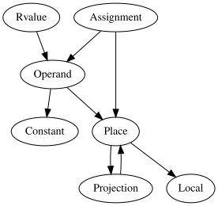

[Click here for a more detailed view](images/mir_detailed.svg)

We start out with lowering the function body to an `Rvalue` so we can create an
assignment to `RETURN_PLACE`, This `Rvalue` lowering will in turn trigger lowering to
`Operand` for its arguments (if any).
`Operand` lowering either produces a `const` operand,
or moves/copies out of a `Place`, thus triggering a `Place` lowering.
An expression being lowered to a `Place` can in turn trigger a temporary to be created
if the expression being lowered contains operations.
This is where the snake bites its
own tail and we need to trigger an `Rvalue` lowering for the expression to be written
into the local.

#### Operator lowering

Operators on builtin types are not lowered to function calls (which would end up being
infinite recursion calls, because the trait impls just contain the operation itself
again).
Instead there are `Rvalue`s for binary and unary operators and index operations.
These `Rvalue`s later get codegened to llvm primitive operations or llvm intrinsics.

Operators on all other types get lowered to a function call to their `impl` of the
operator's corresponding trait.

Regardless of the lowering kind, the arguments to the operator are lowered to `Operand`s.
This means all arguments are either constants, or refer to an already existing value
somewhere in a local or static.

#### Method call lowering

Method calls are lowered to the same `TerminatorKind` that function calls are.
In [MIR] there is no difference between method calls and function calls anymore.

#### Conditions

`if` conditions and `match` statements for `enum`s with variants that have no fields are
lowered to `TerminatorKind::SwitchInt`.
Each possible value (so `0` and `1` for `if`
conditions) has a corresponding `BasicBlock` to which the code continues.
The argument being branched on is (again) an `Operand` representing the value of
the if condition.

##### Pattern matching

`match` statements for `enum`s with variants that have fields are lowered to
`TerminatorKind::SwitchInt`, too, but the `Operand` refers to a `Place` where the
discriminant of the value can be found.
This often involves reading the discriminant to a new temporary variable.

#### Aggregate construction

Aggregate values of any kind (e.g. structs or tuples) are built via `Rvalue::Aggregate`.
All fields are lowered to `Operator`s.
This is essentially equivalent to one assignment
statement per aggregate field plus an assignment to the discriminant in the
case of `enum`s.

[MIR]: ./index.html
[HIR]: ../hir.html
[THIR]: https://doc.rust-lang.org/nightly/nightly-rustc/rustc_mir_build/thir/index.html

[`rustc_mir_build::thir::cx::expr`]: https://doc.rust-lang.org/nightly/nightly-rustc/rustc_mir_build/thir/cx/expr/index.html
[`mir_built`]: https://doc.rust-lang.org/nightly/nightly-rustc/rustc_mir_transform/fn.mir_built.html


### MIR visitor {#mir-visitor}

The MIR visitor is a convenient tool for traversing the MIR and either
looking for things or making changes to it.
The visitor traits are defined in [the `rustc_middle::mir::visit` module][m-v] – there are two of
them, generated via a single macro: `Visitor` (which operates on a
`&Mir` and gives back shared references) and `MutVisitor` (which
operates on a `&mut Mir` and gives back mutable references).

[m-v]: https://doc.rust-lang.org/nightly/nightly-rustc/rustc_middle/mir/visit/index.html

To implement a visitor, you have to create a type that represents your visitor.
Typically, this type wants to "hang on" to whatever state you will need while processing MIR:

```rust,ignore
struct MyVisitor<...> {
    tcx: TyCtxt<'tcx>,
    ...
}
```

and you then implement the `Visitor` or `MutVisitor` trait for that type:

```rust,ignore
impl<'tcx> MutVisitor<'tcx> for MyVisitor {
    fn visit_foo(&mut self, ...) {
        ...
        self.super_foo(...);
    }
}
```

As shown above, within the impl, you can override any of the
`visit_foo` methods (e.g., `visit_terminator`) in order to write some
code that will execute whenever a `foo` is found.
If you want to recursively walk the contents of the `foo`, you then invoke the
`super_foo` method.
Note that you never want to override `super_foo`.

A very simple example of a visitor can be found in [`LocalFinder`].
By implementing `visit_local` method, this visitor identifies local variables that
can be candidates for reordering.

[`LocalFinder`]: https://doc.rust-lang.org/nightly/nightly-rustc/rustc_mir_transform/prettify/struct.LocalFinder.html

#### Traversal

In addition the visitor, [the `rustc_middle::mir::traversal` module][t]
contains useful functions for walking the MIR CFG in
[different standard orders][traversal] (e.g. pre-order, reverse
post-order, and so forth).

[t]: https://doc.rust-lang.org/nightly/nightly-rustc/rustc_middle/mir/traversal/index.html
[traversal]: https://en.wikipedia.org/wiki/Tree_traversal


### MIR queries and passes {#mir-passes}

If you would like to get the MIR:

- for a function - you can use the `optimized_mir` query (typically used by codegen) or the `mir_for_ctfe` query (typically used by compile time function evaluation, i.e., *CTFE*);
- for a promoted - you can use the `promoted_mir` query.

These will give you back the final, optimized MIR.
For foreign def-ids, we simply read the MIR from the other crate's metadata.
But for local def-ids, the query will
construct the optimized MIR by requesting a pipeline of upstream queries[^query].
Each query will contain a series of passes.
This section describes how those queries and passes work and how you can extend them.

To produce the optimized MIR for a given def-id `D`, `optimized_mir(D)`
goes through several suites of passes, each grouped by a query.
Each suite consists of passes which perform linting, analysis, transformation, or optimization.
Each query represent a useful intermediate point
where we can access the MIR dialect for type checking or other purposes:

- `mir_built(D)` – it gives the initial MIR just after it's built;
- `mir_const(D)` – it applies some simple transformation passes to make MIR ready for
  const qualification;
- `mir_promoted(D)` - it extracts promotable temps into separate MIR bodies, and also makes MIR
  ready for borrow checking;
- `mir_drops_elaborated_and_const_checked(D)` - it performs borrow checking, runs major
  transformation passes (such as drop elaboration) and makes MIR ready for optimization;
- `optimized_mir(D)` – it performs all enabled optimizations and reaches the final state.

[^query]: See the [Queries](#query) chapter for the general concept of query.

#### Implementing and registering a pass

A `MirPass` is some bit of code that processes the MIR, typically transforming it along the way
somehow. But it may also do other things like linting (e.g., [`CheckPackedRef`][lint1],
[`CheckConstItemMutation`][lint2], [`FunctionItemReferences`][lint3], which implement `MirLint`) or
optimization (e.g., [`SimplifyCfg`][opt1], [`RemoveUnneededDrops`][opt2]). While most MIR passes
are defined in the [`rustc_mir_transform`][mirtransform] crate, the `MirPass` trait itself is
[found][mirpass] in the `rustc_middle` crate, and it basically consists of one primary method,
`run_pass`, that simply gets an `&mut Body` (along with the `tcx`).
The MIR is therefore modified in place (which helps to keep things efficient).

A basic example of a MIR pass is [`RemoveStorageMarkers`], which walks
the MIR and removes all storage marks if they won't be emitted during codegen.
As you can see from its source,
a MIR pass is defined by first defining a dummy type, a struct with no fields:

```rust
pub struct RemoveStorageMarkers;
```

for which we implement the `MirPass` trait.
We can then insert this pass into the appropriate list of passes found in a query like
`mir_built`, `optimized_mir`, etc. (If this is an optimization, it
should go into the `optimized_mir` list.)

Another example of a simple MIR pass is [`CleanupPostBorrowck`][cleanup-pass], which walks
the MIR and removes all statements that are not relevant to code generation.
As you can see from
its [source][cleanup-source], it is defined by first defining a dummy type, a struct with no fields:

```rust
pub struct CleanupPostBorrowck;
```

for which we implement the `MirPass` trait:

```rust
impl<'tcx> MirPass<'tcx> for CleanupPostBorrowck {
    fn run_pass(&self, tcx: TyCtxt<'tcx>, body: &mut Body<'tcx>) {
        ...
    }
}
```

We [register][pass-register] this pass inside the `mir_drops_elaborated_and_const_checked` query.
(If this is an optimization, it should go into the `optimized_mir` list.)

If you are writing a pass, there's a good chance that you are going to want to use a [MIR visitor].
MIR visitors are a handy way to walk all
the parts of the MIR, either to search for something or to make small edits.

#### Stealing

The intermediate queries `mir_const()` and `mir_promoted()` yield up
a `&'tcx Steal<Body<'tcx>>`, allocated using `tcx.alloc_steal_mir()`.
This indicates that the result may be **stolen** by a subsequent query – this is an
optimization to avoid cloning the MIR.
Attempting to use a stolen result will cause a panic in the compiler.
Therefore, it is important that you do not accidentally read from these intermediate queries without
the consideration of the dependency in the MIR processing pipeline.

Because of this stealing mechanism, some care must be taken to
ensure that, before the MIR at a particular phase in the processing
pipeline is stolen, anyone who may want to read from it has already done so.

Concretely, this means that if you have a query `foo(D)`
that wants to access the result of `mir_promoted(D)`, you need to have `foo(D)`
calling the `mir_const(D)` query first.
This will force it to execute even though you don't directly require its result.

> This mechanism is a bit dodgy. There is a discussion of more elegant
alternatives in [rust-lang/rust#41710].

##### Overview

Below is an overview of the stealing dependency in the MIR processing pipeline[^part]:

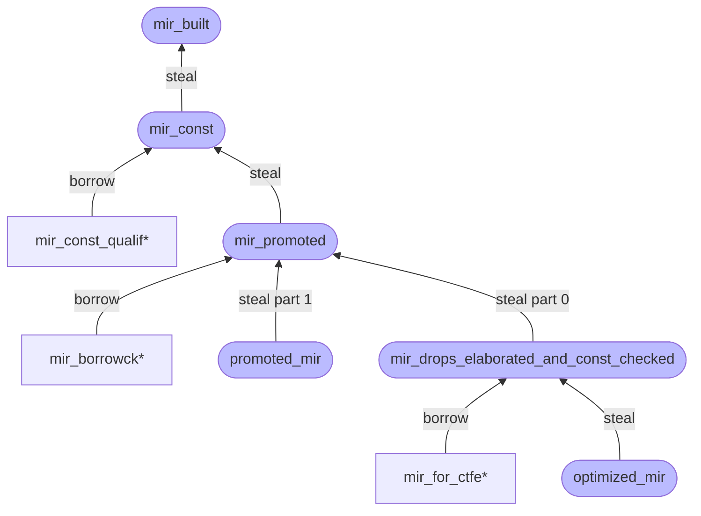

The stadium-shape queries (e.g., `mir_built`) with a deep color are the primary queries in the
pipeline, while the rectangle-shape queries (e.g., `mir_const_qualif*`[^star]) with a shallow color
are those subsequent queries that need to read the results from `&'tcx Steal<Body<'tcx>>`.
With the stealing mechanism,
the rectangle-shape queries must be performed before any stadium-shape queries,
that have an equal or larger height in the dependency tree, ever do.

[^part]: The `mir_promoted` query will yield up a tuple
`(&'tcx Steal<Body<'tcx>>, &'tcx Steal<IndexVec<Promoted, Body<'tcx>>>)`, `promoted_mir` will steal
part 1 (`&'tcx Steal<IndexVec<Promoted, Body<'tcx>>>`) and `mir_drops_elaborated_and_const_checked`
will steal part 0 (`&'tcx Steal<Body<'tcx>>`).
And their stealing is irrelevant to each other,
i.e., can be performed separately.

[^star]: Note that the `*` suffix in the queries represent a set of queries with the same prefix.
For example, `mir_borrowck*` represents `mir_borrowck`, `mir_borrowck_const_arg` and
`mir_borrowck_opt_const_arg`.

##### Example

As an example, consider MIR const qualification.
It wants to read the result produced by the `mir_const` query.
However, that result will be **stolen** by the `mir_promoted` query at some time in the pipeline.
Before `mir_promoted` is ever queried, calling the `mir_const_qualif` query
will succeed since `mir_const` will produce (if queried the first time) or cache (if queried
multiple times) the `Steal` result and the result is **not** stolen yet.
After `mir_promoted` is
queried, the result would be stolen and calling the `mir_const_qualif` query to read the result
would cause a panic.

Therefore, with this stealing mechanism, `mir_promoted` should guarantee any `mir_const_qualif*`
queries are called before it actually steals, thus ensuring that the reads have already happened
(remember that [queries are memoized](../query.html), so executing a query twice
simply loads from a cache the second time).

[rust-lang/rust#41710]: https://github.com/rust-lang/rust/issues/41710
[mirpass]: https://doc.rust-lang.org/nightly/nightly-rustc/rustc_mir_transform/pass_manager/trait.MirPass.html
[lint1]: https://doc.rust-lang.org/nightly/nightly-rustc/rustc_mir_transform/check_packed_ref/struct.CheckPackedRef.html
[lint2]: https://doc.rust-lang.org/nightly/nightly-rustc/rustc_mir_transform/check_const_item_mutation/struct.CheckConstItemMutation.html
[lint3]: https://doc.rust-lang.org/nightly/nightly-rustc/rustc_mir_transform/function_item_references/struct.FunctionItemReferences.html
[opt1]: https://doc.rust-lang.org/nightly/nightly-rustc/rustc_mir_transform/simplify/enum.SimplifyCfg.html
[opt2]: https://doc.rust-lang.org/nightly/nightly-rustc/rustc_mir_transform/remove_unneeded_drops/struct.RemoveUnneededDrops.html
[mirtransform]: https://doc.rust-lang.org/nightly/nightly-rustc/rustc_mir_transform/
[`RemoveStorageMarkers`]: https://doc.rust-lang.org/nightly/nightly-rustc/rustc_mir_transform/remove_storage_markers/struct.RemoveStorageMarkers.html
[cleanup-pass]: https://doc.rust-lang.org/nightly/nightly-rustc/rustc_mir_transform/cleanup_post_borrowck/struct.CleanupPostBorrowck.html
[cleanup-source]: https://github.com/rust-lang/rust/blob/e2b52ff73edc8b0b7c74bc28760d618187731fe8/compiler/rustc_mir_transform/src/cleanup_post_borrowck.rs#L27
[pass-register]: https://github.com/rust-lang/rust/blob/e2b52ff73edc8b0b7c74bc28760d618187731fe8/compiler/rustc_mir_transform/src/lib.rs#L413
[MIR visitor]: ./visitor.html


## Inline assembly {#asm}

### Overview

Inline assembly in rustc mostly revolves around taking an `asm!` macro invocation and plumbing it
through all of the compiler layers down to LLVM codegen.
Throughout the various stages,
an `InlineAsm` generally consists of 3 components:

- The template string, which is stored as an array of `InlineAsmTemplatePiece`.
  Each piece represents either a literal or a placeholder for an operand
  (just like format strings).

  ```rust
  pub enum InlineAsmTemplatePiece {
      String(String),
      Placeholder { operand_idx: usize, modifier: Option<char>, span: Span },
  }
  ```

- The list of operands to the `asm!` (`in`, `[late]out`, `in[late]out`, `sym`, `const`).
  These are represented differently at each stage of lowering,
  but follow a common pattern:
  - `in`, `out`, and `inout` all have an associated register class (`reg`)
    or explicit register (`"eax"`).
  - `inout` has 2 forms:
    one with a single expression that is both read from and written to,
    and one with two separate expressions for the input and output parts.
  - `out` and `inout` have a `late` flag (`lateout` / `inlateout`) to indicate that the register
    allocator is allowed to reuse an input register for this output.
  - `out` and the split variant of `inout` allow `_` to be specified for an output,
    which means that the output is discarded.
    This is used to allocate scratch registers for assembly code.
  - `const` refers to an anonymous constants,
    and generally works like an inline const.
  - `sym` is a bit special since it only accepts a path expression,
    which must point to a `static` or a `fn`.

- The options set at the end of the `asm!` macro.
  The only ones that are of particular interest to
  rustc are `NORETURN` which makes `asm!` return `!` instead of `()`,
  and `RAW` which disables format string parsing.
  The remaining options are mostly passed through to LLVM with little processing.

  ```rust
  bitflags::bitflags! {
      pub struct InlineAsmOptions: u16 {
          const PURE = 1 << 0;
          const NOMEM = 1 << 1;
          const READONLY = 1 << 2;
          const PRESERVES_FLAGS = 1 << 3;
          const NORETURN = 1 << 4;
          const NOSTACK = 1 << 5;
          const ATT_SYNTAX = 1 << 6;
          const RAW = 1 << 7;
          const MAY_UNWIND = 1 << 8;
      }
  }
  ```

### AST

`InlineAsm` is represented as an expression in the AST with the [`ast::InlineAsm` type][inline_asm_ast].

The `asm!` macro is implemented in `rustc_builtin_macros` and outputs an `InlineAsm` AST node.
The template string is parsed using `fmt_macros`,
positional and named operands are resolved to explicit operand indices.
Since target information is not available to macro invocations,
validation of the registers and register classes is deferred to AST lowering.

[inline_asm_ast]: https://doc.rust-lang.org/nightly/nightly-rustc/rustc_ast/ast/struct.InlineAsm.html

### HIR

`InlineAsm` is represented as an expression in the HIR with the [`hir::InlineAsm` type][inline_asm_hir].

AST lowering is where `InlineAsmRegOrRegClass` is converted from `Symbol`s to an actual register or
register class.
If any modifiers are specified for a template string placeholder, these are
validated against the set allowed for that operand type.
Finally, explicit registers for inputs and
outputs are checked for conflicts (same register used for different operands).

[inline_asm_hir]: https://doc.rust-lang.org/nightly/nightly-rustc/rustc_hir/hir/struct.InlineAsm.html

### Type checking

Each register class has an allowlist of types that it may be used with.
After the types of all operands have been determined,
the `intrinsicck` pass will check that these types are in the allowlist.
It also checks that split `inout` operands have compatible types and that `const`
operands are integers or floats.
Suggestions are emitted where needed if a template modifier should
be used for an operand based on the type that was passed into it.

### THIR

`InlineAsm` is represented as an expression in the THIR with the [`InlineAsmExpr` type][inline_asm_thir].

The only significant change compared to HIR is that `Sym` has been lowered to either a `SymFn`
whose `expr` is a `Literal` ZST of the `fn`,
or a `SymStatic` which points to the `DefId` of a `static`.

[inline_asm_thir]: https://doc.rust-lang.org/nightly/nightly-rustc/rustc_middle/thir/struct.InlineAsmExpr.html

### MIR

`InlineAsm` is represented as a `Terminator` in the MIR with the [`TerminatorKind::InlineAsm` variant][inline_asm_mir]

As part of THIR lowering, `InOut` and `SplitInOut` operands are lowered to a split form with a
separate `in_value` and `out_place`.

Semantically, the `InlineAsm` terminator is similar to the `Call` terminator except that it has
multiple output places where a `Call` only has a single return place output.

[inline_asm_mir]: https://doc.rust-lang.org/nightly/nightly-rustc/rustc_middle/mir/enum.TerminatorKind.html#variant.InlineAsm

### Codegen

Operands are lowered one more time before being passed to LLVM codegen.
This is represented by the [`InlineAsmOperandRef` type][inline_asm_codegen] from `rustc_codegen_ssa`.

The operands are lowered to LLVM operands and constraint codes as follows:
- `out` and the output part of `inout` operands are added first, as required by LLVM.
  Late output operands have a `=` prefix added to their constraint code,
  and non-late output operands have a `=&` prefix added to their constraint code.
- `in` operands are added normally.
- `inout` operands are tied to the matching output operand.
- `sym` operands are passed as function pointers or pointers,
  using the `"s"` constraint.
- `const` operands are formatted to a string and directly inserted in the template string.

The template string is converted to LLVM form:
- `$` characters are escaped as `$$`.
- `const` operands are converted to strings and inserted directly.
- Placeholders are formatted as `${X:M}`,
  where `X` is the operand index and `M` is the modifier character.
  Modifiers are converted from the Rust form to the LLVM form.

The various options are converted to clobber constraints or LLVM attributes;
refer to the [RFC] for more details.

Note that LLVM is sometimes rather picky about what types it accepts for certain constraint codes
so we sometimes need to insert conversions to/from a supported type.
See the target-specific ISelLowering.cpp files in LLVM
for details of what types are supported for each register class.

[inline_asm_codegen]: https://doc.rust-lang.org/nightly/nightly-rustc/rustc_codegen_ssa/traits/enum.InlineAsmOperandRef.html
[RFC]: https://github.com/Amanieu/rfcs/blob/inline-asm/text/0000-inline-asm.md#mapping-to-llvm-ir

### Adding support for new architectures

Adding inline assembly support to an architecture is mostly a matter of defining the registers and
register classes for that architecture.
All the definitions for register classes are located in
`compiler/rustc_target/asm/`.

Additionally you will need to implement lowering of these register classes to LLVM constraint codes
in `compiler/rustc_codegen_llvm/asm.rs`.

When adding a new architecture, make sure to cross-reference with the LLVM source code:
- LLVM has restrictions on which types can be used with a particular constraint code.
  Refer to the `getRegForInlineAsmConstraint` function
  in `lib/Target/${ARCH}/${ARCH}ISelLowering.cpp`.
- LLVM reserves certain registers for its internal use,
  which causes them to not be saved/restored properly around inline assembly blocks.
  These registers are listed in the `getReservedRegs`
  function in `lib/Target/${ARCH}/${ARCH}RegisterInfo.cpp`.
  Any "conditionally" reserved register,
  such as the frame/base pointer,
  must always be treated as reserved for Rust purposes because we
  can't know ahead of time whether a function will require a frame/base pointer.

### Tests

Various tests for inline assembly are available:

- `tests/assembly-llvm/asm`
- `tests/ui/asm`
- `tests/codegen-llvm/asm-*`

Every architecture supported by inline assembly must have exhaustive tests in
`tests/assembly-llvm/asm` which test all combinations of register classes and types.


# Supporting infrastructure

## Command-line Arguments {#cli}

Command-line flags are documented in the [rustc book][cli-docs]. All *stable*
flags should be documented there. Unstable flags should be documented in the
[unstable book].

See the [forge guide for new options] for details on the *procedure* for
adding a new command-line argument.

### Guidelines

- Flags should be orthogonal to each other. For example, if we'd have a
  json-emitting variant of multiple actions `foo` and `bar`, an additional
  `--json` flag is better than adding `--foo-json` and `--bar-json`.
- Avoid flags with the `no-` prefix. Instead, use the [`parse_bool`] function,
  such as `-C embed-bitcode=no`.
- Consider the behavior if the flag is passed multiple times. In some
  situations, the values should be accumulated (in order!). In other
  situations, subsequent flags should override previous flags (for example,
  the lint-level flags). And some flags (like `-o`) should generate an error
  if it is too ambiguous what multiple flags would mean.
- Always give options a long descriptive name, if only for more understandable
  compiler scripts.
- The `--verbose` flag is for adding verbose information to `rustc`
  output. For example, using it with the `--version`
  flag gives information about the hashes of the compiler code.
- Experimental flags and options must be guarded behind the `-Z
  unstable-options` flag.

[cli-docs]: https://doc.rust-lang.org/rustc/command-line-arguments.html
[forge guide for new options]: https://forge.rust-lang.org/compiler/proposals-and-stabilization.html#compiler-flags
[unstable book]: https://doc.rust-lang.org/nightly/unstable-book/
[`parse_bool`]: https://github.com/rust-lang/rust/blob/e5335592e78354e33d798d20c04bcd677c1df62d/src/librustc_session/options.rs#L307-L313


## `rustc_driver` and `rustc_interface` {#rustc-driver-intro}

### `rustc_driver`

The [`rustc_driver`] is essentially `rustc`'s `main` function.
It acts as the glue for running the various phases of the compiler in the correct order,
using the interface defined in the [`rustc_interface`] crate. Where possible, using [`rustc_driver`] rather than [`rustc_interface`] is recommended.

The main entry point of [`rustc_driver`] is [`rustc_driver::run_compiler`][rd_rc].
This builder accepts the same command-line args as rustc as well as an implementation of [`Callbacks`] and a couple of other optional options.
[`Callbacks`] is a `trait` that allows for custom compiler configuration,
as well as allowing custom code to run after different phases of the compilation.

### `rustc_interface`

The [`rustc_interface`] crate provides a low level API to external users for manually driving the compilation process,
allowing third parties to effectively use `rustc`'s internals as a library for analyzing a crate or for ad hoc emulating of the compiler for cases where [`rustc_driver`] is not flexible enough (i.e. `rustdoc` compiling code and serving output).

The main entry point of [`rustc_interface`] ([`rustc_interface::run_compiler`][i_rc]) takes a configuration variable for the compiler
and a `closure` taking a yet unresolved [`Compiler`].
[`run_compiler`][i_rc] creates a `Compiler` from the configuration and passes it to the `closure`.
Inside the `closure` you can use the `Compiler` to call various functions to compile a crate and get the results.
You can see a minimal example of how to use [`rustc_interface`] [here][example].

You can see an example of how to use the various functions using [`rustc_interface`] needs by looking at the `rustc_driver` implementation,
specifically [`rustc_driver_impl::run_compiler`][rdi_rc]
(not to be confused with [`rustc_interface::run_compiler`][i_rc]).

> **Warning:** By its very nature, the internal compiler APIs are always going
> to be unstable. That said, we do try not to break things unnecessarily.


[`Compiler`]: https://doc.rust-lang.org/nightly/nightly-rustc/rustc_interface/interface/struct.Compiler.html
[`rustc_driver`]: https://doc.rust-lang.org/nightly/nightly-rustc/rustc_driver/
[`rustc_interface`]: https://doc.rust-lang.org/nightly/nightly-rustc/rustc_interface/index.html
[`Callbacks`]: https://doc.rust-lang.org/nightly/nightly-rustc/rustc_driver/trait.Callbacks.html
[example]: https://github.com/rust-lang/rustc-dev-guide/blob/main/examples/rustc-interface-example.rs
[i_rc]: https://doc.rust-lang.org/nightly/nightly-rustc/rustc_interface/interface/fn.run_compiler.html
[rd_rc]: https://doc.rust-lang.org/nightly/nightly-rustc/rustc_driver/fn.run_compiler.html
[rdi_rc]: https://doc.rust-lang.org/nightly/nightly-rustc/rustc_driver_impl/fn.run_compiler.html


### External `rustc_driver`s {#rustc-driver-external-rustc-drivers}

#### `rustc_private`

##### Overview

The `rustc_private` feature allows external crates to use compiler internals.

##### Using `rustc_private` with official toolchains

When using the `rustc_private` feature with official Rust toolchains distributed via rustup, you need to install two additional components:

1. **`rustc-dev`**: Provides compiler libraries
2. **`llvm-tools`**: Provides LLVM libraries required for linking

###### Installation steps

Install both components using rustup:

```text
rustup component add rustc-dev llvm-tools
```

###### Common error

Without the `llvm-tools` component, you'll encounter linking errors like:

```text
error: linking with `cc` failed: exit status: 1
  |
  = note: rust-lld: error: unable to find library -lLLVM-{version}
```

##### Using `rustc-private` with Custom Toolchains

For custom-built toolchains or environments not using rustup, additional configuration is typically required:

###### Requirements

- LLVM libraries must be available in your system's library search paths
- The LLVM version must match the one used to build your Rust toolchain

###### Troubleshooting steps

1. Verify LLVM is installed and accessible
2. Ensure that library paths are set:
   ```sh
   export LD_LIBRARY_PATH=/path/to/llvm/lib:$LD_LIBRARY_PATH
   ```
3. Ensure your LLVM version is compatible with your Rust toolchain

##### Configuring `rust-analyzer` for out-of-tree projects

When developing out-of-tree projects that use `rustc_private` crates, you can configure `rust-analyzer` to recognize these crates.

###### Configuration steps

1. Configure `rust-analyzer.rustc.source` to `"discover"` in your editor settings.

   For VS Code, add to `rust_analyzer_settings.json`:
   ```json
   {
       "rust-analyzer.rustc.source": "discover"
   }
   ```

2. Add the following to the `Cargo.toml` of every crate that uses `rustc_private`:
   ```toml
   [package.metadata.rust-analyzer]
   rustc_private = true
   ```

This configuration allows `rust-analyzer` to properly recognize and provide IDE support for `rustc_private` crates in out-of-tree projects.

##### Getting nightly documentation for `rustc_private`

###### Latest nightly

For the latest nightly, you can install the `rustc-docs` component and open it directly in your browser:

```sh
rustup component add rustc-docs
rustup doc --rustc-docs
```

> Note: The `rustc-docs` component is only available for recent nightly toolchains and may not be present for every nightly date. It was first introduced in [PR #75560](https://github.com/rust-lang/rust/pull/75560) (August 2020).

###### Older nightlies

If you depend on compiler internals from an older nightly, you may want to refer to the internal documentation from that particular nightly.
The only way to do this is to generate the documentation locally.
For example, to get documentation for `nightly-2025-11-08`:

Get the Git commit hash for that nightly:

```sh
rustup toolchain install nightly-2025-11-08
rustc +nightly-2025-11-08 --version --verbose
```

The output will include a `commit-hash` line identifying the exact source revision.
Check out `rust-lang/rust` at that commit, then follow the steps in [compiler documentation](#building-compiler-documenting).


##### Additional resources

- [GitHub Issue #137421] explains that `rustc_private` linker failures often occur because `llvm-tools` is not installed

[GitHub Issue #137421]: https://github.com/rust-lang/rust/issues/137421


### Example: Type checking through `rustc_driver` {#rustc-driver-interacting-with-the-ast}

[`rustc_driver`] allows you to interact with Rust code at various stages of compilation.

#### Getting the type of an expression

To get the type of an expression, use the [`after_analysis`] callback to get a [`TyCtxt`].

```rust
{{#include ../../examples/rustc-driver-interacting-with-the-ast.rs}}
```
[`after_analysis`]: https://doc.rust-lang.org/nightly/nightly-rustc/rustc_driver/trait.Callbacks.html#method.after_analysis
[`rustc_driver`]: https://doc.rust-lang.org/nightly/nightly-rustc/rustc_driver
[`TyCtxt`]: https://doc.rust-lang.org/nightly/nightly-rustc/rustc_middle/ty/context/struct.TyCtxt.html


### Example: Getting diagnostic through `rustc_interface` {#rustc-driver-getting-diagnostics}

The [`rustc_interface`] allows you to intercept diagnostics that would
otherwise be printed to stderr.

#### Getting diagnostics

To get diagnostics from the compiler,
configure [`rustc_interface::Config`] to output diagnostic to a buffer,
and run [`TyCtxtEnsureOk::typeck`] for each item.

```rust
{{#include ../../examples/rustc-interface-getting-diagnostics.rs}}
```

[`rustc_interface`]: https://doc.rust-lang.org/nightly/nightly-rustc/rustc_interface/index.html
[`rustc_interface::Config`]: https://doc.rust-lang.org/nightly/nightly-rustc/rustc_interface/interface/struct.Config.html
[`TyCtxtEnsureOk::typeck`]: https://doc.rust-lang.org/nightly/nightly-rustc/rustc_middle/query/struct.TyCtxtEnsureOk.html#method.typeck


## Errors and lints {#diagnostics}

A lot of effort has been put into making `rustc` have great error messages.
This chapter is about how to emit compile errors and lints from the compiler.

### Diagnostic structure

The main parts of a diagnostic error are the following:

```
error[E0000]: main error message
  --> file.rs:LL:CC
   |
LL | <code>
   | -^^^^- secondary label
   |  |
   |  primary label
   |
   = note: note without a `Span`, created with `.note`
note: sub-diagnostic message for `.span_note`
  --> file.rs:LL:CC
   |
LL | more code
   |      ^^^^
```

- Level (`error`, `warning`, etc.). It indicates the severity of the message.
  (See [diagnostic levels](#diagnostic-levels))
- Code (for example, for "mismatched types", it is `E0308`).
  It helps users get more information about the current error through an extended
  description of the problem in the error code index.
  Not all diagnostic have a code.
  For example, diagnostics created by lints don't have one.
- Message.
  It is the main description of the problem.
  It should be general and able to stand on its own, so that it can make sense even in isolation.
- Diagnostic window.
  This contains several things:
  - The path, line number and column of the beginning of the primary span.
  - The users' affected code and its surroundings.
  - Primary and secondary spans underlying the users' code.
    These spans can optionally contain one or more labels.
    - Primary spans should have enough text to describe the problem in such a
      way that if it were the only thing being displayed (for example, in an
      IDE) it would still make sense.
      Because it is "spatially aware" (it
      points at the code), it can generally be more succinct than the error message.
    - If cluttered output can be foreseen in cases when multiple span labels
      overlap, it is a good idea to tweak the output appropriately.
      For example, the `if/else arms have incompatible types` error uses different
      spans depending on whether the arms are all in the same line, if one of
      the arms is empty and if none of those cases applies.
- Sub-diagnostics.
  Any error can have multiple sub-diagnostics that look similar to the main part of the error.
  These are used for cases where the
  order of the explanation might not correspond with the order of the code.
  If the order of the explanation can be "order free", leveraging secondary labels
  in the main diagnostic is preferred, as it is typically less verbose.

The text should be matter of fact and avoid capitalization and periods, unless
multiple sentences are _needed_:

```txt
error: the fobrulator needs to be krontrificated
```

When code or an identifier must appear in a message or label, it should be
surrounded with backticks:

```txt
error: the identifier `foo.bar` is invalid
```

#### Error codes and explanations

Most errors have an associated error code.
Error codes are linked to long-form
explanations which contains an example of how to trigger the error and in-depth
details about the error.
They may be viewed with the `--explain` flag, or via the [error index].

As a general rule, give an error a code (with an associated explanation) if the
explanation would give more information than the error itself.
A lot of the time it's better to put all the information in the emitted error itself.
However,
sometimes that would make the error verbose or there are too many possible
triggers to include useful information for all cases in the error, in which case
it's a good idea to add an explanation.[^estebank]
As always, if you are not sure, just ask your reviewer!

If you decide to add a new error with an associated error code, please read
[this section][error-codes] for a guide and important details about the process.

[^estebank]: This rule of thumb was suggested by **@estebank** [here][estebank-comment].

[error index]: https://doc.rust-lang.org/error-index.html
[estebank-comment]: https://github.com/rust-lang/rustc-dev-guide/pull/967#issuecomment-733218283
[error-codes]: #diagnostics-error-codes

#### Lints versus fixed diagnostics

Some messages are emitted via [lints](#lints), where the user can control the level.
Most diagnostics are hard-coded such that the user cannot control the level.

Usually it is obvious whether a diagnostic should be "fixed" or a lint, but
there are some grey areas.

Here are a few examples:

- Borrow checker errors: these are fixed errors.
  The user cannot adjust the level of these diagnostics to silence the borrow checker.
- Dead code: this is a lint.
  While the user probably doesn't want dead code in
  their crate, making this a hard error would make refactoring and development very painful.
- [future-incompatible lints]: these are silenceable lints.
  It was decided that making them fixed errors would cause too much breakage,
  so warnings are instead emitted,
  and will eventually be turned into fixed (hard) errors.

Hard-coded warnings (those using methods like `span_warn`) should be avoided
for normal code, preferring to use lints instead.
Some cases, such as warnings with CLI flags, will require the use of hard-coded warnings.

See the `deny` [lint level](#diagnostic-levels) below for guidelines when to
use an error-level lint instead of a fixed error.

[future-incompatible lints]: #future-incompatible-lints

### Diagnostic output style guide

- Write in plain simple English.
  If your message, when shown on a – possibly
  small – screen (which hasn't been cleaned for a while), cannot be understood
  by a normal programmer, who just came out of bed after a night partying,
  it's too complex.
- `Error`, `Warning`, `Note`, and `Help` messages start with a lowercase
  letter and do not end with punctuation.
- Error messages should be succinct.
  Users will see these error messages many
  times, and more verbose descriptions can be viewed with the `--explain` flag.
  That said, don't make it so terse that it's hard to understand.
- The word "illegal" is illegal.
  Prefer "invalid" or a more specific word instead.
- Errors should document the span of code where they occur (use
  [`rustc_errors::DiagCtxt`][DiagCtxt]'s
  `span_*` methods or a diagnostic struct's `#[primary_span]` to easily do this).
  Also `note` other spans that have contributed to the error if the span isn't too large.
- When emitting a message with span, try to reduce the span to the smallest
  amount possible that still signifies the issue
- Try not to emit multiple error messages for the same error.
  This may require detecting duplicates.
- When the compiler has too little information for a specific error message,
  consult with the compiler team to add new attributes for library code that
  allow adding more information.
  For example, see [`#[rustc_on_unimplemented]`](#rustc_on_unimplemented).
  Use these annotations when available!
- Keep in mind that Rust's learning curve is rather steep, and that the
  compiler messages are an important learning tool.
- When talking about the compiler, call it `the compiler`, not `Rust` or `rustc`.
- Use the [Oxford comma](https://en.wikipedia.org/wiki/Serial_comma) when writing lists of items.
- When mentioning attributes, use this form whenever possible: "the `inline` attribute".
  Don't include `#[`/`#![`/`]` delimiters or attribute arguments in the message or the span unless
  they are relevant.

#### Lint naming

From [RFC 0344], lint names should be consistent, with the following guidelines:

The basic rule is: the lint name should make sense when read as "allow
*lint-name*" or "allow *lint-name* items".
For example, "allow `deprecated` items" and "allow `dead_code`" makes sense, while "allow
`unsafe_block`" is ungrammatical (should be plural).

- Lint names should state the bad thing being checked for, e.g. `deprecated`,
  so that `#[allow(deprecated)]` (items) reads correctly.
  Thus, `ctypes` is not an appropriate name; `improper_ctypes` is.

- Lints that apply to arbitrary items (like the stability lints) should just
  mention what they check for: use `deprecated` rather than `deprecated_items`.
  This keeps lint names short.
  (Again, think "allow *lint-name* items".)

- If a lint applies to a specific grammatical class, mention that class and
  use the plural form: use `unused_variables` rather than `unused_variable`.
  This makes `#[allow(unused_variables)]` read correctly.

- Lints that catch unnecessary, unused, or useless aspects of code should use
  the term `unused`, e.g. `unused_imports`, `unused_typecasts`.

- Use snake case in the same way you would for function names.

[RFC 0344]: https://github.com/rust-lang/rfcs/blob/master/text/0344-conventions-galore.md#lints

#### Diagnostic levels

Guidelines for different diagnostic levels:

- `error`: emitted when the compiler detects a problem that makes it unable to
  compile the program, either because the program is invalid or the programmer
  has decided to make a specific `warning` into an error.

- `warning`: emitted when the compiler detects something odd about a program.
  Care should be taken when adding warnings to avoid warning fatigue, and
  avoid false-positives where there really isn't a problem with the code.
  Some examples of when it is appropriate to issue a warning:

  - A situation where the user *should* take action, such as swap out a
    deprecated item, or use a `Result`, but otherwise doesn't prevent compilation.
  - Unnecessary syntax that can be removed without affecting the semantics of the code.
    For example, unused code, or unnecessary `unsafe`.
  - Code that is very likely to be incorrect, dangerous, or confusing, but the
    language technically allows, and is not ready or confident enough to make an error.
    Examples are `unused_comparisons` (out of bounds comparisons) or
    `bindings_with_variant_name` (the user likely did not intend to create a
    binding in a pattern).
  - [Future-incompatible lints](#future-incompatible), where something was
    accidentally or erroneously accepted in the past, but rejecting would
    cause excessive breakage in the ecosystem.
  - Stylistic choices.
    For example, camel or snake case, or the `dyn` trait warning in the 2018 edition.
    These have a high bar to be added, and should only be used in exceptional circumstances.
    Other stylistic choices should
    either be allow-by-default lints, or part of other tools like Clippy or rustfmt.

- `help`: emitted following an `error` or `warning` to give additional
  information to the user about how to solve their problem.
  These messages often include a suggestion string and [`rustc_errors::Applicability`]
  confidence level to guide automated source fixes by tools.
  See the [Suggestions](#suggestions) section for more details.

  The error or warning portion should *not* suggest how to fix the problem,
  only the "help" sub-diagnostic should.

- `note`: emitted to give more context and identify additional circumstances
  and parts of the code that caused the warning or error.
  For example, the borrow checker will note any previous conflicting borrows.

  `help` vs `note`: `help` should be used to show changes the user can
  possibly make to fix the problem.
  `note` should be used for everything else,
  such as other context, information and facts, online resources to read, etc.

Not to be confused with *lint levels*, whose guidelines are:

- `forbid`: Lints should never default to `forbid`.
- `deny`: Equivalent to `error` diagnostic level.
  Some examples:

  - A future-incompatible or edition-based lint that has graduated from the warning level.
  - Something that has an extremely high confidence that is incorrect, but
    still want an escape hatch to allow it to pass.

- `warn`: Equivalent to the `warning` diagnostic level.
  See `warning` above for guidelines.
- `allow`: Examples of the kinds of lints that should default to `allow`:

  - The lint has a too high false positive rate.
  - The lint is too opinionated.
  - The lint is experimental.
  - The lint is used for enforcing something that is not normally enforced.
    For example, the `unsafe_code` lint can be used to prevent usage of unsafe code.

More information about lint levels can be found in the [rustc
book][rustc-lint-levels] and the [reference][reference-diagnostics].

[`rustc_errors::Applicability`]: https://doc.rust-lang.org/nightly/nightly-rustc/rustc_errors/enum.Applicability.html
[reference-diagnostics]: https://doc.rust-lang.org/nightly/reference/attributes/diagnostics.html#lint-check-attributes
[rustc-lint-levels]: https://doc.rust-lang.org/nightly/rustc/lints/levels.html

### Helpful tips and options

#### Finding the source of errors

There are three main ways to find where a given error is emitted:

- `grep` for either a sub-part of the error message/label or error code.
  This usually works well and is straightforward, but there are some cases where
  the code emitting the error is removed from the code where the error is
  constructed behind a relatively deep call-stack.
  Even then, it is a good way to get your bearings.
- Invoking `rustc` with the nightly-only flag `-Z treat-err-as-bug=1`
  will treat the first error being emitted as an Internal Compiler Error, which
  allows you to get a stack trace at the point the error has been emitted.
  Change the `1` to something else if you wish to trigger on a later error.

  There are limitations with this approach:
  - Some calls get elided from the stack trace because they get inlined in the compiled `rustc`.
  - The _construction_ of the error is far away from where it is _emitted_,
    a problem similar to the one we faced with the `grep` approach.
    In some cases, we buffer multiple errors in order to emit them in order.
- Invoking `rustc` with `-Z track-diagnostics` will print error creation
  locations alongside the error.

The regular development practices apply: judicious use of `debug!()` statements
and use of a debugger to trigger break points in order to figure out in what
order things are happening.

### `Span`

[`Span`][span] is the primary data structure in `rustc` used to represent a
location in the code being compiled.
`Span`s are attached to most constructs in
HIR and MIR, allowing for more informative error reporting.

[span]: https://doc.rust-lang.org/nightly/nightly-rustc/rustc_span/struct.Span.html

A `Span` can be looked up in a [`SourceMap`][sourcemap] to get a "snippet"
useful for displaying errors with [`span_to_snippet`][sptosnip] and other
similar methods on the `SourceMap`.

[sourcemap]: https://doc.rust-lang.org/nightly/nightly-rustc/rustc_span/source_map/struct.SourceMap.html
[sptosnip]: https://doc.rust-lang.org/nightly/nightly-rustc/rustc_span/source_map/struct.SourceMap.html#method.span_to_snippet

### Error messages

The [`rustc_errors`][errors] crate defines most of the utilities used for reporting errors.

[errors]: https://doc.rust-lang.org/nightly/nightly-rustc/rustc_errors/index.html

Diagnostics can be implemented as types which implement the `Diagnostic` trait.
This is preferred for new diagnostics as it enforces a separation
between diagnostic emitting logic and the main code paths.
For less-complex diagnostics, the `Diagnostic` trait can be derived -- see [Diagnostic
structs][diagnostic-structs].
Within the trait implementation, the APIs described below can be used as normal.

[diagnostic-structs]: #diagnostics-diagnostic-structs

[`DiagCtxt`][DiagCtxt] has methods that create and emit errors.
These methods
usually have names like `span_err` or `struct_span_err` or `span_warn`, etc...
There are lots of them; they emit different types of "errors", such as
warnings, errors, fatal errors, suggestions, etc.

[DiagCtxt]: https://doc.rust-lang.org/nightly/nightly-rustc/rustc_errors/struct.DiagCtxt.html

In general, there are two classes of such methods: ones that emit an error
directly and ones that allow finer control over what to emit.
For example,
[`span_err`][spanerr] emits the given error message at the given `Span`, but
[`struct_span_err`][strspanerr] instead returns a [`Diag`][diag].

Most of these methods will accept strings, but it is recommended that typed
identifiers for translatable diagnostics be used for new diagnostics (see
[Translation]).

[translation]: #diagnostics-translation

`Diag` allows you to add related notes and suggestions to an error
before emitting it by calling the [`emit`] method.
(Failing to either emit or [cancel] a `Diag` will result in an ICE.) See the
[docs][diag] for more info on what you can do.

[spanerr]: https://doc.rust-lang.org/nightly/nightly-rustc/rustc_errors/struct.DiagCtxt.html#method.span_err
[strspanerr]: https://doc.rust-lang.org/nightly/nightly-rustc/rustc_errors/struct.DiagCtxt.html#method.struct_span_err
[`emit`]: https://doc.rust-lang.org/nightly/nightly-rustc/rustc_errors/struct.Diag.html#method.emit
[cancel]: https://doc.rust-lang.org/nightly/nightly-rustc/rustc_errors/struct.Diag.html#method.cancel

```rust,ignore
// Get a `Diag`. This does _not_ emit an error yet.
let mut err = sess.dcx.struct_span_err(sp, fluent::example::example_error);

// In some cases, you might need to check if `sp` is generated by a macro to
// avoid printing weird errors about macro-generated code.

if let Ok(snippet) = sess.source_map().span_to_snippet(sp) {
    // Use the snippet to generate a suggested fix
    err.span_suggestion(suggestion_sp, fluent::example::try_qux_suggestion, format!("qux {}", snippet));
} else {
    // If we weren't able to generate a snippet, then emit a "help" message
    // instead of a concrete "suggestion". In practice this is unlikely to be
    // reached.
    err.span_help(suggestion_sp, fluent::example::qux_suggestion);
}

// emit the error
err.emit();
```

```fluent
example-example-error = oh no! this is an error!
  .try-qux-suggestion = try using a qux here
  .qux-suggestion = you could use a qux here instead
```

### Suggestions

In addition to telling the user exactly _why_ their code is wrong, it's
oftentimes furthermore possible to tell them how to fix it.
To this end,
[`Diag`][diag] offers a structured suggestions API, which formats code
suggestions pleasingly in the terminal, or (when the `--error-format json` flag
is passed) as JSON for consumption by tools like [`rustfix`][rustfix].

[rustfix]: https://github.com/rust-lang/rustfix

Not all suggestions should be applied mechanically;
they have a degree of confidence in the suggested code,
from high (`Applicability::MachineApplicable`) to low (`Applicability::MaybeIncorrect`).
Be conservative when choosing the level.
Use the [`span_suggestion`][span_suggestion] method of `Diag` to
make a suggestion.
The last argument provides a hint to tools whether the suggestion is mechanically applicable or not.

Suggestions point to one or more spans with corresponding code that will
replace their current content.

The message that accompanies them should be understandable in the following contexts:

- shown as an independent sub-diagnostic (this is the default output)
- shown as a label pointing at the affected span (this is done automatically if
some heuristics for verbosity are met)
- shown as a `help` sub-diagnostic with no content (used for cases where the
suggestion is obvious from the text, but we still want to let tools to apply them)
- not shown (used for _very_ obvious cases, but we still want to allow tools to apply them)

[span_suggestion]: https://doc.rust-lang.org/nightly/nightly-rustc/rustc_errors/struct.Diag.html#method.span_suggestion

For example, to make our `qux` suggestion machine-applicable, we would do:

```rust,ignore
let mut err = sess.dcx.struct_span_err(sp, fluent::example::message);

if let Ok(snippet) = sess.source_map().span_to_snippet(sp) {
    err.span_suggestion(
        suggestion_sp,
        fluent::example::try_qux_suggestion,
        format!("qux {}", snippet),
        Applicability::MachineApplicable,
    );
} else {
    err.span_help(suggestion_sp, fluent::example::qux_suggestion);
}

err.emit();
```

This might emit an error like

```console
$ rustc mycode.rs
error[E0999]: oh no! this is an error!
 --> mycode.rs:3:5
  |
3 |     sad()
  |     ^ help: try using a qux here: `qux sad()`

error: aborting due to previous error

For more information about this error, try `rustc --explain E0999`.
```

In some cases, like when the suggestion spans multiple lines or when there are
multiple suggestions, the suggestions are displayed on their own:

```console
error[E0999]: oh no! this is an error!
 --> mycode.rs:3:5
  |
3 |     sad()
  |     ^
help: try using a qux here:
  |
3 |     qux sad()
  |     ^^^

error: aborting due to previous error

For more information about this error, try `rustc --explain E0999`.
```

The possible values of [`Applicability`][appl] are:

- `MachineApplicable`: Can be applied mechanically.
- `HasPlaceholders`: Cannot be applied mechanically because it has placeholder
  text in the suggestions.
  For example: ```try adding a type: `let x: <type>` ```.
- `MaybeIncorrect`: Cannot be applied mechanically because the suggestion may
  or may not be a good one.
- `Unspecified`: Cannot be applied mechanically because we don't know which
  of the above cases it falls into.

[appl]: https://doc.rust-lang.org/nightly/nightly-rustc/rustc_errors/enum.Applicability.html

#### Suggestion Style Guide

- Suggestions should not be a question.
  In particular, language like "did you mean" should be avoided.
  Sometimes, it's unclear why a particular suggestion is being made.
  In these cases, it's better to be upfront about what the suggestion is.

  Compare "did you mean: `Foo`" vs.
  "there is a struct with a similar name: `Foo`".

- The message should not contain any phrases like "the following", "as shown",
  etc. Use the span to convey what is being talked about.
- The message may contain further instruction such as "to do xyz, use" or "to do xyz, use abc".
- The message may contain a name of a function, variable, or type, but avoid whole expressions.

### Lints

The compiler linting infrastructure is defined in the [`rustc_middle::lint`][rlint] module.

[rlint]: https://doc.rust-lang.org/nightly/nightly-rustc/rustc_middle/lint/index.html

#### When do lints run?

Different lints will run at different times based on what information the lint needs to do its job.
Some lints get grouped into *passes* where the lints
within a pass are processed together via a single visitor.
Some of the passes are:

- Pre-expansion pass: Works on [AST nodes] before [macro expansion].
  This should generally be avoided.
  - Example: [`keyword_idents`] checks for identifiers that will become
    keywords in future editions, but is sensitive to identifiers used in macros.

- Early lint pass: Works on [AST nodes] after [macro expansion] and name
  resolution, just before [AST lowering].
  These lints are for purely syntactical lints.
  - Example: The [`unused_parens`] lint checks for parenthesized-expressions
    in situations where they are not needed, like an `if` condition.

- Late lint pass: Works on [HIR nodes], towards the end of [analysis] (after
  borrow checking, etc.). These lints have full type information available.
  Most lints are late.
  - Example: The [`invalid_value`] lint (which checks for obviously invalid
    uninitialized values) is a late lint because it needs type information to
    figure out whether a type allows being left uninitialized.

- MIR pass: Works on [MIR nodes].
  This isn't quite the same as other passes;
  lints that work on MIR nodes have their own methods for running.
  - Example: The [`arithmetic_overflow`] lint is emitted when it detects a
    constant value that may overflow.

Most lints work well via the pass systems, and they have a fairly
straightforward interface and easy way to integrate (mostly just implementing
a specific `check` function).
However, some lints are easier to write when
they live on a specific code path anywhere in the compiler.
For example, the [`unused_mut`] lint is implemented in the borrow checker as it requires some
information and state in the borrow checker.

Some of these inline lints fire before the linting system is ready.
Those lints will be *buffered* where they are held until later phases of the
compiler when the linting system is ready.
See [Linting early in the compiler](#linting-early-in-the-compiler).


[AST nodes]: #the-parser
[AST lowering]: #hir-lowering
[HIR nodes]: #hir
[MIR nodes]: #mir-index
[macro expansion]: #macro-expansion
[analysis]: #part-4-intro
[`keyword_idents`]: https://doc.rust-lang.org/rustc/lints/listing/allowed-by-default.html#keyword-idents
[`unused_parens`]: https://doc.rust-lang.org/rustc/lints/listing/warn-by-default.html#unused-parens
[`invalid_value`]: https://doc.rust-lang.org/rustc/lints/listing/warn-by-default.html#invalid-value
[`arithmetic_overflow`]: https://doc.rust-lang.org/rustc/lints/listing/deny-by-default.html#arithmetic-overflow
[`unused_mut`]: https://doc.rust-lang.org/rustc/lints/listing/warn-by-default.html#unused-mut

#### Lint definition terms

Lints are managed via the [`LintStore`][LintStore] and get registered in various ways.
The following terms refer to the different classes of lints
generally based on how they are registered.

- *Built-in* lints are defined inside the compiler source.
- *Driver-registered* lints are registered when the compiler driver is created
  by an external driver.
  This is the mechanism used by Clippy, for example.
- *Tool* lints are lints with a path prefix like `clippy::` or `rustdoc::`.
- *Internal* lints are the `rustc::` scoped tool lints that only run on the
  rustc source tree itself and are defined in the compiler source like a regular built-in lint.

More information about lint registration can be found in the [LintStore] chapter.

[LintStore]: #diagnostics-lintstore

#### Declaring a lint

The built-in compiler lints are defined in the [`rustc_lint`][builtin] crate.
Lints that need to be implemented in other crates are defined in [`rustc_lint_defs`].
You should prefer to place lints in `rustc_lint` if possible.
One benefit is that it is close to the dependency root, so it can be much faster to work on.

[builtin]: https://doc.rust-lang.org/nightly/nightly-rustc/rustc_lint/index.html
[`rustc_lint_defs`]: https://doc.rust-lang.org/nightly/nightly-rustc/rustc_lint_defs/index.html

Every lint is implemented via a `struct` that implements the `LintPass` `trait`
(you can also implement one of the more specific lint pass traits, either
`EarlyLintPass` or `LateLintPass` depending on when is best for your lint to run).
The trait implementation allows you to check certain syntactic constructs
as the linter walks the AST.
You can then choose to emit lints in a very similar way to compile errors.

You also declare the metadata of a particular lint via the [`declare_lint!`] macro.
This macro includes the name, the default level, a short description, and some more details.

Note that the lint and the lint pass must be registered with the compiler.

For example, the following lint checks for uses
of `while true { ... }` and suggests using `loop { ... }` instead.

```rust,ignore
// Declare a lint called `WHILE_TRUE`
declare_lint! {
    WHILE_TRUE,

    // warn-by-default
    Warn,

    // This string is the lint description
    "suggest using `loop { }` instead of `while true { }`"
}

// This declares a struct and a lint pass, providing a list of associated lints. The
// compiler currently doesn't use the associated lints directly (e.g., to not
// run the pass or otherwise check that the pass emits the appropriate set of
// lints). However, it's good to be accurate here as it's possible that we're
// going to register the lints via the get_lints method on our lint pass (that
// this macro generates).
declare_lint_pass!(WhileTrue => [WHILE_TRUE]);

// Helper function for `WhileTrue` lint.
// Traverse through any amount of parenthesis and return the first non-parens expression.
fn pierce_parens(mut expr: &ast::Expr) -> &ast::Expr {
    while let ast::ExprKind::Paren(sub) = &expr.kind {
        expr = sub;
    }
    expr
}

// `EarlyLintPass` has lots of methods. We only override the definition of
// `check_expr` for this lint because that's all we need, but you could
// override other methods for your own lint. See the rustc docs for a full
// list of methods.
impl EarlyLintPass for WhileTrue {
    fn check_expr(&mut self, cx: &EarlyContext<'_>, e: &ast::Expr) {
        if let ast::ExprKind::While(cond, ..) = &e.kind
            && let ast::ExprKind::Lit(ref lit) = pierce_parens(cond).kind
            && let ast::LitKind::Bool(true) = lit.kind
            && !lit.span.from_expansion()
        {
            let condition_span = cx.sess.source_map().guess_head_span(e.span);
            cx.struct_span_lint(WHILE_TRUE, condition_span, |lint| {
                lint.build(fluent::example::use_loop)
                    .span_suggestion_short(
                        condition_span,
                        fluent::example::suggestion,
                        "loop".to_owned(),
                        Applicability::MachineApplicable,
                    )
                    .emit();
            })
        }
    }
}
```

```fluent
example-use-loop = denote infinite loops with `loop {"{"} ... {"}"}`
  .suggestion = use `loop`
```

[`declare_lint!`]: https://doc.rust-lang.org/nightly/nightly-rustc/rustc_lint_defs/macro.declare_lint.html

#### Edition-gated lints

Sometimes we want to change the behavior of a lint in a new edition.
To do this,
we just add the transition to our invocation of `declare_lint!`:

```rust,ignore
declare_lint! {
    pub ANONYMOUS_PARAMETERS,
    Allow,
    "detects anonymous parameters",
    Edition::Edition2018 => Warn,
}
```

This makes the `ANONYMOUS_PARAMETERS` lint allow-by-default in the 2015 edition
but warn-by-default in the 2018 edition.

See [Edition-specific lints](#edition-specific-lints) for more information.

#### Feature-gated lints

Lints belonging to a feature should only be usable if the feature is enabled in the crate.
To support this, lint declarations can contain a feature gate like so:

```rust,ignore
declare_lint! {
    pub SOME_LINT_NAME,
    Warn,
    "a new and useful, but feature gated lint",
    @feature_gate = sym::feature_name;
}
```

#### Future-incompatible lints

The use of the term `future-incompatible` within the compiler has a slightly
broader meaning than what rustc exposes to users of the compiler.

Inside rustc, future-incompatible lints are for signalling to the user that code they have
written may not compile in the future.
In general, future-incompatible code exists for two reasons:
* The user has written unsound code that the compiler mistakenly accepted.
  While it is within Rust's backwards compatibility guarantees to fix the soundness hole
(breaking the user's code), the lint is there to warn the user that this will happen
in some upcoming version of rustc *regardless of which edition the code uses*. This is the
meaning that rustc exclusively exposes to users as "future incompatible".
* The user has written code that will either no longer compiler *or* will change
meaning in an upcoming *edition*. These are often called "edition lints" and can be
typically seen in the various "edition compatibility" lint groups (e.g., `rust_2021_compatibility`)
that are used to lint against code that will break if the user updates the crate's edition.
See [migration lints](#migration-lints) for more details.

A future-incompatible lint should be declared with the `@future_incompatible` additional "field":

```rust,ignore
declare_lint! {
    pub ANONYMOUS_PARAMETERS,
    Allow,
    "detects anonymous parameters",
    @future_incompatible = FutureIncompatibleInfo {
        reason: fcw!(EditionError 2018 "slug-of-edition-guide-page")
    };
}
```

Notice the `reason` field which describes why the future incompatible change is happening.
This will change the diagnostic message the user receives as well as determine which
lint groups the lint is added to.
In the example above, the lint is an "edition lint"
(since its "reason" is `EditionError`), signifying to the user that the use of anonymous
parameters will no longer compile in Rust 2018 and beyond.

Inside [LintStore::register_lints][fi-lint-groupings], lints with `future_incompatible`
fields get placed into either edition-based lint groups (if their `reason` is tied to
an edition) or into the `future_incompatibility` lint group.

[fi-lint-groupings]: https://github.com/rust-lang/rust/blob/51fd129ac12d5bfeca7d216c47b0e337bf13e0c2/compiler/rustc_lint/src/context.rs#L212-L237

If you need a combination of options that's not supported by the
`declare_lint!` macro, you can always change the `declare_lint!` macro to support this.

#### Renaming or removing a lint

If it is determined that a lint is either improperly named or no longer needed,
the lint must be registered for renaming or removal, which will trigger a warning if a user tries
to use the old lint name.
To declare a rename/remove, add a line with
[`store.register_renamed`] or [`store.register_removed`] to the code of the
[`rustc_lint::register_builtins`] function.

```rust,ignore
store.register_renamed("single_use_lifetime", "single_use_lifetimes");
```

[`store.register_renamed`]: https://doc.rust-lang.org/nightly/nightly-rustc/rustc_lint/struct.LintStore.html#method.register_renamed
[`store.register_removed`]: https://doc.rust-lang.org/nightly/nightly-rustc/rustc_lint/struct.LintStore.html#method.register_removed
[`rustc_lint::register_builtins`]: https://doc.rust-lang.org/nightly/nightly-rustc/rustc_lint/fn.register_builtins.html

#### Lint groups

Lints can be turned on in groups.
These groups are declared in the
[`register_builtins`][rbuiltins] function in [`rustc_lint::lib`][builtin].
The `add_lint_group!` macro is used to declare a new group.

[rbuiltins]: https://doc.rust-lang.org/nightly/nightly-rustc/rustc_lint/fn.register_builtins.html

For example,

```rust,ignore
add_lint_group!(sess,
    "nonstandard_style",
    NON_CAMEL_CASE_TYPES,
    NON_SNAKE_CASE,
    NON_UPPER_CASE_GLOBALS);
```

This defines the `nonstandard_style` group which turns on the listed lints.
A user can turn on these lints with a `#![warn(nonstandard_style)]` attribute in
the source code, or by passing `-W nonstandard-style` on the command line.

Some lint groups are created automatically in `LintStore::register_lints`.
For instance,
any lint declared with `FutureIncompatibleInfo` where the reason is
`FutureIncompatibilityReason::FutureReleaseError` (the default when
`@future_incompatible` is used in `declare_lint!`), will be added to
the `future_incompatible` lint group.
Editions also have their own lint groups
(e.g., `rust_2021_compatibility`) automatically generated for any lints signaling
future-incompatible code that will break in the specified edition.

#### Linting early in the compiler

On occasion, you may need to define a lint that runs before the linting system
has been initialized (e.g. during parsing or macro expansion). This is
problematic because we need to have computed lint levels to know whether we
should emit a warning or an error or nothing at all.

To solve this problem, we buffer the lints until the linting system is processed.
[`Session`][sessbl] and [`ParseSess`][parsebl] both have
`buffer_lint` methods that allow you to buffer a lint for later.
The linting system automatically takes care of handling buffered lints later.

[sessbl]: https://doc.rust-lang.org/nightly/nightly-rustc/rustc_session/struct.Session.html#method.buffer_lint
[parsebl]: https://doc.rust-lang.org/nightly/nightly-rustc/rustc_session/parse/struct.ParseSess.html#method.buffer_lint

Thus, to define a lint that runs early in the compilation, one defines a lint
like normal but invokes the lint with `buffer_lint`.

##### Linting even earlier in the compiler

The parser (`rustc_ast`) is interesting in that it cannot have dependencies on
any of the other `rustc*` crates.
In particular, it cannot depend on
`rustc_middle::lint` or `rustc_lint`, where all of the compiler linting infrastructure is defined.
That's troublesome!

To solve this, `rustc_ast` defines its own buffered lint type, which `ParseSess::buffer_lint` uses.
After macro expansion, these buffered lints are
then dumped into the `Session::buffered_lints` used by the rest of the compiler.

### JSON diagnostic output

The compiler accepts an `--error-format json` flag to output
diagnostics as JSON objects (for the benefit of tools such as `cargo fix`).
It looks like this:

```console
$ rustc json_error_demo.rs --error-format json
{"message":"cannot add `&str` to `{integer}`","code":{"code":"E0277","explanation":"\nYou tried to use a type which doesn't implement some trait in a place which\nexpected that trait. Erroneous code example:\n\n```compile_fail,E0277\n// here we declare the Foo trait with a bar method\ntrait Foo {\n    fn bar(&self);\n}\n\n// we now declare a function which takes an object implementing the Foo trait\nfn some_func<T: Foo>(foo: T) {\n    foo.bar();\n}\n\nfn main() {\n    // we now call the method with the i32 type, which doesn't implement\n    // the Foo trait\n    some_func(5i32); // error: the trait bound `i32 : Foo` is not satisfied\n}\n```\n\nIn order to fix this error, verify that the type you're using does implement\nthe trait. Example:\n\n```\ntrait Foo {\n    fn bar(&self);\n}\n\nfn some_func<T: Foo>(foo: T) {\n    foo.bar(); // we can now use this method since i32 implements the\n               // Foo trait\n}\n\n// we implement the trait on the i32 type\nimpl Foo for i32 {\n    fn bar(&self) {}\n}\n\nfn main() {\n    some_func(5i32); // ok!\n}\n```\n\nOr in a generic context, an erroneous code example would look like:\n\n```compile_fail,E0277\nfn some_func<T>(foo: T) {\n    println!(\"{:?}\", foo); // error: the trait `core::fmt::Debug` is not\n                           //        implemented for the type `T`\n}\n\nfn main() {\n    // We now call the method with the i32 type,\n    // which *does* implement the Debug trait.\n    some_func(5i32);\n}\n```\n\nNote that the error here is in the definition of the generic function: Although\nwe only call it with a parameter that does implement `Debug`, the compiler\nstill rejects the function: It must work with all possible input types. In\norder to make this example compile, we need to restrict the generic type we're\naccepting:\n\n```\nuse std::fmt;\n\n// Restrict the input type to types that implement Debug.\nfn some_func<T: fmt::Debug>(foo: T) {\n    println!(\"{:?}\", foo);\n}\n\nfn main() {\n    // Calling the method is still fine, as i32 implements Debug.\n    some_func(5i32);\n\n    // This would fail to compile now:\n    // struct WithoutDebug;\n    // some_func(WithoutDebug);\n}\n```\n\nRust only looks at the signature of the called function, as such it must\nalready specify all requirements that will be used for every type parameter.\n"},"level":"error","spans":[{"file_name":"json_error_demo.rs","byte_start":50,"byte_end":51,"line_start":4,"line_end":4,"column_start":7,"column_end":8,"is_primary":true,"text":[{"text":"    a + b","highlight_start":7,"highlight_end":8}],"label":"no implementation for `{integer} + &str`","suggested_replacement":null,"suggestion_applicability":null,"expansion":null}],"children":[{"message":"the trait `std::ops::Add<&str>` is not implemented for `{integer}`","code":null,"level":"help","spans":[],"children":[],"rendered":null}],"rendered":"error[E0277]: cannot add `&str` to `{integer}`\n --> json_error_demo.rs:4:7\n  |\n4 |     a + b\n  |       ^ no implementation for `{integer} + &str`\n  |\n  = help: the trait `std::ops::Add<&str>` is not implemented for `{integer}`\n\n"}
{"message":"aborting due to previous error","code":null,"level":"error","spans":[],"children":[],"rendered":"error: aborting due to previous error\n\n"}
{"message":"For more information about this error, try `rustc --explain E0277`.","code":null,"level":"","spans":[],"children":[],"rendered":"For more information about this error, try `rustc --explain E0277`.\n"}
```

Note that the output is a series of lines, each of which is a JSON
object, but the series of lines taken together is, unfortunately, not
valid JSON, thwarting tools and tricks (such as [piping to `python3 -m
json.tool`](https://docs.python.org/3/library/json.html#module-json.tool)) that require such.
(One speculates that this was intentional for LSP
performance purposes, so that each line/object can be sent as it is flushed?)

Also note the "rendered" field, which contains the "human" output as a
string; this was introduced so that UI tests could both make use of
the structured JSON and see the "human" output (well, _sans_ colors)
without having to compile everything twice.

The "human" readable and the json format emitter can be found under
`rustc_errors`, both were moved from the `rustc_ast` crate to the
[rustc_errors crate](https://doc.rust-lang.org/nightly/nightly-rustc/rustc_errors/index.html).

The JSON emitter defines [its own `Diagnostic`
struct](https://doc.rust-lang.org/nightly/nightly-rustc/rustc_errors/json/struct.Diagnostic.html)
(and sub-structs) for the JSON serialization.
Don't confuse this with
[`errors::Diag`](https://doc.rust-lang.org/nightly/nightly-rustc/rustc_errors/struct.Diag.html)!

### `#[rustc_on_unimplemented]`

This attribute allows trait definitions to modify error messages when an implementation was
expected but not found.
The string literals in the attribute are format strings and can be formatted with named parameters.
See the Formatting section below for what parameters are permitted.

```rust,ignore
#[rustc_on_unimplemented(message = "an iterator over \
    elements of type `{A}` cannot be built from a \
    collection of type `{Self}`")]
trait MyIterator<A> {
    fn next(&mut self) -> A;
}

fn iterate_chars<I: MyIterator<char>>(i: I) {
    // ...
}

fn main() {
    iterate_chars(&[1, 2, 3][..]);
}
```

When the user compiles this, they will see the following;

```txt
error[E0277]: an iterator over elements of type `char` cannot be built from a collection of type `&[{integer}]`
  --> src/main.rs:13:19
   |
13 |     iterate_chars(&[1, 2, 3][..]);
   |     ------------- ^^^^^^^^^^^^^^ the trait `MyIterator<char>` is not implemented for `&[{integer}]`
   |     |
   |     required by a bound introduced by this call
   |
note: required by a bound in `iterate_chars`
```

You can modify the contents of:
 - the main error message (`message`)
 - the label (`label`)
 - the note(s) (`note`)

For example, the following attribute

```rust,ignore
#[rustc_on_unimplemented(message = "message", label = "label", note = "note")]
trait MyIterator<A> {
    fn next(&mut self) -> A;
}
```

Would generate the following output:

```text
error[E0277]: message
  --> <file>:10:19
   |
10 |     iterate_chars(&[1, 2, 3][..]);
   |     ------------- ^^^^^^^^^^^^^^ label
   |     |
   |     required by a bound introduced by this call
   |
   = help: the trait `MyIterator<char>` is not implemented for `&[{integer}]`
   = note: note
note: required by a bound in `iterate_chars`
```

The functionality discussed so far is also available with
[`#[diagnostic::on_unimplemented]`](https://doc.rust-lang.org/nightly/reference/attributes/diagnostics.html#the-diagnosticon_unimplemented-attribute).
If you can, you should use that instead.

#### Filtering

To allow more targeted error messages, it is possible to filter the
application of these fields with `on`.

You can filter on the following boolean flags:
 - `crate_local`: whether the code causing the trait bound to not be
   fulfilled is part of the user's crate.
   This is used to avoid suggesting code changes that would require modifying a dependency.
 - `direct`: whether this is a user-specified rather than derived obligation.
 - `from_desugaring`: whether we are in some kind of desugaring, like `?`
   or a `try` block for example.
   This flag can also be matched on, see below.

You can match on the following names and values, using `name = "value"`:
 - `cause`: Match against one variant of the `ObligationCauseCode` enum.
   Only `"MainFunctionType"` is supported.
 - `from_desugaring`: Match against a particular variant of the `DesugaringKind` enum.
   The desugaring is identified by its variant name, for example
   `"QuestionMark"` for `?` desugaring, or `"TryBlock"` for `try` blocks.
 - `Self` and any generic arguments of the trait, like `Self = "alloc::string::String"`
   or `Rhs="i32"`.

The compiler can provide several values to match on, for example:
  - the self_ty, pretty printed with and without type arguments resolved.
  - `"{integral}"`, if self_ty is an integral of which the type is known.
  - `"[]"`, `"[{ty}]"`, `"[{ty}; _]"`, `"[{ty}; $N]"` when applicable.
  - references to said slices and arrays.
  - `"fn"`, `"unsafe fn"` or `"#[target_feature] fn"` when self is a function.
  - `"{integer}"` and `"{float}"` if the type is a number but we haven't inferred it yet.
  - `"{struct}"`, `"{enum}"` and `"{union}"` to match self as an ADT
  - combinations of the above, like `"[{integral}; _]"`.

For example, the `Iterator` trait can be filtered in the following way:

```rust,ignore
#[rustc_on_unimplemented(
    on(Self = "&str", note = "call `.chars()` or `.as_bytes()` on `{Self}`"),
    message = "`{Self}` is not an iterator",
    label = "`{Self}` is not an iterator",
    note = "maybe try calling `.iter()` or a similar method"
)]
pub trait Iterator {}
```

Which would produce the following outputs:

```text
error[E0277]: `Foo` is not an iterator
 --> src/main.rs:4:16
  |
4 |     for foo in Foo {}
  |                ^^^ `Foo` is not an iterator
  |
  = note: maybe try calling `.iter()` or a similar method
  = help: the trait `std::iter::Iterator` is not implemented for `Foo`
  = note: required by `std::iter::IntoIterator::into_iter`

error[E0277]: `&str` is not an iterator
 --> src/main.rs:5:16
  |
5 |     for foo in "" {}
  |                ^^ `&str` is not an iterator
  |
  = note: call `.chars()` or `.bytes() on `&str`
  = help: the trait `std::iter::Iterator` is not implemented for `&str`
  = note: required by `std::iter::IntoIterator::into_iter`
```

The `on` filter accepts `all`, `any` and `not` predicates similar to the `cfg` attribute:

```rust,ignore
#[rustc_on_unimplemented(on(
    all(Self = "&str", T = "alloc::string::String"),
    note = "you can coerce a `{T}` into a `{Self}` by writing `&*variable`"
))]
pub trait From<T>: Sized {
    /* ... */
}
```

#### Formatting

The string literals are format strings that accept parameters wrapped in braces
but positional and listed parameters are not accepted.
The following parameter names are valid:
- `Self` and all generic parameters of the trait.
- `This`: the name of the trait the attribute is on, without generics.
- `This:path`: the full path of the trait the attribute is on, with unresolved generics.
- `This:resolved`: the full path of the trait the attribute is on, with resolved generics.
Additionally, this will "sugar" the `Fn(...)` traits.
- `ItemContext`: the kind of `hir::Node` we're in, things like `"an async block"`,
   `"a function"`, `"an async function"`, etc.

Something like:

```rust,ignore
#![feature(rustc_attrs)]

#[rustc_on_unimplemented(message = "Self = `{Self}`, \
    T = `{T}`, this = `{This}`, trait = `{Trait}`, \
    context = `{ItemContext}`")]
pub trait From<T>: Sized {
    fn from(x: T) -> Self;
}

fn main() {
    let x: i8 = From::from(42_i32);
}
```

Will format the message into
```text
"Self = `i8`, T = `i32`, this = `From`, trait = `From<i32>`, context = `a function`"
```

[diag]: https://doc.rust-lang.org/nightly/nightly-rustc/rustc_errors/struct.Diag.html


### Diagnostic and subdiagnostic structs {#diagnostics-diagnostic-structs}
rustc has two diagnostic traits that can be used to create diagnostics:
`Diagnostic` and `Subdiagnostic`.

For simple diagnostics,
derived impls can be used, e.g. `#[derive(Diagnostic)]`. They are only suitable for simple diagnostics that
don't require much logic in deciding whether or not to add additional subdiagnostics.

In cases where diagnostics require more complex or dynamic behavior, such as conditionally adding subdiagnostics,
customizing the rendering logic, or selecting messages at runtime, you will need to manually implement
the corresponding trait (`Diagnostic` or `Subdiagnostic`).
This approach provides greater flexibility and is recommended for diagnostics that go beyond simple, static structures.

Diagnostic can be translated into different languages.

#### `#[derive(Diagnostic)]`

Consider the [definition][defn] of the "field already declared" diagnostic shown below:

```rust,ignore
#[derive(Diagnostic)]
#[diag("field `{$field_name}` is already declared", code = E0124)]
pub struct FieldAlreadyDeclared {
    pub field_name: Ident,
    #[primary_span]
    #[label("field already declared")]
    pub span: Span,
    #[label("`{$field_name}` first declared here")]
    pub prev_span: Span,
}
```

`Diagnostic` can only be derived on structs and enums.
Attributes that are placed on the type for structs are placed on each 
variants for enums (or vice versa).
Each `Diagnostic` has to have one
attribute, `#[diag(...)]`, applied to the struct or each enum variant.

If an error has an error code (e.g. "E0624"), then that can be specified using
the `code` sub-attribute.
Specifying a `code` isn't mandatory, but if you are
porting a diagnostic that uses `Diag` to use `Diagnostic`
then you should keep the code if there was one.

`#[diag(..)]` must provide a message as the first positional argument.
The message is written in English, but might be translated to the locale requested by the user.
See [translation documentation](#diagnostics-translation) to learn more about how
translatable error messages are written and how they are generated.

Every field of the `Diagnostic` which does not have an annotation is
available in Fluent messages as a variable, like `field_name` in the example above.

Using the `#[primary_span]` attribute on a field (that has type `Span`)
indicates the primary span of the diagnostic which will have the main message of the diagnostic.

Diagnostics are more than just their primary message, they often include
labels, notes, help messages and suggestions, all of which can also be specified on a `Diagnostic`.

`#[label]`, `#[help]`, `#[warning]` and `#[note]` can all be applied to fields which have the
type `Span`.
Applying any of these attributes will create the corresponding subdiagnostic with that `Span`.
These attributes take a diagnostic message as an argument.

Other types have special behavior when used in a `Diagnostic` derive:

- Any attribute applied to an `Option<T>` will only emit a
  subdiagnostic if the option is `Some(..)`.
- Any attribute applied to a `Vec<T>` will be repeated for each element of the vector.

`#[help]`, `#[warning]` and `#[note]` can also be applied to the struct itself, in which case
they work exactly like when applied to fields except the subdiagnostic won't have a `Span`.
These attributes can also be applied to fields of type `()` for
the same effect, which when combined with the `Option` type can be used to
represent optional `#[note]`/`#[help]`/`#[warning]` subdiagnostics.

Suggestions can be emitted using one of four field attributes:

- `#[suggestion("message", code = "...", applicability = "...")]`
- `#[suggestion_hidden("message", code = "...", applicability = "...")]`
- `#[suggestion_short("message", code = "...", applicability = "...")]`
- `#[suggestion_verbose("message", code = "...", applicability = "...")]`

Suggestions must be applied on either a `Span` field or a `(Span,
MachineApplicability)` field.
Similarly to other field attributes, a message needs to be provided which will be shown to the user.
`code` specifies the code that should be suggested as a
replacement and is a format string (e.g. `{field_name}` would be replaced by
the value of the `field_name` field of the struct).
`applicability` can be used to specify the applicability in the attribute, it
cannot be used when the field's type contains an `Applicability`.

In the end, the `Diagnostic` derive will generate an implementation of
`Diagnostic` that looks like the following:

```rust,ignore
impl<'a, G: EmissionGuarantee> Diagnostic<'a> for FieldAlreadyDeclared {
    fn into_diag(self, dcx: &'a DiagCtxt, level: Level) -> Diag<'a, G> {
        let mut diag = Diag::new(dcx, level, "field `{$field_name}` is already declared");
        diag.set_span(self.span);
        diag.span_label(
            self.span,
            "field already declared"
        );
        diag.span_label(
            self.prev_span,
            "`{$field_name}` first declared here"
        );
        diag
    }
}
```

Now that we've defined our diagnostic, how do we [use it][use]?
It's quite straightforward, just create an instance of the struct and pass it to
`emit_err` (or `emit_warning`):

```rust,ignore
tcx.dcx().emit_err(FieldAlreadyDeclared {
    field_name: f.ident,
    span: f.span,
    prev_span,
});
```

##### Reference for `#[derive(Diagnostic)]`
`#[derive(Diagnostic)]` supports the following attributes:

- `#[diag("message", code = "...")]`
  - _Applied to struct or enum variant._
  - _Mandatory_
  - Defines the text and error code to be associated with the diagnostic.
  - Message (_Mandatory_)
    - The diagnostic message which will be shown to the user.
    - See [translation documentation](#diagnostics-translation).
  - `code = "..."` (_Optional_)
    - Specifies the error code.
- `#[note("message")]` (_Optional_)
  - _Applied to struct or struct fields of type `Span`, `Option<()>` or `()`._
  - Adds a note subdiagnostic.
  - Value is the note's message.
  - If applied to a `Span` field, creates a spanned note.
- `#[help("message")]` (_Optional_)
  - _Applied to struct or struct fields of type `Span`, `Option<()>` or `()`._
  - Adds a help subdiagnostic.
  - Value is the help message.
  - If applied to a `Span` field, creates a spanned help.
- `#[label("message")]` (_Optional_)
  - _Applied to `Span` fields._
  - Adds a label subdiagnostic.
  - Value is the label's message.
- `#[warning("message")]` (_Optional_)
  - _Applied to struct or struct fields of type `Span`, `Option<()>` or `()`._
  - Adds a warning subdiagnostic.
  - Value is the warning's message.
- `#[suggestion{,_hidden,_short,_verbose}("message", code = "...", applicability = "...")]`
  (_Optional_)
  - _Applied to `(Span, MachineApplicability)` or `Span` fields._
  - Adds a suggestion subdiagnostic.
  - Message (_Mandatory_)
    - Value is the suggestion message that will be shown to the user.
    - See [translation documentation](#diagnostics-translation).
  - `code = "..."`/`code("...", ...)` (_Mandatory_)
    - One or multiple format strings indicating the code to be suggested as a replacement.
      Multiple values signify multiple possible replacements.
  - `applicability = "..."` (_Optional_)
    - String which must be one of `machine-applicable`, `maybe-incorrect`,
      `has-placeholders` or `unspecified`.
- `#[subdiagnostic]`
  - _Applied to a type that implements `Subdiagnostic` (from `#[derive(Subdiagnostic)]`)._
  - Adds the subdiagnostic represented by the subdiagnostic struct.
- `#[primary_span]` (_Optional_)
  - _Applied to `Span` fields on `Subdiagnostic`s.
  - Indicates the primary span of the diagnostic.

#### `#[derive(Subdiagnostic)]`
It is common in the compiler to write a function that conditionally adds a
specific subdiagnostic to an error if it is applicable.
Oftentimes these subdiagnostics could be represented using a diagnostic struct even if the
overall diagnostic could not.
In this circumstance, the `Subdiagnostic`
derive can be used to represent a partial diagnostic (e.g a note, label, help or
suggestion) as a struct.

Consider the [definition][subdiag_defn] of the "expected return type" label shown below:

```rust
#[derive(Subdiagnostic)]
pub enum ExpectedReturnTypeLabel<'tcx> {
    #[label("expected `()` because of default return type")]
    Unit {
        #[primary_span]
        span: Span,
    },
    #[label("expected `{$expected}` because of return type")]
    Other {
        #[primary_span]
        span: Span,
        expected: Ty<'tcx>,
    },
}
```

Like `Diagnostic`, `Subdiagnostic` can be derived for structs or enums.
Attributes that are placed on the type for structs are placed on each
variants for enums (or vice versa).
Each `Subdiagnostic` should have one attribute applied to the struct or each variant, one of:

- `#[label(..)]` for defining a label
- `#[note(..)]` for defining a note
- `#[help(..)]` for defining a help
- `#[warning(..)]` for defining a warning
- `#[suggestion{,_hidden,_short,_verbose}(..)]` for defining a suggestion

All of the above must provide a diagnostic message as the first positional argument.
See [translation documentation](#diagnostics-translation) to learn more about how
translatable error messages are generated.

Using the `#[primary_span]` attribute on a field (with type `Span`) will denote
the primary span of the subdiagnostic.
A primary span is only necessary for a label or suggestion, which can not be spanless.

Every field of the type/variant which does not have an annotation is available
in Fluent messages as a variable.

Like `Diagnostic`, `Subdiagnostic` supports `Option<T>` and `Vec<T>` fields.

Suggestions can be emitted using one of four attributes on the type/variant:

- `#[suggestion("...", code = "...", applicability = "...")]`
- `#[suggestion_hidden("...", code = "...", applicability = "...")]`
- `#[suggestion_short("...", code = "...", applicability = "...")]`
- `#[suggestion_verbose("...", code = "...", applicability = "...")]`

Suggestions require `#[primary_span]` be set on a field and can have the following sub-attributes:

- The first positional argument specifies the message which will be shown to the user.
- `code` specifies the code that should be suggested as a replacement and is a
  format string (e.g. `{field_name}` would be replaced by the value of the
  `field_name` field of the struct), not a Fluent identifier.
- `applicability` can be used to specify the applicability in the attribute, it
  cannot be used when the field's type contains an `Applicability`.

Applicabilities can also be specified as a field (of type `Applicability`)
using the `#[applicability]` attribute.

In the end, the `Subdiagnostic` derive will generate an implementation
of `Subdiagnostic` that looks like the following:

```rust
impl<'tcx> Subdiagnostic for ExpectedReturnTypeLabel<'tcx> {
    fn add_to_diag(self, diag: &mut rustc_errors::Diagnostic) {
        use rustc_errors::{Applicability, IntoDiagArg};
        match self {
            ExpectedReturnTypeLabel::Unit { span } => {
                diag.span_label(span, "expected `()` because of default return type")
            }
            ExpectedReturnTypeLabel::Other { span, expected } => {
                diag.set_arg("expected", expected);
                diag.span_label(span, "expected `{$expected}` because of return type")
            }
        }
    }
}
```

Once defined, a subdiagnostic can be used by passing it to the `subdiagnostic`
function ([example][subdiag_use_1] and [example][subdiag_use_2]) on a
diagnostic or by assigning it to a `#[subdiagnostic]`-annotated field of a diagnostic struct.

##### Argument sharing and isolation

Subdiagnostics add their own arguments (i.e., certain fields in their structure) to the `Diag` structure before rendering the information.
`Diag` structure also stores the arguments from the main diagnostic, so the subdiagnostic can also use the arguments from the main diagnostic.

However, when a subdiagnostic is added to a main diagnostic by implementing `#[derive(Subdiagnostic)]`,
the following rules, introduced in [rust-lang/rust#142724](https://github.com/rust-lang/rust/pull/142724)
apply to the handling of arguments (i.e., variables used in Fluent messages):

**Argument isolation between subdiagnostics**:
Arguments set by a subdiagnostic are only available during the rendering of that subdiagnostic.
After the subdiagnostic is rendered, all arguments it introduced are restored from the main diagnostic.
This ensures that multiple subdiagnostics do not pollute each other's argument scope.
For example, when using a `Vec<Subdiag>`, each subdiagnostic may add the same argument repeatedly.

**Same argument override between sub and main diagnostics**:
If a subdiagnostic sets an argument with the same name as an argument already in the main diagnostic,
it will report an error at runtime unless both have exactly the same value.
This has two benefits:
- It preserves the flexibility for arguments in the main diagnostic to appear in attributes of the subdiagnostic.
  For example, an attribute such as `#[suggestion("...", code = "{new_vis}")]` in the subdiagnostic can refer to `new_vis`, a field in the main diagnostic struct.
- It prevents accidental overwriting or deletion of arguments required by the main diagnostic or other subdiagnostics.

These rules guarantee that arguments injected by subdiagnostics are strictly scoped to their own rendering.
The main diagnostic's arguments remain unaffected by subdiagnostic logic, even in the presence of name collisions.
Additionally, subdiagnostics can access arguments from the main diagnostic with the same name when needed.

##### Reference for `#[derive(Subdiagnostic)]`
`#[derive(Subdiagnostic)]` supports the following attributes:

- `#[label("message")]`, `#[help("message")]`, `#[warning("message")]` or `#[note("message")]`
  - _Applied to struct or enum variant.
    Mutually exclusive with struct/enum variant attributes._
  - _Mandatory_
  - Defines the type to be representing a label, help or note.
  - Message (_Mandatory_)
    - The diagnostic message that will be shown to the user.
    - See [translation documentation](#diagnostics-translation).
- `#[suggestion{,_hidden,_short,_verbose}("message", code = "...", applicability = "...")]`
  - _Applied to struct or enum variant.
    Mutually exclusive with struct/enum variant attributes._
  - _Mandatory_
  - Defines the type to be representing a suggestion.
  - Message (_Mandatory_)
    - The diagnostic message that will be shown to the user.
    - See [translation documentation](#diagnostics-translation).
  - `code = "..."`/`code("...", ...)` (_Mandatory_)
    - One or multiple format strings indicating the code to be suggested as a replacement.
      Multiple values signify multiple possible replacements.
  - `applicability = "..."` (_Optional_)
    - _Mutually exclusive with `#[applicability]` on a field._
    - Value is the applicability of the suggestion.
    - String which must be one of:
      - `machine-applicable`
      - `maybe-incorrect`
      - `has-placeholders`
      - `unspecified`
- `#[multipart_suggestion{,_hidden,_short,_verbose}("message", applicability = "...")]`
  - _Applied to struct or enum variant.
    Mutually exclusive with struct/enum variant attributes._
  - _Mandatory_
  - Defines the type to be representing a multipart suggestion.
  - Message (_Mandatory_): see `#[suggestion]`
  - `applicability = "..."` (_Optional_): see `#[suggestion]`
- `#[primary_span]` (_Mandatory_ for labels and suggestions; _optional_ otherwise; not applicable
to multipart suggestions)
  - _Applied to `Span` fields._
  - Indicates the primary span of the subdiagnostic.
- `#[suggestion_part(code = "...")]` (_Mandatory_; only applicable to multipart suggestions)
  - _Applied to `Span` fields._
  - Indicates the span to be one part of the multipart suggestion.
  - `code = "..."` (_Mandatory_)
    - Value is a format string indicating the code to be suggested as a replacement.
- `#[applicability]` (_Optional_; only applicable to (simple and multipart) suggestions)
  - _Applied to `Applicability` fields._
  - Indicates the applicability of the suggestion.

[defn]: https://github.com/rust-lang/rust/blob/6201eabde85db854c1ebb57624be5ec699246b50/compiler/rustc_hir_analysis/src/errors.rs#L68-L77
[use]: https://github.com/rust-lang/rust/blob/f1112099eba41abadb6f921df7edba70affe92c5/compiler/rustc_hir_analysis/src/collect.rs#L823-L827

[subdiag_defn]: https://github.com/rust-lang/rust/blob/f1112099eba41abadb6f921df7edba70affe92c5/compiler/rustc_hir_analysis/src/errors.rs#L221-L234
[subdiag_use_1]: https://github.com/rust-lang/rust/blob/f1112099eba41abadb6f921df7edba70affe92c5/compiler/rustc_hir_analysis/src/check/fn_ctxt/suggestions.rs#L670-L674
[subdiag_use_2]: https://github.com/rust-lang/rust/blob/f1112099eba41abadb6f921df7edba70affe92c5/compiler/rustc_hir_analysis/src/check/fn_ctxt/suggestions.rs#L704-L707


### Translation {#diagnostics-translation}

<div class="warning">
rustc's current diagnostics translation infrastructure (as of
<!-- date-check --> October 2024
) unfortunately causes some friction for compiler contributors, and the current
infrastructure is mostly pending a redesign that better addresses needs of both
compiler contributors and translation teams.
Note that there is no current
active redesign proposals (as of
<!-- date-check --> October 2024
)!

Please see the tracking issue <https://github.com/rust-lang/rust/issues/132181>
for status updates.

The translation infra is waiting for a yet-to-be-proposed redesign and thus rework, we are not
mandating usage of current translation infra.
Use the infra if you *want to* or
otherwise makes the code cleaner, but otherwise sidestep the translation infra
if you need more flexibility.
</div>

rustc's diagnostic infrastructure supports translatable diagnostics using [Fluent].

#### Writing translatable diagnostics

There are two ways of writing translatable diagnostics:

1. For simple diagnostics, using a diagnostic (or subdiagnostic) derive.
   ("Simple" diagnostics being those that don't require a lot of logic in
   deciding to emit subdiagnostics and can therefore be represented as diagnostic structs).
   See [the diagnostic and subdiagnostic structs documentation](#diagnostics-diagnostic-structs).
2. Using typed identifiers with `Diag` APIs (in `Diagnostic` or `Subdiagnostic` implementations).

When adding or changing a translatable diagnostic,
you don't need to worry about the translations.
Only updating the original English message is required.

#### Fluent

Fluent is built around the idea of "asymmetric localization", which aims to
decouple the expressiveness of translations from the grammar of the source
language (English in rustc's case).
Prior to translation, rustc's diagnostics
relied heavily on interpolation to build the messages shown to the users.
Interpolated strings are hard to translate because writing a natural-sounding
translation might require more, less, or just different interpolation than the
English string, all of which would require changes to the compiler's source code to support.

Diagnostic messages are defined in Fluent resources.
A combined set of Fluent
resources for a given locale (e.g. `en-US`) is known as Fluent bundle.

```fluent
typeck_address_of_temporary_taken = cannot take address of a temporary
```

In the above example, `typeck_address_of_temporary_taken` is the identifier for
a Fluent message and corresponds to the diagnostic message in English.
Other Fluent resources can be written which would correspond to a message in another language.
Each diagnostic therefore has at least one Fluent message.

```fluent
typeck_address_of_temporary_taken = cannot take address of a temporary
    .label = temporary value
```

By convention, diagnostic messages for subdiagnostics are specified as
"attributes" on Fluent messages (additional related messages, denoted by the
`.<attribute-name>` syntax).
In the above example, `label` is an attribute of
`typeck_address_of_temporary_taken` which corresponds to the message for the
label added to this diagnostic.

Diagnostic messages often interpolate additional context into the message shown
to the user, such as the name of a type or of a variable.
Additional context to Fluent messages is provided as an "argument" to the diagnostic.

```fluent
typeck_struct_expr_non_exhaustive =
    cannot create non-exhaustive {$what} using struct expression
```

In the above example, the Fluent message refers to an argument named `what`
which is expected to exist (how arguments are provided to diagnostics is discussed in detail later).

You can consult the [Fluent] documentation for other usage examples of Fluent and its syntax.

##### Guideline for message naming

Usually, fluent uses `-` for separating words inside a message name.
However,
`_` is accepted by fluent as well.
As `_` fits Rust's use cases better, due to
the identifiers on the Rust side using `_` as well, inside rustc, `-` is not
allowed for separating words, and instead `_` is recommended.
The only exception is for leading `-`s, for message names like `-passes_see_issue`.

##### Guidelines for writing translatable messages

For a message to be translatable into different languages, all of the
information required by any language must be provided to the diagnostic as an
argument (not just the information required in the English message).

As the compiler team gain more experience writing diagnostics that have all of
the information necessary to be translated into different languages, this page
will be updated with more guidance.
For now, the [Fluent] documentation has
excellent examples of translating messages into different locales and the
information that needs to be provided by the code to do so.

##### Compile-time validation and typed identifiers

rustc's `#[derive(Diagnostic)]` macro performs compile-time validation of Fluent messages.
Compile-time validation of Fluent resources will emit any parsing errors
from Fluent resources while building the compiler, preventing invalid Fluent
resources from causing panics in the compiler.
Compile-time validation also emits an error if multiple Fluent messages have the same identifier.

#### Internals

Various parts of rustc's diagnostic internals are modified in order to support translation.

##### Messages

All of rustc's traditional diagnostic APIs (e.g. `struct_span_err` or `note`)
take any message that can be converted into a `DiagMessage`.

[`rustc_error_messages::DiagMessage`] can represent legacy non-translatable
diagnostic messages and translatable messages.
Non-translatable messages are just `String`s.
Translatable messages are just a `&'static str` with the
identifier of the Fluent message (sometimes with an additional `&'static str` with an attribute).

`DiagMessage` never needs to be interacted with directly:
`DiagMessage` constants are created for each diagnostic message in a
Fluent resource (described in more detail below), or `DiagMessage`s will
either be created in the macro-generated code of a diagnostic derive.

`DiagMessage`  implements `Into` for any
type that can be converted into a string, and converts these into
non-translatable diagnostics - this keeps all existing diagnostic calls working.

##### Arguments

Additional context for Fluent messages which are interpolated into message
contents needs to be provided to translatable diagnostics.

Diagnostics have a `set_arg` function that can be used to provide this
additional context to a diagnostic.

Arguments have both a name (e.g. "what" in the earlier example) and a value.
Argument values are represented using the `DiagArgValue` type, which is just a string or a number.
rustc types can implement `IntoDiagArg` with
conversion into a string or a number, and common types like `Ty<'tcx>` already
have such implementations.

`set_arg` calls are handled transparently by diagnostic derives but need to be
added manually when using diagnostic builder APIs.

[Fluent]: https://projectfluent.org
[`compiler/rustc_borrowck/messages.ftl`]: https://github.com/rust-lang/rust/blob/HEAD/compiler/rustc_borrowck/messages.ftl
[`compiler/rustc_parse/messages.ftl`]: https://github.com/rust-lang/rust/blob/HEAD/compiler/rustc_parse/messages.ftl
[`rustc_error_messages::DiagMessage`]: https://doc.rust-lang.org/nightly/nightly-rustc/rustc_error_messages/enum.DiagMessage.html


### Lints {#diagnostics-lintstore}

This page documents some of the machinery around lint registration and how we
run lints in the compiler.

The [`LintStore`] is the central piece of infrastructure, around which everything rotates.
The `LintStore` is held as part of the [`Session`], and it
gets populated with the list of lints shortly after the `Session` is created.

#### Lints vs. lint passes

There are two parts to the linting mechanism within the compiler: lints and lint passes.
Unfortunately, a lot of the documentation we have refers to both of these as just "lints."

First, we have the lint declarations themselves,
and this is where the name and default lint level and other metadata come from.
These are normally defined by way of the [`declare_lint!`] macro,
which boils down to a static with type [`&rustc_lint_defs::Lint`]
(although this may change in the future,
as the macro is somewhat unwieldy to add new fields to,
like all macros).

We lint against direct declarations without the use of the macro.

Lint declarations don't carry any "state" - they are merely global identifiers
and descriptions of lints.
We assert at runtime that they are not registered twice (by lint name).

Lint passes are the meat of any lint.
Notably, there is not a one-to-one
relationship between lints and lint passes; a lint might not have any lint pass
that emits it, it could have many, or just one -- the compiler doesn't track
whether a pass is in any way associated with a particular lint, and frequently
lints are emitted as part of other work (e.g., type checking, etc.).

#### Registration

##### High-level overview

In [`rustc_interface::run_compiler`],
the [`LintStore`] is created,
and all lints are registered.

There are three 'sources' of lints:

* internal lints: lints only used by the rustc codebase
* builtin lints: lints built into the compiler and not provided by some outside source
* `rustc_interface::Config`[`register_lints`]: lints passed into the compiler during construction

Lints are registered via the [`LintStore::register_lint`] function.
This should happen just once for any lint, or an ICE will occur.

Once the registration is complete, we "freeze" the lint store by placing it in an `Arc`.

Lint passes are registered separately into one of the categories
(pre-expansion, early, late, late module).
Passes are registered as a closure
-- i.e., `impl Fn() -> Box<dyn X>`, where `dyn X` is either an early or late
lint pass trait object.
When we run the lint passes, we run the closure and then invoke the lint pass methods.
The lint pass methods take `&mut self` so they can keep track of state internally.

###### Internal lints

These are lints used just by the compiler or drivers like `clippy`.
They can be found in [`rustc_lint::internal`].

An example of such a lint is the check that lint passes are implemented using
the `declare_lint_pass!` macro and not by hand.
This is accomplished with the `LINT_PASS_IMPL_WITHOUT_MACRO` lint.

Registration of these lints happens in the [`rustc_lint::register_internals`]
function which is called when constructing a new lint store inside [`rustc_lint::new_lint_store`].

###### Builtin Lints

These are primarily described in two places,
`rustc_lint_defs::builtin` and `rustc_lint::builtin`.
Often the first provides the definitions for the lints themselves,
and the latter provides the lint pass definitions (and implementations),
but this is not always true.

The builtin lint registration happens in the [`rustc_lint::register_builtins`] function.
Just like with internal lints,
this happens inside of [`rustc_lint::new_lint_store`].

###### Driver lints

These are the lints provided by drivers via the `rustc_interface::Config`
[`register_lints`] field, which is a callback.
Drivers should, if finding it
already set, call the function currently set within the callback they add.
The best way for drivers to get access to this is by overriding the
`Callbacks::config` function which gives them direct access to the `Config` structure.

#### Compiler lint passes are combined into one pass

Within the compiler, for performance reasons, we usually do not register dozens
of lint passes. Instead, we have a single lint pass of each variety (e.g.,
`BuiltinCombinedLateLintModPass`) which will internally call all of the
individual lint passes; this is because then we get the benefits of static over
dynamic dispatch for each of the (often empty) trait methods.

Ideally, we'd not have to do this, since it adds to the complexity of understanding the code.
However, with the current type-erased lint store
approach, it is beneficial to do so for performance reasons.

[`LintStore`]: https://doc.rust-lang.org/nightly/nightly-rustc/rustc_lint/struct.LintStore.html
[`LintStore::register_lint`]: https://doc.rust-lang.org/nightly/nightly-rustc/rustc_lint/struct.LintStore.html#method.register_lints
[`rustc_lint::register_builtins`]: https://doc.rust-lang.org/nightly/nightly-rustc/rustc_lint/fn.register_builtins.html
[`rustc_lint::register_internals`]: https://doc.rust-lang.org/nightly/nightly-rustc/rustc_lint/fn.register_internals.html
[`rustc_lint::new_lint_store`]: https://doc.rust-lang.org/nightly/nightly-rustc/rustc_lint/fn.new_lint_store.html
[`declare_lint!`]: https://doc.rust-lang.org/nightly/nightly-rustc/rustc_session/macro.declare_lint.html
[`declare_tool_lint!`]: https://doc.rust-lang.org/nightly/nightly-rustc/rustc_session/macro.declare_tool_lint.html
[`register_lints`]: https://doc.rust-lang.org/nightly/nightly-rustc/rustc_interface/interface/struct.Config.html#structfield.register_lints
[`&rustc_lint_defs::Lint`]: https://doc.rust-lang.org/nightly/nightly-rustc/rustc_lint_defs/struct.Lint.html
[`Session`]: https://doc.rust-lang.org/nightly/nightly-rustc/rustc_session/struct.Session.html
[`rustc_interface::run_compiler`]: https://doc.rust-lang.org/nightly/nightly-rustc/rustc_interface/index.html#reexport.run_compiler
[`rustc_lint::internal`]: https://doc.rust-lang.org/nightly/nightly-rustc/rustc_lint/internal/index.html


### Error codes {#diagnostics-error-codes}
We generally try to assign each error message a unique code like `E0123`.
These codes are defined in the compiler in the `diagnostics.rs` files found in each
crate, which basically consist of macros.
All error codes have an associated explanation: new error codes must include them.
Note that not all _historical_ (no longer emitted) error codes have explanations.

#### Error explanations

The explanations are written in Markdown (see the [CommonMark Spec] for
specifics around syntax), and all of them are linked in the [`rustc_error_codes`] crate.
Please read [RFC 1567] for details on how to format and write long error codes.
As of <!-- date-check --> March 2026, there is an
effort[^new-explanations] to replace this largely outdated RFC with a new more flexible standard.

Error explanations should expand on the error message and provide details about
_why_ the error occurs.
It is not helpful for users to copy-paste a quick fix;
explanations should help users understand why their code cannot be accepted by the compiler.
Rust prides itself on helpful error messages and long-form explanations are no exception.
However, before error explanations are
overhauled[^new-explanations] it is a bit open as to how exactly they should be
written, as always: ask your reviewer or ask around on the Rust Zulip.

[^new-explanations]: See the draft RFC [here][new-explanations-rfc].

[`rustc_error_codes`]: https://doc.rust-lang.org/nightly/nightly-rustc/rustc_error_codes/index.html
[CommonMark Spec]: https://spec.commonmark.org/current/
[RFC 1567]: https://github.com/rust-lang/rfcs/blob/master/text/1567-long-error-codes-explanation-normalization.md
[new-explanations-rfc]: https://github.com/rust-lang/rfcs/pull/3370

#### Allocating a fresh code

Error codes are stored in `compiler/rustc_error_codes`.

To create a new error, you first need to find the next available code.
You can find it by opening `rustc_error_codes/src/lib.rs` and scrolling down 
to the end of the `error_codes!` macro declaration.

Here we might see the highest error code in use is `E0805`, so we _probably_ want `E0806`.
To be sure, run `rg E0806` and check, you should see no references.

You will have to write an extended description for your error,
which will go in `rustc_error_codes/src/error_codes/E0806.md`.
To register the error, add the code (in its proper numerical order) to 
the `error_codes!` macro, like this:

```rust
macro_rules! error_codes {
...
0806,
}
```

To actually issue the error, you can use the `struct_span_code_err!` macro:

```rust
struct_span_code_err!(self.dcx(), // some path to the `DiagCtxt` here
                 span, // whatever span in the source you want
                 E0806, // your new error code
                 fluent::example::an_error_message)
    .emit() // actually issue the error
```

If you want to add notes or other snippets, you can invoke methods before you call `.emit()`:

```rust
struct_span_code_err!(...)
    .span_label(another_span, fluent::example::example_label)
    .span_note(another_span, fluent::example::separate_note)
    .emit()
```

For an example of a PR adding an error code, see [#76143].

[#76143]: https://github.com/rust-lang/rust/pull/76143

#### Running error code doctests

To test the examples added in `rustc_error_codes/src/error_codes`, run the
error index generator using:

```
./x test ./src/tools/error_index_generator
```


### Diagnostic Items {#diagnostics-diagnostic-items}

While writing lints, it's common to check for specific types, traits, and functions.
This raises the question on how to check for these.
Types can be checked by their complete type path.
However, this requires hard coding paths and can lead to misclassifications in some edge cases.
To counteract this,
rustc has introduced diagnostic items that are used to identify types via [`Symbol`]s.

#### Finding diagnostic items

Diagnostic items are added to items inside `rustc`/`std`/`core`/`alloc` with the
`rustc_diagnostic_item` attribute.
The item for a specific type can be found by
opening the source code in the documentation and looking for this attribute.
Note that it's often added with the `cfg_attr` attribute to avoid compilation errors during tests.
A definition often looks like this:

```rs
// This is the diagnostic item for this type   vvvvvvv
#[cfg_attr(not(test), rustc_diagnostic_item = "Penguin")]
struct Penguin;
```

Diagnostic items are usually only added to traits,
types,
and standalone functions.
If the goal is to check for an associated type or method,
please use the diagnostic item of the item and reference
[*Using Diagnostic Items*](#using-diagnostic-items).

#### Adding diagnostic items

A new diagnostic item can be added with these two steps:

1. Find the target item inside the Rust repo.
   Now add the diagnostic item as a string via the `rustc_diagnostic_item` attribute.
   This can sometimes cause compilation errors while running tests.
   These errors can be avoided by using
   the `cfg_attr` attribute with the `not(test)` condition (it's fine adding
   then for all `rustc_diagnostic_item` attributes as a preventive manner).
   At the end, it should look like this:

    ```rs
    // This will be the new diagnostic item        vvv
    #[cfg_attr(not(test), rustc_diagnostic_item = "Cat")]
    struct Cat;
    ```

    For the naming conventions of diagnostic items, please refer to
    [*Naming Conventions*](#naming-conventions).

2. <!-- date-check: Jul 2026 -->
   Diagnostic items in code are accessed via symbols in [`rustc_span::symbol::sym`].
   To add your newly-created diagnostic item,
   simply open the module file,
   and add the name, in this case `Cat`, at the correct point in the list.

Now you can create a pull request with your changes.

> NOTE:
> When using diagnostic items in other projects like Clippy,
> it might take some time until the repos get synchronized.

#### Naming conventions

Diagnostic items don't have a naming convention yet.
Following are some guidelines that should be used in future,
but might differ from existing names:

* Types, traits, and enums are named using UpperCamelCase (Examples: `Iterator` and `HashMap`)
* For type names that are used multiple times,
  like `Writer`,
  it's good to choose a more precise name,
  maybe by adding the module to it (Example: `IoWriter`)
* Associated items should not get their own diagnostic items,
  but instead be accessed indirectly by the diagnostic item of the type they're originating from.
* Freestanding functions like `std::mem::swap()` should be named using
  `snake_case` with one important (export) module as a prefix (Examples: `mem_swap` and `cmp_max`)
* Modules should usually not have a diagnostic item attached to them.
  Diagnostic items were added to avoid the usage of paths,
  and using them on modules would therefore most likely be counterproductive.

#### Using diagnostic items

In rustc, diagnostic items are looked up via [`Symbol`]s from inside the
[`rustc_span::symbol::sym`] module.
These can then be mapped to [`DefId`]s
using [`TyCtxt::get_diagnostic_item()`] or checked if they match a [`DefId`]
using [`TyCtxt::is_diagnostic_item()`].
When mapping from a diagnostic item to a [`DefId`], the method will return a `Option<DefId>`.
This can be `None` if either the symbol isn't a diagnostic item or the type is not registered, for
instance when compiling with `#[no_std]`.
All the following examples are based on [`DefId`]s and their usage.

##### Example: Checking for a type

```rust
use rustc_span::symbol::sym;

/// This example checks if the given type (`ty`) has the type `HashMap` using
/// `TyCtxt::is_diagnostic_item()`
fn example_1(cx: &LateContext<'_>, ty: Ty<'_>) -> bool {
    match ty.kind() {
        ty::Adt(adt, _) => cx.tcx.is_diagnostic_item(sym::HashMap, adt.did()),
        _ => false,
    }
}
```

##### Example: Checking for a trait implementation

```rust
/// This example checks if a given [`DefId`] from a method is part of a trait
/// implementation defined by a diagnostic item.
fn is_diag_trait_item(
    cx: &LateContext<'_>,
    def_id: DefId,
    diag_item: Symbol
) -> bool {
    if let Some(trait_did) = cx.tcx.trait_of_item(def_id) {
        return cx.tcx.is_diagnostic_item(diag_item, trait_did);
    }
    false
}
```

##### Associated Types

Associated types of diagnostic items can be accessed indirectly by first
getting the [`DefId`] of the trait and then calling [`TyCtxt::associated_items()`].
This returns an [`AssocItems`] object which can be used for further checks.
Checkout [`clippy_utils::ty::get_iterator_item_ty()`] for an example usage of this.

##### Usage in Clippy

Clippy tries to use diagnostic items where possible and has developed some
wrapper and utility functions.
Please also refer to its documentation when using diagnostic items in Clippy.
(See [*Common tools for writing lints*].)

#### Related issues

These are probably only interesting to people who really want to take a deep dive into the topic :)

* [rust#60966]: The Rust PR that introduced diagnostic items
* [rust-clippy#5393]: Clippy's tracking issue for moving away from hard coded paths to
  diagnostic item

<!-- Links -->

[`rustc_span::symbol::sym`]: https://doc.rust-lang.org/nightly/nightly-rustc/rustc_span/symbol/sym/index.html
[`Symbol`]: https://doc.rust-lang.org/nightly/nightly-rustc/rustc_span/symbol/struct.Symbol.html
[`DefId`]: https://doc.rust-lang.org/nightly/nightly-rustc/rustc_hir/def_id/struct.DefId.html
[`TyCtxt::get_diagnostic_item()`]: https://doc.rust-lang.org/nightly/nightly-rustc/rustc_middle/ty/context/struct.TyCtxt.html#method.get_diagnostic_item
[`TyCtxt::is_diagnostic_item()`]: https://doc.rust-lang.org/nightly/nightly-rustc/rustc_middle/ty/context/struct.TyCtxt.html#method.is_diagnostic_item
[`TyCtxt::associated_items()`]: https://doc.rust-lang.org/nightly/nightly-rustc/rustc_middle/ty/context/struct.TyCtxt.html#method.associated_items
[`AssocItems`]: https://doc.rust-lang.org/nightly/nightly-rustc/rustc_middle/ty/assoc/struct.AssocItems.html
[`clippy_utils::ty::get_iterator_item_ty()`]: https://github.com/rust-lang/rust-clippy/blob/305177342fbc622c0b3cb148467bab4b9524c934/clippy_utils/src/ty.rs#L55-L72
[*Common tools for writing lints*]: https://doc.rust-lang.org/nightly/clippy/development/common_tools_writing_lints.html
[rust#60966]: https://github.com/rust-lang/rust/pull/60966
[rust-clippy#5393]: https://github.com/rust-lang/rust-clippy/issues/5393


### `ErrorGuaranteed` {#diagnostics-error-guaranteed}
The previous sections have been about the error message that a user of the
compiler sees. But emitting an error can also have a second important side
effect within the compiler source code: it generates an
[`ErrorGuaranteed`][errorguar].

`ErrorGuaranteed` is a zero-sized type that is unconstructable outside of the
[`rustc_errors`][rerrors] crate. It is generated whenever an error is reported
to the user, so that if your compiler code ever encounters a value of type
`ErrorGuaranteed`, the compilation is _statically guaranteed to fail_. This is
useful for avoiding unsoundness bugs because you can statically check that an
error code path leads to a failure.

There are some important considerations about the usage of `ErrorGuaranteed`:

* It does _not_ convey information about the _kind_ of error. For example, the
  error may be due (indirectly) to a delayed bug or other compiler error.
  Thus, you should not rely on
  `ErrorGuaranteed` when deciding whether to emit an error, or what kind of error
  to emit.
* `ErrorGuaranteed` should not be used to indicate that a compilation _will
  emit_ an error in the future. It should be used to indicate that an error
  _has already been_ emitted -- that is, the [`emit()`][emit] function has
  already been called.  For example, if we detect that a future part of the
  compiler will error, we _cannot_ use `ErrorGuaranteed` unless we first emit
  an error or delayed bug ourselves.

Thankfully, in most cases, it should be statically impossible to abuse
`ErrorGuaranteed`.

[errorguar]: https://doc.rust-lang.org/nightly/nightly-rustc/rustc_errors/struct.ErrorGuaranteed.html
[rerrors]: https://doc.rust-lang.org/nightly/nightly-rustc/rustc_errors/index.html
[emit]: https://doc.rust-lang.org/nightly/nightly-rustc/rustc_errors/diagnostic/struct.Diag.html#method.emit


# Analysis

## Analysis {#part-4-intro}

This part discusses the many analyses that the compiler uses to check various
properties of the code and to inform later stages. Typically, this is what people
mean when they talk about "Rust's type system". This includes the
representation, inference, and checking of types, the trait system, and the
borrow checker. These analyses do not happen as one big pass or set of
contiguous passes. Rather, they are spread out throughout various parts of the
compilation process and use different intermediate representations. For example,
type checking happens on the HIR, while borrow checking happens on the MIR.
Nonetheless, for the sake of presentation, we will discuss all of these
analyses in this part of the guide.


## Generic parameter definitions {#generic-parameters-summary}

This chapter will discuss how rustc tracks what generic parameters are introduced. For example given some `struct Foo<T>` how does rustc track that `Foo` defines some type parameter `T` (and no other generic parameters).

This will *not* cover how we track generic parameters introduced via `for<'a>` syntax (e.g. in where clauses or `fn` types), which is covered elsewhere in the [chapter on `Binder`s ][ch_binders].

## `ty::Generics`

The generic parameters introduced by an item are tracked by the [`ty::Generics`] struct. Sometimes items allow usage of generics defined on parent items, this is accomplished via the `ty::Generics` struct having an optional field to specify a parent item to inherit generic parameters of. For example given the following code:

```rust,ignore
trait Trait<T> {
    fn foo<U>(&self);
}
```

The `ty::Generics` used for `foo` would contain `[U]` and a parent of `Some(Trait)`. `Trait` would have a `ty::Generics` containing `[Self, T]` with a parent of `None`.

The [`GenericParamDef`] struct is used to represent each individual generic parameter in a `ty::Generics` listing. The `GenericParamDef` struct contains information about the generic parameter, for example its name, defid, what kind of parameter it is (i.e. type, const, lifetime).

`GenericParamDef` also contains a `u32` index representing what position the parameter is (starting from the outermost parent), this is the value used to represent usages of generic parameters (more on this in the [chapter on representing types][ch_representing_types]).

Interestingly, `ty::Generics` does not currently contain _every_ generic parameter defined on an item. In the case of functions it only contains the _early bound_ parameters.

[ch_representing_types]: #ty
[`ty::Generics`]: https://doc.rust-lang.org/nightly/nightly-rustc/rustc_middle/ty/struct.Generics.html
[`GenericParamDef`]: https://doc.rust-lang.org/nightly/nightly-rustc/rustc_middle/ty/generics/struct.GenericParamDef.html
[ch_binders]: #ty-module-binders


### `EarlyBinder` and instantiating parameters {#ty-module-early-binder}

Given an item that introduces a generic parameter `T`, whenever we refer to types inside of `foo` (i.e. the return type or argument types) from outside of `foo` we must take care to handle the generic parameters defined on `foo`. As an example:

```rust,ignore
fn foo<T, U>(a: T, _b: U) -> T { a }

fn main() {
    let c = foo::<i32, u128>(1, 2);
}
```

When type checking `main` we cannot just naively look at the return type of `foo` and assign the type `T` to the variable `c`, The function `main` does not define any generic parameters, `T` is completely meaningless in this context. More generally whenever an item introduces (binds) generic parameters, when accessing types inside the item from outside, the generic parameters must be instantiated with values from the outer item.

In rustc we track this via the [`EarlyBinder`] type, the return type of `foo` is represented as an `EarlyBinder<Ty>` with the only way to access `Ty` being to provide arguments for any generic parameters `Ty` might be using. This is implemented via the [`EarlyBinder::instantiate`] method which discharges the binder returning the inner value with all the generic parameters replaced by the provided arguments.

To go back to our example, when type checking `main` the return type of `foo` would be represented as `EarlyBinder(T/#0)`. Then, because we called the function with `i32, u128` for the generic arguments, we would call `EarlyBinder::instantiate` on the return type with `[i32, u128]` for the args. This would result in an instantiated return type of `i32` that we can use as the type of the local `c`.

Here are some more examples:

```rust,ignore
fn foo<T>() -> Vec<(u32, T)> { Vec::new() }
fn bar() {
    // the return type of `foo` before instantiating it would be:
    // `EarlyBinder(Adt(Vec, &[Tup(&[u32, T/#=0])]))`
    // we then instantiate the binder with `[u64]` resulting in the type:
    // `Adt(Vec, &[Tup(&[u32, u64])])`
    let a = foo::<u64>();
}
```

```rust,ignore
struct Foo<A, B> {
    x: Vec<A>,
    ..
}

fn bar(foo: Foo<u32, f32>) { 
    // the type of `foo`'s `x` field before instantiating it would be:
    // `EarlyBinder(Vec<A/#0>)`
    // we then instantiate the binder with `[u32, f32]` as those are the
    // generic arguments to the `Foo` struct. This results in a type of:
    // `Vec<u32>`
    let y = foo.x;
}
```

In the compiler the `instantiate` call for this is done in [`FieldDef::ty`] ([src][field_def_ty_src]), at some point during type checking `bar` we will wind up calling `FieldDef::ty(x, &[u32, f32])` in order to obtain the type of `foo.x`.

**Note on indices:** It is a bug if the index of a `Param` does not match what the `EarlyBinder` binds. For
example, if the index is out of bounds or the index of a lifetime corresponds to a type parameter.
These sorts of errors are caught earlier in the compiler during name resolution where we disallow references
to generics parameters introduced by items that should not be nameable by the inner item. 

[`FieldDef::ty`]: https://doc.rust-lang.org/nightly/nightly-rustc/rustc_middle/ty/struct.FieldDef.html#method.ty
[field_def_ty_src]: https://github.com/rust-lang/rust/blob/44d679b9021f03a79133021b94e6d23e9b55b3ab/compiler/rustc_middle/src/ty/mod.rs#L1421-L1426
[`EarlyBinder`]: https://doc.rust-lang.org/nightly/nightly-rustc/rustc_middle/ty/type.EarlyBinder.html
[`EarlyBinder::instantiate`]: https://doc.rust-lang.org/nightly/nightly-rustc/rustc_middle/ty/type.EarlyBinder.html#method.instantiate

---

As mentioned previously when _outside_ of an item, it is important to instantiate the `EarlyBinder` with generic arguments before accessing the value inside, but the setup for when we are conceptually inside of the binder already is a bit different.

For example:
```rust
impl<T> Trait for Vec<T> {
    fn foo(&self, b: Self) {}
}
```

When constructing a `Ty` to represent the `b` parameter's type we need to get the type of `Self` on the impl that we are inside. This can be acquired by calling the [`type_of`] query with the `impl`'s `DefId`, however, this will return a `EarlyBinder<Ty>` as the impl block binds generic parameters that may have to be discharged if we are outside of the impl.

The `EarlyBinder` type provides an [`instantiate_identity`] function for discharging the binder when you are "already inside of it". This is effectively a more performant version of writing `EarlyBinder::instantiate(GenericArgs::identity_for_item(..))`. Conceptually this discharges the binder by instantiating it with placeholders in the root universe (we will talk about what this means in the next few chapters). In practice though it simply returns the inner value with no modification taking place.

[`type_of`]: https://doc.rust-lang.org/nightly/nightly-rustc/rustc_middle/ty/context/struct.TyCtxt.html#method.type_of
[`instantiate_identity`]: https://doc.rust-lang.org/nightly/nightly-rustc/rustc_middle/ty/type.EarlyBinder.html#method.instantiate_identity


## `Binder` and Higher ranked regions {#ty-module-binders}

Sometimes, we define generic parameters not on an item but as part of a type or a where clause.
As an example, the type `for<'a> fn(&'a u32)` or the where clause `for<'a> T: Trait<'a>` both introduce a generic lifetime named `'a`.
Currently, there is no stable syntax for `for<T>` or `for<const N: usize>`,
but on nightly, `feature(non_lifetime_binders)` can be used to write where clauses (but not types) using `for<T>`/`for<const N: usize>`.

The `for` is referred to as a "binder" because it brings new names into scope.
In rustc we use the `Binder` type to track where these parameters are introduced and what the parameters are (i.e. how many and whether the parameter is a type/const/region). A type such as `for<'a> fn(&'a u32)` would be
represented in rustc as:
```
Binder(
    fn(&RegionKind::Bound(DebruijnIndex(0), BoundVar(0)) u32) -> (),
    &[BoundVariableKind::Region(...)],
)
```

Usages of these parameters is represented by the `RegionKind::Bound` (or `TyKind::Bound`/`ConstKind::Bound` variants).
These bound regions/types/consts are composed of two main pieces of data:
- A [DebruijnIndex](#what-is-a-de-bruijn-index) to specify which binder we are referring to.
- A [`BoundVar`] which specifies which of the parameters that the `Binder` introduces we are referring to.

We also sometimes store some extra information for diagnostics reasons via the [`BoundTyKind`]/[`BoundRegionKind`],
but this is not important for type equality, or, more generally, the semantics of `Ty`.
(omitted from the above example)

In debug output (and also informally when talking to each other),
we tend to write these bound variables in the format of `^DebruijnIndex_BoundVar`.
The above example would instead be written as `Binder(fn(&'^0_0), &[BoundVariableKind::Region])`.
Sometimes, when the `DebruijnIndex` is `0`, we just omit it and would write `^0`.

Another concrete example, this time a mixture of `for<'a>` in a where clause and a type:
```
where
    for<'a> Foo<for<'b> fn(&'a &'b T)>: Trait,
```
This would be represented as
```
Binder(
    Foo<Binder(
        fn(&'^1_0 &'^0 T/#0),
        [BoundVariableKind::Region(...)]
    )>: Trait,
    [BoundVariableKind::Region(...)]
)
```

Note how the `'^1_0` refers to the `'a` parameter.
We use a `DebruijnIndex` of `1` to refer to the binder one level up from the innermost one, and a var of `0` to refer to the first parameter bound which is `'a`.
We also use `'^0` to refer to the `'b` parameter, the `DebruijnIndex` is `0` (referring to the innermost binder) so we omit it, leaving only the boundvar of `0` referring to the first parameter bound which is `'b`.

We did not always explicitly track the set of bound vars introduced by each `Binder`,
and this caused a number of bugs (read: ICEs [#81193](https://github.com/rust-lang/rust/issues/81193), [#79949](https://github.com/rust-lang/rust/issues/79949), [#83017](https://github.com/rust-lang/rust/issues/83017)).
By tracking these explicitly, we can assert when constructing higher ranked where clauses/types that there are no escaping bound variables or variables from a different binder.
See the following example of an invalid type inside of a binder:
```
Binder(
    fn(&'^1_0 &'^1 T/#0),
    &[BoundVariableKind::Region(...)],
)
```
This would cause all kinds of issues as the region `'^1_0` refers to a binder at a higher level than the outermost binder i.e. it is an escaping bound var.
The `'^1` region (also writeable as `'^0_1`) is also ill formed as the binder it refers to does not introduce a second parameter.
Modern day rustc will ICE when constructing this binder due to both of those reasons.
In the past, we would have simply allowed this to work and then ran into issues in other parts of the codebase.

[`Binder`]: https://doc.rust-lang.org/nightly/nightly-rustc/rustc_middle/ty/struct.Binder.html
[`BoundVar`]: https://doc.rust-lang.org/nightly/nightly-rustc/rustc_middle/ty/struct.BoundVar.html
[`BoundRegionKind`]: https://doc.rust-lang.org/nightly/nightly-rustc/rustc_middle/ty/type.BoundRegionKind.html
[`BoundTyKind`]: https://doc.rust-lang.org/nightly/nightly-rustc/rustc_middle/ty/type.BoundTyKind.html


### Instantiating `Binder`s {#ty-module-instantiating-binders}

Much like [`EarlyBinder`], when accessing the inside of a [`Binder`], we must first discharge it by replacing the bound vars with some other value.
This is for much the same reason as with `EarlyBinder`, types referencing parameters introduced by the `Binder` do not make any sense outside of that binder.
See the following erroring example:
```rust,ignore
fn foo<'a>(a: &'a u32) -> &'a u32 {
    a
}
fn bar<T>(a: fn(&u32) -> T) -> T {
    a(&10)
}

fn main() {
    let higher_ranked_fn_ptr = foo as for<'a> fn(&'a u32) -> &'a u32;
    // Attempt to infer `T=for<'a> &'a u32` which is not satsifiable
    let references_bound_vars = bar(higher_ranked_fn_ptr);
}
```
In this example, we are providing an argument of type `for<'a> fn(&'^0 u32) -> &'^0 u32` to `bar`.
We do not want to allow `T` to be inferred to the type `&'^0 u32` as it would be rather nonsensical (and likely unsound if we did not happen to ICE).
`main` doesn't know about `'a` so the borrow checker would not be able to handle a borrow with lifetime `'a`.

Unlike `EarlyBinder` we typically do not instantiate `Binder` with some concrete set of arguments from the user, i.e. `['b, 'static]` as arguments to a `for<'a1, 'a2> fn(&'a1 u32, &'a2 u32)`. Instead we usually instantiate the binder with inference variables or placeholders.

#### Instantiating with inference variables

We instantiate binders with inference variables when we are trying to infer a possible instantiation of the binder, e.g. calling higher ranked function pointers or attempting to use a higher ranked where-clause to prove some bound. For example, given the `higher_ranked_fn_ptr` from the example above, if we were to call it with `&10_u32` we would:
- Instantiate the binder with infer vars yielding a signature of `fn(&'?0 u32) -> &'?0 u32)`
- Equate the type of the provided argument `&10_u32` (&'static u32) with the type in the signature, `&'?0 u32`, inferring `'?0 = 'static`
- The provided arguments were correct as we were successfully able to unify the types of the provided arguments with the types of the arguments in fn ptr signature

As another example of instantiating with infer vars, given some `for<'a> T: Trait<'a>` where-clause, if we were attempting to prove that `T: Trait<'static>` holds we would:
- Instantiate the binder with infer vars yielding a where clause of `T: Trait<'?0>`
- Equate the goal of `T: Trait<'static>` with the instantiated where clause, inferring `'?0 = 'static`
- The goal holds because we were successfully able to unify `T: Trait<'static>` with `T: Trait<'?0>`

Instantiating binders with inference variables can be accomplished by using the [`instantiate_binder_with_fresh_vars`] method on [`InferCtxt`].
Binders should be instantiated with infer vars when we only care about one specific instantiation of the binder, if instead we wish to reason about all possible instantiations of the binder then placeholders should be used instead.

#### Instantiating with placeholders

Placeholders are very similar to `Ty/ConstKind::Param`/`ReEarlyParam`, they represent some unknown type that is only equal to itself.
`Ty`/`Const` and `Region` all have a [`Placeholder`] variant that is comprised of a [`Universe`] and a [`BoundVar`].

The `Universe` tracks which binder the placeholder originated from, and the `BoundVar` tracks which parameter on said binder that this placeholder corresponds to.
Equality of placeholders is determined solely by whether the universes are equal and the `BoundVar`s are equal.
See the [chapter on Placeholders and Universes][ch_placeholders_universes] for more information.

When talking with other rustc devs or seeing `Debug` formatted `Ty`/`Const`/`Region`s, `Placeholder` will often be written as `'!UNIVERSE_BOUNDVARS`.
For example, given some type `for<'a> fn(&'a u32, for<'b> fn(&'b &'a u32))`,
after instantiating both binders (assuming the `Universe` in the current `InferCtxt` was `U0` beforehand),
the type of `&'b &'a u32` would be represented as `&'!2_0 &!1_0 u32`.

When the universe of the placeholder is `0`, it will be entirely omitted from the debug output, i.e. `!0_2` would be printed as `!2`.
This rarely happens in practice though as we increase the universe in the `InferCtxt` when instantiating a binder with placeholders,
so usually the lowest universe placeholders encounterable are ones in `U1`.

`Binder`s can be instantiated with placeholders via the [`enter_forall`] method on `InferCtxt`.
It should be used whenever the compiler should care about any possible instantiation of the binder instead of one concrete instantiation.

Note: in the original example of this chapter it was mentioned that we should not infer a local variable to have type `&'^0 u32`.
This code is prevented from compiling via universes (as explained in the linked chapter)

##### Why have both `RePlaceholder` and `ReBound`?

You may be wondering why we have both of these variants, afterall the data stored in `Placeholder` is effectively equivalent to that of `ReBound`: something to track which binder, and an index to track which parameter the `Binder` introduced.

The main reason for this is that `Bound` is a more syntactic representation of bound variables whereas `Placeholder` is a more semantic representation.
As a concrete example:
```rust
impl<'a> Other<'a> for &'a u32 { }

impl<T> Trait for T
where
    for<'a> T: Other<'a>,
{ ... }

impl<T> Bar for T
where
    for<'a> &'a T: Trait
{ ... }
```

Given these trait implementations, `u32: Bar` should _not_ hold.
`&'a u32` only implements `Other<'a>` when the lifetime of the borrow and the lifetime on the trait are equal.
However, if we only used `ReBound` and did not have placeholders, it may be easy to accidentally believe that trait bound does hold.
To explain this, let's walk through an example of trying to prove `u32: Bar` in a world where rustc did not have placeholders:
- We start by trying to prove `u32: Bar`
- We find the `impl<T> Bar for T` impl, we would wind up instantiating the `EarlyBinder` with `u32` (note: this is not _quite_ accurate as we first instantiate the binder with an inference variable that we then infer to be `u32` but that distinction is not super important here)
- There is a where clause `for<'a> &'^0 T: Trait` on the impl, as we instantiated the early binder with `u32` we actually have to prove `for<'a> &'^0 u32: Trait`
- We find the `impl<T> Trait for T` impl, we would wind up instantiating the `EarlyBinder` with `&'^0 u32`
- There is a where clause `for<'a> T: Other<'^0>`, as we instantiated the early binder with `&'^0 u32` we actually have to prove `for<'a> &'^0 u32: Other<'^0>`
- We find the `impl<'a> Other<'a> for &'a u32` and this impl is enough to prove the bound as the lifetime on the borrow and on the trait are both `'^0`

This end result is incorrect as we had two separate binders introducing their own generic parameters, the trait bound should have ended up as something like `for<'a1, 'a2> &'^1 u32: Other<'^0>` which is _not_ satisfied by the `impl<'a> Other<'a> for &'a u32`.

While in theory we could make this work it would be quite involved and more complex than the current setup, we would have to:
- "rewrite" bound variables to have a higher `DebruijnIndex` whenever instantiating a `Binder`/`EarlyBinder` with a `Bound` ty/const/region
- When inferring an inference variable to a bound var, if that bound var is from a binder entered after creating the infer var, we would have to lower the `DebruijnIndex` of the var.
- Separately track what binder an inference variable was created inside of, also what the innermost binder it can name parameters from (currently we only have to track the latter)
- When resolving inference variables rewrite any bound variables according to the current binder depth of the infcx
- Maybe more (while writing this list items kept getting added so it seems naive to think this is exhaustive)

Fundamentally, all of this complexity is because `Bound` ty/const/regions have a different representation for a given parameter on a `Binder` depending on how many other `Binder`s there are between the binder introducing the parameter, and its usage.
For example, given the following code:
```rust
fn foo<T>()
where
    for<'a> T: Trait<'a, for<'b> fn(&'b T, &'a u32)>
{ ... }
```
That where clause would be written as `for<'a> T: Trait<'^0, for<'b> fn(&'^0 T, &'^1_0 u32)>`.
Despite there being two references to the `'a` parameter,
they are both represented differently, `^0` and `^1_0`,
due to the fact that the latter usage is nested under a second `Binder` for the inner function pointer type.

This is in contrast to `Placeholder` ty/const/regions which do not have this limitation due to the fact that `Universe`s are specific to the current `InferCtxt` not the usage site of the parameter.

It is trivially possible to instantiate `EarlyBinder`s and unify inference variables with existing `Placeholder`s as no matter what context the `Placeholder` is in, it will have the same representation.
As an example, if we were to instantiate the binder on the higher ranked where clause from above, it would be represented like
`T: Trait<'!1_0, for<'b> fn(&'^0 T, &'!1_0 u32)>`.
The `RePlaceholder` representation for both usages of `'a` are the same despite one being underneath another `Binder`.

If we were to then instantiate the binder on the function pointer we would get a type such as:
`fn(&'!2_0 T, ^'!1_0 u32)`
the `RePlaceholder` for the `'b` parameter is in a higher universe to track the fact that its binder was instantiated after the binder for `'a`.

#### Instantiating with `ReLateParam`

As discussed in [the chapter about representing types][representing-types], `RegionKind` has two variants for representing generic parameters, `ReLateParam` and `ReEarlyParam`.
`ReLateParam` is conceptually a `Placeholder` that is always in the root universe (`U0`).
It is used when instantiating late bound parameters of functions/closures while inside of them.
Its actual representation is relatively different from both `ReEarlyParam` and `RePlaceholder`:
- A `DefId` for the item that introduced the late bound generic parameter
- A [`BoundRegionKind`] which either specifies the `DefId` of the generic parameter and its name (via a `Symbol`), or that this placeholder is representing the anonymous lifetime of a `Fn`/`FnMut` closure's self borrow.
  There is also a variant for `BrAnon` but this is not used for `ReLateParam`.

For example, given the following code:
```rust,ignore
impl Trait for Whatever {
    fn foo<'a>(a: &'a u32) -> &'a u32 {
        let b: &'a u32 = a;
        b
    }
}
```
the lifetime `'a` in the type `&'a u32` in the function body would be represented as:
```
ReLateParam(
    {impl#0}::foo,
    BoundRegionKind::BrNamed({impl#0}::foo::'a, "'a")
)
```

In this specific case of referencing late bound generic parameters of a function from inside the body,
this is done implicitly during `hir_ty_lowering`,
rather than explicitly when instantiating a `Binder` somewhere.
In some cases however, we do explicitly instantiate a `Binder` with `ReLateParam`s.

Generally, whenever we have a `Binder` for late bound parameters on a function/closure,
and we are conceptually inside of the binder already,
we use [`liberate_late_bound_regions`] to instantiate it with `ReLateParam`s.
That makes this operation the `Binder` equivalent to `EarlyBinder`'s `instantiate_identity`.

As a concrete example, accessing the signature of a function we are type checking will be represented as `EarlyBinder<Binder<FnSig>>`.
As we are already "inside" of these binders, we would call `instantiate_identity` followed by `liberate_late_bound_regions`.

[`liberate_late_bound_regions`]: https://doc.rust-lang.org/nightly/nightly-rustc/rustc_middle/ty/context/struct.TyCtxt.html#method.liberate_late_bound_regions
[representing-types]: #ty-module-param-ty-const-regions
[`BoundRegionKind`]: https://doc.rust-lang.org/nightly/nightly-rustc/rustc_middle/ty/type.BoundRegionKind.html
[`enter_forall`]: https://doc.rust-lang.org/nightly/nightly-rustc/rustc_trait_selection/infer/struct.InferCtxt.html#method.enter_forall
[ch_placeholders_universes]: #borrow-check-region-inference-placeholders-and-universes
[`instantiate_binder_with_fresh_vars`]: https://doc.rust-lang.org/nightly/nightly-rustc/rustc_trait_selection/infer/struct.InferCtxt.html#method.instantiate_binder_with_fresh_vars
[`InferCtxt`]: https://doc.rust-lang.org/nightly/nightly-rustc/rustc_trait_selection/infer/struct.InferCtxt.html
[`EarlyBinder`]: https://doc.rust-lang.org/nightly/nightly-rustc/rustc_middle/ty/type.EarlyBinder.html
[`Binder`]: https://doc.rust-lang.org/nightly/nightly-rustc/rustc_middle/ty/type.Binder.html
[`Placeholder`]: https://doc.rust-lang.org/nightly/nightly-rustc/rustc_middle/ty/struct.Placeholder.html
[`Universe`]: https://doc.rust-lang.org/nightly/nightly-rustc/rustc_middle/ty/struct.UniverseIndex.html
[`BoundVar`]: https://doc.rust-lang.org/nightly/nightly-rustc/rustc_middle/ty/struct.BoundVar.html


## Early vs Late bound parameters {#early-late-parameters}

> **NOTE**: This chapter largely talks about early/late bound as being solely relevant when discussing function item types/function definitions. This is potentially not completely true, async blocks and closures should likely be discussed somewhat in this chapter.

See also these blog posts from when the distinction between early and late bound parameters was
introduced: [Intermingled parameter lists] and [Intermingled parameter lists, take 2].

[Intermingled parameter lists]: https://smallcultfollowing.com/babysteps/blog/2013/10/29/intermingled-parameter-lists/
[Intermingled parameter lists, take 2]: https://smallcultfollowing.com/babysteps/blog/2013/11/04/intermingled-parameter-lists/

### What does it mean to be "early" bound or "late" bound

Every function definition has a corresponding ZST that implements the `Fn*` traits known as a [function item type][function_item_type].
This part of the chapter will talk a little bit about the "desugaring" of function item types as it is useful context for explaining the difference between early bound and late bound generic parameters.

Let's start with a very trivial example involving no generic parameters:

```rust
fn foo(a: String) -> u8 {
    # 1
    /* snip */
}
```

If we explicitly wrote out the definitions for the function item type corresponding to `foo` and its associated `Fn` impl it would look something like this:
```rust,ignore
struct FooFnItem;

impl Fn<(String,)> for FooFnItem {
    type Output = u8;
    /* fn call(&self, ...) -> ... { ... } */
}
```

The builtin impls for the `FnMut`/`FnOnce` traits as well as the impls for `Copy` and `Clone` were omitted for brevity reasons (although these traits *are* implemented for function item types).

A slightly more complicated example would involve introducing generic parameters to the function:
```rust
fn foo<T: Sized>(a: T) -> T {
    # a
    /* snip */
}
```
Writing out the definitions would look something like this:
```rust,ignore
struct FooFnItem<T: Sized>(PhantomData<fn(T) -> T>);

impl<T: Sized> Fn<(T,)> for FooFnItem<T> {
    type Output = T;
    /* fn call(&self, ...) -> ... { ... } */
}
```

Note that the function item type `FooFnItem` is generic over some type parameter `T` as defined on the function `foo`.
However, not all generic parameters defined on functions are also defined on the function item type as demonstrated here:
```rust
fn foo<'a, T: Sized>(a: &'a T) -> &'a T {
    # a
    /* snip */
}
```
With its "desugared" form looking like so:
```rust,ignore
struct FooFnItem<T: Sized>(PhantomData<for<'a> fn(&'a T) -> &'a T>);

impl<'a, T: Sized> Fn<(&'a T,)> for FooFnItem<T> {
    type Output = &'a T;
    /* fn call(&self, ...) -> ... { ... } */
}
```

The lifetime parameter `'a` from the function `foo` is not present on the function item type `FooFnItem` and is instead introduced on the builtin impl solely for use in representing the argument types.

Generic parameters not all being defined on the function item type means that there are two steps where generic arguments are provided when calling a function.
1. Naming the function (e.g. `let a = foo;`) the arguments for `FooFnItem` are provided.
2. Calling the function (e.g. `a(&10);`) any parameters defined on the builtin impl are provided.

This two-step system is where the early vs late naming scheme comes from, early bound parameters are provided in the *earliest* step (naming the function), whereas late bound parameters are provided in the *latest* step (calling the function).

Looking at the desugaring from the previous example we can tell that `T` is an early bound type parameter and `'a` is a late bound lifetime parameter as `T` is present on the function item type but `'a` is not.
See this example of calling `foo` annotated with where each generic parameter has an argument provided:
```rust
fn foo<'a, T: Sized>(a: &'a T) -> &'a T {
    # a
    /* snip */
}

// Here we provide a type argument `String` to the
// type parameter `T` on the function item type
let my_func = foo::<String>;

// Here (implicitly) a lifetime argument is provided
// to the lifetime parameter `'a` on the builtin impl.
my_func(&String::new());
```

[function_item_type]: https://doc.rust-lang.org/reference/types/function-item.html

### Differences between early and late bound parameters

#### Higher ranked function pointers and trait bounds

A generic parameter being late bound allows for more flexible usage of the function item.
For example, if we have some function `foo` with an early bound lifetime parameter and some function `bar` with a late bound lifetime parameter `'a`, we would have the following builtin `Fn` impls:
```rust,ignore
impl<'a> Fn<(&'a String,)> for FooFnItem<'a> { /* ... */ }
impl<'a> Fn<(&'a String,)> for BarFnItem { /* ... */ }
```

The `bar` function has a strictly more flexible signature as the function item type can be called with a borrow with *any* lifetime, whereas the `foo` function item type would only be callable with a borrow with the same lifetime on the function item type.
We can show this by simply trying to call `foo`'s function item type multiple times with different lifetimes:

```rust
// The `'a: 'a` bound forces this lifetime to be early bound.
fn foo<'a: 'a>(b: &'a String) -> &'a String { b }
fn bar<'a>(b: &'a String) -> &'a String { b }

// Early bound generic parameters are instantiated here when naming
// the function `foo`. As `'a` is early bound an argument is provided.
let f = foo::<'_>;

// Both function arguments are required to have the same lifetime as
// the lifetime parameter being early bound means that `f` is only
// callable for one specific lifetime.
//
// As we call this with borrows of different lifetimes, the borrow checker
// will error here.
f(&String::new());
f(&String::new());
```

The lifetime parameter on `foo` being early bound requires all callers of `f` to provide a borrow with the same lifetime.
In this example, we call `foo`'s function item type twice, each time with a borrow of a temporary.
These two borrows could not possibly have lifetimes that overlap as the temporaries are only alive during the function call, not after, so we get a compilation error.

If the lifetime parameter on `foo` was late bound, this would be able to compile as each caller could provide a different lifetime argument for its borrow.
See the following example, which demonstrates this using the `bar` function defined above:

```rust
# fn foo<'a: 'a>(b: &'a String) -> &'a String { b }
# fn bar<'a>(b: &'a String) -> &'a String { b }
#
// Early bound parameters are instantiated here, however as `'a` is
// late bound it is not provided here.
let b = bar;

// Late bound parameters are instantiated separately at each call site
// allowing different lifetimes to be used by each caller.
b(&String::new());
b(&String::new());
```

This is reflected in the ability to coerce function item types to higher ranked function pointers and prove higher ranked `Fn` trait bounds.
We can demonstrate this with the following example:
```rust
// The `'a: 'a` bound forces this lifetime to be early bound.
fn foo<'a: 'a>(b: &'a String) -> &'a String { b }
fn bar<'a>(b: &'a String) -> &'a String { b }

fn accepts_hr_fn(_: impl for<'a> Fn(&'a String) -> &'a String) {}

fn higher_ranked_trait_bound() {
    let bar_fn_item = bar;
    accepts_hr_fn(bar_fn_item);

    let foo_fn_item = foo::<'_>;
    // errors
    accepts_hr_fn(foo_fn_item);
}

fn higher_ranked_fn_ptr() {
    let bar_fn_item = bar;
    let fn_ptr: for<'a> fn(&'a String) -> &'a String = bar_fn_item;

    let foo_fn_item = foo::<'_>;
    // errors
    let fn_ptr: for<'a> fn(&'a String) -> &'a String = foo_fn_item;
}
```

In both of these cases, the borrow checker errors as it does not consider `foo_fn_item` to be callable with a borrow of any lifetime.
This is due to the fact that the lifetime parameter on `foo` is early bound, causing `foo_fn_item` to have a type of `FooFnItem<'_>` which (as demonstrated by the desugared `Fn` impl) is only callable with a borrow of the same lifetime `'_`.

#### Turbofishing in the presence of late bound parameters

As mentioned previously, the distinction between early and late bound parameters means that there are two places where generic parameters are instantiated:
- When naming a function (early)
- When calling a function (late)

There is currently no syntax for explicitly specifying generic arguments for late bound parameters during the call step; generic arguments can only be specified for early bound parameters when naming a function.
The syntax `foo::<'static>();`, despite being part of a function call, behaves as `(foo::<'static>)();` and instantiates the early bound generic parameters on the function item type.

See the following example:
```rust
fn foo<'a>(b: &'a u32) -> &'a u32 { b }

let f /* : FooFnItem<????> */ = foo::<'static>;
```

The above example errors as the lifetime parameter `'a` is late bound and so cannot be instantiated as part of the "naming a function" step.
If we make the lifetime parameter early bound we will see this code start to compile:
```rust
fn foo<'a: 'a>(b: &'a u32) -> &'a u32 { b }

let f /* : FooFnItem<'static> */ = foo::<'static>;
```

What the current implementation of the compiler aims to do is error when specifying lifetime arguments to a function that has both early *and* late bound lifetime parameters.
In practice, due to excessive breakage, some cases are actually only future compatibility warnings ([#42868](https://github.com/rust-lang/rust/issues/42868)):
- When the amount of lifetime arguments is the same as the number of early bound lifetime parameters, a FCW is emitted instead of an error
- An error is always downgraded to a FCW when using method call syntax

To demonstrate this we can write out the different kinds of functions and give them both a late and early bound lifetime:
```rust,ignore
fn free_function<'a: 'a, 'b>(_: &'a (), _: &'b ()) {}

struct Foo;

trait Trait: Sized {
    fn trait_method<'a: 'a, 'b>(self, _: &'a (), _: &'b ());
    fn trait_function<'a: 'a, 'b>(_: &'a (), _: &'b ());
}

impl Trait for Foo {
    fn trait_method<'a: 'a, 'b>(self, _: &'a (), _: &'b ()) {}
    fn trait_function<'a: 'a, 'b>(_: &'a (), _: &'b ()) {}
}

impl Foo {
    fn inherent_method<'a: 'a, 'b>(self, _: &'a (), _: &'b ()) {}
    fn inherent_function<'a: 'a, 'b>(_: &'a (), _: &'b ()) {}
}
```

Then, for the first case, we can call each function with a single lifetime argument (corresponding to the one early bound lifetime parameter) and note that it only results in a FCW rather than a hard error.
```rust
#![deny(late_bound_lifetime_arguments)]

# fn free_function<'a: 'a, 'b>(_: &'a (), _: &'b ()) {}
#
# struct Foo;
#
# trait Trait: Sized {
#     fn trait_method<'a: 'a, 'b>(self, _: &'a (), _: &'b ());
#     fn trait_function<'a: 'a, 'b>(_: &'a (), _: &'b ());
# }
#
# impl Trait for Foo {
#     fn trait_method<'a: 'a, 'b>(self, _: &'a (), _: &'b ()) {}
#     fn trait_function<'a: 'a, 'b>(_: &'a (), _: &'b ()) {}
# }
#
# impl Foo {
#     fn inherent_method<'a: 'a, 'b>(self, _: &'a (), _: &'b ()) {}
#     fn inherent_function<'a: 'a, 'b>(_: &'a (), _: &'b ()) {}
# }
#
// Specifying as many arguments as there are early
// bound parameters is always a future compat warning
Foo.trait_method::<'static>(&(), &());
Foo::trait_method::<'static>(Foo, &(), &());
Foo::trait_function::<'static>(&(), &());
Foo.inherent_method::<'static>(&(), &());
Foo::inherent_function::<'static>(&(), &());
free_function::<'static>(&(), &());
```

For the second case we call each function with more lifetime arguments than there are lifetime parameters (be it early or late bound) and note that method calls result in a FCW as opposed to the free/associated functions which result in a hard error:
```rust
# fn free_function<'a: 'a, 'b>(_: &'a (), _: &'b ()) {}
#
# struct Foo;
#
# trait Trait: Sized {
#     fn trait_method<'a: 'a, 'b>(self, _: &'a (), _: &'b ());
#     fn trait_function<'a: 'a, 'b>(_: &'a (), _: &'b ());
# }
#
# impl Trait for Foo {
#     fn trait_method<'a: 'a, 'b>(self, _: &'a (), _: &'b ()) {}
#     fn trait_function<'a: 'a, 'b>(_: &'a (), _: &'b ()) {}
# }
#
# impl Foo {
#     fn inherent_method<'a: 'a, 'b>(self, _: &'a (), _: &'b ()) {}
#     fn inherent_function<'a: 'a, 'b>(_: &'a (), _: &'b ()) {}
# }
#
// Specifying more arguments than there are early
// bound parameters is a future compat warning when
// using method call syntax.
Foo.trait_method::<'static, 'static, 'static>(&(), &());
Foo.inherent_method::<'static, 'static, 'static>(&(), &());
// However, it is a hard error when not using method call syntax.
Foo::trait_method::<'static, 'static, 'static>(Foo, &(), &());
Foo::trait_function::<'static, 'static, 'static>(&(), &());
Foo::inherent_function::<'static, 'static, 'static>(&(), &());
free_function::<'static, 'static, 'static>(&(), &());
```

Even when specifying enough lifetime arguments for both the late and early bound lifetime parameter, these arguments are not actually used to annotate the lifetime provided to late bound parameters.
We can demonstrate this by turbofishing `'static` to a function while providing a non-static borrow:
```rust
struct Foo;

impl Foo {
    fn inherent_method<'a: 'a, 'b>(self, _: &'a (), _: &'b String ) {}
}

Foo.inherent_method::<'static, 'static>(&(), &String::new());
```

This compiles even though the `&String::new()` function argument does not have a `'static` lifetime, this is because "extra" lifetime arguments are discarded rather than taken into account for late bound parameters when actually calling the function.

#### Liveness of types with late bound parameters

When checking type outlives bounds involving function item types we take into account early bound parameters.
For example:

```rust
fn foo<T>(_: T) {}

fn requires_static<T: 'static>(_: T) {}

fn bar<T>() {
    let f /* : FooFnItem<T> */ = foo::<T>;
    requires_static(f);
}
```

As the type parameter `T` is early bound, the desugaring of the function item type for `foo` would look something like `struct FooFnItem<T>`.
Then, in order for `FooFnItem<T>: 'static` to hold, we must also require `T: 'static` to hold as otherwise we would wind up with soundness bugs.

Unfortunately, due to bugs in the compiler, we do not take into account early bound *lifetimes*, which is the cause of the open soundness bug [#84366](https://github.com/rust-lang/rust/issues/84366).
This means that it's impossible to demonstrate a "difference" between early/late bound parameters for liveness/type outlives bounds as the only kind of generic parameters that are able to be late bound are lifetimes which are handled incorrectly.

Regardless, in theory the code example below *should* demonstrate such a difference once [#84366](https://github.com/rust-lang/rust/issues/84366) is fixed:
```rust
fn early_bound<'a: 'a>(_: &'a String) {}
fn late_bound<'a>(_: &'a String) {}

fn requires_static<T: 'static>(_: T) {}

fn bar<'b>() {
    let e = early_bound::<'b>;
    // this *should* error but does not
    requires_static(e);

    let l = late_bound;
    // this correctly does not error
    requires_static(l);
}
```

### Requirements for a parameter to be late bound

#### Must be a lifetime parameter

Type and Const parameters are not able to be late bound as we do not have a way to support types such as `dyn for<T> Fn(Box<T>)` or `for<T> fn(Box<T>)`.
Calling such types requires being able to monomorphize the underlying function which is not possible with indirection through dynamic dispatch.

#### Must not be used in a where clause

Currently when a generic parameter is used in a where clause it must be early bound.
For example:
```rust
# trait Trait<'a> {}
fn foo<'a, T: Trait<'a>>(_: &'a String, _: T) {}
```

In this example the lifetime parameter `'a` is considered to be early bound as it appears in the where clause `T: Trait<'a>`.
This is true even for "trivial" where clauses such as `'a: 'a` or those implied by wellformedness of function arguments, for example:
```rust
fn foo<'a: 'a>(_: &'a String) {}
fn bar<'a, T: 'a>(_: &'a T) {}
```

In both of these functions the lifetime parameter `'a` would be considered to be early bound even though the where clauses they are used in arguably do not actually impose any constraints on the caller.

The reason for this restriction is a combination of two things:
- We cannot prove bounds on late bound parameters until they have been instantiated
- Function pointers and trait objects do not have a way to represent yet to be proven where clauses from the underlying function

Take the following example:
```rust
trait Trait<'a> {}
fn foo<'a, T: Trait<'a>>(_: &'a T) {}

let f = foo::<String>;
let f = f as for<'a> fn(&'a String);
f(&String::new());
```

At *some point* during type checking an error should be emitted for this code as `String` does not implement `Trait` for any lifetime.

If the lifetime `'a` were late bound then this becomes difficult to check.
When naming `foo` we do not know what lifetime should be used as part of the `T: Trait<'a>` trait bound as it has not yet been instantiated.
When coercing the function item type to a function pointer we have no way of tracking the `String: Trait<'a>` trait bound that must be proven when calling the function.

If the lifetime `'a` is early bound (which it is in the current implementation in rustc), then the trait bound can be checked when naming the function `foo`.
Requiring parameters used in where clauses to be early bound gives a natural place to check where clauses defined on the function.

Finally, we do not require lifetimes to be early bound if they are used in *implied bounds*, for example:
```rust
fn foo<'a, T>(_: &'a T) {}

let f = foo;
f(&String::new());
f(&String::new());
```

This code compiles, demonstrating that the lifetime parameter is late bound, even though `'a` is used in the type `&'a T` which implicitly requires `T: 'a` to hold.
Implied bounds can be treated specially as any types introducing implied bounds are in the signature of the function pointer type, which means that when calling the function we know to prove `T: 'a`.

#### Must be constrained by argument types

It is important that builtin impls on function item types do not wind up with unconstrained generic parameters as this can lead to unsoundness.
This is the same kind of restriction as applies to user written impls, for example the following code results in an error:
```rust
trait Trait {
    type Assoc;
}

impl<'a> Trait for u8 {
    type Assoc = &'a String;
}
```

The analogous example for builtin impls on function items would be the following:
```rust,ignore
fn foo<'a>() -> &'a String { /* ... */ }
```
If the lifetime parameter `'a` were to be late bound we would wind up with a builtin impl with an unconstrained lifetime, we can manually write out the desugaring for the function item type and its impls with `'a` being late bound to demonstrate this:
```rust,ignore
// NOTE: this is just for demonstration, in practice `'a` is early bound
struct FooFnItem;

impl<'a> Fn<()> for FooFnItem {
    type Output = &'a String;
    /* fn call(...) -> ... { ... } */
}
```

In order to avoid such a situation we consider `'a` to be early bound which causes the lifetime on the impl to be constrained by the self type:
```rust,ignore
struct FooFnItem<'a>(PhantomData<fn() -> &'a String>);

impl<'a> Fn<()> for FooFnItem<'a> {
    type Output = &'a String;
    /* fn call(...) -> ... { ... } */
}
```


## The `ty` module: representing types {#ty}

The `ty` module defines how the Rust compiler represents types internally.
It also defines the
*typing context* (`tcx` or `TyCtxt`), which is the central data structure in the compiler.

### `ty::Ty`

When we talk about how rustc represents types, we usually refer to a type called `Ty`.
There are quite a few modules and types for `Ty` in the compiler ([Ty documentation][ty]).

[ty]: https://doc.rust-lang.org/nightly/nightly-rustc/rustc_middle/ty/index.html

The specific `Ty` we are referring to is [`rustc_middle::ty::Ty`][ty_ty] (and not
[`rustc_hir::Ty`][hir_ty]).
The distinction is important, so we will discuss it first before going into the details of `ty::Ty`.

[ty_ty]: https://doc.rust-lang.org/nightly/nightly-rustc/rustc_middle/ty/struct.Ty.html
[hir_ty]: https://doc.rust-lang.org/nightly/nightly-rustc/rustc_hir/hir/struct.Ty.html

### `rustc_hir::Ty` vs `ty::Ty`

The HIR in rustc can be thought of as the high-level intermediate representation.
It is more or less the AST (see [this chapter](#hir)) as it represents the
syntax that the user wrote, and is obtained after parsing and some *desugaring*. It has a
representation of types, but in reality it reflects more of what the user wrote, that is, what they
wrote so as to represent that type.

In contrast, `ty::Ty` represents the semantics of a type, that is, the *meaning* of what the user
wrote.
For example, `rustc_hir::Ty` would record the fact that a user used the name `u32` twice
in their program, but the `ty::Ty` would record the fact that both usages refer to the same type.

**Example: `fn foo(x: u32) → u32 { x }`**

In this function, we see that `u32` appears twice.
We know that that is the same type,
i.e. the function takes an argument and returns an argument of the same type,
but from the point of view of the HIR,
there would be two distinct type instances because these
are occurring in two different places in the program.
That is, they have two different [`Span`s][span] (locations).

[span]: https://doc.rust-lang.org/nightly/nightly-rustc/rustc_span/struct.Span.html

**Example: `fn foo(x: &u32) -> &u32`**

In addition, HIR might have information left out.
This type
`&u32` is incomplete, since in the full Rust type there is actually a lifetime, but we didn’t need
to write those lifetimes.
There are also some elision rules that insert information.
The result may look like `fn foo<'a>(x: &'a u32) -> &'a u32`.

In the HIR level, these things are not spelled out and you can say the picture is rather incomplete.
However, at the `ty::Ty` level, these details are added and it is complete.
Moreover, we will have
exactly one `ty::Ty` for a given type, like `u32`, and that `ty::Ty` is used for all `u32`s in the
whole program, not a specific usage, unlike `rustc_hir::Ty`.

Here is a summary:

| [`rustc_hir::Ty`][hir_ty] | [`ty::Ty`][ty_ty] |
| ------------------------------------------------------------------------------------------------------------------------------------------------------------------------------ | ------------------------------------------------------------------------------------------------------------------------------------------------------------------------- |
| Describe the *syntax* of a type: what the user wrote (with some desugaring).  | Describe the *semantics* of a type: the meaning of what the user wrote. |
| Each `rustc_hir::Ty` has its own spans corresponding to the appropriate place in the program. | Doesn’t correspond to a single place in the user’s program. |
| `rustc_hir::Ty` has generics and lifetimes; however, some of those lifetimes are special markers like [`LifetimeKind::Implicit`][implicit]. | `ty::Ty` has the full type, including generics and lifetimes, even if the user left them out |
| `fn foo(x: u32) -> u32 { }` - Two `rustc_hir::Ty` representing each usage of `u32`, each has its own `Span`s, and `rustc_hir::Ty` doesn’t tell us that both are the same type | `fn foo(x: u32) -> u32 { }` - One `ty::Ty` for all instances of `u32` throughout the program, and `ty::Ty` tells us that both usages of `u32` mean the same type. |
| `fn foo(x: &u32) -> &u32 { }` - Two `rustc_hir::Ty` again. Lifetimes for the references show up in the `rustc_hir::Ty`s using a special marker, [`LifetimeKind::Implicit`][implicit]. | `fn foo(x: &u32) -> &u32 { }`- A single `ty::Ty`. The `ty::Ty` has the hidden lifetime param. |

[implicit]: https://doc.rust-lang.org/nightly/nightly-rustc/rustc_hir/hir/enum.LifetimeKind.html#variant.Implicit

**Order**

HIR is built directly from the AST, so it happens before any `ty::Ty` is produced.
After HIR is built, some basic type inference and type checking is done.
During the type inference, we
figure out what the `ty::Ty` of everything is and we also check if the type of something is
ambiguous.
The `ty::Ty` is then used for type checking while making sure everything has the expected type.
The [`hir_ty_lowering` module][hir_ty_lowering] is where the code responsible for
lowering a `rustc_hir::Ty` to a `ty::Ty` is located.
The main routine used is `lower_ty`.
This occurs during the type-checking phase, but also in other parts of the compiler that want to ask
questions like "what argument types does this function expect?"

[hir_ty_lowering]: https://doc.rust-lang.org/nightly/nightly-rustc/rustc_hir_analysis/hir_ty_lowering/index.html

**How semantics drive the two instances of `Ty`**

You can think of HIR as the perspective of the type information that assumes the least.
We assume two things are distinct until they are proven to be the same thing.
In other words, we know less about them, so we should assume less about them.

They are syntactically two strings: `"u32"` at line N column 20 and `"u32"` at line N column 35. We
don’t know that they are the same yet.
So, in the HIR we treat them as if they are different.
Later,
we determine that they semantically are the same type and that’s the `ty::Ty` we use.

Consider another example: `fn foo<T>(x: T) -> u32`.
Suppose that someone invokes `foo::<u32>(0)`.
This means that `T` and `u32` (in this invocation) actually turns out to be the same type, so we
would eventually end up with the same `ty::Ty` in the end, but we have distinct `rustc_hir::Ty`.
(This is a bit over-simplified, though, since during type checking, we would check the function
generically and would still have a `T` distinct from `u32`.
Later, when doing code generation,
we would always be handling "monomorphized" (fully substituted) versions of each function,
and hence we would know what `T` represents (and specifically that it is `u32`).)

Here is one more example:

```rust
mod a {
    type X = u32;
    pub fn foo(x: X) -> u32 { 22 }
}
mod b {
    type X = i32;
    pub fn foo(x: X) -> i32 { x }
}
```

Here the type `X` will vary depending on context, clearly.
If you look at the `rustc_hir::Ty`,
you will get back that `X` is an alias in both cases (though it will be mapped via name resolution
to distinct aliases).
But if you look at the `ty::Ty` signature, it will be either `fn(u32) -> u32`
or `fn(i32) -> i32` (with type aliases fully expanded).

### `ty::Ty` implementation

[`rustc_middle::ty::Ty`][ty_ty] is actually a wrapper around
[`Interned<WithCachedTypeInfo<TyKind>>`][tykind].
You can ignore `Interned` in general; you will basically never access it explicitly.
We always hide them within `Ty` and skip over it via `Deref` impls or methods.
`TyKind` is a big enum with variants to represent many different Rust types
(e.g. primitives, references, algebraic data types, generics, lifetimes, etc).
`WithCachedTypeInfo` has a few cached values like `flags` and `outer_exclusive_binder`.
They
are convenient hacks for efficiency and summarize information about the type that we may want to
know, but they don’t come into the picture as much here.
Finally, [`Interned`](#memory) allows the `ty::Ty` to be a thin pointer-like
type.
This allows us to do cheap comparisons for equality, along with the other benefits of interning.

[tykind]: https://doc.rust-lang.org/nightly/nightly-rustc/rustc_type_ir/ty_kind/enum.TyKind.html

### Allocating and working with types

To allocate a new type, you can use the various `new_*` methods defined on
[`Ty`](https://doc.rust-lang.org/nightly/nightly-rustc/rustc_middle/ty/struct.Ty.html).
These have names that correspond mostly to the various kinds of types.
For example:

```rust,ignore
let array_ty = Ty::new_array_with_const_len(tcx, ty, count);
```

These methods all return a `Ty<'tcx>` – note that the lifetime you get back is the lifetime of the
arena that this `tcx` has access to.
Types are always canonicalized and interned (so we never allocate exactly the same type twice).

You can also find various common types in the `tcx` itself by accessing its fields:
`tcx.types.bool`, `tcx.types.char`, etc. (See [`CommonTypes`] for more.)

[`CommonTypes`]: https://doc.rust-lang.org/nightly/nightly-rustc/rustc_middle/ty/context/struct.CommonTypes.html

<!-- N.B: This section is linked from the type comparison internal lint. -->
### Comparing types

Because types are interned, it is possible to compare them for equality efficiently using `==`
– however, this is almost never what you want to do unless you happen to be hashing and looking
for duplicates.
This is because often in Rust there are multiple ways to represent the same type,
particularly once inference is involved.

For example, the type `{integer}` (`ty::Infer(ty::IntVar(..))` an integer inference variable,
the type of an integer literal like `0`) and `u8` (`ty::UInt(..)`) should often be treated as
equal when testing whether they can be assigned to each other (which is a common operation in
diagnostics code).
`==` on them will return `false` though, since they are different types.

The simplest way to compare two types correctly requires an inference context (`infcx`).
If you have one, you can use `infcx.can_eq(param_env, ty1, ty2)`
to check whether the types can be made equal.
This is typically what you want to check during diagnostics, which is concerned with questions such
as whether two types can be assigned to each other, not whether they're represented identically in
the compiler's type-checking layer.

When working with an inference context, you have to be careful to ensure that potential inference
variables inside the types actually belong to that inference context.
If you are in a function that has access to an inference context already, this should be the case.
Specifically, this is the case during HIR type checking or MIR borrow checking.

Another consideration is normalization.
Two types may actually be the same, but one is behind an associated type.
To compare them correctly, you have to normalize the types first.
This is primarily a concern during HIR type checking and with all types from a `TyCtxt` query
(for example from `tcx.type_of()`).

When a `FnCtxt` or an `ObligationCtxt` is available during type checking, `.normalize(ty)`
should be used on them to normalize the type.
After type checking, diagnostics code can use `tcx.normalize_erasing_regions(ty)`.

There are also cases where using `==` on `Ty` is fine.
This is, for example, the case in late lints
or after monomorphization, since type checking has been completed, meaning all inference variables
are resolved and all regions have been erased.
In these cases, if you know that inference variables
or normalization won't be a concern, `#[allow]` or `#[expect]`ing the lint is recommended.

When diagnostics code does not have access to an inference context, it should be threaded through
the function calls if one is available in some place (like during type checking).

If no inference context is available at all, then one can be created as described in
[type-inference].
But this is only useful when the involved types (for example, if
they came from a query like `tcx.type_of()`) are actually substituted with fresh
inference variables using [`fresh_args_for_item`].
This can be used to answer questions like "can `Vec<T>` for any `T` be unified with `Vec<u32>`?".

[type-inference]: #creating-an-inference-context
[`fresh_args_for_item`]: https://doc.rust-lang.org/beta/nightly-rustc/rustc_infer/infer/struct.InferCtxt.html#method.fresh_substs_for_item

### `ty::TyKind` Variants

Note: `TyKind` is **NOT** the functional programming concept of *Kind*.

Whenever working with a `Ty` in the compiler, it is common to match on the kind of type:

```rust,ignore
fn foo(x: Ty<'tcx>) {
  match x.kind {
    ...
  }
}
```

The `kind` field is of type `TyKind<'tcx>`, which is an enum defining all of the different kinds of
types in the compiler.

> N.B. inspecting the `kind` field on types during type inference can be risky, as there may be
> inference variables and other things to consider, or sometimes types are not yet known and will
> become known later.

There are a lot of related types, and we’ll cover them in time (e.g regions/lifetimes,
“substitutions”, etc).

There are many variants on the `TyKind` enum, which you can see by looking at its
[documentation][tykind].
Here is a sampling:

- [**Algebraic Data Types (ADTs)**][kindadt] An [*algebraic data type*][wikiadt] is a  `struct`,
  `enum` or `union`.
  Under the hood, `struct`, `enum` and `union` are actually implemented
  the same way: they are all [`ty::TyKind::Adt`][kindadt].
  It’s basically a user defined type.
  We will talk more about these later.
- [**Foreign**][kindforeign] Corresponds to `extern type T`.
- [**Str**][kindstr] Is the type str.
  When the user writes `&str`, `Str` is how we represent the `str` part of that type.
- [**Slice**][kindslice] Corresponds to `[T]`.
- [**Array**][kindarray] Corresponds to `[T; n]`.
- [**RawPtr**][kindrawptr] Corresponds to `*mut T` or `*const T`.
- [**Ref**][kindref] `Ref` stands for safe references, `&'a mut T` or `&'a T`.
  `Ref` has some
  associated parts, like `Ty<'tcx>` which is the type that the reference references.
  `Region<'tcx>` is the lifetime or region of the reference and `Mutability` if the reference
  is mutable or not.
- [**Param**][kindparam] Represents a type parameter (e.g. the `T` in `Vec<T>`).
- [**Error**][kinderr] Represents a type error somewhere so that we can print better diagnostics.
  We will discuss this more later.
- [**And many more**...][kindvars]

[wikiadt]: https://en.wikipedia.org/wiki/Algebraic_data_type
[kindadt]: https://doc.rust-lang.org/nightly/nightly-rustc/rustc_type_ir/ty_kind/enum.TyKind.html#variant.Adt
[kindforeign]: https://doc.rust-lang.org/nightly/nightly-rustc/rustc_type_ir/ty_kind/enum.TyKind.html#variant.Foreign
[kindstr]: https://doc.rust-lang.org/nightly/nightly-rustc/rustc_type_ir/ty_kind/enum.TyKind.html#variant.Str
[kindslice]: https://doc.rust-lang.org/nightly/nightly-rustc/rustc_type_ir/ty_kind/enum.TyKind.html#variant.Slice
[kindarray]: https://doc.rust-lang.org/nightly/nightly-rustc/rustc_type_ir/ty_kind/enum.TyKind.html#variant.Array
[kindrawptr]: https://doc.rust-lang.org/nightly/nightly-rustc/rustc_type_ir/ty_kind/enum.TyKind.html#variant.RawPtr
[kindref]: https://doc.rust-lang.org/nightly/nightly-rustc/rustc_type_ir/ty_kind/enum.TyKind.html#variant.Ref
[kindparam]: https://doc.rust-lang.org/nightly/nightly-rustc/rustc_type_ir/ty_kind/enum.TyKind.html#variant.Param
[kinderr]: https://doc.rust-lang.org/nightly/nightly-rustc/rustc_type_ir/ty_kind/enum.TyKind.html#variant.Error
[kindvars]: https://doc.rust-lang.org/nightly/nightly-rustc/rustc_type_ir/ty_kind/enum.TyKind.html#variants

### Import conventions

Although there is no hard and fast rule, the `ty` module tends to be used like so:

```rust,ignore
use ty::{self, Ty, TyCtxt};
```

In particular, since they are so common, the `Ty` and `TyCtxt` types are imported directly.
Other
types are often referenced with an explicit `ty::` prefix (e.g. `ty::TraitRef<'tcx>`). But some
modules choose to import a larger or smaller set of names explicitly.

### Type errors

There is a `TyKind::Error` that is produced when the user makes a type error.
The idea is that
we would propagate this type and suppress other errors that come up due to it so as not to overwhelm
the user with cascading compiler error messages.

There is an **important invariant** for `TyKind::Error`.
The compiler should **never** produce `Error` unless we **know** that an error has already been
reported to the user.
This is usually
because (a) you just reported it right there or (b) you are propagating an existing Error type (in
which case the error should've been reported when that error type was produced).

It's important to maintain this invariant because the whole point of the `Error` type is to suppress
other errors -- i.e., we don't report them. If we were to produce an `Error` type without actually
emitting an error to the user, then this could cause later errors to be suppressed, and the
compilation might inadvertently succeed!

Sometimes there is a third case.
You believe that an error has been reported, but you believe it
would've been reported earlier in the compilation, not locally.
In that case, you can create a "delayed bug" with [`delayed_bug`] or [`span_delayed_bug`].
This will make a note that you expect
compilation to yield an error -- if, however, compilation should succeed, then it will trigger a
compiler bug report.

[`delayed_bug`]: https://doc.rust-lang.org/nightly/nightly-rustc/rustc_errors/struct.DiagCtxt.html#method.delayed_bug
[`span_delayed_bug`]: https://doc.rust-lang.org/nightly/nightly-rustc/rustc_errors/struct.DiagCtxt.html#method.span_delayed_bug

For added safety, it's not actually possible to produce a `TyKind::Error` value
outside of [`rustc_middle::ty`][ty]; there is a private member of
`TyKind::Error` that prevents it from being constructable elsewhere.
Instead,
one should use the [`Ty::new_error`][terr] or [`Ty::new_error_with_message`][terrmsg] methods.
These methods either take an `ErrorGuaranteed`
or call `span_delayed_bug` before returning an interned `Ty` of kind `Error`.
If you were already planning to use [`span_delayed_bug`], then you can just pass the
span and message to [`ty_error_with_message`][terrmsg] instead to avoid a redundant delayed bug.

[terr]: https://doc.rust-lang.org/nightly/nightly-rustc/rustc_middle/ty/struct.Ty.html#method.new_error
[terrmsg]: https://doc.rust-lang.org/nightly/nightly-rustc/rustc_middle/ty/struct.Ty.html#method.new_error_with_message


### `TyKind` variant shorthand syntax

When looking at the debug output of `Ty` or simply talking about different types in the compiler, you may encounter syntax that is not valid Rust but is used to concisely represent internal information about types.
Below is a quick reference cheat sheet to tell what the various syntax actually means:

- Generic parameters: `{name}/#{index}` e.g. `T/#0`, where `index` corresponds to its position in the list of generic parameters
- Inference variables: `?{id}` e.g. `?x`/`?0`, where `id` identifies the inference variable
- Variables from binders: `^{binder}_{index}` e.g. `^0_x`/`^0_2`, where `binder` and `index` identify which variable from which binder is being referred to
- Placeholders: `!{id}` or `!{id}_{universe}` e.g. `!x`/`!0`/`!x_2`/`!0_2`, representing some unique type in the specified universe. The universe is often elided when it is `0`

These should be covered in more depth in later chapters.


### ADTs and Generic Arguments {#ty-module-generic-arguments}

The term `ADT` stands for "Algebraic data type", in rust this refers to a struct, enum, or union.

#### ADTs Representation

Let's consider the example of a type like `MyStruct<u32>`, where `MyStruct` is defined like so:

```rust,ignore
struct MyStruct<T> { x: u8, y: T }
```

The type `MyStruct<u32>` would be an instance of `TyKind::Adt`:

```rust,ignore
Adt(&'tcx AdtDef, GenericArgs<'tcx>)
//  ------------  ---------------
//  (1)            (2)
//
// (1) represents the `MyStruct` part
// (2) represents the `<u32>`, or "substitutions" / generic arguments
```

There are two parts:

- The [`AdtDef`][adtdef] references the struct/enum/union but without the values for its type
  parameters.
  In our example, this is the `MyStruct` part *without* the argument `u32`.
  (Note that in the HIR, structs, enums and unions are represented differently, but in `ty::Ty`,
  they are all represented using `TyKind::Adt`.)
- The [`GenericArgs`] is a list of values that are to be substituted
for the generic parameters.
 In our example of `MyStruct<u32>`, we would end up with a list like `[u32]`.
We’ll dig more into generics and substitutions in a little bit.

[adtdef]: https://doc.rust-lang.org/nightly/nightly-rustc/rustc_middle/ty/struct.AdtDef.html
[`GenericArgs`]: https://doc.rust-lang.org/nightly/nightly-rustc/rustc_middle/ty/type.GenericArgs.html

##### **`AdtDef` and `DefId`**

For every type defined in the source code, there is a unique `DefId` (see [this
chapter](#identifiers-in-the-hir)).
This includes ADTs and generics.
In the `MyStruct<T>` definition we gave above,
there are two `DefId`s: one for `MyStruct` and one for `T`.
Notice that the code above does not generate a new `DefId` for `u32`
because it is not defined in that code (it is only referenced).

`AdtDef` is more or less a wrapper around `DefId` with lots of useful helper methods.
There is essentially a one-to-one relationship between `AdtDef` and `DefId`.
You can get the `AdtDef` for a `DefId` with the [`tcx.adt_def(def_id)` query][adtdefq].
`AdtDef`s are all interned, as shown by the `'tcx` lifetime.

[adtdefq]: https://doc.rust-lang.org/nightly/nightly-rustc/rustc_middle/ty/struct.TyCtxt.html#method.adt_def

#### Question: Why not substitute “inside” the `AdtDef`?

Recall that we represent a generic struct with `(AdtDef, args)`.
So why bother with this scheme?

Well, the alternate way we could have chosen to represent types would be to always create a new,
fully-substituted form of the `AdtDef` where all the types are already substituted.
This seems like less of a hassle.
However, the `(AdtDef, args)` scheme has some advantages over this.

First, `(AdtDef, args)` scheme has an efficiency win:

```rust,ignore
struct MyStruct<T> {
  ... 100s of fields ...
}

// Want to do: MyStruct<A> ==> MyStruct<B>
```

in an example like this, we can instantiate `MyStruct<A>` as `MyStruct<B>` (and so on) very cheaply,
by just replacing the one reference to `A` with `B`.
But if we eagerly instantiated all the fields,
that could be a lot more work because we might have to go through all of the fields in the `AdtDef`
and update all of their types.

A bit more deeply, this corresponds to structs in Rust being [*nominal* types][nominal] — which
means that they are defined by their *name* (and that their contents are then indexed from the
definition of that name, and not carried along “within” the type itself).

[nominal]: https://en.wikipedia.org/wiki/Nominal_type_system


#### The `GenericArgs` type

Given a generic type `MyType<A, B, …>`, we have to store the list of generic arguments for `MyType`.

In rustc this is done using [`GenericArgs`].
`GenericArgs` is a thin pointer to a slice of [`GenericArg`] representing a list of generic arguments for a generic item.
For example, given a `struct HashMap<K, V>` with two type parameters, `K` and `V`, the `GenericArgs` used to represent the type `HashMap<i32, u32>` would be represented by `&'tcx [tcx.types.i32, tcx.types.u32]`.

`GenericArg` is conceptually an `enum` with three variants, one for type arguments, one for const arguments and one for lifetime arguments.
In practice that is actually represented by [`GenericArgKind`] and [`GenericArg`] is a more space efficient version that has a method to
turn it into a `GenericArgKind`.

The actual `GenericArg` struct stores the type, lifetime or const as an interned pointer with the discriminant stored in the lower 2 bits.
Unless you are working with the `GenericArgs` implementation specifically, you should generally not have to deal with `GenericArg` and instead
make use of the safe [`GenericArgKind`](#genericargkind) abstraction obtainable via the `GenericArg::unpack()` method.

In some cases you may have to construct a `GenericArg`, this can be done via `Ty/Const/Region::into()` or `GenericArgKind::pack`.

```rust,ignore
// An example of unpacking and packing a generic argument.
fn deal_with_generic_arg<'tcx>(generic_arg: GenericArg<'tcx>) -> GenericArg<'tcx> {
    // Unpack a raw `GenericArg` to deal with it safely.
    let new_generic_arg: GenericArgKind<'tcx> = match generic_arg.unpack() {
        GenericArgKind::Type(ty) => { /* ... */ }
        GenericArgKind::Lifetime(lt) => { /* ... */ }
        GenericArgKind::Const(ct) => { /* ... */ }
    };
    // Pack the `GenericArgKind` to store it in a generic args list.
    new_generic_arg.pack()
}
```

[list]: https://doc.rust-lang.org/nightly/nightly-rustc/rustc_middle/ty/struct.List.html
[`GenericArg`]: https://doc.rust-lang.org/nightly/nightly-rustc/rustc_middle/ty/struct.GenericArg.html
[`GenericArgKind`]: https://doc.rust-lang.org/nightly/nightly-rustc/rustc_middle/ty/type.GenericArgKind.html
[`GenericArgs`]: https://doc.rust-lang.org/nightly/nightly-rustc/rustc_middle/ty/type.GenericArgs.html

So pulling it all together:

```rust,ignore
struct MyStruct<T>(T);
type Foo = MyStruct<u32>
```

For the `MyStruct<U>` written in the `Foo` type alias, we would represent it in the following way:

- There would be an `AdtDef` (and corresponding `DefId`) for `MyStruct`.
- There would be a `GenericArgs` containing the list `[GenericArgKind::Type(Ty(u32))]`
- And finally a `TyKind::Adt` with the `AdtDef` and `GenericArgs` listed above.

#### Nested generic args

```rust
struct MyStruct<T>(T);

impl<T> MyStruct<T> {
    fn func<T2, T3>() {}
}

fn main() {
    MyStruct::<u32>::func::<bool, char>();
}
```

The construct `MyStruct::<u32>::func::<bool, char>` is represented by a tuple: a DefId pointing at `func`, and then a
`GenericArgs` list that "walks" all containing generic parameters - in this case, the list would be `[u32, bool, char]`.

The [`ty::Generics`] type (returned by the [`generics_of`] query) contains the information of how a nested hierarchy
gets flattened down to a list, and lets you figure out which index in the `GenericArgs` list corresponds to which
generic.
The general theme of how it works is outermost to innermost (`T` before `T2` in the example), left to right
(`T2` before `T3`), but there are several complications:

- Traits have an implicit `Self` generic parameter which is the first (i.e. 0th) generic parameter. Note that `Self` doesn't mean a generic parameter in all situations, see [Res::SelfTyAlias](https://doc.rust-lang.org/nightly/nightly-rustc/rustc_hir/def/enum.Res.html#variant.SelfTyAlias) and [Res::SelfCtor](https://doc.rust-lang.org/nightly/nightly-rustc/rustc_hir/def/enum.Res.html#variant.SelfCtor).
- Only early-bound generic parameters are included, [late-bound generics] are not.
- ... and more...

Check out [`ty::Generics`] for exact specifics on how the flattening works.

[`ty::Generics`]: https://doc.rust-lang.org/nightly/nightly-rustc/rustc_middle/ty/struct.Generics.html
[`generics_of`]: https://doc.rust-lang.org/nightly/nightly-rustc/rustc_middle/ty/struct.TyCtxt.html#method.generics_of
[late-bound generics]: #early-late-parameters


### Parameter `Ty`/`Const`/`Region`s {#ty-module-param-ty-const-regions}

When inside of generic items, types can be written that use in scope generic parameters, for example `fn foo<'a, T>(_: &'a Vec<T>)`.
In this specific case, the `&'a Vec<T>` type would be represented internally as:
```
TyKind::Ref(
  RegionKind::LateParam(DefId(foo), DefId(foo::'a), "'a"),
  TyKind::Adt(Vec, &[TyKind::Param("T", 0)])
)
```

There are three separate ways we represent usages of generic parameters:
- [`TyKind::Param`]/[`ConstKind::Param`]/[`RegionKind::EarlyParam`] for early bound generic parameters (note: all type and const parameters are considered early bound, see the [chapter on early vs late bound parameters][ch_early_late_bound] for more information)
- [`TyKind::Bound`]/[`ConstKind::Bound`]/[`RegionKind::Bound`] for references to parameters introduced via higher ranked bounds or higher ranked types i.e. `for<'a> fn(&'a u32)` or `for<'a> T: Trait<'a>`. This is discussed in the [chapter on `Binder`s][ch_binders].
- [`RegionKind::LateParam`] for late bound lifetime parameters, `LateParam` is discussed in the [chapter on instantiating `Binder`s][ch_instantiating_binders].

This chapter only covers `TyKind::Param` `ConstKind::Param` and `RegionKind::EarlyParam`.

#### Ty/Const Parameters

As `TyKind::Param` and `ConstKind::Param` are implemented identically this section only refers to `TyKind::Param` for simplicity.
However you should keep in mind that everything here also is true of `ConstKind::Param`

Each `TyKind::Param` contains two things: the name of the parameter and an index.

See the following concrete example of a usage of `TyKind::Param`:
```rust,ignore
struct Foo<T>(Vec<T>);
```
The `Vec<T>` type is represented as `TyKind::Adt(Vec, &[GenericArgKind::Type(Param("T", 0))])`.

The name is somewhat self explanatory; it's the name of the type parameter.
The index of the type parameter is an integer indicating
its order in the list of generic parameters in scope.
Note that this includes parameters defined on items on outer scopes than the item the parameter is defined on.
Consider the following examples:

```rust,ignore
struct Foo<A, B> {
  // A would have index 0
  // B would have index 1

  .. // some fields
}
impl<X, Y> Foo<X, Y> {
  fn method<Z>() {
    // inside here, X, Y and Z are all in scope
    // X has index 0
    // Y has index 1
    // Z has index 2
  }
}
```

Concretely, given the `ty::Generics` for the item the parameter is defined on,
if the index is `2` and if we start from the root `parent`, it will be the third parameter to be introduced.
For example in the above example, `Z` has index `2` and is the third generic parameter to be introduced, starting from the `impl` block.

The index fully defines the `Ty` and is the only part of `TyKind::Param` that matters for reasoning about the code we are compiling.

Generally, we do not care what the name is, and we only use the index.
The name is included for diagnostics and debug logs as otherwise it would be
incredibly difficult to understand the output, i.e. `Vec<Param(0)>: Sized` vs `Vec<T>: Sized`. In debug output, parameter types are
often printed out as `{name}/#{index}`, for example in the function `foo` if we were to debug print `Vec<T>` it would be written as `Vec<T/#0>`.

An alternative representation would be to only have the name.
However, using an index is more efficient as it means we can index into `GenericArgs` when instantiating generic parameters with some arguments.
We would otherwise have to store `GenericArgs` as a `HashMap<Symbol, GenericArg>` and do a hashmap lookup everytime we used a generic item.

In theory an index would also allow for having multiple distinct parameters that use the same name, e.g.
`impl<A> Foo<A> { fn bar<A>() { .. } }`.
The rules against shadowing make this difficult but those language rules could change in the future.

##### Lifetime parameters

In contrast to `Ty`/`Const`'s `Param` singular `Param` variant, lifetimes have two variants for representing region parameters: [`RegionKind::EarlyParam`] and [`RegionKind::LateParam`].
The reason for this is due to function's distinguishing between [early and late bound parameters][ch_early_late_bound] which is discussed in an earlier chapter (see link).

`RegionKind::EarlyParam` is structured identically to `Ty/Const`'s `Param` variant; it is simply a `u32` index and a `Symbol`.
For lifetime parameters defined on non-function items, we always use `ReEarlyParam`.
For functions, we use `ReEarlyParam` for any early bound parameters and `ReLateParam` for any late bound parameters.
Note that, just like `Ty` and `Const` params, we often debug format them as `'SYMBOL/#INDEX`.

An example:

```rust,ignore
// This function would have its signature represented as:
//
// ```
// fn(
//     T/#2,
//     Ref('a/#0, Ref(ReLateParam(...), u32))
// ) -> Ref(ReLateParam(...), u32)
// ```
fn foo<'a, 'b, T: 'a>(one: T, two: &'a &'b u32) -> &'b u32 {
    ...
}
```

`RegionKind::LateParam` is discussed more in the chapter on [instantiating binders][ch_instantiating_binders].

[ch_early_late_bound]: #early-late-parameters
[ch_binders]: #ty-module-binders
[ch_instantiating_binders]: #ty-module-instantiating-binders
[`BoundRegionKind`]: https://doc.rust-lang.org/nightly/nightly-rustc/rustc_middle/ty/type.BoundRegionKind.html
[`RegionKind::EarlyParam`]: https://doc.rust-lang.org/nightly/nightly-rustc/rustc_middle/ty/type.RegionKind.html#variant.ReEarlyParam
[`RegionKind::LateParam`]: https://doc.rust-lang.org/nightly/nightly-rustc/rustc_middle/ty/type.RegionKind.html#variant.ReLateParam
[`ConstKind::Param`]: https://doc.rust-lang.org/nightly/nightly-rustc/rustc_middle/ty/type.ConstKind.html#variant.Param
[`TyKind::Param`]: https://doc.rust-lang.org/nightly/nightly-rustc/rustc_middle/ty/type.TyKind.html#variant.Param
[`TyKind::Bound`]: https://doc.rust-lang.org/nightly/nightly-rustc/rustc_middle/ty/type.TyKind.html#variant.Bound
[`ConstKind::Bound`]: https://doc.rust-lang.org/nightly/nightly-rustc/rustc_middle/ty/type.ConstKind.html#variant.Bound
[`RegionKind::Bound`]: https://doc.rust-lang.org/nightly/nightly-rustc/rustc_middle/ty/type.RegionKind.html#variant.ReBound


<!-- date-check: may 2024 -->
## `TypeFoldable` and `TypeFolder` {#ty-fold}

In [a previous chapter], we discussed instantiating binders.
This involves looking at everything inside of a `Early(Binder)`
to find any usages of the bound vars in order to replace them.
Binders can wrap an arbitrary Rust type `T`, not just a `Ty`.
So, how do we implement the `instantiate` methods on the `Early/Binder` types?

The answer is a couple of traits:
[`TypeFoldable`]
and
[`TypeFolder`].

- `TypeFoldable` is implemented by types that embed type information. It allows you to recursively
  process the contents of the `TypeFoldable` and do stuff to them.
- `TypeFolder` defines what you want to do with the types you encounter while processing the
  `TypeFoldable`.

For example, the `TypeFolder` trait has a method [`fold_ty`]
that takes a type as input and returns a new type as a result.
`TypeFoldable` invokes the `TypeFolder` `fold_foo` methods on itself,
giving the `TypeFolder` access to its contents (the types, regions, etc that are contained within).

You can think of it with this analogy to the iterator combinators we have come to love in Rust:

```rust,ignore
vec.iter().map(|e1| foo(e2)).collect()
//             ^^^^^^^^^^^^ analogous to `TypeFolder`
//         ^^^ analogous to `TypeFoldable`
```

So to reiterate:

- `TypeFolder`  is a trait that defines a “map” operation.
- `TypeFoldable`  is a trait that is implemented by things that embed types.

In the case of `subst`, we can see that it is implemented as a `TypeFolder`: [`ArgFolder`].
Looking at its implementation, we see where the actual substitutions are happening.

However, you might also notice that the implementation calls this `super_fold_with` method. What is
that? It is a method of `TypeFoldable`. Consider the following `TypeFoldable` type `MyFoldable`:

```rust,ignore
struct MyFoldable<'tcx> {
  def_id: DefId,
  ty: Ty<'tcx>,
}
```

The `TypeFolder` can call `super_fold_with` on `MyFoldable` if it just wants to replace some of the
fields of `MyFoldable` with new values. If it instead wants to replace the whole `MyFoldable` with a
different one, it would call `fold_with` instead (a different method on `TypeFoldable`).

In almost all cases, we don’t want to replace the whole struct; we only want to replace `ty::Ty`s in
the struct, so usually we call `super_fold_with`. A typical implementation that `MyFoldable` could
have might do something like this:

```rust,ignore
my_foldable: MyFoldable<'tcx>
my_foldable.subst(..., subst)

impl TypeFoldable for MyFoldable {
  fn super_fold_with(&self, folder: &mut impl TypeFolder<'tcx>) -> MyFoldable {
    MyFoldable {
      def_id: self.def_id.fold_with(folder),
      ty: self.ty.fold_with(folder),
    }
  }

  fn super_visit_with(..) { }
}
```

Notice that here, we implement `super_fold_with` to go over the fields of `MyFoldable` and call
`fold_with` on *them*. That is, a folder may replace  `def_id` and `ty`, but not the whole
`MyFoldable` struct.

Here is another example to put things together: suppose we have a type like `Vec<Vec<X>>`. The
`ty::Ty` would look like: `Adt(Vec, &[Adt(Vec, &[Param(X)])])`. If we want to do `subst(X => u32)`,
then we would first look at the overall type. We would see that there are no substitutions to be
made at the outer level, so we would descend one level and look at `Adt(Vec, &[Param(X)])`. There
are still no substitutions to be made here, so we would descend again. Now we are looking at
`Param(X)`, which can be substituted, so we replace it with `u32`. We can’t descend any more, so we
are done, and  the overall result is `Adt(Vec, &[Adt(Vec, &[u32])])`.

One last thing to mention: often when folding over a `TypeFoldable`, we don’t want to change most
things. We only want to do something when we reach a type. That means there may be a lot of
`TypeFoldable` types whose implementations basically just forward to their fields’ `TypeFoldable`
implementations. Such implementations of `TypeFoldable` tend to be pretty tedious to write by hand.
For this reason, there is a `derive` macro that allows you to `#![derive(TypeFoldable)]`. It is
defined [here].

**`subst`** In the case of substitutions the [actual folder]
is going to be doing the indexing we’ve already mentioned.
There we define a `Folder` and call `fold_with` on the `TypeFoldable` to process yourself.
Then [fold_ty] the method that process each type it looks for a `ty::Param` and for those
it replaces it for something from the list of substitutions, otherwise recursively process the type.
To replace it, calls [ty_for_param]
and all that does is index into the list of substitutions with the index of the `Param`.

[a previous chapter]: #ty-module-instantiating-binders
[`TypeFoldable`]: https://doc.rust-lang.org/nightly/nightly-rustc/rustc_middle/ty/trait.TypeFoldable.html
[`TypeFolder`]: https://doc.rust-lang.org/nightly/nightly-rustc/rustc_middle/ty/trait.TypeFolder.html
[`fold_ty`]: https://doc.rust-lang.org/nightly/nightly-rustc/rustc_middle/ty/trait.TypeFolder.html#method.fold_ty
[`ArgFolder`]: https://doc.rust-lang.org/nightly/nightly-rustc/rustc_type_ir/binder/struct.ArgFolder.html
[here]: https://github.com/rust-lang/rust/blob/HEAD/compiler/rustc_macros/src/type_foldable.rs
[actual folder]: https://github.com/rust-lang/rust/blob/75ff3110ac6d8a0259023b83fd20d7ab295f8dd6/src/librustc_middle/ty/subst.rs#L440-L451
[fold_ty]: https://github.com/rust-lang/rust/blob/75ff3110ac6d8a0259023b83fd20d7ab295f8dd6/src/librustc_middle/ty/subst.rs#L512-L536
[ty_for_param]: https://github.com/rust-lang/rust/blob/75ff3110ac6d8a0259023b83fd20d7ab295f8dd6/src/librustc_middle/ty/subst.rs#L552-L587


## Aliases and normalization {#normalization}

### Aliases

In Rust, there are a number of types that are considered equal to some "underlying" type.
Examples are inherent associated types, trait associated types, free type aliases (`type Foo = u32`), and opaque types (`-> impl RPIT`).
We consider such types to be "aliases".
Alias types are represented by the [`TyKind::Alias`] variant, with the kind of alias tracked by the [`AliasTyKind`] enum.

Normalization is the process of taking these alias types and replacing them with the underlying type that they are equal to.
For example, given some type alias `type Foo = u32`, normalizing `Foo` would give `u32`.

In addition to *types*, the concept of an alias also applies to constants/const generics.
However, right now in the compiler, we don't really treat const aliases as a "first class concept",
so this chapter mostly discusses things in the context of types (even though the concepts transfer just fine).

[`TyKind::Alias`]: https://doc.rust-lang.org/nightly/nightly-rustc/rustc_type_ir/enum.TyKind.html#variant.Alias
[`AliasTyKind`]: https://doc.rust-lang.org/nightly/nightly-rustc/rustc_type_ir/enum.AliasTyKind.html

#### Rigid, ambiguous and unnormalized aliases

Aliases can either be "rigid", "ambiguous", or simply unnormalized.

We consider types to be rigid if their "shape" isn't going to change.
For example, `Box` is rigid as no amount of normalization can turn a `Box` into a `u32`,
whereas `<vec::IntoIter<u32> as Iterator>::Item` is not rigid as it can be normalized to `u32`.

Aliases are rigid when we will never be able to normalize them further.
A concrete example of a *rigid* alias would be `<T as Iterator>::Item` in an environment where there is no `T: Iterator<Item = ...>` bound,
only a `T: Iterator` bound:

```rust
fn foo<T: Iterator>() {
    // This alias is *rigid*
    let _: <T as Iterator>::Item;
}

fn bar<T: Iterator<Item = u32>>() {
    // This alias is *not* rigid as it can be normalized to `u32`
    let _: <T as Iterator>::Item;
}
```

When an alias can't yet be normalized but may wind up normalizable in the [current environment](#typing-parameter-envs),
we consider it to be an "ambiguous" alias.
This can occur when an alias contains inference variables,
which prevent being able to determine how the trait is implemented:

```rust
fn foo<T: Iterator, U: Iterator>() {
    // This alias is considered to be "ambiguous"
    let _: <_ as Iterator>::Item;
}
```

The reason we call them "ambiguous" aliases is because its *ambiguous* whether this is a rigid alias or not.

The source of the `_: Iterator` trait impl is *ambiguous* (i.e. unknown).
It could be some `impl Iterator for u32` or it could be some `T: Iterator` trait bound; we don't know yet.
Depending on why `_: Iterator` holds,
the alias could be an unnormalized alias, or it could be a rigid alias; it's *ambiguous* what kind of alias this is.

Finally, an alias can just be unnormalized.
`<Vec<u32> as IntoIterator>::Iter` is an unnormalized alias as it can already be normalized to `std::vec::IntoIter<u32>`,
only it just hasn't been done yet.

---

It is worth noting that Free and Inherent aliases cannot be rigid or ambiguous as naming them also implies having resolved the definition of the alias, which specifies the underlying type of the alias.

#### Diverging aliases

An alias is considered to "diverge" if its definition does not specify an underlying non-alias type to normalize to.
A concrete example of diverging aliases:

```rust
type Diverges = Diverges;

trait Trait {
    type DivergingAssoc;
}
impl Trait for () {
    type DivergingAssoc = <() as Trait>::DivergingAssoc;
}
```

In this example, both `Diverges` and `DivergingAssoc` are "trivial" cases of diverging type aliases where they have been defined as being equal to themselves.
There is no underlying type that `Diverges` can ever be normalized to.

We generally try to error when diverging aliases are defined, but this is entirely a "best effort" check.
In the previous example, the definitions are "simple enough" to be detected, and so errors are emitted.
However, in more complex cases, or cases where only some instantiations of generic parameters would result in a diverging alias, we don't emit an error:

```rust
trait Trait {
    type DivergingAssoc<U: Trait>;
}
impl<T: ?Sized> Trait for T {
    // This alias always diverges but we don't emit an error because
    // the compiler can't "see" that.
    type DivergingAssoc<U: Trait> = <U as Trait>::DivergingAssoc<U>;
}
```

Ultimately this means that we have no guarantee that aliases in the type system are non-diverging.
As aliases may only diverge for some specific generic arguments, it also means that we only know whether an alias diverges once it is fully concrete.
This means that codegen/const-evaluation also has to handle diverging aliases:

```rust
trait Trait {
    type Diverges<U: Trait>;
}
impl<T: ?Sized> Trait for T {
    type Diverges<U: Trait> = <U as Trait>::Diverges<U>;
}

fn foo<T: Trait>() {
    let a: T::Diverges<T>;
}

fn main() {
    foo::<()>();
}
```

In this example, we only encounter an error from the diverging alias during codegen of `foo::<()>`.
If the call to `foo` is removed, then no compilation error will be emitted.

#### Opaque types

Opaque types are a relatively special kind of alias, and are covered in [their own chapter](#opaque-types-type-alias-impl-trait).

#### Const aliases

Unlike type aliases, const aliases are not represented directly in the type system.
Instead, const aliases are always an anonymous body containing a path expression to a const item.
This means that the only "const alias" in the type system is an anonymous unevaluated const body.

As such there is no `ConstKind::Alias(AliasCtKind::Projection/Inherent/Free, _)`.
Instead, we only have `ConstKind::Unevaluated`, which is used for representing anonymous constants.

```rust
fn foo<const N: usize>() {}

const FREE_CONST: usize = 1 + 1;

fn bar() {
    foo::<{ FREE_CONST }>();
    // The const arg is represented with some anonymous constant:
    // ```pseudo-rust
    // const ANON: usize = FREE_CONST;
    // foo::<ConstKind::Unevaluated(DefId(ANON), [])>();
    // ```
}
```

This is likely to change as const generics functionality is improved.
For example, `feature(associated_const_equality)` and `feature(min_generic_const_args)` both require handling const aliases similarly to types (without an anonymous constant wrapping all const args).

### What is normalization

#### Structural vs deep normalization

There are two forms of normalization, structural (sometimes called *shallow*) and deep.
Structural normalization should be thought of as only normalizing the "outermost" part of a type.
On the other hand, deep normalization will normalize *all* aliases in a type.

In practice, structural normalization can result in more than just the outer layer of the type being normalized, but this behaviour should not be relied upon.
Unnormalizable non-rigid aliases making use of bound variables (`for<'a>`) cannot be normalized by either kind of normalization.

As an example: conceptually, structurally normalizing the type `Vec<<u8 as Identity>::Assoc>` would be a no-op, whereas deeply normalizing would give `Vec<u8>`.
In practice, even structural normalization would give `Vec<u8>`, though, again, this should not be relied upon.

Changing the alias to use bound variables will result in different behaviour;
`Vec<for<'a> fn(<&'a u8 as Identity>::Assoc)>` would result in no change when structurally normalized, but would result in `Vec<for<'a> fn(&'a u8)>` when deeply normalized.

#### Core normalization logic

Structurally normalizing aliases is a little bit more nuanced than replacing the alias with whatever it is defined as being equal to in its definition;
the result of normalizing an alias should either be a rigid type or an inference variable (which will later be inferred to a rigid type).
To accomplish this, we do two things:

First, when normalizing an ambiguous alias, it is normalized to an inference variable instead of leaving it as-is.
This has two main effects:
- Even though an inference variable is not a rigid type, it will always wind up inferred *to* a rigid type so we ensure that the result of normalization will not need to be normalized again
- Inference variables are used in all cases where a type is non-rigid, allowing the rest of the compiler to not have to deal with *both* ambiguous aliases *and* inference variables

Secondly, instead of having normalization directly return the type specified in the definition of the alias, we normalize the type first before returning it[^1].
We do this so that normalization is idempotent/callers do not need to run it in a loop.

```rust
#![feature(checked_type_alias)]

type Foo<T: Iterator> = Bar<T>;
type Bar<T: Iterator> = <T as Iterator>::Item;

fn foo() {
    let a_: Foo<_>;
}
```

In this example:
- Normalizing `Foo<?x>` would result in `Bar<?x>`, except we want to normalize aliases in the type `Foo` is defined as equal to
- Normalizing `Bar<?x>` would result in `<?x as Iterator>::Item`, except, again, we want to normalize aliases in the type `Bar` is defined as equal to
- Normalizing `<?x as Iterator>::Item` results in some new inference variable `?y`, as `<?x as Iterator>::Item` is an ambiguous alias
- The final result is that normalizing `Foo<?x>` results in `?y`

### How to normalize

When interfacing with the type system, it will often be the case that it's necessary to request a type be normalized.
There are a number of different entry points to the underlying normalization logic,
and each entry point should only be used in specific parts of the compiler.

An additional complication is that the compiler is currently undergoing a transition from the old trait solver to the new trait solver.
As part of this transition, our approach to normalization in the compiler has changed somewhat significantly,
resulting in some normalization entry points being "old solver only" slated for removal in the long-term once the new solver has stabilized.
The transition can be tracked via the [WG-trait-system-refactor label] on Github.

Here is a rough overview of the different entry points to normalization in the compiler:
- `infcx.at.structurally_normalize`
- `infcx.at.(deeply_)?normalize`
- `infcx.query_normalize`
- `tcx.normalize_erasing_regions`
- `traits::normalize_with_depth(_to)`
- `EvalCtxt::structurally_normalize`

#### Outside of the trait solver

The [`InferCtxt`] type exposes the "main" ways to normalize during analysis:
[`normalize`], [`deeply_normalize`], and [`structurally_normalize`][structurally_normalize].
These functions are often wrapped and re-exposed on various `InferCtxt` wrapper types,
such as [`FnCtxt`] or [`ObligationCtxt`],
with minor API tweaks to handle some arguments or parts of the return type automatically.

##### Structural `InferCtxt` normalization

[`infcx.at.structurally_normalize`][structurally_normalize] exposes structural normalization that is able to handle inference variables and regions.
It should generally be used whenever inspecting the kind of a type.

Inside of HIR Typeck,
there is a related method of normalization, [`fcx.structurally_resolve`],
which will error if the type being resolved is an unresolved inference variable.
When the new solver is enabled, it will also attempt to structurally normalize the type.

Due to this, there is a pattern in HIR typeck where a type is first normalized via `normalize` (only normalizing in the old solver),
and then `structurally_resolve`'d (only normalizing in the new solver).
This pattern should be preferred over calling `structurally_normalize` during HIR typeck as `structurally_resolve` will attempt to make inference progress by evaluating goals,
whereas `structurally_normalize` does not.

##### Deep `InferCtxt` normalization

###### `infcx.at.(deeply_)?normalize`

There are two ways to deeply normalize with an `InferCtxt`, `normalize` and `deeply_normalize`.
The reason for this is that `normalize` is a "legacy" normalization entry point used only by the old solver,
whereas `deeply_normalize` is intended to be the long term way to deeply normalize.
Both of these methods can handle regions.

When the new solver is stabilized,
the `infcx.at.normalize` function will be removed,
and everything will have been migrated to the new deep or structural normalization methods.
For this reason, the `normalize` function is a no-op under the new solver,
making it suitable only when the old solver needs normalization but the new solver does not.

Using `deeply_normalize` will result in errors being emitted when encountering ambiguous aliases[^2] as it is not possible to support normalizing *all* ambiguous aliases to inference variables[^3].
`deeply_normalize` should generally only be used in cases where we do not expect to encounter ambiguous aliases,
for example, when working with types from item signatures.

###### `infcx.query_normalize`

[`infcx.query_normalize`] is very rarely used;
it has almost all the same restrictions as `normalize_erasing_regions` (cannot handle inference variables, no diagnostics support),
with the main difference being that it retains lifetime information.
For this reason, `normalize_erasing_regions` is the better choice in almost all circumstances,
as it is more efficient due to caching lifetime-erased queries.

In practice, `query_normalize` is used for normalization in the borrow checker, and elsewhere as a performance optimization over `infcx.normalize`.
Once the new solver is stabilized,
it is expected that `query_normalize` can be removed from the compiler as the normalization implementation of the new solver should be performant enough for it to not be a performance regression.

###### `tcx.normalize_erasing_regions`

[`normalize_erasing_regions`] is generally used by parts of the compiler that are not doing type system analysis.
This normalization entry point does not handle inference variables, lifetimes, or any diagnostics.
Lints and codegen make heavy use of this entry point as they typically are working with fully inferred aliases that can be assumed to be well formed
(or at least, are not responsible for erroring on).

[`infcx.query_normalize`]: https://doc.rust-lang.org/nightly/nightly-rustc/rustc_trait_selection/infer/at/struct.At.html#method.query_normalize
[`normalize_erasing_regions`]: https://doc.rust-lang.org/nightly/nightly-rustc/rustc_middle/ty/struct.TyCtxt.html#method.normalize_erasing_regions
[`normalize`]: https://doc.rust-lang.org/nightly/nightly-rustc/rustc_trait_selection/infer/at/struct.At.html#method.normalize
[`deeply_normalize`]: https://doc.rust-lang.org/nightly/nightly-rustc/rustc_trait_selection/traits/normalize/trait.NormalizeExt.html#tymethoz
[structurally_normalize]: https://doc.rust-lang.org/nightly/nightly-rustc/rustc_trait_selection/traits/trait.StructurallyNormalizeExt.html#tymethod.structurally_normalize_ty
[`InferCtxt`]: https://doc.rust-lang.org/nightly/nightly-rustc/rustc_trait_selection/infer/struct.InferCtxt.html
[`FnCtxt`]: https://doc.rust-lang.org/nightly/nightly-rustc/rustc_hir_typeck/fn_ctxt/struct.FnCtxt.html
[`ObligationCtxt`]: https://doc.rust-lang.org/nightly/nightly-rustc/rustc_trait_selection/traits/struct.ObligationCtxt.html
[`fcx.structurally_resolve`]: https://doc.rust-lang.org/nightly/nightly-rustc/rustc_hir_typeck/fn_ctxt/struct.FnCtxt.html#method.structurally_resolve_type

#### Inside of the trait solver

[`traits::normalize_with_depth(_to)`] and [`EvalCtxt::structurally_normalize`] are only used by the internals of the trait solvers (old and new respectively).
It is effectively a raw entry point to the internals of how normalization is implemented by each trait solver.
Other normalization entry points cannot be used from within the internals of trait solving as it wouldn't handle goal cycles and recursion depth correctly.

[`traits::normalize_with_depth(_to)`]: https://doc.rust-lang.org/nightly/nightly-rustc/rustc_trait_selection/traits/normalize/fn.normalize_with_depth.html
[`EvalCtxt::structurally_normalize`]:  https://doc.rust-lang.org/nightly/nightly-rustc/rustc_next_trait_solver/solve/struct.EvalCtxt.html#method.structurally_normalize_term

### When/Where to normalize (old vs New solver)

One of the big changes between the old and new solver is our approach to when we expect aliases to be normalized.

#### Old solver

All types are expected to be normalized as soon as possible,
so that all types encountered in the type system are either rigid or an inference variable
(which will later be inferred to a rigid term).

As a concrete example,
equality of aliases is implemented by assuming they're rigid and recursively equating the generic arguments of the alias.

#### New solver

It's expected that all types potentially contain ambiguous or unnormalized aliases.
Whenever an operation is performed that requires aliases to be normalized,
it's the responsibility of that logic to normalize the alias.
This means that matching on `ty.kind()` pretty much always has to structurally normalize first.

As a concrete example,
equality of aliases is implemented by a custom goal kind ([`PredicateKind::AliasRelate`]) so that it can handle normalization of the aliases itself,
instead of assuming all alias types being equated are rigid.

Despite this approach, we still deeply normalize during [writeback] for performance/simplicity,
so that types in the MIR can still be assumed to have been deeply normalized.

[`PredicateKind::AliasRelate`]: https://doc.rust-lang.org/nightly/nightly-rustc/rustc_middle/ty/type.PredicateKind.html#variant.AliasRelate
[writeback]: https://doc.rust-lang.org/nightly/nightly-rustc/rustc_hir_typeck/writeback/index.html

---

There were a few main issues with the old solver's approach to normalization that motivated changing things in the new solver:

#### Missing normalization calls

It was a frequent occurrence that normalization calls would be missing,
resulting in passing unnormalized types to APIs expecting everything to already be normalized.
Treating ambiguous or unnormalized aliases as rigid would result in all sorts of weird errors from aliases not being considered equal to one another,
or surprising inference guidance from equating unnormalized aliases' generic arguments.

#### Normalizing parameter environments

Another problem was that it was not possible to normalize `ParamEnv`s correctly in the old solver as normalization itself would expect a normalized `ParamEnv` in order to give correct results.
See the chapter on `ParamEnv`s for more information: [`Typing/ParamEnv`s: Normalizing all bounds](#normalizing-all-bounds)

#### Unnormalizable non-rigid aliases in higher ranked types

Given a type such as `for<'a> fn(<?x as Trait<'a>::Assoc>)`,
it is not possible to correctly handle this with the old solver's approach to normalization.

If we were to normalize it to `for<'a> fn(?y)` and register a goal to normalize `for<'a> <?x as Trait<'a>>::Assoc -> ?y`,
this would result in errors in cases where `<?x as Trait<'a>>::Assoc` normalized to `&'a u32`.
The inference variable `?y` would be in a lower [universe] than the placeholders made when instantiating the `for<'a>` binder.

Leaving the alias unnormalized would also be wrong as the old solver expects all aliases to be rigid.
This was a soundness bug before the new solver was stabilized in coherence:
[relating projection substs is unsound during coherence](https://github.com/rust-lang/rust/issues/102048).

Ultimately, this means that it is not always possible to ensure all aliases inside of a value are rigid.

[universe]: #what-is-a-universee]
[deeply_normalize]: https://doc.rust-lang.org/nightly/nightly-rustc/rustc_trait_selection/traits/normalize/trait.NormalizeExt.html#tymethod.deeply_normalize

### Handling uses of diverging aliases

Diverging aliases, like ambiguous aliases, are normalized to inference variables.
As normalizing diverging aliases results in trait solver cycles, it always results in an error in the old solver.
In the new solver, it only results in an error if we wind up requiring all goals to hold in the current context.
As an example, normalizing diverging aliases during HIR typeck will result in an error in both solvers.

Alias well formedness doesn't require that the alias doesn't diverge[^4].
This means that checking an alias is well formed isn't sufficient to cause an error to be emitted for diverging aliases;
actually, attempting to normalize the alias is required.

Erroring on diverging aliases being a side effect of normalization means that it is very *arbitrary* whether we actually emit an error,
and it also differs between the old and new solver as we now normalize in less places.

An example of the ad-hoc nature of erroring on diverging aliases causing "problems":

```rust
trait Trait {
    type Diverges<D: Trait>;
}

impl<T> Trait for T {
    type Diverges<D: Trait> = D::Diverges<D>;
}

struct Bar<T: ?Sized = <u8 as Trait>::Diverges<u8>>(Box<T>);
```

In this example, a diverging alias is used,
but we happen to not emit an error as we never explicitly normalize the defaults of generic parameters.
If the `?Sized` opt out is removed,
then an error is emitted because we wind up normalizing a `<u8 as Trait>::Diverges<u8>: Sized` goal,
which as a side effect results in erroring about the diverging alias.

Const aliases differ from type aliases a bit here;
well formedness of const aliases requires that they can be successfully evaluated (via [`ConstEvaluatable`] goals).
This means that simply checking well formedness of const arguments is sufficient to error if they would fail to evaluate.
It is somewhat unclear whether it would make sense to adopt this for type aliases too,
or if const aliases should stop requiring this for well formedness[^5].

[^1]: In the new solver this is done implicitly

[^2]: There is a subtle difference in how ambiguous aliases in binders are handled between old and new solver. In the old solver we fail to error on some ambiguous aliases inside of higher ranked types whereas the new solver correctly errors.

[^3]: Ambiguous aliases inside of binders cannot be normalized to inference variables, this will be covered more later.

[^4]: As checking aliases are non-diverging cannot be done until they are fully concrete, this would either imply that we cant check aliases are well formed before codegen/const-evaluation or that aliases would go from being well-formed to not well-formed after monomorphization.

[^5]: Const aliases certainly wouldn't be *less* sound than type aliases if we stopped doing this

[`ConstEvaluatable`]: https://doc.rust-lang.org/nightly/nightly-rustc/rustc_middle/ty/type.ClauseKind.html#variant.ConstEvaluatable
[WG-trait-system-refactor label]: https://github.com/rust-lang/rust/labels/WG-trait-system-refactor


## Typing/Parameter environments {#typing-parameter-envs}

### Typing environments

When interacting with the type system there are a few variables to consider that can affect the results of trait solving.
The set of in-scope where clauses, and what phase of the compiler type system operations are being performed in (the [`ParamEnv`][penv] and [`TypingMode`][tmode] structs respectively).

When an environment to perform type system operations in has not yet been created,
the [`TypingEnv`][tenv] can be used to bundle all of the external context required into a single type.

Once a context to perform type system operations in has been created (e.g. an [`ObligationCtxt`][ocx] or [`FnCtxt`][fnctxt]) a `TypingEnv` is typically not stored anywhere as only the `TypingMode` is a property of the whole environment,
whereas different `ParamEnv`s can be used on a per-goal basis.

[ocx]: https://doc.rust-lang.org/nightly/nightly-rustc/rustc_trait_selection/traits/struct.ObligationCtxt.html
[fnctxt]: https://doc.rust-lang.org/nightly/nightly-rustc/rustc_hir_typeck/fn_ctxt/struct.FnCtxt.html

### Parameter environments

#### What is a `ParamEnv`

The [`ParamEnv`][penv] is a list of in-scope where-clauses,
it typically corresponds to a specific item's where clauses.
Some clauses are not explicitly written but are instead implicitly added in the [`predicates_of`][predicates_of] query,
such as `ConstArgHasType` or (some) implied bounds.

In most cases `ParamEnv`s are initially created via the [`param_env` query][query] which returns a `ParamEnv` derived from the provided item's where clauses.
A `ParamEnv` can also be created with arbitrary sets of clauses that are not derived from a specific item,
such as in [`compare_method_predicate_entailment`][method_pred_entailment] where we create a hybrid `ParamEnv` consisting of the impl's where clauses and the trait definition's function's where clauses.

---

If we have a function such as:
```rust
// `foo` would have a `ParamEnv` of:
// `[T: Sized, T: Trait, <T as Trait>::Assoc: Clone]`
fn foo<T: Trait>()
where
    <T as Trait>::Assoc: Clone,
{}
```
If we were conceptually inside of `foo` (for example, type-checking or linting it) we would use this `ParamEnv` everywhere that we interact with the type system.
This would allow things such as [normalization], evaluating generic constants,
and proving where clauses/goals, to rely on `T` being sized, implementing `Trait`, etc.

A more concrete example:
```rust
// `foo` would have a `ParamEnv` of:
// `[T: Sized, T: Clone]`
fn foo<T: Clone>(a: T) {
    // when typechecking `foo` we require all the where clauses on `requires_clone`
    // to hold in order for it to be legal to call. This means we have to
    // prove `T: Clone`. As we are type checking `foo` we use `foo`'s
    // environment when trying to check that `T: Clone` holds.
    //
    // Trying to prove `T: Clone` with a `ParamEnv` of `[T: Sized, T: Clone]`
    // will trivially succeed as bound we want to prove is in our environment.
    requires_clone(a);
}
```

Or alternatively an example that would not compile:
```rust
// `foo2` would have a `ParamEnv` of:
// `[T: Sized]`
fn foo2<T>(a: T) {
    // When typechecking `foo2` we attempt to prove `T: Clone`.
    // As we are type checking `foo2` we use `foo2`'s environment
    // when trying to prove `T: Clone`.
    //
    // Trying to prove `T: Clone` with a `ParamEnv` of `[T: Sized]` will
    // fail as there is nothing in the environment telling the trait solver
    // that `T` implements `Clone` and there exists no user written impl
    // that could apply.
    requires_clone(a);
}
```

[predicates_of]: https://doc.rust-lang.org/nightly/nightly-rustc/rustc_hir_analysis/collect/predicates_of/fn.predicates_of.html
[method_pred_entailment]: https://doc.rust-lang.org/nightly/nightly-rustc/rustc_hir_analysis/check/compare_impl_item/fn.compare_method_predicate_entailment.html
[query]: https://doc.rust-lang.org/nightly/nightly-rustc/rustc_middle/ty/context/struct.TyCtxt.html#method.param_env
[normalization]: #normalization

#### Acquiring a `ParamEnv`

Using the wrong [`ParamEnv`][penv] when interacting with the type system can lead to ICEs,
illformed programs compiling, or erroring when we shouldn't.
See [#82159](https://github.com/rust-lang/rust/pull/82159) and [#82067](https://github.com/rust-lang/rust/pull/82067) as examples of PRs that modified the compiler to use the correct param env and in the process fixed ICEs.

In the large majority of cases, when a `ParamEnv` is required it either already exists somewhere in scope,
or above in the call stack and should be passed down.
A non exhaustive list of places where you might find an existing `ParamEnv`:
- During typeck `FnCtxt` has a [`param_env` field][fnctxt_param_env]
- When writing late lints the `LateContext` has a [`param_env` field][latectxt_param_env]
- During well formedness checking the `WfCheckingCtxt` has a [`param_env` field][wfckctxt_param_env]
- The `TypeChecker` used for MIR Typeck has a [`param_env` field][mirtypeck_param_env]
- In the next-gen trait solver all `Goal`s have a [`param_env` field][goal_param_env] specifying what environment to prove the goal in
- When editing an existing [`TypeRelation`][typerelation] if it implements [`PredicateEmittingRelation`][predicate_emitting_relation] then a [`param_env` method][typerelation_param_env] will be available.

If you aren't sure if there's a `ParamEnv` in scope somewhere that can be used it can be worth opening a thread in the [`#t-compiler/help`][compiler_help] Zulip channel where someone may be able to point out where a `ParamEnv` can be acquired from.

Manually constructing a `ParamEnv` is typically only needed at the start of some kind of top level analysis (e.g. hir typeck or borrow checking).
In such cases there are three ways it can be done:
- Calling the [`tcx.param_env(def_id)` query][param_env_query] which returns the environment associated with a given definition.
- Creating an empty environment with [`ParamEnv::empty`][env_empty].
- Using [`ParamEnv::new`][param_env_new] to construct an env with an arbitrary set of where clauses.
  Then calling [`traits::normalize_param_env_or_error`][normalize_env_or_error] to handle normalizing and elaborating all the where clauses in the env.

Using the `param_env` query is by far the most common way to construct a `ParamEnv` as most of the time the compiler is performing an analysis as part of some specific definition.

Creating an empty environment with `ParamEnv::empty` is typically only done either in codegen (indirectly via [`TypingEnv::fully_monomorphized`][tenv_mono]),
or as part of some analysis that do not expect to ever encounter generic parameters
(e.g. various parts of coherence/orphan check).

Creating an env from an arbitrary set of where clauses is usually unnecessary and should only be done if the environment you need does not correspond to an actual item in the source code (e.g. [`compare_method_predicate_entailment`][method_pred_entailment]).

[param_env_new]: https://doc.rust-lang.org/nightly/nightly-rustc/rustc_middle/ty/struct.ParamEnv.html#method.new
[normalize_env_or_error]: https://doc.rust-lang.org/nightly/nightly-rustc/rustc_trait_selection/traits/fn.normalize_param_env_or_error.html
[fnctxt_param_env]: https://doc.rust-lang.org/nightly/nightly-rustc/rustc_hir_typeck/fn_ctxt/struct.FnCtxt.html#structfield.param_env
[latectxt_param_env]: https://doc.rust-lang.org/nightly/nightly-rustc/rustc_lint/context/struct.LateContext.html#structfield.param_env
[wfckctxt_param_env]: https://doc.rust-lang.org/nightly/nightly-rustc/rustc_hir_analysis/check/wfcheck/struct.WfCheckingCtxt.html#structfield.param_env
[goal_param_env]: https://doc.rust-lang.org/nightly/nightly-rustc/rustc_infer/infer/canonical/ir/solve/struct.Goal.html#structfield.param_env
[typerelation_param_env]: https://doc.rust-lang.org/nightly/nightly-rustc/rustc_infer/infer/trait.PredicateEmittingRelation.html#tymethod.param_env
[typerelation]: https://doc.rust-lang.org/nightly/nightly-rustc/rustc_middle/ty/relate/trait.TypeRelation.html
[mirtypeck_param_env]: https://doc.rust-lang.org/nightly/nightly-rustc/rustc_borrowck/type_check/struct.TypeChecker.html#structfield.param_env
[env_empty]: https://doc.rust-lang.org/nightly/nightly-rustc/rustc_middle/ty/struct.ParamEnv.html#method.empty
[param_env_query]: https://doc.rust-lang.org/nightly/nightly-rustc/rustc_hir_typeck/fn_ctxt/struct.FnCtxt.html#structfield.param_env
[method_pred_entailment]: https://doc.rust-lang.org/nightly/nightly-rustc/rustc_hir_analysis/check/compare_impl_item/fn.compare_method_predicate_entailment.html
[predicate_emitting_relation]: https://doc.rust-lang.org/nightly/nightly-rustc/rustc_middle/ty/relate/combine/trait.PredicateEmittingRelation.html
[tenv_mono]: https://doc.rust-lang.org/nightly/nightly-rustc/rustc_middle/ty/struct.TypingEnv.html#method.fully_monomorphized
[compiler_help]: https://rust-lang.zulipchat.com/#narrow/channel/182449-t-compiler.2Fhelp

#### How are `ParamEnv`s constructed

Creating a [`ParamEnv`][pe] is more complicated than simply using the list of where clauses defined on an item as written by the user.
We need to both elaborate supertraits into the env and fully normalize all aliases.
This logic is handled by [`traits::normalize_param_env_or_error`][normalize_env_or_error] (even though it does not mention anything about elaboration).

##### Elaborating supertraits

When we have a function such as `fn foo<T: Copy>()` we would like to be able to prove `T: Clone` inside of the function as the `Copy` trait has a `Clone` supertrait.
Constructing a `ParamEnv` looks at all of the trait bounds in the env and explicitly adds new where clauses to the `ParamEnv` for any supertraits found on the traits.

A concrete example would be the following function:
```rust
trait Trait: SuperTrait {}
trait SuperTrait: SuperSuperTrait {}

// `bar`'s unelaborated `ParamEnv` would be:
// `[T: Sized, T: Copy, T: Trait]`
fn bar<T: Copy + Trait>(a: T) {
    requires_impl(a);
}

fn requires_impl<T: Clone + SuperSuperTrait>(a: T) {}
```

If we did not elaborate the env then the `requires_impl` call would fail to typecheck as we would not be able to prove `T: Clone` or `T: SuperSuperTrait`.
In practice we elaborate the env which means that `bar`'s `ParamEnv` is actually:
`[T: Sized, T: Copy, T: Clone, T: Trait, T: SuperTrait, T: SuperSuperTrait]`
This allows us to prove `T: Clone` and `T: SuperSuperTrait` when type checking `bar`.

The `Clone` trait has a `Sized` supertrait however we do not end up with two `T: Sized` bounds in the env (one for the supertrait and one for the implicitly added `T: Sized` bound) as the elaboration process (implemented via [`util::elaborate`][elaborate]) deduplicates where clauses.

A side effect of this is that even if no actual elaboration of supertraits takes place,
the existing where clauses in the env are _also_ deduplicated.
See the following example:
```rust
trait Trait {}
// The unelaborated `ParamEnv` would be:
// `[T: Sized, T: Trait, T: Trait]`
// but after elaboration it would be:
// `[T: Sized, T: Trait]`
fn foo<T: Trait + Trait>() {}
```

The [next-gen trait solver][next-gen-solver] also requires this elaboration to take place.

[elaborate]: https://doc.rust-lang.org/nightly/nightly-rustc/rustc_infer/traits/util/fn.elaborate.html
[next-gen-solver]: #solve-trait-solving

##### Normalizing all bounds

In the old trait solver the where clauses stored in `ParamEnv` are required to be fully normalized as otherwise the trait solver will not function correctly.
A concrete example of needing to normalize the `ParamEnv` is the following:
```rust
trait Trait<T> {
    type Assoc;
}

trait Other {
    type Bar;
}

impl<T> Other for T {
    type Bar = u32;
}

// `foo`'s unnormalized `ParamEnv` would be:
// `[T: Sized, U: Sized, U: Trait<T::Bar>]`
fn foo<T, U>(a: U)
where
    U: Trait<<T as Other>::Bar>,
{
    requires_impl(a);
}

fn requires_impl<U: Trait<u32>>(_: U) {}
```

As humans we can tell that `<T as Other>::Bar` is equal to `u32` so the trait bound on `U` is equivalent to `U: Trait<u32>`.
In practice trying to prove `U: Trait<u32>` in the old solver in this environment would fail as it is unable to determine that `<T as Other>::Bar` is equal to `u32`.

To work around this we normalize `ParamEnv`'s after constructing them so that `foo`'s `ParamEnv` is actually: `[T: Sized, U: Sized, U: Trait<u32>]` which means the trait solver is now able to use the `U: Trait<u32>` in the `ParamEnv` to determine that the trait bound `U: Trait<u32>` holds.

This workaround does not work in all cases as normalizing associated types requires a `ParamEnv` which introduces a bootstrapping problem.
We need a normalized `ParamEnv` in order for normalization to give correct results, but we need to normalize to get that `ParamEnv`.
Currently we normalize the `ParamEnv` once using the unnormalized param env and it tends to give okay results in practice even though there are some examples where this breaks ([example]).

In the next-gen trait solver the requirement for all where clauses in the `ParamEnv` to be fully normalized is not present and so we do not normalize when constructing `ParamEnv`s.

[example]: https://play.rust-lang.org/?version=stable&mode=debug&edition=2021&gist=e6933265ea3e84eaa47019465739992c
[pe]: https://doc.rust-lang.org/nightly/nightly-rustc/rustc_middle/ty/struct.ParamEnv.html
[normalize_env_or_error]: https://doc.rust-lang.org/nightly/nightly-rustc/rustc_trait_selection/traits/fn.normalize_param_env_or_error.html

### Typing modes

Depending on what context we are performing type system operations in,
different behaviour may be required.
For example during coherence there are stronger requirements about when we can consider goals to not hold or when we can consider types to be unequal.

Tracking which "phase" of the compiler type system operations are being performed in is done by the [`TypingMode`][tmode] enum.
The documentation on the `TypingMode` enum is quite good so instead of repeating it here verbatim we would recommend reading the API documentation directly.

[penv]: https://doc.rust-lang.org/nightly/nightly-rustc/rustc_middle/ty/struct.ParamEnv.html
[tenv]: https://doc.rust-lang.org/nightly/nightly-rustc/rustc_middle/ty/struct.TypingEnv.html
[tmode]: https://doc.rust-lang.org/nightly/nightly-rustc/rustc_middle/ty/type.TypingMode.html


## Type inference {#type-inference}

Type inference is the process of automatic detection of the type of an
expression.

It is what allows Rust to work with fewer or no type annotations,
making things easier for users:

```rust
fn main() {
    let mut things = vec![];
    things.push("thing");
}
```

Here, the type of `things` is *inferred* to be `Vec<&str>` because of the value
we push into `things`.

The type inference is based on the standard Hindley-Milner (HM) type inference
algorithm, but extended in various ways to accommodate subtyping, region
inference, and higher-ranked types.

### A note on terminology

We use the notation `?T` to refer to inference variables, also called
existential variables.

We use the terms "region" and "lifetime" interchangeably. Both refer to
the `'a` in `&'a T`.

The term "bound region" refers to a region that is bound in a function
signature, such as the `'a` in `for<'a> fn(&'a u32)`. A region is
"free" if it is not bound.

### Creating an inference context

You create an inference context by doing something like
the following:

```rust,ignore
let infcx = tcx.infer_ctxt().build();
// Use the inference context `infcx` here.
```

`infcx` has the type `InferCtxt<'tcx>`, the same `'tcx` lifetime as on
the `tcx` it was built from.

The `tcx.infer_ctxt` method actually returns a builder, which means
there are some kinds of configuration you can do before the `infcx` is
created. See `InferCtxtBuilder` for more information.

<a id="vars"></a>

### Inference variables

The main purpose of the inference context is to house a bunch of
**inference variables** – these represent types or regions whose precise
value is not yet known, but will be uncovered as we perform type-checking.

If you're familiar with the basic ideas of unification from H-M type
systems, or logic languages like Prolog, this is the same concept. If
you're not, you might want to read a tutorial on how H-M type
inference works, or perhaps this blog post on
[unification in the Chalk project].

[Unification in the Chalk project]: http://smallcultfollowing.com/babysteps/blog/2017/03/25/unification-in-chalk-part-1/

All told, the inference context stores five kinds of inference variables
(as of <!-- date-check --> March 2023):

- Type variables, which come in three varieties:
  - General type variables (the most common). These can be unified with any
    type.
  - Integral type variables, which can only be unified with an integral type,
    and arise from an integer literal expression like `22`.
  - Float type variables, which can only be unified with a float type, and
    arise from a float literal expression like `22.0`.
- Region variables, which represent lifetimes, and arise all over the place.
- Const variables, which represent constants.

All the type variables work in much the same way: you can create a new
type variable, and what you get is `Ty<'tcx>` representing an
unresolved type `?T`. Then later you can apply the various operations
that the inferencer supports, such as equality or subtyping, and it
will possibly **instantiate** (or **bind**) that `?T` to a specific
value as a result.

The region variables work somewhat differently, and are described
below in a separate section.

### Enforcing equality / subtyping

The most basic operations you can perform in the type inferencer is
**equality**, which forces two types `T` and `U` to be the same. The
recommended way to add an equality constraint is to use the `at`
method, roughly like so:

```rust,ignore
infcx.at(...).eq(t, u);
```

The first `at()` call provides a bit of context, i.e. why you are
doing this unification, and in what environment, and the `eq` method
performs the actual equality constraint.

When you equate things, you force them to be precisely equal. Equating
returns an `InferResult` – if it returns `Err(err)`, then equating
failed, and the enclosing `TypeError` will tell you what went wrong.

The success case is perhaps more interesting. The "primary" return
type of `eq` is `()` – that is, when it succeeds, it doesn't return a
value of any particular interest. Rather, it is executed for its
side-effects of constraining type variables and so forth. However, the
actual return type is not `()`, but rather `InferOk<()>`. The
`InferOk` type is used to carry extra trait obligations – your job is
to ensure that these are fulfilled (typically by enrolling them in a
fulfillment context). See the [trait chapter] for more background on that.

[trait chapter]: traits/resolution.html

You can similarly enforce subtyping through `infcx.at(..).sub(..)`. The same
basic concepts as above apply.

### "Trying" equality

Sometimes you would like to know if it is *possible* to equate two
types without error.  You can test that with `infcx.can_eq` (or
`infcx.can_sub` for subtyping). If this returns `Ok`, then equality
is possible – but in all cases, any side-effects are reversed.

Be aware, though, that the success or failure of these methods is always
**modulo regions**. That is, two types `&'a u32` and `&'b u32` will
return `Ok` for `can_eq`, even if `'a != 'b`.  This falls out from the
"two-phase" nature of how we solve region constraints.

### Snapshots

As described in the previous section on `can_eq`, often it is useful
to be able to do a series of operations and then roll back their
side-effects. This is done for various reasons: one of them is to be
able to backtrack, trying out multiple possibilities before settling
on which path to take. Another is in order to ensure that a series of
smaller changes take place atomically or not at all.

To allow for this, the inference context supports a `snapshot` method.
When you call it, it will start recording changes that occur from the
operations you perform. When you are done, you can either invoke
`rollback_to`, which will undo those changes, or else `confirm`, which
will make them permanent. Snapshots can be nested as long as you follow
a stack-like discipline.

Rather than use snapshots directly, it is often helpful to use the
methods like `commit_if_ok` or `probe` that encapsulate higher-level
patterns.

### Subtyping obligations

One thing worth discussing is subtyping obligations. When you force
two types to be a subtype, like `?T <: i32`, we can often convert those
into equality constraints. This follows from Rust's rather limited notion
of subtyping: so, in the above case, `?T <: i32` is equivalent to `?T = i32`.

However, in some cases we have to be more careful. For example, when
regions are involved. So if you have `?T <: &'a i32`, what we would do
is to first "generalize" `&'a i32` into a type with a region variable:
`&'?b i32`, and then unify `?T` with that (`?T = &'?b i32`). We then
relate this new variable with the original bound:

```text
&'?b i32 <: &'a i32
```

This will result in a region constraint (see below) of `'?b: 'a`.

One final interesting case is relating two unbound type variables,
like `?T <: ?U`.  In that case, we can't make progress, so we enqueue
an obligation `Subtype(?T, ?U)` and return it via the `InferOk`
mechanism. You'll have to try again when more details about `?T` or
`?U` are known.

### Region constraints

Regions are inferenced somewhat differently from types. Rather than
eagerly unifying things, we simply collect constraints as we go, but
make (almost) no attempt to solve regions. These constraints have the
form of an "outlives" constraint:

```text
'a: 'b
```

Actually the code tends to view them as a subregion relation, but it's the same
idea:

```text
'b <= 'a
```

(There are various other kinds of constraints, such as "verifys"; see
the [`region_constraints`] module for details.)

There is one case where we do some amount of eager unification. If you have an
equality constraint between two regions

```text
'a = 'b
```

we will record that fact in a unification table. You can then use
[`opportunistic_resolve_var`] to convert `'b` to `'a` (or vice
versa). This is sometimes needed to ensure termination of fixed-point
algorithms.

[`region_constraints`]: https://doc.rust-lang.org/nightly/nightly-rustc/rustc_infer/infer/region_constraints/index.html
[`opportunistic_resolve_var`]: https://doc.rust-lang.org/nightly/nightly-rustc/rustc_infer/infer/region_constraints/struct.RegionConstraintCollector.html#method.opportunistic_resolve_var

### Solving region constraints

Region constraints are only solved at the very end of
typechecking, once all other constraints are known and
all other obligations have been proven. There are two
ways to solve region constraints right now: lexical and
non-lexical. Eventually there will only be one.

An exception here is the leak-check which is used during trait solving
and relies on region constraints containing higher-ranked regions. Region
constraints in the root universe (i.e. not arising from a `for<'a>`) must
not influence the trait system, as these regions are all erased during
codegen.

To solve **lexical** region constraints, you invoke
[`resolve_regions_and_report_errors`].  This "closes" the region
constraint process and invokes the [`lexical_region_resolve`] code. Once
this is done, any further attempt to equate or create a subtyping
relationship will yield an ICE.

The NLL solver (actually, the MIR type-checker) does things slightly
differently. It uses canonical queries for trait solving which use
[`take_and_reset_region_constraints`] at the end. This extracts all of the
outlives constraints added during the canonical query. This is required
as the NLL solver must not only know *what* regions outlive each other,
but also *where*. Finally, the NLL solver invokes [`get_region_var_infos`],
providing all region variables to the solver.

[`resolve_regions_and_report_errors`]: https://doc.rust-lang.org/nightly/nightly-rustc/rustc_trait_selection/traits/struct.ObligationCtxt.html#method.resolve_regions_and_report_errors
[`lexical_region_resolve`]: https://doc.rust-lang.org/nightly/nightly-rustc/rustc_infer/infer/lexical_region_resolve/index.html
[`take_and_reset_region_constraints`]: https://doc.rust-lang.org/nightly/nightly-rustc/rustc_infer/infer/struct.InferCtxt.html#method.take_and_reset_region_constraints
[`get_region_var_infos`]: https://doc.rust-lang.org/nightly/nightly-rustc/rustc_infer/infer/struct.InferCtxt.html#method.get_region_var_infos

### Lexical region resolution

Lexical region resolution is done by initially assigning each region
variable to an empty value. We then process each outlives constraint
repeatedly, growing region variables until a fixed-point is reached.
Region variables can be grown using a least-upper-bound relation on
the region lattice in a fairly straightforward fashion.


## Trait resolution (old-style) {#traits-resolution}

This chapter describes the general process of _trait resolution_ and points out
some non-obvious things.

**Note:** This chapter (and its subchapters) describe how the trait
solver **currently** works. However, we are in the process of
designing a new trait solver. If you'd prefer to read about *that*,
see [*this* subchapter](./chalk.html).

### Major concepts

Trait resolution is the process of pairing up an impl with each
reference to a trait. So, for example, if there is a generic function like:

```rust,ignore
fn clone_slice<T:Clone>(x: &[T]) -> Vec<T> { ... }
```

and then a call to that function:

```rust,ignore
let v: Vec<isize> = clone_slice(&[1, 2, 3])
```

it is the job of trait resolution to figure out whether there exists an impl of
(in this case) `isize : Clone`.

Note that in some cases, like generic functions, we may not be able to
find a specific impl, but we can figure out that the caller must
provide an impl. For example, consider the body of `clone_slice`:

```rust,ignore
fn clone_slice<T:Clone>(x: &[T]) -> Vec<T> {
    let mut v = Vec::new();
    for e in &x {
        v.push((*e).clone()); // (*)
    }
}
```

The line marked `(*)` is only legal if `T` (the type of `*e`)
implements the `Clone` trait. Naturally, since we don't know what `T`
is, we can't find the specific impl; but based on the bound `T:Clone`,
we can say that there exists an impl which the caller must provide.

We use the term *obligation* to refer to a trait reference in need of
an impl. Basically, the trait resolution system resolves an obligation
by proving that an appropriate impl does exist.

During type checking, we do not store the results of trait selection.
We simply wish to verify that trait selection will succeed. Then
later, at codegen time, when we have all concrete types available, we
can repeat the trait selection to choose an actual implementation, which
will then be generated in the output binary.

### Overview

Trait resolution consists of three major parts:

- **Selection**: Deciding how to resolve a specific obligation. For
  example, selection might decide that a specific obligation can be
  resolved by employing an impl which matches the `Self` type, or by using a
  parameter bound (e.g. `T: Trait`). In the case of an impl, selecting one
  obligation can create *nested obligations* because of where clauses
  on the impl itself. It may also require evaluating those nested
  obligations to resolve ambiguities.

- **Fulfillment**: The fulfillment code is what tracks that obligations
  are completely fulfilled. Basically it is a worklist of obligations
  to be selected: once selection is successful, the obligation is
  removed from the worklist and any nested obligations are enqueued.
  Fulfillment constrains inference variables.

- **Evaluation**: Checks whether obligations holds without constraining
  any inference variables. Used by selection.

### Selection

Selection is the process of deciding whether an obligation can be
resolved and, if so, how it is to be resolved (via impl, where clause, etc).
The main interface is the `select()` function, which takes an obligation
and returns a `SelectionResult`. There are three possible outcomes:

- `Ok(Some(selection))` – yes, the obligation can be resolved, and
  `selection` indicates how. If the impl was resolved via an impl,
  then `selection` may also indicate nested obligations that are required
  by the impl.

- `Ok(None)` – we are not yet sure whether the obligation can be
  resolved or not. This happens most commonly when the obligation
  contains unbound type variables.

- `Err(err)` – the obligation definitely cannot be resolved due to a
  type error or because there are no impls that could possibly apply.

The basic algorithm for selection is broken into two big phases:
candidate assembly and confirmation.

Note that because of how lifetime inference works, it is not possible to
give back immediate feedback as to whether a unification or subtype
relationship between lifetimes holds or not. Therefore, lifetime
matching is *not* considered during selection. This is reflected in
the fact that subregion assignment is infallible. This may yield
lifetime constraints that will later be found to be in error (in
contrast, the non-lifetime-constraints have already been checked
during selection and can never cause an error, though naturally they
may lead to other errors downstream).

#### Candidate assembly

**TODO**: Talk about _why_ we have different candidates, and why it needs to happen in a probe.

Searches for impls/where-clauses/etc that might
possibly be used to satisfy the obligation. Each of those is called
a candidate. To avoid ambiguity, we want to find exactly one
candidate that is definitively applicable. In some cases, we may not
know whether an impl/where-clause applies or not – this occurs when
the obligation contains unbound inference variables.

The subroutines that decide whether a particular impl/where-clause/etc applies
to a particular obligation are collectively referred to as the process of
_matching_. For `impl` candidates <!-- date-check: Oct 2022 -->,
this amounts to unifying the impl header (the `Self` type and the trait arguments)
while ignoring  nested obligations. If matching succeeds then we add it
to a set of candidates. There are other rules when assembling candidates for
built-in traits such as `Copy`, `Sized`, and `CoerceUnsized`.

Once this first pass is done, we can examine the set of candidates. If
it is a singleton set, then we are done: this is the only impl in
scope that could possibly apply. Otherwise, we can **winnow** down the set
of candidates by using where clauses and other conditions. Winnowing uses
`evaluate_candidate` to check whether the nested obligations may apply.
If this still leaves more than 1 candidate, we use ` fn candidate_should_be_dropped_in_favor_of`
to prefer some candidates over others.


If this reduced set yields a single, unambiguous entry, we're good to go,
otherwise the result is considered ambiguous.

##### Winnowing: Resolving ambiguities

But what happens if there are multiple impls where all the types
unify? Consider this example:

```rust,ignore
trait Get {
    fn get(&self) -> Self;
}

impl<T: Copy> Get for T {
    fn get(&self) -> T {
        *self
    }
}

impl<T: Get> Get for Box<T> {
    fn get(&self) -> Box<T> {
        Box::new(<T>::get(self))
    }
}
```

What happens when we invoke `get(&Box::new(1_u16))`, for example? In this
case, the `Self` type is `Box<u16>` – that unifies with both impls,
because the first applies to all types `T`, and the second to all
`Box<T>`. In order for this to be unambiguous, the compiler does a *winnowing*
pass that considers `where` clauses
and attempts to remove candidates. In this case, the first impl only
applies if `Box<u16> : Copy`, which doesn't hold. After winnowing,
then, we are left with just one candidate, so we can proceed.

##### `where` clauses

Besides an impl, the other major way to resolve an obligation is via a
where clause. The selection process is always given a [parameter
environment] which contains a list of where clauses, which are
basically obligations that we can assume are satisfiable. We will iterate
over that list and check whether our current obligation can be found
in that list. If so, it is considered satisfied. More precisely, we
want to check whether there is a where-clause obligation that is for
the same trait (or some subtrait) and which can match against the obligation.

[parameter environment]: ../typing-parameter-envs.html

Consider this simple example:

```rust,ignore
trait A1 {
    fn do_a1(&self);
}
trait A2 : A1 { ... }

trait B {
    fn do_b(&self);
}

fn foo<X:A2+B>(x: X) {
    x.do_a1(); // (*)
    x.do_b();  // (#)
}
```

In the body of `foo`, clearly we can use methods of `A1`, `A2`, or `B`
on variable `x`. The line marked `(*)` will incur an obligation `X: A1`,
while the line marked `(#)` will incur an obligation `X: B`. Meanwhile,
the parameter environment will contain two where-clauses: `X : A2` and `X : B`.
For each obligation, then, we search this list of where-clauses. The
obligation `X: B` trivially matches against the where-clause `X: B`.
To resolve an obligation `X:A1`, we would note that `X:A2` implies that `X:A1`.

#### Confirmation

_Confirmation_ unifies the output type parameters of the trait with the
values found in the obligation, possibly yielding a type error.

Suppose we have the following variation of the `Convert` example in the
previous section:

```rust,ignore
trait Convert<Target> {
    fn convert(&self) -> Target;
}

impl Convert<usize> for isize { ... } // isize -> usize
impl Convert<isize> for usize { ... } // usize -> isize

let x: isize = ...;
let y: char = x.convert(); // NOTE: `y: char` now!
```

Confirmation is where an error would be reported because the impl specified
that `Target` would be `usize`, but the obligation reported `char`. Hence the
result of selection would be an error.

Note that the candidate impl is chosen based on the `Self` type, but
confirmation is done based on (in this case) the `Target` type parameter.

#### Selection during codegen

As mentioned above, during type checking, we do not store the results of trait
selection. At codegen time, we repeat the trait selection to choose a particular
impl for each method call. This is done using `fn codegen_select_candidate`.
In this second selection, we do not consider any where-clauses to be in scope
because we know that each resolution will resolve to a particular impl.

One interesting twist has to do with nested obligations. In general, in codegen,
we only need to figure out which candidate applies, and we do not care about nested obligations,
as these are already assumed to be true. Nonetheless, we *do* currently fulfill all of them.
That is because it can sometimes inform the results of type inference.
That is, we do not have the full substitutions in terms of the type variables
of the impl available to us, so we must run trait selection to figure
everything out.


### Higher-ranked trait bounds {#traits-hrtb}

One of the more subtle concepts in trait resolution is *higher-ranked trait
bounds*. An example of such a bound is `for<'a> MyTrait<&'a isize>`.
Let's walk through how selection on higher-ranked trait references
works.

#### Basic matching and placeholder leaks

Suppose we have a trait `Foo`:

```rust
trait Foo<X> {
    fn foo(&self, x: X) { }
}
```

Let's say we have a function `want_hrtb` that wants a type which
implements `Foo<&'a isize>` for any `'a`:

```rust,ignore
fn want_hrtb<T>() where T : for<'a> Foo<&'a isize> { ... }
```

Now we have a struct `AnyInt` that implements `Foo<&'a isize>` for any
`'a`:

```rust,ignore
struct AnyInt;
impl<'a> Foo<&'a isize> for AnyInt { }
```

And the question is, does `AnyInt : for<'a> Foo<&'a isize>`? We want the
answer to be yes. The algorithm for figuring it out is closely related
to the subtyping for higher-ranked types (which is described [here][hrsubtype]
and also in a [paper by SPJ]. If you wish to understand higher-ranked
subtyping, we recommend you read the paper). There are a few parts:

1. Replace bound regions in the obligation with placeholders.
2. Match the impl against the [placeholder] obligation.
3. Check for _placeholder leaks_.

[hrsubtype]: #traits-hrtb
[placeholder]: ../appendix/glossary.html#placeholder
[paper by SPJ]: https://www.microsoft.com/en-us/research/publication/practical-type-inference-for-arbitrary-rank-types

So let's work through our example.

1. The first thing we would do is to
replace the bound region in the obligation with a placeholder, yielding 
`AnyInt : Foo<&'0 isize>` (here `'0` represents placeholder region #0). 
Note that we now have no quantifiers;
in terms of the compiler type, this changes from a `ty::PolyTraitRef`
to a `TraitRef`. We would then create the `TraitRef` from the impl,
using fresh variables for it's bound regions (and thus getting
`Foo<&'$a isize>`, where `'$a` is the inference variable for `'a`).

2. Next
we relate the two trait refs, yielding a graph with the constraint
that `'0 == '$a`.

3. Finally, we check for placeholder "leaks" – a
leak is basically any attempt to relate a placeholder region to another
placeholder region, or to any region that pre-existed the impl match.
The leak check is done by searching from the placeholder region to find
the set of regions that it is related to in any way. This is called
the "taint" set. To pass the check, that set must consist *solely* of
itself and region variables from the impl. If the taint set includes
any other region, then the match is a failure. In this case, the taint
set for `'0` is `{'0, '$a}`, and hence the check will succeed.

Let's consider a failure case. Imagine we also have a struct

```rust,ignore
struct StaticInt;
impl Foo<&'static isize> for StaticInt;
```

We want the obligation `StaticInt : for<'a> Foo<&'a isize>` to be
considered unsatisfied. The check begins just as before. `'a` is
replaced with a placeholder `'0` and the impl trait reference is instantiated to
`Foo<&'static isize>`. When we relate those two, we get a constraint
like `'static == '0`. This means that the taint set for `'0` is `{'0,
'static}`, which fails the leak check.

**TODO**: This is because `'static` is not a region variable but is in the
taint set, right?

#### Higher-ranked trait obligations

Once the basic matching is done, we get to another interesting topic:
how to deal with impl obligations. I'll work through a simple example
here. Imagine we have the traits `Foo` and `Bar` and an associated impl:

```rust
trait Foo<X> {
    fn foo(&self, x: X) { }
}

trait Bar<X> {
    fn bar(&self, x: X) { }
}

impl<X,F> Foo<X> for F
    where F : Bar<X>
{
}
```

Now let's say we have an obligation `Baz: for<'a> Foo<&'a isize>` and we match
this impl. What obligation is generated as a result? We want to get
`Baz: for<'a> Bar<&'a isize>`, but how does that happen?

After the matching, we are in a position where we have a placeholder
substitution like `X => &'0 isize`. If we apply this substitution to the
impl obligations, we get `F : Bar<&'0 isize>`. Obviously this is not
directly usable because the placeholder region `'0` cannot leak out of
our computation.

What we do is to create an inverse mapping from the taint set of `'0`
back to the original bound region (`'a`, here) that `'0` resulted
from. (This is done in `higher_ranked::plug_leaks`). We know that the
leak check passed, so this taint set consists solely of the placeholder
region itself plus various intermediate region variables. We then walk
the trait-reference and convert every region in that taint set back to
a late-bound region, so in this case we'd wind up with
`Baz: for<'a> Bar<&'a isize>`.


### Caching and subtle considerations therewith {#traits-caching}

In general, we attempt to cache the results of trait selection.  This
is a somewhat complex process. Part of the reason for this is that we
want to be able to cache results even when all the types in the trait
reference are not fully known. In that case, it may happen that the
trait selection process is also influencing type variables, so we have
to be able to not only cache the *result* of the selection process,
but *replay* its effects on the type variables.

#### An example

The high-level idea of how the cache works is that we first replace
all unbound inference variables with placeholder versions. Therefore,
if we had a trait reference `usize : Foo<$t>`, where `$t` is an unbound
inference variable, we might replace it with `usize : Foo<$0>`, where
`$0` is a placeholder type. We would then look this up in the cache.

If we found a hit, the hit would tell us the immediate next step to
take in the selection process (e.g. apply impl #22, or apply where
clause `X : Foo<Y>`).

On the other hand, if there is no hit, we need to go through the [selection
process] from scratch. Suppose, we come to the conclusion that the only
possible impl is this one, with def-id 22:

[selection process]: ./resolution.html#selection

```rust,ignore
impl Foo<isize> for usize { ... } // Impl #22
```

We would then record in the cache `usize : Foo<$0> => ImplCandidate(22)`. Next
we would [confirm] `ImplCandidate(22)`, which would (as a side-effect) unify
`$t` with `isize`.

[confirm]: ./resolution.html#confirmation

Now, at some later time, we might come along and see a `usize :
Foo<$u>`. When replaced with a placeholder, this would yield `usize : Foo<$0>`, just as
before, and hence the cache lookup would succeed, yielding
`ImplCandidate(22)`. We would confirm `ImplCandidate(22)` which would
(as a side-effect) unify `$u` with `isize`.

#### Where clauses and the local vs global cache

One subtle interaction is that the results of trait lookup will vary
depending on what where clauses are in scope. Therefore, we actually
have *two* caches, a local and a global cache. The local cache is
attached to the [`ParamEnv`], and the global cache attached to the
[`tcx`]. We use the local cache whenever the result might depend on the
where clauses that are in scope. The determination of which cache to
use is done by the method `pick_candidate_cache` in `select.rs`. At
the moment, we use a very simple, conservative rule: if there are any
where-clauses in scope, then we use the local cache.  We used to try
and draw finer-grained distinctions, but that led to a series of
annoying and weird bugs like [#22019] and [#18290]. This simple rule seems
to be pretty clearly safe and also still retains a very high hit rate
(~95% when compiling rustc).

**TODO**: it looks like `pick_candidate_cache` no longer exists. In
general, is this section still accurate at all?

[`ParamEnv`]: ../typing-parameter-envs.html
[`tcx`]: ../ty.html
[#18290]: https://github.com/rust-lang/rust/issues/18290
[#22019]: https://github.com/rust-lang/rust/issues/22019


### Implied bounds {#traits-implied-bounds}

We currently add implied region bounds to avoid explicit annotations. e.g.
`fn foo<'a, T>(x: &'a T)` can freely assume that `T: 'a` holds without specifying it.

There are two kinds of implied bounds: explicit and implicit. Explicit implied bounds
get added to the `fn predicates_of` of the relevant item while implicit ones are
handled... well... implicitly.

#### explicit implied bounds

The explicit implied bounds are computed in [`fn inferred_outlives_of`]. Only ADTs and
lazy type aliases have explicit implied bounds which are computed via a fixpoint algorithm
in the [`fn inferred_outlives_crate`] query.

We use [`fn insert_required_predicates_to_be_wf`] on all fields of all ADTs in the crate.
This function computes the outlives bounds for each component of the field using a
separate implementation.

For ADTs, trait objects, and associated types the initially required predicates are
computed in [`fn check_explicit_predicates`]. This simply uses `fn explicit_predicates_of`
without elaborating them.

Region predicates are added via [`fn insert_outlives_predicate`]. This function takes
an outlives predicate, decomposes it and adds the components as explicit predicates only
if the outlived region is a region parameter. [It does not add `'static` requirements][nostatic].

 [`fn inferred_outlives_of`]: https://github.com/rust-lang/rust/blob/5b8bc568d28b2e922290c9a966b3231d0ce9398b/compiler/rustc_hir_analysis/src/outlives/mod.rs#L20
 [`fn inferred_outlives_crate`]: https://github.com/rust-lang/rust/blob/5b8bc568d28b2e922290c9a966b3231d0ce9398b/compiler/rustc_hir_analysis/src/outlives/mod.rs#L83
 [`fn insert_required_predicates_to_be_wf`]: https://github.com/rust-lang/rust/blob/5b8bc568d28b2e922290c9a966b3231d0ce9398b/compiler/rustc_hir_analysis/src/outlives/implicit_infer.rs#L89
 [`fn check_explicit_predicates`]: https://github.com/rust-lang/rust/blob/5b8bc568d28b2e922290c9a966b3231d0ce9398b/compiler/rustc_hir_analysis/src/outlives/implicit_infer.rs#L238
 [`fn insert_outlives_predicate`]: https://github.com/rust-lang/rust/blob/5b8bc568d28b2e922290c9a966b3231d0ce9398b/compiler/rustc_hir_analysis/src/outlives/utils.rs#L15
 [nostatic]: https://github.com/rust-lang/rust/blob/5b8bc568d28b2e922290c9a966b3231d0ce9398b/compiler/rustc_hir_analysis/src/outlives/utils.rs#L159-L165

#### implicit implied bounds

As we are unable to handle implications in binders yet, we cannot simply add the outlives
requirements of impls and functions as explicit predicates.

##### using implicit implied bounds as assumptions

These bounds are not added to the `ParamEnv` of the affected item itself. For lexical
region resolution they are added using [`fn OutlivesEnvironment::from_normalized_bounds`].
Similarly, during MIR borrowck we add them using
[`fn UniversalRegionRelationsBuilder::add_implied_bounds`].

[We add implied bounds for the function signature and impl header in MIR borrowck][mir].
Outside of MIR borrowck we add the outlives requirements for the types returned by the
[`fn assumed_wf_types`] query.

The assumed outlives constraints for implicit bounds are computed using the
[`fn implied_outlives_bounds`] query. This directly
[extracts the required outlives bounds from `fn wf::obligations`][boundsfromty].

MIR borrowck adds the outlives constraints for both the normalized and unnormalized types,
lexical region resolution [only uses the unnormalized types][notnorm].

[`fn OutlivesEnvironment::from_normalized_bounds`]: https://github.com/rust-lang/rust/blob/8239a37f9c0951a037cfc51763ea52a20e71e6bd/compiler/rustc_infer/src/infer/outlives/env.rs#L50-L55
[`fn UniversalRegionRelationsBuilder::add_implied_bounds`]: https://github.com/rust-lang/rust/blob/5b8bc568d28b2e922290c9a966b3231d0ce9398b/compiler/rustc_borrowck/src/type_check/free_region_relations.rs#L316
[mir]: https://github.com/rust-lang/rust/blob/91cae1dcdcf1a31bd8a92e4a63793d65cfe289bb/compiler/rustc_borrowck/src/type_check/free_region_relations.rs#L258-L332
[`fn assumed_wf_types`]: https://github.com/rust-lang/rust/blob/5b8bc568d28b2e922290c9a966b3231d0ce9398b/compiler/rustc_ty_utils/src/implied_bounds.rs#L21
[`fn implied_outlives_bounds`]: https://github.com/rust-lang/rust/blob/5b8bc568d28b2e922290c9a966b3231d0ce9398b/compiler/rustc_traits/src/implied_outlives_bounds.rs#L18C4-L18C27
[boundsfromty]: https://github.com/rust-lang/rust/blob/5b8bc568d28b2e922290c9a966b3231d0ce9398b/compiler/rustc_trait_selection/src/traits/query/type_op/implied_outlives_bounds.rs#L95-L96
[notnorm]: https://github.com/rust-lang/rust/blob/91cae1dcdcf1a31bd8a92e4a63793d65cfe289bb/compiler/rustc_trait_selection/src/traits/engine.rs#L227-L250

##### proving implicit implied bounds

As the implicit implied bounds are not included in `fn predicates_of` we have to
separately make sure they actually hold. We generally handle this by checking that
all used types are well formed by emitting `WellFormed` predicates.

We cannot emit `WellFormed` predicates when instantiating impls, as this would result
in - currently often inductive - trait solver cycles. We also do not emit constraints
involving higher ranked regions as we're lacking the implied bounds from their binder.

This results in multiple unsoundnesses:
- by using subtyping: [#25860]
- by using super trait upcasting for a higher ranked trait bound: [#84591]
- by being able to normalize a projection when using an impl while not being able
  to normalize it when checking the impl: [#100051]

[#25860]: https://github.com/rust-lang/rust/issues/25860
[#84591]: https://github.com/rust-lang/rust/issues/84591
[#100051]: https://github.com/rust-lang/rust/issues/100051


### Specialization {#traits-specialization}

**TODO**: where does Chalk fit in? Should we mention/discuss it here?

Defined in the `specialize` module.

The basic strategy is to build up a *specialization graph* during
coherence checking (coherence checking looks for [overlapping impls](#coherence)). 
Insertion into the graph locates the right place
to put an impl in the specialization hierarchy; if there is no right
place (due to partial overlap but no containment), you get an overlap
error. Specialization is consulted when selecting an impl (of course),
and the graph is consulted when propagating defaults down the
specialization hierarchy.

You might expect that the specialization graph would be used during
selection – i.e. when actually performing specialization. This is
not done for two reasons:

- It's merely an optimization: given a set of candidates that apply,
  we can determine the most specialized one by comparing them directly
  for specialization, rather than consulting the graph. Given that we
  also cache the results of selection, the benefit of this
  optimization is questionable.

- To build the specialization graph in the first place, we need to use
  selection (because we need to determine whether one impl specializes
  another). Dealing with this reentrancy would require some additional
  mode switch for selection. Given that there seems to be no strong
  reason to use the graph anyway, we stick with a simpler approach in
  selection, and use the graph only for propagating default
  implementations.

Trait impl selection can succeed even when multiple impls can apply,
as long as they are part of the same specialization family. In that
case, it returns a *single* impl on success – this is the most
specialized impl *known* to apply. However, if there are any inference
variables in play, the returned impl may not be the actual impl we
will use at codegen time. Thus, we take special care to avoid projecting
associated types unless either (1) the associated type does not use
`default` and thus cannot be overridden or (2) all input types are
known concretely.

#### Additional Resources

[This talk][talk] by @sunjay may be useful. Keep in mind that the talk only
gives a broad overview of the problem and the solution (it was presented about
halfway through @sunjay's work). Also, it was given in June 2018, and some
things may have changed by the time you watch it.

[talk]: https://www.youtube.com/watch?v=rZqS4bLPL24


### Chalk-based trait solving {#traits-chalk}

[Chalk][chalk] is an experimental trait solver for Rust that is
(as of <!-- date-check --> May 2022) under development by the [Types team].
Its goal is to enable a lot of trait system features and bug fixes
that are hard to implement (e.g. GATs or specialization). If you would like to
help in hacking on the new solver, drop by on the rust-lang Zulip in the [`#t-types`]
channel and say hello!

[Types team]: https://github.com/rust-lang/types-team
[`#t-types`]: https://rust-lang.zulipchat.com/#narrow/stream/144729-t-types

The new-style trait solver is based on the work done in [chalk]. Chalk
recasts Rust's trait system explicitly in terms of logic programming. It does
this by "lowering" Rust code into a kind of logic program we can then execute
queries against.

The key observation here is that the Rust trait system is basically a
kind of logic, and it can be mapped onto standard logical inference
rules. We can then look for solutions to those inference rules in a
very similar fashion to how e.g. a [Prolog] solver works. It turns out
that we can't *quite* use Prolog rules (also called Horn clauses) but
rather need a somewhat more expressive variant.

[Prolog]: https://en.wikipedia.org/wiki/Prolog

You can read more about chalk itself in the
[Chalk book](https://rust-lang.github.io/chalk/book/) section.

#### Ongoing work
The design of the new-style trait solving happens in two places:

**chalk**. The [chalk] repository is where we experiment with new ideas
and designs for the trait system.

**rustc**. Once we are happy with the logical rules, we proceed to
implementing them in rustc. We map our struct, trait, and impl declarations
into logical inference rules in the lowering module in rustc.

[chalk]: https://github.com/rust-lang/chalk
[rustc_traits]: https://github.com/rust-lang/rust/tree/HEAD/compiler/rustc_traits


#### Lowering to logic {#traits-lowering-to-logic}

The key observation here is that the Rust trait system is basically a
kind of logic, and it can be mapped onto standard logical inference
rules. We can then look for solutions to those inference rules in a
very similar fashion to how e.g. a [Prolog] solver works. It turns out
that we can't *quite* use Prolog rules (also called Horn clauses) but
rather need a somewhat more expressive variant.

[Prolog]: https://en.wikipedia.org/wiki/Prolog

##### Rust traits and logic

One of the first observations is that the Rust trait system is
basically a kind of logic. As such, we can map our struct, trait, and
impl declarations into logical inference rules. For the most part,
these are basically Horn clauses, though we'll see that to capture the
full richness of Rust – and in particular to support generic
programming – we have to go a bit further than standard Horn clauses.

To see how this mapping works, let's start with an example. Imagine
we declare a trait and a few impls, like so:

```rust
trait Clone { }
impl Clone for usize { }
impl<T> Clone for Vec<T> where T: Clone { }
```

We could map these declarations to some Horn clauses, written in a
Prolog-like notation, as follows:

```text
Clone(usize).
Clone(Vec<?T>) :- Clone(?T).

// The notation `A :- B` means "A is true if B is true".
// Or, put another way, B implies A.
```

In Prolog terms, we might say that `Clone(Foo)` – where `Foo` is some
Rust type – is a *predicate* that represents the idea that the type
`Foo` implements `Clone`. These rules are **program clauses**; they
state the conditions under which that predicate can be proven (i.e.,
considered true). So the first rule just says "Clone is implemented
for `usize`". The next rule says "for any type `?T`, Clone is
implemented for `Vec<?T>` if clone is implemented for `?T`". So
e.g. if we wanted to prove that `Clone(Vec<Vec<usize>>)`, we would do
so by applying the rules recursively:

- `Clone(Vec<Vec<usize>>)` is provable if:
  - `Clone(Vec<usize>)` is provable if:
    - `Clone(usize)` is provable. (Which it is, so we're all good.)

But now suppose we tried to prove that `Clone(Vec<Bar>)`. This would
fail (after all, I didn't give an impl of `Clone` for `Bar`):

- `Clone(Vec<Bar>)` is provable if:
  - `Clone(Bar)` is provable. (But it is not, as there are no applicable rules.)

We can easily extend the example above to cover generic traits with
more than one input type. So imagine the `Eq<T>` trait, which declares
that `Self` is equatable with a value of type `T`:

```rust,ignore
trait Eq<T> { ... }
impl Eq<usize> for usize { }
impl<T: Eq<U>> Eq<Vec<U>> for Vec<T> { }
```

That could be mapped as follows:

```text
Eq(usize, usize).
Eq(Vec<?T>, Vec<?U>) :- Eq(?T, ?U).
```

So far so good.

##### Type-checking normal functions

OK, now that we have defined some logical rules that are able to
express when traits are implemented and to handle associated types,
let's turn our focus a bit towards **type-checking**. Type-checking is
interesting because it is what gives us the goals that we need to
prove. That is, everything we've seen so far has been about how we
derive the rules by which we can prove goals from the traits and impls
in the program; but we are also interested in how to derive the goals
that we need to prove, and those come from type-checking.

Consider type-checking the function `foo()` here:

```rust,ignore
fn foo() { bar::<usize>() }
fn bar<U: Eq<U>>() { }
```

This function is very simple, of course: all it does is to call
`bar::<usize>()`. Now, looking at the definition of `bar()`, we can see
that it has one where-clause `U: Eq<U>`. So, that means that `foo()` will
have to prove that `usize: Eq<usize>` in order to show that it can call `bar()`
with `usize` as the type argument.

If we wanted, we could write a Prolog predicate that defines the
conditions under which `bar()` can be called. We'll say that those
conditions are called being "well-formed":

```text
barWellFormed(?U) :- Eq(?U, ?U).
```

Then we can say that `foo()` type-checks if the reference to
`bar::<usize>` (that is, `bar()` applied to the type `usize`) is
well-formed:

```text
fooTypeChecks :- barWellFormed(usize).
```

If we try to prove the goal `fooTypeChecks`, it will succeed:

- `fooTypeChecks` is provable if:
  - `barWellFormed(usize)`, which is provable if:
    - `Eq(usize, usize)`, which is provable because of an impl.

Ok, so far so good. Let's move on to type-checking a more complex function.

##### Type-checking generic functions: beyond Horn clauses

In the last section, we used standard Prolog horn-clauses (augmented with Rust's
notion of type equality) to type-check some simple Rust functions. But that only
works when we are type-checking non-generic functions. If we want to type-check
a generic function, it turns out we need a stronger notion of goal than what Prolog
can provide. To see what I'm talking about, let's revamp our previous
example to make `foo` generic:

```rust,ignore
fn foo<T: Eq<T>>() { bar::<T>() }
fn bar<U: Eq<U>>() { }
```

To type-check the body of `foo`, we need to be able to hold the type
`T` "abstract".  That is, we need to check that the body of `foo` is
type-safe *for all types `T`*, not just for some specific type. We might express
this like so:

```text
fooTypeChecks :-
  // for all types T...
  forall<T> {
    // ...if we assume that Eq(T, T) is provable...
    if (Eq(T, T)) {
      // ...then we can prove that `barWellFormed(T)` holds.
      barWellFormed(T)
    }
  }.
```

This notation I'm using here is the notation I've been using in my
prototype implementation; it's similar to standard mathematical
notation but a bit Rustified. Anyway, the problem is that standard
Horn clauses don't allow universal quantification (`forall`) or
implication (`if`) in goals (though many Prolog engines do support
them, as an extension). For this reason, we need to accept something
called "first-order hereditary harrop" (FOHH) clauses – this long
name basically means "standard Horn clauses with `forall` and `if` in
the body". But it's nice to know the proper name, because there is a
lot of work describing how to efficiently handle FOHH clauses; see for
example Gopalan Nadathur's excellent
["A Proof Procedure for the Logic of Hereditary Harrop Formulas"][pphhf]
in [the bibliography of Chalk Book][bibliography].

[bibliography]: https://rust-lang.github.io/chalk/book/bibliography.html
[pphhf]: https://rust-lang.github.io/chalk/book/bibliography.html#pphhf

It turns out that supporting FOHH is not really all that hard. And
once we are able to do that, we can easily describe the type-checking
rule for generic functions like `foo` in our logic.

##### Source

This page is a lightly adapted version of a
[blog post by Nicholas Matsakis][lrtl].

[lrtl]: http://smallcultfollowing.com/babysteps/blog/2017/01/26/lowering-rust-traits-to-logic/


#### Goals and clauses {#traits-goals-and-clauses}

In logic programming terms, a **goal** is something that you must
prove and a **clause** is something that you know is true. As
described in the [lowering to logic](./lowering-to-logic.html)
chapter, Rust's trait solver is based on an extension of hereditary
harrop (HH) clauses, which extend traditional Prolog Horn clauses with
a few new superpowers.

##### Goals and clauses meta structure

In Rust's solver, **goals** and **clauses** have the following forms
(note that the two definitions reference one another):

```text
Goal = DomainGoal           // defined in the section below
        | Goal && Goal
        | Goal || Goal
        | exists<K> { Goal }   // existential quantification
        | forall<K> { Goal }   // universal quantification
        | if (Clause) { Goal } // implication
        | true                 // something that's trivially true
        | ambiguous            // something that's never provable

Clause = DomainGoal
        | Clause :- Goal     // if can prove Goal, then Clause is true
        | Clause && Clause
        | forall<K> { Clause }

K = <type>     // a "kind"
    | <lifetime>
```

The proof procedure for these sorts of goals is actually quite
straightforward.  Essentially, it's a form of depth-first search. The
paper
["A Proof Procedure for the Logic of Hereditary Harrop Formulas"][pphhf]
gives the details.

In terms of code, these types are defined in
[`rustc_middle/src/traits/mod.rs`][traits_mod] in rustc, and in
[`chalk-ir/src/lib.rs`][chalk_ir] in chalk.

[pphhf]: https://rust-lang.github.io/chalk/book/bibliography.html#pphhf
[traits_mod]: https://github.com/rust-lang/rust/blob/HEAD/compiler/rustc_middle/src/traits/mod.rs
[chalk_ir]: https://github.com/rust-lang/chalk/blob/master/chalk-ir/src/lib.rs

<a id="domain-goals"></a>

##### Domain goals

*Domain goals* are the atoms of the trait logic. As can be seen in the
definitions given above, general goals basically consist in a combination of
domain goals.

Moreover, flattening a bit the definition of clauses given previously, one can
see that clauses are always of the form:
```text
forall<K1, ..., Kn> { DomainGoal :- Goal }
```
hence domain goals are in fact clauses' LHS. That is, at the most granular level,
domain goals are what the trait solver will end up trying to prove.

<a id="trait-ref"></a>

To define the set of domain goals in our system, we need to first
introduce a few simple formulations. A **trait reference** consists of
the name of a trait along with a suitable set of inputs P0..Pn:

```text
TraitRef = P0: TraitName<P1..Pn>
```

So, for example, `u32: Display` is a trait reference, as is `Vec<T>:
IntoIterator`. Note that Rust surface syntax also permits some extra
things, like associated type bindings (`Vec<T>: IntoIterator<Item =
T>`), that are not part of a trait reference.

<a id="projection"></a>

A **projection** consists of an associated item reference along with
its inputs P0..Pm:

```text
Projection = <P0 as TraitName<P1..Pn>>::AssocItem<Pn+1..Pm>
```

Given these, we can define a `DomainGoal` as follows:

```text
DomainGoal = Holds(WhereClause)
            | FromEnv(TraitRef)
            | FromEnv(Type)
            | WellFormed(TraitRef)
            | WellFormed(Type)
            | Normalize(Projection -> Type)

WhereClause = Implemented(TraitRef)
            | ProjectionEq(Projection = Type)
            | Outlives(Type: Region)
            | Outlives(Region: Region)
```

`WhereClause` refers to a `where` clause that a Rust user would actually be able
to write in a Rust program. This abstraction exists only as a convenience as we
sometimes want to only deal with domain goals that are effectively writable in
Rust.

Let's break down each one of these, one-by-one.

###### Implemented(TraitRef)
e.g. `Implemented(i32: Copy)`

True if the given trait is implemented for the given input types and lifetimes.

###### ProjectionEq(Projection = Type)
e.g. `ProjectionEq<T as Iterator>::Item = u8`

The given associated type `Projection` is equal to `Type`; this can be proved
with either normalization or using placeholder associated types. See
[the section on associated types in Chalk Book][at].

###### Normalize(Projection -> Type)
e.g. `ProjectionEq<T as Iterator>::Item -> u8`

The given associated type `Projection` can be [normalized][n] to `Type`.

As discussed in [the section on associated
types in Chalk Book][at], `Normalize` implies `ProjectionEq`,
but not vice versa. In general, proving `Normalize(<T as Trait>::Item -> U)`
also requires proving `Implemented(T: Trait)`.

[n]: https://rust-lang.github.io/chalk/book/clauses/type_equality.html#normalize
[at]: https://rust-lang.github.io/chalk/book/clauses/type_equality.html

###### FromEnv(TraitRef)
e.g. `FromEnv(Self: Add<i32>)`

True if the inner `TraitRef` is *assumed* to be true,
that is, if it can be derived from the in-scope where clauses.

For example, given the following function:

```rust
fn loud_clone<T: Clone>(stuff: &T) -> T {
    println!("cloning!");
    stuff.clone()
}
```

Inside the body of our function, we would have `FromEnv(T: Clone)`. In-scope
where clauses nest, so a function body inside an impl body inherits the
impl body's where clauses, too.

This and the next rule are used to implement [implied bounds]. As we'll see
in the section on lowering, `FromEnv(TraitRef)` implies `Implemented(TraitRef)`,
but not vice versa. This distinction is crucial to implied bounds.

###### FromEnv(Type)
e.g. `FromEnv(HashSet<K>)`

True if the inner `Type` is *assumed* to be well-formed, that is, if it is an
input type of a function or an impl.

For example, given the following code:

```rust,ignore
struct HashSet<K> where K: Hash { ... }

fn loud_insert<K>(set: &mut HashSet<K>, item: K) {
    println!("inserting!");
    set.insert(item);
}
```

`HashSet<K>` is an input type of the `loud_insert` function. Hence, we assume it
to be well-formed, so we would have `FromEnv(HashSet<K>)` inside the body of our
function. As we'll see in the section on lowering, `FromEnv(HashSet<K>)` implies
`Implemented(K: Hash)` because the
`HashSet` declaration was written with a `K: Hash` where clause. Hence, we don't
need to repeat that bound on the `loud_insert` function: we rather automatically
assume that it is true.

###### WellFormed(Item)
These goals imply that the given item is *well-formed*.

We can talk about different types of items being well-formed:

* *Types*, like `WellFormed(Vec<i32>)`, which is true in Rust, or
  `WellFormed(Vec<str>)`, which is not (because `str` is not `Sized`.)

* *TraitRefs*, like `WellFormed(Vec<i32>: Clone)`.

Well-formedness is important to [implied bounds]. In particular, the reason
it is okay to assume `FromEnv(T: Clone)` in the `loud_clone` example is that we
_also_ verify `WellFormed(T: Clone)` for each call site of `loud_clone`.
Similarly, it is okay to assume `FromEnv(HashSet<K>)` in the `loud_insert`
example because we will verify `WellFormed(HashSet<K>)` for each call site of
`loud_insert`.

###### Outlives(Type: Region), Outlives(Region: Region)
e.g. `Outlives(&'a str: 'b)`, `Outlives('a: 'static)`

True if the given type or region on the left outlives the right-hand region.

<a id="coinductive"></a>

##### Coinductive goals

Most goals in our system are "inductive". In an inductive goal,
circular reasoning is disallowed. Consider this example clause:

```text
    Implemented(Foo: Bar) :-
        Implemented(Foo: Bar).
```

Considered inductively, this clause is useless: if we are trying to
prove `Implemented(Foo: Bar)`, we would then recursively have to prove
`Implemented(Foo: Bar)`, and that cycle would continue ad infinitum
(the trait solver will terminate here, it would just consider that
`Implemented(Foo: Bar)` is not known to be true).

However, some goals are *co-inductive*. Simply put, this means that
cycles are OK. So, if `Bar` were a co-inductive trait, then the rule
above would be perfectly valid, and it would indicate that
`Implemented(Foo: Bar)` is true.

*Auto traits* are one example in Rust where co-inductive goals are used.
Consider the `Send` trait, and imagine that we have this struct:

```rust
struct Foo {
    next: Option<Box<Foo>>
}
```

The default rules for auto traits say that `Foo` is `Send` if the
types of its fields are `Send`. Therefore, we would have a rule like

```text
Implemented(Foo: Send) :-
    Implemented(Option<Box<Foo>>: Send).
```

As you can probably imagine, proving that `Option<Box<Foo>>: Send` is
going to wind up circularly requiring us to prove that `Foo: Send`
again. So this would be an example where we wind up in a cycle – but
that's ok, we *do* consider `Foo: Send` to hold, even though it
references itself.

In general, co-inductive traits are used in Rust trait solving when we
want to enumerate a fixed set of possibilities. In the case of auto
traits, we are enumerating the set of reachable types from a given
starting point (i.e., `Foo` can reach values of type
`Option<Box<Foo>>`, which implies it can reach values of type
`Box<Foo>`, and then of type `Foo`, and then the cycle is complete).

In addition to auto traits, `WellFormed` predicates are co-inductive.
These are used to achieve a similar "enumerate all the cases" pattern,
as described in the section on [implied bounds].

[implied bounds]: https://rust-lang.github.io/chalk/book/clauses/implied_bounds.html#implied-bounds

##### Incomplete chapter

Some topics yet to be written:

- Elaborate on the proof procedure
- SLG solving – introduce negative reasoning


#### Canonical queries {#traits-canonical-queries}

The "start" of the trait system is the **canonical query** (these are
both queries in the more general sense of the word – something you
would like to know the answer to – and in the
[rustc-specific sense](../query.html)).  The idea is that the type
checker or other parts of the system, may in the course of doing their
thing want to know whether some trait is implemented for some type
(e.g., is `u32: Debug` true?). Or they may want to
normalize some associated type.

This section covers queries at a fairly high level of abstraction. The
subsections look a bit more closely at how these ideas are implemented
in rustc.

##### The traditional, interactive Prolog query

In a traditional Prolog system, when you start a query, the solver
will run off and start supplying you with every possible answer it can
find. So given something like this:

```text
?- Vec<i32>: AsRef<?U>
```

The solver might answer:

```text
Vec<i32>: AsRef<[i32]>
    continue? (y/n)
```

This `continue` bit is interesting. The idea in Prolog is that the
solver is finding **all possible** instantiations of your query that
are true. In this case, if we instantiate `?U = [i32]`, then the query
is true (note that a traditional Prolog interface does not, directly,
tell us a value for `?U`, but we can infer one by unifying the
response with our original query – Rust's solver gives back a
substitution instead). If we were to hit `y`, the solver might then
give us another possible answer:

```text
Vec<i32>: AsRef<Vec<i32>>
    continue? (y/n)
```

This answer derives from the fact that there is a reflexive impl
(`impl<T> AsRef<T> for T`) for `AsRef`. If were to hit `y` again,
then we might get back a negative response:

```text
no
```

Naturally, in some cases, there may be no possible answers, and hence
the solver will just give me back `no` right away:

```text
?- Box<i32>: Copy
    no
```

In some cases, there might be an infinite number of responses. So for
example if I gave this query, and I kept hitting `y`, then the solver
would never stop giving me back answers:

```text
?- Vec<?U>: Clone
    Vec<i32>: Clone
        continue? (y/n)
    Vec<Box<i32>>: Clone
        continue? (y/n)
    Vec<Box<Box<i32>>>: Clone
        continue? (y/n)
    Vec<Box<Box<Box<i32>>>>: Clone
        continue? (y/n)
```

As you can imagine, the solver will gleefully keep adding another
layer of `Box` until we ask it to stop, or it runs out of memory.

Another interesting thing is that queries might still have variables
in them. For example:

```text
?- Rc<?T>: Clone
```

might produce the answer:

```text
Rc<?T>: Clone
    continue? (y/n)
```

After all, `Rc<?T>` is true **no matter what type `?T` is**.

<a id="query-response"></a>

##### A trait query in rustc

The trait queries in rustc work somewhat differently. Instead of
trying to enumerate **all possible** answers for you, they are looking
for an **unambiguous** answer. In particular, when they tell you the
value for a type variable, that means that this is the **only possible
instantiation** that you could use, given the current set of impls and
where-clauses, that would be provable.

The response to a trait query in rustc is typically a
`Result<QueryResult<T>, NoSolution>` (where the `T` will vary a bit
depending on the query itself). The `Err(NoSolution)` case indicates
that the query was false and had no answers (e.g., `Box<i32>: Copy`).
Otherwise, the `QueryResult` gives back information about the possible answer(s)
we did find. It consists of four parts:

- **Certainty:** tells you how sure we are of this answer. It can have two
  values:
  - `Proven` means that the result is known to be true.
    - This might be the result for trying to prove `Vec<i32>: Clone`,
      say, or `Rc<?T>: Clone`.
  - `Ambiguous` means that there were things we could not yet prove to
    be either true *or* false, typically because more type information
    was needed. (We'll see an example shortly.)
    - This might be the result for trying to prove `Vec<?T>: Clone`.
- **Var values:** Values for each of the unbound inference variables
  (like `?T`) that appeared in your original query. (Remember that in Prolog,
  we had to infer these.)
  - As we'll see in the example below, we can get back var values even
    for `Ambiguous` cases.
- **Region constraints:** these are relations that must hold between
  the lifetimes that you supplied as inputs. We'll ignore these here.
- **Value:** The query result also comes with a value of type `T`. For
  some specialized queries – like normalizing associated types –
  this is used to carry back an extra result, but it's often just
  `()`.

###### Examples

Let's work through an example query to see what all the parts mean.
Consider [the `Borrow` trait][borrow]. This trait has a number of
impls; among them, there are these two (for clarity, I've written the
`Sized` bounds explicitly):

[borrow]: https://doc.rust-lang.org/std/borrow/trait.Borrow.html

```rust,ignore
impl<T> Borrow<T> for T where T: ?Sized
impl<T> Borrow<[T]> for Vec<T> where T: Sized
```

**Example 1.** Imagine we are type-checking this (rather artificial)
bit of code:

```rust,ignore
fn foo<A, B>(a: A, vec_b: Option<B>) where A: Borrow<B> { }

fn main() {
    let mut t: Vec<_> = vec![]; // Type: Vec<?T>
    let mut u: Option<_> = None; // Type: Option<?U>
    foo(t, u); // Example 1: requires `Vec<?T>: Borrow<?U>`
    ...
}
```

As the comments indicate, we first create two variables `t` and `u`;
`t` is an empty vector and `u` is a `None` option. Both of these
variables have unbound inference variables in their type: `?T`
represents the elements in the vector `t` and `?U` represents the
value stored in the option `u`.  Next, we invoke `foo`; comparing the
signature of `foo` to its arguments, we wind up with `A = Vec<?T>` and
`B = ?U`. Therefore, the where clause on `foo` requires that `Vec<?T>:
Borrow<?U>`. This is thus our first example trait query.

There are many possible solutions to the query `Vec<?T>: Borrow<?U>`;
for example:

- `?U = Vec<?T>`,
- `?U = [?T]`,
- `?T = u32, ?U = [u32]`
- and so forth.

Therefore, the result we get back would be as follows (I'm going to
ignore region constraints and the "value"):

- Certainty: `Ambiguous` – we're not sure yet if this holds
- Var values: `[?T = ?T, ?U = ?U]` – we learned nothing about the values of
  the variables

In short, the query result says that it is too soon to say much about
whether this trait is proven. During type-checking, this is not an
immediate error: instead, the type checker would hold on to this
requirement (`Vec<?T>: Borrow<?U>`) and wait. As we'll see in the next
example, it may happen that `?T` and `?U` wind up constrained from
other sources, in which case we can try the trait query again.

**Example 2.** We can now extend our previous example a bit,
and assign a value to `u`:

```rust,ignore
fn foo<A, B>(a: A, vec_b: Option<B>) where A: Borrow<B> { }

fn main() {
    // What we saw before:
    let mut t: Vec<_> = vec![]; // Type: Vec<?T>
    let mut u: Option<_> = None; // Type: Option<?U>
    foo(t, u); // `Vec<?T>: Borrow<?U>` => ambiguous

    // New stuff:
    u = Some(vec![]); // ?U = Vec<?V>
}
```

As a result of this assignment, the type of `u` is forced to be
`Option<Vec<?V>>`, where `?V` represents the element type of the
vector. This in turn implies that `?U` is [unified] to `Vec<?V>`.

[unified]: #hir-typeck-summary

Let's suppose that the type checker decides to revisit the
"as-yet-unproven" trait obligation we saw before, `Vec<?T>:
Borrow<?U>`. `?U` is no longer an unbound inference variable; it now
has a value, `Vec<?V>`. So, if we "refresh" the query with that value, we get:

```text
Vec<?T>: Borrow<Vec<?V>>
```

This time, there is only one impl that applies, the reflexive impl:

```text
impl<T> Borrow<T> for T where T: ?Sized
```

Therefore, the trait checker will answer:

- Certainty: `Proven`
- Var values: `[?T = ?T, ?V = ?T]`

Here, it is saying that we have indeed proven that the obligation
holds, and we also know that `?T` and `?V` are the same type (but we
don't know what that type is yet!).

(In fact, as the function ends here, the type checker would give an
error at this point, since the element types of `t` and `u` are still
not yet known, even though they are known to be the same.)


#### Canonicalization {#traits-canonicalization}

> **NOTE**: FIXME: The content of this chapter has some overlap with
> [Next-gen trait solving Canonicalization chapter](../solve/canonicalization.html).
> It is suggested to reorganize these contents in the future.

Canonicalization is the process of **isolating** an inference value
from its context. It is a key part of implementing
[canonical queries][cq], and you may wish to read the parent chapter
to get more context.

Canonicalization is really based on a very simple concept: every
[inference variable](../type-inference.html#vars) is always in one of
two states: either it is **unbound**, in which case we don't know yet
what type it is, or it is **bound**, in which case we do. So to
isolate some data-structure T that contains types/regions from its
environment, we just walk down and find the unbound variables that
appear in T; those variables get replaced with "canonical variables",
starting from zero and numbered in a fixed order (left to right, for
the most part, but really it doesn't matter as long as it is
consistent).

[cq]: ./canonical-queries.html

So, for example, if we have the type `X = (?T, ?U)`, where `?T` and
`?U` are distinct, unbound inference variables, then the canonical
form of `X` would be `(?0, ?1)`, where `?0` and `?1` represent these
**canonical placeholders**. Note that the type `Y = (?U, ?T)` also
canonicalizes to `(?0, ?1)`. But the type `Z = (?T, ?T)` would
canonicalize to `(?0, ?0)` (as would `(?U, ?U)`). In other words, the
exact identity of the inference variables is not important – unless
they are repeated.

We use this to improve caching as well as to detect cycles and other
things during trait resolution. Roughly speaking, the idea is that if
two trait queries have the same canonical form, then they will get
the same answer. That answer will be expressed in terms of the
canonical variables (`?0`, `?1`), which we can then map back to the
original variables (`?T`, `?U`).

##### Canonicalizing the query

To see how it works, imagine that we are asking to solve the following
trait query: `?A: Foo<'static, ?B>`, where `?A` and `?B` are unbound.
This query contains two unbound variables, but it also contains the
lifetime `'static`. The trait system generally ignores all lifetimes
and treats them equally, so when canonicalizing, we will *also*
replace any [free lifetime](../appendix/background.html#free-vs-bound) with a
canonical variable (Note that `'static` is actually a _free_ lifetime
variable here. We are not considering it in the typing context of the whole
program but only in the context of this trait reference. Mathematically, we
are not quantifying over the whole program, but only this obligation).
Therefore, we get the following result:

```text
?0: Foo<'?1, ?2>
```

Sometimes we write this differently, like so:

```text
for<T,L,T> { ?0: Foo<'?1, ?2> }
```

This `for<>` gives some information about each of the canonical
variables within.  In this case, each `T` indicates a type variable,
so `?0` and `?2` are types; the `L` indicates a lifetime variable, so
`?1` is a lifetime. The `canonicalize` method *also* gives back a
`CanonicalVarValues` array OV with the "original values" for each
canonicalized variable:

```text
[?A, 'static, ?B]
```

We'll need this vector OV later, when we process the query response.

##### Executing the query

Once we've constructed the canonical query, we can try to solve it.
To do so, we will wind up creating a fresh inference context and
**instantiating** the canonical query in that context. The idea is that
we create a substitution S from the canonical form containing a fresh
inference variable (of suitable kind) for each canonical variable.
So, for our example query:

```text
for<T,L,T> { ?0: Foo<'?1, ?2> }
```

the substitution S might be:

```text
S = [?A, '?B, ?C]
```

We can then replace the bound canonical variables (`?0`, etc) with
these inference variables, yielding the following fully instantiated
query:

```text
?A: Foo<'?B, ?C>
```

Remember that substitution S though! We're going to need it later.

OK, now that we have a fresh inference context and an instantiated
query, we can go ahead and try to solve it. The trait solver itself is
explained in more detail in [another section](#solve-the-solver), but
suffice to say that it will compute a [certainty value][cqqr] (`Proven` or
`Ambiguous`) and have side-effects on the inference variables we've
created. For example, if there were only one impl of `Foo`, like so:

[cqqr]: ./canonical-queries.html#query-response

```rust,ignore
impl<'a, X> Foo<'a, X> for Vec<X>
where X: 'a
{ ... }
```

then we might wind up with a certainty value of `Proven`, as well as
creating fresh inference variables `'?D` and `?E` (to represent the
parameters on the impl) and unifying as follows:

- `'?B = '?D`
- `?A = Vec<?E>`
- `?C = ?E`

We would also accumulate the region constraint `?E: '?D`, due to the
where clause.

In order to create our final query result, we have to "lift" these
values out of the query's inference context and into something that
can be reapplied in our original inference context. We do that by
**re-applying canonicalization**, but to the **query result**.

##### Canonicalizing the query result

As discussed in [the parent section][cqqr], most trait queries wind up
with a result that brings together a "certainty value" `certainty`, a
result substitution `var_values`, and some region constraints. To
create this, we wind up re-using the substitution S that we created
when first instantiating our query. To refresh your memory, we had a query

```text
for<T,L,T> { ?0: Foo<'?1, ?2> }
```

for which we made a substutition S:

```text
S = [?A, '?B, ?C]
```

We then did some work which unified some of those variables with other things.
If we "refresh" S with the latest results, we get:

```text
S = [Vec<?E>, '?D, ?E]
```

These are precisely the new values for the three input variables from
our original query. Note though that they include some new variables
(like `?E`). We can make those go away by canonicalizing again! We don't
just canonicalize S, though, we canonicalize the whole query response QR:

```text
QR = {
    certainty: Proven,             // or whatever
    var_values: [Vec<?E>, '?D, ?E] // this is S
    region_constraints: [?E: '?D], // from the impl
    value: (),                     // for our purposes, just (), but
                                   // in some cases this might have
                                   // a type or other info
}
```

The result would be as follows:

```text
Canonical(QR) = for<T, L> {
    certainty: Proven,
    var_values: [Vec<?0>, '?1, ?0]
    region_constraints: [?0: '?1],
    value: (),
}
```

(One subtle point: when we canonicalize the query **result**, we do not
use any special treatment for free lifetimes. Note that both
references to `'?D`, for example, were converted into the same
canonical variable (`?1`). This is in contrast to the original query,
where we canonicalized every free lifetime into a fresh canonical
variable.)

Now, this result must be reapplied in each context where needed.

##### Processing the canonicalized query result

In the previous section we produced a canonical query result. We now have
to apply that result in our original context. If you recall, way back in the
beginning, we were trying to prove this query:

```text
?A: Foo<'static, ?B>
```

We canonicalized that into this:

```text
for<T,L,T> { ?0: Foo<'?1, ?2> }
```

and now we got back a canonical response:

```text
for<T, L> {
    certainty: Proven,
    var_values: [Vec<?0>, '?1, ?0]
    region_constraints: [?0: '?1],
    value: (),
}
```

We now want to apply that response to our context. Conceptually, how
we do that is to (a) instantiate each of the canonical variables in
the result with a fresh inference variable, (b) unify the values in
the result with the original values, and then (c) record the region
constraints for later. Doing step (a) would yield a result of

```text
{
      certainty: Proven,
      var_values: [Vec<?C>, '?D, ?C]
                       ^^   ^^^ fresh inference variables
      region_constraints: [?C: '?D],
      value: (),
}
```

Step (b) would then unify:

```text
?A with Vec<?C>
'static with '?D
?B with ?C
```

And finally the region constraint of `?C: 'static` would be recorded
for later verification.

(What we *actually* do is a mildly optimized variant of that: Rather
than eagerly instantiating all of the canonical values in the result
with variables, we instead walk the vector of values, looking for
cases where the value is just a canonical variable. In our example,
`values[2]` is `?C`, so that means we can deduce that `?C := ?B` and
`'?D := 'static`. This gives us a partial set of values. Anything for
which we do not find a value, we create an inference variable.)


### Trait solving (new) {#solve-trait-solving}

This chapter describes how trait solving works with the new WIP solver located in
[`rustc_trait_selection/solve`][solve]. Feel free to also look at the docs for
[the current solver](#traits-resolution) and [the chalk solver](#traits-chalk).

#### Core concepts

The goal of the trait system is to check whether a given trait bound is satisfied.
Most notably when typechecking the body of - potentially generic - functions.
For example:

```rust
fn uses_vec_clone<T: Clone>(x: Vec<T>) -> (Vec<T>, Vec<T>) {
    (x.clone(), x)
}
```
Here the call to `x.clone()` requires us to prove that `Vec<T>` implements `Clone` given
the assumption that `T: Clone` is true. We can assume `T: Clone` as that will be proven by
callers of this function.

The concept of "prove the `Vec<T>: Clone` with the assumption `T: Clone`" is called a [`Goal`].
Both `Vec<T>: Clone` and `T: Clone` are represented using [`Predicate`]. There are other
predicates, most notably equality bounds on associated items: `<Vec<T> as IntoIterator>::Item == T`.
See the `PredicateKind` enum for an exhaustive list. A `Goal` is represented as the `predicate` we
have to prove and the `param_env` in which this predicate has to hold.

We prove goals by checking whether each possible [`Candidate`] applies for the given goal by
recursively proving its nested goals. For a list of possible candidates with examples, look at
[`CandidateSource`]. The most important candidates are `Impl` candidates, i.e. trait implementations
written by the user, and `ParamEnv` candidates, i.e. assumptions in our current environment.

Looking at the above example, to prove `Vec<T>: Clone` we first use
`impl<T: Clone> Clone for Vec<T>`. To use this impl we have to prove the nested
goal that `T: Clone` holds. This can use the assumption `T: Clone` from the `ParamEnv`
which does not have any nested goals. Therefore `Vec<T>: Clone` holds.

The trait solver can either return success, ambiguity or an error as a [`CanonicalResponse`].
For success and ambiguity it also returns constraints inference and region constraints.

[solve]: https://doc.rust-lang.org/nightly/nightly-rustc/rustc_trait_selection/solve/index.html
[`Goal`]: https://doc.rust-lang.org/nightly/nightly-rustc/rustc_infer/infer/canonical/ir/solve/struct.Goal.html
[`Predicate`]: https://doc.rust-lang.org/nightly/nightly-rustc/rustc_middle/ty/struct.Predicate.html
[`Candidate`]: https://doc.rust-lang.org/nightly/nightly-rustc/rustc_next_trait_solver/solve/assembly/struct.Candidate.html
[`CandidateSource`]: https://doc.rust-lang.org/nightly/nightly-rustc/rustc_infer/infer/canonical/ir/solve/enum.CandidateSource.html
[`CanonicalResponse`]: https://doc.rust-lang.org/nightly/nightly-rustc/rustc_trait_selection/traits/solve/type.CanonicalResponse.html


#### Invariants of the type system {#solve-invariants}

FIXME: This file talks about invariants of the type system as a whole, not only the solver

There are a lot of invariants - things the type system guarantees to be true at all times -
which are desirable or expected from other languages and type systems. Unfortunately, quite
a few of them do not hold in Rust right now. This is either fundamental to its design or
caused by bugs, and something that may change in the future.

It is important to know about the things you can assume while working on, and with, the
type system, so here's an incomplete and unofficial list of invariants of
the core type system:

- ✅: this invariant mostly holds, with some weird exceptions or current bugs
- ❌: this invariant does not hold, and is unlikely to do so in the future; do not rely on it for soundness or have to be incredibly careful when doing so

###### `wf(X)` implies `wf(normalize(X))` ✅

If a type containing aliases is well-formed, it should also be
well-formed after normalizing said aliases. We rely on this as
otherwise we would have to re-check for well-formedness for these
types.

This currently does not hold due to a type system unsoundness: [#84533](https://github.com/rust-lang/rust/issues/84533).

###### Structural equality modulo regions implies semantic equality ✅

If you have a some type and equate it to itself after replacing any regions with unique
inference variables in both the lhs and rhs, the now potentially structurally different
types should still be equal to each other.

This is needed to prevent goals from succeeding in HIR typeck and then failing in MIR borrowck.
If this invariant is broken, MIR typeck ends up failing with an ICE.

###### Applying inference results from a goal does not change its result ❌

TODO: this invariant is formulated in a weird way and needs to be elaborated.
Pretty much: I would like this check to only fail if there's a solver bug:
<https://github.com/rust-lang/rust/blob/2ffeb4636b4ae376f716dc4378a7efb37632dc2d/compiler/rustc_trait_selection/src/solve/eval_ctxt.rs#L391-L407>.
We should readd this check and see where it breaks :3

If we prove some goal/equate types/whatever, apply the resulting inference constraints,
and then redo the original action, the result should be the same.

This unfortunately does not hold - at least in the new solver - due to a few annoying reasons.

###### The trait solver has to be *locally sound* ✅

This means that we must never return *success* for goals for which no `impl` exists. That would
mean we assume a trait is implemented even though it is not, which is very likely to result in
actual unsoundness. When using `where`-bounds to prove a goal, the `impl` will be provided by the
user of the item.

This invariant only holds if we check region constraints. As we do not check region constraints
during implicit negative overlap check in coherence, this invariant is broken there. As this check
relies on *completeness* of the trait solver, it is not able to use the current region constraints
check - `InferCtxt::resolve_regions` - as its handling of type outlives goals is incomplete.

###### Normalization of semantically equal aliases in empty environments results in a unique type ✅

Normalization for alias types/consts has to have a unique result. Otherwise we can easily 
implement transmute in safe code. Given the following function, we have to make sure that
the input and output types always get normalized to the same concrete type.

```rust
fn foo<T: Trait>(
    x: <T as Trait>::Assoc
) -> <T as Trait>::Assoc {
    x
}
```

Many of the currently known unsound issues end up relying on this invariant being broken.
It is however very difficult to imagine a sound type system without this invariant, so
the issue is that the invariant is broken, not that we incorrectly rely on it.

###### The type system is complete ❌

The type system is not complete.
It often adds unnecessary inference constraints, and errors even though the goal could hold.

- method selection
- opaque type inference
- handling type outlives constraints
- preferring `ParamEnv` candidates over `Impl` candidates during candidate selection
in the trait solver

###### Goals keep their result from HIR typeck afterwards ✅

Having a goal which succeeds during HIR typeck but fails when being reevaluated during MIR borrowck causes ICE, e.g. [#140211](https://github.com/rust-lang/rust/issues/140211).

Having a goal which succeeds during HIR typeck but fails after being instantiated is unsound, e.g. [#140212](https://github.com/rust-lang/rust/issues/140212).

It is interesting that we allow some incompleteness in the trait solver while still maintaining this limitation. It would be nice if there was a clear way to separate the "allowed incompleteness" from behavior which would break this invariant.

###### Normalization must not change results

This invariant is relied on to allow the normalization of generic aliases. Breaking
it can easily result in unsoundness, e.g. [#57893](https://github.com/rust-lang/rust/issues/57893).

###### Goals may still overflow after instantiation

This happens they start to hit the recursion limit.
We also have diverging aliases which are scuffed.
It's unclear how these should be handled :3

###### Trait goals in empty environments are proven by a unique impl ✅

If a trait goal holds with an empty environment, there should be a unique `impl`,
either user-defined or builtin, which is used to prove that goal. This is
necessary to select unique methods and associated items.

We do however break this invariant in a few cases, some of which are due to bugs, some by design:
- *marker traits* are allowed to overlap as they do not have associated items
- *specialization* allows specializing impls to overlap with their parent
- the builtin trait object trait implementation can overlap with a user-defined impl:
[#57893](https://github.com/rust-lang/rust/issues/57893)

###### Goals with can be proven in a non-empty environment also hold during monomorphization ✅

If a goal can be proven in a generic environment, the goal should still hold after instantiating
it with fully concrete types and no where-clauses in scope.

This is assumed by codegen which ICEs when encountering non-overflow ambiguity. This invariant is currently broken by specialization ([#147507](https://github.com/rust-lang/rust/issues/147507)) and by marker traits ([#149502](https://github.com/rust-lang/rust/issues/149502)).

###### The type system is complete during the implicit negative overlap check in coherence ✅

For more on overlap checking, see [Coherence chapter].

During the implicit negative overlap check in coherence,
we must never return *error* for goals which can be proven.
This would allow for overlapping impls with potentially different associated items,
breaking a bunch of other invariants.

This invariant is currently broken in many different ways while actually something we rely on.
We have to be careful as it is quite easy to break:
- generalization of aliases
- generalization during subtyping binders (luckily not exploitable in coherence)

###### Trait solving must not depend on lifetimes being different ✅

If a goal holds with lifetimes being different, it must also hold with these lifetimes being the same. We otherwise get post-monomorphization errors during codegen or unsoundness due to invalid vtables.

We could also just get inconsistent behavior when first proving a goal with different lifetimes which are later constrained to be equal.

###### Trait solving in bodies must not depend on lifetimes being equal ✅

We also have to be careful with relying on equality of regions in the trait solver.
This is fine for codegen, as we treat all erased regions as equal. We can however
lose equality information from HIR to MIR typeck.

This currently does not hold with the new solver: [trait-system-refactor-initiative#27](https://github.com/rust-lang/trait-system-refactor-initiative/issues/27).

###### Removing ambiguity makes strictly more things compile ❌

Ideally we *should* not rely on ambiguity for things to compile.
Not doing that will cause future improvements to be breaking changes.

Due to *incompleteness* this is not the case,
and improving inference can result in inference changes, breaking existing projects.

###### Semantic equality implies structural equality ✅

Two types being equal in the type system must mean that they have the
same `TypeId` after instantiating their generic parameters with concrete
arguments. We can otherwise use their different `TypeId`s to impact trait selection.

We lookup types using structural equality during codegen, but this shouldn't necessarily be unsound
- may result in redundant method codegen or backend type check errors?
- we also rely on it in CTFE assertions

###### Semantically different types have different `TypeId`s ✅

Semantically different `'static` types need different `TypeId`s to avoid transmutes,
for example `for<'a> fn(&'a str)` vs `fn(&'static str)` must have a different `TypeId`.

##### Evaluation of const items is deterministic ✅

As the values of const items can feed into the type system, it is important that the value of a const item is always the same in every crate. If this isn't the case then we can wind up with associated types with "equal" const arguments and so are "equal" associated types, and yet when normalized during codegen in different crates actually wind up as different types.

Notably this does *not* extend to const *functions*, as the type system only works with the results of const *items* it's actually fine for const functions to be non deterministic so long as that doesn't affect the final value of a const item.

[coherence chapter]: #coherence


#### The solver {#solve-the-solver}

Also consider reading the documentation for [the recursive solver in chalk][chalk]
as it is very similar to this implementation and also talks about limitations of this
approach.

[chalk]: https://rust-lang.github.io/chalk/book/recursive.html

##### A rough walkthrough

The entry-point of the solver is `InferCtxtEvalExt::evaluate_root_goal`. This
function sets up the root `EvalCtxt` and then calls `EvalCtxt::evaluate_goal`,
to actually enter the trait solver.

`EvalCtxt::evaluate_goal` handles [canonicalization](#solve-canonicalization), caching,
overflow, and solver cycles. Once that is done, it creates a nested `EvalCtxt` with a
separate local `InferCtxt` and calls `EvalCtxt::compute_goal`, which is responsible for the
'actual solver behavior'. We match on the `PredicateKind`, delegating to a separate function
for each one.

For trait goals, such a `Vec<T>: Clone`, `EvalCtxt::compute_trait_goal` has
to collect all the possible ways this goal can be proven via
`EvalCtxt::assemble_and_evaluate_candidates`. Each candidate is handled in
a separate "probe", to not leak inference constraints to the other candidates.
We then try to merge the assembled candidates via `EvalCtxt::merge_candidates`.


##### Important concepts and design patterns

###### `EvalCtxt::add_goal`

To prove nested goals, we don't directly call `EvalCtxt::compute_goal`, but instead
add the goal to the `EvalCtxt` with `EvalCtxt::all_goal`. We then prove all nested
goals together in either `EvalCtxt::try_evaluate_added_goals` or
`EvalCtxt::evaluate_added_goals_and_make_canonical_response`. This allows us to handle
inference constraints from later goals.

E.g. if we have both `?x: Debug` and `(): ConstrainToU8<?x>` as nested goals,
then proving `?x: Debug` is initially ambiguous, but after proving `(): ConstrainToU8<?x>`
we constrain `?x` to `u8` and proving `u8: Debug` succeeds.

###### Matching on `TyKind`

We lazily normalize types in the solver, so we always have to assume that any types
and constants are potentially unnormalized. This means that matching on `TyKind` can easily
be incorrect.

We handle normalization in two different ways. When proving `Trait` goals when normalizing
associated types, we separately assemble candidates depending on whether they structurally
match the self type. Candidates which match on the self type are handled in
`EvalCtxt::assemble_candidates_via_self_ty` which recurses via
`EvalCtxt::assemble_candidates_after_normalizing_self_ty`, which normalizes the self type
by one level. In all other cases we have to match on a `TyKind` we first use
`EvalCtxt::try_normalize_ty` to normalize the type as much as possible.

###### Higher ranked goals

In case the goal is higher-ranked, e.g. `for<'a> F: FnOnce(&'a ())`, `EvalCtxt::compute_goal`
eagerly instantiates `'a` with a placeholder and then recursively proves
`F: FnOnce(&'!a ())` as a nested goal.

###### Dealing with choice

Some goals can be proven in multiple ways. In these cases we try each option in
a separate "probe" and then attempt to merge the resulting responses by using
`EvalCtxt::try_merge_responses`. If merging the responses fails, we use
`EvalCtxt::flounder` instead, returning ambiguity. For some goals, we try to
incompletely prefer some choices over others in case `EvalCtxt::try_merge_responses`
fails.

##### Learning more

The solver should be fairly self-contained. I hope that the above information provides a
good foundation when looking at the code itself. Please reach out on Zulip if you get stuck
while doing so or there are some quirks and design decisions which were unclear and deserve
better comments or should be mentioned here.


#### Candidate preference {#solve-candidate-preference}

There are multiple ways to prove `Trait` and `NormalizesTo` goals.
Each such option is called a [`Candidate`].
If there are multiple applicable candidates, we prefer some candidates over others.
We store the relevant information in their [`CandidateSource`].

This preference may result in incorrect inference or region constraints and would therefore be unsound during coherence.
Because of this, we simply try to merge all candidates in coherence.

##### `Trait` goals

Trait goals merge their applicable candidates in [`fn merge_trait_candidates`].
This document provides additional details and references to explain *why* we've got the current preference rules.

###### `CandidateSource::BuiltinImpl(BuiltinImplSource::Trivial))`

Trivial builtin impls are builtin impls which are known to be always applicable for well-formed types.
This means that if one exists, using another candidate should never have fewer constraints.
We currently only consider `Sized` - and `MetaSized` - impls to be trivial.

This is necessary to prevent a lifetime error for the following pattern

```rust
trait Trait<T>: Sized {}
impl<'a> Trait<u32> for &'a str {}
impl<'a> Trait<i32> for &'a str {}
fn is_sized<T: Sized>(_: T) {}
fn foo<'a, 'b, T>(x: &'b str)
where
    &'a str: Trait<T>,
{
    // Elaborating the `&'a str: Trait<T>` where-bound results in a
    // `&'a str: Sized` where-bound. We do not want to prefer this
    // over the builtin impl.
    is_sized(x);
}
```

This preference is incorrect in case the builtin impl has a nested goal which relies on a non-param where-clause
```rust
struct MyType<'a, T: ?Sized>(&'a (), T);
fn is_sized<T>() {}
fn foo<'a, T: ?Sized>()
where
    (MyType<'a, T>,): Sized,
    MyType<'static, T>: Sized,
{
    // The where-bound is trivial while the builtin `Sized` impl for tuples
    // requires proving `MyType<'a, T>: Sized` which can only be proven by
    // using the where-clause, adding an unnecessary `'static` constraint.
    is_sized::<(MyType<'a, T>,)>();
    //~^ ERROR lifetime may not live long enough
}
```

###### `CandidateSource::ParamEnv`

Once there's at least one *non-global* `ParamEnv` candidate, we prefer *all* `ParamEnv` candidates over other candidate kinds.
A where-bound is global if it is not higher-ranked and doesn't contain any generic parameters.
It may contain `'static`.

We try to apply where-bounds over other candidates as users tends to have the most control over them, so they can most easily
adjust them in case our candidate preference is incorrect.

###### Preference over `Impl` candidates

This is necessary to avoid region errors in the following example

```rust
trait Trait<'a> {}
impl<T> Trait<'static> for T {}
fn impls_trait<'a, T: Trait<'a>>() {}
fn foo<'a, T: Trait<'a>>() {
    impls_trait::<'a, T>();
}
```

We also need this as shadowed impls can result in currently ambiguous solver cycles: [trait-system-refactor-initiative#76].
Without preference, we'd be forced to fail with ambiguity
errors if the where-bound results in region constraints to avoid incompleteness.
```rust
trait Super {
    type SuperAssoc;
}

trait Trait: Super<SuperAssoc = Self::TraitAssoc> {
    type TraitAssoc;
}

impl<T, U> Trait for T
where
    T: Super<SuperAssoc = U>,
{
    type TraitAssoc = U;
}

fn overflow<T: Trait>() {
    // We can use the elaborated `Super<SuperAssoc = Self::TraitAssoc>` where-bound
    // to prove the where-bound of the `T: Trait` implementation. This currently results in
    // overflow.
    let x: <T as Trait>::TraitAssoc;
}
```

This preference causes a lot of issues.
See [#24066].
Most of the
issues are caused by preferring where-bounds over impls even, if the where-bound guides type inference:
```rust
trait Trait<T> {
    fn call_me(&self, x: T) {}
}
impl<T> Trait<u32> for T {}
impl<T> Trait<i32> for T {}
fn bug<T: Trait<U>, U>(x: T) {
    x.call_me(1u32);
    //~^ ERROR mismatched types
}
```
However, even if we only apply this preference if the where-bound doesn't guide inference, it may still result
in incorrect lifetime constraints:
```rust
trait Trait<'a> {}
impl<'a> Trait<'a> for &'a str {}
fn impls_trait<'a, T: Trait<'a>>(_: T) {}
fn foo<'a, 'b>(x: &'b str)
where
    &'a str: Trait<'b>
{
    // Need to prove `&'x str: Trait<'b>` with `'b: 'x`.
    impls_trait::<'b, _>(x);
    //~^ ERROR lifetime may not live long enough
}
```

###### Preference over `AliasBound` candidates

This is necessary to avoid region errors in the following example
```rust
trait Bound<'a> {}
trait Trait<'a> {
    type Assoc: Bound<'a>;
}

fn impls_bound<'b, T: Bound<'b>>() {}
fn foo<'a, 'b, 'c, T>()
where
    T: Trait<'a>,
    for<'hr> T::Assoc: Bound<'hr>,
{
    impls_bound::<'b, T::Assoc>();
    impls_bound::<'c, T::Assoc>();
}
```
It can also result in unnecessary constraints
```rust
trait Bound<'a> {}
trait Trait<'a> {
    type Assoc: Bound<'a>;
}

fn impls_bound<'b, T: Bound<'b>>() {}
fn foo<'a, 'b, T>()
where
    T: for<'hr> Trait<'hr>,
    <T as Trait<'b>>::Assoc: Bound<'a>,
{
    // Using the where-bound for `<T as Trait<'a>>::Assoc: Bound<'a>`
    // unnecessarily equates `<T as Trait<'a>>::Assoc` with the
    // `<T as Trait<'b>>::Assoc` from the env.
    impls_bound::<'a, <T as Trait<'a>>::Assoc>();
    // For a `<T as Trait<'b>>::Assoc: Bound<'b>` the self type of the
    // where-bound matches, but the arguments of the trait bound don't.
    impls_bound::<'b, <T as Trait<'b>>::Assoc>();
}
```

###### Why no preference for global where-bounds

Global where-bounds are either fully implied by an impl or unsatisfiable.
If they are unsatisfiable, we don't really care what happens.
If a where-bound is fully implied, then using the impl to prove the trait goal cannot result in additional constraints.
For trait goals, this is only useful for where-bounds which use `'static`:

```rust
trait A {
    fn test(&self);
}

fn foo(x: &dyn A)
where
    dyn A + 'static: A, // Using this bound would lead to a lifetime error.
{
    x.test();
}
```
More importantly, by using impls here, we prevent global where-bounds from shadowing impls when normalizing associated types.
There are no known issues from preferring impls over global where-bounds.

###### Why still consider global where-bounds

Given that we just use impls even if there exists a global where-bounds, you may ask why we don't just ignore these global where-bounds entirely: we use them to weaken the inference guidance from non-global where-bounds.

Without a global where-bound, we currently prefer non-global where bounds even though there would be an applicable impl as well.
By adding a non-global where-bound, this unnecessary inference guidance is disabled, allowing the following to compile:
```rust
fn check<Color>(color: Color)
where
    Vec: Into<Color> + Into<f32>,
{
    let _: f32 = Vec.into();
    // Without the global `Vec: Into<f32>`  bound we'd
    // eagerly use the non-global `Vec: Into<Color>` bound
    // here, causing this to fail.
}

struct Vec;
impl From<Vec> for f32 {
    fn from(_: Vec) -> Self {
        loop {}
    }
}
```

###### `CandidateSource::AliasBound`

We prefer alias-bound candidates over impls.
We currently use this preference to guide type inference, causing the following to compile.
I personally don't think this preference is desirable 🤷
```rust
pub trait Dyn {
    type Word: Into<u64>;
    fn d_tag(&self) -> Self::Word;
    fn tag32(&self) -> Option<u32> {
        self.d_tag().into().try_into().ok()
        // prove `Self::Word: Into<?0>` and then select a method
        // on `?0`, needs eager inference.
    }
}
```
```rust
fn impl_trait() -> impl Into<u32> {
    0u16
}

fn main() {
    // There are two possible types for `x`:
    // - `u32` by using the "alias bound" of `impl Into<u32>`
    // - `impl Into<u32>`, i.e. `u16`, by using `impl<T> From<T> for T`
    //
    // We infer the type of `x` to be `u32` even though this is not
    // strictly necessary and can even lead to surprising errors.
    let x = impl_trait().into();
    println!("{}", std::mem::size_of_val(&x));
}
```
This preference also avoids ambiguity due to region constraints, I don't know whether people rely on this in practice.
```rust
trait Bound<'a> {}
impl<T> Bound<'static> for T {}
trait Trait<'a> {
    type Assoc: Bound<'a>;
}

fn impls_bound<'b, T: Bound<'b>>() {}
fn foo<'a, T: Trait<'a>>() {
    // Should we infer this to `'a` or `'static`.
    impls_bound::<'_, T::Assoc>();
}
```

###### `CandidateSource::BuiltinImpl(BuiltinImplSource::Object(_))`

We prefer builtin trait object impls over user-written impls.
This is **unsound** and should be remoed in the future.
See [#57893] and [#141347] for more details.

##### `NormalizesTo` goals

The candidate preference behavior during normalization is implemented in [`fn assemble_and_merge_candidates`].


###### We always consider `AliasBound` candidates

In case the where-bound does not specify the associated item, we consider `AliasBound` candidates instead of treating the alias as rigid, even though the trait goal was proven via a `ParamEnv` candidate.

```rust
trait Super {
    type Assoc;
}
trait Bound {
    type Assoc: Super<Assoc = u32>;
}
trait Trait: Super {}

// Elaborating the environment results in a `T::Assoc: Super` where-bound.
// This where-bound must not prevent normalization via the `Super<Assoc = u32>`
// item bound.
fn heck<T: Bound<Assoc: Trait>>(x: <T::Assoc as Super>::Assoc) -> u32 {
    x
}
```
Using such an alias can result in additional region constraints, cc [#133044].
```rust
trait Bound<'a> {
    type Assoc;
}
trait Trait {
    type Assoc: Bound<'static, Assoc = u32>;
}

fn heck<'a, T: Trait<Assoc: Bound<'a>>>(x: <T::Assoc as Bound<'a>>::Assoc) {
    // Normalizing the associated type requires `T::Assoc: Bound<'static>` as it
    // uses the `Bound<'static>` alias-bound instead of keeping the alias rigid.
    drop(x);
}
```

###### We prefer `ParamEnv` candidates over `AliasBound`

While we use `AliasBound` candidates if the where-bound does not specify the associated type, in case it does, we prefer the where-bound.
This is necessary for the following example:
```rust
// Make sure we prefer the `I::IntoIterator: Iterator<Item = ()>`
// where-bound over the `I::Intoiterator: Iterator<Item = I::Item>`
// alias-bound.

trait Iterator {
    type Item;
}

trait IntoIterator {
    type Item;
    type IntoIter: Iterator<Item = Self::Item>;
}

fn normalize<I: Iterator<Item = ()>>() {}

fn foo<I>()
where
    I: IntoIterator,
    I::IntoIter: Iterator<Item = ()>,
{
    // We need to prefer the `I::IntoIterator: Iterator<Item = ()>`
    // where-bound over the `I::Intoiterator: Iterator<Item = I::Item>`
    // alias-bound.
    normalize::<I::IntoIter>();
}
```

###### We always consider where-bounds

Even if the trait goal was proven via an impl, we still prefer `ParamEnv` candidates, if any exist.

###### We prefer "orphaned" where-bounds

We add "orphaned" `Projection` clauses into the `ParamEnv` when normalizing item bounds of GATs and RPITIT in `fn check_type_bounds`.
We need to prefer these `ParamEnv` candidates over impls and other where-bounds.
```rust
#![feature(associated_type_defaults)]
trait Foo {
    // We should be able to prove that `i32: Baz<Self>` because of
    // the impl below, which requires that `Self::Bar<()>: Eq<i32>`
    // which is true, because we assume `for<T> Self::Bar<T> = i32`.
    type Bar<T>: Baz<Self> = i32;
}
trait Baz<T: ?Sized> {}
impl<T: Foo + ?Sized> Baz<T> for i32 where T::Bar<()>: Eq<i32> {}
trait Eq<T> {}
impl<T> Eq<T> for T {}
```

I don't fully understand the cases where this preference is actually necessary and haven't been able to exploit this in fun ways yet, but 🤷

###### We prefer global where-bounds over impls

This is necessary for the following to compile.
I don't know whether anything relies on it in practice 🤷
```rust
trait Id {
    type This;
}
impl<T> Id for T {
    type This = T;
}

fn foo<T>(x: T) -> <u32 as Id>::This
where
    u32: Id<This = T>,
{
    x
}
```
This means normalization can result in additional region constraints, cc [#133044].
```rust
trait Trait {
    type Assoc;
}

impl Trait for &u32 {
    type Assoc = u32;
}

fn trait_bound<T: Trait>() {}
fn normalize<T: Trait<Assoc = u32>>() {}

fn foo<'a>()
where
    &'static u32: Trait<Assoc = u32>,
{
    trait_bound::<&'a u32>(); // ok, proven via impl
    normalize::<&'a u32>(); // error, proven via where-bound
}
```

###### Trait where-bounds shadow impls

Normalization of associated items does not consider impls if the corresponding trait goal has been proven via a `ParamEnv` or `AliasBound` candidate.
This means that for where-bounds which do not constrain associated types, the associated types remain *rigid*.

###### Using impls results in different region constraints

This is necessary to avoid unnecessary region constraints from applying impls.
```rust
trait Trait<'a> {
    type Assoc;
}
impl Trait<'static> for u32 {
    type Assoc = u32;
}

fn bar<'b, T: Trait<'b>>() -> T::Assoc { todo!() }
fn foo<'a>()
where
    u32: Trait<'a>,
{
    // Normalizing the return type would use the impl, proving
    // the `T: Trait` where-bound would use the where-bound, resulting
    // in different region constraints.
    bar::<'_, u32>();
}
```

###### RPITIT `type_of` cycles

We currently have to avoid impl candidates if there are where-bounds to avoid query cycles for RPITIT, see [#139762].
It feels desirable to me to stop relying on auto-trait leakage of during RPITIT computation to remove this issue, see [#139788].

```rust
use std::future::Future;
pub trait ReactiveFunction: Send {
    type Output;

    fn invoke(self) -> Self::Output;
}

trait AttributeValue {
    fn resolve(self) -> impl Future<Output = ()> + Send;
}

impl<F, V> AttributeValue for F
where
    F: ReactiveFunction<Output = V>,
    V: AttributeValue,
{
    async fn resolve(self) {
        // We're awaiting `<V as AttributeValue>::{synthetic#0}` here.
        // Normalizing that one via the the impl we're currently in
        // relies on `collect_return_position_impl_trait_in_trait_tys` which
        // ends up relying on auto-trait leakage when checking that the
        // opaque return type of this function implements the `Send` item
        // bound of the trait definition.
        self.invoke().resolve().await
    }
}
```

<!-- date-check: Mar 2026 -->
###### Trait definition cannot use associated types from always applicable impls

The `T: Trait` assumption in the trait definition prevents it from normalizing
`<Self as Trait>::Assoc` to `T` by using the blanket impl.
This feels like a somewhat desirable constraint, if not incredibly so.

```rust
trait Eq<T> {}
impl<T> Eq<T> for T {}
struct IsEqual<T: Eq<U>, U>(T, U);

trait Trait: Sized {
    type Assoc;
    fn foo() -> IsEqual<Self, Self::Assoc> {
        //~^ ERROR the trait bound `Self: Eq<<Self as Trait>::Assoc>` is not satisfied
        todo!()
    }
}

impl<T> Trait for T {
    type Assoc = T;
}
```

[`Candidate`]: https://doc.rust-lang.org/nightly/nightly-rustc/rustc_next_trait_solver/solve/assembly/struct.Candidate.html
[`CandidateSource`]: https://doc.rust-lang.org/nightly/nightly-rustc/rustc_next_trait_solver/solve/enum.CandidateSource.html
[`fn merge_trait_candidates`]: https://github.com/rust-lang/rust/blob/e3ee7f7aea5b45af3b42b5e4713da43876a65ac9/compiler/rustc_next_trait_solver/src/solve/trait_goals.rs#L1342-L1424
[`fn assemble_and_merge_candidates`]: https://github.com/rust-lang/rust/blob/e3ee7f7aea5b45af3b42b5e4713da43876a65ac9/compiler/rustc_next_trait_solver/src/solve/assembly/mod.rs#L920-L1003
[trait-system-refactor-initiative#76]: https://github.com/rust-lang/trait-system-refactor-initiative/issues/76
[#24066]: https://github.com/rust-lang/rust/issues/24066
[#133044]: https://github.com/rust-lang/rust/issues/133044
[#139762]: https://github.com/rust-lang/rust/pull/139762
[#139788]: https://github.com/rust-lang/rust/issues/139788
[#57893]: https://github.com/rust-lang/rust/issues/57893
[#141347]: https://github.com/rust-lang/rust/pull/141347


#### Canonicalization {#solve-canonicalization}

Canonicalization is the process of *isolating* a value from its context and is necessary
for global caching of goals which include inference variables.

The idea is that given the goals `u32: Trait<?x>` and `u32: Trait<?y>`, where `?x` and `?y`
are two different currently unconstrained inference variables, we should get the same result
for both goals. We can therefore prove *the canonical query* `exists<T> u32: Trait<T>` once
and reuse the result.

Let's first go over the way canonical queries work and then dive into the specifics of
how canonicalization works.

##### A walkthrough of canonical queries

To make this a bit easier, let's use the trait goal `u32: Trait<?x>` as an example with the
assumption that the only relevant impl is `impl<T> Trait<Vec<T>> for u32`.

###### Canonicalizing the input

We start by *canonicalizing* the goal, replacing inference variables with existential and
placeholders with universal bound variables. This would result in the *canonical goal*
`exists<T> u32: Trait<T>`.

We remember the original values of all bound variables in the original context. Here this would
map `T` back to `?x`. These original values are used later on when dealing with the query
response.

We now call the canonical query with the canonical goal.

###### Instantiating the canonical goal inside of the query

To actually try to prove the canonical goal we start by instantiating the bound variables with
inference variables and placeholders again.

This happens inside of the query in a completely separate `InferCtxt`. Inside of the query we
now have a goal `u32: Trait<?0>`. We also remember which value we've used to instantiate the bound
variables in the canonical goal, which maps `T` to `?0`.

We now compute the goal `u32: Trait<?0>` and figure out that this holds, but we've constrained
`?0` to `Vec<?1>`. We finally convert this result to something useful to the caller.

###### Canonicalizing the query response

We have to return to the caller both whether the goal holds, and the inference constraints
from inside of the query.

To return the inference results to the caller we canonicalize the mapping from bound variables
to the instantiated values in the query. This means that the query response is `Certainty::Yes`
and a mapping from `T` to `exists<U> Vec<U>`.

###### Instantiating the query response

The caller now has to apply the constraints returned by the query. For this they first
instantiate the bound variables of the canonical response with inference variables and
placeholders again, so the mapping in the response is now from `T` to `Vec<?z>`.

It now equates the original value of `T` (`?x`) with the value for `T` in the
response (`Vec<?z>`), which correctly constrains `?x` to `Vec<?z>`.

##### `ExternalConstraints`

Computing a trait goal may not only constrain inference variables, it can also add region
obligations, e.g. given a goal `(): AOutlivesB<'a, 'b>` we would like to return the fact that
`'a: 'b` has to hold.

This is done by not only returning the mapping from bound variables to the instantiated values
from the query but also extracting additional `ExternalConstraints` from the `InferCtxt` context
while building the response.

##### How exactly does canonicalization work

TODO: link to code once the PR lands and elaborate

- types and consts: infer to existentially bound var, placeholder to universally bound var,
    considering universes
- generic parameters in the input get treated as placeholders in the root universe
- all regions in the input get all mapped to existentially bound vars and we "uniquify" them.
    `&'a (): Trait<'a>` gets canonicalized to `exists<'0, '1> &'0 (): Trait<'1>`. We do not care
    about their universes and simply put all regions into the highest universe of the input.
- in the output everything in a universe of the caller gets put into the root universe and only
    gets its correct universe when we unify the var values with the orig values of the caller
- we do not uniquify regions in the response and don't canonicalize `'static`

#### Coinduction {#solve-coinduction}

The trait solver may use coinduction when proving goals.
Coinduction is fairly subtle so we're giving it its own chapter.

##### Coinduction and induction

With induction, we recursively apply proofs until we end up with a finite proof tree.
Consider the example of `Vec<Vec<Vec<u32>>>: Debug` which results in the following tree.

- `Vec<Vec<Vec<u32>>>: Debug`
    - `Vec<Vec<u32>>: Debug`
        - `Vec<u32>: Debug`
            - `u32: Debug`

This tree is finite. But not all goals we would want to hold have finite proof trees,
consider the following example:

```rust
struct List<T> {
    value: T,
    next: Option<Box<List<T>>>,
}
```

For `List<T>: Send` to hold all its fields have to recursively implement `Send` as well.
This would result in the following proof tree:

- `List<T>: Send`
    - `T: Send`
    - `Option<Box<List<T>>>: Send`
        - `Box<List<T>>: Send`
            - `List<T>: Send`
                - `T: Send`
                - `Option<Box<List<T>>>: Send`
                    - `Box<List<T>>: Send`
                        - ...

This tree would be infinitely large which is exactly what coinduction is about. 

> To **inductively** prove a goal you need to provide a finite proof tree for it.
> To **coinductively** prove a goal the provided proof tree may be infinite.

##### Why is coinduction correct

When checking whether some trait goals holds, we're asking "does there exist an `impl`
which satisfies this bound". Even if are infinite chains of nested goals, we still have a
unique `impl` which should be used.

##### How to implement coinduction

While our implementation can not check for coinduction by trying to construct an infinite
tree as that would take infinite resources, it still makes sense to think of coinduction
from this perspective.

As we cannot check for infinite trees, we instead search for patterns for which we know that
they would result in an infinite proof tree. The currently pattern we detect are (canonical)
cycles. If `T: Send` relies on `T: Send` then it's pretty clear that this will just go on forever.

With cycles we have to be careful with caching. Because of canonicalization of regions and
inference variables encountering a cycle doesn't mean that we would get an infinite proof tree.
Looking at the following example:
```rust
trait Foo {}
struct Wrapper<T>(T);

impl<T> Foo for Wrapper<Wrapper<T>>
where
    Wrapper<T>: Foo
{} 
```
Proving `Wrapper<?0>: Foo` uses the impl `impl<T> Foo for Wrapper<Wrapper<T>>` which constrains
`?0` to `Wrapper<?1>` and then requires `Wrapper<?1>: Foo`. Due to canonicalization this would be
detected as a cycle.

The idea to solve is to return a *provisional result* whenever we detect a cycle and repeatedly
retry goals until the *provisional result* is equal to the final result of that goal. We
start out by using `Yes` with no constraints as the result and then update it to the result of
the previous iteration whenever we have to rerun.

TODO: elaborate here. We use the same approach as chalk for coinductive cycles.
Note that the treatment for inductive cycles currently differs by simply returning `Overflow`.
See [the relevant chapters][chalk] in the chalk book.

[chalk]: https://rust-lang.github.io/chalk/book/recursive/inductive_cycles.html


##### Future work

We currently only consider auto-traits, `Sized`, and `WF`-goals to be coinductive.
In the future we pretty much intend for all goals to be coinductive.
Lets first elaborate on why allowing more coinductive proofs is even desirable.

###### Recursive data types already rely on coinduction...

...they just tend to avoid them in the trait solver.

```rust
enum List<T> {
    Nil,
    Succ(T, Box<List<T>>),
}

impl<T: Clone> Clone for List<T> {
    fn clone(&self) -> Self {
        match self {
            List::Nil => List::Nil,
            List::Succ(head, tail) => List::Succ(head.clone(), tail.clone()),
        }
    }
}
```

We are using `tail.clone()` in this impl. For this we have to prove `Box<List<T>>: Clone`
which requires `List<T>: Clone` but that relies on the impl which we are currently checking.
By adding that requirement to the `where`-clauses of the impl, which is what we would
do with [perfect derive], we move that cycle into the trait solver and [get an error][ex1].

###### Recursive data types

We also need coinduction to reason about recursive types containing projections,
e.g. the following currently fails to compile even though it should be valid.
```rust
use std::borrow::Cow;
pub struct Foo<'a>(Cow<'a, [Foo<'a>]>);
```
This issue has been known since at least 2015, see
[#23714](https://github.com/rust-lang/rust/issues/23714) if you want to know more.

###### Explicitly checked implied bounds

When checking an impl, we assume that the types in the impl headers are well-formed.
This means that when using instantiating the impl we have to prove that's actually the case.
[#100051](https://github.com/rust-lang/rust/issues/100051) shows that this is not the case.
To fix this, we have to add `WF` predicates for the types in impl headers.
Without coinduction for all traits, this even breaks `core`.

```rust
trait FromResidual<R> {}
trait Try: FromResidual<<Self as Try>::Residual> {
    type Residual;
}

struct Ready<T>(T);
impl<T> Try for Ready<T> {
    type Residual = Ready<()>;
}
impl<T> FromResidual<<Ready<T> as Try>::Residual> for Ready<T> {}
```

When checking that the impl of `FromResidual` is well formed we get the following cycle:

The impl is well formed if `<Ready<T> as Try>::Residual` and `Ready<T>` are well formed.
- `wf(<Ready<T> as Try>::Residual)` requires
-  `Ready<T>: Try`, which requires because of the super trait
-  `Ready<T>: FromResidual<Ready<T> as Try>::Residual>`, **because of implied bounds on impl**
-  `wf(<Ready<T> as Try>::Residual)` :tada: **cycle**

###### Issues when extending coinduction to more goals

There are some additional issues to keep in mind when extending coinduction.
The issues here are not relevant for the current solver.

###### Implied super trait bounds

Our trait system currently treats super traits, e.g. `trait Trait: SuperTrait`,
by 1) requiring that `SuperTrait` has to hold for all types which implement `Trait`,
and 2) assuming `SuperTrait` holds if `Trait` holds.

Relying on 2) while proving 1) is unsound. This can only be observed in case of
coinductive cycles. Without cycles, whenever we rely on 2) we must have also
proven 1) without relying on 2) for the used impl of `Trait`.

```rust
trait Trait: SuperTrait {}

impl<T: Trait> Trait for T {}

// Keeping the current setup for coinduction
// would allow this compile. Uff :<
fn sup<T: SuperTrait>() {}
fn requires_trait<T: Trait>() { sup::<T>() }
fn generic<T>() { requires_trait::<T>() }
```
This is not really fundamental to coinduction but rather an existing property
which is made unsound because of it.

###### Possible solutions

The easiest way to solve this would be to completely remove 2) and always elaborate
`T: Trait` to `T: Trait` and `T: SuperTrait` outside of the trait solver.
This would allow us to also remove 1), but as we still have to prove ordinary
`where`-bounds on traits, that's just additional work.

While one could imagine ways to disable cyclic uses of 2) when checking 1),
at least the ideas of myself - @lcnr - are all far to complex to be reasonable.

###### `normalizes_to` goals and progress

A `normalizes_to` goal represents the requirement that `<T as Trait>::Assoc` normalizes
to some `U`. This is achieved by defacto first normalizing `<T as Trait>::Assoc` and then
equating the resulting type with `U`. It should be a mapping as each projection should normalize
to exactly one type. By simply allowing infinite proof trees, we would get the following behavior:

```rust
trait Trait {
    type Assoc;
}

impl Trait for () {
    type Assoc = <() as Trait>::Assoc;
}
```

If we now compute `normalizes_to(<() as Trait>::Assoc, Vec<u32>)`, we would resolve the impl
and get the associated type `<() as Trait>::Assoc`. We then equate that with the expected type,
causing us to check `normalizes_to(<() as Trait>::Assoc, Vec<u32>)` again.
This just goes on forever, resulting in an infinite proof tree.

This means that `<() as Trait>::Assoc` would be equal to any other type which is unsound.

###### How to solve this

**WARNING: THIS IS SUBTLE AND MIGHT BE WRONG**

Unlike trait goals, `normalizes_to` has to be *productive*[^1]. A `normalizes_to` goal
is productive once the projection normalizes to a rigid type constructor,
so `<() as Trait>::Assoc` normalizing to `Vec<<() as Trait>::Assoc>` would be productive.

A `normalizes_to` goal has two kinds of nested goals. Nested requirements needed to actually
normalize the projection, and the equality between the normalized projection and the
expected type. Only the equality has to be productive. A branch in the proof tree is productive
if it is either finite, or contains at least one `normalizes_to` where the alias is resolved
to a rigid type constructor.

Alternatively, we could simply always treat the equate branch of `normalizes_to` as inductive.
Any cycles should result in infinite types, which aren't supported anyways and would only
result in overflow when deeply normalizing for codegen.

experimentation and examples: <https://hackmd.io/-8p0AHnzSq2VAE6HE_wX-w?view>

Another attempt at a summary.
- in projection eq, we must make progress with constraining the rhs
- a cycle is only ok if while equating we have a rigid ty on the lhs after norm at least once
- cycles outside of the recursive `eq` call of `normalizes_to` are always fine

[^1]: related: <https://coq.inria.fr/refman/language/core/coinductive.html#top-level-definitions-of-corecursive-functions>

[perfect derive]: https://smallcultfollowing.com/babysteps/blog/2022/04/12/implied-bounds-and-perfect-derive
[ex1]: https://play.rust-lang.org/?version=stable&mode=debug&edition=2021&gist=0a9c3830b93a2380e6978d6328df8f72


#### Caching in the new trait solver {#solve-caching}

Caching results of the trait solver is necessary for performance.
We have to make sure that it is sound. Caching is handled by the
[`SearchGraph`]

[`SearchGraph`]: https://github.com/rust-lang/rust/blob/7606c13961ddc1174b70638e934df0439b7dc515/compiler/rustc_trait_selection/src/solve/search_graph.rs#L102-L117

##### The global cache

At its core, the cache is fairly straightforward. When evaluating a goal, we
check whether it's in the global cache. If so, we reuse that entry. If not, we
compute the goal and then store its result in the cache.

To handle incremental compilation the computation of a goal happens inside of
[`DepGraph::with_anon_task`][`with_anon_task`] which creates a new `DepNode` which depends on all queries
used inside of this computation. When accessing the global cache we then read this
`DepNode`, manually adding a dependency edge to all the queries used: [source][wdn].

###### Dealing with overflow

Hitting the recursion limit is not fatal in the new trait solver but instead simply
causes it to return ambiguity: [source][overflow]. Whether we hit the recursion limit
can therefore change the result without resulting in a compilation failure. This
means we must consider the remaining available depth when accessing a cache result.

We do this by storing more information in the cache entry. For goals whose evaluation
did not reach the recursion limit, we simply store its reached depth: [source][req-depth].
These results can freely be used as long as the current `available_depth` is higher than
its `reached_depth`: [source][req-depth-ck]. We then update the reached depth of the
current goal to make sure that whether we've used the global cache entry is not
observable: [source][update-depth].

For goals which reach the recursion limit we currently only use the cached result if the
available depth *exactly matches* the depth of the entry. The cache entry for each goal
therefore contains a separate result for each remaining depth: [source][rem-depth].[^1]

##### Handling cycles

The trait solver has to support cycles. These cycles are either inductive or coinductive,
depending on the participating goals. See the [chapter on coinduction] for more details.
We distinguish between the cycle heads and the cycle root: a stack entry is a
cycle head if it recursively accessed. The *root* is the deepest goal on the stack which
is involved in any cycle. Given the following dependency tree, `A` and `B` are both cycle
heads, while only `A` is a root.

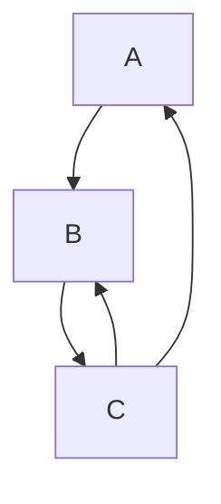

The result of cycle participants depends on the result of goals still on the stack.
However, we are currently computing that result, so its result is still unknown. This is
handled by evaluating cycle heads until we reach a fixpoint. In the first iteration, we
return either success or overflow with no constraints, depending on whether the cycle is
coinductive: [source][initial-prov-result]. After evaluating the head of a cycle, we
check whether its [`provisional_result`] is equal to the result of this iteration. If so,
we've finished evaluating this cycle and return its result. If not, we update the provisional
result and reevaluate the goal: [source][fixpoint]. After the first iteration it does not
matter whether cycles are coinductive or inductive. We always use the provisional result.

###### Only caching cycle roots

We cannot move the result of any cycle participant to the global cache until we've
finished evaluating the cycle root. However, even after we've completely evaluated the
cycle, we are still forced to discard the result of all participants apart from the root
itself.

We track the query dependencies of all global cache entries. This causes the caching of
cycle participants to be non-trivial. We cannot simply reuse the `DepNode` of the cycle
root.[^2] If we have a cycle `A -> B -> A`, then the `DepNode` for `A` contains a dependency
from `A -> B`. Reusing this entry for `B` may break if the source is changed. The `B -> A`
edge may not exist anymore and `A` may have been completely removed. This can easily result
in an ICE.

However, it's even worse as the result of a cycle can change depending on which goal is
the root: [example][unstable-result-ex]. This forces us to weaken caching even further.
We must not use a cache entry of a cycle root, if there exists a stack entry, which was
a participant of its cycle involving that root. We do this by storing all cycle participants
of a given root in its global cache entry and checking that it contains no element of the
stack: [source][cycle-participants].

###### The provisional cache

TODO: write this :3

- stack dependence of provisional results
- edge case: provisional cache impacts behavior


[`with_anon_task`]: https://github.com/rust-lang/rust/blob/7606c13961ddc1174b70638e934df0439b7dc515/compiler/rustc_trait_selection/src/solve/search_graph.rs#L391
[wdn]: https://github.com/rust-lang/rust/blob/7606c13961ddc1174b70638e934df0439b7dc515/compiler/rustc_middle/src/traits/solve/cache.rs#L78
[overflow]: https://github.com/rust-lang/rust/blob/7606c13961ddc1174b70638e934df0439b7dc515/compiler/rustc_trait_selection/src/solve/search_graph.rs#L276
[req-depth]: https://github.com/rust-lang/rust/blob/7606c13961ddc1174b70638e934df0439b7dc515/compiler/rustc_middle/src/traits/solve/cache.rs#L102
[req-depth-ck]: https://github.com/rust-lang/rust/blob/7606c13961ddc1174b70638e934df0439b7dc515/compiler/rustc_middle/src/traits/solve/cache.rs#L76-L86
[update-depth]: https://github.com/rust-lang/rust/blob/7606c13961ddc1174b70638e934df0439b7dc515/compiler/rustc_trait_selection/src/solve/search_graph.rs#L308
[rem-depth]: https://github.com/rust-lang/rust/blob/7606c13961ddc1174b70638e934df0439b7dc515/compiler/rustc_middle/src/traits/solve/cache.rs#L124
[^1]: This is overly restrictive: if all nested goals return the overflow response with some
available depth `n`, then their result should be the same for any depths smaller than `n`.
We can implement this optimization in the future.

[chapter on coinduction]: #solve-coinduction
[`provisional_result`]: https://github.com/rust-lang/rust/blob/7606c13961ddc1174b70638e934df0439b7dc515/compiler/rustc_trait_selection/src/solve/search_graph.rs#L57
[initial-prov-result]: https://github.com/rust-lang/rust/blob/7606c13961ddc1174b70638e934df0439b7dc515/compiler/rustc_trait_selection/src/solve/search_graph.rs#L366-L370
[fixpoint]: https://github.com/rust-lang/rust/blob/7606c13961ddc1174b70638e934df0439b7dc515/compiler/rustc_trait_selection/src/solve/search_graph.rs#L425-L446
[^2]: summarizing the relevant [Zulip thread]

[zulip thread]: https://rust-lang.zulipchat.com/#narrow/stream/364551-t-types.2Ftrait-system-refactor/topic/global.20cache
[unstable-result-ex]: https://github.com/rust-lang/rust/blob/7606c13961ddc1174b70638e934df0439b7dc515/tests/ui/traits/next-solver/cycles/coinduction/incompleteness-unstable-result.rs#L4-L16
[cycle-participants]: https://github.com/rust-lang/rust/blob/7606c13961ddc1174b70638e934df0439b7dc515/compiler/rustc_middle/src/traits/solve/cache.rs#L72-L74


#### Proof trees {#solve-proof-trees}

While the trait solver itself only returns whether a goal holds and the necessary
constraints, we sometimes also want to know what happened while trying to prove
it. While the trait solver should generally be treated as a black box by the rest
of the compiler, we cannot completely ignore its internals and provide "proof trees"
as an interface for this. To use them you implement the [`ProofTreeVisitor`] trait,
see its existing implementations for examples. The most notable uses are to compute
the [intercrate ambiguity causes for coherence errors][intercrate-ambig],
[improving trait solver errors][solver-errors], and
[eagerly inferring closure signatures][closure-sig].

##### Computing proof trees

The trait solver uses [Canonicalization] and uses completely separate `InferCtxt` for
each nested goal. Both diagnostics and auto-traits in rustdoc need to correctly
handle "looking into nested goals". Given a goal like `Vec<Vec<?x>>: Debug`, we
canonicalize to `exists<T0> Vec<Vec<T0>>: Debug`, instantiate that goal as
`Vec<Vec<?0>>: Debug`, get a nested goal `Vec<?0>: Debug`, canonicalize this to get
`exists<T0> Vec<T0>: Debug`, instantiate this as `Vec<?0>: Debug` which then results
in a nested `?0: Debug` goal which is ambiguous.

We compute proof trees by passing a [`ProofTreeBuilder`] to the search graph which is
converting the evaluation steps of the trait solver into a tree. When storing any
data using inference variables or placeholders, the data is canonicalized together
with the list of all unconstrained inference variables created during this computation.
This [`CanonicalState`] is then instantiated in the parent inference context while
walking the proof tree, using the list of inference variables to connect all the
canonicalized values created during this evaluation.

##### Debugging the solver

We previously also tried to use proof trees to debug the solver implementation. This
has different design requirements than analyzing it programmatically. The recommended
way to debug the trait solver is by using `tracing`. The trait solver only uses the
`debug` tracing level for its general 'shape' and `trace` for additional detail.
`RUSTC_LOG=rustc_next_trait_solver=debug` therefore gives you a general outline
and `RUSTC_LOG=rustc_next_trait_solver=trace` can then be used if more precise
information is required.

[`ProofTreeVisitor`]: https://github.com/rust-lang/rust/blob/d6c8169c186ab16a3404cd0d0866674018e8a19e/compiler/rustc_trait_selection/src/solve/inspect/analyse.rs#L403
[`ProofTreeBuilder`]: https://github.com/rust-lang/rust/blob/d6c8169c186ab16a3404cd0d0866674018e8a19e/compiler/rustc_next_trait_solver/src/solve/inspect/build.rs#L40
[`CanonicalState`]: https://github.com/rust-lang/rust/blob/d6c8169c186ab16a3404cd0d0866674018e8a19e/compiler/rustc_type_ir/src/solve/inspect.rs#L31-L47
[intercrate-ambig]: https://github.com/rust-lang/rust/blob/d6c8169c186ab16a3404cd0d0866674018e8a19e/compiler/rustc_trait_selection/src/traits/coherence.rs#L742-L748
[solver-errors]: https://github.com/rust-lang/rust/blob/d6c8169c186ab16a3404cd0d0866674018e8a19e/compiler/rustc_trait_selection/src/solve/fulfill.rs#L343-L356
[closure-sig]: https://github.com/rust-lang/rust/blob/d6c8169c186ab16a3404cd0d0866674018e8a19e/compiler/rustc_hir_typeck/src/closure.rs#L333-L339
[Canonicalization]: #solve-canonicalization

#### Opaque types in the new solver {#solve-opaque-types}

The way [opaque types] are handled in the new solver differs from the old implementation.
This should be a self-contained explanation of the behavior in the new solver.

[opaque types]: #opaque-types-type-alias-impl-trait

##### Non-Defining vs Defining Uses

The distinction between non-defining and defining uses determines the inference behavior and governs the strictness of the abstraction. A defining use reveals the underlying hidden type, while a non-defining use enforces rigidity, treating the type as an abstract placeholder.

###### Non-defining Use

This concept is what makes an opaque type rigid. By treating the underlying type as unknown, the solver maintains abstraction.

```rust
fn foo() -> impl Copy {
    let x: u32 = 56;
    x 
}

fn bar() {
    let x = foo();
    // Even though we know 'foo' returns a u32.The solver enforces 
    // rigidity here and is a NON-DEFINING use.
}
```

###### Defining Use

This is where the opaque type is actually defined. A defining use tells the compiler exactly what the concrete type is behind the abstraction.

```rust
fn foo() -> impl Copy {
    let x: u32 = 56;
    // The return value x defines the hidden type as u32 and is a DEFINING use.
    x
}
```

##### opaques are alias types

Opaque types are treated the same as other aliases, most notabily associated types,
whenever possible. There should be as few divergences in behavior as possible.

This is desirable, as they are very similar to other alias types, in that they can be
normalized to their hidden type and also have the same requirements for completeness.
Treating them this way also reduces the complexity of the type system by sharing code.
Having to deal with opaque types separately results in more complex rules and new kinds
of interactions. As we need to treat them like other aliases in the implicit-negative
mode, having significant differences between modes also adds complexity.

*open question: is there an alternative approach here, maybe by treating them more like rigid
types with more limited places to instantiate them? they would still have to be ordinary
aliases during coherence*

###### `normalizes-to` for opaques

[source][norm]

`normalizes-to` is used to define the one-step normalization behavior for aliases in the new
solver: `<<T as IdInner>::Assoc as IdOuter>::Assoc` first normalizes to `<T as IdInner>::Assoc`
which then normalizes to `T`. It takes both the `AliasTy` which is getting normalized and the
expected `Term`. To use `normalizes-to` for actual normalization, the expected term can simply
be an unconstrained inference variable.

For opaque types in the defining scope and in the implicit-negative coherence mode, this is
always done in two steps. Outside of the defining scope `normalizes-to` for opaques always
returns `Err(NoSolution)`.

We start by trying to assign the expected type as a hidden type.

In the implicit-negative coherence mode, this currently always results in ambiguity without
interacting with the opaque types storage. We could instead add allow 'defining' all opaque types,
discarding their inferred types at the end, changing the behavior of an opaque type is used
multiple times during coherence: [example][coherence-example]

Inside of the defining scope we start by checking whether the type and const arguments of the
opaque are all placeholders: [source][placeholder-ck]. If this check is ambiguous,
return ambiguity, if it fails, return `Err(NoSolution)`. This check ignores regions which are
only checked at the end of borrowck. If it succeeds, continue.

We then check whether we're able to *semantically* unify the generic arguments of the opaque
with the arguments of any opaque type already in the opaque types storage. If so, we unify the
previously stored type with the expected type of this `normalizes-to` call: [source][eq-prev][^1].

If not, we insert the expected type in the opaque types storage: [source][insert-storage][^2].
Finally, we check whether the item bounds of the opaque hold for the expected type:
[source][item-bounds-ck].

[norm]: https://github.com/rust-lang/rust/blob/384d26fc7e3bdd7687cc17b2662b091f6017ec2a/compiler/rustc_trait_selection/src/solve/normalizes_to/opaque_types.rs#L13
[coherence-example]: https://github.com/rust-lang/rust/blob/HEAD/tests/ui/type-alias-impl-trait/coherence/coherence_different_hidden_ty.rs
[placeholder-ck]: https://github.com/rust-lang/rust/blob/384d26fc7e3bdd7687cc17b2662b091f6017ec2a/compiler/rustc_trait_selection/src/solve/normalizes_to/opaque_types.rs#L33
[check-storage]: https://github.com/rust-lang/rust/blob/384d26fc7e3bdd7687cc17b2662b091f6017ec2a/compiler/rustc_trait_selection/src/solve/normalizes_to/opaque_types.rs#L51-L52
[eq-prev]: https://github.com/rust-lang/rust/blob/384d26fc7e3bdd7687cc17b2662b091f6017ec2a/compiler/rustc_trait_selection/src/solve/normalizes_to/opaque_types.rs#L51-L59
[insert-storage]: https://github.com/rust-lang/rust/blob/384d26fc7e3bdd7687cc17b2662b091f6017ec2a/compiler/rustc_trait_selection/src/solve/normalizes_to/opaque_types.rs#L68
[item-bounds-ck]: https://github.com/rust-lang/rust/blob/384d26fc7e3bdd7687cc17b2662b091f6017ec2a/compiler/rustc_trait_selection/src/solve/normalizes_to/opaque_types.rs#L69-L74

[^1]: FIXME: this should ideally only result in a unique candidate given that we require the args to be placeholders and regions are always inference vars
[^2]: FIXME: why do we check whether the expected type is rigid for this.

###### using alias-bounds of normalizable aliases

https://github.com/rust-lang/trait-system-refactor-initiative/issues/77

Using an `AliasBound` candidate for normalizable aliases is generally not possible as an
associated type can have stronger bounds then the resulting type when normalizing via a
`ParamEnv` candidate.

These candidates would change our exact normalization strategy to be user-facing. It is otherwise
pretty much unobservable whether we eagerly normalize. Where we normalize is something we likely
want to change that after removing support for the old solver, so that would be undesirable.

##### opaque types can be defined anywhere

Opaque types in their defining-scope can be defined anywhere, whether when simply relating types
or in the trait solver. This removes order dependence and incompleteness. Without this the result
of a goal can differ due to subtle reasons, e.g. whether we try to evaluate a goal using the
opaque before the first defining use of the opaque.

##### higher ranked opaque types in their defining scope

These are not supported and trying to define them right now should always error.

FIXME: Because looking up opaque types in the opaque type storage can now unify regions,
we have to eagerly check that the opaque types does not reference placeholders. We otherwise
end up leaking placeholders.

##### member constraints

The handling of member constraints does not change in the new solver. See the
[relevant existing chapter][member-constraints] for that.

[member-constraints]: #borrow-check-region-inference-member-constraints

##### calling methods on opaque types

FIXME: We need to continue to support calling methods on still unconstrained
opaque types in their defining scope. It's unclear how to best do this.

```rust
use std::future::Future;
use futures::FutureExt;

fn go(i: usize) -> impl Future<Output = ()> + Send + 'static {
    async move {
        if i != 0 {
            // This returns `impl Future<Output = ()>` in its defining scope,
            // we don't know the concrete type of that opaque at this point.
            // Currently treats the opaque as a known type and succeeds, but
            // from the perspective of "easiest to soundly implement", it would
            // be good for this to be ambiguous.
            go(i - 1).boxed().await;
        }
    }
}
```


#### Significant changes and quirks {#solve-significant-changes}

##### Significant changes and quirks

While some of the items below are already mentioned separately, this page tracks the
main changes from the old trait system implementation. This also mentions some ways
in which the solver significantly diverges from an idealized implementation. This
document simplifies and ignores edge cases. It is recommended to add an implicit
"mostly" to each statement.

###### Canonicalization

The new solver uses [canonicalization] when evaluating nested goals. In case there
are possibly multiple candidates, each candidate is eagerly canonicalized. We then
attempt to merge their canonical responses. This differs from the old implementation
which does not use canonicalization inside of the trait system.

This has a some major impacts on the design of both solvers. Without using
canonicalization to stash the constraints of candidates, candidate selection has
to discard the constraints of each candidate, only applying the constraints by
reevaluating the candidate after it has been selected: [source][evaluate_stack].
Without canonicalization it is also not possible to cache the inference constraints
from evaluating a goal. This causes the old implementation to have two systems:
*evaluate* and *fulfill*. *Evaluation* is cached, does not apply inference constraints
and is used when selecting candidates. *Fulfillment* applies inference and region
constraints is not cached and applies inference constraints.

By using canonicalization, the new implementation is able to merge *evaluation* and
*fulfillment*, avoiding complexity and subtle differences in behavior. It greatly
simplifies caching and prevents accidentally relying on untracked information.
It allows us to avoid reevaluating candidates after selection and enables us to merge
the responses of multiple candidates. However, canonicalizing goals during evaluation
forces the new implementation to use a fixpoint algorithm when encountering cycles
during trait solving: [source][cycle-fixpoint].

[canonicalization]: #solve-canonicalization
[evaluate_stack]: https://github.com/rust-lang/rust/blob/47dd709bedda8127e8daec33327e0a9d0cdae845/compiler/rustc_trait_selection/src/traits/select/mod.rs#L1232-L1237
[cycle-fixpoint]: https://github.com/rust-lang/rust/blob/df8ac8f1d74cffb96a93ae702d16e224f5b9ee8c/compiler/rustc_trait_selection/src/solve/search_graph.rs#L382-L387

###### Deferred alias equality

The new implementation emits `AliasRelate` goals when relating aliases while the
old implementation structurally relates the aliases instead. This enables the
new solver to stall equality until it is able to normalize the related aliases.

The behavior of the old solver is incomplete and relies on eager normalization
which replaces ambiguous aliases with inference variables. As this is
not possible for aliases containing bound variables, the old implementation does
not handle aliases inside of binders correctly, e.g. [#102048]. See the chapter on
[normalization] for more details.

[#102048]: https://github.com/rust-lang/rust/issues/102048

###### Eagerly evaluating nested goals

The new implementation eagerly handles nested goals instead of returning
them to the caller. The old implementation does both. In evaluation nested
goals [are eagerly handled][eval-nested], while fulfillment simply
[returns them for later processing][fulfill-nested].

As the new implementation has to be able to eagerly handle nested goals for
candidate selection, always doing so reduces complexity. It may also enable
us to merge more candidates in the future.

[eval-nested]: https://github.com/rust-lang/rust/blob/HEAD/compiler/rustc_trait_selection/src/traits/select/mod.rs#L1271-L1277
[fulfill-nested]: https://github.com/rust-lang/rust/blob/df8ac8f1d74cffb96a93ae702d16e224f5b9ee8c/compiler/rustc_trait_selection/src/traits/fulfill.rs#L708-L712

###### Nested goals are evaluated until reaching a fixpoint

The new implementation always evaluates goals in a loop until reaching a fixpoint.
The old implementation only does so in *fulfillment*, but not in *evaluation*.
Always doing so strengthens inference and is reduces the order dependence of
the trait solver. See [trait-system-refactor-initiative#102].

[trait-system-refactor-initiative#102]: https://github.com/rust-lang/trait-system-refactor-initiative/issues/102

###### Proof trees and providing diagnostics information

The new implementation does not track diagnostics information directly,
instead providing [proof trees][trees] which are used to lazily compute the
relevant information. This is not yet fully fleshed out and somewhat hacky.
The goal is to avoid tracking this information in the happy path to improve
performance and to avoid accidentally relying on diagnostics data for behavior.

[trees]: #solve-proof-trees

##### Major quirks of the new implementation

###### Hiding impls if there are any env candidates

If there is at least one `ParamEnv` or `AliasBound` candidate to prove
some `Trait` goal, we discard all impl candidates for both `Trait` and
`Projection` goals: [source][discard-from-env]. This prevents users from
using an impl which is entirely covered by a `where`-bound,  matching the
behavior of the old implementation and avoiding some weird errors,
e.g. [trait-system-refactor-initiative#76].

[discard-from-env]: https://github.com/rust-lang/rust/blob/03994e498df79aa1f97f7bbcfd52d57c8e865049/compiler/rustc_trait_selection/src/solve/assembly/mod.rs#L785-L789
[trait-system-refactor-initiative#76]: https://github.com/rust-lang/trait-system-refactor-initiative/issues/76

###### `NormalizesTo` goals are a function

See the [normalization] chapter. We replace the expected term with an unconstrained
inference variable before computing `NormalizesTo` goals to prevent it from affecting
normalization. This means that `NormalizesTo` goals are handled somewhat differently
from all other goal kinds and need some additional solver support. Most notably,
their ambiguous nested goals are returned to the caller which then evaluates them.
See [#122687] for more details.

[#122687]: https://github.com/rust-lang/rust/pull/122687
[normalization]: #normalization


#### Sharing the trait solver with rust-analyzer {#solve-sharing-crates-with-rust-analyzer}

rust-analyzer can be viewed as a compiler frontend: it performs tasks similar to the parts of rustc
that run before code generation, such as parsing, lexing, AST construction and lowering, HIR
lowering, and even limited MIR building and const evaluation.

However, because rust-analyzer is primarily a language server, its architecture differs in several
important ways from that of rustc.
Despite these differences, a substantial portion of its responsibilities—most notably type
inference and trait solving—overlap with the compiler.

To avoid duplication and to maintain consistency between the two implementations, rust-analyzer
reuses several crates from rustc, relying on shared abstractions wherever possible.

##### Shared Crates

Currently, rust-analyzer depends on several `rustc_*` crates from the compiler:

- `rustc_abi`
- `rustc_ast_ir`
- `rustc_index`
- `rustc_lexer`
- `rustc_next_trait_solver`
- `rustc_parse_format`
- `rustc_pattern_analysis`
- `rustc_type_ir`

Since these crates are not published on `crates.io` as part of the compiler's normal distribution
process, rust-analyzer maintains its own publishing pipeline.
It uses the [rustc-auto-publish script][rustc-auto-publish] to publish these crates to `crates.io`
with the prefix `ra-ap-rustc_*`
(for example: https://crates.io/crates/ra-ap-rustc_next_trait_solver).
rust-analyzer then depends on these re-published crates in its own build.

For trait solving specifically, the primary shared crates are `rustc_type_ir` and
`rustc_next_trait_solver`, which provide the core IR and solver logic used by both compiler
frontends.

##### The Abstraction Layer

Because rust-analyzer is a language server, it must handle frequently changing source code and
partially invalid or incomplete source codes.
This requires an infrastructure quite different from rustc's, especially in the layers between
the source code and the HIR—for example, `Ty` and its backing interner.

To bridge these differences, the compiler provides `rustc_type_ir` as an abstraction layer shared
between rustc and rust-analyzer.
This crate defines the fundamental interfaces used to represent types, predicates, and the context
required by the trait solver.
Both rustc and rust-analyzer implement these traits for their own concrete type representations,
and `rustc_next_trait_solver` is written to be generic over these abstractions.

In addition to these interfaces, `rustc_type_ir` also includes several non-trivial components built
on top of the abstraction layer—such as elaboration logic and the search graph machinery used by the
solver.

##### Design Concepts

`rustc_next_trait_solver` is intended to depend only on the abstract interfaces defined in
`rustc_type_ir`.
To support this, the type-system traits in `rustc_type_ir` must expose every interface the solver
requires—for example, [creating a new inference type variable][ir new_infer] 
([rustc][rustc new_infer], [rust-analyzer][r-a new_infer]).
For items that do not need compiler-specific representations, `rustc_type_ir` defines them directly
as structs or enums parameterized over these traits—for example, [`TraitRef`][ir tr].

The following are some notable items from the `rustc_type_ir` crate.

###### `trait Interner`

The central trait in this design is [`Interner`][ir interner], which specifies all
implementation-specific details for both rustc and rust-analyzer.
Among its essential responsibilities:

- it **specifies** the concrete types used by the implementation via its
  [associated types][ir interner assocs]; these form the backbone of how each compiler frontend
  instantiates the shared IR,
- it provides the context required by the solver (e.g., querying [lang items][ir require_lang_item],
  enumerating [all blanket impls for a trait][ir for_each_blanket_impl]);
- and it must implement [`IrPrint`][ir irprint] for formatting and tracing.  
  In practice, these `IrPrint` impls simply route to existing formatting logic inside rustc or
  rust-analyzer.

In rustc, [`TyCtxt` implements `Interner`][rustc interner impl]: it exposes the rustc's query
methods, and the required `Interner` trait methods are implemented by invoking those queries.
In rust-analyzer, the implementing type is named [`DbInterner`][r-a interner impl] (as it performs
most interning through the [salsa] database), and most of its methods are backed by salsa queries
rather than rustc queries.

###### `mod inherent`

Another notable item in `rustc_type_ir` is the [`inherent` module][ir inherent].
This module provides *forward definitions* of inherent methods—expressed as traits—corresponding to
methods that exist on compiler-specific types such as `Ty` or `GenericArg`.  
These definitions allow the generic crates (such as `rustc_next_trait_solver`) to call methods that
are implemented differently in rustc and rust-analyzer.

Code in generic crates should import these definitions with:

```rust
use inherent::*;
```

These forward definitions **must never be used inside the concrete implementations themselves**.
Crates that implement the traits from `mod inherent` should call the actual inherent methods on
their concrete types once those types are nameable.

You can find rustc’s implementations of these traits in the
[rustc_middle::ty::inherent][rustc inherent impl] module.
For rust-analyzer, the corresponding implementations are located across several modules under
`hir_ty::next_solver`, such as [hir_ty::next_solver::region][r-a inherent impl].

###### `trait InferCtxtLike` and `trait SolverDelegate`

These two traits correspond to the role of [`InferCtxt`][rustc inferctxt] in rustc.

[`InferCtxtLike`][ir inferctxtlike] must be defined in `rustc_infer` due to coherence
constraints(orphan rules).
As a result, it cannot provide functionality that lives in `rustc_trait_selection`.
Instead, behavior that depends on trait-solving logic is abstracted into a separate trait,
[`SolverDelegate`][ir solverdelegate].
Its implementator in rustc is [simply a newtype struct over `InferCtxt`][rustc solverdelegate impl]
in `rustc_trait_selection`.

(In rust-analyzer, it is also implemented for a newtype wrapper over its own
[`InferCtxt`][r-a inferctxtlike impl], primarily to mirror rustc’s structure, although this is not
strictly necessary because all solver-related logic already resides in the `hir-ty` crate.)

In the long term, the ideal design is to move all of the logic currently expressed through
`SolverDelegate` into `rustc_next_trait_solver`, with any required core operations added directly to
`InferCtxtLike`.
This would allow more of the solver’s behavior to live entirely inside the shared solver crate.

###### `rustc_type_ir::search_graph::{Cx, Delegate}`

The abstraction traits [`Cx`][ir searchgraph cx impl] and [`Delegate`][ir searchgraph delegate impl]
are already implemented within `rustc_next_trait_solver` itself.
Therefore, users of the shared crates—both rustc and rust-analyzer—do not need to provide their own
implementations.

These traits exist primarily to support fuzzing of the search graph independently of the full trait
solver.
This infrastructure is used by the external fuzzing project:
<https://github.com/lcnr/search_graph_fuzz>.

##### Long-term plans for supporting rust-analyzer

In general, we aim to support rust-analyzer just as well as rustc in these shared crates—provided
doing so does not substantially harm rustc's performance or maintainability. 
(e.g., [#145377][pr 145377], [#146111][pr 146111], [#146182][pr 146182] and [#147723][pr 147723])

Shared crates that require nightly-only features must guard such code behind a `nightly` feature
flag, since rust-analyzer is built with the stable toolchain.

Looking forward, we plan to uplift more shared logic into `rustc_type_ir`.
There are still duplicated implementations between rustc and rust-analyzer—such as `ObligationCtxt` 
([rustc][rustc oblctxt], [rust-analyzer][r-a oblctxt]) and type coercion logic 
([rustc][rustc coerce], [rust-analyzer][r-a coerce])—that we would like to unify over time.

[rustc-auto-publish]: https://github.com/rust-analyzer/rustc-auto-publish
[ir new_infer]: https://doc.rust-lang.org/1.91.1/nightly-rustc/rustc_type_ir/inherent/trait.Ty.html#tymethod.new_infer
[rustc new_infer]: https://github.com/rust-lang/rust/blob/63b1db05801271e400954e41b8600a3cf1482363/compiler/rustc_middle/src/ty/sty.rs#L413-L420
[r-a new_infer]: https://github.com/rust-lang/rust-analyzer/blob/34f47d9298c478c12c6c4c0348771d1b05706e09/crates/hir-ty/src/next_solver/ty.rs#L59-L92
[ir tr]: https://doc.rust-lang.org/1.91.1/nightly-rustc/rustc_type_ir/struct.TraitRef.html
[ir interner]: https://doc.rust-lang.org/1.91.1/nightly-rustc/rustc_type_ir/trait.Interner.html
[ir interner assocs]: https://doc.rust-lang.org/1.91.1/nightly-rustc/rustc_type_ir/trait.Interner.html#required-associated-types
[ir require_lang_item]: https://doc.rust-lang.org/1.91.1/nightly-rustc/rustc_type_ir/trait.Interner.html#tymethod.require_lang_item
[ir for_each_blanket_impl]: https://doc.rust-lang.org/1.91.1/nightly-rustc/rustc_type_ir/trait.Interner.html#tymethod.for_each_blanket_impl
[ir irprint]: https://doc.rust-lang.org/1.91.1/nightly-rustc/rustc_type_ir/ir_print/trait.IrPrint.html
[rustc interner impl]: https://doc.rust-lang.org/1.91.1/nightly-rustc/rustc_middle/ty/struct.TyCtxt.html#impl-Interner-for-TyCtxt%3C'tcx%3E
[r-a interner impl]: https://github.com/rust-lang/rust-analyzer/blob/a50c1ccc9cf3dab1afdc857a965a9992fbad7a53/crates/hir-ty/src/next_solver/interner.rs
[salsa]: https://github.com/salsa-rs/salsa
[ir inherent]: https://doc.rust-lang.org/1.91.1/nightly-rustc/rustc_type_ir/inherent/index.html
[rustc inherent impl]: https://doc.rust-lang.org/1.91.1/nightly-rustc/rustc_middle/ty/inherent/index.html
[r-a inherent impl]: https://github.com/rust-lang/rust-analyzer/blob/a50c1ccc9cf3dab1afdc857a965a9992fbad7a53/crates/hir-ty/src/next_solver/region.rs
[ir inferctxtlike]: https://doc.rust-lang.org/1.91.1/nightly-rustc/rustc_type_ir/trait.InferCtxtLike.html
[rustc inferctxt]: https://doc.rust-lang.org/1.91.1/nightly-rustc/rustc_infer/infer/struct.InferCtxt.html
[rustc inferctxtlike impl]: https://doc.rust-lang.org/1.91.1/nightly-rustc/src/rustc_infer/infer/context.rs.html#14-332
[r-a inferctxtlike impl]: https://github.com/rust-lang/rust-analyzer/blob/a50c1ccc9cf3dab1afdc857a965a9992fbad7a53/crates/hir-ty/src/next_solver/infer/context.rs
[ir solverdelegate]: https://doc.rust-lang.org/1.91.1/nightly-rustc/rustc_next_trait_solver/delegate/trait.SolverDelegate.html
[rustc solverdelegate impl]: https://doc.rust-lang.org/1.91.1/nightly-rustc/rustc_trait_selection/solve/delegate/struct.SolverDelegate.html
[r-a solverdelegate impl]: https://github.com/rust-lang/rust-analyzer/blob/a50c1ccc9cf3dab1afdc857a965a9992fbad7a53/crates/hir-ty/src/next_solver/solver.rs#L27-L330
[ir searchgraph cx impl]: https://doc.rust-lang.org/1.91.1/nightly-rustc/src/rustc_type_ir/interner.rs.html#550-575
[ir searchgraph delegate impl]: https://doc.rust-lang.org/1.91.1/nightly-rustc/src/rustc_next_trait_solver/solve/search_graph.rs.html#20-123
[pr 145377]: https://github.com/rust-lang/rust/pull/145377
[pr 146111]: https://github.com/rust-lang/rust/pull/146111
[pr 146182]: https://github.com/rust-lang/rust/pull/146182
[pr 147723]: https://github.com/rust-lang/rust/pull/147723
[rustc oblctxt]: https://github.com/rust-lang/rust/blob/63b1db05801271e400954e41b8600a3cf1482363/compiler/rustc_trait_selection/src/traits/engine.rs#L48-L386
[r-a oblctxt]: https://github.com/rust-lang/rust-analyzer/blob/34f47d9298c478c12c6c4c0348771d1b05706e09/crates/hir-ty/src/next_solver/obligation_ctxt.rs
[rustc coerce]: https://github.com/rust-lang/rust/blob/63b1db05801271e400954e41b8600a3cf1482363/compiler/rustc_hir_typeck/src/coercion.rs
[r-a coerce]: https://github.com/rust-lang/rust-analyzer/blob/34f47d9298c478c12c6c4c0348771d1b05706e09/crates/hir-ty/src/infer/coerce.rs

### [`CoerceUnsized`](https://doc.rust-lang.org/std/ops/trait.CoerceUnsized.html) {#traits-unsize}

`CoerceUnsized` is primarily concerned with data containers. When a struct
(typically, a smart pointer) implements `CoerceUnsized`, that means that the
data it points to is being unsized.

Some implementors of `CoerceUnsized` include:
* `&T`
* `Arc<T>`
* `Box<T>`

This trait is (eventually) intended to be implemented by user-written smart
pointers, and there are rules about when a type is allowed to implement
`CoerceUnsized` that are explained in the trait's documentation.

### [`Unsize`](https://doc.rust-lang.org/std/marker/trait.Unsize.html)

To contrast, the `Unsize` trait is concerned the actual types that are allowed
to be unsized.

This is not intended to be implemented by users ever, since `Unsize` does not
instruct the compiler (namely codegen) *how* to unsize a type, just whether it
is allowed to be unsized. This is paired somewhat intimately with codegen
which must understand how types are represented and unsized.

#### Primitive unsizing implementations

Built-in implementations are provided for:
* `T` -> `dyn Trait + 'a` when `T: Trait` (and `T: Sized + 'a`, and `Trait`
  is dyn-compatible[^2]).
* `[T; N]` -> `[T]`

#### Structural implementations

There is one implementation of `Unsize` which can be thought of as
structural:
* `Struct<.., Pi, .., Pj, ..>: Unsize<Struct<.., Ui, .., Uj, ..>>` given 
  `TailField<Pi, .., Pj>: Unsize<Ui, .. Uj>`, which allows the tail field of a
  struct to be unsized if it is the only field that mentions generic parameters
  `Pi`, .., `Pj` (which don't need to be contiguous).

The rules for struct unsizing are slightly complicated, since they
may allow more than one parameter to be changed (not necessarily unsized) and
are best stated in terms of the tail field of the struct.

(Tuple unsizing was previously implemented behind the feature gate
`unsized_tuple_coercion`, but the implementation was removed by [#137728].)

[#137728]: https://github.com/rust-lang/rust/pull/137728

#### Upcasting implementations

Two things are called "upcasting" internally:
1. True upcasting `dyn SubTrait` -> `dyn SuperTrait` (this also allows
   dropping auto traits and adjusting lifetimes, as below).
2. Dropping auto traits and adjusting the lifetimes of dyn trait
   *without changing the principal[^1]*:
   `dyn Trait + AutoTraits... + 'a` -> `dyn Trait + NewAutoTraits... + 'b`
   when `AutoTraits` ⊇ `NewAutoTraits`, and `'a: 'b`.

These may seem like different operations, since (1.) includes adjusting the
vtable of a dyn trait, while (2.) is a no-op. However, to the type system,
these are handled with much the same code.

This built-in implementation of `Unsize` is the most involved, particularly
after [it was reworked](https://github.com/rust-lang/rust/pull/114036) to
support the complexities of associated types.

Specifically, the upcasting algorithm involves: For each supertrait of the
source dyn trait's principal (including itself)...
1. Unify the super trait ref with the principal of the target (making sure
   we only ever upcast to a true supertrait, and never [via an impl]).
2. For every auto trait in the target, check that it's present in the source
   (allowing us to drop auto traits, but never gain new ones).
3. For every projection in the target, check that it unifies with a single
   projection in the source (since there may be more than one given
   `trait Sub: Sup<.., A = i32> + Sup<.., A = u32>`).

[via an impl]: https://github.com/rust-lang/rust/blob/f3457dbf84cd86d284454d12705861398ece76c3/tests/ui/traits/trait-upcasting/illegal-upcast-from-impl.rs#L19

Specifically, (3.) prevents a choice of projection bound to guide inference
unnecessarily, though it may guide inference when it is unambiguous.

[^1]: The principal is the one non-auto trait of a `dyn Trait`.
[^2]: Formerly known as "object safe".


### Having separate `Trait` and `Projection` bounds {#traits-separate-projection-bounds}

Given `T: Foo<AssocA = u32, AssocB = i32>` where-bound, we currently lower it to a `Trait(Foo<T>)` and separate `Projection(<T as Foo>::AssocA, u32)` and `Projection(<T as Foo>::AssocB, i32)` bounds.
Why do we not represent this as a single `Trait(Foo[T], [AssocA = u32, AssocB = u32]` bound instead?

The way we prove `Projection` bounds directly relies on proving the corresponding `Trait` bound: [old solver](https://github.com/rust-lang/rust/blob/461e9738a47e313e4457957fa95ff6a19a4b88d4/compiler/rustc_trait_selection/src/traits/project.rs#L898) [new solver](https://github.com/rust-lang/rust/blob/461e9738a47e313e4457957fa95ff6a19a4b88d4/compiler/rustc_next_trait_solver/src/solve/normalizes_to/mod.rs#L37-L41).

It feels like it might make more sense to just have a single implementation which checks whether a trait is implemented and returns (a way to compute) its associated types.

This is unfortunately quite difficult, as we may use a different candidate for norm than for the corresponding trait bound.
See [alias-bound vs where-bound](#we-always-consider-aliasbound-candidates) and [global where-bound vs impl](#we-prefer-global-where-bounds-over-impls).

There are also some other subtle reasons for why we can't do so.
The most stupid is that for rigid aliases;
trying to normalize them does not consider any lifetime constraints from proving the trait bound.
This is necessary due to a lack of assumptions on binders - https://github.com/rust-lang/trait-system-refactor-initiative/issues/177 - and should be fixed longterm.

A separate issue is that, right now,
fetching the `type_of` associated types for `Trait` goals or in shadowed `Projection` candidates can cause query cycles for RPITIT.
See https://github.com/rust-lang/trait-system-refactor-initiative/issues/185.

There are also slight differences between candidates for some of the builtin impls, these do all seem generally undesirable and I consider them to be bugs which would be fixed if we had a unified approach here.

Finally, not having this split makes lowering where-clauses more annoying.
With the current system having duplicate where-clauses is not an issue and it can easily happen when elaborating super trait bounds.
We now need to make sure we merge all associated type constraints, e.g.:

```rust
trait Super {
    type A;
    type B;
}

trait Trait: Super<A = i32> {}
// how to elaborate Trait<B = u32>
```
Or even worse
```rust
trait Super<'a> {
    type A;
    type B;
}

trait Trait<'a>: Super<'a, A = i32> {}
// how to elaborate
// T: Trait<'a> + for<'b> Super<'b, B = u32>
```


## Well-formedness {#analysis-well-formed}

### What is well-formedness?

"Well-formed" means "correctly built"[^wf-history].
Something is _well-formed_ when its structure follows rules.
When we use this term in the Rust compiler we are concerned with establishing some kind of _internal consistency_.

### Well-formedness in Rust

To check that something is well-formed is to perform a "Well-formedness check".

In the Rust compiler there are two different forms of well-formedness checking:

- **Type-Level Term**[^terms][^terms-abbreviated] well-formedness check.
    - Also called "Term well-formedness" or "Term well-formedness checking".
    - Not a distinct analysis stage, this gets performed throughout analysis.
- **Item**[^items] well-formedness check (item-wfck.)
    - "Item-wfck" will often wind up requiring Terms be well-formed, but skips some areas.
    - Inner "Terms" can (incorrectly) get normalized first.
    - More coherent as a stage in the compiler than "term well-formedness" (which is performed in many places.)

See: [What Well-Formedness Isn't](#what-well-formedness-isnt).

### Well-formedness of type-level terms

Term well-formedness checking begins with building a list of things that need to be true for a term to be well-formed.
We call these "Obligations"[^obligations].

Type-Level Terms are considered well-formed when their associated obligations are satisfied by the trait solver.

#### Obligations for well-formedness

Specific obligations are things like `String: Clone`, `A: usize`, or `<T as Iterator>::Item: Debug`.

On this page we show the split between obligations and terms/items as:

```rust,ignore
<terms or items>
---
<obligations>
```

Here is an example of a well-formed type-level term:

```rust,ignore
Vec<String>
---
// Obligations to fulfill
Vec<T> where T: Sized
// Trait solver says `String: Sized` is true, so this is well-formed.
Vec<String> where String: Sized
```

When we compute the obligations for `Vec<String>`, we'll find that `Vec<T>` generates the obligation `T: Sized`.
We substitute `T` with `String` in `Vec<String>`, so we find the obligation `String: Sized` which the trait solver will determine to be satisfied.

The following **is not** well-formed:

```rust,ignore
Vec<str>
---
// Obligations to fulfill
Vec<T> where T: Sized
// Trait solver says `str: Sized` is not true, so this is not well-formed.
Vec<str> where str: Sized
```

The above computes the obligation `T: Sized`, like before, but we substitute `T` for `str` in the instance of `Vec<str>` finding the obligation `str: sized`.
This obligation will be determined by the trait solver to be _unsatisfied_.

##### Determining obligations

In the compiler, obligations of terms are found through the [`obligations`](https://doc.rust-lang.org/nightly/nightly-rustc/rustc_trait_selection/traits/wf/fn.obligations.html) function in the [term well-formedness module](https://doc.rust-lang.org/nightly/nightly-rustc/rustc_trait_selection/traits/wf/index.html).

##### Other obligations

Obligations are more than just trait and const generic bounds, but we've only mentioned these specific obligations so far as they are what we care about when we do "well-formedness checking" of terms.
See: [`PredicateKind`](https://doc.rust-lang.org/beta/nightly-rustc/rustc_type_ir/predicate_kind/enum.PredicateKind.html) and [`ClauseKind`](https://doc.rust-lang.org/beta/nightly-rustc/rustc_type_ir/predicate_kind/enum.ClauseKind.html) for a full list of obligations.

#### We don't need normalization (yet)

[Normalization](#normalization) is the process of resolving [type aliases](#aliases) into their underlying type.

A type alias is considered well-formed if its where clauses are satisfied.
The underlying type undergoes well-formedness checking at most definition and instantiation sites, but there are exceptions.

#### Const generic arguments

Term well-formedness is responsible for getting "type checking" obligations of const generic terms[^tyck-const-generics].
Let's look at the following use of const generics:

```rust,ignore
fn use_const_generics<const U: usize>() { /* ... */ }
// call site
use_const_generics::<6>();
---
// call site wfck obligations
const 6: usize
```

The call site will provide us with the obligation `6: usize` during well-formedness checking.
This obligation will be passed off to the trait solver just like any trait-style obligation, as the trait solver has more responsibilities than its name suggests.

### Well-formedness of items

Items are, generally speaking, "Things that get defined".
Item-wfck happens at the signature level for types and functions, methods, and definitions/implementations of traits.

```rust,ignore
// The `Vec<str>` is checked during item wfck
fn foo(_: Vec<str>) {
    // The `Vec<[u8]>` is not handled by item wfck as it's not in the signature
    let _: Vec<[u8]>
}
---
Vec<str>: Sized // Generated
Vec<[u8]>: Sized // Not done at item-wfck. Done elsewhere.
```

Item-wfck has more responsibilities than only collecting the obligations of its internal type-level terms and passing them to the trait solver.
We do not talk about all of these here, but they can be found at the individual `check_*` functions in [**the item-wfck module**](https://doc.rust-lang.org/nightly/nightly-rustc/rustc_hir_analysis/check/wfcheck/index.html).

<!-- FIXME: Expand more on item well-formedness that isn't const generic / trait bound obligation based. These are not special cases, but important points! -->

#### Global and trivial bounds

<!-- TODO later: Cut this into its own page -->

Trait bounds are a common Obligation.
Global and Trivial trait bounds are kinds of trait bounds where we already have enough information to determine if they are true or false.
Item-wfck is responsible for finding and checking these bounds.

- **Global bounds** are, in the old solver, post-normalization bounds that don't contain any generic parameters (like `<T>` or `'a`) or bound variables (like `for<'b>`).
- **Trivial bounds** are bounds that do not need further normalization to determine if they're well-formed or not. <!-- TODO: check with lcnr if this is genuinely what a trivial bound is. -->

Consider the following function definition:

```rust,ignore
fn apartment_complex<T>(block: T, name: String) where String: Clone { /* ... */ }
---
String: Clone // Trivial & Global bound! There's no aliases to resolve.
// There could be bligations on T but we don't care about them here.
```

This produces a trait bound obligation `String: Clone` that is _Global_ (no generic parameters) and _Trivial_ (didn't require normalization to be well-formedness checked).
The trait solver doesn't need to be given any additional information for it to be able to make a judgment on the well-formedness of `String: Clone`.

False trivial bounds are simply trivial bounds that do not hold.
The following is a basic example:

```rust,ignore
fn apartment_simple<T>(block: T, name: String) where String: Copy { /* ... */ }
---
String: Copy // Trivial bound again, but this one is false!
```

Here we have a trivial bound that does not hold, because `String` is not `Copy`.

##### Trivial bounds are not always global

Trivial Bounds are not a subset of Global Bounds.
A trivial bound that isn't Global is `for<'a> String: Clone` (trivially true, has a bound variable) or `&'a str: Copy` (trivially false, has a generic parameter).

##### Item-wfck and trivial/global bounds

<!-- When cutting out the subsection on global/trivial bounds, keep this part on the well-formedness page. -->

When checking items are well-formed we will check that there are no trivially false global bounds.

### When we don't fully do well-formedness checking

Well-formedness checking is not a coherent "stage" of type checking.
There are many areas where well-formedness checking is performed, and some areas where we skip over well-formedness checking due to limitations in what kinds of analysis we can currently perform.
Ideally, we would never skip or defer well-formedness checking.

#### We (sometimes) need normalization

There are places where normalization of an Item happens before its Terms have gone through well-formedness checking.
This is considered problematic as doing so allows some terms to [bypass term well-formedness checking entirely](https://github.com/rust-lang/rust/issues/100041).

#### Trait objects

We do not require the where clauses of trait objects to be well-formed when determining if that trait object is well-formed.
These where clauses are proven when coercing into a trait object, but this remains a hole in well-formedness checking.

As an example, the following will compile because we don't have a point where we're constructing the trait object from a concrete type:

```rust,ignore
trait Trait
where
    for<'a> [u8]: Sized {}

fn foo(_: &dyn Trait) {}
---
// This doesn't end up being generated, because it happens within a trait object.
[u8]: Sized
```

The above should not compile because `[u8]: Sized`, but this won't be checked until actual use:

```rust
trait Trait
where
    for<'a> [u8]: Sized {}

fn foo(_: &dyn Trait) {}

// We still need to specify the bound here, otherwise `[u8]: Sized` _is_
// checked as an obligation.
impl Trait for u8 where for<'a> [u8]: Sized {}

fn main() {
    // No matter what we do, this boundary between concrete type and trait
    // object will produce the obligation `[u8]: Sized`, which will fail when
    // handed over to the trait solver.
    let object: Box<dyn Trait> = Box::new(42u8);
    foo(&object);
}
```

This exception does not apply to Const Generic Arguments in trait objects:

```rust,ignore
trait Trait<const N: usize> {}
fn foo<const B: bool>(_: &dyn Trait<B>) {}
---
const N: usize
const B: bool
N = B // Substitution
const B: usize + bool
```

The above doesn't compile, unlike the previous example we gave.
We're doing _some_ well-formedness checking here when it comes to the const generic arguments.

#### Binders / higher-ranked types

Binders / Higher-Ranked Types reduce the amount well-formedness checking we do on a term, leaving well-formedness checking to when the bound is instantiated:

```rust,ignore
let _: for<'a> fn(Vec<[&'a ()]>);
---
// This doesn't end up being generated, because it happens within a HRB
[&'a ()]: Sized // slices aren't sized, this would fail!
```

Specifically, obligations involving variables from binders (`for<'a>`) are only checked when the binder is instantiated.
Some things are stilled checked under the `for<'a>`, but we still skip a lot of things.

A lot of unsoundness surrounds this behavior.
See: [#25860](https://github.com/rust-lang/rust/issues/25860), [#84591](https://github.com/rust-lang/rust/issues/84591).

Let's consider the following:

```rust,ignore
for<'a, 'b> fn(&'a &'b ())
```

The above HRB implies `'b: 'a` (a lifetime bound), rather than two completely separate lifetimes.
This is normal lifetime behavior, but during well-formedness checking we cannot prove that this bound is generally true[^horrible], so we skip it.

#### Free type aliases

The right-hand side of Free Type Aliases[^fta] is not fully checked to be well-formed at the definition site, only the types of const generic arguments in the RHS are checked.

The following free type alias passes type checking, at time of writing:

```rust,ignore
type WorksButShouldNot = Vec<str>;
---
// This should fail! But we skip the RHS of free type aliases
str: Sized // Not generated
```

This shouldn't work, as both `T: Sized`, `str: Sized` are implied by `Vec<T>`.
This "passes" item-wfck because the RHS of a free type alias doesn't go through well-formedness checking _until it's used_.
Item-wfck is **deferred until use** for this specific case.

For Const Generics we still do a small amount of well-formedness checking at the definition site of a free type alias.
This is consistent with our current special-casing of const generic well-formedness checking when we skip over things like where bounds.

This means that the following, despite being of a similar form to the above example, fails as it should:

```rust,ignore
pub struct Consty<const A: bool>;
type Alias = Consty<42>;
---
// This *is* generated as an obligation, so this (correctly) fails.
42: bool // This is generated!
```

<!-- TODO: Link to something explaining the underlying "why" of the difference between const and trait well-formedness checking in FTAs, or eliminate that difference. Whatever comes first. -->

### "well-formed" or "wellformed"?

Prefer "well-formed" over "wellformed", as this is consistent with logic literature.
This also gets abbreviated to WF in other parts of the dev guide / docs.

### Informal usage

In conversation, contributors may refer to something as "well-formed" and not necessarily mean what we cover here because "well-formedness" is a general phrase associated with the correctness of formal structures.
This isn't necessarily in error, but it should be looked out for.

### What well-formedness isn't

Well-formedness checking is not "number of parameters" or "parameter type" checking[^kind-checking].
Neither term well-formedness checking nor item-wfck is concerned with if a type with 2 parameters has 1 or 3 types applied to it (assuming no defaults), or if a const generic parameter has a type applied to it.
These kinds of problems will get handled during HIR-ty Lowering[^hir-ty-lower], not wfck.

Well-formedness doesn't check or validate lifetimes, this is handled in [MIR](#borrow-check).

Well-formedness in the Rust compiler doesn't correspond to "correct syntax" as it does in logic.
The term has a history of general use in a mathematical context of "follows a given set of rules".
In Rust, our original usage was closer to "this thing is internally consistent" with respect to the bounds on a type in places such as the original [clarification on projections and well-formedness RFC](https://github.com/rust-lang/rfcs/blob/master/text/1214-projections-lifetimes-and-wf.md).

[^obligations]: These get referred to as Obligations, Requirements, or Constraints in the documentation. Preferred term is "obligations", as this matches the suffix of the type and the names of relevant functions. In future, this may be superseded by the new solver's term "Goal".
[^wf-history]: In linguistics this is "grammatically correct", in logic it is "syntactically correct", and in casual mathematician use it can be read as a more general "follows the rules we set for this domain".
[^horrible]: Instead, this bound is checked during "MIR borrowck" when the lifetimes are instantiated.
[^fta]: Type aliases not associated with anything, i.e. a module-level `type Alias = Vec<u8>;`.
[^items]: "Definition" style things in rust, See the [glossary](#appendix-glossary).
[^terms]: AKA Type expressions and subexpressions in the general sense, not a specific struct or enum in the rust compiler. See the [glossary](#appendix-glossary).
[^terms-abbreviated]: Abbreviated as "Terms" on this page in some areas.
[^kind-checking]: AKA "kind checking", as we might see in languages like Haskell.
[^hir-ty-lower]: <https://doc.rust-lang.org/nightly/nightly-rustc/rustc_hir_analysis/hir_ty_lowering/index.html>
[^tyck-const-generics]: #checking-types-of-const-arguments


## Variance of type and lifetime parameters {#variance}

For a more general background on variance, see the [background] appendix.

[background]: ./appendix/background.html

During type checking, we must infer the variance of type and lifetime parameters.
The algorithm is taken from Section 4 of the paper ["Taming the
Wildcards: Combining Definition- and Use-Site Variance"][pldi11] published in
PLDI'11 and written by Altidor et al., and hereafter referred to as The Paper.

[pldi11]: https://people.cs.umass.edu/~yannis/variance-extended2011.pdf

This inference is explicitly designed *not* to consider the uses of types within code.
To determine the variance of type parameters defined on type `X`,
we only consider the definition of the type `X` and the definitions of any types it references.

We only infer variance for type parameters found on *data types* like structs and enums.
In these cases, there is a fairly straightforward explanation for what variance means.
The variance of the type or lifetime parameters defines whether `T<A>` is a subtype of `T<B>`
(`T<'a>` and `T<'b>` respectively)
based on the relationship of `A` and `B` (`'a` and `'b` respectively).

We do not infer variance for type parameters found on traits, functions, or impls.
Variance on trait parameters can indeed make sense
(and we used to compute it) but it is actually rather subtle in
meaning and not that useful in practice, so we removed it.
See the [addendum] for some details.
Variances on function/impl parameters, on the other hand,
doesn't make sense because these parameters are instantiated and then forgotten;
they don't persist in types or compiled byproducts.

[addendum]: #addendum

> **Notation**
>
> We use the notation of The Paper throughout this chapter:
>
> - `+` is _covariance_.
> - `-` is _contravariance_.
> - `*` is _bivariance_.
> - `o` is _invariance_.

### The algorithm

The basic idea is quite straightforward.
We iterate over the types defined and, for each use of a type parameter `X`, accumulate a
constraint indicating that the variance of `X` must be valid for the variance of that use site.
We then iteratively refine the variance of `X` until all constraints are met.
There is *always* a solution, because at
the limit we can declare all type parameters to be invariant and all constraints will be satisfied.

As a simple example, consider:

```rust,ignore
enum Option<A> { Some(A), None }
enum OptionalFn<B> { Some(|B|), None }
enum OptionalMap<C> { Some(|C| -> C), None }
```

Here, we will generate the constraints:

```text
1. V(A) <= +
2. V(B) <= -
3. V(C) <= +
4. V(C) <= -
```

These indicate that (1) the variance of A must be at most covariant;
(2) the variance of B must be at most contravariant; and (3, 4) the
variance of C must be at most covariant *and* contravariant.
All of these results are based on a variance lattice defined as follows:

```text
   *      Top (bivariant)
-     +
   o      Bottom (invariant)
```

Based on this lattice, the solution `V(A)=+`, `V(B)=-`, `V(C)=o` is the optimal solution.
Note that there is always a naive solution which just declares all variables to be invariant.

You may be wondering why fixed-point iteration is required.
The reason is that the variance of a use site may itself be a function of the
variance of other type parameters.
In full generality, our constraints take the form:

```text
V(X) <= Term
Term := + | - | * | o | V(X) | Term x Term
```

Here the notation `V(X)` indicates the variance of a type/region
parameter `X` with respect to its defining class.
`Term x Term` represents the "variance transform" as defined in the paper:

>  If the variance of a type variable `X` in type expression `E` is `V2`
  and the definition-site variance of the corresponding type parameter
  of a class `C` is `V1`, then the variance of `X` in the type expression
  `C<E>` is `V3 = V1.xform(V2)`.

### Constraints

If I have a struct or enum with where clauses:

```rust,ignore
struct Foo<T: Bar> { ... }
```

You might wonder whether the variance of `T` with respect to `Bar` affects the
variance `T` with respect to `Foo`.
I claim no.
The reason: assume that `T` is invariant with respect to `Bar` but covariant with respect to `Foo`.
And then we have a `Foo<X>` that is upcast to `Foo<Y>`, where `X <: Y`.
However, while `X : Bar`, `Y : Bar` does not hold.
In that case, the upcast will be illegal,
but not because of a variance failure, but rather because the target type
`Foo<Y>` is itself just not well-formed.
Basically, we get to assume well-formedness of all types involved before considering variance.

#### Dependency graph management

Because variance is a whole-crate inference, its dependency graph
can become quite muddled if we are not careful.
To resolve this, we refactor into two queries:

- `crate_variances` computes the variance for all items in the current crate.
- `variances_of` accesses the variance for an individual reading; it
  works by requesting `crate_variances` and extracting the relevant data.

If you limit yourself to reading `variances_of`, your code will only
depend then on the inference of that particular item.

Ultimately, this setup relies on the [red-green algorithm][rga].
In particular,
every variance query effectively depends on all type definitions in the entire
crate (through `crate_variances`), but since most changes will not result in a
change to the actual results from variance inference, the `variances_of` query
will wind up being considered green after it is re-evaluated.

[rga]: ./queries/incremental-compilation.html

<a id="addendum"></a>

### Addendum: Variance on traits

As mentioned above, we used to permit variance on traits.
This was computed based on the appearance of trait type parameters in
method signatures and was used to represent the compatibility of
vtables in trait objects (and also "virtual" vtables or dictionary in trait bounds).
One complication was that variance for
associated types is less obvious, since they can be projected out
and put to myriad uses, so it's not clear when it is safe to allow
`X<A>::Bar` to vary (or indeed just what that means).
Moreover (as covered below) all inputs on any trait with an associated type had
to be invariant, limiting the applicability.
Finally, the annotations (`MarkerTrait`, `PhantomFn`) needed to ensure that all
trait type parameters had a variance were confusing and annoying for little benefit.

Just for historical reference, I am going to preserve some text indicating how
one could interpret variance and trait matching.

#### Variance and object types

Just as with structs and enums, we can decide the subtyping
relationship between two object types `&Trait<A>` and `&Trait<B>`
based on the relationship of `A` and `B`.
Note that for object types we ignore the `Self` type parameter – it is unknown, and
the nature of dynamic dispatch ensures that we will always call a
function that is expected the appropriate `Self` type.
However, we must be careful with the other type parameters, or else we could
end up calling a function that is expecting one type but provided another.

To see what I mean, consider a trait like so:

```rust
trait ConvertTo<A> {
    fn convertTo(&self) -> A;
}
```

Intuitively, If we had one object `O=&ConvertTo<Object>` and another
`S=&ConvertTo<String>`, then `S <: O` because `String <: Object`
(presuming Java-like "string" and "object" types, my go to examples for subtyping).
The actual algorithm would be to compare the
(explicit) type parameters pairwise respecting their variance: here,
the type parameter A is covariant (it appears only in a return
position), and hence we require that `String <: Object`.

You'll note though that we did not consider the binding for the
(implicit) `Self` type parameter: in fact, it is unknown, so that's good.
The reason we can ignore that parameter is precisely because we
don't need to know its value until a call occurs, and at that time (as
you said) the dynamic nature of virtual dispatch means the code we run
will be correct for whatever value `Self` happens to be bound to for
the particular object whose method we called.
`Self` is thus different from `A`, because the caller requires that `A` be known in order to
know the return type of the method `convertTo()`.
(As an aside, we have rules preventing methods where `Self` appears outside of the
receiver position from being called via an object.)

#### Trait variance and vtable resolution

But traits aren't only used with objects.
They're also used when deciding whether a given impl satisfies a given trait bound.
To set the scene here, imagine I had a function:

```rust,ignore
fn convertAll<A,T:ConvertTo<A>>(v: &[T]) { ... }
```

Now imagine that I have an implementation of `ConvertTo` for `Object`:

```rust,ignore
impl ConvertTo<i32> for Object { ... }
```

And I want to call `convertAll` on an array of strings.
Suppose further that for whatever reason I specifically supply the value of
`String` for the type parameter `T`:

```rust,ignore
let mut vector = vec!["string", ...];
convertAll::<i32, String>(vector);
```

Is this legal?
To put another way, can we apply the `impl` for `Object` to the type `String`?
The answer is yes, but to see why, we have to expand out what will happen:

- `convertAll` will create a pointer to one of the entries in the
  vector, which will have type `&String`
- It will then call the impl of `convertTo()` that is intended for use with objects.
  This has the type `fn(self: &Object) -> i32`.

  It is OK to provide a value for `self` of type `&String` because `&String <: &Object`.

OK, so intuitively we want this to be legal, so let's bring this back
to variance and see whether we are computing the correct result.
We must first figure out how to phrase the question "is an impl for
`Object,i32` usable where an impl for `String,i32` is expected?"

Maybe it's helpful to think of a dictionary-passing implementation of type classes.
In that case, `convertAll()` takes an implicit parameter representing the impl.
In short, we *have* an impl of type:

```text
V_O = ConvertTo<i32> for Object
```

And the function prototype expects an impl of type:

```text
V_S = ConvertTo<i32> for String
```

As with any argument, this is legal if the type of the value given
(`V_O`) is a subtype of the type expected (`V_S`).
So is `V_O <: V_S`?
The answer will depend on the variance of the various parameters.
In this case, because the `Self` parameter is contravariant and `A` is
covariant, it means that:

```text
V_O <: V_S iff
    i32 <: i32
    String <: Object
```

These conditions are satisfied and so we are happy.

#### Variance and associated types

Traits with associated types – or at minimum projection
expressions – must be invariant with respect to all of their inputs.
To see why this makes sense, consider what subtyping for a trait reference means:

```text
<T as Trait> <: <U as Trait>
```

It means that if I know that `T as Trait`, I also know that `U as Trait`.
Moreover, if you think of it as dictionary passing style,
it means that a dictionary for `<T as Trait>` is safe to use where
a dictionary for `<U as Trait>` is expected.

The problem is that when you can project types out from `<T as
Trait>`, the relationship to types projected out of `<U as Trait>`
is completely unknown unless `T==U` (see #21726 for more details).
Making `Trait` invariant ensures that this is true.

Another related reason is that if we didn't make traits with
associated types invariant, then projection is no longer a function with a single result.
Consider:

```rust,ignore
trait Identity { type Out; fn foo(&self); }
impl<T> Identity for T { type Out = T; ... }
```

Now if I have `<&'static () as Identity>::Out`, this can be
validly derived as `&'a ()` for any `'a`:

```text
<&'a () as Identity> <: <&'static () as Identity>
if &'static () < : &'a ()   -- Identity is contravariant in Self
if 'static : 'a             -- Subtyping rules for relations
```

This change otoh means that `<'static () as Identity>::Out` is
always `&'static ()` (which might then be upcast to `'a ()`,
separately).
This was helpful in solving #21750.


## Coherence {#coherence}

> NOTE: this is based on [notes by @lcnr](https://github.com/rust-lang/rust/pull/121848)

Coherence checking is what detects both of trait impls and inherent impls overlapping with others.
(reminder: [inherent impls](https://doc.rust-lang.org/reference/items/implementations.html#inherent-implementations) are impls of concrete types like `impl MyStruct {}`)

Overlapping trait impls always produce an error,
while overlapping inherent impls result in an error only if they have methods with the same name.

Checking for overlaps is split in two parts.
First there's the [overlap check(s)](#overlap-checks),
which finds overlaps between traits and inherent implementations that the compiler currently knows about.

However, Coherence also results in an error if any other impls **could** exist,
even if they are currently unknown.
This affects impls which may get added to upstream crates in a backwards compatible way,
and impls from downstream crates.
This is called the Orphan check.

### Overlap checks

Overlap checks are performed for both inherent impls, and for trait impls.
This uses the same overlap checking code, really done as two separate analyses.
Overlap checks always consider pairs of implementations, comparing them to each other.

Overlap checking for inherent impl blocks is done through `fn check_item` (in coherence/inherent_impls_overlap.rs),
where you can very clearly see that (at least for small `n`), the check really performs `n^2`
comparisons between impls.

In the case of traits, this check is currently done as part of building the [specialization graph](#traits-specialization),
to handle specializing impls overlapping with their parent, but this may change in the future.

In both cases, all pairs of impls are checked for overlap.

Overlapping is sometimes partially allowed:

1. for marker traits
2. under [specialization](#traits-specialization)

It normally isn't.

The overlap check has various modes (see [`OverlapMode`]).
Importantly, there's the explicit negative impl check, and the implicit negative impl check.
Both try to prove that an overlap is definitely impossible.

[`OverlapMode`]: https://doc.rust-lang.org/beta/nightly-rustc/rustc_middle/traits/specialization_graph/enum.OverlapMode.html

#### The explicit negative impl check

This check is done in [`impl_intersection_has_negative_obligation`].

This check tries to find a negative trait implementation.
For example:

```rust
struct MyCustomErrorType;

// both in your own crate
impl From<&str> for MyCustomErrorType {}
impl<E> From<E> for MyCustomErrorType where E: Error {}
```

In this example, we'd get:
`MyCustomErrorType: From<&str>` and `MyCustomErrorType: From<?E>`, giving `?E = &str`.

And thus, these two implementations would overlap.
However, libstd provides `&str: !Error`, and therefore guarantees that there
will never be a positive implementation of `&str: Error`, and thus there is no overlap.

Note that for this kind of negative impl check, we must have explicit negative implementations provided.
This is not currently stable.

[`impl_intersection_has_negative_obligation`]: https://doc.rust-lang.org/beta/nightly-rustc/rustc_trait_selection/traits/coherence/fn.impl_intersection_has_negative_obligation.html

#### The implicit negative impl check

This check is done in [`impl_intersection_has_impossible_obligation`],
and does not rely on negative trait implementations and is stable.

Let's say there's a
```rust
impl From<MyLocalType> for Box<dyn Error> {}  // in your own crate
impl<E> From<E> for Box<dyn Error> where E: Error {} // in std
```

This would give: `Box<dyn Error>: From<MyLocalType>`, and `Box<dyn Error>: From<?E>`,
giving `?E = MyLocalType`.

In your crate there's no `MyLocalType: Error`, downstream crates cannot implement `Error` (a remote trait) for `MyLocalType` (a remote type).
Therefore, these two impls do not overlap.
Importantly, this works even if there isn't a `impl !Error for MyLocalType`.

[`impl_intersection_has_impossible_obligation`]: https://doc.rust-lang.org/beta/nightly-rustc/rustc_trait_selection/traits/coherence/fn.impl_intersection_has_impossible_obligation.html


## HIR Type checking {#hir-typeck-summary}

The [`hir_analysis`] crate contains the source for "type collection" as well
as a bunch of related functionality.
Checking the bodies of functions is implemented in the [`hir_typeck`] crate.
These crates draw heavily on [type inference] and [trait solving].

[`hir_analysis`]: https://doc.rust-lang.org/nightly/nightly-rustc/rustc_hir_analysis/index.html
[`hir_typeck`]: https://doc.rust-lang.org/nightly/nightly-rustc/rustc_hir_typeck/index.html
[type inference]: #type-inference
[trait solving]: #traits-resolution

### Type collection

Type "collection" is the process of converting the types found in the HIR
(`hir::Ty`), which represent the syntactic things that the user wrote, into the
**internal representation** used by the compiler (`Ty<'tcx>`).
Note that we also do similar conversions for where-clauses and other bits of the function signature.

To try and get a sense of the difference, consider this function:

```rust,ignore
struct Foo { }
fn foo(x: Foo, y: self::Foo) { ... }
//        ^^^     ^^^^^^^^^
```

Those two parameters `x` and `y` each have the same type,
but they will have distinct `hir::Ty` nodes.
Those nodes will have different spans, and of course they encode the path somewhat differently.
But once they are "collected" into
`Ty<'tcx>` nodes, they will be represented by the exact same internal type.

Collection is defined as a bundle of [queries] for computing information about
the various functions, traits, and other items in the crate being compiled.
Note that each of these queries is concerned with *interprocedural* things –
for example, for a function definition, collection will figure out the type and
signature of the function, but it will not visit the *body* of the function in
any way, nor examine type annotations on local variables (that's the job of type *checking*).

For more details, see the [`collect`][collect] module.

[queries]: #query
[collect]: https://doc.rust-lang.org/nightly/nightly-rustc/rustc_hir_analysis/collect/index.html

**TODO**: actually talk about type checking... [#1161](https://github.com/rust-lang/rustc-dev-guide/issues/1161)


### Coercions {#hir-typeck-coercions}
<!-- date-check: Dec 2025 -->
 
Coercions are implicit operations which transform a value into a different type. A coercion *site* is a position where a coercion is able to be implicitly performed. There are two kinds of coercion sites: 
- one-to-one
- LUB (Least-Upper-Bound)

```rust
let one_to_one_coercion: &u32 = &mut 8;

let lub_coercion = match my_bool {
    true => &mut 10,
    false => &12,
};
```

See the Reference page on coercions for descriptions of what coercions exist and what expressions are coercion sites: <https://doc.rust-lang.org/reference/type-coercions.html>

#### one-to-one coercions

With a one-to-one coercion we coerce from one singular type to a known target type. In the above example this would be the coercion from `&mut u32` to `&u32`.

A one-to-one coercion can be performed by calling [`FnCtxt::coerce`][fnctxt_coerce].

#### LUB coercions

With a LUB coercion we coerce a set of source types to some unknown target type. Unlike one-to-one coercions, a LUB coercion *produces* the target type that all of the source types coerce to.

In the above example this would be the LUB coercion of both `&mut i32` and `&i32`, where we produce the target type `&i32`.

The name "LUB coercion" (Least-Upper-Bound coercion) comes from how this coercion takes a set of types and computes the least coerced/subtyped type that both source types are coercable/subtypeable into.

The general process for performing a LUB coercion is as follows:

```rust ignore
// * 1
let mut coerce = CoerceMany::new(intial_lub_ty);
for expr in exprs {
    // * 2
    let expr_ty = fcx.check_expr_with_expectation(expr, expectation);
    coerce.coerce(fcx, &cause, expr, expr_ty);
}
// * 3
let final_ty = coerce.complete(fcx);
```

There are a few key steps here:
1. Creating the [`CoerceMany`][coerce_many] value and picking an initial lub
2. Typechecking each expression and registering its type as part of the LUB coercion
3. Completing the LUB coercion to get the resulting lubbed type

##### Step 1

First we create a [`CoerceMany`][coerce_many] value, this stores all of the state required for the LUB coercion. Unlike one-to-one coercions, a LUB coercion isn't a single function call as we want to intermix typechecking with advancing the LUB coercion.

Creating a `CoerceMany` takes some `initial_lub` type. This is different from the *target* of the coercion which is an output of a LUB coercion rather than an input (unlike a one-to-one coercion).

The initial lub ty should be derived from the [`Expectation`][expectation] for whatever expression this LUB coercion is for. It allows for inference constraints from computing the LUB coercion to propagate into the `Expectation`s used for type checking later expressions participating in the LUB coercion.

See the ["unnecessary inference constraints"][unnecessary_inference_constraints] header for some more information about the effects this has.

If there's no `Expectation` to use then some new infer var should be made for the initial lub ty.

##### Step 2

Next, for each expression participating in the LUB coercion, we typecheck it then invoke [`CoerceMany::coerce`][coerce_many_coerce] with its type.

In some cases the expression participating in the LUB coercion doesn't actually exist in the HIR. For example when handling an operand-less `break` or `return` expression we need `()` to participate in the LUB coercion.

In these cases the [`CoerceMany::coerce_forced_unit`][coerce_many_coerce_forced_unit] method can be used.

The `CoerceMany::coerce` and `coerce_forced_unit` methods will both emit errors if the new type causes the LUB coercion to be unsatisfiable. In this case the final type of the LUB coercion will be an error type.

##### Step 3

Finally once all expressions have been coerced the final type of the LUB coercion can be obtained by calling [`CoerceMany::complete`][coerce_many_complete].

The resulting type of the LUB coercion is meaningfully different from the initial lub type passed in when constructing the [`CoerceMany`][coerce_many]. You should always take the resulting type of the LUB coercion and perform any necessary checks on it.

#### Implementation nuances

##### Adjustments

When a coerce operation succeeds we record what kind of coercion it was, for example an unsize coercion or an autoderef etc. This is handled as part of the coerce operation by writing a list of *adjustments* into the in-progress [`TypeckResults`][typeck_results].

When building THIR we take the adjustments stored in the `TypeckResults` and make all of the coercion steps explicit. After this point in the compiler there isn't really a notion of coercions, only explicit casts and subtyping in the MIR.

TODO: write and link to an adjustments chapter here

##### How does `CoerceMany` work

[`CoerceMany`][coerce_many] works by repeatedly taking the current lub ty and some new source type, and computing a new lub ty which both types can coerce to. The core logic of taking a pair of types and computing some new third type can be found in [`try_find_coercion_lub`][try_find_coercion_lub].

```rust
fn foo() {}
fn bar() {}

let a = match my_bool {
    true => foo,
    true if other_bool => foo,
    false => bar,
}
```

In this example when type checking the `match` expression a LUB coercion is performed. This LUB coercion starts out with an initial lub ty of some inference variable `?x` due to the let statement having no known type.

There are three expressions that participate in this LUB coercion. The first expression of a LUB coercion is special, instead of computing a new type with the existing initial lub ty, we coerce directly from the first expression to the initial lub ty.

1. After type checking `true => foo,` we wind up with the type `FnDef(Foo)`. We then call [`CoerceMany::coerce`][coerce_many_coerce] which will perform a one-to-one coercion of `FnDef(Foo)` to `?x`. This infers `?x=FnDef(Foo)` giving us a new lub ty for the LUB coercion.
2. After type checking `true if other_bool => foo,` we once again wind up with the type `FnDef(Foo)`. We'll then call `CoerceMany::coerce` which will attempt to compute a new lub ty from our previous lub ty (`FnDef(Foo)`) and the type of this expression (`FnDef(Foo)`). This gives us a lub ty of `FnDef(Foo)`.
3. After type checking `false => bar,` we'll wind up with the type `FnDef(Bar)`. We'll then call `CoerceMany::coerce` which will attempt to compute a new lub ty from our previous lub ty (`FnDef(Foo)`) and the type of this expression (`FnDef(Bar)`). In this case we get the type `fn() -> ()` as we choose to coerce both function item types to a function pointer.

This gives us a final type for the LUB coercion of `fn() -> ()`.

##### Transitive coercions

[`CoerceMany`][coerce_many]'s algorithm of repeatedly attempting to coerce the currrent target type to the new type currently results in "Transitive Coercions". It's possible for a step in a LUB coercion to coerce an expression, and then a later step to coerce that expression further. 

```rust
struct Foo;

use std::ops::Deref;

impl Deref for Foo {
    type Target = [u8; 2];
    
    fn deref(&self) -> &[u8; 2] {
        &[1; _]
    }
}

fn main() {
    match () {
        _ if true => &Foo,
        _ if true => &[1_u8; 2],
        _ => &[1_u8; 2] as &[u8],
    };
}
```

Here we have a LUB coercion with an initial lub ty of `?x`. In the first step we do a one-to-one coercion of `&Foo` to `?x` (reminder the first step is special).

In the second step we compute a new lub ty from the current lub ty of `&Foo` and the new type of `&[u8; 2]`. This new lub ty would be `&[u8; 2]` by performing a deref coercion of `&Foo` to `&[u8; 2]` on the first expression.

In the third step we compute a new lub ty from the current lub ty of `&[u8; 2]` and the new type of `&[u8]`. This new lub ty would be `&[u8]` by performing an unsizing coercion of `&[u8; 2]` to `&[u8]` on the first two expressions.

Note how the first expression is coerced twice. Once a deref coercion from `&Foo` to `&[u8; 2]`, and then an unsizing coercion from `&[u8; 2]` to `&[u8]`.

The current implementation of transitive coercions is broken, the previous example actually ICEs on stable. While the logic for performing a LUB coercion can produce transitive coercions just fine, the rest of the compiler is not set up to handle them.

One-to-one coercions are also not capable of producing a lot of the kinds of transitive coercions that LUB coercions can. For example if we take the previous example and turn it into a one-to-one coercion we get a compile error:
```rust
struct Foo;

use std::ops::Deref;

impl Deref for Foo {
    type Target = [u8; 2];
    
    fn deref(&self) -> &[u8; 2] {
        &[1; _]
    }
}

fn main() {
    let a: &[u8] = &Foo;
}
```

Here we try to perform a one-to-one coercion from `&Foo` to `&[u8]` which fails as we can only perform a deref coercion *or* an unsizing coercion, we can't compose the two.

##### How does `try_find_coercion_lub` work

There are three ways that we can compute a new lub ty for a LUB coercion:
1. Coerce both the current lub ty and the new type to a function pointer
2. Coerce the current lub ty to the new type (or vice versa)
3. Compute a mutual supertype of the current lub ty and the new type

Unfortunately the actual implementation obsfucates this a fair amount. 

Computing a mutual supertype happens implicitly due to reusing the logic for one-to-one coercions which already handles subtyping if coercing fails.

Additionally when trying to coerce both the current lub ty and the new type to function pointers we eagerly try to compute a mutual supertype to avoid unnecessary coercions.

There is likely room for improving the structure of this function to make it more closely align with the conceptual model.

##### `use_lub` field in one-to-one coercions

The implementation of one-to-one coercions is reused as part of LUB coercions.

It would be wrong for LUB coercions to use one way subtyping when relating signatures or falling back to subtyping in the case of no coercions being possible. Instead we want to compute a mutual supertype of the two types.

The `use_lub` field on [`Coerce`][coerce_ty] exists to toggle whether to perform normal subtyping (in the case of a one-to-one coercion), or whether to compute a mutual supertype (in the case of a LUB coercion).

##### Lubbing

In theory computing a mutual supertype should be as simple as creating some new infer var `?mutual_sup` and then requiring `lub_ty <: ?mutual_sup` and `new_ty <: ?mutual_sup`. In reality LUB coercions use a special [`TypeRelation`][type_relation], [`LatticeOp`][lattice_op].

This is primarily to work around subtyping/generalization for higher ranked types being fairly broken. Unlike normal subtyping, when encountering higher ranked types the lub type relation will switch to invariance.

This enforces that the binders of the higher ranked types are equivalent which avoids the need to pick a "most general" binder, which would be quite difficult to do.

It also avoids the process of computing a mutual supertype being *order dependent*. Given the types `a` and `b`, it may be nice if computing the mutual supertype of `a` and `b` would yield the same result as computing the mutual supertype of `b` and `a`.

The current issues with higher ranked types and subtyping would cause this property to not hold if we were to use the naive method of computing a mutual supertype.

Coercions being turned into explicit MIR operations during MIR building means that the process of computing the final type of a LUB coercion only occurs during HIR typeck. This also means the behaviour of computing a mutual supertype only matters for type inference, and is not soundness relevant.

#### Cautionary notes

##### Probes

Care should be taken when coercing from inside of a probe as both one-to-one coercions and LUB coercions have side effects that can't be rolled back by a probe.

LUB coercions will emit error when a coercion step fails, this makes it entirely suitable for use inside of probes.

1-to-1 and LUB coercions will both apply *adjustments* to the coerced expressions on success. This means that if inside of a probe and an attempt to coerce succeeds, then the probe must not rollback anything.

It's therefore correct to wrap a [`FnCtxt::coerce`][fnctxt_coerce] call inside of a [`commit_if_ok`][commit_if_ok], but would be wrong to do so if returning `Err` after the coerce call. It would also be wrong to call `FnCtxt::coerce` from within a [`probe`][probe].

[`CoerceMany`][coerce_many] should never be used from within a `probe` or `commit_if_ok`.

##### Never-to-Any coercions

Coercing from the never type (`!`) to an inference variable will result in a [`NeverToAny`][never_to_any] coercion with a target type of the inference variable. This is subtly different from *unifying* the inference variable with the never type.

Unifying some infer var `?x` with `!` requires that `?x` actually be *equal* to `!`. However, a `NeverToAny` coercion allows for `?x` to be inferred to any possible type.

This distinction means that in cases where the initial lub ty of a coercion is an inference variable (e.g. there's no [`Expectation`][expectation] to use for the initial lub ty), it's still important to use a coercion instead of subtyping.

See PR [#147834](https://github.com/rust-lang/rust/pull/147834) which fixes a bug where we were incorrectly inferring things to the never type instead of going through a coercion.

##### Fallback to subtyping

Even though subtyping is not a coercion, both [`FnCtxt::coerce`][fnctxt_coerce] and [`CoerceMany::coerce`][coerce_many_coerce]/[`coerce_forced_unit`][coerce_many_coerce_forced_unit] are able to succeed due to subtyping.

For one-to-one coercions we will try to enforce the source type is a subtype of the target type. For LUB coercions we will try to compute a type that is a supertype of all the existing types.

For example performing a one-to-one coercion of `?x` to `u32` will fallback to subtyping, inferring `?x eq u32`. This means that when a coercion fails there's no need to attempt subtyping afterwards.

##### Unnecessary inference constraints

Using types from [`Expectation`][expectation]s as the initial lub ty can cause infer vars to be constrained by the types of the expressions participating in the LUB coercion. This is not always desirable as these infer vars actually only need to be constrained by the final type of the LUB coercion.

```rust
fn foo<T>(_: T) {}

fn a() {}
fn b() {}

foo::<?x>(match my_bool {
    true => a,
    false => b,
})
```

Here we have a LUB coercion with the first expression being of type `FnDef(a)` and the second expression being of type `FnDef(b)`. If we use `?x` as the initial lub ty of the LUB coercion then we would get the following behaviour:
- expression 1: infer `?x=FnDef(a)`
- expression 2: find a coercion lub between `FnDef(a), FnDef(b)` resulting in `fn() -> ()`
- the final type of the LUB coercion is `fn() -> ()`. equate `?x eq fn() -> ()`, where `?x` actually already has been inferred to `FnDef(a)`, so this is actually equating `FnDef(a) eq fn() -> ()` which does not hold

To avoid some (but not all) of these undesirable inference constraints, if the `Expectation` for the LUB coercion is an inference variable then we won't use it as the initial lub ty. Instead we create a new infer var, for example in the above code snippet we would actually make some new infer var `?y` for the initial lub ty instead of using `?x`.
- expression 1: infer `?y=FnDef(a)`
- expression 2: find a coercion lub between `FnDef(a), FnDef(b)` resulting in `fn() -> ()`
- the final type of the LUB coercion is `fn() -> ()`, infer `?x=fn() -> ()`

See [#140283](https://github.com/rust-lang/rust/pull/140283) for a case where we had undesirable inference constraints caused by not creating a new infer var.

This doesn't avoid unnecessary constraints in *all* cases, only the most common case of having an infer var as our `Expectation`. In theory it would be desirable to avoid these constraints in all cases but it would be quite involved to do so.

[coerce_many]: https://doc.rust-lang.org/nightly/nightly-rustc/rustc_hir_typeck/coercion/struct.CoerceMany.html
[coerce_many_coerce]: https://doc.rust-lang.org/nightly/nightly-rustc/rustc_hir_typeck/coercion/struct.CoerceMany.html#method.coerce
[coerce_many_coerce_forced_unit]: https://doc.rust-lang.org/nightly/nightly-rustc/rustc_hir_typeck/coercion/struct.CoerceMany.html#method.coerce_forced_unit
[coerce_many_complete]: https://doc.rust-lang.org/nightly/nightly-rustc/rustc_hir_typeck/coercion/struct.CoerceMany.html#method.complete
[try_find_coercion_lub]: https://doc.rust-lang.org/nightly/nightly-rustc/rustc_hir_typeck/fn_ctxt/struct.FnCtxt.html#method.try_find_coercion_lub
[expectation]: https://doc.rust-lang.org/nightly/nightly-rustc/rustc_hir_typeck/expectation/enum.Expectation.html
[unnecessary_inference_constraints]: #unnecessary-inference-constraints
[typeck_results]: https://doc.rust-lang.org/nightly/nightly-rustc/rustc_middle/ty/struct.TypeckResults.html
[type_relation]: https://doc.rust-lang.org/nightly/nightly-rustc/rustc_infer/infer/canonical/ir/relate/trait.TypeRelation.html
[lattice_op]: https://doc.rust-lang.org/nightly/nightly-rustc/rustc_infer/infer/relate/lattice/struct.LatticeOp.html
[fnctxt_coerce]: https://doc.rust-lang.org/nightly/nightly-rustc/rustc_hir_typeck/fn_ctxt/struct.FnCtxt.html#method.coerce
[coerce_ty]: https://doc.rust-lang.org/nightly/nightly-rustc/rustc_hir_typeck/coercion/struct.Coerce.html
[commit_if_ok]: https://doc.rust-lang.org/nightly/nightly-rustc/rustc_infer/infer/struct.InferCtxt.html#method.commit_if_ok
[probe]: https://doc.rust-lang.org/nightly/nightly-rustc/rustc_infer/infer/struct.InferCtxt.html#method.probe
[never_to_any]: https://doc.rust-lang.org/nightly/nightly-rustc/rustc_middle/ty/adjustment/enum.Adjust.html#variant.NeverToAny


### Method lookup {#hir-typeck-method-lookup}

Method lookup can be rather complex due to the interaction of a number
of factors, such as self types, autoderef, trait lookup, etc. This
file provides an overview of the process. More detailed notes are in
the code itself, naturally.

One way to think of method lookup is that we convert an expression of
the form `receiver.method(...)` into a more explicit [fully-qualified syntax][]
(formerly called [UFCS][]):

- `Trait::method(ADJ(receiver), ...)` for a trait call
- `ReceiverType::method(ADJ(receiver), ...)` for an inherent method call

Here `ADJ` is some kind of adjustment, which is typically a series of
autoderefs and then possibly an autoref (e.g., `&**receiver`). However
we sometimes do other adjustments and coercions along the way, in
particular unsizing (e.g., converting from `[T; n]` to `[T]`).

Method lookup is divided into two major phases:

1. Probing ([`probe.rs`][probe]). The probe phase is when we decide what method
   to call and how to adjust the receiver.
2. Confirmation ([`confirm.rs`][confirm]). The confirmation phase "applies"
   this selection, updating the side-tables, unifying type variables, and
   otherwise doing side-effectful things.

One reason for this division is to be more amenable to caching.  The
probe phase produces a "pick" (`probe::Pick`), which is designed to be
cacheable across method-call sites. Therefore, it does not include
inference variables or other information.

[fully-qualified syntax]: https://doc.rust-lang.org/nightly/book/ch19-03-advanced-traits.html#fully-qualified-syntax-for-disambiguation-calling-methods-with-the-same-name
[UFCS]: https://github.com/rust-lang/rfcs/blob/master/text/0132-ufcs.md
[probe]: https://doc.rust-lang.org/nightly/nightly-rustc/rustc_hir_typeck/method/probe/
[confirm]: https://doc.rust-lang.org/nightly/nightly-rustc/rustc_hir_typeck/method/confirm/

#### The Probe phase

##### Steps

The first thing that the probe phase does is to create a series of
*steps*. This is done by progressively dereferencing the receiver type
until it cannot be deref'd anymore, as well as applying an optional
"unsize" step. So if the receiver has type `Rc<Box<[T; 3]>>`, this
might yield:

1. `Rc<Box<[T; 3]>>`
2. `Box<[T; 3]>`
3. `[T; 3]`
4. `[T]`

##### Candidate assembly

We then search along those steps to create a list of *candidates*. A
`Candidate` is a method item that might plausibly be the method being
invoked. For each candidate, we'll derive a "transformed self type"
that takes into account explicit self.

Candidates are grouped into two kinds, inherent and extension.

**Inherent candidates** are those that are derived from the
type of the receiver itself.  So, if you have a receiver of some
nominal type `Foo` (e.g., a struct), any methods defined within an
impl like `impl Foo` are inherent methods.  Nothing needs to be
imported to use an inherent method, they are associated with the type
itself (note that inherent impls can only be defined in the same
crate as the type itself).

<!--
FIXME: Inherent candidates are not always derived from impls.  If you
have a trait object, such as a value of type `Box<ToString>`, then the
trait methods (`to_string()`, in this case) are inherently associated
with it. Another case is type parameters, in which case the methods of
their bounds are inherent. However, this part of the rules is subject
to change: when DST's "impl Trait for Trait" is complete, trait object
dispatch could be subsumed into trait matching, and the type parameter
behavior should be reconsidered in light of where clauses.

Is this still accurate?
-->

**Extension candidates** are derived from imported traits.  If I have
the trait `ToString` imported, and I call `to_string()` as a method,
then we will list the `to_string()` definition in each impl of
`ToString` as a candidate. These kinds of method calls are called
"extension methods".

So, let's continue our example. Imagine that we were calling a method
`foo` with the receiver `Rc<Box<[T; 3]>>` and there is a trait `Foo`
that defines it with `&self` for the type `Rc<U>` as well as a method
on the type `Box` that defines `foo` but with `&mut self`. Then we
might have two candidates:

- `&Rc<U>` as an extension candidate
- `&mut Box<U>` as an inherent candidate

##### Candidate search

Finally, to actually pick the method, we will search down the steps,
trying to match the receiver type against the candidate types. At
each step, we also consider an auto-ref and auto-mut-ref to see whether
that makes any of the candidates match. For each resulting receiver
type, we consider inherent candidates before extension candidates.
If there are multiple matching candidates in a group, we report an
error, except that multiple impls of the same trait are treated as a
single match. Otherwise we pick the first match we find.

In the case of our example, the first step is `Rc<Box<[T; 3]>>`,
which does not itself match any candidate. But when we autoref it, we
get the type `&Rc<Box<[T; 3]>>` which matches `&Rc<U>`. We would then
recursively consider all where-clauses that appear on the impl: if
those match (or we cannot rule out that they do), then this is the
method we would pick. Otherwise, we would continue down the series of
steps.


## Const generics {#const-generics}

### Kinds of const arguments

Most of the kinds of `ty::Const` that exist have direct parallels to kinds of types that exist, for example `ConstKind::Param` is equivalent to `TyKind::Param`.

The main interesting points here are:
- [`ConstKind::Unevaluated`], which is equivalent to `TyKind::Alias` and in the long term should be renamed (as well as introducing an `AliasConstKind` to parallel `ty::AliasKind`).
- [`ConstKind::Value`], which is the final value of a `ty::Const` after monomorphization.
  This is somewhat similar to fully concrete things like `TyKind::Str` or `TyKind::ADT`.

For a complete list of *all* kinds of const arguments and how they are actually represented in the type system, see the [`ConstKind`] type.

Inference Variables are quite boring and treated equivalently to type inference variables almost everywhere.
Const Parameters are also similarly boring and equivalent to uses of type parameters almost everywhere.
However, there are some interesting subtleties with how they are handled during parsing, name resolution, and AST lowering: [ambig-unambig-ty-and-consts].

### Anon consts

Anon consts (short for anonymous const items) are how arbitrary expression are represented in const generics, for example an array length of `1 + 1` or `foo()` or even just `0`.
These are unique to const generics and have no real type equivalent.

#### Desugaring

```rust
struct Foo<const N: usize>;
type Alias = [u8; 1 + 1];
```

In this example we have a const argument of `1 + 1` (the array length) which is represented as an *anon const*. The desugaring would look something like:
```rust
struct Foo<const N: usize>;

const ANON: usize = 1 + 1;
type Alias = [u8; ANON];
```

Where the array length in `[u8; ANON]` isn't itself an anon const containing a usage of `ANON`, but a kind of "direct" usage of the `ANON` const item ([`ConstKind::Unevaluated`]).

Anon consts do not inherit any generic parameters of the item they are inside of:
```rust
struct Foo<const N: usize>;
type Alias<T: Sized> = [T; 1 + 1];

// Desugars To;

struct Foo<const N: usize>;

const ANON: usize = 1 + 1;
type Alias<T: Sized> = [T; ANON];
```

Note how the `ANON` const has no generic parameters or where clauses, even though `Alias` has both a type parameter `T` and a where clauses `T: Sized`.
This desugaring is part of how we enforce that anon consts can't make use of generic parameters.

While it's useful to think of anon consts as being desugared to real const items, the compiler does not actually implement things this way.

At AST lowering time we do not yet know the *type* of the anon const, so we can't desugar to a real HIR item with an explicitly written type.
To work around this, we have [`DefKind::AnonConst`] and [`hir::Node::AnonConst`],
which are used to represent these anonymous const items that can't actually be desugared.

The types of these anon consts are obtainable from the [`type_of`] query.
However, the `type_of` query does not actually contain logic for computing the type (and, in fact, it just ICEs when called).
Instead, HIR Ty lowering is responsible for *feeding* the value of the `type_of` query for any anon consts that get lowered.
HIR Ty lowering can determine the type of the anon const by looking at the type of the Const Parameter that the anon const is an argument to.

TODO: write a chapter on query feeding and link it here

In some sense the desugarings from the previous examples are to:
```rust
struct Foo<const N: usize>;
type Alias = [u8; 1 + 1];

// sort-of desugars to pseudo-rust:
struct Foo<const N: usize>;

const ANON = 1 + 1;
type Alias = [u8; ANON];
```

When we go through HIR ty lowering for the array type in `Alias`, we will lower the array length too, and feed `type_of(ANON) -> usize`.
This will effectively set the type of the `ANON` const item during some later part of the compiler rather than when constructing the HIR.

After all of this desugaring has taken place the final representation in the type system (ie as a `ty::Const`) is a `ConstKind::Unevaluated` with the `DefId` of the `AnonConst`. This is equivalent to how we would representa a usage of an actual const item if we were to represent them without going through an anon const (e.g. when `min_generic_const_args` is enabled).

This allows the representation for const "aliases" to be the same as the representation of `TyKind::Alias`. Having a proper HIR body also allows for a *lot* of code re-use, e.g. we can reuse HIR typechecking and all of the lowering steps to MIR where we can then reuse const eval.

#### Enforcing lack of generic parameters

There are three ways that we enforce anon consts can't use generic parameters:
1. Name Resolution will not resolve paths to generic parameters when inside of an anon const
2. HIR Ty lowering will error when a `Self` type alias to a type referencing generic parameters is encountered inside of an anon const
3. Anon Consts do not inherit where clauses or generics from their parent definition (ie [`generics_of`] does not contain a parent for anon consts)

```rust
// *1* Errors in name resolution
type Alias<const N: usize> = [u8; N + 1];
//~^ ERROR: generic parameters may not be used in const operations

// *2* Errors in HIR Ty lowering:
struct Foo<T>(T);
impl<T> Foo<T> {
    fn assoc() -> [u8; { let a: Self; 0 }] {}
    //~^ ERROR: generic `Self` types are currently not permitted in anonymous constants
}

// *3* Errors due to lack of where clauses on the desugared anon const
trait Trait<T> {
    const ASSOC: usize;
}
fn foo<T>() -> [u8; <()>::ASSOC]
//~^ ERROR: no associated item named `ASSOC` found for unit type `()`
where
    (): Trait<T> {}
```

The second point is particularly subtle as it is very easy to get HIR Ty lowering wrong and not properly enforce that anon consts can't use generic parameters.
The existing check is too conservative and accidentally permits some generic parameters to wind up in the body of the anon const [#144547](https://github.com/rust-lang/rust/issues/144547).

Erroneously allowing generic parameters in anon consts can sometimes lead to ICEs but can also lead to accepting illformed programs.

The third point is also somewhat subtle, by not inheriting any of the where clauses of the parent item we can't wind up with the trait solving inferring inference variables to generic parameters based off where clauses in scope that mention generic parameters.
For example, inferring `?x=T` from the expression `<() as Trait<?x>>::ASSOC` and an in-scope where clause of `(): Trait<T>`.

This also makes it much more likely that the compiler will ICE or atleast incidentally emit some kind of error if we *do* accidentally allow generic parameters in an anon const, as the anon const will have none of the necessary information in its environment to properly handle the generic parameters.

##### Array repeat expressions
The one exception to all of the above is repeat counts of array expressions.
As a *backwards compatibility hack*, we allow the repeat count const argument to use generic parameters.

```rust
fn foo<T: Sized>() {
    let a = [1_u8; size_of::<T>()];
}
```

However, to avoid most of the problems involved in allowing generic parameters in anon const const arguments,
we require that the constant be evaluated before monomorphization (e.g. during type checking).
In some sense we only allow generic parameters here when they are semantically unused.

In the previous example the anon const can be evaluated for any type parameter `T` because raw pointers to sized types always have the same size (e.g. `8` on 64bit platforms).

When detecting that we evaluated an anon const that syntactically contained generic parameters, but did not actually depend on them for evaluation to succeed, we emit the [`const_evaluatable_unchecked` FCW][cec_fcw].
This is intended to become a hard error once we stabilize more ways of using generic parameters in const arguments, for example `min_generic_const_args` or (the now dead) `generic_const_exprs`.

The implementation for this FCW can be found here: [`const_eval_resolve_for_typeck`]

#### Incompatibilities with `generic_const_parameter_types`

Supporting const parameters such as `const N: [u8; M]` or `const N: Foo<T>` does not work very nicely with the current anon consts setup.
There are two reasons for this:
1. As anon consts cannot use generic parameters, their type *also* can't reference generic parameters.
   This means it is fundamentally not possible to use an anon const as an argument to a const parameter whose type still references generic parameters.

    ```rust
    #![feature(adt_const_params, generic_const_parameter_types)]

    fn foo<const N: usize, const M: [u8; N]>() {}

    fn bar<const N: usize>() {
        // There is no way to specify the const argument to `M`
        foo::<N, { [1_u8; N] }>();
    }
    ```

2. We currently require knowing the type of anon consts when lowering them during HIR ty lowering.
   With generic const parameter types it may be the case that the currently known type contains inference variables (ie may not be fully known yet).

    ```rust
    #![feature(adt_const_params, generic_const_parameter_types)]

    fn foo<const N: usize, const M: [u8; N]>() {}

    fn bar() {
        // The const argument to `N` must be explicitly specified
        // even though it is able to be inferred
        foo::<_, { [1_u8; 3] }>();
    }
    ```

It is currently unclear what the right way to make `generic_const_parameter_types` work nicely with the rest of const generics is.

`generic_const_exprs` would have allowed for anon consts with types referencing generic parameters, but that design wound up unworkable.

`min_generic_const_args` will allow for some expressions (for example array construction) to be representable without an anon const and therefore without running into these issues, though whether this is *enough* has yet to be determined.

### Checking types of const arguments

In order for a const argument to be well formed it must have the same type as the const parameter it is an argument to.
For example, a const argument of type `bool` for an array length is not well formed, as an array's length parameter has type `usize`.

```rust
type Alias<const B: bool> = [u8; B];
//~^ ERROR:
```

To check this, we have [`ClauseKind::ConstArgHasType(ty::Const, Ty)`][const_arg_has_type], where,
for each Const Parameter defined on an item,
we also desugar an equivalent `ConstArgHasType` clause into its list of where cluases.
This ensures that whenever we check wellformedness of anything by proving all of its clauses,
we also check happen to check that all of the Const Arguments have the correct type.

```rust
fn foo<const N: usize>() {}

// desugars to in pseudo-rust

fn foo<const N>()
where
//  ConstArgHasType(N, usize)
    N: usize, {}
```

Proving `ConstArgHasType` goals is implemented by first computing the type of the const argument, then equating it with the provided type.
A rough outline of how the type of a Const Argument may be computed:
- [`ConstKind::Param(N)`][`ConstKind::Param`] can be looked up in the [`ParamEnv`] to find a `ConstArgHasType(N, ty)` clause
- [`ConstKind::Value`] stores the type of the value inside itself so can trivially be accessed
- [`ConstKind::Unevaluated`] can have its type computed by calling the `type_of` query
- See the implementation of proving `ConstArgHasType` goals for more detailed information

`ConstArgHasType` is *the* soundness critical way that we check Const Arguments have the correct type.
However, we do *indirectly* check the types of Const Arguments a different way in some cases.

```rust
type Alias = [u8; true];

// desugars to

const ANON: usize = true;
type Alias = [u8; ANON];
```

By feeding the type of an anon const with the type of the Const Parameter,
we guarantee that the `ConstArgHasType` goal involving the anon const will succeed.
In cases where the type of the anon const doesn't match the type of the Const Parameter,
what actually happens is a *type checking* error when type checking the anon const's body.

Looking at the above example, this corresponds to `[u8; ANON]` being a well formed type because `ANON` has type `usize`, but the *body* of `ANON` being illformed and resulting in a type checking error because `true` can't be returned from a const item of type `usize`.

[ambig-unambig-ty-and-consts]: #ambig-unambig-ty-and-consts
[`ConstKind`]: https://doc.rust-lang.org/nightly/nightly-rustc/rustc_middle/ty/type.ConstKind.html
[`ConstKind::Infer`]: https://doc.rust-lang.org/nightly/nightly-rustc/rustc_middle/ty/type.ConstKind.html#variant.Infer
[`ConstKind::Param`]: https://doc.rust-lang.org/nightly/nightly-rustc/rustc_middle/ty/type.ConstKind.html#variant.Param
[`ConstKind::Unevaluated`]: https://doc.rust-lang.org/nightly/nightly-rustc/rustc_middle/ty/type.ConstKind.html#variant.Unevaluated
[`ConstKind::Value`]: https://doc.rust-lang.org/nightly/nightly-rustc/rustc_middle/ty/type.ConstKind.html#variant.Value
[const_arg_has_type]: https://doc.rust-lang.org/nightly/nightly-rustc/rustc_middle/ty/type.ClauseKind.html#variant.ConstArgHasType
[`ParamEnv`]: https://doc.rust-lang.org/nightly/nightly-rustc/rustc_middle/ty/struct.ParamEnv.html
[`generics_of`]: https://doc.rust-lang.org/nightly/nightly-rustc/rustc_middle/ty/struct.TyCtxt.html#impl-TyCtxt%3C'tcx%3E/method.generics_of
[`type_of`]: https://doc.rust-lang.org/nightly/nightly-rustc/rustc_middle/ty/struct.TyCtxt.html#method.type_of
[`DefKind::AnonConst`]: https://doc.rust-lang.org/nightly/nightly-rustc/rustc_hir/def/enum.DefKind.html#variant.AnonConst
[`hir::Node::AnonConst`]: https://doc.rust-lang.org/nightly/nightly-rustc/rustc_hir/hir/enum.Node.html#variant.AnonConst#
[cec_fcw]: https://github.com/rust-lang/rust/issues/76200
[`const_eval_resolve_for_typeck`]: https://doc.rust-lang.org/nightly/nightly-rustc/rustc_middle/ty/struct.TyCtxt.html#method.const_eval_resolve_for_typeck


## Opaque types (type alias `impl Trait`) {#opaque-types-type-alias-impl-trait}

Opaque types are syntax to declare an opaque type alias that only
exposes a specific set of traits as their interface; the concrete type in the
background is inferred from a certain set of use sites of the opaque type.

This is expressed by using `impl Trait` within type aliases, for example:

```rust,ignore
type Foo = impl Bar;
```

This declares an opaque type named `Foo`, of which the only information is that
it implements `Bar`. Therefore, any of `Bar`'s interface can be used on a `Foo`,
but nothing else (regardless of whether the concrete type implements any other traits).

Since there needs to be a concrete background type,
you can (as of <!-- date-check --> May 2025) express that type
by using the opaque type in a "defining use site".

```rust,ignore
struct Struct;
impl Bar for Struct { /* stuff */ }
#[define_opaque(Foo)]
fn foo() -> Foo {
    Struct
}
```

Any other "defining use site" needs to produce the exact same type.

Note that defining a type alias to an opaque type is an unstable feature.
To use it, you need `nightly` and the annotations `#![feature(type_alias_impl_trait)]` on the file and `#[define_opaque(Foo)]` on the method that links the opaque type to the concrete type.
Complete example:

```rust
#![feature(type_alias_impl_trait)]

trait Bar { /* stuff */ }

type Foo = impl Bar;

struct Struct;

impl Bar for Struct { /* stuff */ }

#[define_opaque(Foo)]
fn foo() -> Foo {
    Struct
}
```

### Defining use site(s)

Currently only the return value of a function can be a defining use site
of an opaque type (and only if the return type of that function contains
the opaque type).

The defining use of an opaque type can be any code *within* the parent
of the opaque type definition. This includes any siblings of the
opaque type and all children of the siblings.

The initiative for *"not causing fatal brain damage to developers due to
accidentally running infinite loops in their brain while trying to
comprehend what the type system is doing"* has decided to disallow children
of opaque types to be defining use sites.

#### Associated opaque types

Associated opaque types can be defined by any other associated item
on the same trait `impl` or a child of these associated items. For instance:

```rust,ignore
trait Baz {
    type Foo;
    fn foo() -> Self::Foo;
}

struct Quux;

impl Baz for Quux {
    type Foo = impl Bar;
    fn foo() -> Self::Foo { ... }
}
```

For this you would also need to use `nightly` and the (different) `#![feature(impl_trait_in_assoc_type)]` annotation.
Note that you don't need a `#[define_opaque(Foo)]` on the method anymore as the opaque type is mentioned in the function signature (behind the associated type).
Complete example:

```
#![feature(impl_trait_in_assoc_type)]

trait Bar {}
struct Zap;

impl Bar for Zap {}

trait Baz {
    type Foo;
    fn foo() -> Self::Foo;
}

struct Quux;

impl Baz for Quux {
    type Foo = impl Bar;
    fn foo() -> Self::Foo { Zap }
}
```


### Inference of opaque types (`impl Trait`) {#opaque-types-impl-trait-inference}

This page describes how the compiler infers the [hidden type] for an [opaque type].
This kind of type inference is particularly complex because,
unlike other kinds of type inference,
it can work across functions and function bodies.

[hidden type]: ./borrow-check/region-inference/member-constraints.html?highlight=%22hidden%20type%22#member-constraints
[opaque type]: #opaque-types-type-alias-impl-trait

#### Running example

To help explain how it works, let's consider an example.

```rust
#![feature(type_alias_impl_trait)]
mod m {
    pub type Seq<T> = impl IntoIterator<Item = T>;

    #[define_opaque(Seq)]
    pub fn produce_singleton<T>(t: T) -> Seq<T> {
        vec![t]
    }

    #[define_opaque(Seq)]
    pub fn produce_doubleton<T>(t: T, u: T) -> Seq<T> {
        vec![t, u]
    }
}

fn is_send<T: Send>(_: &T) {}

pub fn main() {
    let elems = m::produce_singleton(22);

    is_send(&elems);

    for elem in elems {
        println!("elem = {:?}", elem);
    }
}
```

In this code, the *opaque type* is `Seq<T>`.
Its defining scope is the module `m`.
Its *hidden type* is `Vec<T>`,
which is inferred from `m::produce_singleton` and `m::produce_doubleton`.

In the `main` function, the opaque type is out of its defining scope.
When `main` calls `m::produce_singleton`, it gets back a reference to the opaque type `Seq<i32>`.
The `is_send` call checks that `Seq<i32>: Send`.
`Send` is not listed amongst the bounds of the impl trait,
but because of auto-trait leakage, we are able to infer that it holds.
The `for` loop desugaring requires that `Seq<T>: IntoIterator`,
which is provable from the bounds declared on `Seq<T>`.

##### Type-checking `main`

Let's start by looking what happens when we type-check `main`.
Initially we invoke `produce_singleton` and the return type is an opaque type
[`OpaqueTy`](https://doc.rust-lang.org/nightly/nightly-rustc/rustc_hir/hir/enum.ItemKind.html#variant.OpaqueTy).

###### Type-checking the for loop

The for loop desugars the `in elems` part to `IntoIterator::into_iter(elems)`.
`elems` is of type `Seq<T>`, so the type checker registers a `Seq<T>: IntoIterator` obligation.
This obligation is trivially satisfied,
because `Seq<T>` is an opaque type (`impl IntoIterator<Item = T>`) that has a bound for the trait.
Similar to how a `U: Foo` where bound allows `U` to trivially satisfy `Foo`,
opaque types' bounds are available to the type checker and are used to fulfill obligations.

The type of `elem` in the for loop is inferred to be `<Seq<T> as IntoIterator>::Item`, which is `T`.
At no point is the type checker interested in the hidden type.

###### Type-checking the `is_send` call

When trying to prove auto trait bounds,
we first repeat the process as above,
to see if the auto trait is in the bound list of the opaque type.
If that fails, we reveal the hidden type of the opaque type,
but only to prove this specific trait bound, not in general.
Revealing is done by invoking the `type_of` query on the `DefId` of the opaque type.
The query will internally request the hidden types from the defining function(s)
and return that (see [the section on `type_of`](#within-the-type_of-query) for more details).

###### Flowchart of type checking steps

```mermaid
flowchart TD
    TypeChecking["type checking `main`"]
    subgraph TypeOfSeq["type_of(Seq<T>) query"]
        WalkModuleHir["Walk the HIR for the module `m`\nto find the hidden types from each\nfunction/const/static within"]
        VisitProduceSingleton["visit `produce_singleton`"]
        InterimType["`produce_singleton` hidden type is `Vec<T>`\nkeep searching"]
        VisitProduceDoubleton["visit `produce_doubleton`"]
        CompareType["`produce_doubleton` hidden type is also Vec<T>\nthis matches what we saw before ✅"]
        Done["No more items to look at in scope\nReturn `Vec<T>`"]
    end

    BorrowCheckProduceSingleton["`borrow_check(produce_singleton)`"]
    TypeCheckProduceSingleton["`type_check(produce_singleton)`"]

    BorrowCheckProduceDoubleton["`borrow_check(produce_doubleton)`"]
    TypeCheckProduceDoubleton["`type_check(produce_doubleton)`"]

    Substitute["Substitute `T => u32`,\nyielding `Vec<i32>` as the hidden type"]
    CheckSend["Check that `Vec<i32>: Send` ✅"]

    TypeChecking -- trait code for auto traits --> TypeOfSeq
    TypeOfSeq --> WalkModuleHir
    WalkModuleHir --> VisitProduceSingleton
    VisitProduceSingleton --> BorrowCheckProduceSingleton
    BorrowCheckProduceSingleton --> TypeCheckProduceSingleton
    TypeCheckProduceSingleton --> InterimType
    InterimType --> VisitProduceDoubleton
    VisitProduceDoubleton --> BorrowCheckProduceDoubleton
    BorrowCheckProduceDoubleton --> TypeCheckProduceDoubleton
    TypeCheckProduceDoubleton --> CompareType --> Done
    Done --> Substitute --> CheckSend
```

##### Within the `type_of` query

The `type_of` query, when applied to an opaque type O, returns the hidden type.
That hidden type is computed by combining the results
from each constraining function within the defining scope of O.

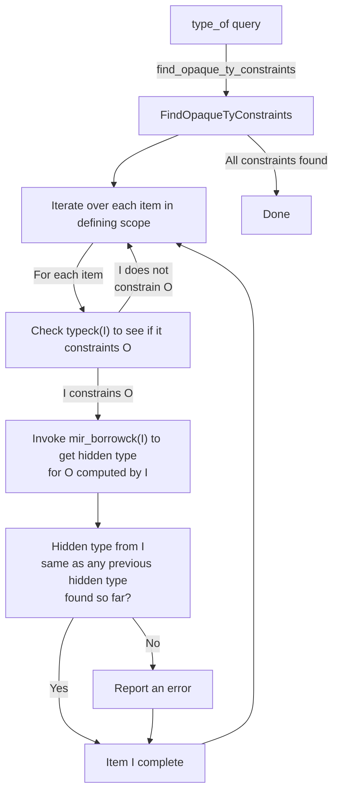

##### Relating an opaque type to another type

There is one central place where an opaque type gets its hidden type constrained,
and that is the `handle_opaque_type` function.
Amusingly it takes two types, so you can pass any two types,
but one of them should be an opaque type.
The order is only important for diagnostics.

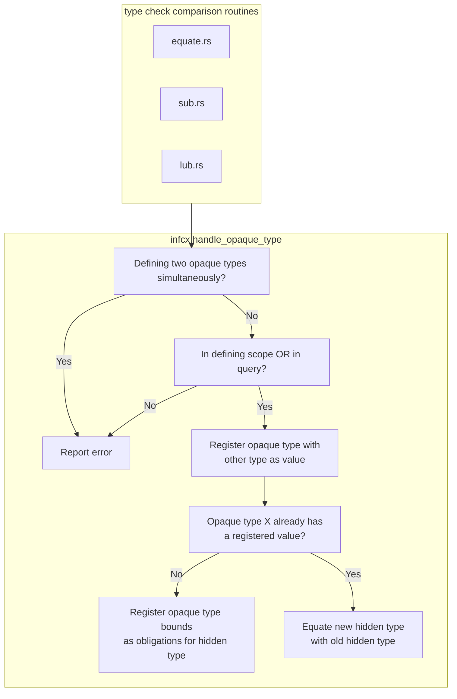

##### Interactions with queries

When queries handle opaque types,
they cannot figure out whether they are in a defining scope,
so they just assume they are.

The registered hidden types are stored into the `QueryResponse` struct
in the `opaque_types` field (the function
`take_opaque_types_for_query_response` reads them out).

When the `QueryResponse` is instantiated into the surrounding infcx in
`query_response_substitution_guess`,
we convert each hidden type constraint by invoking `handle_opaque_type` (as above).

There is one bit of "weirdness".
The instantiated opaque types have an order
(if one opaque type was compared with another,
and we have to pick one opaque type to use as the one that gets its hidden type assigned).
We use the one that is considered "expected".
But really both of the opaque types may have defining uses.
When the query result is instantiated,
that will be re-evaluated from the context that is using the query.
The final context (typeck of a function, mir borrowck or wf-checks)
will know which opaque type can actually be instantiated
and then handle it correctly.

##### Within the MIR borrow checker

The MIR borrow checker relates things via `nll_relate` and only cares about regions.
Any type relation will trigger the binding of hidden types,
so the borrow checker is doing the same thing as the type checker,
but ignores obviously dead code (e.g. after a panic).
The borrow checker is also the source of truth when it comes to hidden types,
as it is the only one who can properly figure out what lifetimes on the hidden type correspond
to which lifetimes on the opaque type declaration.

#### Backwards compatibility hacks

`impl Trait` in return position has various quirks that were not part
of any RFCs and are likely accidental stabilization.
To support these,
the `replace_opaque_types_with_inference_vars` is being used to reintroduce the previous behaviour.

There are three backwards compatibility hacks:

1. All return sites share the same inference variable,
   so some return sites may only compile if another return site uses a concrete type.
    ```rust
    fn foo() -> impl Debug {
        if false {
            return std::iter::empty().collect();
        }
        vec![42]
    }
    ```
2. Associated type equality constraints for `impl Trait` can be used
   as long as the hidden type  satisfies the trait bounds on the associated type.
   The opaque `impl Trait` signature does not need to satisfy them.

    ```rust
    trait Duh {}

    impl Duh for i32 {}

    trait Trait {
        type Assoc: Duh;
    }

    // the fact that `R` is the `::Output` projection on `F` causes
    // an intermediate inference var to be generated which is then later
    // compared against the actually found `Assoc` type.
    impl<R: Duh, F: FnMut() -> R> Trait for F {
        type Assoc = R;
    }

    // The `impl Send` here is then later compared against the inference var
    // created, causing the inference var to be set to `impl Send` instead of
    // the hidden type. We already have obligations registered on the inference
    // var to make it uphold the `: Duh` bound on `Trait::Assoc`. The opaque
    // type does not implement `Duh`, even if its hidden type does.
    // Lazy TAIT would error out, but we inserted a hack to make it work again,
    // keeping backwards compatibility.
    fn foo() -> impl Trait<Assoc = impl Send> {
        || 42
    }
    ```
3. Closures cannot create hidden types for their parent function's `impl Trait`.
   This point is mostly moot,
   because of point 1 introducing inference vars,
   so the closure only ever sees the inference var, but should we fix 1, this will become a problem.


### Return Position Impl Trait In Trait {#return-position-impl-trait-in-trait}

Return-position impl trait in trait (RPITIT) is conceptually (and as of
[#112988], literally) sugar that turns RPITs in trait methods into
generic associated types (GATs) without the user having to define that
GAT either on the trait side or impl side.

RPITIT was originally implemented in [#101224], which added support for
async fn in trait (AFIT), since the implementation for RPITIT came for
free as a part of implementing AFIT which had been RFC'd previously. It
was then RFC'd independently in [RFC 3425], which was recently approved
by T-lang.

#### How does it work?

This doc is ordered mostly via the compilation pipeline:

1. AST lowering (AST -> HIR)
2. HIR ty lowering (HIR -> rustc_middle::ty data types)
3. typeck

##### AST lowering

AST lowering for RPITITs is almost the same as lowering RPITs. We
still lower them as
[`hir::ItemKind::OpaqueTy`](https://doc.rust-lang.org/nightly/nightly-rustc/rustc_hir/hir/struct.OpaqueTy.html).
The two differences are that:

We record `in_trait` for the opaque. This will signify that the opaque
is an RPITIT for HIR ty lowering, diagnostics that deal with HIR, etc.

We record `lifetime_mapping`s for the opaque type, described below.

###### Aside: Opaque lifetime duplication

*All opaques* (not just RPITITs) end up duplicating their captured
lifetimes into new lifetime parameters local to the opaque. The main
reason we do this is because RPITs need to be able to "reify"[^1] any
captured late-bound arguments, or make them into early-bound ones. This
is so they can be used as generic args for the opaque, and later to
instantiate hidden types. Since we don't know which lifetimes are early-
or late-bound during AST lowering, we just do this for all lifetimes.

[^1]: This is compiler-errors terminology, I'm not claiming it's accurate :^)

The main addition for RPITITs is that during lowering we track the
relationship between the captured lifetimes and the corresponding
duplicated lifetimes in an additional field,
[`OpaqueTy::lifetime_mapping`](https://doc.rust-lang.org/nightly/nightly-rustc/rustc_hir/hir/struct.OpaqueTy.html#structfield.lifetime_mapping).
We use this lifetime mapping later on in `predicates_of` to install
bounds that enforce equality between these duplicated lifetimes and
their source lifetimes in order to properly typecheck these GATs, which
will be discussed below.

###### Note

It may be better if we were able to lower without duplicates and for
that I think we would need to stop distinguishing between early and late
bound lifetimes. So we would need a solution like [Account for
late-bound lifetimes in generics
#103448](https://github.com/rust-lang/rust/pull/103448) and then also a
PR similar to [Inherit function lifetimes for impl-trait
#103449](https://github.com/rust-lang/rust/pull/103449).

##### HIR ty lowering

The main change to HIR ty lowering is that we lower `hir::TyKind::OpaqueDef`
for an RPITIT to a projection instead of an opaque, using a newly
synthesized def-id for a new associated type in the trait. We'll
describe how exactly we get this def-id in the next section.

This means that any time we call `lower_ty` on the RPITIT, we end up
getting a projection back instead of an opaque. This projection can then
be normalized to the right value -- either the original opaque if we're
in the trait, or the inferred type of the RPITIT if we're in an impl.

###### Lowering to synthetic associated types

Using query feeding, we synthesize new associated types on both the
trait side and impl side for RPITITs that show up in methods.

###### Lowering RPITITs in traits

When `tcx.associated_item_def_ids(trait_def_id)` is called on a trait to
gather all of the trait's associated types, the query previously just
returned the def-ids of the HIR items that are children of the trait.
After [#112988], additionally, for each method in the trait, we add the
def-ids returned by
`tcx.associated_types_for_impl_traits_in_associated_fn(trait_method_def_id)`,
which walks through each trait method, gathers any RPITITs that show up
in the signature, and then calls
`associated_type_for_impl_trait_in_trait` for each RPITIT, which
synthesizes a new associated type.

###### Lowering RPITITs in impls

Similarly, along with the impl's HIR items, for each impl method, we
additionally add all of the
`associated_types_for_impl_traits_in_associated_fn` for the impl method.
This calls `associated_type_for_impl_trait_in_impl`, which will
synthesize an associated type definition for each RPITIT that comes from
the corresponding trait method.

###### Synthesizing new associated types

We use query feeding
([`TyCtxtAt::create_def`](https://doc.rust-lang.org/nightly/nightly-rustc/rustc_middle/query/plumbing/struct.TyCtxtAt.html#method.create_def))
to synthesize a new def-id for the synthetic GATs for each RPITIT.

Locally, most of rustc's queries match on the HIR of an item to compute
their values. Since the RPITIT doesn't really have HIR associated with
it, or at least not HIR that corresponds to an associated type, we must
compute many queries eagerly and
[feed](https://github.com/rust-lang/rust/pull/104940) them, like
`opt_def_kind`, `associated_item`, `visibility`, and`defaultness`.

The values for most of these queries is obvious, since the RPITIT
conceptually inherits most of its information from the parent function
(e.g. `visibility`), or because it's trivially knowable because it's an
associated type (`opt_def_kind`).

Some other queries are more involved, or cannot be fed, and we
document the interesting ones of those below:

###### `generics_of` for the trait

The GAT for an RPITIT conceptually inherits the same generics as the
RPIT it comes from. However, instead of having the method as the
generics' parent, the trait is the parent.

Currently we get away with taking the RPIT's generics and method
generics and flattening them both into a new generics list, preserving
the def-id of each of the parameters. (This may cause issues with
def-ids having the wrong parents, but in the worst case this will cause
diagnostics issues. If this ends up being an issue, we can synthesize
new def-ids for generic params whose parent is the GAT.)

<details>
<summary> <b>An illustrated example</b> </summary>

```rust
trait Foo {
    fn method<'early: 'early, 'late, T>() -> impl Sized + Captures<'early, 'late>;
}
```

Would desugar to...
```rust
trait Foo {
    //       vvvvvvvvv method's generics
    //                  vvvvvvvvvvvvvvvvvvvvvvvv opaque's generics
    type Gat<'early, T, 'early_duplicated, 'late>: Sized + Captures<'early_duplicated, 'late>;

    fn method<'early: 'early, 'late, T>() -> Self::Gat<'early, T, 'early, 'late>;
}
```
</details>

###### `generics_of` for the impl

The generics for an impl's GAT are a bit more interesting. They are
composed of RPITIT's own generics (from the trait definition), appended
onto the impl's methods generics. This has the same issue as above,
where the generics for the GAT have parameters whose def-ids have the
wrong parent, but this should only cause issues in diagnostics.

We could fix this similarly if we were to synthesize new generics
def-ids, but this can be done later in a forwards-compatible way,
perhaps by a interested new contributor.

###### `opt_rpitit_info`

Some queries rely on computing information that would result in cycles
if we were to feed them eagerly, like `explicit_predicates_of`.
Therefore we defer to the `predicates_of` provider to return the right
value for our RPITIT's GAT. We do this by detecting early on in the
query if the associated type is synthetic by using
[`opt_rpitit_info`](https://doc.rust-lang.org/nightly/nightly-rustc/rustc_middle/ty/context/struct.TyCtxt.html#method.opt_rpitit_info),
which returns `Some` if the associated type is synthetic.

Then, during a query like `explicit_predicates_of`, we can detect if an
associated type is synthetic like:

```rust
fn explicit_predicates_of(tcx: TyCtxt<'_>, def_id: LocalDefId) -> ... {
    if let Some(rpitit_info) = tcx.opt_rpitit_info(def_id) {
        // Do something special for RPITITs...
        return ...;
    }

    // The regular computation which relies on access to the HIR of `def_id`.
}
```

###### `explicit_predicates_of`

RPITITs begin by copying the predicates of the method that defined it,
both on the trait and impl side.

Additionally, we install "bidirectional outlives" predicates.
Specifically, we add region-outlives predicates in both directions for
each captured early-bound lifetime that constrains it to be equal to the
duplicated early-bound lifetime that results from lowering. This is best
illustrated in an example:

```rust
trait Foo<'a> {
    fn bar() -> impl Sized + 'a;
}

// Desugars into...

trait Foo<'a> {
    type Gat<'a_duplicated>: Sized + 'a
    where
        'a: 'a_duplicated,
        'a_duplicated: 'a;
    //~^ Specifically, we should be able to assume that the
    // duplicated `'a_duplicated` lifetime always stays in
    // sync with the `'a` lifetime.

    fn bar() -> Self::Gat<'a>;
}
```

###### `assumed_wf_types`

The GATs in both the trait and impl inherit the `assumed_wf_types` of
the trait method that defines the RPITIT. This is to make sure that the
following code is well formed when lowered.

```rust
trait Foo {
    fn iter<'a, T>(x: &'a [T]) -> impl Iterator<Item = &'a T>;
}

// which is lowered to...

trait FooDesugared {
    type Iter<'a, T>: Iterator<Item = &'a T>;
    //~^ assumed wf: `&'a [T]`
    // Without assumed wf types, the GAT would not be well-formed on its own.

    fn iter<'a, T>(x: &'a [T]) -> Self::Iter<'a, T>;
}
```

Because `assumed_wf_types` is only defined for local def ids, in order
to properly implement `assumed_wf_types` for impls of foreign traits
with RPITs, we need to encode the assumed wf types of RPITITs in an
extern query
[`assumed_wf_types_for_rpitit`](https://github.com/rust-lang/rust/blob/a17c7968b727d8413801961fc4e89869b6ab00d3/compiler/rustc_ty_utils/src/implied_bounds.rs#L14).

##### Typechecking

###### The RPITIT inference algorithm

The RPITIT inference algorithm is implemented in
[`collect_return_position_impl_trait_in_trait_tys`](https://doc.rust-lang.org/nightly/nightly-rustc/rustc_hir_analysis/check/compare_impl_item/fn.collect_return_position_impl_trait_in_trait_tys.html).

**High-level:** Given a impl method and a trait method, we take the
trait method and instantiate each RPITIT in the signature with an infer
var. We then equate this trait method signature with the impl method
signature, and process all obligations that fall out in order to infer
the type of all of the RPITITs in the method.

The method is also responsible for making sure that the hidden types for
each RPITIT actually satisfy the bounds of the `impl Trait`, i.e. that
if we infer `impl Trait = Foo`, that `Foo: Trait` holds.

<details>
    <summary><b>An example...</b></summary>

```rust
#![feature(return_position_impl_trait_in_trait)]

use std::ops::Deref;

trait Foo {
    fn bar() -> impl Deref<Target = impl Sized>;
             // ^- RPITIT ?0        ^- RPITIT ?1
}

impl Foo for () {
    fn bar() -> Box<String> { Box::new(String::new()) }
}
```

We end up with the trait signature that looks like `fn() -> ?0`, and
nested obligations `?0: Deref<Target = ?1>`, `?1: Sized`. The impl
signature is `fn() -> Box<String>`.

Equating these signatures gives us `?0 = Box<String>`, which then after
processing the obligation `Box<String>: Deref<Target = ?1>` gives us `?1
= String`, and the other obligation `String: Sized` evaluates to true.

By the end of the algorithm, we end up with a mapping between associated
type def-ids to concrete types inferred from the signature. We can then
use this mapping to implement `type_of` for the synthetic associated
types in the impl, since this mapping describes the type that should
come after the `=` in `type Assoc = ...` for each RPITIT.
</details>

###### Implied bounds in RPITIT hidden type inference

Since `collect_return_position_impl_trait_in_trait_tys` does fulfillment and
region resolution, we must provide it `assumed_wf_types` so that we can prove
region obligations with the same expected implied bounds as
`compare_method_predicate_entailment` does.

Since the return type of a method is understood to be one of the assumed WF
types, and we eagerly fold the return type with inference variables to do
opaque type inference, after opaque type inference, the return type will
resolve to contain the hidden types of the RPITITs. this would mean that the
hidden types of the RPITITs would be assumed to be well-formed without having
independently proven that they are. This resulted in a
[subtle unsoundness bug](https://github.com/rust-lang/rust/pull/116072). In
order to prevent this cyclic reasoning, we instead replace the hidden types of
the RPITITs in the return type of the method with *placeholders*, which lead
to no implied well-formedness bounds.

###### Default trait body

Type-checking a default trait body, like:

```rust
trait Foo {
    fn bar() -> impl Sized {
        1i32
    }
}
```

requires one interesting hack. We need to install a projection predicate
into the param-env of `Foo::bar` allowing us to assume that the RPITIT's
GAT normalizes to the RPITIT's opaque type. This relies on the
observation that a trait method and RPITIT's GAT will always be "in
sync". That is, one will only ever be overridden if the other one is as
well.

Compare this to a similar desugaring of the code above, which would fail
because we cannot rely on this same assumption:

```rust
#![feature(impl_trait_in_assoc_type)]
#![feature(associated_type_defaults)]

trait Foo {
    type RPITIT = impl Sized;

    fn bar() -> Self::RPITIT {
        01i32
    }
}
```

Failing because a down-stream impl could theoretically provide an
implementation for `RPITIT` without providing an implementation of
`bar`:

```text
error[E0308]: mismatched types
--> src/lib.rs:8:9
 |
5 |     type RPITIT = impl Sized;
 |     ------------------------- associated type defaults can't be assumed inside the trait defining them
6 |
7 |     fn bar() -> Self::RPITIT {
 |                 ------------ expected `<Self as Foo>::RPITIT` because of return type
8 |         01i32
 |         ^^^^^ expected associated type, found `i32`
 |
 = note: expected associated type `<Self as Foo>::RPITIT`
                       found type `i32`
```

###### Well-formedness checking

We check well-formedness of RPITITs just like regular associated types.

Since we added lifetime bounds in `predicates_of` that link the
duplicated early-bound lifetimes to their original lifetimes, and we
implemented `assumed_wf_types` which inherits the WF types of the method
from which the RPITIT originates ([#113704]), we have no issues
WF-checking the GAT as if it were a regular GAT.

##### What's broken, what's weird, etc.

###### Specialization is super busted

The "default trait methods" described above does not interact well with
specialization, because we only install those projection bounds in trait
default methods, and not in impl methods. Given that specialization is
already pretty busted, I won't go into detail, but it's currently a bug
tracked in:
    * `tests/ui/impl-trait/in-trait/specialization-broken.rs`

###### Projections don't have variances

This code fails because projections don't have variances:
```rust
#![feature(return_position_impl_trait_in_trait)]

trait Foo {
    // Note that the RPITIT below does *not* capture `'lt`.
    fn bar<'lt: 'lt>() -> impl Eq;
}

fn test<'a, 'b, T: Foo>() -> bool {
    <T as Foo>::bar::<'a>() == <T as Foo>::bar::<'b>()
    //~^ ERROR
    // (requires that `'a == 'b`)
}
```

This is because we can't relate `<T as Foo>::Rpitit<'a>` and `<T as
Foo>::Rpitit<'b>`, even if they don't capture their lifetime. If we were
using regular opaque types, this would work, because they would be
bivariant in that lifetime parameter:
```rust
#![feature(return_position_impl_trait_in_trait)]

fn bar<'lt: 'lt>() -> impl Eq {
    ()
}

fn test<'a, 'b>() -> bool {
    bar::<'a>() == bar::<'b>()
}
```

This is probably okay though, since RPITITs will likely have their
captures behavior changed to capture all in-scope lifetimes anyways.
This could also be relaxed later in a forwards-compatible way if we were
to consider variances of RPITITs when relating projections.

[#112988]: https://github.com/rust-lang/rust/pull/112988
[RFC 3425]: https://github.com/rust-lang/rfcs/pull/3425
[#101224]: https://github.com/rust-lang/rust/pull/101224
[#113704]: https://github.com/rust-lang/rust/pull/113704


### Opaque types region inference restrictions {#borrow-check-opaque-types-region-inference-restrictions}

In this chapter we discuss the various restrictions we impose on the generic arguments of
opaque types when defining their hidden types
`Opaque<'a, 'b, .., A, B, ..> := SomeHiddenType`.

These restrictions are implemented in borrow checking ([Source][source-borrowck-opaque])
as it is the final step opaque types inference.

[source-borrowck-opaque]: https://github.com/rust-lang/rust/blob/435b5255148617128f0a9b17bacd3cc10e032b23/compiler/rustc_borrowck/src/region_infer/opaque_types.rs

#### Background: type and const generic arguments
For type arguments, two restrictions are necessary: each type argument must be
(1) a type parameter and
(2) is unique among the generic arguments.
The same is applied to const arguments.

Example of case (1):
```rust
type Opaque<X> = impl Sized;

// `T` is a type parameter.
// Opaque<T> := ();
fn good<T>() -> Opaque<T> {}

// `()` is not a type parameter.
// Opaque<()> := ();
fn bad() -> Opaque<()> {} //~ ERROR
```

Example of case (2):
```rust
type Opaque<X, Y> = impl Sized;

// `T` and `U` are unique in the generic args.
// Opaque<T, U> := T;
fn good<T, U>(t: T, _u: U) -> Opaque<T, U> { t }

// `T` appears twice in the generic args.
// Opaque<T, T> := T;
fn bad<T>(t: T) -> Opaque<T, T> { t } //~ ERROR
```
**Motivation:** In the first case `Opaque<()> := ()`, the hidden type is ambiguous because
it is compatible with two different interpretaions: `Opaque<X> := X` and `Opaque<X> := ()`.
Similarly for the second case `Opaque<T, T> := T`, it is ambiguous whether it should be
interpreted as `Opaque<X, Y> := X` or as `Opaque<X, Y> := Y`.
Because of this ambiguity, both cases are rejected as invalid defining uses.

#### Uniqueness restriction

Each lifetime argument must be unique in the arguments list and must not be `'static`.
This is in order to avoid an ambiguity with hidden type inference similar to the case of
type parameters.
For example, the invalid defining use below `Opaque<'static> := Inv<'static>` is compatible with
both `Opaque<'x> := Inv<'static>` and `Opaque<'x> := Inv<'x>`.

```rust
type Opaque<'x> = impl Sized + 'x;
type Inv<'a> = Option<*mut &'a ()>;

fn good<'a>() -> Opaque<'a> { Inv::<'static>::None }

fn bad() -> Opaque<'static> { Inv::<'static>::None }
//~^ ERROR
```

```rust
type Opaque<'x, 'y> = impl Trait<'x, 'y>;

fn good<'a, 'b>() -> Opaque<'a, 'b> {}

fn bad<'a>() -> Opaque<'a, 'a> {}
//~^ ERROR
```

**Semantic lifetime equality:**
One complexity with lifetimes compared to type parameters is that
two lifetimes that are syntactically different may be semantically equal.
Therefore, we need to be cautious when verifying that the lifetimes are unique.

```rust
// This is also invalid because `'a` is *semantically* equal to `'static`.
fn still_bad_1<'a: 'static>() -> Opaque<'a> {}
//~^ Should error!

// This is also invalid because `'a` and `'b` are *semantically* equal.
fn still_bad_2<'a: 'b, 'b: 'a>() -> Opaque<'a, 'b> {}
//~^ Should error!
```

#### An exception to uniqueness rule

An exception to the uniqueness rule above is when the bounds at the opaque type's definition require
a lifetime parameter to be equal to another one or to the `'static` lifetime.
```rust
// The definition requires `'x` to be equal to `'static`.
type Opaque<'x: 'static> = impl Sized + 'x;

fn good() -> Opaque<'static> {}
```

**Motivation:** an attempt to implement the uniqueness restriction for RPITs resulted in a
[breakage found by crater](https://github.com/rust-lang/rust/pull/112842#issuecomment-1610057887).
This can be mitigated by this exception to the rule.
An example of the code that would otherwise break:
```rust
struct Type<'a>(&'a ());
impl<'a> Type<'a> {
    // `'b == 'a`
    fn do_stuff<'b: 'a>(&'b self) -> impl Trait<'a, 'b> {}
}
```

**Why this is correct:** for such a defining use like `Opaque<'a, 'a> := &'a str`,
it can be interpreted in either way—either as `Opaque<'x, 'y> := &'x str` or as
`Opaque<'x, 'y> := &'y str` and it wouldn't matter because every use of `Opaque`
will guarantee that both parameters are equal as per the well-formedness rules.

#### Universal lifetimes restriction

Only universally quantified lifetimes are allowed in the opaque type arguments.
This includes lifetime parameters and placeholders.

```rust
type Opaque<'x> = impl Sized + 'x;

fn test<'a>() -> Opaque<'a> {
    // `Opaque<'empty> := ()`
    let _: Opaque<'_> = ();
    //~^ ERROR
}
```

**Motivation:**
This makes the lifetime and type arguments behave consistently but this is only as a bonus.
The real reason behind this restriction is purely technical, as the [member constraints] algorithm
faces a fundamental limitation:
When encountering an opaque type definition `Opaque<'?1> := &'?2 u8`,
a member constraint `'?2 member-of ['static, '?1]` is registered.
In order for the algorithm to pick the right choice, the *complete* set of "outlives" relationships
between the choice regions `['static, '?1]` must already be known *before* doing the region
inference. This can be satisfied only if each choice region is either:
1. a universal region, i.e. `RegionKind::Re{EarlyParam,LateParam,Placeholder,Static}`,
because the relations between universal regions are completely known, prior to region inference,
from the explicit and implied bounds.
1. or an existential region that is "strictly equal" to a universal region.
Strict lifetime equality is defined below and is required here because it is the only type of
equality that can be evaluated prior to full region inference.

**Strict lifetime equality:**
We say that two lifetimes are strictly equal if there are bidirectional outlives constraints
between them. In NLL terms, this means the lifetimes are part of the same [SCC].
Importantly this type of equality can be evaluated prior to full region inference
(but of course after constraint collection).
The other type of equality is when region inference ends up giving two lifetimes variables
the same value even if they are not strictly equal.
See [#113971] for how we used to conflate the difference.

[#113971]: https://github.com/rust-lang/rust/issues/113971
[SCC]: https://en.wikipedia.org/wiki/Strongly_connected_component
[member constraints]: #borrow-check-region-inference-member-constraints

**interaction with "once modulo regions" restriction**
In the example above, note the opaque type in the signature is `Opaque<'a>` and the one in the
invalid defining use is `Opaque<'empty>`.
In the proposed MiniTAIT plan, namely the ["once modulo regions"][#116935] rule,
we already disallow this.
Although it might appear that "universal lifetimes" restriction becomes redundant as it logically
follows from "MiniTAIT" restrictions, the subsequent related discussion on lifetime equality and
closures remains relevant.

[#116935]: https://github.com/rust-lang/rust/pull/116935


#### Closure restrictions

When the opaque type is defined in a closure/coroutine/inline-const body, universal lifetimes that
are "external" to the closure are not allowed in the opaque type arguments.
External regions are defined in [`RegionClassification::External`][source-external-region]

[source-external-region]: https://github.com/rust-lang/rust/blob/caf730043232affb6b10d1393895998cb4968520/compiler/rustc_borrowck/src/universal_regions.rs#L201.

Example: (This one happens to compile in the current nightly but more practical examples are
already rejected with confusing errors.)
```rust
type Opaque<'x> = impl Sized + 'x;

fn test<'a>() -> Opaque<'a> {
    let _ = || {
        // `'a` is external to the closure
        let _: Opaque<'a> = ();
        //~^ Should be an error!
    };
    ()
}
```

**Motivation:**
In closure bodies, external lifetimes, although being categorized as "universal" lifetimes,
behave more like existential lifetimes in that the relations between them are not known ahead of
time, instead their values are inferred just like existential lifetimes and the requirements are
propagated back to the parent fn. This breaks the member constraints algorithm as described above:
> In order for the algorithm to pick the right choice, the complete set of “outlives” relationships
between the choice regions `['static, '?1]` must already be known before doing the region inference

Here is an example that details how :

```rust
type Opaque<'x, 'y> = impl Sized;

//
fn test<'a, 'b>(s: &'a str) -> impl FnOnce() -> Opaque<'a, 'b> {
    move || { s }
    //~^ ERROR hidden type for `Opaque<'_, '_>` captures lifetime that does not appear in bounds
}

// The above closure body is desugared into something like:
fn test::{closure#0}(_upvar: &'?8 str) -> Opaque<'?6, '?7> {
    return _upvar
}

// where `['?8, '?6, ?7]` are universal lifetimes *external* to the closure.
// There are no known relations between them *inside* the closure.
// But in the parent fn it is known that `'?6: '?8`.
//
// When encountering an opaque definition `Opaque<'?6, '?7> := &'8 str`,
// The member constraints algorithm does not know enough to safely make `?8 = '?6`.
// For this reason, it errors with a sensible message:
// "hidden type captures lifetime that does not appear in bounds".
```

Without these restrictions, error messages are confusing and, more importantly, there is a risk that
we accept code that would likely break in the future because member constraints are super broken
in closures.

**Output types:**
I believe the most common scenario where this causes issues in real-world code is with
closure/async-block output types. It is worth noting that there is a discrepancy between closures
and async blocks that further demonstrates this issue and is attributed to the
[hack of `replace_opaque_types_with_inference_vars`][source-replace-opaques],
which is applied to futures only.

[source-replace-opaques]: https://github.com/rust-lang/rust/blob/9cf18e98f82d85fa41141391d54485b8747da46f/compiler/rustc_hir_typeck/src/closure.rs#L743

```rust
type Opaque<'x> = impl Sized + 'x;
fn test<'a>() -> impl FnOnce() -> Opaque<'a> {
    // Output type of the closure is Opaque<'a>
    // -> hidden type definition happens *inside* the closure
    // -> rejected.
    move || {}
    //~^ ERROR expected generic lifetime parameter, found `'_`
}
```
```rust
use std::future::Future;
type Opaque<'x> = impl Sized + 'x;
fn test<'a>() -> impl Future<Output = Opaque<'a>> {
    // Output type of the async block is unit `()`
    // -> hidden type definition happens in the parent fn
    // -> accepted.
    async move {}
}
```


## Effects, const traits, and const condition checking {#effects}

### The `HostEffect` predicate

[`HostEffectPredicate`]s are a kind of predicate from `[const] Tr` or `const Tr` bounds.
It has a trait reference, and a `constness` which could be `Maybe` or
`Const` depending on the bound.
Because `[const] Tr`, or rather `Maybe` bounds
apply differently based on whichever contexts they are in, they have different
behavior than normal bounds.
Where normal trait bounds on a function such as
`T: Tr` are collected within the [`predicates_of`] query to be proven when a
function is called and to be assumed within the function, bounds such as
`T: [const] Tr` will behave as a normal trait bound and add `T: Tr` to the result
from `predicates_of`, but also adds a `HostEffectPredicate` to the [`const_conditions`] query.

On the other hand, `T: const Tr` bounds do not change meaning across contexts,
therefore they will result in `HostEffect(T: Tr, const)` being added to
`predicates_of`, and not `const_conditions`.

[`HostEffectPredicate`]: https://doc.rust-lang.org/nightly/nightly-rustc/rustc_type_ir/predicate/struct.HostEffectPredicate.html
[`predicates_of`]: https://doc.rust-lang.org/nightly/nightly-rustc/rustc_middle/ty/struct.TyCtxt.html#method.predicates_of
[`const_conditions`]: https://doc.rust-lang.org/nightly/nightly-rustc/rustc_middle/ty/struct.TyCtxt.html#method.const_conditions

### The `const_conditions` query

`predicates_of` represents a set of predicates that need to be proven to use an item.
For example, to use `foo` in the example below:

```rust
fn foo<T>() where T: Default {}
```

We must be able to prove that `T` implements `Default`.
In a similar vein,
`const_conditions` represents a set of predicates that need to be proven to use
an item *in const contexts*. If we adjust the example above to use `const` trait bounds:

```rust
const fn foo<T>() where T: [const] Default {}
```

Then `foo` would get a `HostEffect(T: Default, maybe)` in the `const_conditions`
query, suggesting that in order to call `foo` from const contexts, one must
prove that `T` has a const implementation of `Default`.

### Enforcement of `const_conditions`

`const_conditions` are currently checked in various places.

Every call in HIR from a const context (which includes `const fn` and `const`
items) will check that `const_conditions` of the function we are calling hold.
This is done in [`FnCtxt::enforce_context_effects`].
Note that we don't check
if the function is only referred to but not called, as the following code needs to compile:

```rust
const fn hi<T: [const] Default>() -> T {
    T::default()
}
const X: fn() -> u32 = hi::<u32>;
```

For a trait `impl` to be well-formed, we must be able to prove the
`const_conditions` of the trait from the `impl`'s environment.
This is checked in [`wfcheck::check_impl`].

Here's an example:

```rust
const trait Bar {}
const trait Foo: [const] Bar {}
// `const_conditions` contains `HostEffect(Self: Bar, maybe)`

impl const Bar for () {}
impl const Foo for () {}
// ^ here we check `const_conditions` for the impl to be well-formed
```

Methods of trait impls must not have stricter bounds than the method of the
trait that they are implementing.
To check that the methods are compatible, a
hybrid environment is constructed with the predicates of the `impl` plus the
predicates of the trait method, and we attempt to prove the predicates of the impl method.
We do the same for `const_conditions`:

```rust
const trait Foo {
    fn hi<T: [const] Default>();
}

impl<T: [const] Clone> Foo for Vec<T> {
    fn hi<T: [const] PartialEq>();
    // ^ we can't prove `T: [const] PartialEq` given `T: [const] Clone` and
    // `T: [const] Default`, therefore we know that the method on the impl
    // is stricter than the method on the trait.
}
```

These checks are done in [`compare_method_predicate_entailment`].
A similar function that does the same check for associated types is called
[`compare_type_predicate_entailment`].
Both of these need to consider `const_conditions` when in const contexts.

In MIR, as part of const checking, `const_conditions` of items that are called
are revalidated again in [`Checker::revalidate_conditional_constness`].

[`compare_method_predicate_entailment`]: https://doc.rust-lang.org/nightly/nightly-rustc/rustc_hir_analysis/check/compare_impl_item/fn.compare_method_predicate_entailment.html
[`compare_type_predicate_entailment`]: https://doc.rust-lang.org/nightly/nightly-rustc/rustc_hir_analysis/check/compare_impl_item/fn.compare_type_predicate_entailment.html
[`FnCtxt::enforce_context_effects`]: https://doc.rust-lang.org/nightly/nightly-rustc/rustc_hir_typeck/fn_ctxt/struct.FnCtxt.html#method.enforce_context_effects
[`wfcheck::check_impl`]: https://doc.rust-lang.org/nightly/nightly-rustc/rustc_hir_analysis/check/wfcheck/fn.check_impl.html
[`Checker::revalidate_conditional_constness`]: https://doc.rust-lang.org/nightly/nightly-rustc/rustc_const_eval/check_consts/check/struct.Checker.html#method.revalidate_conditional_constness

### `explicit_implied_const_bounds` on associated types and traits

Bounds on associated types, opaque types, and supertraits such as the following
have their bounds represented differently:

```rust
trait Foo: [const] PartialEq {
    type X: [const] PartialEq;
}

fn foo() -> impl [const] PartialEq {
    // ^ unimplemented syntax
}
```

Unlike `const_conditions`, which need to be proved for callers,
and can be assumed inside the definition (e.g. trait
bounds on functions), these bounds need to be proved at definition (at the impl,
or when returning the opaque) but can be assumed for callers.
The non-const equivalent of these bounds are called [`explicit_item_bounds`].

These bounds are checked in [`compare_impl_item::check_type_bounds`] for HIR
typeck, [`evaluate_host_effect_from_item_bounds`] in the old solver and
[`consider_additional_alias_assumptions`] in the new solver.

[`explicit_item_bounds`]: https://doc.rust-lang.org/nightly/nightly-rustc/rustc_middle/ty/struct.TyCtxt.html#method.explicit_item_bounds
[`compare_impl_item::check_type_bounds`]: https://doc.rust-lang.org/nightly/nightly-rustc/rustc_hir_analysis/check/compare_impl_item/fn.check_type_bounds.html
[`evaluate_host_effect_from_item_bounds`]: https://doc.rust-lang.org/nightly/nightly-rustc/rustc_trait_selection/traits/effects/fn.evaluate_host_effect_from_item_bounds.html
[`consider_additional_alias_assumptions`]: https://doc.rust-lang.org/nightly/nightly-rustc/rustc_next_trait_solver/solve/assembly/trait.GoalKind.html#tymethod.consider_additional_alias_assumptions

### Proving `HostEffectPredicate`s

`HostEffectPredicate`s are implemented both in the [old solver] and the [new trait solver].
In general, we can prove a `HostEffect` predicate when either of these conditions are met:

* The predicate can be assumed from caller bounds;
* The type has a `const` `impl` for the trait, *and* that const conditions on
  the impl holds, *and* that the `explicit_implied_const_bounds` on the trait holds; or
* The type has a built-in implementation for the trait in const contexts.
  For example, `Fn` may be implemented by function items if their const conditions
  are satisfied, or `Destruct` is implemented in const contexts if the type can
  be dropped at compile time.

[old solver]: https://doc.rust-lang.org/nightly/nightly-rustc/src/rustc_trait_selection/traits/effects.rs.html
[new trait solver]: https://doc.rust-lang.org/nightly/nightly-rustc/src/rustc_next_trait_solver/solve/effect_goals.rs.html

### More on const traits

To be expanded later.

#### The `#[rustc_non_const_trait_method]` attribute

This is intended for internal (standard library) usage only.
With this attribute applied to a trait method, the compiler will not check the default body of this
method for ability to run in compile time.
Users of the trait will also not be allowed to use this trait method in const contexts.
This attribute is primarily
used for constifying large traits such as `Iterator` without having to make all
its methods `const` at the same time.

This attribute should not be present while stabilizing the trait as `const`.


## Pattern and exhaustiveness checking {#pat-exhaustive-checking}

In Rust, pattern matching and bindings have a few very helpful properties.
The compiler will check that bindings are irrefutable when made and that match arms
are exhaustive.

### Pattern usefulness

The central question that usefulness checking answers is:
"in this match expression, is that branch redundant?".
More precisely, it boils down to computing whether,
given a list of patterns we have already seen,
a given new pattern might match any new value.

For example, in the following match expression,
we ask in turn whether each pattern might match something
that wasn't matched by the patterns above it.
Here we see the 4th pattern is redundant with the 1st;
that branch will get an "unreachable" warning.
The 3rd pattern may or may not be useful,
depending on whether `Foo` has other variants than `Bar`.
Finally, we can ask whether the whole match is exhaustive
by asking whether the wildcard pattern (`_`)
is useful relative to the list of all the patterns in that match.
Here we can see that `_` is useful (it would catch `(false, None)`);
this expression would therefore get a "non-exhaustive match" error.

```rust
// x: (bool, Option<Foo>)
match x {
    (true, _) => {} // 1
    (false, Some(Foo::Bar)) => {} // 2
    (false, Some(_)) => {} // 3
    (true, None) => {} // 4
}
```

Thus usefulness is used for two purposes: detecting unreachable code (which is useful to the user),
and ensuring that matches are exhaustive (which is important for soundness,
because a match expression can return a value).

### Where it happens

This check is done anywhere you can write a pattern: `match` expressions, `if let`, `let else`,
plain `let`, and function arguments.

```rust
// `match`
// Usefulness can detect unreachable branches and forbid non-exhaustive matches.
match foo() {
    Ok(x) => x,
    Err(_) => panic!(),
}

// `if let`
// Usefulness can detect unreachable branches.
if let Some(x) = foo() {
    // ...
}

// `while let`
// Usefulness can detect infinite loops and dead loops.
while let Some(x) = it.next() {
    // ...
}

// Destructuring `let`
// Usefulness can forbid non-exhaustive patterns.
let Foo::Bar(x, y) = foo();

// Destructuring function arguments
// Usefulness can forbid non-exhaustive patterns.
fn foo(Foo { x, y }: Foo) {
    // ...
}
```

### The algorithm

Exhaustiveness checking is run before MIR building in [`check_match`].
It is implemented in the [`rustc_pattern_analysis`] crate,
with the core of the algorithm in the [`usefulness`] module.
That file contains a detailed description of the algorithm.

### Important concepts

#### Constructors and fields

In the value `Pair(Some(0), true)`, `Pair` is called the constructor of the value, and `Some(0)` and
`true` are its fields.
Every matchable value can be decomposed in this way.
Examples of constructors are:
`Some`, `None`, `(,)` (the 2-tuple constructor), `Foo {..}` (the constructor for a struct `Foo`),
and `2` (the constructor for the number `2`).

Each constructor takes a fixed number of fields; this is called its arity.
`Pair` and `(,)` have arity 2, `Some` has arity 1, `None` and `42` have arity 0.
Each type has a known set of constructors.
Some types have many constructors (like `u64`) or even an infinitely many (like `&str` and `&[T]`).

Patterns are similar: `Pair(Some(_), _)` has constructor `Pair` and two fields.
The difference is that we get some extra pattern-only constructors, namely:
the wildcard `_`, variable bindings,
integer ranges like `0..=10`, and variable-length slices like `[_, .., _]`.
We treat or-patterns separately.

Now to check if a value `v` matches a pattern `p`, we check if `v`'s constructor matches `p`'s
constructor, then recursively compare their fields if necessary.
A few representative examples:

- `matches!(v, _) := true`
- `matches!((v0,  v1), (p0,  p1)) := matches!(v0, p0) && matches!(v1, p1)`
- `matches!(Foo { a: v0, b: v1 }, Foo { a: p0, b: p1 }) := matches!(v0, p0) && matches!(v1, p1)`
- `matches!(Ok(v0), Ok(p0)) := matches!(v0, p0)`
- `matches!(Ok(v0), Err(p0)) := false` (incompatible variants)
- `matches!(v, 1..=100) := matches!(v, 1) || ... || matches!(v, 100)`
- `matches!([v0], [p0, .., p1]) := false` (incompatible lengths)
- `matches!([v0, v1, v2], [p0, .., p1]) := matches!(v0, p0) && matches!(v2, p1)`

This concept is absolutely central to pattern analysis.
The [`constructor`] module provides functions to extract, list, and manipulate constructors.
This is a useful enough concept that
variations of it can be found in other places of the compiler, like in the MIR-lowering of a match
expression and in some clippy lints.

#### Constructor grouping and splitting

The pattern-only constructors (`_`, ranges and variable-length slices) each stand for a set of
normal constructors, e.g. `_: Option<T>` stands for the set {`None`, `Some`} and `[_, .., _]` stands
for the infinite set {`[,]`, `[,,]`, `[,,,]`, ...} of the slice constructors of arity >= 2.

In order to manage these constructors, we keep them as grouped as possible.
For example:

```rust
match (0, false) {
    (0 ..=100, true) => {}
    (50..=150, false) => {}
    (0 ..=200, _) => {}
}
```

In this example, all of `0`, `1`, .., `49` match the same arms, and thus can be treated as a group.
In fact, in this match, the only ranges we need to consider are: `0..50`, `50..=100`,
`101..=150`,`151..=200` and `201..`.
Similarly:

```rust
enum Direction { North, South, East, West }
# let wind = (Direction::North, 0u8);
match wind {
    (Direction::North, 50..) => {}
    (_, _) => {}
}
```

Here we can treat all the non-`North` constructors as a group, giving us only two cases to handle:
`North`, and everything else.

This is called "constructor splitting" and is crucial to having exhaustiveness run in reasonable
time.

#### Usefulness vs reachability in the presence of empty types

This is likely the subtlest aspect of exhaustiveness.
To be fully precise, a match doesn't operate on a value; it operates on a place.
In certain unsafe circumstances, it is possible for a place to not contain valid data for its type.
This has subtle consequences for empty types.
Take the following:

```rust
enum Void {}
let x: u8 = 0;
let ptr: *const Void = &x as *const u8 as *const Void;
unsafe {
    match *ptr {
        _ => println!("Reachable!"),
    }
}
```

In this example, `ptr` is a valid pointer pointing to a place with invalid data.
The `_` pattern does not look at the contents of the place `*ptr`,
so this code is ok and the arm is taken.
In other words, despite the place we are inspecting being of type `Void`, there is a reachable arm.
If the arm had a binding however:

```rust
# #[derive(Copy, Clone)]
# enum Void {}
# let x: u8 = 0;
# let ptr: *const Void = &x as *const u8 as *const Void;
# unsafe {
match *ptr {
    _a => println!("Unreachable!"),
}
# }
```

Here the binding loads the value of type `Void` from the `*ptr` place.
In this example, this causes UB since the data is not valid.
In the general case, this asserts validity of the data at `*ptr`.
Either way, this arm will never be taken.

Finally, let's consider the empty match `match *ptr {}`.
If we consider this exhaustive, then having invalid data at `*ptr` is invalid.
In other words, the empty match is semantically equivalent to the `_a => ...` match.
In the interest of explicitness, we prefer the case with an
arm, hence we won't tell the user to remove the `_a` arm.
In other words, the `_a` arm is unreachable yet not redundant.
This is why we lint on redundant arms rather than unreachable
arms, despite the fact that the lint says "unreachable".

These considerations only affects certain places, namely those that can contain non-valid data
without UB.
These are: pointer dereferences, reference dereferences, and union field accesses.
We track during exhaustiveness checking whether a given place is known to contain valid data.

Having said all that, the current implementation of exhaustiveness checking does not follow the
above considerations.
On stable, empty types are for the most part treated as non-empty.
The [`exhaustive_patterns`] feature errs on the other end: it allows omitting arms that could be
reachable in unsafe situations.
The [`never_patterns`] experimental feature aims to fix this and
permit the correct behavior of empty types in patterns.

[`check_match`]: https://doc.rust-lang.org/nightly/nightly-rustc/rustc_mir_build/thir/pattern/check_match/index.html
[`rustc_pattern_analysis`]: https://doc.rust-lang.org/nightly/nightly-rustc/rustc_pattern_analysis/index.html
[`usefulness`]: https://doc.rust-lang.org/nightly/nightly-rustc/rustc_pattern_analysis/usefulness/index.html
[`constructor`]: https://doc.rust-lang.org/nightly/nightly-rustc/rustc_pattern_analysis/constructor/index.html
[`never_patterns`]: https://github.com/rust-lang/rust/issues/118155
[`exhaustive_patterns`]: https://github.com/rust-lang/rust/issues/51085


## Unsafety checking {#unsafety-checking}

Certain expressions in Rust can violate memory safety and as such need to be
inside an `unsafe` block or function.
The compiler will also warn if an unsafe block is used without any corresponding unsafe operations.

### Overview

The unsafety check is located in the [`check_unsafety`] module.
It performs a walk over the [THIR] of a function and all of its closures and inline constants.
It keeps track of the unsafe context: whether it has entered an `unsafe` block.
If an unsafe operation is used outside of an `unsafe` block, then an error is reported.
If an unsafe operation is used in an unsafe block,
that block is marked as used for [the unused_unsafe lint](#the-unused_unsafe-lint).

The unsafety check needs type information, so could potentially be done on the
HIR, making use of typeck results, THIR or MIR.
THIR is chosen because there are
fewer cases to consider than in HIR, for example unsafe function calls and
unsafe method calls have the same representation in THIR.
The check is not done on MIR because safety checks do not depend on control flow,
so there is no need to use MIR.
Also, MIR doesn't have precise enough spans for some expressions.

Most unsafe operations can be identified by checking the `ExprKind` in THIR and
checking the type of the argument.
For example, dereferences of a raw pointer
correspond to `ExprKind::Deref`s with an argument that has a raw pointer type.

Looking for unsafe Union field accesses is a bit more complex because writing to
a field of a union is safe.
The checker tracks when it's visiting the left-hand
side of an assignment expression and allows union fields to directly appear
there, while erroring in all other cases.
Union field accesses can also occur in patterns, so those have to be walked as well.

[THIR]: #thir
[`check_unsafety`]: https://doc.rust-lang.org/nightly/nightly-rustc/rustc_mir_build/check_unsafety/index.html

### The unused_unsafe lint

The unused_unsafe lint reports `unsafe` blocks that can be removed.
The unsafety checker records whenever it finds an operation that requires unsafe.
The lint is then reported if either:

- An `unsafe` block contains no unsafe operations
- An `unsafe` block is within another unsafe block, and the outer block isn't considered unused

```rust
#![deny(unused_unsafe)]
let y = 0;
let x: *const u8 = core::ptr::addr_of!(y);
unsafe { // lint reported for this block
    unsafe {
        let z = *x;
    }
    let safe_expr = 123;
}
unsafe {
    unsafe { // lint reported for this block
        let z = *x;
    }
    let unsafe_expr = *x;
}
```

### Other checks involving `unsafe`

[Unsafe traits] require an `unsafe impl` to be implemented, the check for this
is done as part of [coherence].
The `unsafe_code` lint is run as a lint pass on
the ast that searches for unsafe blocks, functions and implementations, as well
as certain unsafe attributes.

[Unsafe traits]: https://doc.rust-lang.org/reference/items/traits.html#unsafe-traits
[coherence]: https://github.com/rust-lang/rust/blob/HEAD/compiler/rustc_hir_analysis/src/coherence/unsafety.rs


## Dataflow Analysis {#mir-dataflow}

If you work on the MIR, you will frequently come across various flavors of
[dataflow analysis].
`rustc` uses dataflow to find uninitialized
variables, determine what variables are live across a generator `yield`
statement, and compute which `Place`s are borrowed at a given point in the control-flow graph.
Dataflow analysis is a fundamental concept in modern
compilers, and knowledge of the subject will be helpful to prospective contributors.

However, this documentation is not a general introduction to dataflow analysis.
It is merely a description of the framework used to define these analyses in `rustc`.
It assumes that the reader is familiar with the core ideas as well as
some basic terminology, such as "transfer function", "fixpoint" and "lattice".
If you're unfamiliar with these terms, or if you want a quick refresher,
[*Static Program Analysis*] is an excellent and freely available textbook.
For those who prefer audiovisual learning, we previously recommended a series of short lectures
by the Goethe University Frankfurt on YouTube, but it has since been deleted.
See [this PR][pr-1295] for the context and [this comment][pr-1295-comment]
for the alternative lectures.

### Defining a Dataflow Analysis

A dataflow analysis is defined by the [`Analysis`] trait.
In addition to the type of the dataflow state, this trait defines the initial value of that state
at entry to each block, as well as the direction of the analysis, either forward or backward.
The domain of your dataflow analysis must be a [lattice]
(strictly speaking a join-semilattice) with a well-behaved `join` operator.
See documentation for the [`lattice`] module, as well as the [`JoinSemiLattice`]
trait, for more information.

#### Transfer Functions and Effects

The dataflow framework in `rustc` allows each statement (and terminator) inside
a basic block to define its own transfer function.
For brevity, these individual transfer functions are known as "effects".
Each effect is applied successively in dataflow order,
and together they define the transfer function for the entire basic block.
It's also possible to define an effect for
particular outgoing edges of some terminators (e.g.
[`apply_call_return_effect`] for the `success` edge of a `Call` terminator).
Collectively, these are referred to as "per-edge effects".

#### "Before" Effects

Observant readers of the documentation may notice that there are actually *two*
possible effects for each statement and terminator, the "before" effect and the
unprefixed (or "primary") effect.
The "before" effects are applied immediately
before the unprefixed effect **regardless of the direction of the analysis**.
In other words, a backward analysis will apply the "before" effect and then the
"primary" effect when computing the transfer function for a basic block, just
like a forward analysis.

The vast majority of analyses should use only the unprefixed effects: Having
multiple effects for each statement makes it difficult for consumers to know
where they should be looking.
However, the "before" variants can be useful in
some scenarios, such as when the effect of the right-hand side of an assignment
statement must be considered separately from the left-hand side.

#### Convergence

Your analysis must converge to "fixpoint", otherwise it will run forever.
Converging to fixpoint is just another way of saying "reaching equilibrium".
In order to reach equilibrium, your analysis must obey some laws.
One of the laws it must obey is that the bottom value[^bottom-purpose] joined with some
other value equals the second value.
Or, as an equation:

> *bottom* join *x* = *x*

Another law is that your analysis must have a "top value" such that

> *top* join *x* = *top*

Having a top value ensures that your semilattice has a finite height, and the
law state above ensures that once the dataflow state reaches top, it will no
longer change (the fixpoint will be top).

[^bottom-purpose]: The bottom value's primary purpose is as the initial dataflow
    state.
    Each basic block's entry state is initialized to bottom before the analysis starts.

### A Brief Example

This section provides a brief example of a simple data-flow analysis at a high level.
It doesn't explain everything you need to know, but hopefully it will
make the rest of this page clearer.

Let's say we want to do a simple analysis to find if `mem::transmute` may have
been called by a certain point in the program.
Our analysis domain will just be a `bool` that records whether `transmute` has been called so far.
The bottom value will be `false`, since by default `transmute` has not been called.
The top value will be `true`, since our analysis is done as soon as we determine that
`transmute` has been called. Our join operator will just be the boolean OR (`||`)
operator.
We use OR and not AND because of this case:

```rust
# unsafe fn example(some_cond: bool) {
let x = if some_cond {
    std::mem::transmute::<i32, u32>(0_i32) // transmute was called!
} else {
    1_u32 // transmute was not called
};

// Has transmute been called by this point? We conservatively approximate that
// as yes, and that is why we use the OR operator.
println!("x: {}", x);
# }
```

### Inspecting the Results of a Dataflow Analysis

Once you have constructed an analysis, you must call `iterate_to_fixpoint`
which will return a `Results`, which contains the dataflow state at fixpoint
upon entry of each block.
Once you have a `Results`, you can inspect the dataflow state at fixpoint at any point in the CFG.
If you only need the state
at a few locations (e.g., each `Drop` terminator) use a [`ResultsCursor`]. If
you need the state at *every* location, a [`ResultsVisitor`] will be more efficient.

```text
                         Analysis
                            |
                            | iterate_to_fixpoint()
                            |
                         Results
                         /     \
 into_results_cursor(…) /       \  visit_with(…)
                       /         \
               ResultsCursor  ResultsVisitor
```

For example, the following code uses a [`ResultsVisitor`]...


```rust,ignore
// Assuming `MyVisitor` implements `ResultsVisitor<FlowState = MyAnalysis::Domain>`...
let mut my_visitor = MyVisitor::new();

// inspect the fixpoint state for every location within every block in RPO.
let results = MyAnalysis::new()
    .iterate_to_fixpoint(tcx, body, None);
results.visit_with(body, &mut my_visitor);`
```

whereas this code uses [`ResultsCursor`]:

```rust,ignore
let mut results = MyAnalysis::new()
    .iterate_to_fixpoint(tcx, body, None);
    .into_results_cursor(body);

// Inspect the fixpoint state immediately before each `Drop` terminator.
for (bb, block) in body.basic_blocks().iter_enumerated() {
    if let TerminatorKind::Drop { .. } = block.terminator().kind {
        results.seek_before_primary_effect(body.terminator_loc(bb));
        let state = results.get();
        println!("state before drop: {:#?}", state);
    }
}
```

#### Graphviz Diagrams

When the results of a dataflow analysis are not what you expect, it often helps to visualize them.
This can be done with the `-Z dump-mir` flags described in [Debugging MIR].
Start with `-Z dump-mir=F -Z dump-mir-dataflow`, where `F` is
either "all" or the name of the MIR body you are interested in.

These `.dot` files will be saved in your `mir_dump` directory and will have the
[`NAME`] of the analysis (e.g. `maybe_inits`) as part of their filename. Each
visualization will display the full dataflow state at entry and exit of each
block, as well as any changes that occur in each statement and terminator.
See the example below:

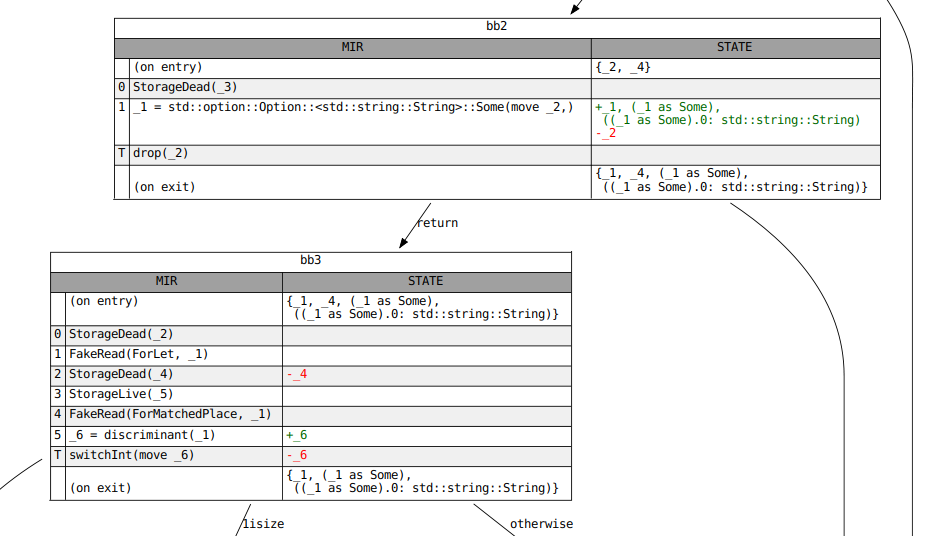

["gen-kill" problems]: https://en.wikipedia.org/wiki/Data-flow_analysis#Bit_vector_problems
[*Static Program Analysis*]: https://cs.au.dk/~amoeller/spa/
[Debugging MIR]: #mir-debugging
[`Analysis`]: https://doc.rust-lang.org/nightly/nightly-rustc/rustc_mir_dataflow/trait.Analysis.html
[`GenKillAnalysis`]: https://doc.rust-lang.org/nightly/nightly-rustc/rustc_mir_dataflow/trait.GenKillAnalysis.html
[`JoinSemiLattice`]: https://doc.rust-lang.org/nightly/nightly-rustc/rustc_mir_dataflow/lattice/trait.JoinSemiLattice.html
[`NAME`]: https://doc.rust-lang.org/nightly/nightly-rustc/rustc_mir_dataflow/trait.Analysis.html#associatedconstant.NAME
[`ResultsCursor`]: https://doc.rust-lang.org/nightly/nightly-rustc/rustc_mir_dataflow/struct.ResultsCursor.html
[`ResultsVisitor`]: https://doc.rust-lang.org/nightly/nightly-rustc/rustc_mir_dataflow/trait.ResultsVisitor.html
[`apply_call_return_effect`]: https://doc.rust-lang.org/nightly/nightly-rustc/rustc_mir_dataflow/trait.Analysis.html#tymethod.apply_call_return_effect
[`into_engine`]: https://doc.rust-lang.org/nightly/nightly-rustc/rustc_mir_dataflow/trait.Analysis.html#method.into_engine
[`lattice`]: https://doc.rust-lang.org/nightly/nightly-rustc/rustc_mir_dataflow/lattice/index.html
[pr-1295]: https://github.com/rust-lang/rustc-dev-guide/pull/1295
[pr-1295-comment]: https://github.com/rust-lang/rustc-dev-guide/pull/1295#issuecomment-1118131294
[lattice]: https://en.wikipedia.org/wiki/Lattice_(order)
[dataflow analysis]: https://en.wikipedia.org/wiki/Data-flow_analysis#Basic_principles


## Drop elaboration {#mir-drop-elaboration}

### Dynamic drops

According to [Rust Reference][reference-drop]:

> When an initialized variable or temporary goes out of scope, its destructor
> is run, or it is dropped. Assignment also runs the destructor of its
> left-hand operand, if it's initialized. If a variable has been partially
> initialized, only its initialized fields are dropped.

When building the MIR, the `Drop` and `DropAndReplace` terminators represent
places where drops may occur.
However, in this phase, the presence of these
terminators does not guarantee that a destructor will run.
That's because the target of a drop may be uninitialized (usually because it has been moved from)
before the terminator is reached.
In general, we cannot know at compile-time whether a variable is initialized.

```rust
let mut y = vec![];

{
    let x = vec![1, 2, 3];
    if std::process::id() % 2 == 0 {
        y = x; // conditionally move `x` into `y`
    }
} // `x` goes out of scope here. Should it be dropped?
```

In these cases, we need to keep track of whether a variable is initialized _dynamically_.
The rules are laid out in detail in [RFC 320: Non-zeroing dynamic drops][RFC 320].

### Drop obligations

From the RFC:

> When a local variable becomes initialized, it establishes a set of "drop
> obligations": a set of structural paths (e.g. a local `a`, or a path to a
> field `b.f.y`) that need to be dropped.
>
> The drop obligations for a local variable x of struct-type `T` are computed
> from analyzing the structure of `T`. If `T` itself implements `Drop`, then `x` is a
> drop obligation. If `T` does not implement `Drop`, then the set of drop
> obligations is the union of the drop obligations of the fields of `T`.

When a structural path is moved from (and thus becomes uninitialized), any drop
obligations for that path or its descendants (`path.f`, `path.f.g.h`, etc.) are
released.
Types with `Drop` implementations do not permit moves from individual
fields, so there is no need to track initializedness through them.

When a local variable goes out of scope (`Drop`), or when a structural path is
overwritten via assignment (`DropAndReplace`), we check for any drop
obligations for that variable or path.
 Unless that obligation has been
released by this point, its associated `Drop` implementation will be called.
For `enum` types, only fields corresponding to the "active" variant need to be dropped.
When processing drop obligations for such types, we first check the
discriminant to determine the active variant.
All drop obligations for variants besides the active one are ignored.

Here are a few interesting types to help illustrate these rules:

```rust
struct NoDrop(u8); // No `Drop` impl. No fields with `Drop` impls.

struct NeedsDrop(Vec<u8>); // No `Drop` impl but has fields with `Drop` impls.

struct ThinVec(*const u8); // Custom `Drop` impl. Individual fields cannot be moved from.

impl Drop for ThinVec {
    fn drop(&mut self) { /* ... */ }
}

enum MaybeDrop {
    Yes(NeedsDrop),
    No(NoDrop),
}
```

### Drop elaboration

One valid model for these rules is to keep a boolean flag (a "drop flag") for
every structural path that is used at any point in the function.
This flag is set when its path is initialized and is cleared when the path is moved from.
When a `Drop` occurs, we check the flags for every obligation associated with
the target of the `Drop` and call the associated `Drop` impl for those that are still applicable.

This process—transforming the newly built MIR with its imprecise `Drop` and
`DropAndReplace` terminators into one with drop flags—is known as drop elaboration.
When a MIR statement causes a variable to become initialized (or
uninitialized), drop elaboration inserts code that sets (or clears) the drop flag for that variable.
It wraps `Drop` terminators in conditionals that check the newly inserted drop flags.

Drop elaboration also splits `DropAndReplace` terminators into a `Drop` of the
target and a write of the newly dropped place.
This is somewhat unrelated to what we've discussed above.

Once this is complete, `Drop` terminators in the MIR correspond to a call to
the "drop glue" or "drop shim" for the type of the dropped place.
The drop glue for a type calls the `Drop` impl for that type (if one exists), and then
recursively calls the drop glue for all fields of that type.

### Drop elaboration in `rustc`

The approach described above is more expensive than necessary.
One can imagine a few optimizations:

- Only paths that are the target of a `Drop` (or have the target as a prefix) need drop flags.
- Some variables are known to be initialized (or uninitialized) when they are dropped.
  These do not need drop flags.
- If a set of paths are only dropped or moved from via a shared prefix, those
  paths can share a single drop flag.

A subset of these are implemented in `rustc`.

In the compiler, drop elaboration is split across several modules.
The pass itself is defined [here][drops-transform], but the [main logic][drops] is
defined elsewhere since it is also used to build [drop shims][drops-shim].

Drop elaboration designates each `Drop` in the newly built MIR as one of four kinds:

- `Static`, the target is always initialized.
- `Dead`, the target is always **un**initialized.
- `Conditional`, the target is either wholly initialized or wholly uninitialized.
  It is not partly initialized.
- `Open`, the target may be partly initialized.

For this, it uses a pair of dataflow analyses, `MaybeInitializedPlaces` and
`MaybeUninitializedPlaces`.
If a place is in one but not the other, then the
initializedness of the target is known at compile-time (`Dead` or `Static`).
In this case, drop elaboration does not add a flag for the target.
It simply removes (`Dead`) or preserves (`Static`) the `Drop` terminator.

For `Conditional` drops, we know that the initializedness of the variable as a
whole is the same as the initializedness of its fields.
Therefore, once we generate a drop flag for the target of that drop, it's safe to call the drop
glue for that target.

#### `Open` drops

`Open` drops are the most complex, since we need to break down a single `Drop`
terminator into several different ones, one for each field of the target whose
type has drop glue (`Ty::needs_drop`).
We cannot call the drop glue for the
target itself because that requires all fields of the target to be initialized.
Remember, variables whose type has a custom `Drop` impl do not allow `Open`
drops because their fields cannot be moved from.

This is accomplished by recursively categorizing each field as `Dead`,
`Static`, `Conditional`, or `Open`.
Fields whose type does not have drop glue
are automatically `Dead` and need not be considered during the recursion.
When we reach a field whose kind is not `Open`, we handle it as we did above.
If the field is also `Open`, the recursion continues.

It's worth noting how we handle `Open` drops of enums.
Inside drop elaboration,
each variant of the enum is treated like a field, with the invariant that only
one of those "variant fields" can be initialized at any given time.
In the general case, we do not know which variant is the active one, so we will have
to call the drop glue for the enum (which checks the discriminant) or check the
discriminant ourselves as part of an elaborated `Open` drop.
However, in certain cases (within a `match` arm, for example) we do know which variant of
an enum is active.
This information is encoded in the `MaybeInitializedPlaces`
and `MaybeUninitializedPlaces` dataflow analyses by marking all places
corresponding to inactive variants as uninitialized.

#### Cleanup paths

TODO: Discuss drop elaboration and unwinding.

### Aside: drop elaboration and const-eval

In Rust, functions that are eligible for evaluation at compile-time must be
marked explicitly using the `const` keyword.
This includes implementations  of the `Drop` trait, which may or may not be `const`.
Code that is eligible for compile-time evaluation may only call `const` functions, so any calls to
non-const `Drop` implementations in such code must be forbidden.

A call to a `Drop` impl is encoded as a `Drop` terminator in the MIR.
However,
as we discussed above, a `Drop` terminator in newly built MIR does not
necessarily result in a call to `Drop::drop`.
The drop target may be uninitialized at that point.
This means that checking for non-const `Drop`s on the newly built MIR can result in spurious errors.
Instead, we wait until after
drop elaboration runs, which eliminates `Dead` drops (ones where the target is
known to be uninitialized) to run these checks.

[RFC 320]: https://rust-lang.github.io/rfcs/0320-nonzeroing-dynamic-drop.html
[reference-drop]: https://doc.rust-lang.org/reference/destructors.html
[drops]: https://github.com/rust-lang/rust/blob/HEAD/compiler/rustc_mir_transform/src/elaborate_drops.rs
[drops-shim]: https://github.com/rust-lang/rust/blob/HEAD/compiler/rustc_mir_transform/src/shim.rs
[drops-transform]: https://github.com/rust-lang/rust/blob/HEAD/compiler/rustc_mir_transform/src/elaborate_drops.rs


## MIR borrow check {#borrow-check}

The borrow check is Rust's "secret sauce" – it is tasked with
enforcing a number of properties:

- That all variables are initialized before they are used.
- That you can't move the same value twice.
- That you can't move a value while it is borrowed.
- That you can't access a place while it is mutably borrowed (except through
  the reference).
- That you can't mutate a place while it is immutably borrowed.
- etc

The borrow checker operates on the MIR. An older implementation operated on the
HIR. Doing borrow checking on MIR has several advantages:

- The MIR is *far* less complex than the HIR; the radical desugaring
  helps prevent bugs in the borrow checker. (If you're curious, you
  can see
  [a list of bugs that the MIR-based borrow checker fixes here][47366].)
- Even more importantly, using the MIR enables ["non-lexical lifetimes"][nll],
  which are regions derived from the control-flow graph.

[47366]: https://github.com/rust-lang/rust/issues/47366
[nll]: https://rust-lang.github.io/rfcs/2094-nll.html

#### Major phases of the borrow checker

The borrow checker source is found in
[the `rustc_borrowck` crate][b_c]. The main entry point is
the [`mir_borrowck`] query.

[b_c]: https://doc.rust-lang.org/nightly/nightly-rustc/rustc_borrowck/index.html
[`mir_borrowck`]: https://doc.rust-lang.org/nightly/nightly-rustc/rustc_borrowck/fn.mir_borrowck.html

- We first create a **local copy** of the MIR. In the coming steps,
  we will modify this copy in place to modify the types and things to
  include references to the new regions that we are computing.
- We then invoke [`replace_regions_in_mir`] to modify our local MIR.
  Among other things, this function will replace all of the [regions](#region)
  in the MIR with fresh [inference variables](#inf-var).
- Next, we perform a number of
  [dataflow analyses](#dataflow) that
  compute what data is moved and when.
- We then do a [second type check](#borrow-check-type-check) across the MIR:
  the purpose of this type check is to determine all of the constraints between
  different regions.
- Next, we do [region inference](#borrow-check-region-inference), which computes
  the values of each region — basically, the points in the control-flow graph where
  each lifetime must be valid according to the constraints we collected.
- At this point, we can compute the "borrows in scope" at each point.
- Finally, we do a second walk over the MIR, looking at the actions it
  does and reporting errors. For example, if we see a statement like
  `*a + 1`, then we would check that the variable `a` is initialized
  and that it is not mutably borrowed, as either of those would
  require an error to be reported. Doing this check requires the results of all
  the previous analyses.

[`replace_regions_in_mir`]: https://doc.rust-lang.org/nightly/nightly-rustc/rustc_borrowck/nll/fn.replace_regions_in_mir.html


### Tracking moves and initialization {#borrow-check-moves-and-initialization}

Part of the borrow checker's job is to track which variables are
"initialized" at any given point in time -- this also requires
figuring out where moves occur and tracking those.

#### Initialization and moves

From a user's perspective, initialization -- giving a variable some
value -- and moves -- transferring ownership to another place -- might
seem like distinct topics. Indeed, our borrow checker error messages
often talk about them differently. But **within the borrow checker**,
they are not nearly as separate. Roughly speaking, the borrow checker
tracks the set of "initialized places" at any point in the source
code. Assigning to a previously uninitialized local variable adds it
to that set; moving from a local variable removes it from that set.

Consider this example:

```rust,ignore
fn foo() {
    let a: Vec<u32>;

    // a is not initialized yet

    a = vec![22];

    // a is initialized here

    std::mem::drop(a); // a is moved here

    // a is no longer initialized here

    let l = a.len(); //~ ERROR
}
```

Here you can see that `a` starts off as uninitialized; once it is
assigned, it becomes initialized. But when `drop(a)` is called, that
moves `a` into the call, and hence it becomes uninitialized again.

#### Subsections

To make it easier to peruse, this section is broken into a number of
subsections:

- [Move paths](#borrow-check-moves-and-initialization-move-paths) the
  *move path* concept that we use to track which local variables (or parts of
  local variables, in some cases) are initialized.
- TODO *Rest not yet written* =)


#### Move paths {#borrow-check-moves-and-initialization-move-paths}

In reality, it's not enough to track initialization at the granularity
of local variables. Rust also allows us to do moves and initialization
at the field granularity:

```rust,ignore
fn foo() {
    let a: (Vec<u32>, Vec<u32>) = (vec![22], vec![44]);

    // a.0 and a.1 are both initialized

    let b = a.0; // moves a.0

    // a.0 is not initialized, but a.1 still is

    let c = a.0; // ERROR
    let d = a.1; // OK
}
```

To handle this, we track initialization at the granularity of a **move
path**. A [`MovePath`] represents some location that the user can
initialize, move, etc. So e.g. there is a move-path representing the
local variable `a`, and there is a move-path representing `a.0`.  Move
paths roughly correspond to the concept of a [`Place`] from MIR, but
they are indexed in ways that enable us to do move analysis more
efficiently.

[`MovePath`]: https://doc.rust-lang.org/nightly/nightly-rustc/rustc_mir_dataflow/move_paths/struct.MovePath.html
[`Place`]: https://doc.rust-lang.org/nightly/nightly-rustc/rustc_middle/mir/struct.Place.html

##### Move path indices

Although there is a [`MovePath`] data structure, they are never referenced
directly.  Instead, all the code passes around *indices* of type
[`MovePathIndex`]. If you need to get information about a move path, you use
this index with the [`move_paths` field of the `MoveData`][move_paths]. For
example, to convert a [`MovePathIndex`] `mpi` into a MIR [`Place`], you might
access the [`MovePath::place`] field like so:

```rust,ignore
move_data.move_paths[mpi].place
```

[move_paths]: https://doc.rust-lang.org/nightly/nightly-rustc/rustc_mir_dataflow/move_paths/struct.MoveData.html#structfield.move_paths
[`MovePath::place`]: https://doc.rust-lang.org/nightly/nightly-rustc/rustc_mir_dataflow/move_paths/struct.MovePath.html#structfield.place
[`MovePathIndex`]: https://doc.rust-lang.org/nightly/nightly-rustc/rustc_mir_dataflow/move_paths/struct.MovePathIndex.html

##### Building move paths

One of the first things we do in the MIR borrow check is to construct
the set of move paths. This is done as part of the
[`MoveData::gather_moves`] function. This function uses a MIR visitor
called [`MoveDataBuilder`] to walk the MIR and look at how each [`Place`]
within is accessed. For each such [`Place`], it constructs a
corresponding [`MovePathIndex`]. It also records when/where that
particular move path is moved/initialized, but we'll get to that in a
later section.

[`MoveDataBuilder`]: https://doc.rust-lang.org/nightly/nightly-rustc/rustc_mir_dataflow/move_paths/builder/struct.MoveDataBuilder.html
[`MoveData::gather_moves`]: https://doc.rust-lang.org/nightly/nightly-rustc/rustc_mir_dataflow/move_paths/struct.MoveData.html#method.gather_moves

###### Illegal move paths

We don't actually create a move-path for **every** [`Place`] that gets
used.  In particular, if it is illegal to move from a [`Place`], then
there is no need for a [`MovePathIndex`]. Some examples:

- You cannot move an individual element of an array, so if we have e.g. `foo: [String; 3]`,
  there would be no move-path for `foo[1]`.
- You cannot move from inside of a borrowed reference, so if we have e.g. `foo: &String`,
  there would be no move-path for `*foo`.

These rules are enforced by the [`move_path_for`] function, which
converts a [`Place`] into a [`MovePathIndex`] -- in error cases like
those just discussed, the function returns an `Err`. This in turn
means we don't have to bother tracking whether those places are
initialized (which lowers overhead).

[`move_path_for`]: https://doc.rust-lang.org/nightly/nightly-rustc/rustc_mir_dataflow/move_paths/builder/struct.MoveDataBuilder.html#method.move_path_for

##### Projections

Instead of using [`PlaceElem`], projections in move paths are stored as [`MoveSubPath`]s.
Projections that can't be moved out of and projections that can be skipped are not represented.

Subslice projections of arrays (produced by slice patterns) are special; they're turned into
multiple [`ConstantIndex`] subpaths, one for each element in the subslice.

[`PlaceElem`]: https://doc.rust-lang.org/nightly/nightly-rustc/rustc_middle/mir/type.PlaceElem.html
[`MoveSubPath`]: https://doc.rust-lang.org/nightly/nightly-rustc/rustc_mir_dataflow/move_paths/enum.MoveSubPath.html
[`ConstantIndex`]: https://doc.rust-lang.org/nightly/nightly-rustc/rustc_mir_dataflow/move_paths/enum.MoveSubPath.html#variant.ConstantIndex

##### Looking up a move-path

If you have a [`Place`] and you would like to convert it to a [`MovePathIndex`], you
can do that using the [`MovePathLookup`] structure found in the [`rev_lookup`] field
of [`MoveData`]. There are two different methods:

[`MoveData`]: https://doc.rust-lang.org/nightly/nightly-rustc/rustc_mir_dataflow/move_paths/struct.MoveData.html
[`MovePathLookup`]: https://doc.rust-lang.org/nightly/nightly-rustc/rustc_mir_dataflow/move_paths/struct.MovePathLookup.html
[`rev_lookup`]: https://doc.rust-lang.org/nightly/nightly-rustc/rustc_mir_dataflow/move_paths/struct.MoveData.html#structfield.rev_lookup

- [`find_local`], which takes a [`mir::Local`] representing a local
  variable. This is the easier method, because we **always** create a
  [`MovePathIndex`] for every local variable.
- [`find`], which takes an arbitrary [`Place`]. This method is a bit
  more annoying to use, precisely because we don't have a
  [`MovePathIndex`] for **every** [`Place`] (as we just discussed in
  the "illegal move paths" section). Therefore, [`find`] returns a
  [`LookupResult`] indicating the closest path it was able to find
  that exists (e.g., for `foo[1]`, it might return just the path for
  `foo`).

[`find`]: https://doc.rust-lang.org/nightly/nightly-rustc/rustc_mir_dataflow/move_paths/struct.MovePathLookup.html#method.find
[`find_local`]: https://doc.rust-lang.org/nightly/nightly-rustc/rustc_mir_dataflow/move_paths/struct.MovePathLookup.html#method.find_local
[`mir::Local`]: https://doc.rust-lang.org/nightly/nightly-rustc/rustc_middle/mir/struct.Local.html
[`LookupResult`]: https://doc.rust-lang.org/nightly/nightly-rustc/rustc_mir_dataflow/move_paths/enum.LookupResult.html

##### Cross-references

As we noted above, move-paths are stored in a big vector and
referenced via their [`MovePathIndex`]. However, within this vector,
they are also structured into a tree. So for example if you have the
[`MovePathIndex`] for `a.b.c`, you can go to its parent move-path
`a.b`. You can also iterate over all children paths: so, from `a.b`,
you might iterate to find the path `a.b.c` (here you are iterating
just over the paths that are **actually referenced** in the source,
not all **possible** paths that could have been referenced). These
references are used for example in the
[`find_in_move_path_or_its_descendants`] function, which determines
whether a move-path (e.g., `a.b`) or any child of that move-path
(e.g.,`a.b.c`) matches a given predicate.

[`Place`]: https://doc.rust-lang.org/nightly/nightly-rustc/rustc_middle/mir/struct.Place.html
[`find_in_move_path_or_its_descendants`]: https://doc.rust-lang.org/nightly/nightly-rustc/rustc_mir_dataflow/move_paths/struct.MoveData.html#method.find_in_move_path_or_its_descendants


### The MIR type-check {#borrow-check-type-check}

A key component of the borrow check is the
[MIR type-check](https://doc.rust-lang.org/nightly/nightly-rustc/rustc_borrowck/type_check/index.html).
This check walks the MIR and does a complete "type check" -- the same
kind you might find in any other language. In the process of doing
this type-check, we also uncover the region constraints that apply to
the program.

TODO -- elaborate further? Maybe? :)

#### User types

At the start of MIR type-check, we replace all regions in the body with new unconstrained regions.
However, this would cause us to accept the following program:
```rust
fn foo<'a>(x: &'a u32) {
    let y: &'static u32 = x;
}
```
By erasing the lifetimes in the type of `y` we no longer know that it is supposed to be `'static`,
ignoring the intentions of the user.

To deal with this we remember all places where the user explicitly mentioned a type during
HIR type-check as [`CanonicalUserTypeAnnotations`][annot].

There are two different annotations we care about:
- explicit type ascriptions, e.g. `let y: &'static u32` results in `UserType::Ty(&'static u32)`.
- explicit generic arguments, e.g. `x.foo<&'a u32, Vec<String>>`
results in `UserType::TypeOf(foo_def_id, [&'a u32, Vec<String>])`.

As we do not want the region inference from the HIR type-check to influence MIR typeck,
we store the user type right after lowering it from the HIR.
This means that it may still contain inference variables,
which is why we are using **canonical** user type annotations.
We replace all inference variables with existential bound variables instead.
Something like `let x: Vec<_>` would therefore result in `exists<T> UserType::Ty(Vec<T>)`.

A pattern like `let Foo(x): Foo<&'a u32>` has a user type `Foo<&'a u32>` but
the actual type of `x` should only be `&'a u32`. For this, we use a [`UserTypeProjection`][proj].

In the MIR, we deal with user types in two slightly different ways.

Given a MIR local corresponding to a variable in a pattern which has an explicit type annotation,
we require the type of that local to be equal to the type of the [`UserTypeProjection`][proj].
This is directly stored in the [`LocalDecl`][decl].

We also constrain the type of scrutinee expressions, e.g. the type of `x` in `let _: &'a u32 = x;`.
Here `T_x` only has to be a subtype of the user type, so we instead use
[`StatementKind::AscribeUserType`][stmt] for that.

Note that we do not directly use the user type as the MIR typechecker
doesn't really deal with type and const inference variables. We instead store the final
[`inferred_type`][inf] from the HIR type-checker. During MIR typeck, we then replace its regions
with new nll inference vars and relate it with the actual `UserType` to get the correct region
constraints again.

After the MIR type-check, all user type annotations get discarded, as they aren't needed anymore.

[annot]: https://doc.rust-lang.org/nightly/nightly-rustc/rustc_middle/ty/struct.CanonicalUserTypeAnnotation.html
[proj]: https://doc.rust-lang.org/nightly/nightly-rustc/rustc_middle/mir/struct.UserTypeProjection.html
[decl]: https://doc.rust-lang.org/nightly/nightly-rustc/rustc_middle/mir/struct.LocalDecl.html
[stmt]: https://doc.rust-lang.org/nightly/nightly-rustc/rustc_middle/mir/enum.StatementKind.html#variant.AscribeUserType
[inf]: https://doc.rust-lang.org/nightly/nightly-rustc/rustc_middle/ty/struct.CanonicalUserTypeAnnotation.html#structfield.inferred_ty

### Drop Check {#borrow-check-drop-check}

We generally require the type of locals to be well-formed whenever the
local is used. This includes proving the where-bounds of the local and
also requires all regions used by it to be live.

The only exception to this is when implicitly dropping values when they
go out of scope. This does not necessarily require the value to be live:

```rust
fn main() {
    let x = vec![];
    {
        let y = String::from("I am temporary");
        x.push(&y);
    }
    // `x` goes out of scope here, after the reference to `y`
    // is invalidated. This means that while dropping `x` its type
    // is not well-formed as it contain regions which are not live.
}
```

This is only sound if dropping the value does not try to access any dead
region. We check this by requiring the type of the value to be
drop-live.
The requirements for which are computed in `fn dropck_outlives`.

The rest of this section uses the following type definition for a type
which requires its region parameter to be live:

```rust
struct PrintOnDrop<'a>(&'a str);
impl<'a> Drop for PrintOnDrop<'_> {
    fn drop(&mut self) {
        println!("{}", self.0);
    }
}
```

#### How values are dropped

At its core, a value of type `T` is dropped by executing its "drop
glue". Drop glue is compiler generated and first calls `<T as
Drop>::drop` and then recursively calls the drop glue of any recursively
owned values.

- If `T` has an explicit `Drop` impl, call `<T as Drop>::drop`.
- Regardless of whether `T` implements `Drop`, recurse into all values
  *owned* by `T`:
    - references, raw pointers, function pointers, function items, trait
      objects[^traitobj], and scalars do not own anything.
    - tuples, slices, and arrays consider their elements to be owned.
      For arrays of length zero we do not own any value of the element
      type.
    - all fields (of all variants) of ADTs are considered owned. We
      consider all variants for enums. The exception here is
      `ManuallyDrop<U>` which is not considered to own `U`.
      `PhantomData<U>` also does not own anything.
      closures and generators own their captured upvars.

Whether a type has drop glue is returned by [`fn
Ty::needs_drop`](https://github.com/rust-lang/rust/blob/320b412f9c55bf480d26276ff0ab480e4ecb29c0/compiler/rustc_middle/src/ty/util.rs#L1086-L1108).

##### Partially dropping a local

For types which do not implement `Drop` themselves, we can also
partially move parts of the value before dropping the rest. In this case
only the drop glue for the not-yet moved values is called, e.g.

```rust
fn main() {
    let mut x = (PrintOnDrop("third"), PrintOnDrop("first"));
    drop(x.1);
    println!("second")
}
```

During MIR building we assume that a local may get dropped whenever it
goes out of scope *as long as its type needs drop*. Computing the exact
drop glue for a variable happens **after** borrowck in the
`ElaborateDrops` pass. This means that even if some part of the local
have been dropped previously, dropck still requires this value to be
live. This is the case even if we completely moved a local.

```rust
fn main() {
    let mut x;
    {
        let temp = String::from("I am temporary");
        x = PrintOnDrop(&temp);
        drop(x);
    }
} //~ ERROR `temp` does not live long enough.
```

It should be possible to add some amount of drop elaboration before
borrowck, allowing this example to compile. There is an unstable feature
to move drop elaboration before const checking:
[#73255](https://github.com/rust-lang/rust/issues/73255). Such a feature
gate does not exist for doing some drop elaboration before borrowck,
although there's a [relevant
MCP](https://github.com/rust-lang/compiler-team/issues/558).

[^traitobj]: you can consider trait objects to have a builtin `Drop`
implementation which directly uses the `drop_in_place` provided by the
vtable. This `Drop` implementation requires all its generic parameters
to be live.

##### `dropck_outlives`

There are two distinct "liveness" computations that we perform:

* a value `v` is *use-live* at location `L` if it may be "used" later; a
  *use* here is basically anything that is not a *drop*
* a value `v` is *drop-live* at location `L` if it maybe dropped later

When things are *use-live*, their entire type must be valid at `L`. When
they are *drop-live*, all regions that are required by dropck must be
valid at `L`.  The values dropped in the MIR are *places*.

The constraints computed by `dropck_outlives` for a type closely match
the generated drop glue for that type. Unlike drop glue,
`dropck_outlives` cares about the types of owned values, not the values
itself. For a value of type `T`

- if `T` has an explicit `Drop`, require all generic arguments to be
  live, unless they are marked with `#[may_dangle]` in which case they
  are fully ignored
- regardless of whether `T` has an explicit `Drop`, recurse into all
  types *owned* by `T`
    - references, raw pointers, function pointers, function items, trait
      objects[^traitobj], and scalars do not own anything.
    - tuples, slices and arrays consider their element type to be owned.
      **For arrays we currently do not check whether their length is
      zero**.
    - all fields (of all variants) of ADTs are considered owned. The
      exception here is `ManuallyDrop<U>` which is not considered to own
      `U`. **We consider `PhantomData<U>` to own `U`**.
    - closures and generators own their captured upvars.

The sections marked in bold are cases where `dropck_outlives` considers
types to be owned which are ignored by `Ty::needs_drop`. We only rely on
`dropck_outlives` if `Ty::needs_drop` for the containing local returned
`true`.This means liveness requirements can change depending on whether
a type is contained in a larger local. **This is inconsistent, and
should be fixed: an example [for
arrays](https://play.rust-lang.org/?version=stable&mode=debug&edition=2021&gist=8b5f5f005a03971b22edb1c20c5e6cbe)
and [for
`PhantomData`](https://play.rust-lang.org/?version=stable&mode=debug&edition=2021&gist=44c6e2b1fae826329fd54c347603b6c8).**[^core]

One possible way these inconsistencies can be fixed is by MIR building
to be more pessimistic, probably by making `Ty::needs_drop` weaker, or
alternatively, changing `dropck_outlives` to be more precise, requiring
fewer regions to be live.

[^core]: This is the core assumption of [#110288](https://github.com/rust-lang/rust/issues/110288) and [RFC 3417](https://github.com/rust-lang/rfcs/pull/3417).


### Region inference (NLL) {#borrow-check-region-inference}

The MIR-based region checking code is located in [the `rustc_mir::borrow_check`
module][nll].

[nll]: https://doc.rust-lang.org/nightly/nightly-rustc/rustc_borrowck/index.html

The MIR-based region analysis consists of two major functions:

- [`replace_regions_in_mir`], invoked first, has two jobs:
  - First, it finds the set of regions that appear within the
    signature of the function (e.g., `'a` in `fn foo<'a>(&'a u32) {
    ... }`). These are called the "universal" or "free" regions – in
    particular, they are the regions that [appear free][fvb] in the
    function body.
  - Second, it replaces all the regions from the function body with
    fresh inference variables. This is because (presently) those
    regions are the results of lexical region inference and hence are
    not of much interest. The intention is that – eventually – they
    will be "erased regions" (i.e., no information at all), since we
    won't be doing lexical region inference at all.
- [`compute_regions`], invoked second: this is given as argument the
  results of move analysis. It has the job of computing values for all
  the inference variables that `replace_regions_in_mir` introduced.
  - To do that, it first runs the [MIR type checker]. This is
    basically a normal type-checker but specialized to MIR, which is
    much simpler than full Rust, of course. Running the MIR type
    checker will however create various [constraints][cp] between region
    variables, indicating their potential values and relationships to
    one another.
  - After this, we perform [constraint propagation][cp] by creating a
    [`RegionInferenceContext`] and invoking its [`solve`]
    method.
  - The [NLL RFC] also includes fairly thorough (and hopefully readable)
    coverage.

[cp]: #borrow-check-region-inference-constraint-propagation
[fvb]: #free-vs-bound
[`replace_regions_in_mir`]: https://doc.rust-lang.org/nightly/nightly-rustc/rustc_borrowck/nll/fn.replace_regions_in_mir.html
[`compute_regions`]: https://doc.rust-lang.org/nightly/nightly-rustc/rustc_borrowck/nll/fn.compute_regions.html
[`RegionInferenceContext`]: https://doc.rust-lang.org/nightly/nightly-rustc/rustc_borrowck/region_infer/struct.RegionInferenceContext.html
[`solve`]: https://doc.rust-lang.org/nightly/nightly-rustc/rustc_borrowck/region_infer/struct.RegionInferenceContext.html#method.solve
[NLL RFC]: https://rust-lang.github.io/rfcs/2094-nll.html
[MIR type checker]: #borrow-check-type-check

#### Universal regions

The [`UniversalRegions`] type represents a collection of _universal_ regions
corresponding to some MIR `DefId`. It is constructed in
[`replace_regions_in_mir`] when we replace all regions with fresh inference
variables. [`UniversalRegions`] contains indices for all the free regions in
the given MIR along with any relationships that are _known_ to hold between
them (e.g. implied bounds, where clauses, etc.).

For example, given the MIR for the following function:

```rust
fn foo<'a>(x: &'a u32) {
    // ...
}
```

we would create a universal region for `'a` and one for `'static`. There may
also be some complications for handling closures, but we will ignore those for
the moment.

TODO: write about _how_ these regions are computed.

[`UniversalRegions`]: https://doc.rust-lang.org/nightly/nightly-rustc/rustc_borrowck/universal_regions/struct.UniversalRegions.html

<a id="region-variables"></a>

#### Region variables

The value of a region can be thought of as a **set**. This set contains all
points in the MIR where the region is valid along with any regions that are
outlived by this region (e.g. if `'a: 'b`, then `end('b)` is in the set for
`'a`); we call the domain of this set a `RegionElement`. In the code, the value
for all regions is maintained in [the `rustc_borrowck::region_infer` module][ri].
For each region we maintain a set storing what elements are present in its value (to make this
efficient, we give each kind of element an index, the `RegionElementIndex`, and
use sparse bitsets).

[ri]: https://github.com/rust-lang/rust/tree/HEAD/compiler/rustc_borrowck/src/region_infer

The kinds of region elements are as follows:

- Each **[`location`]** in the MIR control-flow graph: a location is just
  the pair of a basic block and an index. This identifies the point
  **on entry** to the statement with that index (or the terminator, if
  the index is equal to `statements.len()`).
- There is an element `end('a)` for each universal region `'a`,
  corresponding to some portion of the caller's (or caller's caller,
  etc) control-flow graph.
- Similarly, there is an element denoted `end('static)` corresponding
  to the remainder of program execution after this function returns.
- There is an element `!1` for each placeholder region `!1`. This
  corresponds (intuitively) to some unknown set of other elements –
  for details on placeholders, see the section
  [placeholders and universes](#borrow-check-region-inference-placeholders-and-universes).

#### Constraints

Before we can infer the value of regions, we need to collect
constraints on the regions. The full set of constraints is described
in [the section on constraint propagation][cp], but the two most
common sorts of constraints are:

1. Outlives constraints. These are constraints that one region outlives another
   (e.g. `'a: 'b`). Outlives constraints are generated by the [MIR type
   checker].
2. Liveness constraints. Each region needs to be live at points where it can be
   used.

#### Inference Overview

So how do we compute the contents of a region? This process is called _region
inference_. The high-level idea is pretty simple, but there are some details we
need to take care of.

Here is the high-level idea: we start off each region with the MIR locations we
know must be in it from the liveness constraints. From there, we use all of the
outlives constraints computed from the type checker to _propagate_ the
constraints: for each region `'a`, if `'a: 'b`, then we add all elements of
`'b` to `'a`, including `end('b)`. This all happens in
[`propagate_constraints`].

Then, we will check for errors. We first check that type tests are satisfied by
calling [`check_type_tests`]. This checks constraints like `T: 'a`. Second, we
check that universal regions are not "too big". This is done by calling
[`check_universal_regions`]. This checks that for each region `'a` if `'a`
contains the element `end('b)`, then we must already know that `'a: 'b` holds
(e.g. from a where clause). If we don't already know this, that is an error...
well, almost. There is some special handling for closures that we will discuss
later.

##### Example

Consider the following example:

```rust,ignore
fn foo<'a, 'b>(x: &'a usize) -> &'b usize {
    x
}
```

Clearly, this should not compile because we don't know if `'a` outlives `'b`
(if it doesn't then the return value could be a dangling reference).

Let's back up a bit. We need to introduce some free inference variables (as is
done in [`replace_regions_in_mir`]). This example doesn't use the exact regions
produced, but it (hopefully) is enough to get the idea across.

```rust,ignore
fn foo<'a, 'b>(x: &'a /* '#1 */ usize) -> &'b /* '#3 */ usize {
    x // '#2, location L1
}
```

Some notation: `'#1`, `'#3`, and `'#2` represent the universal regions for the
argument, return value, and the expression `x`, respectively. Additionally, I
will call the location of the expression `x` `L1`.

So now we can use the liveness constraints to get the following starting points:

Region  | Contents
--------|----------
'#1     |
'#2     | `L1`
'#3     | `L1`

Now we use the outlives constraints to expand each region. Specifically, we
know that `'#2: '#3` ...

Region  | Contents
--------|----------
'#1     | `L1`
'#2     | `L1, end('#3) // add contents of '#3 and end('#3)`
'#3     | `L1`

... and `'#1: '#2`, so ...

Region  | Contents
--------|----------
'#1     | `L1, end('#2), end('#3) // add contents of '#2 and end('#2)`
'#2     | `L1, end('#3)`
'#3     | `L1`

Now, we need to check that no regions were too big (we don't have any type
tests to check in this case). Notice that `'#1` now contains `end('#3)`, but
we have no `where` clause or implied bound to say that `'a: 'b`... that's an
error!

##### Some details

The [`RegionInferenceContext`] type contains all of the information needed to
do inference, including the universal regions from [`replace_regions_in_mir`] and
the constraints computed for each region. It is constructed just after we
compute the liveness constraints.

Here are some of the fields of the struct:

- [`constraints`]: contains all the outlives constraints.
- [`liveness_constraints`]: contains all the liveness constraints.
- [`universal_regions`]: contains the `UniversalRegions` returned by
  [`replace_regions_in_mir`].
- [`universal_region_relations`]: contains relations known to be true about
  universal regions. For example, if we have a where clause that `'a: 'b`, that
  relation is assumed to be true while borrow checking the implementation (it
  is checked at the caller), so `universal_region_relations` would contain `'a:
  'b`.
- [`type_tests`]: contains some constraints on types that we must check after
  inference (e.g. `T: 'a`).
- [`closure_bounds_mapping`]: used for propagating region constraints from
  closures back out to the creator of the closure.

[`constraints`]: https://doc.rust-lang.org/nightly/nightly-rustc/rustc_borrowck/region_infer/struct.RegionInferenceContext.html#structfield.constraints
[`liveness_constraints`]: https://doc.rust-lang.org/nightly/nightly-rustc/rustc_borrowck/region_infer/struct.RegionInferenceContext.html#structfield.liveness_constraints
[`location`]: https://doc.rust-lang.org/nightly/nightly-rustc/rustc_middle/mir/struct.Location.html
[`universal_regions`]: https://doc.rust-lang.org/nightly/nightly-rustc/rustc_borrowck/region_infer/struct.RegionInferenceContext.html#structfield.universal_regions
[`universal_region_relations`]: https://doc.rust-lang.org/nightly/nightly-rustc/rustc_borrowck/region_infer/struct.RegionInferenceContext.html#structfield.universal_region_relations
[`type_tests`]: https://doc.rust-lang.org/nightly/nightly-rustc/rustc_borrowck/region_infer/struct.RegionInferenceContext.html#structfield.type_tests
[`closure_bounds_mapping`]: https://doc.rust-lang.org/nightly/nightly-rustc/rustc_borrowck/region_infer/struct.RegionInferenceContext.html#structfield.closure_bounds_mapping

TODO: should we discuss any of the others fields? What about the SCCs?

Ok, now that we have constructed a `RegionInferenceContext`, we can do
inference. This is done by calling the [`solve`] method on the context. This
is where we call [`propagate_constraints`] and then check the resulting type
tests and universal regions, as discussed above.

[`propagate_constraints`]: https://doc.rust-lang.org/nightly/nightly-rustc/rustc_borrowck/region_infer/struct.RegionInferenceContext.html#method.propagate_constraints
[`check_type_tests`]: https://doc.rust-lang.org/nightly/nightly-rustc/rustc_borrowck/region_infer/struct.RegionInferenceContext.html#method.check_type_tests
[`check_universal_regions`]: https://doc.rust-lang.org/nightly/nightly-rustc/rustc_borrowck/region_infer/struct.RegionInferenceContext.html#method.check_universal_regions


#### Constraint propagation {#borrow-check-region-inference-constraint-propagation}

The main work of the region inference is **constraint propagation**,
which is done in the [`propagate_constraints`] function.  There are
three sorts of constraints that are used in NLL, and we'll explain how
`propagate_constraints` works by "layering" those sorts of constraints
on one at a time (each of them is fairly independent from the others):

- liveness constraints (`R live at E`), which arise from liveness;
- outlives constraints (`R1: R2`), which arise from subtyping;
- [member constraints][m_c] (`member R_m of [R_c...]`), which arise from impl Trait.

[`propagate_constraints`]: https://doc.rust-lang.org/nightly/nightly-rustc/rustc_borrowck/region_infer/struct.RegionInferenceContext.html#method.propagate_constraints
[m_c]: #borrow-check-region-inference-member-constraints

In this chapter, we'll explain the "heart" of constraint propagation,
covering both liveness and outlives constraints.

##### Notation and high-level concepts

Conceptually, region inference is a "fixed-point" computation. It is
given some set of constraints `{C}` and it computes a set of values
`Values: R -> {E}` that maps each region `R` to a set of elements
`{E}` (see [here][riv] for more notes on region elements):

- Initially, each region is mapped to an empty set, so `Values(R) =
  {}` for all regions `R`.
- Next, we process the constraints repeatedly until a fixed-point is reached:
  - For each constraint C:
    - Update `Values` as needed to satisfy the constraint

[riv]: #region-variables

As a simple example, if we have a liveness constraint `R live at E`,
then we can apply `Values(R) = Values(R) union {E}` to make the
constraint be satisfied. Similarly, if we have an outlives constraints
`R1: R2`, we can apply `Values(R1) = Values(R1) union Values(R2)`.
(Member constraints are more complex and we discuss them [in this section][m_c].)

In practice, however, we are a bit more clever. Instead of applying
the constraints in a loop, we can analyze the constraints and figure
out the correct order to apply them, so that we only have to apply
each constraint once in order to find the final result.

Similarly, in the implementation, the `Values` set is stored in the
`scc_values` field, but they are indexed not by a *region* but by a
*strongly connected component* (SCC). SCCs are an optimization that
avoids a lot of redundant storage and computation.  They are explained
in the section on outlives constraints.

##### Liveness constraints

A **liveness constraint** arises when some variable whose type
includes a region R is live at some [point] P. This simply means that
the value of R must include the point P. Liveness constraints are
computed by the MIR type checker.

[point]: #point

A liveness constraint `R live at E` is satisfied if `E` is a member of
`Values(R)`. So to "apply" such a constraint to `Values`, we just have
to compute `Values(R) = Values(R) union {E}`.

The liveness values are computed in the type-check and passed to the
region inference upon creation in the `liveness_constraints` argument.
These are not represented as individual constraints like `R live at E`
though; instead, we store a (sparse) bitset per region variable (of
type [`LivenessValues`]). This way we only need a single bit for each
liveness constraint.

[`liveness_constraints`]: https://doc.rust-lang.org/nightly/nightly-rustc/rustc_borrowck/region_infer/struct.RegionInferenceContext.html#structfield.liveness_constraints
[`LivenessValues`]: https://doc.rust-lang.org/nightly/nightly-rustc/rustc_borrowck/region_infer/values/struct.LivenessValues.html

One thing that is worth mentioning: All lifetime parameters are always
considered to be live over the entire function body. This is because
they correspond to some portion of the *caller's* execution, and that
execution clearly includes the time spent in this function, since the
caller is waiting for us to return.

##### Outlives constraints

An outlives constraint `'a: 'b` indicates that the value of `'a` must
be a **superset** of the value of `'b`. That is, an outlives
constraint `R1: R2` is satisfied if `Values(R1)` is a superset of
`Values(R2)`. So to "apply" such a constraint to `Values`, we just
have to compute `Values(R1) = Values(R1) union Values(R2)`.

One observation that follows from this is that if you have `R1: R2`
and `R2: R1`, then `R1 = R2` must be true. Similarly, if you have:

```txt
R1: R2
R2: R3
R3: R4
R4: R1
```

then `R1 = R2 = R3 = R4` follows. We take advantage of this to make things
much faster, as described shortly.

In the code, the set of outlives constraints is given to the region
inference context on creation in a parameter of type
[`OutlivesConstraintSet`]. The constraint set is basically just a list of `'a:
'b` constraints.

###### The outlives constraint graph and SCCs

In order to work more efficiently with outlives constraints, they are
[converted into the form of a graph][graph-fn], where the nodes of the
graph are region variables (`'a`, `'b`) and each constraint `'a: 'b`
induces an edge `'a -> 'b`. This conversion happens in the
[`RegionInferenceContext::new`] function that creates the inference
context.

[`OutlivesConstraintSet`]: https://doc.rust-lang.org/nightly/nightly-rustc/rustc_borrowck/constraints/struct.OutlivesConstraintSet.html
[graph-fn]: https://doc.rust-lang.org/nightly/nightly-rustc/rustc_borrowck/constraints/struct.OutlivesConstraintSet.html#method.graph
[`RegionInferenceContext::new`]: https://doc.rust-lang.org/nightly/nightly-rustc/rustc_borrowck/region_infer/struct.RegionInferenceContext.html#method.new

When using a graph representation, we can detect regions that must be equal
by looking for cycles. That is, if you have a constraint like

```txt
'a: 'b
'b: 'c
'c: 'd
'd: 'a
```

then this will correspond to a cycle in the graph containing the
elements `'a...'d`.

Therefore, one of the first things that we do in propagating region
values is to compute the **strongly connected components** (SCCs) in
the constraint graph. The result is stored in the [`constraint_sccs`]
field. You can then easily find the SCC that a region `r` is a part of
by invoking `constraint_sccs.scc(r)`.

Working in terms of SCCs allows us to be more efficient: if we have a
set of regions `'a...'d` that are part of a single SCC, we don't have
to compute/store their values separately. We can just store one value
**for the SCC**, since they must all be equal.

If you look over the region inference code, you will see that a number
of fields are defined in terms of SCCs. For example, the
[`scc_values`] field stores the values of each SCC. To get the value
of a specific region `'a` then, we first figure out the SCC that the
region is a part of, and then find the value of that SCC.

[`constraint_sccs`]: https://doc.rust-lang.org/nightly/nightly-rustc/rustc_borrowck/region_infer/struct.RegionInferenceContext.html#structfield.constraint_sccs
[`scc_values`]: https://doc.rust-lang.org/nightly/nightly-rustc/rustc_borrowck/region_infer/struct.RegionInferenceContext.html#structfield.scc_values

When we compute SCCs, we not only figure out which regions are a
member of each SCC, we also figure out the edges between them. So for example
consider this set of outlives constraints:

```txt
'a: 'b
'b: 'a

'a: 'c

'c: 'd
'd: 'c
```

Here we have two SCCs: S0 contains `'a` and `'b`, and S1 contains `'c`
and `'d`.  But these SCCs are not independent: because `'a: 'c`, that
means that `S0: S1` as well. That is -- the value of `S0` must be a
superset of the value of `S1`. One crucial thing is that this graph of
SCCs is always a DAG -- that is, it never has cycles. This is because
all the cycles have been removed to form the SCCs themselves.

###### Applying liveness constraints to SCCs

The liveness constraints that come in from the type-checker are
expressed in terms of regions -- that is, we have a map like
`Liveness: R -> {E}`.  But we want our final result to be expressed
in terms of SCCs -- we can integrate these liveness constraints very
easily just by taking the union:

```txt
for each region R:
  let S be the SCC that contains R
  Values(S) = Values(S) union Liveness(R)
```

In the region inferencer, this step is done in [`RegionInferenceContext::new`].

###### Applying outlives constraints

Once we have computed the DAG of SCCs, we use that to structure out
entire computation. If we have an edge `S1 -> S2` between two SCCs,
that means that `Values(S1) >= Values(S2)` must hold. So, to compute
the value of `S1`, we first compute the values of each successor `S2`.
Then we simply union all of those values together. To use a
quasi-iterator-like notation:

```txt
Values(S1) =
  s1.successors()
    .map(|s2| Values(s2))
    .union()
```

In the code, this work starts in the [`propagate_constraints`]
function, which iterates over all the SCCs. For each SCC `S1`, we
compute its value by first computing the value of its
successors. Since SCCs form a DAG, we don't have to be concerned about
cycles, though we do need to keep a set around to track whether we
have already processed a given SCC or not. For each successor `S2`, once
we have computed `S2`'s value, we can union those elements into the
value for `S1`. (Although we have to be careful in this process to
properly handle [higher-ranked
placeholders](#borrow-check-region-inference-placeholders-and-universes). Note that the value
for `S1` already contains the liveness constraints, since they were
added in [`RegionInferenceContext::new`].

Once that process is done, we now have the "minimal value" for `S1`,
taking into account all of the liveness and outlives
constraints. However, in order to complete the process, we must also
consider [member constraints][m_c], which are described in [a later
section][m_c].


#### Universal regions {#borrow-check-region-inference-lifetime-parameters}

"Universal regions" is the name that the code uses to refer to "named
lifetimes" -- e.g., lifetime parameters and `'static`. The name
derives from the fact that such lifetimes are "universally quantified"
(i.e., we must make sure the code is true for all values of those
lifetimes). It is worth spending a bit of discussing how lifetime
parameters are handled during region inference. Consider this example:

```rust,ignore
fn foo<'a, 'b>(x: &'a u32, y: &'b u32) -> &'b u32 {
  x
}
```

This example is intended not to compile, because we are returning `x`,
which has type `&'a u32`, but our signature promises that we will
return a `&'b u32` value. But how are lifetimes like `'a` and `'b`
integrated into region inference, and how this error wind up being
detected?

##### Universal regions and their relationships to one another

Early on in region inference, one of the first things we do is to
construct a [`UniversalRegions`] struct. This struct tracks the
various universal regions in scope on a particular function.  We also
create a [`UniversalRegionRelations`] struct, which tracks their
relationships to one another. So if you have e.g. `where 'a: 'b`, then
the [`UniversalRegionRelations`] struct would track that `'a: 'b` is
known to hold (which could be tested with the [`outlives`] function).

[`UniversalRegions`]: https://doc.rust-lang.org/nightly/nightly-rustc/rustc_borrowck/universal_regions/struct.UniversalRegions.html
[`UniversalRegionRelations`]: https://doc.rust-lang.org/nightly/nightly-rustc/rustc_borrowck/type_check/free_region_relations/struct.UniversalRegionRelations.html
[`outlives`]: https://doc.rust-lang.org/nightly/nightly-rustc/rustc_borrowck/type_check/free_region_relations/struct.UniversalRegionRelations.html#method.outlives

##### Everything is a region variable

One important aspect of how NLL region inference works is that **all
lifetimes** are represented as numbered variables. This means that the
only variant of [`region_kind::RegionKind`] that we use is the [`ReVar`]
variant. These region variables are broken into two major categories,
based on their index:

[`region_kind::RegionKind`]: https://doc.rust-lang.org/nightly/nightly-rustc/rustc_type_ir/region_kind/enum.RegionKind.html
[`ReVar`]: https://doc.rust-lang.org/nightly/nightly-rustc/rustc_type_ir/region_kind/enum.RegionKind.html#variant.ReVar

- 0..N: universal regions -- the ones we are discussing here. In this
  case, the code must be correct with respect to any value of those
  variables that meets the declared relationships.
- N..M: existential regions -- inference variables where the region
  inferencer is tasked with finding *some* suitable value.

In fact, the universal regions can be further subdivided based on
where they were brought into scope (see the [`RegionClassification`]
type). These subdivisions are not important for the topics discussed
here, but become important when we consider [closure constraint
propagation](#borrow-check-region-inference-closure-constraints), so we discuss them there.

[`RegionClassification`]: https://doc.rust-lang.org/nightly/nightly-rustc/rustc_borrowck/universal_regions/enum.RegionClassification.html#variant.Local

##### Universal lifetimes as the elements of a region's value

As noted previously, the value that we infer for each region is a set
`{E}`. The elements of this set can be points in the control-flow
graph, but they can also be an element `end('a)` corresponding to each
universal lifetime `'a`. If the value for some region `R0` includes
`end('a`), then this implies that `R0` must extend until the end of `'a`
in the caller.

##### The "value" of a universal region

During region inference, we compute a value for each universal region
in the same way as we compute values for other regions. This value
represents, effectively, the **lower bound** on that universal region
-- the things that it must outlive. We now describe how we use this
value to check for errors.

##### Liveness and universal regions

All universal regions have an initial liveness constraint that
includes the entire function body. This is because lifetime parameters
are defined in the caller and must include the entirety of the
function call that invokes this particular function. In addition, each
universal region `'a` includes itself (that is, `end('a)`) in its
liveness constraint (i.e., `'a` must extend until the end of
itself). In the code, these liveness constraints are setup in
[`init_free_and_bound_regions`].

[`init_free_and_bound_regions`]: https://doc.rust-lang.org/nightly/nightly-rustc/rustc_borrowck/region_infer/struct.RegionInferenceContext.html#method.init_free_and_bound_regions

##### Propagating outlives constraints for universal regions

So, consider the first example of this section:

```rust,ignore
fn foo<'a, 'b>(x: &'a u32, y: &'b u32) -> &'b u32 {
  x
}
```

Here, returning `x` requires that `&'a u32 <: &'b u32`, which gives
rise to an outlives constraint `'a: 'b`. Combined with our default liveness
constraints we get:

```txt
'a live at {B, end('a)} // B represents the "function body"
'b live at {B, end('b)}
'a: 'b
```

When we process the `'a: 'b` constraint, therefore, we will add
`end('b)` into the value for `'a`, resulting in a final value of `{B,
end('a), end('b)}`.

##### Detecting errors

Once we have finished constraint propagation, we then enforce a
constraint that if some universal region `'a` includes an element
`end('b)`, then `'a: 'b` must be declared in the function's bounds. If
not, as in our example, that is an error. This check is done in the
[`check_universal_regions`] function, which simply iterates over all
universal regions, inspects their final value, and tests against the
declared [`UniversalRegionRelations`].

[`check_universal_regions`]: https://doc.rust-lang.org/nightly/nightly-rustc/rustc_borrowck/region_infer/struct.RegionInferenceContext.html#method.check_universal_regions


#### Member constraints {#borrow-check-region-inference-member-constraints}

A member constraint `'m member of ['c_1..'c_N]` expresses that the
region `'m` must be *equal* to some **choice regions** `'c_i` (for some `i`).
These constraints cannot be expressed by users, but they
arise from `impl Trait` due to its lifetime capture rules.
Consider a function such as the following:

```rust,ignore
fn make(a: &'a u32, b: &'b u32) -> impl Trait<'a, 'b> { .. }
```

Here, the true return type (often called the "hidden type") is only
permitted to capture the lifetimes `'a` or `'b`.
You can kind of see
this more clearly by desugaring that `impl Trait` return type into its
more explicit form:

```rust,ignore
type MakeReturn<'x, 'y> = impl Trait<'x, 'y>;
fn make(a: &'a u32, b: &'b u32) -> MakeReturn<'a, 'b> { .. }
```

Here, the idea is that the hidden type must be some type that could
have been written in place of the `impl Trait<'x, 'y>` -- but clearly
such a type can only reference the regions `'x` or `'y` (or
`'static`!), as those are the only names in scope.
This limitation is
then translated into a restriction to only access `'a` or `'b` because
we are returning `MakeReturn<'a, 'b>`, where `'x` and `'y` have been
replaced with `'a` and `'b` respectively.

##### Detailed example

To help us explain member constraints in more detail, let's spell out
the `make` example in a bit more detail.
First off, let's assume that you have some dummy trait:

```rust,ignore
trait Trait<'a, 'b> { }
impl<T> Trait<'_, '_> for T { }
```

and this is the `make` function (in desugared form):

```rust,ignore
type MakeReturn<'x, 'y> = impl Trait<'x, 'y>;
fn make(a: &'a u32, b: &'b u32) -> MakeReturn<'a, 'b> {
  (a, b)
}
```

What happens in this case is that the return type will be `(&'0 u32, &'1 u32)`,
where `'0` and `'1` are fresh region variables.
We will have the following region constraints:

```txt
'0 live at {L}
'1 live at {L}
'a: '0
'b: '1
'0 member of ['a, 'b, 'static]
'1 member of ['a, 'b, 'static]
```

Here the "liveness set" `{L}` corresponds to that subset of the body
where `'0` and `'1` are live -- basically the point from where the
return tuple is constructed to where it is returned (in fact, `'0` and
`'1` might have slightly different liveness sets, but that's not very
interesting to the point we are illustrating here).

The `'a: '0` and `'b: '1` constraints arise from subtyping.
When we construct the `(a, b)` value, it will be assigned type `(&'0 u32, &'1
u32)` -- the region variables reflect that the lifetimes of these
references could be made smaller.
For this value to be created from `a` and `b`, however, we do require that:

```txt
(&'a u32, &'b u32) <: (&'0 u32, &'1 u32)
```

which means in turn that `&'a u32 <: &'0 u32` and hence that `'a: '0`
(and similarly that `&'b u32 <: &'1 u32`, `'b: '1`).

Note that if we ignore member constraints, the value of `'0` would be
inferred to some subset of the function body (from the liveness
constraints, which we did not write explicitly).
It would never become
`'a`, because there is no need for it too -- we have a constraint that
`'a: '0`, but that just puts a "cap" on how *large* `'0` can grow to become.
Since we compute the *minimal* value that we can, we are happy
to leave `'0` as being just equal to the liveness set.
This is where member constraints come in.

##### Choices are always lifetime parameters

At present, the "choice" regions from a member constraint are always lifetime
parameters from the current function. As of <!-- date-check --> March 2026,
this falls out from the placement of impl Trait, though in the future it may not
be the case.
We take some advantage of this fact, as it simplifies the current code.
In particular, we don't have to consider a case like `'0 member of ['1,
'static]`, in which the value of both `'0` and `'1` are being inferred and hence
changing.
See [rust-lang/rust#61773][#61773] for more information.

[#61773]: https://github.com/rust-lang/rust/issues/61773

##### Applying member constraints

Member constraints are a bit more complex than other forms of constraints.
This is because they have a "or" quality to them -- that
is, they describe multiple choices that we must select from. E.g., in
our example constraint `'0 member of ['a, 'b, 'static]`, it might be
that `'0` is equal to `'a`, `'b`, *or* `'static`.
How can we pick the correct one?
What we currently do is to look for a *minimal choice*
-- if we find one, then we will grow `'0` to be equal to that minimal choice.
To find that minimal choice, we take two factors into
consideration: lower and upper bounds.

###### Lower bounds

The *lower bounds* are those lifetimes that `'0` *must outlive* --
i.e., that `'0` must be larger than. In fact, when it comes time to
apply member constraints, we've already *computed* the lower bounds of
`'0` because we computed its minimal value (or at least, the lower
bounds considering everything but member constraints).

Let `LB` be the current value of `'0`.
We know then that `'0: LB` must hold, whatever the final value of `'0` is.
Therefore, we can rule out
any choice `'choice` where `'choice: LB` does not hold.

Unfortunately, in our example, this is not very helpful.
The lower bound for `'0` will just be the liveness set `{L}`, and we know that
all the lifetime parameters outlive that set.
So we are left with the same set of choices here.
(But in other examples, particularly those
with different variance, lower bound constraints may be relevant.)

###### Upper bounds

The *upper bounds* are those lifetimes that *must outlive* `'0` --
i.e., that `'0` must be *smaller* than. In our example, this would be
`'a`, because we have the constraint that `'a: '0`.
In more complex examples, the chain may be more indirect.

We can use upper bounds to rule out members in a very similar way to
lower bounds.
If UB is some upper bound, then we know that `UB:
'0` must hold, so we can rule out any choice `'choice` where `UB:
'choice` does not hold.

In our example, we would be able to reduce our choice set from `['a,
'b, 'static]` to just `['a]`.
This is because `'0` has an upper bound
of `'a`, and neither `'a: 'b` nor `'a: 'static` is known to hold.

(For notes on how we collect upper bounds in the implementation, see
[the section below](#collecting).)

###### Minimal choice

After applying lower and upper bounds, we can still sometimes have
multiple possibilities.
For example, imagine a variant of our example
using types with the opposite variance.
In that case, we would have the constraint `'0: 'a` instead of `'a: '0`.
Hence the current value of `'0` would be `{L, 'a}`.
Using this as a lower bound, we would be
able to narrow down the member choices to `['a, 'static]` because `'b:
'a` is not known to hold (but `'a: 'a` and `'static: 'a` do hold).
We would not have any upper bounds, so that would be our final set of choices.

In that case, we apply the **minimal choice** rule -- basically, if
one of our choices if smaller than the others, we can use that.
In this case, we would opt for `'a` (and not `'static`).

This choice is consistent with the general 'flow' of region
propagation, which always aims to compute a minimal value for the
region being inferred.
However, it is somewhat arbitrary.

<a id="collecting"></a>

###### Collecting upper bounds in the implementation

In practice, computing upper bounds is a bit inconvenient, because our
data structures are setup for the opposite.
What we do is to compute
the **reverse SCC graph** (we do this lazily and cache the result) --
that is, a graph where `'a: 'b` induces an edge `SCC('b) -> SCC('a)`.
Like the normal SCC graph, this is a DAG.
We can then do a depth-first search starting from `SCC('0)` in this graph.
This will take us to all the SCCs that must outlive `'0`.

One wrinkle is that, as we walk the "upper bound" SCCs, their values
will not yet have been fully computed.
However, we **have** already
applied their liveness constraints, so we have some information about
their value.
In particular, for any regions representing lifetime
parameters, their value will contain themselves (i.e., the initial
value for `'a` includes `'a` and the value for `'b` contains `'b`).
So we can collect all of the lifetime parameters that are reachable,
which is precisely what we are interested in.


#### Placeholders and universes {#borrow-check-region-inference-placeholders-and-universes}

From time to time we have to reason about regions that we can't
concretely know. For example, consider this program:

```rust,ignore
// A function that needs a static reference
fn foo(x: &'static u32) { }

fn bar(f: for<'a> fn(&'a u32)) {
       // ^^^^^^^^^^^^^^^^^^^ a function that can accept **any** reference
    let x = 22;
    f(&x);
}

fn main() {
    bar(foo);
}
```

This program ought not to type-check: `foo` needs a static reference
for its argument, and `bar` wants to be given a function that
accepts **any** reference (so it can call it with something on its
stack, for example). But *how* do we reject it and *why*?

##### Subtyping and Placeholders

When we type-check `main`, and in particular the call `bar(foo)`, we
are going to wind up with a subtyping relationship like this one:

```text
fn(&'static u32) <: for<'a> fn(&'a u32)
----------------    -------------------
the type of `foo`   the type `bar` expects
```

We handle this sort of subtyping by taking the variables that are
bound in the supertype and replacing them with
[universally quantified](#quantified)
representatives, denoted like `!1` here. We call these regions "placeholder
regions" – they represent, basically, "some unknown region".

Once we've done that replacement, we have the following relation:

```text
fn(&'static u32) <: fn(&'!1 u32)
```

The key idea here is that this unknown region `'!1` is not related to
any other regions. So if we can prove that the subtyping relationship
is true for `'!1`, then it ought to be true for any region, which is
what we wanted.

So let's work through what happens next. To check if two functions are
subtypes, we check if their arguments have the desired relationship
(fn arguments are [contravariant](#variance), so
we swap the left and right here):

```text
&'!1 u32 <: &'static u32
```

According to the basic subtyping rules for a reference, this will be
true if `'!1: 'static`. That is – if "some unknown region `!1`" outlives `'static`.
Now, this *might* be true – after all, `'!1` could be `'static` –
but we don't *know* that it's true. So this should yield up an error (eventually).

##### What is a universe?

In the previous section, we introduced the idea of a placeholder
region, and we denoted it `!1`. We call this number `1` the **universe
index**. The idea of a "universe" is that it is a set of names that
are in scope within some type or at some point. Universes are formed
into a tree, where each child extends its parents with some new names.
So the **root universe** conceptually contains global names, such as
the lifetime `'static` or the type `i32`. In the compiler, we also
put generic type parameters into this root universe (in this sense,
there is not just one root universe, but one per item). So consider
this function `bar`:

```rust,ignore
struct Foo { }

fn bar<'a, T>(t: &'a T) {
    ...
}
```

Here, the root universe would consist of the lifetimes `'static` and
`'a`.  In fact, although we're focused on lifetimes here, we can apply
the same concept to types, in which case the types `Foo` and `T` would
be in the root universe (along with other global types, like `i32`).
Basically, the root universe contains all the names that
[appear free](#free-vs-bound) in the body of `bar`.

Now let's extend `bar` a bit by adding a variable `x`:

```rust,ignore
fn bar<'a, T>(t: &'a T) {
    let x: for<'b> fn(&'b u32) = ...;
}
```

Here, the name `'b` is not part of the root universe. Instead, when we
"enter" into this `for<'b>` (e.g., by replacing it with a placeholder), we will create
a child universe of the root, let's call it U1:

```text
U0 (root universe)
│
└─ U1 (child universe)
```

The idea is that this child universe U1 extends the root universe U0
with a new name, which we are identifying by its universe number:
`!1`.

Now let's extend `bar` a bit by adding one more variable, `y`:

```rust,ignore
fn bar<'a, T>(t: &'a T) {
    let x: for<'b> fn(&'b u32) = ...;
    let y: for<'c> fn(&'c u32) = ...;
}
```

When we enter *this* type, we will again create a new universe, which
we'll call `U2`. Its parent will be the root universe, and U1 will be
its sibling:

```text
U0 (root universe)
│
├─ U1 (child universe)
│
└─ U2 (child universe)
```

This implies that, while in U2, we can name things from U0 or U2, but
not U1.

**Giving existential variables a universe.** Now that we have this
notion of universes, we can use it to extend our type-checker and
things to prevent illegal names from leaking out. The idea is that we
give each inference (existential) variable – whether it be a type or
a lifetime – a universe. That variable's value can then only
reference names visible from that universe. So for example if a
lifetime variable is created in U0, then it cannot be assigned a value
of `!1` or `!2`, because those names are not visible from the universe
U0.

**Representing universes with just a counter.** You might be surprised
to see that the compiler doesn't keep track of a full tree of
universes. Instead, it just keeps a counter – and, to determine if
one universe can see another one, it just checks if the index is
greater. For example, U2 can see U0 because 2 >= 0. But U0 cannot see
U2, because 0 >= 2 is false.

How can we get away with this? Doesn't this mean that we would allow
U2 to also see U1? The answer is that, yes, we would, **if that
question ever arose**.  But because of the structure of our type
checker etc, there is no way for that to happen. In order for
something happening in the universe U1 to "communicate" with something
happening in U2, they would have to have a shared inference variable X
in common. And because everything in U1 is scoped to just U1 and its
children, that inference variable X would have to be in U0. And since
X is in U0, it cannot name anything from U1 (or U2). This is perhaps easiest
to see by using a kind of generic "logic" example:

```text
exists<X> {
   forall<Y> { ... /* Y is in U1 ... */ }
   forall<Z> { ... /* Z is in U2 ... */ }
}
```

Here, the only way for the two foralls to interact would be through X,
but neither Y nor Z are in scope when X is declared, so its value
cannot reference either of them.

##### Universes and placeholder region elements

But where does that error come from?  The way it happens is like this.
When we are constructing the region inference context, we can tell
from the type inference context how many placeholder variables exist
(the `InferCtxt` has an internal counter). For each of those, we
create a corresponding universal region variable `!n` and a "region
element" `placeholder(n)`. This corresponds to "some unknown set of other
elements". The value of `!n` is `{placeholder(n)}`.

At the same time, we also give each existential variable a
**universe** (also taken from the `InferCtxt`). This universe
determines which placeholder elements may appear in its value: For
example, a variable in universe U3 may name `placeholder(1)`, `placeholder(2)`, and
`placeholder(3)`, but not `placeholder(4)`. Note that the universe of an inference
variable controls what region elements **can** appear in its value; it
does not say region elements **will** appear.

##### Placeholders and outlives constraints

In the region inference engine, outlives constraints have the form:

```text
V1: V2 @ P
```

where `V1` and `V2` are region indices, and hence map to some region
variable (which may be universally or existentially quantified). The
`P` here is a "point" in the control-flow graph; it's not important
for this section. This variable will have a universe, so let's call
those universes `U(V1)` and `U(V2)` respectively. (Actually, the only
one we are going to care about is `U(V1)`.)

When we encounter this constraint, the ordinary procedure is to start
a DFS from `P`. We keep walking so long as the nodes we are walking
are present in `value(V2)` and we add those nodes to `value(V1)`. If
we reach a return point, we add in any `end(X)` elements. That part
remains unchanged.

But then *after that* we want to iterate over the placeholder `placeholder(x)`
elements in V2 (each of those must be visible to `U(V2)`, but we
should be able to just assume that is true, we don't have to check
it). We have to ensure that `value(V1)` outlives each of those
placeholder elements.

Now there are two ways that could happen. First, if `U(V1)` can see
the universe `x` (i.e., `x <= U(V1)`), then we can just add `placeholder(x)`
to `value(V1)` and be done. But if not, then we have to approximate:
we may not know what set of elements `placeholder(x)` represents, but we
should be able to compute some sort of **upper bound** B for it –
some region B that outlives `placeholder(x)`. For now, we'll just use
`'static` for that (since it outlives everything) – in the future, we
can sometimes be smarter here (and in fact we have code for doing this
already in other contexts). Moreover, since `'static` is in the root
universe U0, we know that all variables can see it – so basically if
we find that `value(V2)` contains `placeholder(x)` for some universe `x`
that `V1` can't see, then we force `V1` to `'static`.

##### Extending the "universal regions" check

After all constraints have been propagated, the NLL region inference
has one final check, where it goes over the values that wound up being
computed for each universal region and checks that they did not get
'too large'. In our case, we will go through each placeholder region
and check that it contains *only* the `placeholder(u)` element it is known to
outlive. (Later, we might be able to know that there are relationships
between two placeholder regions and take those into account, as we do
for universal regions from the fn signature.)

Put another way, the "universal regions" check can be considered to be
checking constraints like:

```text
{placeholder(1)}: V1
```

where `{placeholder(1)}` is like a constant set, and V1 is the variable we
made to represent the `!1` region.

##### Back to our example

OK, so far so good. Now let's walk through what would happen with our
first example:

```text
fn(&'static u32) <: fn(&'!1 u32) @ P  // this point P is not imp't here
```

The region inference engine will create a region element domain like this:

```text
{ CFG; end('static); placeholder(1) }
  ---  ------------  ------- from the universe `!1`
  |    'static is always in scope
  all points in the CFG; not especially relevant here
```

It will always create two universal variables, one representing
`'static` and one representing `'!1`. Let's call them Vs and V1. They
will have initial values like so:

```text
Vs = { CFG; end('static) } // it is in U0, so can't name anything else
V1 = { placeholder(1) }
```

From the subtyping constraint above, we would have an outlives constraint like

```text
'!1: 'static @ P
```

To process this, we would grow the value of V1 to include all of Vs:

```text
Vs = { CFG; end('static) }
V1 = { CFG; end('static), placeholder(1) }
```

At that point, constraint propagation is complete, because all the
outlives relationships are satisfied. Then we would go to the "check
universal regions" portion of the code, which would test that no
universal region grew too large.

In this case, `V1` *did* grow too large – it is not known to outlive
`end('static)`, nor any of the CFG – so we would report an error.

##### Another example

What about this subtyping relationship?

```text
for<'a> fn(&'a u32, &'a u32)
    <:
for<'b, 'c> fn(&'b u32, &'c u32)
```

Here we would replace the bound region in the supertype with a placeholder, as before, yielding:

```text
for<'a> fn(&'a u32, &'a u32)
    <:
fn(&'!1 u32, &'!2 u32)
```

then we instantiate the variable on the left-hand side with an
existential in universe U2, yielding the following (`?n` is a notation
for an existential variable):

```text
fn(&'?3 u32, &'?3 u32)
    <:
fn(&'!1 u32, &'!2 u32)
```

Then we break this down further:

```text
&'!1 u32 <: &'?3 u32
&'!2 u32 <: &'?3 u32
```

and even further, yield up our region constraints:

```text
'!1: '?3
'!2: '?3
```

Note that, in this case, both `'!1` and `'!2` have to outlive the
variable `'?3`, but the variable `'?3` is not forced to outlive
anything else. Therefore, it simply starts and ends as the empty set
of elements, and hence the type-check succeeds here.

(This should surprise you a little. It surprised me when I first realized it.
We are saying that if we are a fn that **needs both of its arguments to have
the same region**, we can accept being called with **arguments with two
distinct regions**. That seems intuitively unsound. But in fact, it's fine, as
I tried to explain in [this issue][ohdeargoditsallbroken] on the Rust issue
tracker long ago.  The reason is that even if we get called with arguments of
two distinct lifetimes, those two lifetimes have some intersection (the call
itself), and that intersection can be our value of `'a` that we use as the
common lifetime of our arguments. -nmatsakis)

[ohdeargoditsallbroken]: https://github.com/rust-lang/rust/issues/32330#issuecomment-202536977

##### Final example

Let's look at one last example. We'll extend the previous one to have
a return type:

```text
for<'a> fn(&'a u32, &'a u32) -> &'a u32
    <:
for<'b, 'c> fn(&'b u32, &'c u32) -> &'b u32
```

Despite seeming very similar to the previous example, this case is going to get
an error. That's good: the problem is that we've gone from a fn that promises
to return one of its two arguments, to a fn that is promising to return the
first one. That is unsound. Let's see how it plays out.

First, we replace the bound region in the supertype with a placeholder:

```text
for<'a> fn(&'a u32, &'a u32) -> &'a u32
    <:
fn(&'!1 u32, &'!2 u32) -> &'!1 u32
```

Then we instantiate the subtype with existentials (in U2):

```text
fn(&'?3 u32, &'?3 u32) -> &'?3 u32
    <:
fn(&'!1 u32, &'!2 u32) -> &'!1 u32
```

And now we create the subtyping relationships:

```text
&'!1 u32 <: &'?3 u32 // arg 1
&'!2 u32 <: &'?3 u32 // arg 2
&'?3 u32 <: &'!1 u32 // return type
```

And finally the outlives relationships. Here, let V1, V2, and V3 be the
variables we assign to `!1`, `!2`, and `?3` respectively:

```text
V1: V3
V2: V3
V3: V1
```

Those variables will have these initial values:

```text
V1 in U1 = {placeholder(1)}
V2 in U2 = {placeholder(2)}
V3 in U2 = {}
```

Now because of the `V3: V1` constraint, we have to add `placeholder(1)` into `V3` (and
indeed it is visible from `V3`), so we get:

```text
V3 in U2 = {placeholder(1)}
```

then we have this constraint `V2: V3`, so we wind up having to enlarge
`V2` to include `placeholder(1)` (which it can also see):

```text
V2 in U2 = {placeholder(1), placeholder(2)}
```

Now constraint propagation is done, but when we check the outlives
relationships, we find that `V2` includes this new element `placeholder(1)`,
so we report an error.


#### Propagating closure constraints {#borrow-check-region-inference-closure-constraints}

When we are checking the type tests and universal regions, we may come
across a constraint that we can't prove yet if we are in a closure
body! However, the necessary constraints may actually hold (we just
don't know it yet). Thus, if we are inside a closure, we just collect
all the constraints we can't prove yet and return them. Later, when we
are borrow check the MIR node that created the closure, we can also
check that these constraints hold. At that time, if we can't prove
they hold, we report an error.

##### How this is implemented

While borrow-checking a closure inside of `RegionInferenceContext::solve` we separately try to propagate type-outlives and region-outlives constraints to the parent if we're unable to prove them locally.

###### Region-outlive constraints

If `RegionInferenceContext::check_universal_regions` fails to prove some outlives constraint `'longer_fr: 'shorter_fr`, we try to propagate it in `fn try_propagate_universal_region_error`. Both these universal regions are either local to the closure or an external region.

In case `'longer_fr` is a local universal region, we search for the largest external region `'fr_minus` which is outlived by `'longer_fr`, i.e. `'longer_fr: 'fr_minus`. In case there are multiple such regions, we pick the `mutual_immediate_postdominator`: the fixpoint of repeatedly computing the GLB of all GLBs, see [TransitiveRelation::postdom_upper_bound](https://doc.rust-lang.org/nightly/nightly-rustc/rustc_data_structures/transitive_relation/struct.TransitiveRelation.html#method.postdom_upper_bound) for more details.

If `'fr_minus` exists we require it to outlive all non-local upper bounds of `'shorter_fr`. There will always be at least one non-local upper bound `'static`.

###### Type-outlive constraints

Type-outlives constraints are proven in `check_type_tests`. This happens after computing the outlives graph, which is now immutable.

For all type tests we fail to prove via `fn eval_verify_bound` inside of the closure we call `try_promote_type_test`. A `TypeTest` represents a type-outlives bound `generic_kind: lower_bound` together with a `verify_bound`. If the `VerifyBound` holds for the `lower_bound`, the constraint is satisfied. `try_promote_type_test`  does not care about the ` verify_bound`.

It starts by calling `fn try_promote_type_test_subject`. This function takes the `GenericKind` and tries to transform it to a `ClosureOutlivesSubject`  which is no longer references anything local to the closure. This is done by replacing all free regions in that type with either `'static`  or region parameters which are equal to that free region. This operation fails if the `generic_kind` contains a region which cannot be replaced.

We then promote the `lower_bound` into the context of the caller. If the lower bound is equal to a placeholder, we replace it with `'static`

We then look at all universal regions `uv` which are required to be outlived by `lower_bound`, i.e. for which borrow checking added region constraints. For each of these we then emit a `ClosureOutlivesRequirement` for all non-local universal regions which are known to outlive `uv`.

As we've already built the region graph of the closure at this point and separately check that it is consistent, we are also able to assume the outlive constraints `uv: lower_bound` here.

So if we have a type-outlives bounds we can't prove, e.g. `T: 'local_infer`, we use the region graph to go to universal variables `'a` with `'a: local_infer`. In case `'a` are local, we then use the assumed outlived constraints to go to non-local ones.

We then store the list of promoted type tests in the `BorrowCheckResults`.
We then apply them in while borrow-checking its parent in `TypeChecker::prove_closure_bounds`.

TODO: explain how exactly that works :3


#### Reporting region errors {#borrow-check-region-inference-error-reporting}

TODO: we should discuss how to generate errors from the results of these analyses.


### Two-phase borrows {#borrow-check-two-phase-borrows}

Two-phase borrows are a more permissive version of mutable borrows that allow
nested method calls such as `vec.push(vec.len())`. Such borrows first act as
shared borrows in a "reservation" phase and can later be "activated" into a
full mutable borrow.

Only certain implicit mutable borrows can be two-phase, any `&mut` or `ref mut`
in the source code is never a two-phase borrow. The cases where we generate a
two-phase borrow are:

1. The autoref borrow when calling a method with a mutable reference receiver.
2. A mutable reborrow in function arguments.
3. The implicit mutable borrow in an overloaded compound assignment operator.

To give some examples:

```rust,edition2018
// In the source code

// Case 1:
let mut v = Vec::new();
v.push(v.len());
let r = &mut Vec::new();
r.push(r.len());

// Case 2:
std::mem::replace(r, vec![1, r.len()]);

// Case 3:
let mut x = std::num::Wrapping(2);
x += x;
```

Expanding these enough to show the two-phase borrows:

```rust,ignore
// Case 1:
let mut v = Vec::new();
let temp1 = &two_phase v;
let temp2 = v.len();
Vec::push(temp1, temp2);
let r = &mut Vec::new();
let temp3 = &two_phase *r;
let temp4 = r.len();
Vec::push(temp3, temp4);

// Case 2:
let temp5 = &two_phase *r;
let temp6 = vec![1, r.len()];
std::mem::replace(temp5, temp6);

// Case 3:
let mut x = std::num::Wrapping(2);
let temp7 = &two_phase x;
let temp8 = x;
std::ops::AddAssign::add_assign(temp7, temp8);
```

Whether a borrow can be two-phase is tracked by a flag on the [`AutoBorrow`]
after type checking, which is then [converted] to a [`BorrowKind`] during MIR
construction.

Each two-phase borrow is assigned to a temporary that is only used once. As
such we can define:

* The point where the temporary is assigned to is called the *reservation*
  point of the two-phase borrow.
* The point where the temporary is used, which is effectively always a
  function call, is called the *activation* point.

The activation points are found using the [`GatherBorrows`] visitor. The
[`BorrowData`] then holds both the reservation and activation points for the
borrow.

[`AutoBorrow`]: https://doc.rust-lang.org/nightly/nightly-rustc/rustc_middle/ty/adjustment/enum.AutoBorrow.html
[converted]: https://doc.rust-lang.org/nightly/nightly-rustc/rustc_mir_build/thir/cx/expr/trait.ToBorrowKind.html#method.to_borrow_kind
[`BorrowKind`]: https://doc.rust-lang.org/nightly/nightly-rustc/rustc_middle/mir/enum.BorrowKind.html
[`GatherBorrows`]: https://doc.rust-lang.org/nightly/nightly-rustc/rustc_borrowck/borrow_set/struct.GatherBorrows.html
[`BorrowData`]: https://doc.rust-lang.org/nightly/nightly-rustc/rustc_borrowck/borrow_set/struct.BorrowData.html

#### Checking two-phase borrows

Two-phase borrows are treated as if they were mutable borrows with the
following exceptions:

1. At every location in the MIR we [check] if any two-phase borrows are
   activated at this location. If a live two phase borrow is activated at a
   location, then we check that there are no borrows that conflict with the
   two-phase borrow.
2. At the reservation point we error if there are conflicting live *mutable*
   borrows. And lint if there are any conflicting shared borrows.
3. Between the reservation and the activation point, the two-phase borrow acts
   as a shared borrow. We determine (in [`is_active`]) if we're at such a point
   by using the [`Dominators`] for the MIR graph.
4. After the activation point, the two-phase borrow acts as a mutable borrow.

[check]: https://doc.rust-lang.org/nightly/nightly-rustc/rustc_borrowck/struct.MirBorrowckCtxt.html#method.check_activations
[`Dominators`]: https://doc.rust-lang.org/nightly/nightly-rustc/rustc_data_structures/graph/dominators/struct.Dominators.html
[`is_active`]: https://doc.rust-lang.org/nightly/nightly-rustc/rustc_borrowck/path_utils/fn.is_active.html


## Closure Capture Inference {#closure}

This section describes how rustc handles closures. Closures in Rust are
effectively "desugared" into structs that contain the values they use (or
references to the values they use) from their creator's stack frame. rustc has
the job of figuring out which values a closure uses and how, so it can decide
whether to capture a given variable by shared reference, mutable reference, or
by move. rustc also has to figure out which of the closure traits ([`Fn`][fn],
[`FnMut`][fn_mut], or [`FnOnce`][fn_once]) a closure is capable of
implementing.

[fn]: https://doc.rust-lang.org/std/ops/trait.Fn.html
[fn_mut]:https://doc.rust-lang.org/std/ops/trait.FnMut.html
[fn_once]: https://doc.rust-lang.org/std/ops/trait.FnOnce.html

Let's start with a few examples:

#### Example 1

To start, let's take a look at how the closure in the following example is desugared:

```rust
fn closure(f: impl Fn()) {
    f();
}

fn main() {
    let x: i32 = 10;
    closure(|| println!("Hi {}", x));  // The closure just reads x.
    println!("Value of x after return {}", x);
}
```

Let's say the above is the content of a file called `immut.rs`. If we compile
`immut.rs` using the following command. The [`-Z dump-mir=all`][dump-mir] flag will cause
`rustc` to generate and dump the [MIR][mir] to a directory called `mir_dump`.
```console
> rustc +stage1 immut.rs -Z dump-mir=all
```

[mir]: #mir-index
[dump-mir]: #mir-passes

After we run this command, we will see a newly generated directory in our
current working directory called `mir_dump`, which will contain several files.
If we look at file `rustc.main.-------.mir_map.0.mir`, we will find, among
other things, it also contains this line:

```rust,ignore
_4 = &_1;
_3 = [closure@immut.rs:7:13: 7:36] { x: move _4 };
```

Note that in the MIR examples in this chapter, `_1` is `x`.

Here in first line `_4 = &_1;`, the `mir_dump` tells us that `x` was borrowed
as an immutable reference.  This is what we would hope as our closure just
reads `x`.

#### Example 2

Here is another example:

```rust
fn closure(mut f: impl FnMut()) {
    f();
}

fn main() {
    let mut x: i32 = 10;
    closure(|| {
        x += 10;  // The closure mutates the value of x
        println!("Hi {}", x)
    });
    println!("Value of x after return {}", x);
}
```

```rust,ignore
_4 = &mut _1;
_3 = [closure@mut.rs:7:13: 10:6] { x: move _4 };
```
This time along, in the line `_4 = &mut _1;`, we see that the borrow is changed to mutable borrow.
Fair enough! The closure increments `x` by 10.

#### Example 3

One more example:

```rust
fn closure(f: impl FnOnce()) {
    f();
}

fn main() {
    let x = vec![21];
    closure(|| {
        drop(x);  // Makes x unusable after the fact.
    });
    // println!("Value of x after return {:?}", x);
}
```

```rust,ignore
_6 = [closure@move.rs:7:13: 9:6] { x: move _1 }; // bb16[3]: scope 1 at move.rs:7:13: 9:6
```
Here, `x` is directly moved into the closure and the access to it will not be permitted after the
closure.

### Inferences in the compiler

Now let's dive into rustc code and see how all these inferences are done by the compiler.

Let's start with defining a term that we will be using quite a bit in the rest of the discussion -
*upvar*. An **upvar** is a variable that is local to the function where the closure is defined. So,
in the above examples, **x** will be an upvar to the closure. They are also sometimes referred to as
the *free variables* meaning they are not bound to the context of the closure.
[`compiler/rustc_passes/src/upvars.rs`][upvars] defines a query called *upvars_mentioned*
for this purpose.

[upvars]: https://doc.rust-lang.org/nightly/nightly-rustc/rustc_passes/upvars/index.html

Other than lazy invocation, one other thing that distinguishes a closure from a
normal function is that it can use the upvars. It borrows these upvars from its surrounding
context; therefore the compiler has to determine the upvar's borrow type. The compiler starts with
assigning an immutable borrow type and lowers the restriction (that is, changes it from
**immutable** to **mutable** to **move**) as needed, based on the usage. In the Example 1 above, the
closure only uses the variable for printing but does not modify it in any way and therefore, in the
`mir_dump`, we find the borrow type for the upvar `x` to be immutable.  In example 2, however, the
closure modifies `x` and increments it by some value.  Because of this mutation, the compiler, which
started off assigning `x` as an immutable reference type, has to adjust it as a mutable reference.
Likewise in the third example, the closure drops the vector and therefore this requires the variable
`x` to be moved into the closure. Depending on the borrow kind, the closure has to implement the
appropriate trait: `Fn` trait for immutable borrow, `FnMut` for mutable borrow,
and `FnOnce` for move semantics.

Most of the code related to the closure is in the
[`compiler/rustc_hir_typeck/src/upvar.rs`][upvar] file and the data structures are
declared in the file [`compiler/rustc_middle/src/ty/mod.rs`][ty].

[upvar]: https://doc.rust-lang.org/nightly/nightly-rustc/rustc_hir_typeck/upvar/index.html
[ty]:https://doc.rust-lang.org/nightly/nightly-rustc/rustc_middle/ty/index.html

Before we go any further, let's discuss how we can examine the flow of control through the rustc
codebase. For closures specifically, set the `RUSTC_LOG` env variable as below and collect the
output in a file:

```console
> RUSTC_LOG=rustc_hir_typeck::upvar rustc +stage1 -Z dump-mir=all \
    <.rs file to compile> 2> <file where the output will be dumped>
```

This uses the stage1 compiler and enables `debug!` logging for the
`rustc_hir_typeck::upvar` module.

The other option is to step through the code using lldb or gdb.

1. `rust-lldb build/host/stage1/bin/rustc test.rs`
2. In lldb:
    1. `b upvar.rs:134`  // Setting the breakpoint on a certain line in the upvar.rs file
    2. `r`  // Run the program until it hits the breakpoint

Let's start with [`upvar.rs`][upvar]. This file has something called
the [`euv::ExprUseVisitor`] which walks the source of the closure and
invokes a callback for each upvar that is borrowed, mutated, or moved.

[`euv::ExprUseVisitor`]: https://doc.rust-lang.org/nightly/nightly-rustc/rustc_hir_typeck/expr_use_visitor/struct.ExprUseVisitor.html

```rust
fn main() {
    let mut x = vec![21];
    let _cl = || {
        let y = x[0];  // 1.
        x[0] += 1;  // 2.
    };
}
```

In the above example, our visitor will be called twice, for the lines marked 1 and 2, once for a
shared borrow and another one for a mutable borrow. It will also tell us what was borrowed.

The callbacks are defined by implementing the [`Delegate`] trait. The
[`InferBorrowKind`][ibk] type implements `Delegate` and keeps a map that
records for each upvar which mode of capture was required. The modes of capture
can be `ByValue` (moved) or `ByRef` (borrowed). For `ByRef` borrows, the possible
[`BorrowKind`]s are `ImmBorrow`, `UniqueImmBorrow`, `MutBorrow` as defined in the
[`compiler/rustc_middle/src/ty/mod.rs`][middle_ty].

[`BorrowKind`]: https://doc.rust-lang.org/nightly/nightly-rustc/rustc_middle/ty/enum.BorrowKind.html
[middle_ty]: https://doc.rust-lang.org/nightly/nightly-rustc/rustc_middle/ty/index.html

`Delegate` defines a few different methods (the different callbacks):
**consume** for *move* of a variable, **borrow** for a *borrow* of some kind
(shared or mutable), and **mutate** when we see an *assignment* of something.

All of these callbacks have a common argument *cmt* which stands for Category,
Mutability and Type and is defined in
[`compiler/rustc_hir_typeck/src/expr_use_visitor.rs`][cmt]. Borrowing from the code
comments, "`cmt` is a complete categorization of a value indicating where it
originated and how it is located, as well as the mutability of the memory in
which the value is stored". Based on the callback (consume, borrow etc.), we
will call the relevant `adjust_upvar_borrow_kind_for_<something>` and pass the
`cmt` along. Once the borrow type is adjusted, we store it in the table, which
basically says what borrows were made for each closure.

```rust,ignore
self.tables
    .borrow_mut()
    .upvar_capture_map
    .extend(delegate.adjust_upvar_captures);
```

[`Delegate`]: https://doc.rust-lang.org/nightly/nightly-rustc/rustc_hir_typeck/expr_use_visitor/trait.Delegate.html
[ibk]: https://doc.rust-lang.org/nightly/nightly-rustc/rustc_hir_typeck/upvar/struct.InferBorrowKind.html
[cmt]: https://doc.rust-lang.org/nightly/nightly-rustc/rustc_hir_typeck/expr_use_visitor/index.html


## Async closures/"coroutine-closures" {#coroutine-closures}

Please read [RFC 3668] to understand the general motivation of the feature.
This is a very technical and somewhat "vertical" chapter;
ideally, we'd split this and sprinkle it across all the relevant chapters,
but for the purposes of understanding async closures *holistically*,
I've put this together all here in one chapter.

### Coroutine-closures -- a technical deep dive

Coroutine-closures are a generalization of async closures, being special syntax for closure expressions which return a coroutine, notably one that is allowed to capture from the closure's upvars.

For now, the only usable kind of coroutine-closure is the async closure, and supporting async closures is the extent of this PR. We may eventually support `gen || {}`, etc., and most of the problems and curiosities described in this document apply to all coroutine-closures in general.

As a consequence of the code being somewhat general, this document may flip between calling them "async closures" and "coroutine-closures".
The future that is returned by the async closure will generally be called the "coroutine" or the "child coroutine".

#### HIR

Async closures (and in the future, other coroutine flavors such as `gen`) are represented in HIR as a `hir::Closure`.
The closure-kind of the `hir::Closure` is `ClosureKind::CoroutineClosure(_)`[^k1], which wraps an async block, which is also represented in HIR as a `hir::Closure`.
The closure-kind of the async block is `ClosureKind::Closure(CoroutineKind::Desugared(_, CoroutineSource::Closure))`[^k2].

[^k1]: <https://github.com/rust-lang/rust/blob/5ca0e9fa9b2f92b463a0a2b0b34315e09c0b7236/compiler/rustc_ast_lowering/src/expr.rs#L1147>

[^k2]: <https://github.com/rust-lang/rust/blob/5ca0e9fa9b2f92b463a0a2b0b34315e09c0b7236/compiler/rustc_ast_lowering/src/expr.rs#L1117>

Like `async fn`, when lowering an async closure's body, we need to unconditionally move all of the closures arguments into the body so they are captured.
This is handled by `lower_coroutine_body_with_moved_arguments`[^l1].
The only notable quirk with this function is that the async block we end up generating as a capture kind of `CaptureBy::ByRef`[^l2].
We later force all of the *closure args* to be captured by-value[^l3], but we don't want the *whole* async block to act as if it were an `async move`, since that would defeat the purpose of the self-borrowing of an async closure.

[^l1]: <https://github.com/rust-lang/rust/blob/5ca0e9fa9b2f92b463a0a2b0b34315e09c0b7236/compiler/rustc_ast_lowering/src/item.rs#L1096-L1100>

[^l2]: <https://github.com/rust-lang/rust/blob/5ca0e9fa9b2f92b463a0a2b0b34315e09c0b7236/compiler/rustc_ast_lowering/src/item.rs#L1276-L1279>

[^l3]: <https://github.com/rust-lang/rust/blob/5ca0e9fa9b2f92b463a0a2b0b34315e09c0b7236/compiler/rustc_hir_typeck/src/upvar.rs#L250-L256>

#### `rustc_middle::ty` representation

For the purposes of keeping the implementation mostly future-compatible (i.e. with gen `|| {}` and `async gen || {}`), most of this section calls async closures "coroutine-closures".

The main thing that this PR introduces is a new `TyKind` called `CoroutineClosure`[^t1] and corresponding variants on other relevant enums in typeck and borrowck (`UpvarArgs`, `DefiningTy`, `AggregateKind`).

[^t1]: <https://github.com/rust-lang/rust/blob/5ca0e9fa9b2f92b463a0a2b0b34315e09c0b7236/compiler/rustc_type_ir/src/ty_kind.rs#L163-L168>

We introduce a new `TyKind` instead of generalizing the existing `TyKind::Closure` due to major representational differences in the type.
The major differences between `CoroutineClosure`s can be explored by first inspecting the `CoroutineClosureArgsParts`, which is the "unpacked" representation of the coroutine-closure's generics.

##### Similarities to closures

Like a closure, we have `parent_args`, a `closure_kind_ty`, and a `tupled_upvars_ty`. These represent the same thing as their closure counterparts; namely: the generics inherited from the body that the closure is defined in, the maximum "calling capability" of the closure (i.e. must it be consumed to be called, like `FnOnce`, or can it be called by-ref), and the captured upvars of the closure itself.

##### The signature

A traditional closure has a `fn_sig_as_fn_ptr_ty` which it uses to represent the signature of the closure.
In contrast, we store the signature of a coroutine closure in a somewhat "exploded" way, since coroutine-closures have *two* signatures depending on what `AsyncFn*` trait you call it with (see below sections).

Conceptually, the coroutine-closure may be thought as containing several different signature types depending on whether it is being called by-ref or by-move.

To conveniently recreate both of these signatures, the `signature_parts_ty` stores all of the relevant parts of the coroutine returned by this coroutine-closure.
This signature parts type will have the general shape of `fn(tupled_inputs, resume_ty) -> (return_ty, yield_ty)`, where `resume_ty`, `return_ty`, and `yield_ty` are the respective types for the *coroutine* returned by the coroutine-closure[^c1].

[^c1]: <https://github.com/rust-lang/rust/blob/5ca0e9fa9b2f92b463a0a2b0b34315e09c0b7236/compiler/rustc_type_ir/src/ty_kind/closure.rs#L221-L229>

The compiler mainly deals with the `CoroutineClosureSignature` type[^c2], which is created by extracting the relevant types out of the `fn()` ptr type described above, and which exposes methods that can be used to construct the *coroutine* that the coroutine-closure ultimately returns.

[^c2]: <https://github.com/rust-lang/rust/blob/5ca0e9fa9b2f92b463a0a2b0b34315e09c0b7236/compiler/rustc_type_ir/src/ty_kind/closure.rs#L362>

##### The data we need to carry along to construct a `Coroutine` return type

Along with the data stored in the signature, to construct a `TyKind::Coroutine` to return, we also need to store the "witness" of the coroutine.

So what about the upvars of the `Coroutine` that is returned? Well, for `AsyncFnOnce` (i.e. call-by-move), this is simply the same upvars that the coroutine returns. But for `AsyncFnMut`/`AsyncFn`, the coroutine that is returned from the coroutine-closure borrows data from the coroutine-closure with a given "environment" lifetime[^c3]. This corresponds to the `&self` lifetime[^c4] on the `AsyncFnMut`/`AsyncFn` call signature, and the GAT lifetime of the `ByRef`[^c5].

[^c3]: <https://github.com/rust-lang/rust/blob/5ca0e9fa9b2f92b463a0a2b0b34315e09c0b7236/compiler/rustc_type_ir/src/ty_kind/closure.rs#L447-L455>

[^c4]: <https://github.com/rust-lang/rust/blob/5ca0e9fa9b2f92b463a0a2b0b34315e09c0b7236/library/core/src/ops/async_function.rs#L36>

[^c5]: <https://github.com/rust-lang/rust/blob/5ca0e9fa9b2f92b463a0a2b0b34315e09c0b7236/library/core/src/ops/async_function.rs#L30>

##### Actually getting the coroutine return type(s)

To most easily construct the `Coroutine` that a coroutine-closure returns, you can use the `to_coroutine_given_kind_and_upvars`[^helper] helper on `CoroutineClosureSignature`, which can be acquired from the `CoroutineClosureArgs`.

[^helper]: <https://github.com/rust-lang/rust/blob/5ca0e9fa9b2f92b463a0a2b0b34315e09c0b7236/compiler/rustc_type_ir/src/ty_kind/closure.rs#L419>

Most of the args to that function will be components that you can get out of the `CoroutineArgs`, except for the `goal_kind: ClosureKind` which controls which flavor of coroutine to return based off of the `ClosureKind` passed in -- i.e. it will prepare the by-ref coroutine if `ClosureKind::Fn | ClosureKind::FnMut`, and the by-move coroutine if `ClosureKind::FnOnce`.

#### Trait hierarchy

We introduce a parallel hierarchy of `Fn*` traits that are implemented for .
The motivation for the introduction was covered in a blog post: [Async Closures](https://hackmd.io/@compiler-errors/async-closures).

All currently-stable callable types (i.e., closures, function items, function pointers, and `dyn Fn*` trait objects) automatically implement `AsyncFn*() -> T` if they implement `Fn*() -> Fut` for some output type `Fut`, and `Fut` implements `Future<Output = T>`[^tr1].

[^tr1]: <https://github.com/rust-lang/rust/blob/7c7bb7dc017545db732f5cffec684bbaeae0a9a0/compiler/rustc_next_trait_solver/src/solve/assembly/structural_traits.rs#L404-L409>

Async closures implement `AsyncFn*` as their bodies permit; i.e. if they end up using upvars in a way that is compatible (i.e. if they consume or mutate their upvars, it may affect whether they implement `AsyncFn` and `AsyncFnMut`...)

##### Lending

We may in the future move `AsyncFn*` onto a more general set of `LendingFn*` traits; however, there are some concrete technical implementation details that limit our ability to use `LendingFn` ergonomically in the compiler today.
These have to do with:

- Closure signature inference.
- Limitations around higher-ranked trait bounds.
- Shortcomings with error messages.

These limitations, plus the fact that the underlying trait should have no effect on the user experience of async closures and async `Fn` trait bounds, leads us to `AsyncFn*` for now.
To ensure we can eventually move to these more general traits, the precise `AsyncFn*` trait definitions (including the associated types) are left as an implementation detail.

##### When do async closures implement the regular `Fn*` traits?

We mention above that "regular" callable types can implement `AsyncFn*`, but the reverse question exists of "can async closures implement `Fn*` too"? The short answer is "when it's valid", i.e. when the coroutine that would have been returned from `AsyncFn`/`AsyncFnMut` does not actually have any upvars that are "lent" from the parent coroutine-closure.

See the "follow-up: when do..." section below for an elaborated answer.
The full answer describes a pretty interesting and hopefully thorough heuristic that is used to ensure that most async closures "just work".

#### Tale of two bodies...

When async closures are called with `AsyncFn`/`AsyncFnMut`, they return a coroutine that borrows from the closure.
However, when they are called via `AsyncFnOnce`, we consume that closure, and cannot return a coroutine that borrows from data that is now dropped.

To work around this limitation, we synthesize a separate by-move MIR body for calling `AsyncFnOnce::call_once` on a coroutine-closure that can be called by-ref.

This body operates identically to the "normal" coroutine returned from calling the coroutine-closure, except for the fact that it has a different set of upvars, since we must *move* the captures from the parent coroutine-closure into the child coroutine.

##### Synthesizing the by-move body

When we want to access the by-move body of the coroutine returned by a coroutine-closure, we can do so via the `coroutine_by_move_body_def_id`[^b1] query.

[^b1]: <https://github.com/rust-lang/rust/blob/5ca0e9fa9b2f92b463a0a2b0b34315e09c0b7236/compiler/rustc_mir_transform/src/coroutine/by_move_body.rs#L1-L70>

This query synthesizes a new MIR body by copying the MIR body of the coroutine and inserting additional derefs and field projections[^b2] to preserve the semantics of the body.

[^b2]: <https://github.com/rust-lang/rust/blob/5ca0e9fa9b2f92b463a0a2b0b34315e09c0b7236/compiler/rustc_mir_transform/src/coroutine/by_move_body.rs#L131-L195>

Since we've synthesized a new def id, this query is also responsible for feeding a ton of other relevant queries for the MIR body.
This query is `ensure()`d[^b3] during the `mir_promoted` query, since it operates on the *built* mir of the coroutine.

[^b3]: <https://github.com/rust-lang/rust/blob/5ca0e9fa9b2f92b463a0a2b0b34315e09c0b7236/compiler/rustc_mir_transform/src/lib.rs#L339-L342>

#### Closure signature inference

The closure signature inference algorithm for async closures is a bit more complicated than the inference algorithm for "traditional" closures.
Like closures, we iterate through all of the clauses that may be relevant (for the expectation type passed in)[^deduce1].

To extract a signature, we consider two situations:
* Projection predicates with `AsyncFnOnce::Output`, which we will use to extract the inputs and output type for the closure.
  This corresponds to the situation that there was a `F: AsyncFn*() -> T` bound[^deduce2].
* Projection predicates with `FnOnce::Output`, which we will use to extract the inputs.
  For the output, we also try to deduce an output by looking for relevant `Future::Output` projection predicates.
  This corresponds to the situation that there was an `F: Fn*() -> T, T: Future<Output = U>` bound.[^deduce3]
    * If there is no `Future` bound, we simply use a fresh infer var for the output.
      This corresponds to the case where one can pass an async closure to a combinator function like `Option::map`.[^deduce4]

[^deduce1]: <https://github.com/rust-lang/rust/blob/5ca0e9fa9b2f92b463a0a2b0b34315e09c0b7236/compiler/rustc_hir_typeck/src/closure.rs#L345-L362>

[^deduce2]: <https://github.com/rust-lang/rust/blob/5ca0e9fa9b2f92b463a0a2b0b34315e09c0b7236/compiler/rustc_hir_typeck/src/closure.rs#L486-L487>

[^deduce3]: <https://github.com/rust-lang/rust/blob/5ca0e9fa9b2f92b463a0a2b0b34315e09c0b7236/compiler/rustc_hir_typeck/src/closure.rs#L517-L534>

[^deduce4]: <https://github.com/rust-lang/rust/blob/5ca0e9fa9b2f92b463a0a2b0b34315e09c0b7236/compiler/rustc_hir_typeck/src/closure.rs#L575-L590>

We support the latter case simply to make it easier for users to simply drop-in `async || {}` syntax, even when they're calling an API that was designed before first-class `AsyncFn*` traits were available.

##### Calling a closure before its kind has been inferred

We defer[^call1] the computation of a coroutine-closure's "kind" (i.e. its maximum calling mode: `AsyncFnOnce`/`AsyncFnMut`/`AsyncFn`) until the end of typeck. However, since we want to be able to call that coroutine-closure before the end of typeck, we need to come up with the return type of the coroutine-closure before that.

[^call1]: <https://github.com/rust-lang/rust/blob/705cfe0e966399e061d64dd3661bfbc57553ed87/compiler/rustc_hir_typeck/src/callee.rs#L169-L210>

Unlike regular closures, whose return type does not change depending on what `Fn*` trait we call it with, coroutine-closures *do* end up returning different coroutine types depending on the flavor of `AsyncFn*` trait used to call it.

Specifically, while the def-id of the returned coroutine does not change, the upvars[^call2] (which are either borrowed or moved from the parent coroutine-closure) and the coroutine-kind[^call3] are dependent on the calling mode.

[^call2]: <https://github.com/rust-lang/rust/blob/705cfe0e966399e061d64dd3661bfbc57553ed87/compiler/rustc_type_ir/src/ty_kind/closure.rs#L574-L576>

[^call3]: <https://github.com/rust-lang/rust/blob/705cfe0e966399e061d64dd3661bfbc57553ed87/compiler/rustc_type_ir/src/ty_kind/closure.rs#L554-L563>

We introduce a `AsyncFnKindHelper` trait which allows us to defer the question of "does this coroutine-closure support this calling mode"[^helper1] via a trait goal, and "what are the tupled upvars of this calling mode"[^helper2] via an associated type, which can be computed by appending the input types of the coroutine-closure to either the upvars or the "by ref" upvars computed during upvar analysis.

[^helper1]: <https://github.com/rust-lang/rust/blob/7c7bb7dc017545db732f5cffec684bbaeae0a9a0/library/core/src/ops/async_function.rs#L135-L144>

[^helper2]: <https://github.com/rust-lang/rust/blob/7c7bb7dc017545db732f5cffec684bbaeae0a9a0/library/core/src/ops/async_function.rs#L146-L154>

##### Ok, so why?

This seems a bit roundabout and complex, and I admit that it is.
But let's think of the "do nothing" alternative -- we could instead mark all `AsyncFn*` goals as ambiguous until upvar analysis, at which point we would know exactly what to put into the upvars of the coroutine we return.
However, this is actually *very* detrimental to inference in the program, since it means that programs like this would not be valid:

```rust,ignore
let c = async || -> String { .. };
let s = c().await;
// ^^^ If we can't project `<{c} as AsyncFn>::call()` to a coroutine, then the `IntoFuture::into_future` call inside of the `.await` stalls, and the type of `s` is left unconstrained as an infer var.
s.as_bytes();
// ^^^ That means we can't call any methods on the awaited return of a coroutine-closure, like... at all!
```

So *instead*, we use this alias (in this case, a projection: `AsyncFnKindHelper::Upvars<'env, ...>`) to delay the computation of the *tupled upvars* and give us something to put in its place, while still allowing us to return a `TyKind::Coroutine` (which is a rigid type) and we may successfully confirm the built-in traits we need (in our case, `Future`), since the `Future` implementation doesn't depend on the upvars at all.

#### Upvar analysis

By and large, the upvar analysis for coroutine-closures and their child coroutines proceeds like normal upvar analysis.
However, there are several interesting bits that happen to account for async closures' special natures:

##### Forcing all inputs to be captured

Like async fn, all input arguments are captured.
We explicitly force[^f1] all of these inputs to be captured by move so that the future coroutine returned by async closures does not depend on whether the input is *used* by the body or not, which would impart an interesting semver hazard.

[^f1]: <https://github.com/rust-lang/rust/blob/7c7bb7dc017545db732f5cffec684bbaeae0a9a0/compiler/rustc_hir_typeck/src/upvar.rs#L250-L259>

##### Computing the by-ref captures

For a coroutine-closure that supports `AsyncFn`/`AsyncFnMut`, we must also compute the relationship between the captures of the coroutine-closure and its child coroutine.
Specifically, the coroutine-closure may `move` a upvar into its captures, but the coroutine may only borrow that upvar.

We compute the "`coroutine_captures_by_ref_ty`" by looking at all of the child coroutine's captures and comparing them to the corresponding capture of the parent coroutine-closure[^br1].
This `coroutine_captures_by_ref_ty` ends up being represented as a `for<'env> fn() -> captures...` type, with the additional binder lifetime representing the "`&self`" lifetime of calling `AsyncFn::async_call` or `AsyncFnMut::async_call_mut`.
We instantiate that binder later when actually calling the methods.

[^br1]: <https://github.com/rust-lang/rust/blob/7c7bb7dc017545db732f5cffec684bbaeae0a9a0/compiler/rustc_hir_typeck/src/upvar.rs#L375-L471>

Note that not every by-ref capture from the parent coroutine-closure results in a "lending" borrow.
See the **Follow-up: When do async closures implement the regular `Fn*` traits?** section below for more details, since this intimately influences whether or not the coroutine-closure is allowed to implement the `Fn*` family of traits.

##### By-move body + `FnOnce` quirk

There are several situations where the closure upvar analysis ends up inferring upvars for the coroutine-closure's child coroutine that are too relaxed, and end up resulting in borrow-checker errors.
This is best illustrated via examples.
For example, given:

```rust
fn force_fnonce<T: async FnOnce()>(t: T) -> T { t }

let x = String::new();
let c = force_fnonce(async move || {
    println!("{x}");
});
```

`x` will be moved into the coroutine-closure, but the coroutine that is returned would only borrow `&x`.
However, since `force_fnonce` forces the coroutine-closure to `AsyncFnOnce`, which is not *lending*, we must force the capture to happen by-move[^bm1].

Similarly:

```rust
let x = String::new();
let y = String::new();
let c = async move || {
    drop(y);
    println!("{x}");
};
```

`x` will be moved into the coroutine-closure, but the coroutine that is returned would only borrow `&x`. However, since we also capture `y` and drop it, the coroutine-closure is forced to be `AsyncFnOnce`. We must also force the capture of `x` to happen by-move. To determine this situation in particular, since unlike the last example the coroutine-kind's closure-kind has not yet been constrained, we must analyze the body of the coroutine-closure to see if how all of the upvars are used, to determine if they've been used in a way that is "consuming" -- i.e. that would force it to `FnOnce`[^bm2].

[^bm1]: <https://github.com/rust-lang/rust/blob/7c7bb7dc017545db732f5cffec684bbaeae0a9a0/compiler/rustc_hir_typeck/src/upvar.rs#L211-L248>

[^bm2]: <https://github.com/rust-lang/rust/blob/7c7bb7dc017545db732f5cffec684bbaeae0a9a0/compiler/rustc_hir_typeck/src/upvar.rs#L532-L539>

##### Follow-up: When do async closures implement the regular `Fn*` traits?

Well, first of all, all async closures implement `FnOnce` since they can always be called *at least once*.

For `Fn`/`FnMut`, the detailed answer involves answering a related question: is the coroutine-closure lending?
Because if it is, then it cannot implement the non-lending `Fn`/`FnMut` traits.

Determining when the coroutine-closure must *lend* its upvars is implemented in the `should_reborrow_from_env_of_parent_coroutine_closure` helper function[^u1].
Specifically, this needs to happen in two places:

[^u1]: <https://github.com/rust-lang/rust/blob/7c7bb7dc017545db732f5cffec684bbaeae0a9a0/compiler/rustc_hir_typeck/src/upvar.rs#L1818-L1860>

1.  Are we borrowing data owned by the parent closure?
    We can determine if that is the case by checking if the parent capture is by-move, EXCEPT if we apply a deref projection, which means we're reborrowing a reference that we captured by-move.

```rust
let x = &1i32; // Let's call this lifetime `'1`.
let c = async move || {
    println!("{:?}", *x);
    // Even though the inner coroutine borrows by ref, we're only capturing `*x`,
    // not `x`, so the inner closure is allowed to reborrow the data for `'1`.
};
```

2. If a coroutine is mutably borrowing from a parent capture, then that mutable borrow cannot live for longer than either the parent *or* the borrow that we have on the original upvar.
   Therefore we always need to borrow the child capture with the lifetime of the parent coroutine-closure's env.

```rust
let mut x = 1i32;
let c = async || {
    x = 1;
    // The parent borrows `x` for some `&'1 mut i32`.
    // However, when we call `c()`, we implicitly autoref for the signature of
    // `AsyncFnMut::async_call_mut`. Let's call that lifetime `'call`. Since
    // the maximum that `&'call mut &'1 mut i32` can be reborrowed is `&'call mut i32`,
    // the inner coroutine should capture w/ the lifetime of the coroutine-closure.
};
```

If either of these cases apply, then we should capture the borrow with the lifetime of the parent coroutine-closure's env.
Luckily, if this function is not correct, then the program is not unsound, since we still borrowck and validate the choices made from this function -- the only side-effect is that the user may receive unnecessary borrowck errors.

#### Instance resolution

If a coroutine-closure has a closure-kind of `FnOnce`, then its `AsyncFnOnce::call_once` and `FnOnce::call_once` implementations resolve to the coroutine-closure's body[^res1], and the `Future::poll` of the coroutine that gets returned resolves to the body of the child closure.

[^res1]: <https://github.com/rust-lang/rust/blob/705cfe0e966399e061d64dd3661bfbc57553ed87/compiler/rustc_ty_utils/src/instance.rs#L351>

If a coroutine-closure has a closure-kind of `FnMut`/`Fn`, then the same applies to `AsyncFn` and the corresponding `Future` implementation of the coroutine that gets returned.[^res1] However, we use a MIR shim to generate the implementation of `AsyncFnOnce::call_once`/`FnOnce::call_once`[^res2], and `Fn::call`/`FnMut::call_mut` instances if they exist[^res3].

[^res2]: <https://github.com/rust-lang/rust/blob/705cfe0e966399e061d64dd3661bfbc57553ed87/compiler/rustc_ty_utils/src/instance.rs#L341-L349>

[^res3]: <https://github.com/rust-lang/rust/blob/705cfe0e966399e061d64dd3661bfbc57553ed87/compiler/rustc_ty_utils/src/instance.rs#L312-L326>

This is represented by the `ConstructCoroutineInClosureShim`[^i1].
The `receiver_by_ref` bool will be true if this is the instance of `Fn::call`/`FnMut::call_mut`.[^i2] The coroutine that all of these instances returns corresponds to the by-move body we will have synthesized by this point.[^i3]

[^i1]: <https://github.com/rust-lang/rust/blob/705cfe0e966399e061d64dd3661bfbc57553ed87/compiler/rustc_middle/src/ty/instance.rs#L129-L134>

[^i2]: <https://github.com/rust-lang/rust/blob/705cfe0e966399e061d64dd3661bfbc57553ed87/compiler/rustc_middle/src/ty/instance.rs#L136-L141>

[^i3]: <https://github.com/rust-lang/rust/blob/07cbbdd69363da97075650e9be24b78af0bcdd23/compiler/rustc_middle/src/ty/instance.rs#L841>

#### Borrow-checking

It turns out that borrow-checking async closures is pretty straightforward.
After adding a new `DefiningTy::CoroutineClosure`[^bck1] variant, and teaching borrowck how to generate the signature of the coroutine-closure[^bck2], borrowck proceeds totally fine.

One thing to note is that we don't borrow-check the synthetic body we make for by-move coroutines, since by construction (and the validity of the by-ref coroutine body it was derived from) it must be valid.

[^bck1]: <https://github.com/rust-lang/rust/blob/705cfe0e966399e061d64dd3661bfbc57553ed87/compiler/rustc_borrowck/src/universal_regions.rs#L110-L115>

[^bck2]: <https://github.com/rust-lang/rust/blob/7c7bb7dc017545db732f5cffec684bbaeae0a9a0/compiler/rustc_borrowck/src/universal_regions.rs#L743-L790>

[RFC 3668]: https://rust-lang.github.io/rfcs/3668-async-closures.html


# MIR to binaries

## From MIR to binaries {#part-5-intro}

All of the preceding chapters of this guide have one thing in common:
we never generated any executable machine code at all!
With this chapter, all of that changes.

So far,
we've shown how the compiler can take raw source code in text format
and transform it into [MIR].
We have also shown how the compiler does various
analyses on the code to detect things like type or lifetime errors.
Now, we will finally take the MIR and produce some executable machine code.

[MIR]: #mir-index

> NOTE: This part of a compiler is often called the _backend_.
> The term is a bit overloaded because in the compiler source,
> it usually refers to the "codegen backend" (i.e. LLVM, Cranelift, or GCC).
> Usually, when you see the word "backend"  in this part,
> we are referring to the "codegen backend".

So what do we need to do?

1. First, we need to collect the set of things to generate code for.
   In particular,
   we need to find out which concrete types to substitute for generic ones,
   since we need to generate code for the concrete types.
   Generating code for the concrete types
   (i.e. emitting a copy of the code for each concrete type) is called _monomorphization_,
   so the process of collecting all the concrete types is called _monomorphization collection_.
2. Next, we need to actually lower the MIR to a codegen IR
   (usually LLVM IR) for each concrete type we collected.
3. Finally, we need to invoke the codegen backend,
   which runs a bunch of optimization passes,
   generates executable code,
   and links together an executable binary.

[codegen1]: https://doc.rust-lang.org/nightly/nightly-rustc/rustc_codegen_ssa/base/fn.codegen_crate.html

The code for codegen is actually a bit complex due to a few factors:

- Support for multiple codegen backends (LLVM, Cranelift, and GCC).
  We try to share as much backend code between them as possible,
  so a lot of it is generic over the codegen implementation.
  This means that there are often a lot of layers of abstraction.
- Codegen happens asynchronously in another thread for performance.
- The actual codegen is done by a third-party library (either of the 3 backends).

Generally, the [`rustc_codegen_ssa`][ssa] crate contains backend-agnostic code,
while the [`rustc_codegen_llvm`][llvm] crate contains code specific to LLVM codegen.

[ssa]: https://doc.rust-lang.org/nightly/nightly-rustc/rustc_codegen_ssa/index.html
[llvm]: https://doc.rust-lang.org/nightly/nightly-rustc/rustc_codegen_llvm/index.html

At a very high level, the entry point is
[`rustc_codegen_ssa::base::codegen_crate`][codegen1].
This function starts the process discussed in the rest of this chapter.


## MIR optimizations {#mir-optimizations}

MIR optimizations are optimizations run on the [MIR] to produce better MIR before codegen.
This is important for two reasons: first, it makes the final
generated executable code better, and second, it means that LLVM has less work
to do, so compilation is faster.
Note that since MIR is generic (not
[monomorphized] yet), these optimizations are particularly
effective; we can optimize the generic version, so all of the monomorphizations are cheaper!

[mir]: #mir-index
[monomorphized]: #mono

MIR optimizations run after borrow checking.
We run a series of optimization passes over the MIR to improve it.
Some passes are required to run on all code,
some passes don't actually do optimizations but only check stuff, and some
passes are only turned on in `release` mode.

The [`optimized_mir`] [query] is called to produce the optimized MIR
for a given [`DefId`].
This query makes sure that the borrow checker has run and that some validation has occurred.
Then, it [steals] the MIR,
optimizes it, and returns the improved MIR.

[`optimized_mir`]: https://doc.rust-lang.org/nightly/nightly-rustc/rustc_mir_transform/fn.optimized_mir.html
[query]: #query
[`defid`]: #def-id
[steals]: #stealing

### Quickstart for adding a new optimization

1. Make a Rust source file in `tests/mir-opt` that shows the code you want to optimize.
   This should be kept simple, so avoid `println!` or other formatting
   code if it's not necessary for the optimization.
   The reason for this is that
   `println!`, `format!`, etc. generate a lot of MIR that can make it harder to
   understand what the optimization does to the test.

2. Run `./x test --bless tests/mir-opt/<your-test>.rs` to generate a MIR dump.
   Read [this README][mir-opt-test-readme] for instructions on how to dump things.

3. Commit the current working directory state.
   The reason you should commit the
   test output before you implement the optimization is so that you (and your
   reviewers) can see a before/after diff of what the optimization changed.

4. Implement a new optimization in [`compiler/rustc_mir_transform/src`].
   The fastest and easiest way to do this is to

   1. pick a small optimization (such as [`remove_storage_markers`]) and copy it
      to a new file,
   2. add your optimization to one of the lists in the [`run_optimization_passes()`] function,
   3. and then start modifying the copied optimization.

5. Rerun `./x test --bless tests/mir-opt/<your-test>.rs` to regenerate the MIR dumps.
   Look at the diffs to see if they are what you expect.

6. Run `./x test tests/ui` to see if your optimization broke anything.

7. If there are issues with your optimization, experiment with it a bit and repeat steps 5 and 6.

8. Commit and open a PR.
   You can do this at any point, even if things aren't
   working yet, so that you can ask for feedback on the PR.
   Open a "WIP" PR (just prefix your PR title with `[WIP]` or otherwise note that it is a
   work in progress) in that case.

   Make sure to commit the blessed test output as well!
   It's necessary for CI to pass and it's very helpful to reviewers.

If you have any questions along the way, feel free to ask in `#t-compiler/wg-mir-opt` on Zulip.

[mir-opt-test-readme]: https://github.com/rust-lang/rust/blob/HEAD/tests/mir-opt/README.md
[`compiler/rustc_mir_transform/src`]: https://github.com/rust-lang/rust/tree/HEAD/compiler/rustc_mir_transform/src
[`remove_storage_markers`]: https://github.com/rust-lang/rust/blob/HEAD/compiler/rustc_mir_transform/src/remove_storage_markers.rs
[`run_optimization_passes()`]: https://doc.rust-lang.org/nightly/nightly-rustc/rustc_mir_transform/fn.run_optimization_passes.html

### Defining optimization passes

The list of passes run and the order in which they are run is defined by the
[`run_optimization_passes`][rop] function.
It contains an array of passes to run.
Each pass in the array is a struct that implements the [`MirPass`] trait.
The array is an array of `&dyn MirPass` trait objects.
Typically, a pass is implemented in its own module of the [`rustc_mir_transform`][trans] crate.

[rop]: https://doc.rust-lang.org/nightly/nightly-rustc/rustc_mir_transform/fn.run_optimization_passes.html
[`MirPass`]: https://doc.rust-lang.org/nightly/nightly-rustc/rustc_mir_transform/pass_manager/trait.MirPass.html
[trans]: https://doc.rust-lang.org/nightly/nightly-rustc/rustc_mir_transform/index.html

Some examples of passes are:
- `CleanupPostBorrowck`: Remove some of the info that is only needed for
  analyses, rather than codegen.
- `ConstProp`: Does [constant propagation][constprop].

You can see the ["Implementors" section of the `MirPass` rustdocs][impl] for more examples.

[impl]: https://doc.rust-lang.org/nightly/nightly-rustc/rustc_mir_transform/pass_manager/trait.MirPass.html#implementors
[constprop]: https://en.wikipedia.org/wiki/Constant_folding#Constant_propagation

### MIR optimization levels

MIR optimizations can come in various levels of readiness.
Experimental optimizations may cause miscompilations, or slow down compile times.
These passes are still included in nightly builds to gather feedback and make it easier to modify
the pass.
To enable working with slow or otherwise experimental optimization passes,
you can specify the `-Z mir-opt-level` debug flag.
You can find the definitions of the levels in the [compiler MCP].
If you are developing a MIR pass and
want to query whether your optimization pass should run, you can check the
current level using [`tcx.sess.opts.unstable_opts.mir_opt_level`][mir_opt_level].

[compiler MCP]: https://github.com/rust-lang/compiler-team/issues/319
[mir_opt_level]: https://doc.rust-lang.org/nightly/nightly-rustc/rustc_session/config/struct.UnstableOptions.html#structfield.mir_opt_level


## MIR Debugging {#mir-debugging}

The `-Z dump-mir` flag can be used to dump a text representation of the MIR.
The following optional flags, used in combination with `-Z dump-mir`, enable
additional output formats, including:

* `-Z dump-mir-graphviz` - dumps a `.dot` file that represents MIR as a control-flow graph
* `-Z dump-mir-dataflow` - dumps a `.dot` file showing the [dataflow state] at
  each point in the control-flow graph

`-Z dump-mir=F` is a handy compiler option that will let you view the MIR for
each function at each stage of compilation.
`-Z dump-mir` takes a **filter** `F`
which allows you to control which functions and which passes you are interested in.
For example:

```bash
> rustc -Z dump-mir=foo ...
```

This will dump the MIR for any function whose name contains `foo`; it
will dump the MIR both before and after every pass.
Those files will be created in the `mir_dump` directory.
There will likely be quite a lot of them!

```bash
> cat > foo.rs
fn main() {
    println!("Hello, world!");
}
^D
> rustc -Z dump-mir=main foo.rs
> ls mir_dump/* | wc -l
     161
```

The files have names like `rustc.main.000-000.CleanEndRegions.after.mir`.
These names have a number of parts:

```text
rustc.main.000-000.CleanEndRegions.after.mir
      ---- --- --- --------------- ----- either before or after
      |    |   |   name of the pass
      |    |   index of dump within the pass (usually 0, but some passes dump intermediate states)
      |    index of the pass
      def-path to the function etc being dumped
```

You can also make more selective filters.
For example, `main & CleanEndRegions`
will select for things that reference *both* `main` and the pass `CleanEndRegions`:

```bash
> rustc -Z dump-mir='main & CleanEndRegions' foo.rs
> ls mir_dump
rustc.main.000-000.CleanEndRegions.after.mir	rustc.main.000-000.CleanEndRegions.before.mir
```
<!--- TODO: Change NoLandingPads. [#1232](https://github.com/rust-lang/rustc-dev-guide/issues/1232) -->
Filters can also have `|` parts to combine multiple sets of
`&`-filters. For example `main & CleanEndRegions | main &
NoLandingPads` will select *either* `main` and `CleanEndRegions` *or* `main` and `NoLandingPads`:

```bash
> rustc -Z dump-mir='main & CleanEndRegions | main & NoLandingPads' foo.rs
> ls mir_dump
rustc.main-promoted[0].002-000.NoLandingPads.after.mir
rustc.main-promoted[0].002-000.NoLandingPads.before.mir
rustc.main-promoted[0].002-006.NoLandingPads.after.mir
rustc.main-promoted[0].002-006.NoLandingPads.before.mir
rustc.main-promoted[1].002-000.NoLandingPads.after.mir
rustc.main-promoted[1].002-000.NoLandingPads.before.mir
rustc.main-promoted[1].002-006.NoLandingPads.after.mir
rustc.main-promoted[1].002-006.NoLandingPads.before.mir
rustc.main.000-000.CleanEndRegions.after.mir
rustc.main.000-000.CleanEndRegions.before.mir
rustc.main.002-000.NoLandingPads.after.mir
rustc.main.002-000.NoLandingPads.before.mir
rustc.main.002-006.NoLandingPads.after.mir
rustc.main.002-006.NoLandingPads.before.mir
```

(Here, the `main-promoted[0]` files refer to the MIR for "promoted constants"
that appeared within the `main` function.)

The `-Z unpretty=mir-cfg` flag can be used to create a graphviz MIR
control-flow diagram for the whole crate:


TODO: anything else?

[dataflow state]: ./dataflow.html#graphviz-diagrams


## Constant Evaluation {#const-eval}

Constant evaluation is the process of computing values at compile time.
For a specific item (constant/static/array length) this happens after the MIR for the
item is borrow-checked and optimized.
In many cases trying to const evaluate an
item will trigger the computation of its MIR for the first time.

Prominent examples are:

* The initializer of a `static`
* Array length
    * needs to be known to reserve stack or heap space
* Enum variant discriminants
    * needs to be known to prevent two variants from having the same discriminant
* Patterns
    * need to be known to check for overlapping patterns

Additionally constant evaluation can be used to reduce the workload or binary
size at runtime by precomputing complex operations at compile time and only storing the result.

All uses of constant evaluation can either be categorized as "influencing the type system"
(array lengths, enum variant discriminants, const generic parameters), or as solely being
done to precompute expressions to be used at runtime.

Constant evaluation can be done by calling the `const_eval_*` functions of `TyCtxt`.
They're the wrappers of the `const_eval` query.

* `const_eval_global_id_for_typeck` evaluates a constant to a valtree,
  so the result value can be further inspected by the compiler.
* `const_eval_global_id` evaluate a constant to an "opaque blob" containing its final value;
  this is only useful for codegen backends and the CTFE evaluator engine itself.
* `eval_static_initializer` specifically computes the initial values of a static.
  Statics are special; all other functions do not represent statics correctly
  and have thus assertions preventing their use on statics.

The `const_eval_*` functions use a [`ParamEnv`](#typing-parameter-envs) of environment
in which the constant is evaluated (e.g. the function within which the constant is used)
and a [`GlobalId`].
The `GlobalId` is made up of an `Instance` referring to a constant
or static or of an `Instance` of a function and an index into the function's `Promoted` table.

Constant evaluation returns an [`EvalToValTreeResult`] for type system constants
or [`EvalToConstValueResult`] with either the error, or a representation of the
evaluated constant: a [valtree](#valtrees) or a [MIR constant
value](#mir-constant-values), respectively.

[`GlobalId`]: https://doc.rust-lang.org/nightly/nightly-rustc/rustc_middle/mir/interpret/struct.GlobalId.html
[`EvalToConstValueResult`]: https://doc.rust-lang.org/nightly/nightly-rustc/rustc_middle/mir/interpret/error/type.EvalToConstValueResult.html
[`EvalToValTreeResult`]: https://doc.rust-lang.org/nightly/nightly-rustc/rustc_middle/mir/interpret/error/type.EvalToValTreeResult.html


### Interpreter {#const-eval-interpret}

The interpreter is a virtual machine for executing MIR without compiling to
machine code.
It is usually invoked via `tcx.const_eval_*` functions.
The interpreter is shared between the compiler (for compile-time function
evaluation, CTFE) and the tool [Miri](https://github.com/rust-lang/miri/), which
uses the same virtual machine to detect Undefined Behavior in (unsafe) Rust
code.

If you start out with a constant:

```rust
const FOO: usize = 1 << 12;
```

rustc doesn't actually invoke anything until the constant is either used or
placed into metadata.

Once you have a use-site like:

```rust,ignore
type Foo = [u8; FOO - 42];
```

The compiler needs to figure out the length of the array before being able to
create items that use the type (locals, constants, function arguments, ...).

To obtain the (in this case empty) parameter environment, one can call
`let param_env = tcx.param_env(length_def_id);`.
The `GlobalId` needed is

```rust,ignore
let gid = GlobalId {
    promoted: None,
    instance: Instance::mono(length_def_id),
};
```

Invoking `tcx.const_eval(param_env.and(gid))` will now trigger the creation of
the MIR of the array length expression.
The MIR will look something like this:

```mir
Foo::{{constant}}#0: usize = {
    let mut _0: usize;
    let mut _1: (usize, bool);

    bb0: {
        _1 = CheckedSub(const FOO, const 42usize);
        assert(!move (_1.1: bool), "attempt to subtract with overflow") -> bb1;
    }

    bb1: {
        _0 = move (_1.0: usize);
        return;
    }
}
```

Before the evaluation, a virtual memory location (in this case essentially a
`vec![u8; 4]` or `vec![u8; 8]`) is created for storing the evaluation result.

At the start of the evaluation, `_0` and `_1` are
`Operand::Immediate(Immediate::Scalar(ScalarMaybeUndef::Undef))`.
This is quite
a mouthful: [`Operand`] can represent either data stored somewhere in the
[interpreter memory](#memory) (`Operand::Indirect`), or (as an optimization)
immediate data stored in-line.
And [`Immediate`] can either be a single
(potentially uninitialized) [scalar value][`Scalar`] (integer or thin pointer),
or a pair of two of them.
In our case, the single scalar value is *not* (yet) initialized.

When the initialization of `_1` is invoked, the value of the `FOO` constant is
required, and triggers another call to `tcx.const_eval_*`, which will not be shown
here.
If the evaluation of FOO is successful, `42` will be subtracted from its
value `4096` and the result stored in `_1` as
`Operand::Immediate(Immediate::ScalarPair(Scalar::Raw { data: 4054, .. },
Scalar::Raw { data: 0, .. })`.
The first part of the pair is the computed value,
the second part is a bool that's true if an overflow happened.
A `Scalar::Raw`
also stores the size (in bytes) of this scalar value; we are eliding that here.

The next statement asserts that said boolean is `0`.
In case the assertion
fails, its error message is used for reporting a compile-time error.

Since it does not fail, `Operand::Immediate(Immediate::Scalar(Scalar::Raw {
data: 4054, .. }))` is stored in the virtual memory it was allocated before the
evaluation.
`_0` always refers to that location directly.

After the evaluation is done, the return value is converted from [`Operand`] to
[`ConstValue`] by [`op_to_const`]: the former representation is geared towards
what is needed *during* const evaluation, while [`ConstValue`] is shaped by the
needs of the remaining parts of the compiler that consume the results of const
evaluation.
As part of this conversion, for types with scalar values, even if
the resulting [`Operand`] is `Indirect`, it will return an immediate
`ConstValue::Scalar(computed_value)` (instead of the usual `ConstValue::Indirect`).
This makes using the result much more efficient and also more convenient, as no
further queries need to be executed in order to get at something as simple as a
`usize`.

Future evaluations of the same constants will not actually invoke
the interpreter, but just use the cached result.

[`Operand`]: https://doc.rust-lang.org/nightly/nightly-rustc/rustc_const_eval/interpret/operand/enum.Operand.html
[`Immediate`]: https://doc.rust-lang.org/nightly/nightly-rustc/rustc_const_eval/interpret/enum.Immediate.html
[`ConstValue`]: https://doc.rust-lang.org/nightly/nightly-rustc/rustc_middle/mir/consts/enum.ConstValue.html
[`Scalar`]: https://doc.rust-lang.org/nightly/nightly-rustc/rustc_middle/mir/interpret/enum.Scalar.html
[`op_to_const`]: https://doc.rust-lang.org/nightly/nightly-rustc/rustc_const_eval/const_eval/eval_queries/fn.op_to_const.html

#### Datastructures

The interpreter's outside-facing datastructures can be found in
[rustc_middle/src/mir/interpret](https://github.com/rust-lang/rust/blob/HEAD/compiler/rustc_middle/src/mir/interpret).
This is mainly the error enum and the [`ConstValue`] and [`Scalar`] types.
A `ConstValue` can be either `Scalar` (a single `Scalar`, i.e., integer or thin
pointer), `Slice` (to represent byte slices and strings, as needed for pattern
matching) or `Indirect`, which is used for anything else and refers to a virtual
allocation.
These allocations can be accessed via the methods on `tcx.interpret_interner`.
A `Scalar` is either some `Raw` integer or a pointer;
see [the next section](#memory) for more on that.

If you are expecting a numeric result, you can use `eval_usize` (panics on
anything that can't be represented as a `u64`) or `try_eval_usize` which results
in an `Option<u64>` yielding the `Scalar` if possible.

#### Memory

To support any kind of pointers, the interpreter needs to have a "virtual memory" that the
pointers can point to.
This is implemented in the [`Memory`] type.
In the simplest model, every global variable, stack variable and every dynamic
allocation corresponds to an [`Allocation`] in that memory.
(Actually using an
allocation for every MIR stack variable would be very inefficient; that's why we
have `Operand::Immediate` for stack variables that are both small and never have
their address taken.
But that is purely an optimization.)

Such an `Allocation` is basically just a sequence of `u8` storing the value of
each byte in this allocation.
(Plus some extra data, see below.)  Every
`Allocation` has a globally unique `AllocId` assigned in `Memory`.
With that, a
[`Pointer`] consists of a pair of an `AllocId` (indicating the allocation) and
an offset into the allocation (indicating which byte of the allocation the
pointer points to).
It may seem odd that a `Pointer` is not just an integer
address, but remember that during const evaluation, we cannot know at which
actual integer address the allocation will end up -- so we use `AllocId` as
symbolic base addresses, which means we need a separate offset.
(As an aside,
it turns out that pointers at run-time are
[more than just integers, too](https://rust-lang.github.io/unsafe-code-guidelines/glossary.html#pointer-provenance).)

These allocations exist so that references and raw pointers have something to
point to.
There is no global linear heap in which things are allocated, but each
allocation (be it for a local variable, a static or a (future) heap allocation)
gets its own little memory with exactly the required size.
So if you have a
pointer to an allocation for a local variable `a`, there is no possible (no
matter how unsafe) operation that you can do that would ever change said pointer
to a pointer to a different local variable `b`.
Pointer arithmetic on `a` will only ever change its offset; the `AllocId` stays the same.

This, however, causes a problem when we want to store a `Pointer` into an
`Allocation`: we cannot turn it into a sequence of `u8` of the right length!
`AllocId` and offset together are twice as big as a pointer "seems" to be.
This is what the `relocation` field of `Allocation` is for: the byte offset of the
`Pointer` gets stored as a bunch of `u8`, while its `AllocId` gets stored
out-of-band.
The two are reassembled when the `Pointer` is read from memory.
The other bit of extra data an `Allocation` needs is `undef_mask` for keeping
track of which of its bytes are initialized.

##### Global memory and exotic allocations

`Memory` exists only during evaluation; it gets destroyed when the
final value of the constant is computed.
In case that constant contains any
pointers, those get "interned" and moved to a global "const eval memory" that is
part of `TyCtxt`.
These allocations stay around for the remaining computation
and get serialized into the final output (so that dependent crates can use
them).

Moreover, to also support function pointers, the global memory in `TyCtxt` can
also contain "virtual allocations": instead of an `Allocation`, these contain an
`Instance`.
That allows a `Pointer` to point to either normal data or a
function, which is needed to be able to evaluate casts from function pointers to
raw pointers.

Finally, the [`GlobalAlloc`] type used in the global memory also contains a
variant `Static` that points to a particular `const` or `static` item.
This is needed to support circular statics, where we need to have a `Pointer` to a
`static` for which we cannot yet have an `Allocation` as we do not know the
bytes of its value.

[`Memory`]: https://doc.rust-lang.org/nightly/nightly-rustc/rustc_const_eval/interpret/struct.Memory.html
[`Allocation`]: https://doc.rust-lang.org/nightly/nightly-rustc/rustc_middle/mir/interpret/struct.Allocation.html
[`Pointer`]: https://doc.rust-lang.org/nightly/nightly-rustc/rustc_middle/mir/interpret/struct.Pointer.html
[`GlobalAlloc`]: https://doc.rust-lang.org/nightly/nightly-rustc/rustc_middle/mir/interpret/enum.GlobalAlloc.html

##### Pointer values vs Pointer types

One common cause of confusion in the interpreter is that being a pointer *value* and having
a pointer *type* are entirely independent properties.
By "pointer value", we
refer to a `Scalar::Ptr` containing a `Pointer` and thus pointing somewhere into
the interpreter's virtual memory.
This is in contrast to `Scalar::Raw`, which is just some concrete integer.

However, a variable of pointer or reference *type*, such as `*const T` or `&T`,
does not have to have a pointer *value*: it could be obtained by casting or
transmuting an integer to a pointer.
And similarly, when casting or transmuting a reference to some
actual allocation to an integer, we end up with a pointer *value*
(`Scalar::Ptr`) at integer *type* (`usize`).
 This is a problem because we
cannot meaningfully perform integer operations such as division on pointer
values.

#### Interpretation

Although the main entry point to constant evaluation is the `tcx.const_eval_*`
functions, there are additional functions in
[rustc_const_eval/src/const_eval](https://doc.rust-lang.org/nightly/nightly-rustc/rustc_const_eval/index.html)
that allow accessing the fields of a `ConstValue` (`Indirect` or otherwise).
You should
never have to access an `Allocation` directly except for translating it to the
compilation target (at the moment just LLVM).

The interpreter starts by creating a virtual stack frame for the current constant that is
being evaluated.
There's essentially no difference between a constant and a
function with no arguments, except that constants do not allow local (named)
variables at the time of writing this guide.

A stack frame is defined by the `Frame` type in
[rustc_const_eval/src/interpret/eval_context.rs](https://github.com/rust-lang/rust/blob/HEAD/compiler/rustc_const_eval/src/interpret/eval_context.rs)
and contains all the local variables memory (`None` at the start of evaluation).
Each frame refers to the
evaluation of either the root constant or subsequent calls to `const fn`.
The evaluation of another constant simply calls `tcx.const_eval_*`, which produce an
entirely new and independent stack frame.

The frames are just a `Vec<Frame>`, there's no way to actually refer to a
`Frame`'s memory even if horrible shenanigans are done via unsafe code.
The only memory that can be referred to are `Allocation`s.

The interpreter now calls the `step` method (in
[rustc_const_eval/src/interpret/step.rs](https://github.com/rust-lang/rust/blob/HEAD/compiler/rustc_const_eval/src/interpret/step.rs)
) until it either returns an error or has no further statements to execute.
Each statement will now initialize or modify the locals or the virtual memory
referred to by a local.
This might require evaluating other constants or
statics, which just recursively invokes `tcx.const_eval_*`.


## Monomorphization {#backend-monomorph}

As you probably know, Rust has a very expressive type system that has extensive
support for generic types. But of course, assembly is not generic, so we need
to figure out the concrete types of all the generics before the code can
execute.

Different languages handle this problem differently. For example, in some
languages, such as Java, we may not know the most precise type of value until
runtime. In the case of Java, this is ok because (almost) all variables are
reference values anyway (i.e. pointers to a heap allocated object). This
flexibility comes at the cost of performance, since all accesses to an object
must dereference a pointer.

Rust takes a different approach: it _monomorphizes_ all generic types. This
means that compiler stamps out a different copy of the code of a generic
function for each concrete type needed. For example, if I use a `Vec<u64>` and
a `Vec<String>` in my code, then the generated binary will have two copies of
the generated code for `Vec`: one for `Vec<u64>` and another for `Vec<String>`.
The result is fast programs, but it comes at the cost of compile time (creating
all those copies can take a while) and binary size (all those copies might take
a lot of space).

Monomorphization is the first step in the backend of the Rust compiler.

### Collection

First, we need to figure out what concrete types we need for all the generic
things in our program. This is called _collection_, and the code that does this
is called the _monomorphization collector_.

Take this example:

```rust
fn banana() {
   peach::<u64>();
}

fn main() {
    banana();
}
```

The monomorphization collector will give you a list of `[main, banana,
peach::<u64>]`. These are the functions that will have machine code generated
for them. Collector will also add things like statics to that list.

See [the collector rustdocs][collect] for more info.

[collect]: https://doc.rust-lang.org/nightly/nightly-rustc/rustc_monomorphize/collector/index.html

The monomorphization collector is run just before MIR lowering and codegen.
[`rustc_codegen_ssa::base::codegen_crate`][codegen1] calls the
[`collect_and_partition_mono_items`][mono] query, which does monomorphization
collection and then partitions them into [codegen
units](#codegen-unit).

### Codegen Unit (CGU) partitioning

For better incremental build times, the CGU partitioner creates two CGU for each source level
modules. One is for "stable" i.e. non-generic code and the other is more volatile code i.e.
monomorphized/specialized instances.

For dependencies, consider Crate A and Crate B, such that Crate B depends on Crate A.
The following table lists different scenarios for a function in Crate A that might be used by one
or more modules in Crate B.

| Crate A function | Behavior |
| - | - |
| Non-generic function | Crate A function doesn't appear in any codegen units of Crate B |
| Non-generic `#[inline]` function |  Crate A function appears within a single CGU  of Crate B, and exists even after post-inlining stage|
| Generic function |  Regardless of inlining, all monomorphized (specialized) functions <br> from Crate A appear within a single codegen unit for Crate B. <br> The codegen unit exists even after the post inlining stage.|
| Generic `#[inline]` function |   - same - |

For more details about the partitioner read the module level [documentation].

[mono]: https://doc.rust-lang.org/nightly/nightly-rustc/rustc_monomorphize/partitioning/fn.collect_and_partition_mono_items.html
[codegen1]: https://doc.rust-lang.org/nightly/nightly-rustc/rustc_codegen_ssa/base/fn.codegen_crate.html
[documentation]: https://doc.rust-lang.org/nightly/nightly-rustc/rustc_monomorphize/partitioning/index.html


## Lowering MIR to a Codegen IR {#backend-lowering-mir}

Now that we have a list of symbols to generate from the collector, we need to
generate some sort of codegen IR. In this chapter, we will assume LLVM IR,
since that's what rustc usually uses. The actual monomorphization is performed
as we go, while we do the translation.

Recall that the backend is started by
[`rustc_codegen_ssa::base::codegen_crate`][codegen1]. Eventually, this reaches
[`rustc_codegen_ssa::mir::codegen_mir`][codegen2], which does the lowering from
MIR to LLVM IR.

[codegen1]: https://doc.rust-lang.org/nightly/nightly-rustc/rustc_codegen_ssa/base/fn.codegen_crate.html
[codegen2]: https://doc.rust-lang.org/nightly/nightly-rustc/rustc_codegen_ssa/mir/fn.codegen_mir.html

The code is split into modules which handle particular MIR primitives:

- [`rustc_codegen_ssa::mir::block`][mirblk] will deal with translating
  blocks and their terminators.  The most complicated and also the most
  interesting thing this module does is generating code for function calls,
  including the necessary unwinding handling IR.
- [`rustc_codegen_ssa::mir::statement`][mirst] translates MIR statements.
- [`rustc_codegen_ssa::mir::operand`][mirop] translates MIR operands.
- [`rustc_codegen_ssa::mir::place`][mirpl] translates MIR place references.
- [`rustc_codegen_ssa::mir::rvalue`][mirrv] translates MIR r-values.

[mirblk]: https://doc.rust-lang.org/nightly/nightly-rustc/rustc_codegen_ssa/mir/block/index.html
[mirst]: https://doc.rust-lang.org/nightly/nightly-rustc/rustc_codegen_ssa/mir/statement/index.html
[mirop]: https://doc.rust-lang.org/nightly/nightly-rustc/rustc_codegen_ssa/mir/operand/index.html
[mirpl]: https://doc.rust-lang.org/nightly/nightly-rustc/rustc_codegen_ssa/mir/place/index.html
[mirrv]: https://doc.rust-lang.org/nightly/nightly-rustc/rustc_codegen_ssa/mir/rvalue/index.html

Before a function is translated a number of simple and primitive analysis
passes will run to help us generate simpler and more efficient LLVM IR. An
example of such an analysis pass would be figuring out which variables are
SSA-like, so that we can translate them to SSA directly rather than relying on
LLVM's `mem2reg` for those variables. The analysis can be found in
[`rustc_codegen_ssa::mir::analyze`][mirana].

[mirana]: https://doc.rust-lang.org/nightly/nightly-rustc/rustc_codegen_ssa/mir/analyze/index.html

Usually a single MIR basic block will map to a LLVM basic block, with very few
exceptions: intrinsic or function calls and less basic MIR statements like
`assert` can result in multiple basic blocks. This is a perfect lede into the
non-portable LLVM-specific part of the code generation. Intrinsic generation is
fairly easy to understand as it involves very few abstraction levels in between
and can be found in [`rustc_codegen_llvm::intrinsic`][llvmint].

[llvmint]: https://doc.rust-lang.org/nightly/nightly-rustc/rustc_codegen_llvm/intrinsic/index.html

Everything else will use the [builder interface][builder]. This is the code that gets
called in the [`rustc_codegen_ssa::mir::*`][ssamir] modules discussed above.

[builder]: https://doc.rust-lang.org/nightly/nightly-rustc/rustc_codegen_llvm/builder/index.html
[ssamir]: https://doc.rust-lang.org/nightly/nightly-rustc/rustc_codegen_ssa/mir/index.html

> TODO: discuss how constants are generated


## Code generation {#backend-codegen}

Code generation (or "codegen") is the part of the compiler
that actually generates an executable binary.
Usually, rustc uses LLVM for code generation,
but there is also support for [Cranelift] and [GCC].
The key is that rustc doesn't implement codegen itself.
It's worth noting, though, that in the Rust source code,
many parts of the backend have `codegen` in their names
(there are no hard boundaries).

[Cranelift]: https://github.com/bytecodealliance/wasmtime/tree/main/cranelift
[GCC]: https://github.com/rust-lang/rustc_codegen_gcc

> NOTE: If you are looking for hints on how to debug code generation bugs,
> please see [this section of the debugging chapter][debugging].

[debugging]: #backend-debugging

### What is LLVM?

[LLVM](https://llvm.org) is "a collection of modular and reusable compiler and
toolchain technologies". In particular, the LLVM project contains a pluggable
compiler backend (also called "LLVM"), which is used by many compiler projects,
including the `clang` C compiler and our beloved `rustc`.

LLVM takes input in the form of LLVM IR. It is basically assembly code with
additional low-level types and annotations added. These annotations are helpful
for doing optimizations on the LLVM IR and outputted machine code. The end
result of all this is (at long last) something executable (e.g. an ELF object,
an EXE, or wasm).

There are a few benefits to using LLVM:

- We don't have to write a whole compiler backend. This reduces implementation
  and maintenance burden.
- We benefit from the large suite of advanced optimizations that the LLVM
  project has been collecting.
- We can automatically compile Rust to any of the platforms for which LLVM has
  support. For example, as soon as LLVM added support for wasm, voila! rustc,
  clang, and a bunch of other languages were able to compile to wasm! (Well,
  there was some extra stuff to be done, but we were 90% there anyway).
- We and other compiler projects benefit from each other. For example, when the
  [Spectre and Meltdown security vulnerabilities][spectre] were discovered,
  only LLVM needed to be patched.

[spectre]: https://meltdownattack.com/

### Running LLVM, linking, and metadata generation

Once LLVM IR for all of the functions and statics, etc is built, it is time to
start running LLVM and its optimization passes. LLVM IR is grouped into
"modules". Multiple "modules" can be codegened at the same time to aid in
multi-core utilization. These "modules" are what we refer to as _codegen
units_. These units were established way back during monomorphization
collection phase.

Once LLVM produces objects from these modules, these objects are passed to the
linker along with, optionally, the metadata object and an archive or an
executable is produced.

It is not necessarily the codegen phase described above that runs the
optimizations. With certain kinds of LTO, the optimization might happen at the
linking time instead. It is also possible for some optimizations to happen
before objects are passed on to the linker and some to happen during the
linking.

This all happens towards the very end of compilation. The code for this can be
found in [`rustc_codegen_ssa::back`][ssaback] and
[`rustc_codegen_llvm::back`][llvmback]. Sadly, this piece of code is not
really well-separated into LLVM-dependent code; the [`rustc_codegen_ssa`][ssa]
contains a fair amount of code specific to the LLVM backend.

Once these components are done with their work you end up with a number of
files in your filesystem corresponding to the outputs you have requested.

[ssa]: https://doc.rust-lang.org/nightly/nightly-rustc/rustc_codegen_ssa/index.html
[ssaback]: https://doc.rust-lang.org/nightly/nightly-rustc/rustc_codegen_ssa/back/index.html
[llvmback]: https://doc.rust-lang.org/nightly/nightly-rustc/rustc_codegen_llvm/back/index.html


### Updating LLVM {#backend-updating-llvm}

Rust supports building against multiple LLVM versions:

* Tip-of-tree for the current LLVM development branch is usually supported within a few days.
  PRs for such fixes are tagged with `llvm-main`.
* The latest released major version is always supported.
* The one or two preceding major versions are usually supported in the sense that they are expected
  to build successfully and pass most tests.
  However, fixes for miscompilations often do not get
  backported to past LLVM versions, so using rustc with older versions of LLVM comes with an
  increased risk of soundness bugs.
  We strongly recommend using the latest version of LLVM.

By default, Rust uses its own fork in the [rust-lang/llvm-project repository].
This fork is based on a `release/$N.x` branch of the upstream project, where
`$N` is either the latest released major version, or the current major version
in release candidate phase.
The fork is never based on the `main` development branch.

Our LLVM fork only accepts:

* Backports of changes that have already landed upstream.
* Workarounds for build issues affecting our CI environment.

With the exception of one grandfathered-in patch for SGX enablement, we do not
accept functional patches that have not been upstreamed first.

There are three types of LLVM updates, with different procedures:

* Backports while the current major LLVM version is supported.
* Backports while the current major LLVM version is no longer supported (or
  the change is not eligible for upstream backport).
* Update to a new major LLVM version.

#### Backports (upstream supported)

While the current major LLVM version is supported upstream, fixes should be
backported upstream first, and the release branch then merged back into the Rust fork.

1. Make sure the bugfix is in upstream LLVM.
2. If this hasn't happened already, request a backport to the upstream release branch.
   If you have LLVM commit access, follow the [backport process].
   Otherwise, open an issue requesting the backport.
   Continue once the backport has been approved and merged.
3. Identify the branch that rustc is currently using.
   The `src/llvm-project` submodule is always pinned to a branch of the
   [rust-lang/llvm-project repository].
4. Fork the rust-lang/llvm-project repository.
5. Check out the appropriate branch (typically named `rustc/a.b-yyyy-mm-dd`).
6. Add a remote for the upstream repository using
   `git remote add upstream https://github.com/llvm/llvm-project.git` and
   fetch it using `git fetch upstream`.
7. Merge the `upstream/release/$N.x` branch.
8. Push this branch to your fork.
9. Send a Pull Request to rust-lang/llvm-project to the same branch as before.
   Be sure to reference the Rust and/or LLVM issue that you're fixing in the PR description.
10. Wait for the PR to be merged.
11. Send a PR to rust-lang/rust updating the `src/llvm-project` submodule with your bugfix.
    This can be done locally with `git submodule update --remote src/llvm-project` typically.
12. Wait for PR to be merged.

An example PR: [#59089](https://github.com/rust-lang/rust/pull/59089)

#### Backports (upstream not supported)

Upstream LLVM releases are only supported for two to three months after the GA release.
Once upstream backports are no longer accepted, changes should be
cherry-picked directly to our fork.

1. Make sure the bugfix is in upstream LLVM.
2. Identify the branch that rustc is currently using.
   The `src/llvm-project` submodule is always pinned to a branch of the
   [rust-lang/llvm-project repository].
3. Fork the rust-lang/llvm-project repository.
4. Check out the appropriate branch (typically named `rustc/a.b-yyyy-mm-dd`).
5. Add a remote for the upstream repository using
   `git remote add upstream https://github.com/llvm/llvm-project.git` and
   fetch it using `git fetch upstream`.
6. Cherry-pick the relevant commit(s) using `git cherry-pick -x`.
7. Push this branch to your fork.
8. Send a Pull Request to rust-lang/llvm-project to the same branch as before.
   Be sure to reference the Rust and/or LLVM issue that you're fixing in the PR description.
9. Wait for the PR to be merged.
10. Send a PR to rust-lang/rust updating the `src/llvm-project` submodule with your bugfix.
    This can be done locally with `git submodule update --remote src/llvm-project` typically.
11. Wait for PR to be merged.

An example PR: [#59089](https://github.com/rust-lang/rust/pull/59089)

#### New LLVM Release Updates


Unlike bugfixes,
updating to a new release of LLVM typically requires a lot more work.
This is where we can't reasonably cherry-pick commits backwards,
so we need to do a full update.
There's a lot of stuff to do here,
so let's go through each in detail.

1. LLVM announces that its latest release version has branched.
   This will show up as a branch in the [llvm/llvm-project repository],
   typically named `release/$N.x`,
   where `$N` is the version of LLVM that's being released.

1. Create a new branch in the [rust-lang/llvm-project repository]
   from this `release/$N.x` branch,
   and name it `rustc/a.b-yyyy-mm-dd`,
   where `a.b` is the current version number of LLVM in-tree at the time of the branch,
   and the remaining part is the current date.

1. Apply Rust-specific patches to the llvm-project repository.
   All features and bugfixes are upstream,
   but there's often some weird build-related patches that don't make sense to upstream.
   These patches are typically the latest patches in the
   rust-lang/llvm-project branch that rustc is currently using.

1. Build the new LLVM in the `rust` repository.
   To do this,
   you'll want to update the `src/llvm-project` repository to your branch,
   and the revision you've created.
   It's also typically a good idea to update `.gitmodules` with the new
   branch name of the LLVM submodule.
   Make sure you've committed changes to
   `src/llvm-project` to ensure submodule updates aren't reverted.
   Some commands you should execute are:

   * `./x build src/llvm-project` - test that LLVM still builds
   * `./x build` - build the rest of rustc

   You'll likely need to update [`llvm-wrapper/*.cpp`][`llvm-wrapper`]
   to compile with updated LLVM bindings.
   Note that you should use `#ifdef` and such to ensure
   that the bindings still compile on older LLVM versions.

   Note that `profile = "compiler"` and other defaults set by `./x setup`
   download LLVM from CI instead of building it from source.
   You should disable this temporarily to make sure your changes are being used.
   This is done by having the following setting in `bootstrap.toml`:

   ```toml
   llvm.download-ci-llvm = false
   ```

1. Test for regressions across other platforms.
   LLVM often has at least one bug
   for non-tier-1 architectures, so it's good to do some more testing before
   sending this to bors!
   If you're low on resources you can send the PR as-is
   now to bors, though, and it'll get tested anyway.

   Ideally, build LLVM and test it on a few platforms:

   * Linux
   * macOS
   * Windows

   Afterwards, run some docker containers that CI also does:

   * `./src/ci/docker/run.sh wasm32`
   * `./src/ci/docker/run.sh arm-android`
   * `./src/ci/docker/run.sh dist-various-1`
   * `./src/ci/docker/run.sh dist-various-2`
   * `./src/ci/docker/run.sh armhf-gnu`

1. Prepare a PR to `rust-lang/rust`.
   Work with maintainers of
   `rust-lang/llvm-project` to get your commit in a branch of that repository,
   and then you can send a PR to `rust-lang/rust`.
   You'll change at least
   `src/llvm-project` and will likely also change [`llvm-wrapper`] as well.

   <!-- date-check: March 2026 -->
   > For prior art, here are some previous LLVM updates:
   > - [LLVM 17](https://github.com/rust-lang/rust/pull/115959)
   > - [LLVM 18](https://github.com/rust-lang/rust/pull/120055)
   > - [LLVM 19](https://github.com/rust-lang/rust/pull/127513)
   > - [LLVM 20](https://github.com/rust-lang/rust/pull/135763)
   > - [LLVM 21](https://github.com/rust-lang/rust/pull/143684)
   > - [LLVM 22](https://github.com/rust-lang/rust/pull/150722)

   Note that sometimes it's easiest to land [`llvm-wrapper`] compatibility as a PR
   before actually updating `src/llvm-project`.
   This way,
   while you're working through LLVM issues,
   others interested in trying out the new LLVM can benefit from work you've done
   to update the C++ bindings.

1. Over the next few months,
   LLVM will continually push commits to its `release/a.b` branch.
   We will often want to have those bug fixes as well.
   The merge process for that is to use `git merge` itself to merge LLVM's
   `release/a.b` branch with the branch created in step 2.
   This is typically done multiple times when necessary while LLVM's release branch is baking.

1. LLVM then announces the release of version `a.b`.

1. After LLVM's official release,
   we follow the process of creating a new branch on the rust-lang/llvm-project repository again,
   this time with a new date.
   It is only then that the PR to update Rust to use that version is merged.

   The commit history of `rust-lang/llvm-project`
   should look much cleaner as a `git rebase` is done,
   where just a few Rust-specific commits are stacked on top of stock LLVM's release branch.

##### Caveats and gotchas

Ideally the above instructions are pretty smooth, but here's some caveats to
keep in mind while going through them:

* LLVM bugs are hard to find, don't hesitate to ask for help!
  Bisection is definitely your friend here
  (yes LLVM takes forever to build, yet bisection is still your friend).
  Note that you can make use of [Dev Desktops],
  which is an initiative to provide the contributors with remote access to powerful hardware.
* If you've got general questions, [wg-llvm] can help you out.
* Creating branches is a privileged operation on GitHub, so you'll need someone
  with write access to create the branches for you most likely.


[rust-lang/llvm-project repository]: https://github.com/rust-lang/llvm-project
[llvm/llvm-project repository]: https://github.com/llvm/llvm-project
[`llvm-wrapper`]: https://github.com/rust-lang/rust/tree/HEAD/compiler/rustc_llvm/llvm-wrapper
[wg-llvm]: https://rust-lang.zulipchat.com/#narrow/stream/187780-t-compiler.2Fwg-llvm
[Dev Desktops]: https://forge.rust-lang.org/infra/docs/dev-desktop.html
[backport process]: https://llvm.org/docs/GitHub.html#backporting-fixes-to-the-release-branches


#### Debugging LLVM {#backend-debugging}

> NOTE: If you are looking for info about code generation, please see [this
> chapter][codegen] instead.

[codegen]: #backend-codegen

This section is about debugging compiler bugs in code generation (e.g. why the
compiler generated some piece of code or crashed in LLVM).
LLVM is a big project that probably needs to have its own debugging document,
but following are some tips that are important in a rustc context.

##### Minimize the example

As a general rule, compilers generate lots of information from analyzing code.
Thus, a useful first step is usually to find a minimal example.
One way to do this is to

1. create a new crate that reproduces the issue (e.g. adding whatever crate is
at fault as a dependency, and using it from there)

2. minimize the crate by removing external dependencies; that is, moving
everything relevant to the new crate

3. further minimize the issue by making the code shorter (there are tools that
help with this like `creduce`)

For more discussion on methodology for steps 2 and 3 above, there is an
[epic blog post][mcve-blog] from pnkfelix specifically about Rust program minimization.

[mcve-blog]: https://blog.pnkfx.org/blog/2019/11/18/rust-bug-minimization-patterns/

##### Enable LLVM internal checks

The official compilers (including nightlies) have LLVM assertions disabled,
which means that LLVM assertion failures can show up as compiler crashes (not
ICEs but "real" crashes) and other sorts of weird behavior.
If you are encountering these, it is a good idea to try using a compiler with LLVM
assertions enabled - either an "alt" nightly or a compiler you build yourself
by setting `llvm.assertions = true` in your bootstrap.toml - and see whether anything turns up.

The rustc build process builds the LLVM tools into `build/host/llvm/bin`.
They can be called directly.
These tools include:
 * [`llc`], which compiles bitcode (`.bc` files) to executable code; this can be used to
   replicate LLVM backend bugs.
 * [`opt`], a bitcode transformer that runs LLVM optimization passes.
 * [`bugpoint`], which reduces large test cases to small, useful ones.
 * and many others, some of which are referenced in the text below.

[`llc`]: https://llvm.org/docs/CommandGuide/llc.html
[`opt`]: https://llvm.org/docs/CommandGuide/opt.html
[`bugpoint`]: https://llvm.org/docs/Bugpoint.html

By default, the Rust build system does not check for changes to the LLVM source code or
its build configuration settings.
So, if you need to rebuild the LLVM that is linked
into `rustc`, first delete the file `.llvm-stamp`, which should be located
in `build/host/llvm/`.

The default rustc compilation pipeline has multiple codegen units, which is
hard to replicate manually and means that LLVM is called multiple times in
parallel.  If you can get away with it (i.e. if it doesn't make your bug
disappear), passing `-C codegen-units=1` to rustc will make debugging easier.

##### Get your hands on raw LLVM input

For rustc to generate LLVM IR, you need to pass the `--emit=llvm-ir` flag.
If you are building via cargo,
use the `RUSTFLAGS` environment variable (e.g. `RUSTFLAGS='--emit=llvm-ir'`).
This causes rustc to spit out LLVM IR into the target directory.

`cargo llvm-ir [options] path` spits out the LLVM IR for a particular function at `path`.
(`cargo install cargo-asm` installs `cargo asm` and `cargo llvm-ir`).
`--build-type=debug` emits code for debug builds.
There are also other useful options.
Also, debug info in LLVM IR can clutter the output a lot:
`RUSTFLAGS="-C debuginfo=0"` is really useful.

`RUSTFLAGS="-C save-temps"` outputs LLVM bitcode at
different stages during compilation, which is sometimes useful.
The output LLVM bitcode will be in `.bc` files in the compiler's output directory, set via the
`--out-dir DIR` argument to `rustc`.

 * If you are hitting an assertion failure or segmentation fault from the LLVM
   backend when invoking `rustc` itself, it is a good idea to try passing each
   of these `.bc` files to the `llc` command, and see if you get the same failure.
   (LLVM developers often prefer a bug reduced to a `.bc` file over one
   that uses a Rust crate for its minimized reproduction.)

 * To get human readable versions of the LLVM bitcode, one just needs to convert
   the bitcode (`.bc`) files to `.ll` files using `llvm-dis`, which should be in
   the target local compilation of rustc.


Note that rustc emits different IR depending on whether `-O` is enabled, even
without LLVM's optimizations, so if you want to play with the IR rustc emits,
you should:

```bash
$ rustc +local my-file.rs --emit=llvm-ir -O -C no-prepopulate-passes \
    -C codegen-units=1
$ OPT=build/$TRIPLE/llvm/bin/opt
$ $OPT -S -O2 < my-file.ll > my
```

If you just want to get the LLVM IR during the LLVM pipeline, to e.g. see which
IR causes an optimization-time assertion to fail, or to see when LLVM performs
a particular optimization, you can pass the rustc flag `-C
llvm-args=-print-after-all`, and possibly add `-C
llvm-args='-filter-print-funcs=EXACT_FUNCTION_NAME` (e.g.  `-C
llvm-args='-filter-print-funcs=_ZN11collections3str21_$LT$impl$u20$str$GT$\
7replace17hbe10ea2e7c809b0bE'`).

That produces a lot of output into standard error, so you'll want to pipe that to some file.
Also, if you are using neither `-filter-print-funcs` nor `-C
codegen-units=1`, then, because the multiple codegen units run in parallel, the
printouts will mix together and you won't be able to read anything.

 * One caveat to the aforementioned methodology: the `-print` family of options
   to LLVM only prints the IR unit that the pass runs on (e.g., just a
   function), and does not include any referenced declarations, globals,
   metadata, etc. This means you cannot in general feed the output of `-print`
   into `llc` to reproduce a given problem.

 * Within LLVM itself, calling `F.getParent()->dump()` at the beginning of
   `SafeStackLegacyPass::runOnFunction` will dump the whole module, which
   may provide better basis for reproduction.
   (However, you should be able to get that same dump from the `.bc` files dumped by
   `-C save-temps`.)

If you want just the IR for a specific function (say, you want to see why it
causes an assertion or doesn't optimize correctly), you can use `llvm-extract`,
e.g.

```bash
$ ./build/$TRIPLE/llvm/bin/llvm-extract \
    -func='_ZN11collections3str21_$LT$impl$u20$str$GT$7replace17hbe10ea2e7c809b0bE' \
    -S \
    < unextracted.ll \
    > extracted.ll
```

##### Investigate LLVM optimization passes

If you are seeing incorrect behavior due to an optimization pass, a very handy
LLVM option is `-opt-bisect-limit`, which takes an integer denoting the index
value of the highest pass to run.
Index values for taken passes are stable
from run to run; by coupling this with software that automates bisecting the
search space based on the resulting program, an errant pass can be quickly determined.
When an `-opt-bisect-limit` is specified, all runs are displayed
to standard error, along with their index and output indicating if the
pass was run or skipped.  Setting the limit to an index of -1 (e.g.,
`RUSTFLAGS="-C llvm-args=-opt-bisect-limit=-1"`) will show all passes and
their corresponding index values.

If you want to play with the optimization pipeline, you can use the [`opt`] tool
from `./build/host/llvm/bin/` with the LLVM IR emitted by rustc.

When investigating the implementation of LLVM itself, you should be
aware of its [internal debug infrastructure][llvm-debug].
This is provided in LLVM Debug builds, which you enable for rustc
LLVM builds by changing this setting in the bootstrap.toml:
```
# Indicates whether the LLVM assertions are enabled or not
llvm.assertions = true

# Indicates whether the LLVM build is a Release or Debug build
llvm.optimize = false
```
The quick summary is:
 * Setting `assertions=true` enables coarse-grain debug messaging.
   * beyond that, setting `optimize=false` enables fine-grain debug messaging.
 * `LLVM_DEBUG(dbgs() << msg)` in LLVM is like `debug!(msg)` in `rustc`.
 * The `-debug` option turns on all messaging; it is like setting the
   environment variable `RUSTC_LOG=debug` in `rustc`.
 * The `-debug-only=<pass1>,<pass2>` variant is more selective; it is like
   setting the environment variable `RUSTC_LOG=path1,path2` in `rustc`.

[llvm-debug]: https://llvm.org/docs/ProgrammersManual.html#the-llvm-debug-macro-and-debug-option

##### Getting help and asking questions

If you have some questions, head over to the [rust-lang Zulip] and
specifically the `#t-compiler/wg-llvm` channel.

[rust-lang Zulip]: https://rust-lang.zulipchat.com/

##### Compiler options to know and love

The `-C help` and `-Z help` compiler switches will list out a variety
of interesting options you may find useful.
Here are a few of the most common that pertain to LLVM development (some of them are employed in the
tutorial above):

- The `--emit llvm-ir` option emits a `<filename>.ll` file with LLVM IR in textual format
    - The `--emit llvm-bc` option emits in bytecode format (`<filename>.bc`)
- Passing `-C llvm-args=<foo>` allows passing pretty much all the
  options that tools like llc and opt would accept;
  e.g. `-C llvm-args=-print-before-all` to print IR before every LLVM
  pass.
- The `-C no-prepopulate-passes` will avoid pre-populate the LLVM pass
  manager with a list of passes.
  This will allow you to view the LLVM
  IR that rustc generates, not the LLVM IR after optimizations.
- The `-C passes=val` option allows you to supply a space separated list of extra LLVM passes to run
- The `-C save-temps` option saves all temporary output files during compilation
- The `-Z print-llvm-passes` option will print out LLVM optimization passes being run
- The `-Z time-llvm-passes` option measures the time of each LLVM pass
- The `-Z verify-llvm-ir` option will verify the LLVM IR for correctness
- The `-Z no-parallel-backend` will disable parallel compilation of distinct compilation units
- The `-Z llvm-time-trace` option will output a Chrome profiler compatible JSON file
  which contains details and timings for LLVM passes.
- The `-C llvm-args=-opt-bisect-limit=<index>` option allows for bisecting LLVM optimizations.

##### Filing LLVM bug reports

When filing an LLVM bug report, you will probably want some sort of minimal
working example that demonstrates the problem.
The Godbolt compiler explorer is really helpful for this.

1. Once you have some LLVM IR for the problematic code (see above), you can
create a minimal working example with Godbolt.
Go to [llvm.godbolt.org](https://llvm.godbolt.org).

2. Choose `LLVM-IR` as programming language.

3. Use `llc` to compile the IR to a particular target as is:
    - There are some useful flags: `-mattr` enables target features, `-march=`
      selects the target, `-mcpu=` selects the CPU, etc.
    - Commands like `llc -march=help` output all architectures available, which
      is useful because sometimes the Rust arch names and the LLVM names do not match.
    - If you have compiled rustc yourself somewhere, in the target directory
      you have binaries for `llc`, `opt`, etc.

4. If you want to optimize the LLVM-IR, you can use `opt` to see how the LLVM
   optimizations transform it.

5. Once you have a godbolt link demonstrating the issue, it is pretty easy to
   fill in an LLVM bug.
   Just visit their [github issues page][llvm-issues].

[llvm-issues]: https://github.com/llvm/llvm-project/issues

##### Porting bug fixes from LLVM

Once you've identified the bug as an LLVM bug, you will sometimes
find that it has already been reported and fixed in LLVM, but we haven't
gotten the fix yet (or perhaps you are familiar enough with LLVM to fix it yourself).

In that case, we can sometimes opt to port the fix for the bug
directly to our own LLVM fork, so that rustc can use it more easily.
Our fork of LLVM is maintained in [rust-lang/llvm-project].
Once you've landed the fix there, you'll also need to land a PR modifying
our submodule commits -- ask around on Zulip for help.

[rust-lang/llvm-project]: https://github.com/rust-lang/llvm-project/


### Backend Agnostic Codegen {#backend-backend-agnostic}

[`rustc_codegen_ssa`] provides an abstract interface for all backends to implement,
namely LLVM, [Cranelift], and [GCC].

[Cranelift]: https://github.com/rust-lang/rustc_codegen_cranelift
[GCC]: https://github.com/rust-lang/rustc_codegen_gcc
[`rustc_codegen_ssa`]: https://doc.rust-lang.org/nightly/nightly-rustc/rustc_codegen_ssa/index.html

Below is some background information on the refactoring that created this abstract interface.

#### Refactoring of `rustc_codegen_llvm`
by Denis Merigoux, October 23rd 2018

##### State of the code before the refactoring

All the code related to the compilation of MIR into LLVM IR was contained
inside the `rustc_codegen_llvm` crate.
Here is the breakdown of the most important elements:
* the `back` folder (7,800 LOC) implements the mechanisms for creating the
  different object files and archive through LLVM, but also the communication
  mechanisms for parallel code generation;
* the `debuginfo` (3,200 LOC) folder contains all code that passes debug information down to LLVM;
* the `llvm` (2,200 LOC) folder defines the FFI necessary to communicate with
  LLVM using the C++ API;
* the `mir` (4,300 LOC) folder implements the actual lowering from MIR to LLVM IR;
* the `base.rs` (1,300 LOC) file contains some helper functions but also the
  high-level code that launches the code generation and distributes the work.
* the `builder.rs` (1,200 LOC) file contains all the functions generating
  individual LLVM IR instructions inside a basic block;
* the `common.rs` (450 LOC) contains various helper functions and all the
  functions generating LLVM static values;
* the `type_.rs` (300 LOC) defines most of the type translations to LLVM IR.

The goal of this refactoring is to separate inside this crate code that is
specific to LLVM from code that can be reused for other rustc backends.
For instance,
the `mir` folder is almost entirely backend-specific,
but it relies heavily on other parts of the crate.
The separation of the code must not affect the logic of the code,
nor its performance.

For these reasons, the separation process involves two transformations that
have to be done at the same time for the resulting code to compile:

1. Replace all LLVM-specific types by generics inside function signatures
   and structure definitions
2. Encapsulate all functions calling the LLVM FFI inside a set of traits that
   will define the interface between backend-agnostic code and the backend

While LLVM-specific code will be left in `rustc_codegen_llvm`, all the new
traits and backend-agnostic code will be moved in `rustc_codegen_ssa` (name suggestion by @eddyb).

##### Generic types and structures

@irinagpopa started to parametrize the types of `rustc_codegen_llvm` by a
generic `Value` type, implemented in LLVM by a reference `&'ll Value`.
This work has been extended to all structures inside the `mir` folder and elsewhere,
as well as for LLVM's `BasicBlock` and `Type` types.

The two most important structures for the LLVM codegen are `CodegenCx` and `Builder`.
They are parametrized by multiple lifetime parameters and the type for `Value`.

```rust,ignore
struct CodegenCx<'ll, 'tcx> {
  /* ... */
}

struct Builder<'a, 'll, 'tcx> {
  cx: &'a CodegenCx<'ll, 'tcx>,
  /* ... */
}
```

`CodegenCx` is used to compile one codegen-unit that can contain multiple
functions, whereas `Builder` is created to compile one basic block.

The code in `rustc_codegen_llvm` has to deal with multiple explicit lifetime
parameters, that correspond to the following:
* `'tcx` is the longest lifetime, that corresponds to the original `TyCtxt`
  containing the program's information;
* `'a` is a short-lived reference of a `CodegenCx` or another object inside a struct;
* `'ll` is the lifetime of references to LLVM objects such as `Value` or `Type`.

Although there are already many lifetime parameters in the code, making it
generic uncovered situations where the borrow-checker was passing only due to
the special nature of the LLVM objects manipulated (they are extern pointers).
For instance, an additional lifetime parameter had to be added to
`LocalAnalyser` in `analyse.rs`, leading to the definition:

```rust,ignore
struct LocalAnalyzer<'mir, 'a, 'tcx> {
  /* ... */
}
```

However, the two most important structures,
`CodegenCx` and `Builder`,
are not defined in the backend-agnostic code.
Indeed, their content is highly specific to the backend,
and it makes more sense to leave their definition to the backend
implementor than to allow just a narrow spot via a generic field for the backend's context.

##### Traits and interface

Because they have to be defined by the backend, `CodegenCx` and `Builder` will
be the structures implementing all the traits defining the backend's interface.
These traits are defined in the folder `rustc_codegen_ssa/traits` and all the
backend-agnostic code is parametrized by them.
For instance, let us explain how a function in `base.rs` is parametrized:

```rust,ignore
pub fn codegen_instance<'a, 'tcx, Bx: BuilderMethods<'a, 'tcx>>(
    cx: &'a Bx::CodegenCx,
    instance: Instance<'tcx>
) {
    /* ... */
}
```

In this signature, we have the two lifetime parameters explained earlier and
the master type `Bx` which satisfies the trait `BuilderMethods` corresponding
to the interface satisfied by the `Builder` struct.
The `BuilderMethods` defines an associated type, `Bx::CodegenCx`,
that itself satisfies the `CodegenMethods` traits implemented by the struct,
`CodegenCx`.

On the trait side, here is an example with part of the definition of
`BuilderMethods` in `traits/builder.rs`:

```rust,ignore
pub trait BuilderMethods<'a, 'tcx>:
    HasCodegen<'tcx>
    + DebugInfoBuilderMethods<'tcx>
    + ArgTypeMethods<'tcx>
    + AbiBuilderMethods<'tcx>
    + IntrinsicCallMethods<'tcx>
    + AsmBuilderMethods<'tcx>
{
    fn new_block<'b>(
        cx: &'a Self::CodegenCx,
        llfn: Self::Function,
        name: &'b str
    ) -> Self;
    /* ... */
    fn cond_br(
        &mut self,
        cond: Self::Value,
        then_llbb: Self::BasicBlock,
        else_llbb: Self::BasicBlock,
    );
    /* ... */
}
```

Finally, a master structure implementing the `ExtraBackendMethods` trait is
used for high-level codegen-driving functions like `codegen_crate` in `base.rs`.
For LLVM, it is the empty `LlvmCodegenBackend`.
`ExtraBackendMethods` should be implemented by the same structure that
implements the `CodegenBackend` defined in `rustc_codegen_ssa/src/traits/backend.rs`.

During the traitification process, certain functions have been converted from
methods of a local structure to methods of `CodegenCx` or `Builder` and a
corresponding `self` parameter has been added.
Indeed, LLVM stores information internally that it can access when called through its API.
This information does not show up in a Rust data structure carried around when these methods are
called.
However, when implementing a Rust backend for `rustc`, these methods
will need information from `CodegenCx`, hence the additional parameter (unused
in the LLVM implementation of the trait).

##### State of the code after the refactoring

The traits offer an API which is very similar to the API of LLVM.
This is not the best solution since LLVM has a very special way of doing things:
when adding another backend,
the traits definition might be changed in order to offer more flexibility.

However, the current separation between backend-agnostic and LLVM-specific code
has allowed the reuse of a significant part of the old `rustc_codegen_llvm`.
Here is the new LOC breakdown between backend-agnostic (BA) and LLVM for the
most important elements:

* `back` folder: 3,800 (BA) vs 4,100 (LLVM);
* `mir` folder: 4,400 (BA) vs 0 (LLVM);
* `base.rs`: 1,100 (BA) vs 250 (LLVM);
* `builder.rs`: 1,400 (BA) vs 0 (LLVM);
* `common.rs`: 350 (BA) vs 350 (LLVM);

The `debuginfo` folder has been left almost untouched by the splitting and is specific to LLVM.
Only its high-level features have been traitified.

The new `traits` folder has 1500 LOC only for trait definitions.
Overall,
the 27,000 LOC-sized old `rustc_codegen_llvm` code has been split into the new
18,500 LOC-sized new `rustc_codegen_llvm` and the 12,000 LOC-sized `rustc_codegen_ssa`.
We can say that this refactoring allowed the reuse of
approximately 10,000 LOC that would otherwise have had to be duplicated between
the multiple backends of `rustc`.

The refactored version of `rustc`'s backend introduced no regression over the
test suite nor in performance benchmark, which is in coherence with the nature
of the refactoring that used only compile-time parametricity (no trait objects).


### Implicit caller location {#backend-implicit-caller-location}

Approved in [RFC 2091], this feature enables the accurate reporting of caller location during panics
initiated from functions like `Option::unwrap`, `Result::expect`, and `Index::index`. This feature
adds the [`#[track_caller]`][attr-reference] attribute for functions, the
[`caller_location`][intrinsic] intrinsic, and the stabilization-friendly
[`core::panic::Location::caller`][wrapper] wrapper.

#### Motivating example

Take this example program:

```rust
fn main() {
    let foo: Option<()> = None;
    foo.unwrap(); // this should produce a useful panic message!
}
```

Prior to Rust 1.42, panics like this `unwrap()` printed a location in core:

```
$ rustc +1.41.0 example.rs; example.exe
thread 'main' panicked at 'called `Option::unwrap()` on a `None` value',...core\macros\mod.rs:15:40
note: run with `RUST_BACKTRACE=1` environment variable to display a backtrace.
```

As of 1.42, we get a much more helpful message:

```
$ rustc +1.42.0 example.rs; example.exe
thread 'main' panicked at 'called `Option::unwrap()` on a `None` value', example.rs:3:5
note: run with `RUST_BACKTRACE=1` environment variable to display a backtrace
```

These error messages are achieved through a combination of changes to `panic!` internals to make use
of `core::panic::Location::caller` and a number of `#[track_caller]` annotations in the standard
library which propagate caller information.

#### Reading caller location

Previously, `panic!` made use of the `file!()`, `line!()`, and `column!()` macros to construct a
[`Location`] pointing to where the panic occurred. These macros couldn't be given an overridden
location, so functions which intentionally invoked `panic!` couldn't provide their own location,
hiding the actual source of error.

Internally, `panic!()` now calls [`core::panic::Location::caller()`][wrapper] to find out where it
was expanded. This function is itself annotated with `#[track_caller]` and wraps the
[`caller_location`][intrinsic] compiler intrinsic implemented by rustc. This intrinsic is easiest
explained in terms of how it works in a `const` context.

#### Caller location in `const`

There are two main phases to returning the caller location in a const context: walking up the stack
to find the right location and allocating a const value to return.

##### Finding the right `Location`

In a const context we "walk up the stack" from where the intrinsic is invoked, stopping when we
reach the first function call in the stack which does *not* have the attribute. This walk is in
[`InterpCx::find_closest_untracked_caller_location()`][const-find-closest].

Starting at the bottom, we iterate up over stack [`Frame`][const-frame]s in the
[`InterpCx::stack`][const-stack], calling
[`InstanceKind::requires_caller_location`][requires-location] on the
[`Instance`s from each `Frame`][frame-instance]. We stop once we find one that returns `false` and
return the span of the *previous* frame which was the "topmost" tracked function.

##### Allocating a static `Location`

Once we have a `Span`, we need to allocate static memory for the `Location`, which is performed by
the [`TyCtxt::const_caller_location()`][const-location-query] query. Internally this calls
[`InterpCx::alloc_caller_location()`][alloc-location] and results in a unique
[memory kind][location-memory-kind] (`MemoryKind::CallerLocation`). The SSA codegen backend is able
to emit code for these same values, and we use this code there as well.

Once our `Location` has been allocated in static memory, our intrinsic returns a reference to it.

#### Generating code for `#[track_caller]` callees

To generate efficient code for a tracked function and its callers, we need to provide the same
behavior from the intrinsic's point of view without having a stack to walk up at runtime. We invert
the approach: as we grow the stack down we pass an additional argument to calls of tracked functions
rather than walking up the stack when the intrinsic is called. That additional argument can be
returned wherever the caller location is queried.

The argument we append is of type `&'static core::panic::Location<'static>`. A reference was chosen
to avoid unnecessary copying because a pointer is a third the size of
`std::mem::size_of::<core::panic::Location>() == 24` at time of writing.

When generating a call to a function which is tracked, we pass the location argument the value of
[`FunctionCx::get_caller_location`][fcx-get].

If the calling function is tracked, `get_caller_location` returns the local in
[`FunctionCx::caller_location`][fcx-location] which was populated by the current caller's caller.
In these cases the intrinsic "returns" a reference which was actually provided in an argument to its
caller.

If the calling function is not tracked, `get_caller_location` allocates a `Location` static from
the current `Span` and returns a reference to that.

We more efficiently achieve the same behavior as a loop starting from the bottom by passing a single
`&Location` value through the `caller_location` fields of multiple `FunctionCx`s as we grow the
stack downward.

##### Codegen examples

What does this transformation look like in practice? Take this example which uses the new feature:

```rust
#![feature(track_caller)]
use std::panic::Location;

#[track_caller]
fn print_caller() {
    println!("called from {}", Location::caller());
}

fn main() {
    print_caller();
}
```

Here `print_caller()` appears to take no arguments, but we compile it to something like this:

```rust
#![feature(panic_internals)]
use std::panic::Location;

fn print_caller(caller: &Location) {
    println!("called from {}", caller);
}

fn main() {
    print_caller(&Location::internal_constructor(file!(), line!(), column!()));
}
```

##### Dynamic dispatch

In codegen contexts we have to modify the callee ABI to pass this information down the stack, but
the attribute expressly does *not* modify the type of the function. The ABI change must be
transparent to type checking and remain sound in all uses.

Direct calls to tracked functions will always know the full codegen flags for the callee and can
generate appropriate code. Indirect callers won't have this information and it's not encoded in
the type of the function pointer they call, so we generate a [`ReifyShim`] around the function
whenever taking a pointer to it. This shim isn't able to report the actual location of the indirect
call (the function's definition site is reported instead), but it prevents miscompilation and is
probably the best we can do without modifying fully-stabilized type signatures.

> *Note:* We always emit a [`ReifyShim`] when taking a pointer to a tracked function. While the
> constraint here is imposed by codegen contexts, we don't know during MIR construction of the shim
> whether we'll be called in a const context (safe to ignore shim) or in a codegen context (unsafe
> to ignore shim). Even if we did know, the results from const and codegen contexts must agree.

#### The attribute

The `#[track_caller]` attribute is checked alongside other codegen attributes to ensure the
function:

* has the `"Rust"` ABI (as opposed to e.g., `"C"`)
* is not a closure
* is not `#[naked]`

If the use is valid, we set [`CodegenFnAttrsFlags::TRACK_CALLER`][attrs-flags]. This flag influences
the return value of [`InstanceKind::requires_caller_location`][requires-location] which is in turn
used in both const and codegen contexts to ensure correct propagation.

##### Traits

When applied to trait method implementations, the attribute works as it does for regular functions.

When applied to a trait method prototype, the attribute applies to all implementations of the
method. When applied to a default trait method implementation, the attribute takes effect on
that implementation *and* any overrides.

Examples:

```rust
#![feature(track_caller)]

macro_rules! assert_tracked {
    () => {{
        let location = std::panic::Location::caller();
        assert_eq!(location.file(), file!());
        assert_ne!(location.line(), line!(), "line should be outside this fn");
        println!("called at {}", location);
    }};
}

trait TrackedFourWays {
    /// All implementations inherit `#[track_caller]`.
    #[track_caller]
    fn blanket_tracked();

    /// Implementors can annotate themselves.
    fn local_tracked();

    /// This implementation is tracked (overrides are too).
    #[track_caller]
    fn default_tracked() {
        assert_tracked!();
    }

    /// Overrides of this implementation are tracked (it is too).
    #[track_caller]
    fn default_tracked_to_override() {
        assert_tracked!();
    }
}

/// This impl uses the default impl for `default_tracked` and provides its own for
/// `default_tracked_to_override`.
impl TrackedFourWays for () {
    fn blanket_tracked() {
        assert_tracked!();
    }

    #[track_caller]
    fn local_tracked() {
        assert_tracked!();
    }

    fn default_tracked_to_override() {
        assert_tracked!();
    }
}

fn main() {
    <() as TrackedFourWays>::blanket_tracked();
    <() as TrackedFourWays>::default_tracked();
    <() as TrackedFourWays>::default_tracked_to_override();
    <() as TrackedFourWays>::local_tracked();
}
```

#### Background/History

Broadly speaking, this feature's goal is to improve common Rust error messages without breaking
stability guarantees, requiring modifications to end-user source, relying on platform-specific
debug-info, or preventing user-defined types from having the same error-reporting benefits.

Improving the output of these panics has been a goal of proposals since at least mid-2016 (see
[non-viable alternatives] in the approved RFC for details). It took two more years until RFC 2091
was approved, much of its [rationale] for this feature's design having been discovered through the
discussion around several earlier proposals.

The design in the original RFC limited itself to implementations that could be done inside the
compiler at the time without significant refactoring. However in the year and a half between the
approval of the RFC and the actual implementation work, a [revised design] was proposed and written
up on the tracking issue. During the course of implementing that, it was also discovered that an
implementation was possible without modifying the number of arguments in a function's MIR, which
would simplify later stages and unlock use in traits.

Because the RFC's implementation strategy could not readily support traits, the semantics were not
originally specified. They have since been implemented following the path which seemed most correct
to the author and reviewers.

[RFC 2091]: https://github.com/rust-lang/rfcs/blob/master/text/2091-inline-semantic.md
[attr-reference]: https://doc.rust-lang.org/reference/attributes/codegen.html#the-track_caller-attribute
[intrinsic]: https://doc.rust-lang.org/nightly/core/intrinsics/fn.caller_location.html
[wrapper]: https://doc.rust-lang.org/nightly/core/panic/struct.Location.html#method.caller
[non-viable alternatives]: https://github.com/rust-lang/rfcs/blob/master/text/2091-inline-semantic.md#non-viable-alternatives
[rationale]: https://github.com/rust-lang/rfcs/blob/master/text/2091-inline-semantic.md#rationale
[revised design]: https://github.com/rust-lang/rust/issues/47809#issuecomment-443538059
[attrs-flags]: https://doc.rust-lang.org/nightly/nightly-rustc/rustc_middle/middle/codegen_fn_attrs/struct.CodegenFnAttrFlags.html#associatedconstant.TRACK_CALLER
[`ReifyShim`]: https://doc.rust-lang.org/nightly/nightly-rustc/rustc_middle/ty/enum.InstanceKind.html#variant.ReifyShim
[`Location`]: https://doc.rust-lang.org/core/panic/struct.Location.html
[const-find-closest]: https://doc.rust-lang.org/nightly/nightly-rustc/rustc_const_eval/interpret/struct.InterpCx.html#method.find_closest_untracked_caller_location
[requires-location]: https://doc.rust-lang.org/nightly/nightly-rustc/rustc_middle/ty/instance/enum.InstanceKind.html#method.requires_caller_location
[alloc-location]: https://doc.rust-lang.org/nightly/nightly-rustc/rustc_const_eval/interpret/struct.InterpCx.html#method.alloc_caller_location
[fcx-location]: https://doc.rust-lang.org/nightly/nightly-rustc/rustc_codegen_ssa/mir/struct.FunctionCx.html#structfield.caller_location
[const-location-query]: https://doc.rust-lang.org/nightly/nightly-rustc/rustc_middle/ty/struct.TyCtxt.html#method.const_caller_location
[location-memory-kind]: https://doc.rust-lang.org/nightly/nightly-rustc/rustc_const_eval/interpret/enum.MemoryKind.html#variant.CallerLocation
[const-frame]: https://doc.rust-lang.org/nightly/nightly-rustc/rustc_const_eval/interpret/struct.Frame.html
[const-stack]: https://doc.rust-lang.org/nightly/nightly-rustc/rustc_const_eval/interpret/struct.InterpCx.html#structfield.stack
[fcx-get]: https://doc.rust-lang.org/nightly/nightly-rustc/rustc_codegen_ssa/mir/struct.FunctionCx.html#method.get_caller_location
[frame-instance]: https://doc.rust-lang.org/nightly/nightly-rustc/rustc_const_eval/interpret/struct.Frame.html#structfield.instance


## Debug info {#debuginfo-intro}

Debug info is a collection of information generated by the compiler that allows debuggers to
correctly interpret the state of a program while it is running.
That includes things like mapping instruction addresses to lines of code in the source file,
and type layout information so that bytes in memory can be read and displayed in a meaningful way.

Debug info can be a slightly overloaded term, covering all the layers between Rust MIR, and the
end-user seeing the output of their debugger onscreen.
In brief, the stack from beginning to end is as follows:

1. Rustc inspects the MIR and communicates the relevant source, symbol, and type information to LLVM
2. LLVM translates this information into a target-specific debug info format during compilation
3. A debugger reads and interprets the debug info, mapping source-lines and allowing the debugee's
variables in memory to be located and read with the correct layout
4. Built-in debugger formatting and styling is applied to variables
5. User-defined scripts are run, formatting and styling the variables further
6. The debugger frontend displays the variable to the user, possibly through the means of additional
API layers (e.g. VSCode extension by way of the
[Debug Adapter Protocol](https://microsoft.github.io/debug-adapter-protocol/))


> NOTE: This subsection of the dev guide is perhaps more detailed than necessary. It aims to collect
> a large amount of scattered information into one place and equip the reader with as firm a grasp of
> the entire debug stack as possible.
>
> If you are only interested in working on the visualizer
> scripts, the information in the [debugger-visualizers](#debuginfo-debugger-visualizers) and
> [testing](#debuginfo-testing) will suffice. If you need to make changes to Rust's debug node generation,
> please see [rust-codegen](#debuginfo-rust-codegen). All other sections are supplementary, but can be
> vital to understanding some of the compromises the visualizers or codegen need to make. It can
> also be valuable to know when a problem might be better solved in LLVM or the debugger itself.

## DWARF

The is the primary debug info format for `*-gnu` targets.
It is typically bundled in with the
binary, but it [can be generated as a separate file](https://gcc.gnu.org/wiki/DebugFission).
The DWARF standard is available [here](https://dwarfstd.org/).

> NOTE: To inspect DWARF debug info, [gimli](https://crates.io/crates/gimli) can be used
> programatically. If you prefer a GUI, the author recommends [DWEX](https://github.com/sevaa/dwex)

## PDB/CodeView

The primary debug info format for `*-msvc` targets.
PDB is a proprietary container format created by Microsoft that, unfortunately,
[has multiple meanings](https://docs.rs/ms-pdb/0.1.10/ms_pdb/taster/enum.Flavor.html).
We are concerned with ordinary PDB files, as Portable PDB is used mainly for .Net applications.
PDB files are separate from the compiled binary and use the `.pdb` extension.

PDB files contain CodeView objects, equivalent to DWARF's tags.
CodeView, the debugger that consumed CodeView objects, was originally released in 1985.
Its original intent was for C debugging,
and was later extended to support Visual C++.
There are still minor alterations to the format to support modern architectures and languages,
but many of these changes are undocumented and/or sparsely used.

It is important to keep this context in mind when working with CodeView objects.
Due to its origins,
the "feature-set" of these objects is very limited, and focused around the core features of C.
It does not have many of the convenience or features of modern DWARF standards.
A fair number of workarounds exist within the debug info stack
to compensate for CodeView's shortcomings.

Due to its proprietary nature, it is very difficult to find information about PDB and CodeView.
Many of the sources were made at vastly different times
and contain incomplete or somewhat contradictory information.
As such, this page will aim to collect as many sources as possible.

* [TIS PE specification](https://web.archive.org/web/20260315080740/http://x-ways.net/winhex/kb/ff/PE_EXE.pdf)
which includes a lengthy section titled "Microsoft Symbol and Type Information", detailing much of
the CodeView format.
The document was created in 1993, but the information is still detailed,
accurate, and has useful diagrams.
* LLVM
    * [CodeView Overview](https://llvm.org/docs/SourceLevelDebugging.html#codeview-debug-info-format)
    * [PDB Overview and technical details](https://llvm.org/docs/PDB/index.html)
* Microsoft
    * [microsoft-pdb](https://github.com/microsoft/microsoft-pdb) - A C/C++ implementation of a PDB
    reader.
    The implementation does not contain the full PDB or CodeView specification, but does
    contain enough information for other PDB consumers to be written.
    At time of writing (Nov 2025),
    this repo has been archived for several years.
    * [pdb-rs](https://github.com/microsoft/pdb-rs/) - A Rust-based PDB reader and writer based on
    other publicly-available information.
    Does not guarantee stability or spec compliance.
    Also contains `pdbtool`, which can dump PDB files (`cargo install pdbtool`)
    * [Debug Interface Access SDK](https://learn.microsoft.com/en-us/visualstudio/debugger/debug-interface-access/getting-started-debug-interface-access-sdk).
    While it does not document the PDB format directly, details can be gleaned from the interface
    itself.
    * [PDB-Documentation](https://github.com/PascalBeyer/PDB-Documentation) - a resource compiling
    much of the publicly available information about PDB and CodeView.

## Debuggers

Rust supports 3 major debuggers: GDB, LLDB, and CDB.
Each has its own set of requirements,
limitations, and quirks.
This unfortunately creates a large surface area to account for.

> NOTE: CDB is a proprietary debugger created by Microsoft.
> The underlying engine also powers WinDbg, KD, the Microsoft C/C++ extension for VSCode,
> and part of the Visual Studio Debugger.
> In these docs, it will be referred to as CDB for consistency

While GDB and LLDB do offer facilities to natively support Rust's value layout, this isn't
completely necessary.
Rust currently outputs debug info very similar to that of C++, allowing
debuggers without Rust support to work with a slightly degraded experience.
More detail will be included in later sections,
but here is a quick reference for the capabilities of each debugger:

| Debugger | Debug Info Format | Native Rust support | Expression Style | Visualizer Scripts |
| --- | --- | --- | --- | --- |
| GDB | DWARF | Full | Rust | Python |
| LLDB | DWARF and PDB | Partial | C/C++ | Python |
| CDB | PDB | None | C/C++ | Natvis |

> IMPORTANT: CDB can be assumed to run only on Windows. No assumptions can be made about the OS
>running GDB or LLDB.

### Unsupported

Below, are several unsupported debuggers that are of particular note due to their potential impact
in the future.

* [Bugstalker](https://github.com/godzie44/BugStalker) is an x86-64 Linux debugger written in Rust,
  specifically to debug Rust programs.
  While promising, it is still in early development.
* [RAD Debugger](https://github.com/EpicGamesExt/raddebugger) is a Windows-only GUI debugger.
  It has a custom debug info format that PDB is translated into.
  The project also includes a linker that can generate their new debug info format
  during the linking phase.


### Rust codegen {#debuginfo-rust-codegen}

The first phase in debug info generation requires Rust to inspect the MIR of the program and
communicate it to LLVM.
This is primarily done in [`rustc_codegen_llvm/debuginfo`][llvm_di], though
some type-name processing exists in [`rustc_codegen_ssa/debuginfo`][ssa_di].
Rust communicates to LLVM via the `DIBuilder` API,
a thin wrapper around LLVM's internals that exists in [rustc_llvm].

[llvm_di]: https://github.com/rust-lang/rust/tree/main/compiler/rustc_codegen_llvm/src/debuginfo
[ssa_di]: https://github.com/rust-lang/rust/tree/main/compiler/rustc_codegen_ssa/src/debuginfo
[rustc_llvm]: https://github.com/rust-lang/rust/tree/main/compiler/rustc_llvm

### Type information

Type information typically consists of the type name, size, alignment, as well as things like
fields, generic parameters, and storage modifiers if they are relevant.
Much of this work happens in [rustc_codegen_llvm/src/debuginfo/metadata][di_metadata].

[di_metadata]: https://github.com/rust-lang/rust/blob/main/compiler/rustc_codegen_llvm/src/debuginfo/metadata.rs

It is important to keep in mind that the goal is not necessarily "represent types exactly how they
appear in Rust", rather it is to represent them in a way that allows debuggers to most accurately
reconstruct the data during debugging.
This distinction is vital to understanding the core work that
occurs on this layer; many changes made here will be for the purpose of working around debugger
limitations when no other option will work.

#### Quirks

Rust's generated DI nodes "pretend" to be C/C++ for both CDB and LLDB's sake.
This can result in some unintuitive and non-idiomatic debug info.

##### Pointers and references

Wide pointers/references/`Box` are treated as a struct with 2 fields: `data_ptr` and `length`.

All non-wide pointers, references, and `Box` pointers are output as pointer nodes, and no
distinction is made between `mut` and non-`mut`.
Several attempts have been made to rectify this,
but unfortunately there is not a straightforward solution.
Using the `reference` DI nodes of the respective formats has pitfalls.
There is a semantic difference between C++ references and Rust references that is unreconcilable.

>From [cppreference](https://en.cppreference.com/w/cpp/language/reference.html):
>
>References are not objects; **they do not necessarily occupy storage**, although the compiler may
>allocate storage if it is necessary to implement the desired semantics (e.g. a non-static data
>member of reference type usually increases the size of the class by the amount necessary to store
>a memory address).
>
>Because references are not objects, **there are no arrays of references, no pointers to references, and no references to references**

The current proposed solution is to simply [typedef the pointer nodes].

[typedef the pointer nodes]: https://github.com/rust-lang/rust/pull/144394

Using the `const` qualifier to denote non-`mut` poses potential issues due to LLDB's internal
optimizations. In short, LLDB attempts to cache the child-values of variables (e.g. struct fields,
array elements) when stepping through code.
A heuristic is used to determine which values are safely
cache-able, and `const` is part of that heuristic.
Research has not been done into how this would
interact with things like Rust's interior mutability constructs.

##### DWARF vs PDB

While most of the type information is fairly straight forward, one notable issue is the debug info
format of the target.
Each format has different semantics and limitations, as such they require
slightly different debug info in some cases.
This is gated by calls to [`cpp_like_debuginfo`].

[`cpp_like_debuginfo`]: https://github.com/rust-lang/rust/blob/main/compiler/rustc_codegen_ssa/src/debuginfo/type_names.rs#L813

##### Naming

Rust attempts to communicate type names as accurately as possible, but debuggers and debug info
formats do not always respect that.

Due to limitations in MSVC's expression parser, the following name transformations are made for PDB
debug info:

| Rust name | MSVC name |
| --- | --- |
| `&str`/`&mut str` | `ref$<str$>`/`ref_mut$<str$>` |
| `&[T]`/`&mut [T]` | `ref$<slice$<T> >`/`ref_mut$<slice$<T> >`[^1] |
| `[T; N]` | `array$<T, N>` |
| `RustEnum` | `enum2$<RustEnum>` |
| `(T1, T2)` | `tuple$<T1, T2>`|
| `*const T` | `ptr_const$<T>` |
| `*mut T` | `ptr_mut$<T>` |
| `usize` | `size_t`[^2] |
| `isize` | `ptrdiff_t`[^2] |
| `uN` | `unsigned __intN`[^2] |
| `iN` | `__intN`[^2] |
| `f32` | `float`[^2] |
| `f64` | `double`[^2] |
| `f128` | `fp128`[^2] |

[^1]: MSVC's expression parser will treat `>>` as a right shift. It is necessary to separate
consecutive `>`'s with a space (`> >`) in type names.

[^2]: While these type names are generated as part of the debug info node (which is then wrapped in
a typedef node with the Rust name), once the LLVM-IR node is converted to a CodeView node, the type
name information is lost.
This is because CodeView has special shorthand nodes for primitive types,
and those shorthand nodes to not have a "name" field.

##### Generics

Rust outputs generic *type* information (`T` in `ArrayVec<T, N: usize>`), but not generic *value*
information (`N` in `ArrayVec<T, N: usize>`).

CodeView does not have a leaf node for generics/C++ templates, so all generic information is lost
when generating PDB debug info.
There are workarounds that allow the debugger to retrieve the
generic arguments via the type name, but it is fragile solution at best.
Efforts are being made to contact Microsoft to correct this deficiency,
and/or to use one of the unused CodeView node types as a suitable equivalent.

##### Type aliases

Rust outputs typedef nodes in several cases to help account for debugger limitiations, but it does
not currently output nodes for [type aliases in the source code][type_aliases].

[type_aliases]: https://doc.rust-lang.org/reference/items/type-aliases.html

##### Enums

Enum DI nodes are generated in [rustc_codegen_llvm/src/debuginfo/metadata/enums][di_metadata_enums]

[di_metadata_enums]: https://github.com/rust-lang/rust/tree/main/compiler/rustc_codegen_llvm/src/debuginfo/metadata/enums

###### DWARF

DWARF has a dedicated node for discriminated unions: `DW_TAG_variant`.
It is a container that references `DW_TAG_variant_part` nodes
that may or may not contain a discriminant value.
The hierarchy looks as follows:

```txt
DW_TAG_structure_type      (top-level type for the coroutine)
  DW_TAG_variant_part      (variant part)
    DW_AT_discr            (reference to discriminant DW_TAG_member)
    DW_TAG_member          (discriminant member)
    DW_TAG_variant         (variant 1)
    DW_TAG_variant         (variant 2)
    DW_TAG_variant         (variant 3)
  DW_TAG_structure_type    (type of variant 1)
  DW_TAG_structure_type    (type of variant 2)
  DW_TAG_structure_type    (type of variant 3)
```

###### PDB
PDB does not have a dedicated node, so it generates the C equivalent of a discriminated union:

```c
union enum2$<RUST_ENUM_NAME> {
    enum VariantNames {
        First,
        Second
    };
    struct Variant0 {
        struct First {
            // fields
        };
        static const enum2$<RUST_ENUM_NAME>::VariantNames NAME;
        static const unsigned long DISCR_EXACT;
        enum2$<RUST_ENUM_NAME>::Variant0::First value;
    };
    struct Variant1 {
        struct Second {
            // fields
        };
        static enum2$<RUST_ENUM_NAME>::VariantNames NAME;
        static unsigned long DISCR_EXACT;
        enum2$<RUST_ENUM_NAME>::Variant1::Second value;
    };
    enum2$<RUST_ENUM_NAME>::Variant0 variant0;
    enum2$<RUST_ENUM_NAME>::Variant1 variant1;
    unsigned long tag;
}
```

An important note is that due to limitations in LLDB, the `DISCR_*` value generated is always a
`u64` even if the value is not `#[repr(u64)]`.
This is largely a non-issue for LLDB because the
`DISCR_*` value and the `tag` are read into `uint64_t` values regardless of their type.

### Source information

TODO


### LLVM codegen {#debuginfo-llvm-codegen}

When Rust calls an LLVM `DIBuilder` function, LLVM translates the given information to a
["debug record"][dbg_record] that is format-agnostic.
These records can be inspected in the LLVM-IR.

[dbg_record]: https://llvm.org/docs/SourceLevelDebugging.html#debug-records

It is important to note that tags within the debug records are **always stored as DWARF tags**. If
the target calls for PDB debug info, during codegen the debug records will then be passed through
[a module that translates the DWARF tags to their CodeView counterparts][cv].

[cv]:https://github.com/llvm/llvm-project/blob/main/llvm/lib/CodeGen/AsmPrinter/CodeViewDebug.cpp


### Debugger internals {#debuginfo-debugger-internals}

It is the debugger's job to convert the debug info into an in-memory representation.
Both the interpretation of the debug info and the in-memory representation are arbitrary;
anything will do,
so long as meaningful information can be reconstructed while the program is running.
The pipeline from raw debug info to usable types can be quite complicated.

Once the information is in a workable format, the debugger front-end then must provide a way to
interpret and display the data, a way for users to interact with it, and an API for extensibility.

Debuggers are vast systems and cannot be covered completely here.
This section will provide a brief overview of the subsystems
directly relevant to the Rust debugging experience.

Microsoft's debugging engine is closed source, so it will not be covered here.


#### LLDB internals {#debuginfo-lldb-internals}

LLDB's debug info processing relies on a set of extensible interfaces largely defined in
[lldb/src/Plugins][lldb_plugins].
These are meant to allow third-party compiler developers to add
language support that is loaded at run-time by LLDB, but at time of writing (Nov 2025) the public
API has not been settled on, so plugins exist either in LLDB itself or in standalone forks of LLDB.

[lldb_plugins]: https://github.com/llvm/llvm-project/tree/main/lldb/source/Plugins

Typically, language support will be written as a pipeline of these plugins: `*ASTParser` ->
`TypeSystem` -> `ExpressionParser`/`Language`.

Here are some existing implementations of LLDB's plugin API:

* [Apple's fork with support for Swift](https://github.com/swiftlang/llvm-project)
* [CodeLLDB's former fork with support for Rust](https://archive.softwareheritage.org/browse/origin/directory/?branch=refs/heads/codelldb/16.x&origin_url=https://github.com/vadimcn/llvm-project&path=lldb/source/Plugins/TypeSystem/Rust&timestamp=2023-09-11T04:55:10Z)
* [A work in progress reimplementation of Rust support](https://github.com/Walnut356/llvm-project/tree/lldbrust/19.x)
* [A Rust expression parser plugin](https://github.com/tromey/lldb/tree/a0fc10ce0dacb3038b7302fff9f6cb8cb34b37c6/source/Plugins/ExpressionParser/Rust).
This was written before the `TypeSystem` API was created.
Due to the freeform nature of expression parsing, the
underlyng lexing, parsing, function calling, etc. should still offer valuable insights.

##### Rust support and TypeSystemClang

As mentioned in the debug info overview, LLDB has partial Rust support.
To further clarify,
Rust uses the plugin-pipeline that was built for C/C++
(though it contains some helpers for Rust enum types),
which relies directly on the `clang` compiler's representation of types.
This imposes heavy restrictions on how much we can change
when LLDB's output doesn't match what we want.
Some workarounds can help, but at the end of the day,
Rust's needs are secondary compared to making sure
C and C++ compilation and debugging work correctly.

LLDB is receptive to adding a `TypeSystemRust`, but it is a massive undertaking.
This section serves to not only document how we currently interact with [`TypeSystemClang`],
but also as light guidance on implementing a `TypeSystemRust` in the future.

[`TypeSystemClang`]: https://github.com/llvm/llvm-project/tree/main/lldb/source/Plugins/TypeSystem/Clang

It is worth noting that a `TypeSystem` directly interacting with the target language's compiler is
the intention, but it is not a requirement.
One can create all the necessary supporting types within their plugin implementation.

> Note: LLDB's documentation, including comments in the source code, is pretty sparse. Trying to
> understand how language support works by reading `TypeSystemClang`'s implementation is somewhat
> difficult due to the added requirement of understanding the `clang` compiler's internals. It is
> recommended to look at the 2 `TypeSystemRust` implementations listed above, as they are written
> "from scratch" without leveraging a compiler's type representation. They are relatively close to
> the minimum necessary to implement language support.

##### DWARF vs PDB

LLDB is unique in being able to handle both DWARF and PDB debug information.
This does come with some added complexity.
To complicate matters further, PDB support is split between `dia`, which
relies on the `msdia140.dll` library distributed with Visual Studio, and `native`, which is written
from scratch using publicly available information about the PDB format.

> Note: `dia` was the default up to LLDB version 21. `native` is the new default as of
> LLDB 22's release. There are plans to deprecate and completely remove the `dia`-based plugins. As
> such, only `native` parsing will be discussed below. For progress, please see
> [this discourse thread][dia_discourse] and the relevant [tracking issue][dia_tracking].
>
> `native` can be toggled via the `plugin.symbol-file.pdb.reader` setting added in LLDB 22 or using
> the environment variable `LLDB_USE_NATIVE_PDB_READER=0/1`

[dia_discourse]: https://discourse.llvm.org/t/rfc-removing-the-dia-pdb-plugin-from-lldb/87827
[dia_tracking]: https://github.com/llvm/llvm-project/issues/114906

##### Debug node parsing

The first step is to process the raw debug nodes into something usable.
This primarily occurs in the [`DWARFASTParser`][dwarf_ast] and [`PdbAstBuilder`][pdb_ast] classes.
These classes are fed a deserialized form of the debug info
generated from [`SymbolFileDWARF`][sf_dwarf] and [`SymbolFileNativePDB`][sf_pdb] respectively.
The `SymbolFile` implementers make almost no
transformations to the underlying debug info before passing it to the parsers.
For both PDB and DWARF, the debug info is read using LLVM's debug info handlers.

[dwarf_ast]: https://github.com/llvm/llvm-project/tree/main/lldb/source/Plugins/SymbolFile/DWARF
[pdb_ast]: https://github.com/llvm/llvm-project/tree/main/lldb/source/Plugins/SymbolFile/NativePDB
[sf_dwarf]: https://github.com/llvm/llvm-project/blob/main/lldb/source/Plugins/SymbolFile/DWARF/SymbolFileDWARF.h
[sf_pdb]: https://github.com/llvm/llvm-project/blob/main/lldb/source/Plugins/SymbolFile/NativePDB/SymbolFileNativePDB.h

The parsers translate the nodes into more convenient formats for LLDB's purposes.
For `clang`, these formats are `clang::QualType`, `clang::Decl`, and `clang::DeclContext`,
which are the types `clang` uses internally when compiling C and C++.
Again, using the compiler's representation of types is not a
requirement, but the plugin system was built with it as a possibility.

> Note: The above types will be referred to language-agnostically as `LangType`, `Decl`, and
`DeclContext` when the specific implementation details of `TypeSystemClang` are not relevant.

`LangType` represents a type.
This includes information such as the name of the type, the size and
alignment, its classification (e.g. struct, primitive, pointer), its qualifiers (e.g.
`const`, `volatile`), template arguments, function argument and return types, etc. [Here][rust_type]
is an example of what a `RustType` might look like.

[rust_type]: https://github.com/Walnut356/llvm-project/blob/13bcfd502452606d69faeea76aec3a06db554af9/lldb/source/Plugins/TypeSystem/Rust/TypeSystemRust.h#L618

`Decl` represents any kind of declaration.
It could be a type, a variable, a static field of a
struct, the value that a static or const is initialized with, etc.

`DeclContext` more or less represents a scope.
`DeclContext`s typically contain `Decl`s and other
`DeclContexts`, though the relationship isn't that straight forward.
For example, a function can be both a `Decl` (because function signatures are types),
**and** a `DeclContext`
(because functions contain variable declarations, nested functions declarations, etc.).

The translation process can be quite verbose, but is usually straightforward.
Much of the work here is dependant on the exact information needed to fill out `LangType`,
`Decl`, and `DeclContext`.

Once a node is translated, a pointer to it is type-erased (`void*`) and wrapped in `CompilerType`,
`CompilerDecl`, or `CompilerDeclContext`.
These wrappers associate the them with the `TypeSystem` that owns them.
Methods on these objects delegates to the `TypeSystem`, which casts the `void*` back
to the appropriate `LangType*`/`Decl*`/`DeclContext*` and operates on the internals.
In Rust terms,
the relationship looks something like this:

```Rust
struct CompilerType {
    inner_type: *mut c_void,
    type_system: Arc<dyn TypeSystem>,
}

impl CompilerType {
    pub fn get_byte_size(&self) -> usize {
        self.type_system.get_byte_size(self.lang_type)
    }

}

...

impl TypeSystem for TypeSystemLang {
    pub fn get_byte_size(lang_type: *mut c_void) -> usize {
        let lang_type = lang_type as *mut LangType;

        // Operate on the internals of the LangType to
        // determine its size
        ...
    }
}
```

##### Type systems

The [`TypeSystem` interface][ts_interface] has 3 major purposes:

[ts_interface]: https://github.com/llvm/llvm-project/blob/main/lldb/include/lldb/Symbol/TypeSystem.h#L69

1. Act as the "sole authority" of a language's types.
   This allows the type system to be added to LLDB's "pool" of type systems.
   When an executable is loaded, the target language is determined, and
   the pool is queried to find a `TypeSystem` that claims it can handle the language.
   One can also use the `TypeSystem` to retrieve the backing `SymbolFile`,
   search for types, and synthesize basic types
   that might not exist in the debug info (e.g. primitives, arrays-of-`T`, pointers-to-`T`).
2. Manage the lifetimes of the `LangType`, `Decl`, and `DeclContext` objects
3. Customize the "defaults" of how those types appear and how they can be interacted with.

The first two functions are pretty straightforward so we will focus on the third.

Many of the functions in the `TypeSystem` interface will look familiar if you have worked with the
visualizer scripts.
These functions underpin `SBType` the `SBValue` functions with matching names.
For example, `TypeSystem::GetFormat` returns the default format for the type if no custom formatter
has been applied to it.

Of particular note are `GetIndexOfChildWithName` and `GetNumChildren`.
The `TypeSystem` versions of these functions operate on a *type*,
not a value like the `SBValue` versions.
The values returned from the `TypeSystem` functions
dictate what parts of the struct can be interacted with *at all* by the rest of LLDB.
If a field is ommitted, that field effectively no longer exists to LLDB.

Additionally, since they do not work with objects, there is no underlying memory to inspect or
interpret.
Essentially, this means these functions do not have the same purpose as their equivalent
`SyntheticProvider` functions.
There is no way to determine how many elements a `Vec` has or what address those elements live at.
It is also not possible to determine the value of the discriminant of a sum-type.

Ideally, the `TypeSystem` should expose types as they appear in the debug info with as few
alterations as possible.
LLDB's synthetics and frontend can handle making the type pretty.
If some piece of information is useless,
the Rust compiler should be altered to not output that debug info in the first place.

##### Expression parsing

The `TypeSystem` is typically written to have a counterpart that can handle expression parsing.
It requires implementing a few extra functions in the `TypeSystem` interface.
The bulk of the expression parsing code should live in [lldb/source/Plugins/ExpressionParser][expr].

[expr]: https://github.com/llvm/llvm-project/tree/main/lldb/source/Plugins/ExpressionParser

There isn't too much of note about the parser.
It requires implementing a simple interpreter that can handle (possibly simplified) Rust syntax.
They operate on `lldb::ValueObject`s, which are the objects that underpin `SBValue`.

##### Language

The [`Language` plugins][lang_plugin] are the C++ equivalent to the Python visualizer scripts.
They operate on `SBValue` objects for the same purpose:
creating synthetic children and pretty-printing.
The [CPlusPlusLanguage's implementations][cpp_lang] for the LibCxx types are great resources to
learn how visualizers should be written.

[lang_plugin]: https://github.com/llvm/llvm-project/tree/main/lldb/source/Plugins/Language
[cpp_lang]: https://github.com/llvm/llvm-project/tree/main/lldb/source/Plugins/Language/CPlusPlus

These plugins can access LLDB's private internals (including the underlying `TypeSystem`), so
synthetic/summary providers written as a `Language` plugin can provide higher quality output than
their python equivalent.

While debug node parsing, type systems, and expression parsing are all closely tied to eachother,
the `Language` plugin is encapsulated more and thus can be written "standalone" for any language
that an existing type system supports.
Due to the lower barrier of entry, a `RustLanguage` plugin
may be a good stepping stone towards full language support in LLDB.

##### Visualizers

WIP


#### GDB internals {#debuginfo-gdb-internals}

GDB's Rust support lives at `gdb/rust-lang.h` and `gdb/rust-lang.c`.
The expression parsing support can be found in `gdb/rust-exp.h` and `gdb/rust-parse.c`


### Debugger visualizers {#debuginfo-debugger-visualizers}

These are typically the last step before the debugger displays the information, but the results may
be piped through a debug adapter such as an IDE's debugger API.

The term "Visualizer" is a bit of a misnomer.
The real goal isn't just to prettify the output, but
to provide an interface for the user to interact with that is as useful as possible.
In many cases,
this means reconstructing the original type as closely as possible to its Rust representation,
but not always.

The visualizer interface allows generating "synthetic children" - fields that don't exist in the
debug info, but can be derived from invariants about the language and the type itself.
A simple example is allowing one to interact with the elements of a `Vec<T>`
instead of just it's `*mut u8` heap pointer, length, and capacity.

#### `rust-lldb`, `rust-gdb`, and `rust-windbg.cmd`

These support scripts are distributed with Rust toolchains.
They locate the appropriate debugger and
the toolchain's visualizer scripts, then launch the debugger with the appropriate arguments to load
the visualizer scripts before a debugee is launched/attached to.

#### `#![debugger_visualizer]`

[This attribute][dbg_vis_attr] allows Rust library authors to include pretty printers for their
types within the library itself.
These pretty printers are of the same format as typical
visualizers, but are embedded directly into the compiled binary.
These scripts are loaded automatically by the debugger, allowing a seamless experience for users.
This attribute currently works for GDB and natvis scripts.

[dbg_vis_attr]: https://doc.rust-lang.org/reference/attributes/debugger.html#the-debugger_visualizer-attribute

GDB python scripts are embedded in the `.debug_gdb_scripts` section of the binary ([more info]).
Rustc accomplishes this in [`rustc_codegen_llvm/src/debuginfo/gdb.rs`][gdb_rs].

[more info]: https://sourceware.org/gdb/current/onlinedocs/gdb.html/dotdebug_005fgdb_005fscripts-section.html
[gdb_rs]: https://github.com/rust-lang/rust/blob/main/compiler/rustc_codegen_llvm/src/debuginfo/gdb.rs

Natvis files can be embedded in the PDB debug info using the [`/NATVIS` linker option][linker_opt],
and have the [highest priority][priority] when a type is resolving which visualizer to use.
The files specified by the attribute are collected into
[`CrateInfo::natvis_debugger_visualizers`][natvis] which are then added as linker arguments in
[`rustc_codegen_ssa/src/back/linker.rs`][linker_rs]

[linker_opt]: https://learn.microsoft.com/en-us/cpp/build/reference/natvis-add-natvis-to-pdb?view=msvc-170
[priority]: https://learn.microsoft.com/en-us/visualstudio/debugger/create-custom-views-of-native-objects?view=visualstudio#BKMK_natvis_location
[natvis]: https://github.com/rust-lang/rust/blob/e0e204f3e97ad5f79524b9c259dc38df606ed82c/compiler/rustc_codegen_ssa/src/lib.rs#L212
[linker_rs]: https://github.com/rust-lang/rust/blob/main/compiler/rustc_codegen_ssa/src/back/linker.rs#L1106

LLDB is not currently supported, but there are a few methods that could potentially allow support in
the future.
Officially, the intended method is via a [formatter bytecode][bytecode].
This was created to offer a comparable experience to GDB's,
but without  the safety concerns associated with embedding an entire Python script.
The opcodes are limited, but it works with `SBValue` and `SBType`
in roughly the same way as Python visualizer scripts.
Implementing this would require writing some sort of DSL/mini compiler.

[bytecode]: https://lldb.llvm.org/resources/formatterbytecode.html

Alternatively, it might be possible to copy GDB's strategy entirely: create a bespoke section in the
binary and embed a python script in it.
LLDB will not load it automatically, but the Python API does
allow one to access the [raw sections of the debug info][SBSection].
With this, it may be possible to extract the Python script from our bespoke section
and then load it in during the startup of Rust's visualizer scripts.

[SBSection]: https://lldb.llvm.org/python_api/lldb.SBSection.html#sbsection

#### Performance

Before tackling the visualizers themselves, it's important to note that these are part of a
performance-sensitive system.
Please excuse the break in formality, but: if I have to spend
significant time debugging, I'm annoyed.
If I have to *wait on my debugger*, I'm pissed.

Every millisecond spent in these visualizers is a millisecond longer for the user to see output.
This can be especially painful for large stackframes that contain many/large container types.
Debugger GUI's such as VSCode will request the whole stack frame at once, and this can result in
delays of tens of seconds (or even minutes) before being able to interact with any variables in the
frame.

There is a tendancy to balk at the idea of optimizing Python code, but it really can have a
substantial impact.
Remember, there is no compiler to help keep the code fast.
Even simple transformations are not done for you.
It can be difficult to find Python performance tips through
all the noise of people suggesting you don't bother optimizing Python, so here are some things to
keep in mind that are relevant to these scripts:

* Everything allocates, even `int`
* Use tuples when possible.
  `list` is effectively `Vec<Box<[Any]>>`, whereas tuples are equivalent to `Box<[Any]>`.
  They have one less layer of indirection, don't carry extra capacity and can't grow/shrink,
  which can be advantageous in many cases.
  An additional benefit is that Python caches and
  recycles the underlying allocations of all tuples up to size 20.
* Regexes are slow and should be avoided when simple string manipulation will do
* Strings are immutable, thus many string operations implictly copy the contents.
* When concatenating large lists of strings, `"".join(iterable_of_strings)` is typically the fastest
  way to do it.
* f-strings are generally the fastest way to do small, simple string transformations such as
surrounding a string with parentheses.
* The act of calling a function is somewhat slow (even if the function is completely empty).
  If the code section is very hot, consider inlining the function manually.
* Local variable access is significantly faster than global and built-in function access
* Member/method access via the `.` operator is also slow, consider reassigning deeply nested values
  to local variables to avoid this cost (e.g. `h = a.b.c.d.e.f.g.h`).
* Accessing inherited methods and fields is about 2x slower than base-class methods and fields.
  Avoid inheritance whenever possible.
* Use [`__slots__`](https://wiki.python.org/moin/UsingSlots) wherever possible.
  `__slots__` is a way
  to indicate to Python that your class's fields won't change and speeds up field access by a
  noticable amount.
  This does require you to name your fields in advance and initialize them in
  `__init__`, but it's a small price to pay for the benefits.
* Match statements/if..elif..else are not optimized in any way.
  The conditions are checked in order, 1 by 1.
  If possible, use an alternative such as dictionary dispatch or a table of values
* Compute lazily when possible
* List comprehensions are typically faster than loops, generator comprehensions are a bit slower
  than list comprehensions, but use less memory.
  You can think of comprehensions as equivalent to Rust's `iter.map()`.
  List comprehensions effectively call `collect::<Vec<_>>` at the end, whereas
  generator comprehensions do not.


#### LLDB - Python Providers {#debuginfo-lldb-visualizers}

> NOTE: LLDB's C++<->Python FFI expects a version of Python designated at the time LLDB was
>compiled. LLDB is careful to correspond this version to the minimum in typical Linux and macOS
>distributions, but on Windows there is no easy solution. If you receive an import error regarding
>`_lldb` not existing, a mismatched Python version is likely the cause.
>
> LLDB is considering solutions this issue. For updates, see
>[this discussion][minimal_python_install] and [this github issue][issue_167001]

[minimal_python_install]: https://discourse.llvm.org/t/a-minimal-python-install-for-lldb/88658
[issue_167001]: https://github.com/llvm/llvm-project/issues/167001

> NOTE: As of <!-- date-check --> Nov 2025,
> LLDB's minimum supported Python version is 3.8, with plans to update it to
> 3.9 or 3.10, depending on several outside factors. Scripts should ideally be written with only the
> features available in the minimum supported Python version. Please see [this discussion][mrpv] for
> more info.

[mrpv]: https://discourse.llvm.org/t/rfc-upgrading-llvm-s-minimum-required-python-version/88605/

> NOTE: The path to LLDB's Python package can be located via the CLI command `lldb -P`

LLDB provides 3 mechanisms for customizing output:

* Formats
* Synthetic providers
* Summary providers

##### Formats

The official documentation is [here](https://lldb.llvm.org/use/variable.html#type-format).
In short,
formats allow one to set the default print format for primitive types (e.g. print `25u8` as decimal
`25`, hex `0x19`, or binary `00011001`).

Rust will almost always need to override `unsigned char`, `signed char`, `char`, `u8`, and `i8`, to
(unsigned) decimal format.

##### Synthetic Providers

The official documentation is [here](https://lldb.llvm.org/use/variable.html#synthetic-children),
but some information is vague, outdated, or entirely missing.

Nearly all interaction the user has with variables will be through LLDB's
[`SBValue` objects][sbvalue] which are used both in the Python API, and internally via LLDB's
plugins and CLI.

[sbvalue]: https://lldb.llvm.org/python_api/lldb.SBValue.html

A Synthetic Provider is a Python class, written with a specific interface, that is associated with
one or more Rust types.
The Synthetic Provider wraps `SBValue` objects and LLDB will call our
class's functions when inspecting the variable.

The wrapped value is still an `SBValue`, but when calling e.g. `SBValue.GetChildAtIndex`, it will
internally call `SyntheticProvider.get_child_at_index`.
You can check if a value has a synthetic
provider via `SBValue.IsSynthetic()`, and which synthetic it is via `SBValue.GetTypeSynthetic()`.
If you want to interact with the underlying non-synthetic value, you can call
`SBValue.GetNonSyntheticValue()`.


The expected interface is as follows:

```python
class SyntheticProvider:
    def __init__(self, valobj: SBValue, _lldb_internal): ...

    # optional
    def update(self) -> bool: ...

    # optional
    def has_children(self) -> bool: ...

    # optional
    def num_children(self, max_children: int) -> int: ...

    def get_child_index(self, name: str) -> int: ...

    def get_child_at_index(self, index: int) -> SBValue: ...

    # optional
    def get_type_name(self) -> str: ...

    # optional
    def get_value(self) -> SBValue: ...
```

Below are explanations of the methods, their quirks, and how they should generally be used.
If a method overrides an `SBValue` method, that method will be listed.

###### `__init__`

This function is called once per object, and must store the `valobj` in the Python class so that it
is accessible elsewhere.
Very little else should be done here.

###### (optional) `update`

This function is called prior to LLDB interacting with a variable, but after `__init__`.
LLDB tracks whether `update` has already been called.
If it has been, and if it is not possible for the variable
to have changed (e.g. inspecting the same variable a second time without stepping), it will omit the
call to `update`.

This function has 2 purposes:

* Store/update any information that may have changed since the last time `update` was run
* Inform LLDB if there were changes to the children such that it should flush the child cache.

Typical operations include storing the heap pointer, length, capacity, and element type of a `Vec`,
determining an enum variable's variant, or checking which slots of a `HashMap` are occupied.

The bool returned from this function is somewhat complicated, see:
[`update` caching](#update-caching) below for more info.
When in doubt, return `False`/`None`.
As of <!-- date-check --> Nov 2025,
none of the visualizers return `True`, but that may change as the debug info
test suite is improved.

###### `update` caching

LLDB attempts to cache values when possible, including child values.
This cache is effectively the
number of child objects, and the addresses of the underlying debugee memory that the child object
represents.
By returning `True`, you indicate to LLDB that the number of children and the addresses
of those children have not changed since the last time `update` was run, meaning it can reuse the
cached children.

**Returning `True` in the wrong circumstances will result in the debugger outputting incorrect
information**.

Returning `False` indicates that there have been changes, the cache will be flushed, and the
children will be fetched from scratch.
It is the safer option if you are unsure.

The only relationship that matters is parent-to-child.
Grandchildren depend on the `update` function of their direct parent, not that of the grandparent.

It is important to view the child cache as pointers-to-memory.
For example, if a slice's `data_ptr`
value and `length` have not changed, returning `True` is appropriate.
Even if the slice is mutable
and elements of it are overwritten (e.g. `slice[0] = 15`), because the child cache consists of
*pointers*, they will reflect the new data at that memory location.

Conversely, if `data_ptr` has changed, that means it is pointing to a new location in memory, the
child pointers are invalid, and the cache must be flushed.
If the `length` has changed, we need to flush the cache to reflect the new number of children.
If `length` has changed but `data_ptr` has
not, it is possible to store the old children in the `SyntheticProvider` itself (e.g.
`list[SBValue]`) and dole those out rather than generating them from scratch, only creating new
children if they do not already exist in the `SyntheticProvider`'s list.

For further clarification, see [this discussion](https://discourse.llvm.org/t/when-is-it-safe-to-cache-syntheticprovider-update/88608)

> NOTE: when testing the caching behavior, do not rely on LLDB's heuristic to persist variables when
> stepping. Instead, store the variable in a Python object (e.g. `v = lldb.frame.var("var_name")`),
> step forward, and then inspect the stored variable.

###### (optional) `has_children`

> Overrides `SBValue.MightHaveChildren`

This is a shortcut used by LLDB to check if the value has children *at all*, without doing
potentially expensive computations to determine how many children there are (e.g. linked list).
Often, this will be a one-liner of `return True`/`return False` or
`return self.valobj.MightHaveChildren()`.

###### (optional) `num_children`

> Overrides `SBValue.GetNumChildren`

Returns the total number of children that LLDB should try to access when printing the type.
This number **does not** need to match to total number of synthetic children.

The `max_children` argument can be returned if calculating the number of children can be expensive
(e.g. linked list). If this is not a consideration, `max_children` can be omitted from the function
signature.

Additionally, fields can be intentionally "hidden" from LLDB while still being accessible to the
user.
For example, one might want a `vec![1, 2, 3]` to display only its elements, but still have the
`len` and `capacity` values accessible on request.
By returning `3` from `num_children`, one can
restrict LLDB to only displaying `[1, 2, 3]`, while users can still directly access `v.len` and
`v.capacity`.
See: [Example Provider: Vec\<T\>](#example-provider-vect) to see an implementation of this.

###### `get_child_index`

> Overrides `SBValue.GetIndexOfChildWithName`
>
> Affects `SBValue.GetChildMemberWithName`

Given a name, returns the index that the child should be accessed at.
It is expected that the return value of this function is passed directly to `get_child_at_index`.
As with `num_children`, the
values returned here *can* be arbitrary, so long as they are properly coordinated with
`get_child_at_index`.

One special value is `$$dereference$$`.
Accounting for this pseudo-field will allow LLDB to use the
`SBValue` returned from `get_child_at_index` as the result of a dereference via LLDB's expression
parser (e.g. `*val` and `val->field`)

###### `get_child_at_index`

> Overrides `SBValue.GetChildAtIndex`

Given an index, returns a child `SBValue`.
Often these are generated via
`SBValue.CreateValueFromAddress`, but less commonly `SBValue.CreateChildAtOffset`,
`SBValue.CreateValueFromExpression`, and `SBValue.CreateValueFromData`.
These functions can be a
little finicky, so you may need to fiddle with them to get the output you want.

In some cases, `SBValue.Clone` is appropriate.
It creates a new child that is an exact copy of an existing child, but with a new name.
This is useful for cases like tuples, which have field names of
the style `__0`, `__1`, ... when we would prefer they were named `0`, `1`, ...

Small alterations can be made to the resulting child before it is returned.
This is useful for `&str`/`String`, where we would prefer if the children were displayed as
`lldb.eFormatBytesWithASCII` rather than just as a decimal value.

###### (optional) `get_type_name`

> Overrides `SBValue.GetDisplayTypeName`

Overrides the displayed name of a type.
For a synthetic `SBValue` whose type name is overridden, the
original type name can still be retrieved via `SBValue.GetTypeName()` and
`SBValue.GetType().GetName()`

This can be helpful in shortening the name of common standard library types (e.g.
`std::collections::hash::map::HashMap<K, V, std::hash::random::RandomState>` -> `HashMap<K, V>`), or
in normalizing MSVC type names (e.g. `ref$<str$>` -> `&str`).

The string manipulation can be a little tricky, especially on MSVC where we cannot conveniently
access the generic parameters of the type.

###### (optional) `get_value`

> Overrides `SBValue.GetValue()`, `SBValue.GetValueAsUnsigned()`, `SBValue.GetValueAsSigned()`,
>`SBValue.GetValueAsAddress()`,

The `SBValue` returned is expected to be a primitive type or pointer, and is treated as the value of
the variable in expressions.

> IMPORTANT: The `SBValue` returned **must be stored in the `SyntheticProvider`**.
> As of <!-- date-check --> Nov 2025,
> there is a bug where if the `SBValue` is acquired within `get_value` and not stored
> anywhere, Python will segfault when LLDB attempts to access the value.

##### Summary Providers

Summary providers are Python functions of the following form:

```python
def SummaryProvider(valobj: SBValue, _lldb_internal) -> str: ...
```

Where the returned string is passed verbatim to the user.
If the returned value isn't a string, it
is naively convered to a string (e.g. `return None` prints `"None"`, not an empty string).

If the `SBValue` passed in is of a type that has a Synthetic Provider, `valobj.IsSynthetic()` will
return `True`, and the synthetic's corresponding functions will be used.
If this is undesirable, the original value can be retrieved via `valobj.GetNonSyntheticValue()`.
This can be helpful in cases
like `String`, where individually calling `GetChildAtIndex` in a loop is much slower than accessing
the heap pointer, reading the whole byte array directly from the debugee's memory, and using
Python's `bytes.decode()`.

###### Instance Summaries

Regular `SummaryProvider` functions take an opaque `SBValue`.
That `SBValue` will reflect the type's
`SyntheticProvider` if one exists, but we cannot access the `SyntheticProvider` instance itself, or
any of its internal implementation details.
This is deterimental in cases where we need some of
those internal details to help complete the summary.
As of <!-- date-check --> Nov 2025, in the synthetic we just
run the non-synthetic value through the synthetic provider
(`synth = SyntheticProvider(valobj.GetNonSyntheticValue(), _dict)`), but this is obviously
suboptimal and there are plans to use the method outlined below.

Instead, we can leverage the Python module's state to allow for instance summaries.
Prior art for
this technique exists in the [old CodeLLDB Rust visualizer scripts](https://github.com/vadimcn/codelldb/blob/cf9574977b80e29c6de2c44d12f1071a53a54caf/formatters/rust.py#L110).

In short: every Synthetic Provider's `__init__` function stores a unique ID and a weak reference to
`self` in a global dictionary.
The Synthetic Provider class also implements a `get_summary` function.
The type's `SummaryProvider` is a function that looks up the unique ID in this dictionary,
then calls a `get_summary` on the instance it retrieves.

```python
import weakref

SYNTH_BY_ID = weakref.WeakValueDictionary()

class SyntheticProvider:
    valobj: SBValue

    # slots requires opting-in to __weakref__
    __slots__ = ("valobj", "__weakref__")

    def __init__(valobj: SBValue, _dict):
        SYNTH_BY_ID[valobj.GetID()] = self
        self.valobj = valobj

    def get_summary(self) -> str:
        ...

def InstanceSummaryProvider(valobj: SBValue, _dict) -> str:
    # GetNonSyntheticValue should never fail as InstanceSummaryProvider implies an instance of a
    # `SyntheticProvider`. No non-synthetic types should ever have this summary assigned to them
    # We use GetNonSyntheticValue because the synthetic vaobj has its own unique ID
    return SYNTH_BY_ID[valobj.GetNonSyntheticValue().GetID()].get_summary()
```

For example, one might use this for the Enum synthetic provider.
The summary would like to access
the variant name, but there isn't a convenient way to reflect this via the type name or child-values
of the synthetic.
By implementing an instance summary, we can retrieve the variant name via
`self.variant.GetTypeName()` and some string manipulation.

#### Writing visualizer scripts

> IMPORTANT: Unlike GDB and CDB, LLDB can debug executables with either DWARF or PDB debug info.
>Visualizers must be written to account for both formats whenever possible. See:
>[rust-codegen](#dwarf-vs-pdb) for an overview of the differences

Scripts are injected into LLDB via the CLI command `command script import <path-to-script>.py`.
Once
injected, classes and functions can be added to the synthetic/summary pool with `type synthetic add`
and `type summary add` respectively.
The summaries and synthetics can be associated with a
"category", which is typically named after the language the providers are intended for.
The category we use will be called `Rust`.

> TIP: all LLDB commands can be prefixed with `help` (e.g. `help type synthetic add`) for a brief
description, list of arguments, and examples.

As of <!-- date-check --> Nov 2025,
we use `command source ...`, which executes a series of CLI commands from the
file [`lldb_commands`](https://github.com/rust-lang/rust/blob/main/src/etc/lldb_commands) to add
providers.
This file is somewhat unwieldy, and will soon be supplanted by the Python API equivalent
outlined below.

##### `__lldb_init_module`

This is an optional function of the form:

```python
def __lldb_init_module(debugger: SBDebugger, _lldb_internal) -> None: ...
```

This function is called at the end of `command script import ...`, but before control returns back
to the CLI.
It allows the script to initialize its own state.

Crucially, it is passed a reference to the debugger itself.
This allows us to create the `Rust` category and add providers to it.
It can also allow us to conditionally change which providers we
use depending on what version of LLDB the script detects.
This is vital for backwards compatibility
once we begin using recognizer functions, as recognizers were added in lldb 19.0.

##### Visualizer resolution

The order that visualizers resolve in is listed [here][formatters_101].
In short:

[formatters_101]: https://lldb.llvm.org/use/variable.html#finding-formatters-101

* If there is an exact match (non-regex name, recognizer function, or type already matched to
provider), use that
* If the object is a pointer/reference, try to use the dereferenced type's formatter
* If the object is a typedef, check the underlying type for a formatter
* If none of the above work, iterate through the regex type matchers

Within each of those steps, **iteration is done backwards** to allow new commands to "override" old
commands.
This is important for cases like `Box<str>` vs `Box<T>`, were we want a specialized
synthetic for the former, but a more generalized synthetic for the latter.

##### Minutiae

LLDB's API is very powerful, but there are some "gotchas" and unintuitive behavior, some of which
will be outlined below.
The Python implementation can be viewed at the path returned by the CLI
command `lldb -P` in `lldb\__init__.py`.
In addition to the
[examples in the lldb repo][synth_examples], there are also [C++ visualizers][plugin_cpp] that can
be used as a reference (e.g. [LibCxxVector, the equivalent to `Vec<T>`][cxx_vector]). While C++'s
visualizers are written in C++ and have access to LLDB's internals, the API and general practices
are very similar.

[synth_examples]:https://github.com/llvm/llvm-project/tree/main/lldb/examples/synthetic
[plugin_cpp]: https://github.com/llvm/llvm-project/tree/main/lldb/source/Plugins/Language/CPlusPlus
[cxx_vector]: https://github.com/llvm/llvm-project/blob/main/lldb/source/Plugins/Language/CPlusPlus/LibCxxVector.cpp

###### `SBValue`

* Pointer/reference `SBValue`s will effectively "auto-deref" in some cases, acting as if the
children of the pointed-to-object are its own children.
* The non-function fields are typically [`property()`][property] fields that point directly to the
function anyway (e.g. `SBValue.type = property(GetType, None)`). Accessing through these shorthands
is a bit slower to access than just calling the function directly, so they should be avoided.
Some
of the properties return special objects with special properties (e.g. `SBValue.member` returns an
object that acts like `dict[str, SBValue]` to access children).
Internally, many of these special
objects just allocate a new class instance and call the function on the `SBValue` anyway, resulting
in additional performance loss (e.g. `SBValue.member` internally just implements `__getitem__` which
is the one-liner `return self.valobj.GetChildMemberWithName(name)`)
* `SBValue.GetID` returns a unique `int` for each value for the duration of the debug session.
Synthetic `SBValue`'s have a different ID than their underlying `SBValue`.
The underlying ID can be retrieved via `SBValue.GetNonSyntheticValue().GetID()`.
* When manually calculating an address, `SBValue.GetValueAsAddress` should be preferred over
`SBValue.GetValueAsUnsigned` due to [target-specific behavior][get_address]
* Getting a string representation of an `SBValue` can be tricky because `GetSummary` requires a
summary provider and `GetValue` requires the type be representable by a primitive.
In almost all
cases where neither of those conditions are met, the type is a user defined struct that can be
passed through `StructSummaryProvider`.

[property]: https://docs.python.org/3/library/functions.html#property
[get_address]: https://lldb.llvm.org/python_api/lldb.SBValue.html#lldb.SBValue.GetValueAsAddress

###### `SBType`

* "Aggregate type" means a non-primitive struct/class/union
* "Template" is equivalent to "Generic"
* Types can be looked up by their name via `SBTarget.FindFirstType(type_name)`.
  `SBTarget` can be acquired via `SBValue.GetTarget`
* `SBType.template_args` returns `None` instead of an empty list if the type has no generics
* It is sometimes necessary to transform a type into the type you want via functions like
`SBType.GetArrayType` and `SBType.GetPointerType`.
These functions cannot fail.
They ask the underlying LLDB `TypeSystem` plugin for the type, bypassing the debug info completely.
Even if the
type does not exist in the debug info at all, these functions can create the appropriate type.
* `SBType.GetCanonicalType` is effectively `SBType.GetTypedefedType` + `SBType.GetUnqualifiedType`.
Unlike `SBType.GetTypedefedType`, it will always return a valid `SBType` regardless of whether or
not the original `SBType` is a typedef.
* `SBType.GetStaticFieldWithName` was added in LLDB 18. Unfortunately, backwards compatibility isn't
always possible since the static fields are otherwise completely inaccessible.


#### Example Provider: `Vec<T>`

##### SyntheticProvider

We start with the typical prelude, using `__slots__` since we have known fields.
In addition to the
object itself, we also need to store the type of the elements because `Vec`'s heap pointer is a
`*mut u8`, not a `*mut T`.
Rust is a statically typed language, so the type of `T` will never change.
That means we can store it during initialization.
The heap pointer, length, and capacity *can* change though, and thus are default initialized here.

```python
import lldb

class VecSyntheticProvider:
    valobj: SBValue
    data_ptr: SBValue
    len: int
    cap: int
    element_type: SBType

    __slots__ = (
        "valobj",
        "data_ptr",
        "len",
        "cap",
        "element_type",
        "__weakref__",
    )

    def __init__(valobj: SBValue, _dict) -> None:
        self.valobj = valobj
        # invalid type is a better default than `None`
        self.element_type = SBType()

        # special handling to account for DWARF/PDB differences
        if (arg := valobj.GetType().GetTemplateArgumentType(0)):
            self.element_type = arg
        else:
            arg_name = next(get_template_args(valobj.GetTypeName()))
            self.element_type = resolve_msvc_template_arg(arg_name, valobj.GetTarget())
```

For the implementation of `get_template_args` and `resolve_msvc_template_arg`, please see:
[`lldb_providers.py`](https://github.com/rust-lang/rust/blob/main/src/etc/lldb_providers.py#L136).

Next, the update function.
We check if the pointer or length have changed.
We can ommit checking the
capacity, as the number of children will remain the same unless `len` changes.
If changing the capacity resulted in a reallocation, `data_ptr`'s address would be different.

If `data_ptr` and `length` haven't changed, we can take advantage of LLDB's caching and return
early.
If they have changed, we store the new values and tell LLDB to flush the cache.

```python
def update(self):
    ptr = self.valobj.GetChildMemberWithName("data_ptr")
    len = self.valobj.GetChildMemberWithName("length").GetValueAsUnsigned()

    if (
        self.data_ptr.GetValueAsAddress() == ptr.GetValueAsAddress()
        and self.len == len
    ):
        # Our child address offsets and child count are still valid
        # so we can reuse cached children
        return True

    self.data_ptr = ptr
    self.len = len

    return False
```

`has_children` and `num_children` are both straightforward:

```python
def has_children(self) -> bool:
    return True

def num_children(self) -> int:
    return self.len
```

When accessing elements, we expect values of the format `[0]`, `[1]`, etc. to mimic indexing.
Additionally, we still want the user to be able to quickly access the length and capacity, as they
can be very useful when debugging.
We assign these values `u32::MAX - 1` and `u32::MAX - 2`
respectively, as we can almost surely guarantee that they will not overlap with element values.
Note that we can account for both the full and shorthand `capacity` name.

```python
    def get_child_index(self, name: str) -> int:
        index = name.lstrip("[").rstrip("]")
        if index.isdigit():
            return int(index)
        if name == "len":
            return lldb.UINT32_MAX - 1
        if name == "cap" or name == "capacity":
            return lldb.UINT32_MAX - 2

        return -1
```

We now have to properly coordinate `get_child_at_index` so that the elements, length, and capacity
are all accessible.

```python
def get_child_at_index(self, index: int) -> SBValue:
    if index == UINT32_MAX - 1:
        return self.valobj.GetChildMemberWithName("len")
    if index == UINT32_MAX - 2:
        return (
            self.valobj.GetChildMemberWithName("buf")
            .GetChildMemberWithName("inner")
            .GetChildMemberWithName("cap")
            .GetChildAtIndex(0)
            .Clone("capacity")
        )
    addr = self.data_ptr.GetValueAsAddress()
    addr += index * self.element_type.GetByteSize()
    return self.valobj.CreateValueFromAddress(f"[{index}]", addr, self.element_type)
```

For the type's display name, we can strip the path qualifier.
User defined types named `Vec` will end up fully qualified, so there shouldn't be any ambiguity.
We can also remove the allocator generic, as it's very very rarely useful.
We use `get_template_args` instead of `self.element_type.GetName()` for 3 reasons:

1. If we fail to resolve the element type for any reason, `self.valobj`'s type name can still let
the user know what the real type of the element is
2. Type names are not subject to the limitations of DWARF and PDB nodes, so the template type in
the name will reflect things like `*const`/`*mut` and `&`/`&mut`.
3. As of <!-- date-check --> Nov 2025,
we don't normalize MSVC type names, but once we do, we will need to work with the
string-names of types anyway.
It's also much easier to cache a string-to-string conversion compared
to an `SBType`-to-string conversion.

```python
def get_type_name(self) -> str:
    return f"Vec<{next(get_template_args(self.valobj))}>"
```

There isn't an appropriate primitive value with which to represent a `Vec`, so we simply ommit
the `get_value` function.

##### SummaryProvider

The summary provider is very simple thanks to our synthetic provider.
The only real hiccup is that
`GetSummary` only returns a value if the object's type has a `SummaryProvider`.
If it doesn't, it will return an empty string which is not ideal.
In a full set of visualizer scripts, we can ensure
that every type that doesn't have a `GetSummary()` or a `GetValue()` is a struct, and then delegate
to a generic `StructSummaryProvider`.
For this demonstration, I will gloss over that detail.

```python
def VecSummaryProvider(valobj: SBValue, _lldb_internal) -> str:
    children = []
    for i in range(valobj.GetNumChildren()):
        child = valobj.GetChildAtIndex(i)
        summary = child.GetSummary()
        if summary is None:
            summary = child.GetValue()
            if summary is None:
                summary = "{...}"

        children.append(summary)

    return f"vec![{", ".join(children)}]"
```

##### Enabling the providers

Assume this synthetic is imported into `lldb_lookup.py`

With CLI commands:

```txt
type synthetic add -l lldb_lookup.synthetic_lookup -x "^(alloc::([a-z_]+::)+)Vec<.+>$" --category Rust
type summary add -F lldb_lookup.summary_lookup -x "^(alloc::([a-z_]+::)+)Vec<.+>$" --category Rust
```

With `__lldb_init_module`:

```python
def __lldb_init_module(debugger: SBDebugger, _dict: LLDBOpaque):
    # Ensure the category exists and is enabled
    rust_cat = debugger.GetCategory("Rust")

    if not rust_cat.IsValid():
        rust_cat = debugger.CreateCategory("Rust")

    rust_cat.SetEnabled(True)

    # Register Vec providers
    vec_regex = r"^(alloc::([a-z_]+::)+)Vec<.+>$"
    sb_name = lldb.SBTypeNameSpecifier(vec_regex, is_regex=True)

    sb_synth = lldb.SBTypeSynthetic.CreateWithClassName("lldb_lookup.VecSyntheticProvider")
    sb_synth.SetOptions(lldb.eTypeOptionCascade)

    sb_summary = lldb.SBTypeSummary.CreateWithFunctionName("lldb_lookup.VecSummaryProvider")
    sb_summary.SetOptions(lldb.eTypeOptionCascade)

    rust_cat.AddTypeSynthetic(sb_name, sb_synth)
    rust_cat.AddSummary(sb_name, sb_summary)
```

##### Output

Without providers:

```text
(lldb) v vec_v
(alloc::vec::Vec<int, alloc::alloc::Global>) vec_v = {
  buf = {
    inner = {
      ptr = {
        pointer = (pointer = "\n")
        _marker = {}
      }
      cap = (__0 = 5)
      alloc = {}
    }
    _marker = {}
  }
  len = 5
}
(lldb) v vec_v[0]
error: <user expression 0>:1:6: subscripted value is not an array or pointer
   1 | vec_v[0]
     | ^
```

With providers (`v <var_name>` prints the summary and then a list of all children):

```text
(lldb) v vec_v
(Vec<int>) vec_v = vec![10, 20, 30, 40, 50] {
  [0] = 10
  [1] = 20
  [2] = 30
  [3] = 40
  [4] = 50
}
(lldb) v vec_v[0]
(int) vec_v[0] = 10
```

We can also confirm that the "hidden" length and capacity are still accessible:

```text
(lldb) v vec_v.len
(unsigned long long) vec_v.len = 5
(lldb) v vec_v.capacity
(unsigned long long) vec_v.capacity = 5
(lldb) v vec_v.cap
(unsigned long long) vec_v.cap = 5
```


#### GDB - Python Providers {#debuginfo-gdb-visualizers}

Below are links to relevant parts of the GDB documentation

* [Overview on writing a pretty printer](https://sourceware.org/gdb/current/onlinedocs/gdb.html/Writing-a-Pretty_002dPrinter.html#Writing-a-Pretty_002dPrinter)
* [Pretty Printer API](https://sourceware.org/gdb/current/onlinedocs/gdb.html/Pretty-Printing-API.html#Pretty-Printing-API) (equivalent to LLDB's `SyntheticProvider`)
* [Value API](https://sourceware.org/gdb/current/onlinedocs/gdb.html/Values-From-Inferior.html#Values-From-Inferior) (equivalent to LLDB's `SBValue`)
* [Type API](https://sourceware.org/gdb/current/onlinedocs/gdb.html/Types-In-Python.html#Types-In-Python) (equivalent to LLDB's `SBType`)
* [Type Printing API](https://sourceware.org/gdb/current/onlinedocs/gdb.html/Type-Printing-API.html#Type-Printing-API) (equivalent to LLDB's `SyntheticProvider.get_type_name`)


#### CDB - Natvis {#debuginfo-natvis-visualizers}

Official documentation for Natvis can be found [here](https://learn.microsoft.com/en-us/visualstudio/debugger/create-custom-views-of-native-objects) and [here](https://code.visualstudio.com/docs/cpp/natvis)


### Testing {#debuginfo-testing}

The debug info test suite is undergoing a substantial rewrite. This section will be filled out as
the rewrite makes progress.

Please see [this tracking issue][148483] for more information.

[148483]: https://github.com/rust-lang/rust/issues/148483


### Debugging support in the Rust compiler {#debugging-support-in-rustc}

This document explains the state of debugging tools support in the Rust compiler (rustc).
It gives an overview of GDB, LLDB, WinDbg/CDB,
as well as infrastructure around Rust compiler to debug Rust code.
If you want to learn how to debug the Rust compiler itself,
see [Debugging the Compiler].

The material is gathered from the video,
[Tom Tromey discusses debugging support in rustc].

#### Preliminaries

##### Debuggers

According to Wikipedia

> A [debugger or debugging tool] is a computer program that is used to test and debug
> other programs (the "target" program).

Writing a debugger from scratch for a language requires a lot of work, especially if
debuggers have to be supported on various platforms.
GDB and LLDB, however, can be extended to support debugging a language.
This is the path that Rust has chosen.
This document's main goal is to document the said debuggers support in Rust compiler.

##### DWARF

According to the [DWARF] standard website

> DWARF is a debugging file format used by many compilers and debuggers to support source level
> debugging. It addresses the requirements of a number of procedural languages,
> such as C, C++, and Fortran, and is designed to be extensible to other languages.
> DWARF is architecture independent and applicable to any processor or operating system.
> It is widely used on Unix, Linux and other operating systems,
> as well as in stand-alone environments.

DWARF reader is a program that consumes the DWARF format and creates debugger compatible output.
This program may live in the compiler itself.
 DWARF uses a data structure called
Debugging Information Entry (DIE) which stores the information as "tags" to denote functions,
variables etc., e.g., `DW_TAG_variable`, `DW_TAG_pointer_type`, `DW_TAG_subprogram` etc.
You can also invent your own tags and attributes.

##### CodeView/PDB

[PDB] (Program Database) is a file format created by Microsoft that contains debug information.
PDBs can be consumed by debuggers such as WinDbg/CDB and other tools to display debug information.
A PDB contains multiple streams that describe debug information about a specific binary such
as types, symbols, and source files used to compile the given binary.
CodeView is another
format which defines the structure of [symbol records] and [type records] that appear within
PDB streams.

#### Supported debuggers

##### GDB

###### Rust expression parser

To be able to show debug output, we need an expression parser.
This (GDB) expression parser is written in [Bison],
and can parse only a subset of Rust expressions.
GDB parser was written from scratch and has no relation to any other parser,
including that of rustc.

GDB has Rust-like value and type output.
It can print values and types in a way that look like Rust syntax in the output.
Or when you print a type as [ptype] in GDB,
it also looks like Rust source code.
Checkout the documentation in the [manual for GDB/Rust].

###### Parser extensions

Expression parser has a couple of extensions in it to facilitate features that you cannot do
with Rust.
Some limitations are listed in the [manual for GDB/Rust].
There is some special code in the DWARF reader in GDB to support the extensions.

A couple of examples of DWARF reader support needed are as follows:

1. Enum: Needed for support for enum types.
   The Rust compiler writes the information about enum into DWARF,
   and GDB reads the DWARF to understand where is the tag field,
   or if there is a tag field,
   or if the tag slot is shared with non-zero optimization etc.

2. Dissect trait objects: DWARF extension where the trait object's description in the DWARF
   also points to a stub description of the corresponding vtable which in turn points to the
   concrete type for which this trait object exists.
   This means that you can do a `print *object`
   for that trait object, and GDB will understand how to find the correct type of the payload in
   the trait object.

**TODO**: Figure out if the following should be mentioned in the GDB-Rust document rather than
this guide page so there is no duplication.
This is regarding the following comments:

[This comment by Tom](https://github.com/rust-lang/rustc-dev-guide/pull/316#discussion_r284027340)
> gdb's Rust extensions and limitations are documented in the gdb manual:
https://sourceware.org/gdb/onlinedocs/gdb/Rust.html -- however, this neglects to mention that
gdb convenience variables and registers follow the gdb $ convention, and that the Rust parser
implements the gdb @ extension.

[This question by Aman](https://github.com/rust-lang/rustc-dev-guide/pull/316#discussion_r285401353)
> @tromey do you think we should mention this part in the GDB-Rust document rather than this
document so there is no duplication etc.?

##### LLDB

###### Rust expression parser

This expression parser is written in C++.
It is a type of [Recursive Descent parser].
It implements slightly less of the Rust language than GDB.
LLDB has Rust-like value and type output.

###### Developer notes

* LLDB has a plugin architecture but that does not work for language support.
* GDB generally works better on Linux.

##### WinDbg/CDB

Microsoft provides [Windows Debugging Tools] such as the Windows Debugger (WinDbg) and
the Console Debugger (CDB) which both support debugging programs written in Rust.
These debuggers parse the debug info for a binary from the `PDB`, if available, to construct a
visualization to serve up in the debugger.

###### Natvis

Both WinDbg and CDB support defining and viewing custom visualizations for any given type
within the debugger using the Natvis framework.
The Rust compiler defines a set of Natvis
files that define custom visualizations for a subset of types in the standard libraries such
as, `std`, `core`, and `alloc`.
These Natvis files are embedded into `PDBs` generated by the
`*-pc-windows-msvc` target triples to automatically enable these custom visualizations when
debugging.
This default can be overridden by setting the `strip` rustc flag to either `debuginfo` or `symbols`.

Rust has support for embedding Natvis files for crates outside of the standard libraries by
using the `#[debugger_visualizer]` attribute.
For more details on how to embed debugger visualizers,
please refer to the section on the [`debugger_visualizer` attribute].

#### DWARF and `rustc`

[DWARF] is the standard way compilers generate debugging information that debuggers read.
It is _the_ debugging format on macOS and Linux.
It is a multi-language and extensible format,
and is mostly good enough for Rust's purposes.
Hence, the current implementation reuses DWARF's concepts.
This is true even if some of the concepts in DWARF do not align with Rust semantically because,
generally, there can be some kind of mapping between the two.

We have some DWARF extensions that the Rust compiler emits and the debuggers understand that
are _not_ in the DWARF standard.

* Rust compiler will emit DWARF for a virtual table, and this `vtable` object will have a
  `DW_AT_containing_type` that points to the real type.
  This lets debuggers dissect a trait object pointer to correctly find the payload.
  Here is an example of such a DIE, from a test case in the gdb repository:

  ```asm
  <1><1a9>: Abbrev Number: 3 (DW_TAG_structure_type)
     <1aa>   DW_AT_containing_type: <0x1b4>
     <1ae>   DW_AT_name        : (indirect string, offset: 0x23d): vtable
     <1b2>   DW_AT_byte_size   : 0
     <1b3>   DW_AT_alignment   : 8
  ```

* The other extension is that the Rust compiler can emit a tagless discriminated union.
  See [DWARF feature request] for this item.

##### Current limitations of DWARF

* Traits - require a bigger change than normal to DWARF, on how to represent Traits in DWARF.
* DWARF provides no way to differentiate between Structs and Tuples.
  Rust compiler emits
fields with `__0` and debuggers look for a sequence of such names to overcome this limitation.
For example, in this case the debugger would look at a field via `x.__0` instead of `x.0`.
This is resolved via the Rust parser in the debugger so now you can do `x.0`.

DWARF relies on debuggers to know some information about platform ABI.
Rust does not do that all the time.

#### Developer notes

This section is from the talk about certain aspects of development.

#### What is missing

##### Code signing for LLDB debug server on macOS

According to Wikipedia, [System Integrity Protection] is

> System Integrity Protection (SIP, sometimes referred to as rootless) is a security feature
> of Apple's macOS operating system introduced in OS X El Capitan. It comprises a number of
> mechanisms that are enforced by the kernel. A centerpiece is the protection of system-owned
> files and directories against modifications by processes without a specific "entitlement",
> even when executed by the root user or a user with root privileges (sudo).

It prevents processes using `ptrace` syscall.
If a process wants to use `ptrace` it has to be code signed.
The certificate that signs it has to be trusted on your machine.

See [Apple developer documentation for System Integrity Protection].

We may need to sign up with Apple and get the keys to do this signing.
Tom has looked into if Mozilla cannot do this because it is at the maximum number of
keys it is allowed to sign.
Tom does not know if Mozilla could get more keys.

Alternatively, Tom suggests that maybe a Rust legal entity is needed to get the keys via Apple.
This problem is not technical in nature.
If we had such a key, we could sign GDB as well and ship that.

##### DWARF and Traits

Rust traits are not emitted into DWARF at all.
The impact of this is calling a method `x.method()` does not work as-is.
The reason being that method is implemented by a trait, as opposed to a type.
That information is not present, so finding trait methods is missing.

DWARF has a notion of interface types (possibly added for Java).
Tom's idea was to use this interface type as traits.

DWARF only deals with concrete names, not the reference types.
So, a given implementation of a
trait for a type would be one of these interfaces (`DW_tag_interface` type).
Also, the type for which it is implemented would describe all the interfaces this type implements.
This requires a DWARF extension.

Issue on GitHub: [https://github.com/rust-lang/rust/issues/33014]

#### Typical process for a Debug Info change (LLVM)

LLVM has Debug Info (DI) builders.
This is the primary thing that Rust calls into.
This is why we need to change LLVM first because that is emitted first and not DWARF directly.
This is a kind of metadata that you construct and hand-off to LLVM.
For the Rustc/LLVM hand-off,
some LLVM DI builder methods are called to construct representation of a type.

The steps of this process are as follows:

1. LLVM needs changing.

   LLVM does not emit Interface types at all, so this needs to be implemented in LLVM first.

   Get sign off on LLVM maintainers that this is a good idea.

2. Change the DWARF extension.

3. Update the debuggers.

   Update DWARF readers, expression evaluators.

4. Update Rust compiler.

   Change it to emit this new information.

##### Procedural macro stepping

A deeply profound question is that how do you actually debug a procedural macro?
What is the location you emit for a macro expansion?
Consider some of the following cases -

* You can emit location of the invocation of the macro.
* You can emit the location of the definition of the macro.
* You can emit locations of the content of the macro.

RFC: [https://github.com/rust-lang/rfcs/pull/2117]

Focus is to let macros decide what to do.
This can be achieved by having some kind of attribute
that lets the macro tell the compiler where the line marker should be.
This affects where you set the breakpoints and what happens when you step it.

#### Source file checksums in debug info

Both DWARF and CodeView (PDB) support embedding a cryptographic hash of each source file that
contributed to the associated binary.

The cryptographic hash can be used by a debugger to verify that the source file matches the
executable.
If the source file does not match, the debugger can provide a warning to the user.

The hash can also be used to prove that a given source file has not been modified since it was
used to compile an executable.
Because MD5 and SHA1 both have demonstrated vulnerabilities,
using SHA256 is recommended for this application.

The Rust compiler stores the hash for each source file in the corresponding `SourceFile` in
the `SourceMap`.
The hashes of input files to external crates are stored in `rlib` metadata.

A default hashing algorithm is set in the target specification.
This allows the target to
specify the best hash available, since not all targets support all hash algorithms.

The hashing algorithm for a target can also be overridden with the `-Z source-file-checksum=`
command-line option.

###### DWARF 5
DWARF version 5 supports embedding an MD5 hash to validate the source file version in use.
DWARF 5 - Section 6.2.4.1 opcode DW_LNCT_MD5

###### LLVM
LLVM IR supports MD5 and SHA1 (and SHA256 in LLVM 11+) source file checksums in the DIFile node.

[LLVM DIFile documentation](https://llvm.org/docs/LangRef.html#difile)

###### Microsoft Visual C++ Compiler /ZH option
The MSVC compiler supports embedding MD5, SHA1, or SHA256 hashes in the PDB using the `/ZH`
compiler option.

[MSVC /ZH documentation](https://docs.microsoft.com/en-us/cpp/build/reference/zh)

###### Clang
Clang always embeds an MD5 checksum, though this does not appear in documentation.

#### Future work

###### Name mangling changes

* New demangler in `libiberty` (gcc source tree).
* New demangler in LLVM or LLDB.

**TODO**: Check the location of the demangler source.
[#1157](https://github.com/rust-lang/rustc-dev-guide/issues/1157)

###### Reuse Rust compiler for expressions

This is an important idea because debuggers by and large do not try to implement type inference.
You need to be much more explicit when you type into the debugger than your actual source code.
So, you cannot just copy and paste an expression from your source
code to debugger and expect the same answer, but this would be nice.
This can be helped by using compiler.

It is certainly doable, but it is a large project.
You certainly need a bridge to the debugger because the debugger alone has access to the memory.
Both GDB (gcc) and LLDB (clang) have this feature.
LLDB uses Clang to compile code to JIT and GDB can do the same with GCC.

Both debuggers expression evaluation implement both a superset and a subset of Rust.
They implement just the expression language,
but they also add some extensions like GDB has convenience variables.
Therefore, if you are taking this route,
then you not only need to do this bridge,
but may have to add some mode to let the compiler understand some extensions.

[Tom Tromey discusses debugging support in rustc]: https://www.youtube.com/watch?v=elBxMRSNYr4
[Debugging the Compiler]: #compiler-debugging
[debugger or debugging tool]: https://en.wikipedia.org/wiki/Debugger
[Bison]: https://www.gnu.org/software/bison/
[ptype]: https://ftp.gnu.org/old-gnu/Manuals/gdb/html_node/gdb_109.html
[rust-lang/lldb wiki page]: https://github.com/rust-lang/lldb/wiki
[DWARF]: http://dwarfstd.org
[manual for GDB/Rust]: https://sourceware.org/gdb/onlinedocs/gdb/Rust.html
[GDB Bugzilla]: https://sourceware.org/bugzilla/
[Recursive Descent parser]: https://en.wikipedia.org/wiki/Recursive_descent_parser
[System Integrity Protection]: https://en.wikipedia.org/wiki/System_Integrity_Protection
[https://github.com/rust-dev-tools/gdb]: https://github.com/rust-dev-tools/gdb
[DWARF feature request]: http://dwarfstd.org/ShowIssue.php?issue=180517.2
[https://docs.python.org/3/c-api/stable.html]: https://docs.python.org/3/c-api/stable.html
[https://github.com/rust-lang/rfcs/pull/2117]: https://github.com/rust-lang/rfcs/pull/2117
[https://github.com/rust-lang/rust/issues/33014]: https://github.com/rust-lang/rust/issues/33014
[https://github.com/rust-lang/rust/issues/34457]: https://github.com/rust-lang/rust/issues/34457
[Apple developer documentation for System Integrity Protection]: https://developer.apple.com/library/archive/releasenotes/MacOSX/WhatsNewInOSX/Articles/MacOSX10_11.html#//apple_ref/doc/uid/TP40016227-SW11
[https://github.com/rust-lang/lldb]: https://github.com/rust-lang/lldb
[https://github.com/rust-lang/llvm-project]: https://github.com/rust-lang/llvm-project
[PDB]: https://llvm.org/docs/PDB/index.html
[symbol records]: https://llvm.org/docs/PDB/CodeViewSymbols.html
[type records]: https://llvm.org/docs/PDB/CodeViewTypes.html
[Windows Debugging Tools]: https://docs.microsoft.com/en-us/windows-hardware/drivers/debugger/
[`debugger_visualizer` attribute]: https://doc.rust-lang.org/nightly/reference/attributes/debugger.html#the-debugger_visualizer-attribute


## Libraries and metadata {#backend-libs-and-metadata}

When the compiler sees a reference to an external crate, it needs to load some
information about that crate.
This chapter gives an overview of that process,
and the supported file formats for crate libraries.

### Libraries

A crate dependency can be loaded from an `rlib`, `dylib`, or `rmeta` file.
A key point of these file formats is that they contain `rustc`-specific
[*metadata*](#metadata).
This metadata allows the compiler to discover enough
information about the external crate to understand the items it contains,
which macros it exports, and *much* more.

#### rlib

An `rlib` is an [archive file], which is similar to a tar file.
This file format is specific to `rustc`, and may change over time.
This file contains:

* Object code, which is the result of code generation.
  This is used during regular linking.
  There is a separate `.o` file for each [codegen unit].
  The codegen step can be skipped with the [`-C linker-plugin-lto`][linker-plugin-lto] CLI option,
  which means each `.o` file will only contain LLVM bitcode.
* [LLVM bitcode], which is a binary representation of LLVM's intermediate
  representation, which is embedded as a section in the `.o` files.
  This can be used for [Link Time Optimization] (LTO).
  This can be removed with the
  [`-C embed-bitcode=no`][embed-bitcode] CLI option to improve compile times
  and reduce disk space if LTO is not needed.
* `rustc` [metadata], in a file named `lib.rmeta`.
* A symbol table, which is essentially a list of symbols with offsets to the
  object files that contain that symbol.
  This is pretty standard for archive files.

[archive file]: https://en.wikipedia.org/wiki/Ar_(Unix)
[LLVM bitcode]: https://llvm.org/docs/BitCodeFormat.html
[Link Time Optimization]: https://llvm.org/docs/LinkTimeOptimization.html
[codegen unit]: #backend-codegen
[embed-bitcode]: https://doc.rust-lang.org/rustc/codegen-options/index.html#embed-bitcode
[linker-plugin-lto]: https://doc.rust-lang.org/rustc/codegen-options/index.html#linker-plugin-lto

#### dylib

A `dylib` is a platform-specific shared library.
It includes the `rustc` [metadata] in a special link section called `.rustc`.

#### rmeta

An `rmeta` file is a custom binary format that contains the [metadata] for the crate.
This file can be used for fast "checks" of a project by skipping all code
generation (as is done with `cargo check`), collecting enough information for
documentation (as is done with `cargo doc`), or for [pipelining](#pipelining).
This file is created if the [`--emit=metadata`][emit] CLI option is used.

`rmeta` files do not support linking, since they do not contain compiled object files.

[emit]: https://doc.rust-lang.org/rustc/command-line-arguments.html#option-emit

### Metadata

The metadata contains a wide swath of different elements.
This guide will not go into detail about every field it contains.
You are encouraged to browse the
[`CrateRoot`] definition to get a sense of the different elements it contains.
Everything about metadata encoding and decoding is in the [`rustc_metadata`] package.

Here are a few highlights of things it contains:

* The version of the `rustc` compiler.
  The compiler will refuse to load files from any other version.
* The [Strict Version Hash](#strict-version-hash) (SVH).
  This helps ensure the correct dependency is loaded.
* The [Stable Crate Id](#stable-crate-id).
  This is a hash used to identify crates.
* Information about all the source files in the library.
  This can be used for a variety of things, such as diagnostics pointing to sources in a
  dependency.
* Information about exported macros, traits, types, and items.
  Generally,
  anything that's needed to be known when a path references something inside a crate dependency.
* Encoded [MIR].
  This is optional, and only encoded if needed for code generation.
  `cargo check` skips this for performance reasons.

[`CrateRoot`]: https://doc.rust-lang.org/nightly/nightly-rustc/rustc_metadata/rmeta/struct.CrateRoot.html
[`rustc_metadata`]: https://doc.rust-lang.org/nightly/nightly-rustc/rustc_metadata/index.html
[MIR]: #mir-index

#### Strict Version Hash

The Strict Version Hash ([SVH], also known as the "crate hash") is a 64-bit
hash that is used to ensure that the correct crate dependencies are loaded.
It is possible for a directory to contain multiple copies of the same dependency
built with different settings, or built from different sources.
The crate loader will skip any crates that have the wrong SVH.

The SVH is also used for the [incremental compilation] session filename,
though that usage is mostly historic.

The hash includes a variety of elements:

* Hashes of the HIR nodes.
* All of the upstream crate hashes.
* All of the source filenames.
* Hashes of certain command-line flags (like `-C metadata` via the [Stable
  Crate Id](#stable-crate-id), and all CLI options marked with `[TRACKED]`).

See [`compute_hir_hash`] for where the hash is actually computed.

[SVH]: https://doc.rust-lang.org/nightly/nightly-rustc/rustc_data_structures/svh/struct.Svh.html
[incremental compilation]: #queries-incremental-compilation
[`compute_hir_hash`]: https://doc.rust-lang.org/nightly/nightly-rustc/rustc_ast_lowering/fn.compute_hir_hash.html

#### Stable Crate Id

The [`StableCrateId`] is a 64-bit hash used to identify different crates with
potentially the same name.
It is a hash of the crate name and all the
[`-C metadata`] CLI options computed in [`StableCrateId::new`].
It is used in a variety of places, such as symbol name mangling, crate loading, and
much more.

By default, all Rust symbols are mangled and incorporate the stable crate id.
This allows multiple versions of the same crate to be included together.
Cargo automatically generates `-C metadata` hashes based on a variety of factors, like
the package version, source, and target kind (a lib and test can have the same
crate name, so they need to be disambiguated).

[`StableCrateId`]: https://doc.rust-lang.org/nightly/nightly-rustc/rustc_span/def_id/struct.StableCrateId.html
[`StableCrateId::new`]: https://doc.rust-lang.org/nightly/nightly-rustc/rustc_span/def_id/struct.StableCrateId.html#method.new
[`-C metadata`]: https://doc.rust-lang.org/rustc/codegen-options/index.html#metadata

### Crate loading

Crate loading can have quite a few subtle complexities.
During [name resolution], when an external crate is referenced (via an `extern crate` or
path), the resolver uses the [`CStore`] which is responsible for finding
the crate libraries and loading the [metadata] for them.
After the dependency is loaded, the `CStore` will provide the information the resolver needs
to perform its job (such as expanding macros, resolving paths, etc.).

To load each external crate, the `CStore` uses a [`CrateLocator`] to
actually find the correct files for one specific crate.
There is some great documentation in the [`locator`] module that goes into detail on how loading
works, and I strongly suggest reading it to get the full picture.

The location of a dependency can come from several different places.
Direct dependencies are usually passed with `--extern` flags, and the loader can look
at those directly.
Direct dependencies often have references to their own dependencies, which need to be loaded, too.
These are usually found by
scanning the directories passed with the `-L` flag for any file whose metadata
contains a matching crate name and [SVH](#strict-version-hash).
The loader will also look at the [sysroot] to find dependencies.

As crates are loaded, they are kept in the [`CStore`] with the crate metadata
wrapped in the [`CrateMetadata`] struct.
After resolution and expansion, the
`CStore` will make its way into the [`GlobalCtxt`] for the rest of the compilation.

[name resolution]: #name-resolution
[`CrateLocator`]: https://doc.rust-lang.org/nightly/nightly-rustc/rustc_metadata/locator/struct.CrateLocator.html
[`locator`]: https://doc.rust-lang.org/nightly/nightly-rustc/rustc_metadata/locator/index.html
[`CStore`]: https://doc.rust-lang.org/nightly/nightly-rustc/rustc_metadata/creader/struct.CStore.html
[`CrateMetadata`]: https://doc.rust-lang.org/nightly/nightly-rustc/rustc_metadata/rmeta/decoder/struct.CrateMetadata.html
[`GlobalCtxt`]: https://doc.rust-lang.org/nightly/nightly-rustc/rustc_middle/ty/struct.GlobalCtxt.html
[sysroot]: #what-is-a-sysroot

### Pipelining

One trick to improve compile times is to start building a crate as soon as the
metadata for its dependencies is available.
For a library, there is no need to wait for the code generation of dependencies to finish.
Cargo implements this technique by telling `rustc` to emit an [`rmeta`](#rmeta) file for each
dependency as well as an [`rlib`](#rlib).
As early as it can, `rustc` will
save the `rmeta` file to disk before it continues to the code generation phase.
The compiler sends a JSON message to let the build tool know that it
can start building the next crate if possible.

The [crate loading](#crate-loading) system is smart enough to know when it
sees an `rmeta` file to use that if the `rlib` is not there (or has only been partially written).

This pipelining isn't possible for binaries, because the linking phase will
require the code generation of all its dependencies.
In the future, it may be
possible to further improve this scenario by splitting linking into a separate
command (see [#64191]).

[#64191]: https://github.com/rust-lang/rust/issues/64191

[metadata]: #metadata


## Profile-guided optimization {#profile-guided-optimization}

`rustc` supports doing profile-guided optimization (PGO).
This chapter describes what PGO is and how the support for it is
implemented in `rustc`.

### What is profiled-guided optimization?

The basic concept of PGO is to collect data about the typical execution of
a program (e.g. which branches it is likely to take) and then use this data
to inform optimizations such as inlining, machine-code layout,
register allocation, etc.

There are different ways of collecting data about a program's execution.
One is to run the program inside a profiler (such as `perf`) and another
is to create an instrumented binary, that is, a binary that has data
collection built into it, and run that.
The latter usually provides more accurate data.

### How is PGO implemented in `rustc`?

`rustc` current PGO implementation relies entirely on LLVM.
LLVM actually [supports multiple forms][clang-pgo] of PGO:

[clang-pgo]: https://clang.llvm.org/docs/UsersManual.html#profile-guided-optimization

- Sampling-based PGO where an external profiling tool like `perf` is used
  to collect data about a program's execution.
- GCOV-based profiling, where code coverage infrastructure is used to collect
  profiling information.
- Front-end based instrumentation, where the compiler front-end (e.g. Clang)
  inserts instrumentation intrinsics into the LLVM IR it generates (but see the
  [^note-instrument-coverage]"Note").
- IR-level instrumentation, where LLVM inserts the instrumentation intrinsics
  itself during optimization passes.

`rustc` supports only the last approach, IR-level instrumentation, mainly
because it is almost exclusively implemented in LLVM and needs little
maintenance on the Rust side. Fortunately, it is also the most modern approach,
yielding the best results.

So, we are dealing with an instrumentation-based approach, i.e. profiling data
is generated by a specially instrumented version of the program that's being
optimized. Instrumentation-based PGO has two components: a compile-time
component and run-time component, and one needs to understand the overall
workflow to see how they interact.

[^note-instrument-coverage]: Note: `rustc` now supports front-end-based coverage
instrumentation, via the experimental option
[`-C instrument-coverage`](#llvm-coverage-instrumentation), but using these
coverage results for PGO has not been attempted at this time.

#### Overall workflow

Generating a PGO-optimized program involves the following four steps:

1. Compile the program with instrumentation enabled (e.g. `rustc -C profile-generate main.rs`)
2. Run the instrumented program (e.g. `./main`) which generates a `default-<id>.profraw` file
3. Convert the `.profraw` file into a `.profdata` file using LLVM's `llvm-profdata` tool.
4. Compile the program again, this time making use of the profiling data
   (e.g. `rustc -C profile-use=merged.profdata main.rs`)

#### Compile-time aspects

Depending on which step in the above workflow we are in, two different things
can happen at compile time:

##### Create binaries with instrumentation

As mentioned above, the profiling instrumentation is added by LLVM.
`rustc` instructs LLVM to do so [by setting the appropriate][pgo-gen-passmanager]
flags when creating LLVM `PassManager`s:

```C
	// `PMBR` is an `LLVMPassManagerBuilderRef`
    unwrap(PMBR)->EnablePGOInstrGen = true;
    // Instrumented binaries have a default output path for the `.profraw` file
    // hard-coded into them:
    unwrap(PMBR)->PGOInstrGen = PGOGenPath;
```

`rustc` also has to make sure that some of the symbols from LLVM's profiling
runtime are not removed [by marking the with the right export level][pgo-gen-symbols].

[pgo-gen-passmanager]: https://github.com/rust-lang/rust/blob/1.34.1/src/rustllvm/PassWrapper.cpp#L412-L416
[pgo-gen-symbols]:https://github.com/rust-lang/rust/blob/1.34.1/src/librustc_codegen_ssa/back/symbol_export.rs#L212-L225


##### Compile binaries where optimizations make use of profiling data

In the final step of the workflow described above, the program is compiled
again, with the compiler using the gathered profiling data in order to drive
optimization decisions. `rustc` again leaves most of the work to LLVM here,
basically [just telling][pgo-use-passmanager] the LLVM `PassManagerBuilder`
where the profiling data can be found:

```C
	unwrap(PMBR)->PGOInstrUse = PGOUsePath;
```

[pgo-use-passmanager]: https://github.com/rust-lang/rust/blob/1.34.1/src/rustllvm/PassWrapper.cpp#L417-L420

LLVM does the rest (e.g. setting branch weights, marking functions with
`cold` or `inlinehint`, etc).


#### Runtime aspects

Instrumentation-based approaches always also have a runtime component, i.e.
once we have an instrumented program, that program needs to be run in order
to generate profiling data, and collecting and persisting this profiling
data needs some infrastructure in place.

In the case of LLVM, these runtime components are implemented in
[compiler-rt][compiler-rt-profile] and statically linked into any instrumented
binaries.
The `rustc` version of this can be found in `library/profiler_builtins` which
basically packs the C code from `compiler-rt` into a Rust crate.

In order for `profiler_builtins` to be built, `profiler = true` must be set
in `rustc`'s `bootstrap.toml`.

[compiler-rt-profile]: https://github.com/llvm/llvm-project/tree/main/compiler-rt/lib/profile

### Testing PGO

Since the PGO workflow spans multiple compiler invocations most testing happens
in [run-make tests][rmake-tests] (the relevant tests have `pgo` in their name).
There is also a [codegen test][codegen-test] that checks that some expected
instrumentation artifacts show up in LLVM IR.

[rmake-tests]: https://github.com/rust-lang/rust/tree/HEAD/tests/run-make
[codegen-test]: https://github.com/rust-lang/rust/blob/HEAD/tests/codegen-llvm/pgo-instrumentation.rs

### Additional information

Clang's documentation contains a good overview on [PGO in LLVM][llvm-pgo].

[llvm-pgo]: https://clang.llvm.org/docs/UsersManual.html#profile-guided-optimization


## LLVM source-based code coverage {#llvm-coverage-instrumentation}

`rustc` supports detailed source-based code and test coverage analysis
with a command line option (`-C instrument-coverage`) that instruments Rust
libraries and binaries with additional instructions and data, at compile time.

The coverage instrumentation injects calls to the LLVM intrinsic instruction
[`llvm.instrprof.increment`][llvm-instrprof-increment] at code branches
(based on a MIR-based control flow analysis), and LLVM converts these to
instructions that increment static counters, when executed.
The LLVM coverage instrumentation also requires a [Coverage Map] that encodes source metadata,
mapping counter IDs--directly and indirectly--to the file locations (with
start and end line and column).

Rust libraries, with or without coverage instrumentation, can be linked into instrumented binaries.
When the program is executed and cleanly terminates,
LLVM libraries write the final counter values to a file (`default.profraw` or
a custom file set through environment variable `LLVM_PROFILE_FILE`).

Developers use existing LLVM coverage analysis tools to decode `.profraw`
files, with corresponding Coverage Maps (from matching binaries that produced
them), and generate various reports for analysis, for example:


Detailed instructions and examples are documented in the
[rustc book][rustc-book-instrument-coverage].

[llvm-instrprof-increment]: https://llvm.org/docs/LangRef.html#llvm-instrprof-increment-intrinsic
[coverage map]: https://llvm.org/docs/CoverageMappingFormat.html
[rustc-book-instrument-coverage]: https://doc.rust-lang.org/nightly/rustc/instrument-coverage.html

### Recommended `bootstrap.toml` settings

When working on the coverage instrumentation code, it is usually necessary to
**enable the profiler runtime** by setting `profiler = true` in `[build]`.
This allows the compiler to produce instrumented binaries, and makes it possible
to run the full coverage test suite.

Enabling debug assertions in the compiler and in LLVM is recommended, but not mandatory.

```toml
# Similar to the "compiler" profile, but also enables debug assertions in LLVM.
# These assertions can detect malformed coverage mappings in some cases.
profile = "codegen"

# IMPORTANT: This tells the build system to build the LLVM profiler runtime.
# Without it, the compiler can't produce coverage-instrumented binaries,
# and many of the coverage tests will be skipped.
build.profiler = true

# Enable debug assertions in the compiler.
rust.debug-assertions = true
```

### Rust symbol mangling

`-C instrument-coverage` automatically enables Rust symbol mangling `v0` (as
if the user specified `-C symbol-mangling-version=v0` option when invoking
`rustc`) to ensure consistent and reversible name mangling.
This has two important benefits:

1. LLVM coverage tools can analyze coverage over multiple runs, including some
   changes to source code; so mangled names must be consistent across compilations.
2. LLVM coverage reports can report coverage by function, and even separates
   out the coverage counts of each unique instantiation of a generic function,
   if invoked with multiple type substitution variations.

### The LLVM profiler runtime

Coverage data is only generated by running the executable Rust program.
`rustc` statically links coverage-instrumented binaries with LLVM runtime code
([compiler-rt][compiler-rt-profile]) that implements program hooks
(such as an `exit` hook) to write the counter values to the `.profraw` file.

In the `rustc` source tree,
`library/profiler_builtins` bundles the LLVM `compiler-rt` code into a Rust library crate.
Note that when building `rustc`,
`profiler_builtins` is only included when `build.profiler = true` is set in `bootstrap.toml`.

When compiling with `-C instrument-coverage`,
[`CStore::postprocess()`][crate-loader-postprocess] dynamically loads
`profiler_builtins` by calling `inject_profiler_runtime()`.

[compiler-rt-profile]: https://github.com/llvm/llvm-project/tree/main/compiler-rt/lib/profile
[crate-loader-postprocess]: https://doc.rust-lang.org/nightly/nightly-rustc/rustc_metadata/creader/struct.CStore.html#method.postprocess

### Testing coverage instrumentation

[(See also the compiletest documentation for the `tests/coverage`
test suite.)](#coverage-tests)

Coverage instrumentation in the MIR is validated by a `mir-opt` test:
[`tests/mir-opt/coverage/instrument_coverage.rs`].

Coverage instrumentation in LLVM IR is validated by the [`tests/coverage`]
test suite in `coverage-map` mode.
These tests compile a test program to LLVM IR assembly, and then
use the [`src/tools/coverage-dump`] tool to extract and pretty-print the
coverage mappings that would be embedded in the final binary.

End-to-end testing of coverage instrumentation and coverage reporting is
performed by the [`tests/coverage`] test suite in `coverage-run` mode,
and by the [`tests/coverage-run-rustdoc`] test suite.
These tests compile and run a test program with coverage
instrumentation, then use LLVM tools to convert the coverage data into a
human-readable coverage report.

> Tests in `coverage-run` mode have an implicit `//@ needs-profiler-runtime`
> directive, so they will be skipped if the profiler runtime has not been
> [enabled in `bootstrap.toml`](#recommended-configtoml-settings).

Finally, the [`tests/codegen-llvm/instrument-coverage/testprog.rs`] test compiles a simple Rust program
with `-C instrument-coverage` and compares the compiled program's LLVM IR to
expected LLVM IR instructions and structured data for a coverage-enabled
program, including various checks for Coverage Map-related metadata and the LLVM
intrinsic calls to increment the runtime counters.

Expected results for the `coverage`, `coverage-run-rustdoc`,
and `mir-opt` tests can be refreshed by running:

```shell
./x test coverage --bless
./x test coverage-run-rustdoc --bless
./x test tests/mir-opt --bless
```

[`tests/mir-opt/coverage/instrument_coverage.rs`]: https://github.com/rust-lang/rust/blob/HEAD/tests/mir-opt/coverage/instrument_coverage.rs
[`tests/coverage`]: https://github.com/rust-lang/rust/tree/HEAD/tests/coverage
[`src/tools/coverage-dump`]: https://github.com/rust-lang/rust/tree/HEAD/src/tools/coverage-dump
[`tests/coverage-run-rustdoc`]: https://github.com/rust-lang/rust/tree/HEAD/tests/coverage-run-rustdoc
[`tests/codegen-llvm/instrument-coverage/testprog.rs`]: https://github.com/rust-lang/rust/blob/HEAD/tests/mir-opt/coverage/instrument_coverage.rs


## Sanitizers support {#sanitizers}

The rustc compiler contains support for following sanitizers:

* [AddressSanitizer][clang-asan] a faster memory error detector.
  Can detect out-of-bounds access to heap, stack, and globals, use after free, use
  after return, double free, invalid free, memory leaks.
* [ControlFlowIntegrity][clang-cfi] LLVM Control Flow Integrity (CFI) provides
  forward-edge control flow protection.
* [Hardware-assisted AddressSanitizer][clang-hwasan]  a tool similar to
  AddressSanitizer but based on partial hardware assistance.
* [KernelControlFlowIntegrity][clang-kcfi] LLVM Kernel Control Flow Integrity
  (KCFI) provides forward-edge control flow protection for operating systems kernels.
* [LeakSanitizer][clang-lsan] a run-time memory leak detector.
* [MemorySanitizer][clang-msan] a detector of uninitialized reads.
* [ThreadSanitizer][clang-tsan] a fast data race detector.

### How to use the sanitizers?

To enable a sanitizer compile with `-Z sanitizer=...` option, where value is one
of `address`, `cfi`, `hwaddress`, `kcfi`, `leak`, `memory` or `thread`.
For more details on how to use sanitizers,
please refer to the sanitizer flag in [The Unstable Book].

[The Unstable Book]: https://doc.rust-lang.org/unstable-book

### How are sanitizers implemented in rustc?

The implementation of sanitizers (except CFI) relies almost entirely on LLVM.
The rustc is an integration point for LLVM compile time instrumentation passes
and runtime libraries.
Highlight of the most important aspects of the implementation:

*  The sanitizer runtime libraries are part of the [compiler-rt] project, and
   [will be built][sanitizer-build] on [supported targets][sanitizer-targets]
   when enabled in `bootstrap.toml`:

   ```toml
   build.sanitizers = true
   ```

   The runtimes are [placed into target libdir][sanitizer-copy].

*  During LLVM code generation, the functions intended for instrumentation are
   [marked][sanitizer-attribute] with appropriate LLVM attribute:
   `SanitizeAddress`, `SanitizeHWAddress`, `SanitizeMemory`, or `SanitizeThread`.
   By default, all functions are instrumented, but this
   behaviour can be changed with `#[sanitize(xyz = "on|off|<other>")]`.

*  The decision whether to perform instrumentation or not is possible only at a
   function granularity.
   In the cases were those decision differ between
   functions, it might be necessary to inhibit inlining, both at [MIR
   level][inline-mir] and [LLVM level][inline-llvm].

*  The LLVM IR generated by rustc is instrumented by [dedicated LLVM
   passes][sanitizer-pass], different for each sanitizer.
   Instrumentation passes are invoked after optimization passes.

*  When producing an executable, the sanitizer specific runtime library is
   [linked in][sanitizer-link].
   The libraries are searched for in the target libdir.
   First, the search is relative to the overridden system root, and subsequently,
   it is relative to the default system root.
   Fall-back to the default system root
   ensures that sanitizer runtimes remain available when using sysroot overrides
   constructed by cargo `-Z build-std` or xargo.

[compiler-rt]: https://github.com/llvm/llvm-project/tree/main/compiler-rt
[sanitizer-build]: https://github.com/rust-lang/rust/blob/1ead4761e9e2f056385768614c23ffa7acb6a19e/src/bootstrap/src/core/build_steps/llvm.rs#L958-L1031
[sanitizer-targets]: https://github.com/rust-lang/rust/blob/1ead4761e9e2f056385768614c23ffa7acb6a19e/src/bootstrap/src/core/build_steps/llvm.rs#L1073-L1111
[sanitizer-copy]: https://github.com/rust-lang/rust/blob/1ead4761e9e2f056385768614c23ffa7acb6a19e/src/bootstrap/src/core/build_steps/compile.rs#L637-L676
[sanitizer-attribute]: https://github.com/rust-lang/rust/blob/1.55.0/compiler/rustc_codegen_llvm/src/attributes.rs#L42-L58
[inline-mir]: https://github.com/rust-lang/rust/blob/1.55.0/compiler/rustc_mir/src/transform/inline.rs#L314-L316
[inline-llvm]: https://github.com/rust-lang/llvm-project/blob/9330ec5a4c1df5fc1fa62f993ed6a04da68cb040/llvm/include/llvm/IR/Attributes.td#L225-L241
[sanitizer-pass]: https://github.com/rust-lang/rust/blob/1.55.0/compiler/rustc_codegen_llvm/src/back/write.rs#L660-L678
[sanitizer-link]: https://github.com/rust-lang/rust/blob/1.55.0/compiler/rustc_codegen_ssa/src/back/link.rs#L1053-L1089

### Testing sanitizers

Sanitizers are validated by code generation tests in
[`tests/codegen-llvm/sanitize*.rs`][test-cg] and end-to-end functional tests in
[`tests/ui/sanitizer/`][test-ui] directory.

Testing sanitizer functionality requires the sanitizer runtimes (built when
`build.sanitizer = true` in `bootstrap.toml`) and target providing support for particular a sanitizer.
When a sanitizer is unsupported on a given target, sanitizer tests will be ignored.
This behaviour is controlled by compiletest `needs-sanitizer-*` directives.

[test-cg]: https://github.com/rust-lang/rust/tree/HEAD/tests/codegen-llvm
[test-ui]: https://github.com/rust-lang/rust/tree/HEAD/tests/ui/sanitizer

### Enabling a sanitizer on a new target

To enable a sanitizer on a new target which is already supported by LLVM:

1. Include the sanitizer in the list of `supported_sanitizers` in [the target
   definition][target-definition].
   `rustc --target .. -Zsanitizer=..` should now recognize the sanitizer as supported.
2. [Build the runtime for the target and include it in the libdir.][sanitizer-targets]
3. [Teach compiletest that your target now supports the sanitizer.][compiletest-definition]
   Tests marked with `needs-sanitizer-*` should now run on the target.
4. Run tests `./x test --force-rerun tests/ui/sanitize/` to verify.
5. [--enable-sanitizers in the CI configuration][ci-configuration] to build and
   distribute the sanitizer runtime as part of the release process.

[target-definition]: https://github.com/rust-lang/rust/blob/1.55.0/compiler/rustc_target/src/spec/x86_64_unknown_linux_gnu.rs#L10-L11
[compiletest-definition]: https://github.com/rust-lang/rust/blob/1.55.0/src/tools/compiletest/src/util.rs#L87-L116
[ci-configuration]: https://github.com/rust-lang/rust/blob/1.55.0/src/ci/docker/host-x86_64/dist-x86_64-linux/Dockerfile#L94

### Additional Information

* [Sanitizers project page](https://github.com/google/sanitizers/wiki/)
* [AddressSanitizer in Clang][clang-asan]
* [ControlFlowIntegrity in Clang][clang-cfi]
* [Hardware-assisted AddressSanitizer][clang-hwasan]
* [KernelControlFlowIntegrity in Clang][clang-kcfi]
* [LeakSanitizer in Clang][clang-lsan]
* [MemorySanitizer in Clang][clang-msan]
* [ThreadSanitizer in Clang][clang-tsan]

[clang-asan]: https://clang.llvm.org/docs/AddressSanitizer.html
[clang-cfi]: https://clang.llvm.org/docs/ControlFlowIntegrity.html
[clang-hwasan]: https://clang.llvm.org/docs/HardwareAssistedAddressSanitizerDesign.html
[clang-kcfi]: https://clang.llvm.org/docs/ControlFlowIntegrity.html#fsanitize-kcfi
[clang-lsan]: https://clang.llvm.org/docs/LeakSanitizer.html
[clang-msan]: https://clang.llvm.org/docs/MemorySanitizer.html
[clang-tsan]: https://clang.llvm.org/docs/ThreadSanitizer.html


## Background topics {#appendix-background}

This section covers a numbers of common compiler terms that arise in
this guide. We try to give the general definition while providing some
Rust-specific context.

<a id="cfg"></a>

### What is a control-flow graph?

A control-flow graph (CFG) is a common term from compilers. If you've ever
used a flow-chart, then the concept of a control-flow graph will be
pretty familiar to you. It's a representation of your program that
clearly exposes the underlying control flow.

A control-flow graph is structured as a set of **basic blocks**
connected by edges. The key idea of a basic block is that it is a set
of statements that execute "together" – that is, whenever you branch
to a basic block, you start at the first statement and then execute
all the remainder. Only at the end of the block is there the
possibility of branching to more than one place (in MIR, we call that
final statement the **terminator**):

```mir
bb0: {
    statement0;
    statement1;
    statement2;
    ...
    terminator;
}
```

Many expressions that you are used to in Rust compile down to multiple
basic blocks. For example, consider an if statement:

```rust,ignore
a = 1;
if some_variable {
    b = 1;
} else {
    c = 1;
}
d = 1;
```

This would compile into four basic blocks in MIR. In textual form, it looks like
this:

```mir
BB0: {
    a = 1;
    if some_variable {
        goto BB1;
    } else {
        goto BB2;
    }
}

BB1: {
    b = 1;
    goto BB3;
}

BB2: {
    c = 1;
    goto BB3;
}

BB3: {
    d = 1;
    ...
}
```

In graphical form, it looks like this:

```
                BB0
       +--------------------+
       | a = 1;             |
       +--------------------+
             /       \
  if some_variable   else
           /           \
     BB1  /             \  BB2
    +-----------+   +-----------+
    | b = 1;    |   | c = 1;    |
    +-----------+   +-----------+
            \          /
             \        /
              \ BB3  /
            +----------+
            | d = 1;   |
            | ...      |
            +----------+
```

When using a control-flow graph, a loop simply appears as a cycle in
the graph, and the `break` keyword translates into a path out of that
cycle.

<a id="dataflow"></a>

### What is a dataflow analysis?

[*Static Program Analysis*](https://cs.au.dk/~amoeller/spa/) by Anders Møller
and Michael I. Schwartzbach is an incredible resource!

_Dataflow analysis_ is a type of static analysis that is common in many
compilers. It describes a general technique, rather than a particular analysis.

The basic idea is that we can walk over a [control-flow graph (CFG)](#cfg) and
keep track of what some value could be. At the end of the walk, we might have
shown that some claim is true or not necessarily true (e.g. "this variable must
be initialized"). `rustc` tends to do dataflow analyses over the MIR, since MIR
is already a CFG.

For example, suppose we want to check that `x` is initialized before it is used
in this snippet:

```rust,ignore
fn foo() {
    let mut x;

    if some_cond {
        x = 1;
    }

    dbg!(x);
}
```

A CFG for this code might look like this:

```txt
 +------+
 | Init | (A)
 +------+
    |   \
    |   if some_cond
  else    \ +-------+
    |      \| x = 1 | (B)
    |       +-------+
    |      /
 +---------+
 | dbg!(x) | (C)
 +---------+
```

We can do the dataflow analysis as follows: we will start off with a flag `init`
which indicates if we know `x` is initialized. As we walk the CFG, we will
update the flag. At the end, we can check its value.

So first, in block (A), the variable `x` is declared but not initialized, so
`init = false`. In block (B), we initialize the value, so we know that `x` is
initialized. So at the end of (B), `init = true`.

Block (C) is where things get interesting. Notice that there are two incoming
edges, one from (A) and one from (B), corresponding to whether `some_cond` is true or not.
But we cannot know that! It could be the case the `some_cond` is always true,
so that `x` is actually always initialized. It could also be the case that
`some_cond` depends on something random (e.g. the time), so `x` may not be
initialized. In general, we cannot know statically (due to [Rice's
Theorem][rice]).  So what should the value of `init` be in block (C)?

[rice]: https://en.wikipedia.org/wiki/Rice%27s_theorem

Generally, in dataflow analyses, if a block has multiple parents (like (C) in
our example), its dataflow value will be some function of all its parents (and
of course, what happens in (C)).  Which function we use depends on the analysis
we are doing.

In this case, we want to be able to prove definitively that `x` must be
initialized before use. This forces us to be conservative and assume that
`some_cond` might be false sometimes. So our "merging function" is "and". That
is, `init = true` in (C) if `init = true` in (A) _and_ in (B) (or if `x` is
initialized in (C)). But this is not the case; in particular, `init = false` in
(A), and `x` is not initialized in (C).  Thus, `init = false` in (C); we can
report an error that "`x` may not be initialized before use".

There is definitely a lot more that can be said about dataflow analyses. There is an
extensive body of research literature on the topic, including a lot of theory.
We only discussed a forwards analysis, but backwards dataflow analysis is also
useful. For example, rather than starting from block (A) and moving forwards,
we might have started with the usage of `x` and moved backwards to try to find
its initialization.

<a id="quantified"></a>

### What is "universally quantified"? What about "existentially quantified"?

In math, a predicate may be _universally quantified_ or _existentially
quantified_:

- _Universal_ quantification:
  - the predicate holds if it is true for all possible inputs.
  - Traditional notation: ∀x: P(x). Read as "for all x, P(x) holds".
- _Existential_ quantification:
  - the predicate holds if there is any input where it is true, i.e., there
    only has to be a single input.
  - Traditional notation: ∃x: P(x). Read as "there exists x such that P(x) holds".

In Rust, they come up in type checking and trait solving. For example,

```rust,ignore
fn foo<T>()
```
This function claims that the function is well-typed for all types `T`: `∀ T: well_typed(foo)`.

Another example:

```rust,ignore
fn foo<'a>(_: &'a usize)
```
This function claims that for any lifetime `'a` (determined by the
caller), it is well-typed: `∀ 'a: well_typed(foo)`.

Another example:

```rust,ignore
fn foo<F>()
where for<'a> F: Fn(&'a u8)
```
This function claims that it is well-typed for all types `F` such that for all
lifetimes `'a`, `F: Fn(&'a u8)`: `∀ F: ∀ 'a: (F: Fn(&'a u8)) => well_typed(foo)`.

One more example:

```rust,ignore
fn foo(_: dyn Debug)
```
This function claims that there exists some type `T` that implements `Debug`
such that the function is well-typed: `∃ T:  (T: Debug) and well_typed(foo)`.

<a id="variance"></a>

### What is a de Bruijn Index?

[De Bruijn indices][wikideb] are a way of representing, using only integers,
which variables are bound in which binders. They were originally invented for
use in lambda calculus evaluation (see [this Wikipedia article][wikideb] for
more). In `rustc`, we use de Bruijn indices to [represent generic types][sub].

[wikideb]: https://en.wikipedia.org/wiki/De_Bruijn_index
[sub]: #ty-module-generic-arguments

Here is a basic example of how de Bruijn indices might be used for closures (we
don't actually do this in `rustc` though!):

```rust,ignore
|x| {
    f(x) // de Bruijn index of `x` is 1 because `x` is bound 1 level up

    |y| {
        g(x, y) // index of `x` is 2 because it is bound 2 levels up
                // index of `y` is 1 because it is bound 1 level up
    }
}
```

### What are co- and contra-variance?

Check out the subtyping chapter from the
[Rust Nomicon](https://doc.rust-lang.org/nomicon/subtyping.html).

See the [variance](../variance.html) chapter of this guide for more info on how
the type checker handles variance.

<a id="free-vs-bound"></a>

### What is a "free region" or a "free variable"? What about "bound region"?

Let's describe the concepts of free vs bound in terms of program
variables, since that's the thing we're most familiar with.

- Consider this expression, which creates a closure: `|a, b| a + b`.
  Here, the `a` and `b` in `a + b` refer to the arguments that the closure will
  be given when it is called. We say that the `a` and `b` there are **bound** to
  the closure, and that the closure signature `|a, b|` is a **binder** for the
  names `a` and `b` (because any references to `a` or `b` within refer to the
  variables that it introduces).
- Consider this expression: `a + b`. In this expression, `a` and `b` refer to
  local variables that are defined *outside* of the expression. We say that
  those variables **appear free** in the expression (i.e., they are **free**,
  not **bound** (tied up)).

So there you have it: a variable "appears free" in some
expression/statement/whatever if it refers to something defined
outside of that expressions/statement/whatever. Equivalently, we can
then refer to the "free variables" of an expression – which is just
the set of variables that "appear free".

So what does this have to do with regions? Well, we can apply the
analogous concept to type and regions. For example, in the type `&'a
u32`, `'a` appears free.  But in the type `for<'a> fn(&'a u32)`, it
does not.

## Further Reading About Compilers

> Thanks to `mem`, `scottmcm`, and `Levi` on the official Discord for the
> recommendations, and to `tinaun` for posting a link to a [twitter thread from
> Graydon Hoare](https://web.archive.org/web/20181230012554/https://twitter.com/graydon_pub/status/1039615569132118016)
> which had some more recommendations!
>
> Other sources: https://gcc.gnu.org/wiki/ListOfCompilerBooks
>
> If you have other suggestions, please feel free to open an issue or PR.

### Books
- [Types and Programming Languages](https://www.cis.upenn.edu/~bcpierce/tapl/)
- [Programming Language Pragmatics](https://www.cs.rochester.edu/~scott/pragmatics/)
- [Practical Foundations for Programming Languages](https://www.cs.cmu.edu/~rwh/pfpl/)
- [Compilers: Principles, Techniques, and Tools, 2nd Edition](https://www.pearson.com/us/higher-education/program/Aho-Compilers-Principles-Techniques-and-Tools-2nd-Edition/PGM167067.html)
- [Garbage Collection: Algorithms for Automatic Dynamic Memory Management](https://www.cs.kent.ac.uk/people/staff/rej/gcbook/)
- [Linkers and Loaders](https://www.amazon.com/Linkers-Kaufmann-Software-Engineering-Programming/dp/1558604960) (There are also free versions of this, but the version we had linked seems to be offline at the moment.)
- [Advanced Compiler Design and Implementation](https://www.goodreads.com/book/show/887908.Advanced_Compiler_Design_and_Implementation)
- [Building an Optimizing Compiler](https://www.goodreads.com/book/show/2063103.Building_an_Optimizing_Compiler)
- [Crafting Interpreters](http://www.craftinginterpreters.com/)

### Courses
- [University of Oregon Programming Languages Summer School archive](https://www.cs.uoregon.edu/research/summerschool/archives.html)

### Wikis
- [Wikipedia](https://en.wikipedia.org/wiki/List_of_programming_languages_by_type)
- [Esoteric Programming Languages](https://esolangs.org/wiki/Main_Page)
- [Stanford Encyclopedia of Philosophy](https://plato.stanford.edu/index.html)
- [nLab](https://ncatlab.org/nlab/show/HomePage)

### Misc Papers and Blog Posts
- [Programming in Martin-Löf's Type Theory](https://www.cse.chalmers.se/research/group/logic/book/)
- [Polymorphism, Subtyping, and Type Inference in MLsub](https://dl.acm.org/doi/10.1145/3093333.3009882)


## Glossary {#appendix-glossary}

Term                                           | Meaning
-----------------------------------------------|--------
<span id="1zst">1-ZST</span>                   |  A *one-aligned [zero-sized type](#zst)*. A type of size zero with an [alignment][size-align] of one.
<span id="arena">arena, arena allocation</span> |  An _arena_ is a large memory buffer from which other memory allocations are made. This style of allocation is called _arena allocation_. See [this chapter](#memory) for more info.
<span id="afidt">AFIDT</span>                  |  Short for _async function in `dyn Trait`_. See also [AFIT](#afit).
<span id="afit">AFIT</span>                    |  Short for _async function in trait_. They desugar to [RPITITs](#rpitit).
<span id="ast">AST</span>                      |  The _abstract syntax tree_ (an [IR](#ir)) produced by the parser; reflects the surface / user syntax very closely.
<span id="apit">APIT</span>                    |  Short for _argument-position `impl Trait`_. Also known as universial `impl Trait` (as opposed to existential) or anonymous type parameter. ([see the reference](https://doc.rust-lang.org/reference/types/impl-trait.html#anonymous-type-parameters)).
<span id="atpit">ATPIT</span>                  |  Short for _associated-type-position `impl Trait`_. Also known as [ITIAT](#itiat).
<span id="binder">binder</span>                |  A _binder_ is a place where a variable or type is declared; for example, the `<T>` is a binder for the type parameter `T` in `fn foo<T>(..)`, `for<'a>` is a binder for the lifetime parameter `'a` and `\|a\| …` is a binder for the parameter `a`. See [the background chapter for more](#free-vs-bound).
<span id="body">body</span>                    |  The definition of a function or constant that contains "executable code".
<span id="body-id">`BodyId`</span>             |  An identifier that refers to a specific [body](#body) in the crate. See [the HIR chapter for more](#identifiers-in-the-hir).
<span id="bound-var">bound variable</span>     |  A _bound variable_ is one that is declared within an expression or term (in the general sense). For example, the variable `a` is bound within the closure expression `\|a\| a * 2` and lifetime variable `'a` is bound within the type expression `for<'a> fn(&'a str) -> bool`. See [the background chapter for more](#free-vs-bound)
<span id="codegen">codegen</span>              |  Short for _code generation_. The code to translate MIR into LLVM IR.
<span id="codegen-unit">codegen unit</span>    |  When we produce LLVM IR, we group the Rust code into a number of codegen units (sometimes abbreviated as CGUs). Each of these units is processed by LLVM independently from one another, enabling parallelism. They are also the unit of incremental re-use. ([see more](#backend-codegen))
<span id="completeness">completeness</span>    |  A technical term in type theory, it means that every type-safe program also type-checks. Having both soundness and completeness is very hard, and usually soundness is more important. (see "soundness").
<span id="cfg">control-flow graph, CFG</span>  |  A representation of the control-flow of a program; see [the background chapter for more](#cfg)
<span id="ctfe">CTFE</span>                    |  Short for _compile-time function evaluation_, this is the ability of the compiler to evaluate `const fn`s at compile time. This is part of the compiler's constant evaluation system. ([see more](#const-eval))
<span id="cx">`cx`</span>                      |  We tend to use _cx_ as an abbreviation for _context_. See also `tcx`, `infcx`, etc.
<span id="ctxt">`ctxt`</span>                  |  We also use _ctxt_ as an abbreviation for _context_, e.g. [`TyCtxt`](#TyCtxt). See also [cx](#cx) or [tcx](#tcx).
<span id="dag">DAG</span>                      |  A _directed acyclic graph_ is used during compilation to keep track of dependencies between queries. ([see more](#queries-incremental-compilation))
<span id="data-flow">data-flow analysis</span> |  A static analysis that figures out what properties are true at each point in the control-flow of a program; see [the background chapter for more](#dataflow).
<span id="debruijn">de Bruijn index</span>     |  A technique for describing which binder a variable is bound by using only integers. It has the benefit that it is invariant under variable renaming. ([see more](#what-is-a-debruijn-index))
<span id="def-id">`DefId`</span>               |  An index identifying a definition (see `rustc_middle/src/hir/def_id.rs`). Uniquely identifies a `DefPath`. See [the HIR chapter for more](#identifiers-in-the-hir).
<span id="discriminant">discriminant</span>    |  The underlying value associated with an enum variant or generator state to indicate it as "active" (but not to be confused with its ["variant index"](#variant-idx)). At runtime, the discriminant of the active variant is encoded in the [tag](#tag).
<span id="double-ptr">double pointer</span>    |  A pointer with additional metadata. See [fat pointer](#fat-ptr) for more.
<span id="drop-glue">drop glue</span>          |  (Internal) compiler-generated instructions that handle calling the destructors (`Drop`) for data types.
<span id="dst">DST</span>                      |  Short for *dynamically-sized type*, this is a type for which the compiler cannot statically know the size in memory (e.g. `str` or `[u8]`). Such types don't implement `Sized` and cannot be allocated on the stack. They can only occur as the last field in a struct. They can only be used behind a pointer (e.g. `&str` or `&[u8]`).
<span id="ebl">early-bound lifetime</span>     |  A lifetime / region that is substituted at its definition site. Bound in an item's `Generics` and substituted/instantiated using a `GenericArgs`. Contrast with **late-bound lifetime**. ([see more](https://doc.rust-lang.org/nightly/nightly-rustc/rustc_type_ir/region_kind/enum.RegionKind.html#bound-regions))
<span id="effect">effects</span>               |  Right now only means const traits and `~const` bounds. ([see more](#effects))
<span id="empty-type">empty type</span>        |  See [uninhabited type](#ut).
<span id="fat-ptr">fat pointer</span>          |  A two word value carrying the address of some value, along with some further information necessary to put the value to use. Rust includes two kinds of _fat pointers_: references to slices, and trait objects. A reference to a slice carries the starting address of the slice and its length. A trait object carries a value's address and a pointer to the trait's implementation appropriate to that value. "Fat pointers" are also known as "wide pointers", and "double pointers".
<span id="free-var">free variable</span>       |  A _free variable_ is one that is not bound within an expression or term (in the general sense); see [the background chapter for more](#free-vs-bound)
<span id="gac">GAC</span>                      |  A _generic associated constant_, an associated constant with (own) generic parameters or a where-clause. Part of feature [`generic_const_items`] (GCI).
<span id="gat">GAT</span>                      |  A _generic associated type_, an associated type that has (own) generic parameters or a where-clause. Introduced in [RFC 1598].
<span id="generics">generics</span>            |  The list of generic parameters defined on an item. There are three kinds of generic parameters: Type, lifetime and const parameters.
<span id="hir">HIR</span>                      |  The _high-level [IR](#ir)_, created by lowering / desugaring the AST. ([see more](#hir))
<span id="hir-id">`HirId`</span>               |  Identifies a particular node in the HIR by combining a def-id with an "intra-definition offset". See [the HIR chapter for more](#identifiers-in-the-hir).
<span id="iac">IAC</span>                      |  A (more often than not type-level) _inherent associated constant_, an associated constant in an inherent impl `impl Type { … }`. Often mentioned in the context of feature [`min_generic_const_items`] (mGCA, MGCA). An IGAC is an inherent [GAC](#gac).
<span id="iat">IAT</span>                      |  An _inherent associated type_, an associated type defined in an inherent impl `impl Type { … }`. An IGAT is an inherent [GAT](#gat), a generic IAT.
<span id="ice">ICE</span>                      |  Short for _internal compiler error_, this is when the compiler crashes.
<span id="ich">ICH</span>                      |  Short for _incremental compilation hash_, these are used as fingerprints for things such as HIR and crate metadata, to check if changes have been made. This is useful in incremental compilation to see if part of a crate has changed and should be recompiled.
<span id="infcx">`infcx`</span>                |  The type inference context (`InferCtxt`). (see `rustc_middle::infer`)
<span id="inf-var">inference variable, infer var </span> |  When doing type, region, const inference, an _inference variable_ is a kind of special type/region that represents what you are trying to infer. Think of X in algebra. For example, if we are trying to infer the type of a variable in a program, we create an inference variable to represent that unknown type.
<span id="intern">intern</span>                |  Interning refers to storing certain frequently-used constant data, such as strings, and then referring to the data by an identifier (e.g. a `Symbol`) rather than the data itself, to reduce memory usage and number of allocations. See [this chapter](#memory) for more info.
<span id="interpreter">interpreter</span>      |  The heart of const evaluation, running MIR code at compile time. ([see more](#const-eval-interpret))
<span id="intrinsic">intrinsic</span>          |  Intrinsics are special functions that are implemented in the compiler itself but exposed (often unstably) to users. They do magical and dangerous things. (See [`std::intrinsics`](https://doc.rust-lang.org/std/intrinsics/index.html))
<span id="ir">IR</span>                        |  Short for _intermediate representation_, a general term in compilers. During compilation, the code is transformed from raw source (ASCII text) to various IRs. In Rust, these are primarily HIR, MIR, and LLVM IR. Each IR is well-suited for some set of computations. For example, MIR is well-suited for the borrow checker, and LLVM IR is well-suited for codegen because LLVM accepts it.
<span id="irlo">IRLO, irlo</span>              |  Sometimes used as an abbreviation for [internals.rust-lang.org](https://internals.rust-lang.org).
<span id="item">item</span>                    |  A kind of "definition" in the language, such as a static, const, use statement, module, struct, etc. Concretely, this corresponds to the `Item` type.
<span id="item-sig">item signature</span>      |  The type signature / annotation / ascription of an item (e.g., struct, function). Often mentioned in the context of type inference since they are a place where we don't perform inference contrary to types in [bodies](#body).
<span id="itiat">ITIAT</span>                  |  Short for _`impl Trait` in associated type_. Also known as [ATPIT](#atpit).
<span id="lang-item">lang item</span>          |  Items that represent concepts intrinsic to the language itself, such as special built-in traits like `Sync` and `Send`; or traits representing operations such as `Add`; or functions that are called by the compiler. ([see more](https://doc.rust-lang.org/1.9.0/book/lang-items.html))
<span id="lbl">late-bound lifetime</span>      |  A lifetime / region that is substituted at its call site. Bound in a HRTB and substituted by specific functions in the compiler, such as `liberate_late_bound_regions`. Contrast with **early-bound lifetime**. ([see more](https://doc.rust-lang.org/nightly/nightly-rustc/rustc_type_ir/region_kind/enum.RegionKind.html#bound-regions))
<span id="local-crate">local crate</span>      |  The crate currently being compiled. This is in contrast to "upstream crates" which refer to dependencies of the local crate.
<span id="lowering">lowering</span>            |  The act of converting a higher-level [IR](#ir) to a lower-level one. E.g., AST lowering (from [AST](#ast) to [HIR](#hir)) or HIR ty lowering (from HIR to [middle ty IR](#middle-ty-ir)).
<span id="lta">LTA</span>                      |  A _lazy type alias_, a type alias that gets "properly" represented as an alias in the [middle ty IR](#middle-ty-ir); contrary to (eager) type aliases whose reference sites get expanded to the underlying aliased type (the RHS of the type alias after instantiation) during HIR ty lowering, its reference sites get [lowered](#lowering) to an [`AliasTy`].
<span id="lto">LTO</span>                      |  Short for *link-time optimizations*, this is a set of optimizations offered by LLVM that occur just before the final binary is linked. These include optimizations like removing functions that are never used in the final program, for example. _ThinLTO_ is a variant of LTO that aims to be a bit more scalable and efficient, but possibly sacrifices some optimizations. You may also read issues in the Rust repo about "FatLTO", which is the loving nickname given to non-Thin LTO. LLVM documentation: [here][lto] and [here][thinlto].
<span id="llvm">[LLVM]</span>                  |  (actually not an acronym :P) an open-source compiler backend. It accepts LLVM IR and outputs native binaries. Various languages (e.g. Rust) can then implement a compiler front-end that outputs LLVM IR and use LLVM to compile to all the platforms LLVM supports.
<span id="memoization">memoization</span>      |  The process of storing the results of (pure) computations (such as pure function calls) to avoid having to repeat them in the future. This is typically a trade-off between execution speed and memory usage.
<span id="middle-ty-ir">middle ty IR</span>    |  The collection of types defined in module [`rustc_middle::ty`] used by the type checker and the trait solver. They essentially form an [IR](#ir).
<span id="mir">MIR</span>                      |  The _mid-level [IR](#ir)_ that is created after type-checking for use by borrowck and codegen. ([see more](#mir-index))
<span id="miri">Miri</span>                    |  A tool to detect Undefined Behavior in (unsafe) Rust code. ([see more](https://github.com/rust-lang/miri))
<span id="mono">monomorphization</span>        |  The process of taking generic implementations of types and functions and instantiating them with concrete types. For example, in the code we might have `Vec<T>`, but in the final executable, we will have a copy of the `Vec` code for every concrete type used in the program (e.g. a copy for `Vec<usize>`, a copy for `Vec<MyStruct>`, etc).
<span id="normalize">normalize</span>          |  A general term for converting to a more canonical form, but in the case of rustc typically refers to [associated type normalization](#normalizeprojection---type).
<span id="newtype">newtype</span>              |  A wrapper around some other type (e.g., `struct Foo(T)` is a "newtype" for `T`). This is commonly used in Rust to give a stronger type for indices.
<span id="niche">niche</span>                  |  Invalid bit patterns for a type _that can be used_ for layout optimizations. Some types cannot have certain bit patterns. For example, the `NonZero*` integers or the reference `&T` cannot be represented by a 0 bitstring. This means the compiler can perform layout optimizations by taking advantage of the invalid "niche value". An example application for this is the [*Discriminant elision on `Option`-like enums*](https://rust-lang.github.io/unsafe-code-guidelines/layout/enums.html#discriminant-elision-on-option-like-enums), which allows using a type's niche as the ["tag"](#tag) for an `enum` without requiring a separate field.
<span id="nll">NLL</span>                      |  Short for [non-lexical lifetimes](#borrow-check-region-inference), this is an extension to Rust's borrowing system to make it be based on the control-flow graph.
<span id="node-id">node-id or `NodeId`</span>  |  An index identifying a particular node in the AST or HIR; gradually being phased out and replaced with `HirId`. See [the HIR chapter for more](#identifiers-in-the-hir).
<span id="obligation">obligation</span>        |  Something that must be proven by the trait system. ([see more](#traits-resolution))
<span id="placeholder">placeholder</span>      |  **NOTE: skolemization is deprecated by placeholder** a way of handling subtyping around "for-all" types (e.g., `for<'a> fn(&'a u32)`) as well as solving higher-ranked trait bounds (e.g., `for<'a> T: Trait<'a>`). See [the chapter on placeholder and universes](#borrow-check-region-inference-placeholders-and-universes) for more details.
<span id="point">point</span>                  |  Used in the NLL analysis to refer to some particular location in the MIR; typically used to refer to a node in the control-flow graph.
<span id="projection">projection</span>        |  A general term for a "relative path", e.g. `x.f` is a "field projection", and `T::Item` is an ["associated type projection"](#trait-ref).
<span id="pc">promoted constants</span>        |  Constants extracted from a function and lifted to static scope; see [this section](#promoted) for more details.
<span id="provider">provider</span>            |  The function that executes a query. ([see more](#query))
<span id="quantified">quantified</span>        |  In math or logic, existential and universal quantification are used to ask questions like "is there any type T for which is true?" or "is this true for all types T?"; see [the background chapter for more](#quantified).
<span id="query">query</span>                  |  A sub-computation during compilation. Query results can be cached in the current session or to disk for incremental compilation. ([see more](#query))
<span id="recovery">recovery</span>            |  Recovery refers to handling invalid syntax during parsing (e.g. a missing comma) and continuing to parse the AST. This avoid showing spurious errors to the user (e.g. showing 'missing field' errors when the struct definition contains errors).
<span id="region">region</span>                |  Another term for "lifetime" often used in the literature and in the borrow checker.
<span id="rib">rib</span>                      |  A data structure in the name resolver that keeps track of a single scope for names. ([see more](#name-resolution))
<span id="rpit">RPIT</span>                    |  Short for _return-position `impl Trait`_. An existential `impl Trait` (as opposed to universial) like [TAITs](#tait) and [ATPIT](#atpit). ([see the reference](https://doc.rust-lang.org/reference/types/impl-trait.html#abstract-return-types)).
<span id="rpitit">RPITIT</span>                |  Short for _return-position `impl Trait` in trait_. Unlike [RPIT](#rpit), this is desugared to a generic associated type ([GAT](#gat)). Introduced in [RFC 3425]. ([see more](#return-position-impl-trait-in-trait))
<span id="rustbuild">rustbuild 👎</span>          |  A **deprecated** term for the part of bootstrap that is written in Rust
<span id="scrutinee">scrutinee</span>          |  A scrutinee is the expression that is matched on in `match` expressions and similar pattern matching constructs. For example, in `match x { A => 1, B => 2 }`, the expression `x` is the scrutinee.
<span id="sess">`sess`</span>                  |  The compiler _session_, which stores global data used throughout compilation
<span id="side-tables">side tables</span>      |  Because the [AST](#ast) and HIR are immutable once created, we often carry extra information about them in the form of hashtables, indexed by the id of a particular node.
<span id="sigil">sigil</span>                  |  Like a keyword but composed entirely of non-alphanumeric tokens. For example, `&` is a sigil for references.
<span id="soundness">soundness</span>          |  A technical term in type theory. Roughly, if a type system is sound, then a program that type-checks is type-safe. That is, one can never (in safe rust) force a value into a variable of the wrong type. (see "completeness").
<span id="span">span</span>                    |  A location in the user's source code, used for error reporting primarily. These are like a file-name/line-number/column tuple on steroids: they carry a start/end point, and also track macro expansions and compiler desugaring. All while being packed into a few bytes (really, it's an index into a table). See the [`Span`] datatype for more.
<span id="subst">subst 👎</span>               |  The act of _substituting_ the generic parameters inside of a type, constant expression, etc. with concrete generic arguments by supplying [substs](#substs). Nowadays referred to as _instantiating_ in the compiler.
<span id="substs">substs 👎</span>             |  The _substitutions_ for a given generic item (e.g. the `i32`, `u32` in `HashMap<i32, u32>`). Nowadays referred to as the list of _generic arguments_ in the compiler (but note that strictly speaking these two concepts differ, see the literature).
<span id="sysroot">sysroot</span>              |  The directory for build artifacts that are loaded by the compiler at runtime. ([see more](../building/bootstrapping/what-bootstrapping-does.html#what-is-a-sysroot))
<span id="tag">tag</span>                      |  The "tag" of an enum/generator encodes the [discriminant](#discriminant) of the active variant/state.  Tags can either be "direct" (simply storing the discriminant in a field) or use a ["niche"](#niche).
<span id="tait">TAIT</span>                    |  Short for _type-alias `impl Trait`_. Introduced in [RFC 2515].
<span id="tcx">`tcx`</span>                    |  Standard variable name for the "typing context" (`TyCtxt`), main data structure of the compiler. ([see more](#ty))
<span id="lifetime-tcx">`'tcx`</span>          |  The lifetime of the allocation arenas used by `TyCtxt`. Most data interned during a compilation session will use this lifetime with the exception of HIR data which uses the `'hir` lifetime. ([see more](#ty))
<span id="token">token</span>                  |  The smallest unit of parsing. Tokens are produced after lexing ([see more](#the-parser)).
<span id="tls">[TLS]</span>                    |  _Thread-local storage_. Variables may be defined so that each thread has its own copy (rather than all threads sharing the variable). This has some interactions with LLVM. Not all platforms support TLS.
<span id="trait-ref">trait reference, trait ref </span> |  The name of a trait along with a suitable list of generic arguments. ([see more](#trait-ref))
<span id="trans">trans 👎</span>                  |  Short for _translation_, the code to translate MIR into LLVM IR. **Renamed to** [codegen](#codegen).
<span id="ty">`Ty`</span>                      |  The internal representation of a type. ([see more](#ty))
<span id="tyctxt">`TyCtxt`</span>              |  The data structure often referred to as [`tcx`](#tcx) in code which provides access to session data and the query system.
<span id="type-level-term">Type-Level Term</span> | An expression at the type level, such as a Type or Const Generic.
<span id="ufcs">UFCS 👎</span>                 |  Short for _universal function call syntax_, this is an unambiguous syntax for calling a method. **Term no longer in use!** Prefer _fully-qualified path / syntax_. ([see more](#hir-typeck-summary), [see the reference](https://doc.rust-lang.org/reference/expressions/call-expr.html#disambiguating-function-calls))
<span id="ut">uninhabited type</span>          |  A type which has _no_ values. This is not the same as a ZST, which has exactly 1 value. An example of an uninhabited type is `enum Foo {}`, which has no variants, and so, can never be created. The compiler can treat code that deals with uninhabited types as dead code, since there is no such value to be manipulated. `!` (the never type) is an uninhabited type. Uninhabited types are also called _empty types_.
<span id="upvar">upvar</span>                  |  A variable captured by a closure from outside the closure.
<span id="variance">variance</span>            |  Determines how changes to a generic parameter affect subtyping; for example, if `T` is a subtype of `U`, then `Vec<T>` is a subtype `Vec<U>` because `Vec` is _covariant_ in its generic parameter. See [the background chapter](#variance) for a more general explanation. See the [variance chapter](#variance) for an explanation of how type checking handles variance.
<span id="variant-idx">variant index</span>    |  In an enum, identifies a variant by assigning them indices starting at 0. This is purely internal and not to be confused with the ["discriminant"](#discriminant) which can be overwritten by the user (e.g. `enum Bool { True = 42, False = 0 }`).
<span id="wf">well-formedness, wfness, wf</span> |  Semantically: An expression that evaluates to meaningful result. In type systems: A type related construct which follows rules of the type system.
<span id="wide-ptr">wide pointer</span>        |  A pointer with additional metadata. See [fat pointer](#fat-ptr) for more.
<span id="zst">ZST</span>                      |  *Zero-sized type*. A type whose values have size 0 bytes. Since `2^0 = 1`, such types can have exactly one value. For example, `()` (unit) is a ZST. `struct Foo;` is also a ZST. The compiler can do some nice optimizations around ZSTs.

See also <https://doc.rust-lang.org/reference/glossary.html#glossary>.

[LLVM]: https://llvm.org/
[RFC 1598]: https://rust-lang.github.io/rfcs/1598-generic_associated_types.html
[RFC 2515]: https://rust-lang.github.io/rfcs/2515-type_alias_impl_trait.html
[RFC 3425]: https://rust-lang.github.io/rfcs/3425-return-position-impl-trait-in-traits.html
[TLS]: https://llvm.org/docs/LangRef.html#thread-local-storage-models
[`AliasTy`]: https://doc.rust-lang.org/nightly/nightly-rustc/rustc_middle/ty/type.AliasTy.html
[`Span`]: https://doc.rust-lang.org/nightly/nightly-rustc/rustc_span/struct.Span.html
[`generic_const_items`]: https://github.com/rust-lang/rust/issues/113521
[`min_generic_const_items`]: https://github.com/rust-lang/rust/issues/132980
[`rustc_middle::ty`]: https://doc.rust-lang.org/nightly/nightly-rustc/rustc_middle/ty/index.html
[lto]: https://llvm.org/docs/LinkTimeOptimization.html
[size-align]: https://doc.rust-lang.org/reference/type-layout.html#size-and-alignment
[thinlto]: https://clang.llvm.org/docs/ThinLTO.html


## Code Index {#appendix-code-index}

rustc has a lot of important data structures.
This is an attempt to give some guidance on where to learn more
about some of the key data structures of the compiler.

Item            |  Kind    | Short description           | Chapter            | Declaration
----------------|----------|-----------------------------|--------------------|-------------------
`BodyId` | struct | One of four types of HIR node identifiers | [Identifiers in the HIR] | [compiler/rustc_hir/src/hir.rs](https://doc.rust-lang.org/nightly/nightly-rustc/rustc_hir/hir/struct.BodyId.html)
`Compiler` | struct | Represents a compiler session and can be used to drive a compilation. | [The Rustc Driver and Interface] | [compiler/rustc_interface/src/interface.rs](https://doc.rust-lang.org/nightly/nightly-rustc/rustc_interface/interface/struct.Compiler.html)
`ast::Crate` | struct | A syntax-level representation of a parsed crate | [The parser] | [compiler/rustc_ast/src/ast.rs](https://doc.rust-lang.org/nightly/nightly-rustc/rustc_ast/ast/struct.Crate.html)
`hir::Crate` | struct | A more abstract, compiler-friendly form of a crate's AST | [The Hir] | [compiler/rustc_middle/src/hir/mod.rs](https://doc.rust-lang.org/nightly/nightly-rustc/rustc_middle/hir/struct.Crate.html)
`DefId` | struct | One of four types of HIR node identifiers | [Identifiers in the HIR] | [compiler/rustc_hir/src/def_id.rs](https://doc.rust-lang.org/nightly/nightly-rustc/rustc_hir/def_id/struct.DefId.html)
`Diag` | struct | A struct for a compiler diagnostic, such as an error or lint | [Emitting Diagnostics] | [compiler/rustc_errors/src/diagnostic.rs](https://doc.rust-lang.org/nightly/nightly-rustc/rustc_errors/struct.Diag.html)
`DocContext` | struct | A state container used by rustdoc when crawling through a crate to gather its documentation | [Rustdoc] | [src/librustdoc/core.rs](https://github.com/rust-lang/rust/blob/HEAD/src/librustdoc/core.rs)
`HirId` | struct | One of four types of HIR node identifiers | [Identifiers in the HIR] | [compiler/rustc_hir_id/src/lib.rs](https://doc.rust-lang.org/nightly/nightly-rustc/rustc_hir/struct.HirId.html)
`Lexer` | struct | This is the lexer used during parsing. It consumes characters from the raw source code being compiled and produces a series of tokens for use by the rest of the parser | [The parser] |  [compiler/rustc_parse/src/lexer/mod.rs](https://doc.rust-lang.org/nightly/nightly-rustc/rustc_parse/lexer/struct.Lexer.html)
`NodeId` | struct | One of four types of HIR node identifiers. Being phased out | [Identifiers in the HIR] | [compiler/rustc_ast/src/ast.rs](https://doc.rust-lang.org/nightly/nightly-rustc/rustc_ast/node_id/struct.NodeId.html)
`ParamEnv` | struct | Information about generic parameters or `Self`, useful for working with associated or generic items | [Parameter Environment] | [compiler/rustc_middle/src/ty/mod.rs](https://doc.rust-lang.org/nightly/nightly-rustc/rustc_middle/ty/struct.ParamEnv.html)
`ParseSess` | struct | This struct contains information about a parsing session | [The parser] | [compiler/rustc_session/src/parse/parse.rs](https://doc.rust-lang.org/nightly/nightly-rustc/rustc_session/parse/struct.ParseSess.html)
`Rib` | struct | Represents a single scope of names | [Name resolution] | [compiler/rustc_resolve/src/lib.rs](https://doc.rust-lang.org/nightly/nightly-rustc/rustc_resolve/late/struct.Rib.html)
`Session` | struct | The data associated with a compilation session | [The parser], [The Rustc Driver and Interface] | [compiler/rustc_session/src/session.rs](https://doc.rust-lang.org/nightly/nightly-rustc/rustc_session/struct.Session.html)
`SourceFile` | struct | Part of the `SourceMap`. Maps AST nodes to their source code for a single source file. Was previously called FileMap | [The parser] | [compiler/rustc_span/src/lib.rs](https://doc.rust-lang.org/nightly/nightly-rustc/rustc_span/struct.SourceFile.html)
`SourceMap` | struct | Maps AST nodes to their source code. It is composed of `SourceFile`s. Was previously called CodeMap | [The parser] | [compiler/rustc_span/src/source_map.rs](https://doc.rust-lang.org/nightly/nightly-rustc/rustc_span/source_map/struct.SourceMap.html)
`Span` | struct  | A location in the user's source code, used for error reporting primarily | [Emitting Diagnostics] | [compiler/rustc_span/src/span_encoding.rs](https://doc.rust-lang.org/nightly/nightly-rustc/rustc_span/struct.Span.html)
`rustc_ast::token_stream::TokenStream` | struct | An abstract sequence of tokens, organized into `TokenTree`s | [The parser], [Macro expansion] | [compiler/rustc_ast/src/tokenstream.rs](https://doc.rust-lang.org/nightly/nightly-rustc/rustc_ast/tokenstream/struct.TokenStream.html)
`TraitDef` | struct | This struct contains a trait's definition with type information | [The `ty` modules] |  [compiler/rustc_middle/src/ty/trait_def.rs](https://doc.rust-lang.org/nightly/nightly-rustc/rustc_middle/ty/trait_def/struct.TraitDef.html)
`TraitRef` | struct | The combination of a trait and its input types (e.g. `P0: Trait<P1...Pn>`) | [Trait Solving: Goals and Clauses]  |  [compiler/rustc_middle/src/ty/sty.rs](https://doc.rust-lang.org/nightly/nightly-rustc/rustc_middle/ty/type.TraitRef.html)
`Ty<'tcx>` | struct | This is the internal representation of a type used for type checking | [Type checking] | [compiler/rustc_middle/src/ty/mod.rs](https://doc.rust-lang.org/nightly/nightly-rustc/rustc_middle/ty/struct.Ty.html)
`TyCtxt<'tcx>` | struct | The "typing context". This is the central data structure in the compiler. It is the context that you use to perform all manner of queries | [The `ty` modules] | [compiler/rustc_middle/src/ty/context.rs](https://doc.rust-lang.org/nightly/nightly-rustc/rustc_middle/ty/struct.TyCtxt.html)

[The HIR]: ../hir.html
[Identifiers in the HIR]: ../hir.html#hir-id
[The parser]: ../the-parser.html
[The Rustc Driver and Interface]: ../rustc-driver/intro.html
[Type checking]: ../hir-typeck/summary.html
[The `ty` modules]: ../ty.html
[Rustdoc]: ../rustdoc.html
[Emitting Diagnostics]: ../diagnostics.html
[Macro expansion]: ../macro-expansion.html
[Name resolution]: ../name-resolution.html
[Parameter Environment]: ../typing-parameter-envs.html
[Trait Solving: Goals and Clauses]: ../traits/goals-and-clauses.html#domain-goals


## Compiler Lecture Series {#appendix-compiler-lecture}

These are videos where various experts explain different parts of the compiler:

### General
- [January 2019: Tom Tromey discusses debugging support in rustc](https://www.youtube.com/watch?v=elBxMRSNYr4)
- [June 2019: Responsive compilers - Nicholas Matsakis - PLISS 2019](https://www.youtube.com/watch?v=N6b44kMS6OM)
- [June 2019: Things I Learned (TIL) - Nicholas Matsakis - PLISS 2019](https://www.youtube.com/watch?v=LIYkT3p5gTs)
- [October 2022: Rustc Explore](https://www.youtube.com/playlist?list=PL85XCvVPmGQj3-MujOJ0jcoSqQ6Yi6Rkk)

### Rust Analyzer
- [January 2019: How Salsa Works](https://www.youtube.com/watch?v=_muY4HjSqVw)
- [January 2019: Salsa In More Depth](https://www.youtube.com/watch?v=i_IhACacPRY)
- [January 2019: Rust analyzer guide](https://www.youtube.com/watch?v=ANKBNiSWyfc)
- [February 2019: Rust analyzer syntax trees](https://www.youtube.com/watch?v=DGAuLWdCCAI)
- [March 2019: rust-analyzer type-checker overview by flodiebold](https://www.youtube.com/watch?v=Lmp3P9WNL8o)
- [March 2019: RLS 2.0, Salsa, and Name Resolution](https://www.youtube.com/watch?v=Xr-rBqLr-G4)

### Type System
- [July 2015: Felix Klock - Rust: A type system you didn't know you wanted - Curry On](https://www.youtube.com/watch?v=Q7lQCgnNWU0)
- [November 2016: Felix Klock - Subtyping in Rust and Clarke's Third Law](https://www.youtube.com/watch?v=fI4RG_uq-WU)
- [February 2019: Universes and Lifetimes](https://www.youtube.com/watch?v=iV1Z0xYXkck)
- [April 2019: Representing types in rustc](https://www.youtube.com/watch?v=c01TsOsr3-c)
- [March 2019: RFC #2229 Disjoint Field Capture plan](https://www.youtube.com/watch?v=UTXOptVMuIc)

### Closures
- [October 2018: closures and upvar capture](https://www.youtube.com/watch?v=fMopdkn5-Xw)
- [October 2018: blitzerr closure upvar tys](https://www.youtube.com/watch?v=pLmVhSB-z4s)
- [January 2019: Convert Closure Upvar Representation to Tuples with blitzerr](https://www.youtube.com/watch?v=2QCuNtISoYc)

### Chalk
- [July 2018: Coherence in Chalk by Sunjay Varma - Bay Area Rust Meetup](https://www.youtube.com/watch?v=rZqS4bLPL24)
- [March 2019: rustc-chalk integration overview](https://www.youtube.com/watch?v=MBWtbDifPeU)
- [April 2019: How the chalk-engine crate works](https://www.youtube.com/watch?v=Ny2928cGDoM)
- [May 2019: How the chalk-engine crate works 2](https://www.youtube.com/watch?v=hmV66tB79LM)

### Polonius
- [March 2019: Polonius-rustc walkthrough](https://www.youtube.com/watch?v=i5KdU0ieb_A)
- [May 2019: Polonius WG: Initialization and move tracking](https://www.youtube.com/watch?v=ilv9V-328HI)

### Miri
- [March 2019: oli-obk on miri and constant evaluation](https://www.youtube.com/watch?v=5Pm2C1YXrvM)

### Async
- [February 2019: async-await implementation plans](https://www.youtube.com/watch?v=xe2_whJWBC0)
- [April 2019: async-await region inferencer](https://www.youtube.com/watch?v=hlOxfkUDLPQ)

### Code Generation
- [January 2019: Cranelift](https://www.youtube.com/watch?v=9OIA7DTFQWU)
- [December 2024: LLVM Developers' Meeting - Rust ❤️ LLVM](https://www.youtube.com/watch?v=Kqz-umsAnk8)


## Rust Bibliography {#appendix-bibliography}

This is a reading list of material relevant to Rust.
It includes prior research that has - at one time or another - influenced the design of
Rust, as well as publications about Rust.

### Type system

* [Alias burying](https://dl.acm.org/doi/10.1002/spe.370) - We tried something similar and abandoned it.
* [External uniqueness is unique enough](https://lirias.kuleuven.be/retrieve/35835)
* [Macros that work together](https://www.cs.utah.edu/plt/publications/jfp12-draft-fcdf.pdf)
* [Making ad-hoc polymorphism less ad hoc](https://dl.acm.org/doi/10.1145/75277.75283)
* [Region based memory management in Cyclone](https://www.cs.umd.edu/projects/cyclone/papers/cyclone-regions.pdf)
* [Region Based Memory Management](https://www.cs.ucla.edu/~palsberg/tba/papers/tofte-talpin-iandc97.pdf)
* [Safe manual memory management in Cyclone](https://www.cs.umd.edu/projects/PL/cyclone/scp.pdf)
* [Skolem Normal Form](https://en.wikipedia.org/wiki/Skolem_normal_form)
* [Traits: composable units of behavior](http://scg.unibe.ch/archive/papers/Scha03aTraits.pdf)
* [Uniqueness and Reference Immutability for Safe Parallelism](https://www.microsoft.com/en-us/research/wp-content/uploads/2016/02/msr-tr-2012-79.pdf)

### Concurrency

* [A Java fork/join calamity](https://web.archive.org/web/20190904045322/http://www.coopsoft.com/ar/CalamityArticle.html) - critique of Java's fork/join library, particularly its application of work stealing to non-strict computation
* [Algorithms for scalable synchronization of shared-memory multiprocessors](https://www.cs.rochester.edu/u/scott/papers/1991_TOCS_synch.pdf)
* [Balanced work stealing for time-sharing multicores](https://web.njit.edu/~dingxn/papers/BWS.pdf)
* [Contention aware scheduling](https://www.blagodurov.net/files/a8-blagodurov.pdf)
* [Dynamic circular work stealing deque](https://patents.google.com/patent/US7346753B2/en) - The Chase/Lev deque
* [Epoch-based reclamation](https://www.cl.cam.ac.uk/techreports/UCAM-CL-TR-579.pdf).
* [Language support for fast and reliable message-based communication in singularity OS](https://www.microsoft.com/en-us/research/wp-content/uploads/2006/04/singsharp.pdf)
* [Non-blocking steal-half work queues](https://www.cs.bgu.ac.il/%7Ehendlerd/papers/p280-hendler.pdf)
* [Reagents: expressing and composing fine-grained concurrency](https://aturon.github.io/academic/reagents.pdf)
* [Scheduling multithreaded computations by work stealing](https://www.lri.fr/~cecile/ENSEIGNEMENT/IPAR/Exposes/cilk1.pdf)
* [Scheduling techniques for concurrent systems](https://www.stanford.edu/~ouster/cgi-bin/papers/coscheduling.pdf)
* [Singularity: rethinking the software stack](https://www.microsoft.com/en-us/research/wp-content/uploads/2016/02/osr2007_rethinkingsoftwarestack.pdf)
* [The data locality of work stealing](http://www.aladdin.cs.cmu.edu/papers/pdfs/y2000/locality_spaa00.pdf)
* [Thread scheduling for multiprogramming multiprocessors](https://dl.acm.org/doi/10.1145/277651.277678)
* [Three layer cake for shared-memory programming](https://dl.acm.org/doi/10.1145/1953611.1953616)
* [Work-first and help-first scheduling policies for async-finish task parallelism](https://dl.acm.org/doi/10.1109/IPDPS.2009.5161079) - More general than fully-strict work stealing

### Others

* [Composing High-Performance Memory Allocators](https://people.cs.umass.edu/~emery/pubs/berger-pldi2001.pdf)
* [Crash-only software](https://www.usenix.org/legacy/events/hotos03/tech/full_papers/candea/candea.pdf)
* [Reconsidering Custom Memory Allocation](https://people.cs.umass.edu/~emery/pubs/berger-oopsla2002.pdf)

### Papers *about* Rust

* [GPU Programming in Rust: Implementing High Level Abstractions in a Systems Level
  Language](https://ieeexplore.ieee.org/document/6650903).
  Early GPU work by Eric Holk.
* [Parallel closures: a new twist on an old
  idea](https://www.usenix.org/conference/hotpar12/parallel-closures-new-twist-old-idea)
  - not exactly about Rust, but by nmatsakis
* [Patina: A Formalization of the Rust Programming
  Language](https://dada.cs.washington.edu/research/tr/2015/03/UW-CSE-15-03-02.pdf).
  Early formalization of a subset of the type system, by Eric Reed.
* [Experience Report: Developing the Servo Web Browser Engine using
  Rust](https://arxiv.org/abs/1505.07383).
  By Lars Bergstrom.
* [Implementing a Generic Radix Trie in
  Rust](https://michaelsproul.github.io/rust_radix_paper/rust-radix-sproul.pdf).
  Undergrad paper by Michael Sproul.
* [Reenix: Implementing a Unix-Like Operating System in
  Rust](https://scialex.github.io/reenix.pdf).
  Undergrad paper by Alex Light.
* [Evaluation of performance and productivity metrics of potential programming languages in the HPC environment](https://github.com/1wilkens/thesis-ba).
  Bachelor's thesis by Florian Wilkens.
  Compares C, Go and Rust.
* [Nom, a byte oriented, streaming, zero copy, parser combinators library
  in Rust](http://spw15.langsec.org/papers/couprie-nom.pdf).
  By Geoffroy Couprie, research for VLC.
* [Graph-Based Higher-Order Intermediate
  Representation](https://compilers.cs.uni-saarland.de/papers/lkh15_cgo.pdf).
  An experimental IR implemented in Impala, a Rust-like language.
* [Code Refinement of Stencil Codes](https://compilers.cs.uni-saarland.de/papers/ppl14_web.pdf).
  Another paper using Impala.
* [Parallelization in Rust with fork-join and
  friends](http://publications.lib.chalmers.se/records/fulltext/219016/219016.pdf).
  Linus Farnstrand's master's thesis.
* [Session Types for Rust](https://munksgaard.me/papers/laumann-munksgaard-larsen.pdf).
  Philip Munksgaard's master's thesis.
  Research for Servo.
* [Ownership is Theft: Experiences Building an Embedded OS in Rust - Amit Levy, et. al.](https://amitlevy.com/papers/tock-plos2015.pdf)
* [You can't spell trust without Rust](https://faultlore.com/blah/papers/thesis.pdf).
  Aria Beingessner's master's thesis.
* [Rust-Bio: a fast and safe bioinformatics library](https://rust-bio.github.io/).
  Johannes Köster
* [Safe, Correct, and Fast Low-Level Networking](https://csperkins.org/research/thesis-msci-clipsham.pdf).
  Robert Clipsham's master's thesis.
* [Formalizing Rust traits](https://open.library.ubc.ca/cIRcle/collections/ubctheses/24/items/1.0220521).
  Jonatan Milewski's master's thesis.
* [Rust as a Language for High Performance GC Implementation](https://dl.acm.org/doi/pdf/10.1145/3241624.2926707)
* [Simple Verification of Rust Programs via Functional Purification](https://github.com/Kha/electrolysis).
  Sebastian Ullrich's master's thesis.
* [Writing parsers like it is 2017](http://spw17.langsec.org/papers/chifflier-parsing-in-2017.pdf) Pierre Chifflier and Geoffroy Couprie for the Langsec Workshop
* [The Case for Writing a Kernel in Rust](https://www.tockos.org/assets/papers/rust-kernel-apsys2017.pdf)
* [RustBelt: Securing the Foundations of the Rust Programming Language](https://plv.mpi-sws.org/rustbelt/popl18/)
* [Oxide: The Essence of Rust](https://arxiv.org/abs/1903.00982).
  By Aaron Weiss, Olek Gierczak, Daniel Patterson, Nicholas D.
  Matsakis, and Amal Ahmed.


## Humor in Rust {#appendix-humorust}

What's a project without a sense of humor? And frankly some of these are
enlightening?

- [Weird exprs test](https://github.com/rust-lang/rust/blob/HEAD/tests/ui/expr/weird-exprs.rs)
- [Ferris Rap](https://fitzgen.com/2018/12/13/rust-raps.html)
- [The Genesis of Generic Germination](https://github.com/rust-lang/rust/pull/53645#issue-210543221)
- [The Bastion of the Turbofish test](https://github.com/rust-lang/rust/blob/79d8a0fcefa5134db2a94739b1d18daa01fc6e9f/src/test/ui/bastion-of-the-turbofish.rs)
- [Rust Koans](https://users.rust-lang.org/t/rust-koans/2408)
- [`break rust;`](https://play.rust-lang.org/?version=stable&mode=debug&edition=2018&gist=0ab2bd6a9d722e0f05a95e2a5dcf89cc)
- [The Nomicon Intro](https://doc.rust-lang.org/stable/nomicon/)
- [`rustc-ty` renaming punfest](https://rust-lang.zulipchat.com/#narrow/stream/131828-t-compiler/topic/rustc-ty.20naming.20bikeshed.20.2F.20punfest.20%28was.3A.20design.20meeting.202.2E.2E.2E/near/189906455)
- [try using their name "ferris" instead](https://github.com/rust-lang/rust/pull/91476)
- [Forbid pineapple on pizza](https://github.com/rust-lang/rust/pull/70645)


